# 课程06：集合与映射 🗂️

在本节课中，我们将学习两种重要的数据结构：**集合（Set）** 和 **映射（Map）**。我们将了解它们是什么、如何使用，以及它们如何帮助我们更高效地解决编程问题。

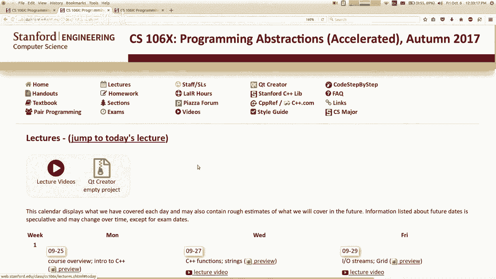

---

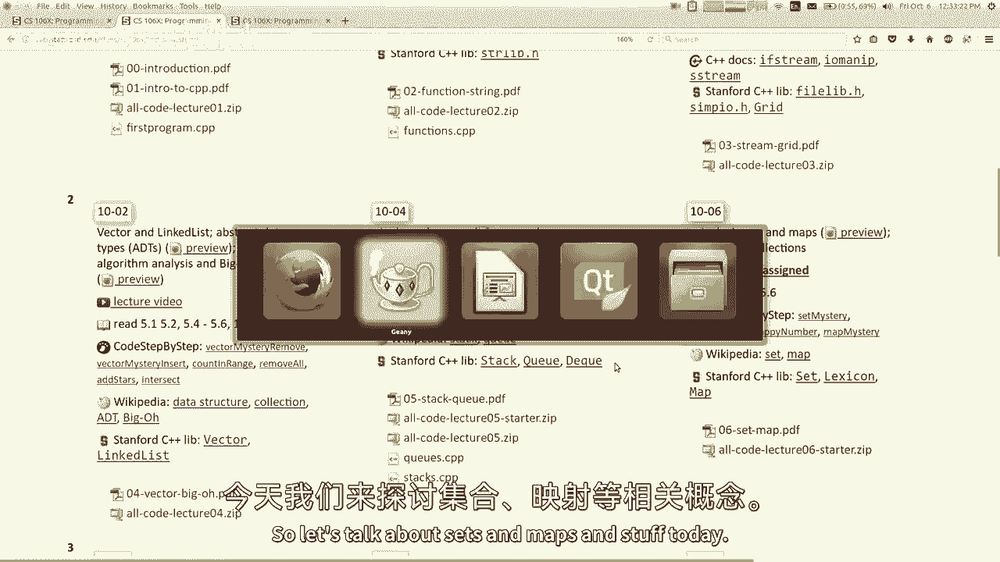

## 什么是集合？ 🤔

上一节我们介绍了向量和链表等线性集合。本节中我们来看看**集合**。


集合是一种存储**唯一值**的集合，其中**没有重复元素**。集合的设计通常围绕一小部分核心操作进行优化，这些操作是：
*   添加元素
*   删除元素
*   搜索元素或测试成员资格（即询问某个元素是否在集合中）

集合与向量或链表的一个关键区别是，它**放弃了索引和插入顺序的概念**。当你向集合中添加三个元素时，不应期望它们以任何特定顺序存储。我们通常认为集合是无序的。

### 集合的两种类型

在我们的库中，有两种C++集合实现，它们是同一抽象数据类型（ADT）的不同实现：
1.  **`Set`**：基于**二叉搜索树**构建，元素按排序顺序（如字母或数字顺序）存储。
2.  **`HashSet`**：基于**哈希表**（一种特殊数组）构建，元素的存储顺序不可预测，但通常速度稍快。

两者的核心方法（添加、删除、包含）都很快。`Set` 的方法通常具有 **O(log n)** 的运行时复杂度，而 `HashSet` 的方法通常具有 **O(1)** 的（平均）运行时复杂度。

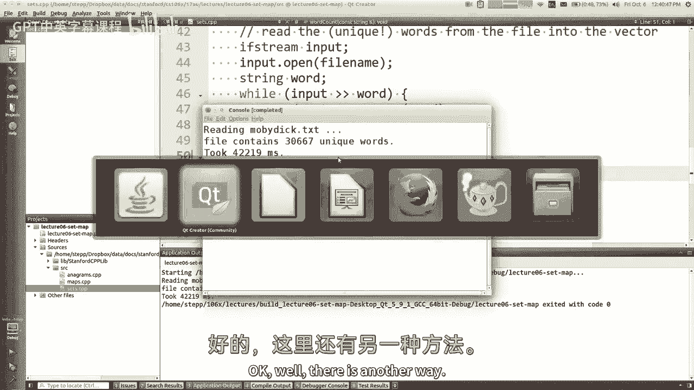


### 一个使用场景：统计唯一单词

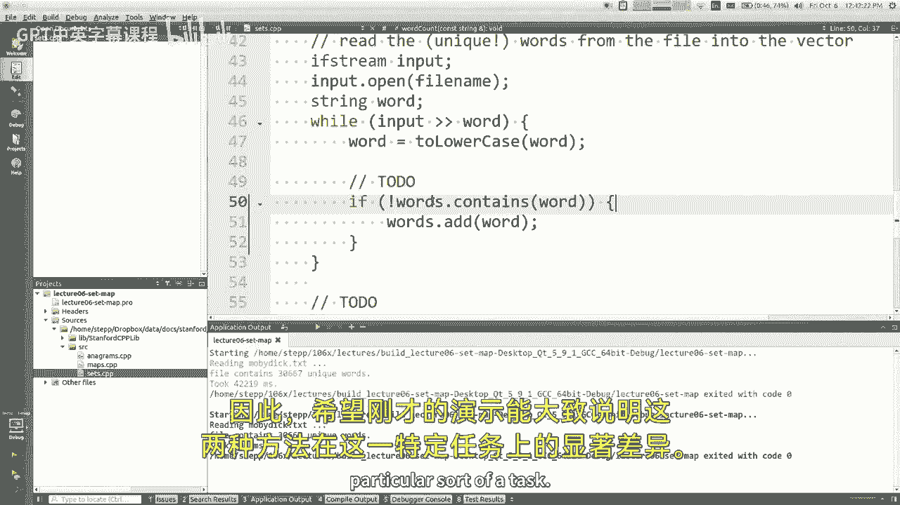

假设我们需要编写代码来计算一个大文本文件中**不同单词**的数量。如果一个单词（如“hello”）出现多次，它只应被计数一次。


以下是使用**向量**的解决方案（效率较低）：


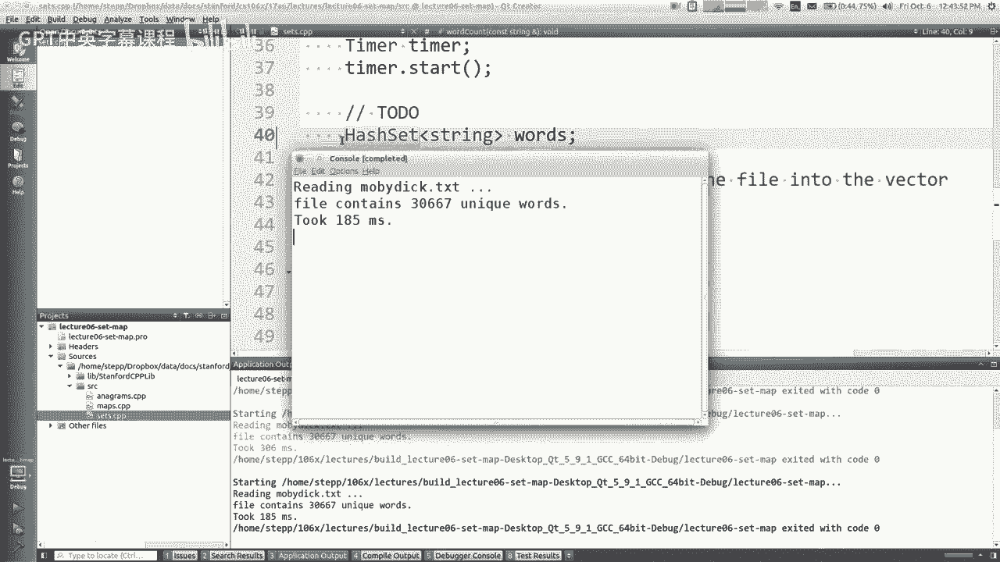

```cpp
int countUniqueWords(string filename) {
    ifstream input(filename);
    Vector<string> words;
    string word;
    while (input >> word) {
        // 需要检查单词是否已在向量中
        if (!vectorContains(words, word)) {
            words.add(word);
        }
    }
    return words.size();
}
// 辅助函数：线性搜索
bool vectorContains(Vector<string>& vec, string& target) {
    for (string elem : vec) {
        if (elem == target) return true;
    }
    return false;
}
```
**问题**：每次读取新单词，都需要调用 `vectorContains` 遍历整个向量。随着向量变大，搜索会越来越慢。处理一个3万词的文件可能耗时数秒。

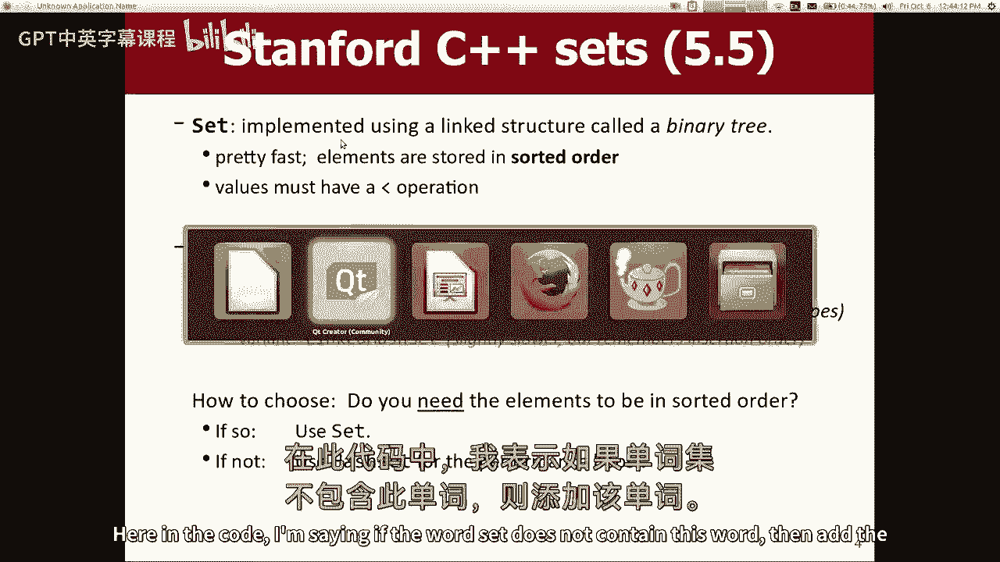

现在，让我们看看使用**集合**的解决方案：


```cpp
int countUniqueWords(string filename) {
    ifstream input(filename);
    Set<string> words; // 或者 HashSet<string>
    string word;
    while (input >> word) {
        word = toLowerCase(word);
        words.add(word); // 集合自动忽略重复项
    }
    return words.size();
}
```
**优势**：`words.add(word)` 和内部的成员检查非常高效。同样的任务，运行时间可能从数秒降至**几百毫秒**。这清晰地展示了集合对于需要快速成员检查任务的适用性。

---

## 关于结构的补充说明 ⚙️

在深入映射之前，我们先简要了解一个C++特性，它在你使用自定义类型作为集合元素时会很重要。

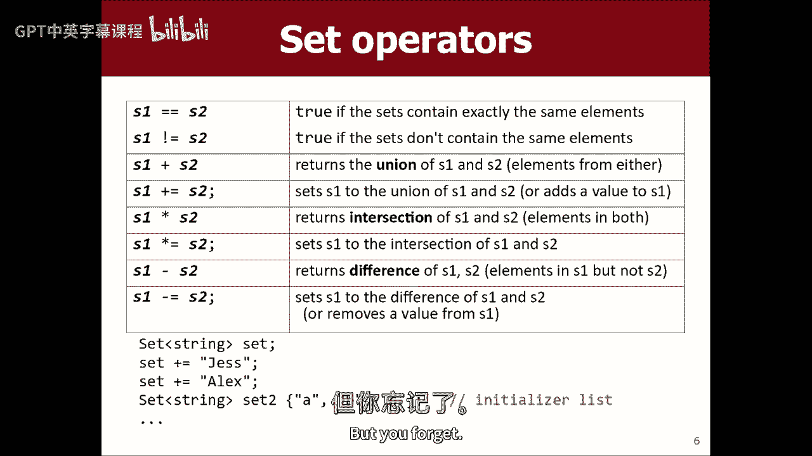

C++允许你使用 `struct` 创建新类型来组合数据。例如，可以创建一个 `Date` 类型：


```cpp
struct Date {
    int month;
    int day;
};
```

但是，如果你尝试将 `Date` 对象放入 `Set` 中，编译器会报错。这是因为 `Set`（基于排序）需要知道如何比较两个 `Date` 对象的大小以进行排序。

**解决方法**：你需要为你的结构**重载小于运算符 (`<`)**。

```cpp
bool operator <(const Date& d1, const Date& d2) {
    if (d1.month != d2.month) {
        return d1.month < d2.month;
    }
    return d1.day < d2.day;
}
```
定义了这个运算符后，`Set<Date>` 就能正常工作了。`HashSet` 则需要不同的处理方式（如哈希函数），我们将在后续课程中介绍。


---

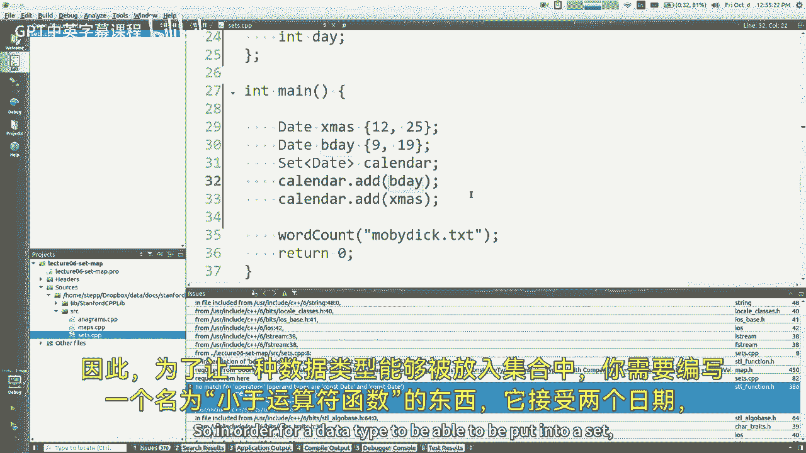

## 什么是映射？ 🗺️

集合用于存储和查找单个值。现在，我们来看看**映射**，它用于存储和查找**键值对（Key-Value Pairs）**。

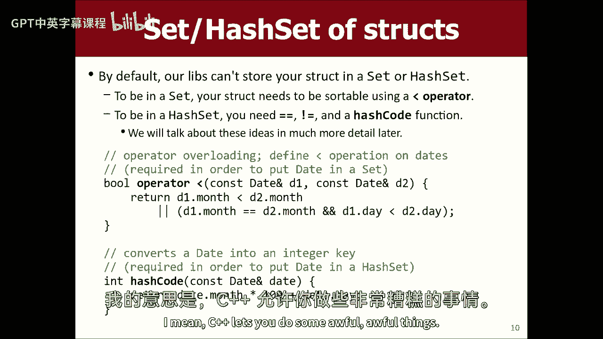

映射有时在其他语言中被称为字典（如Python）。你向映射中添加一个**键**及其关联的**值**。之后，你可以通过**键**来快速检索其对应的**值**。这是一个单向查找（由键找值）。

一个经典例子是电话簿：将姓名（键）映射到电话号码（值）。

### 映射的核心操作

以下是映射的核心操作：
*   **`put(key, value)`**：添加或更新键值对。如果键已存在，新值会覆盖旧值。
*   **`get(key)`**：获取与键关联的值。
*   **`containsKey(key)`**：检查映射是否包含某个键。
*   **`remove(key)`**：移除键及其关联值。

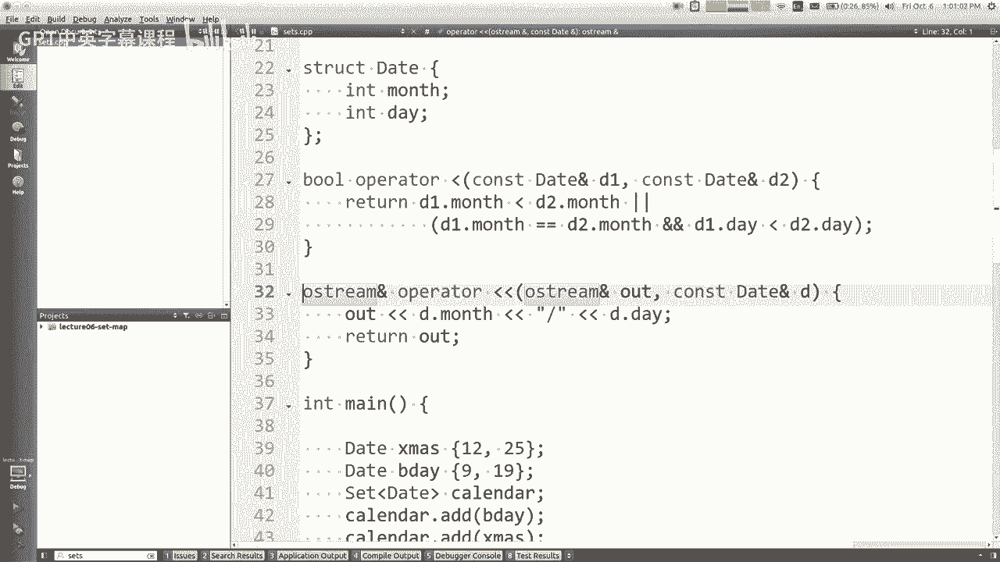


在我们的库中，同样有两种实现：
1.  **`Map`**：基于排序树实现，按键的顺序存储。
2.  **`HashMap`**：基于哈希表实现，顺序不可预测但速度更快。

### 映射的使用场景：词频统计

假设我们不仅想知道文件中有多少不同单词，还想知道每个单词出现的具体次数。

我们可以使用一个 **`Map<string, int>`** 来解决，其中键是单词，值是该单词出现的次数。

以下是解决方案：

```cpp
Map<string, int> wordCounts; // 或者 HashMap<string, int>
string word;
while (input >> word) {
    word = toLowerCase(word);
    // 如果单词不存在，get 返回该类型的默认值（int 为 0）
    int oldCount = wordCounts.get(word);
    wordCounts.put(word, oldCount + 1);
}
```
我们的库提供了一个更简洁的语法，使用方括号 `[]`：

```cpp
Map<string, int> wordCounts;
string word;
while (input >> word) {
    word = toLowerCase(word);
    wordCounts[word]++; // 等价于 wordCounts.put(word, wordCounts.get(word) + 1);
}
```
程序完成后，你可以查询任何单词的出现次数：`cout << wordCounts[“the”] << endl;`。

### 另一个例子：查找变位词

变位词是指字母重新排列后能形成另一个单词，如 “listen” 和 “silent”。

**问题**：给定一个词典文件，如何快速找出一个单词的所有变位词？

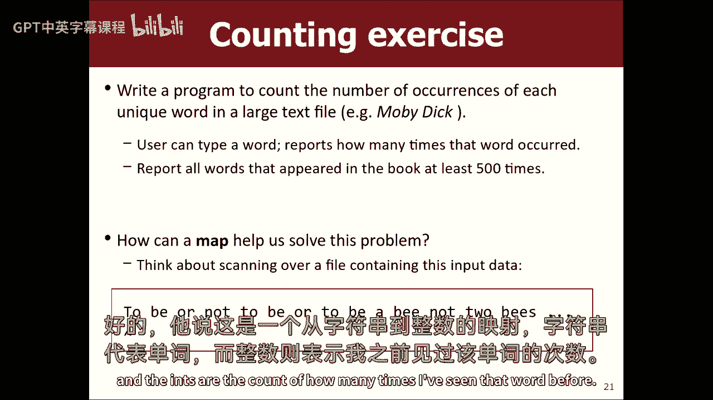

**思路**：如果两个单词是变位词，那么它们**字母排序后的字符串是相同的**（如 “listen” 和 “silent” 排序后都是 “eilnst”）。

我们可以利用映射：
*   **键**：单词字母排序后的字符串（规范形式）。
*   **值**：具有相同规范形式的所有原始单词的**集合**。

以下是构建变位词映射的代码框架：

```cpp
Map<string, Set<string>> anagramMap; // 键：排序后的字符串，值：变位词集合
// 假设有一个函数 string sortLetters(string word) 返回字母排序后的单词

while (从词典读取单词 w) {
    string sorted = sortLetters(w);
    anagramMap[sorted].add(w); // 将单词添加到对应集合中
}
```
之后，要查找某个单词的所有变位词，只需：
1.  对该单词的字母进行排序，得到键。
2.  在 `anagramMap` 中查找该键对应的集合。

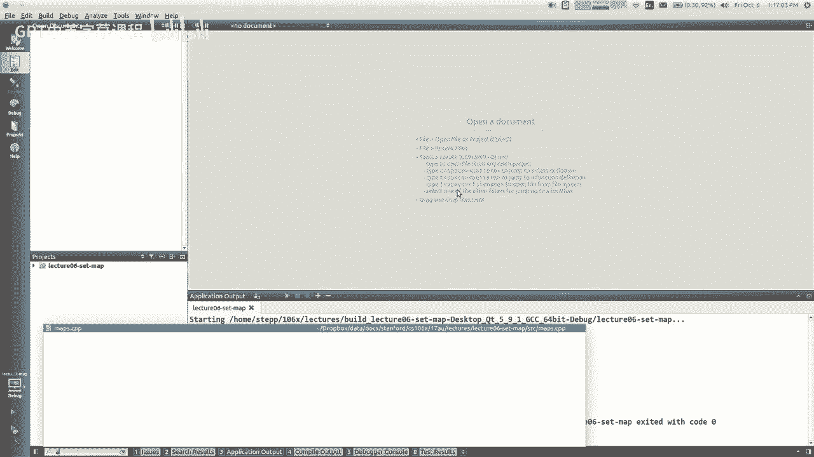

---

## 总结 📚


本节课中我们一起学习了：
1.  **集合（Set）**：一种存储**唯一元素**的无序集合，支持高效的添加、删除和成员检查操作。有 `Set`（有序）和 `HashSet`（无序，通常更快）两种实现。
2.  **映射（Map）**：一种存储**键值对**的集合，允许通过键快速检索对应的值。它是解决计数、关联查找等问题的强大工具。同样有 `Map` 和 `HashMap` 两种实现。
3.  **关键区别**：当你只需要知道“是否存在”时使用集合；当你需要关联“某个键对应什么值”时使用映射。
4.  **性能**：这些数据结构之所以有用，是因为它们为特定操作（如查找）提供了比向量或链表更高效的实现。


理解并熟练运用集合和映射，将极大地提升你解决复杂编程问题的能力。