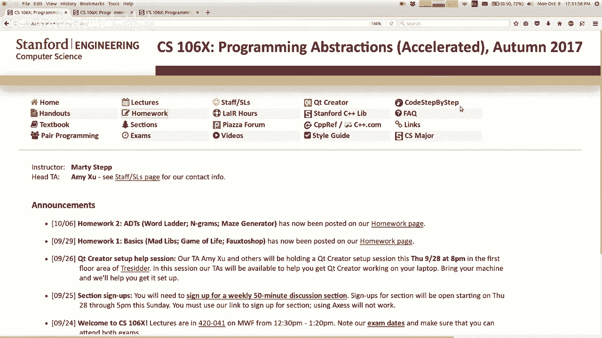
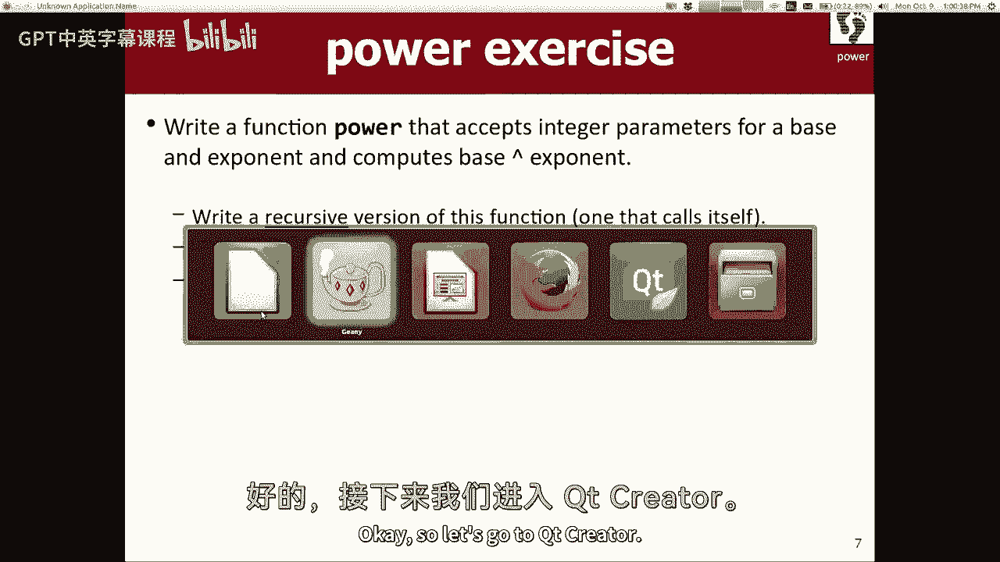
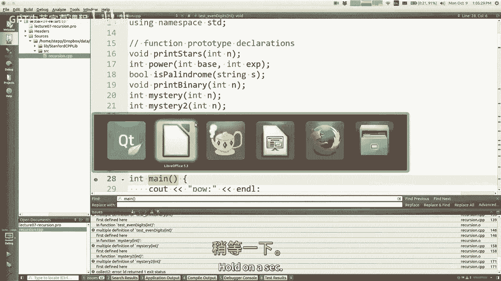
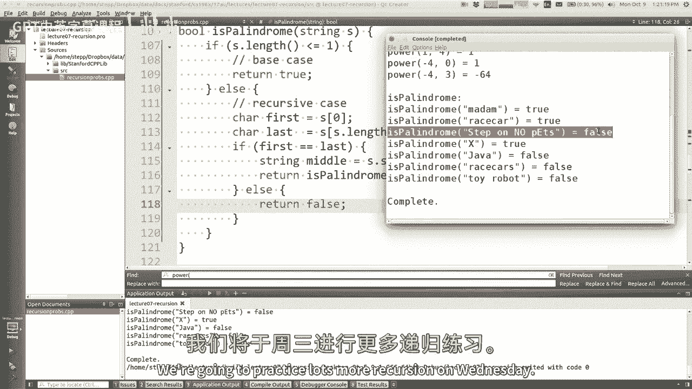

# 编程抽象方法 CS106X 2017 - 课程07：递归 🌀



在本节课中，我们将要学习一个名为“递归”的新主题。递归是一种编程抽象方法，它允许函数调用自身来解决问题。我们将从基础概念开始，通过多个例子来理解递归的工作原理、结构以及如何应用它来解决特定类型的问题。

---


## 什么是递归？

递归是一种计算过程，它在定义自身时引用了自身。换句话说，递归函数通过调用自身来解决更小版本的同一问题。

一个常见的现实世界例子是查字典：为了理解一个词的定义，你可能需要查找定义中不理解的词，而“查找”这个过程本身又包含了“查找”这个动作。

在编程中，递归不仅仅是循环的替代品。它是一种识别问题“自我相似”性质的思维方式：要解决一个大问题，可以先解决一个相同但规模更小的问题。

---

## 递归的基本结构

上一节我们介绍了递归的概念，本节中我们来看看递归函数通常如何组织。

一个典型的递归函数包含两个部分：
1.  **基本情况**：这是问题最简单、可以直接解决而无需进一步递归的版本。
2.  **递归情况**：这是更复杂的版本，函数通过调用自身来解决一个规模更小的子问题，并利用其结果来构建最终答案。

以下是递归函数的一个通用模板：
```cpp
ReturnType function(parameters) {
    if (/* 满足基本情况的条件 */) {
        // 直接返回结果
        return baseCaseValue;
    } else {
        // 将问题分解，进行递归调用
        return combine(parameters, function(smallerParameters));
    }
}
```

---

## 递归示例：阶乘


让我们通过一个经典的例子——计算阶乘——来具体理解递归。阶乘的数学定义是：`n! = n * (n-1) * ... * 1`，并且规定 `0! = 1`。

### 迭代版本（使用循环）
首先，我们看看通常用循环（迭代）如何实现：
```cpp
int factorialIterative(int n) {
    int result = 1;
    for (int i = 1; i <= n; i++) {
        result *= i;
    }
    return result;
}
```

### 递归版本
现在，我们思考如何用递归实现。我们注意到阶乘的自我相似性：`n! = n * (n-1)!`。这直接引导我们写出递归代码。

以下是递归版本的实现：
```cpp
int factorialRecursive(int n) {
    // 基本情况：0! 或 1! 都等于 1
    if (n <= 1) {
        return 1;
    }
    // 递归情况：n! = n * (n-1)!
    else {
        return n * factorialRecursive(n - 1);
    }
}
```
**代码解析**：
*   当 `n` 为 0 或 1 时，函数直接返回 1（基本情况）。
*   对于更大的 `n`，函数返回 `n` 乘以 `(n-1)` 的阶乘。计算 `(n-1)!` 的任务通过调用函数自身来完成（递归情况）。

**执行流程**（以 `factorialRecursive(4)` 为例）：
1.  `factorialRecursive(4)` 调用 `factorialRecursive(3)`。
2.  `factorialRecursive(3)` 调用 `factorialRecursive(2)`。
3.  `factorialRecursive(2)` 调用 `factorialRecursive(1)`。
4.  `factorialRecursive(1)` 满足基本情况，返回 `1`。
5.  `factorialRecursive(2)` 收到 `1`，计算 `2 * 1 = 2` 并返回。
6.  `factorialRecursive(3)` 收到 `2`，计算 `3 * 2 = 6` 并返回。
7.  `factorialRecursive(4)` 收到 `6`，计算 `4 * 6 = 24` 并作为最终结果返回。

---

## 递归的思考方式：分治与合作

理解递归的一种有效方式是将其视为一种“分治”或“合作”策略。每个递归调用只处理整个问题的一小部分，然后将剩余工作委托给另一个“工人”（即另一个函数调用），所有“工人”都遵循相同的算法。

**比喻**：将一碗 M&M 豆的数量翻倍，但不能数数。
*   **算法**：每个“工人”从碗中取出一颗豆，然后请其他“工人”将剩下的豆子数量翻倍。等碗传回来后，这个“工人”再放入一颗新豆。
*   **自我相似性**：“将一碗豆子翻倍”的任务，包含了“将少了一颗豆的碗翻倍”这个更小的相同任务。
*   **基本情况**：如果碗是空的，直接传回空碗。

---

## 递归示例：计算幂



上一节我们通过阶乘熟悉了递归结构，本节中我们来看看另一个数学运算：计算幂（`base^exponent`）。

我们注意到幂运算的自我相似性：`base^exponent = base * base^(exponent-1)`。

以下是递归实现：
```cpp
int power(int base, int exponent) {
    // 处理非法输入（指数为负）
    if (exponent < 0) {
        throw exponent; // 抛出异常，表示调用错误
    }
    // 基本情况：任何数的0次幂都是1
    if (exponent == 0) {
        return 1;
    }
    // 递归情况：base^exponent = base * base^(exponent-1)
    return base * power(base, exponent - 1);
}
```
**注意**：我们添加了对非法输入（负指数）的检查。在递归函数中验证先决条件并抛出异常是一种良好实践。

**优化思路**：上述实现需要进行 `exponent` 次递归调用。我们可以利用 `base^exponent = (base^(exponent/2))^2` 这一性质（当 `exponent` 为偶数时）来减少递归深度，将时间复杂度从 O(n) 优化到 O(log n)。




---

## 递归示例：判断回文

现在，我们来看一个非数值的例子：判断一个字符串是否是回文（正读反读都一样）。这展示了递归如何应用于数据结构（如字符串）。

**递归思路**：
1.  检查字符串的首尾字符是否相同。
2.  如果相同，则问题转化为判断“去掉首尾字符后的子字符串”是否是回文。
3.  重复此过程。

以下是实现代码：
```cpp
bool isPalindrome(string s) {
    // 基本情况：长度为0或1的字符串必然是回文
    if (s.length() <= 1) {
        return true;
    }
    // 获取首尾字符
    char first = s[0];
    char last = s[s.length() - 1];
    // 如果首尾字符不同，肯定不是回文
    if (first != last) {
        return false;
    }
    // 递归情况：检查去掉首尾后的中间部分
    string middle = s.substr(1, s.length() - 2);
    return isPalindrome(middle);
}
```
**代码解析**：
*   基本情况是字符串长度小于等于1。
*   递归情况是：如果首尾字符相等，则递归判断中间部分。`substr(1, s.length() - 2)` 用于获取从索引1开始、长度为 `总长-2` 的子串。

---


## 关于递归的注意事项与常见问题

在编写递归函数时，需要注意以下几点：

以下是初学者常遇到的问题：
*   **忘记返回递归调用的结果**：递归调用会返回一个值，必须用 `return` 语句将这个值传递回上层调用者。
*   **缺少或错误的基本情况**：这可能导致无限递归，最终引发“栈溢出”错误。
*   **递归深度过大**：对于某些语言（如C++），非常深的递归调用可能消耗大量栈内存，导致程序崩溃。对于此类问题，迭代解法可能更安全。
*   **不必要的额外情况**：例如在阶乘函数中，`n == 1` 的情况可以被 `n <= 1` 的基本情况涵盖。

递归并不总是最优解（例如在计算阶乘或简单幂运算时，循环可能更高效），但它对于解决某些**本质上是递归**的问题（如遍历树形结构、解决汉诺塔、生成排列组合等）非常强大和优雅。

---


## 总结 🎯

本节课中我们一起学习了递归的核心概念。我们了解到递归是一种通过函数调用自身来解决问题的方法，其关键在于识别问题的“自我相似”性，并定义好**基本情况**和**递归情况**。

我们通过**阶乘**、**幂运算**和**回文判断**三个例子，实践了如何将递归思维转化为代码。记住，编写递归函数时，要确保每个递归调用都朝向基本情况前进，并且要妥善处理非法输入。



递归是一个需要练习才能熟练掌握的工具。起初它可能显得有些抽象和棘手，但随着实践，你会逐渐发现它对于分解复杂问题的强大之处。在接下来的课程中，我们将继续探索更多递归的应用场景。