# 【编程抽象方法 cs106x 2017】斯坦福—中英字幕 - P8：Lecture 08 - Recursion 2 - 加加zero - BV1By411h75g

好啦，人，让我们挖掘你好，很高兴见到你，天气不错，我们周围的世界都在燃烧，太棒了，这是真正的梅瓦什么的，我不知道所以，让我们试着不要去想不好的事情，让我们学点c+um，我们今天要继续递归，整个星期。

这是递归周，你想听一个非常糟糕的递归吗，乔，是呀，是呀，好啦，开始了，敲门，敲门，敲门，敲门，是啊，是啊，是啊，是啊，这就像我很抱歉一样好，我会说我写了一本书，Java教科书，斯坦福大学不使用它。

那是我过去在华盛顿大学工作的地方，在我们的书里，你知道的，我们讨论了递归，在书末尾的索引中，我们放了一个条目，上面写着，递归，逗号，无限，是啊，是啊，这就是为什么这本书习惯了，是呀，慢拍手，谢谢你。

那是适当的反应，我们必须喜欢，为得到笑话而战，索引器，就像他们有一个做索引的人，她就像，不明白我们为什么要把这个放进去，我们就像这是个笑话，真好笑，她就像，它不去页码，我们就像，我们知道。

我们知道这是个笑话，她就像，但当它说c时，它就会自己，我觉得这是个笑话，是啊，是啊，真的很好笑，真的很好笑，你知道她是个出版商，她不是计算机科学家，最后她说，好啦，不管她怎么说，嗯，是啊，是啊，好啦。

所以我们要做更多的递归，你看，我是说，主要是今天，我只想多练练，事实上，本周的部分也将是这样，你只需要练习大量的递归，所以讲座的主题是我们，研究一些不同的问题，看看我们是否能解决它们。

因为我认为这就是你学习递归的方式，你必须练习，当然啦，就像我说的，上次我鼓励大家去练习，可爱的创造者或一步步编码，或者任何你能擅长的方法，实际上去写递归代码，你就是这样好起来的，你就是这样得到它的。

如果你还没有感觉到你这么快就得到了，总结一下什么是递归函数，是那个自称正确的人，好啦，所以如果你试图解决一个递归问题，你想写一个递归函数，你可能需要考虑的事情是什么，有哪些概念可能对思考任何想法都有用。

任何一般提示，你说的话，基本情况问题的某种基本版本，一些你知道解决方法的问题，或者有非常简单的方法来确定是，谢谢你，他说，基本情况，所以你知道，试着想一个非常简单的问题，那很容易解决。

您甚至不需要使用任何递归来解决，你只要回一个答案，打印并回答，或者别的什么，好好想想，你可以从那个案子开始，也可以不开始，但我不知道为什么我今天一直有系统错误，但是是的，这是每个递归函数的重要部分。

它必须在某个时候停止，基本情况是什么让它停止，所以想想基本情况或情况可能是什么，是呀，你还有什么要补充的吗，是呀，这个问题是怎么解决的？自相似，是啊，是啊，谢谢你，嗯，我真的很喜欢这个框架。

如果你知道我喜欢怎么想，如果我能让其他人帮我解决大部分问题，但我得自己解决一点问题，我怎么能重新安排呢，这也是同样的想法，就是，这个问题是怎么解决的？类似于同一问题的稍微小一点的版本或稍微不同的版本。

好极了，好啦，所以我们就玩吧，我们再练习一下，我们写了一个幂函数，我们写了一个阶乘函数，一些类似的事情。

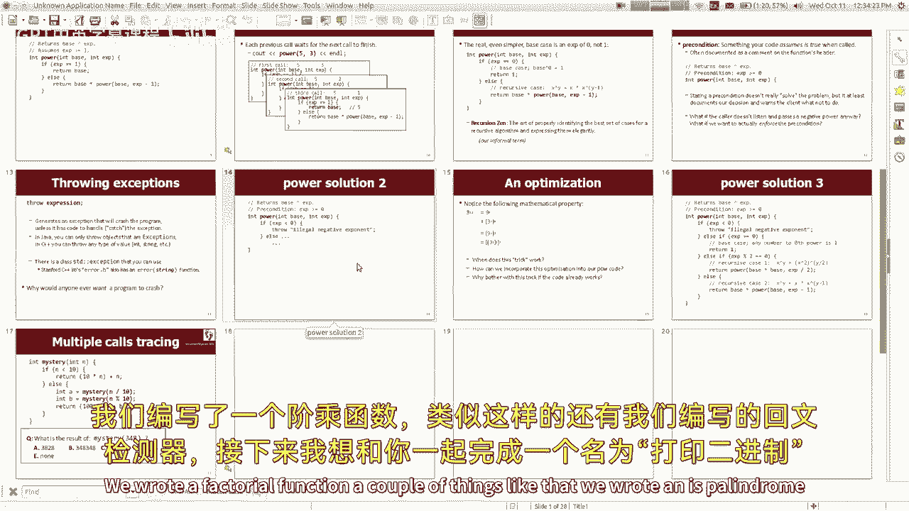

我们写了一个回文查找器，我想和你一起做这个叫做打印二进制。

所以除了以十为基数的整数参数，我想让你用，喜欢控制台看看怎么不回来，但是打印二进制基数，该数字的两个表示，你们知道，二进制，就像所有东西都是零或一一样，二进制数字每一位是2的次方。

而不是每个数字都是十的次方，你知道这种事，所以如果你想弄清楚，数字四的二进制版本，那是三二加八分之一，加2等于4 2，所以这就是你做二进制数的方法，对呀，好啦，所以我想，我想现在把它打印出来。

我不想作弊或调用一些为我做转换的库函数，我也不想用任何循环，我也希望在不将数字转换为字符串的情况下这样做，我想有些人喜欢把整数转换成字符串，这样他们就可以在数字上循环什么的，我想如果我们想在数字上循环。

我想做他们没有任何条件，参与其中，你是怎么做好这件事的，你们刚刚给了我一些很好的建议，我想我想回到那个建议，你告诉我，我应该考虑基本情况的权利，所以我不知道，如果我能想出一个一般的方法把这个变成那个。

但是有没有什么数字更容易用二进制打印出来，你说呢，摇晃是的，不到一个不到好，一位数二进制数，零或一似乎很容易对吧。

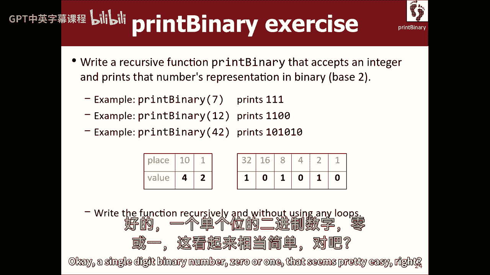

好啦，嗯，我们去试试，我这里也有一个可爱的造物主，这是一步一步来的，如果你也想的话，所以我要取消注释，这些是我的测试用例，测试用例在这里调用print二进制，所以好吧，等等呃，等等不不，那不在这里。

没关系的，所以我们可以假设这是一个非负数，我们正在打印出来，所以你告诉我如果是很小的数目，所以如果n小于等于1，然后我就可以做c out n，因为十进制是一样的，这是最难的部分，好啦，基本情况。

你知道的，递归可能真的很棘手，也挺有趣的，因为感觉就像你在作弊，好像我只需要做简单的部分，我得打印一个或零什么的，那并不难做好，好啦，但如果不是这样呢，所以这将是递归的情况，这意味着n至少是2。

那就更难了，你又给了我一个好建议，你说过，试着看看问题是如何自相似的，所以好吧，我喜欢这个提示，我想这可能是个有用的提示，所以如果我要打印4 2，我不知道那会变成什么，我是说，我知道因为我看了幻灯片。

但我一般不知道，嗯，我的电话能帮上忙吗，做，我知道四二的二进制版本是什么，还是不做，我是说，即使我不知道它到底有多少位数字，或者这些数字会是多少，我能说些什么吗，仅仅从看数字42，是呀，即使是零。

是偶数，所以二进制表示以零结束，那是个好主意，嗯哼，好啦，嗯，如果我告诉你打印二进制4 2，那将是一个零，一零，一零，所以你只是你只是告诉我你能想出正确的那部分，但这是最难的部分，这是什么？

二的幂就像二的幂一样，那么这个数字是多少，这个二进制数就是21的二进制数，所以我不知道怎么打印四二的二进制，但如果有人能帮我打印二进制的2-1，如果有比我更聪明的人能做到，我可以做这部分。

我得到了这个部分就在这里，这就像，你知道你曾经喜欢帮你的妈妈或爸爸打扫卫生，你知道，他们做了所有的工作，你喜欢捡起一些东西扔进垃圾桶，你就像在那里，今天我们都帮了忙，那是我的贡献，我把这个零印在这里。

好啦，所以让我们按照你说的去做，你说它以零结束，或者以2结束，这是偶数，这样我就可以打印一个零，所以也许我可以做的是，像int最后一个数字等于，最后一位数字是，你知道吗，你可能也在看那个。

就像N mod 10，但那不太对，我想我们真正想要的是四二的最后一个二进制数字对吧，余数是偶数还是奇数，是二的余数，然后，是n除以2右，不除以十，因为只有四个人，所以这将是零，这将是二一对。

如果我说打印其他数字的二进制呢，两个一个部分，然后在那之后，如果递归调用做了我想做的事情，如果它把这个打印出来，然后我就可以看到最后一个数字，如果最后一个数字是零，则对，我要印一个零，如果最后一位是1。

我要印一张，嗯，也许五百块没用，其余的数字都起作用了，我们基本上做到了，我们解决了，嗯，所以我们很棒，是呀，我为我们感到骄傲，所以我们没有处理负数，然而，我怎么能把它贴在这里，我们是否假设负数，是啊。

是啊，我想我想对不起，我没有很清楚地说明我想要什么，所以这里我写了n大于零，如果我把它扔掉呢，如果我做例子呢，二进制负数，四十三张印刷品，否定那里，所以怎么样，嗯，所以我的意思是。

基本上我们只需要添加另一个基本情况，如果n小于零，看到减号，打印负n右二进制，只要打印一个减号，然后做剩下的，然后在这里我想我会说别的，如果是这样，这是一个基本情况。

或者我猜这个递归案例实际上是递归案例，负数，随便啦，好啦，所以现在我认为我们应该正确处理负数，是呀，我们有我想我的意思是我没有仔细检查，但这似乎是对的，嗯看起来不错，有一件事我想指出。

就像一个微妙的小事是看你怎么说打印二进制其他数字，然后你说看到最后一个数字，说打印最后一位数字的二进制文件也是正确的，那些是等价的，因为如果我在0或1上调用打印二进制，就会变成这样，把数字打印出来。

我们以前也是这样，所以你可能会说，为什么要改，你让代码做得更好，我改变它的原因只是对我来说，自相似性是四二的二进制是二一的印刷二进制，后面是最后一位数字的打印二进制，所以对我来说这更像z。

因为它更像自我，但另一种方法效果很好，只是想指出，所以这是打印二进制，关于那个代码有什么问题吗，是呀，我们还使用日志函数，那个垫子，哦，像原木一样的原木底座2，是啊，是啊。

我是说我在这里看到的学生所做的，有时他们试图从左到右，我实际上是从右到左，从右到右，我在切掉最后一个数字，这很容易做到，使用div和mod，我想另一条路是你试着喜欢原木，用力量看看有多大的力量。

你需要一直向左走吗？你先试着打印左边的，我是说你可以这样做，但我只是觉得这是一个漂亮的递归解决方案，我想我认为认识到自我相似性，你知道两种方式，我想我宁愿用语言容易做的方式来处理它，我没必要叫数学点。

日志或电源或任何解决这个问题的东西，很多数字处理问题都有这个属性，哪里，这并不重要，无论从左到右还是从右到左，语言使从右到左更容易，所以我们就这么做吧，好啦，所以这是打印二进制。

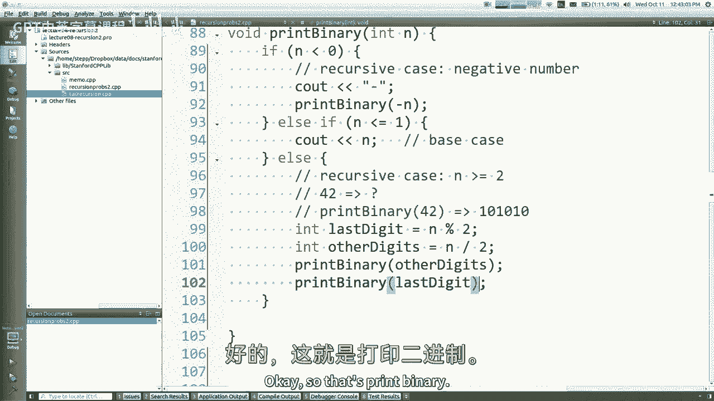

我想和你们再做一个，我想这意味着我要跳到我的下一个幻灯片上，我再确认一下，我想那是真的，是呀，好啦，所以让我打开今天的幻灯片，我今天会试着用不同的方法，数据可以是递归的。

你可以在递归代码上做一些很酷的优化，但又一次，就像我说的，我们只是要练习很多例子，所以说，让我们处理一个文件，写一个叫做反向行的递归函数，你传入一个读数很大的输入流，如果流实际上，但是嗯。

传入一个输入文件流作为引用，如果这些就是，我想把它们按相反的顺序打印出来，我想递归地做，我想在没有收藏的情况下做，因为你可以把所有的线读成一个向量，然后在向量上循环什么的，我想找到一种使用递归的方法。

做倒车，而不是使用集合来做相反的事情，所以我看到你的手，我马上打电话。

嗯，所以如果我回到我的档案，我想写一个文件，一个叫做反向线的函数，你们在这节课开始时给了我很好的建议，我很想听你的忠告，你说过，我应该考虑基本情况，对呀，什么是一个简单的文件来反转，一条龙，是啊，是啊。

我同意你，我比你看起来更懒，虽然，有一个空文件比一行文件更容易反转，你还是对的，这两个文件都很容易向右反转，但我想指出，一个空文件会更少的工作，你让我做的微不足道的工作，垃圾怎么倒，没有这样的。

所以我不干了，我做到了，你知道对，所以空文件现在很容易做到，我要说一件有点复杂的事，没有命令让这个问它，窥视前方，看看是否有一条线，或者不看它是不是空的，你所能做的就是，你可以试着读一行，它要么成功。

要么失败，就像到了，你知道是否有一条线，你已经读过这一行了，如果有一个需要理解，所以你不好好读书就不能问，没关系，我的意思是，如果你想读一行，你说从输入中得到行，你传递一根绳子就像，你知道的，弦线。

然后你说，右行，这是从文件中读取一行的命令，我怎么知道是否有一条线，或者如果有，如果文件是空的，或者什么，我怎么知道是，把它放在一个，如果是的话，如果get行返回true，然后有一行输入要读取。

否则就没有，所以这两个案子，好吧，现在这个问题很难，所以我想也许我能帮你们一点忙，所以我所做的，你知道我是个很有同情心的人，很好的老师，所以嗯，我想也许这个太棘手了，所以我只是想。

只要给你解决这个问题的办法，所以我在上课前写了一个函数，因为我不确定你们能不能处理好这个问题，老实说，我做了一些你的家庭作业，不仅仅是，否，你们真聪明，但是我写了这个函数，如果你在输入流中通过我。

我把文件倒过来给你打印，因为我不确定我们是否能处理好这个问题，但我会说，嗯，我觉得有点内疚，调用此函数，所以也许我们可以在函数中做一点工作，然后我们可以骗剩下的什么的，所以也许在这里我可以做。

你知道我已经读过这一行了，所以我在这里有一条线，如果我有反转文件的作弊功能，我可以用那个，我可以说作弊，我可以把输入，所以这将打印成，你知道的，所以我在这里读了这一行，玫瑰是红色的。

作弊功能将读取其他行并向后打印，所以它会打印这个，然后这个，然后这个，所以这里的作弊调用要做最后三件事，所以我只需要把我的台词打印出来，所以现在呢，就在这里，我说，看到线尾了吗，酷，嗯，如果没有任何线。

嗯，我想你什么都不用做，如果没有对的线条，所以也许只是个空房子，挺有意思的，因为通常我们有一个基本情况和一个递归情况，先写出基本情况，所以我想如果你想这么想的话，你可以说像，如果我找不到一条线。

这是基本情况，没有台词，如果没有台词，我们做什么都不对，否则，如果我没有得到一条线，递归案例，倒转文件或任何权利，所以如果你想有更标准的顺序，你们可能已经习惯了，好啦，让我们试一试，啊。

我必须取消对测试用例的注释，倒车线在哪里，那里，好啦，那么我们的，我们在这里，是呀，好啦，让我们做吧，所以运行它和嘿，它打印，玫瑰是红色的，紫罗兰是蓝色的，我所有的棒球，所以它起作用了。

但我是说这有点不令人满意，对呀，因为我们又作弊了，因为我不确定你们能不能处理好这个问题，我已经写好了，让我来解释一下我是如何编写这个函数的，哦哦该死，我刚刚调用了你的函数，力量一直在我们体内。

所以我的意思是这不是欺骗法，这是逆行，对吧，比如如何反转文件，类似于反转文件，嗯，如果我有一个神奇的功能可以逆转文件的其余部分，然后我称之为，然后做完之后，我可以打印文件末尾的第一行。

然后我就完成了所有的工作，神奇的功能就是我们的功能，我们正在编写的递归函数，嗯，我的意思是，你知道你也许你看到了我的愚蠢的笑话来了，但这是一种思维过程，你说得很好。

如果我有一个神奇的功能可以为我解决这个问题就好了，但是无论是谁写了这个神奇的功能，坚持让我做一点工作，然后他们会为我做剩下的，你知道，就像我能做的一点点，然后把剩下的交给这个神奇的更聪明的功能，嗯。

通常就是这样，你想在那里调用你自己的递归函数，所以不管怎样，你现在去吧，我们在这件事上什么都不做，把一个空的，如果我用这些评论猜，它有助于提高可读性，但我想我更愿意这样说，我宁愿说，如果GET线路成功。

然后我们有一个递归的情况，然后在这里，我会去L空间案例，没有台词什么都不像，我宁愿，我宁愿这里没有空房，因为它看起来很糟糕，但我想让你明白，就像递归的基本情况可能是隐式的，此代码没有显式地包含块，是啊。

是啊，当我们写我们自己的，类似作业的类似递归函数，你想让我们根据其他情况发表评论吗，没有台词，我喜欢这样的评论，我是说标题评论，当然要描述函数的作用，但我喜欢学生向我描述，这些不同的情况是什么。

为什么我在这里，这是什么意思，你知道的，我需要反转整个文件的其余部分并打印我的行，我喜欢这种评论，我认为这是一个很好的延伸，好吧关于那个的问题，所以我想知道，啊，在文件中获取行布尔值和调用EEF值，嗯。

EEF是在你读完之后，所以我的意思是，我想我可以在屏幕上说EF那就没问题了，我是说如果不对的人，所以欧菲会是真的，输入精灵将是真的，如果你上一次尝试阅读，如果你在文件的末尾，它就失败了。

我的意思是你也可以用eef编写这个代码，但不管怎样，你最终都需要得到一条线，或者试着得到一条线，所以我认为这是最简洁的表达方式，所以不管怎样，我大多避免EEF电话。

因为我认为在文件上循环更好的方法是调用getline，直到失败，我见过很多带有微妙bug的代码，这些bug称为eem，因为问题是，如果你叫一个读，它不会说Eef，直到你做了一条线，阅读失败。

所以你可以从一个，因为那个，反正。

关于这件事，我想指出一件事，递归实际上是一种很好的方法，因为我们学过数据结构，称为堆栈，上周的收藏，堆栈，我们了解到你可以把一堆东西清空成另一个东西，它会逆转它，递归函数的调用堆栈与，当这些电话回来时。

这就像一个堆栈的展开，数据结构，他们同名不是巧合，如果您试图想象不同的函数调用，这里有一个小图，所以我知道，如果你在下面看不懂，但那是输入文件，我们在看文件的开头，我们说，好啦，第一次呼叫开始。

让我们做如果得到线，上面写着玫瑰是红线，然后它进行递归调用，所以在输入文件中，它前进到第二行，然后我们打第二个电话，所以在第二行，蓝色的暴力，它推进了文件阅读器，然后我们打第三个电话。

现在我们读了我所有的基础，这是我们前进的第三行，我们要打第四个电话，现在我们读R属于你读第四行，现在我们击中了EO，现在EF将返回真，如果我们再叫一次，我们打第五个电话，第五次调用无法成功读取一行。

所以if语句不输入，所以第五个电话马上退出，第四个调用说我完成了递归调用，所以现在我将打印我的行，所以我属于你的台词出现在控制台上，现在呢，第四个电话回来了，它回到这里，他在等那个，所以现在他把他的线。

在我的基地里，他回到这里，他带着他的线，通孔是蓝色的，我不知道为什么它在闪烁，是linux什么的，但无论如何他回到这里，他印玫瑰是红色的，所以你得想想这些，就像小长方形堆栈，当你进行这些函数调用时。

事情会堆积起来，好啦，重要的是要记住，就像每一个电话，你知道它们堆积起来，每个都有自己的局部变量副本，一件微妙的事情，但也许你们只是想当然，是你知道，通常当您进行递归调用时，传递递归调用。

传递不同的参数n减一，把n除以2，打印二进制，无论什么权利，通常您传递的参数会缩小，在本例中，我们将相同的文件作为参数传递，参数相同右，但当然它也在缩小，因为留给读取的数据量正在减少。

所以当你通过引用传递某物时，所有的调用都共享相同的值，与每个调用都有该值的副本相反，所以如果这个调用读到一行，然后其他调用也将有更少的行留给他们阅读，这就是在这种情况下对参数的修改，好啦。

所以那是相反的线，让我们再做一个倒立的脸，随便啦，让我们写一个叫爬，你给一个文件名或目录名或其他什么，你用压痕打印它的内容，所以如果它只是一个文件，我说爬，你知道的，演讲幻灯片，点PPT。

你只要把文件的名字打印出来，但如果是一个目录，它将打印目录的名称，然后它会打印目录中的所有文件，当然啦，目录中可能有目录，里面可能有目录，里面可能有目录，所以有一种类似于这个的嵌套自结构，对呀。

所以我希望它的层次像这样缩进，其中每个子目录缩进四个空格，我觉得缩进的部分有点难，所以我想做最后一个，让我们写一个没有压痕的，所以好吧，现在要做到这一点，你可能会说很好，我不知道如何用C++做目录。

但我提前想到了，所以我给你写了张幻灯片，如果使用，您可以询问某物是目录还是文件，您可以列出目录的内容，这里有一堆不同的方法，我认为会是，会有用的，对呀，好啦，所以从概念的角度来看。

你认为这个函数的基本情况是什么，抓取一个普通文件有什么容易的，你要说，是啊，是啊，好啦，所以一个普通的文件。

好啦，我们走吧，我们去玩吧，我们去试试，所以我在这里爬行，所以我已经包括了上面的文件库，所以如果它是一个普通的文件，哦不，也许我没有包括文件库，没有，我没有，好啦，所以让我们做文件，好啦，如果是个文件。

那就把它打印出来，查看和文件名，我会找到所做的一切，好吧不然，所以实际上，那是你的基本情况，普通文件，然后我猜一个递归的情况，这是一个目录，嗯，如果是目录，我应该打印目录的所有内容。

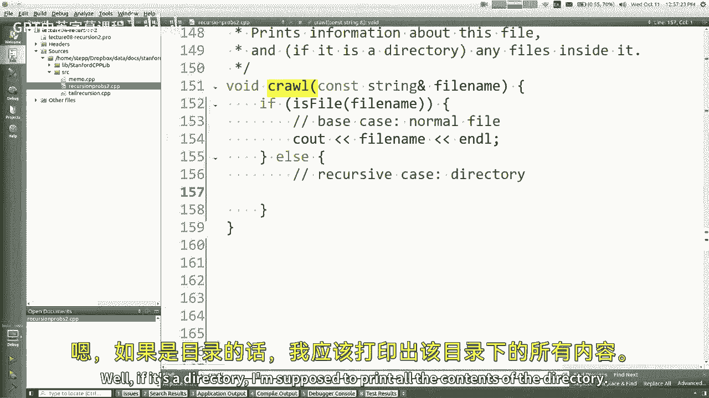

嗯，如果您想使用我们的库从目录中获取内容，这里有一个函数叫做列表目录，你把名字传过去，文件名或目录名，然后是一个矢量，我想它要么返回一个矢量，或者它可以通过引用填充现有的向量。

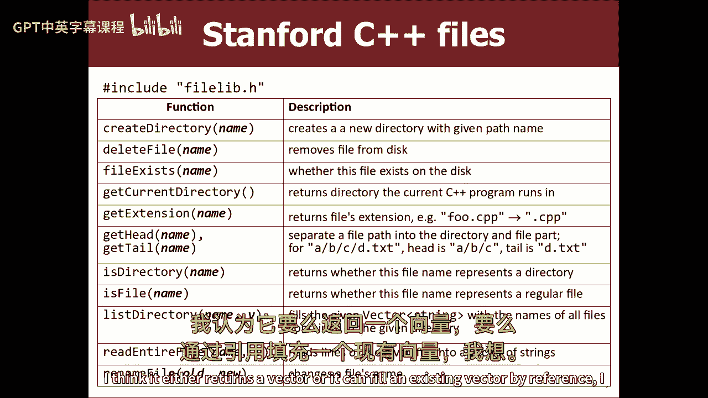

我是这么想的，如果我说，我想那是真的那是真的，是啊，是啊，好啦，所以现在列出目录，通常当我做递归时，我说，啊，你不能用任何循环，你不能使用任何数据结构和所有这些东西来解决这个问题。

我允许你使用循环和结构，如果你现在喜欢，你可能会说，啊，你不让我打圈，一个按因子计算大的，卑鄙什么的好吧，但我想说的是，我想让你对这个问题中自相似的部分使用递归，我想让你用循环。

这些是问题中更多迭代的部分，你怎么知道自己相似的东西，嗯，也许我们会边走边想办法，但是循环是可以的，收藏没问题，所以我的意思是，我基本上想把这些文件打印出来，所以好吧，对于文件中的每个字符串文件。

让我们看看它是否有效，哎呦，我想我有它测试反向线，坚持住，让我上去，如果有一个应用程序，我可以自动化我写的代码的测试，只需查看背景中有绿色或红色结果的结果，我不知道这种事，那么它印的是什么，它打印。

一些文件名，自由消息来源，让我给你看看我们在这里操作的目录，我有一本叫第八讲的目录，还有文件，哇塞，看起来一切正常，我是说顺序不完全一样，我不知道点菜有什么用，但谁在乎呢，嗯，它没有做的一件事，不过。

它不会进入这些不同的目录和打印，里面有什么，对呀，我如何解决这个问题建议，关于递归爬行函数，我想指出的一点是，它没有任何递归，所以也许我们需要一些建议，是呀，我觉得那是另一个学生控制，所以你爬到哪里。

在for循环中的位置，好啦，是啊，是啊，所以实际上，而不仅仅是打印出来，我们爬吧，因为如果，如果这里的文件是一个简单的文件，反正它也会打印出来，和这个一样，但如果是一个目录，它会把它递归起来。

然后进入它的内部，然后说，嘿嘿，一步一个脚印，我听说继续努力，哎呀哎呀，它坠毁了，发生了什么事，那么这里出了什么问题，上面写着错误，等一下等一下，其他分行发生了什么事？一半的，是啊，是啊，嗯。

让我想想我做错了什么，啊，所以有一件事，嗯，让我想一想，我想有一件事我总是这么做，我以前做过这个例子，我总是犯同样的错误，也就是说，我总是忘记文件名是否附有目录，或者只是文件名，只是，你知道。

是食物文本吗，还是斜线，不管是什么斜线，不管是什么斜线，食品文本，这是不同的，所以我想我想要的是，我想要，就像，我想把这两件事分开，它坠毁前打印了什么，什么都没有，是啊，是啊，我想我想要的是看这个。

所以说，如果我，如果我把这个评论出来一秒钟，我只是打印，然后我想，我在这里看到的是，子文件没有附加文件夹，你知道我的意思，所以我想它坠毁了，因为我们找不到那些文件，因为我需要附加目录名，加上欺诈的削减。

有点，你知道的，所以我想我需要做，我想我需要做，斜杠加文件，你知道我的意思吗？

进入那个子文件，所以我认为它应该起作用，所以现在看起来很好，只是我不想把这些都打印出来，就像所有东西前面的标题，但我们可以回到那个，所以有几件事不对，一个是它打印这些像完整的路径，也许我不知道。

我需要完整的路径，比如找东西，但我不一定想把完整的路径打印出来，另一件事是我还没有那个压痕，所以我认为修复印刷的快速方法，完整文件与仅文件名，有一个函数叫做得到头和尾，头部是尾部的目录如下所示。

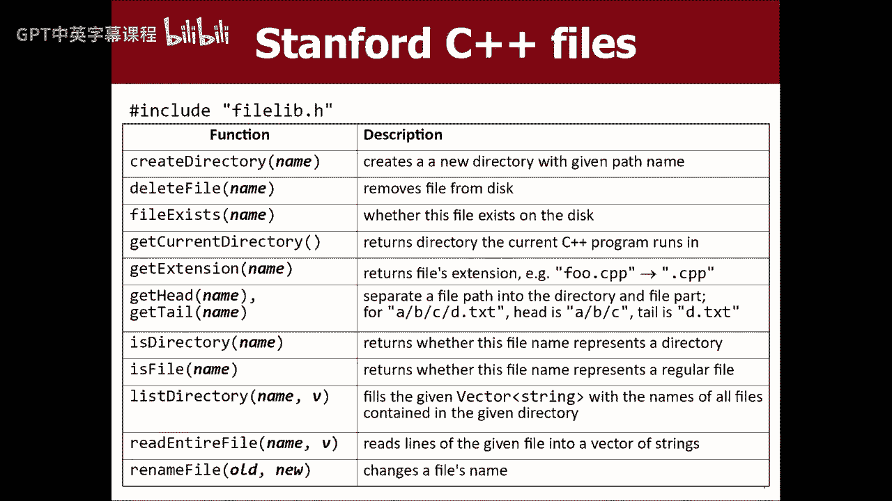

所以我想如果我只说打印文件名的get尾，然后我想它会印在那里，所以它现在打印了更多的输出，它进入了所有这些不同的目录，但我不做压痕，所以这就是我接下来想做的，是啊，是啊，目录的名称。

所以我们还需要一个CR，目录的名称，因为根据所有的好，好的好的，所以实际上，如果你看看这个预期的输出。

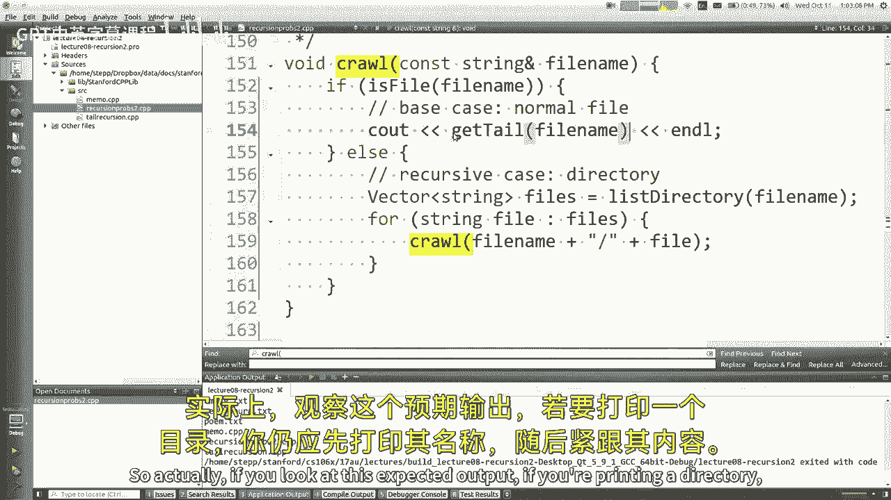

如果要打印目录，你还是应该打印它的名字。

但它的内容随之而来，你是对的，在我们的代码中，我们只打印内容，而不是实际的目录名，所以我想我们一直想把这个打印出来，无论发生什么，不管是目录还是普通文件，所以我想你可以把这个移到这里。

现在基本情况是空的，但是递归的情况是这样的，也许我们马上就能解决，但我觉得那看起来更像，我们有一个lib文件夹，里面有这个，是啊，是啊，好啦，这样看起来好一点，现在我们需要压痕，因为你不知道里面是什么。

如何做好压痕，这实际上是这个问题最棘手的部分，所以我想看看，就是嗯，你知道的，你可能会说很好，好啦，在我爬行之前，子文件，我应该打印一些压痕，所以让我们到这里去看看太空基地，基地之类的。

然后我们爬剩下的，让我们试试看，嗯哼，看起来很不错，好啦，啊，但它不是，我想要，像更多的压痕，我在这里的结构越深，有点，你知道我的意思。

让我们来讨论一下这个输出，让我们转到文本编辑器。

我有这些文件，在斯坦福内部，在收藏品里，我有，你也知道，所以这里有一个巢穴，我的输出中缺少的，我认为问题就像图片，一秒钟的递归，我喜欢这里，所以我走了，好啦，打印几个空格或返回选项卡或其他什么。

但是下一个递归调用将打印一系列行，你知道我的意思，不仅仅是我想打印一个注释，我希望所有这些台词之前都有一个邀请，你的感觉，所以只要在这里打印一次压痕，然后在这里做这个递归并不能完全切断它。

所以我需要把信息传递给下一个电话，我需要告诉它，您需要打印前面有这个压痕的线条，您需要打印所有这些行，前面有这个缩进，你对此有何评论，是啊，是啊，您可以有第二个参数。

这是在任何文件必须默认为零之前要创建的空格数，但每次你喜欢一个人，是啊，是啊，我想这是个好主意，这里有时是为了解决我们的递归问题，你得改变游戏，一点点，我让你写的函数是写这个爬行，它需要一个文件名。

但是如果我们添加了另一个参数，称为字符串缩进，你能做的就是，您可以传递在每行前面打印多少缩进，作为参数，当然我告诉过你写一个只接受这个参数的函数，所以如果你想让你需要的参数和我的兼容。

我想你说的只是传递一个没有缩进的默认值，但是如果你做一个递归调用，你传递的四个空格是注释，或者你在这里传递什么，再加四个空位，你明白的，因为那样的话，所以下一个是四个，加四八八，加四十二，我想让它增加。

当我走的时候，还有一个解决办法，我需要在这里，我从来没有在输出中使用缩进，我把它们传下去，但我需要把它包括在内，当我输出东西的时候，所以这意味着在我看到我的文件名之前，我看到了凹痕，然后文件的获取尾。

你看，所以现在，哎呀哎呀，把这个处理掉，是啊，是啊，我不想那样，那么另一个未定义的引用是什么，哦，所以实际上在我的标题那里，在原型的顶端，我需要说字符串缩进等于，然后这里我需要去掉默认值，是的，是的。

好啦，所以让我们现在试试，嘿看那个，我想它在那里起作用了，我们去看压痕，图形有这些，我有那些私人的有那些等等，所以现在我打印了注释，有一件事我没有说太多，那就是当我把字符串作为参数传递时。

有时我把它们作为常量字符串引用传递，您几乎总是可以将字符串交换为字符串引用，这是最微小的优化，省去了到处复制几个字符串，所以有时候当我有标题的时候，我会说常量字符串引用，但基本上这只是意味着传递字符串。

是啊，是啊，还有其他关于爬行的问题吗，是啊，是啊，所以总的来说，如果你如果你如果你有这个，如何像，是吗，好啦，只是总是通过，我认为通常情况下，您应该始终尝试忽略字符串引用，我唯一不这么做的时候。

如果我要在这里变异，我要改变它，那么它不变的事实意味着我不能改变它，所以我得再复印一份，然后再改，然后如果我已经复制了，我还不如不要通过不断的引用来传递它，但在许多情况下，这正是正确的做事方式，是呀。

问题，通过压痕会更有效率吗，作为一个告诉你应该输出的次数，是啊，是啊，当然我可以通过压痕，就像四个空间，然后缩进加4，我可以通过八个空间，我想我喜欢这个的原因是因为，我是说他们都很好。

但是这种方法比编写for循环来打印空格更容易，我想c+没有，也许有，但我不认为这是一个简单的方式说，给我这么多这个字符的副本作为字符串，你得喜欢润滑油，我只是不想再写一个循环来打印空格。

这对我来说不是什么代码，是的，是的，使用is目录函数不是更好吗，然后就有一个如果块，是啊，是啊，所以我想我会改变这个说，if是目录，那么它是一个递归的情况，然后我会在这里说，就像其他基本情况一样。

普通文件，别的什么都不做，或者别的什么，你知道的，是啊，是啊，那是同一辆车的更好版本，我只是有点喜欢快速射击通过很多这些，因为我只想多练习，让我们看看另一个，让我们看看另一个。

我们谈到了可选参数，我们已经爬过了，好啦，我想做这个吗，如果我有时间，我想回到这个，但是等一下，我想回来，我想做斐波那契，很快的，所以斐波那契数列是一个整数序列，其中每一个都是前两个的和。

前两个被定义为一，所以第五，一号和二号有价值一，三是一加一，五四是二加一五五是二加所以，可以肯定的是，前两个中的一些，对呀，你也知道，我不打算花很多时间谈论，斐波那契数列与斐波那契数列。

但它们在数学、生物和经济学中随处可见，还有各种疯狂的东西，它们是你在自然模式和其他东西中发现的非常常见的数字，到处都是，与此有关，像黄金比例，如果你画一个斐波那契大小的矩形螺旋，你得到这个很酷的图案。

你知道它描述了你可能遇到的许多日常物品的大小和形状，呃不管怎样，别说了，所以嗯，那么如何写好斐波那契函数，递归地编写似乎真的很容易。

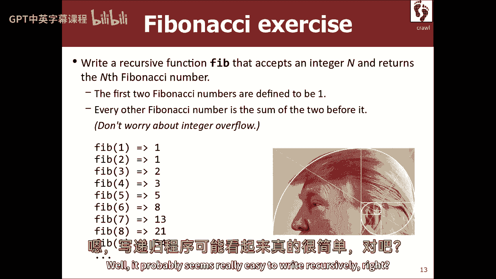

对呀，所以让我去做我的项目，把它写出来，所以这里是int fib返回零，所以我的意思是，就像我说的前两个是一个，所以如果是第一个还是第二个，我想如果它小于或等于第二个斐波那契数，还一个，是前两个的总和。

所以这并不难，我只是为我们写的，n减去1的返回fib加上n减去2的fib，对呀，酷，那么效果好吗，让我们一探究竟，看看你怎么撒谎知道什么七英寸，所以我们就这么做吧，便便，其实等一下，我想这不会运行。

因为我得把这个改成Main，那我得换这个，不说什么语言，C加加，现在我运行这个，什么是Fib 7。

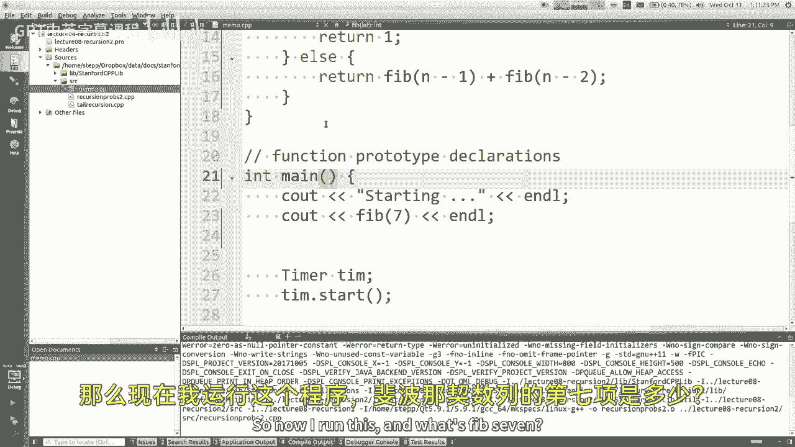

上面说十三对吗，七是十三，好啦，所以它基本上起作用了，这个的重点不是代码，不是算法本身，我想谈谈，你们两个好像有点担心，最后一课，那是。

你知道所有这些开销，做所有这些递归调用，这是一个函数进行多次递归调用的例子。

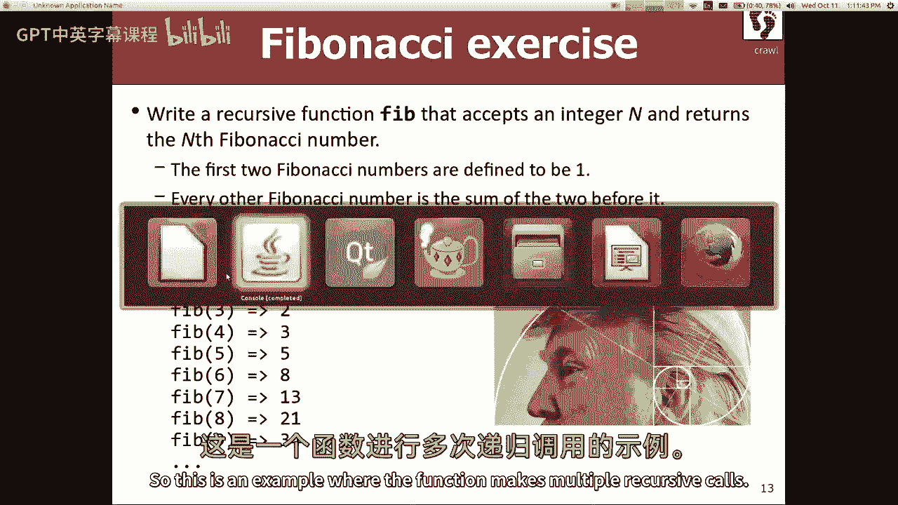

请看，使您所做的每个调用都使另外两个递归调用，有多少电话。

如果你计算出6的fib，计算出这张丑陋照片的抱歉，但就像它的意思是计算5的fib和4的fib，所以四位数的谎言需要计算，四和三的Fib，三位数需要计算圆周率，所以他们都要计算之前的，事实上。

我甚至可能把图表搞砸了，打了这么多电话，但不管怎样，它有点像一棵一分为二的叫声树，每次，对所以好吧，就像，也许那不是世界末日，我不知道，不是很多人要求撒六个谎，如果是50的谎言什么的，可能会很多，对呀。

但特别令人担忧的是，有些电话和其他电话是一样的，对呀，就像这里，作为计算的一部分，我得先问一下，所以我做了所有这些工作，我最终知道了答案，然后我在这里之前再打一次电话，所以我重新计算了所有这些调用。

得出了4K的谎言，你们不喜欢这些额外的费用，我知道你星期一问过我，所以这是不幸的，它浪费了所有的计算现在，我要说的是即使它要打这么多电话，没那么慢，对于实际大小的整数，你可能想要一个小的。

我实际上我打电话给我的第五个，我们已经写了十万遍了，花了四秒钟，所以很喜欢经营它，测量一个缓慢的时间，不过，好吧，就花了这么多时间，嗯，那么我们怎么把这口井修好呢，我是说，当然，这里的关键观察是。

我们已经计算过了，所以我们不需要再计算了，如果我们能记得我们计算对了，所以有一个聪明的把戏，那叫记忆，我第一次听到这个词，我以为这就像一个有语言障碍的人，就像牧师和公主，新娘，就像没有记忆一样。

为什么我们今天，你知道的，但那实际上是“融化”这个词，这不是打字，呃，这基本上就是你缓存的地方，前面一个叫做速度计算的函数的结果，所以你可以重复使用它，好啦，所以这里有一个非常粗略的伪代码。

你怎么做记忆，创建某种缓存或数据结构，向量，一张地图，一些可以储存结果的东西，除非你和你写的函数，你说，我以前用弧线计算过f吗，如果我在我的现金里查了一下，并返回答案，否则实际计算它，放到缓存里以后用。

作为回报，这很简单。

好吧如果你想用，你可以使用不同的结构，我觉得，因为我们在计算斐波纳契数，你需要能够说，我以前用斐波那契数算过这个吗，有很多不同的收藏你可以使用，我喜欢用地图来展示，尽管您可以使用数组或向量。

因为我们在这里操作的是自然数和整数的定义域，但我喜欢说，让我们用地图点h，或者哈希图也可以，让我们做哈希图，哈希图，那么我会说int逗号int缓存的哈希映射，所以你就画了一张地图，现在在这里，你说得好。

前两个很容易，我不需要把它们藏起来，那些很好，然后这里，我想记住那个结果，这样我就不用再计算了，所以我会说缓存放置结果，还是我猜啊，关键是N对，我想有一天抬头，你有N的结果吗是的，就在这里，然后我说。

现在我们唯一缺少的是，我们把东西藏在储藏室里，但我们不会用缓存里的任何东西，所以你把它插在这里，在你做任何递归之前，你说，否则，返回缓存进入或现金括号n右，基本上就是这样。

我唯一不喜欢这个解决方案的地方是我有这个，这里有个全局变量，你知道我们应该讨厌全局变量，他们很坏，他们是邪恶的，不要用它们，在C++中有一个可爱的小黑客，在其中可以声明变量，对函数来说是全局的。

它被称为静态变量，所以如果你把这个移到这里，你说静态哈希映射现金，这是一个奇怪的句法，但基本上它的作用是，它不会创建新的地图，每次调用这个函数，它创造了一个，你第一次调用函数，现在它只对那个函数可见。

所以它有时被称为函数，私有数据Java没有这个，但不管怎样，如果你把地图放在这里，它将不再是全球性的，但功能完成后它会留下来，下次调用函数时，它还会在这里，地图还是一样的，挺酷的，是啊，是啊。

它对函数是全局的吗，不管是什么范围，如果你把它写进声明里，哦，你能把它，你放了一个那个，我不知道我该怎么对你说实话，我不记得你能不能把这些东西像礼物一样放进去，然后他就住在那个GIF里什么的。

我只在一个活动开始时见过它，如果你把它放在函数之外，它仍然是一个全局变量，但现在它只对该文件是全局的，和其他试图与该变量对话的文件，看不见，但它仍然是一个全局变量，所以不要这么做，但是嗯。

所以我的意思是，坦率地说，我不知道语法的所有来龙去脉，我很乐意稍后帮你谷歌一下，如果你想，但我不知道，我知道你可以把它放在这里，而且管用，作为参考，呃，我们做了十万次这种方法，花了大约四秒钟。

所以我会用同样的运行次数再运行一次，但现在我们有了我们的记忆，现在需要13毫秒，所以它做的计算要少得多，电话树不再以同样的方式分裂了，是啊，是啊，等等对不起，再说一遍，这就像你第一次运行它，就像小玩意。

就像未来的每一次，只是它移动了返回的时间，是啊，是啊，我想如果你真的想追踪这里的递归，实际上这可能会很好，我想在这之后我还可以做一件事，但如果你想追溯这个的结果，这将抓住谎言三的结果，如果你说七号谎。

这将会引起第三到第七，因为七的谎言电话也到了这里，六五四三，当你数到三，我们将把三个结果，四个结果，所有这些电话都会这样做，事实上，在我的意思是，我可以看到外面，现金和所有，如果你喜欢。

缓存3个然后4个然后5个然后6个然后7个，我想它以后会做其他五个数字，但是是的，它是以那种方式建造它们的，因为那些电话，你知道在顺序问题中彼此的堆栈，是的，最初的功能是没有捕捉。

或者它确实有指数级的运行时，是啊，是啊，因为每通电话都会多打两个电话，所以它大约是总调用数的2到n的数量级，是啊，是啊，这是不好的，指数运行时不好，看看我给你的图表，它就像已知宇宙的大小。

你必须等待大值，是啊，是啊，我想我们很多人，呃，很多问题，我想我们看到的大部分加速是对的，不是从一个叫，我们做了很多这样的计算，就像这样，我们第一次打电话就加快了速度，我们要进去一千次。

其他的九九九九只是一个罐头，我们做一个单曲，是啊，是啊，你是你是对的就像这样，问题是，如果我叫它一次，我抓不住时间，所以我能做的就是，我可以说像，你知道int等于从1到40的随机整数。

我可能会尝试不同的Fib值或类似的东西，还是挺快的不，但是这里有两种速度，我认为重要的是要注意到他们两个，他们都很有趣，一种加速是，如果我以后再单独调用n的fib，我就不用再计算了。

或者任何直到n的东西，对呀，那很酷，另一件事是在Fib n的单一计算中，我不必让那棵树的第二部分，所以它加快了这两件事的速度，这两件事都是有价值的，实际上，您可以使用缓存和记忆，即使您不在递归上下文中。

您可能有一个非常昂贵的功能来抓取您的文件，搜索结果并以某种方式捕获，这甚至不一定是递归的，但你把它存起来，以防你再次需要它，所以记忆也在递归之外，这个是什么运行时，是啊，是啊，嗯，如果你在缓存中。

我是说一般情况下，很难稍微谈论运行时，我会说，但我相信如果不是现金，你有一个电话的结束号码，对，如果你有现金，你有一个恒定的时间，所以无论如何，好啦，我想我需要停下来，不能因为我们没时间了，但是嘿。

去科练习，更多递归，我们星期五会做更多这样的事情。

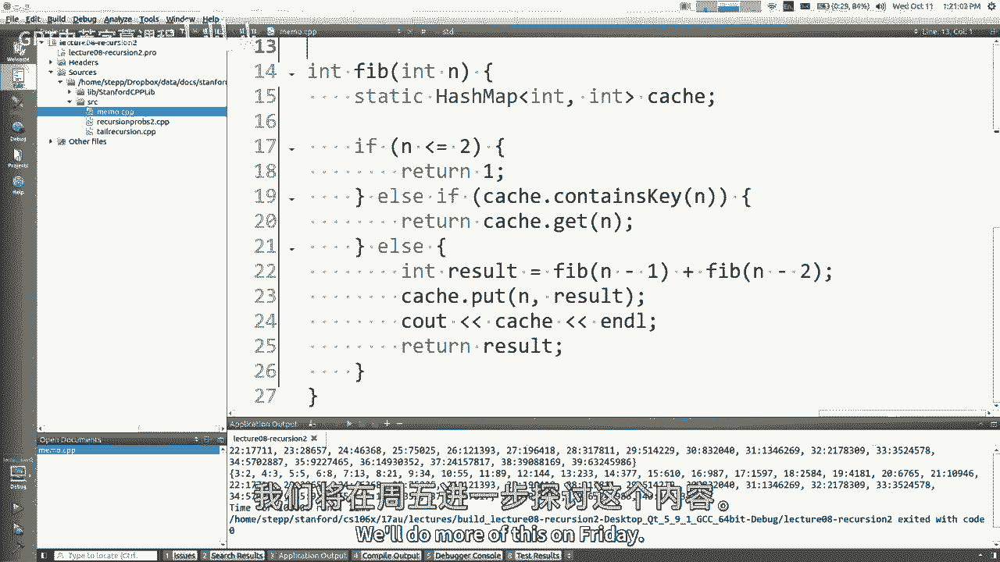

我们将学习分形，真的很好玩。