# 课程08：递归（二）🔁

在本节课中，我们将继续深入学习递归。我们将通过解决几个具体问题来练习递归思维，包括打印二进制数、反转文件行、遍历目录结构以及优化斐波那契数列的计算。通过实践，你将更好地掌握如何识别递归的基本情况和自相似结构。

---


## 打印二进制数 🖨️

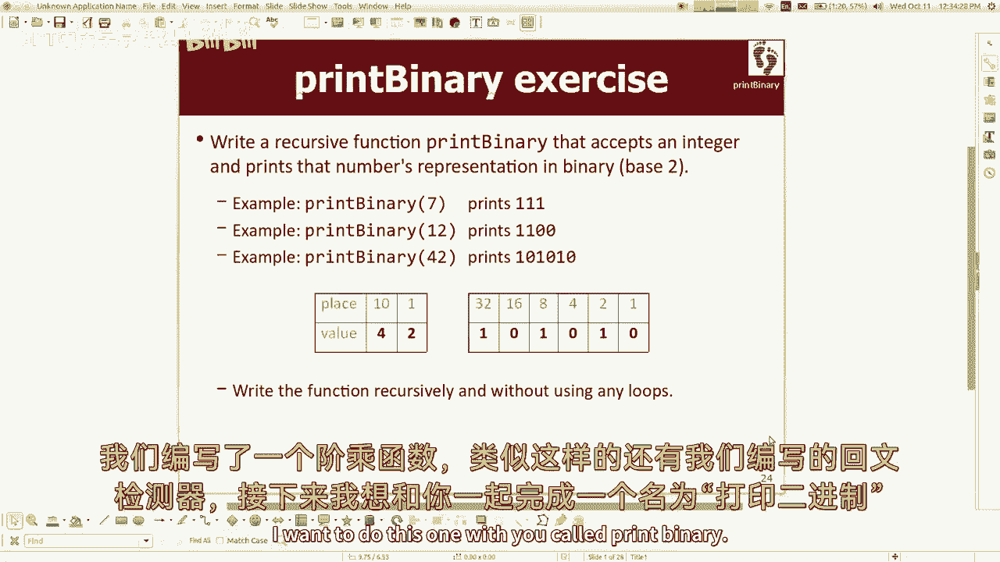

上一节我们介绍了递归的基本概念，本节中我们来看看如何将一个十进制整数递归地转换为其二进制表示并打印出来。


我们的目标是编写一个函数 `printBinary`，它接收一个整数 `n` 并打印其二进制形式。我们不会使用循环、库函数或字符串转换。

### 核心思路

1.  **基本情况**：最简单的情况是当数字 `n` 为 0 或 1 时，其二进制表示就是它本身，直接打印即可。
2.  **递归情况**：对于更大的数字 `n`，其二进制表示可以看作是 `(n / 2)` 的二进制表示，后接 `(n % 2)` 的结果。这里，`n / 2` 是整数除法。

以下是实现代码：

```cpp
void printBinary(int n) {
    // 处理负数：先打印负号，然后递归处理其绝对值
    if (n < 0) {
        cout << "-";
        printBinary(-n);
    }
    // 基本情况：n 为 0 或 1
    else if (n < 2) {
        cout << n;
    }
    // 递归情况
    else {
        // 先递归打印 n/2 的二进制
        printBinary(n / 2);
        // 然后打印最后一位 (n % 2)
        cout << (n % 2);
    }
}
```

**代码解释**：
*   函数首先处理负数。
*   当 `n` 小于 2 时，直接输出，这是递归的终止条件。
*   否则，函数递归调用自身处理 `n/2`，待递归返回后，再输出 `n%2`（即最后一位二进制数字）。这种“先递归，后操作”的顺序确保了数字从左到右正确打印。


---

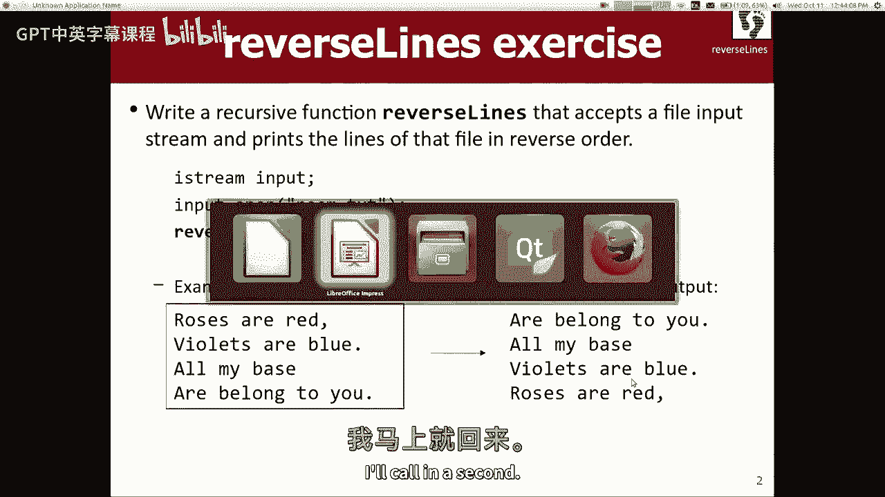

## 反转文件行内容 ↩️

接下来，我们尝试一个处理输入流的问题：如何递归地将一个文件中的所有行以相反顺序打印出来。

我们需要编写函数 `reverseLines`，它接受一个输入流（如文件），并递归地逆序打印其中的每一行，而不使用任何集合（如 `vector`）来存储所有行。

### 核心思路

1.  **基本情况**：当文件流中没有任何行可读时（即到达文件末尾），函数无需做任何事，直接返回。
2.  **递归情况**：如果成功读取一行，那么问题可以转化为：**先递归地逆序打印剩余的所有行，然后再打印当前这一行**。

以下是实现步骤：

```cpp
void reverseLines(istream& input) {
    string line;
    // 尝试读取一行
    if (getline(input, line)) {
        // 递归情况：先逆序打印剩余的行
        reverseLines(input);
        // 然后打印当前行
        cout << line << endl;
    }
    // 基本情况：无法读取行（文件结束），隐式返回
}
```

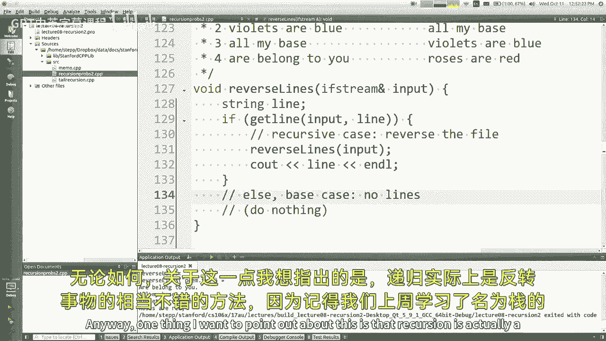

**过程分析**：
想象一个包含三行的文件：A、B、C。
1.  第一次调用读取 A，然后递归调用。
2.  第二次调用读取 B，然后递归调用。
3.  第三次调用读取 C，然后递归调用。
4.  第四次调用尝试读取，失败（文件结束），立即返回。
5.  控制权回到第三次调用，它打印 C。
6.  控制权回到第二次调用，它打印 B。
7.  控制权回到第一次调用，它打印 A。
最终输出顺序为 C、B、A，实现了反转。递归调用栈在这里起到了“后进先出”的栈数据结构作用。

---

## 遍历目录结构 📁

现在，我们来看一个更复杂的递归问题：遍历一个目录及其所有子目录，并以缩进格式展示文件结构。

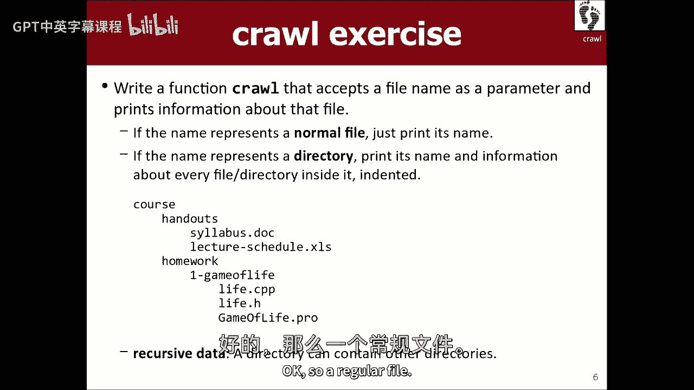

我们需要编写函数 `crawl`。给定一个路径名，如果是文件，则打印其名；如果是目录，则打印其名，并递归地打印其内部所有内容，子级内容需要缩进以显示层级关系。


### 核心思路

1.  **基本情况**：当路径指向一个普通文件时，直接打印其名称（附带当前层级的缩进）。
2.  **递归情况**：当路径指向一个目录时：
    *   打印目录名。
    *   获取目录下的所有条目。
    *   对每个条目，递归调用 `crawl` 函数，但传入一个增加了缩进量的参数。

以下是实现代码，其中使用了辅助函数（如 `isDirectory`, `listDirectory`）：

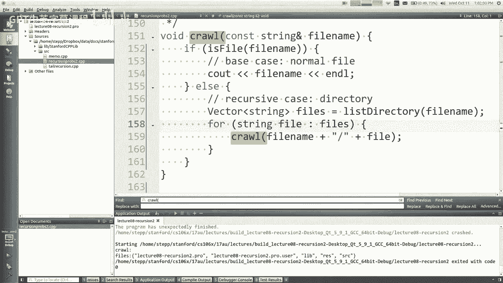

```cpp
void crawl(const string& path, const string& indent = "") {
    // 打印当前条目（带缩进）
    cout << indent << getTail(path) << endl;

    if (isDirectory(path)) {
        // 是目录，获取其内容列表
        vector<string> entries;
        listDirectory(path, entries);
        // 对目录下的每个条目进行递归遍历，缩进增加4个空格
        for (const string& entry : entries) {
            // 构建子条目的完整路径
            crawl(path + "/" + entry, indent + "    ");
        }
    }
    // 如果是文件，上面的打印语句已经足够，无需额外操作
}
```


**关键点**：
*   我们引入了一个额外的参数 `indent`（缩进字符串），默认值为空。每次进入一个子目录时，递归调用会传递一个增加了四个空格的 `indent`。
*   `getTail(path)` 函数用于从完整路径中提取文件名或最后一级目录名。
*   在递归情况下，我们使用循环来迭代处理目录下的每个条目，这是被允许的，因为问题的“自相似”部分在于对每个条目自身的处理（是文件则终止，是目录则继续深入）。


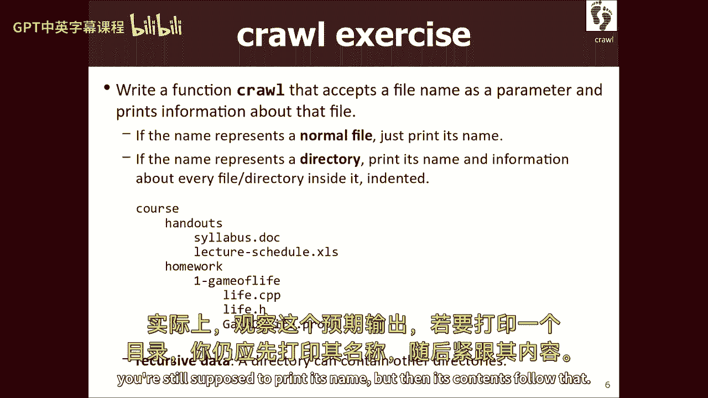

---


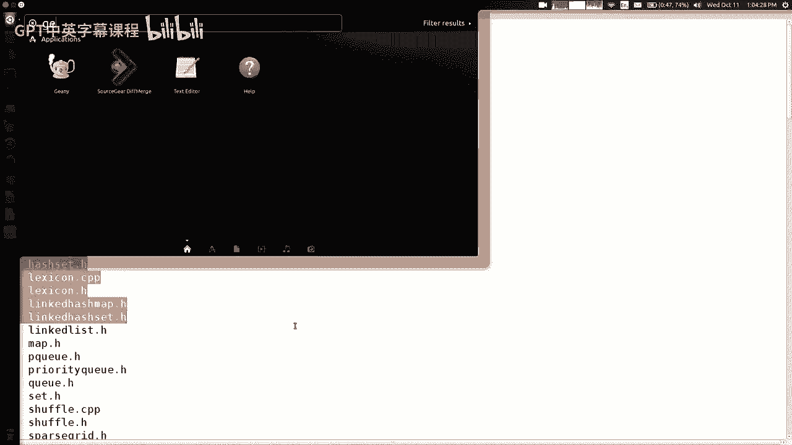

## 优化递归：斐波那契数列与记忆化 ⚡

最后，我们探讨递归的一个常见性能问题及其优化方案。以计算斐波那契数列为例。

斐波那契数列定义为：`F(1) = 1`, `F(2) = 1`, `F(n) = F(n-1) + F(n-2) (n > 2)`。

### 朴素递归实现

递归实现非常直观：

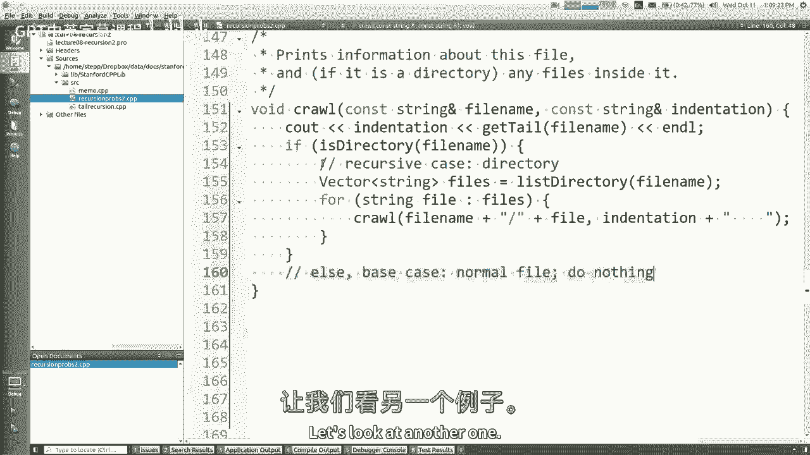

```cpp
int fib(int n) {
    if (n <= 2) return 1; // 基本情况
    return fib(n - 1) + fib(n - 2); // 递归情况
}
```


**性能问题**：这种实现效率极低。例如计算 `fib(6)`，需要计算 `fib(5)` 和 `fib(4)`；而计算 `fib(5)` 又需要计算 `fib(4)` 和 `fib(3)`…… 这里 `fib(4)` 被计算了两次，`fib(3)` 被计算了三次。随着 `n` 增大，重复计算呈指数级增长，运行时间是 `O(2^n)` 级别。


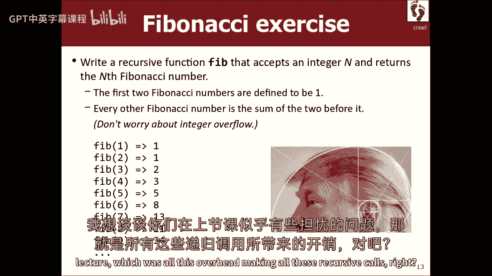

### 优化：记忆化（Memoization）


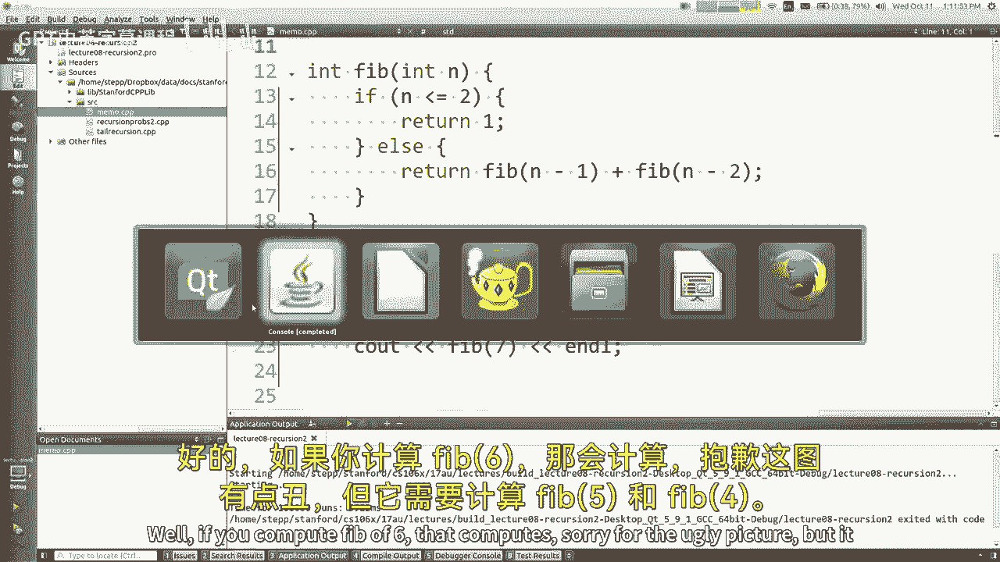

记忆化是一种优化技术，通过缓存（存储）已计算过的函数结果来避免重复计算。

以下是使用 `unordered_map`（哈希表）实现记忆化的斐波那契函数：

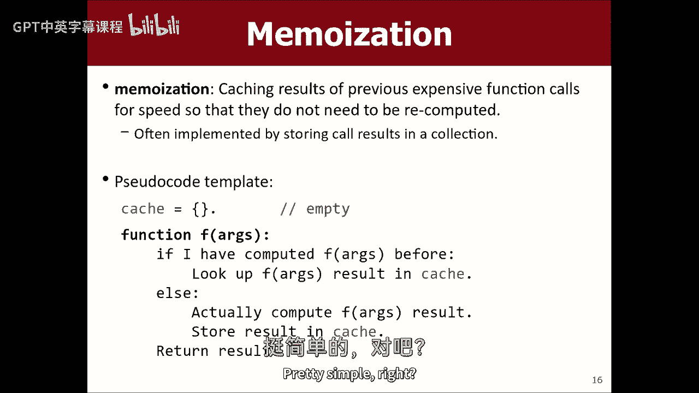

```cpp
int fibMemo(int n) {
    // 静态哈希表，用于缓存 (n -> fib(n)) 的结果
    static unordered_map<int, int> cache;

    // 基本情况
    if (n <= 2) return 1;

    // 检查结果是否已缓存
    if (cache.find(n) != cache.end()) {
        return cache[n];
    }

    // 计算并缓存结果
    int result = fibMemo(n - 1) + fibMemo(n - 2);
    cache[n] = result;
    return result;
}
```

**优化效果**：
*   **单次计算加速**：在计算 `fibMemo(n)` 的过程中，每个子问题（如 `fibMemo(k)`）只会被计算一次并缓存。后续需要时直接从缓存中读取，将时间复杂度从指数级 `O(2^n)` 降低到近似线性 `O(n)`。
*   **跨调用加速**：由于 `cache` 是静态变量，其生命周期贯穿整个程序运行。因此，首次计算 `fibMemo(40)` 后，再次计算 `fibMemo(40)` 或任何小于 40 的值都将是常数时间 `O(1)` 的查找操作。

记忆化是一种强大的技术，不仅适用于递归函数，任何计算成本高昂且可能被多次以相同参数调用的函数都可以受益于此。

---

## 总结 🎯

本节课中我们一起学习了递归的多种应用和一项重要优化技术：
1.  **打印二进制数**：我们通过识别“`n` 的二进制是 `n/2` 的二进制后接 `n%2`”这一自相似性，并结合处理 0/1 的基本情况解决了问题。
2.  **反转文件行**：我们利用“先递归处理剩余行，再处理当前行”的策略，借助递归调用栈天然的反转特性完成了任务。
3.  **遍历目录**：我们处理了具有嵌套结构的目录树，通过增加缩进参数来传递层级信息，并结合循环与递归完成了遍历。
4.  **记忆化优化**：我们分析了朴素递归计算斐波那契数列时的指数级重复计算问题，并引入记忆化（缓存）技术，通过存储中间结果将效率提升至线性级别。


递归的核心在于将复杂问题分解为相似的、更小的子问题。多加练习是掌握它的关键。下节课我们将探索递归在图形化分形中的应用。