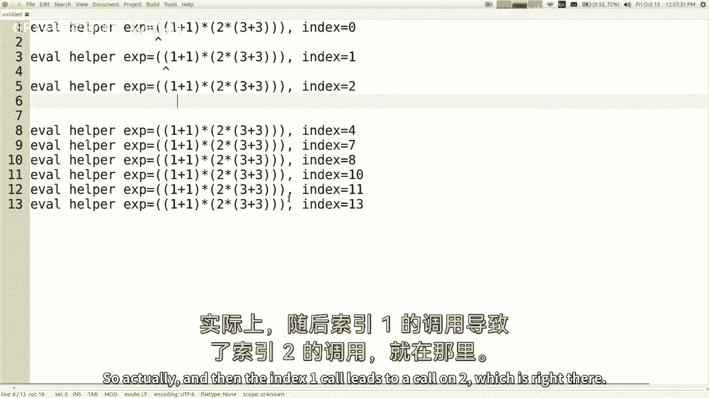
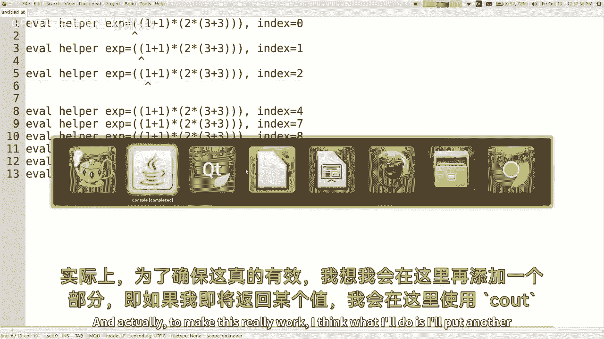
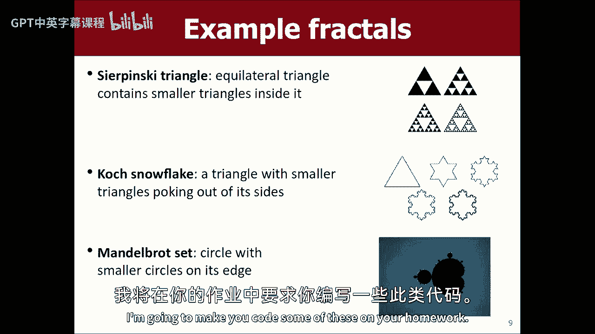
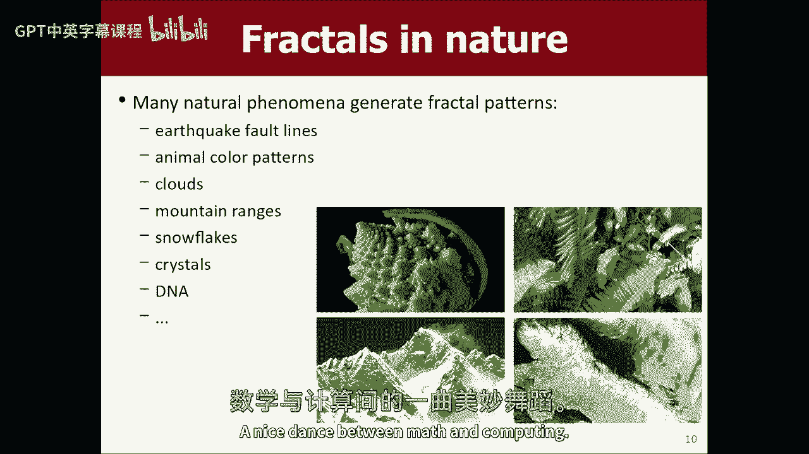
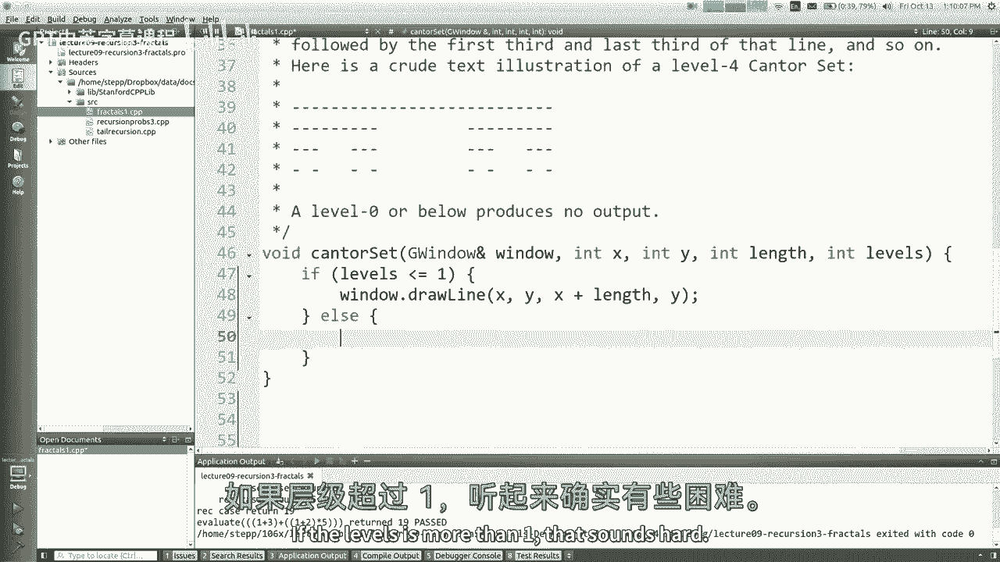
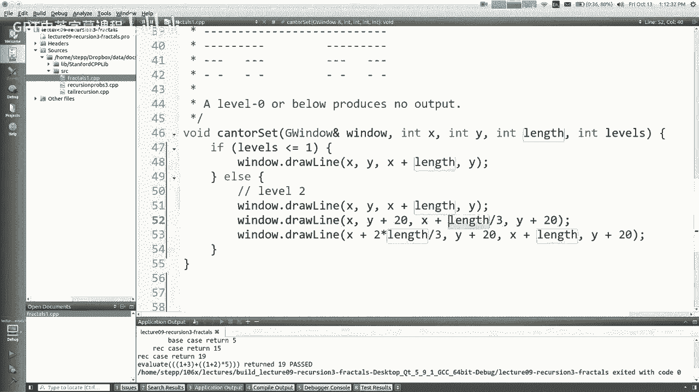
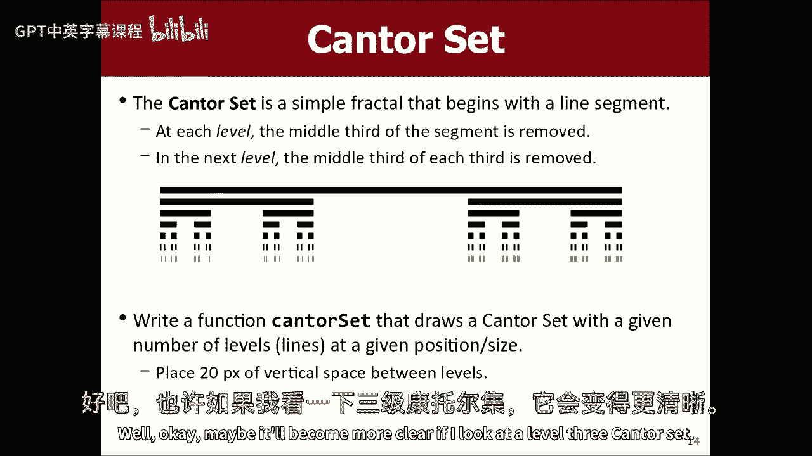
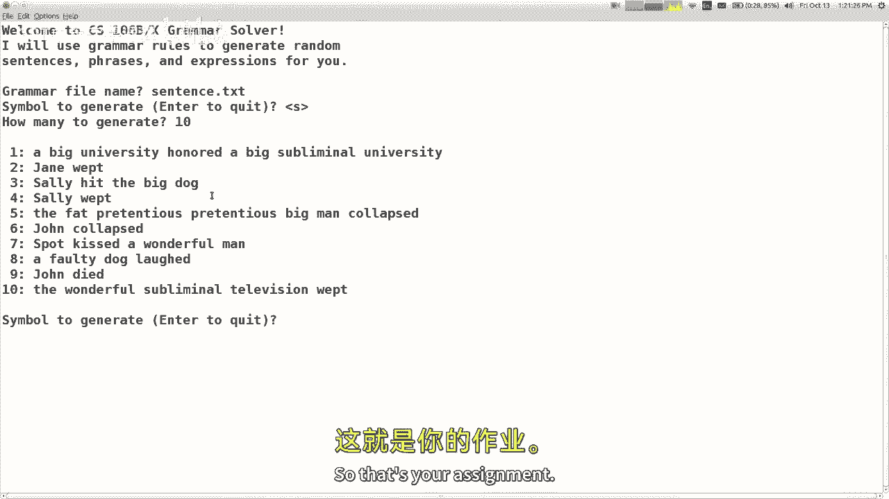

# 课程09：递归3 - 分形与表达式求值 🌀

在本节课中，我们将深入学习递归的更多应用，特别是如何利用递归来绘制分形图形和解析求值数学表达式。我们将通过具体的代码示例，帮助你理解递归在解决复杂问题时的强大能力。


---


## 表达式求值

上一节我们介绍了递归的基本概念和设计思路。本节中，我们来看看如何应用这些思路来解析和求值一个包含括号和运算符的数学表达式字符串。

我们的目标是编写一个函数，它能计算像 `(2+3)` 或 `((1+2)*3)` 这样的表达式。为了简化问题，我们做出以下假设：
*   所有运算符和操作数都被括号包围。
*   字符串是有效的。
*   数字均为个位数。
*   运算符目前只考虑 `+` 和 `*`。

### 设计思路

要设计递归函数，我们需要找到问题的自我相似性并确定基本情况。

*   **自我相似性**：一个复杂的表达式（如 `(2+3)`）的求值过程，与求值其子表达式（如 `2` 和 `3`）的过程是相似的。括号内的任何内容本身就是一个可以独立求值的表达式。
*   **基本情况**：最简单的表达式就是一个单独的数字字符，我们可以直接将其转换为整数并返回。

然而，直接处理字符串索引可能比较混乱。一个有效的方法是使用一个辅助函数，它接收原始字符串和一个**整数索引的引用**，该索引表示当前处理到的字符位置。随着函数的递归调用，这个索引会不断向前移动，“消耗”掉已经处理过的字符。

### 代码实现

以下是求值函数的核心实现。`evaluate` 是主函数，它初始化索引并调用辅助函数 `evalHelper`。

```cpp
int evaluate(string expr) {
    int index = 0;
    return evalHelper(expr, index);
}

int evalHelper(const string& expr, int& index) {
    // 情况1：当前字符是数字（基本情况）
    if (isdigit(expr[index])) {
        int result = expr[index] - '0'; // 将字符数字转换为整数
        index++; // 消耗掉这个数字字符
        return result;
    }
    // 情况2：当前字符是左括号 '('
    else if (expr[index] == '(') {
        index++; // 跳过左括号
        // 递归求值左操作数
        int left = evalHelper(expr, index);
        // 读取运算符
        char op = expr[index];
        index++; // 消耗掉运算符
        // 递归求值右操作数
        int right = evalHelper(expr, index);
        // 跳过右括号
        index++; // 此时 index 应指向右括号 ')'
        // 根据运算符计算结果
        if (op == '+') {
            return left + right;
        } else { // 根据假设，此处为 '*'
            return left * right;
        }
    }
    // 根据假设，不会遇到其他情况
    return 0;
}
```

**代码解析**：
1.  `evaluate` 函数设置起始索引 `0`，并启动递归过程。
2.  `evalHelper` 是递归函数。参数 `index` 是引用，确保所有递归调用共享并更新同一个索引。
3.  如果当前字符是数字，直接转换并返回，同时前移索引。
4.  如果当前字符是左括号 `(`，则：
    *   跳过它。
    *   递归求值左操作数（可能是一个数字或另一个带括号的表达式）。
    *   读取运算符。
    *   递归求值右操作数。
    *   跳过右括号 `)`。
    *   根据运算符计算并返回最终结果。
5.  通过递归调用，函数能够处理任意深度的嵌套表达式，如 `((1+2)*(3+4))`。





---

## 递归绘制分形


理解了表达式求值后，我们来看看递归另一个有趣的应用：绘制分形图形。分形是一种在不同尺度上表现出自相似性的几何图形。




### 康托尔集



我们将以康托尔集为例。康托尔集的构造规则如下：
*   **0阶**：一条完整的线段。
*   **n阶**：先绘制一条线段，然后在该线段下方绘制两个 `n-1` 阶的康托尔集，分别位于原线段前1/3和后1/3的位置。

以下是绘制康托尔集的递归函数实现：




```cpp
void cantor(GWindow& window, double x, double y, double length, int level) {
    // 基本情况：至少绘制一条线段
    if (level >= 1) {
        // 绘制当前层级的线段
        window.drawLine(x, y, x + length, y);
        // 如果层级大于1，则递归绘制两个更小的子集
        if (level > 1) {
            double newY = y + 20; // 下一层线段的垂直位置
            double newLength = length / 3.0; // 子线段长度是原长的1/3
            // 递归绘制左半部分的子集
            cantor(window, x, newY, newLength, level - 1);
            // 递归绘制右半部分的子集
            cantor(window, x + 2 * newLength, newY, newLength, level - 1);
        }
    }
}
```


**代码解析**：
1.  函数参数包括绘图窗口、线段起点坐标 `(x, y)`、线段长度 `length` 和当前层级 `level`。
2.  如果 `level >= 1`，我们就在当前位置绘制一条水平线段。
3.  如果 `level > 1`，说明还需要绘制更小层级的图形。我们计算下一层线段的Y坐标（下移20像素）和子线段的长度（原长的1/3）。
4.  然后进行两次递归调用：
    *   一次针对原线段的前1/3部分（起点 `x` 不变）。
    *   一次针对原线段的后1/3部分（起点为 `x + 2 * newLength`）。
5.  每次递归调用都将层级 `level` 减1。当 `level` 减至1时，递归调用只会绘制线段而不再产生新的子调用，递归过程终止。





通过调用 `cantor(window, 50, 50, 700, 5)`，你可以看到一个5阶的康托尔集图形被绘制出来。

---


## 课程总结


本节课中我们一起学习了递归的两个高级应用。
*   首先，我们实现了**表达式求值器**，通过递归辅助函数和索引引用，优雅地处理了嵌套括号的解析问题。
*   接着，我们探索了**分形绘制**，以康托尔集为例，展示了如何用递归描述自相似图形，并通过代码将其可视化。



递归的核心在于将复杂问题分解为相似的、更小的子问题。无论是处理数据结构、解析语言还是生成图形，这种“分而治之”的思想都是极其强大的工具。在接下来的课程中，我们将继续利用递归解决更多类型的问题。