# CS106b 11：C++中的类与数组实现栈 🧱

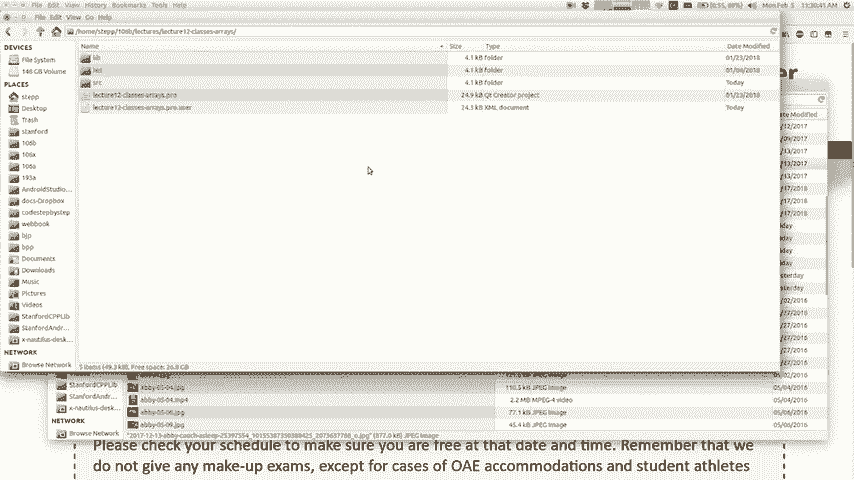

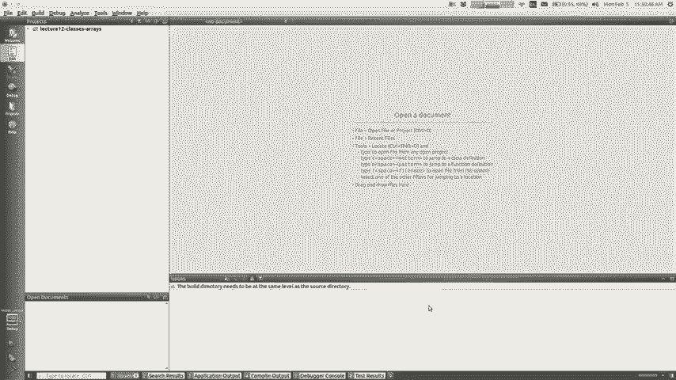

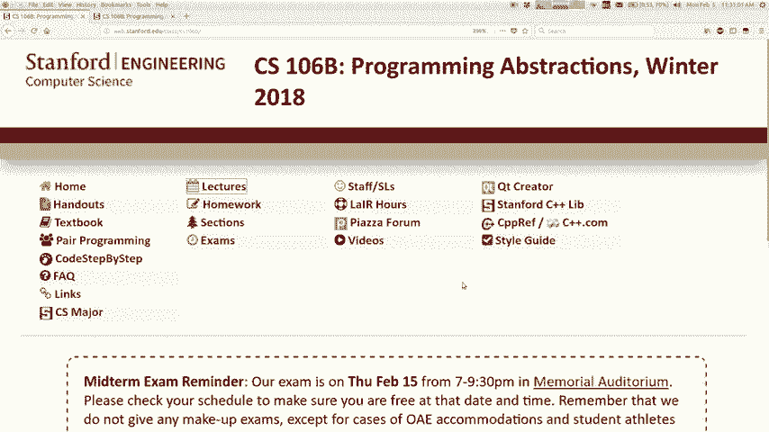

在本节课中，我们将学习如何在C++中定义类，并利用数组这一基础数据结构来实现一个简单的栈（Stack）集合。我们将从面向对象编程的基本概念讲起，逐步构建一个功能完整的栈。


---

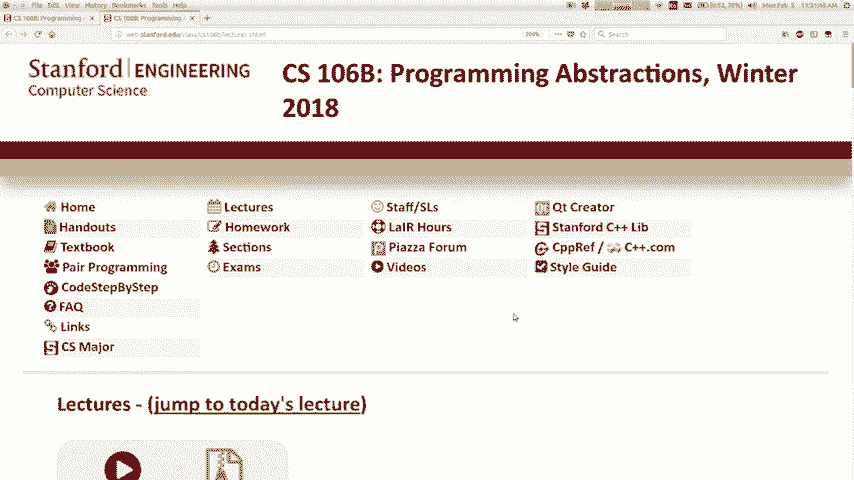

## 课程概述 📋

上一节我们探讨了递归与回溯算法。本节中，我们将转向一个新的主题：数据结构的底层实现。我们将学习C++中“类”（Class）的概念，这是构建自定义数据类型的基础。然后，我们将运用这些知识，使用数组来实现一个我们熟悉的集合——栈。

## 第一部分：C++中的类与对象

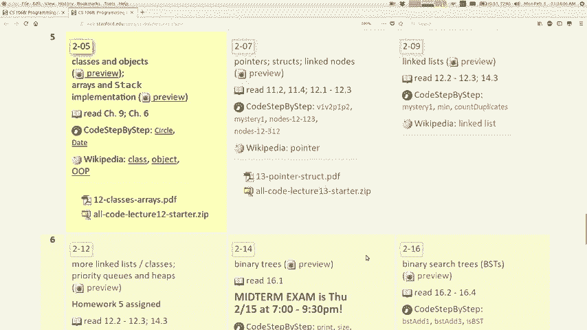

在编程中，我们常常需要表示语言本身没有提供的实体，例如银行账户、日历事件或游戏角色。C++中的“类”允许我们创建这种新的数据类型。

一个“类”是对象的蓝图或模板。而“对象”是类的具体实例，它同时包含**数据**（称为成员变量或字段）和**行为**（称为成员函数或方法）。

### 类的组成

以下是定义一个类时的主要部分：

*   **成员变量**：每个对象独有的数据。例如，一个`BankAccount`类可能有`balance`（余额）和`ownerName`（户主姓名）变量。
*   **成员函数**：定义在对象上可以执行的操作。例如，`BankAccount`类可以有`deposit`（存款）和`withdraw`（取款）函数。
*   **构造函数**：一种特殊的成员函数，在创建对象时自动调用，用于初始化对象的状态。

### 访问控制：公有与私有

在定义类时，我们需要决定哪些部分对外部代码可见。
*   **公有（public）**：标记为`public`的成员（变量或函数）可以被类外部的任何代码访问和调用。
*   **私有（private）**：标记为`private`的成员只能被类内部的成员函数访问。这实现了**封装**，是保护对象内部数据、防止被意外修改的关键机制。

通常，我们将所有成员变量设为私有，然后提供公有的成员函数（如`getBalance`）来安全地访问或修改它们。

### 类的代码结构

在C++中，一个类通常被拆分到两个文件中：
1.  **头文件（.h）**：用于声明类，包括其成员变量和成员函数的原型（仅声明，不写具体实现）。
2.  **源文件（.cpp）**：用于实现头文件中声明的所有成员函数的具体逻辑。

客户端代码（如`main`函数所在的文件）只需包含头文件（`#include “ClassName.h”`），即可使用这个类。

**一个简单的`BankAccount`类示例**

头文件 (`BankAccount.h`) 内容如下：
```cpp
#ifndef BANKACCOUNT_H
#define BANKACCOUNT_H

#include <string>

class BankAccount {
public:
    // 构造函数
    BankAccount(std::string name, double initialBalance);
    // 成员函数
    void deposit(double amount);
    void withdraw(double amount);
    double getBalance() const;
    std::string getOwnerName() const;

private:
    // 成员变量
    std::string ownerName;
    double balance;
};

#endif
```

源文件 (`BankAccount.cpp`) 中实现成员函数：
```cpp
#include “BankAccount.h”

BankAccount::BankAccount(std::string name, double initialBalance) {
    ownerName = name;
    balance = initialBalance;
}

void BankAccount::deposit(double amount) {
    balance += amount; // 这里的 balance 指的是调用此方法的那个对象的 balance
}

void BankAccount::withdraw(double amount) {
    balance -= amount;
}

double BankAccount::getBalance() const {
    return balance;
}

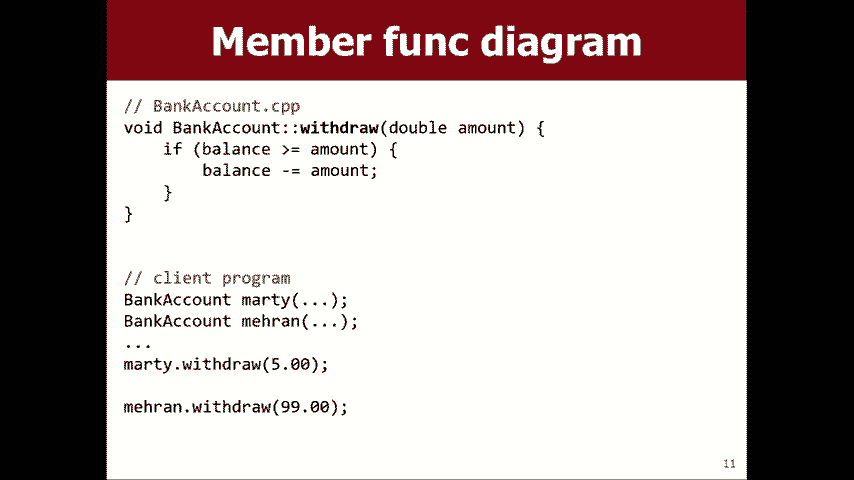

std::string BankAccount::getOwnerName() const {
    return ownerName;
}
```

客户端代码使用该类：
```cpp
#include “BankAccount.h”
#include <iostream>

int main() {
    BankAccount marty(“Marty”, 100.0); // 调用构造函数
    marty.deposit(50.0);
    std::cout << marty.getBalance() << std::endl; // 输出 150
    return 0;
}
```

**核心概念**：当成员函数（如`deposit`）被调用时（`marty.deposit(50.0)`），函数体内访问的成员变量（`balance`）是属于调用该函数的那个特定对象（`marty`）的。这就是“隐式参数”的概念。

---

## 第二部分：使用数组实现栈

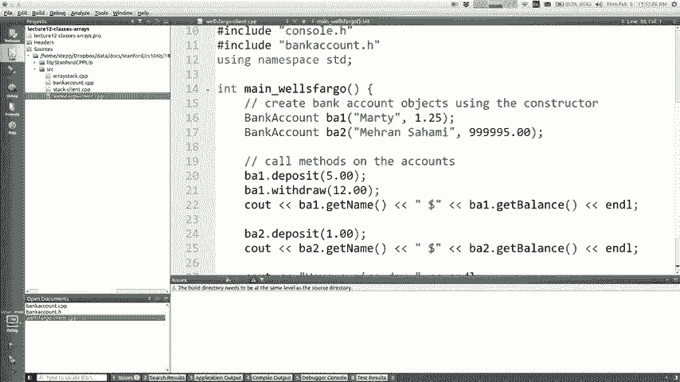

现在，我们运用关于类的知识，来实现一个栈数据结构。我们将使用数组作为底层存储。

### 数组基础

数组是内存中一块连续的存储空间。在C++中，动态数组可以通过以下方式创建：
```cpp
int* arr = new int[10]; // 创建一个可容纳10个整数的数组
```
使用`[]`运算符访问元素：
```cpp
arr[0] = 5; // 设置第一个元素
int x = arr[0]; // 读取第一个元素
```
需要注意的是，基础数组不知道自己的长度，也不会自动初始化元素。

### 栈的设计思路

栈遵循后进先出（LIFO）原则。我们的目标是实现`push`（入栈）、`pop`（出栈）、`peek`（查看栈顶）和`isEmpty`（判断是否为空）等操作。

直接使用固定大小的数组效率不高，因为当数组满时，每次添加元素都需要创建新数组并复制所有数据，这很慢。因此，我们采用一种更聪明的策略：**动态数组**。

**动态数组的核心思想**：
1.  内部维护一个数组（`elements`）。
2.  记录当前栈中实际有多少个元素（`size`）。
3.  记录数组总共能容纳多少个元素（`capacity`），`capacity`通常大于`size`。
4.  当`size`即将达到`capacity`（数组将满）时，我们才执行昂贵的“扩容”操作：创建一个更大的新数组（例如，两倍于原容量），将旧数据复制过去，然后替换旧数组。这样，大多数`push`操作都非常快。

### 实现栈类

以下是栈类`ArrayStack`的简化实现框架。

头文件 (`ArrayStack.h`)：
```cpp
#ifndef ARRAYSTACK_H
#define ARRAYSTACK_H

#include <string>

class ArrayStack {
public:
    ArrayStack(); // 构造函数
    ~ArrayStack(); // 析构函数（用于释放数组内存）
    void push(int value);
    int pop();
    int peek() const;
    bool isEmpty() const;
    std::string toString() const;

private:
    int* elements; // 指向底层数组的指针
    int size;      // 栈中当前元素数量
    int capacity;  // 数组的总容量
    void expandCapacity(); // 私有辅助函数：扩容
};

#endif
```

源文件 (`ArrayStack.cpp`) 中的关键实现：
```cpp
#include “ArrayStack.h”
#include <string>
#include <sstream>

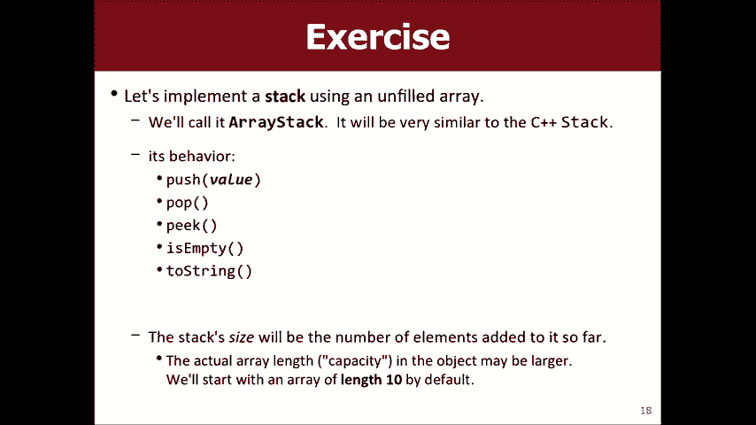

ArrayStack::ArrayStack() {
    capacity = 10; // 初始容量
    elements = new int[capacity](); // 分配并初始化数组
    size = 0; // 栈初始为空
}

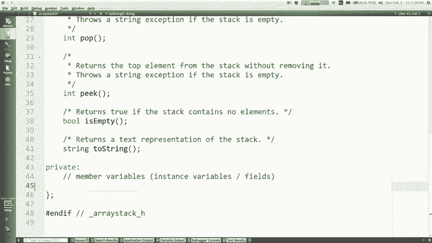

void ArrayStack::push(int value) {
    // 检查是否需要扩容
    if (size == capacity) {
        expandCapacity();
    }
    // 新元素放在数组的 size 索引位置
    elements[size] = value;
    size++; // 栈大小增加
}

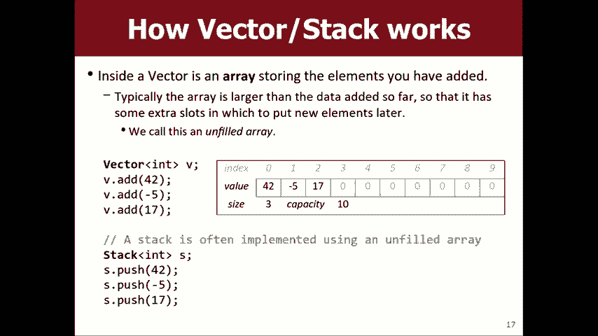

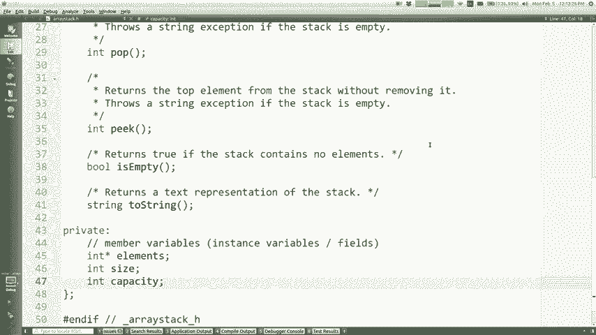

int ArrayStack::pop() {
    if (isEmpty()) {
        // 错误处理：可以抛出异常或简单退出
        throw “Cannot pop from an empty stack!”;
    }
    size--; // 先减小size，指向当前栈顶元素
    int topValue = elements[size];
    // 可选：将原栈顶位置清零（非必须）
    // elements[size] = 0;
    return topValue;
}


int ArrayStack::peek() const {
    if (isEmpty()) {
        throw “Cannot peek an empty stack!”;
    }
    return elements[size - 1]; // 返回栈顶元素，但不修改size
}

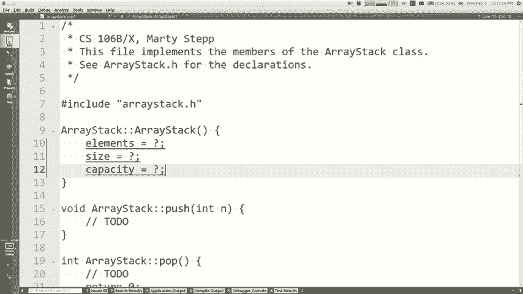

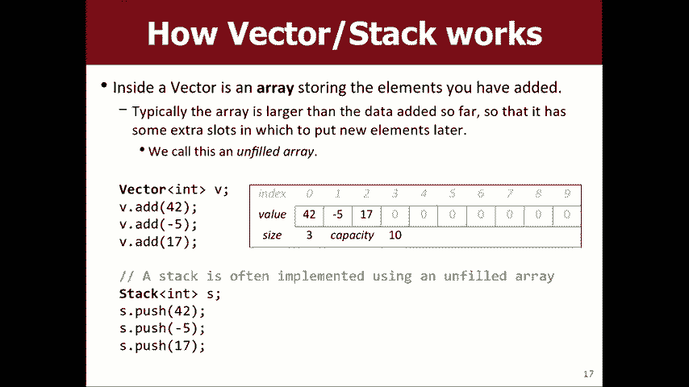

bool ArrayStack::isEmpty() const {
    return size == 0;
}

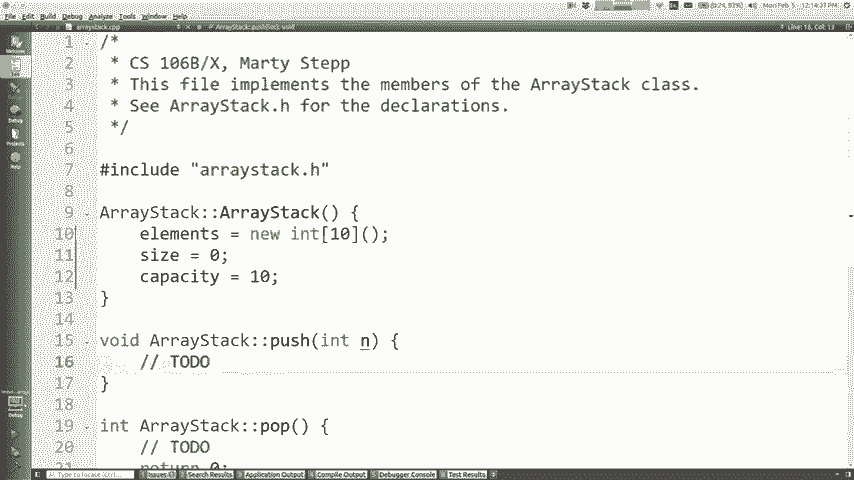

std::string ArrayStack::toString() const {
    std::ostringstream oss;
    for (int i = 0; i < size; ++i) {
        oss << elements[i];
        if (i < size - 1) oss << ” “;
    }
    return oss.str();
}


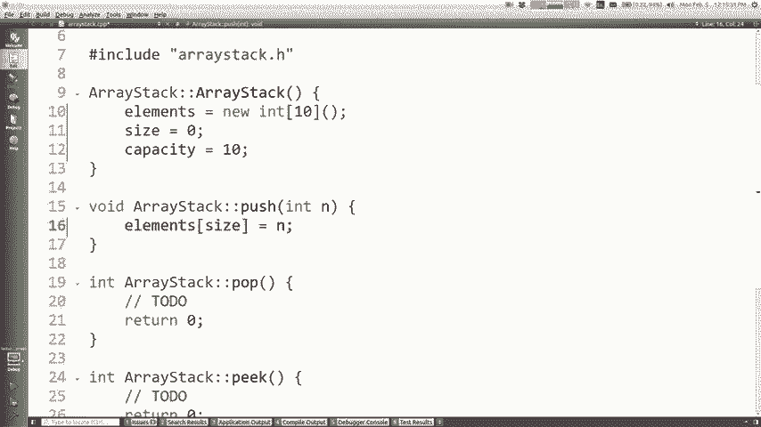

// 扩容函数实现
void ArrayStack::expandCapacity() {
    int newCapacity = capacity * 2; // 常见的策略是翻倍
    int* newArray = new int[newCapacity]();
    for (int i = 0; i < size; ++i) {
        newArray[i] = elements[i]; // 复制旧数据
    }
    delete[] elements; // 释放旧数组内存
    elements = newArray; // 指向新数组
    capacity = newCapacity; // 更新容量
}
```


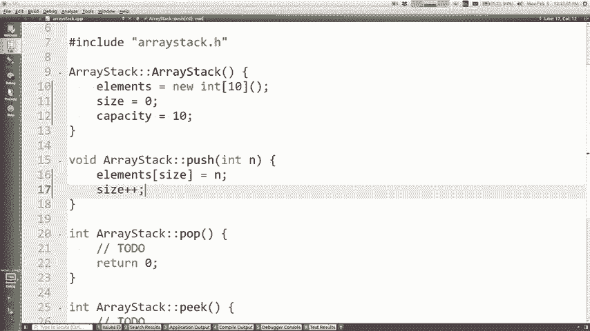

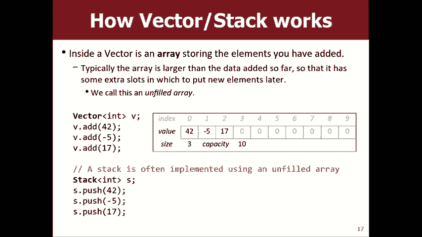

**关键点说明**：
*   `push`操作将新元素存储在`elements[size]`，然后`size++`。
*   `pop`操作先`size--`，然后返回`elements[size]`（即原栈顶）。
*   `peek`操作直接返回`elements[size - 1]`。
*   `toString`只遍历从`0`到`size-1`的有效元素，忽略数组中多余的空位。

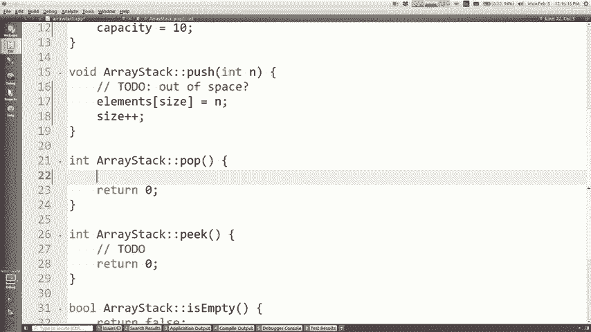

---

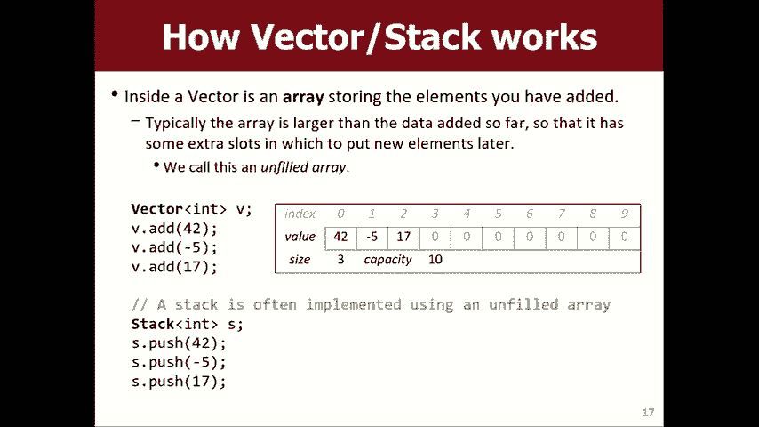

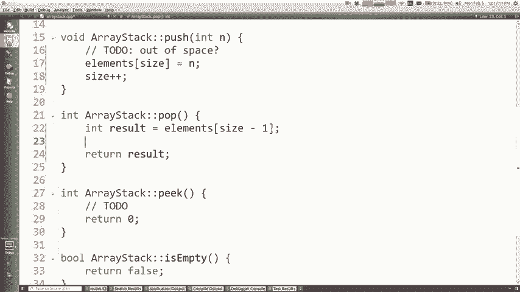

## 课程总结 🎯

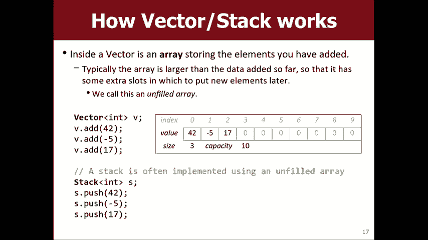

本节课中我们一起学习了两个核心内容。

首先，我们深入了解了C++中**类与对象**的概念。类作为自定义数据类型的蓝图，通过成员变量存储数据，通过成员函数定义行为。利用**公有**和**私有**访问控制，我们可以实现封装，保护对象内部状态。

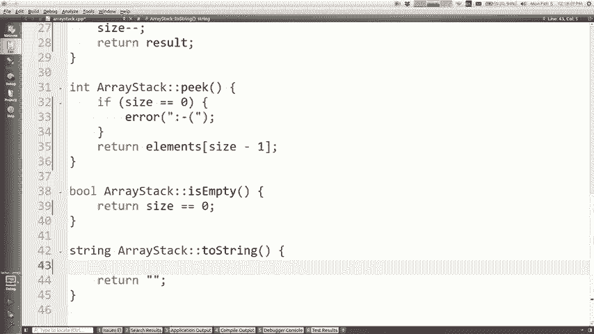


其次，我们运用这些知识，从零开始使用**数组**实现了一个**栈**数据结构。我们引入了“动态数组”的概念，通过维护`size`和`capacity`，使得栈在大多数情况下都能高效工作，仅在必要时才进行扩容操作。

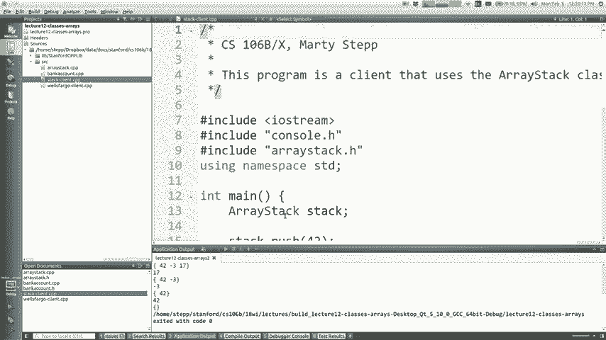

通过本课的学习，你不仅掌握了定义类的方法，也理解了常见集合类（如栈、向量）底层是如何工作的。这为后续学习更复杂的数据结构打下了坚实的基础。