# 编程抽象方法 CS106X 2017 - 课程02：函数 🧮

在本节课中，我们将学习C++中的函数，包括其语法、参数传递机制（值传递与引用传递）、函数原型以及一些实用的编程技巧。我们还将探讨如何设计函数来处理多个返回值。

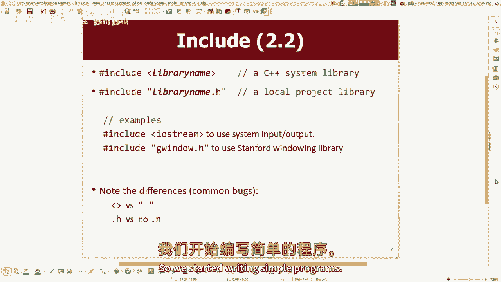

---

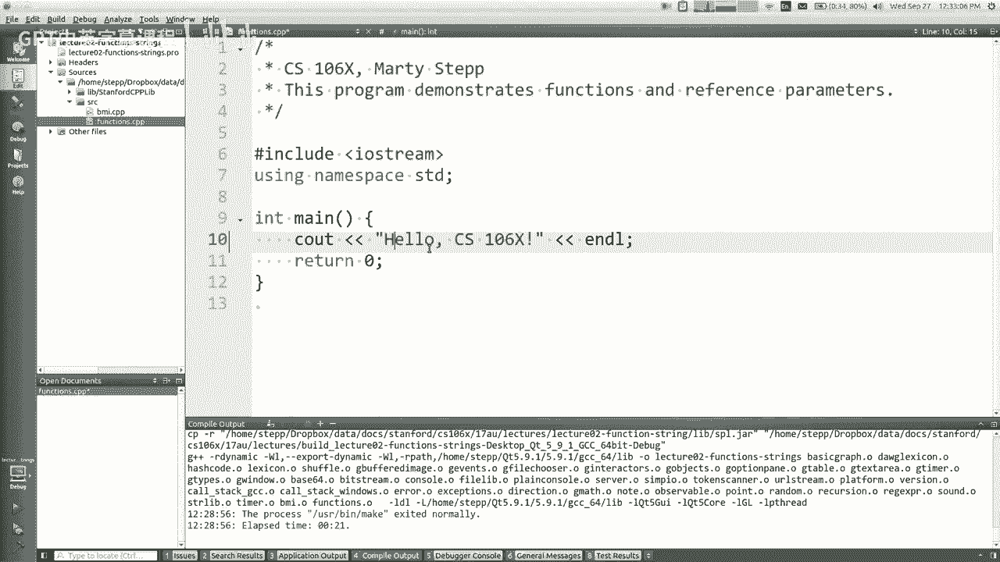

## 概述 📋

C++的许多语法与Java相似。本节课将重点介绍C++函数特有的概念，例如默认参数、函数原型以及引用参数。理解这些概念对于编写高效且结构清晰的C++程序至关重要。

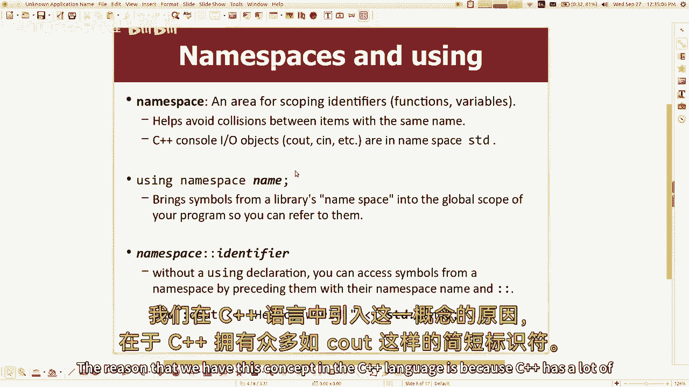

---

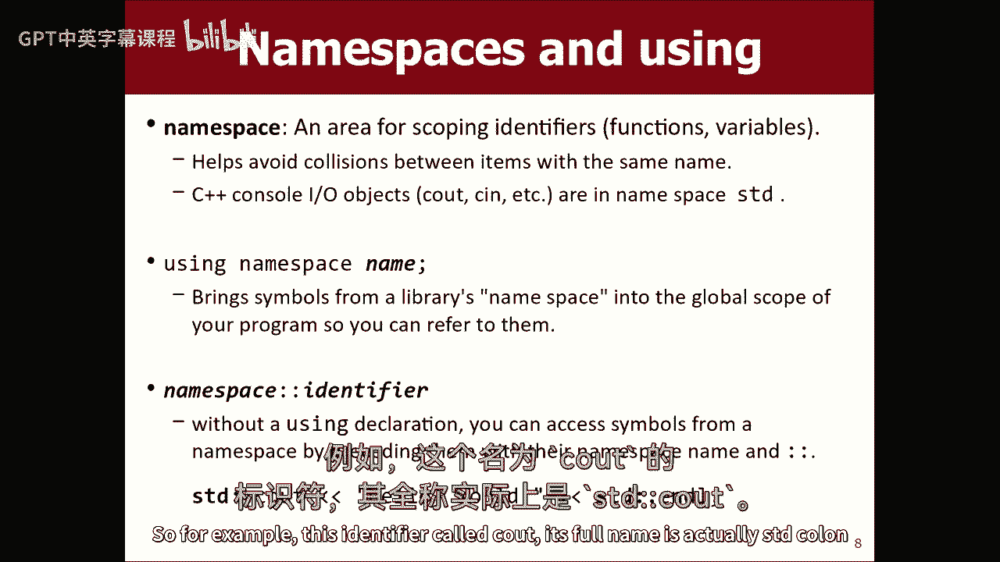

## C++程序的基本结构

一个典型的C++程序从`main`函数开始，其中包含输出语句。例如：

```cpp
#include <iostream>
using namespace std;

int main() {
    cout << "Hello, CS106X!" << endl;
    return 0;
}
```

*   `#include <iostream>` 是预处理指令，用于引入输入输出流库。
*   `using namespace std;` 允许我们直接使用`std`命名空间中的标识符（如`cout`），而无需添加`std::`前缀。
*   `cout` 用于向控制台输出文本。
*   `endl` 用于结束当前行。

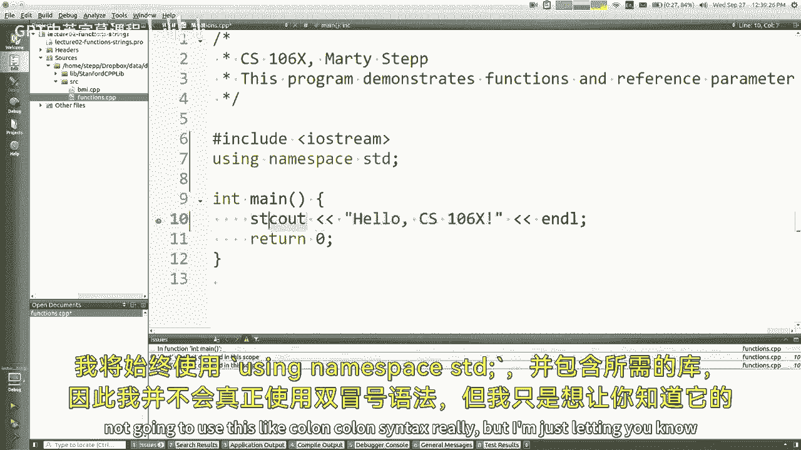

---

## 库与命名空间

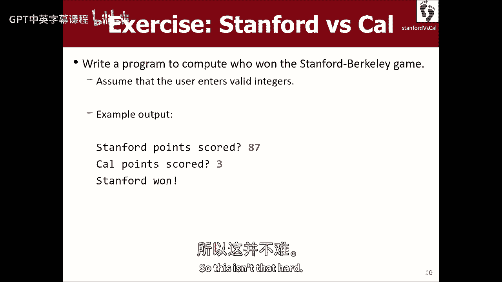

C++中有两种库：语言标准库（如`iostream`）和项目特定库（如斯坦福课程库）。引入它们的方式略有不同。

*   **语言库**：使用尖括号 `#include <library_name>`。
*   **项目库**：使用双引号 `#include "library_name.h"`。

`namespace`（命名空间）用于组织代码，避免名称冲突。`using namespace std;` 语句使得在后续代码中可以直接使用`std`命名空间内的名称。

**注意**：如果多个命名空间包含同名的标识符，且都使用了`using`语句，可能会引发冲突。通常，我们只为最常用的命名空间（如`std`）使用`using`语句。

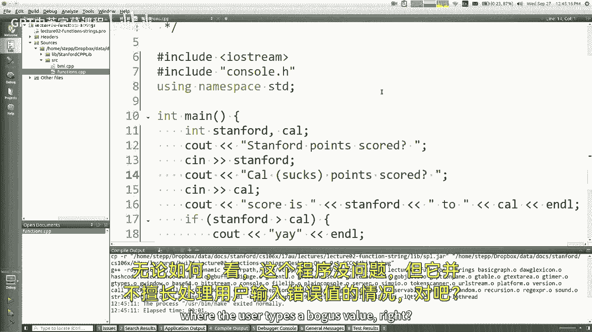

---

## 用户输入与更好的方法

可以使用`cin`进行控制台输入，但其错误处理能力较弱。

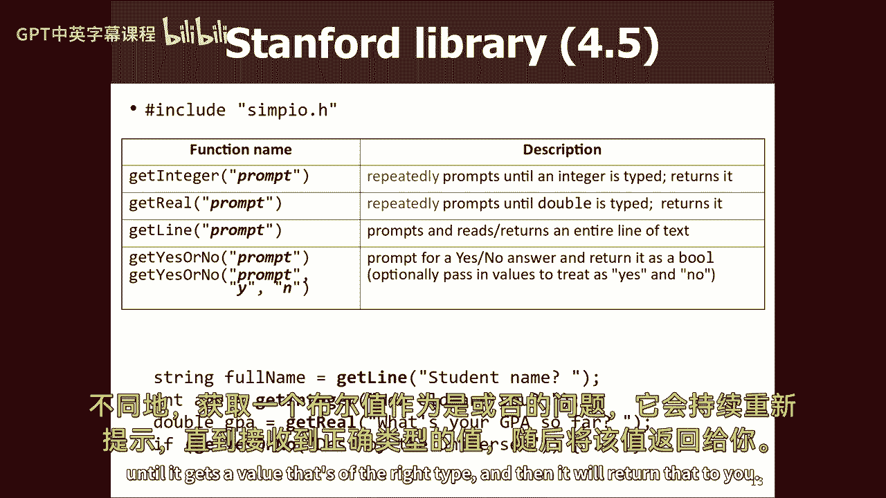

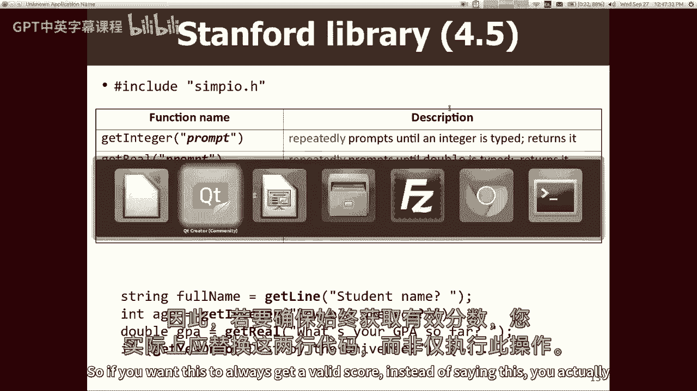

```cpp
int age;
cout << "Please enter your age: ";
cin >> age; // 如果用户输入非数字，此处会出错
```

更稳健的方法是使用斯坦福库中的`simpio.h`，它提供了如`getInteger()`这样的函数，能够持续提示用户直到获得有效输入。

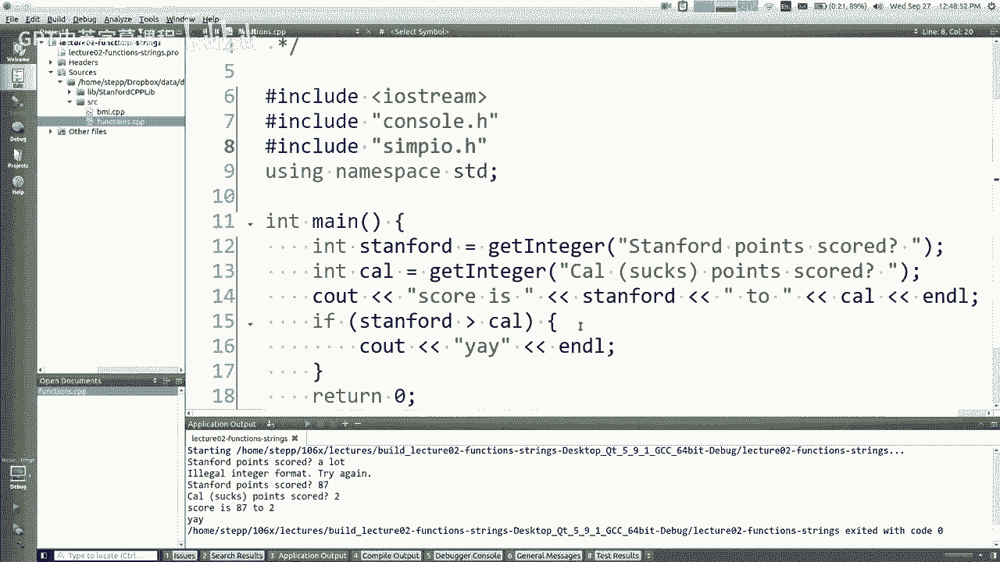

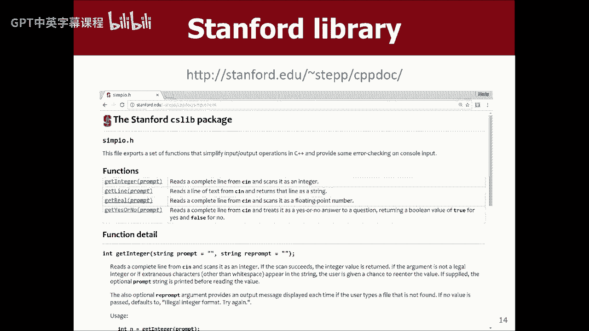

```cpp
#include "simpio.h"
int score = getInteger("Stanford score: ");
```

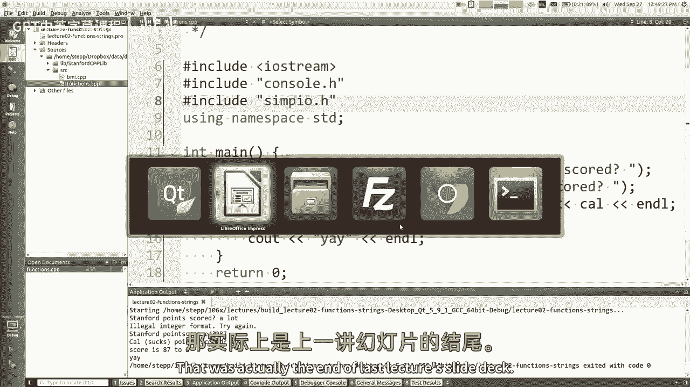

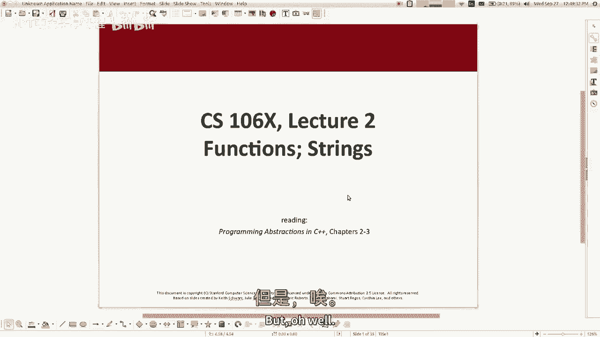

---

## 函数的定义与调用

C++中定义函数的语法与其他语言类似。

```cpp
// 函数定义
double circleArea(double radius) {
    return 3.14159 * radius * radius;
}

int main() {
    double area = circleArea(5.0); // 函数调用
    cout << area << endl;
    return 0;
}
```

---

## 默认参数


C++允许为函数参数指定默认值。所有带有默认值的参数必须位于参数列表的末尾。

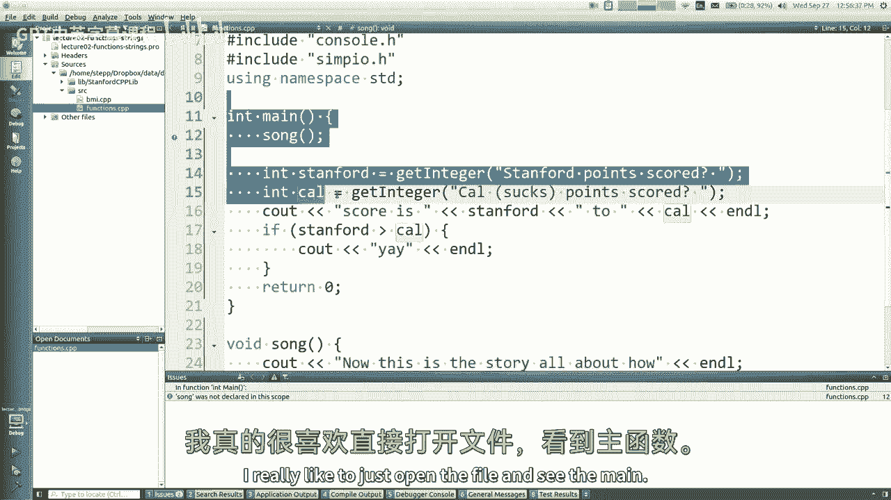

```cpp
void printLine(int length, char ch = '*') {
    for (int i = 0; i < length; i++) {
        cout << ch;
    }
    cout << endl;
}

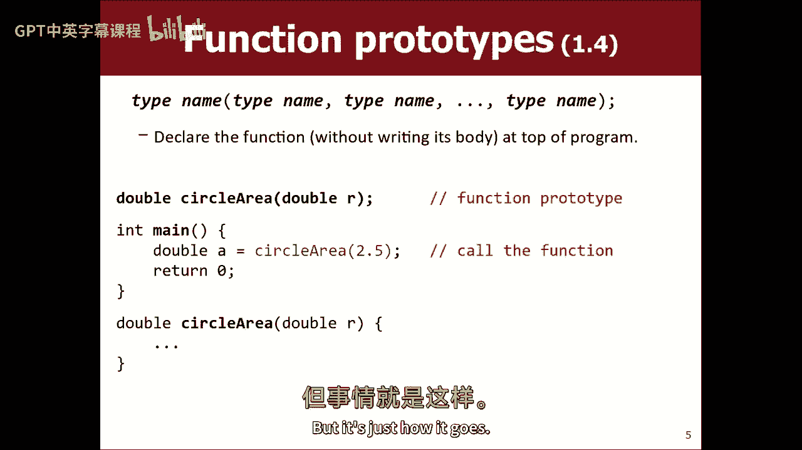

// 调用示例
printLine(10);      // 打印10个 '*'
printLine(5, '?');  // 打印5个 '?'
```

---

## 函数原型

在C++中，函数必须在使用前被声明或定义。如果希望`main`函数位于文件开头，可以使用**函数原型**进行前置声明。

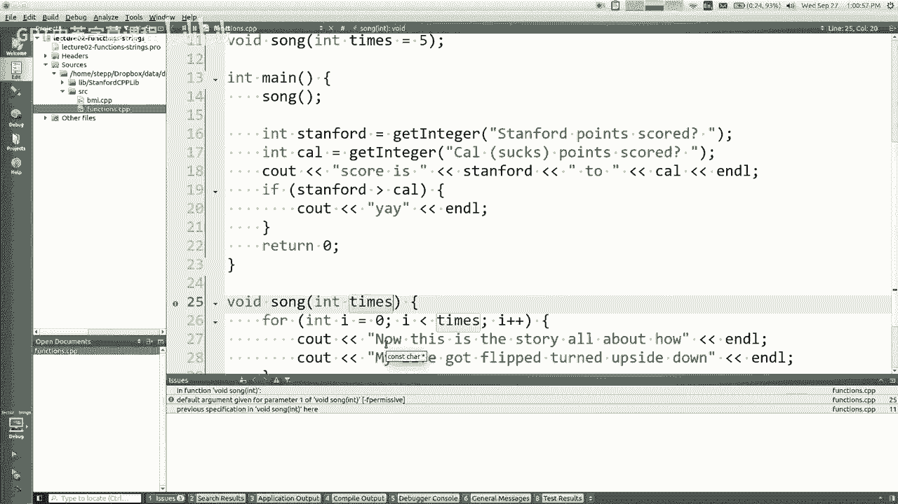

```cpp
// 函数原型（声明）
double circleArea(double radius);
void singASong(int times = 5);

int main() {
    double a = circleArea(2.0);
    singASong();
    return 0;
}

// 函数定义
double circleArea(double radius) {
    return 3.14159 * radius * radius;
}
void singASong(int times) {
    for (int i = 0; i < times; i++) {
        cout << "La la la..." << endl;
    }
}
```

**注意**：默认参数只需在函数原型中指定一次。

---

## 参数传递：值与引用

这是本节课的核心概念。C++允许程序员选择参数传递的方式。

*   **值传递**：函数获得参数的副本。修改副本不影响原始变量。
*   **引用传递**：函数参数是原始变量的别名（使用`&`符号）。修改参数会直接影响原始变量。

以下示例展示了两种方式的区别：

```cpp
// 值传递 - 无法交换main中的变量
void swapBad(int a, int b) {
    int temp = a;
    a = b;
    b = temp;
}

// 引用传递 - 可以成功交换
void swapGood(int &a, int &b) {
    int temp = a;
    a = b;
    b = temp;
}

int main() {
    int x = 3, y = 4;
    swapBad(x, y); // x, y 未被交换
    swapGood(x, y); // x, y 的值被交换
    return 0;
}
```

引用传递常用于以下场景：
1.  **修改传入的变量**（如`swapGood`）。
2.  **实现“输出参数”**，使函数能够返回多个值。
3.  **传递大型对象**，避免复制的开销。

**设计建议**：除非有必要（如上述场景），否则应优先使用值传递，以使代码行为更清晰、更易于推理。

---

## 示例：二次方程求解器

假设我们需要一个函数来求解二次方程 \( ax^2 + bx + c = 0 \) 的实根。由于需要返回两个根，我们可以使用引用参数作为输出。

```cpp
// 函数设计：a, b, c为值参数（输入），root1和root2为引用参数（输出）
void quadraticRoots(double a, double b, double c, double &root1, double &root2) {
    double discriminant = b * b - 4 * a * c;
    // 此处假设判别式 >= 0
    root1 = (-b + sqrt(discriminant)) / (2 * a);
    root2 = (-b - sqrt(discriminant)) / (2 * a);
}

int main() {
    double r1, r2; // 无需初始化，将由函数填充
    quadraticRoots(1, -3, 2, r1, r2); // 解方程 x^2 - 3x + 2 = 0
    cout << "Roots are: " << r1 << " and " << r2 << endl;
    return 0;
}
```

**思考**：如何改进此函数以处理无实根的情况？（例如，可以返回一个根的数量状态码）。

---

## 总结 🎯

本节课我们一起学习了C++函数的关键知识：

1.  C++程序的基本结构和输入输出。
2.  如何使用库和命名空间。
3.  如何定义和调用函数，包括使用默认参数。
4.  **函数原型**的作用及其在代码组织中的重要性。
5.  **参数传递的两种方式**：值传递与引用传递，理解了它们各自的用途和优缺点。
6.  通过引用参数实现函数的多返回值输出。

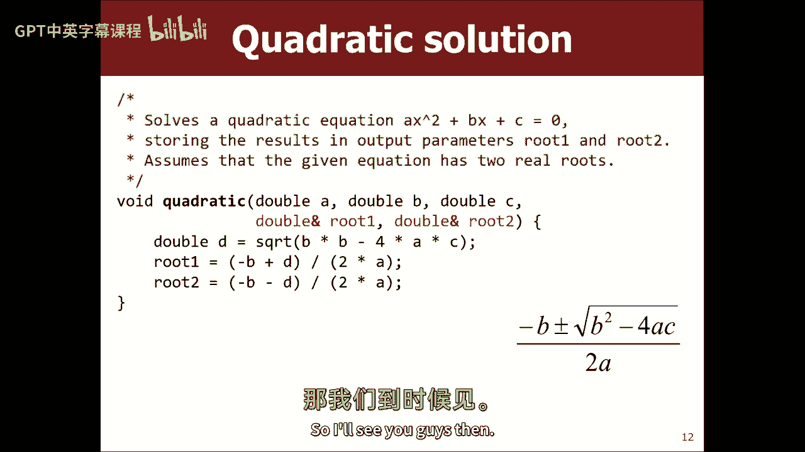

掌握值传递与引用传递的区别是理解C++函数行为的基础。在后续课程中，当我们学习类和对象时，这些概念将变得更加重要。请记住，良好的函数设计是构建可读、可维护程序的关键。