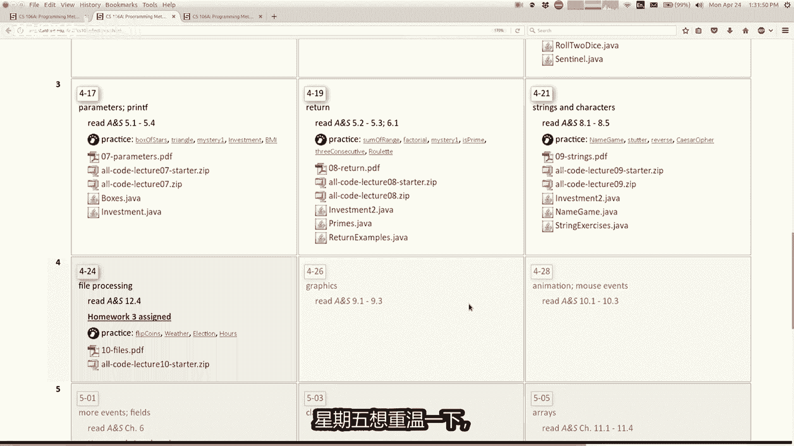
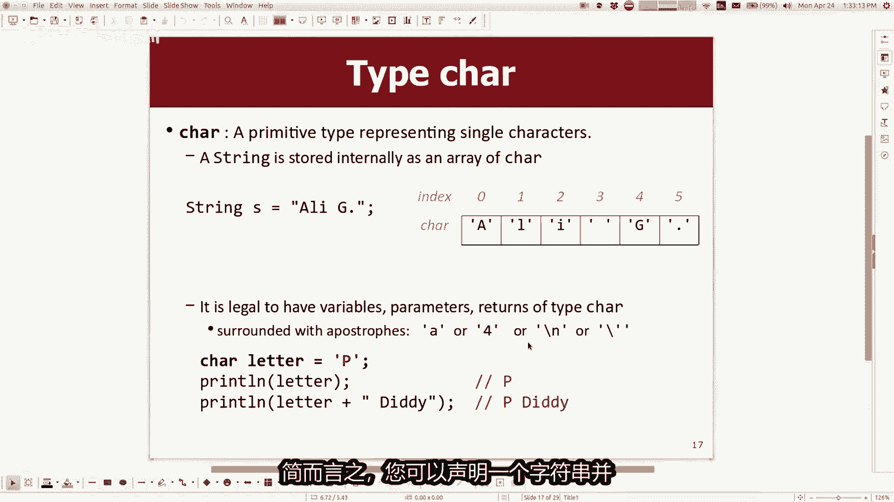
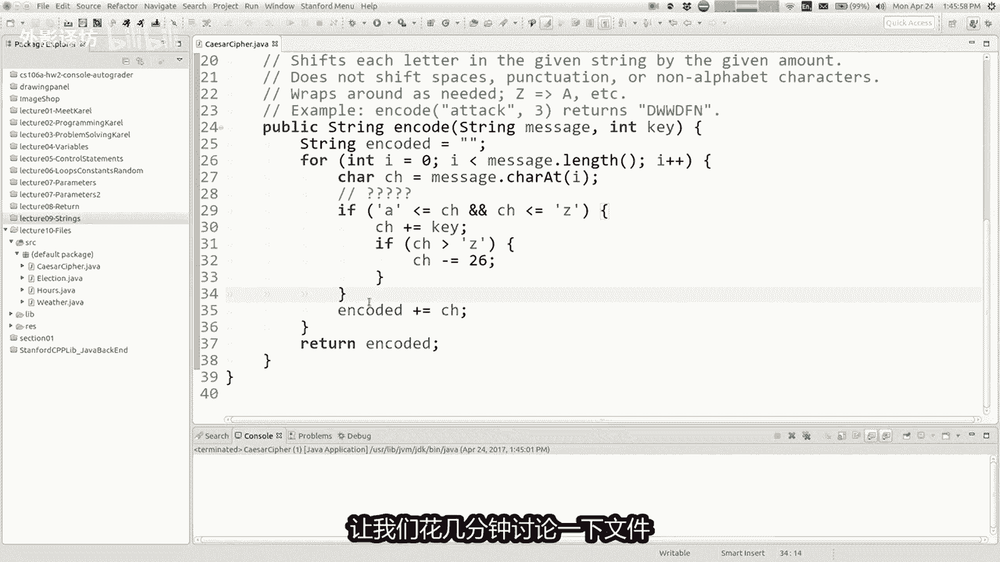
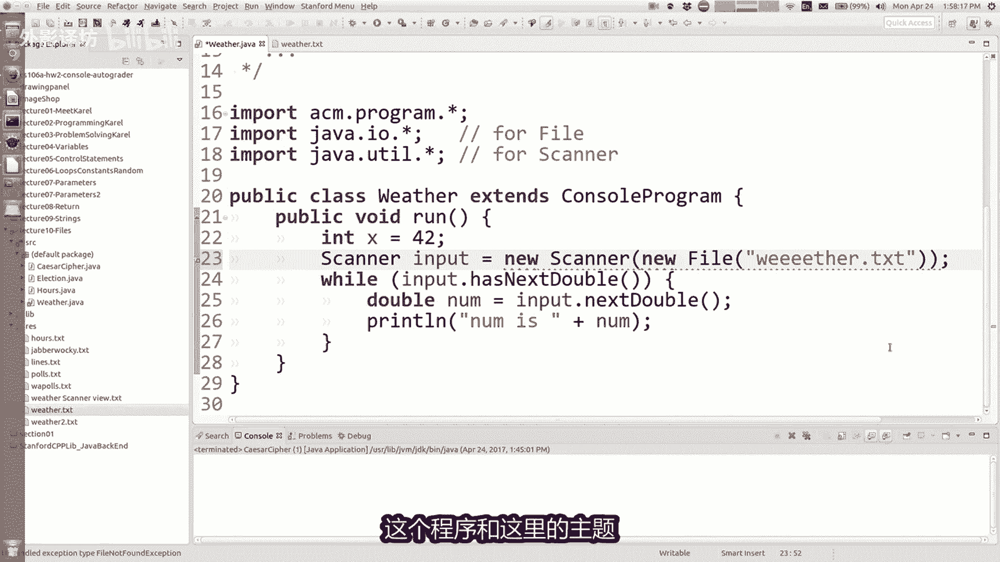
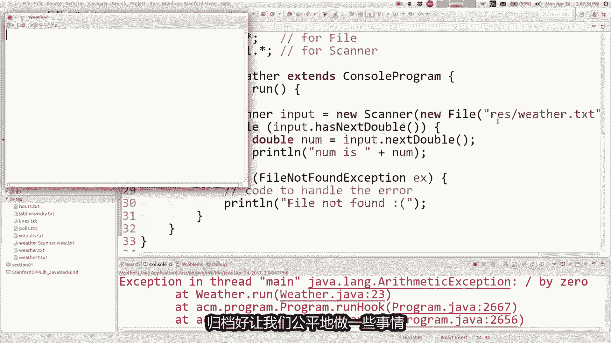
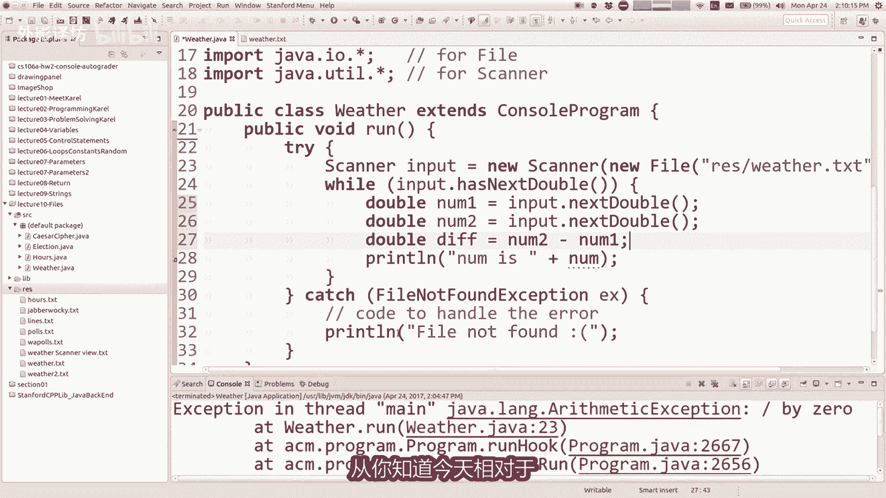
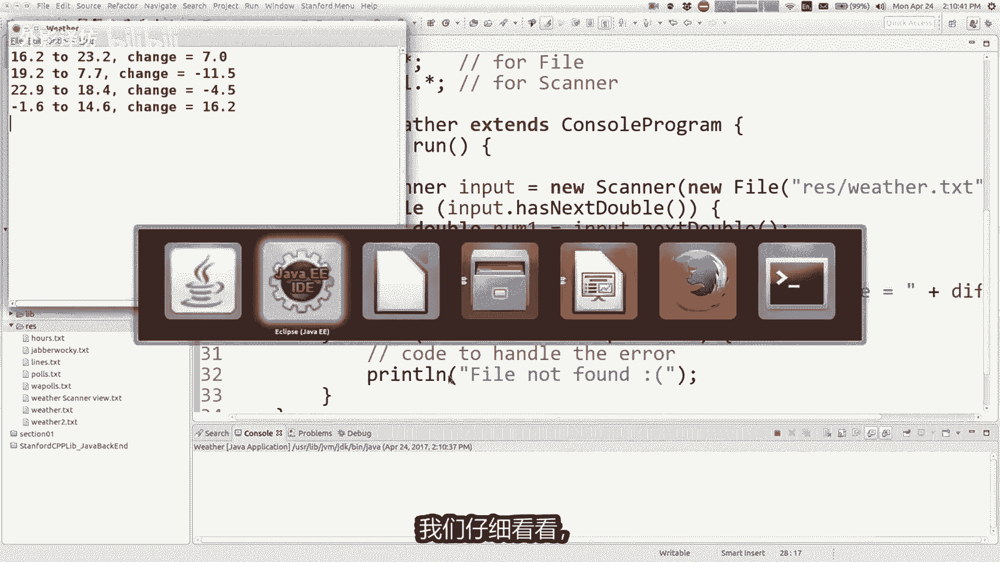
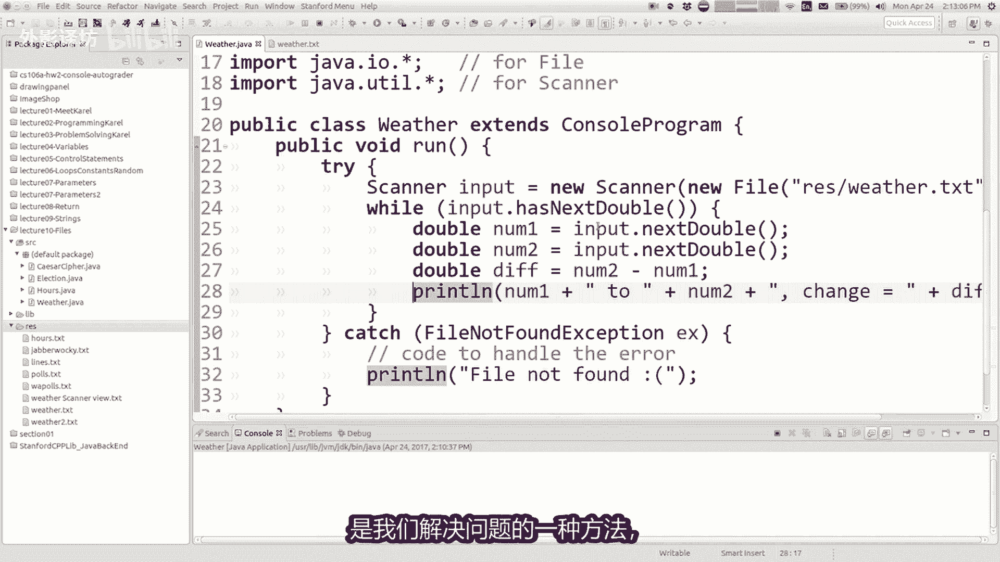
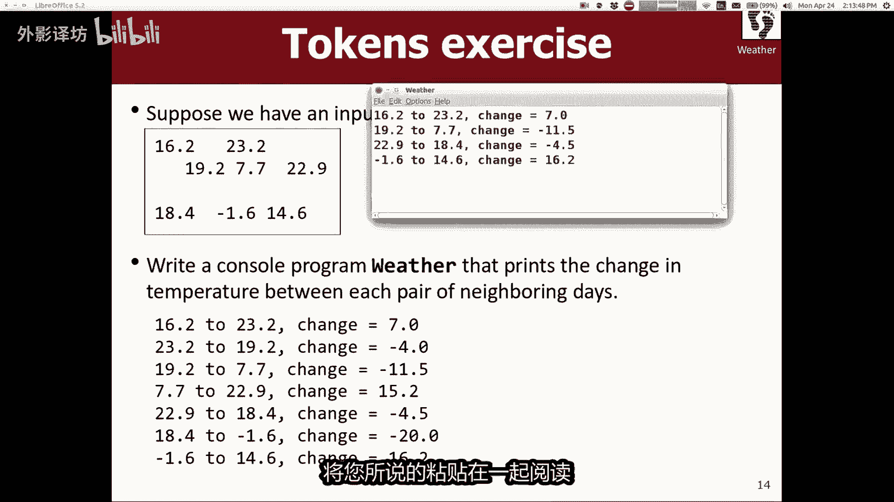
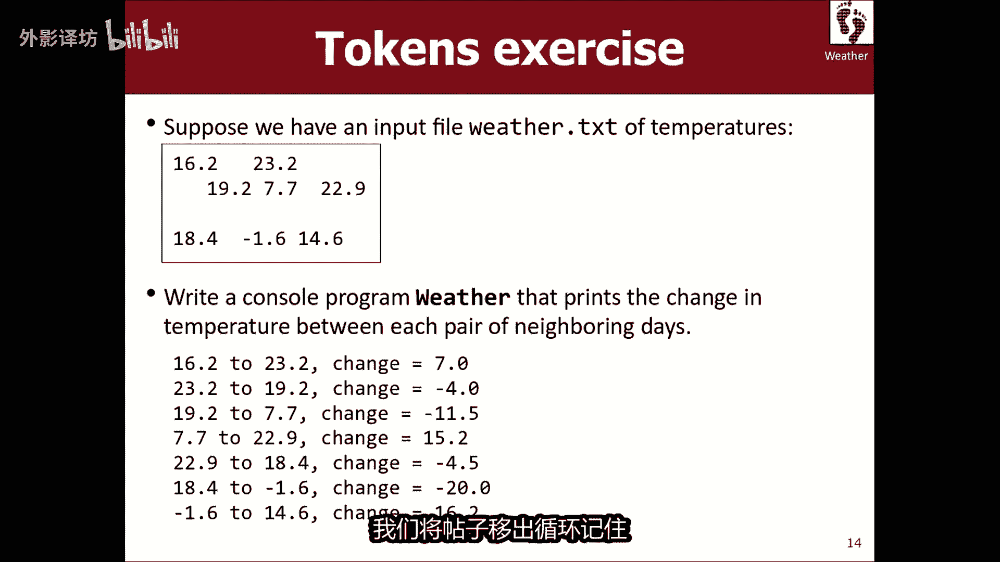

# 【中文配音】斯坦福王牌课程 CS 106a Java教程 2017年春季课程 - P10：10_ Files - 外影译坊 - BV14U4geNEEq

好的我们回来了，这是第四周了嗯，这周我会教你一点，有关今天控制台编程的更多信息，以及从周三开始，我们要学习一个全新的领域，我们将学习如何绘制图形，颜色和形状以及线条和类似的很酷的东西，那会很有趣，我们。

将有一位特邀嘉宾主持人，周五我会告诉你更多相关信息，周三的讲座可能是某人现在坐在房间里，无论如何，我们可能会更多的讨论下次，但请查看文件，今天处理几个快速提醒和公道，有一个今天的作业，三一直使用材料。

包括今天的讲座，编写刽子手游戏病，那是在网站上的，从今天起一周后到期，这是另一个你可以进行结对作业，合作完成剩下的所有任务，如果你愿意的话，我们会成为西蒙斯的对手，开始吧，是的。

时间有关作业的信息会议明天晚上七，所以看看该公告网站还可以，所以在我开始新的之前，今天的主题是关于文件的新主题正在处理，我只是想重温一下，我们最后简单的讨论了字符串。

星期五我想做一点点使用字符串进行更多编码，因为我不得不赶我最后的例子之一，星期五想重温一下。

现在我想来谈谈这个问题，绳子和胡萝卜的区别，你们还记得那会是什么吗，简要概括什么是字符串和字符串之间，的工作区别，关心你如何回答这个问题，是的，字符串是字符的集合，是的，这很公平，护理只是一个单个字母。

单个字符，我的意思是，这就是care的缩写，字全不同的程序员发音，这个自不同的波浪，你知道理解，有人说关心，有人说char，有些人说汽车，当然如果你不说关心，他们却这么说错误，因为它是字符的缩写。

不是性格或其他什么，所以你知道，但无论如何，我不在乎你如何，无论如何发音，抱歉，这很好，因为我的笑话还没有成为爸爸，但我得到了爸爸，开玩笑说准备好了，所以要小心一个字母，坦率地说，这是一个有点麻烦。

我们必须这样做，担心这个独特的事情，你知道他们都只是文本java区分它们，你必须担心，因为如果你正在阅读java，您将要接受护理的计划价值观，你会有一些方法要求照顾或回报。

照顾或类似的事情值得了解这两种类型，所以我刚刚提到，简而言之，您可以声明一个字符串病。

您可以声明护理和主要存储方式的差异，价值观是它们是单一的引号撇号，如果你是做一个关心和一个关心，只有一个单个字母无法存储整个单词，就像我在上面的string s中一样，现在幻灯片还好。

我认为主要原因你想要小心的是，那里是一些护理可以做的小事，事实证明字符串不能这样做，内部存储护理值，现在大多数情况下，你不必担心电脑存储一切都是数字，特别是从技术上讲，角色真的值是整数。

但有一件事是很酷的，是你可以实际使用整数算术运算字符，这会导致性格会自行改变那么多，所以如果你收到字母A和你给它加一个，这不是你会得到的，如果你有字符串A并且你说加一，你得到字符串一。

所以这有点不同行为，但这是你不经常想要的做这种事，但你不能用它做一些我提到过的很酷的事情。

这个程序非常简短的，结束了，上一堂课，我说好，你可以，你可以拿一根绳子，我的手机，这不太好，宝贝让我来做吧，选择你可以拿一根绳子，然后你可以循环的字母，您可以获取字符的字符串。

每个索引我将其存储为char变量，然后你可以在上面做加加，这意味着将其移至下一个角色，增加角色值加一，然后你可以添加新的字符，到一些编码字符串等等，这将在黎明时，吉吉伯克利。

他想把这个A变成B和这个T变成，你这片海变成D等等，所以如果我跑得那么快的话，说他有点难读，所以让我把那里的字体调大一点，我们这样做，而不是攻击伯克利上面印着等等等等，这很酷。

你也许可以提供相反的操作来放置它，回到原来的状态，所以我只想拿走外壳，把这个想法变成一点点，第二个更加结构化的程序，这就是我想做的一般移动字母自行车的想法，数量称为旋转密码，有一个具体的化身。

我认为成为凯撒密码的想法，实际上是凯撒在罗马时期使用的，他们会移动每个字母的时间，13各字母表的一半，就像其中之一，你知道早期的形式，这样的加密或任何容易做到的打破，但我认为他们确实做到了。

如果我拿了这个来发送编码消息想法，也许我把它变成了一个程序，称为凯撒密码，我在其中提示用户请输入消息，然后我提示他们请输入编码键，例如有多少个你想打每个角色的地方，通过加1-5，无论如何。

无论你想做什么，都可以祝福你，然后我会写一个方法，这就是我想要做的结构，这好一点，我想写一个代码中调用的方法，你给我一个字符串，你告诉我有多少个地方你想改变它，我会生产我返回的新字符串。

是该消息的编码版本，如果可以的话，你可以打印出来，说些你知道秘密的话，消息正在呼叫，另外好的，所以我们要一起写这个方法，在代码中，我只是想向您展示这个方法结构在哪里，运行有点短。

我们有大部分另一个地方的逻辑和，我只想练习一点点更多参数和字符串，以及退货和所有这些东西，这样我就可以，当然从我写的这个开始，我可以去复制所有这些，然后像这样粘贴，但也许你可以告诉我。

我想最快的解决方法是，你知道这不叫秘密消息，这就是所谓的消息，所以我可以这样做好吧，还有什么其他的事情吗，我需要更改此代码才能打开，它，变成了方法所说的内容，应该做的。

因为我们应该运送所有GN的字符数量，很多地方与我的代码不完全一样，这样做我需要改变吗，是的，是的，那很好，他说而不是移动加号，总是移动每个另一个转发一个，你说正确的是，我们需要转变。

由用户输入的位置数决定用户请求的地点数量，并且该位置数存储为这个键，所以如果他们采取五班制五个，所以我可以换档，而不是加号，通过该菜单说加等于键，无论关键是什么，都将其添加到其中，性格还好，现在还好。

其他事情是，这个方法应该生成这个名为encoded的新字符串，我认为我们正在做什么，我们在做什么，应该在这个方法结束时做，一旦我们完成生成该字符串，我应该返回那个字符串，因为他说我正在返回一个字符串。

他在这里说，如果你调用编码攻击三，它应该返回这个新的表示DWD的字符串，你可以看到，如果你想的话，现在返回编码好吧，也许我应该打印，并像这样在屏幕上编码不错的答案，打印出来没有问题，我们的。

但是很多时候你有这些，你给我一些方法输入，我会计算一些东西，然后我将返回我计算的结果，你可以做任何你想做的事，你可以打印它，或者你可以使用它或存储它，或任何你想要的想法是发送编码消息。

在运行时返回并存储在这里方法，然后乱方法使用它，将其打印为其他东西的一部分，无论如何，编码方法，我们正在写的是一个帮助单位的run方法使用的，我们的计划还好，所以让我们给尝试一下，让我们运行一下。

其次我要结束最后一堂课项目，我要运行这个项目，凯撒密码被称为秘密消息攻击，BERKELEY编码为五，所以很友好，看起来不错，仅供参考，我认为它正在发生变化，那些五个字母很酷。

然后我开始看到这些百分比标志和，直到标志和诸如此类事物的，你认为我为什么会看到那些想法，那是什么空间，是的，原来我的意思是，看看有某种映射子的表的某处字符的整数值，是我猜字符有那个整数值。

如果你取任何整数值是一个空格，然后加五，你得到我们的整数值，我不知道自己没有的百分比，记住了，但不是那么酷，好像是这样，现在也许我们不喜欢这样，也许我不想让小迪得利的爷爷和他。

在我的里面的东西和百分比在我的里面输出，所以如果我想避免这样的，我可以这样做的一种方法是只调整字符，实际上是字母，而不是字符，是标点符号还是空格，那么我该怎么办，修改此代码已经移动字母，不是其他曲线。

任何想法，是的，在字符A上向右循环，通过C，我认为这是一个好主意，甚至可能不需要循环，因为我认为你要问的是，就像循环所有这些字符一样，检查当前字符是否是其中之一是正确的，如果是A，如果是B，如果它是C。

那么我们想对其进行编码，但是如果不是我们不这样做，我认为有一个更简短的说法是，没有需要一个循环，我的意思是我想就在在这里，我们可以做一个测试，如果我们应该先移动这个字符，然后再移动，否则我们应该这样。

所以我想你说循环，但我想我认为只是简单，如果可行的话，我们可以改变这个，但是这里发生的事，问题的原因是否是如果，字符数小于或等于26，因为C是第26个字母非常接近的字母表。

但是26我不认为这只是某个数字，字母Z必然具有26作为它的价值，我认为我们想要的是，如果基本上小于或等于Z，你可以问小于大于平等，你可以使用内容，我们还可以对角色进行操作。

说些你知道字母A的话小于或等于该字符，所以基本上是在这个范围内，我认为这基本上就是你的样子，到达它只是循环字母范围，看看他是否在那个，我可能只是如果你在这个范围内，至少在A的值范围内通过C，如果是的话。

我想将其添加到，你还好吧，让我们试试吧，让我们看看会发生什么攻击，有五编码，所以看起来大部分是，工作，因为空间仍然是空间和感叹号，仍然存在感叹号，这里的波浪线是什么，怎么样到达那里。

我以为我们正在努力以避免类似的事情，是的，是的，他说可能有大约五个高尔夫字母编码表后，为什么他可能会去从一到Z，然后无论我是什么形式，猜测波浪号字符是四个地方，在C之前，所以这就是为什么我们得到这个。

如果你得到一个，如果取Y加五则波浪号波浪线，哎呀好吧，我们该怎么办，有了它，我的意思是你知道应该做什么，该字符如果不是波形符的话，就是，我认为这是另一种说话方式，就好像你只是在转移。

通过E你A变成B并且B变成C等等，C那会发生什么，给出这个重新开始MIXC的答案成为一个概括，所以是的，我认为这实际上是个好主意，所以如果我们向上走，字母Y就会变成五，会变成GABCD变成D是的。

所以我实际上并没有这么说，这里的代码怎么样，如果性格不好的话，就这样解决他好吧，当然我们必须是比这更具体，但如何我知道如果增加这个会不会不好，关于师德的角色，如果有的话，之后你会很糟糕，但仅此而已。

因为我们的移动速度为五，具体的例子就像什么是描述的一般方式，我已经转移到代码中的点角色，所以我可能做到了，现在很糟糕，我怎么知道我是否把它弄坏了，是的，如果新角色更全面，比Z更糟糕，所以如果字符大于Z。

那么怎么办，你修好大，你说把它包裹起来如此简单，这样我就可以把它包裹起来，减去26，是的，你知道是这样的，只是是的，这很糟糕，CH减等于26-26，所以让我们尝试一下攻击伯克利的代码五。

我认为why现在变成了D好吧，式的此代码不适用于负数，例如如果你把它移回来，你可以有一个性格太低，太远到另一个方向，但你可以以非常相似的方式解决这个问题，添加26，检查是否小于添加20，你能做同样的事。

所以我现在不想编写该部分的代码，和你们一起生活，但我会发布一个您刚刚添加的版本，另一个如果或两个，对此你是很好，这是凯撒密码旋转，从他们那里得到密码，并再次正如我所说的那样，或者随意使用这个程序。

写下你没有的消息，伯克利分校的同事可以阅读，对啊，这么酷的加密程序，对这对夫妇有任何疑问吗，这里的字符串和关心有不同的概念，返回这种东西的参数有任何问题，让我们花几分钟讨论一下文件。

开始了，为什么我们要好好谈谈文件，文件真的很酷，因为文件保存数据，大多数有趣的程序，你将在生活中与之共事，编程会有数据，我会处理你知道的DNA数据，或者您知道的地址或财务数据，数字字母。

你知道在寻找字数统计和所有这些疯狂的事情，你需要数据来查看和了解的东西，可以来自很多不同的地方，它可以来自互联网或用户，可以将数据输入到程序中，你可以来自传感器，也可以来自到处都是。

但我觉得有点我们学习拉的第一个简单的地方，数据来自硬盘上的文件，开车坐在你的项目中，因为这很简单，这很简单，这只是文件就在那里，您不必这样做，担心互联网连接或您刚刚读取数据的任何东西，从该文件中。

所以我认为有能力处理数据，使程序真正成为现实，确实开辟了一个全新的规范，提出了一些我们可以解决的问题，如果你在最后感到足够兴奋，这个季度你将需要很长时间，道德是或他所期望的未来。

这些课程都是关于处理大量的数据和学习，各种不同的方法，存储它并搜索它以及各种，所以我希望你能考虑加入我们，为此，但无论如何，平面处理，在谈论我想要的文件之前，提到一个概念叫对象说话。

最后非常非常简短的讲到这一点一周了，但我想让你知道它已经开始了，现在我们要学习一点，随着1/4的过去，这个概念有很多，on kick是程序中的一个实体，这是值得的数据和历史事件。

所以您拥有的对象的事例与最多人合作，或见过最多人，到目前为止，类是一个字符串，一个存储的字符串，data a字符串中的数据是什么，我们也许这是一个奇怪的问题，也许这是一个我不知道的明显问题。

馅饼的数据是什么，是的字符串的字符，字母和其他字符，弦乐艺术的核心是数据，也许只是这种思考方式很奇怪，但是屏幕有什么行为，你用这个做什么，是啊，你怎么称呼大家呢，落在上面太贬低了，是的另一个。

就像你可以说我想要的那样，你或我想要的子串大写的，你或我想要你的长度，你的绳子或者类似的东西，有这些不同的消息，或你可以发送到字符串以获取的方法，他为你做事，所以无论如何，我们已经还看到了其他几种。

从技术上讲，对象是随机的，你们正在使用的数字生成器是反对，因为每当你写某物点某物，意味着你可能正在和一个物体说话，仅供参考，所以我们为什么要关心什么，这意味着物体完全是真的很整洁。

因为它们可以让你一些功能和一些东西，将一些数据放入一个小包中盒子，然后把它放在你的程序，这变的有点您的可重用代码模块程序可以使用，它是一个非常强大的，这个想法有点难以理解为新学生努力。

所以我们要去稍后慢慢接近他，我们将学习如何编写自己的新类型的对象，添加新对象，java语言将是真的很整洁，稍后会出现，当然但当我们继续前进时，我们学习如何使用一些物体，java或某些写在此处的对象。

斯坦福大学是我们图书馆的一部分，当你想说话时的一般数字对于一个对象，你必须将其声明为变量，你已经看到了一点，有点像我们的你见过这个码，我忘了，你声明一个对象的方式，你是像变量一样声明它。

但是而不是你说像index等于4~5，你必须说出类型，然后你必须说名字等于一个新对象，然后你必须指定所需的任何参数，这将初始化该对象并设置好后就可以使用一次，你已经创建了可以使用它的对象。

通过编写以下内容来调用它的方法，带点的对象名称和方法名称，所以我的意思是，我认为这是一个有点抽象，让我给你看一下更具体的例子，我的原因，现在谈论这个是，因为当你想从文件中读取数据时。

必须可以发射相关物体，首先有一组对象，如果你想使用的话，称为火对象，你必须说import java大IO点信号，所以IO表示输入输出，所以我们正在使用对象的集合，与输入和输出相关。

所以你可以创建一个新的文件对象，所以我做了文件AF等于一个新文件，然后I写了示例点文本，所以当我说新时文件，它实际上并没有修改我的硬盘驱动，它只是意味着我希望我的程序查看该文件，已检查该文件。

所以这个文件对象可以帮助我做到这一点，和文件对象有你可以说的方法，文件是否存在，它的链接是什么，有多少字节长，电话以及对方的名字是什么，我想更改文件的名称，当我删除文件等时的文件，还有一大堆其他方法。

所以它可以让你与用户硬盘上的文件没问题，这又是一个对象，所以你说文件F等于新文件，现在你说F点，无论如何，如果你想和他谈谈，现在我们主要是磁盘上的特定文件，使用文件对象作为对话的桥梁。

另一种可以帮助我们的物体从文件中读取数据，我所指的其他类型的对象被称为扫描仪，扫描仪对象，你必须导入另一个包，称为java dot uto dot start，一次你已经完成了。

你可以创建一个扫描一对象，扫描一对象时读取数据的东西，您可以读取数据的来源，wow读取各种数据不同的地方，所以当你创建一个扫描仪对象，你必须提供一个文件作为您创建踏实的参数，所以你说我想看看这个文件。

然后它是扫描仪，我想让你读，从该文件中，我们更常见的希望这两行放在一起，我们说我想要一个可以读取此内容的，新扫描仪文件，称为我的数据文本，所以这种你如何开始阅读文件，所以让如果你在这里访问我的项目。

我会告诉你，我有一个东西叫做，我是否将读取一些有关温度的数据等等，但是在程序中，如果你想读这个文件，你知道我们没有非常了解这些的结构项目，但这里有一个你的java的SRC源代码目录。

文件被放入一个lab库中，包含盖斯坦福图书馆的目录，你们用来得到的东西，这些程序文件和你的东西，你的项目还有一个目录，名为rise的资源排序文件，在这里我可以放置文件程序来读取，所以我有一些文件想要。

我现在想看看，我首先要读的是称为天气点X，它只是有一些温度，高温或低温，I没有编造一堆数字文件中的实数，可以如果我愿意的话，读取该文件的内容，我可以来到这这件事，我必须确保我已经导入了这些包课程和事务。

在这里我只是写入扫描仪，输入等于新扫描仪新文件，天气点text，好吧，现在就，只是为了澄清这是我声明变量，就像你一样，会说X等于42，这时声明一个名为input的变量，该变量的类型是扫描仪。

就像输入的单词，只是变量名称，如果我愿意，我可以将其称为扫描仪MARTY，但稍后如果我想用这个，我说码地点，然后随便我想在扫描仪上执行的命令，变量的名称只是给出我给他取了一个名字，稍后会提到他程序。

这样你就知道我的很多例子，我说扫描仪输入和学生，我想认为这在某种程度上是一个原子单位，你不能写一个扫描仪之后写一个输入，但这只是一个，我选择给它起的名字，所以好吧，我已经有一台扫描仪，这真是太好了。

扫描仪是您可以读取的内容文件，你可以看到像输入点这样的东西，下一行或下一个双下一个int me，可以要求他读出内容，从文件中一行或一行，他们一次投入，他就会返回他们进入你的程序。

所以让我回到幻灯片，只向您展示几张其他事情，扫描仪的方法，这里有他们在这里是我的，认为你需要他们的把他给，你有一个叫做next int的方法，读取一个数字和下一个双精度数，读取一个实数。

还有一些调用的方法，Has next as next in has，下一行你可以用它们来询问，是否还有更多数据可供读取，所以我认为这个想法可能是我所拥有的一切，都暗示着现在告诉你的是。

扫描仪是一种通过阅读文件，从头到尾查看内容，如果您查看此文件，如果你说我想要一个新的我的项目，就在这里读取该文件的扫描仪，基本上就像它打开一样文件，并设置一个小光标，在文件开头等待供你阅读。

现在如果你说你知道黑双数字等于输入点，下一个双倍的作用是他取该文件读取一个实数，并返回它存储在这里，所以在这个如果他会从这里开始，你会说好吧，下一个双倍在哪里哦，在这里是它将返回16。2。

以及之后扫描仪就未完成了，在那里等待进一步的命令，所以他几乎就像一个步行者，沿着文件或类似的东西，那么现在在代码中，如果你说double number2等于输入下一个double扫描仪，仍将位于原处。

是的你会说好吧，他想要下一个霜，所以继续前进哦，在这里是它将返回23。2作为自己存储，那么更常见的是不是一次性调用这些方法，像这样循环更常见，基本上让我们阅读所有双倍文件。

我如何阅读他们基本上都很好的循环，所有这些都循环，直到文件不再循环，现在还有更多的数字吗，你能做的就是你能说的好，一个文件有多少个数字，12345678，所以我可以说有八个数字在文件中。

这样我就可以做一个for循环八次正确，但我希望你会发现那不是最好的方式，正确执行此操作会使代码不太好，如果您更改文件，则具有多种用途，那么它就无法工作。

文件必须有正好有八个数字，那是什么呢，更常见的是使用这些方法，以像挖文件这样的帽子开头，有更多数据让我们阅读下一篇数据，所以在这个例子中。

我是在这里你会说一些类似的话，输入有一个下一个双井即是的。

我会读双，然后做可以的，所以也许只是为了开始，我会说print line number是加上现在不行了，被小心翼翼地忽略了一件小事，如果你看到有红色在我的程序中在这里下划线，并且也许如果你是。

如果你有强迫症的话，我你快把你逼疯了，马蒂踏实，有一个红色的东西，修复它，修复它，马地修复，就像你知道，当我看我的妻子玩了一段时间，塞尔达呼吸有一点闪光，闪闪发光的东西，在草地上。

你知道它就像蘑菇或苹果，有时他不接受你们中的一些人，可能觉得你必须解决它，所以我知道那是什么感觉，让我们现在就解决这个问题，这是java的一个不幸的怪癖，如果你想打开一个文件。

并且读取该文件可能是文件可能不存在，我可能会写像我们一样不存在的文件名有点text，我没有没有文件用那个名字，所以如果程序尝试打开，我的意思是Mac文件不存在或者可能有权限问题。

但我不是允许读取文件或其他内容，会有一个错误以及方法，java选择处理，这个就是它了，要求你多加一点，将代码写入您的程序中，您将在其中指定，如果有的话，你会做什么，是这样的错误，如果文件和我怎么办。

发现如果你出了问题怎么办，需要描述他们想要什么，在这种情况下要做的，所以不幸的是，他让我们学到了多一点，在我们完成之前，你就知道命令了这个程序和这里的主题。

关于这些错误和处理，事长要做的就是所谓的坚持称为异常异常事，运行错误的另一个名称程序程序，它在中间运行技术上出现问题，当你是卡罗尔撞墙或者类似的东西，那是异常异常，不同于编译器错误或语法错误。

异常表示程序运行时，程序中发生了非法的事情，必须停止，这与就像你忘记了分号一样，无法运行的非法程序，首先这些是不同的东西，好的，但是有些语言称之为错误，有人称之为信号，有人称之为信号。

java使用排序来处理异常，描述这类事情的例外，幻灯片上有一些示例，有时您可能会看到异常，如果你做了一些事情，你会得到一个例外除以零的非法算数，如果您使用的是字符串长度为五个字符。

你要求索引实处的字符那里没有角色，它使得程序崩溃，以及我们看到的情况，今天如果您尝试打开一个文件，不存在，也会生成例外，所以我们有一些有趣的话，谈论这些例外史发生异常，我们说你的通过异常进行编程。

程序出现异常，I不能为他们画画，就称其为狂野，出现异常，但他们不听大部头书，哦好吧，马蒂试图打开文件，他是无论如何都不是很有效，但是程序可以抛出异常，意味着发生错误，您也有可能编写旨在处理的代码。

一个称为捕获的错误异常，所以你的程序的方式应该处理这个特定的错误，是使用java语句，a try catch语句，这是一个有趣的片段，您编写有问题的代码的语法在大括号内，你说我想尝试运行此代码。

但如果出现错误，我想要以下类型的抓住它，并执行以下语句，在那里处理这个，所以我们必须使用这在我们的程序中，是为了在我的例子中编译成功，这里的幻灯片基本上显示了我们需要做什么，尝试创造新的皮肤。

如果失败则捕获异常，写printing某事，所以让我向您展示您是否将鼠标悬停。

并实际看到这个错误是什么，他说你有一个文件类型未处理的异常，发现异常，所以基本上是说你需要捕获未找到的文件例外，否则我不会允许这样做代码，你必须告诉我你是什么，如果文件无法读取该怎么办，你只需要把这个。

然后把所有的都放进去，记住这个try块，尝试做所有的事情，然后捕获未找到的文件，例外，抱歉我无法拼写file not，发现异常，通常你这样称呼他E或ex，给他一个变量名，基本上现在你该怎么办。

要在这里做好，这是代码处理错误，你在这里所做的事有点取决于你可能会依赖，关于程序应该做什么与预期的行为，你的程序，你如果你想读取一个文件，但没有发现你可以解释错误消息，该文件不是。

或者你可以尝试不同的文件，或者你可以要求用户输入有不同文件的名称，您可以采用几种不同的方式来处理一个错误，但你至少知道，如果你想放某种东西，这里的代码意味，如果你不输入代码，程序在这里编译。

但它只是如果文件根本不产生任何行为，没有找到，这可能是坏事，很难找到这本书，所以通常你所做的就是打印类似，找不到文件之类的东西，悲伤的表情或类似的东西，记得他说我们要么不，如果我现在运行这个程序就存在。

然后他说找不到该文件，为什么那个酒吧在左边去那里说找不到文件，但是如果我修复程序，并说是否点文本应该是这样的，他仍然说文件不是电话，因为一个小问题是，这些文件都在这个rise目录中，所以当你打开它们。

你实际上必须写rise斜杠，是否德克萨斯州目录斜杠文件名，所以你知道我可能跳过了一张幻灯片，我应该回到你在的时候写下这些文件名要打开，你可以写一个文件名，本身意味着打开我的程序所在，目录中的一个文件。

目前在或者你可以写一个文件，前面的目录比他会在该目录中查找，所以如果您说rise，它将在您的项目rise中查找，这就是我需要做的目录，让我再试一次，现在他说不是我像他们一样麻木和麻木。

记住这些是这个中的数字文件，我一次将它们全部打印出来，时间是的先生，那是我在读文件，到目前为止，关于这个程序的问题，读这个东西似的，或者他们举起两只手，是的你会的，第一次做，他说我能做什么。

我可以尝试一下，再次纠正程序，你是对的，这是相当小的，是的，他只是说抱歉，失败了，程序就停止了，并且不满意，所以我认为更令人满意的就是，将所有这些包装在某种循环，例如while循环和。

然后不要输入这个文件名，你的宝宝要求用户朗读一行内容，请输入你想要的文件名，并如果文件不存在，它会导致循环继续，如果文件存在，则例外，也许代码会继续运行，好吧，我马上就讲这个或两个，但这只是最小的。

让我们让它发挥作用，这个版本，但你是对的，不是最令人满意的错误尚未处理，你有一个简短的问题，是的，我们不会谈论很多，今天有不同的例外，但基本上已指定了不同种类的错误，例如如果您超出了A的末尾是索引。

超出范围的字符串，如果您进行法律分割，并且一个整数表达式，你会得到一个算术异常，有时当你的程序运行时，如果你有您的代码发生了异常，没有抓住它，实际上会导致你程序停止，你会得到这样的结果。

愤怒的红色文字出现在下面底部，就像我做某事一样，就像X等于零，在X定律上打印line1，这将是糟糕，然后我运行它哦，实际上现在我不喜欢这个，但是我们的什么eclipse设置做什么，就像暂停一样。

程序即将进行爆炸，你知道这就像我的感觉，这与某些电视有某种类比，或电影或其他他们停下来的东西，就在爆炸或类似事件之前，但它停止了，你必须推动这个播放按钮可以恢复它，然后虽然知道，但这里有红色的东西。

你有一个算术异常，在程序的第23行除以零一堆信息转储出来，基本上就是在这条线上说，你做了一些非法的事情，所以是的，基本上回答你的问题，这些消息这里出现的是这些不同的，您可以声明的异常类型。

这里指出了哪种类型的错误，你选择处理哪些类型，是不是你也可以这么说，你会捕获任何异常，这通常是不鼓励的，因为他意味着任何可以可能会出错，你就像我得到了这个，你知道无论发生什么，我都会照顾好他。

通常是你自己知道你不想尝试的承诺，再问一个问题，是的，是的是的，好问题，做文件必须在该rise目录中，没什么特别的目录，这只是我们起的一个名字，在这里您可以参与我们的项目。

将此文件夹重命名为input或MARTY，步骤或其他什么，只要那样名称与您在这里输入的内容相符，没问题，并且您的项目可以从中读取内容，任何文件夹，如果你想要的话，你就可以写出整个文件夹名称。

加上他的文件名可以处理吗，其他文件类型是否必须是文本好，有两种文件，我想给你简短的回答，为此因为长答案可以是可能不太有帮助，而且更令人困惑，比需要的有两个，对那里的文件主要类别进行排序。

是基于文本的文件格式，并且有二进制格式，和如果您打开了类似HTML的内容，web文档或文本文件或CSV，将进入excel的文档有很多不同的格式，例如但如果你打开它们，你会看到该扫描仪可以处理的文本字符。

任何类似的基于文本的格式，还有其他格式称为二进制格式，例如mp3或JPEG图片，或者你知道类似的东西，扫描仪无法理解如何阅读，因为它是一种编码的二进制形式，所以它没有从字面上看是一个点text文件。

但它必须有我们所说的纯文本里面的内容，让他工作和，当然我们稍后会讨论阅读，我们现在做的其他类型的文件，文本内容好，那么我们要做什么处理，所有这些双倍的天气归档好，让我们公平的做一些事情。

简单明了，让我们阅读全部内容，温度让我们计算一下每天的温差，所以读取温度，然后说好吧，从昨天开始，气温16。2度，今天23。2度，上升了7。0，听起来不太好，只是计算很难吗，得到的温度之间的差异。

他忘记了更改。

好的告诉我如何做这样做，给我一些我需要的建议，改变。

如果有人的话，我必须贿赂你们吗，对我有帮助，我会带你去看另一只小狗，这是我能做的最好的照片，不要为了信用而这样做，这没什么，我尽我所能的拍摄，我需要他们，是的，你不被允许拥有任何东西，是的。

你会改变什么，好的再存一个，这样我就可以找到，我认为这是一个很棒的种子，我答应给你一只小狗的想法，图片我有时会遵守诺言，所以这将是其中之一等等，也许让我看看我有没有尖叫，这些提前了这个怎么样好吧。

我给你看了那个好了，谢谢我真的很感激你，今天帮我写代码了，所以你说我应该读书，所以我需要更多比其中一个，我需要他们两个看看有什么区别，你们两个也许是这样的，我有number1和number2。

所以现在我有有两个数字，我可以看到是什么，差异在于两个数字之间，I就像帮助你们解决困难一样，零件这样我就可以做类似的事情，双叉等于number2number1，从你知道今天相对于昨天。

所以我想我应该做什么，打印的是那里的温度。

温度变化等于，所以我可以做那部分是对的，所以打印林没有人，number更改等于加上deep好吧，让我们这样做。

让我们尝试一下，看起来不错，好吧等等，我们仔细看看嗯。

这里发生了什么之后就不太对劲了，非常接近，我认为你的想法很好，开始我想我们需要稍微修改一下，你写的越多，就像哪里出了问题，从概念上讲与行为或输出，如果你喜欢就继续吧，正确的是第二个成为第一个，一这是二。

他正在呼唤他们，一和二对，然后他正在阅读这两个，他称其为第一，没有二对，但我们应该成为什么样的人，要做的就是阅读这两篇文章，然后这二个，然后是这些提示和它的种类，每次我们只前进一。

在那里编码道路向右前进，二，因为每次循环重复时，我们读了两个数字，我想你会怎样，你说的正是你所说的正确想法，曾经为人们所知的，下次应该是第一名，有点像交接，就在这里发生的事情，我我认为这是个好主意。

我该如何转变，将这个伟大的想法转化为伟大的java代码，意思是我会告诉你，我认为核心问题是我们不能同时拨打两个电话，该循环体内的next double，因为如果我们做得好的话，每次读取两个整数等等。

每次我们打印它时，它都会读取两个数字，但我们只想读取一个单号，每次我们打印时，这就是问题的核心，在这里，是的，哦在其中添加另一个while循环，而接待处右侧，我想我们，可以用一个循环来解决它。

如果我们这里有多个循环，每次读取更多数据，我担心，我认为有一个，您知道添加循环可能更简单的方法，是我们解决问题的一种方法。

但我认为我们没有那个就可以解决它，我的意思是，这就是这就是事情，看这个程序中有八个温度文件正确，哦没关系，听起来不错，想法座椅等等，让我尝试，让我尝试将你所说的粘贴在一起阅读第一个。

但对于循环是你这么说，就把它放在这里，就像读一本书一样单一温度，然后在这里我读双份并打印差异，然后有一点你能给我更多吗，其余的方式都说了，所以没有人知道，像那样生活是的追溯，你会发现就像我们这样。

从数字一开始为数字12为21，然后我们打印这条线是好的，现在你的对面已经表示第一的直布，所以现在第一名也在这里吧，然后下次他们绕过来的时候，我们说number2等于下一个双精度，所以不两个将在这个中。

所以现在我比较这两个，所以我们有点，每个人都在该部分将它们加热在一起，在家里一遍又一遍的，我认为这是一个重要的小程序，它是骗人的，看起来很简单。

但我认为这有效，让我尝试一下，我设置正确输出，我认为这是一个很好的解决方案，有趣的是，你怎么知道将这些微妙的小变化编码为代码，产生如此大的差异行为，正如我一分钟前所说，有八个温度羽毛输出。

我指出这是一个栅栏问题，通常我们解决炸弹问题的方法是，我们将帖子移出循环，记住那在这种情况下读取数字时。

我们做的事情是我们做的事情的八倍，多做几次这些事将数字的读数移除一次循环，然后在循环中执行ear加电线后是印刷盒，帖子是阅读，所以打印，然后转载马德里打印条目，所以这是最短的方法。

这是有一个正确的行为问题，是的，这是一个很好的问题，我们不是吗，如果我只是能够解决这个问题，就像读到，然后备份一个阅读，已支持一个可以，不幸的是完全没问题，扫描仪没有倒档，你不能走，扫描仪向后。

有没有理由一个人不能做到这样的事情，它不是一个限制，编程只是它的作者，图书馆或作者选择不添加该功能，可能是因为它会要求它在内存中缓冲，以前的数据，可能会减慢速度或占用更多内存或类似的东西。

所以不支持该功能，但是如果确实如此，那就完全可以作为你说的有效答案是点钱，一个双倍或者一些正确的事情，所以这是一个重要的计划例子，我想再举一个例子，我会很快做这件事，但是这是我有一个文件的地方。

选举数据民意调查未提出敏感话题，选举什么的，但假设我有一个充满投票的文件，来自各个我不知道的州的统计，或县或其他任何地方，以及每一行该文件的格式如下，有某种代码的地方投票发生了。

他有票第一名候选人的百分比，投票给2号候选人，选举人票数的百分比，如果你赢得这个区域，你就会得到最后还有一些额外的垃圾的，现的投票地点或其他地方，像这样或者谁收集的选票或者类似的事情，好吧。

目标是我想知道谁赢得了选举，所以基本上对于第一行，第2号候选人获得54%的选票，而不是另一个人得到34，所以候选号二一和赢得那个区域，他们得到了九个选举人票，基本上就搞清楚了两位候选人的选举人票总数。

找出谁赢得了选举好吧，所以我已经有了输入文件，这里的节目叫做选举，我要尝试快速跟踪，以便我们可以专注于问题，我已经打开了扫描仪去毒那个农场，但现在我该怎么办，与他好吧，这些是他们的输入行。

看起来像这个这个问题，不像那个是否更多的是基于线路问题，比A比国际双打，基于问题，我的意思是，我们确实想要代谢这些对我们来说很重要，但是有点像数据被分隔开，线路如此真实，你可能会。

这里要做的是编写处理以下内容的代码，数据以更多基于型的方式，你可能会说虽然输入有下一个行，然后我将在下一行读该行，阅读整行文字，所以我读完了所有内容，如果你愿意的话，我可以打印它。

布鲁克林线路是加线好吧，我可以运行一秒钟，只是为了看看我是否正确读取文件，这是一个很好的第一个版本，该行式线结束线没问题，所以在这些线有这些小，我想要的输入标记是这个我不太关心这件事。

但是我关心这个这个这个现在的问题是，我如何循环一行的内容，我该怎么做，还有另一种形式的使用扫描仪，你可以制作一个扫描仪，我现在就打电话给代币，这很有趣，因为我会有两台扫描仪。

我的程序一是咀嚼文件中的各个行和，第二个是水平阅读的跨越给定的线，你可以创建一个新的扫描仪，我在讲座前面说过，扫描仪可以读取大量数据，他们可以从实习生那里读到的资料，他们可以从他们可以的文件中读取。

从任何可以阅读的地方阅读S1行的数据，所以我要读取只跨越那一条线，我知道该行以this spend this b开头，这个然后这个以及我能做到的方式，我可以说springs状态等于token。

接下来的点是读取输入的单词，那么这三个是接下来的三个int，所以我可以说int票数等于一，Tokens next int bots two，等于在塔夫托急诊室选举人票时，线上的第三个int。

所以现在我已经将42票存储为我的选票，53中的40也存储为选票，我已将这三个存储为选举对象投票，这就是我需要的基础，形成这个技术程序，候选人赢得选举的基本胆量，这是其中之一，两者中的获胜者得到的更大。

许多选举人票被添加到他们的总计，所以循环所有行，例如我不想跑过去，所以我就停在这里，我们会完成这个星期三，但是去男人时间，明天获取更多信息。

