# 【中文配音】斯坦福王牌课程 CS 106a Java教程 2017年春季课程 - P11：11_ Graphics - 外影译坊 - BV14U4geNEEq

好的欢迎回来，很高兴看到今天是星期三，这是一周四个，我们一起做一些有趣的事情，今天我们要开始学习关于图形，例如绘制颜色和形状和线条，以及所有有趣的东西，我想你可能会喜欢你的，第四个作业将是图形化的。

我想完成一点程序，首先是有关文件的更多内容，因为我并没有真正完成100%，所以他是课程的第一部分整理文件，所以这就是我们今天三点多的情况，现在就出去了，那是你的队友作业。

并且那个人专注于你知道参数和返回流，以及文件和所有我们需要的东西，上周学到的，所以让我回顾一下我们上次写的程序，或者我们开始写并真正完成，这就是所谓的选举，其想法是您读取了一个充满数据的文件。

并且该文件的形式信息，关于谁赢得选票，给定的选票百分比是多少，辖区或城市或州或其他什么，就像这样，如果你看一下我的文件，这里有所谓的民意调查文本，这是输入好，现在我们了解的一种方可用于读取数据的对象。

从文件中该对象被称为扫描仪和扫描仪，有这些您可以使用不同的方法读了数据，所以我想谈谈有关扫描仪的更多信息，因为您知道您需要使用您的扫描仪作业三，以及你的很多其他作业和事情。

所以当你让扫描仪使用扫描仪读取新文件，名为POTEX，好的扫描仪现在拥有的方法可以使用，你可以使用输入之类的东西，点下一个int来读取一个int，你可以说下一个双倍读取您的真实数字。

也可以只写下一个读一个单词，它会读起来，就像你开始一样，在这里你说接下来他会读为l if你再打电话，next就会显示三四，它返回留it的单词，跳过任何空格，这样就是如果您要使用扫描仪，那就太好了。

在这里处理这些数据，我想向您指出，这个数据以及很多一般文件线条很重要，但每条线邢台序代表一条记录，一条一条信息，我只想确保你明白，当你正在攻击任何文件处理，思考一下这个问题很好，我是吗。

对一些有影响力的词感兴趣，项目的输入，或者我感兴趣，在这个问题上，我声称你对线条更感兴趣，因为你可以把它写成一个令牌处理问题，所以你能做什么，你可以转到run方法吗，你可以制作你可以说的扫描仪，好吧。

我真的很想知道谁赢了这些州或城市，或其他什么，现在谁获得了更多选票，请记住这里的格式，首先是状态的排序，然后投票给第一个人，然后投票给第二个人，位于此处，然后是第三个，这是一种选举投票。

比如如果你得到多少分，你赢得了这个州，然后一切之后有点像易写，有关该地点或是谁的信息，整个技术或类似的东西，这个额外的测试，我们可能不关心这个程序没问题，所以如果你想在什么时候读取这个文件。

你让扫描仪记住，扫描仪采用位置概念，就像他正在阅读的内容一样，文件从头到尾，我喜欢把它想象成一点箭头或小光标及弧像，当你运行一个程序时，我的方式喜欢认为有一点当前所在行的箭头，在程序执行时运行。

当你制造新的扫描仪时，基本上看第一个字符或文件的第一行，如果您说接下来输入字符串s equals，接下来输入点，该命令会导致扫描仪向前阅读，直到看完一个词，然后那个消息就在这里返回给你。

在代码中就可以了，你说哦，第一票候选人回到这一点，所以这是一个int，所以我会说int force1等于输入接下来的点是，所以现在扫描仪右室就坐在第一行file向前查找，直到int为止。

就好像有一只蚂蚁34回到34，这就是我们存储的内容，在这个变量中好吧，然后你说得好，这是第一名的票数个人，然后是开发商那个人紧随其后而来，因为你又说混合整数扫描仪，沿着这个小箭头向前移动。

他找到一个54并返回给你，是的，所以投票数是54好吧，然后你说好吧，哦我知道有一个更多的是我关心，我想知道如果您这样做，您将获得多少选举点，赢得了该赌注之后，技术就会增加，知道谁获得了最多的选举人票。

让我们读一下，你知道我会说选举人票等于下一个输入点int，所以我连续读了三个结尾，在这种情况下，第一行输入现在应该是九点了，扫描仪光标就像之后一样，九以及这一行的其余部分输入没有用。

所以我基本上想推进扫描仪，并跳过所有这些东西，最后我想谈谈扫描仪就在那里，然后我有点想重复一下，好吧，就是这样，我不会做那种循环过程，所以如果你回到我们这里，说我们会到这里，而你说的好，我只想走到最后。

问题是你并不确切知道这个有多少个单词，这里有三个弧形国会大厦被调查，这里有四个已存档以及更多研究，这个是为了这个两个，所以一些单词将会好好跟随，你可能会说好吧，让我们一直循环下去，当输入有更多单词时。

下一个标记转到下一个输入点next，但如果我运行它会怎样，循环扫描仪会在哪里，该循环已完成，我们将在文件中指向，他会指向这里吗，一路抱歉，一路走来什么，你说得对，就像这里一样，他会一路走到最后。

整个瓶子意为基本上整个文件将会呼吸哇，还有更多字要读，阅读更多画，所以这不是我想要的权利，我不想走那么远，我只想转到当前行的末尾，确实没有办法询问扫描仪，可以请循环遍地令牌货，仅在这一行中使用的单词。

我们这里的代码，没有一个简单的方法来做到这一点，所以解决方法我希望你们看到的模式，当你关心这些线条时，数据消除的一种是分两行，但每行的内容你想要分开的线，当你同时关心这两件事时，我们使用一个技巧的东西。

我们有两个扫描，所以而不是所有这些东西，基本上我想做所有这些，但仅在文件的一行上，我实现这一目标的方法是，我阅读一行输入点，下一行进在什么时候，我明白了，所以让我们再次遵循，就像扫描仪的光标。

一秒钟扫描仪，如果我们从一开始扫描仪所在文件的开头，如果我说输入，则位于此处的开头，点下一行，它将一直读取到这一行的末尾，然后他看到行尾，然后就行了，到这里，所以这条线将是返回给我的，是所有这些东西。

好吧，现在我已经得到了全部，我手中的线在一个变量中，但现在我要把它切开，并得到其中的小片段和方式，您将对齐方式切成碎片，正在使用扫描仪，您也可以使用扫描仪，只扫描一行，但是你必须为。

那么你这样做的方式就是你说扫描仪，你必须做一些除了书之外的其他名称，所以我经常称之为单词或标记或其他东西，你说等于新扫描仪，并且在括号里你只写一行，所以现在如果你想图片扫描仪上发生了什么。

我就坐在这条线上，已经有这张照片了，有点像两个箭头，现在的世界就像扫描仪输入一样，整个文件中某处的箭头依次向下一行扫描，一次是一个箭头，语弦线，它会向右移动，在那个字符串中，所以建载所有这些东西。

我们在这里写的非常好，还是有点想读，及时阅读言语和诸如此类的事情，但接下来我们不想说成点输入dot maxine，而我们想要接下来说出单词点，这意味着有这个家伙进步并读了一个词，他的信息来源。

所以请阅读AL从他那里读取下一个int，得到234，再次从他那里读取下一个int54等等，看这个扫描仪，方法是一种技巧，用于读取型，但也用于中断，现在分开该行的内容，如果你的输入更简单。

而且你不在乎关于你不知道的台词和单词，必须在你的家庭作业中这样做，你必须重新编译作业，你必须画一个黑男人的ASCII艺术，你不需要分割这些线，除此之外，你只需要阅读它们，并且打印它们。

是它们只是整齐的线条，这也是痛苦的一部分，网络你必须读字典所有的单词，这样你就可以实际上用它来获取这个词，但是文件每行只有一个单词，所以你一次只能读一个单词，这与阅读基本相同，一次在队列中。

所以整个工作的输入是比这稍微不那么结构化，但是你知道这是您可能的一种输入，无论如何希望能够处理。

如果你使用这样的代码，如果你返回到扫描一方法，我们正在开发的eclipse会只需将其粘贴到此处，哎呀我已经有两份让我们运行一下，看看会发生什么，哎呀我有这些什么哦，我就像对材料进行分级一样。

家庭作业二或其他，如果你们生气的话，就关闭吧，你知道你怎么说的好吧，您的计划以及您参与的时间越长，在课堂上开始，举起每一个你曾经在你的工作中工作过的程序，一生都会变得有点烦人，所以你能做的就是批量选择。

您不属于的所有项目，继续工作，只需右键单击并说接近，或者如果你太懒了，你只需右键单击那个你正在工作，并说关闭所有不相关的项目，但基本上除了这个以外的所有东西，所以你确定吗，你想关闭所有这些项目。

是的我愿意好吧，他不会删除他们，他不会扔掉你不属于的进程，立即编辑他们任何剪辑，如果您想要重新打开它们时，使用double点击它们，但现在如果我说我想要运行它，应该只有项目，无论如何。

今天的项目的文件如此，我运行选O错误存在，所以我是不是我没有没仔细看，这里够了哦，是的，我画了这个小光标，在我的文本编辑器上，但你可以只需在其中添加一个胡萝卜字符即可，文件的中间让我们再试一次好吗。

什么都没有发生，也没有发生任何变化，输出因为我什么都没做，有了这些，所以记住我的目标是什么，我应该弄清楚谁得到了每个周获得更多选票，然后颁奖他们的代码，最后我是应该祈祷候选人一号有这么多。

两个候选人和候选人二有这么多票，所以也许你们可以帮助我，如何将该部分添加到此，正在处理的程序，谁的论文可以帮助我解决这个问题，程序，是的，好的创建一些你说的新变量，积累一个好巴士的，我喜欢如何。

你说积累我们了解累积和累积算法价值，开始的想法小或错误，他会成长为随着时间的推移，你想要的价值是正是我想在这里做的，所以也许艺人的总数以人的总数为零，这是每个人获得的相同选举人票的数量，其中一个还不错。

所以我据说会积累下来，那么我如何使用这些来积累，你我在这里，我聚集在这条线上，我收集选举人票，并现在每个人都有的数量，是的，好吧伙计们一个比好吧对吧，所以如果第一个人有更多比第二个人的百分比。

和给他们这些选举人票的权利，否则我想我们可以共度时光，是的，我们假设没有，因为我想保持简单，我们假设数据进来时没有领带，我们可以用if来处理关系，其他地方，那好吧，现在我们有了，现在总共有两件事。

我想指出这段代码还没有完全完成，因为我们打开扫描仪，我们读到单行，然后我们看我不想做的内行内容就只有一线云，我想要对所有行都这样做，该文件我需要添加什么这段代码，所以它将处理完整的，我想我听到有人说。

我只需要做一个while循环，将重复执行所有这些操作。

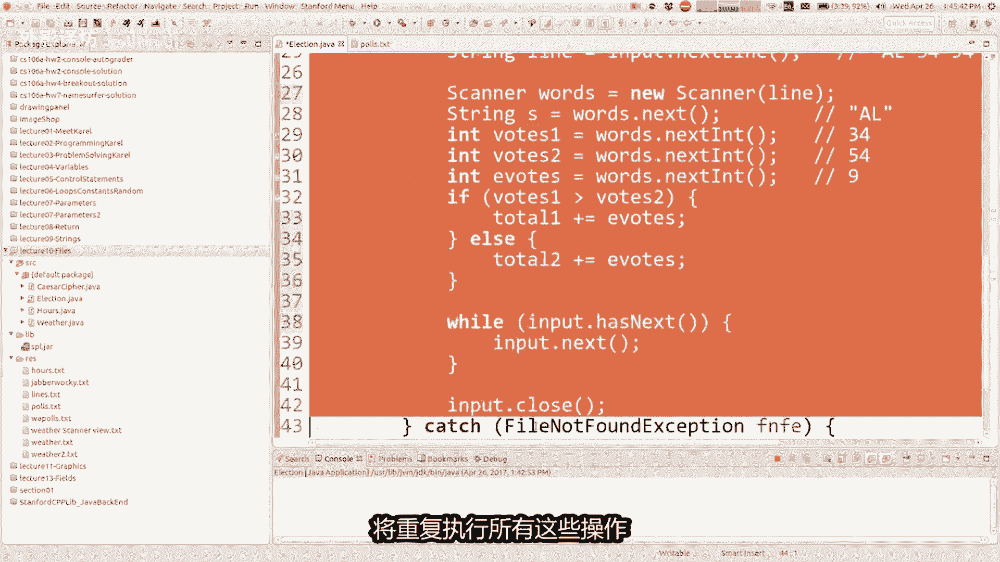

打开扫描仪后，我会说，虽然这个文件有下一行，我，会读一行，然后我会加起来该行的投票，所以这是有道理的，让我们运行看看我们得到了什么，我们仍然没有看到任何东西，因为没有打印混合我们正在计算的程序的语句。

做了一大堆东西，然后就没有了，告诉任何人，这件事是私人的选票，或者我想最后的东西，我们需要打印程序的，他们的总票数抓住了，那么下面怎么样，当我们完成循环后，我可以做打印LN候选人一家总共一票以上。

接下来我将打印候选人二，总共获得二票，让我们尝试一下零和九八，零和九票，好吧哦，这很有趣，所以零和九，如果你首先查看输入文件，第二个候选人，我们不是，我们不是，似乎正在看其他任何一个文件的一部分。

眼尖的人都知道这是为什么，我们不处理其余的插件，设置恢复的文件，然而，是的，我的意思是你正在回答这个问题，早些时候他就像我一样，当我们暂时的无关代码开发这个程序的过程。

这里的意思是阅读全部第一行的输入就是不好，我只是不想那样，我根本不认为这个程序基本上没有，那个就可以了，读一行处理上面的东西线，然后一旦我完成了，回头再读另一本巡线员，继续让我们再试一次。

325票对213票，我认为是文件的正确输出，无论如何，我们都看到了文件处理的更大势力扫描仪，并拥有多个扫描仪，当你这样做时，很多学生会感到困惑，如果调用该方法，则有两个扫描仪，在错误的扫描仪上。

它不会执行正确的事情，很容易得到锁定，所有这些不同的变量，我看到学生的不同类型的价值观，谁对差异感到困惑，在扫描仪和字符串之间，所以我看到人们尝试做下线点这样的事情，接下来你知道他们试图问。

对其有疑问的文本型本身和字符串，不理解如何做到这一点，你必须有一个扫描仪将走过字符串，你可以从中取出食物并给予int给你，所以你知道很多学生们有点困惑，那些不同的类型，但这很漂亮，106A很常见。

所以无论如何，这就是关于文件的更大的例子，我会你把这个贴在班级网站上吗，大家对此还有其他疑问吗，代码或关于扫描仪或文件或任何完成了，是的，到这个程度来增加多样性，以保持就像一堆堆的解决方案，细微差别。

对于打男人的问题是框架，男人会做什么，我需要两台扫描仪执行多个操作，你可以用扫描仪解决付费问题，每个文件只有一个扫描仪式的，我一般希望你知道如何，为此，我愿意问你关于这个的中期问题。

所以我我认为你应该学习这种风格，并且后面会有作业，我们做的是多线，你知道多个扫描仪输入要求，可以还有另一只手或者那个答案吗，你的问题是的，如果你使用扫描仪进行扫描，我必须有一个try语句吗。

你不必进行新的尝试，声明只是为了这个有点仍然被这个覆盖，因为你还在轨道内声明，所以如果有什么完整的话，后备箱失败，它会跳到捕捉点，如果你有的话，记得尝试抓住，忘记的是错误的处理，当文件不起作用时。

所以是的，只要你的整个运行方法是在try块中，那么就可以了，是的，我明白了，所以你只有一行扫描仪，我不是，你甚至不读，实际上如果你这样做的话，你不需要try catch快。

所以让java不高兴的那行是这样的，这就是需要的行try catch，因为你正在打开一个文件，可能找不到文件，是的好吧，然后我想继续学习图形，所以我将此代码发布在天气上，我们来看看。

让我跳到我的新幻灯片，今天我们将关闭该项目，我认为你们是新项目，会喜欢这个，我希望图形式很有趣，而且我有点脾气暴躁。

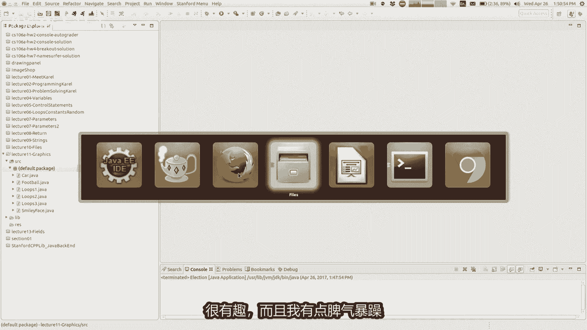

老师等的时间有点长，很多老师在一周内就开始学习图形，三，我等待第四周，因为我想要输入最后一个参数并返回，首先是东西，所以当我说图形是我，我不认为我必须非常努力的工作，其他我们为什么想要学习。

关于这个图形很酷，你可以绘制形状，颜色和线条，游戏和所有这些巧妙的东西，你知道很多程序都是动画图形化，所以当然会是很自然的，想要画出我想要的图形来区分两种，我认为图形的意思是这样的。

圆圈表示平方线条颜色那种东西，并且不特别意味着有很多可以加注的按钮，或者很多复选框，您可以检查或喜欢下拉菜单，它不是一组小部件或GUI编程，但我们后来了解了一些课程，但我要讲的是关于形状和动画的拼接。

它来自第四张，如果你想在其中绘制图形，这本书你的程序而不是扩展，你说你是控制台程序将扩展你的图形，程序，还应该添加一些新的导入代码顶部的语句，他们写在这里，你应该说ACM图形点心。

那是斯坦福大学自定义图形库集合，java aw t点星才是真正的java合法的图形库集，it代表抽象窗口工具包或类似的东西，所以是的，您扩展图形程序，现在一次你有扩展图形程序，有一组新的命令。

一组新的你可以使用的功能，将让你画出你仍然想跑的形状方法，你仍然可以写put肢体，如果如果你想打印的话，你想看看输出一些文字，但它不会出现在你的窗口，它会出现在底部。

我将在调试控制台中使用eclipse，稍后告诉你，但你可以画形状，现在如果你说你要延长图形程序，让我给你展示一些关于图形的东西，当你在屏幕上绘制图形窗口，你正在画的东西有一个小盒子，在整个像素上。

也许你们中的一些人已经知道像素是什么，是一种最小的小矩形，可以出现在屏幕上的颜色，你知道你是否有一把锋利的刀，屏幕可能像素很小，但是很清楚的看到他们，或者如果你是就像我一样，你正在变老，很难看到小像素。

但是他们就在那里，我们可以参考他们，按左上角的整数索引窗口的像素零零，并且作为你向右走，X坐标是增加，并且当你下降时，Y坐标不断增加，使得Y轴反转了，有点奇怪，让人们思考图表和你知道X就是这样。

为什么会这样方式，笛卡尔坐标带计算机Y轴向上的原因，下降是因为视频硬件绘制屏幕，实际上是绘制它从上到下，所以计算机首先想到的是绘制在顶部，所以之后的所有内容无论如何，那是以后的事了。

无论我们只是必须适应这些，X坐标和Y坐标作为偏移，从左上角开始，好吧，这里的范围是多少多少，像素宽多少，像素保罗是一个窗口，你可以设置它，无论你想要什么，我都会告诉你如何做，但通常来说是一些数百个像素。

500宽X300，我会向你展示所有类似的东西，一些例子好吧，如果你有这里有一些图形程序，你可以使用其中的原数据，蓝色的是我们要去的那些使用最多的，您可以向屏幕添加形状，如果您说添加一个矩形。

添加一条线作为圆形，将在屏幕上，你还可以调整窗口大小，并取一个标题，并设置背景颜色和其他一些东西，这里还有一些其他方法，我们今天不会使用，也许尼克或其他人稍后会使用它们讲座，可能在您可以询问的地方。

关于什么图形形状的问题，在屏幕上也许可以修改，屏幕上有，但我想要专注于这个事情意味什么，添加了garbage，什么是garbage，好吧，我会告诉你它意味着图形对象。

但是你可以使用什么类型的图形对象添加，这是什么意思，我相信那是下一张幻灯片上的内容，是不同种类的图形对象，你可以添加一个基因矩形记椭圆形，一条G线，为什么都是G开头好吧，因为如果你不启动它们与G。

则名称与java中内置的事物的名称，所以我们必须给他们不同的埃里克教授，为我们的图书馆命名，罗伯茨在G的领导下做出了任何事，甚至我们只计算宽椭圆形的，你可以画一条线，标签是一串。

我告诉他你是否要画画一个图形屏幕，你应该称它为g string，但他不喜欢这个名字，既然都是你的标签，我不知道为什么你可以像实际一样绘制图像，来自JPEG或其他内容的图像文件。

你可以在你的硬盘上画一个弧线，你画一个任意数量的多边形，所以这些都是你的东西，可以画出实际的语法，画这些看起来像这样，看到这个词心就想，如果你想要一个新扫描仪或新文件，这就是您的方式。

制作一个你知道的物体和这些图形形状，也称为对象，所以我们将再次使用这个新关键字，我们的计划，所以基本上当你想要在屏幕上拉出任何形状，你说我想加一个新的G稀有，你的G椭圆形类似的东西，上面写着新型洲介。

让你感觉像新的G重量和周长，应该写取决于什么样的，如果需要你要添加的对象，添加您所说的椭圆形或矩形，X与Y的宽度和高度，如果你要去的话，把它和它有多大画一条线，我们说X和Y如果你是的话。

这条线的影响要绘制一条流或一个图像，传递一个字符串或文件名和一个X和Y坐标，它完成其余的，所以有一大堆其他类型的形状，和一堆其他类型的方法，你可以使用这里有一个链接。

它也在一个平面网站上链接这些的所有文档。

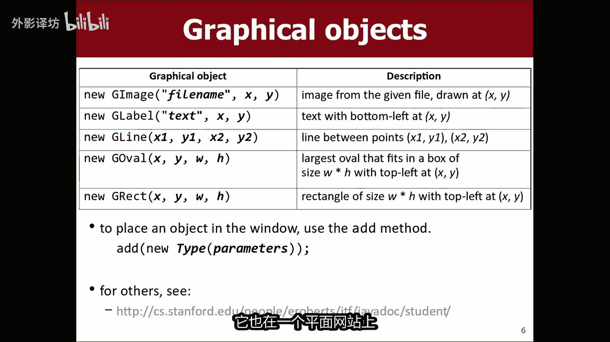

不同的东西，但让我展示一下，如果我转到我的项目。

你可以快速演示一下，在这里，如果你知道我可以做，如果您愿意，请从头开始创建一个新文件，让我们创建一个新类，我将其命名为示例一，图形示例一以及什么，我会做的事，我会说它延伸图形程序。

我需要导入ACM点计划点心，我需要导入ACM图形点心，和我需要的导入这个java a w t点心，所有这些都是绘制图形所需要的，所以现在我可以说公共空间运行，我在这里告诉你，您可以将这些形状添加到窗口。

这样你就可以说我想添加一个位置，100逗号50处的新G矩形，尺寸为70X45，你可以说添加一条新的G线，其您知道端点吗，两百一百到三百一百五十类似的东西，然后你就跑了，这个东西和窗口就会出现。

上面有这两个形状，所以让我们开始吧，图例一，好的哦哦哦请稍等一下，第二我担心我喜欢腐败。

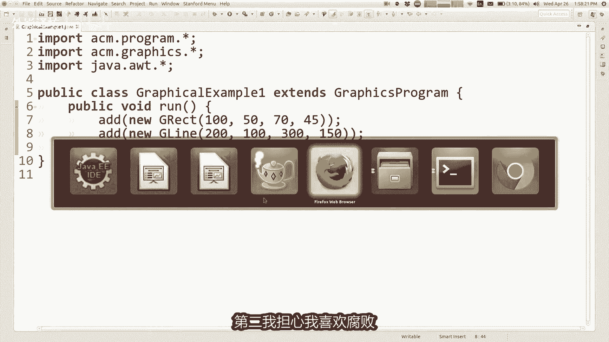

他第二次看向别处时，调用了一份文件，弄乱了我的一些文件，上课前我弄坏了什么东西吗。

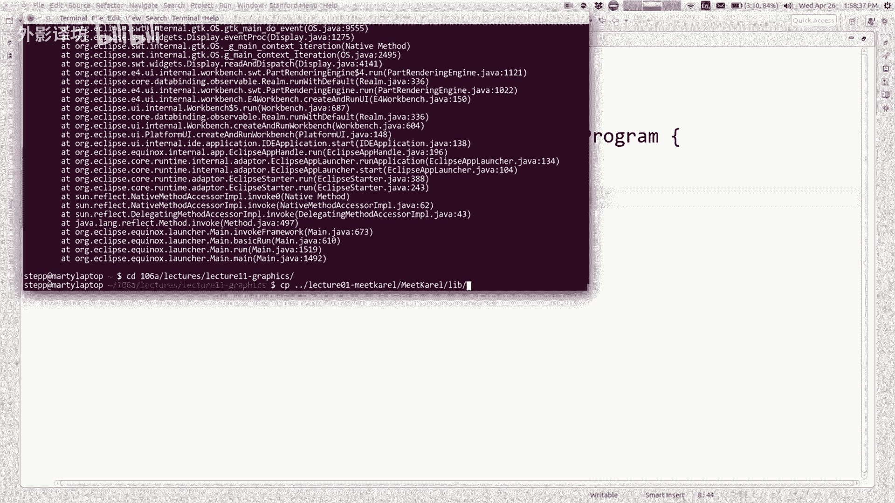

好吧，让我再试一次。

你选择的，不是，好吧，我以为我要疯了，我就想我的线在哪里，我画了一条线，直到我画了一只美洲驼，抱歉我就像上课时收拾一些东西，我打破了，当你录视频时，这太棒了，讲座因为你可以编辑，那东西就出来了，好吧。

所以我已经有了，我有一条线，我有一个矩形，这些不同的形状，你可以画各种不同的东西，与这些可以画东西并循环的程序，如果我想画这个怎么办，矩形但我想要一系列通过矩形的水平线，像这样水平方向有点像阴影。

几乎就像水平线一样，我能做的事，我可以说我想要一个for循环，从未来EALSS0到十，然后在这里我可以添加一行，但如果我添加相同的形协调，它们会向相互叠加，并且你看起来只会有一条线。

所以我想改变一下每次循环换行时的坐标，你周围的人都明白，就想当你有活跃的火箭飞船到达，改变那里的四个循环，得到不同数量的星星和闪光，以及你看到的表演的东西，就像腊上那一样，所以你可以这样做哇。

就像我们在生活空手道一样时间，那么你如何制作线条，触摸这个矩形边界好吧，你可以在这里做坐标，类似于矩形坐标，你可以说一百五十七十四比五，这实际上不太正确，因为一条线的参数实际上是与A的参数不同，长方形。

你知道我的意思吗，实际上并没有按照你的想法做就可以了，当你知道方向错误时，第一次看到这个东西时间，但也许你们中有些人会抓住它，为什么会这样消失，是的，是的完全正确，只是参数含义不同。

就像你是一个矩形一样，按左上角的X和Y角，然后是宽度和站点，如果您要经过XY线，起点和终点的XY点，所以没有宽度和高度，当你在做一行时，所以只是参数在这里意味着不同的东西。

所以如果如果我画水平线穿过矩形来给他，如果我愿意的话，看起来有点阴影，水平穿过这个矩形是什么，结束X坐标，170是的，因为我开始了100，宽度是70，所以我去那里好吧，那么如果他是一条水平线呢。

你们这些天才的Y坐标是多少，必须精通水平几何，两条线具有相同的Y坐标点对，所以是50对我指示给你心脏细胞，所以现在我没看到他是我没看到的原因，这条线是因为它是精确绘制的，越过那条线就在那里好吧。

所以如果我想要十个人过来的话，我会把这件事改变一点，再高一点，我会让这个100高想要十条线，我该如何画，十穿过这个矩形的线，像这样等距分布的想法，你认为是的，这是个好主意，是的我可以使用I循环变量。

我可以将其添加到线的Y坐标已变零线，绘制某处，现已绘制，低于要绘制的线较低，这正是我想要的，如果我写50加I，50加I那就是在正确的轨道上，但不太正确，这样会弄脏所有的线条，仅分开一个控件。

并且他们是画一像素后，我有点想要喜欢空间量，以便喜欢它们，将覆盖100个像素均匀，我该如何让这些做到这一点，就像我说的50加，我是的50+10，我，14我每次写十个像素，重复这个循环，50+10次。

我是的，现在看到了，我已经跨过界限了好吧，所以我们经常使用旧材料，循环和累积的东西和参数，所有的旧东西仍然在这里用对了，我也想，如果你的东西没有，有时会提到向右看，你去等一下，为什么不在。

你仍然可以说正确的Y坐标打印一行Y是加号，你知道，或者不管你什么时候运行程序没有出现在这里，但它出现了下面的PDX，有一个小东西在底部，它说控制台，所以如果你没有运行控制台程序。

控制台是这样的一小部分eclipse，你可以看到输出，所以如果你需要，你仍然可以打印烂的东西，用于调试，因为没有打印，很轻松的靠在窗户上，好吧，那么我们就这样吧，就像麦格拉斯阿基尔的一个非常简单的例子。

对我们所拥有的任何问题进行编程，到目前为止，一切都有意义。

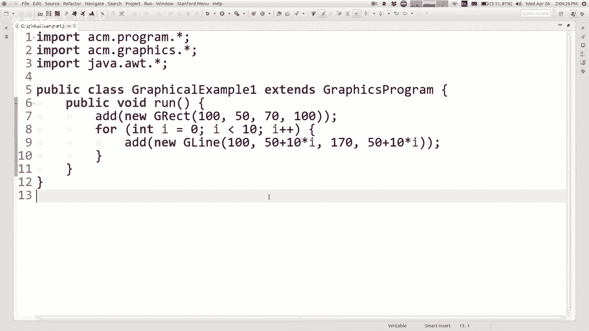

好吧让我们继续吧，这是我的一个例子哦，我是笑脸敖丙干，所以我做了一个，当然是你头部的矩形，没有正方形，但你只是制作一个宽度相同的矩形，然后高度变化，所以米奇广场没有圆，但你做了一个椭圆形。

没有太多谈论G椭圆形，G椭圆形，就像您指定X的矩形，Y代表左上角宽度和一个高度，他会做什么，把它们化成不可能的大泡泡，可以容纳在那个办公室里，范围广泛，就像画一个洞一样，你有那么大。

你指定的是这项工作的想象，边界与矩形是不是错了，如果我说我想要一个G1椭圆形，那么爱你。

在位置三百三百添加一个新的G椭圆，尺寸50X80X50，那么你会，看到那里有一个椭圆形，就像调试这些坐标一样，知道你可以你可以打印出来，喜欢你现在的位置，但是这个小我的鼠标向右触摸的点。

基本上有300个逗号，300和，那么这里的宽度是80，并且这里的高度是50，所以如果你在矩形上画了一个，它会实际上完美的捕获了那个椭圆形，就在那里，好吧，这只是一种我的幻灯片上有一个简单的例子。

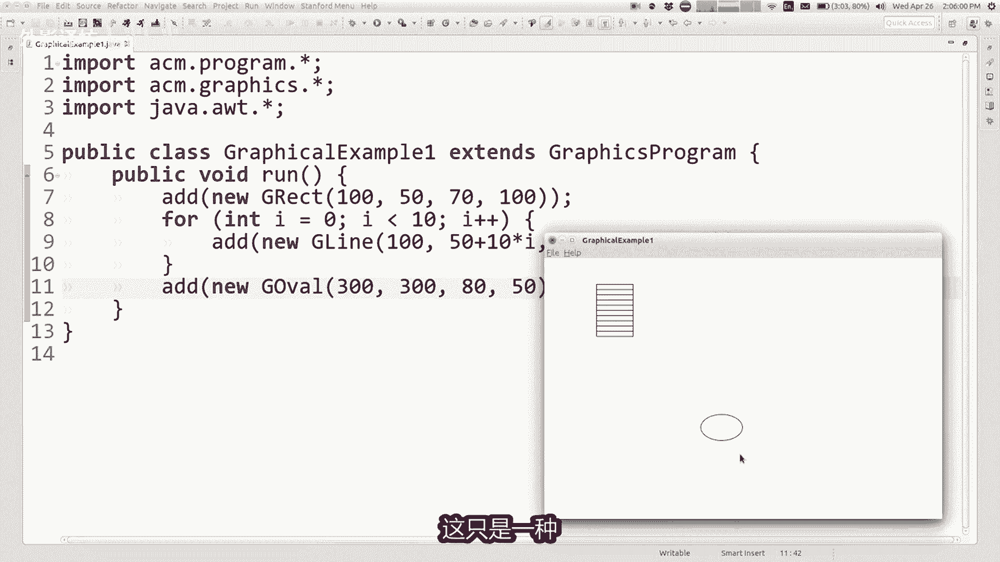

画笑脸，我们当然有还没有任何颜色，所以我想向您展示如何做颜色，因为这是全黑的和白色，我们需要让它活跃一点，所以这张幻灯片讨论了使用使用，我喜欢你，建议作为循环循环计数器，所以我在画画圆圈里。

我画了一个循环，循环中带有XY的标签，是同样的事情，你有点循环计数器变量乘以某物，你始终想要改变每一个距离，最后一个出手或50降速，通常你会服用我几次，下次你的循环中出现一些东西，好吧嗯，让我们看看。

我要跳过这个，你如果你想的话，可以稍后再看，是你如何设置颜色和东西，记得我说过添加一个新的G矩形或其他什么，但如果你想设置你必须交谈的矩形的颜色矩形，所以你必须修改你的代码只是一点点。

而不是说你想添加一个新的，你实际上创建了一个矩形，首先是矩形，然后你告诉我矩形，你想要什么颜色和什么你想要的其他属性，然后您最后将矩形添加到屏幕上，所以这样做的代码看起来就像这样。

你回到这里，然后你说好吧，而不是仅仅添加这个g reg，我要把这个拿出来，我会说G值我不知道我的矩形等于，所以看起来有点像，做一个扫描仪或文件或其他东西等于新的，所以我基本上做了矩形。

我将其存储为变量一分钟，以及我这样做的原因，这样做是为了我可以和他说话，并说嘿，我的矩形点，我想要改变你的你的你的颜色什么的，我可以说将填充颜色设置为色点，红色或者你知道的类似的东西。

然后当你设置完这些东西后，你想要设置，你可以说添加我的矩形，所以你添加那个矩形，你给了这个名字，并做了那个工作哦，你知道他没有做什么意味，你也必须说我的矩形点设置fail为true，无论如何，所以是的。

用我要的红色填充，它喜欢说这两件事，但是另一个矩形里面有红色，好的，如果你想要轮廓，你可以说矩形不是黑色的，你可以说我的，而不是设置填充颜色。

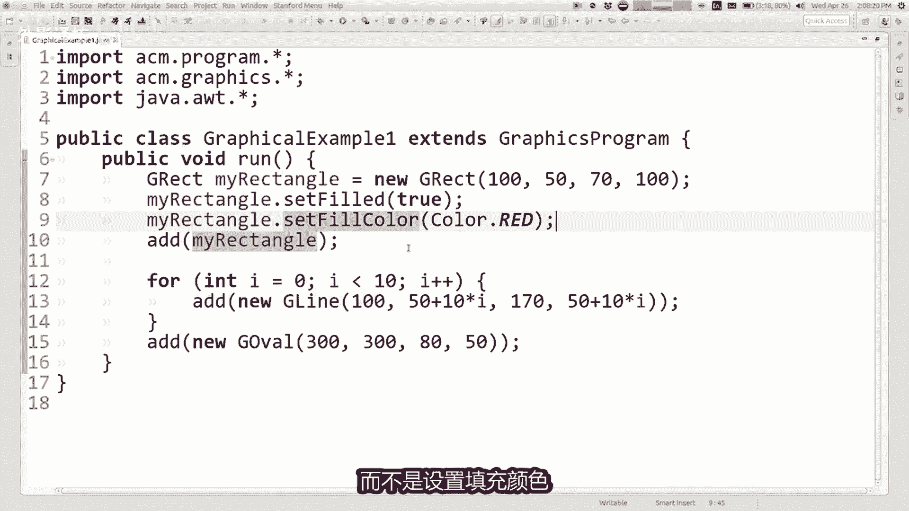

矩形点设置颜色为彩色点。

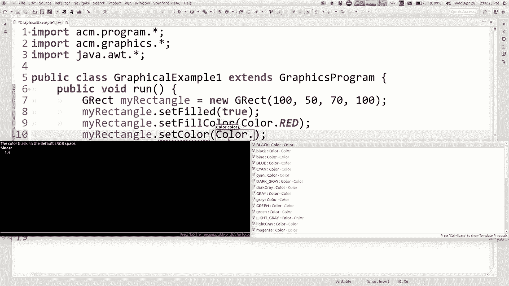

铁红我不知道这会表现的很好，红色，但那很糟糕好吧，让我们把它换成蓝色，有点难看，因为它看起来有点暗，看起来像黑色，或者我不想采摘的绿色东西，绿色是因为有些人看不到红色与绿色相比，但无论如何，它是什么。

有点很难看到它，因为它只是这些小绿现在这里，但是矩形的轮廓现在是绿色的，所以有颜色，所以重要的是，这是你必须存储这些，如果你想要所有的形状作为变量，这些线就是你知道的黄线好吧，那就把这个G线拉出来吧。

行等于，然后你会说添加在添加之前，将它们放在行中说黑线将你的颜色设置为颜色，黄点和我还没聊过，关于这些颜色还有很多，但那就是表示颜色的，一般语法如下，现在我的顶部有黄线，那里的红色东西看起来像披萨。

我的小学食堂基本上，所以颜色将形状存储为变量，看起来我并没有花很多时间幻灯片在这里。

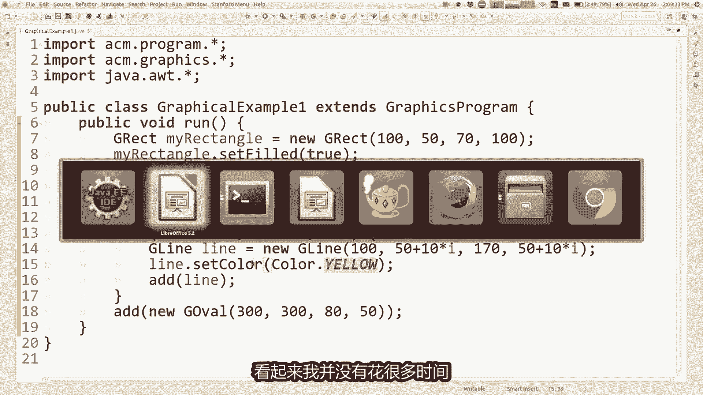

但这里有一些您可以设置的其他方法填充颜色，背景颜色，你可以设置位置和大小，并移动周围更有用的东西，稍后的讲座，但有很多您可以设置不同的类别，再将其添加到工作表之前，屏幕上还可以设置属性。

将其添加到屏幕后，那么屏幕实际上会更新，我会告诉你，你知道我不会在本次讲座中讲到这一点，但是你可以通过循环来制作动画，有点修改位置或颜色形状，然后等待一段时间，你想看我会展示给你看吗。

也许一会儿我想他可能可能会很有趣，这是另一个例子，一个使用某种困扰的程序方法，所以让我们来看看这个就像演练这个程序一样，当程序运行它所做的第一件事，它会制作一个G标签吗。

stream并生成一个存储的字符串短语，你好，世界也许看起来就这样好吧，现在我说K设置字体到字体就是你认识的文字，文本字符的形状方式，在这件事上，所以你把它设置成这样，字体大小36。

所以现在我已经变得那么大了，你知道的短信，然后你说嘿，我想要它现在变成红色，所以现在改为它是黑色的，现在你终于说黑将其添加到出现的屏幕上，他们在窗户上，他们没有添加，它是一种内存设备，屏幕就像在做计算。

并且从不打印它或正确的东西，好的这是我提到过的颜色，可以用不同的颜色绘制，用大写T写出颜色这个词，然后是一个点，然后是大写的，你写下你想要的颜色的名称设置，这些就是所有的颜色有黑色，蓝色，青色。

深灰色可供选择，就这样只有你我13了，我认为哦14是一件事，因为有人说白色，我用白色写的，所以无论如何，你都可以看到提供了14种颜色，你可以从现在开始，当然有世界上有那么多美丽的颜色。

这不是你想要的所有颜色想要正确的，那么你如何制作颜色，那不是其中之一，而不是说将颜色设置为色点，无论你要说什么，将颜色设置为新颜色，然后放在括号中，在这里你写下有多少发红，你想要的光彩和新颖颜色有。

所以红色，绿色和蓝色从零开始意味着什么都没有，颜色到255意味着很多这种颜色，你可能想知道为什么是从零到255吗，我没去从0~10和从0~100或人类的原因，是因为计算机使用二和15字节的密。

255比二的八次减一，颜色是使用8V指定的颜色，成分是计算机的东西，但无论如何，255的周期就是你的方式指定颜色。

所以如果我想使用在这里自定义颜色，我可以转到我的代码，在这里我可以说而不是有色黄色，我可以说新颜色是多少，红绿蓝，你想要，如果你想要橙色的话，那就有这里已经有点橙色了，但也许我想要一种不同的色调，橙色。

我认为获得橙色的方法是你会得到很多红色，然后一些绿色，然后就没有蓝色了，也许你看不到他们，因为，东西的背景是红色的，为什么，难道我不把我们变成黄色的吗，关于这个，所以那些事橙色ii看起来不错，你想要吗。

看一些确实不起眼的动画，真的很快，是的请跑，令人印象深刻的是我所关心的，让我们做吧，很久以前我简单的提到过，你有一个可以使用的方法，然后暂停所有程序，动画只是暂停，然后暂停后做事，就像这里，当我划线后。

我有一条线，我可以在屏幕上暂停500秒左右毫秒之类的，然后哇，哇我告诉过你，这并不令人印象深刻，解决了我的问题，但他很生动，是的，我们要重做动画更加有趣，稍后上下文，我如何进行弹跳球。

我该怎么做一个小游戏，但是就是这样，你画一些东西，然后你暂停，然后你放下更多的东西，然后你就可以让它动起来，你知道这是一本翻页书吧，就是这样，到目前为止还有什么问题吗，关于所有这些图形化的东西。

我要扔给你们，好的我想我还有时间再做一次程序。

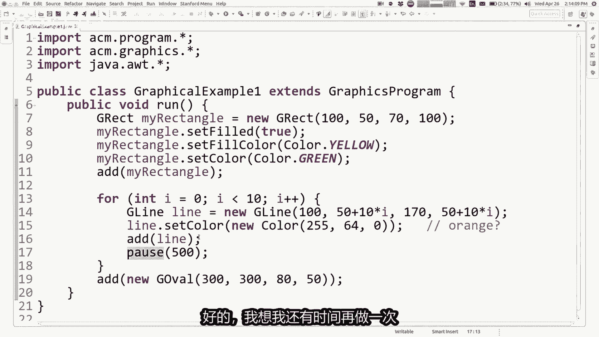

所以关于绘图的一件事是，如果你把两个形状放在三个形状上，占据相同的像素，你稍后添加的是这种在上面的，你之前添加的，所以在这个举个例子，如果你正在画一辆汽车，发挥你的想象力，假装那是一辆汽车。

如果你先画轮子，并且然后车身就会被遮盖起来，真的顶部，但是如果你画身体人，然后我们也看到像这样的属性上的轮子对吧，那里所以为了实现目的，我要尝试拥有一个程序的副本，画了这辆车，我想修改它和你们一起编程。

所以代码画这辆车看起来像这样，比我们的其他计划更长写的，但我不认为代码是非常困难或有趣，只是做一些形状，将它们放在屏幕上，制作更多形状，将它们放在屏幕，如果你读完这篇文章，我只是制作我设置的车身颜色。

我将它添加到屏幕上，蓝色主体使轮子将其添加到屏幕，使另一个轮子将其添加到屏幕，使挡风玻璃变成这样，TLO的铁东西将其添加到屏幕上，不是很有趣，所以我想排序谈论修改此代码好吧。

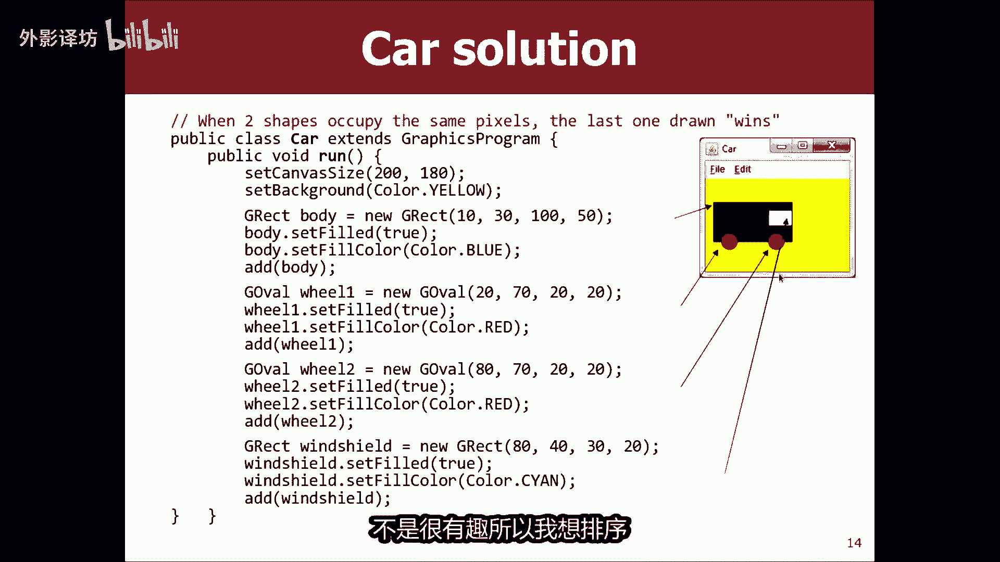

只是为了向你展示这一点，这里的程序是car dot java，这就是我的代码，在幻灯片上显示它看起来像这样，那里的车很酷，现在我想要谈论如何制作一个程序。

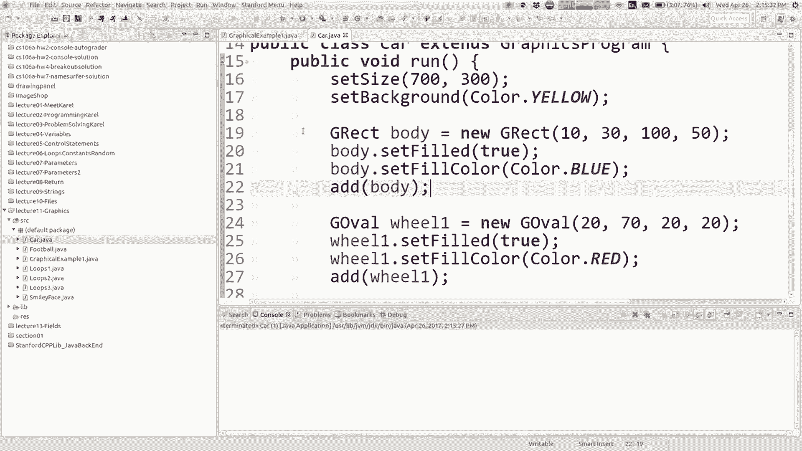

吸引多辆他会自己的汽车，该节目中的101流量，吸引了集中数以百万计的人挤在一起，人们咒骂你，我该怎么画，如果我愿意的话，可以多辆车，你想到的很多事情，我们已经学到的东西，因为循环你想到的方法。

我要去谈谈方法，让我们做一个方法，可以画一辆车，所以我会坐困难的部分。

如果我去这个项目的话，说，公共课与公共循环列车和这个代码，几乎完全是为了正确的绘制汽车，让我们把所有的东西都拿出来，让我们做一个称为绘制汽车的方法，然后在这里我会说画一辆车，然后我会画另一辆车。

现在我有两辆车了，我运行代码为什么我不必跨越什么问题，他们就在那里彼此叠在一起，它们确实被画在了相同的位置，所以我看不到他们哎呀，我怎样才能让它像画车一样看不到，我想如何修改成功，做到这一点的代码。

事实上是的，再次为汽车所在位置设置一个参数，位置很好，你在这里怎么样告诉我X和Y放在哪里车，所以也许我会画一辆车，13时即下一个位置在150，逗号85，现在它会绘制好吧，听起来不错好吧，但事实并非如此。

所以我看不到我希望的两辆车，你明白就想拥有这些，这里的参数，并不能使汽车成为在两个不同的地方，我必须使用代码中的那些参数，XY画车方法，现在我该如何使用这些参数，我要修改什么。

这个现有的代码确实发送了我的内容。

询问好像我必须做出一些改变，在这里反映这一点。

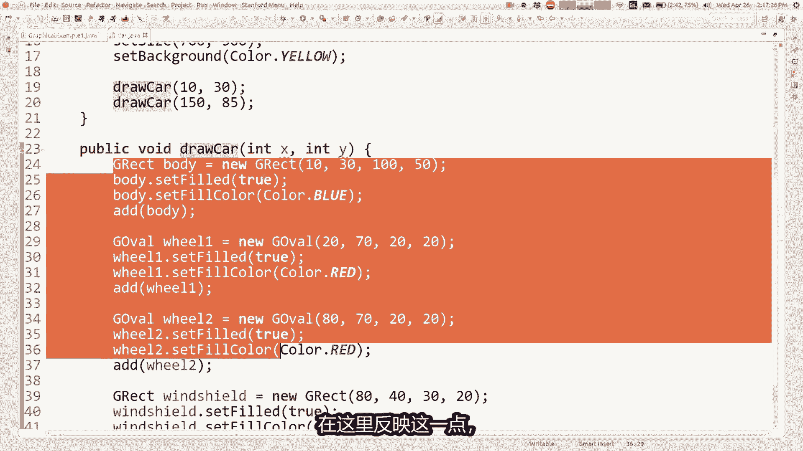

那么有哪些我需要改变的事情是，是的，所以我在这里画一个矩形，在那一侧的位置，1030，但它是十三十，因为那是我想要的车要，但是如果我要一百五十八十五，那么我希望这些事一百五十八十五。

所以这些数字基本上是相对于XY，你会看到我们传入的参数，你在这里说X和Y，但这怎么样，这是轮子，我不想说XY在这里，因为这样他就会拉动轮子，在汽车右上方的左上方，所以上面写着27时，我正在划车，13时。

那么我在这里放什么，你呢思考这个轮子的XY是的，20是从十移过来的，再加上十，就像X加十，并且这70是这30，但还有40，所以它是就像X加40，你明白吗，这时候是的，是的，Y加40解决这个问题。

80是1070的X所以它是X加70，这个70和这里的一样，外加40，这个挡风玻璃是80，X从十开始，所以测试X加70又加40，就是30+10，所以现在我运行我的代码，我必须冷静下来，你很酷。

我知道我会让你考虑一下，但是如果我想再添加一个参数，吉他可以有多大，人们都在驾驶小聪明汽车和东西，还有一些人驾驶福特F350，如果可以的话，通过汽车的尺寸在哪里记录这些参数，所以当你来得那么快，是的。

所以嗯，就像如果这辆车的尺寸是100，并且这辆车的尺寸是200，这个百这个50实际上更像是尺寸，尺寸超过其宽度的一半，高个子，你明白吗，就像我不明白一样，即将完成设置，想要运行，随着时间的流逝。

你会看到我的身体如何，那辆车长大了，我需要修改其他相应的陈述，但车子的其余部分变长了，我想停下来，他们不想超过我的时间，尼克将于周五授课，他会做更多的图形，所以我们会看到。

