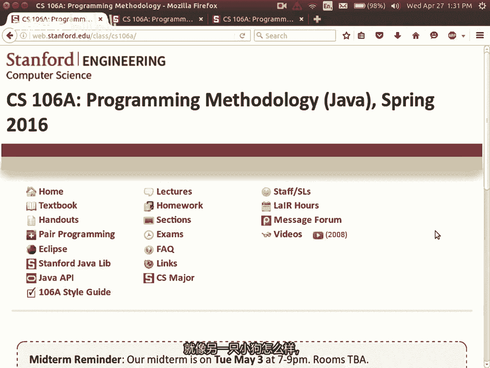
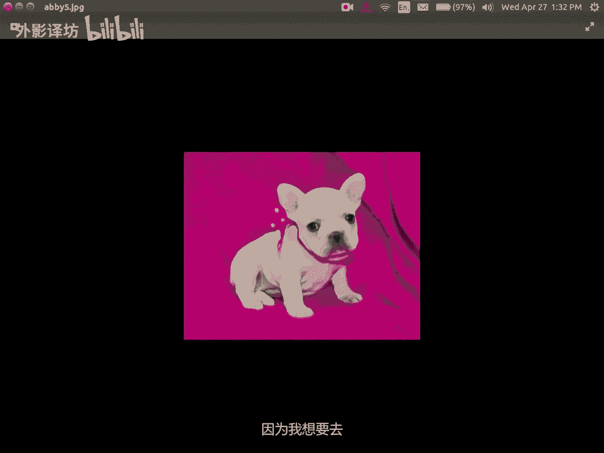
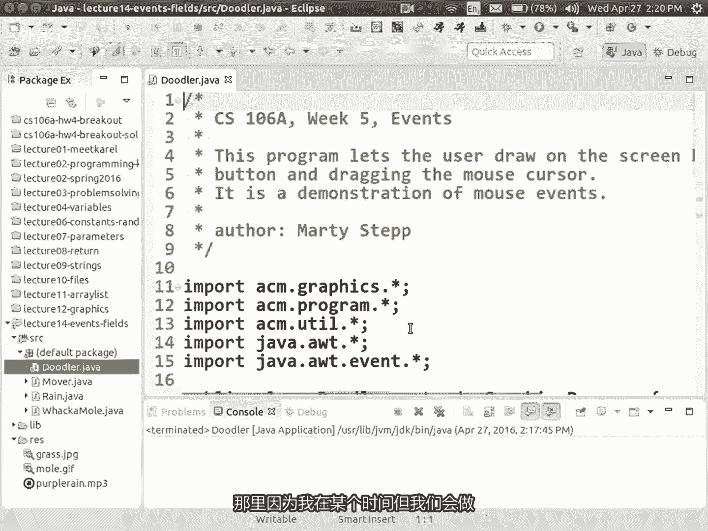

# 【中文配音】斯坦福王牌课程 CS 106a Java教程 2017年春季课程 - P14：14_ Events, Fields 16sp - 外影译坊 - BV14U4geNEEq

好吧，人们为什么我们不得到，现在开始了，每个人都在哪里，没有人今天来上课，我已经说过了他们的损失，他们错过了所有最好的东西，我给出了所有最好的信息，该事例的所有答案，今天的期中考试题，所以他们错过了不。

我只是开玩笑，我不会这么做的，但还有很多其他好的建议，通常在课程开始时，我会展示小狗，我还没有这样做，通常我会等待，然后给小狗看，然后我开始录制视频，但今天有点特别，所以我本来想先开始视频。

因为我有一个令人兴奋的作品，新闻我又要养一只小狗了，看过我的巴尼和克莱德，巴尼的浅棕色的是克莱德的，是深色的，他们是黑色和白色的同窝兄弟，但尼知道成为一个人的可怕之处，成人就像我有任何报价。

因为我只是个成年人，但是就像一旦你成年了，你你可以自己做，无论你想要什么，你都知道你可以拥有晚餐，吃巧克力蛋糕就对了，无论如何都不用刷牙，你可以养只狗，但不有人可以阻止你，你知道这很酷，但这也很危险。

因为我和我的妻子都喜欢动物，所以有时我们只是互相看着对方，就像另一只小狗怎么样。

所以我想要向您展示我们的新家庭成员。

这周五会加入我们，他的名字是艾比，它是一只法国斗牛犬，修道院有一座修道院，还有一座修道院，有一座修道院，还有一座AI，我知道我快要死了，但我不在乎，今天关于JA，我还只是小狗，今天我很兴奋，我要去天堂。

周五去找他，我很兴奋，关于我神智不会展示的，周五我要去上课，ALAA或他周五授课，这样我就可以去接艾比了，当然，因为我想要去教一些讲座。

所以无论如何，我会一但我有更多的爱，比照片B好的。

不但是就今天的课程而言，我有很多想要得到的东西，让我们开始吧，嗯我有一些公告，主要是与我们的期中考试有关，距离昨天已经一周了，下周二晚上七点到九点，你伙计们知道要去哪里，我们将不得不分成多个屋顶。

因为不是每个人都能适应在这里很舒服，所以我要发送，每个人都通过电子邮件告诉你去哪里，相信所发生的事情是我们所保留的，这栋楼里有不同的房间，所以我我想我们中的一些人会在这里，我们中的一些人会在隔壁舞会派。

你们所有人都会收到一封电子邮件，告诉你们要去哪里，这也会发布在这里，可能是今天或明天信息应该增加，但只是我们会把你除以你的你姓氏的字母范围，我很快就会告诉你，别担心，还有一些其他的事情。

其中学习材料张贴如此，你知道可以帮助你们开始准备，为了考试，我发布了一堆模拟考试，模拟考试，如果您单击此考试页面，您将进入这套东西，到处都有这里的信息，就像这是语法参考表，附在你的测试中。

这样你就知道您将获得一份提供给你，这样我就可以给你看看那是什么样子，就像等一下那是哪里哦，他回来了，这里语法参考，所以每个测试都有这个附在它上面，他有所有的卡罗尔的方法，他拥有所有数学，一切都在其中。

字符串五线谱，字符或relist和图形化的东西，我们现在正在学习，所以我的意思是测试你可以看看这个，查一下没问题，但是语法参考秘籍并没有包含一切，它不会提醒你如何写for循环或如何声明变量。

或如何写一个方法或类似的东西，如果你可能应该带上你的书，你想要那个，但我会尽力做到确定你用什么方法，需要你能更少的解决它们，知道你可以解决所有的测试问题，使用此处列出的方法，希望那会是那会有什么。

你现在就需要带上它，提到有这些做法，我已经发布了其中四项考试，所以希望这将是一个相当大的数量练习题，给你看，每场考试都有答案，eclipse项目的zip文件，包含一些测试代码，那又怎样。

通常发生在你尝试工作时，在这些上，你想出了你自己的可能不完全匹配的解决方案，我们的答案，然后是学生总是问我的答案是否正确，或是答案中的另一个答案吗，唯一正确的答案很多，我要求你写代码的问题。

有很多方法可以解决这个问题，问题不仅仅是答案中的问题关键，所以如果你想看看你的答案有效，你可以下载这些zip文件的代码，并将其输入，并它会运行它，并打印你的内容，你的方法产生输出或不管怎样。

这样你就可以看看你的答案有效，所以这就是我希望你这样做的方式验证一下，如果你想看看你的答案有效，我希望你这样做，通过输入，而不是像这样的方式，将您的答案通过电子邮件发送给我们。

并告诉我们说你知道告诉我这是否有效果，不是我的，一般建议是，如果你去通过这些练习考试，你也许不看答案，对不对，离开是因为我认为其中一件事关于计算机科学，关于编码是一旦你看到答案，答案似乎很明显。

你会看看您将查看答案的问题，你是的，这是有道理的，就是这样，你解决了这个问题，我知道，但我挑战你不看，写下该解决方案的答案，我想你应该尝试一下，首先因为如果你偷看所有答案，我没有更多的练习给你做测试。

让你知道你不知道想把这些问题搞砸吧，你想尝试用它们来学习，如果你看完了所有内容，这些练习考试，你想要更多练习题，还有很多其他问题有待您发现，您可以查看的一个地方是您的部分讲义。

有很多部分你可能没有遇到的问题，在你的时间里，所以去看看其中一些你可以做的其他事情，做的是，如果你有文字，你可以看看不同的结尾章节，也许有你想要的主题，更多需要练习的属性，去看看相关章节的末尾。

书本通常有很好的练习，如果您还想了解更多问题，我已经发布了一些链接，其他教师进行的一些考试，其他方面现在的情况是这样的，考试的问题并不总是准确，和我问的问题类型相同，所以如果你看那里。

你可能会说这是我不记得学过这个吗，好吧，也许他们的主题是顺序不同，所以这些考试不是一定和我的一模一样可以，但你可能会发现一个问题，你认为有用的东西，就像关于ARA类似的问题，或关于图形。

或者我只是说可能有从中可以得到一些好东西，从那些其他考试中脱颖而出，其他地方还有什么，我还能做什么，我有一堆规则，想要确保您遵循以下事件，你考试没问题，如果规则印在考试上头版，但他们也在这里。

如果你想在考试前阅读它们，只是为了让你了解他们，这样你就没有在测试阅读期间花时间，他们我认为规则主要是很不言自明，但让我走吧，通过他们真的很快，所以规则数期中考试不结对，编程你必须自己努力。

期中考试时的我必须添加这个项目符号，因为有人认为他们可以工作，和一个搭档一起参加期中考试还可以，但是如果你不能考试，是开卷的，带上你的课本，你可以使用它，但是它是封闭的笔记。

所以任何就像带有笔记的松散纸片，或您制作的部分的打印输出，讲义没有练习考试，打印输出没有解决你的家庭作业布，你不能带上随机的纸片和东西，对他们进行考验，现在我知道这可能惹恼了你。

并说你为什么不让我带那些不公平的纸片，我不让你带那些的原因，纸片是因为我想要下周二给你一个真正的测试，与所有这些非常非常相似，研究问题和练习材料，这周我要让你看看，如果我让你把所有这些都带来。

与您一起进行测试的材料是太容易了，因为你会复制，然后粘贴并更改一些部分，然后您会完成，我想给你一个测试，这就是难度级别，我如果我让你带上所有的东西，我就做不到那些论文，所以我认为这是一个更好的。

我给你测试一下你的技能，没有那些试卷的考试，比给你一个更难的，用这些试卷进行测试，这就是我的原因，不让你带文件，不只是因为我是个卑鄙的人，虽然很多人会说我是一个恶毒卑鄙的人，也是如此，该政策的原因。

但您可以携带你的书，你将有一个语法参考，所以我认为就只是就像记住如何写，各种你应该有的语句和方法和你在一起，但我希望我真的想要奖励在以下学校学习的人，如果你学习了所有这些，就练习一下这些考试。

将要进行的模拟考试与结构非常相似，问题的类型和难度，我会问的问题等真正的测试，所以如果你能做到这些练习考试，你会感觉自己大部分情况下你都会得到它们，可能在真正的测试中表现良好，并且这就是我想要的奖励。

好吧，如此密切的笔记，抱歉也没有设备，没有IPAD，没有kindle，我不想拿手机，以你使用他们的方式，在测试期间，如果你有你不能使用的书的电子书，我很抱歉，因为你知道。

如果你有IPAD或其他东西阅读网页或谷歌搜索，或无论如何，我不想让任何设备退出，在测试期间，有人是你的问题是关于一个稀疏式的，没有电子书，很抱歉，我没有试图歧视数字媒体。

但我也有这些设备还具有许多其他功能，我不希望设备在就问题而言，测试还可以，我们要求您解决最多的问题，部分问题仅评分功能，所以如果你能想到一个解决方案，但有点混乱，或者如果对你有用的话，有点多余。

偶尔会得到信用，有时我会施加约束，就像我会说你不能使用array list，关于这个问题，我会在问题描述，所以如果我说你应该遵循我的约束，基于但除此之外，你可以做，无论你想要什么。

您不必编写的编码风格评论，否则我不会关心你使用错误的变量名称，例如int x或无论你知道什么，你都会基于那种您在某个网站上，对风格进行评分的内容，家庭作业通常不适用于这里，如果我确实限制了你的解决方案。

通常是因为我不想让你得到，通过使用围绕问题点一些强大的库函数，或避免的东西问题的挑战，好的嗯，一般来说当我给你测试时，我经常会说的问题是写一个，如果我说执行以下操作的方法，写一个方法。

我的意思是只写那个方法，你不需要写完整的，具有调用该方法的运行的程序，你不需要导入，你只需写那个方法是不完整的，程序只是那一部分，或者如果我书写一个完整的程序，然后做，但你不必给我更多比我要求的还好。

一些学生接受，是时候写public board run，然后了，他们称他们知道自己是什么，只是你只是在浪费时间，不要测试期间还需要做什么，我不应该待在房间里，因为荣誉准则意味着你知道荣誉准则政策表明。

我应该离开，并让你们带走，你的测试没有我盯着你，但是我所做的就是爱莉西亚和我在外面的房间，所以在测试期间，如果你有问题是否是问题之一，不清楚你想问我们什么，只要站起来出来，我们就在那里等着。

我们会回答你的问题，是这样的，还有什么，我认为这就是大部分，有时我们会在测试中发现拼写错误，我会努力确保测试并没有充满错误，我会尝试我的最好，但你知道我们都是人，如果有的话，可能是测试中的拼写错误。

我会进来，我会宣布他在黑板上写下更正，希望这没有必要，我们会看看它的大部分功能还做了什么，任何人对这类问题有疑问，我稍后会向您展示的政策主题和问题的类型，覆盖下一个测试，但在你们有这些政策的条款吗。

对此有任何疑问，是的，是的，所以他说如果我写的话怎么办，一些代码，但我想改变他，我想要移动，我要插入的东西，所以你所做的就是在测试中，只需选择相关代码并点击控制X剪切，将光标移动到哪里，你想插入它。

并点击CTRLV，然后将其粘贴到那流等等，你做不到，实际上是在一张纸上，如果你需要的话，你应该做的事圈住某物，并说不不许动，如果你需要穿越这里的话，基本上我们的东西很好，规则是我们是否能理解你的意思。

意味着我们会尽力给予您认为您的类型是什么，你这么写，如果你需要穿越出一个箭头之类的东西，请继续，但我想我想说的是，如果变得如此混乱，以至于我们无法理解，你，可能想把它全部刮掉，并说看第二个版本。

我在另一张纸上写了一份新副本，报纸读到一周也没关系，是的，如果你有一点，在你的书中贴上便利贴来跳跃，你到某些对你有帮助的页面，可以拥有，那很好，我认为一般就像一些学生说的好，我在我的书中突出显示。

或者我做了一个我的页边空白处，有一些小注释书就可以了，我想答案是是的，只要你不喜欢整个练习测试和写作，答疑小字体显示在您的，在你的书或类似的东西上进行测试，写笔记，而不是尝试规避一项政策。

而该政策还有另一项问题，是的缩写代码在哪里，这里好吧，有些学生写的像引用一样引用或点点点，他们希望我们这样做，假设你知道他们做了某事一次，然后他们说点点点，然后他们是的。

他们希望我们假设一堆其他类似的代码行，对此或其他事情，所以我只想说写下来，如果你愿意的话，某试五次，你需要写出五行来写，他们所有五个都出局，不要说第一个，并且然后点点点，或者你知道的东西。

只是如果你实际上正在编写代码，编写代码或类似内容，而不是打印零，不写P你知道就像我们喜欢的那样，如果你必须跌倒的话，输入print，然后你改写打印零，I知道我的意思是好吧，我们跳吧会出现什么样的问题。

再次测试，我认为最好起来源是看看这些练习考试的总结，所有这些类型的问题，练习考试很可能是您遇到的问题类型的超级，对官方来说真正的考验，本次考试的主题列表，你可能会被询问的页面表达式和变量。

可以是询问不同的陈述，例如因为如果你可能会被要求写，你可能会被要求解决卡罗尔问题，写一个小控制台问题，打印镜头并读取ins ins之类的，你可能会被要求写的东西，带参数的方法并返回。

你可能会被要求做一些随机的事情，用随机生成器制作一些随机数，可能会做一些事情，strings字符串或字符的处理，可能会要求您使用一个字符串扫描仪读取文件，读取一些数据，从文件中对数据执行某些操作。

你可能会被要求做某事，我们最近学到的a release，我们正在做一些图形，现在所以你可能会被要求做，还有一些图形化的东西，好吧，有列出了一些未涵盖的主题，如果您稍后有任何疑问。

例如测试中的这个是测试中的，请随时给我发电子邮件，我正在尝试给你一个完整的清单，但偶尔我忘记了一些关于讲座的事情，今天是最后一堂课，其内容将涵盖在期中考试，爱莉西亚将进行一场讲座，星期五。

关于一个名为数组的新主题，那不会是在期中考试中用于课程的后半部分，好的如果你想要更多提示，这里有考试底部有很好的讲义，称为考试策略的页面，只是给出你对如何学习有一些好的建议。

它是由其他106A之一写的导师，我喜欢就此类问题而言，可能正在测试，让我练习测试之一非常快速解，只要跳过它，你就应该简单的浏览一下所有的内容，只是为了看看他们上面有什么。

就想这是一个这是其中一项练习测试，我说的一些表达有问题，这些java的结果是什么，表达式，得出什么数字，或如果我这样做的话，会产生什么价值，如果我说打印请输入该表达式行，那我会看到什么。

你知道那是什么表达结果一是问题，二是参数问题，神秘的人听到了这些愚蠢的参数，当我通过这些时会输出什么愚蠢的参数，或者可能返回来自道德的东西，它有什么作用，所以这就像阅读代码。

解释一些现有代码的作用是另一个问题，循环之谜，我有这个需要一些薄荷糖的循环方法，做一个循环，如果我通过它会做什么，五和零作为参数等等，好吧，现在我们遇到了一些问题，编写代码为卡罗尔，编写程序称为内边界。

卡罗尔是比伯的一个正方形的长方形边缘，所以我的意思是你可以阅读细节，但这就是想法对了，卡罗尔这样做了，有一个这是另一个问题，编写一个方法，你知道的叫抛硬币，反复掷硬币，直到得到三头或四尾。

是货类似的事情，所以抛硬币50/50，如果你知道硬币是否下跌，如果它向上，那就是尾巴类似的东西，你只需打印四个头和体四尾，就继续循环继续做，直到你连续获得三个三，连续击中四个反面，并且然后停下来。

这样就更像了随机性以及循环和参数一种东西，这是另一个编程问题，一个叫做青蛙过河的图形化东西，现在你会移动一只小青蛙，想要今天的课堂材料，所以这样做这个，但是你知道一点，我点击鼠标的青蛙，青蛙它动了一下。

还有什么，这是一个带有字符串的方法，称为删除重复项，如果您传入一个有重复字母的单词，它将把所有重复项交换在一起，所以不纪元变成了BCAPPER等等，在这样的字符串和字符上，然后我我认为这还有一个问题。

这就是所谓的唯一技术，我会通过你有一个array list，并告诉我有多少，而relist中出现唯一值，因此在第一次调用中，唯一值是四与七与九与二八个，其余的都是这五个之一的重复项。

所以有五个为一值返回五个，所以这些就是你所知道的样子，在其他一些测试中，我也认为这个测试没有任何扫描仪或归档，可能还有另一种做法，测试有扫描仪问题，所以看看，不过那些和那些是类型，我倾向于问你的问题。

真正的测试我知道分值，每个问题都值得打印，测试的首页通常是代码编写问题，值得关注，彼此相同，然后是代码，像表达这样的阅读问题，是彼此的价值大致相同，好吧，通常代码编写是值得的，比阅读代码多一点点。

但是每一个都有很大的权重，有关考试的其他问题，请点击这里，假设或者例如如果正在进行采用大写或小写，正确的问题如果有一个怎么办，假设我可以假设我的输入是，我是否应该把它写成大写，我的回答，我想我会尽力。

以便在问题中描述，我会告诉你你能做什么，不能假设，如果你是的话，认为这个问题不清楚，类似的事情，你应该问我，或者嗯我可以假设这一点吗，我们会尝试给你一个简单的答案，有时学生做对了，我会假设这一点。

但通常你希望成为小心，就像问题没有说一样，你可以假设一些你不知道的事情，对此妄下太多结论，好吧，我会尽力确定问题清楚，我想要什么，并且我不需要什么，所以是的另一个问题哦，是的，如果你有一个。

不完整的答案，如果你有怎么办，伪代码是这样的，这就是我要看到的，我们热爱给予的东西，不分功劳，所以有失，你们看到一个问题，你会说我可以想到如何做其中的一部分，但我不知道他的结局，所以我无法真正解决它。

所以如果我写有些东西它会不完整，它不会工作，它甚至可能无法编译，如果你输入它不用担心编译器，就像你的语法有点挑剔一样，如果你漏掉一个分号就会出错，我不会会给你一个零，因为你的代码不会编译正确。

这不是我们这样做，是因为你没有编译器来帮助你，所以我们尝试一下忽略小的语法错误，除非他们有很多，然后他们旅行稍微降低你的分数，但是就不完整而言，并没有太多回答，我们确实有部分功劳。

所以如果你解决了部分问题，但没有解决，剩下的我会尽力给你加分，你解决的部分，所以我会鼓励你，甚至可以写出任何你能写出的东西，如果你不能完全看到解决方案有问题，我知道我还没有回答，但最后一部分你能做什么。

关于伪代码的问题，但喜欢，例如如果我说写一个方法这样做，如果你刚刚写了，你可能获得的方法的标题，至少有一分，所以即使你不知道要在刀里放什么，如果我得到一些东西，就正确的标题，如果你知道的话。

给我一些东西，问题可能使用while循环写入标题，并问我一个疯狂的问题标记，你现在可能会得到两分，给我一些东西，给我一些工作的东西，我们会尽力给予部分信用，对于你现在写的他的真实情况，问题是什么。

想不出怎么说java中的东西，所以我必须写部分伪代码，我们没有给出伪代码有很多功劳，某些导师给予更多，或比第一个伪代码更少的信用，但我发现伪代码通常是，如果你的工作室距离java太远。

确实很接近java，但并非如此相当，java也许能够得到一两点，但大多数人的伪代码就像，然后我反转数组ARRELEASE或其它什么，它是那样会很复杂，那会需要很多代码，不能只是挥挥手。

所以我想大多数人在写的时候，英语他们没有得到很多分，如果他们写JVA，他们就会明白，所以我想说，向上帝表达自己，我当然知道你真正想要什么，我知道我应该有多害怕，我应该有多害怕，马蒂告诉我，我多么害怕。

我知道测试非常困难，有压力，我知道你们没有压力，期待参加测试，也许我不会做测试，超级简单，但我的目标不是喜欢不及格你一半，我的目标是中卫，分数在70多岁甚至更低，80年代的百分比。

如果这不是我想要的得到，我会弯曲，直到他是那个，并且如果你们做的比这更好，我会的把他留在那里，我不会弯下腰去受伤你，所以我的意思是，我想挑战你，但我不想让你知道打败你，你知道我想要。

我想给你一个公平的挑战，希望你不会当天有什么大惊喜吗，测试一下，希望他会是你的样子，期待并希望你会做的很好，我只想让你证明所有你向我学到的很棒的东西，如果你在这方面一切都做的很好的话，测试一下。

我觉得没问题，所以希望能给你足够的帮助你做好准备的材料，你想要的坏消息是这些都不是坏消息，就是全部常规新闻，坏消息是自从夏天或者抱歉，因为春季时如此短暂，你知道这就像最后的开始，在第十周中间或其他时间。

就像这是一年中最短的一个季度，因为他们仍然会下周的作业，理论上来说是一周半的时间，你不想考虑家庭作业，你想要完成的作业上交，然后专注于这次考试，这就是我想让你做的，但是在那里将是一个新的任务出去。

从今天开始，我讨厌这样做，这就是我要做的，尽管和平，尽力让你不扔对我的事情，因为你知道我最大限度的爱你们，加利福尼亚州法律，每个人都可以获得免费的深夜造型，对着小狗，别伤害我等等，这意味着什么。

全体女士记住你，现在你有1/4了，所以我猜我想让你做的事，有一个理论上，今天发出的作业截止日期是从周五算起，所以你会下周二完成你的测试，你会三天完成，他真的是很紧，所以如果你想稍后使用这个免费的作业。

4~7的日期，从星期一开始的一周，然后你有一个整个周末都在努力，或者如果你是一个积极进取的人，接到了任务，四做的很好，你说就像他们使用的那样，这是另一次，所以它仍然存在，今天将会有一个作业，从周五开始。

还是要继续做一周，但我意识到这很糟糕，我意识到太紧了，所以我会给你一个加晚一天，使其与您的工作相配合，时间表，很抱歉，我知道那不是理想，这是我能做的最好的事情，好吧，我想这就是我想说的。

关于我花了很多时间的测试，我希望你学习顺利，如果你有疑问，请告诉我们一路上关于考试的事情，很多正在通过的学生，如果他们卡在一个测试上就进行练习，他们有一个问题，他们在广场部分发布了相关信息。

领导们爱莉西亚和我可以回答这个问题，那里有问题，这是一个好方法，分担帮助您的负担，我们还要研究一件事，举行一次审查会议，集中我们的意见，部门领导将要经过和你们一起练习，问题将于本周日，本周末七点下午。

我们仍然有房间，但是到时候我就会发帖，我们一拿到房间，我就会一旦我们有请发送电子邮件提醒您房间，所以那将是一个地方，他们会展示一些练习题，他们会走过他们，他们会如果有一定的问题，请回答您的问题。

您想要解决的问题类型，你想要解决的我们的主题他们会回答你的问题，一定要写下来，并检查那个出来好的，所以你需要学习一些东西，我认为到目前为止还有一些工作要做，你能做的最重要的事情就是提高你的能力。

测试表现是为了实践，用铅笔或钢笔在纸上进行测试，打印出来，找个安静的地方试试，来解决实践中的问题，练习测试，这是你最好的事情，可能可以在这方面做得更好，测试一下好吧，所以我确实想教书。

今天给大家讲一些关于java的内容，最后一堂课我教的最后一堂课，关于图形，我们画了一些小东西，我们画了一些不同的笑脸，东西和一个学生向我走来，我不记得你的名字了，先生他是一名学生，下课后来找我，他走了。

他错过了黄金，有机会你有这个程序，你在讲座结束时跑了，雨滴从屏幕上掉下来，它就像我真的以为你会让它变成紫色，因为像王子，你知道子羽对了，我当时就想哦，是史诗般的，我应该这样做，但是作为一名老师。

最伟大的事情是，如果你周一搞砸了，你可以修复星期三，所以我想回去，我们编写的这个程序称为鱼，我们在这里制造了这些鱼，我们有一种叫做排水滴的东西，在这段代码中，我们制作了一个雨滴，我们将其设置为随机颜色。

所以相反，我只会说雨滴点设置颜色为点洋红色，没有紫色，所以叫洋红色，确实是洋红色的鱼，我想是这样，这里有一些洋红色的鱼，不太明显，有相同的戒指，但确实是这首歌是音乐带来的，出来就可以了。

你可以载我们的图书馆，我不知道是否有意写作业规范，提到这是一个额外的内容功能，所以我冒昧的将一个文件放入Rest文件夹中，名为purple rain dot mp3，所以在这里就像在如果你愿意。

你可以说出运行方法，播放您可以查看的音频剪辑作业三或四规范，他谈到关于这个，你可以说媒体工具点加载您传递的名为的文，件的音频剪辑rise，将purple rain斜线转换为mp3，然后你说点完。

无论如何，你去吧，这是我的重做，周一的讲座结束了，紫色好吧是的，这就是我们的问题，这里是随机颜色，但不是任何颜色，可能是从一组选择中随机选择的三个选择，类似的东西似的，你会做的。

也许是你会从1~10中选择一个随机数，然后那么你会说好吧，如果是的话，我会如果有两个就选红色，我就选蓝色，你可以制作我们自己的映射，这些数字的颜色是你会处理的方式，是的好吧，那是词语。

但是我想介绍一些其他内容，我不想在这里耗费时间，因为我知道我们有一些事情要讲，所以让我等一下我的另一个幻灯片，机霸在哪里坚持住，我迷失了黑，我必须重新打开我的玛雅幻灯片，抱歉这里是图形动画。

所以我们做了，现在我想谈谈动画，当你有一个叫做事件的东西，您经常立即使用的图形程序，想谈谈下一个话题，事件事件是当你的某事发生在您的图形程序中，代码想回应经典事件的示例，适当用户单击按钮或某事。

并且你想对此做出反应，如果用户点击我想要的，请点击，画一个像这样的红色圆圈事件是一个通用术语，它可能是单击，它可能是用户进入一个键，它可能是来自的任何类型的输入电脑，也可能是其他东西。

可能是一个数据包到达互联网连接，或者可能是每五秒计时器就会计时一次，为您准备的活动有很多不同，可能是事件的种类，程序中的A将以鼠标启动，首先点击你写的时候，会发生什么响应的大型图形程序。

很多这样的事件都是你结束的，编写一个程序，其中大部分代码程序正在监听事件，然后当他们回应时，他们和一个看起来像这样的程序，通常称为事件驱动程序，这只是一种术语，但是那是一个漂亮的东西，行业标准术语。

如果您想要处理你需要的事件，要做的事有两件事，一是你必须打开，就像您的世界系统打开，然后一旦你打开它必须指出什么类型的事件，你想知道，并且你必须知道编写代码来回应他们特定事件。

所以我们有时监听事件等数与货处理事件，好吧，让我告诉你有些东西，所以你点击鼠标事件发生，这是一个疯狂的事件出现，对呀嗯你通常会写一写方法，你基本上说我想要这个单击该方法时，执行的方法按钮类似的东西。

当那个时候方法运行，你在其中所做的任何事情，方法取决于你，也许你画一些当该方法时形状或其他东西运行，现在用户看到形状出现单击按钮，如果出现一些形状，你想要鼠标事件，然后你带一个对图形进行一些更改程序。

你必须添加这个导入代码顶部的语句称为事件，java aw t点事件，AWT表示类似抽象窗口工具包什么的，无论如何，你都会导入这些事件，酷现在在你的run方法中，程序中添加一行ADD鼠标监听器。

基本上就是那一行代码是一个特殊的形，他是斯坦福大学图书馆说我想要，现在我想监听鼠标事件，现在打开事件另一件事，你在代码的其他地方做的事情，就像也许在你写的run方法之后，具有特定名称的某些方法。

我会告诉你名字应该是什么，一会儿并取决于这些方法的名称，将表明您正在参加什么类型的活动，我要听，所以让我告诉你什么，这些事件名称被称为，所以我们可以一起做一个例子，有一个名为MOSPRESS的事件。

鼠标释放，鼠标点击鼠标移动，这些都是鼠标的不同种类的东西，可以做到，你可能希望你的代码做到的回复确定好的，就像这里是一个例子，如果我回去让我做个程序，在这里我要制作一个名为涂鸦者和涂鸦者。

将是我可以用鼠标画画的东西，只需在上面画一些小形状和线条，屏幕，所以在运行这里，你说添加鼠标监听器，就像这样，现在向下下面，你说其中之一或更多，这些鼠标事件方法可以写public void，按下鼠标并。

那么你必须说鼠标事件，亦或实际上我会把它称为事件，只是一个参数，所以这个名字和这个，朝着这看起来必须的方向前进，方法名称匹配，以及他要求的参数必须符合某些期望货，否则他不会像回到这里一样工作。

上面写着公共无效名称的幻灯片事件，然后在括号中民不得不说鼠标事件，所以我说mos press，我想听鼠标的声音，按钮被按下了，那我该怎么办，当用户按下鼠标时执行的操作，我为什么不喜欢添加一个。

添加一个屏幕上的矩形，可以只需放一个，当他们点击泥土时会出现矩形，在屏幕上放一个矩形是什么，我曾经使用过的那种物体的名称，做一个矩形，既矩形右好吧，矩形是一个新的g direct，比如说十二十五十五十。

所以这仅仅意味着它处于该位置，十二十，它的大小可能是50X50，在运行中我会说将大小设置为500，到了400左右，所以现在我赚了G值，我说添加撕裂好吧，所以当你按下鼠标就可以了，所以让我来运行程序。

什么也没有，如果我按下鼠标在屏幕上矩形看起来没问题，现在有一件事有点微妙，关于这个程序可能有点难以理解的是，你知道通常当我们编写程序时，我们会做在这个run方法中，虽然有趣的代码正在那里发生。

我们正在做，if if语句，while循环，我们就像坐在那里耐力运行，这是关键的代码，什么也没有，else运行，除非run方法这么说，如果你有五种方法，并且run方法调用其中的几个。

并且它不调用其余部分，其余部分不会运行，是的事情就是这样运作的，这就是你们已经习惯的有点不同，事件驱动程序的run方法是通常有点无聊，事件驱动程序做了几个事情，然后就结束了。

run方法完成的程序不会退出，他只是坐在那里，所以程序启动时，将窗口设置为是某种寄存器的特定大小，它想监听鼠标事件，然后程序也闲置，坐在那里，就坐在那里，就像此时我的代码在哪里，奇怪的是。

他不在你的代码中，就像你的代码中没有一行式，就像我跑步时那样，这个他就坐在这里，java是不在任何这些代码型上，就像在我的程序之外，或者但当我点击鼠标，他说哦，你想让我告诉你关于这个和外部的排序。

我所在的地方让我跳到这里，称这个为岩石，所以这是一个有点奇怪，有点不寻常习惯了，但就是这样有点发生在这里，是的先生，哦就像在这里，我可以待一会儿循环，并停止它或其他东西或捕获，是的，你有些愚蠢的事情。

可以锁定你的程序向无限while要循环货，但就像这里的例子，如果我如果当你按下鼠标，如果我做了一个while循环，永远循环，那里会发生什么，第一次点击时你会卡住在那里。

没有其他点机会发声时不会听到其他咔嗒声，因为你的程序会被卡住，基本上，但只要你的程序不会卡住，你可以你可以这类事情，java会当需要时跳入你的程序事件发生，然后跳回来，当它完成时，是的，哦太喜欢你了。

如果你想做什么，当你点击的好时，会发生不同的事情，我猜这取决于你的意思与你的意思不同，如果我点击这做一件事，如果你点击它做其他类似的事情，你说的是你做什么，你的意思是通过不同的方法，当你点击，是的。

如果你使用这个系统，然后每当鼠标获得点击，它会转到这里，所以如果你有时想让它继续下去，这个系统在这里，有时在其他地方不让你这么做，所以什么你能做的就是在这里，你可以写任何某种if和else的。

以及无论如何，你有时想要这样做，并且你有时想像你的代码一样这样做，可以用你自己的逻辑来实现，如果和类似的问题似的，是的，所以我很高兴你问这个问题，他说就是这样，我什么时候打电话。

鼠标就像这里我曾经说过鼠标吗，按下还是什么，我称之为不有趣的是，大多数方法在我们编写的所有课程中，是那个打电话给我们的人，我们已经跑了，称他们为这是非常不同的，感觉到某种神秘的外力。

java调用我们的方法，但不是我们的方法，事实上你不应该拥有自己的代码，要用mouse press自己，但事实并非如此，如果你这样做的话，真的很有效，很困惑，所以这是你写的方法，背不是你的人打电话。

这对学生来说有点奇怪，一开始要习惯，但就是这样，他是如何运作的，你能说一下鼠标是如何按下的吗，在这里没有任何方法不能存在于其中，其他方法它们都生活在相同的地方，像这样的水平，所以它必须是这样的某种结构。

它不会进入内部任何东西的，如果我说frank in会的话，你是对的，他很快就会出现，或者永远不会出现，会发生，我相信它会显示马上起来等等，我还在吗，涂鸦者再次出现时，eclipse因为喜欢图形化程序。

不会弹出自己的控制台，他们只是让eclipse作为他们的控制台，这有点奇怪，但是他打印了，甚至在我点击之前就立即如此是的，你说的对，就像这样，不喜欢冻结在那条线上，他正确完成，这很奇怪。

我认为这是这在某种程度上很奇怪，因为他是就控制流而言很奇怪，我什么时候我是谁，我在哪里，一切都会改变，你倒过来看起来有点简单，但这也只是一种不同的方式思考编码问题，这是一个好问题。

如果我想从这里退回一些东西，不幸的是你不能这样做，方法必须有这个标题，所以我想稍后谈谈，如果你给我一分钟，如果有什么事怎么办，发生在这里，我想记住，我想把它交给其他地方，就像如果我想要什么，我该怎么做。

就像他与另一个有关，我马上要讲的主题没填，我会告诉你，那好吧，有时发生的事情是鼠标得到按下，但你想知道在哪里，鼠标有时会被按下，如果他们点击这个真的很重要，想要他就向你提到，如果核。

否则我如何经常做不同的事情，你想做什么，取决于在哪里他们点击，所以这个鼠标事件称为世界，这是一个变量，这是一个你可以与之交谈的对象，有一些要用get按钮的方法，Get x get y。

还有其他一些你可以问他什么坐标被点击了，什么按钮被点击，通常你只是关心关于更常见的坐标，但有时左按钮与右按钮你想做某事的按钮不同，所以这就是你可以做的，可以说事件获得X事件获得Y点击简单的例子。

而不是这个世锦赛十逗号20的XY处，你可以说嘿世界来找我或X来找我，你的Y和我想把这个GREX有X逗号Y，现在我再次运行它，我点击WO，现在得到一个矩形，用户点击的地方是这样的，很酷。

就像一个小鸭母绘制的形状不是最好的，因为它有点把它放在左上角，如果你想让矩形居中鼠标光标，你知道我的意思，所以就像那样，你会怎样输入代码来完成该任务，如果这是50，你要改变什么，X与y-25，是的移动。

事情还剩25，然后如果我点击那里看起来更好吧好吧，所以现在我有一个小鸭母，如果你想稍微修改一下，我提到的不是鼠标按下，还有所有其他不同类型的活动，哎呀我们在这里有鼠标，按鼠标拖动，鼠标释放。

让我们把它变成鼠标拖动，鼠标拖动意味着你按下按钮，然后用按钮移动鼠标，按住拖动鼠标是什么意思，这样做让我们将其更改为鼠标拖动，并只是为了好玩，让我们制作这些是五谷。

然后实时并且让我们让他们填充正确的典籍，填充为真，因此是鼠标拖动，我不用按鼠标，而是做什么，按下并拖动，现在，很酷哇，好吧，无论我能做什么，试图成为笑脸，但没有成功，看起来很好，那里好多了。

看起来像便便表情符号，不是这是一个臭便便事件，无论如何，抱歉，你可以的，跟踪鼠标，你看到了什么吗，每次鼠标操作都会这样做，如果按住按钮就会移动，绘制另一个矩形，抽时按一下就可以抽更多，比其中之一。

你可以公开void的鼠标，按下鼠标事件事件，所以，现在如果首先按下鼠标，你会做第一个，然后再做继续被拖拽，你会运行第二个，这样我可以做类似的事情，也许当你第一次按下鼠标时，画一个红色圆圈。

然后制作黑色矩形，也许我会复制其中一些，其次在这里做类似的事情，而不是G直角omega g椭圆形称为圆，这是一个新的G椭圆，其坐标为X减10Y减十，2020年，原级填充真实，让我们做到吧。

红色圆点设置填充颜色为将点涂成红色，然后添加圆圈，所以当你按下你就会得到那个，当你拖动你得到矩形，所以让我关闭它，并再次运行它，所以我按红色，然后如果我到达那里按拖动，这样我现在可以做不止一项那些事情。

如果我不问的话，哦对了，采样率就像我一样，按下并向右走，但事实并非如此，它不光滑，有间隙，所以问题是，如果你移动你的鼠标，这样鼠标只刷新一次，我不知道60第二个，所以光标似乎在跳跃在这两个位置之间。

所以如果你想要平滑鼠标所没有的线条，实际上是一个封闭的干预像素，所以如果你想要一条平滑的线，你就会有说清楚老鼠在哪里，鼠标在哪里，让我画一个G，他们之间的，现会有点这个涂鸦者的更好版本计划。

但实际上我们甚至要做到这一点，我需要学习其他东西，还没有向你展示，但那是一种就像你无法制造鼠标一样的想法，更顺利的是，从来没有任何其地位上的差距是无法达到的，好吧，无论如何，这只是一个简单的小涂鸦。

让我回到现在，我们已经在这里幻灯片了一分钟，有点像这个画的，我们用黑色画了红色，基本上就是同样的事情好吧，所以现在我想谈谈，有时你会想一下这个想要与现有的形状交谈，你过去已经画过。

所以你知道我们画的这些矩形，如果你知道的话，屏幕会怎样，现在你按下按钮并拖动它绘制矩形，但是如果我按可能是现有矩形上的按钮，这意味着我想删除它矩形好吧，那你怎么做呢，嗯括号里有一个方法。

在您传递时调用名为get element的程序，Y位置上的X会返回什么形状，位于该位置，如果有多个屏幕，它会返回最上面的那个腿，最后一根，那好吧，让我们尝试一下，让我们做到这一点，如果你如果我的话。

矩形就会消失，点击像现在这样的一个，如果我去繁荣，我点击它它就会消失，好的，当您按下时回到这里，鼠标也许一分钟，我会借用关于我所在圈子的此代码，只是想说G对象a r b equals。

在X逗号Y处获取元素，那又怎样，我会保留这个XY代码以获取的立场，但我会说G对象对象元素位于X逗号Y现在，为什么它是G对象，为什么它不是G矩形好吧，因为任何形状都可以，那里有一个圆圈。

一个矩形和任何东西，G对象是一种通用类型，可以是任何形状，就像说形状，而不是圆形或正方形，就像更宽的类别，是更广泛的数据类型，这可以是任何类型的图形对象，如果我想从屏幕就像你说的一样。

Add direct，添加这个矩形，就可以说删除鲍勃的，删除任何对象，只是为了让事情变得容易一点，要把这些变得更大，我会说时十，我要把它们的尺寸设为二十二十好的，所以我要再次运行它，然后我按下鼠标。

现在我按下按下按下按下按下看看他正在删除，我正在按它删除，很酷，马上走开，我就像一个很蹩脚的橡皮擦，基本上，但是等等，你看到这个红色了吗，这里发生了什么事，那他说异常。

Java lan now pointer exception，你们还记得吗，唯一的例外就是那部电影，狮子座在他的梦想中去的地方，因为他是就像半岛之类的不，我想我很困惑，什么是例外，是的，是的。

你说了很多话，像你一样完全达到目标，说这有点像我们说的，当我们读取文件时尝试捕获，这也与例外有关，你说的对，你还说了什么样的例外，是他们是错误，当程序崩溃或出现错误时或运行时的某事例外，然后你也说了。

为什么我们得到了你认为的错误，我正在点击一个地方，可能没有找到任何物体在那里，所以程序有一个错误，所以是的，这就是发生的事情，所以如果你说获取element应用程序，并传递一个XY，那里什么都没有坐标。

然后如果你尝试删除等等，这个物体是什么，如果有递话，我要删除什么，那里什么都没有，那是做什么的，返回存储在那里的对象，并我想删除什么，好吧，我必须告诉你一个特别的事情，在java中它被称为NO NO。

NO是一个基本上就像灵或的词，物体的空性，是一种特殊的所代表的语言的值，缺乏数据，缺乏数据，你的系统中的对象，这是一个奇怪的想法，很多学生需要时间适应并理解，但是当你有一个闹的东西。

意味着如果你调用get则那里没有对象元素，应用程序，你传递XY，但没有位于该X或Y的任何东西，方法返回这个名为node值，以及你需要了解的关键事情，关于now是如果您尝试将now用作。

虽然它是你的程序的某个对象会崩溃，所以你可以询问是否是这样返回的值是否为now，并不是你想要删除它，所以如果我回到这个节目，我会回去，对于这个程序，我可以说，如果对象不为空，那么我想删除。

屏幕上的那个物体，所以我的希望我不会看到这些红色的东西，如果我再次运行该程序，那么现在我按下一个拖动，我按下我按下，我按当没有时，我可以按矩形，如果我按下就可以了，如果有一个矩形，它将被删除，好的。

现在我正在检查疾病，就是我们从零开始所需要的一切，现在我们可以稍后再讨论，是的先生，如果您单击任意位置的一个方块，它将被视为get元素的作用，只要那个位置就对了，位置包含该方块返回最后一件事的那个方块。

我会教你，而且只是非常很多分钟，但好消息是，我认为这里的概念不是最难的，是我想告诉你一些事情成为一个领域，我无法涵盖所有我想要介绍的幻灯片，但我想我们会没事的，我想2分钟后我们就会好起来。

我们有我可能会请艾莉西亚谈谈，这个很快就和你在一起了，一秒钟，您需要我们运行的事件驱动程序，陷入你所拥有的范围的问题，你想要使用的一种方法中的某些东西，用另一种方法，今天有人在这里。

我问我可以退货怎么办，如果我想获取数据，我可以从这里获取数据，这里的数据是你想要的，声明，一个可以看到的变量程序中的多个方法怎么办，你做得很好，事实证明你实际上可以像你一样声明方法，通常知道。

当我们声明我们的事物时，可以在我们的运行中声明它们，就像X等于零，你实际上可以声明变量，这里不存在于任何方法中，您在此处声明的任何变量被称为领域，有些人称之为领域等价的实例变量。

如果我在这里说int x等于零，你看到的我的程序的所有方法，你可能会说这些数据听起来惊人的，我会在任何地方使用这个功能，喜欢这个功能太棒了，方法可以看到我的变量是什么，会说你想用这个尽可能少的展示。

因为如果你使用它太多，你所有的数据漂浮在那里，任何人可以看到他，任何人都可以修改它，它让你很容易拥有很难追踪的错误，因此你最想要的部分，你的变量在这里，像这样，如果你确实需要声明一些东西，在这里。

最好是因为很多方法需要这三个方法，需要参考此端或者这个形状，所以我要宣布它，这里作为一个领域，你可能会使用此功能，但不要过度使用，否则是的，它与，一个全局变量，它实际上不是这样的，它是什么。

它是一个全局变量，sum人们当你宣布这些事，你说private到X中，这意味着只有你的涂鸦者可以看到变量，但它仍然意味着全班同学都可以，你的所有文件都可以看到这个变量，看到变量，所以我要讲更多。

下周讨论这个功能，但这是你想使用的功能，最少你使用它的原因可能是，如果你想在这里做一个形状，但是你仍然需要在这里使用该形状，使其对双方都可见的唯一方法，这些方法的其中之一，就是将其声明为私有字段变量。

我必须停止那里，因为我在某个时间。

