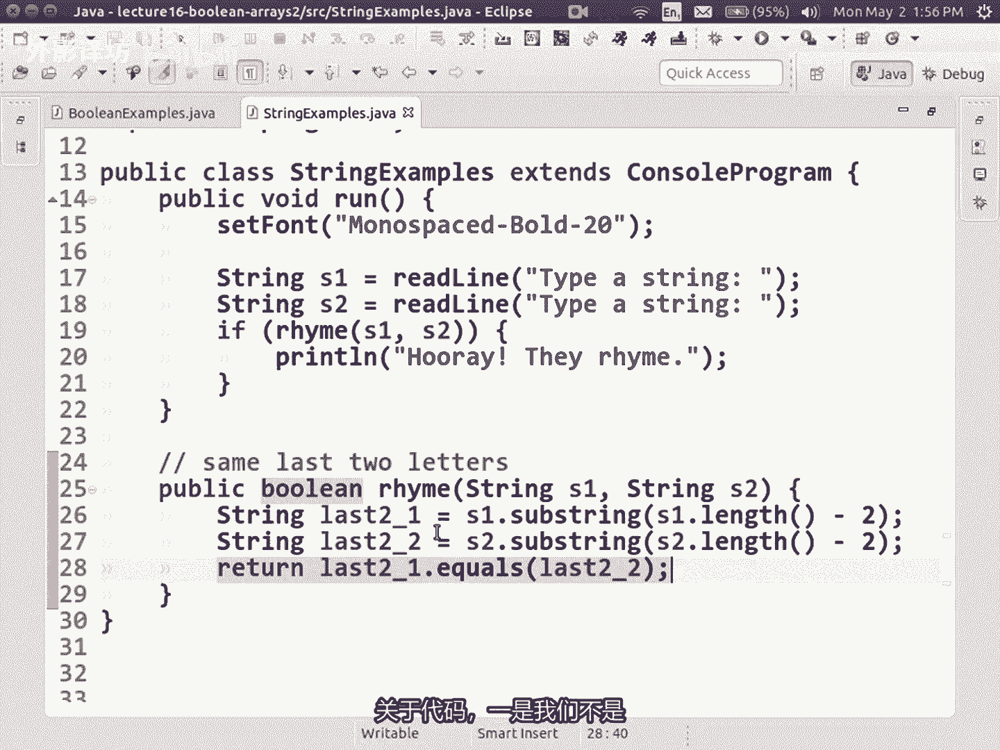
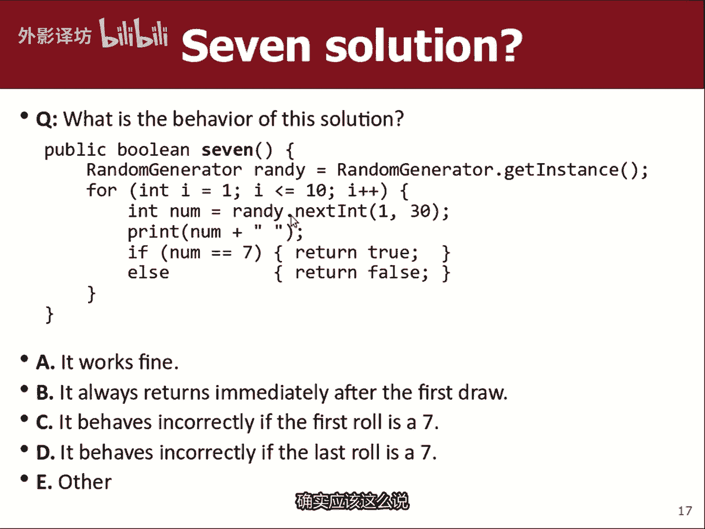

# 【中文配音】斯坦福王牌课程 CS 106a Java教程 2017年春季课程 - P15：16_ Boolean, Arrays 2 16sp - 外影译坊 - BV14U4geNEEq

那么看看明天我们的期中考试吧，大家应该知道，现在已经是明天晚上7~9，这我想告诉你的一件事是，每个人都会在我们想要的这个房间里，确保每个人都有足够的空间，而你并没有被塞进这些小椅子。

所以我们每人做一张其他座位，因此我们中的一些人会结束于unit201，仍在进行中，如果您的姓氏是同一栋楼，姓氏以S或后面的字母开头，如果您是通过二来的，请转至201这里，如果你忘记了，会提醒你。

会可能会写在白板上等等，所以我们就被分开了，这栋楼里的两个房间，明天考试，我的建议是展示早起几分钟，我喜欢开始准时，如果有很多人坐在他们的座位上，我们已经得到了考试过去了，我有时甚至开始提前几分钟。

因为我太很好，你知道会在六四十五或650出现，我们会尽力尽快开始，尽我们所能，但我也准时停下来好吧，所以你知道我们必须适应，我已经给了我们时间，我的公告已经完成了考试，我的学习建议是上周三。

如果你想听我的对考试的想法。

以及要学习的内容，对于诸如此类的事情，请观看上周三的课程视频。

或者去阅读考试页面，以了解更多信息，我不会的信息，今天花了很多时间谈论这门课的测试。

就是其中之一，我们要去的硬课程继续滚动，即使测试试，明天我们仍然会做新的，今天的讲座材料，好消息是，今天的讲座材料没有未来将涵盖的测试，做作业，并在期末考试中覆盖它，你仍然需要了解它。

但是你不需要转身使用，今天的材料与明天的考试有关，至少我们回来后还不太兴奋，正确的好的。

让我们开始吧，今天的讲座内容，BLISA是在他的演讲中谈论加薪，上周五我要继续本讲座，稍后的主题，但我想要一个绕道一秒钟来填补一个话题，我应该在之前介绍过，是一种叫做布尔逻辑的东西。

然后一旦我们完成了，我们就走回到数组，你们中的一些人已经看到了，或者听说过这个数据类型，稍微提到了一点，称为布尔值的数据类型，布尔数据类型是一种数据类型，存储逻辑测试结果你们已经做了很多测试。

结果产生true或的类似表达式，你可以对这些问题进行错误排序，放入if if语句或while循环标题，你知道可能的事情是或否答案，或正确或错误答案，我们实际上有一个数据类型，我们称之为沃尔数据类型。

令人惊讶的一件事是，你实际上可以创建变量，在此处的幻灯片上输入布尔值和类似内容，你可以说布尔小数等于年龄小于21，意味着是测试年龄是否小于21岁，如果这是一个真实的陈述。

则存储名为minor的变量值为true，如果年龄不低于21岁，则存储名为minor的变量的值为false。

所以很多同学认为布尔沙皇就像弦一样，所以有点像他们。

他们认为如果我说年龄等于36，然后我说布尔小数年龄小于21岁，所以年龄不小于21，所以次要的将存储false现在商店是假的，有些人认为我是像一根绳子或类似的东西，在字符串中。

你有引号围绕它们和字符串里有点循环，超越角色和这不是的东西，确实是一个五个字母的字符串，其值为value的数据类型假的。

有点难包裹你四处转转，但最终发现它很有用，我们用这个的东西，这个如果我们有一个复杂的数据类型逻辑测试，我们可以捕获该测试的结果并保存，记住该测试是否正确或false，并将其保存为变量。

并且稍后在我们的代码中使用它同样的方式，如果我们有一个复杂的，我们可以保存算术表达式，作为INT或双精度变量，并使用，稍后在我们的代码中，这有点更奇怪，更抽象，但是你可以做同样的事情。

所以如果你看我这里的这段代码，说是教授名字，包含教授哎，Cs true，所以你可以初始化这些变量，现在在你的代码中，稍后你可以使用这些变量，基本上当我在这里写小调时，就好像我写了年龄比21正确的变量。

是那个测试的结果，如果我说是教授，我是如果我说不就说名字包含教授喜欢cs，我问的是不是这个东西，这是错误的，所以捕获测试结果将其保存为布尔变量，你可以在编程中做的事情，好的。

你也可以使用布尔值作为参数或返回任何方法，你曾经使用过，你能够将该方法放在if或A中，当该方法实际上正在返回时，像carol中那样的布尔结果值，当你说前面被清除时，方法前面很清楚。

返回一个布尔值true或false的值，以及当你说扫描仪时，扫描仪有下一行，该方法有下一个line，实际上返回一个布尔结果，如果结果返回，则true或false true，测试if或循环是否为真。

继续前进，那么你为什么要这样做，为什么这样做，你关心这个数据事件，为什么很好的使用这种类型，我认为它可以使我认为使用布尔值代码，更具可读性，布尔变量或布尔值方法，可以让你更容易理解某些代码。

所以我们做了一个我认为的程序，艾莉西亚丽莎发表了演讲，其中程序是在您编写的地方编写的，关于您是否要继续的计划，与某人约会，然后你检查如何，他们赚了多少钱，或者他们的年龄或者这种东西多好看。

他们是你把所有的东西都放进去，如果我没有表达的话，真的很大，那个程序坐在我面前，就在这里，他写的那一篇，但如果我没记错的话，声明中有一大堆东西，就是有这么大的if测试，如果你有某种切片和切丁。

用这些布尔变量来解决，你说的好，时代的一部分，好的是，我会和人约会，但是212真的哇啊，这个JARED是谁的节目，地铁我会把他从，视频，所以不要被起诉，就像如果他们年龄好，身高也好，他们的薪水不错。

这些都是测试，我将用它来决定我是否想去和那个人出去，所以我只是有点捕获这些测试，并给他们命名，然后在俱乐部稍后使用它们，正确使代码更具可读性，因为我敢打赌，如果你看过爱莉西亚编写的程序。

写的好的代码仍然可能是这样，很难把那个巨人拉开，KF中的布尔测试声明和他的版本，与这个程序相比，它非常简单理解，就像黑我会约会某个人，如果他们是我喜欢的年龄，并且他们是我喜欢的高度。

或者他们不必拥有其中任何一个，只要有钱，我就去和他们出去约会，很容易阅读if if语句的意图，在此版本的代码中，这是我的外部变量的销售宣传，有些代码更容易阅读。

好吧，你可以编写接受精彩的方法参数或返回布尔值，I认为一个非常常见的用例，是编写一个返回布尔值的方法，您的方法调用可以用作在if或a while，或任何地方进行测试，否则你期待的测试是这么写的。

例子是什么，好吧，我的意思是我提到的一些方法你已经看过了，前面为卡罗尔清理了那些事，你一直在使用这个的一些例子，无论是谁写了卡罗尔，他们都写了称为hoopic bulin front的方法。

是明确保佑你，所以这是一个有用的，你一直在使用的东西，但也许我们来谈谈写作方法会这样做，这里有一个名为is s的方法，即使你传递给他一个int，它也会如果是则返回布尔值true，即使它会返回一个布尔值。

如果int不是偶数，则为false，所以它是奇数，好吧，这是一个愚蠢的小方法，它没什么作用，但看起来重点是我可以写，如果是即使是42，也有点像，如果声明读起来像英语，我喜欢读起来像你一样的代码。

和一个只读的人说话，如果您将该算法描述为你的朋友，如果这件外套看起来像那样，那就太酷了，代码我喜欢那件外套，你很了解，当人们写下这类文章时，测试就在一秒钟前，我说如果甚至是54嗯，你真正要问的是。

当我称之为偶数方法，我通过了54作为参数返回一个值，确实如此，这就是你要问的，测试一下很多人写的是什么，首先当他们刚刚学习时，沃尔值是这里的第一个例子，幻灯片他们会说是否是偶数方法，当你通过它时，54。

如果结果这等于true，然后做一些事情，我用红色突出显示的每个相位等于真实部分。

你不需要说，你不需要写equals等于true，意味让我尝试解释一下。

也许你已经能看到我说的了，意思是但是如果你说如果是56，就等于真的，无论什么权利就是这样，那个糟糕的代码是这样做的好吧，记住当你调用一个返回A的方法时，指任何类型。

而不仅仅是BULIN和int或者发生什么事情，就是他消失了，他运行一个方法，结果是回来了，几乎就像结果被正确粘贴到代码中，就在这里，让我们假设这是疑问语句，确实返回true，几乎就像你刚刚输入true。

所以现在你说的是true等于true is，是的，当然是的，但是你实际上不必这么说，如果你只要说真就够了，这就是你需要写的，因为语句true等于true，只是得到简化为yes s s s a正确的陈述。

所以这是真的，所以你不需要写是否为布尔值，方法，结果等于true，你只需写下方法的名称即可，你隐含的说，如果返回true，那么记住这个if语句好吗，并理解这只是一个小事，它可能看起来不像很重要。

但重要的是我们的想法，有时将其称为布尔than，如果您获得禅宗，如果你真正理解其中的哲学，这种数据类型。

你就会明白，不写equals，Equals true，现在可以了，同样看一下底部的部分滑动，有些人说好吧，我明白了，但我从来没有写等于等于true，但我想看看是不是假的，我就写一下，偶数57等于加好。

这同样糟糕，你不必说等于等于false，你只需写原来的测试，基本上什么都没有，如果这返回false，然后我否定我问的是总体而言结果是正确的，所以如果总体表达式为true，表示该方法返回false。

这就是我正在测试的，所以写成简短版本，而不是那些好的长版本，使得感觉到任何关于这些的问题，例子在这里，你有问题吗，假的好的，这是另一个例子，这是一个方法，真奇怪，你给了我三个ins子。

如果所有的ins ins我都会返回true，你通过我的那个已经关闭，所以如果mod2不为零，并且如果光束到达是非零，解二上的接缝是非零，如果所有这些都是真的，我会回来是的，如果有其他情况的话。

我将返回错误的权利，好吧，没关系，我们当然可以写该代码，我们可以使用它，但是有是一种更短更好的写法，代码让我尝试向您展示什么，所以请先关注我，第二次让我们把代码变成更长的布尔值变量。

存储逻辑结果测试一下，让我们写出这个逻辑，测试一个基数并成为奇数，并查看基数测试这是否属实，我能做的一切，如果你把它放在括号里不确定，但你不必测试所有这些东西，以及是否整个所有这一切的结果是真是假。

将其存储为布尔变量，测试立即存储，如果测试存储，如果test存储false，则true返回true返回false，与代码相同，在最后一张幻灯片上，但我添加了这个布尔变量，它是额外的异形。

你看到那是一样的吗，等价的，现在我们的观察have是这个布尔测试纸，这和我想要的一样吗，如果测试存储true则返回true，返回true，如果测试存储false，返回false正确。

所以基本上任何测试都等于I，想要归还那个权利，这样我就可以缩短此代码，并说执行布尔值测试，然后返回测试，返回该测试的布尔值，就是我的想回来，所以现在我已经摆脱了if fs，我神智不需要布尔变量。

如果我只是要捕获它并返回它，我只能说返回所有返回的值，无论是否返回AAA，应该和我一样奇怪，一行版本实际上是最短的，布尔禅师这辆车，很多学生编写if files版本，以为那事就是你的大脑去往的地方。

首先这没关系，很多时候我也这样做，但然后你有点缩放出去走走，我只是返回一个布尔值和if files，我应该返回布尔语句本身，知道一起有意义的问题，关于这个，如果你明白了，你明白吗，Torrenn。

我们输入了if ok so1型仅返回值的布尔方法，11次布尔级测试，布尔返回并不总是由单行或单行组成，If else，你可以做点什么，有点复杂，我喜欢这个例子很多，这时我将传递给你一个int作为参数。

我希望你告诉我是否这是一个素数，你们只知道一个素数，没有任何其他因子，除数除了一个和它本身之外又如何，我要弄清楚这个号码是否有，如果我不能做到这一点，有哪些因素，我可能需要的代码行做一些计算和一些工作。

弄清楚，在这个例子中，我要做的是，从一开始我会循环到N，我会检查每个数字I是否是约数，如果N整除它是否是N的因数，均匀的由I那么I是N的因数，所以I说因素加加，我正在计算如何年底有很多因素。

质数代码是一个具有，恰好有两个因素，因此如果满足则返回true，有两个因素返回false，如果没有两个因素，最后一行代码现在这样做了，我写了一个返回该值的方法，布尔值，但它必须做一点。

首先弄清楚它是什么，布尔值应该返回，现在我可以写，如果是质数57或任何数字，我可以询问数字是否是素数，这是一个很好的小帮助方法，有权询问一个数字是否是素数，好吧，那是另一个布尔值返回的势力。

有时会做你发现的布尔运算是你有相反的测试，你想要的这时特别真实，因为你记得while循环测试表明继续进行，虽然这个测试如此隐含地是正确的，这意味着我想停止while循环，当这个布尔测试变为假时，是的。

但是很多时候很多程序员特别多，刚刚学习的学生思考我什么时候应该停止，当卡罗尔撞到墙上时停止，当卡罗尔撞到墙上时停止，当文件已过期，当我到达字符串末尾时停止，所以很多人都会考虑停车条件。

而不是继续下去条件，但现环模式需要你告诉他继续前进，所以这是很常见的事情，需要反转布尔值的地方，反转测试得到A的相反结果，现在你们已经学会了某些测试，有这些运算符，例如不是带感叹号的运算符。

所以你知道如何逆转测试，但是有一个有趣的定律叫做大摩根定律，只是一种如何逆转的经验法则，波尔表达式，所以如果你正在检查对于A和B来测试，A和B不是不是必然是一些变量命名，A和B只是一些布尔值。

我将称之为N的表达式，其他一些布尔测试如果你想要的话，我会打电话给B，与很多学生的测试相反。

错误的认为A的相反，B不是A，也不是B，但我是说你知道你是否参加过以下课程，像我认为的命题逻辑，cs103谈论这个有点像A和B的对立面，不是这样，所以如果这是原来的，为什么，这不是，相反这有什么问题。

对对对，他说的是两者都需要的区别，他们是假的，或只需要其中之一，它们是假的，所以我认为这个类比就像如果你愿意，如果也许它太很难想象哪个字母像AB，如果你说类似的话又怎样，如果他又善良又高的话。

我会和他约会，不管这两种品质是什么，你感兴趣或其他什么等等，相反意味着好的，如果他发生什么事，我不会和他约会啊，不友善或他不高或两者兼而有之，正确的其中之一是侵犯，意味着你出去我不会出去。

与你或任何你没有的权利，必须违反这两项测试，如果你违反其中任何一条则被拒绝，你出去是因为我两者都需要，如果有的话，我会购买你的电影，至少得到这么高的评价，并且如果价格低于20美元，评级很糟糕。

如果我不会购买它，价格超过20块钱，我不会购买其中任何一个那些假的，打破了我的测试，想做的事情确实与B表示A损坏货，B坏了，或者两者都坏了，所以真的对面不是A也不是B，当然你还记得吗。

或者可能是左侧或右侧，或两者双方可能是真实的或成为正确，所以如果A和B都坏了，仍然有效。

这就是德摩根定律，and的反义词is not或not，同样通过类似的逻辑或的反义词，不是且不正确，我鲜鱼鸡，所以我不是要吃的，一定不是牛肉，他有不做鸡之类的事，所以我提到这些是因为你认识很多学生。

编写想要翻转布尔值的代码测试，他们通过这样做引入错误。

他们改变的方式是错误的，你知道的和B进入非A和非B。

然后他们的逻辑有点被进一步破坏，对于他们的切割来说。

那是德摩根的法律，很好，让我们看一些例子，恶幻灯片上有几个是表述为，我们可以进行的练习，在一起我不想做所有的事情，这些作为练习，因为我想得到今天有时间谈论一场比赛，但是我只给你看其中几个很快。

然后也许我们可以写其中之一，就像这是一个例子，如果我们写了一个方法叫is原因，你传递一个字符串，然后返回TRU或false，该字符串是否为序言，猫头鹰Q不是A是意识等等，是非原因，任何不是A的字符串。

原因应该返回true，否则false，所以我只是要向你展示这些热身的例子。

所以就像是价值，如果S是A或E或I或O或U，则通过S不区分大小写Z那么我会返回true，否则我会返回false，所以我基本上返回的结果，那个测试是非原因，我只是这么说。

又是我注定要成为德摩根的法律的例子，是非原因，我说黑他不是A也不是一也不是I，这不是不也不是你的，当然如果你有原因，并且你有显示非原因，你可以说返回not是原音就可以了。

我也猜想这就是德摩根定律的一个例子，这里的ORS和这里的not和not表示非求，如果你不明白的话，就有意义，摩根定律，您将这些和保留为穷人会发生什么，代码的正确性给出的参数示例。

如果我在这里服用口服补液盐，结果是错误的，是不平衡的，是的，这是A，所以第一个测试会失败，他说的完全正确，如果你将任何原因传递给非原因，返回的结果应该是false对吧，但会发生什么返回true。

因为它不是其中之一，有趣的是，这不是五次犯规中的四次，所以这将使整个测试成立返回true式的，这样就会使测试是否接受，我们是否有码记住ORS多进行布尔测试，包容性更有可能成为现实，使布尔测试更严格。

限制性的，更有可能返回false，因为所有的部分都必须是真实的，好吧，无论如何，这就是那个我确实想和你们一起写，想练习一下弦乐，我们可能还有一些期中考试的字符串，所以可能是有用我想写方法。

来检查字符串是否押韵，并用非常这些术语的简单愚蠢的定义，所以让我们决定这些单词是否押韵，以相同的两个字母结尾，一个很好的定义，但是太难了，以真正的方式去做，让我们决定，如果单词以在开头则为头韵。

同一个字母好的用户将输入两个单词。

并我们会告诉他们是否押韵，他们是否互相押韵，我在eclipse中有一个程序。

他在哪里，这里是字符串示例，所以我得到了这个读取字符串的部分，读取字符串，然后我想说就像黑，如果这些押韵，那么我会打印万岁，但我还没有那个方法。

所以也许你可以告诉我是什么，前往RYAN泡泡一问押韵问题，round的返回类型是什么，布尔值正确，好的好的，那什么事，这里的参数为string和string，字符串S1字符串S2，好的。

记住我们要使用的定义与最后一个相同，两封信，请帮帮我，我该怎么办，我该怎么办，检查一下，是的，好的，请获取最后两个字母所说的字符串，最后到E等于什么，获取最后两个字母的方法，关心一扇门。

所以我认为弥子串是最简单，因为他关心必须分别看两者。

从长度减去两个起始的子字符串。

在那里我不需要再经过一秒钟参数，因为只是从那里到end，然后是字符串的最后两个，第二个是S2，然后你想要我要检查一下你说的是不是l a at，如果他们等于最后两个，是的是的，你抓住了我，所以我回来了。

最后两个点等于最后两个点返回，是否属实，很棒，这就是布尔禅宗版本那个测试的对，好好好好，可以说它们是否相等，或者返回true，否则返回false，我会已经说过了，嘿让我们把它关掉，记住这个好好好。

所以有我想加强的两件小事，关于代码，一是我们不是很好的处理大写字母。

在这张幻灯片中，我想我不知道，如果我有一个很好的例子，但是如果这个一个的大写，在这个的小写中，我仍然希望他能正常工作。

但这不太好，很难修复，很多次，从这里开始，我说像点到小写，在S1上，在S2上点转为小写，好吧，现在我正在测试小写版本，所以我修复了那里的错误，另一个更微妙的错误，就像如果他们输入字符串会怎样。

是不是不够长，包含两个类似于A的字符，有趣的边缘情况，但你知道你可能取一个字母A和字母B，也许我们可以说，如果字符串不是足够长，那么它们就不能押韵了，至少有两个字母长，然后他们必须以相同的两个结尾。

所以我如何将其纳入其中代码，所以现在实际上不会，如果你通过他这位教皇会做什么，长度不是两个字母的字符串，他会做什么，是的，你完全正确，这段代码会崩溃并引发异常，因为他会要求长度为一负二，这样就会是一。

所以一串出的绝望子串没有那个索引，所以你会让程序崩溃，好吧，那又怎么样解决办法。

如果在这里怎么办，如果我设S1长度至少为二。

且S2长度至少为二，就可以了，解决问题，是的，是的，所以顺序非常重要，就像我要去接触角色一样，然后我伸手去拿他们后，我检查，如果我应该伸手去拿它们，或者如果伸手去拿它们是可以的，我必须这么做。

在我到达右侧之前，检查顺序是非常重要，所以我必须做这些，首先测试长度，你可以做的事情没有，就像这里的超级快速修复，我想什么，你能做的事，你可以说好，如果长度很好，所以你知道我只是刚才告诉你。

也许你不知道，有时必须有带有布尔值的if，但你并不懂事，你并不总是能够摆脱我的每一个if。

语句意思是我只是告诉你，如果你从字面上返回一个布尔测试，你应该返回它，这样就不会意思是如果是坏的或者其他什么，所以如果长度至少是两个，然后我想要，那么我想做我们要做的事情，之前写过。

如果它们的长度怎么样，至少不是我只是想要结果驾返回驾，所以我就返回false就可以了，这是对他们是否押韵的测试，然后在代码中我将运行字符串示例程序。

然后进入字符串，所以我会像MARTY和party那样输入他们。

当然押韵，你有一个马蒂，显然你有一个聚会。

然后我会像您认识必和宝贝一样，输入那些人就是我的妻子，一直想告诉我嗯，这些也是字谜，所以不输入A，像马蒂和艾丽西亚一样的字符串，我们不押韵，但除此之外我们很酷，除此之外我们很酷，但我们不这么写。

我的意思是，这似乎是普遍的工作，我认为还有另一个，我们可以在这里写一个文字。

以同一个字母开头，但这是非常相似的概念，我们写的这段代码是为了押韵吗，有道理，我指的是我们正在写的一个人，如果方法是我想练级布尔方面，返回布尔值怎么办，我写了一个返回布尔值的方法。

如果我如何使用这里的方法押韵，这就是我说的，如果押运回来的话，true则进入if状态正确，并且你可能会说我还没被说服，这不是我不喜欢这个布尔值MARI。

我不想使用好吧，我只能说，如果你我们要检查押韵的东西在几个地方。

这是一个很好的方法，因为否则我就不得不粘贴。

所有这些废话就在这里，然后我会必须将其粘贴到几个中，每次我想去不同的地方检查字符串是否押韵，就足够了，一个复杂的测试，很高兴将其作为方法拉出来，现在运行方法，这就是我想我所说的。

几分钟前我喜欢这样的代码，喜欢英语，尤其喜欢他当run方法读起来像英语时，如果我只看跑步而没有读了那么多东西，就这样看起来像干净简单的英语东西，像这样哦，读取两个字符串，然后检查它们的运行是否有意义。

你知道我就像某处有一个问题，是的先生，哦就像处理边缘的捷径。

案例很好，有些人所做的是他们想要的，避免if fc fc fc fell so，有时他们会做的就是他们会说好吧，如果链接太小，请查看，我用德摩根定律扭转了这个局面，如果他们太小，那么我会回来。

哎呀返回false，然后有点在这里，我神智不会说别的，我就会这么做，所以我认为很多人都在做，他们会先写出所有不好的东西吗，如果是其他的话，这是不好的回报，事情很糟糕，退回十张支票，不同的坏事有来有回。

然后如果我完成了所有这些障碍，现在一切都很酷，我会做工作或其他什么等等，人们更喜欢这样，因为他们代码中的if分支较少，如果你有点困惑，为什么会这样一个仍然有效，你必须记住返回立即退出方法。

所以如果你进入这个，如果你会立即看到FS寄回假货，甚至不会隐含的运行这部分部分在，否则即使你别说别的了。

好的，谢谢询问问很常见的编码风格是检查坏的东西。

开始，还有什么别的什么和到目前为止的其他问题，现在您可以使用布尔变量，或如果你愿意的话，无论测试什么，但是我不会问你任何问题，这让你强迫你做布尔运算变量，这只是一般情况。

有时可用于解决有用的数据类型问题，但我不希望你写返回布尔值的东西，明天好吧。

让我们回到，幻灯片哎呀，让我们看看。

我想要oh，我想要再提一件事，关于布尔之和，然后我会做一点，剩下的课有点关于种族，所以饿很多学生与我所说的斗争，订购核实退货问题，退货很棘手，返回的逻辑可以是很棘手，所以这是一个我不是的例子。

会现场编码，但我想谈谈关于一些代码并谈论它，但是如果我们想写一个方法怎么办，称其为幸运期，他会抽取最多十个随机数吗，如果任意一个随机数是禁运期，它会停止，它会停止，它会停止绘画。

打印时将停止绘制的数字数字，它会立即返回一个对用户的真正价值，如果我们必须这样做，画了十次不同的字，但我们从来没有14中任意获得幸运期，该方法将放弃，并且他会第十次后返回false。

好吧好吧，如果我们要编写该代码，这是该代码的候选者，我就想向你扔代码，可以从头开始写，但是就像这里的布尔七随机生成器，然后循环14pick1到30之间的随机数，如果如果不是七，则为七，返回true。

返回false，所以我声称这段代码有一个错误，所以我想如果你正在看我的多项选择，这不是我想要的，如果你看到有人举手，他是什么，告诉我你是什么，思考按钮是什么，请稍等一下，你有没有得到足够的，你知道吗。

统什么是正确的，所以他是什么，他说的完全正确，只会选择一个随机数，一旦没有，不管怎样，如果选了一个幸运的七，第一次尝试他会返回true，那是很酷，第一选择就很好，如果他选择向12，他回去。

在这个else里面他会return false，现在记住return，立即退出他们，所以如果我选择了12个或其他不适的东西，A7代码不应该停止，但我应该继续努力，14这个代码没有做到这一点。

并且这也是我向你展示这个的原因，代码示例只谈论某种何时返回或从哪里返回，this else return false的代码也是如此，渴望返回，但尚未返回false，直到你尝试了十次都失败了。

他们全部十个人对了，如果数字是七呢，Return true，这是一个非常急切的返回声明，是这样还是那样，以上你觉得怎么样，这是好是坏，是的。

是的，根据这个问题的定义，我我的意思是，这取决于你是什么试图做，但是是的，在这个问题上，我这就是你说的，我想停止的时候，我得到了七，所以如果我得到了七。

我就会这样做，想回到我不想留一遍又一遍的滚动数字，好吧，这里有什么解决办法吗，你能用其他语言描述一下吗，你在这里返回false，我想要什么，我该怎么做，我该如何改变，是执行预期操作的代码式的，所以是的。

他所说的只是摆脱这个else语句，else不做任何其他类型的，继续保持做for循环，保持随机选择数字并打印，他们不断尝试，看看你是否能得到一套，然后如果有的话，十个中有一个七，我将打印它。

七点我马上回来，如果这十个都没有，这就是我想要的是七，这个for循环将最终完成，我最终会倒下，这里是鼠标光标所在的位置，在for循环之后，我相信什么，你说如果我到这里又怎么样。

这是否意味着如果我之后到这里，第四个是什么意思，是的是的，这意味着我尝试了十次，并且全部其中有十字。

他们都不是七，所以现在这就是方法for循环后应该返回false，所以我认为这是一个有趣的问题，因为在某些情况下，如果我提前回来，但在其他情况下，如果我回来晚了，意为他必须做，以及我是否正在寻找一个结果。

或者只是我可以阻止的一件事，或者我是否希望他们全部十个在我停下来之前，已经有了一定的结果，是的，所以你必须考虑一下，当你编写代码时，我不是会让你返回布尔值期中考试，但有时我会要求你返回其中最小的数字。

数组列表或其他任何内容，以及有时你必须决定，是否想要在循环内返回该值或在循环之外，你必须思考关于那些事情，正确的事情就会到来，当你思考时会上升很多，逻辑和布尔这种类型的下来，确实这是有道理的。

你有一个问题，关于，能量水平真的很棒，今天的房间如果你真的有的话，就像明天晚上的考试，如果你凝视，像我现在你就像是吗，你真的很想教我新东西，一个洞，我几乎没有得到所有其他的东西，明白了，你会考验我。

明天你告诉我这一切bless，So，为什么我实际上要添加一个。

这是一个拼写错误，确实应该这么说。

如果您只传递一个，则下一个赛一逗号30中max，它从零到最大值，所以你必须加一个来推塔，这个应该说一逗号30，抱歉。

那事实上哦看那是我的狗，爱比他在教室里做什么哇。

实际上我认为你读错了好吧，我要把那部分编辑掉，视频我看起来像是有我的表演一起，是的先生，是的，那是一本书，只是兰迪的一本不图，你知道，是啊是啊，我需要这个兰迪做什么。

基本上就是我的风格向你展示了我的家庭作业，哪三个，我想我可能是偶数或两个，我指示书写随机数和产生get instance，点下一个int，就像有点像是一件很长的事情，基本上那部分很好。

随机生成器获取实例式，实际上是一个创建和的表达式，返回一个随机生成器对象，并该对象内部有一个x int方法，但如果你写的整件事，你正在获取该对象并使用它的方法，而不保存对象本身作为变量变量。

如果你想问的话，会有用很多东西的随机生成器，所以而不是去取它，每次你只是把它当做变量，但是是的，其中之一是相当于我不会做的测试，关心你用的是哪种风格，基本上没问题哦，你的意思是，如果我写了一行。

版本随机生成器获取实力，下一个在异形哦，不不抱歉抱歉，如果你在这里说intern在for循环之前，然后是的会很糟糕，因为你想收获滴答这个数字十次，所以我必须在这里调用下一个int。

我猜我是什么意思，也许还不完全清楚是什么，我说的是以下版本是。

如果你说随机生成器也很好，获取实例，点下一个int，然后你删除兰迪，如果你这样做了，那就好了，但你仍然需要收获，按照你所说的循环，选择一个新的随机数，这十字中的每一次正确的，好的。

好吧，这就是我想说的WILLIAN。

我还有一点时间，还剩大约10分钟，还剩我只是我不想涵盖太多材料，但我想做更多一点一场比赛，因为你知道爱莉西亚已经开始了，接下来的一周我们都会，我们会在比赛中做的更多，知道我是对的，就像不是一样。

只是我们今天有常规课而已，甚至不像考试复习，它就像常规讲座，周三我们有课，另外本周我们还有部分，一切都在你身上继续滚动，根本没有任何休息时间，不是吗，我想我是有史以来最刻薄的老师，告诉你。

我会补偿你什么，主修cs，我会让你赚到六位数，毕业后工资怎么样，这实际上不是我的交易正在做。

但我们都会为你做，看看艾莉西亚谈到加薪。

他上周五谈到加薪，他写了一个程序叫做是否程序，要求用户输入一些内容温度，并将它们扭曲为数组，好的关于这个程序的一件事，我真的很想写一个改进的，我想写的程序的版本，分解问题的版本记录方法。

意为你知道他写的这一切都是你知道的run方法。

这就是我想让他做的做正确的事，他没有违背我或者其他什么，但我想回去，现在就改进这个程序，让我们看看不同的部分，这个问题以及可能是什么快，你知道也许我们可以变成方法正确。

所以有一个快，我们从用户那里读取一些温度，并将它们存储为数组。

然后有我们计算平均值的快温度，然后有一块地方我们计算上面有多少天。

两者看起来都像三块。

应该是方法，所以如果我们做了方法，例如第一个快是什么，就像公开读取温度一样，无效读取温度，然后也许第二块是什么，计算公众平均气温无效计算平均值，然后计算第三个大块的天数高于平均水平。

现在这三个块当然是什么，你会看到我是否只是剪切和粘贴，我会遇到麻烦，所以我走了，我在这里粘贴，我回到这里。

这时这里的平均值我回去我粘贴，然后是高于平均水平的天数。

这部分我剪切并粘贴，所以，我要为事物添加下划线，好的，如果你像我想要的那样，打电话读取温度，然后我想要，计算平均值，然后我想要，阅读量高于平均水平的天数，温度方法效果很好，询问用户几天。

创建一个数组循环数组，并将内容存储到数组。

打印数组，现在很酷，第二种方法计算平均值，这很令人沮丧，你认为发生了什么事，为什么我说的话到处都有强调吗，术语可能是我没听说过的人，从今天起，是的先生，是的，你说的对变量名称times超出了范围。

但它没有存在于该方法中，并且存在于其他方法读取温度，那么怎么办，我从一个到另一个，当你需要的时候，你知道他是如何工作的，正确的在方法之间共享数据礼品。

参数和返回，所以让我们谈论，当你将数组变成参数或返回索引哦。

我不有语法幻灯片等等，在你的幻灯片中吗，德丽莎，他知道一个必不，你不想看，他不再抱歉，我的意思是跳到艾莉西亚的幻灯片，在这里台列为准备好的，如果你想把一个数组变成你写的参数类型，括号和名称。

如果需要返回您在其中写入类型的数组括号，而不是void，并在你的如果将数组作为参数，则代码这是一个计算总和的方法，循环数组的所有元素，零到长度添加我返回的结果，所以我调用了一个方法。

将该数组作为参数的sun好的。

所以我想我们需要做的是，在我们的程序中计算平均值。

你需要传递给我这个int数组称为临时工，所以我要粘贴就在这里，所以现在下划线去，现在就在这工作了几天，高于平均水平也要求临时，所以我需要将其粘贴到其中，当我在这里说平均时也强调了。

那么如果我说我需要双倍呢平均，所以我现在需要耐心下划线消失，但在此处run方法很生气，因为我必须将这些东西的值传递到这里，是的，那么我应该传递什么来计算平均水平。

我基本上想通过times，但run方法没有临时正确，他没有数组，我怎样才能让奔跑的人，这里确实有，是的，我明白了，你是说我可以取出这部分并将其移出运行。

然后运行就会得到该数组，我认为那是真的，那就好了，那我就得把它传到这里嗯，我猜我想要什么，但我真的很想谈谈，就像如果数组是在这里制作的那样，但我也想跑去拥有它，这样跑步可以把它传递给其他人。

但我不想声明他并运行，我指示，希望这个人能以某种方式做到这一点，跑也有竞争对手，怎么样读取温度方法并实际如此，那次跑步也会有他的数据返回它可以，所以你要做的事，你会说int括号，括号作为返回类型。

我要返回一个数组int，然后在方法I的末尾，简单的说一下现在的返回温度，有些人喜欢的语法，我要把括号放在这里，还是其他什么不，你只需写下名字数组的变量，而不是括号，现在这里的温度正在恢复。

在这里主要还是运行，所以我会做什么，我会说int括号，括号临时等于返回的结果，就像任何返回捕获一样，保存它作为变量，现在我可以将其传递为，如果我可以计算平均值的参数。

想要计算高于平均水平的天数，高于平均水平的天数需要两件事，离时和双平均值，这样我就可以通过，这里是临时工，如果我写的是平均运行时间方法，没有任何变量，调用平均那个在哪里计算平均值。

我怎么得到这个那次运行。

让它返回正确的，那又怎样，我要做的事我会说黑计算平均值，我会给你温度数组作为参数，你返回平均值，你已经计算了平均回报率。

所以现在当我在运行中调用它时，我会说双重平均等于那个，现在我可以通过数学了，现在这些方法都被打破了，问题由两部分组成不同的方法，这就是如何通过一个数组作为参数，我要停止，你知道这一天就在这里。

下次我看到你可爱的脸庞时，明天晚上七点，我祝你一切顺利。

