# 【中文配音】斯坦福王牌课程 CS 106a Java教程 2017年春季课程 - P17：17_ Arrays 3_ Reference Semantics, Tallying - 外影译坊 - BV14U4geNEEq

哦最后一天的黎明，24，还剩下几个小时，你知道期中考试是明天，明天晚上再系没课，如果你不知道礼堂在哪里，你可以点击红色的X就可以了，会告诉你，所以我希望你们所有人都能，明天晚上七点到九点钟。

我想你们现在指导考试的情况，练习考试在主题列表中，二三十是参考表，将附在您的考试结束后，我会带一张你没有的草稿纸，需要带任何空白纸，我会有很多，我会带几个的借阅书籍将在如果您需要上来。

请在房间前面看看他们，你能做到，你能做到，如果你在书中查找一些内容，测试期间我还需要什么，如果你有以下问题，请在外面等候，有问题你可以来问我，他们也可能在那里，所以你可以问那些问题。

所以我在我之前就知道了，想教你一些java的东西，今天也是，但我的意思是，我知道你们是考虑考试，所以其中之一看看你们是否有任何问题，关于明天晚上发生的事情，在我开始考试之前进行考试，相关问题，是的。

练习考试难度如何，与真正的考试相比，我会尝试确保它非常相似，有时困难，你知道我曾经每年都会思考新问题，偶尔我也会想到一个问题，很难或太容易或其他什么，但我的目标是它们非常相似。

那些练习测试实际上是那些模拟考试，是我以前的考试，所以我将这些测试交给某个地方的某人，是的，你知道我是否错了，如果我的问题很难，我们正在接受真正的考验，那不是我的本意，我会弯曲它来修复它，但是是的。

我的目标是，如果你能完成这些练习测试，并且你明天出现不应该出现很多惊喜，仍然是一个问题，该主题是该主题的问题，这正是莱妮告诉我要学习的，这正是几乎练习的内容测试，我得到了这个，所以我不会尝试欺骗你。

我不会尝试，如果你学会了这些东西，你会感到惊讶，并且然后你就可以做那些练习题了，明天你应该保持良好的状态，另一个问题是考试的长度是的，它将小于或等于这些练习，考试的长度是同样的问题。

但我可能会减少一个问题或类似的事情，我有点从那里开始有失，我如果我认为你知道的话，就摆弄它，我想确保你能完成，当然是提供的时间，当你在的时候，两个小时很快就过去了，疯狂地编写java代码铅笔。

但我会尽力确保你可以在划分的时间内完成，这些都很好，还有其他问题吗，关于明天的考试，你知道有很多研究，这就是说如果教练是对学生的鼓励和积极，就在他们参加考试之前，统计上原子的表现。

所以你知道我希望你知道我的意思是，我不是开个玩笑或做一些我认为的事情，你们会没事的，我认为你可以做到这一点，我想我知道你正在努力学习，并且一切都在进步，得到回报，我对你们有信心做好明天的工作。

所以希望你所做的学习，今晚明天欧式的嗯好吧，所以现在我知道考试迫在眉睫，真的不想学任何东西，我明白，但我仍然想要今天给你一个演讲，我讲了什么，我想谈谈我认为可能有点帮助考试。

因为我想做一些更多的数组和其他东西，我今天所做的不一定是这样，我会直接测试你的东西，但是我将用数组做更多的事情，数组可能正在测试中，所以这是考虑加息一点，很有用，更多一点，这就是我现在的处境。

我今天要去哪里，让我打开我的幻灯片。

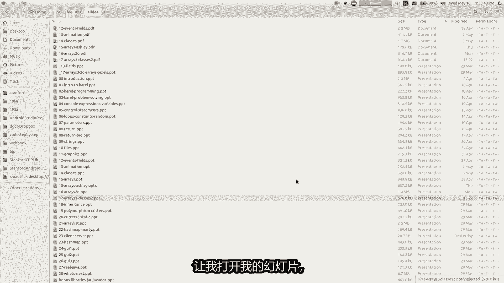

这是一张好吧，我们就这样抹掉，我们上周五了解了数组，实际上和我谈论的是具有像素的多维数组合，周一的事情我要回去一维数组一段时间，虽然我说的很多话，今天将适用于任何数组维度。

所以这里有一些我想谈的具体事情，今天我想谈谈，当女友写了一个程序的组合，涉及到数组有哪些出现特定问题的问题，参考资料很有趣，语义学我还想谈谈几种不同的其他使用方式，我特别想谈的一个数组。

关于如何使用数组来统计数据，如果我有时间的话，我也可能没有想重温尼克上次所做的事情，周三关于物体，所以我们看看是否我们有没有时间，但是没关系，开始了，所以如果你想创建一个方法，您可以执行的数组中的参数。

我相信实际上已经做到了一点，讲座结束后，他做了一个汉堡，关于大型游戏，并打破不同游戏的分数，我相信团队会有，所以在这里你将会有一个方法，接受数组作为参数，因此幻灯片上的这个例子，我有一个方法。

说出您在int数组中传递的一些名称，I称为A我只是循环所有元素，我把它们加在一起，我立即返回，结果一件事，嗯是我没有指定A的长度，在这里你只是说英寸括号，括号我不说括号五或七或十，你为什么认为那不是。

事实上这样的地方在哪里，发现某处有三个类似的东西，是的，是的，他说无论是谁打电话，他们制作数组的方法，当他们把它传入，我只是要使用，无论他们做出正确的光线大小，这就是我想要的吗，另一种指定大小的方法。

这个方法来指定我的意思的大小，为什么我不指定，除此之外，在这里或拍摄，你认为是什么，不指定大小的好处，这段代码，是的，你怎么知道我正在拜访你，并且不是他，嘿好吧，你是对的，我是打电话，但我会打电话给你。

开始你的未来，并取代不存在的我，是的，谢谢将军，这是关键字，正确的是这个方法适用于数组，我可以传入一个数组的任何大小两三个项目，它会把它们加起来，我可以添加附加一个1000个数组，一个小圆子哦。

它不仅仅是一行，正确的参数的全部要点是使代码更加灵活，可以放入不同的值，它会仍然可以正常工作，所以数组长度如果你想的话，这是另一件事，更一般的说，这就是为什么我只是在这里写下这段代码。

我要从零循环到一个点长度，你如何询问箱子的数量，数组正确，所以我写了一个点链接，而不是写我小于四，或无论已经有多长，就像它适用于任何长度一样好吧，记住你是一件事，还可以返回一个数组。

你可以有一个返回一个数组的方法，他想要的该方法内部的数组，将该数组发送回给该人，谁叫他你也可以这样做，这取决于你编码时的情况，可能有用的事情，不同的情况好吧，让我们稍微探索一下数组参数。

进一步我想谈谈一个想法，这似乎与争夺第二个花哨的短语，我会调用直语意，这意味着什么，当我们重视语义时，这意味着当你尝试将事物相互联系起来时，吉他你真正在做的事，复制这两个之间的值事物。

让我解释一下我是否有一个int变量命名为head，我给它一个值，然后我创建另一个变量Y，我说它的价值等于X米，伙计们已经这样做了一个月了，他获取X的值并复制钱包里的价值是对的。

但是什么那行代码不起作用是吗，不喜欢链接，这两个变量始终保持共同价值观，或就像只是因为他们有他们五个的值相同，并不意味着如果我改变其中之一，它以某种方式自动改变另一个排队，另一站文章链接。

他们只是在彼此之间，当他们被赋予相同的值时，彼此然后继续前进，未来他们的价值观会出现分歧，所以我后来说为什么是17岁，但X却没有变成17，我将X设置为八，但为什么不成为页面等等。

我的意思是你可能就下好吧，当然不是没错，就是这样，但事实并非如此，一定是这样，只是碰巧而已，java所做的就是这些值，这个想法彼此不同，当你分配一件事时，就是它等于你所属于的另一件事，复制价值。

这就是我的想法，描述，指语义和，你甚至可能不认为这个想法需要一个名字，因为我们认为他是，但我带来的原因如此深刻，这是因为并不是每一个编程中的东西，使用了这个想法，特别是如果你有他们使用的数组。

我称之为一个非常不同的模型，如果有两个数组则记录语义，并且您将其中之一指定为相等到另一个，它实际上将它们链接起来，一起修改一个将修改其他的，所以在这个一段代码，我将一个数组设为一，并且放入一些数字。

并制作另一个数组A2，我将其设置为等于A1，所以错误的图片，所以我会犹豫是否要画那些东西错了，因为我想让你记住错误的事情，但你有点当你如果你还没有看过那张幻灯片，学习了这些材料，但你可能会说好吧。

有一个一你说一个二，第一天是平等的，所以胡将会是另一个具有相同数量的数组盒子，它会有相同的，其中的植如四十五八，没关系，一二如果加薪的话，就会这样行为，并说我们要检查他们非常好，这会发生什么。

这不是发生了什么，实际发生的是两个基本上变成获得另一个名字，MLIS形成相同的方向，并且，效应器是如果你修改A您确实正在修改，该共享A1和A2都是数组，所以该修改将被看到未来的任何一个变量。

它们都在那里，一件事让你看到我设置的代码，A到括号零等于七，所以我改变这个远道七，并在这样做之后，变量A，如果我然后打印第751章一的内容，部长是的，是的，这是一个很好的问题，就像如果我想要那些东西。

其他的东西是什么，如果我也想要，我该怎么做，我想你已经回答了对，就是我我让一等于到这三个数字，然后我也82，等于我没说的那三个数字等于A1，我只是重写了三个数字，或者我可以写它等于一个长度为三的新数组。

然后我可以循环一，并分配它的每个个人价值观变成二。

我可以做像这样的东西，我今天只有一个空白，我只是有我可以玩的一种空白文件，你知道，所以我可以说INTERVA1等于你知道十二十三十，无论如何，你们有什么并不重要，但如果我想要二来存储相同的东西。

但作为一个单独的数组，我可以说它是一个新的长度为三的射线，然后每个索引从0~1点长度Y，如果我加上加上，我可以设置二，我可以，存储与EI相同的值，并且然后当我完成后，我会有二冷静。

然后如果我说一括号零等于某事改变，是不可见的，另一个年龄的变化相同，所以这里的区别主要区别是，这些单独的元素是这样的，当你将一个分配给另一个相等时，int它被复制进来，但是当你找到一个时。

数组等于它链接的另一个数组，他们在一起好吧，所以我的意思是确实如此，提出问题，为什么要这样做，为什么java这样做，真是太好了，奇怪的旋律更难学，如果事情不一致，那么为什么要这样做，我改变了他。

为什么他们以一种方式做到这一点情况，以另一种方式在另一种情况下嗯，有几个原因，最简单的原因是为了效率，因为如果你有一个非常大的数组，然后你让另一个数组等于它必须复制全部内容，如果抱歉的话。

如果加薪这种方式就行不通了，具有类似于INTEL的值语义，如果签名等于复制它们，然后你每次都必须混合副本，你设计他们的速度较慢，因为费率很大，必须全部复制那些自行车需要更长的时间。

所以其中一辆数组如此有趣的原因。

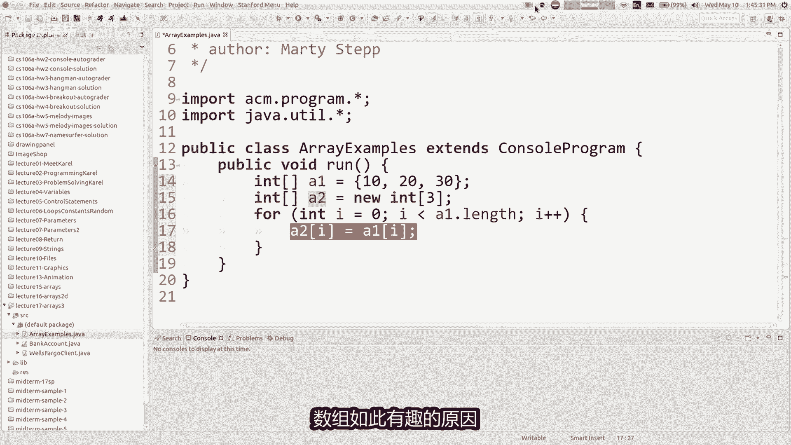

我正在谈论的行为，这里的幻灯片是为了效率，另一个我们稍后会讨论的原因是为了分享，因为有时你想要给你的一些人，你想让他改变并改变它，你希望能够看到这些变化，所以你是故意的将数组链接在一起，像这样互相分享。

无论如何，有几个不同的原因，不是每个都是这样，语言是这样的，这是怎么回事，java做了一些语言的实现，作为名为指针的通用功能，就像C和C加加语言，有这个另一个称为指针的概念。

允许你以这种方式将事物联系在一起，但他们留下了这样的说法，如果你有足够的勇气就更好了，夏天参加6B或X课程，或者秋天我会告诉你关于指针的一切，但我们再也不要谈论它了，这个角落的其余部分黑。

这就是java，我们有必要了解一下吗，因为你知道我们用以下方式编写程序狂欢，它会脱落，我们不想要误解代码的作用，但我们来谈谈其他一些，这会你如何互动的影响，有了这个想法，这里有一个简单的例子。

我实际上可以在其中编写代码，利用我拥有的这个功能，一种双重下降的方法，是你可以看到超级有用的橡皮擦方法，但你给我一个数组，我将使数组中的所有值被逃逸，将他们全部相乘，所以在主运行函数中。

我创建了一个数组，将其附加到消息中，然后该方法已完成，它会打印我的数组，我的数组现在不同了，你知道有点有趣，就像一般在编码类中，如果将参数传递给A则写入匹配，你不必担心你的通过该方法修改参数。

你知道这一切都不会发生，你的手机包是不会的，喜欢改变那是什么，但在这里你可以，并且实际上在这种情况下，代码我是故意这样做的，利用这一点，所以现在他是让你知道这是我的all right。

我希望你帮我改变它，我希望你能以某种方式修改它，通常在今天之前，如果你想的话，打包一个参数并退出渲染，修改后的新版本，该参数的改进版本你会如何实现这一目标，就像你传递一个字符串一样，你想要修改它的方法。

screen如何取回修改后的内容，屏幕是，是的谢谢，退货是关键词。

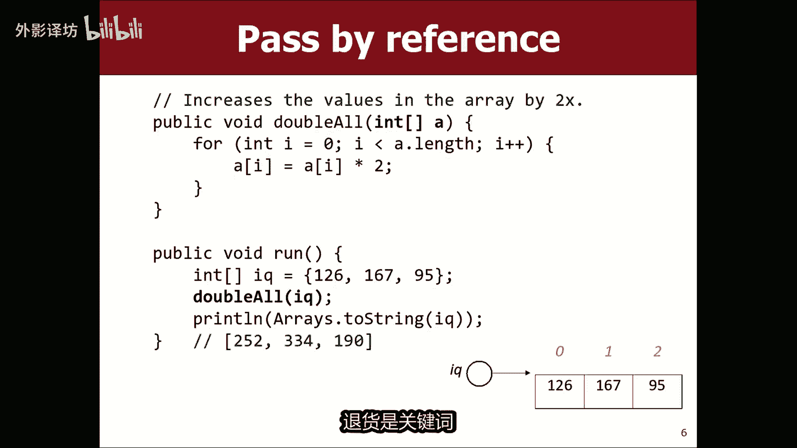

他在这里说你已经退休了，所以就像如果我想写一个方法，公共留口吃字符串S等等，我把这个卫理公会的观点转向你认识你好，就像认识两个，每封信的副本我不能这样做，作为无效方法，我必须这样做，新的双弦。

然后我可以返回双倍字符串已运行，你还说了另一个好点，如果我看到字符串S就返回并运行，等于你好，然后我就结结巴巴了，不会将S修改为两个副本版本，我必须添加另一块，你所说的S等于的代码，口吃的结果是什么。

由于我想存储而口吃返回回到我的变量，所以现在我知道了该代码的概念，很难理解，弄清楚我们中的一些人仍然习惯了，但我们的原因必须这样做，是因为这一切这些其他值使用该值语义。

所以我们必须存储它该方法返回的东西。

所以数组的有趣之处在于，你真的不需要那么做，只需在方法中传递数组即可，修改数组尽在你的数组是修改后坐在那里，相同的数组，同一环类型的两个别名，很酷好吧，如果那样的话，就采取行动，感觉可能有点奇怪的想法。

对此有疑问，但到目前为止，好吧，让我们继续寻找，如果如果你想追踪什么，这段代码正在做你可能做的事什么事，这就像性别符号，什么可以差，有时这里发生了什么，就像我们画画的方式一样。

这些东西是我们绘制的实际数组，然后我们说变量几乎就像是祝福你，几乎就像一个小参考，一种参考方式到数组，所以我们可以这么说，这里的变量，但实际的数组就在这里，我不会太被抓住，在这里的图片中。

但基本上当你说双倍都喜欢你时，装备全部将B型卡，基本上是说A等于IQ，本质上就是你为此所做的运行double all方法，因此如果A是等于IQ，这意味着A出现为同一个数组的另一个别名。

is a这里DIO指的是同一个数组，在这里如果我循环数组，并且我将其更改的所有元素值加倍，他们就是那些价值观，然后当我返回此处运行，并打印它是一样的一样的平静好吧，这就是衣服的作用。

让我们看看这里还有更多内容，所以有些人做的另一件事是，将传入一个数组，其整个数组通过的目的是有新的内容放入，贝弗利和传入的原始内容，我们的会议和唯一的事情，重要的是，他们的最终内容不常见。

但经常看到这个概念，经常被称为输出参数，大多数参数是用于受雇者喜欢发送方法的信息，但在某种情况下，就像我现在描述的目的，传递参数就是这样的方法可以填写并发送回来，这样这几乎就像使用参数作为return。

所以这段代码是有点傻，但是我这里有什么，是我用随机数字填充制作随机生成器的方法，选择随机数，并将它们存储到数组的每个索引，然后我不必须退回任何东西，因为参考语义，但这里的想法是启动并运行。

我制作了一些数组length，我调用这个方法，并且在该方法之后，我现在有随机的东西在我的数组中，我使用，但什么并不重要，价值观之前我猜他们都是零，因为当你创建一个新的已经为零，但本来可以任何事物。

不管它是什么，都会被这个重击，无论如何都是随机的，所以重点是该数组是为了，该方法是能够发送出新的信息，输入贵重物品毫无意义，所以这是一个有趣的使用一个种族，另一个这个例子可能是我没有放幻灯片上，有这个。

但你可以传递一个数组，并说嘿，我想要你要求用户输入所有数字，这个数组有两层，这样你就可以看到，自从他们读完之后，就彻底延迟了，并读取并读取您可以存储的内容，那些记录每个索引，然后当阵列返回运行。

阵列已满，所输入的所有数字中再说一次，里面有什么并不重要，用户刚开始之前的数组打字，因为这些数字得到无论如何都会被覆盖，所以这被称为输出参数，利用了这一点没有，这个就不可能参考我的语义想法，现在描述好。

所以我得到了稍微做一摇对了，在这里，但我不会再使用它了，关于引用语义，我们学到了最后一些关于物体的小知识，星期三，尼克开始谈论如何编写一个名为银行账户的类，是的，我想回顾一下周五和下周再多一点。

所以我们会做更多这样的事情，东西，我认为需要一段时间才能完全了解对象的工作，但我想提到java中的对象也有这个参考语义，仅为指示，就像数组一样，现在什么是对象，你知道我们会讨论这个很多。

但基本上如果有类型大写的名字或物体，如婴儿SSS或关心，而布尔值则不是那些被称为原始的对象，重视那些价值，提交这些东西，银行账户和G椭圆等类和随机生成器，那些是对象，因此对象具有引用语义。

并且我在幻灯片代码中所做的事，如果我制作一些任何类型的物体，就像我正在使用这种银行账户类型，尼克谈到，如果我做两个该类型的对象，然后我制作一个第三个等于第一个，从技术上讲。

这两个名字现在都是声明第一个对象的别名，名称RT和余额一美元等等，现在如果我告诉第三个对象，我想要存钱，他会去把代谢这里有四美元，然后如果我打印第一个对象，它会显示两个对象，一和对象三已收到前。

它们是相同的，那些参考，对于同一个对象，所以这就是有趣，我不知道你们是否偶然遇到这个问题，也许当你编码时突破，如果他做了一个关键的椭圆形，然后你坐了另一辆车，已将它们设置为相等彼此，然后添加它们。

两者在屏幕上都只有一个椭圆形，就是因为这个东西，所以我不，我知道你们中的大多数人可能没有发生过，遇到这个问题，但也许你们中的一些人，这是一个奇怪的错误吗，我的意思是两个椭圆形，但它只显示了一个椭圆形。

因为你对我做了某种事情，基本上也谢谢，好的，这可以吗，感觉我不知道我是这个物体，我们还没有涉及太多，但是你不要对银行账户不满意，可以是我们认为的任何类型的对象，在对象上学习，好吧，另一个有趣的案例，你。

知道我正在谈论我的愤怒，谈论一些关于物体的事情，你是否混合了这两种想法，查看一系列对象，您可能会需要在你的某个时刻这样做，你正在做的作业，也许如果你做了一个数组，你们就知道了，如果你把一个数组变成什么。

每个索引加零又好吧，零所以我的想法是，java只是设置了一些空的默认值，每个插槽中的值，直到您更改它好吧，如果你做了一个数组怎么办，对象在每个桶中放入了什么，对于对象。

数组答案是放一个你们已经学过的控制，如果您点击您会看到NO NO，屏幕的空白部分，你尝试获取这些坐标处的元素，你得到一个空值，我们要讨论这个关于now的内容很多，但我想你可能会永远不知道。

意味着某种空虚和没有任何东西，根本就不是对象，所以如果你开设一系列银行账户或随机生成器，数组或数组G椭圆形或任何类型的阵列对象，我认为这里的行为是有时有点不直观，因为你觉得我做三个就可以了。

银行账户是什么账户，银行的初始价值是多少，好吧，他们都没有，因为你不喜欢指定什么值，如果你打应该数组应该去那里，构建完成后，你就会看到不不不字面意思是什么，是边缘，不是任何账户存储在那里。

他看起来不像三个没有汽车的停车位，停车后你就会想什么，这是什么车，这是一辆空车是吗，没有轮子的汽车就没有颜色，不那里没有车，帕克那里那里什么都没有，那里没有物体，对于数组有很大不同，int全部为零。

有墨水存储在那里的，有零并不是说没有兴趣，这是一个变量，所以有一个奇怪的和什么都没有的区别，不同的灵朝或者其他什么都好，那么这对我来说意味着什么，我该怎么办，我为什么在乎你，为什么在谈论那很好。

我认为那件事你需要做的事，如果你的数组是充满了知识，你需要吧，你必须记住该数组实际上单独存储在银行账户，每个槽中的对象，所以在你说之后，账户零是MARI账户一实时长账户，二是关键。

现在数组看起来像我不知道如何绘制，Now，我写的是布，它们只是看起来像那看起来就像三个人的地方，账户就像在那里，所以你知道你会发现这就是我的原因，谈论这个的重点幻灯片，就像如果你没有这些行，就在这里。

您存储新的，考虑到您不属于的每个索引，允许喜欢使用这些索引类似，如果你只有一个脑，并且您尝试调用存款方法，在这个括号零上它不起作用，因为那里没有账户，可以存入任何资金，钱存入你必须存入一个账户。

在你可以存入那里之前，这有点奇怪，因为你可以创建一个新的数组事件，并且不设置任何的值，你可以去加加这些值，将从零上升到一，因为那里有一个值，开始时该值为零，但如果你有对象数组。

并且你没有设置每个单独元素的值和，然后你尝试使用它们，没有使用任何东西，并且不起作用，你的程序会因红色app里而崩溃，消息的方式与图形相同，如果您单击空白程序就会崩溃空间，而不检查是否不是这样。

物体的范围就那么小，它们正在发生并发症，作业五，你要写一首歌，播放旋律播放器，你就会有一系列笔记，所以你可能当你这样做时，遇到这个概念，有些人对此有疑问，很难想象我为什么想要一个对象数组。

我的意思是他是很容易想到什么，如果我管理银行，那就是一堆账户，有一个集合，你知道的账户，我循环遍历所有账户，账户检查为透支A余额或其他任何东西，以便您存储来自某种数组的账户或正确的事情。

所以这是一个例子，好的，我想和你一起写一些代码，伙计们，我想写一个方法，名称切换对，并给我一个数组字符串，我将翻转顺序相邻的字符串，就像if if if该数组中有这五个名称，action m我翻转它们。

nick和stew，我翻转，如果你知道我翻转的每一对，这对的顺序，以及如果有，如果长度为奇数，则为单个元素，我把它留在最后一个单元格，不要扰乱课程，好吧，我意思是我不认为是在锻炼很难。

我只是指出我们可以写这个是一位参考，我们可以将语义打包到该数组中，修改该数组和调用者的代码会看到变化好吧。

让我们写一下，这让我们走吧，我是哪队，将注释掉这个字母好吧，让我们写一个方法，就像问号，这是一个问号，是一件小事。

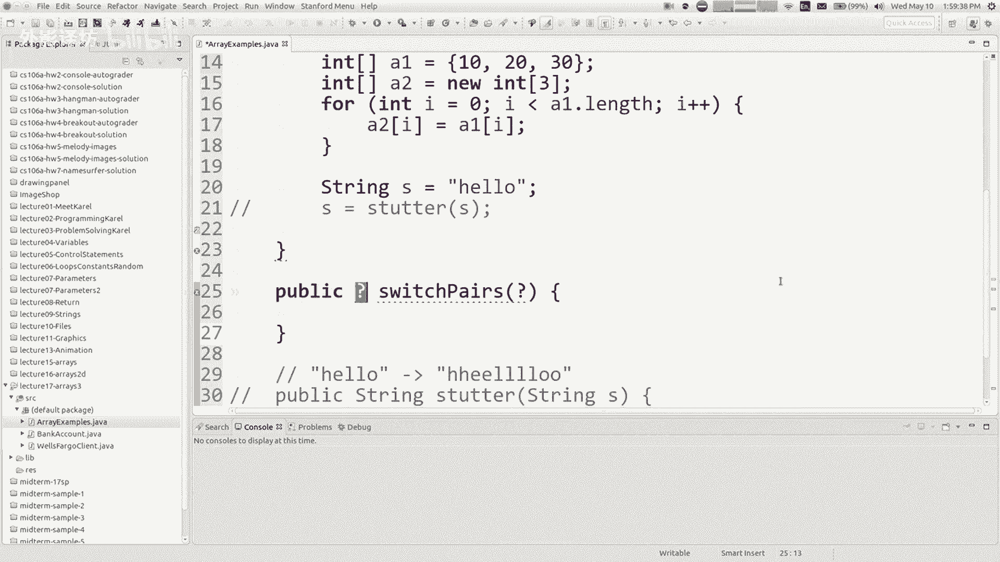

我在考试时所做的就是写，像这样的问题，你知道吗，主要是英语，你需要写代码，显然可以解决这个问题，其中虽小，但重要的一部分是正确书写标题，但采取正确的参数，并返回正确的类型和所有类似的东西。

开关对的参数类型是什么，和字符串数组字符串括号括号。

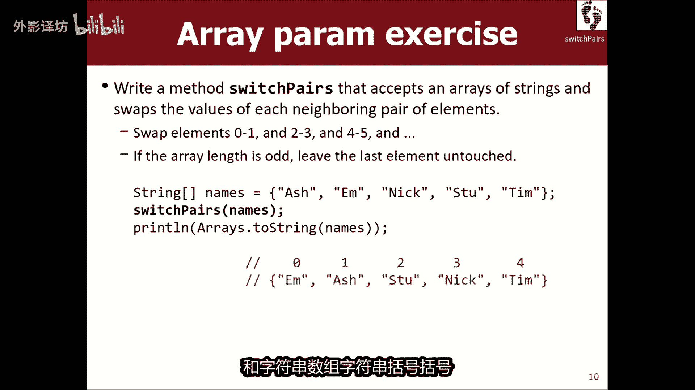

右线括号括号M1，顺便说一句，如果你正在做测试，您的评分与风格不同，测试你知道，这样你就可以这样称呼他所有人的名字，不管怎样，但如果参加你的测试，就像你一样称呼他知道黑或黑。

所以花更少的时间写下你们要做的作业，测试中变量输入错误的点，是叫它简短的还是叫它，你知道单词或简短的东西好吗，它有一个数组顺序很多。

tired的switch的返回类型是什么，对，你认为返回类型是什么，这是男孩好吧，为什么博伊德，我认为你是是的，为什么会这样，是的是的是的嗯，因为你的参考语义说，我们正在修改数组传递给我们。

以及我们的方法的方式发出，其结果是该数组修改已经可见，由于引用语义，所以我们不必返回任何东西，如果你想的好，我需要返回一个字符串，括号括号或任何，我不知道如果有的话会怎样，没有我需要做的参考。

但我不知道，所以这是一个空白，如果我想让你这样做的话，方法也只是提示返回一些东西，我会用这个词返回问题陈述中，我我没有在这里这么做，我只是我只是我想我并不是想让你抓住一个，我只是说如果我想让你这么做。

返回一些，我会说你应该的东西，如果我不说就返回等等等等，那我的意思是，这是一个，所以是的。

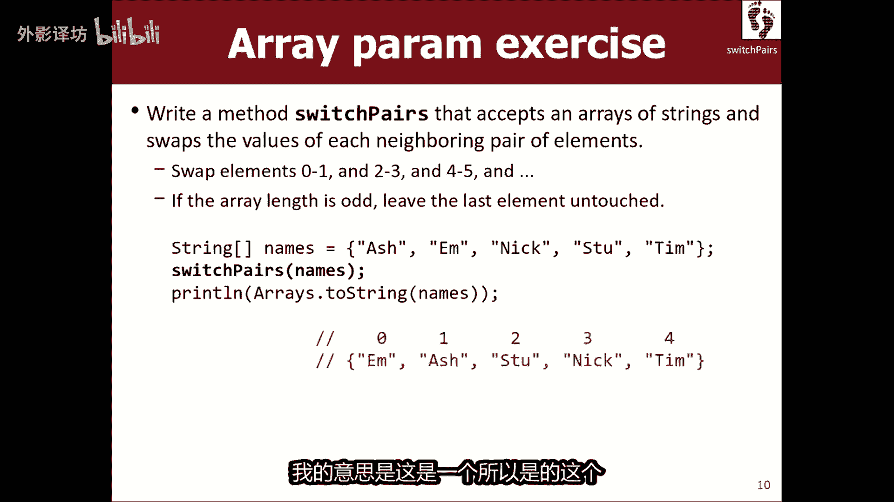

这个是一个无效的方法，我必须修改那些元素对，所以让我复制，并将此数组粘贴到此处。

我想查看结果，以相反的顺序出现，所以让我们粘贴一下，好的，帮我看看该怎么做，我交换配对，是啊好吧，好的，我想重复长度超过两个，听起来不错的时候，就像如果如果数组的长度是六。

那么我必须重复三次进行交换三遍正确，我该怎么做，你想让我从零开始吗，单次点长度超过两个，就是那种你所想象的，我的意思是，我认为你当然可以这样解决这个问题，你去哪里，我在这里，你交换这两个。

然后如果你这样做，我加加，我会在这里，我以我的方式思考，就像我在看一对，然后当我看完之后，我想转到下一个一对事物和下一对事物，事情会像这里一样，你知道吗，我的意思是外观是你的制作方式，循环做那个是的。

我可以做，我增加，I乘二，I加等于二，Obs，是的，就像这样，然后我认为不再需要除以二，我我认为有两种方法可以实现同样的事情，我可以循环一半很远，或者我可以跳两倍远，但我不需要这两件事好吗。

我在这里做什么，我基本上将元素I与哪一个交换，元素爱加一对，你知道怎么做吗，交换两件事，也许听起来像这是一个愚蠢的问题，但我的意思是，如果我写人工智能等于人工智能加一，然后我写一个I加一等于人工智能。

我是否交换了两者，事情有什么问题吗，我应该改变吗，是的，是的，我需要一个临时的，你知道吗，我有两个，我设置了其中一个到另一个，我会切换另一个，有人会失去它，然后当我移动时，另一个回来，我正要去。

必须复制到第一个货，无论如何，正确的方法是这样做，正如你所说，是为了节省某种使用经典计算机的临时副本，如果你要交换的话，科学是一个技巧，两件事，你想要三个变量或三个插槽，所以就像我写的。

我想也许我会在这里打电话，这是一个突袭邪教吧，所以我会做一个临时指，我将存储一概，然后我用人工智能plus替换人工智能一，然后我说人工智能加一等于一，是我之前搁置的东西，很棒好的，我们试试吧。

哎呀她崩溃了，我认为我们很漂亮，关闭，但我们有一个小错误，他说数组越界异常，索引五，该数组有0~4个索引，碰巧交换了34号线，我们只是有一个小错误，这里有索引和东西，再见，是的。

他说这是因为蒂姆之后没有人，所以没有TM指数加一，所以我尝试打到那边，是X加四中的一将出红右界，所以这通常意味着我需要修改我的循环边界，停止一点，我能尽快解决的最小问题是什么，为了实现这一点，建议是。

是的，竭尽全力，基本上我想要的最后一个索引是两个Z，然后接下来的一个就是长度减一，并且仍在范围内边界式的，我认为这会实现，我想要什么，喜欢享受跑步，嘿，怎么了，我想我必须停下卡车。

伙计认为这样可以解决问题，让我们检查一下，所以现在他太小了，但是他们是那时司徒和尼克，然后蒂姆，当然如果你真的想要的话，测试一下，你可能想尝试一下，就像你知道的那样，有不同的长度，把我扔进去。

马蒂然后运行它，再次确保它对两者都有效，奇怪的长度看起来我们很好好吧，所以我的意思是，那不是我只是遇到了某种致命的疯狂问题，想指出参考羽翼，让我们把它写成博伊德回归的风格，他将修改速率变化中的数组。

将在run方法中看到，我们开始了一个很酷的想法，对此有任何其他问题，代码或关于参考语义，就像我想做一个新的一样，交换名字的版本，但我想保留旧的，我想保留的，他们都有几种方法可以做，就像我最想的那样。

实现这一目标的简单方法会说好吧，我要去将括号名称，字符串等于一个新的字符串数组，其中包含与名称长度相同，然后每个名称或名称的元素我也会设置，我的名字等于名字，所以我现在有，那时我做了一份完整的副本。

所以如果我也交换名字对，然后我打印名字一和名字二，在这里我会看到姓名更改一由改变了，但如果我这样做，而不是那样，如果我嗯字符串数组名称二等于名称，整体指的是同一个，如果我这样做的话。

我们讨论过的数组是情，我收到他们都有改变了，因为他们是同一个数组，如果你分配一个数组等于另一个数组数组，它可以链接引用，现在是我在这里写的一段代码，从技术上讲并不是获得的唯一方法。

数组的副本实际上有一个称为和的突起点。

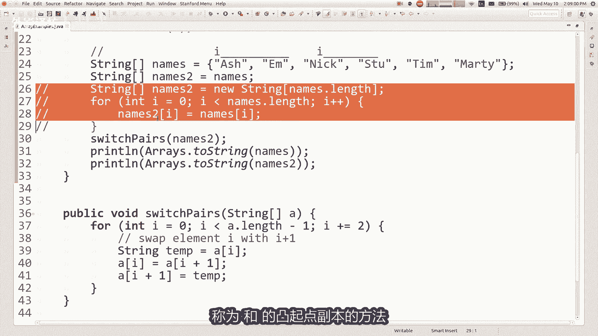

副本的方法，你可以传递一个数组。

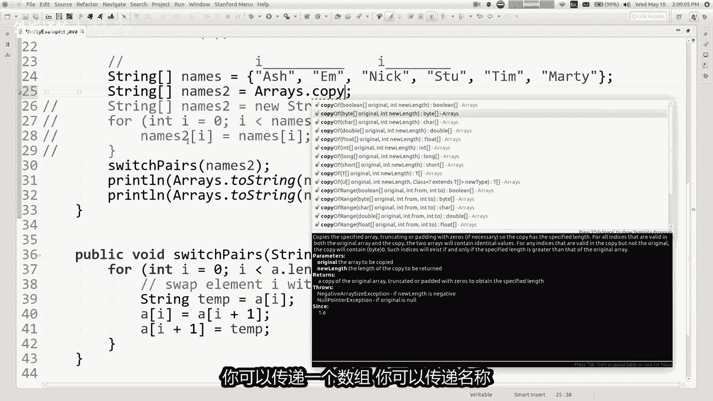

你可以传递名称，你想要的长度，你可以说命名点长度，这实际上会制作一个数组的副本，并将其返回到你，所以那其实也很好，我只是想写for循环应用程序，因为数组的点副本实际上是如果可以的话，在里面for循环。

看看它的源代码，他在做什么，是的，但没有要复制的数组，你得到了链接，而不是好问题，还有其他问题吗，法哥明天我不会考验你，关于引用语义，我可能会问你一些关于种族的事情，但不会需要我理解的东西。

以这种方式参考，但我仍然认为更多的练习比赛很好，正确的，事实上我有几张幻灯片是关于对象，但我想我想做的事，我想把剩下的时间都花在我们身上，还剩大约10分钟，我想要把剩下的钱花在比赛上。

因为这可能就是肌肉记忆。

这对我们帮助最大，所以我想谈论对某事的另一个想法，有趣的是，你可以用数组来做，如果你想知道什么最常出现的数字，在一个数字中让我清楚我是什么，问我是否说最常见的是什么，您在号码A30403中看到的数字。

你们三个和378，应该看看所有这些并顺利进行，出现次数最多的数字是数字三，数字值出现大多数行业，那么你怎么办，是的，这张幻灯片说的是数组练习，就像等一下没有数组，你在这里谈论的是马蒂搞砸了。

向上滑动太酷了，但是当然我从不犯任何错误，所以那不可能是错的，我一定有要做的事情，整合的很好，在我们考虑我的成绩之前，让我们来谈谈数字吧，因为这个问题似乎与此有关，数字正确感觉就像什么。

我要做的就是回答这个数字是什么问题，价值是最常见的感觉，我需要能够检查这个int的各个数字和外观，在右边我需要得到三个，然后是四，然后是零和，一次看一个数字如何，你把int的数字分开吗。

我们之前谈过这个，你可以吗，马蒂不会提出无法解决的问题，就在幻灯片之前测试，我会被看到打破它叫他打开另一个哦，这是一个有趣的想法，所以，而不是3403中的make it，进入引号。

三四中的字符串三个随便，然后我就可以看超过每个索引的护理应用程序，字符串对了，我有消息了，就像一个方程，它完全是很好的解决方案，但恩我想要我想做以不同的方式，因为有一个非常合理的方式来做到这一点。

不涉及字符串，从技术上讲，使用字符串速度更慢且更多，这是一个聪明的主意，但他是也是一种黑客，我认为有一个这样做的方法，不涉及将数字与其他数字进行转换，我们不需要转换的数据类型，但我真的很喜欢这样的想法。

将是解决问题的好方法，一般来说，如果我们不能使用字符串作为马蒂，所以我们的意思是还有其他吗，我们可以用这样的方式提取数字，你是的，我可以把里面的湿除掉，会给我一个数字，给我最后一个数字，好的怎么样。

其余的部分继续除以十，并取模十，我要把数字从数字的右端，我想什么，把很多人扔在这里，伟大想法记忆让很多人困惑，他们想如何得到第一个数字，我能得到那个三，我该如何得到那个四，如何得到，我得到那个零。

他们在想吗，就像指数和吉祥物炮一样，不管怎样获得最后一个更容易提示的数字，这样更容易。

这是一种逆向思维，如果你想要一个数字，你可以确实喜欢这个公众介入最频繁数字，你给我一个int和，我会告诉你什么是最常见的，这是英特尔给我的数字，指数字3453313，说类似的话好吧。

他应该给我一个后三名，所以如果你想从这个人身上获取数字，你能做的就是，你可以说INA最后一位数字等于n log时，所以在我的上面的例子是八个，是的，我也可以用其他数字做，等于并除以十。

在我的上面的例子就是全部了，除了八个权利，我想什么，你说的是，如果我继续这样做，我会翻牌出七其他数字，然后我输入三个，我把其中的一个摘下来，我会慢慢拉这个除位数字的排列，你的字符串这个想法也很酷。

但我认为这个我可以保留植入物并发挥作用，印度你知道，所以如果我愿意的话，做这个让我们重复做那个吧，我应该这样做，一个循环正确，我应该什么样的循环，我需要切多少次数字，直到我完成，我怎么说，在我的工作中。

我们做了一个for循环，while里是做什么的，你认为是的，先生使用狂野好吧，为什么，我认为这是正确的，你为什么要使用一个是的，我，就像你说的while循环式继续前进，直到完成。

你并不总是确定你什么时候会完成或继续，直到你完成完成或循环，就好像我知道我要走了，执行此操作五次或十次，或不管有时是违反直觉的，因为你说的好，我想我知道怎么做，有很多数字只需数一下即可，或者有一些东西。

但我没有账户数字，我想我可以使用你的吊索寻找的长度字符串，但我很粗鲁，我禁止了它，是的，所以我不知道我有多少位数字必须完成，直到号码已完成，我认为这很棒，使用while循环，这是我的方法说出它。

而不是说其他数字等于n mode时，我想我只想说N等于n mode时，只是缩小N以及如何，很多时候我必须继续这样做，直到什么都没有，剩下我做对了，所以我想这样做跌倒，而我什么时候可以停止做。

当马蒂让我走时，叮当作响，现在的代码是的，VN大于，或等于十是的，我认为实际上差了一个，这非常接近我的意思是，基本上一旦我吃掉了所有的数字，我已经吃掉了，我将要成为的所有数字，到一个像N1样。

像你的地方知道34，然后我砍掉了四个作为最后一位数字，然后三将是嗯剩下的一切，但我仍然需要处理者三个权利，这样你的循环就会如果我这样做的话，停下来有点太早了，如果N仅为三，则再循环一次。

我要了三个mountain，三是多少mod，十是三，3÷2等于多少，在int土地，在java疯狂土地为零，是的，所以我想那就是我想要的时候，当N为零时停止，我想你离它很近。

就像我需要那样也处理最后一位数字，所以我想你想要的是N大于零可以，但现在我还没有完成，因为我把这些数字从现在的内容中拉出来，我应该用这些数字来做，看来现在我可以数它们了，只是为了确保我没有疯干。

我打印LAN，最后一位数字是加上最后一位数字好吧，然后在这里我就返回那里，我必须返回一些东西，所以他们编译它们还没有完成，所以现在让我们尽最大努力，int的频繁数字等于打印零返回，再加上怪胎。

它会返回零，但那就是好吧，让我们看看最后说的会发生什么，数字是87，你看到我如何弯曲了吗，这些数字的倒序排列那里，所以那部分工作的很好，但是现在我实际上应该做什么，有了这些数字，我应该数一数。

我应该能弄清楚零和E出现了多少次，确实如此，我应该这样做吗，记得我说过。

这是一个数组问题是这里有一个很酷的技巧，boos创建一个长度为十零的数组到九，并且目标不是存储，每个数字是元素零中的第一个数字，元素一中的第二个数字，不是这十个索引存储的点计数器，第零个索引如何存储。

正如你所看到的索引一一样，有很多零商店里有多少个我见过的，一直到九你就会明白这些事，聚合计数器不存储数字并存储技术，我见过的数字，所以如果我拔的话，输出数字八，我要去增加柜台索引八，明白了。

那我该怎么办。

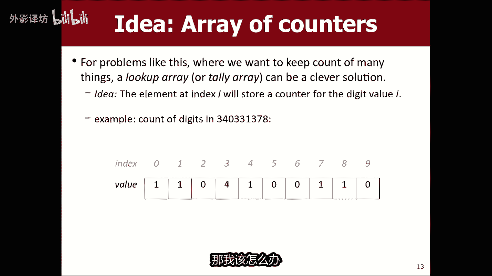

那我回到这里，我创建了一个名为I的数组，不知道计数器或其他东西长度为十的心邻十位，正好十，因为有十位数字，我们使用的数学价值观是什么，我当我拉着每一个东西时，我要在这里做数字很好。

他们的计数期率从全零开始即是的，因为我最初有还没看到数字，我该怎么办，在这里我要存储到这个计数器数组，我要做一些事情，在这里我要做什么，意味着思考它的方式。

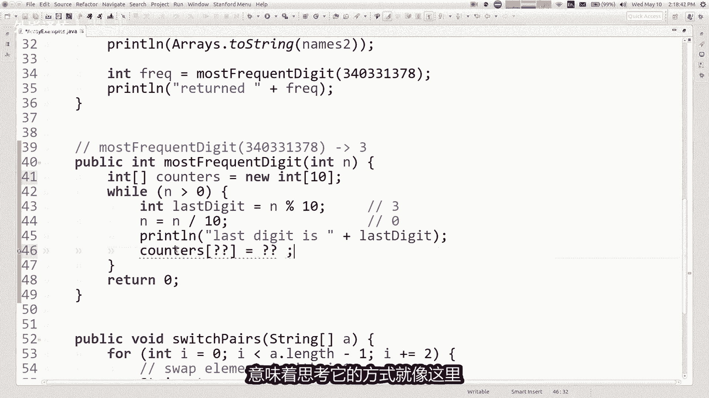

就像这里在，所以五处我有零弹，如果有五这里我去O取索引五，如果我看到的话，将其从零更改为一，另外五个到这里索引更改一两个，你的立场，就像我看到的任何数字都会增加该技术。

那我该怎么说呢，我该转到什么索引，到最后一位数字，我刚刚抓住了，我该怎么办，有了那个计数器，我把它加了一，我加上加上，他只是为了看看我是否在工作，At all print line。

计数器等于plus数组点两个计数器字符串，并且他会说什么，他会说计数器等于一一百零四，现在看起来怎么样对吧，我有一个零吗，我有一个吗，一个我没有两个，我有四个吗，我做了三件事。

我数出了所有的这些仪表的出现，所以现在我想我会说的最后一部分，因为我不想跑错是怎么回事，我能找出哪个是最多的吗，此代码中的常见数字就在这里，我现在有了这一系列计数器，将是最后一个缺失的部分，松手。

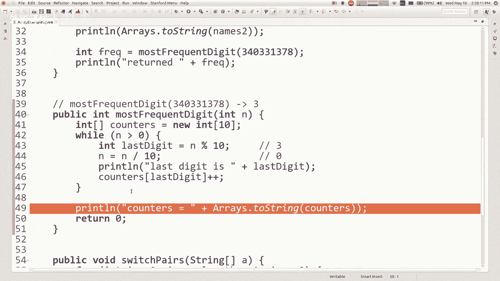

这是对这个数组的正确循环，找到数组中的最大值，无论返回该索引的值，这就是我需要从中返回的代码，好吧，我要停止，祝你好运，通过你的学习。

