# 【中文配音】斯坦福王牌课程 CS 106a Java教程 2017年春季课程 - P18：18_ More Classes; Inheritance - 外影译坊 - BV14U4geNEEq

好吧，昨晚我们当然有我们的测试，我知道压力很大，情感事件，而你们仍然从平板电脑中恢复，大约12小时前或者我喜欢的任何时间，你们中的一些人仍在参加，今天在这里，尽管已经伸展运动并参加考试，最近在测试方面。

我们是，周六去参加疯狂的考试，是啊呜呼，你疯了，我想要他现在拥有的东西，喜欢评分，我想恩，我们会在星期六创建测试，因为一切都在神奇的电脑上，最后你就会知道你的考试成绩，周六晚上也是如此。

稍后我会收集一些统计数据数据，以便您了解自己的情况，到目前为止，整个班级的成绩都达到了作为数字的绝对排序，并且与其他学生的关系，现在正在上课，所以只是为了让你了解自己是如何做到的。

你可能应该写信反对这一点，后面的信息也许会来下周一或周二左右星期，所以我们会尽快推出，与此同时，我们将继续班加，你知道你已经有了新的我们需要学习的材料，并且我们已经有作业五，让我们做下周中旬。

所以无论如何，我要打开我的心幻灯片。

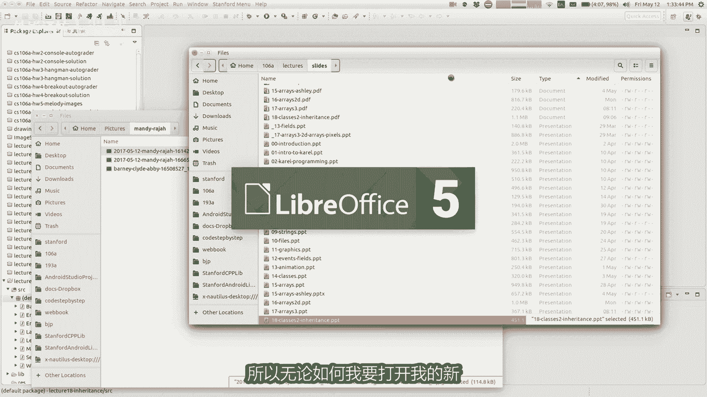

第一天我想聊什么，你今天要回到一个讲座，尼克上周三给出了我的本质在哪里，谈论类和对象，我想重温一下这个话题，这两个话题都很重要，内核一般编程，因为那是大约一周前或更多，你可能不得不对此生疏。

或者你知道这是一个很难的话题，一般来说理解，所以我只是好奇，你知道吗，你还记得为什么吗，我想创建一个新类吗，java程序中的对象就下学习该主题的意义，目的是什么，尼克，对不起，我只是认为你没有。

基本上他们没有学到，从你的选举权中，我可以得到任何东西，告诉过你，有人应该在家里勇敢，是的，该类就像一个我可以重用的模板，如果我要的话，就会一遍又一遍的使多个不同应用程序，或多种不同用途。

该代码或类似的东西似的，我认为这是一个好的开始，我认为尼克可能说了类似的话，你知道当我们谈论课程时，反对要制定的大目标，我们的软件更加模块化，可分解，这样我们就可以真正编写大程序，以更好的方式进行。

仍然会很优雅，更容易编码，更容易维护，更容易避免错误，以及大型软件系统用java写的，有很多很多这些类和对象正在对话，互相解决问题，我们称之为面向对象系统，可能会说好的面向对象什么除了什么之外。

还有什么对象是什么，其他类型的导向，你知道吗，没有选择，我的意思是，我认为另一个要么它更像是您知道的程序风格，一个你读了很多书的面向方法的系统，相互调用的方法，但我思考随着系统变得越来越大。

你开始变得越来越大，相似方法的集合彼此之间相互关联，然后你将这些集合分组方法和数据放入类中，然后班级正在与其他班级交谈，所以你有点像更多更高层次的组织架构，你正在编写的程序帮助我们做到这一点并不大。

所以那就是这就是为什么我们要了解坦尼克，可能还谈到了如何添加一个系统内，还引入了一个新的数据类型，新变量类型new类型，如果可以在代码中声明，这是另一个有趣的想法，不管怎样，我们要进一步讨论，就是这样。

另一件事是我要教你相关的主题，开始教你称为继承的相关主题，涉及创建多个类，彼此之间有些关联，彼此相似，我们稍后会回到稍后好的，你提到的类和对象，这是我喜欢使用的这个单词模板，这个词也是如此。

有时我谈论一个类，就像一个蓝图，有时我会像这样谈论它，这是一家可以生产，你知道我用过这个的材料，类比可能是尼克的幻灯片以及课程，可能是就像如何建造的蓝图。

IPOD或其他东西或IPHONE是它有关如何制作IPHONE的说明，这些说明表明了他如何应该看起来，它表明了不同，您可以按下的按钮表示，当你按他指示的那些按钮，关于数据类型的一些事情。

该设备可以存储这么多排序，可以存储歌曲的千兆字节，存储联系信息，那些IPHONE的规格以及他能做什么，这就是class是A类型的描述，现在的事情是班级之间的区别，类的对象是描述当前内容的蓝图。

加是一个物体，是你的标志，IPHONE或您的IPHONE，这些个人您按照以下方式构建的项目，蓝图是一些学生的物体，难以理解差异，该类是一个对象，是什么，同样的事情就想说那有什么区别。

学生你认识马蒂或尼克，知道nick是一个对象，而student是班级或类似的东西吧，这是一个类别，类别与一个成员，无论如何，这个类别还可以，如果你要写一门课，请记住在java中，它看起来有点像这样。

尼克可能写了一些这样的代码，和你们或者一些漂亮的事情，类似于你说的公共课银行账户，现在我们正在编写一个程序管理，人们向银行技术，假设有三个主要元素进入班级内部，他指示如果我们记得的话。

请备份一下什么对象才是真正的对象，是一些数据的组合，以及一些行为和行为与日子互动，做工作和你现有的方式，代码行为中的那些数据，你是用这些来声明数据的吗，你所说的变量和字段私有，然后是类型。

然后是我们已经看到字段的名称，我们的一些图形程序，但我认为上下文有点与此不同，坦率的说，我会将你学习的这些部分分开，从技术上来说，暂时这些都是领域，但我认为这个是一种不同的思维方式，关于今天的事情。

所以请记住类似一个模板，所以我正在写什么，在其文件中的这段代码中，这可能是银行账户口java，我在做什么，这是我正在描述的模板，什么是银行账户，以及它有什么作用，这样做，当我说的时候。

我真的是在说私有字符串名称，我没有声明名为name的字符串变量，实际上并非如此，我真正在做的是，我在说其中的每个银行账户对象，应该有一个名为name的变量，所以如果我创建了100个账户对象。

由百平称为名一，在这100个物体的每一个里面，这又是一个模板，我的对象使用它创建遵循该模板，我创建了内部的数据，使用这些字段的对象，我也可以使用指定对象的行为方法，所以这就是方法就在那里说提款。

你可以提款，从银行账户，我认为对学生来说最具挑战性的概念，当他们开始学习课程时，对象就是我所说的对象，上下文概念或影视参数概念及其含义，是您编写的这些方法的代码，在代码被复制的类中。

融入到你制作的每一个物体中，从那个类中运行一个代码，将其排在该对象的内部或之上，并且在那个物体和我的背景下，认为这是一件令人困惑的事情，理解，但这很重要，明白这一点，所以我想谈谈。

如果您更详细的了解一下，如果你赚了两笔钱就会流泪，你说我想要一个银行账户，成为111TOMORI，我有一美元，因为我帕洛阿尔托八个月的租金，所以我有一个剩下美元，所以你需要什么，明白就是记住银行账户。

已声明了陌生人的私人姓名，私人双重平衡，那些每次创建新银行时都会发生变量账户，您将获得这两个账户的新副本，您获得名称流的变量，你会得到双倍的平衡，好吧，我把它们画成一个小核四之类的东西。

如果我说BA一点提取50sent的对象为A1，他有马蒂银行账户的副本，他体内的提款代码如此，当我执行提款代码时，提款码说你知道减法余额这么多意味着什么，从该账户中减去那么多，关于该账户的副本变量。

使MARI的余额减少，如果我有另一个变量50每分，作为一个十人及maroon homi，他是我的老板，他比我有钱，它实际上可能拥有超过99美元，但我就是没有希望幻灯片上的内容太长，但是无论如何。

99美元，我提取十美元，从他的账户中提取美元，我从他那里取出时，这样他的余额从99下降到89，所以我想什么，我想说的是，当你看的时候，在此代码中，它表示金额是否，无论余额减去金额，我的意思是。

当然只是从简单的，当我说平衡时，我的立场还可以指的是那件事，所以该变量会下降你在这里通过的金额，但是如果还有更多的事情要做，当我取得平衡时，我所说的金额，您拨打的账户余额上面的方法应该这样下去，数量。

这是一个非常重要的想法，因为前面的东西真的很重要，这个人你会话这么多，撤出那么多，他们每个人都有他们自己的那些变量的副本，私有字段变量，这样的想法是理解这些对象的关键内容，所有这些东西在这里得到复制了。

复制了复制了，每次制作新作品时，都会复制你使用的银行账户蓝图，使用制造销机制造银行，您复制的账户最好，重要的是你称之为生产线，该模板的另一个副本和您称之为ea。

现在相同的代码可以分别对BA1和BA进行操作，如果您向他存款，您可以提取，他和他们有点分开，彼此都有权分开一个物体对另一个物体很重要，现在人群中认识很多人有IPHONE，它们是分开的。

如果他们是他们推出的IPHONE版本相同，具有同等国家权力的工厂，他们有相同的按钮，不管怎样，看起来内存量是一样的，但当你把它拿出来的那一刻，打开包装，闻闻新IPHONE的味道，闻到你开始定制那个吸盘。

现在他是你的了，但你不想与旁边的人交换IPHONE，你以为他们有糟糕的EDM音乐，和你的精彩游戏，如果你不想要那两个就拒绝混合的东西，所以你是重要的电话，你有权利，他们是这样的相同。

但他们实际上都是独立的，以及以同样的方式，银行账户都一样，所有人都有名字，他们都有余额，但你携带了很多你拥有的账户以及哪个账户，你说的是A1点撤回A与过于直接的超级不同，你明白，所以我的意思是。

那是一种我们应该在哪里回到尼克的演讲吧，今天更详细的回顾我还没有的其他部分，这件事被谈论的最多，中间的那个叫做构造函数，构造函数是当你说时，运行的工厂创建时的新类型，当班级创建一个IPHONE时。

该类的新对象，您可以运行就在那儿的一小段代码，当你说新这个词的那一刻，当我说银行账户时，是一个构造函数，字符串和双精度，我正在接受这些用户写入的变量，和我正在写，我将它们存储到对象的字段。

基本上如果我说我想要的话，就会发生这样的事情，一个新的银行账户MARI逗号E，将MARTI设置为名称，并设置一个是平衡，那就是基本上意味着这里有两个值在这里传入，这两个参数，它们被存储到的字段中。

在这里开设账户，就像这样，您指定对象获取的方式，当它们出生时就初始化好了，通常构造函数的样子是一些参数被传入，并且那么这些参数的值存储到的私有字段中，该对象有时你有其他代码，有时当物体诞生时。

你需要去做点别的事，需要读取一个文件，您需要制作一个数组，你需要做一些其他的事情，但是最常见的是从中获取参数，来自用户客户端并存储，他们进入私人领域，反对好吧，所以我认为有些学生真的很难理解。

什么是构造函数，它在哪里，它是什么，它会做什么吗，它在哪里运行，何时运行它运行，我认为构造函数的语法是有点奇怪，它看起来像是一个方法，但它没有返回类型，你只是说你说的公共银行账户。

这是开设新银行账户的方法，这就是新银行发生的情况，账户诞生，所以看起来有点就像一个方法，但有人忘记了关键字或类似的东西，无论如何，语法看起来就是这样，这些是A的主要组成部分，我想知道你有没有到目前为止。

关于这些事情的问题，看起来我认为这与没有有很大不同，我们在中介绍的其他内容，到目前为止，你知道这不像某种新的，偶尔循环向后或类似的东西，在某种程度上完全不同的心态，所以我可以想象，这很难。

首先明白一个问题是嗯，哦为什么我不能只说字符串名称，双重平衡。

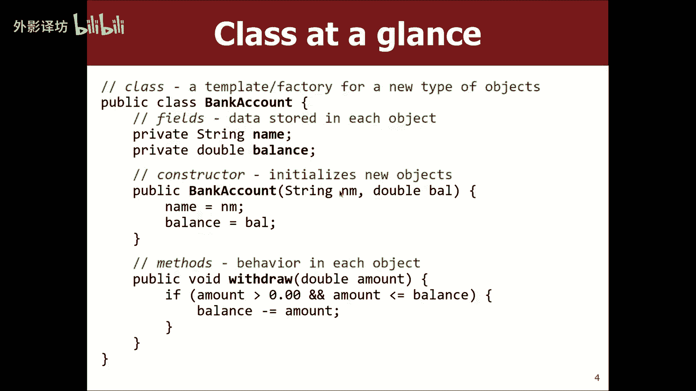

这是一个好问题，意思是我认为发生了什么事，这里有麻烦的日食，让我打开它，我很确定这是同一个文件，所以为什么我必须给这些不同的名字很好，因为基本上是客户另一个文件正在此处传递值。

然后我将这些值将它们存储在这里，但这有点就像我需要把它们放在某个地方，客户打包时的颈肩，如果我只是将它们作为参数，称之为字符串名称，然后什么会发生的话，会很混乱，对于java，你是在谈论这个吗。

变量还是你在谈论这个变量，很多看看它如何下划线很混乱，就像什么，你在这里做什么，所以你通常会给予在这里，给他们起一个临时的名字，然后那些临时版本得到存储到更永久的版本，就在这里，立即还有另一种写作风格。

我稍后会讨论，如果你确实想称呼这个名字，并且你确实这么做了，想要称这个平衡，你不能真的按照写的那样去做，因为那么会发生什么事情，却没有当你说的时候，知道你指的是哪一个，你知道的名字是指这个还是做。

你的意思是默认情况下，它假设你是说这个，但我们在这一行代码或基本上尝试说，这个fame应该被赋予类似值，事情以及你可以说的方式，也就是说你可以写这个词，这个点名称，你可以写这个点平衡。

基本上这意味着设置当前正在诞生的物体，说它的名字是经过测试的名字，当前对象正在诞生，说它的平衡是平衡，可以在此处传递此语法，你说这个点名称或这个点平衡，你可以在其他地方使用它，你的代码也在这里。

你可以说这个点余额加上金额那种，如果你愿意的话，这不是常见的事情，但你可能知道这有点隐含，就好像你知道什么时候谈论趣一些，对了说哦，我要去你那里，知道艾米丽稍后回家，所以很漂亮，明确你想去那个人的家。

但如果你要去你的地方，你只会说我要回家了，你没说我要去马地台阶，众议院领袖，你知道这样的借口，如果你不说你是谁，那就是隐含的谈论，它意味着你正在谈论关于你有这样的事情，当你学习时。

这里的概念对象和类中的代码类是隐式运行的，在该类的对象内部等等，当他在谈论那个物体时运行，所以如果你说平衡，你排序的意思是我的余额调用此方法的账户，所以你认为代码有这个身份，就像我在一个物体中。

现在我正在运行代码那个物体，所以如果我说这个点平衡，这就像说我的余额应该消失，那么这个账户余额应该会增加，这又是相当棘手的，无论如何都要理解并实践，我要把代码放回去，这是因为我认为从概念上讲。

这样更简单，但是其他方式的工作只是按照要求进行，尽管有任何其他问题，到目前为止，杂志对象式的，是的，好问题，我们就是文件的用途，当你上课的时候，你就在这里，所以你将每个类放入自己的java文件中。

这里还有另一种概念，有趣的是，你们认识你们都看过这些非常公开的课，一直经过这个时钟季度重新照顾，我们一直拥有的机器人公开课，我想我有点第一天就对你说了一个愉快的谎言，讲座中我说了类似的话。

当他说公开课时，就像我的程序名称的同义词是空白，就像如果他说你知道富国银行的公共课，就是这样，我的程序的另一种说法是打电话给富国银行，当时有点真实，你知道你伙计们这是完全合理的，简化的意思是正确的。

但如果你说课程只是一个程序，这是一个类的程序，我们稍后会讨论，但一般来说，如果你写了一类对象，比如抱歉，我不知道会发生什么，如果你写一门课，就和我的删一起，就像银行账户通知，我不说。

在此扩展控制台程序费，实际上不是一个你不能的程序，如果需要可以单独运行该类，有一个需要它的程序，就像一个小模块，就像一个部分编写一个可以使用的组件，一个程序，所以如果你有一个像这样的程序，富国银行。

这确实是一个计划，有一个run方法可以使用bank账户对象，帮助其实现他想要的行为，所以那就是这里的另一个想法，是这些银行账户之类的课程，不是他们的程序，是部分的或小部件和程序组件，正确使用so文件。

您通常会这样做，将每个类放入自己的java文件中，有学生问我如何，他知道吗，他知道要打开吗，银行账户doc java之类的怎么做文件彼此非常了解，如果他们与eclipse位于同一个项目中。

有点知道将它们彼此连接起来，这个称为java的概念被路径或他理解的任何内容，如果你把它们放在同一个目录中，他知道如何归档的同一个项目，知道如何互相交谈好吗，现在还有关于课程的其他事情吗。

我想告诉你几件事，尼克可能没有掩盖他的讲座。

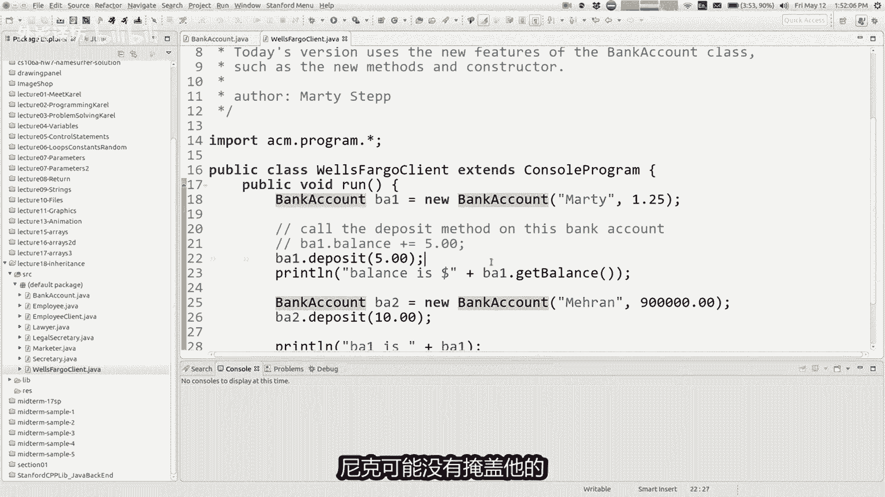

所以让我们谈谈哦，很抱歉，这些幻灯片现在是关于我提到的关键字this，如果你想在哪里引用该对象代码正在运行，你可以使用这个词，你可以用它来指代你可以使用的私有字段之一，要调用一个方法。

你可以使用它来调用构造函数，所以最常见的用法是这个词，就是我们正在谈论的关于这样，你可以你可以有你使用的方法或构造函数，与其中一名私人同名变量，然后如果你能够区分这个和这个，一个通过使用已经完成的工作。

所以我想谈谈这个方法。

如果我返回到此处，则显示设置名称代码，在这里，在银行账户中为我们知道我们有它的字段，我们有这个构造函数，我们有一个存款方式，我们有取款方式，然后尼克是你写的这些，我有获取姓名并获得平衡，你做到了吗。

在课堂上写这些好吧，这就是我想在这个客户端谈谈，这是使用银行的程序，它将管理的账户账户或类似的东西，所以好把握，为MARI创建一个账户，他有一个我又存了五块钱，想打印多少钱，马地有余额，加上这么多美元。

所以我知道那是一个银行账户对象，并且我知道该银行账户物体内部有平衡，就像这样，如果我想打印马蒂的余额，我可以打印，如果我写的话，现在是一点平衡好吧，里面有一个balance变量，该对象的。

但它不会让我打印它的价值，他用红色强调了，你知道为什么，为什么他加下划线一分钟，你看富国银行计划允许打印银行余额，他认为是的，是的，你绝对是对的，跟踪问他与这个词有关，私人在这里我们看到过这个词。

公开我们代码的某些部分，有时会在某些网站上看到四人一词，如果您点击了我们代码的一部分教科书，或他们的一些例子，方法上有私人写的，有时也有，我也有过你们中的一些人，伙计们问我什么是私人的和公众。

这些东西意味着什么，我只是挥挥手说，现在不用担心，我会稍后再说，但现在就是时候了，现在很重要，那么我想谈谈他公共和私人这些词是什么意思，意味着基本上意味着所有其他该项目中的文件，允许查看这件事或不公开。

意味着所有文件只能看到他私人，意味着这个文件可以看到它，所以如果我这么说，这些变量，这些字段是私有的，我的意思是，银行账户被允许使用检查和查看，以他们自己的名字和自己的名字，余额。

弹子项目中的其他文件不允许直接操纵余额，所以我不能过去，这里说打印是一种平衡，我也不是允许说一些诸如平衡之类的话，等于十，他也不会让我这样做，如果我想直接允许这些我能做的事情，就是我可以来这里。

我可以说这是一个公共双重平衡，现在时不再生我的气了，所以可能似乎这就是解决办法，但我没有基本上非常喜欢我所拥有的，现在我已经做到了这样认可，该项目可以修改任何其他文件，银行账户余额可以是任意数字。

他想要的那就是一点点危险，我的意思是，我猜如果你认为关于现实世界的类比，比如这些是人们的银行账户，不要只是让人们走进银行，然后给他们的行李设置一些号码，是的我希望是的，我会很酷，或者金融方面的事情。

系统崩溃了或者发生了什么，无论如何，疯狂的事情正在发生，但你却没有想让其他文件弄乱你的变量，因为你经常想要施加一些限制，像银行这里这样的变量，提款时的账户，从账户中您可以查看内容。

就像只允许证数要提取的钱，不允许我画一些东西，付五美元，是的，现在我多了五美元美元或其他也不允许的东西，一个愿意画比他们更多的人余额，不允许他们透支他们的账户，例如如果马蒂的收到一美元。

我尝试提取一提款，你知道100块吗，不会让我1000块，不会让我做对，以便那些检查，那些保证没有人可以走，他们的余额为负是不可能的，强制执行，是否可以直接设置余额到你想要的任何数字。

所以这里的这些字段是私有的，这实际上是一个很好的做法，这就是每个人都应该做的，当他们在课堂上创造场地时，他们总是应该将他们视为私有，这个理由可以避免伪造，修改数据是可以的，但是既然我已经说过了。

希望只是相信我，但现在我又回来了，这个问题我不能直视，我不想要手动操作我的平衡，我不是想这么做，我只是想要打印余额，想要查看，我应该允许询问余款吗，我的账户余额是多少，这就是这些get方法的来源。

如果我想看到，但又看不到，修改平衡，解决方案是你应该写一个方法，您的银行账户类别的名称为，诸如获得平衡之类的东西，返回余额值，有人看着你，可能会说，等一下，如果我能退还余额的话，一分钟就不行了。

与余额大致相同，如果人们能够达到平衡，则公开，那不是同一个井，所以在下面吗，这个在这个客户端程序中，而不是说点平衡，仍然是非法，我可以说点得到平衡好吧，这是该计划的合法内容，并且你会说余额是6。25个。

但这与拥有一个不同公共领域，意味只是因为我能够得到它，并不意味着我能够，如果我试图说获得平衡，请设置它等于1000个都没有感觉，这不合法，Java，你只能无设置它，就像去银行账户。

以便打印您的余额一张纸，所以这是不同的，你能够改变你的平衡，所以这是一个很常见的练习，有这些get方法返回有关对象的信息，有点像只读访问数据，还好是的，其他一切我都会去，看看你被命名为get。

对于大多数人来说，平衡是很常见的，像这样的类的字段好吧。

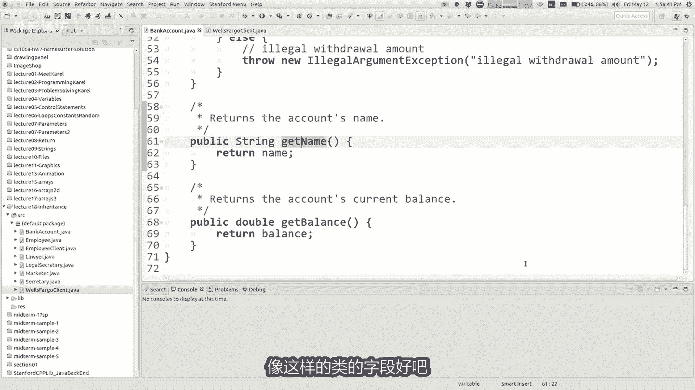

接下来我要谈的是打印出一个怎么样的想法，屏幕上的对象，以便您创建一个新的银行账户，你说打印行，并且你打印行那个银行账户什么，你会发现它打印出乱码。

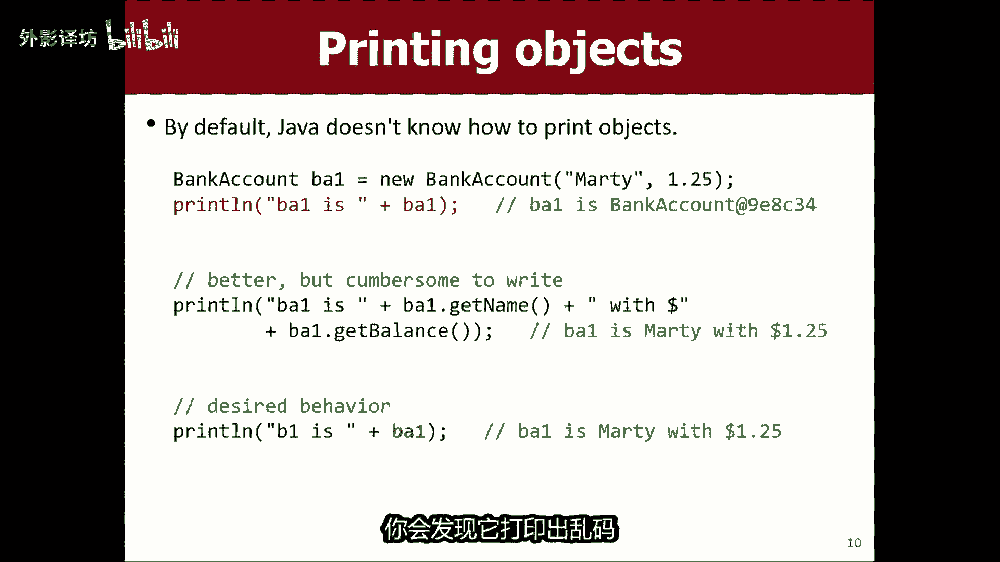

让我在屏幕上展示一下，在我们继续之前，这是真的，如果我如果我走了这个计划，对这里的气候和而不是仅仅说平衡是什么，如果我写print line是一会怎样，value的值为一，所以我，就像尝试打印烂一样。

账户还好，打印好的是什么，大部分都是垃圾，他只是打印BA一个有，银行账户价值三D一cf84，java到底是怎么回事，不知道如何打印出状态，银行账户不是不是真正了解如何做到这一点，我在这里想说的是。

java是做什么的，上面写着这是一个银行账户吗，它位于该内存地址，你的电脑有那么大的帮助，但大多没有有帮助，我希望写一份声明，就像这个会打印出账户格式很好。

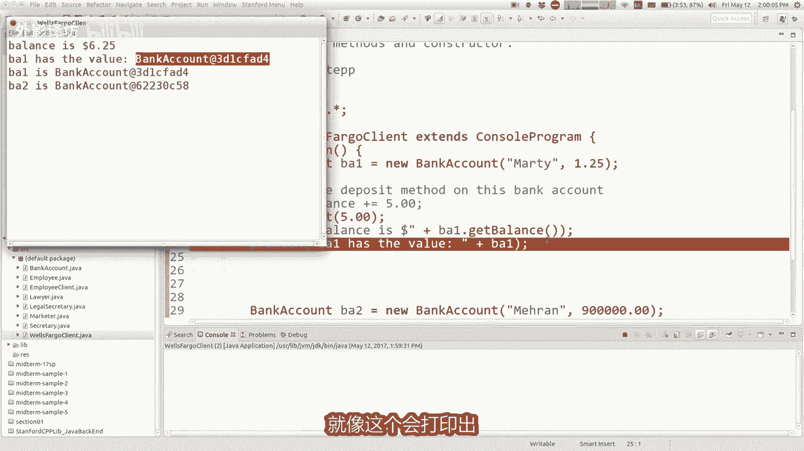

我希望他让我说类似BA1之类的话，然后他打印了一些关于账户，现在我能做的就是这样，我可以把它撬出更长的线，像中间的代码，我可以说好，账号就是加上名字，再加上我有这么多美元，加上平衡，看起来不错很棒。

但现在每次我想要的时候要打印账户，我必须完成所有操作，那有点乏味对吧，有一种类似物体的概念很容易打印，我需要怎样做，当我编写时，在这里创建我的对象，新课程的答案是。

有一个java中命名为字符串的特殊方法，这意味着将其对象状态转换为，我喜欢打印某种弹簧，TOSTRING方法的标题是，你必须这样写公共字符串到字符串，但你没有说print line在那里。

你只需写返回一个字符串的代码，想要打印，所以如果它是你以某种方式退还的银行账户，关于名称和余额的字符串。

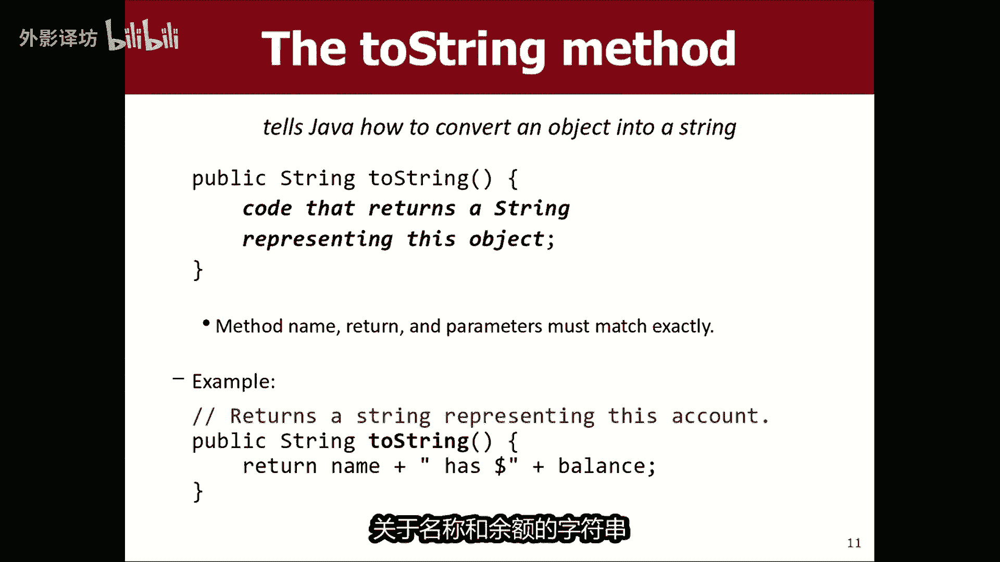

你决定什么是正确的格式，字符串应该是你去上课，这会存入银行账户，java在下面的某个地方，你写了一个方法，公共字符串到字符串，并记住我们的两个私有字段是名称和余额，这样你就可以打印你知道的东西。

可以返回类似你知道的东西，名称等于加上名称，加上逗号，余额等于美元，符号加余额，我不知道类似的事情，现在好吧，当我回到客户那里，我尝试打印BA1，他说ba one具有知名称等于MARI，余额等于625。

所以他是当你打印出来的时候，有点有趣，一个对象，他会检查你的班级，是否有一个两个字符串的方法，如果你这样做，将调用该方法并打印，实际上在屏幕上写了一个print plus b a1。

与调用plus b a1。2字符串，例如基本上你正在打印，结果你没有那个方法写出单词，以流式传输，java只是隐含的假设，如果你不要保存，我认为这很重要，很多时候当你写一个新的，你希望课程变得简单。

打印该类只是为了看看是什么对象的状态，是偶尔用于调试或者类似的东西，你可以弥补，无论你想要什么格式，我都可以像这样写了这个格式，但是我可以返回类似括号的东西，我账户中的括号是姓名，逗号I有这么多钱。

就等于我不知道你有什么权利，现在你可以退回任何你想要的东西，当你运行该程序时，它会显示所有我的账户，正在标记的东西就这么多，所以你可以去闲人好吧，学生有时会得到一个他们认为有点混乱。

只是字符串应该打印东西，所以他们试图说你知道print line在这里你是对的，字符串经常被使用，用于在控制台上打印一些内容，但to string不应该说打印立到它应该的字符串，返回一个字符串。

这样做的原因是因为正在使用的代码，这可能想要打印该字符串活，他可能想将该字符串绘制为G图形，窗口上的标签，或者他可能将要将该字符串发送到网络，到另一台我不知道的计算机，就是他们想用该字符串做什么。

所以这个方法意味着更多用途广泛，您可以打印它，或者您可以用它来做其他事情，这样你返回你不在这里打印，限制什么，你经常做的是打印行，在这里你的打印行文件并打电话给学校，好吧。

这就像java中的一个特殊方法，所以我想我已经准备好谈论继承。

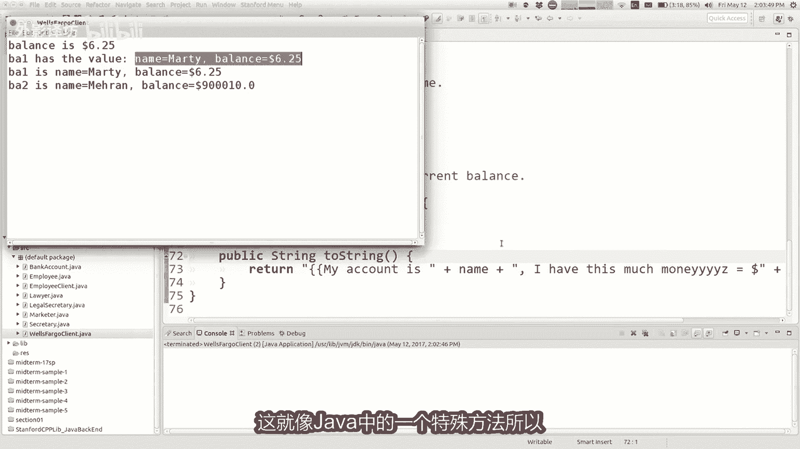

现在继承是排序，你所拥有的下一个级别系统中有几个不同的类，也许你写了一个更大的程序，你开始发现其中一些类彼此相似，并且你想在你的代码中表示它不知何故，继承就是一个类，基于另一个类，我们讨论过。

有点像父母孩子关系，我是这个的孩子，其他课程我基于该课程，并且这对于java来说意味着什么，这孩子获得所有的权利，并且来自父母的行为，然后可以在此之上添加更多内容。

实际上你一直在隐士的使用继承在整个课程中，因为不同类型程序的想法，我们一直在写，有一个我们图书馆计划中的课程，以及所有不同类型的程序，是孩子们有一个图形控制台中的程序中的程序，卡罗尔计划。

他们都在使用继承到某种组合行为，这是我们使用的育儿计划，这些术语超类和子类，我们谭超的父母类型和子类别的子类别，如果你想做继承，也可以查看中的图形对象，当你的时候，我们写的程序。

取得G级别或G非常或类似的东西，就像所有这些都是一个的孩子，名为G对象的公共副对象，是有点像一个通用术语，可以是这些不同的事物中的任何一个，并且在代码中查找的方式。

那些不同的对象是G对象内包含所有每种形状，都有共同的行为，能够获取X和Y值或宽度和高度的能力，得到它设置颜色等能力，它可见或不可见，已移动它在屏幕上，你应该能够对每一种人都做这些事情。

形状以便代码进入基因对象内，然后是所有具体的功能，个别类型的形状如线条有端点，但矩形没有关于端点设置的代码放入线路类，所以是这样的，一般事物称为事物的概念继承系统的超类核。

具体的东西进入一个子类继承系统，通常是经常感觉像就像你知道我们谈论的那样，分类关于动物，我们会被爱所温暖，这些事情，或者你有降车辆和下面的车辆，已有汽车，自行车和车下。

我们有丰田卡罗拉和福特野马和一种紫猫，go worry的或特定类别，更一般的经常输入那些东西，变成某种继承数程序，这里是使用的语法，遗产剧透警告你已经使用这个语法，但我没有告诉你。

当你写extends时，它意味着什么，这意味着你的班级是基于或该类的子类，你就在extend so for这个词之后，例如如果我想要我的银行计划怎么办，允许用户拥有支票账户和听起来像储蓄账户。

这些都是不同类型的银行账户，也许如果我写了代码，支票账户类别看起来与银行账户类别非常相似，但也许会有一点，任何支票账户均需额外付费，可以这样做，你可能会说检查账户是一般账户的子类别，银行账户。

所以我可以这样写，我想说它扩展了银行账户嗯，在java中，当你说时会发生什么，扩展是它的字面意思是该超类的内容，并给出他们所有的力量都给你，所以无论如何方法都在该超类中私有字段，在该超位中。

现在更多的班级拥有所有这些东西，也无需重写他们，或者读一下闪电泡芙。

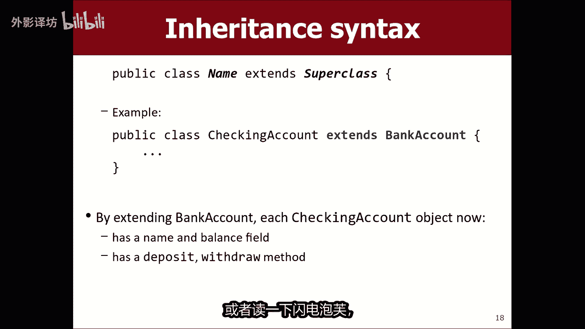

他实际上很漂亮强大，这就是我们的图书馆正在使用的机制，如果你去我们的图书馆看看源代码，你看到这个控制台程序类具有类似print的方法，借出物品，并设定标题和名称尺寸，以及所有这些东西。

有方法将自己显示为屏幕上的窗口，所以我们不希望你不必担心以下任何一个，那东西，所以我们把那个控制台，当您将课程编入我们的图书馆时，扩展看你的程序，现在拥有所有这些功能已经开始，并且你只写剩下的。

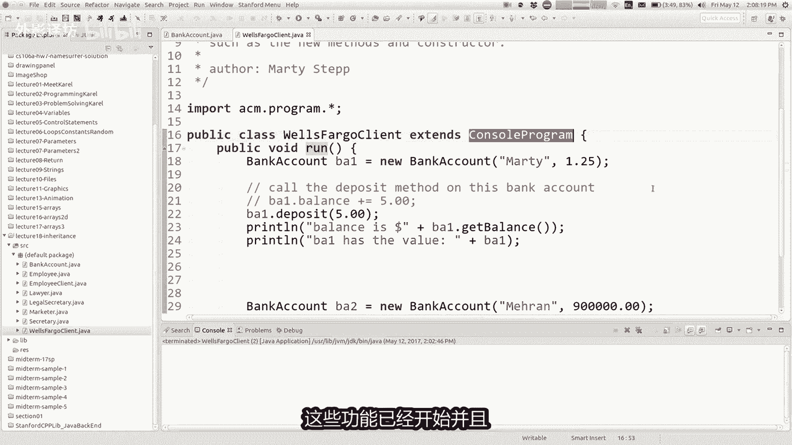

你只写运行代码的运行方法，所以我想在这里遵循一个具体的例子，更详细的了解继承，我想谈谈，如果我们正在写课程，现在陪伴合法没问题，有不同类型的员工，显然在这家律师事务所工作，会有律师在那里工作。

但也许他们有秘书在营销，人们无论如何，所以我刚刚编了一个一堆愚蠢的任意政策，公司有着很愚蠢是吗，细节确实很重要，但是这里的想法就像一般的，适用于所有人的政策，例如比方说他们每周工作40小时。

也许工资一般，这家公司的每个人都赚40K，可能不是湾区律师事务所，但不管怎样，除了一些员工在45或50K中，我们可以多赚一点，所有人都得到相似的假期，几天来一切都不同了，属性品质和政策。

你在这家律师事务所工作，你也可以了解这些不同类型的，每一个员工有不同的事情，他们可以做律师，知道如何起诉人们和营销人员，知道如何做广告水，那如果我想要代表这些不同的类型，出于某种原因使用代码的员工。

那么你可以写一个类，代表了政策的种类，挤进幻灯片的中间，也许班级会看这里，像这个员工般怎么样，你工作了好几个小时，我会回来的，第40章，你赚多少钱，我还40美元，不管怎样，这可能不是你的方式，会写这个。

但是无论如何，但是什么，如果你可以的话，那么现在你可以制作员工对象，你可以问他们可以工作多少小时，询问他们赚了多少钱，所有人都有相同的答案，你可能会说的那些问题，我把时间存储在私人领域。

为什么我拿不到的薪水，总统肯定肯定肯定也许会再做一次，我没有那样做，在这里，因为这是每个人都拥有的，与返回的工资相同，薪水得到了，但这只是一个开始好了，现在你要上课了，代表律师，你说好或抱歉。

我曾是集体代表员工，现在如果我想写一个怎么办，代表律师获得单独类别秘书或营销人员，会发现它看起来几乎一模一样，像这样带有很小的变化，所以如果我去的话。

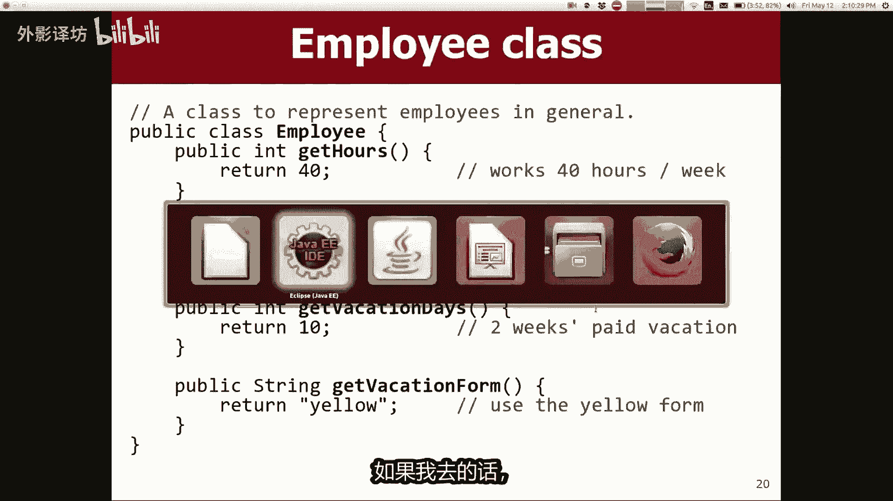

让我们探讨一下，这里有一名员工，这是幻灯片中的内容，员工类，如果我想写一个怎么办，律师课你会发现的是他。

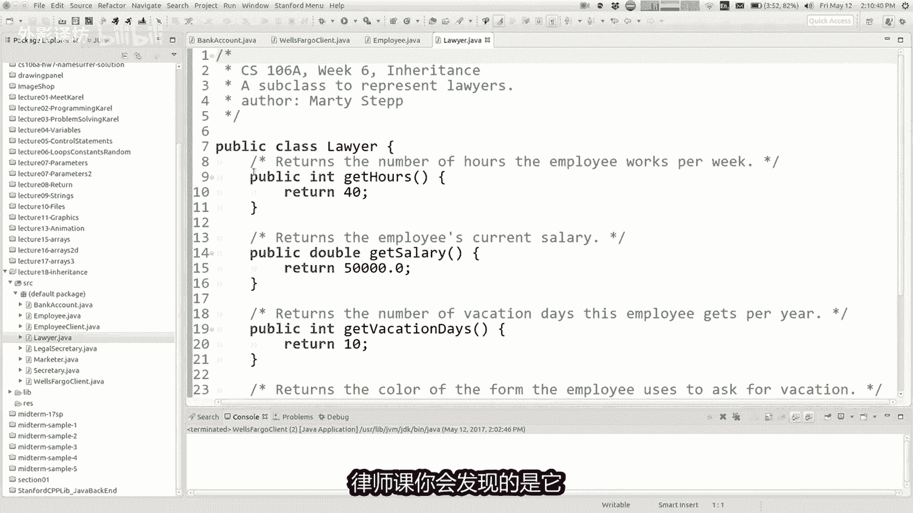

那么现在这段代码是从哪里来的，就像如果你去执行那个政策。

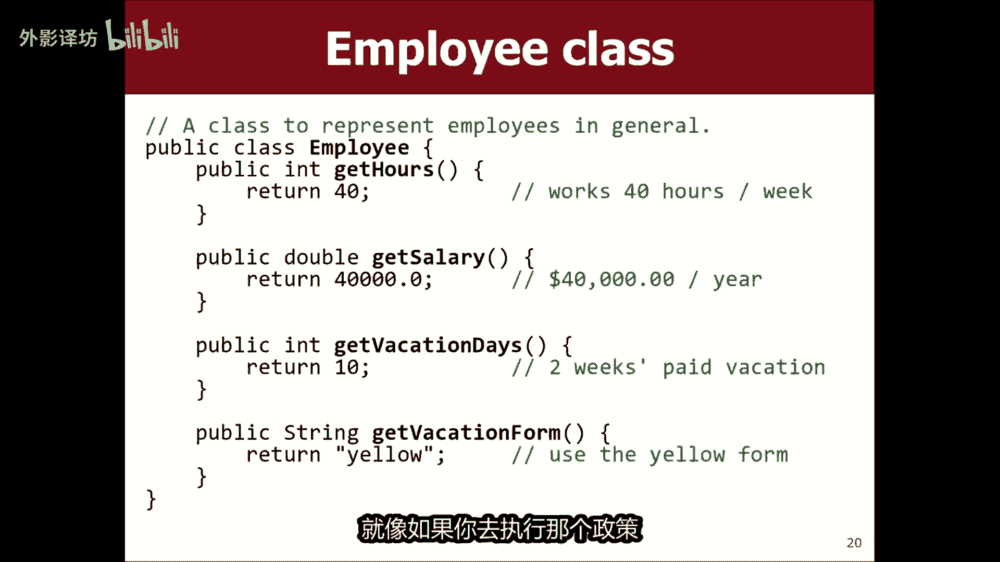

实际上让我们从秘书，让我们从秘书开始吧，让我这样做，这样我就有了员工和，如果我看的话，我现在有秘书了，仔细查看我正在标记的这两个文件，从员工到秘书，雇员给秘书和你，知道很难仔细扫描这些。

你的眼睛有两件事，但我认为你会看到他们非常彼此，非常非常相似对吧，雇员秘书，雇员秘书唯一的区别是你可能会看到在底部，秘书可以做的，还有一件事也许是另一种员工可以做，他们知道如何做的事情。

口授一封信或其他什么，可以的，天哪，这两个人真是太遗憾了，课程非常相似，有一个计算机科学家存在冗余，不喜欢冗余，所以我们修复的方式，如果你这么说的话，我们就使用继承好吧，秘书是一种雇员。

然后我就去秘书班，我在这里写了扩展员工好吧，当你说再次延长员工时，什么发生的事情基本上是java去的，员工类别和副本排序，将其所有内容粘贴到您的，你的课程对我来说意味着什么。

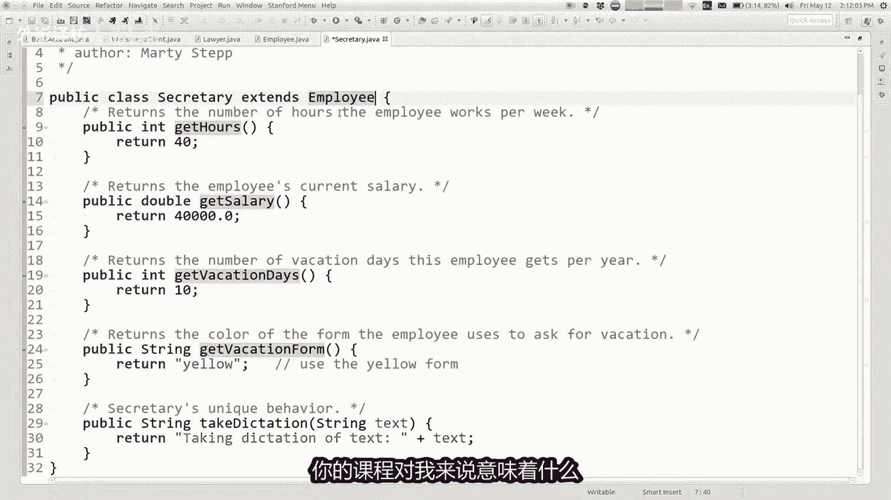

我不需要重复所有这些该文件中的前四个方法。

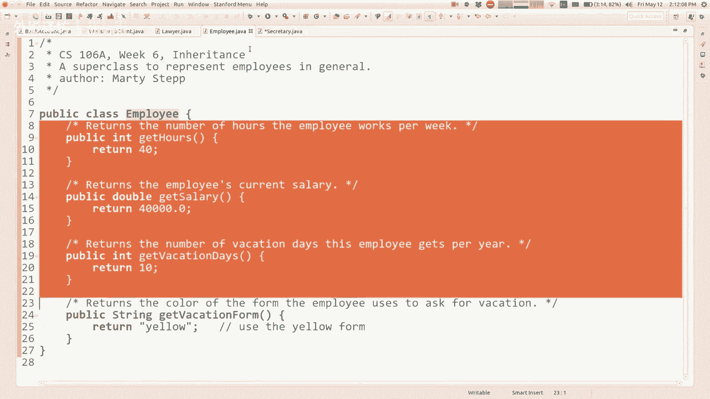

因为只要通过扩展，我就能得到那些方法。

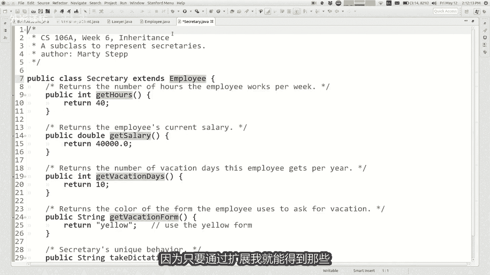

已经这样做了，这样我就可以只需删除这四个。

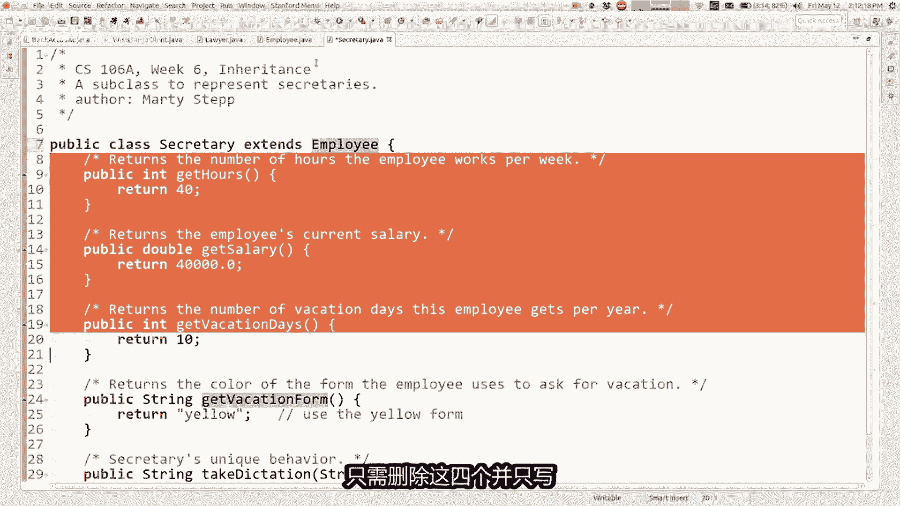

并止写独特的新独特部件秘书，所以这个班有相同的行为与我开始之前一样，继承好吧，所以当然最初的奖励是我删除了一堆重复代码，正确是的先生，你能寄两件东西吗，有趣，那如果我想成为这样的拥有银行账户的员工。

可以吗，还可以扩展银行账户或其他什么，java不允许你扩展更多，第一位父母，你必须打招吧，希望每个人都来自一个单一的父母之家，或类似的地方，我不知道还有其他语言确实允许像C加加那样，有些人认为允许。

因为如果两者都可能会令人困惑，父母也有同样的方法名称，您收到的是哪一份副本，如果你认为会变得有点复杂，关于它太多了，但是java设计师决定你只能扩展一件事，所以这就是我们必须限制自己的方式。

但你知道你能做的事，如果你如果你愿意的话，你可以有一颗更深的树，就像拥有A类一样，由B扩展，且必由C扩展，因此你可以有多个级别，如果我们想要合法的话，秘数基本相同，作为秘书，但他们可以做合法的事情。

那么也许我会在这里做的事，我会说现在我继承了秘书，所有的秘书和隐含的所有员工的行为都是如此，所以现在我除此之外，我还要给自己开账单好吧，所以这是初始模型的扩展一些东西，现在添加更多。

现在你的坦克一如既往，这类事情会有所帮助，当事情变得有趣的时候，你会更好，如果你不想复制所有内容来自尼奥复制的负极，大部分事情都结束了，但你不想我们都继承了其中的一些部分，我们希望我们父母的一些东西。

没有像我一样继承权力，我爸爸知道，这就像做完手术一样，甚至不会修复我的这个口臭，就像我8年级时那样一个非常严重的隔膜问题，他们有努力去做，所以我有一个你知道的，在我脸上缠上一点绷带。

当学校里的每个人都在说，我做了鼻子整形手术，我感觉还好，8年级，如果我完成了一整天都在龙队，我保证我没有当我接受手术时，做一个鼻子整形手术，我觉得没有人会付钱那些笔迹，但那是个大谣言。

大约在我8年级的校园里，无论如何，我已经工作了，抱歉什么，如果你想继承，但又不这样做，想要继承属于我的一切问题对了，让我们看看在哪里。

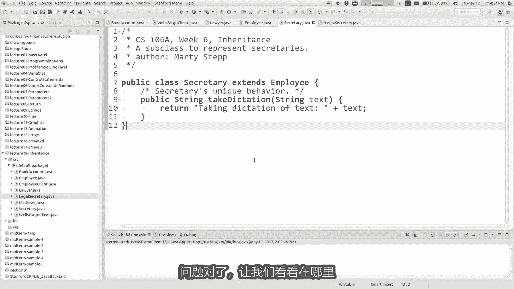

这可能会出现，所以如果你要去的话，代表律师类律师很像普通员工，但他们知道如何起诉别人好吧，但他们他们也有一些差异，律师获得更多假期的政策，他们使用不同的假期形式或其他什么都可以。

也许这意味着我不想继承该方法，给了我想要的两周假期，我自己的方法给了我三个星期的时间假期。

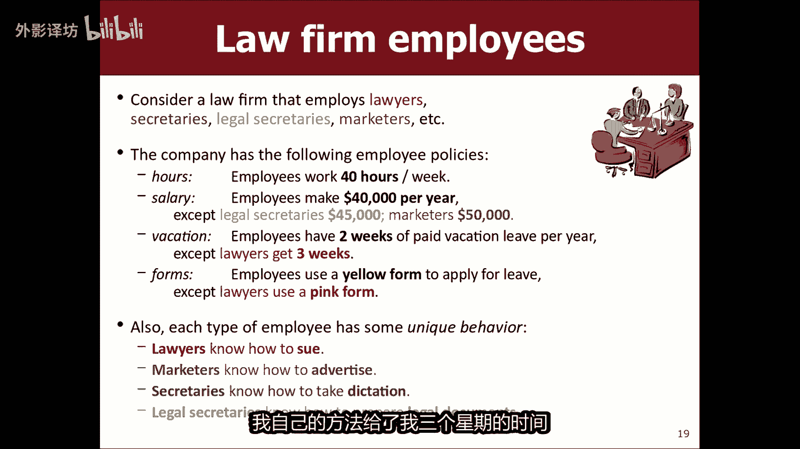

这个在java里怎么说，是的，如果你去上律师课，如果我说现在延长员工，请记住员工有两个循环，抱歉，员工必须获得以下时间返回40，律师必须得到小事返回40，所以我不需要我可以把它扔掉了，员工有休假日期。

可以得到，律师已获得黄色假期表格，假期十天我可以摆脱它或者等等，幻灯片上不是说律师说的吗，实际上有三周的假期，律师没有十天的时间。

律师用粉色的这15天了假期行事，而不是黄色和这些只是愚蠢的政策。

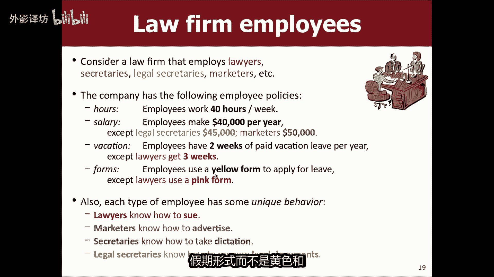

是的，但这两种方法我在这里有点不想继承这些，从员工那里你明白，因为这些都是错误的。

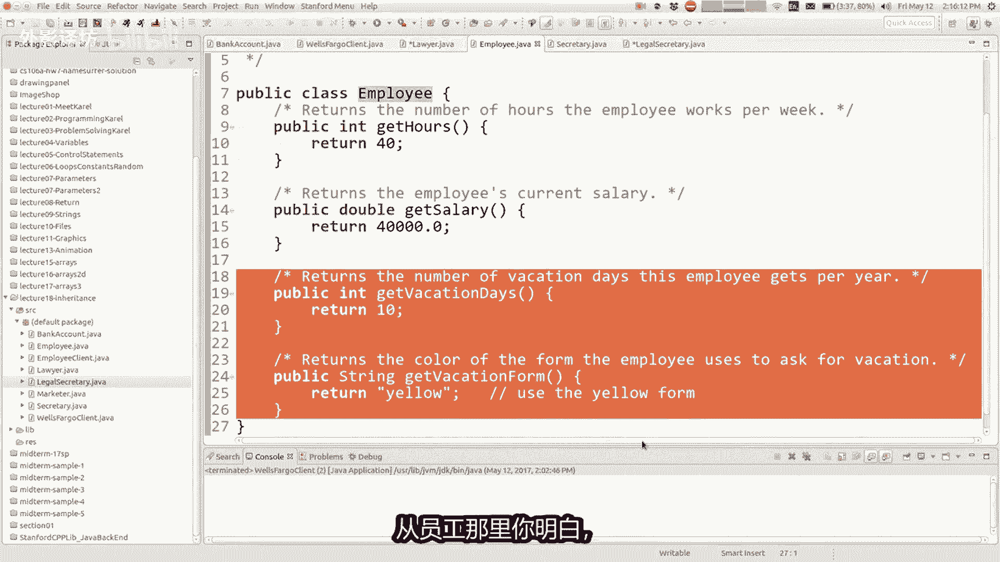

所以我该怎么办，做得好没关系，你能做什么，继承是你可以做某事称为覆盖，所以首先它是，无法部分继承时，你延长了你得到他们所有的东西，抱歉这就是他的工作原理，但如果你不喜欢你的一些东西。

如果你可以在这里替换继承的，重写你自己的新版本版本，你必须有那个方法，但是你可以将其更换为新的，这就是你想要的，如果我希望律师休假回来，格式讲，我只是写那个方法，再次说辟，然后律师会这样做。

基本上我继承了一切，否则我替换了这部分好吧，实际上你所要做的就是回去去找你。

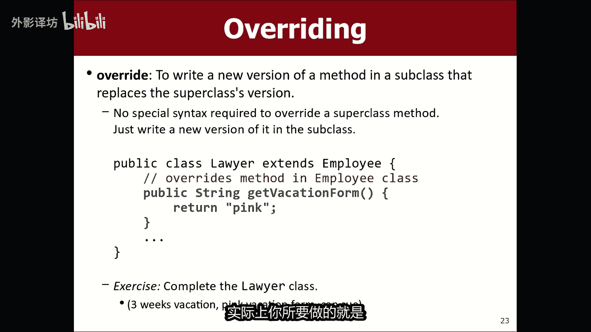

说好的律师吧，我想将这些继承为律师，但是我不想继承这些，所以然后再律师档案，我会只是我不会认为律师应该做出更多的钱，我认为他们赚同样的钱金额，所以我要离开他，是的，我只是想覆盖这些方法。

我知道如何起诉人们，我会添加一个起诉人的方法，或者不管怎样，那是律师课的好吧，所以你只写那些部分是新的，或从负极修改，孩子的话，就像java是怎样的，知道你正在覆盖修改它，只要弄清楚父母是否有方法。

然后孩子就有了方法，具有完全相同的名称，明白你正在覆盖它，事实上，当你像富国银行一样，拥有你的计划客户端和你扩展控制台程序，这种运行方法在技术上是重写run方法，控制台程序类来自控制台程序类是空的。

你换一个没死的好吧，关于覆盖的问题，我的意思是根本不需要任何形式，我想你可以，但你不能就像从你的类中删除这个方法，你必须有那个方法，所以你会必须决定某种表示方式。

也许你会说我没有需要正式返回一个空字符串，或我会返回一个now，我想你必须这样做，决定你想要的计划，表明你可以写一个word方法，我需要一个表格吗，你需要吗，返回false，所以有很多不同的方式。

你可以你可以选择代表这一点，但只是在继承机制I，当我说我事时必须有这个方法延长员工期限，因为员工有没有这个方法，我就不会玩，如果我在我的班级中被社区录取，向员工解释一下好吗，这是最重要的。

我想给你看一个在我们经历之前的最后一件事，只剩12分钟了，但我要告诉你的最后一件事是好的。

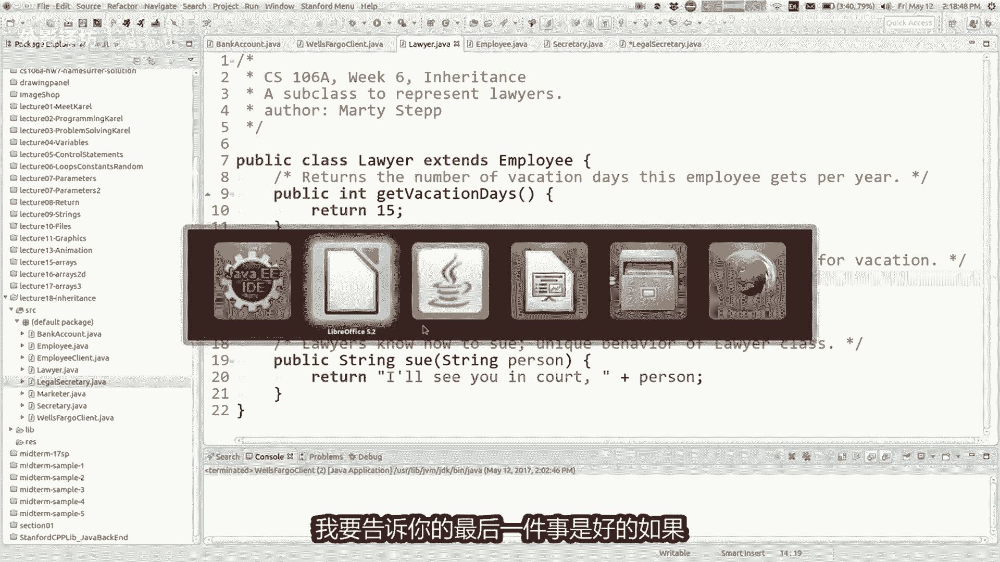

如果我要跳过第二，如果有变化怎么办，公司每个人都赚更多的钱，我给公司每个人加薪1万，因为我们的首次公开募股效果非常好，每个人都得到加薪好吧，或者实际上如果你不介意的话，我想选择一个不同的例子。

其次假设每个人都得到额外的一周的假期，额外两周假期。

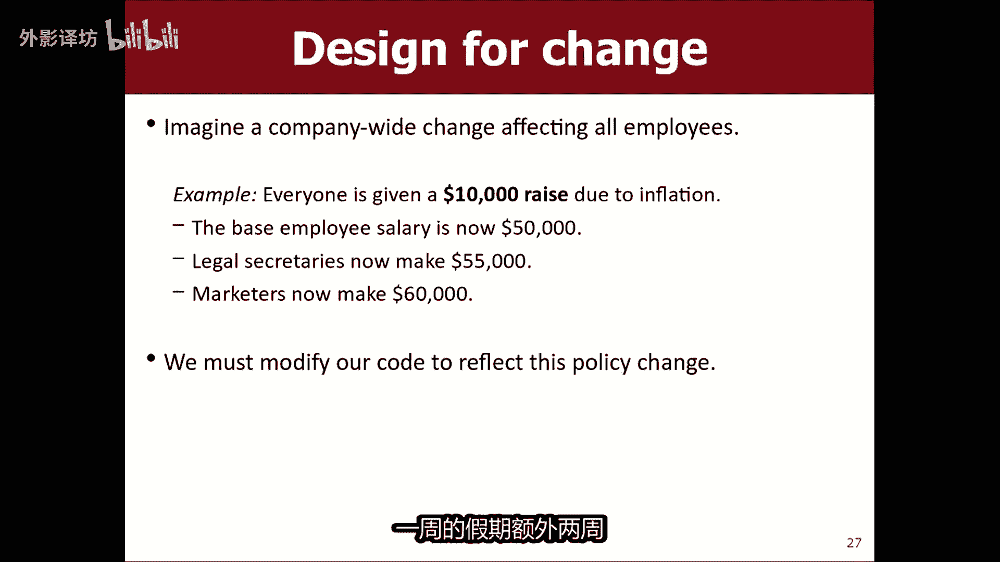

所以如果我去找员工班级假期天数，现在每个人得到的都是20万岁，但我现在有一个错误，错误是律师应该比其他人多一点假期else，但在当前代码段上，他们的假期比其他人每个人都得到20，他们得到15，哎呀。

这样我就能记得进去，在这里并将其更改为25，不是很难做到这一点，但如果你想象这是一个巨大的系统，有大量的归档，大量的类，我不想去编辑全部这些不同的文件来修改它们。

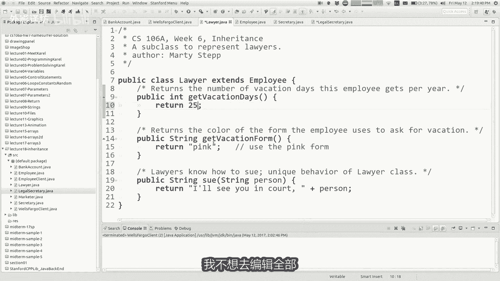

有一种特殊的语法叫做super，这意味着去获取这个值我的父类的方法，班级以及表达我的方式，想说的是，我想要这个假期的超累豆子加五，这样无论员工版本如何，律师永远是五个以上，那么我就没有税了，大家都好吗。

我已经停在那里了，所以走吧，周末愉快恢复一点考试压力，检查一下你的收件箱。

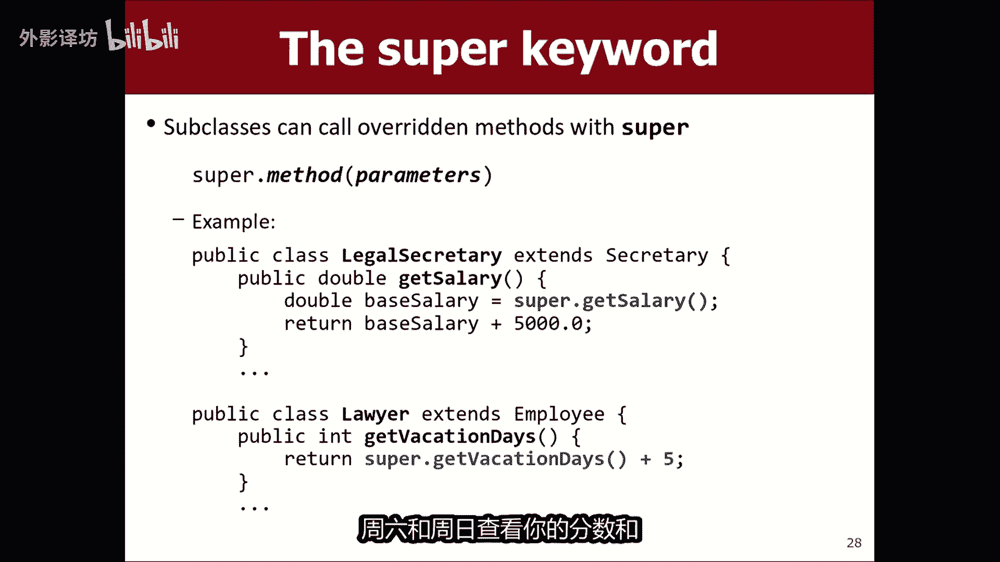

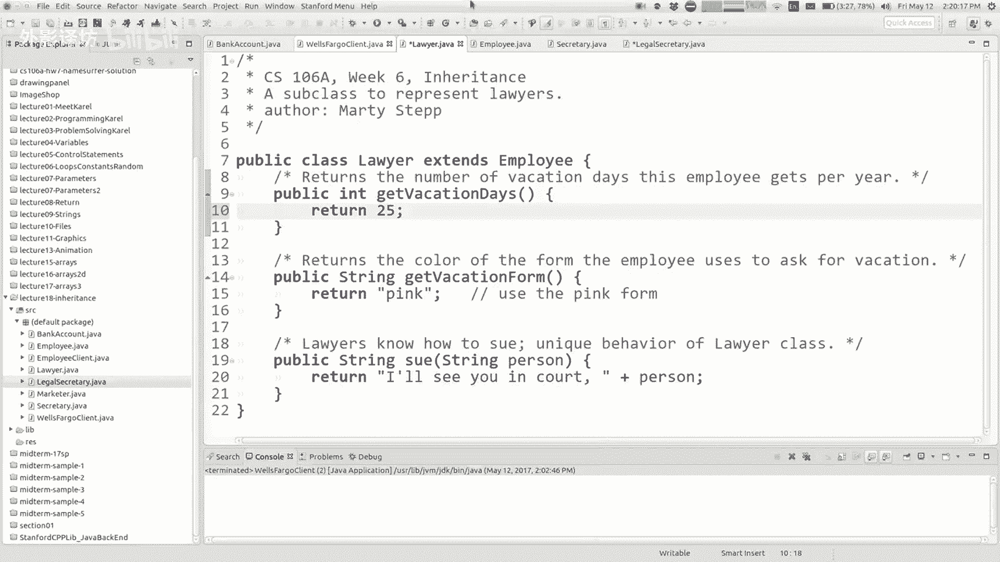