# 【中文配音】斯坦福王牌课程 CS 106a Java教程 2017年春季课程 - P19：19_ Inheritance continued; Polymorphism - 外影译坊 - BV14U4geNEEq

很高兴今天再次见到你们，大家是星期一，是第七周主题，我们今天要讲的内容是称为继承和多态，我们将继续继承上周五开始之前的话题，讲座中，我只简单提一下公告，例如维护，当然是我们已经完成评分了，你的期中考试。

如果你想知道的话，您可以记录的术语中的内容进入年级范围网站，并检查您的期中成绩，已列出在成绩范围内，您的原始分数是66，我认为是的，一旦我们做了平均分数的统计，数据发现平均分是49。

在66个中大约占74%，通常目标中位数为80左右，我们将分数减少四分，满分66，所以你看到的分数成绩就可以了，你可以在上面加上四，这将是我们为您计算的实际分数，分数最高为100%。

因此如果你不知何故会超过66，我们上限为66，所以在那条曲线之后，中位数分数中间分数基本上是80%，所以如果你想看的话，嗯在你的考试中，你知道你可以点击他在小学网站上，我们的考试网站中有一个链接。

您可以在页面上查看您遇到的每个问题，可以看到你错过了什么，为何错过它，还有一个插入键可以下载，看看我们也有所有这些考试问题，都作为您可以运行，并作为我们的zip文件代码，一步一步系统有。

其中也存在一些问题，学生收到考试后，他们发现有一个错误在评分中，或者他们认为有，如果您在评分中犯了一个错误，认为这可能会发生在你身上，这里有一些关于我们的信息，分级政策基本上是短期的版本。

是我们希望你去运行您输入的代码，代码输入并首先运行已验证，是否你确实认为它已评分错了，如果你仍然认为这是rain，如果评分正确，我们很乐意为您重新评分，您可以填写这个简短的表格，告诉我们你想要什么。

我们来看看，我们将重新评估整个测试，我们将修复任何问题，我们认为唯一的警告是不正确的，我会给你的是，如果我们看到那些被标记的太高的东西，我们会也修复这个问题，这样就可以重新分级或降低您的分数。

我们不会试着不遗余力的伤害你，降低您的分数，但我们保留有权看任何东西，只要你给予他回到我们身边，我们要重新升级任何我们认为错误的事情，你的测试让你知道，看看结束吧，我想你是否愿意，无论是否重新评级。

善良总是好的，了解这些问题，做错了，以及你本可以做什么不同，以及为什么你的国际米兰这样做不起作用，所以你知道你可以采取，如果你这样做的话，请在你自己的时间看看，决定你要提交重新评分。

你有一个星期的时间去做我不会做的事，下周一后接受他们，因为我们只是需要继续前进，我们不需要想要在最后留下遗憾，1/4，所以你知道材料就是全部那里供你稍后查看，其他的我会告诉你，你知道的事情。

大约在这个时候，有1/4的人开始评估他们的状况，我在班上做什么，让你了解一些学生想知道的，就像我做的不好一样，我应该放弃吗，我应该切换到通过失败课程吗，评分依据，所以我的一般答案你知道那种想法。

大多数人都在做真正的事情，在季度末我会调整曲线，使得大约一半班级获得A或更好，然后全班大约30%的人得到了A，B减去B通量，所以大约是80，你们中1%的人会得到A和B，然后剩下的你就知道了，大部分是C。

少数DS和C之后就过去了，但是很多学生不太清楚到底如何，他们正在做他们几年级的事，他们的相对表现如何，给班上的其他学生，以及你当然想知道这些，我要发布一些东西，本周或后天的统计数据。

两个可以告诉你一些关于所有事情的信息，你的家庭作业和部分成绩，中期和某种程度上给你一个整体，你相对表现的百分位数，对你的同学来说有点近似百分位，希望这会有所帮助，你知道你的立场，我会的，今天发布了。

但我正在努力，等我做完所有作业，突破分数，这样我就可以将这些包含到数据中，以便我知道就截止日期之类的事情而言，周五是人们的最后期限退课，我想确保您拥有该信息，周五之前，因为我认为在很多方面。

会导致某人不这样做的情况退出，因为他们会说我是我做的比我想象的更好，做得很好，我会坚持下去，认为大多数提交所有内容的人，完成任务并做好工作，他们的作业做得很好，期中考试很好，你知道不需要考虑退课。

所以我会尽力给你所有您需要的信息，以便您了解你正在做的事情可能会发生，明天我会得到该信息发布在网站上好吧，如果你对你的事情有什么想法想与我分享，你知道有您可以匿名发送的链接反馈，虽然你知道。

尽量不要在你的文章中使用了太多，丰富多彩的词语，如果你想匿名给我发消息反馈，只需点击员工页面有一个链接说发送，如果您是请向各方提供匿名反馈，如果你对考试很生气，并且你想要骗我。

有链接这样做或做任何你想做的事，告诉我课程进展如何，到目前为止，我知道这是一个，我知道我参加过具有挑战性的课程，在卡片上工作，其中一些只是这个类的性质和性质，这种材料，这是一种每个季度都是这样。

我也明白，我不是你只是课堂，我不是你生活的全部，我知道这不是我的权利，让你每周工作40小时，只是为了这堂课，所以我会尽力保持事物平衡，以保持事物的平衡合理，但无论如何，我总是欢迎你的反馈，所以综上所述。

任何人有任何疑问，或关于其中任何一个或关于期中考试，或关于分数如何查找，事物是什么，信息是什么，如有任何关于ea的问题，请联系我们，尴尬的沉默，尼克走了进来，很好，为了见到你。

我问他们是否有有关ta的任何负面反馈以及，然后你就笨拙地走进你的内心，稍后可以告诉我，伙计们，没关系，不好吧，那我们继续吧，我想又开始谈论继承，有人可以请问什么是继承吗，提醒我这是什么意思。

您正在使用事件处理程序，或者为什么我要这么做，是的去吧，在你之前做一个超级课程，然后，他下面的子类好的是的，就是这样，绝对是你使用时所做的继承，为什么我想要那个是的，好的你可以创建一个类一般。

然后是其他有在此之上添加的内容，是更具体的说，我们有一个例子，我们谈到的员工以及图书馆，有时我们有一个通用的例如形状或图形对象，然后在下面你有三角形的，圆形和正方形或不同种类的形状。

有很多层次类别的事例，诸如此类的事情，是的，我认为只是从一个非常机械的角度，你也得到了这个减少冗余代码，如果你们有几个共同的课程，具有共同特征，并且您想要把他们拉出来，所以你只需要一次写出这些功能。

继承是一个很好的方法，这就是我们现在所处的位置。

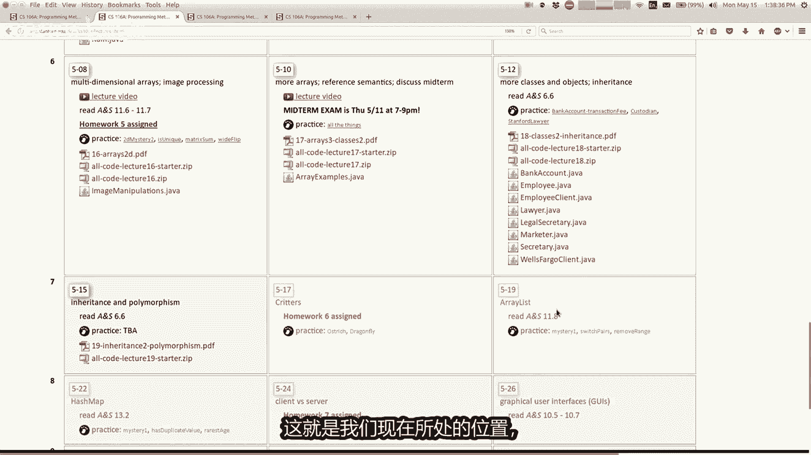

我们写了一个关于员工的类的层次结构，我想今天再回到那个，我将继续看其他一些例子，是的，我们做到了，我们在这里把它做得更高，基本上我们有一个雇员类，在它下面有律师和秘书和营销人员，以及。

那么你可以有一个法定秘书，这是一个更具体的类型秘书，这样你就可以延长岩神，其他事物的其他事物等等，好吧，我想做一件事，教你，这并不是真正的事继承，但我认为它很有用，这些编程事例。

有一个我还没有讨论过的命名，叫做system out print4肢之类的，该命令的简短版本是这基本上是打夜行，但是现在任何人都可以使用它。

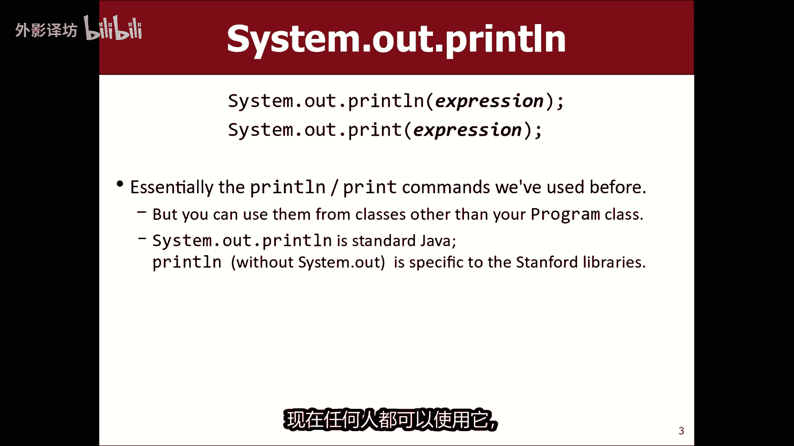

这是什么意思，如果你去参加这些课程，那就太好了，我们正在像这里一样工作，员工和你说的好，怎么样，如果我不返回小时数该怎么办，想要打印打印烂，我工作40小时，你就会发现强调该方法，他说方法打印型未定义。

现在的员工类型，你认为为什么，那行不通，为什么行不通，布鲁克林工作，你认为这是错误的，我当然我要说的是，我必须写另一个命令系统，点出点系统，但为什么此处不打印行工作，java的想法坏了似的，打印形式的。

你说的对，所以print ln是一种有效的方法，在我们的控制台程序类中，写在我们的斯坦福图书馆时，您扩展了导致的控制台程序，你的班级现在有一条打印线，您可以在list中运行的方法，这个程序在这里。

我说打印行工作正常，但员工不是控制台节目，其实我们讨论过这个当你编写类时的想法，也意味着可以被不同的人重复使用，这些类本身不是的程序程序，就像小模块，由程序等使用这些不扩展的常规课程，控制台程序。

打印链接命令不可用，因为此类不是一个程序，所以有一个打印行，每个人都可以使用的命令，是系统点出点打印行命令，系统点出是对您的控制台附带的编辑器，就像在ECLIPI中看到的那样，有这个窗口上面写着安慰你。

如果你运行你的eclipse，如果我在这里运行这个程序，在底部应该说我工作了40小时，之所以打印四四，是因为我想在这里，这个客户端程序我称之为耦合不同的地方，所以基本上这很有趣。

因为如果你说在控制台程序中打印令，像这样输出将继续到这个弹出的图形窗口屏幕，但如果你说系统点出点打印行输出下降到这里，无论如何进入这个eclipse控制台，我想我想在这里向你展示什么。

使用这个命令不是很复杂，但如果你想说的话，打印行，但你在另一个班级，你不在程序中，就是这样获得正确的等效页面，你会看到好的，实际上，对于写这篇文章的人来说，这是值得的，你知道的，我们的斯坦福大学图书馆。

本来你可以解决你的，可以编写你的控制台程序，在我们斯坦福大学的图书馆里，就像这样系统打印土地，但他们决定了什么，那是不是很长，而且只适合学生，谁刚刚开始让我们做它更短。

所以让我们写一个控制台程序中的方法，会翻转到写短一点就可以了。

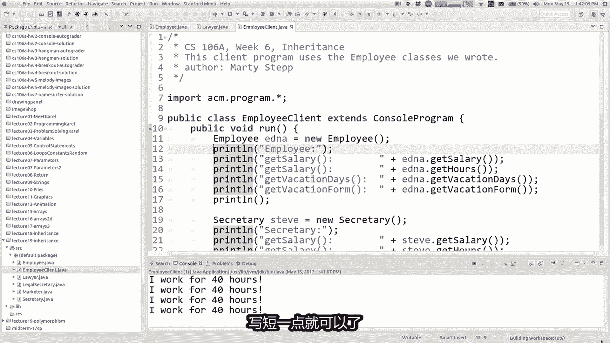

无论如何，我不会花很多时间，这个打印命令不是很很复杂，但我想回到，我们有一段时间继承了这家律师事务所的例子，有这些不同类型的员工，我回报从上一讲，不同的不同类型的政策，员工关注其中一些人获得更多有钱。

他们中的一些人有更多的假期约会这种东西，所以我们决定做，我要跳过，你不必阅读所有这些细节上有不同的规则，但没有真的很重要，但我们决定做什么，是写一个员工类，每个人都有共同的东西。

40每周几个小时这么多钱，如果是的话，迷你假期，然后我们写到向右扩展，40的子类，有秘术般延长员工，我们继承了所有行为，从员工类别中添加新的秘书，知道该怎么做的行为，听写备忘录或信件或类似的东西。

所以这是一种继承模型好吧，所以现在我想回到这种我上一堂课结束的地方，是如果我们改变政策怎么办，为了每个人，我们决定给予我们公司的每个人都受到评级。

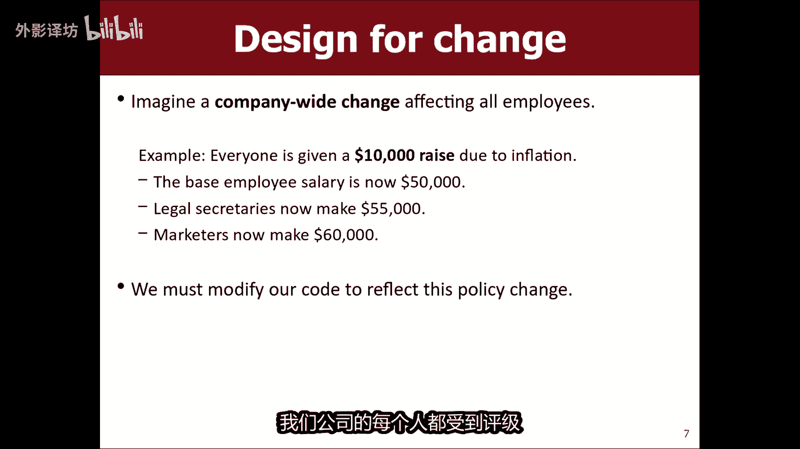

给每个人加薪十美元，在整个公司，所以现在如果你走了，回到你的代码，你说的好，40，我赚了50，但这可以导致错误，因为其他类他们还有其他薪水，取而代之的是他们得到薪水，他们写了自己的版本。

我们称这个方法为重写方法，就像我忘记了哪种员工为营销人员赚更多的钱，是的，在这里赚更多的钱，所以营销人员比普通人多赚1万，通常的工资就像在这里员工平时工资是40K，如果我们说过。

营销人员让你如果再多3K，就相当于43K类似的东西，所以那是两个，我现在给的工资是40和43，如果我忘记去的话，大家都参加1万公里比赛，更新所有其他不同的文件，我会发现哎呀。

现在营销人员赚了7000列服，因为医生给他们加薪，明白了，所以我会解决这个问题，去打开所有不同的员工，查看文件，并编辑所有文件，给他们所有人加时工资，艾伦美元工资和年底上一堂课，我对你说的是。

这并不是一个很好的设计，因为你必须假装，如果我真的在做模特怎么办，拥有500种不同类型的大公司，每个员工都有自己的薪资结构，可能或其中很多有自己的薪资结构，如果你遇到这样的情况，你就知道了。

像这样的情况，你想做一个政策改变，你可能最终不得不编辑数百个java文件，真的很容易错过一个权利，所以这事当你想做你想做的事的时候，而做的是真正代表这一点，代码中的关系是这个原因是40，之所以说43。

是因为我们基本上是在说营销，人们比其他人多赚3K，所以我们可以说在代码中。

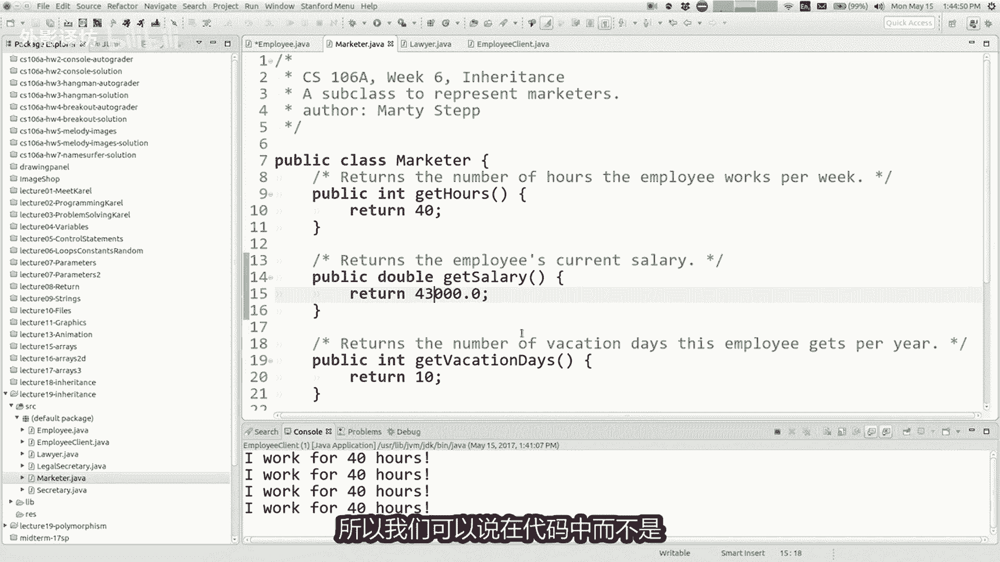

而不是按照你的方式写40和43，说在java中使用这个词称super，关键字为super的意思，你正在谈论你的超累，所以如果你想从你的方法中调用一个方法超类，你可以说super，然后说A点。

然后是方法的名称，你只需要在上课时这样做，正在重写一个方法超累，通常你要做的是，你会调用重写版本，你的方法是最新的版本，超类比你高，所以如果我愿意的话，这个例子就在幻灯片上，生态秘术的收入超过5K。

其他人我都会称之为超级点，无论回报如何，我都会得到薪水，然后退还五美元，这样现在代表我的关系，试图代表如果我回到代码。

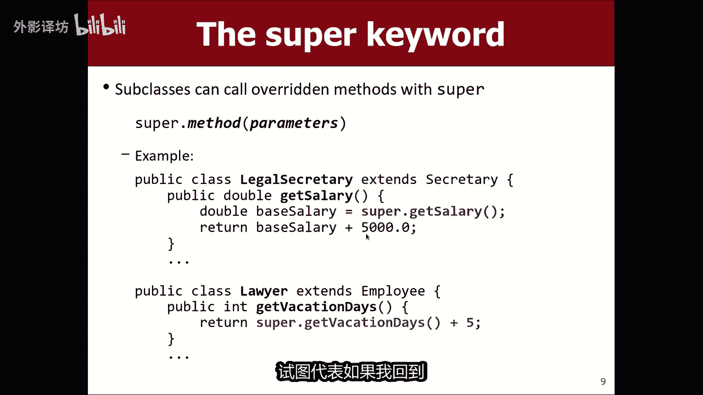

在这里得到薪水，而不是43K，我会说反超拿工资加3K李姐，因为超拿工资是哦，实际上我想我想我没有就像那里的员工一样，我忘记了，我没有认为我们在电力方面研究过这个文件，还好现在超级工资加3K。

就像律师得到15一样，相对于大假期，员工可能有十天假期，律师获得额外一周的假期，还有额外的五天假期，就这样结束了，在这里我会说一些类似超级的东西，医生请假加五天，现在如果我决定给每个人播了两天。

所以我从十天增加到12点，现在律师要上去到17，实际上我可以运行它，看到我认为我的客户程序，在这里只是运行所有这些课程，并且打印出他们的方法的作用，一般雇员的工资等级是律师获得40K，12天假期。

17天假期你会看到营销人员四十二四十三K，所以合法秘书得到45K，我不知道为什么秘书们的收入比律师刚刚提出，但我想这真的会很重要，但我想大测试会我可以改变薪资结构吗，只想现在就拥有所有文件。

正确的事情正确，这是关键，这里是试金石，所以如果我去找员工，我把它从40K改为喜欢的，让我们把它作为海湾地区的生活工资，177区不管怎样都是底薪，我希望现在我们大多数人都有177K，员工类型。

但欢呼营销人员的收入还不止这个，哎呀法律电路我忘了修补它文件，但你知道理解就像法律秘书传45K，因为我没有打开那个并更改它，仍然说return45，我想是这样，返还。

超拿工资加5K和现在法律秘书应该做一份，是一处还是两处，我们走得好，所以super关键，自从，超累，通常你会得到薪水，打电话给苏普尔拿薪水，意为他就像你正在调用那个版本，您在班级中重写的方法。

如果你没有说超级点，有趣的是，因为现在的薪水势称自己为plus by，OK它导致无限循环的调用自身，这是一个错误，但这不是一个错误，所以无论如何，首先这是super关键字。

还有其他一些地方可以使用super关键字，但这就是到目前为止，最常见的称为来自超累的方法，好吧，我已经有了，人们之前问我，你可以打电话吗，方法总不止一个级别向上，例如如果分开凝胶秘术延伸延长雇员。

可以的秘书法定秘书，一直到员工呼叫方法是像这样升级，所以我猜怎么着，就是你知道你能说超级吗，点超级点得到薪水，或者你能说就像超级骗子一样，拿薪水布，你不能真的这样做，你只能升一级，所以这只是工作的限制。

这就是我能想象的运作方式，可能有些情况是你想要的，要做到这一点，可能只需要设计你们班级的结构，有点仅用某些功能的方式有点不同，就像关于超级的问题，关键词。

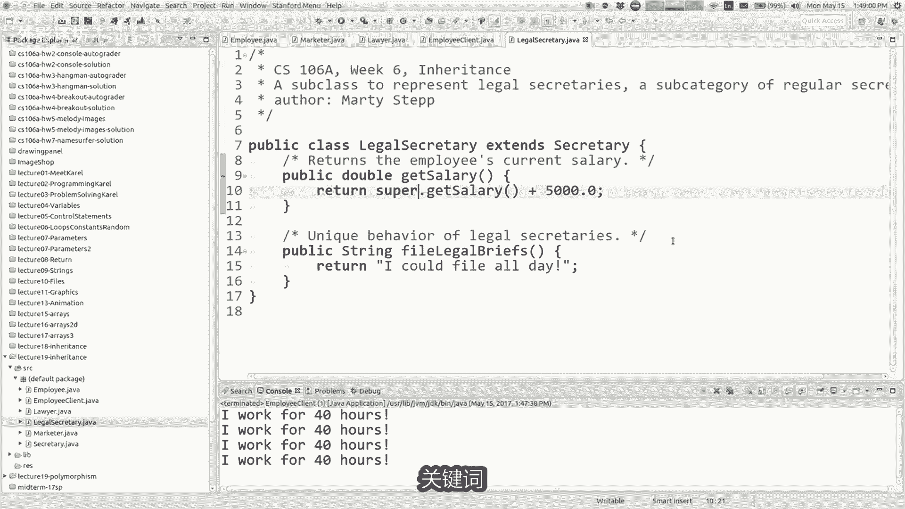

让我向你展示一些其他的东西，想想如果你正在看他的代码，我一直在和他的员工写信，你可能已经注意到我没有注意到的类型，有任何私有字段用于此，我有方法，但我也仅此而已，大多数时候没有任何构造函数。

内有所有这三个句子，我的字段方法和构造函数，这里只有网络，所以我们来谈谈字段和构造函数，我故意跳过这些意味，我想要谈论所有这些其他问题，首先但当你开始拥有，当构造函数有一些字段时，你遇到的微妙之处。

所以让我们开始吧，这段代码的具体变化说明我所做的一些改变，如果我们说我想要的话，心灵就是什么，记住每个员工的名字，以及如何记住我在公司工作很长时间了，还想如何使用该信息，你在公司工作了很多年。

意味着你可以获得更多假期或更多薪水，或者类似的事情，如果我告诉你，这些对象需要记住一些事情，比如记住你的名字，记得你在公司工作了多久，对象读取的公司事务成员，这些基本上是他的字段。

对象的字段或数据需要存储整个对象，如果我谈论记忆的话，一生意味着查看的事情，所以如果你去你可能开始的员工课程。

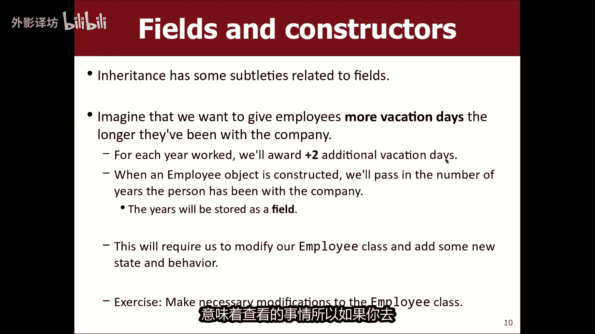

在这里声明一些字段，也许在这里我会说私有字符串名称驱动塔，两年后，一个领域的表现如何，对象通常得到初始化，让我得到他们的起始余额，是的是的，通过构造函数是的，所以我们可以编写一个构造函数。

固源类公共雇员和，通常我们所做的就是询问那个人，谁正在创建员工对象，告诉我们什么名字或者多少年了，该对象应该存储一些东西，向字符串和名称或NM，然后几年了，然后我说名字等于新的年份，等于你的。

现在将它们存储到字段中的物体，所以现在如果你有锋利的东西就可以了，你可以看到红色的小X的眼镜到处出现，呕我把它弄坏了，好吧，我的意思部分是因为现在当我雇佣一名员工时，这个客户我需要写你知道的对象。

工作了3年的埃德纳爱迪生或者类似的东西，现在红色消失了，在那部分代码中是的，但是还有一些其他的红色X，就像如果我去上律师课一样，律师内突然无法编译，我没有改变任何事情，律师课发生了什么事。

很难阅读该错误消息消息，但他说已是构造函数未定义的，默认构造函数必须定义，什么是胡言乱语，现在让我解释一下，当你有继承字段和构造函数，突然变得多一点复杂好吧。

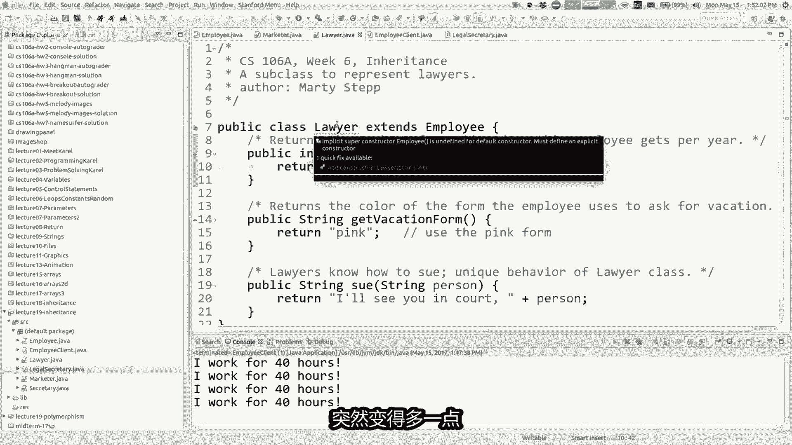

所以我们有这个错误，律师类无法编译，这是为什么的，简短答案，基本上就是说你的，如果你的超类有一个构造函数，基本上子类有有一个构造函数，这就是简短的，如果你想了解的话，请回答更多。

关于为什么基本上一点更长一点的答案是，如果你不这样做，你的类中有一个构造函数，隐式的得到一个类似于添加到你的泪，被编译器秘密的编译你的程序和构造函数，这是隐含的，基于你的班级的，不要求任何参数和所有。

他所做的是调用超类构造函数，以及当它调用时，超类构造函数也没有参数，但如果你确实在你的类中编写了一个构造函数，你的构造函数替换任何其他构造函数，本来应该set的构造函数，你的课，所以我猜我想做什么。

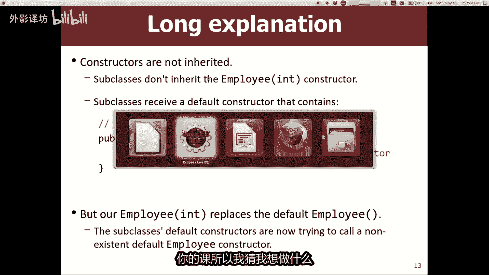

就是说如果你添加一个构造函数，需要这两项的员工参数，从技术上讲，现在的律师阶层是什么，做的是他有一个构造函数，一位律师公开表示，这就是很好，我正在写他，但即使他没有写出来，java会隐式的把这个在这里。

他会说我想打电话给员工建设者，一位律师是员工，因此他们必须构建他们自己，所以让我们推迟员工建设者之路，构造函数要用另一个构造函数，从超类中你只需写超级括号，而不是说超级文档方法，可以说超级循环。

这意味着调用超级类构造函数，所以律师是试图这样做，但那不再是，如果您愿意，现在就可以纠正语法，构建一个你必须通过的员工名称，字符串和info，这些年来律师阶层没有编译，是因为隐式构造函数。

java试图提供的并不是不再有效，我觉得有点理解起来很复杂，但它是简单的，简短回答是，如果你希望员工拥有这样的，你需要重写的构造函数，律师也有类似的事情，字符串名称以年份和调用时间为单位。

我们需要的超类构造函数，将相同的参数传递给它，命名年份，或者我想我称它们为年份，字符串，中午和面试官，所以他们不一定要匹配，但也许就是这样更加一致，所以又这样线路超级正在呼叫该员工，现在建造律师班工程。

如果你进入客户端程序，如果你你会说想要创建一名律师，向律师lisa lion heart和他今年已经工作7年了公司，所以现在工作正常了，构造函数不必精确的相同，它们之间的参数可以是有所不同。

但你必须这样做，将一些参数传递给super构造函数，更常见的是，你可能会添加一个额外的子类构造函数的参数，也许律师保留了一个变量的感觉，他或她在哪里上法学院，因为你知道律师很棒。

对这类事情的判断是正确的，所以也许你告诉我你的名字，你在这家公司工作了多少年，公司以及你就读的法学院，所以也许律师会添加一个字段，他们去了哪所法学院，我会写一个弦月学校，比如这所法学院等于学校。

所以现在律师采用的参数，比员工是否将其中两个向上传递，他存储第三个本身他有第三条数据字段，位于另外两个字段之上，员工班，所以我什么都不做，与这些领域，但我的意思是，你可能做的最简单的事情是。

你可能想要一个公共屏幕法学院，你知道我们经常写这些，获得诸如return o之类的东西的方法，学校，这样你就可以问律师反对你在哪里上学，可能会用它来做类似的事情，学校等于斯坦福大学工资加上百万。

如果哈佛薪水，你可以做这些事情，但现在我有该变量存储在其中，无论如何，我都反对我不得不这样做的原因，法学院的事情是，因为我想明确律师构造函数并不完全，必须匹配构造函数的参数到超级班。

但你知道我是否只要求去法学院却一无所获，否则我真的不会知道这里要传递什么给超类，所以我不妨问一下超累需求，加上我需要的任何其他东西，我的课还好还好，你知道我是否便利所有不同的员工，我必须更新所有的课程。

我必须向营销人员更新，做一些类似的事情是一点点乏味的，公共市场或字符串名称耳朵，我必须呼唤超级名字，耳朵也在这里，我想这就是为什么正确的好吧，然后我必须这样做，我还有什么其他课程秘书。

所以我将其粘贴到这里，可能会说等等，我想了全部要点继承的东西，就是常见的东西被复制下来了，等级制度我不必这样做，重复粘贴并复制所有这些内容，java的怪癖之一是尼布，如果扩展A则继承构造函数。

你不继承任何一个类，您继承的类的构造函数，所有方法和所有私有字段，但你不继承构造函数，为什么不好呢，他们是如何设计java，我认为这个想法他们不想强迫那里的过程，要构造的每个子类，同样的。

这是他们的超类，认为子类可能想要以不同的方式构建自身，他们想保留建筑方面来区分两者，但是无论如何，这就是我的假设，所以让我在法律秘书类中解决这个问题，让我们将其粘贴到这里，秘书我想谈谈重点。

哪里有可以再次编译的程序，这样我就可以再次运行这个新东西，秘书史蒂夫史密斯和他工作过，存在3年和营销人员姓名是组织蛋糕，非常有创意，他在那里工作过两年了，好吧，我怎么样哦，丽莎失心。

我必须说他在哪里上学，斯普林菲尔德小学，我们去，他们有一个很棒的程序，相信我是D，所以，等等，没有法律秘书兰斯，我不是真的看看变量名，我我想我不知道我是否提到过兰斯阿姆斯特朗，他在那里工作过一年。

没关系，所以我想我的程序现在再次编译，现在其中之一，我想添加号码的原因，您在公司工作的年数，你记得那是为了让你得到休假天数越多，你的假期就越长，在公司工作过，记得也许也许如果我们不记得，也许太久以前了。

但重点是而不是开玩笑，十或12假期或任何类似的情况，你在那里工作的时间更长，你应该得到更多假期，让我们看看假期基本员工人数天，我们需要目前的假期天数为基数是12，所以我想我想要什么。

你要做的就是一开始得到十，但对于你工作的每一年，您将获得额外二天的工资，在这里度假，我该如何融入进入这段代码，是的先生，好的，所以传递类似的年数，然后喜欢用它来增加你应该休假的天数，如果你每年得到两个。

就会变得如此，或者两者中类似的东西，每年是的，那很接近，但我不知道希望这是一个参数，一个参数意味着外面有人不得不告诉我，我已经多少年了，此刻与公司合作，但他们以不同的方式告诉我。

不是将其作为参数传递到这里，这个数字就是你想要成为的东西，参数是this is private，处于顶级生活状态，在该员工的一生中，所以如果我只想参考，有多少他们在这家公司工作了几年。

当对象获得时被传递到这里，创建了，我仍然记得里面这个物体的，所以我只能说几年，这就是年数，当我出生时，他们袭击了我，所以我还有那个可以用，就在这里吧好吧，那就是你的，我认为答案实际上很常见。

人们最常做的事情之一，当他们刚刚学习课程时，对象和继承是他们想要的，将所有内容打包为参数，实际上，你需要的信息是以某种方式已经存储在这里，或在至少应该是如果不是的话，那么你应该把它存储在那里。

你已经知道了，所以你得到两个每年额外休假天数，你曾在公司工作过，所以如果我竞选，这又是员工客户，我们一直在努力，我想我们会做什么，现在看来我觉得有点难阅读，但在这里让我打开客户端，这里的程序转到顶部。

所以我有曾在该公司工作过的员工，埃德纳公司3年，然后我打印埃德纳的假期，他会得到16天，十八十加二为二，那3年，然后在这里，这位失心律师曾经工作过7日代提7年，他们有29天假期。

我认为原因是因为他是七多赚14，但他们的底线是15，不是吗，这是超级加号五，如果我们去看律师，超等假期加五天，所以我相信律师休假日对于一个青年律师来说，10+2乘70。142104，但除此之外。

我还得到了五个，像29岁，所以看起来都像，这是一起工作，但也许你现在可以明白，为什么我没有立即从私有领域开始，它使这段代码变得有点构建和获取，有点困难，以正确的方式工作，但是是的基部分仍然有效。

只是甚至对此有疑问也很好，lucky对这些构造函数的感觉，是的，现在是什么课，你开始说吧，再说一次，如何让他们好起来，所以嗯，这些都在同一个项目中，他们在一起，并且在线计算机在我的硬盘上，他们都在。

当您在同一项目中的同一文件夹中，有引用其他的java程序与其他类的数据类型，编译器会查找我可以在哪里查找，发现两人都在笑，如果你有，如果你说我想做的话，用类似的文件一个新员工，看看是否有员工java。

如果有的话说，虽然你想上那门课，好的了解如何附加这两个文件，一起参与同一个计划，或者如果没有员工java，他去看看你是否有你可能已导入的库，也许你导入了一些东西，名为员工的库，然后使用它，如果有一个。

如果没有两个比较器，到目前为止还有什么吗，好吧，在哪里啊，你赢了可以很好的使用这个，我们可以随时使用它，参考当前数据对象，你可以说这个点名这一点年，但这是可选的，如果您想参考此内容，请在此处，就在这里。

你也可以保存这个狗，我想要这个物体的年数每人增加两天，但总共我刚刚添加的那些案例，据说所有这些都是可选的，这意味着当前对象我正在右边运行代码，好吧好吧。

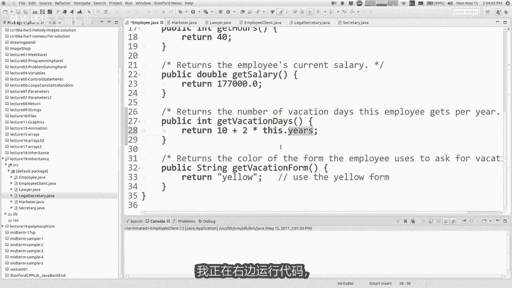

构造函数和字段变得有点复杂好吧，我我想谈谈，等一下好吧，所以我想做这个，我想对你记得我是怎么做到的，每个人都有更多的假期，在喜剧上工作更长的时间好吧，让我们做另一件事似乎就差不多了。

我想给出的想法完全相同，工作时间越长就能获得额外的钱在公司，但我只想这样做，为律师为工人好吧。

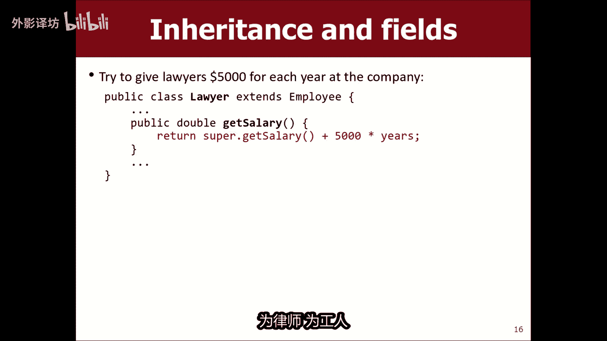

让我们尝试一下吧，很简单，我去上律师班，他们没有名为get的方法，我认为现在的薪水不合适，只要做同样的基础，真主读其他人，所以我会公开双倍工资，所以这就是我喜欢的超级写信，已获取工资消息，员工班。

我们只是说我每年想要多5000美元，所以那就是将会成为超级班，拿薪水加5K乘以年数，我在这家公司工作过，是对的，他对我很生气，用红色下划线，他说现场员工的年龄是，如果我输入此代码则不可见。

如果我输入员工中有类似的事情，就像我更换员工一样累，和我说好薪水，你赚取的是不产生，愤怒的红色错误消息，但如果我把同样的每年5K的奖金和他，我收到红色下划线，我收到错误消息，所以这里发生的事很有趣的是。

律师继承多年的私有领域付类员工，他确实有一个它里面的字段名为years，但是它不允许引用它，它不是允许查看他，他继承了这个，但如果内心深处很喜欢，这是不允许查看他的价值观及其原因。

是因为员工类别声明了他作为一个私人领域，现在你可能以为也许会在那里，是某种特殊的例外继承欧他是私有的，他是私有的，对我来说就像一个班级什么的，但是私人工作不是这样的，仅此文件和此文件私有独自一人。

你知道你可能会说，那是不是我会做的，我不喜欢，我希望java的设计如此没做的那么好，实际上他很友善，重要的是他确实做到了这一点，因为你记得我们的决定，私下做事是件好事。

就像在银行账户中我做的那样平衡私密，这样你就不会搞砸，用你的平衡，并给自己一个10亿美元，好吧好吧，如果允许此类修改来自负极的私有字段，那么我会做的事，开设一个我会扩展的马地银行账户，银行账户。

然后我会改变我的余额，有10亿美元，因为我现在可以这样做，成为私人隐私的漏洞，所以他们不希望他们不允许，所以无论如何，长话短说，我不能我的对象确实有几年，II我不能以同样的方式看待它的价值。

精确的方式可以让你做同样的事情，如果我想说丽莎点就在这里，您加加或其他东西不允许，这不完全是这样，与我正在运行的保护相同，在这两种情况下，都反对这个客户端程序和主题中，但我希望能够做到。

基本上我希望能够得到我自己更多的钱，更多公司四层生理盐水怎么做，我该如何解决这个问题，告诉你一个不好的办法，黑魔法我会告诉你一个肮脏的黑色，我可以用神奇的方式让这一年公开，然后愤怒的红色信息消失了。

我想我们已经完成了，但是不不不，我们不是这么做的，还有更好的方法实现这一目标的方法，不只是打开对象中的数据，整个世界你有什么想法吗，超级点好的，在这里等一下，我可以说超级点年。

那么超级码头年和我说的一样，因为我从超级版得到岁月，这很友善，保暗示他来自超累，你说超级耳朵，那很好嘛主意，但没有这样的方法，几年你可以做一个，但是我们可以，是的，我们可以是的，就像那样。

过去要问的正确问题，当我们在里面有私人物品时反对，但我们想让其他人看看我们写的一位公众嘉宾，返回该值的方法和，那么我们就使用该方法，如果我们想看看这个值，让我们在这里做，这只是一种不同的方式。

想到它意味，通常你编写类似的公共get方法，我们通常不编写的客户端程序，它们是子类，但它仍然工作，但FM的想法完全仍然有效，如果有的话，就在员工那里，多年来。

我为什么不私下写一个类似public int get years的方法，并说返回岁月来记住这些get方法，就像只读访问，让其他文件有权查看，现在我已经知道这个变量的值在这里完成，你说的写超级过了几年。

是的，我的意思是那些完全没问题，完全有效，现在这是正确的代码，我想要的唯一的东西提到的是技术上，我不需要唯一一次你需要说超级，说超级是当我得到你的，并且我的超级头得到你的和我不想跑我的，我想跑提示。

这时候我不得不说超级点，我没有这个方法，而他有我想给他打电话，我只能说得到你的，因为没有歧义，在上下文中只有一个给你哦，太好了，没什么问题吧，事实上这就是很多学生喜欢这样写，因为他们就像我从超累。

所以这就是我想做的，所以这也很好，这是一个正确的解决方案，只是为了确保它实工作，我可以重新运行客户端程序，我想我正在努力学习什么，这是我可以获得更多薪水的四倍，在公司工作了几年。

所以我认为我有两个12K的律师，练习一下，后面算一下什么吧，应该是这个人曾经工作过的7年，底薪是172，他们赚了40K，不仅如此，类似的事情，无论我认为它有效，它看起来就像数学，对我来说是7年时间。

每年5K35K，无论如何，反正工作正常，我没有展示，你们这一切只是为了好玩，我的意思是，作业六，你将获得超级遗产类和子类，你们需要要用super death并获取DBEAN，你要做所有这些事情。

不会成为员工，而是会成为是小动物，但它正在发生和你有很多同类，好的。

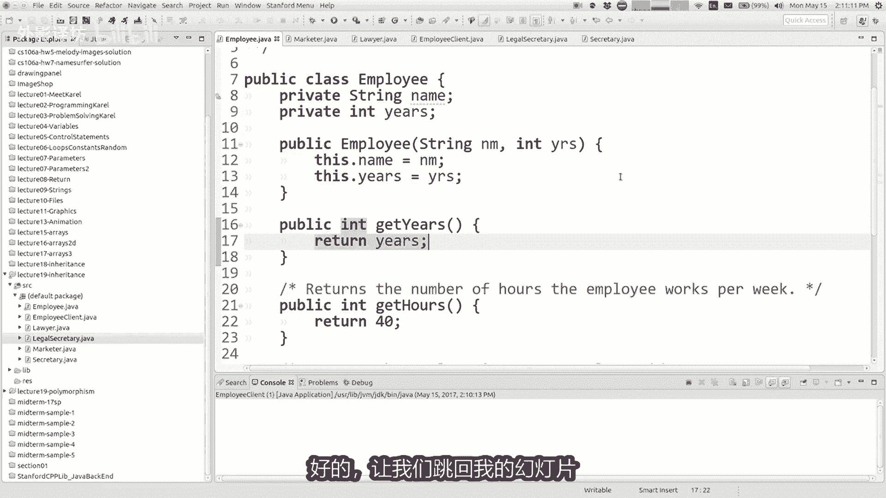

让我们跳回我的幻灯片等等等等，好吧好吧，我等一下，我想跳过这些幻灯片，复过我们讲座的最后一部分，谈论概念多态性，这个是一个伟大的妈妈和爸爸，我需要钱的话好吧，爸爸妈妈你可以给我寄一些吗，钱大学真的很忙。

然后他们就好像我不知道是你努力学习，你在学什么，我今天在课堂上说的好，马库斯def教我如何进行多态，java中的动态方法绑定，涉及多个继承层次结构子类中的super级别，不会写一张支票。

他们就会知道你是学习，只要记住这个词，就可以使用它聚会伟大的大词，让自己听起来更棒，智能多态只是其根源，这个词意味着多种形式，编程中的多种形式，多态多态性是当你写一篇文章时，可以互换使用的代码。

具有不同类型的物体和意志，根据不同的情况表现出不同的行为，你使用它的对象类型，我会在几秒钟内更详细的解释这一点，但如果你举一些多态性的例子，每当你有一个方法，你可以打包不同类型的事情也是如此。

他仍然是工作，他主要会为每个人做不同的事情，这些类型的一个例子，多态性，以便认为规范我们拥有的多态性的例子，看到这堂课是预清洁方法，无论你是在谈论控制台程序版本的好处。

或该方法的system out版本，我今天刚刚向您展示了该方法，你可以把任何东西都装进去，然后行业Mac error，银行账户任何内容它会打印出，他会弄清楚的东西，如何打印类的东西，所以它是一个方法。

可以接受不同类型的参数，以及无论它是什么类型，做一些适合该类型的事情，这是一个非常有趣的想法，强大的想法我们还没有做过我们自己，但我们已经把每次调用print ln时，都被授予图形程序类中类似。

当你想把东西放到你说pad就可以通过屏幕，任何参数设置都是根本性的，狮子长方形和圆形不同，图像上的正方形，所有这些不同，这又是一个例子，多肽方法好吧，让我们看看有些地方被称为泰设。

可能会很好的影响我们的生活，这是java非常有趣的特性，可以声明一个变量，当你有您可以声明一个对象和类变量，您可以将其设置为，等于与该对象类型不同的对象变量，所以而不是说律师合你可以打个是律师。

我会说雇员等于新律师，你只是允许有这些不同的类型，当变量类型是A时，就像这样，右侧对象类型的超累，所以现在你可能会说，为什么你要想做这样的事情，让我们看看布尔加斯，我们就宣布埃德律师等于新律师是什么。

做好这件事的意义在于，你可能不想这样做这个例子，但是你可能会想做的事，你可能想写一个参数为通用方法，输入您传入的值，该参数具有更具体的输入，这是更现实的例子，你有一个律师变量在运行。

你有一个秘书变量来管理，你想要写一个打印的方法，有关这些员工的信息，你可以这样写代码，编写一个打印信息的方法，取一个律师参数，然后取一个整体不同的打印信息方法，取了一个秘书参数。

然后另一个需要营销人员的参数，男孩来了，多余的，你不想这样做，所以你写一个这需要一个员工房间，现在什么时候，当你调用print时，调用该方法信息，您可以传递任何对象，其是一名雇员或员工的子类别。

全部都是合法，所以实际上，如果你看看我所拥有的员工客户计划。

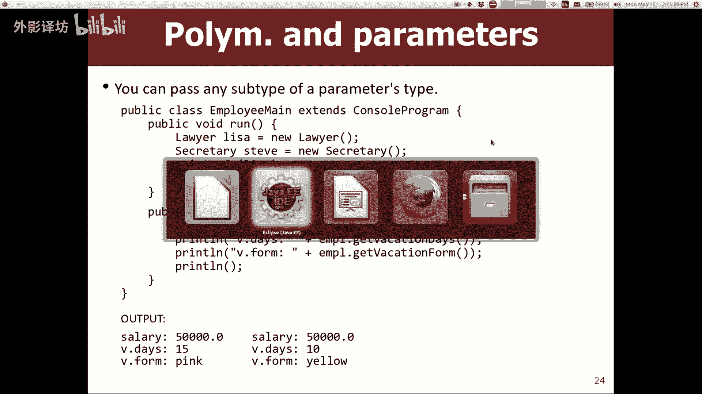

如果你看一下的话，你在课堂上有过，不必费力眯眼就能看到，就像我在做同样的事情一样，你看到这个我就想称他为拼写错误，但我还是打电话，方法基本上在员工位上，并教他们上秘书班，并在律师课上打电话给他们。

呼吁营销人员阶层愚蠢的权利，所以让我们写一个方法，来帮助我们编写一个名为你知道public的方法，无效打印信息，并再次向if if，你只是让这个变得更普遍，输入员工员工毅，然后你。

可以把这些线放在这里就下薪水，我想这应该说小时与典型的屁股印工资，工作时间，休假天数，假期表格，现在你可以在这里说打印，哎呀，你能说什么打印，你可以把信息传递给埃德纳，好吧，这是有道理的。

因为埃德纳是一名员工对象，可以打印信息，关于埃德纳，但你也可以称之为秘书对象，上也有同样的事情，所以我将其粘贴到此处，然后我打印信息，史蒂夫，我被允许通过史蒂夫，因为史蒂夫是一名员工，通过担任秘书。

这样我就可以删除这些行，有趣的事情，秘书有听写吗，这也是独特的新方法，在秘术班中发现的行为，如果我剪掉，你认为会发生什么，把这个方法贴在这里，我说好，我将其打印在此处，史蒂夫也说方法。

但是如果我把它改成E，他不喜欢那样，你为什么认为这就是你所做的，认为最后不会编译一个CUDI，这就是为什么，是的，我知道你们有些人没有很好的查看了，所有这些文件详细，但磁带听写方法是一种独特的行为。

仅如果你有的话，秘书可以这样做，秘书反对，你可以问员工来决定，这是你的一种方法，可以调用该对象，但是这个方法我正在写的，应该能够处理任何员工和其后果，是我只被允许调用每个员工都有的方法。

这恰好是那些诗句听写，仅适用于某些类型的员工，所以我不能把这件作品代码在这里，因为他不是所有不同的共同操作，某些类型的员工必须抛弃这种做法，所以现在如果我想打印关于史蒂夫的信息。

我只能打印我听写的常见内容，必须把它放在磁铁之外，如果我愿意的话，可以像这里的律师一样见解，打印有关丽莎律师的信息，工资和这些所有方法我都在这里，可以通过调用print来完成这些信息。

丽莎但要求丽莎起诉马蒂，我不能在上面那样做，我必须这样做，让营销人员留在这里，一楼的方法我可以贴这个，我可以说打印有关标记的信息，但广告新闻市场或指回，为了不让法律秘书知道前四个我可以在这里做。

但是最后两次听写和归档法律摘要，这些指示法律秘书知道该怎么做，待在外面，所以有点像，有趣的是，他限制的方法是什么，允许打电话，但记住我说的话，几张幻灯片之前介绍了什么是多态性。

是你可以通过不同的参数类型，不同类型反对同样的方法，但事实并非如此，只是这不只是我能问的，不同的类型，就是不同的类型会做不同的事情，真的真的是这里的关键想法以及什么，我的意思是。

如果我打电话给print信息，我通过了一位秘书，我是在该对象上调用这些方法获得工资，获得工作时间，给予假期一个有趣的问题出现了，将使用员工类版本这些方法，或者他会使用那些的秘书及版本。

你明白我在问什么的方法，他会治疗我的攻击吗，到目前为止，速度作为参数，我叫他在这个方法之前，他将成为现在是正式员工，还是他仍然会当秘书，答案是他将把它视为秘书，他将使用对象的独特行为，如果我运行这个。

这真的很重要，代码希望它仍然可以运行，你想要的明白我的意思是，它将使用的证明每个类的独特性为，是输出不完全相同，只是律师的不同输出，比你作为一个营销人员会比拟会找秘书，所以现在不解释这段代码更通用。

但是他给你的行为是不同的，取决于你传递给他的内容，当然这就是你所看到的，如果我必须加倍的话，比如打印之类的事情，双精度数的绘制方式，屏幕与屏幕的方式不同，或一英寸或其他东西被绘制，屏幕上的内容是一样的。

那里的想法很漂亮有限，好的，我就到此为止，去看看你的期中成绩，我将在首页发布公告，班级网站的所有其他统计数据出来了。

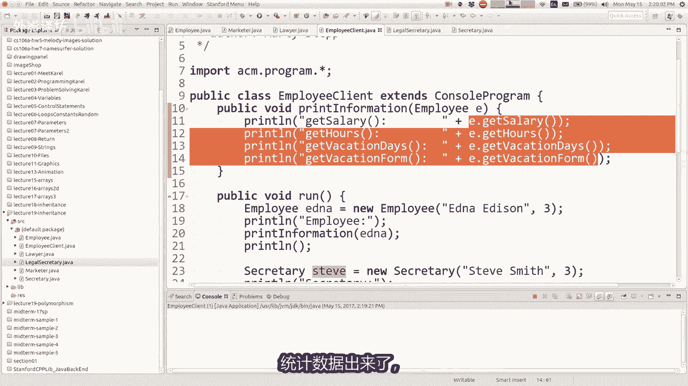