# 【中文配音】斯坦福王牌课程 CS 106a Java教程 2017年春季课程 - P20：20_ Critters - 外影译坊 - BV14U4geNEEq

所以今天是星期三，今天是7号，是的是这周七，是的是的嗯，今天是你的六人的日子，作业要出去了，他将专注于课程和对象和继承，我会讲一个，一分钟前稍微弹一下，我首先想提醒你，我告诉过你。

这周我要去发布一些你可以查找的信息，看看你在课堂上的表现，以及我已经发帖说，现在我正在等待要完成的家庭作业或成绩等等，如果您点击此处的链接，很棒的统计页面，您可以输入你的身份证号码，他会告诉你。

你稍微了解一下你的类型，我们为您存档的乐谱，您进行了哪些检查和检查，优点完成你的作业，得到我们所拥有的关于您迄今为止参与的部分，以及你在期中考试中表现如何，给你一个百分位排名，告诉您相对于您的表现。

其他正在参加课程的学生课程，以及我发布此内容的原因，信息部分是以防万一错了，你可以纠正我们，如果有任何错误可以修复它，但是也只是为了让你知道自己怎么样，这样做，你就可以计划关于你想做的事情的决定。

在很多情况下，你都知道成绩比原来高出好几倍，学生认为他们会成为你所知道的，我之前说过，大约上半部分，全班大约有49或50%，班级将获得A或更好，然后从剩下的人中，我猜猜全班。

接下来30%的学生将得到B到B加，所以你的盘里80%都是A或B，以便在以下情况下可能对你有所帮助，你正在查看那些百分位数，如果你从99岁一直降到20岁，那么你就陷入了A到B的愤怒之中，所以无论如何。

这就是发布的内容，你可以今天晚些时候看看，如果你就像这样，我要做一些事情，今天有点不同，我要去开始我的材料和主题，今天的课是作业六，做什么工作，六动物叫做小动物，我要花掉整个讲座都在谈论它。

我通常不会这样做，我经常根本不谈太多家庭作业，所以这事这事显然是不同的，曾经有一段时间我花了很多钱，谈论其中的时间，是卡罗尔对机器人学已经整整一周了，教机器人，卡罗尔教你java语法。

然后我们做了carol机器人作为我们的作业，那是因为卡罗尔有自己的小世界，你知道我们了解了那个世界，一起这个作业有一个这方面，也有一点，我们学到了一个小世界，关于这两种动物和你的任务，它就在那个世界里。

所以我要教你今天和之后的事，今天的讲座希望你能去得到，每当开始第六个作业，你准备好了，截止日期是从星期五开始的，一周5月26日在这里，所以什么是小动物。

让我跳到我的幻灯片，今天我们要讨论的是小动物，我们的第六份家庭作业和它把你放进这个小二，有模拟器的次元世界，有小动物走来走去，动物被绘制的屏幕移动幅度很小的小角色，四处移动的小文字字符。

这些动物以爪哇为代表代码，作为具有不同类的对象，所以你有一个名为into a class的类，称为鸟，称为狼等类，所以你写这些类描述了这些动物的行为方式，以及然后我把动物放进去模拟器，它们四处走动。

它们它们互相争斗，并寻找食物以及诸如此类的事情，任务将是你知道我会的描述，我希望你做的方式，动物有行为，你必须写下为和对象来实现行为有何不同，动物能做的事有五种各类重大行动。

招聘人员可以做它们可以吃的食物，可以与其他动物打架，color他们有一个双字符串方法，只是他们在屏幕上的外观，他们有能力四处走动，在不同的方向，所以在某些方面，这可能看起来有点像卡罗尔。

因为卡罗尔移动转身走在二维世界中，有一些相似之处，但我想你会发现这是一个代码，有很多不同，会是什么样子，以及你有什么考虑一下这个作业就可以了，当你写一个小动物类时，记住我们已经了解了一些过去一周的继承。

和你将要学习的课程，对于这些不同种类的动物，像蚂蚁，秃鹰和秃鹰等等，在这些课程上都会扩展小动物，你的小动物是我们的一个班级，写在我们的计时代码中，您将扩展并进入小动物内内部吃法，有这些战斗和移动的颜色。

和所有这些不同的东西和你的子类，将编写这些版本方法，重写这些方法表明你想要的行为，具有弗兰克斯的动物类型及其原因，我在上面有这张照片吗，在这里屏蔽这个小图，是因为当动物们的时候，我会谈论这个。

如果发生的话，在屏幕上移动，它们互相碰撞，甲板就像真实的动物一样，王国的权利和我们选择的方式，实施战斗是我们要求每个人，你想咆哮两只动物还是猛扑或抓挠，然后根据两只动物做出的两个选择。

他们中的一个会获胜，并且方式他们决定赢，就像比赛一样，石头剪刀布，你知道岩石是如何刷过的剪刀，这意味着咆哮击败了划痕和剪刀剪纸，这意味着抓伤胜过猛扑，以此类推，这两种动物基鱼三种攻击类型中的哪一种数字。

它们中的一个将击败其他，如果他们使用相同类型的攻击，就像它们都使用划痕，或他们都使用突袭或者其他什么，获胜者将是掷硬币，其中之一会因随机选择而死亡，所以不会重播，无论如何，你都会死。

这些事您在其中编写的方法，这个模拟，所以当你当你下载起始代码，已开始作业六，你会做一点eclipse中名为critters的项目。

你可以打开它，并将其导入，有一些文件是为您提供向小动物主要盒，还有这些其他图形类，以及我们拥有的实用程序类和东西，为你写的，你真的不需要看他们，当你运行项目时，它会弹出控制面板上写着有多大。

你希望生物世界变成什么样子，你想要不同类型的动物在屏幕上，所以你可能会说我只是想要屏幕上的石头，我们给你一个小动物名字，石头石头是很棒的，他们只是坐在那里，他们什么也没做，如果你告诉模拟开始走吧。

什么也没发生，什么也没有真正动起来，这里只是没有任何操作，因为如果你打开代码，石头客，再次我们给了你这个石头延伸的小动物，它的攻击是总是咆哮或石头和石头纸剪刀，它的颜色是灰色，它的字符串是X。

所以如果你看屏幕，你会看到一堆代表石头的灰色SS模拟器，随机挑选了一堆位置，并将石头放入其中位置，所以当你有两个正确的位置时，你将编写自己的小动物类，现在也有这些方法的版本，如果是石头的话。

就是这个我们给你的一个非常简单无聊，但你必须写的可能会更有趣一点，所以让我给你看一个我想要的简单例子，和你们一起写一篇叫法语的斗牛犬，这是爱迪养的狗品种，所以我们就只是闲逛，就这样一分钟。

但你知道当你什么时候，你打开你的项目，你就会有这些类如动物鸟和这些，你打开这些文件的事情，你说他们延长了小动物，好的，现在你在这里写一个或全部，我们告诉你的这五种方法。

像每五个获得颜色一样运行。

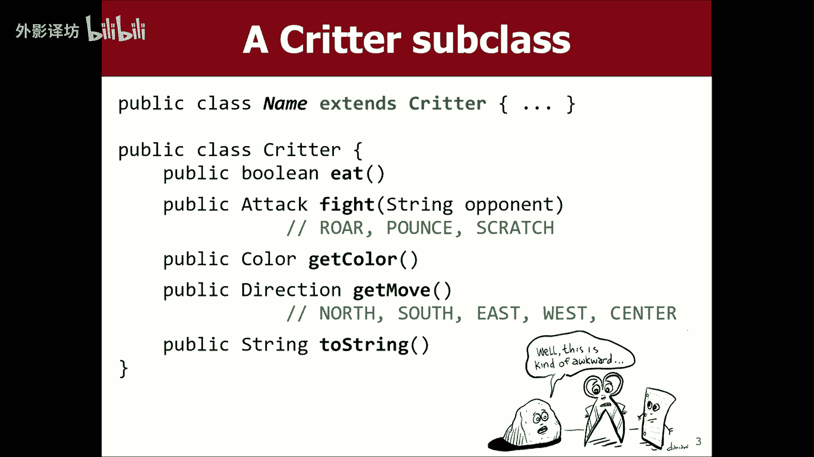

如果你不这样做，现在就转向字符串编写，您仍然可以使用的任何方法，实际上运行你的程序就可以了。

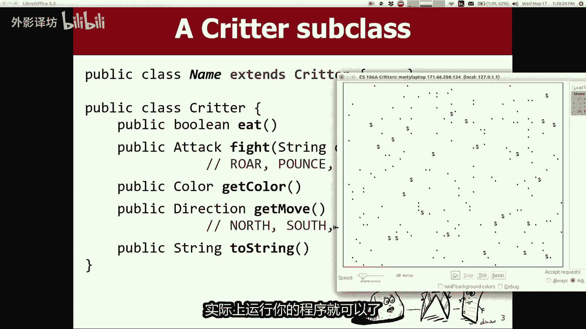

如果我回到这里并保存它，我将内流控，它仍然可以编译，如果我运行它，你现在就会发现，法国斗牛犬是此菜单中的一个选择，法国斗牛犬出现的原因作为一个选择，是因为我说过扩展creator。

其实代码看起来看看你有哪些课程，扩展小动物，并列出所有他们，在这里我会说好，我想要我想要法国斗牛犬，可我想要石头，如果我开始模拟器，法国斗牛犬是有问题的，黑人吗，标记它们是黑色的原因。

问号是因为默认如果您未指定，则为小动物的颜色，颜色为黑色，默认为字符串动物的代表，你没有指定一个，他只是一个问号，所以我完全看到了，没有行为的默认小动物类别指定，如果我说去法国，斗牛犬也不会动做任何事。

所以你的工作当然是替换这个默认的无聊行为，如果是法国人，那就有不同的东西，斗牛犬。

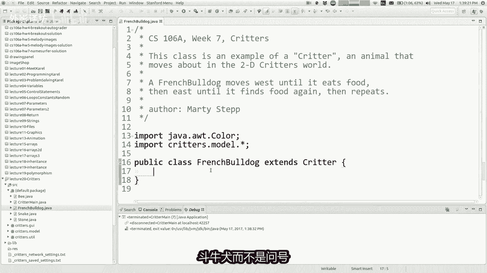

而不是问号，应该是字母A代表B的方式，你所做的就是你写两个string方法，该方法返回一个代表你的动物的字符串。

你回到这里，并说公共字符串串起来，法国斗牛犬会返回字符串A，所以现在模拟器将调用该方法在线课程，并且他会看到，所以如果我再次运行它，你会看到法国斗牛犬屏幕上是D8个字母，现在看到了，所以你可以逐步添加。

这些与你的动物不同的特征，我认为有趣的地方是什么时候。

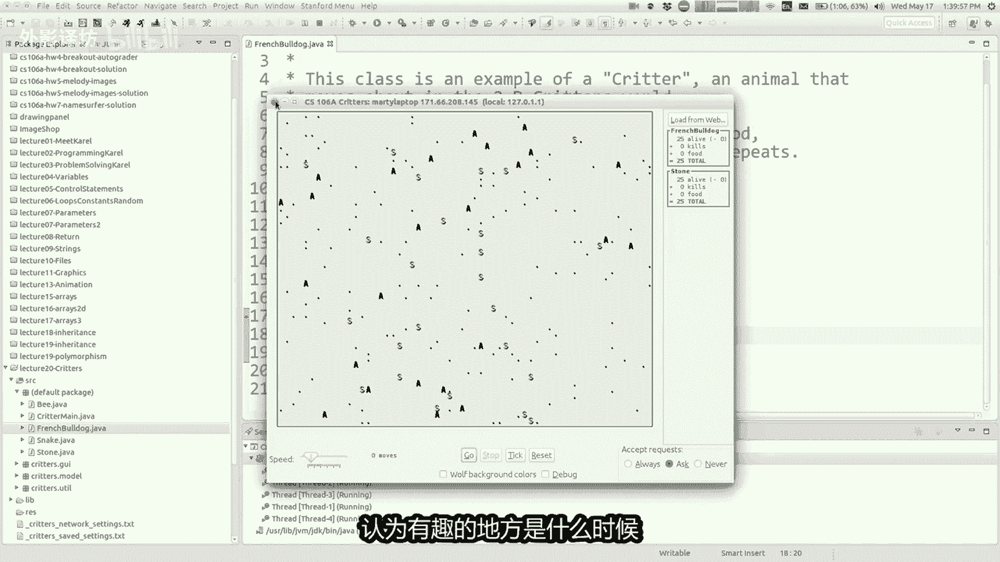

动物们开始四处走动，所以让我们谈谈运动，这里有一个名为public direction get的方法，移动以及该方法的工作方式是，模拟器会询问每个，你想要以哪种方式移动您的动物，我想在你的动物中回归。

忽略它，我想去南方，我想去，如果你不想请向东向西或向中心走，完全移动，模拟七江，然后让你朝那个方向移动，这是一个简单的例子，如果我想要所有法国斗牛犬向左走或向西走。

然后我会走的路，这样做，我会写这个方法，叫公共方向行动起来，我将返回方向，点西方向稀释一个常数，你方向北方向回南等等，这意味着向西移动，每次当我运行时，模拟器我告诉他，我想要法国斗牛犬，当我说走吧。

他们都开始向西移动，向左，如果你仔细看的话，现在可以了，你可能会看到，我认为他已经太晚了，让我重置，让我们找到，我想找一个法国人与石头在同一排的斗牛犬，看看这个艾比要走路。

那样当爱比雨模拟器将要去的那块石头告诉我，其中两个正在与之战斗的人彼此，所以你会看到我按下这个名为勾号的按钮，向前移动一位，但是没有敌人，所以如果我惹恼了大家，移动移位，所以请注意这一点。

这里鼠标光标是勾勾的繁荣，所以艾迪撞到石头死了，欧可怜的他，我一直在睡觉，那就是睡觉了，恩为什么艾比死了，仍然被催眠的，原因是因为当他战斗时，石头会回来，他想要咆哮的人。

但我没有指定法国斗牛犬应该做什么，当他对抗默认值时，执行战斗就是放弃，所以如果你不这样做，覆盖你将永远的行为，如果发生碰撞，就会失败并死亡，和另一种动物在一起是不好的，一位法国斗牛犬和石头。

是目前世界上唯一的公民，我可以瞄准一个策略，会是石头，我总是赢对，如果我知道石头总是会回来咆哮并记住这一点，这就像石头剪刀布对吧，那么我该拿什么来打败咆哮。

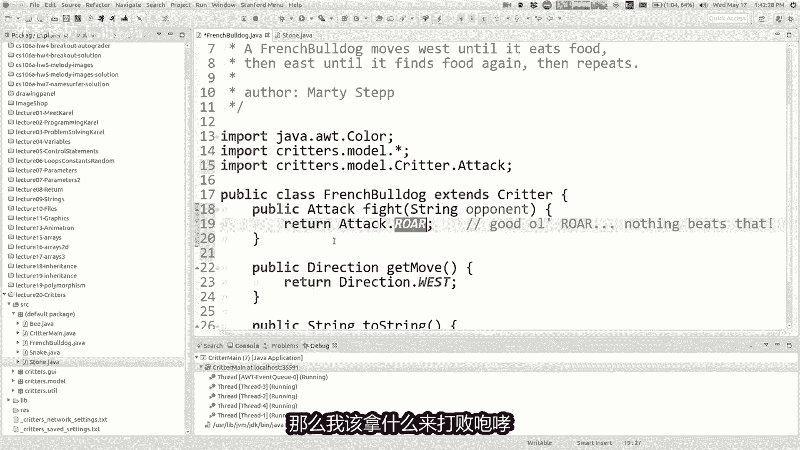

好吧，玩石头剪刀布，当然覆盖岩石是正确的，难道我不知道，我从来不明白说的对，这篇论文怎么样击败石头，无论他如何击败纸张岩石，所以我想猛扑胜过咆哮。

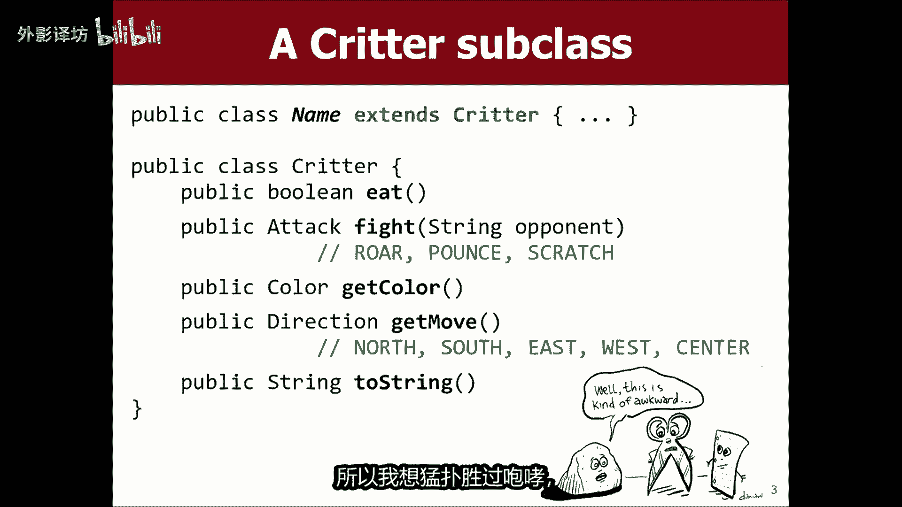

所以如果我让法国斗牛犬总是回来，他的攻击天赋就意味着，如果把国斗牛犬曾经打过架与石头，把国斗牛犬应该打败石头吧，让我们测试一下，当我再次运行这个时，让我们，在屏幕上环顾四周，这是一只法国斗牛犬。

走过去撞到这块石头，如果有效的话，石头应该得到压碎了，所以让我们勾选勾选勾选，滴答滴答滴答滴答来了，AB进入石头BAM现在B获胜好吧，法国斗牛犬赢得了你的战斗，有点明白这里的想法，小动物们互相互动。

其他和你可能会带这些的东西，屏幕上的小点是什么小点，那些是食物，模拟器会随机选择位置，向世界提供少量食物，如果你的动物碰巧行走并着陆，在有实物的广场上，模拟器会问你的动物，你想吃吗，不管现在有没有。

总体来说吃的还是不错的，吃食物是一件好事，所以你可能说是的，我想吃主要的食物，吃食物的缺点是，如果你吃太多的食物，你的动物摔倒了睡一会儿，如果你的动物睡着了，然后另一只动物触碰，如果其他动物立即杀死你。

因为你被发现睡觉了，只是接吻，所以你也很痒，你可能会睡着，并得到很多被引擎抓住，所以大好处，吃是你得分的基础，这里有不同种类的动物，根据数量得分人们的食物，让你的食物。

他们根据管子的数量击败一个金发女郎，觊觎他们有多少物种是活的等等，所以就像有如果这里正在进行生存游戏，你吃的更多是好的，但你可能也冒着死亡的风险好吧，那你怎么办。

注明是否想吃，那么有一个方法叫做public朱莉吃喝模拟器，是否会的想法，问你现在想吃谁，或者不是，你可以返回初用，说是的，如果你回来，我想吃饭，假的，你说我很好，我吃饱了。

所以我可以认出艾比是法国斗牛犬，当你呼唤真正的你时，世界艾比的方法，你想吃掉它吗，每次都返回true，事实上有时候如果我不小心，它也吃他哥哥的食物，所以我知道如果他是的话，他会返回真实为自己写这个方法。

让我现在告诉你，我已经改变了，顺便说一下默认的方法，饮食行为是错误的，甚至从不打石头也不吃，所以如果你看看这里有一个ab和这个一个人，就在一块食物旁边，这是另一个AB，下一个是就在这里一块食物。

所以如果我勾选前进，我相信这个e bi会吃，他们正在吃这些食物，你看到了吗，喜欢，但他有一个小李，因为他们睡了一会哦，看看这两个人找到了彼此恋爱了哦，是因为你知道我是如何告诉你。

如果动物撞到它们就会咬人，两只同种动物碰撞，他们撞丑了，然后生了一个孩子，我们最终不是两个修道院，带着小艾比和大人一起去，艾比和小家伙终于长大了起来，并成为一个大长度，其他的看到小写的A。

过了一段时间就成长为首都，所以这是你可以的另一种方式扩散你的物种，让每个人稍微你知道什么，无性别游戏，因此每种动物都可以交配，和其他动物一起都很酷，无论如何，这里有很多有趣的事情，这小事中发生的小事。

世界这个世界的点合，这项作业的重点是练习写作课，来练习继承和所有的东西，到目前为止，我认为一切都如此，我为你写的方法一直很简单，他们只是喜欢给他们一些不太好的东西，从算法上看很有趣，但我认为更重要的是。

有趣的是你有一点行为有点复杂，所以对于例如让我们做一些事情，总是向西移动，我要爱彼移动三步向西，然后向东三步，然后来回重复3333好吧，如果这是卡罗尔，你会怎样，会做的是你有一个for循环，去了三四。

你会说移动，然后你会转身，然后就这么做，然后你会再做一次正确的进行某种循环，这听起来很像重复某项任务，有一个循环，我现在就告诉你，如果你想写一点便条，今天的讲座重要的是要注意。

你整个过程中不会使用任何循环，家庭作业不会循环，如果你写了一个循环，你做错了，抱歉，摆脱那个循环，现在没有循环，如果我认为我疯了，马蒂你可能会说合同可能解决了这个问题，没有循环，你刚刚告诉我。

你想去向西三步，再三步向东走几步，然后重复如何，我可以很好的完成两个循环吗，了解如何回答。

我想要的确保你明白一点，有关该模拟器如何工作的更多信息，它的运作方式是你需要接受你的代码，不在这个想法中负责这个程序，我的代码启动器代码正在运行，它有图形，我所在的屏幕上有模拟器收费，我是程序。

我有一个循环，就像这样循环所有的动物世界上有哪些，它要求每一个其中之一，你想搬到哪里，动物告诉我，然后我移动动物那样，但如果我负责的话，我是YONA，决定让所有人都搬家，不是你现在说我要搬三个。

你对我说话的步骤，我就是章鱼，所以我们说巴尼，如果你是对面，我要移动三步向西，我想移动三步，吃完我就走了，不我不在乎你，只是因为告诉我一个我不知道的事，不想要六步，我想要胡安娜。

你必须一次告诉我一个动作，如果你心里有一个计划，你想做一个模式或三个动作或六个动作的模式，你就是那个谁必须记住这一点，而你必须记住，除了移动以外，还可以用其他方式来做，我听过不同的类比。

这有点像你在玩一款游戏，例如情绪象棋或游戏家庭不和，或者我们欠一大笔钱，或者类似的东西，你知道轮子幸运的是你转动轮子，然后他们说出你想猜哪个字母，你说有没有S已经在措辞，你知道VA过来了，扭转他们。

但你无法做到说UNSQTAR病毒，再见我单机智力上的涡轮增压器，您只需要做一个字母，你不能选择十个字母一直都是正确的，所以如果你去的话回家，但我想给它们一个轴，突然后是T然后是R那么剩然后你就记得了。

其他的稍后再讲，又轮到你了，告诉我下一个一个权力，所以这个想法喜欢，你需要记住你要玩什么，将来你需要实施一个类似的想法，在这里家庭作业还可以，就像一样，如果你正在玩国际象棋游戏，知道你移动你的棋子。

我移动我的手，现在你可以随心所欲地移动你的棋子，必须采取行动，你必须等待，如果你有一个大计划，我会移动这个移动，这个移动这个这就是我的总体规划，会困住你，但你却做不到所有的动作，但就像他成功了一样。

一次移动一个其余的动作会在你的大脑中上升，所以你怎么记得你现在的事情以后要做什么，我该怎么办，这答案是你必须使用私有的，你的班级要记住状态的字段，你将用它来帮助你制作未来移动私人领域，如此挖如何。

你这样做吗，你实际上做了什么，在这里。

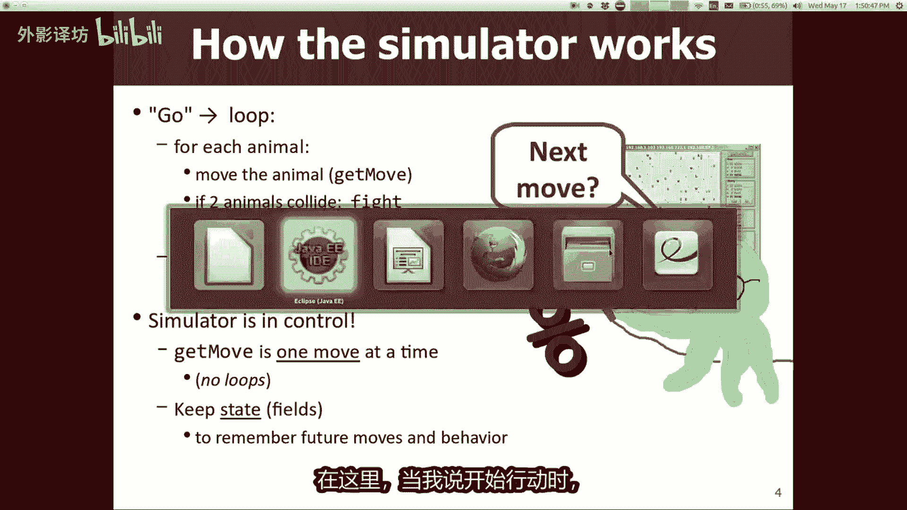

当我说开始行动时，就是这样，模拟器要求你移动，你可以返回任何你能返回的东西，即便你可以返回终点，我会搬家，你那样做，但在你这样做之前，你可以在这里做一些其他代码，来尝试为未来的动作设置一些记忆。

你将来会做的，所以这里有一个，例如，如果我创建一个私有int会怎样，这个int被称为移动技术，计算第一个动作总共有多少部，斗牛犬的生活总体还不错，当你有的时候，我曾经做过的动作，通常您初始化的私有字段。

它在构造函数中的值等级，就像法国斗牛犬一样诞生并添加到屏幕上的，你初始化所有私有变量，那一刻，你会写一个构造函数，称为法国斗牛犬，这里我应该初始化移动技术，当法国斗牛犬首次添加到筛选，需要支付多少动作。

您对他还没有做出任何，所以开始如果我要回来的话，动作为零，我要向西移动或移动到任何地方，每次模拟器你都说好，这对我来说，这时我又做了一个动作，现在就进入我的生活，所以你可能会说好吧，我们向西走。

但记住这一点，我现在又搬家了一次，当您再次调用此命令时，可以移动一次，再次向西移动，现在我也移动了，唯一的利润几乎是一种权利，我认为这里的一个问题是，你不能回来后做某事退出，这是你做的最后一件事。

实际上我需要翻转顺序，这些只是移动一次，两次我们已经快到了，但现在我们可以了，数一下我们做了多少步，可以用来帮助我们实现这个走三走三，走三走三类型，这里的行为你明白吗，我可以妈妈在上面吗，我怎么能。

我怎么能让他们在入口处向左走，三，现在，是的，听起来不错，他说嗯用一个give if语句，并查看是否有根技术，并使用mod，看看是否是这样，如果我去了三或六或类似的地方，那所以问题是我该做什么。

我要寻找什么，所以我想如果我如果移动系数为一或if是二，或者如果是三，那么我想去右膝，或者如果是四五或六，我想要去东方很棒，所以如果是你的话，也许就是你说的mod说我要修改什么或是测试。

就像我认为我们正在，有时我们想做正确的事情，想要向西走，如果有东西向西走，其他条件下向东走，不抱歉，错了，向东走吧没错，所以你说MAD我喜欢你，你可以帮我填写吗，在这里你知道你不确定，我想很高兴。

你知道你所知道的，我们如果我们不确定应该这样做，尝试一些东西，但它不起作用，我们会改一下吧，先给我一次，我们会运行，它，只要给我有些东西让你处于前面的位置，每个人的，帽三如果冒三为零向西走轻松走。

我们可以尝试继续，我们将要拥有的写很多这些，其中大部分你必须调整它们并运行它们，调整它们并运行它们，我想我喜欢这个的一件事，作业是你可以写一点更多，并对其进行更多测试，尝试一下，您可以在屏幕上看到它。

无论这是否正确，如果此举，count m3为零向西，否则向东，我要点击这个勾号按钮，只需单独观看路线即可观看，小选一个特定的AB，然后喜欢看他做了什么，基本上让我们看一下这个，所以首先移动咚咚起咚咚。

西东东西，所以我有点获得重复模式，但我认为这句话说的是，每一个第三步应该去西方，其他的应该去东边，但是这是一个很好的开始，我喜欢开始顺利，有人可以给我调整一下吗，也许尝试让这三个人去西和三是的第六批。

如果模六小于三就可以，向西走，否则向东走好吧，那可能是好吧，我们试试吧，所以我就看这个，是的，我无法在屏幕上绘图，鼠标就在这里，是我会看的，所以他西西东东东西西，西东东东西西西东。

这就像非常非常非常接近完美，是我唯一挑剔的地方，会使得他以两个开始西方，然后他就好像消失了，一开始就是一个，然后就是变成了完美的模式，所以那就是超级超级接近正确，怎么办。

我们让它像完美的三X3DSS一样，是的，好吧，也许我会先做if if，首先进行检查，因为我认为像零一与二，然后三四你说的是对的，只是我们首先将其从零更改为一，这样就可以了，一二，然后是345。

然后他去了012345，你知道我的意思是我们锁定为零一，我想这是唯一的事情，我们必须增加移动次数，祝福这两个地方一点点多余，但我认为将修复整体运动的类型，这里的模式让我们尝试一下，然后选择一个。

特别是像这个就在这里，所以当我去的时候，它会向西走，西西东东东西西西咚咚咚，所以现在差不多了，当你写一个小动物时，无论如何都要工作，会有一个这样的过程，你必须经过你所在的地方说。

你想让我抱怨这个的特定行为模式，任何我喜欢的运动，记住正确的变量，田地以便动物拥有行为，这很棘手，我想你可以经常从这样的事情开始，我要数一下动作，然后每隔这么多的动作，我就会去这样或那样。

但事实并非如此，为每一个动作而努力，你可能会看到的模式，所以我想把剩下的时间都花在演讲写作上，一些不同的小动物和试图弄清楚什么是私人的，我们需要的变量，我们如何实现这些动物需要的行为。

到目前为止你们有吗，关于这里发生的一切的问题，关于这些不同的生物和任何，到目前为止，我们向您展示的代码是的，我们将每个创造者值，我想要意思是，就像他们都在这里一样，一切都很好。

所以有时像我这些方法中的任何一种一样，战斗可以指定任何类型的行为，我想要这样的，是的，他们都包装好，一直以来，但我可能会对你说的话，如果法国斗牛犬从未有过，在此之前，他应该抓到任何食物，20自打架。

但如果他之前吃过东西已经满了，他打架的时候应该咆哮，所以现在你必须有私有变量，让他这么做，也是我想做的一件事，明确你是否知道其中的一部分，这项任务的重点是玩弄对象和类以及，当然我们在这里上课和刺激物。

在这里我们有私人字段构造函数和方法，以及所有这些好事，但我有一件事希望你记住的是，如果你读过我的模拟器，将法国斗牛犬课程制作25种，不同的法国斗牛犬物品，在屏幕上的每一个对象具有相对于的不同状态。

另一种就像我告诉你的那样，饥饿的法国斗牛犬需要抓挠那些吃饱了的，需要咆哮好吧，如果有25只可打印的狗，那么我们开始绕着其中一些走，会吃东西，其中一些人味没吃过，所以感觉不一样。

相同类型的对象将表现出在同一时刻，以不同的方式如此，这是对象和类的一部分，如果我说我有移动次数或数一下我吃了多少次，或者每一个都是这样的，每个法国人的那些小东西，其中25个斗牛犬浆拥有该变量自己的副本。

并且这个变量的值可能是与某人的价值不同，那个变量你已经吃了四次了，还没吃过，所以我要去行为方式与你的行为方式不同，表现的就是每个对象的想法，有一个语句类的副本，所以我们正在实践这个概念，无论如何。

在这个作业中，这是我们现在所处的位置，就是这样一个问题，是还有其他问题吗，迄今为止，关于所有更伟大的问题，自己。

这张章鱼的图画，我的好朋友维多利亚很久以前就画过他，他是我在另一所学校的助教，我曾经教过他，他非常好使用，像illustrator和PHOTOSHOP等，我就像维多利亚一样，我想画像陨石坑模拟器的图片。

但我想不出如何画他，他走了来吧，章鱼我就想为什么他进展顺利，这只是技术问题，但踏实就像伸手拖动所有动物并继续前进，我就是这样，听起来很酷，你能给我画一个涂鸦吗，动物模拟器旁边的章鱼，他去这里我去。

为什么他只有四条腿，他说的有点乱，但我喜欢，但这就像一个四胞胎，但不是章鱼错了，但他坚持这样看起来更可爱，所以她也许是对的，他比我更了解，嗯好吧，让我继续前进，这是一个规范，法国斗牛犬总是吃货。

无论如何，这是一个例子，法语版本略有不同，ODOG我想尝试实现一些你们的这种行为，所以看看上面写着什么，忘记颜色了，这是颜色，我想让我们读法语，斗牛犬一开始是白色的，如果他们以前从未打过架。

但是如果他们打过架，他们应该红了他们的余生好吧，那么我们怎样才能做得好呢。

我们写的方法已得到颜色，所以我可以回到法国斗牛犬档案，我们没有获取颜色的方法，所以我们可以写一个叫做公共色彩获取颜色，并再次说明它的内容，白色，如果他们从未战斗过偶你GSD，然后阅读他们是否有权利。

那么我怎么知道法国斗牛犬是否曾经跌倒过，所以我知道是否要跌倒，返回白色或红色，给予一些东西返回颜色白色，否则返回，颜色点红色，所以我知道在磁盘上该做什么，后面有什么建议式的，好吧。

通常当我有任何事情的时候，小动物的问题我怎样才能完全空白，答案是你应该你说我需要做一个正确的领域，创建一个你说的正确的字段，字段，我应该将其设置为布尔值，我是否曾经参与过的价值，先打架好吧。

我们私下做吧，布尔坏蛋，你其实是坏蛋，我不想鼓励暴力，你知道我认为我可能很糟糕，不知道我不是一个很好的领域名字，但是刚刚打过怎么样，你以前打过仗，当法国人斗牛犬第一次出生，应该将其设置为false。

是什么嗯，他会在哪里与任何人战斗，改为不满，斗法中的共济失调下，如果我和我曾经打过架的人打架，现在就这样怎么样了，在这里你可能会说的很好，但是如果我输了怎么办，如果我赢了有什么关系吗。

或者如果我输了则失去罚款，没关系，我死了，我最后的记忆将像冰一样，粒子穿过它并不重要，嗯你赢与否，让我们记住你有错，所以我认为这有助于在这里回答，决定返回什么颜色，如果变量存储是false。

我应该说为什么我的颜色如果是的，我应该说红色是我的颜色，我喜欢写，而不是等颜，如果我没有想到你不知道的话，就不会反转布尔值，所以如果我有没有想过和白，如果我曾经战斗过，我是红的，所以让我们尝试一下。

让我们尝试一下，让我们挑选一下，并让你注意到那里，现在白色有点难，看看吧，不过没关系，这是一个注定要战斗的AB，我们用一块石头把它装好，这样碍彼的会赢得战斗，因为他们不再咆哮，而是猛扑。

所以让我们继续看看，AB是否因嗜血复仇而变红，繁荣式的接受你这个愚蠢的摇滚哈哈，所以让我们看看是否还有其他的变红了，我想这是唯一的，其他人在下面看到，在底部就在那里，他们正在扭动，现在这样。

他们就必须是靠近他们生来寻找的石头，战斗的石头，但他们在那里实施了这种行为，所以我认为所有这些规范上的行为。

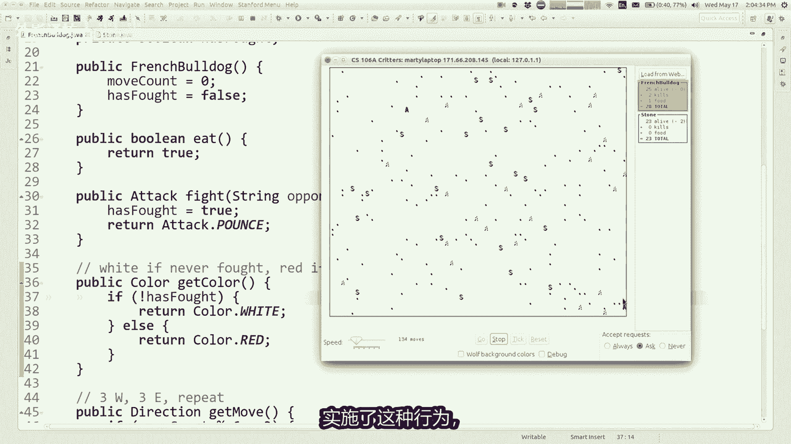

相当于比如什么领域，我记得够多吗，关于这个物体的东西，比如时间，所以我可以实现规范的行为，是在告诉我要亲密一点好吗，我想看看这个想法稍微复杂一点哦，这张幻灯片有点建议，你可能会用一些东西来表示什么。

您需要计算的私人区域，你吃过的好东西，你宝贝什么都吃，进入插槽，然后不进入网络计数器，我想这里有很多学生公共同的，我要停止一切，有时正是如此，你想要什么，有时你需要一个，仅此而已。

所以这不仅仅是关于技术和加上祝福之类的，也许你需要记住你已经做过的事情，最近完成的你的背影，最后是什么，我们对抗的动物等等吧，所以这只是一些一般性的事情，可能想考虑一下我想从事哪些领域，你可以看看。

稍后再讲，所以我想这样做一个叫舌这个事，大多数方法都比较棘手，动作不是很难，就像以扩大的模式滑落好的，所以我喜欢和你们一起工作，嗯这些我会为你做最困难的部分。

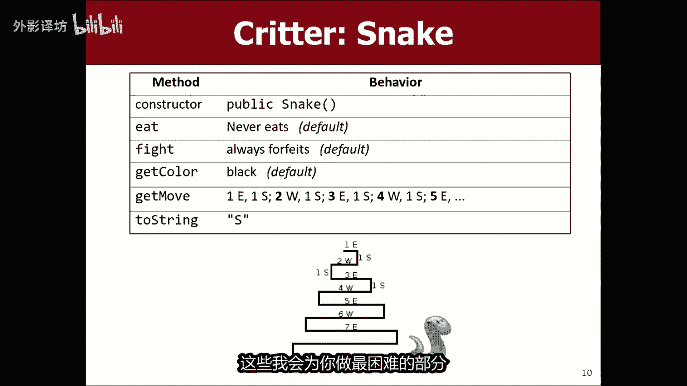

如果我走了，将为你做最困难的部分，回到模拟器，这里有一个蛇类，蛇延伸小动物好吧。

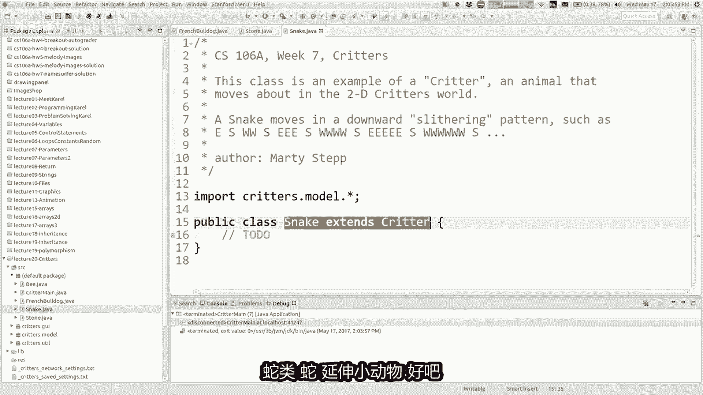

所以我要指出的一件事是，食物吃是默认的，战斗为默认值，颜色为黑色，这是默认的，所以我只想不想写，每一个，如果你想要的话，可以使用这些方法之一，您不必编写默认行为，你可以把这个方法省略掉。

所以我想把重点放在移动和串，如此公开极端串，我将为蛇返回S现在公共方向行动起来，这是哪里，你进来吧，我为你做的最难的部分，所以你必须再次移动蛇，让我在他移动的屏幕上弹出。

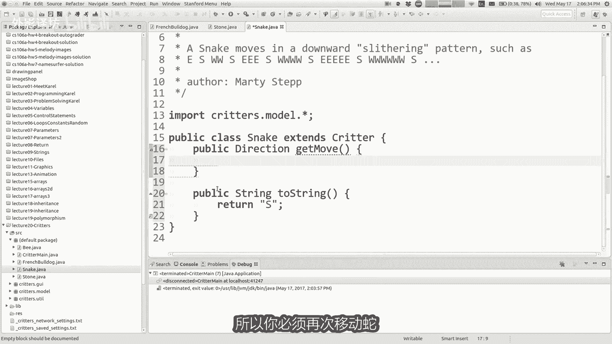

就像这样，如果你移动就会被阻止，让我们举起PCC来得到它扩大水平运行，我该如何实现如此复杂的运动行为，你有什么看法想法，我只是想要一些想法，你知道我们可能会随着我们的进展改变它很多。

我可能需要记住的一段状态，是的，我上次是去西边还是东边好吧，这是一个很好的观点，为什么我需要记住这一点好吧，因为我要去，将这个方向翻转回来，向前，就像我要横向走一样，需要记住我要走哪条路，现在是的。

我想了很多，你可以采取哪些方法来处理这些类型的问题，问题，我有时这样做的一种方法，学生们，我有点玩这个游戏，就像我是一条蛇，我需要弄清楚找出移动的方向，或者你需要弄清楚我应该以哪种方式移动。

你可以问我任何你想问的问题，我来回答，你想问什么问题，想问我，我安全吗，你可以走了，我的下一步行动应该是什么时间，你会问我一些事情吗，出去，显然你们不喜欢说话，蛇不想吃法力强大的舌头，我可以翻译你。

如有必要可以使用原始英语，你想问什么问题，你想知道什么，告诉你朝哪个方向移动似的，好吧好吧，所以你说我要走了，如果mod2为零，我有点想以猫的二向西移动一，我要去东方，我认为这真的是很好的。

观察差不多了，与他所说的有关，就像我一样，需要知道我是否要去在蛇的这一点上，向西或向东生活是对的，就像这样，我应该记住字母W86吗，我应该记住字母E作为字符串，我可以编织某种东西，A元奇数或偶数。

就像有很多我认为正确做到这一点的方法，不仅我需要记住吗，向西走还是我现在正在向西走，还是东边，我还需要知道有多远，我需要走的空间长度，这样你就明白我的意思了，就像我一样，想到这里有趣的事情。

就是看这个1234567这些水平运行，有一个给定的链接。

他们是对的，所以我认为这是一个很好的部分，蛇要记住的状态是喜欢水瓶或水平，怎么样运行链接，所以这就是这样一个很棒的任务，喜欢发表评论，解释一下你的字段到底是什么，因为这样的长度就是蛇正在水平运行。

立即制作，就像当时一样，蛇最初形成时应该是什么。

length的初始长度是多少，水平运动它会移动一，对然后我应该改变它，到两个以后。

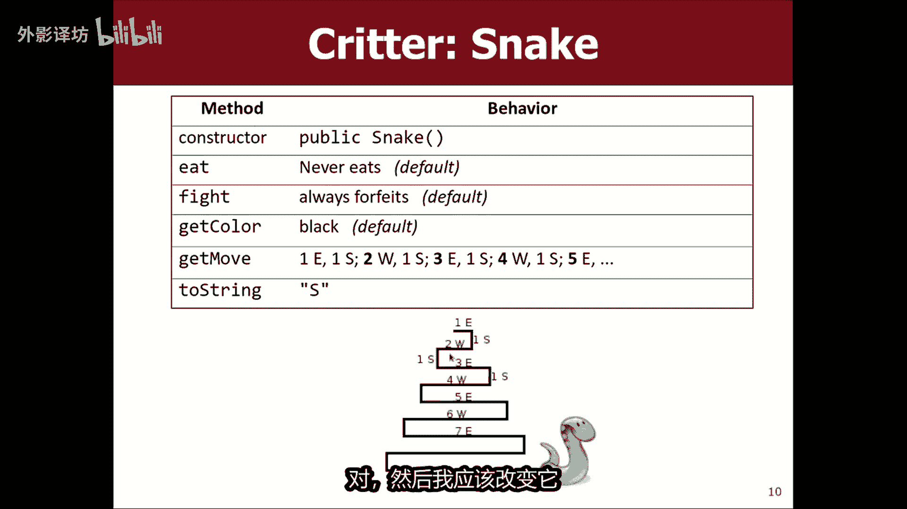

我应该把它改为三个456，所以我认为最初水平运行长度是可以的，但是现在有一个问题，就像我一样水平走还是我走垂直，因为我有点走那么远，然后我就走了，然后我走另一条路，然后我往下走，我该如何跟踪类似的情况。

我们学到了我的进展顺利，在我们跟法国人学习之前，斗牛犬你可以正确计算移动次数，我可以做到这一点，我可以做一个私人盒，最初的移动技术我没有移动，所以我的举动算零，好吧好吧，如果我现在在这里移动技术加加。

记住我要写下来，我认为这很有帮助，评论是运动的模式，所以就像如果你想想想的话，这样第一步就是向东，第二次移动是向南，第三次移动式，第四个或西边到第五个，本身明白是这样。

所以我如果我的举动可以做类似的事情，如果是两趟，则向东算一趟，南边我不想写出来，虽然因为他会保留，随着时间的推移，我已经有100万了，点击这里的陈述，我们错过了什么，是的，确保你可以确定最后的方向。

最后可以说四人方向，方向，然后最初我还没有，去了任何方向，所以我可以说now这意味着什么，或者我可以写方向点中心，这意味着我没有洞，或者你可以这样做，没关系，我想有时你会来，有多种方法可以得到同一目标。

基本上没问题，有时是这样，很难看出如何开始，但是有时如果你跳到中间，一切都可以更容易，比如这样看，如果运行的话会怎么样，长度大约是七，所以现在我们已经完成了，它要去的地方，就像我们一样，就像在这一点上。

运动包现在还好，所以我想什么想想他的事是有用的，这些快的运动如东部和南边，就是西边和南边的一大块，那是东部和南部的一块快，所以就像他经历了这些扫过，然后下降，然后考虑到特朗普，他有点像重置。

在某种程度上，你知道我的意思，我会像他一样描述它，那么它就横向移动了这么多，向南移动，然后它就下降了嗯，那么我们就得让他这么做，那，如果我处于运动的这个阶段，我会做七东，然后是听起来不错，七东怎么说。

后面跟着一个单元格，忘记那些之前会发生什么，东中心七个声音，是的，是的，我认为这是正确的想法，我要删除大约七次东蛋，不是我不说气，我想要说，无论我的朗姆酒长度是多少，我都可以跑。

想要返回横向方向回来很多次，所以向右返回，但是，好的，如果游程长度在，则并不总是东下一次水平跑步，我要去西方，现在你之前提到过，如果是如果是七点，那么六点就是西边，至少如果是八的话。

那就是你喜欢的谈论了模组二，所以我认为嗯嗯我现在处于水平运行状态，在横向移动的过程中，知道我使用该模组的哪些方面，你提到的技巧，所以我会说就像水平运行一样，如果它是偶数，则长度座右铭为零。

像六这样的数字是西方四是西，二是西，所以如果水平游程长度M2为零，我会回来看看，轮到我们了，方向点西，否则我将返回方向点向东向右，这就是你的样子嗯，否则如果我的移动技术不适怎么办。

比我认为实际上只是为了我是否应该真正提出，应该小于或等于一位，比如动作1~7，或者无论应该在东边还是右边，它不小于或等于长度错误是什么意思，这个我的状态，是的，撒哈加向南意味着结束了和我想象的一样。

横向移动，横向走，所以只向南走一次，是的，如果我在这的话，我就是完成水平跑向南，那么返回方向点难，但是，记住返回是你做的最后一件事，也许在我之前曾经做过某种方法向南走，我应该记得美国宇航局的削减。

完成了黑色水平运行，我已经去了南方，我将不得不在此之后开始另一次水平运行，你明白我是怎么记住的吗，我必须将这些字段修改为，请记住，在某种程度上是的，先生什么，你做的事加上加上，所以这样。

消灭从我的举动开始计算，我的举动技术更像是我的移动技术，其中之一中的这些快之一扫描重新开始，并加一我需要的水平链接，去未来，然后整个转向东怎么样，与以此为代表的西方，我改变了游程长度的事实。

加上你的想法，这是个好主意，关于more的，意味着下一个水平运行会走向相反的方向，我当前的方向刚刚开始，所以我觉得这真的很难，当你刚刚掌握窍门时，这样写一段代码让它发挥作用，需要很多人的喜欢。

false在你运行的地方开始，但它没有做正确的事，你必须调整它等等，但我认为这实现了行为正确，让我们测试一下，看看我们有最后一个方向查嗯，想想我们知道的最后一个方向的想法，有点隐含的是。

最后一个方向是因为我们的移动计数器，如果我们的移动量少于这么多，我们知道最后一个方向是步骤水平方向，如果你认识你，我知道我的意思是，就像我们有时你不知道，必须从字面上存储一些东西能够记住。

或根据你的事情推断出一些东西确实存储了，所以让我再次运行这个现在我们有能力启用蛇，我要关掉石头河，法国斗牛犬，让我真的可以专注于蛇，它们就在那里，现在让我们看看记住我是否做到了，是的。

应该去看看这里的列表是东南西西南，我们来试试吧，东南东南，你知道我可以，因为他们把这个变成了七好吧，初始游程长度是一个没有说的，让我们再试一次好吗，与蛇一起奔跑，我们向东走，西南西东南东东西南西西西南。

所以我认为我们已经做到了，我们做到了，这很难像我说的那样做，让我告诉你一些快速的事情，我只有一个，还剩几分钟课，我会快点送你到这个世界去，问题是，如果你想要花几个小时来做这件事，需要更多练习的作业。

视力并回答更多问题，明天的时间是发布在班级首页网站，明天星期四是的时间，为这对家庭作业的功能内置于模拟器，可能会帮助你，如果你的代码不能正常工作，有一个按钮我一直在使用这个按钮，称为皮向前移动ea。

很多学生只是说走吧，就像一切都在飞来飞去，并且艰难看看到底发生了什么，当你调试它时，使用刻度按钮移动的更慢，这样你就可以真正注意另一件事是有一个，如果您打开该按钮，则称为调试。

它将突出显示我要移动它加火，然后他就会感动它，然后当它移动它时，它会打印一些调试信息，放入剪辑中，告知你可能知道发生了什么，告诉人们你可以做的另一件事是，如果你想知道。

为什么你的变量有一个你没有的奇怪值，期待我昨天告诉你一个命令，或星期一调用system out print，在我的移动，如果你写的话，技术就是移动技术，当你的文件中出现这些形式，你运行程序。

你可以看到屏幕上打印出消息控制台式的，我们知道我想我打破了他。

我刚刚关闭了剪辑，所以你必须相信我的话，但是system out print型很好，调试工具来弄清楚是什么，不管怎样，我已经出去了，祝您度过愉快的一天。

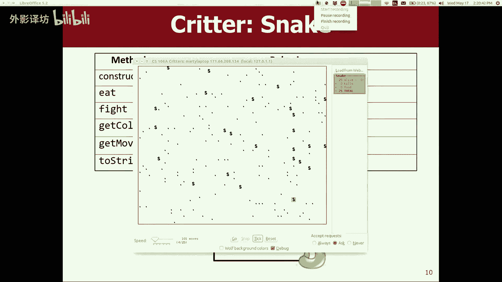