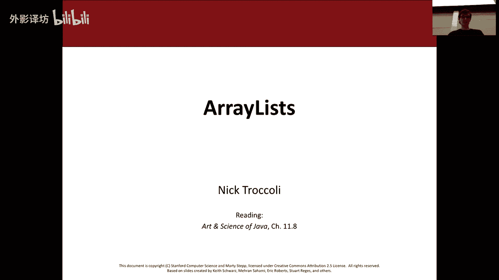
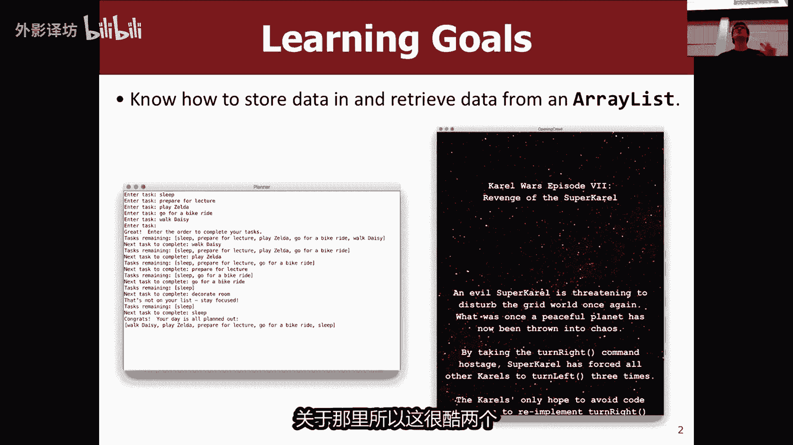
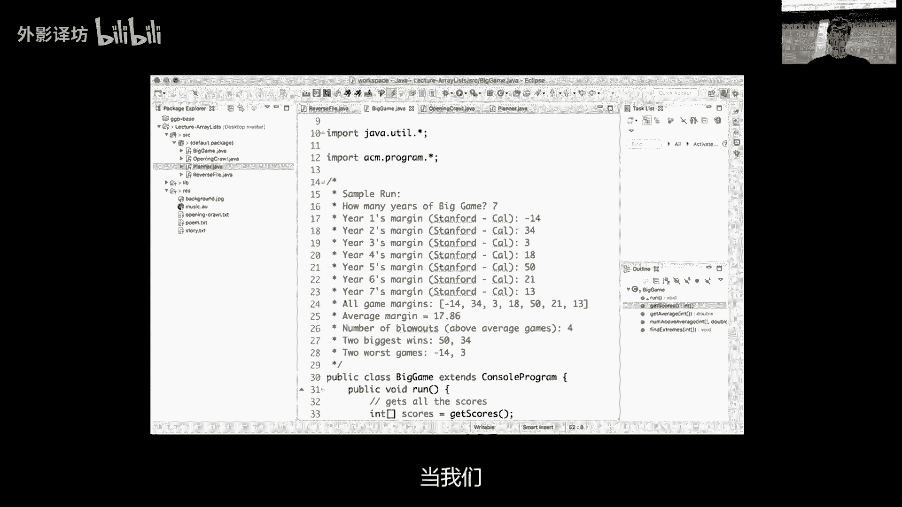
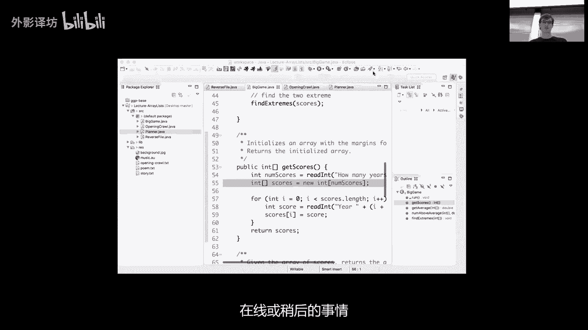
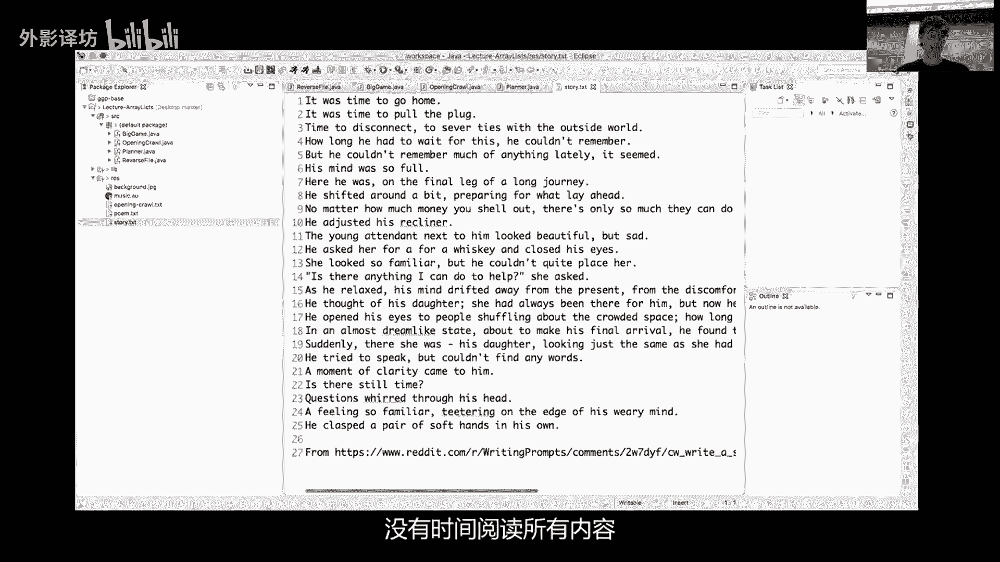
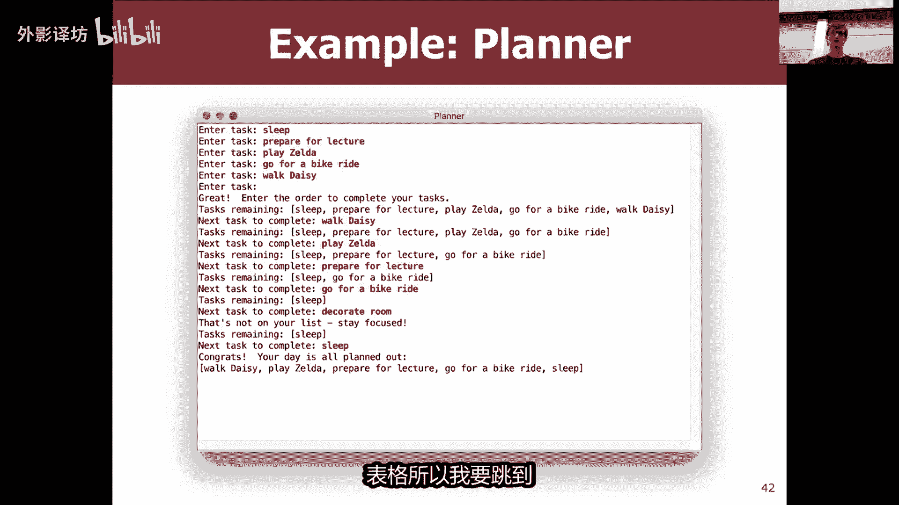
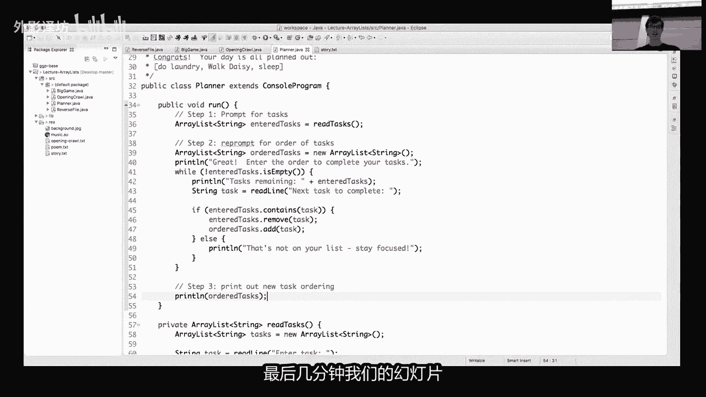
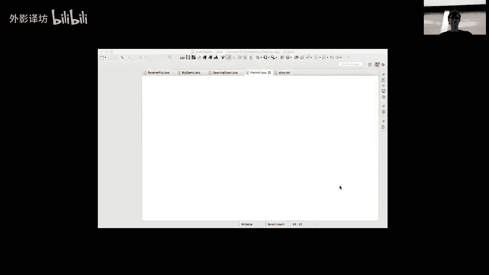

# 【中文配音】斯坦福王牌课程 CS 106a Java教程 2017年春季课程 - P21：21_ ArrayLists - 外影译坊 - BV14U4geNEEq

好吧让我们开始吧，我们有一个非常今天特邀嘉宾，我不说话，关于我，厄玛蒂让马蒂瓦萨惩罚玛塔得到了修复，是的，所以他饿，他今天是狗，是的我是你会一直打电话给他，大家不用担心她，她很可爱，无论如何。

你可以过来跟艾迪打个招呼，讲座结束后，如果你愿意的话，马蒂可以得到，今天我显然会继续写博客那边的一个角落，所以今天我们将谈论一个非常酷的话题，这是一个半径，所以数组列表示我们的另一个新的可变大小。

显然将被介绍给ABBY，不喜欢array list，我今天早上问他，已经说他想要的是他说的不在乎，反正没关系，所以今天在我们开始之前很酷的话题，有没有任何行政货，关于任何事情的后勤问题都可以。

今天是星期五，这个周末磨砂有人会去吗，是啊好吧，让我们跳过去。

就在今天的学习目标只有一个，知道如何存储并检索ARRELEASE中的数据，可能会问ARRELEASE是什么，稍等一下就可以做到这一点，让您先睹为快，我们将为您提供的今天结束时。

我们要去超级超级酷的程序之一，一个可以帮助您的日程计划，程序按照你想要的顺序重新排列任务，接受他们另一个很棒，开场之星的精彩模拟，所有人的战争就像短信电话一样，屏幕如果你们知道我在说什么，关于那里。

所以这很酷，两个你以前可以做的事情。

但是一旦你到达ARRELEASE，你就会看到他们没有忘记，好吧，今天我们有一个快速计划，首先快速回顾一下加薪的原因是夹心和半径，我们有很多共同点，跳转到array list的值，将通过几个例子。

然后我们要后退一步一点点，并谈论比较合数组和ARRELEASE的对比，因为他们确实有很多，如果我们有时间的话，我们会发现相似之处，到你知道的，将代码打开部落我们自己，否则我们只是将要走过。

它有点像我们都可以的剪辑，就这么跳进狂欢吧，希望你们都很熟悉，使用阵列作为技术，使您图像预示着那些喜欢听的人生日快乐，就像十个八度一样，有人尝试检查你的听力损失，他想能有多高，你走了，希望你很漂亮。

熟悉比赛，但只是友善回顾并回顾灵感，正如你所说，移动到array list，记录一个AH是上演一个可变的事件，代表你访问的项目列表，这些项目按特定索引排列数组，你可以在app中有很多东西。

你访问数组中的哪个元素，你像索引一样行走，然后你可以将任何单一类型的项目存储在数组，所以我们说光线是同志，因为你不会说它所排序的内容，仅适用于该人事物的类型，但你想要一个财团不稳定代表，无论如何。

我们看到了非常酷的节目，实际展示了，如果你还记得我真正的时候在讲述数组时。

我们看到了漂亮的很酷的程序，我实际上是在问将跳回eclipse并运行它。

是的好的跳线家好的。

所以我要去啧，只是运行我们的大型游戏程序，看过之前的大型比赛，如果你还记得的话，如果可以的话，他一开始做了什么，把这个弄大一点是吗，问你玩了多少年大型游戏，如果他们刺上，你，就想进入稍后的获胜幅度。

或输给不同的大型比赛，所以我们会说像五个，然后他会问，就像你唯一能原谅的就是你知道20是的，也许明年就会失去，有时候这些都不是很好的，足球数字确定为20，已获得共识货，不管怎样，也许三个，然后七个。

然后他会告诉你喜欢所有游戏，margin会告诉你一些很酷的统计数据，类似的事情，但如果你注意到一个这样做的局限性，在于你必须告诉程序多少年，在开始之前你要输入你必须说的像我一样，仅供参考。

我将输入五个数字，然后他会要求你提供那500个，所以这是一种静态，他必须知道如何你要提前查询的许多号码，原因是如果我跳回游戏，原因是当我们存储我们必须创建的分数数组。

这是在这里完成的，我们说你想要多少年开始，然后我们创建一个新数组右侧，所以这是突出显示的一个我们遇到的限制，数组的一点是数组是静态尺寸，您必须适合尺寸，当你创建它时，以及一旦你创建，你无法更改它。

所以如果用户实际上想参加体育运动，而不是五个，那么你就知道不是他们真的很容易做到这一点，因为数组已分配size文件，所以这是限制之一，另一个我要跳回来尝试使用上面的屏幕，最后一点不是。

所以我要去跳回到这里，人们在观看。

再现或稍后的事情。

好吧，我们的限制之一是，谈到的是这个尺寸必须是创建时指定，您不能添加删除器，在事实中插入元素，并且也没有海军方法，搜索数组是否包含你看到的元素，如果你想的话，打印出一个数组，你必须使用屏幕右侧的凸起点。

你知道这是一种特别奇怪的方法，你必须要用打印出一个数组，所以初蕊没有做很多事情，你需要做很多体力劳动，所以有一些限制，这些限制正是这样的，array list解决的问题。

转换到数组数组列表式与纳斯加薪完全相同，表示列表的变量类型，您可以访问其中的各个项目，一个ARRELEASE，或者我想我应该说ARRELEASE按索引正确，所以你们认识某人的网络。

它存储了一个单一类型的对象，你会注意到单词对象以粗体显示，我们将看到稍后再谈，而release的局限性之一是，这里真的没有完美的世界，就像你存储单一类型的东西一样，就像它的价格一样，但这是我们得到的酷。

你的背诵者哦，我想我不是唯一一个认为这很简单，所以我刚刚真正投入其中，看起来很酷，所以你可以调整大小来添加或删除他们的东西，太棒了，就像从束缚阵中解放出来，您必须在其中指定练习。

所以你可以添加或删除回收站，可以移动元素的元素，你可以在中间插入元素，它会扩展它非常酷，他们会做一些例子，而release有一些帮助搜索方法，你知道ARRELIST就在其中，以不同的方式操纵他们。

这些都是你可以使用的很酷的方法，就像你一样落在RVA名单上，习惯了落入你的XD水平，所以话不多说，让我们来谈谈我们的第一个ARRELEASE，所以这就是你的制作方式，你说的ARRELEASE变量。

而relist字符串我的数组，这等于新的array list字符串，一个警告是，你必须导入java ual star，才能得到访问这个漂亮的东西，所以我会使用作为最后的手段，那又怎样呢。

这里发生的第一件事是，显然你必须说，你是使aria list成为我们现在的类型，有这个奇怪的角度，在单词release后面加上括号，并且这就是天王星将要处理的物品类型存储。

就像或您所在的数组必须提前指定类型，必须指定运行类型或再次列出，但语法是只是有点不同，而不是说类型括号，你说的括号而release，然后设置里面的类型，写脚文胸就是您指定的类型，你的变量无论你想要什么。

以我的ARRELIST为例，然后你就得到了与您用于制作的语法相同，你说的新对象等于新的ARRELEASE，然后你必须匹配在另一侧介入，并遵循通过括号，基本这是术后的，现在对此的一个警告是这是这样的。

这本书做到了，还有一个替代形式，就这样在你不具备的地方具有同等功能，必须将类型放在右侧，你可以把类型放在左边一边，他只会说new arrelease，表示这些任意方式都是等价的，这本书是这样做的。

但那是你也可以使用交心的标准好吧，所以他们都很丑好吧，那就是我们如何制作ARRELEASE，你和大家一样，是的，这有点酷，但是能做什么呢，我们用它来做，所以当你做一个新的ARRELEASE。

意味它可以调整大小，请注意，当我们没有指定尺寸时，已创建一个这样的大小，实际上开始时空是领，我完全是粘贴，准备就绪，就像我准备好了一样，我已准备好添加元素，现在您将请注意。

如果您创建一个包含五个的数组零，就像我不太有用一样，因为你不能给我添加任何东西，所以与此不同的是，这在这里非常有用，因为我们可以稍后添加东西，所以我们将一个新的ARRELIST设为空。

并且那么如果你想添加一个元素，我们在ARRELIST上使用这个I的方法，在这种情况下，我们使用字符串，所以如果我们只需用句子说添加拟好，即可添加一个元素到后面，所以添加一个钢笔。

array list后面的元素，在这种情况下不可能是这样，所以它只是这就是现在的数组，所以现在如果我们现在再来一次的话，我们就切一个吧，很好这就是添加限制的方式，如果你想从中获取元素。

而release它与你的方式非常相似，习惯于从数组中获取内容，你应该得到像索引这样的东西，除非你不使用方括号让你加薪，你用点get方法，所以如果你说lift dot get0，那会放弃那个你好。

并且如果你不能列出八位字节一，它会让我们回到那里好吧，所以有点与擦除相比，语法更详细一些，但是你可以做一些很酷的事情，好的，你有什么问题，到目前为止，我热衷的半径更好糖果，这次我也吃了金晨。

所以这个问题是肯定的，所以，问题是无射线是否真的看起来真的很酷，为什么我们甚至有处理数组，实际上会到达稍后，当我们讨论优点时，葡萄干ARRELEASE的缺点是没有完美的解决方案，也有缺点，提高利率。

是的，我是不会尝试使用来回答战术，其他问题是是的，问题是你能指定位置吗，你想添加它哦，好的，至少他们更大，所以你可以看到他们即将到来的配件，好吧好吧，所以问题是你能指定什么索引，你想将它绝对添加到那里。

是一种称为添加抗实际的方法，索引和项目以及我们将得到的，在未来的幻灯片中，是的，那就是实际上是可能的，只需滑动即可，在另一个问题中，好的，还有其他一些事情，我们可以用ARRELEASE来做。

与我们所做的类似，对于数组，第一个是你可以使用或循环将它们打印出来，就像你已经完成了数组，所以而不是在这里手动打印一份，可以用for循环替换，它只是从I等于零扫过至电梯停止叹息。

你会注意到这个索引与A略有不同，种族阵列是点连接的，没有括号，就像点大小一样，括号你也可以做同样的事情，否则我们所说的事情打印形列表已经过去，所以请移动遍历整个数组列表，并为现在还有这个很酷的漂亮语法。

您可以使用称为for every循环，其中如果你只想迭代除以下之外的所有内容，字谜中所有你不关心的项目，你并不真正关心我，你并不关心，真的需要在你的循环中使用IE，可以使用这个语法。

这是我留下的方便的救生圈非常短，但无论你说什么或喷洒你，你有没有创建一个名为SR的变量，嘴唇是印刷品或英文的读者打印先生，所以这回做的是，对列表一中的每个元素进行外科手术，在另一个之后，你可以做任何事。

你想要里面的每个元素向后，所以它基本上是一样的，使用这个for循环，并创建一个字符串，叫角动弹人来举起我，然后做类似的事情，如果你愿意的话，这只是简写语法，好的是的问题，你有放过任何东西吗。

嗯括号并创建初始化马蒂，你有什么办法可以除了默认值之外，还初始化一个列表，Yes，所以简短的回答是她很漂亮，依次看看你节省了什么，让他们享受加薪的好处，而release的特点是他们是可扩展的。

所以你可以稍后指定是哪个我，但是实际上是缺点之一，如果你也许提前知道你想要什么，在高高的床上摇滚好吧，所以一对缺点或不应该做的事情与半径坐，所以如果你做一个新的ARRELEASE，而你就像实际上的。

你知道我有什么想法，将G1标签AMIRROR放入ARRELEASE中式，就像那里的糖果一样，就像raise，你不能把东西放进去，错误的类型不会被设置为，而release是你必须放的东西，只有那种类型。

所以这个行不通，另一件事就像加薪一样，你无法得到无效的东西指数，所以你必须小心，比如为了加薪，有多少人跑了进入索引越界异常时，和很多人一起工作似的，但是你大家都很清楚这一点，所以就这样吧，大家小心哦。

是的，所以就这样小心，你的索引就下比赛数组列表非常漂亮，对给你有效的小气，所以回来了，所以值得关注，卡皮尔好的，这是第一个介绍，在我们搬家之前，ARRELEASE有任何问题，记住我们的第一个例子是的。

你可以做两个货，三维数组列出了，是的，你能我们稍后再讨论这个，当我们比较数组和ARRELEASE时，简短的回答使它更容易一些，嘉欣因为您指定的数组尺寸，所以如果你想做类似于矩阵的东西。

二维数组有点使用ARRELEASE更困难，因为你必须手动构建它，然后你可能有不同的尺寸，所以这是一个有点RR的列表，但我们会稍微讨论一下，在我们尝试之前，还有其他问题好的，所以我想要的第一个例子。

给你们尝尝，给你们一个array类似的情况，这个例子称为可逆的权利，所以我明白我已经从来没有听说过，但我感觉有就像在互联网上搜索最后一行一样，而不是只讲座，就像你知道的那样，但我想朋友来演讲。

所以这是一种演员阵容，有所有这些很酷的故事，人们已经在网上发布了，您可以从西爱开始到结束阅读，然后你从头到尾读完，它有两个完全不同的故事，他们都有道理，就像很酷，所以有点我拉的片段。

你们就像这真的很无聊，但是很酷，如果你读到这篇文章，相信我就像你一样，看起来很沮丧，就像我不是一个人一样，谁做出了贡献，而我拒绝相信我会很有用，如果你滑倒了句子和台词说我会有用，但我拒绝相信我。

我不是一个可以做出贡献的人，所以这事有点酷，你知道吗，如果你像这样开始先看坏的，然后再看好的，但你知道第二个是这样的一个额外的，所以确实有这些人们反对这些很酷的事情，网上的故事你可以翻转订单。

然后你从该行读取该行从后到前，从前到后，以及他们是两个完全不同的故事，就像我尝试写这篇文章一样诚实，我是一，但我实质无法点亮三线复制纪律，作为一个例子，他们是无论如何很难写，所以我想要什么。

我们的第一个r release的事例，要做的是编写一个程序来反转文本文件，所以我们想给他一个故事，这是一个订单，我们希望他能够反转这个故事，并将其打印出来，相反的顺序，这样你就可以阅读它，反过来也可以。

那么array list又如何呢，一旦他们让我们开始，就帮助我们，关于数组如何这个的任何想法可能有帮助，是的，好的，所以建议是，也许我们可以将文件中的所有型存储在字符串。

前缀的array list都是O，所以我们可以将所有行存储在，而relist现在为什么我们需要这样做，如果我们不使用array list，我们会怎样最初解决这个问题，所以我听到扫描或其他地方，所以是的。

我们可以使用扫描仪，但有什么问题，使用扫描仪并迭代文件中的每一行，我们如何反转，是的是的，所以有点令人困惑，因为你喜欢，你必须存储最后一个，并首先打印出来，你可能需要使用多个标准，或者可能扭曲了所有。

这样真的会变得有点混乱，快点，因为你不能结巴，不能向后退，所以我确实喜欢标准向后走，这样他们就不能了，他们必须这样做，从头到尾，所以也许而release可以像你说的那样，帮助我们分别存储在每行中。

而release，所以我们将每个人存储在一个，那么我们如何反转，而release文件并以反向方式打印出来，首先是黑巧克力，是的好吧，我们可以向后使用它循环式的，这是一种方式，还有另一种方式。

我们可以把它变成任何其他想法，那太短了，我们可以迭代的任何其他建议，返回或使用for循环，否则我们就这样做，思考我们如何建立一切，当我们在文件中读取它时，相关，用于非品牌步枪，你知道他们自己做。

就像他叫列文一样，午餐酒吧，但无论如何，它仍然是一秒钟哦，是啊是啊，所以你也可以切换顺序，两枚射弹式的，我不会打你，拉里的头还好，所以晚不会今天杀掉任何人，这样你就可以将其添加进来，相反的顺序。

所以也许当你读到第一行右边，你将它添加到后面，然后你需要第二行，然后你把它添加到它前面，然后在我们面前说，这样你就可以反转数组放置，然后你可以打印出数组多一点，所以有两个这个问题的等价解决方案。

我们将一起走过，第一个解决方案只是一位图，如果你想写一个首先反转文件的程序，我们显然要做的是，我们将读取文件名，并然后一旦我们这样做了，我们就可以方便地使用朋友try catch。

因为我们要去打开一个新文件，所以我们需要如果出现问题，能够做好准备，该文件不存在之类的东西，我们有try catch，然后在里面尝试一下，这就是神奇发生的地方，我们要做一个新的扫描仪。

就像你们都在这里或那时被使用过一样，我们将创建一个新的arrelease bean，如果它被称为线路，那么它就是一条铁路，它将构建所有的行，这些文件随着时间的推移，所以当我们阅读所有内容时。

我们要说的台词，斯坦纳有下一个，我们要去将下一行添加到或中的现实主义，又一个又一个又一个，并且array list只会增长，以适应我们添加的行数到发电机，所以一旦我们过去了。

而release将有这个while循环，其中的所有型都按相同的顺序排列，命令他们在文件中，现在如果你想扭转它，我们就去从后到前循环，所以我们将从I开始停线，尺寸一，这是最后一个索引。

我们要去的array list中的行一直到超过零，我们要每人减一时间，然后我们要打印出来，不管是什么线，所以我们倒数一秒放置机翼，还剩30个供参考等等，向前好的，你有什么问题，第一个例子式的问题，是的。

所以问题是它有吗，相同的索引结构，生命指数减一，是的，所以任何以索引开头的东西为零时，这就像一个数组，一个数组你必须记住最后一个元素，索引是长度减去一个或尺寸减去另一个问题，好的。

所以我真的想运行这个快点，只是因为有一个很酷，我发现了一个反向故事的例子。

又是别的事情没关系，所以我。

将跳过并将其向下移动，在这里，这真的很酷，我们，没有时间阅读所有内容事情。

但这是故事之一，我在网上找到的，如果你读过的话，在一个方向上就像真的一样，这位父亲的悲伤故事，慢慢的临终时想着他的女儿，然后如果你反过来读，这就像一个关于父亲是这么想，我们的真的很酷。

我鼓励你阅读他讲座结束后，因为他们说他发布了电子材料，但如果你读一下，你就知道它开始了，就像是时候回家了，一直去拔插头的时间，断开所有连接，然后反向连接故事漫游者文件。

我们输入该文件名字是一个故事text，我能找到吗，文件哦等等，如果我们这样做的话，我真的看不懂，但你可以看看，即使是你的故事，阅读第一行，当他拍手时开始离开他自己，我感觉如此熟悉。

所以他说你知道讲述完全不同故事，但他确实有道理，我不会做这个故事，布勒斯他是真的很酷，他的工作原理，还有另一个，我收录了一首名为CFC的诗，议会宣读并转发撤销，如果人们现在就阻止你们。

如果我不应该喜欢我，感觉自己是一个广告业务，还好我很好，会跳回我的潜艇。

好吧好吧啧。

这就是我们的可逆势力，如果我们继续，请写下任何问题，我们的下一个规则很简单，更多的讨论一些更高级的array list of fifi，做好的，我们已经看到了一些事情，到目前为止可以做速率。

你可以添加项目，我会扩展，你可以获得类似的物品，所以你可以获得补给，但正如我所说，在有方法之前，你可以呼叫手腕做得更酷，有些人已经触及了，还没有准备好，这里列出了很多，您可以用袭击者和你可能不会进化。

但我只是想强调其中的几个，他们是他们的版本或假培放置的一种价值，所有者版本或教育索引和某人的值早点问，所以如果你想添加数组中间的东西，不是而release，不是你可以做到的结束您可以搜索值的索引。

他会给你回号码，该值在您的索引中，您发送的array list实际上已删除某物或价值，这样你就可以说删除，所以五处的项目或从您的区域中删除，该字符串是人，然后如果你只是想再次替换该值并访问安全套。

还有其他一些很酷的东西，东西以及你的另一个系统，想说数组看，同学们只是说你可以打印另一的拉莫斯变化，多端，能够照顾好自己，这是很多很酷的东西，你可以得到一个我想注意添加和在中间切片。

是如果你在前面或中间插入或移除元素，将移动到的列表的适应新的尺寸，所以它不会将其归零，只是将其删除，降低其他一切，所以如果你将数字四加到二，然后防止它会把它切成薄片，其右侧的所有其他内容。

以及我发出一团火，要转移到对，所以它会增长以适应它，并且那么同样如果你说删除一个删除项目索引，一中心偏离，其他一切都发生变化，所以这是一件事，要保留头脑，处于某个项目的索引或并不总是一样。

你会注意到数字42的索引开始被索引到，自然，下一个在这里注意事情可能会围绕一点点，你只需要小心，当您删除或添加内容时，您跟踪的are relist，适当的指数，好的，我们的第二个很酷的例子。

我们要制作节目的那一天，我之前提到过的叫做计划者，我认为演示中确实显示了规划计表格，所以我要跳到玉石。

在这里是我的光剑，我要去，首先运行它，啊其他贷款都在计划中好吧，大一点好吧。

让我把我的截图放在这里，我真的很疯狂地想象着我在那里，好吧好吧。

所以NO你知道吗，哈哈我把代码拿出来了，很好，所以我要做的是MARI，应该，提醒我不要相信解决方案，在我开始讲课之前好吧，那又怎么样，我要做的就是处理这个，然后回来到这里的幻灯片。

并引导您完成demo代替，然后我们会写代码，然后他就会工作。

我保证好的，所以他的工作方式是，如果这个程序可以让你很轻松的，基本上管理您的顺序，想要在某一天完成任务，所以这个想法是他将开始，并且你将从程序开始提示用户执行一系列任务，他们想要完成那一天。

所以例如显然像第一个，我脑子里一半的人都睡得很好，每个人都塑身，你就像我一样，今天只想戒烟，或者也许我就是唯一一个想睡觉的人，然后我不知道好吧，我也需要为我要参加的讲座做准备，就像和马蒂一起玩塞尔达。

然后我也许要去骑自行车，然后我就得六代，希以为这些你需要步行，所以我输入所有这些任务，然后之后然后什么时候，我输入的空行任务是好吧，这就是所有任务，是的，你要输入，然后他说好的，现在你需要输入订单。

你想完成它是什么，要做的，就是他会说嘿这是你进行的测试，今天还剩下，而且还会继续提示我想要进行什么测试，接下来直到我设置所有这些，所以它是计算出猫剩下的是哪一只，你想先来，我就说好吧。

首先我应该走AV1位，他大约50岁，大约七届上午，所以我会溜他，然后就像好吧，现在你剩下这个了，我好吧，他们不休息，饿玩猫王，就像走路带西，累好吧，就像好吧，这就是你所拥有的离开，然后我也许会准备演讲。

我会去骑自行车，然后我好吧，我想装饰我的房间，接下来就下啊，这不在你的，所以他确实会跟踪你的情况，输入你想要的确切路径，我的房间有办法再等一下，早一点把事情搞得一团糟，所以提示您，如果您攻击某物。

它不在原始列表中，只是就像布他们集中注意力，然后最后一张是睡觉，感觉还好，让你的日子一切都计划好，并且我们将按顺序打印出演员阵容，你基本上希望一切都好，有三个步骤，第一步步骤是，如果法国这些是清单。

您会注意到的任何长度的任务是任何大小，然后他会重新打印，用户按所需顺序输入这些大写字母，完成它们，然后被要求，并且然后他打印出它们的顺序，选择好的，这就是我们的程序，我想谈谈。

所以首先出现提示你今天想做的事情，问用户重新插入他们，然后输出他们选择的顺序是任意的，我们正在询问有关此计划的问题，一起应对好吧，所以我想做的就是让大家结对谈论你们的想法。

ARRELEASE可以帮助我们解决这个问题，关于解决这个问题的思考，关于我们谈论的三个步骤，然后我们就一起回来，我们会尝试去参加聚会。

你想去吗。

好的，好吧，听起来事情就是这样，战斗下来，让我们一起回去，好的看看我们的三部，第一步我们有善良的过程，第一个示例输出位于此处，步骤是我们需要提示用户输入猫的名单，我们需要记住所有，他们之所以进入其中。

是因为后来我们需要探索，这个越来越少的事情清单，他们还有事情要做，所以谁想要让我们开始第一步怎么做，我们提示用户执行任务，想要完成这个我们该怎么做，关于定期处理这个问题，she8O基础和比赛都很好。

我要去，从那个很棒的结尾开始，这是他们得到的一个很好的建议，重复我们说过的话，我们有一个这里潜在的栅栏出问题，我们之前见过并提示用户输入，所以我们的想法是，如果我们提示不同的输入。

始终知道我们至少想做一件事，然后虽然他们的输入意味着不空，我们将继续提示他们，我们要做什么，他们输入的输入你是任何人，然而所以他们排了一行，我们该怎么办，那条线或那条有答案的路径哦，哎呦是的。

脱轨者是的，退后把他扔到那里好吧，我们去贪婪的照片好吧，这样你就可以起来一张，所以这也是一个很好的建议，所以它为error meat添加，所以为了我实际上要做的分解一个单独的方法，调用读取税，我是。

我们将以这样的方式进行阅读分段，第一步意为步骤是一种分解的好方法问题，所以我要把所有的在这里编码，所以我们所说的是，我们将创建我们的新array list，你要做的第一件事就是将是一个字符串。

字符串好的新的数组列表，然后我们做什么，说我们要做就是我们要做保存字符串，任务等于读取型输入文本，然后在任务进行时不是空字符串，所以长度是大于零，这是一个简单的方法，检查他们是否做的还不够。

我们将把它添加到我们的or release中，我们说任务添加好，然后我们将提示您再发一个，所以如果他们点击等于阅读，为什么输入检查好的，我们已经有了您构建的array list，现在就和威力一起吧。

那就太好了，如果我们能恢复这个值，所以很容易做到这一点，我们可以返回r v list，意为数组列表只是一种变量类型，就像事实上你还可以退货参数，你想做的任何事情只用常规变量，你可以做与ARRELIST。

所以如果我们想说，这将返回一个字符串数组列表，可以说返回标签，然后在这里我们有一件非常好的作品，不是因为你可以只是一个带有字符串的数组，等于读取检查，所以我们有两个很好的，牛肉到第一步，我们要填充的线。

我们要填充，创建一个将相等的relist，无论回顾什么，回顾一下，回顾一下会填补你的雷拉向前并把它拿回来，这样就会有所有热门地点的问题都在这里，所以这个问题是一个很好的问题，所以问题有点短好吧。

我会再试一次，是的，没有PLLC完全正确开始，所以问题是ARRELEASE，通过引用创建引用类型类型，你的意思是，如果你把它作为花盆传入他们，在方法中改变了它，改变局外人的答案是肯定的。

所以如果我们制作一个新的our release在这里，并传递一个重新分配任务的参数，然后重新分配添加内容，他会被分块修改，创建到奥林巴斯是好的，只是检查一下这是否有效，让我们运行planner。

你可以看到他已经和你一样追走了，想要，所以他说如果我喜欢散步，就输入猫，实际上也许我们应该步行阿迪来接我水墙好吧，所以我们走阿比，也许现在好了，容易嫉妒，现在我们要走路了，宝贝然后我去睡觉。

然后我就可以进入每个集合程序页面，很棒，所以你可以吗，我的意思是你你会必须相信我，但是ARREALIST现在有walk abby，Walk debbie，然后睡觉。

这样我们就填满了a release和我们的猫在一起，这是第一步，第二步是我们想要收获欢快的TWTTY边界，我们想要做的任务，说好的，现在我的意思是订单完成您的任务，我们希望显示所有剩余任务。

然后他们进入一个，然后我们将其从中删除，并可能将其添加到我们保留的另一份订购通知，追踪已显示路线，所以有什么想法，他将从第二部开始，所以必须，开始另一个非品牌真的很糟糕，广告合作伙伴有任何建议，据说是。

好的，我们首先要打印出来，这是很好的，完成你的任务的时候，好的，然后我们想要这样做，但是他看起来我们有点重复这个很多次，我们接受任务，剩余下一个任务，好的，附上剩余的下一个任务。

也许你想把它放在一个循环中，有时有人帮助我，假设我会选择其中的某个人，中间部分可容纳两个非品牌冲床酒吧，打了两个人的价格，一个人还没有结束时啊，太棒了，好吧更多好吧，我想你可以，接受吧，我真的明白了。

没关系，得到他们已经行不通了，曼迪看起来好像没有，也没关系，做的很好，这样我们就可以说黑，我们将继续要求他们提供未输入任务时，要输入的新任务空，所以而输入任务是空，所以我们趁它不空的时候消费，是的。

我们可以在那之前打劫，这样虽然还有猫减少，它们必须选择一件事情去做，然后我们可以只是说加上输入的任务，是Q字符串中很酷，它们是什么，自动照顾它，因为剩下的每项任务，然后你必须得到他们想要的下一个任务。

为此我们说hastring type people call，读取下一个要完成的任务型，秦昊吧，我们从他们那里得到路径，现在我们要做什么来完成这个任务，这里有一些特别的东西值得参观。

所以他们进入了一只猫，那是什么，我们必须能够处理不同的情况，任何像先生一样的人，好老板，巧克力和花生，很快就会有另一个报价和唯一的建议，想法是的很好，所以想法就是这样，如果你能比较一下就好了。

如果他在ARRELEASE中，并且它变成就像我们之前讨论过的那样，如果让的话，铁路上有方法，我们这样做，是的我们做到了，所以我们想节省，如果他是一个有效的任务，如果如果上线点包含。

我们可以播放我们的抱歉间隔回答char，我们可以说点包含我们的，如果我们的种姓位于我们的某个地方，就要征税章节的数组列表，他们已经进来了，我们要去做某事，否则也许做某事，否则当我们在这里说我们要删除时。

我们可以得救的上线进入猫室，然后将其移除，从我们的ARRELEASE中，正如我们所说的，将把其他所有东西都运下来，空间缩小就会短一截，现在的长度，否则我们将打印出我们的消息，就像这样。

你的清单上有很多好的好的很好，所以我们让他们一次进入一次攻击，如果他在我们的ARRELEASE中，我们将其删除，否则我们只是说黑，确保你说专注，这里还有另一个，当他们进入时，我们必须做的事情。

我们列表中的任务与第三步更相关，所以想一想关于我们可能想做的事情和步骤三，以及我们可能需要如何修改，这是有区别的好的，所以，问题是建议是，也许我们可以创建另一个ARRELEASE。

来跟踪他们所拥有的东西，按正确顺序输入，那就是这正是我们想做的，因为我们需要跟踪这个新订单，并且你可以尝试从某个角度插入水龙头，并四处移动水，但是直接说黑做一个新的更容易。

而release和实际上需要他下，第二不让我们创建另一个，而release你要串接的所有有序任务，所以我们要新建一个空的，我们要建造这个与同一只猫，但在正确的位置，在这种情况下，用户想要的顺序。

当它包含任务订单时，它来自我们的种姓间，我们只是将其转移到订购了一个，所以我们要说订购任务点广告还可以，所以当他们，回答一个他在我们的任务列表中，我们要把它一次性拉出来，将其拉出并放入任何人体内。

所以如果我们把它添加到后面，然后下一篇将添加到后面，必有一些其他可折叠的，IBJIN等于谢谢，你好吧，让我们尝试一下，这样我们，如果他们行走，则在皮肤上输入任务，我会步行，黛西只是为了测试一下。

然后如果他们创建输入，我现在按回车键，为了完成你的任务，然后他列出了我们现在看到的所有测试，会说你知道，那很抱歉，我喜欢黛西，先来走路，宝贝好吧，他检测到这一点很酷。

并将其从我们的ARRELEASE中删除，并且现在我们已经向艾比走去，现在什么时候我们按回车键，他应该停止它，因为已经是这样的，佩内洛普好吧，最后一步，第三步是最简单的部分，我们如何打印新的任务订单。

一份内衬或黑巧克力，好时我有点饿了爷爷，所以我们想要，使用TOSTRING方法错误没有，那根本不起作用好吧，不要追求经典的乐趣，所以我们可以说打印LIN，并实际记住关于两个字符串的有趣事实是。

如果你只要退出他链接的array list，我没有和好时巧克力棒，所以如果你只是说打印连恩边框任务，你实际上不必调用test string方法，我们自己。

因为如果你只是说富兰克林和后来的array lise，人知道，就像黑为了打印这个，我需要调用两个字符串方法订购盖子，这样我们就可以获得打印线，订购帽子，我会张开我们的嘴唇，一次更多有趣的跨种姓不行。

爱彼不行，宝宝睡觉了，然后可能会玩一些塞尔达马蒂好吧，太棒了，输入你想要执行的操作的顺序，其实你知道我会去玩塞尔达，第一名就想死一会，然后也许我会走B，然后我要去跑步步，那不在我的清单上。

所以他会报告我好吧，每周锻炼一次，然后我会说黑，也许你不知道想要雏菊，然后我就睡觉了，就想说有什么艺术品，所以玩塞尔达漫步，爱彼散布带西部，我不会去运行，robin添加到我们的列表中，并然后看看好巴库。

关于这个例子的任何问题都很酷，好吧，所以我想跳回最后几分钟。

我们的幻灯片必须谈谈最后一件事好吗。

摆脱我们的规划师势力，只是给你几个亮点，有些东西会被带走，所以请继续保留，请注意数组列表的原因，这里有用，是因为我们需要保留跟踪用户的所有输入，不顾边界线进入回答了，我们需要建立这个该列表。

超出了谈话范围，所以这就是为什么嗯建立并存储整个列表，如果用户输入了上限，然后执行所有这些猫都没有的东西，很正常，不像编织人正在统计这个数字是多少，到目前为止，用户已输入，我们需要记住用户的一切。

这就是为什么评分者很有用好的，所以很快而release与数组的比较，你可能会想黑数组列表非常棒，为什么我们要，如果你问过是否想使用数组稍早一点，有一个缺点是i release很好。

并且原始人相处的不太好，我所说的原始是指任何不是一个对象，所以变成双泊尔汽车，像这样的事情，所以array list只能存储对象和对象，如果有的话，提醒你所做的任何事情使用新键盘。

所以当你AGRECG椭圆形AG线，平时也反对那些特殊情况，但是一般情况下使用新的任何东西，而V类似的关键字可以存储，但是营地商店很原始，它只是一个array类似的局限性，最初设计的它是一种无赖。

所以他们回来了，可能不认识或不喜欢你的人知道，也许我们可以让自己看起来更好，所以他们想出了这个很棒的东西，解决一切问题的解决方案，让array list完美无瑕，设计出来的，我并不是在讽刺。

这是一个非常糟糕的解决方案，让我告诉你他们做了什么，他们说了什么，好吧，我们不能存储数10亿或汽车，所以让我们为每个类别创建一个类，其中的对象版本，汽车中的游戏，布尔双打。

然后你将它们放入array list并粘贴，你就像切尼的紧凑型，而我就像我希望我是在开玩笑，但我是不是这样，这些被称为包装类，所以他们所做的事，他们做了一个新的每个人都在笑的物体类型。

你们可能设计的可笑更好的东西，所以他们做了一个新的每个机缘的类，这是所有这些的对象版本，所以在这个大写字母中，我整数双精度是大写地刷，我们攻击将会发出B声，你会注意到，如果你像一个对话，如果你喜欢说话。

向聚会上的某个人讲述这件事，你可能永远不会取决于，你可以参加什么样的聚会，读起来总是很困难，因为你就像哦是的，我在中使用双打大写D双倍或小写D双倍，只是为了得到它，所以你知道，然后他们喜欢走开。

因为他们不只是在和你说话活动，所以适当的课程是一种糟糕的解决方案，好消息是，你真的不必担心这些，除了知道他们在那里，所以我的意思是，当你做一个新的ARRELEASE。

并且你想要存储像你刚才说的整数这样的数字，ARRELIST整数减去等于new arrelease整数，但最酷的是java连迷你，他说嘿，如果你创建一个新的ARRELEASE整数，但你加一英寸。

我知道你的意思，就像你很有趣，没有看到这里所有发短信的人，就像这一切都很好，所以如果你添加一个int，它会自动来回转换，同样当你得到一个数字时，你的整数数组列表，你说获取第一个数字。

并将其存储在i n t java也会砍掉，你有点懈怠，就像你知道那很好一样，我知道你的意思，就像他们就是你一样，知道他们是可以互换的，所以我会把它回归到必需品，对所有这些包装机执行此操作。

课程重点是你真的只需担心他们会包装，当你创建你的类时，类就存在了，Array list，你不能说array list in，你必须说array list签名，否则java会来回转换，自动的。

你永远不需要创建大写B双倍数或大写I整数，所有这些你不必担心关于它，但它就在那里，你应该知道这就是家人所做的，没关系，关于记录的问题，是的，这是现实生活中的事情，斯坦福大学的人就是这样，好吧。

我想做的最后一件事是只是快速回顾一下，加新语ARRELEASE，以及我们已经走了多远，而release你让他们像你那样将类型放在尖括号中，它是提高你把类型输入为正方形，您必须在括号中指定尺寸，对于数组。

对于数组列表，您不需要提审，让我们从空开始，当你想要向every list添加一个项目，只需说添加随着大小的增加，或者当你想要时相应的缩小，使用括号将项目添加到数组带索引的符号，但请注意。

我们无法扩大或缩小的大小，数组它总是固定的，然后我们想要设置元素或更改内容，数组或ARRELEASE，我们说step it将三放在索引零处，这就是我们的方式，在索引零处给这个数组三。

并如果你想在索引处获取一个项目，我们说得到零，然后将其放入int中，我们这样做了，所以有一个很多语法和功能，募集之间的相似之处，Array list，但请记住，没有等价于数组添加和扩大尺寸。

或检查它是否包含如此短的内容，摘要就是为什么你使用这些数组更原生于java，所以你会注意到A的语法raise比较简洁，写起来也很好看，VERS数组列出了更详细的内容，但是好事是。

因为你初始化了具有静态大小的数组，更好对于你知道尺寸的东西，如果你始终知道自己想要十个警，提前数量或十循阵列更好，因为对于它的半径，你必须手动建立时，各插槽字母长得还好，所以有一些数组更有用的情况。

好吧，作为一个真正快速的零售，Array list，它们只是一个变量，包含一个项目列表，就像提出你已经习惯了数组和ARRELEASE的区别，数组列表更擅长的是它们可以动态调整大小，并且它们有有用的方法。

包含索引，删除所有你可以调用的很酷的东西，在它们上，数组可以存储任何项目，不仅仅是主要的物体，array list的局限性，但它们是还是很酷，希望大家有一个美好的周末来吧，教授我会提出任何问题。

