# 【中文配音】斯坦福王牌课程 CS 106a Java教程 2017年春季课程 - P25：25_ GUIs 3 - 外影译坊 - BV14U4geNEEq

今天我要做更多的图形和，黏糊糊的东西和小部件，以及所有这些有趣的东西，我们会总结一下今天的话题，我想快速说一下，首先公告有几个我想告诉你，但必须告诉你的事情，你们已经度过了很晚的日子吗。

该季度已经晚了几天，但我正处于今天心情好，所以我决定，现在每个人都有五晚的时间来获得当天特别晚，并且具有追溯力，所以如果你曾经超过或四，这时我交了一些东西，将收回之前的扣除额，为此你有五个现在晚了。

你也可以使用它继续执行任何未来的任务，作业六或七，现在是另一件事，因为我今天心情非常好，家庭作业七是冲浪者应得的名字，下周周11早上发酵59，我们的政策是你不能转身，根本就没有泄漏，即使是很晚。

天数连扣分都没有，如果不是的话，你只会得到零，周一之前上交，但之后与我们的部门领导交谈，决定稍微放松一下，他仍然周一在这里做，但是如果你把他交出来，直到周三晚，您仍然可以通过使用较晚的一天货。

收到最新的扣除额，如果您是约会已晚，所以这些是几个搬迁至我们的最新政策，希望这对你们的预算有帮助，你接下来一周半的时间把事情做好，不管怎样，否则我们还是一样，接下来安排一个小期末考试，每周周五早上。

所以请确保你有那么多日历和一些学习材料，已经发布了决赛的信息，在考试页面中，我通常期待你们大多数人都没有想到关于决赛，但我只是想你要知道你是否是其中之一，想要向前看的人，有一些练习，决赛已经开始了。

我还没有，今天我要谈谈决赛，将在周五开始谈论它，一点点，我们就从那里开始好吧，这些是一些快速公告，就像我今天说的，我想介绍的内容，我想和你们谈谈更多图形，实施鬼合事件以及这些事情。

我要打开今天的幻灯片，现在我们开始吧，我要做一些事情，今天和我有点不同，通常做一件发生在以下情况的事情，就是你发现只有这些不同的对象和类，以及你必须学习的方法和，所以你知道我认为作为一名讲师老师。

这对我来说有点难，因为就像我只需要向你们展示一切那些事情，但还不是全部有趣，或者你知道很复杂，其实这只是一堆名字需要记住或查找的东西，我猜猜我想聊什么，你们没什么好说的，关于其中每一项的详细信息。

小部件或组件或内货，不管我只是想做什么，简单的向你展示一下，然后我想和你谈谈不同的，比如我们如何设计一个用户界面好，或者我什么时候使用这些小部件，货物应该如何了解哪些细节，了解这些我们的指令。

记住所有这些事情，或者什么计算机科学家所做的一切，这个信息是什么样的，怎么样，这一切都符合大局，所以我想做的就是，你知道我要去向你展示一堆幻灯片，只是快速浏览一堆不同的祖先在这里。

但我想要你的东西意识到，这里并不是真的让你记住这一切的目标，诸如此类的事情，如果你接受了测试，你就会知道或任何你会得到一个清单的东西，所有类的名称和方法，好像重点不是记住这里就可以了，太多了。

甚至我并没有真正记住所有这些，但是我已经写过很多次java来吃饭了，我大概知道所有的名字，不同的小部件，就像这样的水平，我已经记住了这个，并且我记得那里的信息是什么意思，是但很多时候我需要帮助。

所以我必须在以下位置查找他们文档，或者我必须有剪辑向我推荐他们，所以我想我只是试图帮助您管理您的期望，好像这不是真的点，坐在这里，并记住每一个每个品牌的单一方法，我们实际上不是这么做的。

唯一的我们大脑中灰细胞的数量，我们不想真正浪费，他们认为我们可以抬头看看我们编码正确，我们只是想学习如何如何解决问题，如何把事情做好，就像我想要的一件事，提及某种原评论，关于这一切。

如果你想弄清楚不同的组成部分，以及如何要使用它们，您确实想了解如何使用它们，在java中查找内容文档。

所以如果你去我们的课网站顶部有一个链接，java API doc的文档说，并且该链接有每个的巨大列表，java附带的单个库和，如果你我认为我的互联网不是要去上班了，所以我会尝试一下哦，成功了天哪。

如果你成功了，那就是一个奇迹，转到此页面，他列出了所有不同的java类，它是这样的，压倒性的，我的意思是看看有多少这些是对的，我神志不能以合理的方式滚动浏览它们时间量，所以显然更多。

这里的信息比你想象的要多，不过但我认为你所做的就是你说得好，我想查一下按钮如何，这样你就可以点击搜索按钮了，control f或command f，然后输入J按钮，然后它就会跳到那个按钮在列表中。

然后单击它，然后它告诉你有关这个信息按钮和不同的方法，以及这按钮所具有的东西都在这里，不同的构造函数都在这里，不同的方法，我想要了解你知道什么方法，所以我点击它，然后当我点击他。

告诉我更多细节方法和参数等等，诸如此类的事情，这样你就知道你是否继续编写更大的java程序，熟悉该网站以及如何查一下，就像这样，比记住任何东西都重要，特定的类或方法名称正确，不管怎样。

当然还有我们平常的一切，增强学习的技巧，仍然可用，例如喜欢谷歌搜索正确的事情，比如我该怎么做，改变A的水平，对齐方式标签，你谷歌替我们找到一个对战溢出页面，仅此而已，合理的做也没关系，一切就绪后。

我将展示你可以快速的组装一堆组件，只是简单的尝试描述一下，它们是你可能想要使用的原因，他们有几个方法有用等等。

好吧，回到航班，就像我说的，这里是只是一个总体计划，今天学习一些更多组件，我想和你谈谈关于所谓布局的东西，比如你如何在事物内部定位用户界面很好，我想要谈论其他类型的事件，到目前为止我们还没有看到的。

这是一个名为J的文本区域，我已经向您展示了上一课的对照，它被称为J文本字段，有一行文本，您可以输入值J文本区域中是多行文本框，行和列的区别，如果你只是想拥有，有人抓住了一些简单的东西。

比如他们的名字或金额，想要相信作为提示或其他东西，就像你会使用j text field一样，如果你想让他们告诉你异形更长的东西，比如电子邮件，正文消息或聊天消息或其他东西，像这样。

你可能会让他们留下J文本，当您构建J文本时，请改为区域，您传递的区域的行数和您希望它具有的列合，然后它有获取和的方法，将各种事情设置为相当常见，人们想做的就是他们想做将线条设置为环绕，就像您一样。

他们不希望排很长的队离开文本区域的边缘，希望他对下一个作出反应，这样你可以打开和关闭布尔值，只换行，你也可以告诉文本区域，你想要的选择或取消选择各种文本，例如突出显示的部分光标或类似的东西。

看起来我的幻灯片从上面掉了下来，底部一点，但也有文本并设置漂亮的文本，重要的是你想问什么，文字用户已输入并执行某些操作，该文本很常见，人们想要的文字是他们想要滚动条，所以你可能想象你会有一些方法。

比如将滚动条设置为true或者其他什么，像那样，或者也许他会这样做，自动为你证明，在JVA中有一个稍微不同的方法，实现你使用的滚动条，一个叫做J滚动窗格的东西，i jade滚动窗格是他自己的组件。

该组件的唯一目的，是在另一个内部上下滚动组建，这样你就可以制作一个新的J卷轴窗格，您将文本区域作为参数，然后添加滚动窗格到屏幕上，而不是添加文本区域到屏幕，现在是什么，柄玩调整位置。

以及如果您滚动查找它，你可能会说天哪，他们为什么这么做，那样的话，他们为什么不有一个调用的方法，类似于设置滚动条，我认为这是因为设计是因为这样，任何东西都可以，即使该组件也有滚动条。

不编写任何代码或方法，这样做滚动条有点外在化，所以无论如何，他们这就是你滚动的方式，我的例子，文本区域周围出现滚动疼痛，但你可能会感到滚动疼痛，几乎任何东西，所以就是J滚动疼痛。

我想我神智没有列出这雕刻的任何方法，我的幻灯片上有一些方法，认为你可以设置我想要的东西，垂直滚动或滚动水平进化，我想要卷轴吗，条形始终可见，或仅在以下情况下可见，有必要，我不知道我没有那些都记住了。

你可以去看那些起来看看你是否想要，我从不使用这个，我所做的就是确定范围，这是一个J滑块，滑块一点点，您可以向左和向右移动小部件或向上和向下，以及给定的地址值范围，你建设性的坠华快和你通过最小值和最大值。

以及鼓励一种观点，这些都在一中，所以你说从0~100，以及T电流的当前值为十或零值十，类似的东西，你可以获取或设置当前值int，你也可以设置所有这些不同的设置，例如刻度线，例如频率，你想要有一个勾号码。

想想那张照片上有一个勾号标记，每五个值它们有类似的值，他们所说的主要抽动症和轻微抽动症，我意思是这都是你的一些东西，并不是真的需要太多，但是主要抽动较长，轻微抽动较长更短，所以你可以有一个大的瓢虫。

超过十和未成年人，美五和我认为主要刻度有数字，它们下面的标签，但次要的标签我不知道有这些吗，不同的设置，就像我不想的在这里获得滑块博士学位，知道有很多事情要做，电线和这里都是不同的。

你可以对我使用的setter方法，滑块看起来正是你想要的样子，你们是小动物，计划编写用户界面，小动物有一个可以调整的速度，我写的这段代码它是一个追逐许可证，好吧好吧，这里有一个方法。

他说添加我想要的更改侦听器，稍后再回到这个话题，但你知道这与事件有关，就像如果你想听事件滑块，你必须说些什么，就像添加更改的侦听器一样，我要去跳过这个，然后再回到那个上课晚一点，因为我想拥抱稍后活动。

但我又开始使用小部件了，我只是走的很快，我只是真的要经历这一切，局不拉稀，快速组合框，组合框是一个下拉列表，所以它显示一项，但如果您单击它或单击该下拉箭头，然后您已经看到了其他可用选项。

这些之前在网页和内容中，java当你制作jon ball box时，实际上把这些尖括号放在，你在里面写了一个类型，就像当你声明还有什么地方的时候，我们还见过那些尖括号码，数组列表或现金映射正确。

所以你知道在这种情况下，你使用括号表示值的类型存储在字面上，或者什么类型的值，存储在这里的HASHMAP是一样的，到目前为止，你制作的组合框，你在其中放入的最常见的东西，早餐基于你的力量。

列出你选择的一些字符串，弦乐可以组成什么组合整数框，其中的整数一个盒子或类似的东西，当您构建组合框时，您可以传递一个项目数组，它将填充装有这些物品的盒子，或者您可以通过什么都没有，它会是空的。

你可以说添加项目，添加项目，添加项目，直到它充满了你想要的内容，一旦你把它装满了，你想要拥有的物品，以及您将其添加到屏幕上，你可以想象您可以选择什么项目，说获取所选项目或被选中，你知道的索引。

你可以问是哪一个用户，当前选择了确定，所以这是一个很常见的用法，与一个非常相似的组件组合，况它有一个叫做J列表的东西，几乎完全相同的一组方法，唯一的区别确实是链表，列出了链表中的所有元素。

列表在屏幕上可见，同时它不会塌陷和膨胀，它的组合框的方式全力以赴，在那里，你似乎想要在那里，我拿了一张免费图表，它位于滚动，基于团队的位置已变紧，其中四个是可见的，或者您可以指让它们全部可见，没有。

如果你愿意的话，滚动条，所以我想那么问题是，我们是否两者都有这两件事，JACKENBBOX和监狱，就是你如何决定你想要哪一个用于给定的程序，你会做什么，伙计们喜欢有一个UI设计师怎么样。

你会决定是否想要一个组合框或列表，你怎么认为，好的是的，你说的是基于尺寸，窗户取决于我的房间有多大，想要那个东西出现在屏幕上，显然JONBBOX需要向上的空间更少，以为它会塌陷，是的。

所以我想我认为正是如此，现在就遵循正确的本能，很容易说组合框似乎就像他拥有所有信息，并且它占用的空间更小，似乎还是一样更好东西的数量，而且更紧凑，那么会出现什么情况，你可能想要一个JEDIS。

我的意思是必须有是一些有用的这个，但是你是否希望他永远如此展开，并显示所有项目，好说话人好说话，是的，是的，这实际上是java所做的组合框，有一些功能监狱其实不是你可以设置的吗，但我称它不是这样设置的。

但你可以将其设置为允许你选择多个，因此可能选择两个或三个或一系列事物的组合，盒子，并不允许你这样做，这是隐含的，只有一件事会被选中式的，我想还有其他优点，以及即使你不想选择多个项目。

有时你只是想能够感受选择，而不是拥有它们，隐藏在你说的折叠盒子后面，这些是我想要的重要选择，向他们展示你所知道的，我想谈论的一切，我们读这个程序的时间是为了管理银行账户，以便您可以想象一下。

所有的银行账户都在，您可以选择一个组合框，您的来查找您的信息，或如果你有类似的东西，数千个你不想创建的账户，JZ将所有内容显示在屏幕上，不能把所有这些都放在糖果上，所以对于组合矿来说是一个很好的论据。

但如果你选择哪种肉，你想要墨西哥辣椒卷饼或三明治什么的，只有三个或者四种不同的肉，也许你只是想看看所有的选择，而不是必须点击点击多次即可操作组合，您必须单击一次才能打开它的框。

你必须点击一次才能选择打开后的东西，Jealli，它已经打开，你可以点击一次保存，点击保存，点击一下就好了，如果可以的话，可以做的事，所以无论如何，那些都在那里，它们很相似，JONBBOXJ列表。

我不会编写任何这些代码，但我会回到J选项P时，基本上是一个弹出的消息框，屏幕这一选项窗格有三个，主要它有一个称为显示消息的方法，对话框中有一个名为显示确认的对话框对话框。

和一个名为显示输入对话框的对话框，消息对话框第一个刚刚显示一条消息，并有一个确定按钮，这几乎就像print line一样，GUIK用户这里有一些我想要的东西，在GUI中告诉你确定。

直到你在继续之前按确定，以便暂停，就在我们斯坦福图书馆有一个较短的版本，称为警报指示弹出，并说这是相同的行为，基本上可以，但还有一个叫做显示，由实际上的日志确认，询问用户一个问题是否好的取消。

你可以选择这些不同的显示确认对话框的版本，你弹出它用户选择其中之一，选择并返回哪个选择，这些是用昆虫制成的，所以你可以检查他们是否点击了确定，或是或不或取消或其他任何方式，这样你就可以询问用户。

诸如你想要吗之类的问题，你想要覆盖此文件吗，退出该程序确认事情，用户似乎即将执行第三个操作选项，窗格的版本是显示输入，弹出一个机器人的对话框，其行为字符串类型基本上转化为文本字段，然后按enter键。

然后按框关闭，它会返回一个字符串给您，为了清楚起见方法的结果，也许我说的并不明显，就像这些是全新的窗户，只需弹出您的程序顶部，不进入你的窗户，我们的计划就像这是一个新的小，我们称其为带有对话框的对话框。

盒子就像一个临时的小窗户，只是弹出一个设置，与它互动一会儿，然后他就消失了，所以他不是主要的，你的程序的窗口还可以，当然你的选择很奇怪，痛苦是它完好无损，因为你实际上写出全名，这里写卷选项。

痛点显示消息对话框，所以这些实际上是存在于这选项痛苦等级，你跟住他们使用这种语法，所以你不会实际上说新的G选项让你痛苦，写出这一行命令，旨在成为一种便利课程，就像实用课程一样。

快速袖口显示我在屏幕上看到的内容，有点过于迷恋的学生，对于这选项他们总是感到痛苦，弹出他们，我们都知道浏览器如果弹出的是白人，他们不喜欢这样，所以你你不想做太多这样的事，只想弹出这些消息框。

如果有紧急的事情，或者如果你过度使用，它会很快，不管怎样，那些RJ让用户很烦，行动上的痛苦，还有其他一些这些有点像弹出式的东西，我想告诉你，有一个我小时候叫J颜色选择器。

第一次学习这样做是我最喜欢的一个弹出窗口，所有颜色都不同，只需一行即可将所有这些包调色板弹出，那个复杂的窗口，充满了你说的颜色，这颜色选择或点显示对话框，它向用户弹出一个窗口，选择一种颜色。

然后就可以了，将那个颜色返回给你，然后你可以使用该颜色，无论你想要在外套里穿什么，它都是很酷，所以你只知道异形打电话做一件简单的事情，选择颜色，还有一个叫做j file coser，弹出可以浏览的框。

通过不同的目录，您的驱动器，如果您曾经使用过您尝试打开的提示代码，一个文件，例如要播放的旋律或图像处理或类似的事情，我的代码是弹出来的吗，j file coser为你弹出一个您可以浏览的目录。

并选择一个文件，这样你就可以创建一个新的j file coser对象，并调用show打开或显示保存对话基本相同，唯一的区别，打开的对话框要求您向下通向现有文件票证，以便你可以阅读它。

显示你可能正在输入的保存对话，以某物之名还在那里，因为你想创建它，或者你想保存到其中，这些大多与您浏览的相似周围，并选择一个文件，然后你就可以了，消息框关闭后即可完成。

要求JE文件选择器给您该人选择的文件，他们四处浏览，所以你知道你做了一个新的J文件选择器，如果他们没有取消，则显示打开的对话框，你说获取选定的文件，然后执行，不管怎样打开扫描仪就可以了。

这就是你想要做的，那好吧，我我只是喜欢炸了数百万个不同的小部件，使用盒，我不会坐在这里编写所有代码，并与他们所有人一起玩，被我认为这里的目标只是向你展示一些东西，可用的。

我认为有更多我还没有展示给你看的东西，真的你只是逆向工作，就像我想要我的GUI是什么样子，就像这些的java名称是什么，我怎样才能得到我的东西，我怎样才能得到我的东西，GUI看起来像那样，并且行为一下。

那让我们来玩一下，其中一个真实的就像演示一样，快让我们回到jacon bull box，好的下拉框，让我们为我玩这个，所以我们我不想要编写一个全新的程序，从头开始，我想回到某个程序。

我们之前写的只是为了方便。

我们编写了一个管理银行的程序账户，所以让我真实地打开它，很快我就有了一个叫银行的GUI和银行，GUI与银行对话数据库，所以有几个不同的文件，现在记住我们学到的东西，贵米并编写一个INIT方法。

在这里制作这些不同的小部件，在你的私人领域，你需要和下面的人谈谈，如果你想听世界，你说添加你写的动作监听器，一种你说话的动作执行方法，现在就去参加不同的活动吧，这个特定的程序是银行GUI。

我们正在努力解决这个问题，另一个类称为银行数据库，银行数据库是存储所有数据，存储所有账户，实际火灾处理和数据，发送给他们的代码的结构类型，他们只是GUI的管理者那个物体好吧，所以就是这样。

我们上次写的程序让我快速重新运行，它已记住这一点程序，所以这里做了它不是最令人印象深刻的程序，但如果你输入在某人的id中，你可以查到欧文件，未找到一行数据文本等待我，我想我需要复制上次的文件。

今天讲这个项目，抱歉让我快速解决这个问题，最后一堂课时，这里是银行数据复制所有猫，为什么不呢，所以今天粘贴了第25讲，我会踢他们的银行数据文本，现在让我们走吧，刷新你的项目，做一个拥有踏实的，我。

再次在程序中执行即可，银行弹出向上12345可以查找账户，并显示其信息，屏幕还好，但是黑天哪，我不知道你知道id号只是一个文本框，在这里我不知道什么时候，我不知道记住我的身份证号码。

所以也许我只是想要拥有所有AD的列表，用户可以从中选择的数字好吧。

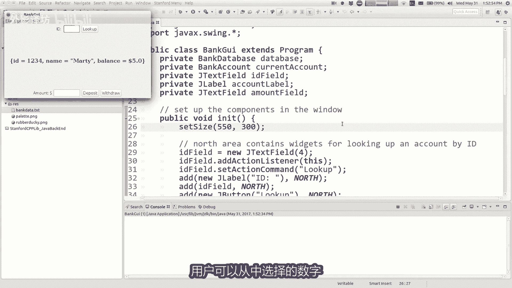

这就是JACONBBOX的来源，再创建一个新的JONBBOX中，放入所有VDSS暴入框中，并将其放在屏幕上，好吧，让我们回到这里试试。

银行GUI将创建一个新的JONBBOX，就像字符串的私有jacon bull box或I，我猜他们会是身份证数字将会正确，那又怎样，如果你想写的话，输入是理科整数是对的，那么我们来吧。

现在就调用这个IDE盒子，保佑你吧，我这里没有id字段，把这一切都关掉，然后我想说，冰箱弄个组合整书框好吧，让我们添加它，北边的身份证相，我只是我只是想要掩饰他的样子，第二如果我做id框点添加项目。

然后我喜欢42，然后我给你做一个，如果我运行现在就知道123程序，我有一个下拉框里面的选择还可以，但我不不想要42，我不想要123，我想要所有技术的id号，实际上在数据库中，所以让我们实际做到这一点。

我做的很好，我有一个数据库已关闭，在这里，我现在从文件中读取数据，老实说这就是事情变得棘手的地方，我觉得今天的讲座我真的不太懂，想要专注于这些组件等，希望重点关注如何你让所有这些部件说话吗。

彼此因为每当你写一个，编写一个实际上是个大程序，你把时间花在什么事情上，组件只是查找一些愚蠢的方法，名称和东西主要是如何，我们得到了所有的身份证号码，所以我把他们在组合框建议中，好吧。

你说做一个扫描仪读取文件，获取所有ID，然后将其传递给组合框之类的东西，是的，我认为这是正确的想法，我真正想深入了解的事情，这里就像代码去哪里一样，谁的责任是现在听起来像是一个奇怪的问题。

因为你就像喜欢我的人是什么意思，我写的程序不是我的意思，我的意思是什么文件，什么类的人，我的程序的哪一部分是什么对象，要做所有这些事情，那就是有时很难回答，正确答案不止一个，但我认为有一些很好的启发法。

或你可以效仿并尝试的好榜样，现在弄清楚这一点是你要做的事情之一，你可以做的一件事就是这个，如果你真的进去了，读取文件代码，我们上次写的代码，但是我很快就冲破了，你可能不太记得该代码，如果我转到那个代码。

这是银行数据库类，它有一个方法阅读这个文件，看看他是怎么说的，自由读取文件为其命名，打开扫描仪，它会读取线条，有身份证号码和姓名平衡，所以你可以在D43行看到我有身份证号码。

所以我说我想要感谢所有这些id号码，并把他们进入那个组合框，这就是我努力做正确的事，所以总有这个问题，我有这个信息在这里，我有那个物体那里，就像我怎样才能得到这些人互相交谈还好。

所以让我们考虑一些不同的方法，我们实际上可以做到，我的意思说，这正是我想做的，我已经有扫描仪了，读取文件，已经获取的文件，所有es s但现在在第一个之间，第四个中有三件事，就像那个间隙的外壳是什么。

好吧，所以我可以这样做的一种方法，我可以改变标题，对于这种方法，我可以说你知道什么，当我阅读这些内容时，我需要在这里，ID我需要那个组合框就在那里，我可以告诉组合框，这是ID作为你自己的id。

所以我能做什么，我可以说我想通过身份证向作为参数到数据库，好的，现在在这里，当你读文件时，我会说好，只有一个文件名参数，但你还有一个J组，何况放映参数叫id框，你把它传进去，现在当我到达时，就在这里。

这个id号码我会说，黑整理盒子里需要添加一个不是字符串的项目，这不是字符串整数，对不起，我需要将该id的项目添加到组合框，好吧，现在回来了，在这里我通过id框好吧，所以实际上了，当我说为艾玛添加时。

这些是这些，只是我不想要的测试那里有这些数字，所以让我们尝试一下我运行卡，我发现我有一个234，我都有了不同的光线，太棒了哦，这个查找实际上还没有起作用，因为查找用于寻找我们的来自文本字段的文本。

但现在需要改变，看看价值是什么，实际上是在组合框中选择的，让我们尽快解决这个问题，如果我走了，在这里，当你说查找这个时，查找id文本字段并获取文本，事实上不再有id字段，我可能应该把它删除。

因为我们用id框替换了id字段，现在实际上我不在这里，如果我认为这会编译想知道选择了什么id id框，我会说id框点和他再次可以查看所有。

他会告诉你不同的事情，选择哪个项目或其他什么。

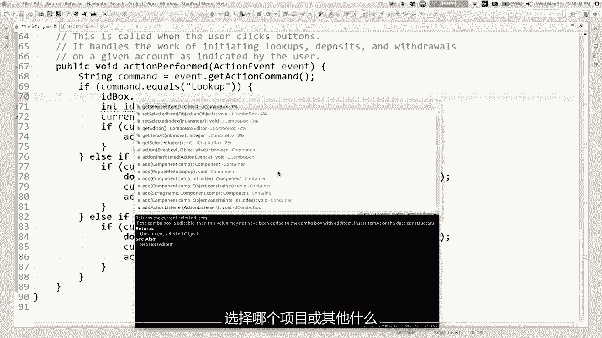

所以我在幻灯片上向您展示了，您可以说获取选定的索引。

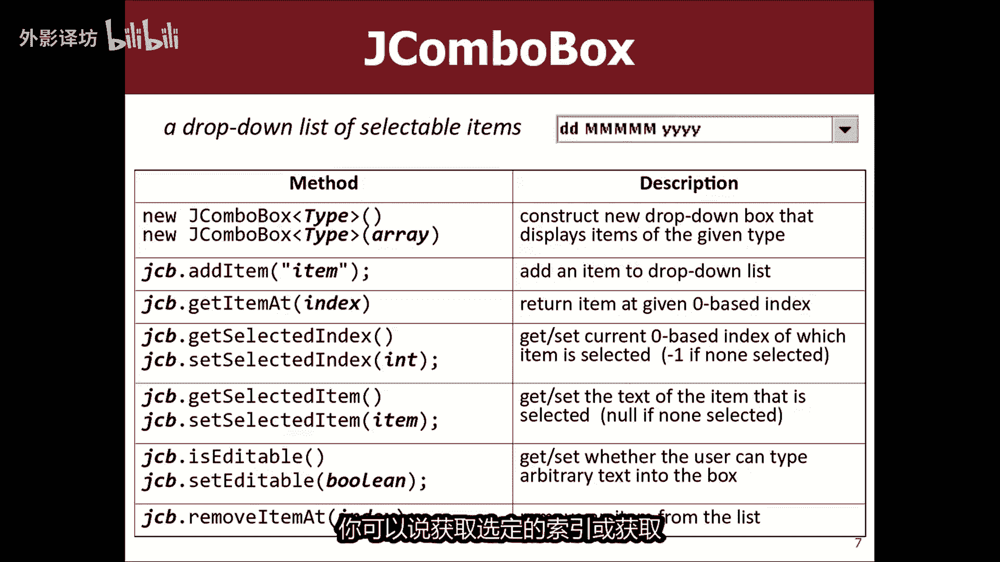

或获取选定的项目或其他任何东西，如果我说ID框获取选定的索引，所以索引，等于，然后如果我想要我相信该索引处的实际id，我可以在索引处执行id框获取项目，好的接下来这个现在我只是用那个id。

我想我现在状态很好，所以让我们再试一次，所以我选择9999查找，那是米兰，他有一点钱存起来的，1234就是我我你没有攒多少钱，知道什么，我可以选择不同的id，我可以查一下，这些很酷啊，等等哦。

今天我有没有让你去哪里，你尼克哦，我说实话我真的在做，数据我就像我需要有人，谁的钱比我和我还少，就像把尼克放入数据文件中，但是可能是我的同事，尼克特兰特是其他讲师之一，也许他他的名字可能只有1/4。

好吧好吧，等一下等一下我让你好起来，nick t就是你就像欧耶，我们去吧，很酷，我们和好号码，无论你做不到，抱歉，我创建了相同的id号，无论如何都不好，所以我想他可以工作，我们完成了，但我声称我没有做。

这是我不太喜欢的最好方式，我所做的这个选择只是为了展示，你说如果我这样做的话，它会起作用方式，但我不喜欢他，我不喜欢让数据库传递此组合框，就像那样，你知道为什么。

我可能不是对这个设计或你所知道的感到满意，这可能有什么不好的地方，或者你的想法是错误的，绝对获得完整的信用功能，是的，我们可能会失去风格信用，所以这个尺寸有什么问题吗，我怎样才能让他们得到信息。

我不确定我是否理解，如果你说的是课程数据库中的GUI，了解每个其他人如何互相交谈，是的，好吧，所以我在这里做什么，谈论通过引用传递事务，所以当我调用这个方法时，我给出了我的组合框到数据库。

我在这里说我有一个空的组合框，没有任何项目，在它和它的读取文件中的组合框代码，对不起，在他的数据库中重新归档代码集，这样我就有一个空的，我现在将添加一些项目到组合框，我正在阅读此文件时的组合框。

所以它添加了一些东西和NEC参数，因为java中的对象和数组是通过引用传递组合框，式与GUI中的组合框相同，所以如果然后数据库会增长该组合框，GUI也会看到这些变化，不像一个单独的。

因为它们是在上共享相同的图形小部件，屏幕右侧，所以我想就是这样，你问的是对的好吧，所以这样我的意思是它确实有效，功能正常，但我只是声称这不是一个好的设计，这个小部件到这个数据库，就像这样，有什么想法。

为什么你这么说，后退，是的，他组织的不是很好，不能隔离错误或问题属于以下问题中的问题，属于数据库似的，我想回到这些短语，我使用了我上次讲过的讲座，分离出称为模型的东西，从我的代码来看。

我的代码模型应该是我的一部分，代表数据的程序和文件处理和所有细节，我正在处理的数据为核，我的代码的视图应该是GUI屏幕上的东西，我正在画画的东西，显示与用户的交互事件的，你永远无法将它们完全分开。

因为我正在观看的内容的一部分，是模型中的数据，但我认为你真正想要尝试做的事，将GUI和视图内容保留在模型之外，尽可能多地归档，这是主要的目标，称之为模型试图分离，所以我一般来说。

如果您将小部件传递为模型的参数，模型的参数不应该关心小部件，不应该担心粘性和不应该关心组合框，你可能想做的事情，这是给GUI1种询问的方式，数据库你能告诉我是什么吗，你有这些，我想用它们。

我想把它们放进去的东西，我的组合框我会处理的，因为我要做我的下视图，对此负责，所以这就是我要的，宁愿在这里做，所以我要撤销这个选择，所以现在我再次需要找到一种方法，将这些东西放入组合框中。

记得我们是写作的人，这段代码是我们设计的，可以向此类添加任何方法，读完后，我们想要的方法，完成此方法后的文件，在我们的id所在的地方运行，是的，他们位于哈希图的数据中，我将成对的事物放入哈希映射中。

我将id作为密钥，将账户作为值，因此此处数据的哈希映射是正确存储这些id，那么如果，其他人想询问这个对象，对于id我们需要提供一种方法，他们这样做，所以我们为什么不写一个称为public的方法。

获取全部IDSID给他们返回所有的ids，如果你的话，我怎样才能得到所有的ids，想要循环地图，并获取所有介入整数或所有银行账户直出来，你可以让我写，我还不知道要返回什么，所以我会只是写void。

但我想我想返回一些东西，因为如果你得到，通常会寄回一些东西，所以如果您想要取出所有的整数键，可以说对于每个int id数据哈，希图点见即见，即是所有这些人的集合左侧，这样我就可以循环所有内容那些。

并用它做点什么，我想和他们好好相处，我一直喜欢打印LINDA，我认为这个的目标方法是，将其作为数据提供给他们，我的计划中的其他人，我该怎么办，让他们取回数据，为什么我不存储它们，在其他一些集合中。

那一刻，我为什么不将它们存储为array list，整数灰名单，所有id是一个新的整数数组列表，然后我说对于这里的每个ID地图，我会将其添加到所有AD数组中列出清单，然后当我完成后。

我会返回所有D数组列表，所以这个方法不是void，该方法返回ARRELIST，所以现在我可以说，黑数据库把你所有的身份证还给我，Array list，好问题，是的哦，为什么我不直接返回所有。

银行账户我可以这样做，为什么没有错，你指的是哪一部分，为什么我不是选择编写这样的代码吗，方式或为什么密钥不分开，出示哪一方的银行账户，有一个梯子，钥匙是物质对的，左侧右边称为直。

如果我想变理所有银行账户，我会写数据之和，这就是这些的集合，两队人左边的人士称为密钥，这就是密钥集，这样你就可以循环查看银行账户，如果你想要这只是一个设计决定，我本可以选择收集所有记入括号数组银行账户。

我本可以退回，我猜我回来的原因只有EDS是我试图排序的，教会我所掌握的最少信息，认为其他文件可能需要，如果他们不需要整个银行账户，我就把身份证号码还给他们，但你完全可以做到，可能是你想要的场合。

这样做好吧，现在我已经得到了，如果我回到银行，GUI所有BD还记得我以前多么想读文件，然后给他ID框I决定不再这样做，那么现在我如何将这些id放入盒子，我在这里做什么，这是在银行再次图形用户界面，是的。

获取所有BDS作为数组列表。

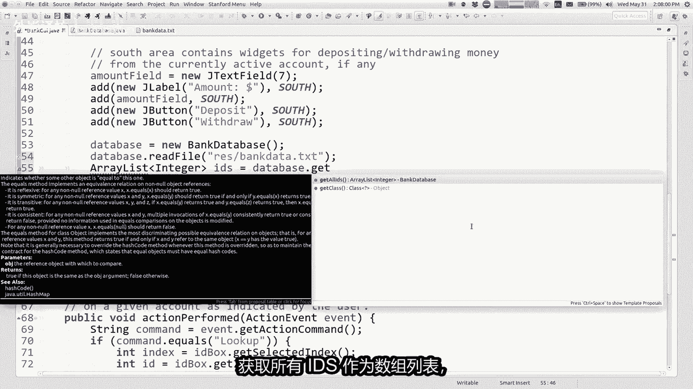

O他不知道什么是ARREALISE，我想我需要导入，那是好吧，获取a relist，然后做什么，只需将其中的每一个添加到组合框正确，所以基本上是每个int id排序，IDSD框添加，项目id。

所以我想好吧，让我们运行它，再次确认我拥有所有这些不同的id，我选择444台加载杰瑞金，所以现在我不知道我是否可以野兽，你这个代码比事实上我们一分钟前的代码，如果你只是计算了行数或方法。

或者不管这个代码比，换句话说，你可能会说我喜欢第一个更好，因为它更短很好，但你知道简洁并不总是选择代码的首要因素，设计正确，所以我喜欢这个的原因，版本比较好，就是银行数据库，不必谈论tumble ba。

我不需要导入任何盒子图形库，这个文件在这里是美好而纯洁，你也知道我是否曾经想重写我的银行程序，有一天会有一个控制台用户，我可以用界面代替GUI，完全重用该银行数据库文件零修改，因为它不是寻找组合框。

我只想必须用控制台替换，感谢GUI银行，所以我认为这是更好的设计，因为这个文件比较多，独立只关注数据，不关注专注于商品，好吧，无论如何，那就是你对待这些类型的方式，当你写一个更大的问题时。

我想简单地向您展示一个系统，在我们完成之前还有几件事，今天我不会真正完成他们的全部细节，我只是想让你知道什么是可用的。

如果你是编写java GUI程序，是因为我想想你想写的大多数程序，必须让他们放松，所以我想谈论一个叫上篮的事情，管理上篮管理本案组件的位置和尺寸，屏幕上有物体。

java调用布局管理器来决定在哪里放置任何组件，三人决定他们应该有多大决定，那是什么样的典狱长，如果他们应该位于决定他们的位置，如果您调整窗口大小，则应该移动，很快。

我们之前讨论过这个java之所以有这种心态，是因为不同的操作系统有不同大小的字体，和不同的大小按钮，因此java会尽力帮助您定位一切，而不是说将按钮放在X等于50，Y等于30或类似的东西。

所以我们使用现在您可以使用这些布局管理器，可以选择程序如何执行布局，如果你想要的话，有这些你的程序中的方法，所以亚当我们有添加组件，我们将组件添加到北中南西，还有一个方法。

此幻灯片上的最后一个方法称为设置布局，您可以在其中说，嘿，我希望我的程序使用不同的布局风格，可以有一个大影响你的GUI的外观，所以我想谈谈，你能通过什么作为设置布局的参数，可以你需要改变你的程序层。

好吧，你必须要做的主要事情想想，当你正在处理布局，现在是每个组件的大小组建，有我所说的，他们想要的首选尺寸，看起来很自然的尺寸，如果是按钮，则为首选，尺寸足够大，以包裹所有该计划的文本或项目等等。

但是您可能希望按钮更大，出于某种原因，使其更容易获点击更大，这样你就可以制作像这样被拉伸的东西，右侧的按钮它们未存储，以他们喜欢的尺寸存储在其他尺寸，所以当你选择你想要的布局，你要问的一个大问题是哪个。

我想在他们的组件，我喜欢的尺寸与我喜欢的尺寸，想要以某种方式伸展好吧，所以话虽如此，这里有一些具体的java中的布局策略，这是一个称为流式布局，流失布局指示，像他们一样从左到右放置东西，是在一个段落中。

他们都给出了他们喜欢的尺寸，所以如果你添加一个一堆按钮，它们只需向左移动即可是的，如果你缩小窗口，它就会将内容绕到下一行，我慢慢的从左到右整齐的，我们所做的主要就是你说设置新的布局，无论布局如何。

现在你的整个程序使用不同的布局策略，实际上是我的，我想做给你看。

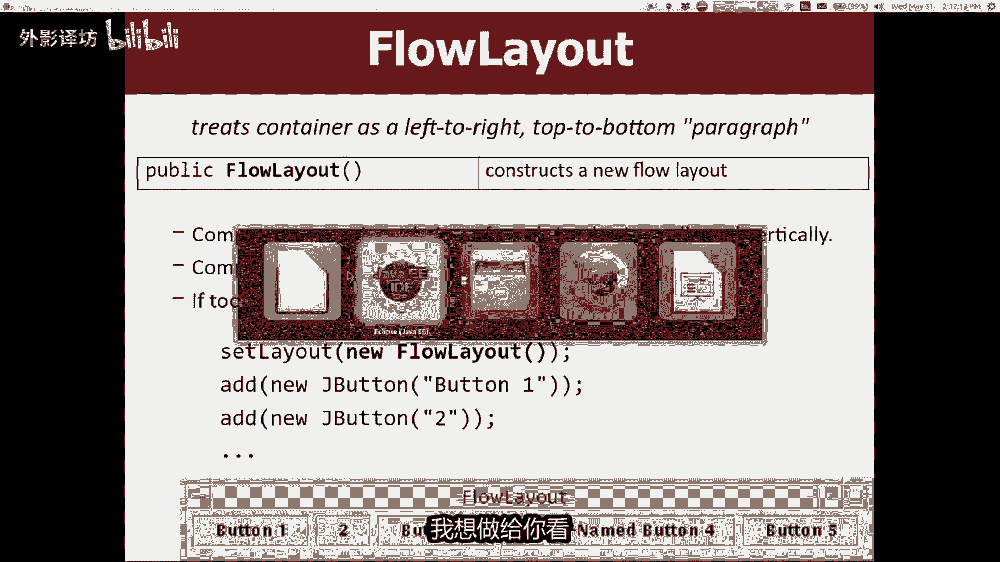

这时我有一个单独的程序，为了让事情更简单，我有一个程序称为布局演示，他所做的就是这样扩展程序，并在INIT方法中I制作五六个按钮，然后添加它们全部显示在屏幕上，但我可以演示向您展示这些不同的布局好吧。

如果我只是运行布局演示，且我看到这些只是填充按钮好吧，这是默认的，他是做什么的好吧，如果我说设置怎么办，布局成为新的流程布局，现在可以了，如果我运行这个程序会发生什么。

将它们全部从左到右排列在一个水平一圈可以，如果我缩小窗口，你会发现它们保持居中，并且当他进一步对待，看看这个他把它们包裹起来，就像一个段落的单词太很长，适合文字处理机屏幕类似的东西。

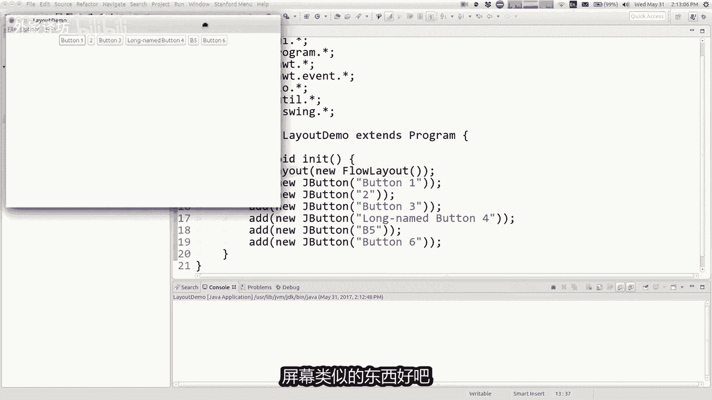

好吧，这是一个流动层，下一个是border层，board layout是一种布局，具有南北向和东西向，听起来可能很熟悉的中心，因为我们图书馆的一个程序，基本上以此为基础布局，当你把东西放进去时。

不同的五个地区说的更好，南北或伸展水平填充宽度，窗户在东方的东西和西边垂直拉伸，以填充窗口和中心的大小，获取所有剩余空间，并且指令两个维度，所以这是一个好的布局，如果你有的话，中间有你想要的东西。

像画布一样，占据大部分空间或文本区域或类似的东西，以及你周围有一些小工具栏，它的边缘，这是一个很好的布局，那个和那个使它成为一个好的布局，有很多种类，如果您回去的话。

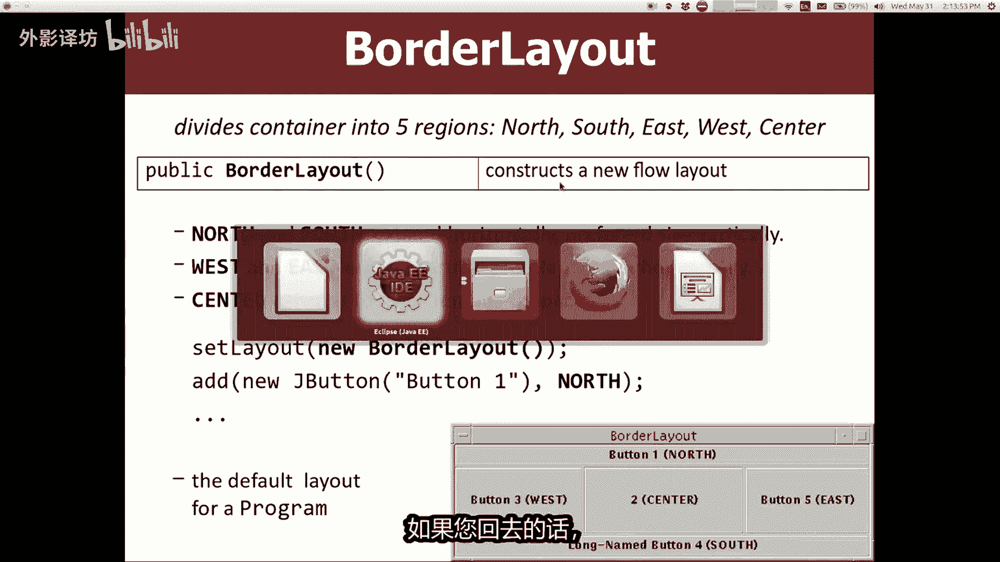

这里是整体应用程序到这里，你说你想要一个新的边框布局并运行程序，你只看到按钮一什么，现在就在这里，我们就是这样嗯，是的，他们在彼此之上，那就是如果你将东西添加到边框布局，如果您没有说出要添加的位置。

它们将它们添加到中心，所以所有这些按钮都像叠加在中心，你可以只看到我才第一个曾经被添加过，所以我们看到了一点，在你可以说之前添加逗号中心，添加普通或添加逗号难，添加逗号东，逗号西，无论如何。

所以如果你将它们添加到两个不同的地方，现在你看到了你开始看到的一切，这些不同的按钮在不同的位置，尺寸和东西很有趣，你没有按照我说的方式拉伸他们，你会吗，我想我想那时因为我们的图书馆，但无论如何。

无论如何，北东南西和中心，这是一个边界层。

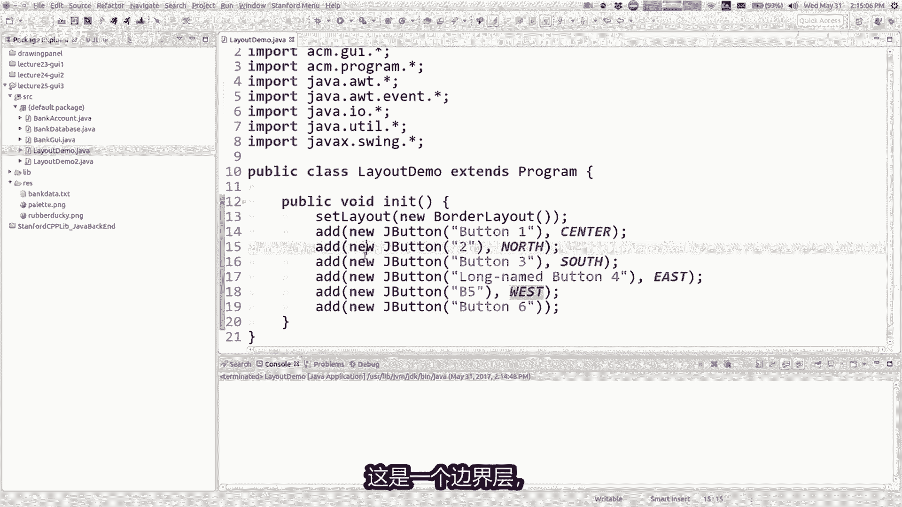

好的下一个很棒的布局，真的就是一切每行和每列，这样你就可以制作一个新的网格布局，你说有多少情和多少列，它会将所有小部件放置到这么多小部件中，很多人觉得很棒的台词，当他们了解网格时。

他们就下哦很棒的网格布局，好吧，我的一切问题解决了，就是这个布局统治他们所有，我认为他必须与他人有关系，我认为还有很多其他学科学科喜欢思考事物，就网格而言，例如设计D他们经常做学校之类的事情。

基于网格的设计很好。

但是你知道，所以他们想使用网格布局，他们写代码的时候很多，所以让我展示一下，如果我将其设置为网格布局，也许我说我想要三台两台，如果你使用网格，现在列布局，你不必说center货，不管你怎么说好。

我不需要告诉你什么星河，我正在使用什么猎，但如果你只是不要说它只是增加了某种程度，从左到右，从上到下，它添加了和，然后转到下一行，以此类推，如果我在那里运行这个按钮易，然后两个，然后三个。

然后四个他们出来和一个网格，然而按钮都已经拉伸，因此网格布局拉伸，所有您添加到其中已填充的小部件的数量，这些列中这些行的完整大小，所以你知道这很有效，如果什么的话，你正在做的是一个计算器。

你想要像一个34567891按钮真的很大，所以你可以很容易地夹住它们，但是它如果你添加像这样看起来不太好，J text field，这里提取了text field，这看起来有点可笑。

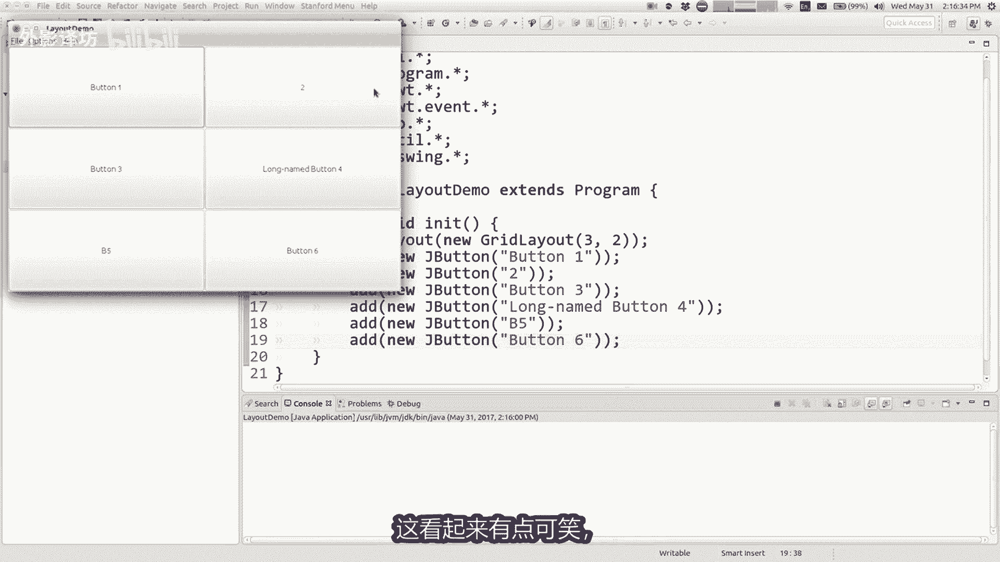

因为该问题的作者是java，斯坦福大学的图书馆埃里克教授罗伯特，他做了一个叫做桌子的东西，布局基本上是完全一样的，与网格布局相同，因为它没有拉伸任何东西，至少我认为是这样，如果我回去改变的话。

从网格布局到表格布局I，我想我会得到更多一点自然的外观，在这里能够布局，在那里运行，所以现在我有一个网格，但他并没有延伸出去，你必须决定的一切，你想要什么好吧。

这就是唯一一个像斯坦福大学那样的，我正在向您展示我们的其他java的一部分，还可以，现在真正好的事情是，当你想做一些疯狂的事情，比如现在到处都是东西，我给你看的布局都不是足够强大或足够好。

这一切你可能会看到一些成功，这方面的一些方面，看起来像那些布局，就像哦那件事，可能事实上就在那那东西看起来有点像网格，但其中没有一个可以做所有这些了解，所以怎么做，如果你愿意，你可以做一些复杂的事情。

你必须做的一个复杂的GUI，称为复合布局的东西，复合布局是您使用这里有边界，那里有流动，那边有一个网格，你有不同的窗口的某些部分，使用不同的布局管理以及您的方式实现这一点。

就是你可以做到这些放入你的小容器，程序中的容器被称为J面板，这面板是一个组件，不可见其作用只是存储其他组件，但您可以将其设置为有一个布局，以便您可以制作这面板，并给它一个可以添加的流程布局组件。

然后添加面板到程序，现在到那些组件使用该布局，但即使用那些组件使用该布局，就像if if，你想做类似的事情，那东西是按钮一键到中心，经过西南东南，如何得到它那种布局，好吧，你只是有点查看它们。

并决定哪种布局可以下注，所以如果我想要按钮一，并且两种自然排列，你认为什么课程好制作这些按钮的布局，看起来像流布局的数据，那两个中间底部很好，如何让按钮拉的更大，中心或某物的布局，那。

这可能是一个囤积者，把他放在边框的中心，布置在底部，说西南和东南，你可以放南方的事情，但我们不知道西南和东南怎么做，这里是你这样做的方式，为北制作一个G面板，你给他一个流程布局，你添加按钮1+2。

所以就是这样，好吧，你可以做一个jay的男面板，带有边框布局的面板，然后凝浆西南标签在其西部和东南标签，在其东区米为整体做一个整体面板，具有您放置的边框布局的窗口，北萨米安，你放的北萨米安南部。

最好的事情，你把这个按钮放在它的中央，然后将该面板添加到窗口，现在它有三个独立的，每个地区使用不同的策略，对于他们的布局和这个想法，温度让你得到这个或其他什么，你实际上正在尝试的疯狂布局。

在你的计划中实现，所以我要去我要说的最后一件事，到此为止，我知道你会欣赏的是，我不会让你做布局管理器的事情，在测试中，但我会测试你浮标和小部件，以及实际上的听众，诸如此类的东西，所以好吧。

在美好的部分度过美好的一天。

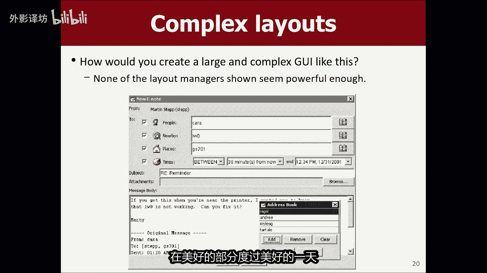

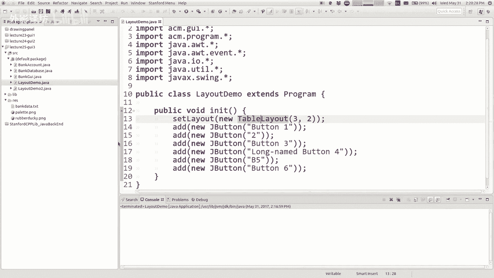