# 【中文配音】斯坦福王牌课程 CS 106a Java教程 2017年春季课程 - P2：02_ Programming Karel - 外影译坊 - BV14U4geNEEq

好吧，我们为什么不把它关掉呢，请您好，欢迎回到cs106位，让我们开始我们的第二讲，快速宣布几个公告之一是，如果你想要帮助设置我们的java和eclipse，您计算机上的软件是我们的助教尼克。

明天三点开会至下午五点，在盖茨大厦地下室的VO房间，你不知道怎么做到达大门大楼，只需就在隔壁这里，你可以点击链接查看位置，盖茨大厦将于明天落成，下午你可以带上你的笔记本电脑，它会帮助你让它发挥作用。

这样你就可以完成你的家庭作业，他会是一个令人兴奋的有趣的时间，另一件事是，你知道我们将会有这些本课程中的讨论部分，右侧由你的小组长领导每周一次的小组，我谈到了这个周一上课时，您需要报名。

你想参加哪些部分，你这样做的方式，就是我们有一个链接在班级网页上，上面写着注册一个部分，注册表单，明天五上线并持续，直到本周日五左右，周四到周日我都需要请访问该链接，并告诉我们你什么时候有空。

以便我们可以让你参加一个会议，我也会给大家发一封电子邮件，提醒大家，这对你来说很重要，如果你不填写，请填写，你可能不会得到你的第一选择部分，不是先到先得，所以你不必急着去机器，就在周四。

但请确保你这个周末之前填好，我会的通过电子邮件提醒您，我们不这样做，下周之前有任何部分可以吗，这些是我的公告，所以我想要提一些一般性的事情事情让你知道，每次我们有一个讲授我所做的所有事情。

为了一件事而在网站上发布，我正在录制这些蹩脚的视频讲座，您可以点击视频观看，如果我写的话，也可以链接到这些内容程序，我将发布我的程序写，这样你就不必疯狂尝试写下所有的java程序，我正在输入。

你可以观看，可以相信那些会被发布，在我通常会发布zip的网站，我正在工作的整个项目的文件，通常在课上和课前我会发布，我所说的启动项目是就像我想要的空项目，在讲座期间输入，如果你想的话。

跟着你就可以下载了项目，并在eclipse中打开它，然后您可以和我一起打字，或者随便你，我想要这样做，我只是想证明你知道我们会学习如何使用eclipse，随着课程的进行一起，有很多不同的按钮功能。

但我无法向您展示全部今天他们，但我只想给你看如何开通的基本流程项目，并从事一个项目，如果我走的太快了，你记住这回在今天的视频中，您可以稍后观看回放，看看怎么样，你会做的事，你会开始从班级下载zip文件。

像这样的网站，正在将其保存到某些计算机上的文件夹，好的说明对于LINUX来说会有一点不同，与windows与Mac，但所有计算机相比，应该能够做这些事情，所以你下载此zip到某个目录，你的电脑。

所以我保存了GSP就在这里，所以近在拉链，就像所有这些文件的压缩版本归为一，所以你必须提取提示内容，以便您排序，双击拉链，有一些在这里你可以拉出这些文件文件出来，并打开压缩包到您的硬盘上，像那样开车。

所以现在我有这个拉链，解压后的文件名为programming卡罗尔，如果我想编辑他eclipse，我刚去eclipse，这里有一个软件，这里有一个按钮，看起来我不知道这是什么图标，应该是但是有点小。

蓝色托盘箭头飞入其中，或者什么，他说导入项目，如果你找不到那个，并且还有一个选项说文件导入，所以你可以执行其中任何一个操作，因此您可以单击导入它，希望你浏览的项目，该项目位于哪个目录。

所以我只需转到我保存的同一目录即可，它位于名为programming carroll的文件夹中，然后我进入该文件夹，并说好吧，如果他有效，他会说你想要吗，卡罗尔编程讲座事的我愿意，所以我说完成。

现在我有了，如果我打开它，就会在我的计算机上进行项目，我可以查看所有不同的文件，这些项目有不同的目录，其中实际的源代码，我们实际的java代码工作在这个源文件夹中，所以我将在几个时间处理该文件。

今天有不同的文件，所以那些都在那里，他们已经准备好让我从事他们的工作了，可以打开它们，现在我可以开始了，在里面输入java代码就可以了，这是一种快速版本，开始处理eclipse项目。

这就是你开始做作业的方式，作业我给你泡一下，以同样的方式下载并导入它好吧，但实际上在我这样做之前，我想回到我们之前的节目，上次写的名字叫做遇见卡罗尔，所以这就是程序，我没血了。

我想剖析一下该程序的几个部分，因为我们必须快点去我们上次完成的时间讲座，所以我要跳回到我的从周一开始的幻灯片，仅供参考，分钟好吧。

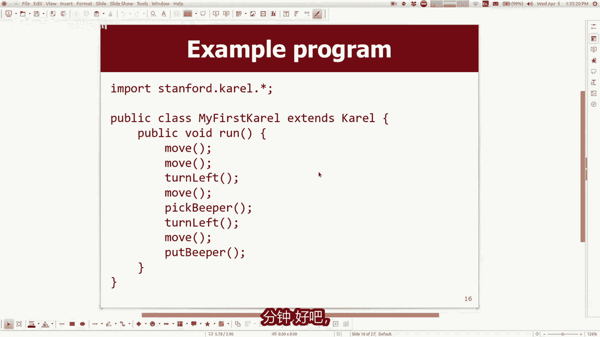

现在有一个节目，说到程序，程序有几个我谈到的不同元素，他如何开始公共课程扩展，卡罗尔在java中的单词类别，是有点像程序这个词的同义词，所以我们基本上是说我的程序是当你说延长时，打电话给卡罗尔。

卡罗尔你基本上是在告诉java，如果你想连接到carol环境延伸，意味着你正在立足现有库的功能，有一个现有的图书馆，在我们的在我们的eclipse中，我们被称为卡罗尔，我们的计划将基于topic。

这个词是我们要学习的东西，稍后会详细介绍，但这与不同的程序是否可以彼此互动，无论他们是开放或关闭，无论他们是公开的还是其中一些事情，只是私人的，当我们说时，语言要求公共空间运行。

所有的事情我们放在花括号之间的事，我们要发出的命令，宋哥你会看到java使用大括号作为分组机制，他们表明某事有开始和结束，很多不同种类的东西，现在用大括号表示，我也有一些间距和缩进。

对我的各个命令进行编程。

如果你记得在课堂上给过卡罗尔，周一我会告诉卡罗尔搬家，拿起蜂鸣器向左转，这些命令写入，这些命令都遵循后面跟着括号分号，但也存在一些间距，你注意到这些东西很友善吗，像这样的一件事，缩进java很有趣。

语言是他不太关心，关于间距，例如如果这个程序的行为就在这里，它仍然会以完全相同的方式运行，卡雷尔的行为会和以前一模一样，所以你有很多不同的地方，可以在程序中添加空格，不影响其行为。

唯一需要注意间距的地方是，如果你在中间放空格，它可能会让java感到困惑，因为他不知道X空间趋向于与扩展相同，只要你不这样做，在单词中间加一个空格或java通常不是这样的，不太关心，但在其他一些方面。

java非常挑剔，例如如果我撤销所有这些更改，如果我改变移动到大写M只是这一点变化，这个大写字母导致它下划线，如果你看到这个下划线，有几种方法可以理解发生了什么事，如果你悬停在那里。

他会说移动式对于卡雷尔来说，未定义基本上是错误，java的消息有时很难理解，但在这种情况下，java告诉我，我不知道那是什么命令，我它可以是一点令人沮丧的是，他是如此挑剔，但你必须以正确的方式拼写它。

你不能添加额外的哦，你不能添加不同的大小写，就不会工作，所以你必须习惯这些潜在的错误。

以及如何修复，我们有时称这些语法为错误错误，我的幻灯片在哪里有错误，当您输入不正确的代码时，或者编程不理解，如果你的程序有错误，你的语言将无法运行它，你就是不会让我运行它，直到你修复这些错误。

你将会有很多这样的这堂课的课程，没关系，每个人都有这些缺陷，他们称之为语法错误，因为语法是排序的，我们用来描述集合的术语，编程中的合法命令，语言还可以，每个编程都可以，语言有自己的语法和区别。

可能在于你知道可能有与一种语言的语法不同，迪克斯现在好吧，我也想谈判，关于一个叫做他在哪里的东西回来吧等等。

那不是我的地方，想要坚持跳来跳去，这里有点我想去这里，我，想谈谈一个叫做编译器。

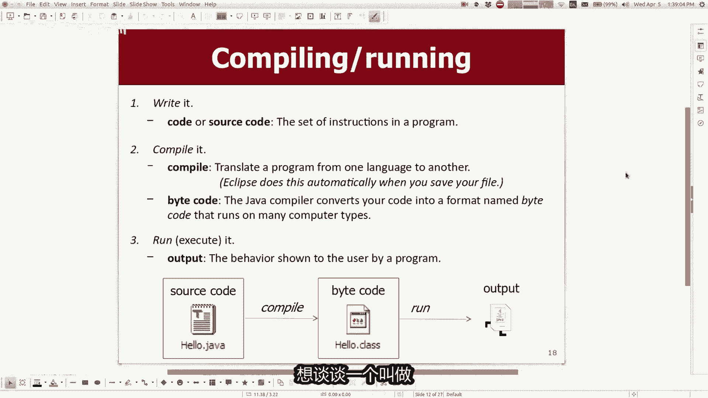

所以记住计算机讲二进制，执行指令是由一和零组成的二进制形式，但你知道你和我并不真的讲二进制，所以我们想写我们的，用这种java语言编写我们的程序，这看起来有点像英语还可以。

但是为了我们可以理解的英语命令，必须将它们翻译成计算机，二进制，翻译的过程，将这些英文命令编成为二进制命令，称为编译程序和java，每当您编辑代码并保存时，你的代码eclipse会自动编译该程序。

并将其变成二进制版本，二进制版本是你必须在某些语言中运行什么，明确的做这两件事，一键编译程序，然后放置另一个按钮，在eclipse中运行程序，如果您按的话，请结合这两个步骤，看起来像跑步的小图标。

man他立即编译，然后一次运行该程序，所以很友好，只是模糊了两者之间的区别，这两个步骤，但那是两件事，eclipse正在做的事情，尽管他是同时做这些事情，拼写错误的错误，你不会忘记在右边的地方。

语法这些错误会停止，程序能够成功编译，我们有时称它们为编译器错误，或因此而出现语法错误，从技术上讲，当程序得到编译，它会生成另一个文件，您正在为您编写的这个文件，称为dot java文件的程序。

就像我们遇到了carol dot java一样，当我们输入程序时，你编译它，实际上是你遇到的硬盘上的另一个文件，卡罗尔点类，点类文件是计算机的所有二进制代码想要运行，那么我们启动程序，我们运行该程序。

然后我们查看行为如此，编译和运行程序是这样的，你几乎每次都会这样做，语言还可以，所以我想提到一些其他的事情，java的语法我告诉过你，我们必须提供我们的计划和名称，有时当你在谈话中谈论魔音时。

编程语言的另一种说法，名称是标识符，Z和java标识符必须以基本上开头，它们包含字母和数字，但是有些东西不是合法的标识符，例如你不能在标识符中添加加号或减号标志。

或者你只能开始并且带有字母或符号的标识符，下划线或对大多数人来说是一美元，大多数名字开头的标识符字母。

因此拥有一个是合法的某个程序的名称，就像你知道的去49人对吧，合法的，他强调他，因为你必须将你的个人资料命名为相同的内容，正如你在这里命名你的东西一样，一般这是一个合法名称，但它会写49人。

规则是不合法的，因为不允许以数字开头，它必须以那边的一个字母开头，所以无论如何，有一些规则，你被允许或不被允许做什么，对于你的程序的名称，我要去把他放回去，去见卡罗尔好吗好吧。

有些名字你不允许用作标识符，因为它们已经具有了意义语言，所以这里是所有的列表，那些被称为的那些词，你无法调用的语言的关键字，你的程序公开以为那会例如混淆java，但这里有一个列出。

我们大部分不会用到的所有内容，本课程的这些关键词，你知道，事实上，我认为我从来没有使用过，我的编程经验中的一些叶子，但我们会了解其中的几个意思是，在我们完成这里之前，例如如果我回到程序代码。

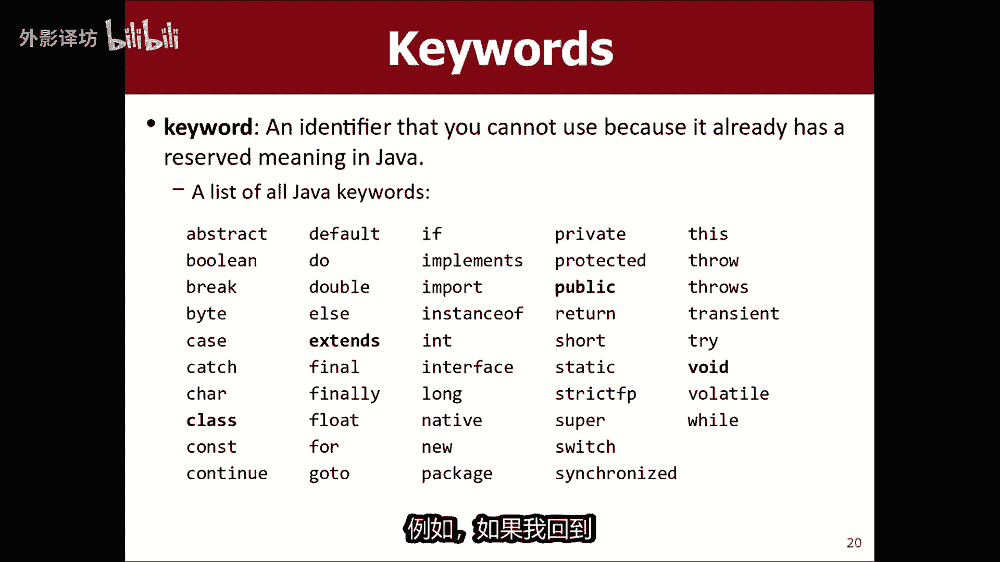

在这里我不能调用这个程序，公共公共内公共那个说你不能使用那个尼克，那是关键词。

好的，我想提的另一件事来自上一堂课的幻灯片，我想谈谈一个叫做评论，评论是您可以的，注视在使用的程序内部进行制作，记录或描述程序评论对行为没有影响，当你运行程序时，评论没有任何作用，但有程序员的一点注释。

由在代码内，您自己或其他程序员谁稍后看节目，评论非常重要，如果您对大型软件感兴趣，你可能需要做笔记，关于程序到底在做什么，为什么这样做或如何做，特别是如果其他人打算与您合作开展项目。

以便现在你可以做的最基本的事情，评论就是写一些东西，关于程序的编写者和内容，程序执行编写语法评论有两种不同的方式，如果您的评论很短，可以这样做，您只需在后面写两个斜杠即可，如果您的评论是请通过评论文本。

你说的很长，并且跨越多行闪烁星星，然后你写下你的评论，然后用星号结束斜杠，所以让我给你举个例子。

如果我想描述一下你刚刚的这个程序，爬到最顶端，你可以说斜杠斜杠cs106A，2017年春季作者马蒂走了一步，然后你可能会说您知道该程序导致的描述，卡罗尔要移开传呼机，你知道吗。

位置到另一个或其他什么简单的事情，就是这样程序功能的描述，当我们给你布置家庭作业时，通常会说我们希望你写一个顶部评论，描述了计划，并提供您的姓名和您的现在的部分，和所有这些事情，我希望这些评论很清楚。

当你运行这个程序时，做任何事情就像我刚刚保存的程序一样，再次运行程序，我选择meet卡罗尔，当我运行我们写的这个东西时，最后一次他什么也没做，因为共同而不同，他们被忽略的执行程序好吧。

他们只是我们的笔记，当我们准备好时好吧，现在有另一种语法了，你可以使用的另一种写作风格，如果你知道你要去的话，评论写很多这样的形而不适，必须在开头写斜杠，斜杠每一行，而不是你可以只说斜杠星号。

然后写你所有的评论型，然后把结尾处有信号斜杠，然后是所有之间的那个被认为是，如果在eclipse中输入，请立即评论斜线星号，并按enter键，将这种很酷的格式放在他想要的地方，在每行前面放一颗星。

所以他有点想让它看起来像，这是因为他有点像你有一排很酷的星星，开始你的事情，但这是可选的，这就像一个小风格，人们认为你看起来很酷，我只是前一秒还说，评论不对某人的行为有任何影响，程序从技术上来说。

有一种方法你可以使用会修改的注释，适当的行为意为任何知道那可能是什么，我怎么能，在此文件中执行一些涉及的操作，发表评论可能会改变什么，如果我这样做，你认为该程序会做什么，将部分实际代码变成评论。

这是我要去的一个很好的观点，说这个很好的评论，但是是的喜欢看这部分上面写着选择B，如果我把斜杠，斜杠放在那里，就会变成该行代码放入注释中，并且注释不执行那里跳过他们，不是他们什么也没做。

所以现在这实际上意味着他是不会再选B了，所以他不会那样做，所以如果我跑该计划，卡罗尔不再拿起报纸了，观察蜂鸣器是否仍然存在，因为我注释掉了那行代码，我把它变成了关闭它一条评论，所以实际上就是这样。

真正的程序员会说让我吗，只运行我的代码的一部分，后来让我选择我不选择的部分，想要运行并注释掉它，然后我可以很好的运行程序，好的，这就是评论有任何问题好吧，让我想想，这是我最后一张幻灯片的结尾。

讲座中，我想提一下我的一个作为一名老师，我的偏见非常强烈，相信最好的获得方式，更好的编程是通过练习，大量练习，小练习经常，所以我要尝试一件事，做每一堂课都是要放一些建议您练习的问题。

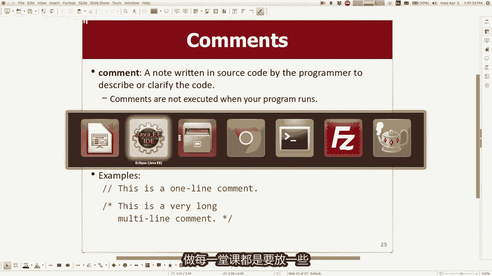

可以去做，这些不是必须的，他们不是为了使用该讲座的材料，是一个货，你可以尝试解决两个问题，所以我每次都会这么做，在我们的日历上演讲，所以要么如果您愿意，可以在课上或课后单击这些链接，并查看那些。

并尝试解决这些问题，将是你验证是否的好方法，你从那堂课中学到的材料，它们通常相当短，你可以几分钟内解决它们，并检查它们，好吧，我要跳进我的今天的航班来自这里。

幻灯片就在这里，让我们来吧，去那些地方吧。

好吧嗯，今天的讲座叫做编程，和卡罗尔一起，我们已经有了我们的计划，你和卡罗尔，但我想我们要去更深入的研究一些不同的，你可以在程序中做的事情更多更多可用的命令，你作为一个程序员，所以第一个话题。

我想要谈论的是，分解一个使用称为方法的功能的程序，你知道那个笑话吗，做了什么，莫扎特死后分解了，不好吧，没关系，我会把它编辑掉视频抱歉，这样会更好，方法是一组命令。

你把它们放在一起并命名命令就是需要的人，我的意思是移动或向左转，你可以写出一系列命令，将它们组合在一起，为命令理论命名，这将被称为方法，为什么你会这样做吗，好吧，有几个原因是为了帮助你打破结构。

程序可以帮助您控制程序分成更小的部分，另一个你这样做的原因是，它可以提供帮助你消除了那些会，否则对于适当的事情来说是多余的，所以有时你可以用另一种方式想想这个概念，就是就像添加新命令的方法一样。

卡罗尔让我给你一个具体的。

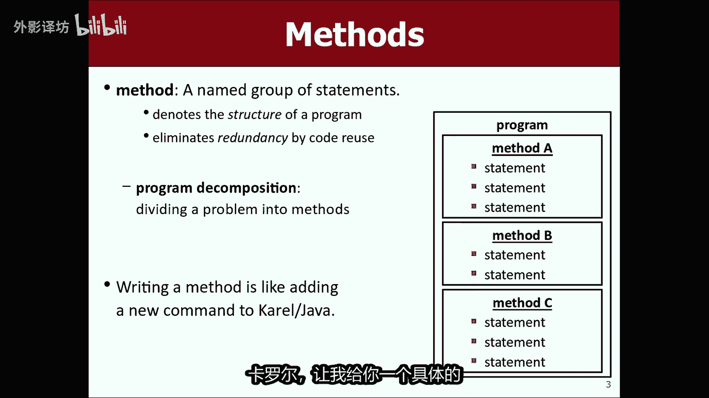

看看我们这个程序的例子写道，你看到我们怎么左转了吗，连续三次我们为什么这样做，因为我们想右转，好吧天哪，我希望我能说右转，让我试着转一下正确的不，他用红色下划线表示没有这样的命令名为右转。

但使用我要教你的功能，可以创建一个名为turn的社区，正确该命令将被称为方法，所以写一个方法就差不多了，就像添加新功能六编程语言的命令。

这真的很强大，所以让我教一下你该怎么做，有两件事你必须做的，第一件事是你必须排序写方法，描述什么，该方法执行其名称，并且他做什么，然后是第二件事，你所要做的就是你必须使用程序中的方法。

因此语法为写一个方法，就是写public void，然后你写下这个名字，你想要服从命令，并且你放两个括号和一组大括号，在大括号之间放一个系列命令系列语句，所以在幻灯片上，我有这个东西说移动三遍。

并说移动移动移动以及我基本上在做什么，我是说我想添加一个新的命令，卡罗尔说出那个人的名字，命令是移动自由时间，并且该命令的行为是move mo，然后再次移动，所以他几乎救下别名，如果我说移动三次。

那就是相当于说移动移动，移动这些彼此相似好吗。

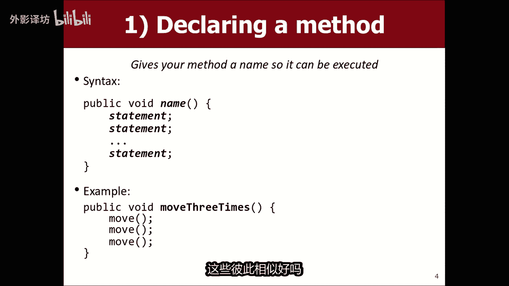

这是我的一个例子，希望有一个转写命令，他会做的事情是等价的，向左返回三次，所以我我能做的事进入我的程序，我可以写public void，右转，右转与转弯相同，离开了三次，这是第一次。

我所做的就是写下这是一个新的，我想添加到语言中的命令，当你掌握了这些方法，你就会经常把评论放在顶部，方法你说这个方法会导致卡罗尔右转90度，其实左转三遍就可以了，所以我实际上所做的是。

我现在我给卡罗尔添加了一个周转命令，所以我能做的就是在这里跑，到这里才是真正会发生的事情，这个程序可以运行，但是现在而不是说左转，左转或左转，我只能说右转，然后，我说他基本上相当于这么说好吧。

所以我认为这是一个，一开始对学生来说有点困惑，因为有这些不同的部分，就像这个在上面，这个在下面这里这些东西在底部，但他们实际上跑到这里来了，我这里的排序和排序，认为这会让学生感到困惑。

所以我想要确定到底是什么，当这个程序发生时，当你撞到小跑男的时候，按钮并运行程序，如果在这里运行这个东西。

那就是all it run，运行的内容。

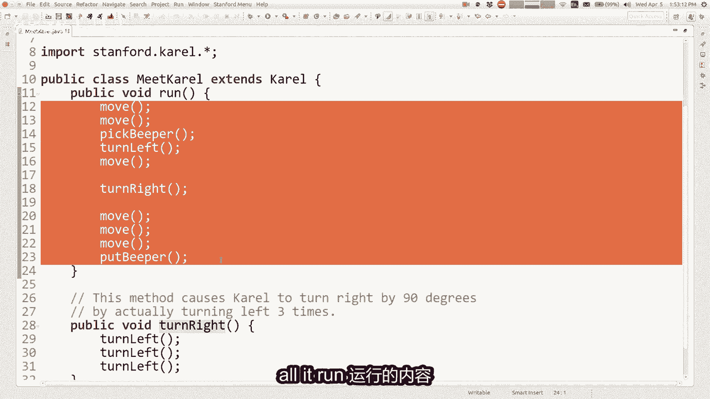

你的程序的方法，但如果运行方法提到了其他的名字，那么java基本上会取该方法，接受所有语句，在方法内部并基本上粘贴他们就在这里，并处决他们所有人，所以当我说右转时。

它会执行左转左转左转右转在程序中的那一点，好吧，如果我如果我开始，请继续并再次运行，你会看到卡雷尔向右转的节目就在这里，我相信那里，所以在那卡罗尔旋转直行的那一刻，我的右转功能来自D18行。

我觉得这个程序不多，比以前更好，但是拥有它有什么好处，右转方法是我们现在可以使用它，我们想要多少次，我想老就像我以前的程序一样，按下撤销按钮并放置，这是程序使用的方式，是我实际所做的改变，程序更长。

也许有点更复杂，所以也许我还没有让您相信，这是一个很好的改变，所以让我放回我的更改是什么，这个结构真的很强大，编写这些方法是你可以您可以随意使用它们，在程序结束时，我可以再次右转，我可以再次右转。

每次使用时我都可以再次右转，该命令我保存了几行额外的命令，必须在主要部分中输入程序，所以如果我再次运行并开始节目，最后是卡罗尔的，现在要右转很多次，卡罗尔实际上并没有在那里右转，我会转足米饭。

但我们可以想那些相当于每个其他的，你看他们是那种这些方法的，要点是程序中的这些命令是什么，到目前为止，您对此有疑问，关于方法的特征，如果你在卡罗尔的世界里运行这个程序哦，好问题轮到我了。

正确的命令现在适用于每个项目，我有或者只是在这里，稍后为这场火灾工作，当然我会教你如何写作，更加全局化的命令可以被用在很多地方，但现在当我们编写这些方法时，它们仅限于我们放置的文件，他们进来了。

而你却是，但你绝对是正确的，是有一个命令可以变得更普遍，是一件非常有用的事情，我们想要学习如何做事的空白型和东西不合，大多数时候都是空白，非常可选，就像我可以省略这个，我可以我可以减掉很多这样的。

就像你甚至可以做这样的事情，没有这样做，但是是的，这太棒了，大部分只是重要的，但在中间代码的原子标记基本上或类似，另一个例子是，如果我删除这里有间距，或者很抱歉，如果我，删除此处行尾的行距，这很糟糕。

因为我刚刚注释掉了我所使用的方法的，标题改变当然是对的，重要哦，是的，这个命名风格怎么样，小写，然后大写R，每种编程语言都有一些所需的规则，和一些喜与或约定是可选的，但是在这种情况下。

鼓励名称的大写是后者，不是强制性的，但他是鼓励如此，就像如果我想打电话，右转大写T是完全允许，但必须匹配，如果我参考上面的命令，我必须使用相同的拼写和java的大写准则，非官方。

但建议的指导方针由创造者们提出，它被称为，实际上称为骆驼长衣，因为大写字母就像小骆驼，驼峰或者我猜的东西，我不知道是的，很好的问题，你的订单怎么样。

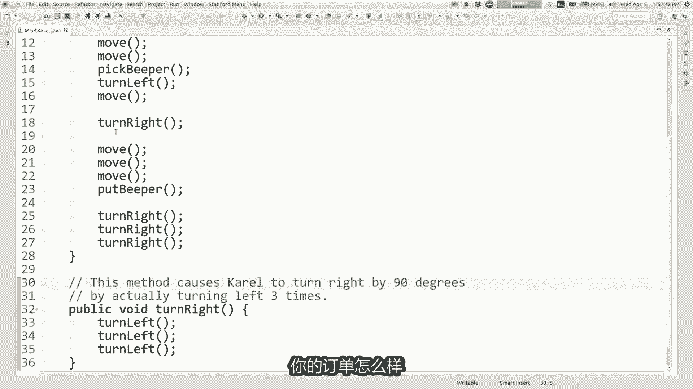

就像你会注意到我有这个首先运行代码，然后我有他们必须第二次右转代码吗。

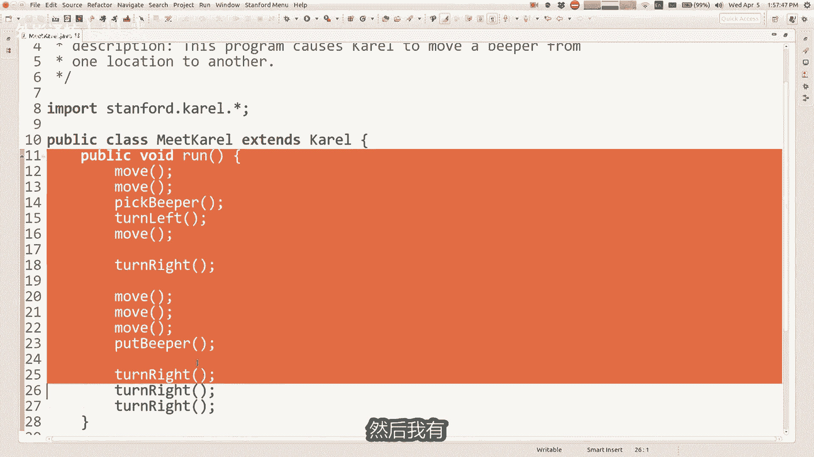

按照这个顺序，简短的回答是的，他们不必在其中顺序，并且顺序无关紧要，我有时会谈论这样的类比，就像写方法，就像写，如果你喜欢自己做饭，请记下食谱，写下食谱的所有步骤，想要表演来做这顿饭或者菜。

或任何可能在顶部的东西，你写下这个菜谱的名称，我的食种辣椒食谱，不管怎样，写下食谱，就像写作遵循这个方法，但只是因为你已经解下食谱，并不意味着你拥有正确的实际食物，按照你必须做的食谱去做这些步骤。

然后你就会有食物，就像实际做菜谱一样，烹饪食物的时候，在这里提到他的名字，那就是那里你说煮辣椒烤饼干，无论遵循食谱等等你的问题的条款，在这里订购，就像我一样写下几个食谱，那又怎样。

我要把它们放在我的食谱书中吗，并不重要，真正重要的是。

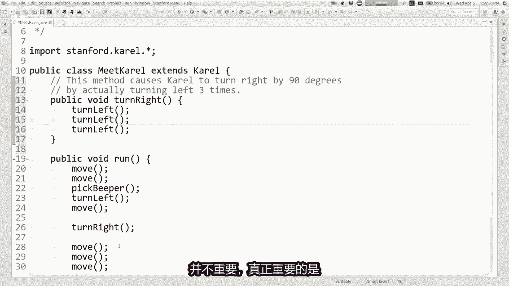

我煮东西的顺序是什么，有语句的顺序表示写在这里，好的很好，其他的到目前为止。

你可能会问一件事，注意这部分写着公开的地方，Word run，我要把它放回去，到另一个订单，我喜欢有首先运行，因为运行有点像最重要的主要部分功能，所以我喜欢看到它分裂这个说公共无效的东西，Run。

这实际上也是一个方法，只是这个方法很特别，当你开始启动你的程序，执行你的程序，java会寻找那个具有该特定名称的特定方法，程序的行为由任何其他方法都只是除此之外，事实上一旦有一次有趣的事。

你可以做的就是说好，我不喜欢跑步，如果有的话，我会走路，你说走路而不是跑步有趣，当你执行时，事情就会发生，如果你说你在想这个程序，如果我按下启动，它就会慢慢的走，对吧，不不，他什么也没做，只是坐在那里。

因为java所做的就是寻找一个名为run的方法，他执行该方法，如果我没有一个，他只是计算出你不应该做的事情，想做任何事，所以我不会做任何事，我都会坐在这里。

所以实际上如果这个名称topic board run很特殊，这将决定实际的你正在编程poo w的行为，好的。

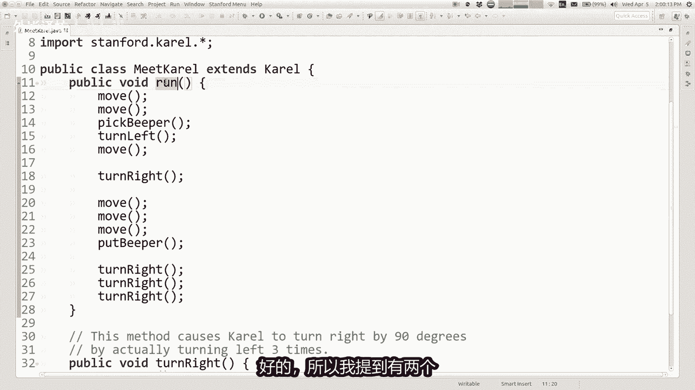

所以我提到有两个步骤，你必须写下方法，然后你必须运行该方法，写下方法，有实事称为声明方法，我们首先做了，然后在运行代码中，我们必须提到方法名称为，告诉java执行该操作的方法，被调用的方法。

调用该方法我要叫动三遍，方法还可以，所以有几个你可以考虑的不同方式。

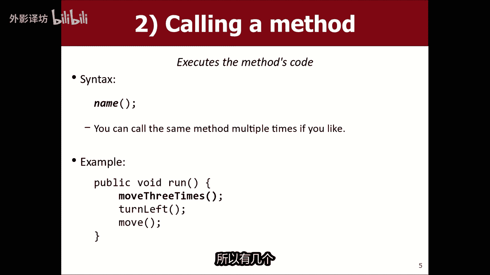

当你知道我希望你有一个你头脑中的某种模型。

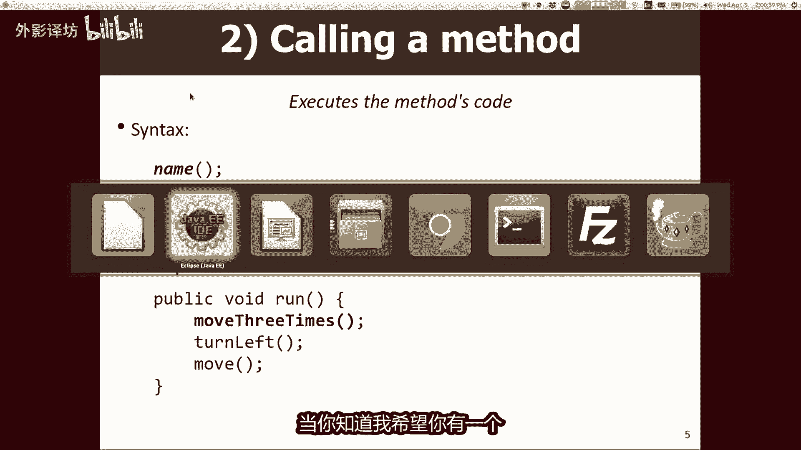

程序运行时，计算机正在做什么，我喜欢把它想象成有一个光标会有活动行驶，您单击运行按钮，然后您的程序开始移动，就像计算机正在经历每一个一次一行执行它们，序列执行一个，然后执行下一个。

下一个下一个下一个正确的顺序执行，就是这样，程序在运行时正在做什么，java到达这一行，有几个你可能拥有的心理模型，这里会发生什么，一种心理模型会有点像你的简介和粘贴模型，可能会说哦，他看到了这个。

并且他知道那个右转真的意味着这个，他看到这条线就这样做，然后他执行这三件事，从技术上思考这个问题的一种方式，事实并非如此，就是当他看到这条线时，实际上就像做了一个小标记，说好吧，我在这里，他跳到这里。

它运行这些东西，然后他跳回到标记处，从技术上讲，这是另一个变焦，确实如此，但其中任何一张照片，你脑子里的时间就足够了，他开始变得有点重要，更多是你有多个的地方，方法和执行其他方法方法，例如好吧。

让我们写一下一种叫做摇一摇的方法，可以左转右转，所以你会注意到，Shake，现在正在呼叫转弯路线，没关系，你可以这样做，晃动意味着左转，然后再转，对这就是震动，现在如果我写的另一个名为topic的方法。

避免喝太多咖啡，我说摇一摇摇摇摇摇，摇晃它，摇晃它，这将制作三份副本，形状和每个形状都是左转在右转，所以晃动太多咖啡意味着左转右转左转右转，左转右转至明白，这就是太多的复制，意思是说。

我想一旦你开始这些俄罗斯套娃的嵌套方法，调用其他方法，然后他有时有助于理解，当他看到震动时，它会跳到这里，然后跳到这里，然后回来，然后又回来，然后他再次像跳跃一样，如果你想的话，到处都是那样。

所以如果你想看太多的副本，那里的咖啡太多了，让我们看看啊，最后会是什么样子，现在他在实践中看起来就像转弯次数少很多，因为右转左转是免费的，右转是这样，真的只是左转一大堆，但实际上应该是回到原来的样子。

基本的印刷组和概念上右转三次之后，你应该仍然面朝右边，所以不管怎样，当你运行它时，像个白痴一样旋转，但是是的，那么就像你知道的那样，我们就可以在那里再写一个方法，那就是就像我们喝太多咖啡一样，你知道的。

现在就有了卡罗尔噢等等我，其实你不知道这很有趣吗，我已经赚的够多了，有时我们看起来不像阿德拉踢进去，是因为我不实际上在运行中提到了ADDERALL代码，我其实说太多咖啡了，应该说都明白就好。

你写我写下了食谱，但我没有用它做饭，你知道吗，我的意思是等等，也许我正在混合，我的这里有隐喻，但无论如何，现在我认为它会旋转很多次，因为它实际上是在一个向右滚动，好的简单护理就足够了，不要使用药物。

它最终会停止，好吧好吧，美国好吧，到目前为止这有意义吗，到目前为止还有其他问题吗，这些方法我的意思是，如果我们要在每一个家庭作业中使用这些，我们将在本课程中布置作业编写方法，而你通常不需要他们解决问题。

但他们可以帮助您将问题分解为更小的碎片，如果你有一个程序可以做同样的事情，一遍又一遍的，你可以捕捉到它作为一种方法，然后提及该方法多次，而不是多余重复相同的命令序列，一遍又一遍的发生。

这些事情正如你所知，或者也许你不知道，但是我现在告诉你，只有三个计算机科学家八件事，冗余低效率和冗余，所以我们不想要这样，所以我们还是要避免这种情况问题，Dotnet，是的好吧，他。

问题是关于这个词公共是什么，这是否意味着还有另一个，你可以也可以说，Private void adderall，一个现在是等价的，但不是影响程序的行为，按照我要教的方式行事，稍后你会了解这些词的含义。

这当然与多个有关，试图与每个文件对话，其他以及其他文件的方法，暂时可以看到或看不到，我要公开的说，因为我的心里少了一个词，词汇量，少了一项要保留的命令，我相信读者的轨迹向机器人阅读器提供材料。

他们有时使用private作为他们的方法或者其中之一，很好不会影响你的程序行为，错过了不菲事的，我喜欢你的问题，他说的是我一遍又一遍的写太多的文案。

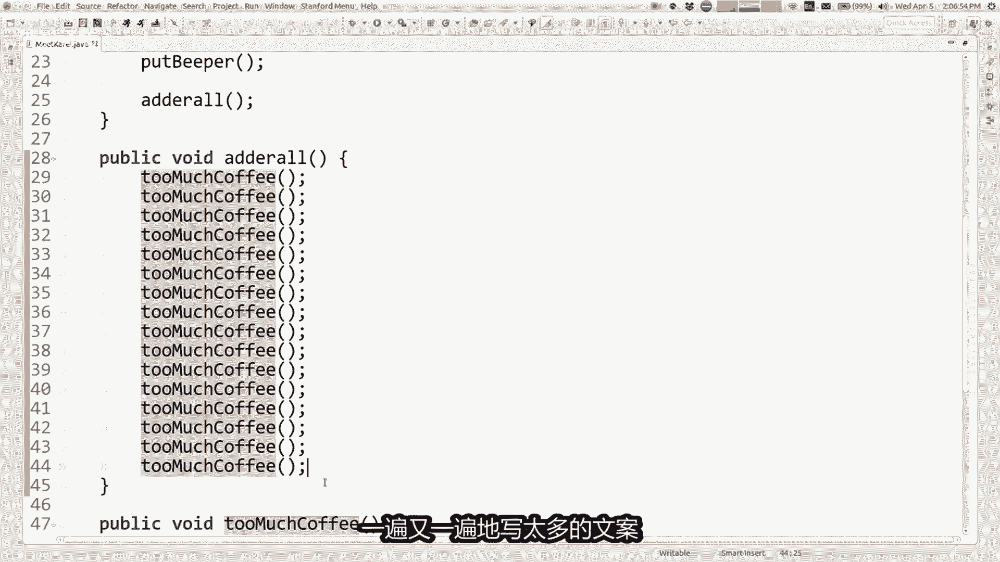

我希望我能说太多咖啡次数，十次或任意次数有办法做到这一点好吧。

java会满足你的愿望，让我教你怎么做。

我想那就是马上就来让我让我跳回我的幻灯片，我会告诉你如何让我自己想跳一点，克莱尔涵盖了一些这些东西好吧，所以回答你的问题，我让我教你一个叫做java的控制台的东西，我刚刚跳过了一堆幻灯片。

但是大部分只是我们刚刚谈论过的事情，已经差不多了，你可以看看那些跳过的幻灯片，稍后我会尝试教你卡罗尔作为一种工具，学习编程，并学习关于java，所以让我教你一些java。

我们可以在carol的Sol中使用的命令，这就是你问我正在做的事情，我一遍又一遍地做同样的事情，不想把它全部写出来，那些时候他与那些有关计算机科学家的三件事，不喜欢，其中两个出现在这个幻灯片。

冗余和冗余，所以让我们摆脱它，我可以说移动吗，其次式的你可以这样做，这是使用称为for的东西循环，一般这个词循环在编程意味着重复一系列的，一遍又一遍的命令，所以一个for循环意味着使用重复一系列命令。

我必须承认这个词，这样做的语法有点奇怪，让我跳回幻灯片一秒钟。

但基本上是多少次，我这样做了15次。

还是这样，16我觉得很好，就说我吧。

做了十次，我不想担心，关于这一点，如果我想做，这时你可以想象说这样做十次，四喝太多咖啡之类的，如果我可以的话，那就太好了，在工作中以你的方式说，实际上是你写的这个词for。

然后在括号中表示你想要重复的次数，对于很多次，这样做是为了我想让你重复这么多次，以下命令以及您输入的内容，这些括号里的有点奇怪。

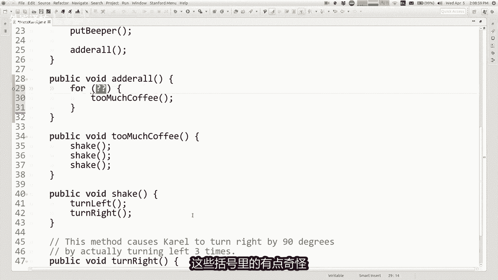

你写在你说int i equals的地方，零分号小于某个最大值数字I加加。

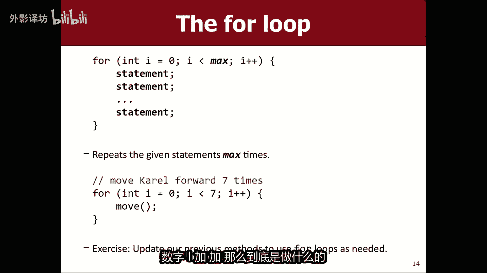

那么到底是做什么的，所有这些都让我把它写下来，其次让我为你剖析一下，INTEI等于零，I小于10I甲，再加上真的从所有这些垃圾中，唯一重要的部分是第十个是什么，这些陈述实际上是在说。

对于零范围内的每个数字，到时做这个实际上是什么，最终的意思是这样做，十字从零数到十，数到十，每次你数数时执行这个命令，这基本上就是我告诉java的，抱歉，这是语法，这样做有点奇怪。

java于1995年问世，大概是在摩尔让你们大多数人过分之前，从那时起，一些较新的语言有了这种排序的，语法稍微简单一些重复，但当时这是认为足够好，但无论如何，这个事情意味着重复太多的副本命令。

14让我告诉你，If，我去这里查看我的程序，看看我在哪里，如果我将其包装为for，请说移至此处，循环重复三遍，然后我不需要说移动移动移动，我可以只是说三四重复动作等等，让我再次运行这个程序。

你就会请参阅for循环部分发生在我起床之后，卡雷尔搬了三次到那里坐椅，让我们看看吧，欧布卡罗尔现在停下来怎么办，你知道他是否真的有效，但没有确实做了一些与以前不同的事情，钱好吧，我会把三改成五。

卡罗尔应该去这里，是的，让我们看看是否发生过这样的情况，如果我把三改成五，然后运行再次执行该程序，然后卡罗尔应该结束在这里，是的，所以我们就去吧，这是一个好一点，尤其是次数越多，你重复的次数越多。

你节省的钱就越多，过得去，对于食物是的，有办法计算下来，我认为这并不重要，因为就像我们没有使用那个号码一样，我做任何事都特别如此，数到时与看相同，不管怎样，他都会数十次，以后有几次我们想要写出的课程。

屏幕上的那些数字，然后你可能会关心这是否是一个倒计时，火箭发射与技术，像秒表之类的东西，所以是的，我会告诉你一些方法，稍后我想现在我要坚持这种模板模式，有一件事是这样的，有趣的是。

你可以放多个for循环里面的语句，大括号的，就像我把移动转动左边，他会重复这个一对陈述，现在已经五次了，排序很重要，它不会移动五次，然后转五次，移动并转动五次，这就是如果你想一下没关系。

就像我运行这个一样，再次，所以卡罗尔这样移动是因为移动转动，移动转动移动，然后转动五次，所以这两对事情被重复，所以大括号for循环的表示语句仅重复陈述，在这些大括号内重复意思是好的，有一些琐碎的事情。

例如如果您编写一个for循环，去过一次有点傻，因为这和没有for循环是一样的，根本就是你不想做的，如果你也有零情况，如果你说重复这些陈述，从0~0，它从未执行过陈述根本，所以他几乎就像注释掉这行代码。

实际上并没有运行该行代码，任何时候，这样你就可以很好地说出，为什么你想做的很好吗，有时程序会询问用户如何重复很多次，然后又重复很多用户输入零，但事实并非如此，一定要这样做，所以在某些情况下。

你想要那种东西，但是无论如何，大多数for循环都有这种类型结构就在这里，这就是如何重复关于循环的问题，是的，是的，我总是从零开始嘛，意味着你还有更多可以做的事情，使用这些循环比我们做的更多。

今天要去看看我下午会做什么，告诉你的是，有很多小事变化，比如你说你想要从3~5，然后他就开始技术了，从三开始数到五个，而不是从零开始，你可以从你想要的任何地方开始，我认为我们通常从零开始的原因是。

因为如果你严格遵循这个模板，从零开始，然后是所有你必须要考虑的是，该把什么放在正确的位置，在那里，你放在那里的东西将会是你得到的重复次数，如果我写的是从17开始一直到46，然后我必须想一想如何很多重复。

但是你知道的说，我从零开始更简单，到时我知道这意味着我会得到十四十次迭代，我们称之为重复该代码块式的，哇听起来你想要，黑魔法防御术讲师，他想知道你是否可以为在for循环内部循环。

就像for循环部分或其他东西，你完全可以做到，是的，我们就这么做吧，所以如果你再做一个for循环，然后在那里你说移动左转为一的，行不通的事情是，如果你对这两个使用相同的名字，这些名字相互冲突。

其他我真的不想进入，现在你必须这样做，你可以选择一个与I不同的字母，比如说X或J之类的，如果你现在就这样做，100次重复，因为它是10×10，重复这些话100遍，你不需要做那些事，现在正在筑巢。

但它会旋转100次，我加快了他的速度，让我重置，go ky狗，现在阿德拉恩式的挖犯罪，顺便说一句，很多人都反对卡罗尔，人们认为卡罗尔是一位女士，因为卡罗尔听起来像一个女孩的名字，但是从技术上讲。

卡罗尔是一个花花公子，或者如果机器人有任何性别，但我知道有些人想要更多，他们的机器人中的代表性和程序，所以有中频选项颂歌，我上次教学时亲切的添加的，班级里有卡罗尔小姐，当然你可以问。

是否每个女人有领结和口红或其他什么，她在头发上蝴蝶结，涂上口红，但是不管怎样，但他就在那里。

我需要一个非性别二元卡罗尔或我的东西，不知道，但好吧，这是四个循环，四个循环用于重复，现在我们我们已经学会了方法，并且我们已经他们俩都可能是学过布鲁斯的，例如对于重复的事情很有用，如果你移动三次。

然后在别的地方你又翻了三遍，你可以制定一个移动三个的方法，有时你也可以使用循环来移动三遍，所以有时学生有很难弄清楚其中哪一个，他们应该使用的东西，你知道方法有利于重复。

可能不是彼此相邻，所以例如如果我想右转。

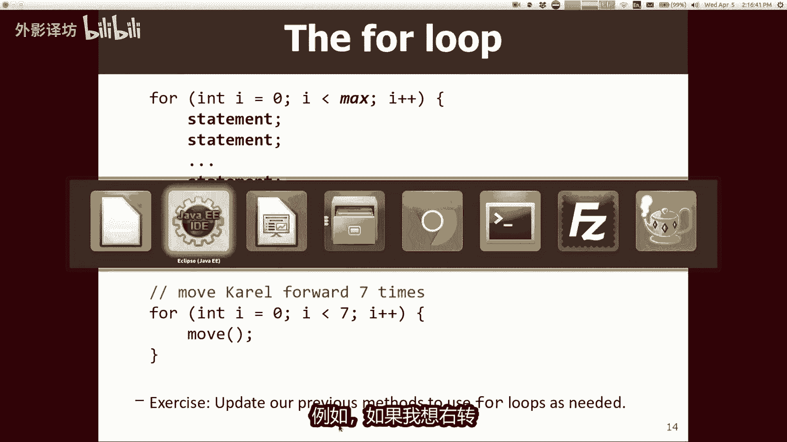

在这里我也想右转，稍后在程序中的方法是很棒的，for循环效果不太好，因为在这个和这个之间，我想要一些不同的东西，在它们之间做这样一个for循环就可以了，所有的重复都在一起，我的意思，所以用法略有不同。

当你想要其中之一，而不是有时你想要另外一个一起，就向这里右转，是与左转三次一样，所以我可以说对于int i等于零是小于三，我加加左转没关系，你可以使用这些东西在一起，我们将看到的一件事。

本课程中的很多内容是粘合，从上一课到新课的事情，本次讲座中使用他们的事情在一起，你就知道人们问我是你的考试累计，这是期末考试与旧材料和我的累积，告诉他们，不但是编程式累积，所以你优点，如果你不这样做。

了解期中考试的内容，你将无法做到这一点，最终原因是总之一切都是相关的，所以无论如何。

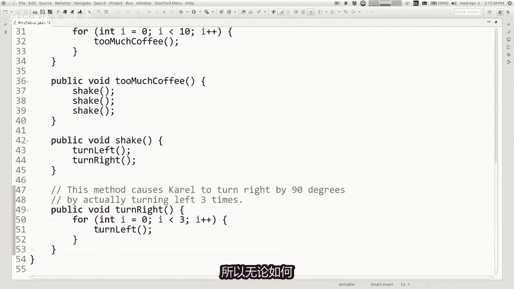

这是两种不同的技术，我们已经学会了好吧，另一个是让我们，好吧，有一个声明叫做give if语句，if语句是针对我们认为的某事会调用条件执行，条件执行可能是你运行一个声明，并可能做到它有助于计划更加灵活。

有助于程序处理更多不同类型的情况，所以if的语法，语句是你写的if和D郭浩，如果你写的东西，你想问一个你有疑问的问题，你想要执行的测试，如果是的话，你问的是，如果这是真的，如果那件事是发生后。

程序将执行命令和断路器，如果问题不正确，那么就不会执行大括号中的内容，所以我我认为我需要谈论的一件事，是什么样的测试，什么样的测试，你可以在这里问问题吗，卡罗尔附带一系列命令，您可以可以用来询问世界。

我面前清晰，或者如果拉瓦尔在，如果他们在我所在的地方发烧，就在我面前，我面向哪个方向，这些是你的程序，可以在if中提出的问题声明，所以这是一个简单的例子。

让我给你展示一下我们已经准备好的程序。

如果我经营的话，我们正在努力认识卡罗尔，再次编程，你会发现有这里有一个蜂鸣器好吧什么，如果我真的可以编辑这些世界，如果我在很多地方放一些蜂鸣器怎么办，这些不同的地点好吧，让我拿走这个好吧。

这样我就可以了，我猜我的意思是，当我走路时，其中一些位置有有蜂鸣器，有些没有怎么办，我知道哪些有蜂鸣器，哪些有，我可以很好的接受，你可能会做的类似这样好吧，我不搬家十次，但你知道也许五次。

我想拿起那些蜂鸣器，也许你说移动选择蜂鸣器好吧，我将关闭阿德拉一段时间，第二次我运行程序哦，忽悠我，忘记保存了，不要那样做，我必须拯救世界，一会就完成了，现在看看，会发生什么，它到达一个正方形。

没有蜂鸣器，程序失败，因为如果出现以下情况，您就无法拿起蜂鸣器，没有蜂鸣器可以接听，所以你怎么办，我可以在这里做什么，这样卡罗尔就不会导致程序崩溃，但仅当有蜂鸣器时才执行此操作，正确选择。

所以如果有东西选择蜂鸣器。

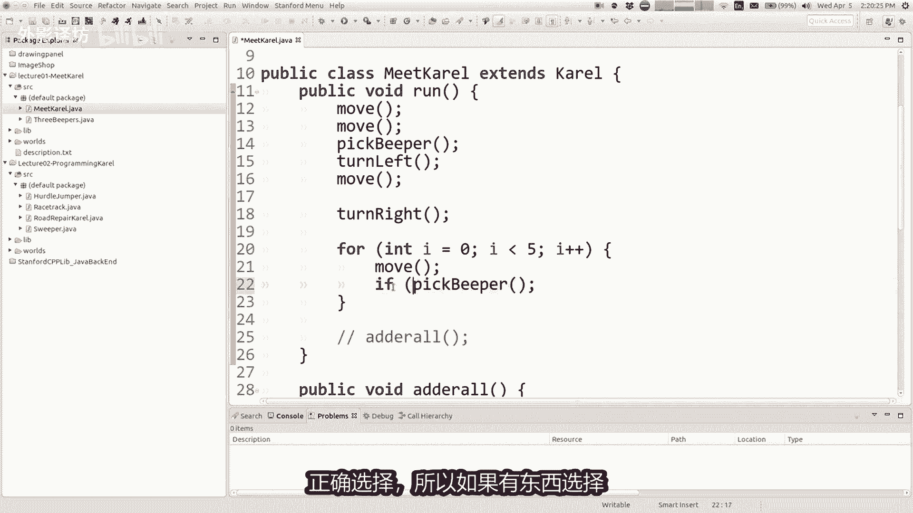

括号里的内容很好，你应该看看命令列表，这里有一个命令叫蜂鸣器。

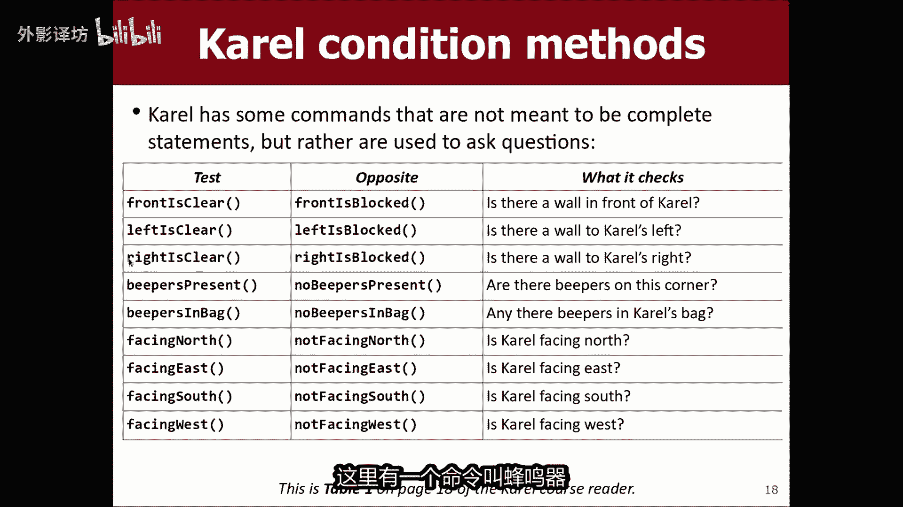

如果有蜂鸣器存在，我现在站的位置，如果有蜂鸣器，然后接听比博，所以这将是最后一次我跑的事情，然后我们就完成了，现在看看何时有蜂鸣器出现，没有的时候，卡罗尔会去捡，卡罗尔继续前进，就这样了，今天的讲座。

如果你想做一些练习，去看看so的问题，在讲座日历中不要忘记尼克松剪辑部分。

