# 【中文配音】斯坦福王牌课程 CS 106a Java教程 2017年春季课程 - P3：03_ Problem Solving with Karel - 外影译坊 - BV14U4geNEEq

好吧，让我们开始吧，今天有几则简短的公告，是周末到这个周日吗，晚上五点，我希望你们都走注册，并告诉我们讨论什么，你有空的时间，我会今晚向您发送提醒电子邮件，或明天关于这个请记下来，或者如果你有的话。

现在就这样做，您随身携带的手机或笔记本电脑尽快做，只要有空就提交，然后下周初我们会让你知道你去过哪个部门，放入我们将要开始的下一篇末尾的讨论部分，一周你忘记这样做，唯一的注册你不太可能得到的东西。

如果您忘记了您的第一选择，不要在周日之前提交，所以寻找我的，在您的电子邮件中提醒另一件事是，我已经发布了我们的第一份家庭作业，是一套我想要的颂歌机器人问题，你来尝试解决，我会谈论它。

下课的时候有一点包含了所有材料，今天的讲座结束了，下周末我们这堂课的大部分作业，你将被允许与第一个是两人一组，尽管我希望你工作，您可以单独与您的广大朋友们的想法，代码材料和课程材料，但我不想让你分享。

与您的朋友或合作伙伴，一起解决问题或类似的东西，所以不要再结对，完成第一个作业好的，总的来说，我给你的建议就像事物的术语是主题，我认为对学生来说是成功的，你能做的最好的事情，在这门课上取得成功。

就是不等到最后一刻才开始，我知道的家庭作业听起来可能像某个老人，你妈妈或爸爸的某种东西到达时会说手指向右，你步步拖延，你了解你的千禧一代拖延太多或类似的事情，我想说的是，这些作业往往有点具有挑战性。

这是一门具有挑战性的课程，如果你开始的时间早于你得到的时间卡住了，你可以来我们的巢穴实验室，从周日或周一开始并获得帮助以后，你等待的时间越长，线路都在实验室里，因为每个人其他的也拖延等等，如果你想成功。

我会刚开始，你知道开始一点点，早些时候的作业，你试可能会做好，每项作业取决于材料讲座的形式，就像我下周交的东西不需要解决作业，一向这样，你就可以开始并理论上完成整个今天的作业。

如果你或你有已经教授了足够的材料，你理论上可以完成它，马上无论如何就这样发布的，我稍后会详细讨论，今天我要做的材料，更多CARO和更多java等等，解决问题，这来自颂歌第四章至第六章，机器人阅读器。

并记住，如果您没有您的实体副本。

可以从以下位置找到数字副本，课程网站上的教科书链接可以，所以如果你从以下位置转到幻灯片。

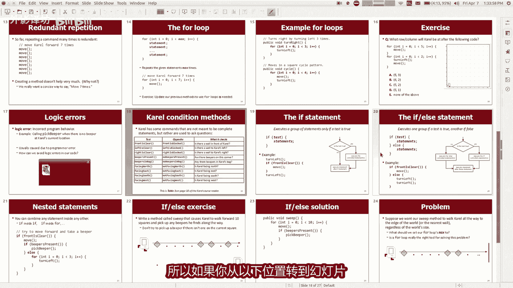

星期三只是为了记住上次上一堂课，我们学到了一些你知道可以用的东西，我们的计划，我们学到了我们的方法，学习了for循环，我们学习了关于if语句，所以我想知道如果我们能总结的很快的话，方法是什么。

什么是方法，它有什么用处，你为什么要想在某人的程序中使用一个方法，解决那个问题，我以为半路举起你的手保释来吧，有人回来，是的好吧，清理代码不必重复，你自己到底是什么样的，我认为你给了我一些好处。

孟菲斯的动力，但你可以吗，还有类似什么方法是什么意思也是吗，好的，肯定会发出一个新命令，这是现有命令的序列，有点是的，听起来不错，谢谢好的，它会清理你的代码，使它变得如此，如果你做同样的一组反复陈述。

你可以写下你的新方法的名称反复，所以它更短，cleaner清理你的代码，这很棒，完全可以让我们来谈谈，我们之前学到的其他东西，什么是for循环，Yes，重复一个命令或，命令一定次数给定，听起来不错。

嗯整个than之前的语法，所有这些看起来有点恶心，但那就是这是一件很强大的事情，因为如果你想做某件事，你能做1000次，只需编写一个for循环，或者你可以粘贴行代码，在你的中意签字代码。

然后你看起来像杰克尼科尔森闪闪发光，还是我不喜欢的东西，知道你不希望这重复你的编码数千次，你宁愿指示有一个很好的小缝循环，所以嗯我之前提到过这两种方法，for循环中有这个想法，它们可以帮助您避免重复。

你自己避免冗余吧，所以我认为有些学生得到了一点困惑，就像我想做某事，我应该使用循环5425，或者我应该使用该方法，然后执行该方法五次，哪一次，我想如果你做一个就更好了，仅包含一条语句的方法。

然后执行方法五，时间并不比只执行原来的语句五次，你就知道方法是适合将事物分组相关，然后也许你想要重复执行所有这些事情，所以你知道存在冗余这两个工具的清理方面，但它们的用法略有不同，if语句怎么样。

那是什么，因为那是亲爱的先生吗，好吧，他使将军更加灵活，程序正确，所以你说的if语句，如果以下条件成立，现在世界上关于该计划的信息，现在我想执行这个一段代码，否则我不会是的，完全可以，就以下而言。

卡罗尔的世界，你会问的事情，在if语句中是这样的，我站的地方有蜂鸣器吗，现在前面有一堵墙，你可以让我左转吗，你可以让你的程序在这些中做出反应，有时当学生是第一的时候，学习他们完全不学习的程序。

看看if语句的要点，因为他们说的好，如果的话，你为什么需要采取行动，有一个蜂鸣器，你不知道在哪里吗，海狸就在你面前的世界里离开并开始运行程序，你的反应是什么意思，那个逻辑那个陈述有什么作用，您认为嗯。

如果他说是的，你运行的程序可能想执行自身不同的世界，所以他在这里说更多，也许你有灵活的通用计划，不同的世界，不同的大小，不同的更深的位置，和你想要的成功并运行相同的程序，正确的在任何一个世界上等等。

KF语句可以让你做到这一点，这样你就记得我们是这样的。

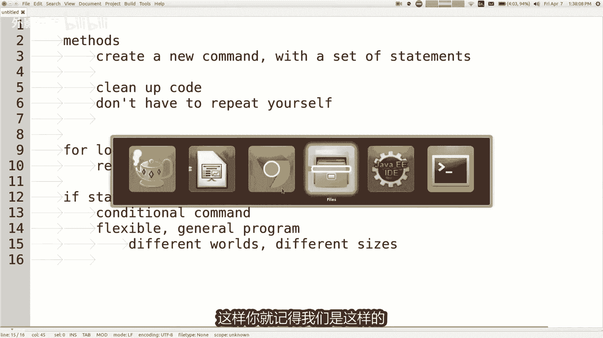

写一个程序，我认为我们正在窃取此类会见卡罗尔文件，从之前我们要执行一些今天的会议，有不同的节目，我们正在研究的卡罗尔计划，我们有他，所以他们卡罗尔你会知道步行并拿到蜂鸣器，然后移动它。

在这里我们还写了一个版本，如果沿途有更多的蜂鸣器，卡罗尔会把它们全部捡起来。

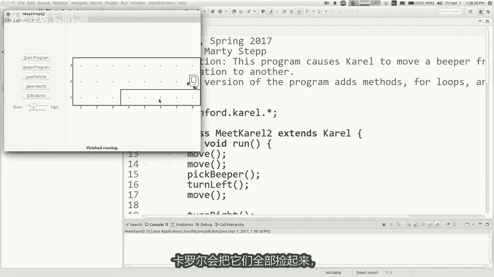

这样我想写一个友好的程序，被一个变体，所以如果我跳回来到这里的幻灯片。

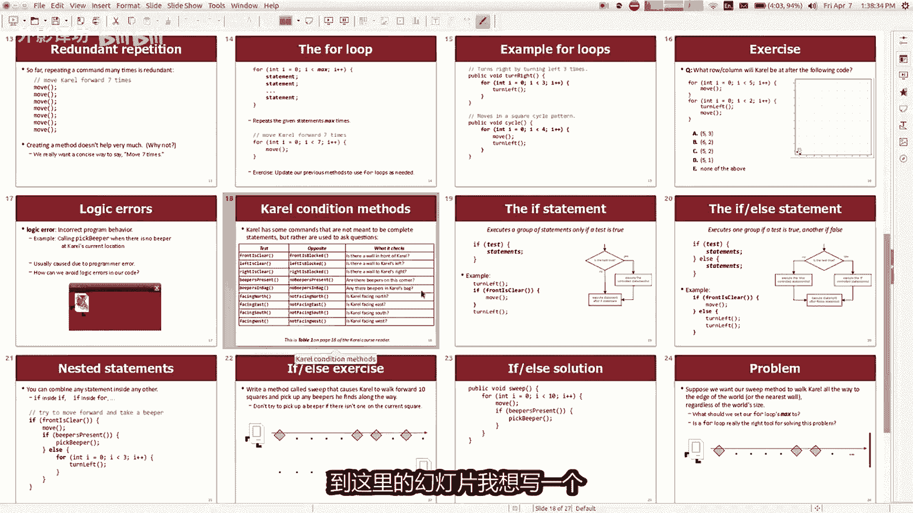

我想写一个就像扫地机一样的程序，遗产的直走和一切，卡罗尔将在有蜂鸣器的方格，好的把它们捡起来，他确实在幻灯片，我希望有一个名为扫得好，如果你看看，我的zip文件中的程序。

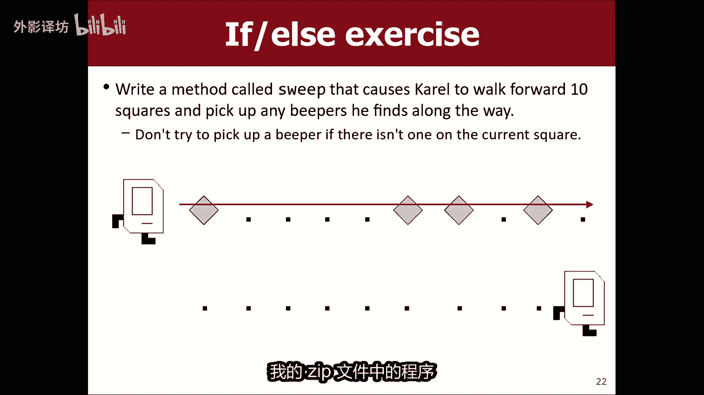

今天我有一个叫扫地机的人，java哎呀，别看我离开了，分组回答剧透我已经解决了，在我没有想到这个之前，实际上是问题，哎呀好吧，现在我有一个空白程序要写这个扫地机，可以捡起所有的东西，蜂鸣器现在可以了。

我只是想澄清一下，可以输入我们的粉红色代码，之前写过，如果是的话，再次使用它有用，所以我们写了一些代码，有点像走着走着捡起所有的蜂鸣器，就在我们编写的程序中，在我们做这样的事情之前五次。

并且每一次如果有蜂鸣器并接听人们都很好，所以我可以接受代码向前走，并拿起蜂鸣器不断响起，我可以过去，在这里我可以将其粘贴到此运行中，方法保佑你，这样我就可以做到，那就好了，现在扫地机会这样做。

如果你是想的很好，但我也有同样的想法，命令和这两个文件都在那里，某种方式来巩固它，这样我就不会需要为以下内容编写备忘录文件，暂时我会说我们不要担心，让我们限制我们的关注，单个文件。

稍后我们可以再回来讨论这个问题，但是好吧，那是我在走路向前并打起蜂鸣器，实际上如果你不介意的话，我会写一些我想说的公开内容，虚空横扫就是我写下一个前进的方法并深入，所以现在在运行中程序的一部分。

如果我说扫描告诉它运行该命令，所以真的这周有所有过去的代码，此时在run方法中好吗，让我们运行一下，看看效果如何，扫地机世界就在那里，世界上有一些传呼机，我开始节目和卡罗尔一起走，拾起更深的部分。

但卡罗尔没有一直走到最后，因为我说只走五趟，这世界有九个正方形，所以如果我从一开始我到九个，你们是斯坦福大学的学生吗，你很不错，在数学上，所以你可能知道我看完八遍二响一切顺利。

我总是很害怕在斯坦福大学的人们面前做数学，因为你知道有一个项目MADELINE，我很好，但是现在我可以走路了，一路走到世界的边缘，我正确的拿起所有蜂鸣器，你会发现的事情，我们会讨论关于适用鱼的灵活程序。

不同的世界对吧，如果世界怎么样，没有恰好添加八个正方形，我忘记了我有什么世界文件，你运行卡罗尔，你可以说加载世界，当你可以选择一个不同的世界运行程序，如果我点击了按钮，我已经有了所有这些世界文件。

但今天项目的一部分，我今天发布的zip文件的一部分，如果我走到这里，有一个叫扫地机，也是哦，那不完全是这样，我想等一下让我看看还有什么，我那里有扫地机，所以这是一个更大的世界，更多的方块。

所以如果我启动该程序，卡罗尔不会实际上一直走到最后，因为我的for循环在U8处停止好吧，我可以，我是个聪明人，我可以修复它，它从一变为15及14正方形，所以我将更改为14，现在一切都很好，当它出现时。

我首先再次运行该程序，首先加载它使用的是原始的世界，所以如果我开始，并且它将会14，然后哎呀，当你尝试时，卡罗尔就被阻止了，向前走，你的面前有一堵墙，你如何收到这条愤怒的红色信息。

这是一个我们不希望出现的错误程序，可以做到这一点，那么你怎么做，有时让他去援助，有时让他继续14，这很有趣，我们希望卡罗尔这样走路的情况，我们想不行，直到我们到达强，你想停下来。

实际上这是设计了for循环，并不是真正正确的结构，解决我们基本上想要的这个问题，说走吧，直到你无法走开为止，你可能已经想象得到解决这个问题的方法，我们就在其中，在这里写代码，你可能会说很好。

如果我可以移动，然后我想移动到你右边，事实上可以这么说。

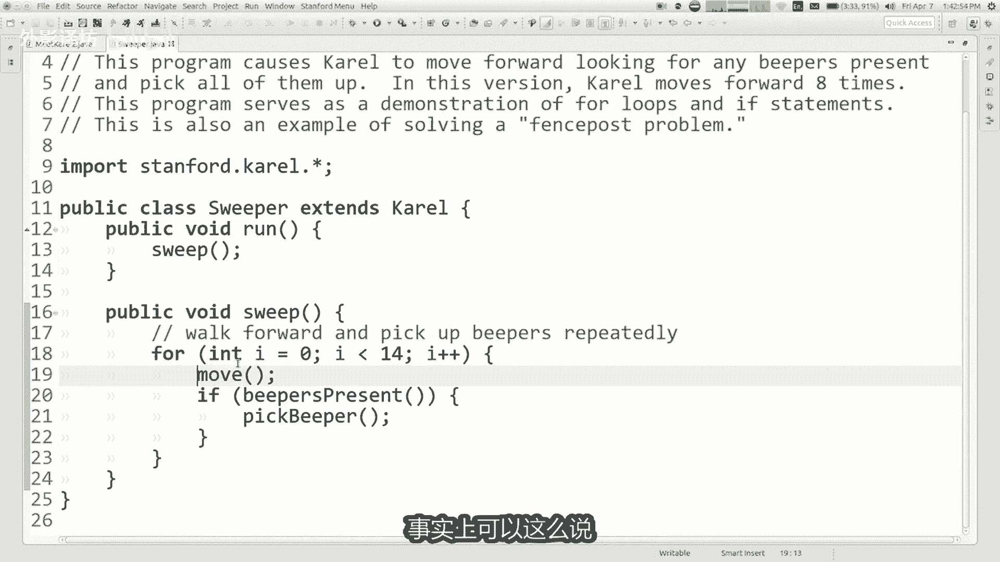

CARROLL中有一个命令叫front，是畅通的，还是前面被挡住了，所有这些不同，所以你可以说好吧，如果前面清楚，我想要移动，就有可能做到这一点，程序可以使用以下方法，避免其中一些错误那个命令。

但我想即使我们这样做了，这仍然是我们的事情，使用错误的结构，java解决这个问题的办法位于for循环。

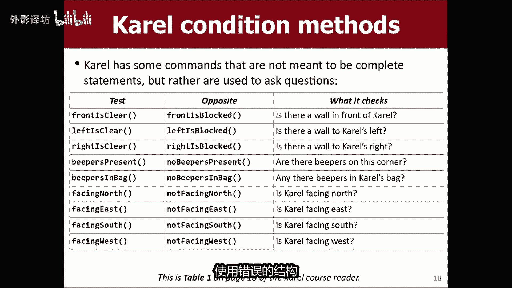

是一个for循环，实际上是当你确切知道数量时很好，有时你想做某事，我我想做八次，我想做的事五次，for循环并不是真正的，如果你只想根据需要多次执行，并且你不知道会发生多少次，直到出现这种情况为止。

这样做，只要是这种情况，如果你在我们称之为这样的情况，一个无限循环，它是不定次数。

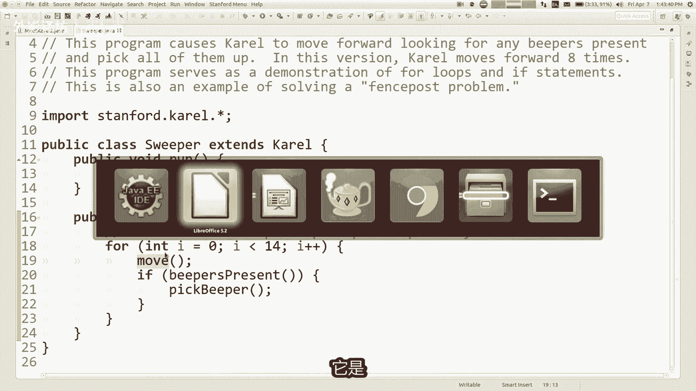

我想重复一遍，如果你处于这样的情况，你想要不同结构的情况，这称为while循环，我正在教你的java声明，while循环的语法，看起来很像一个如果的巨大幸福声明，所以有些学生混淆了他们与彼此之间的区别。

while循环和GIF主题是if语句，检查条件是否为，或者在codes周围，这不是真的，could的while循环也可以做到这一点，但是运行完该代码后，返回并检查状况，再次运行代码检查条件。

运行它反复检查的代码条件，并运行里面的代码，直到顶部变为假的条件，直到它是不真实的。

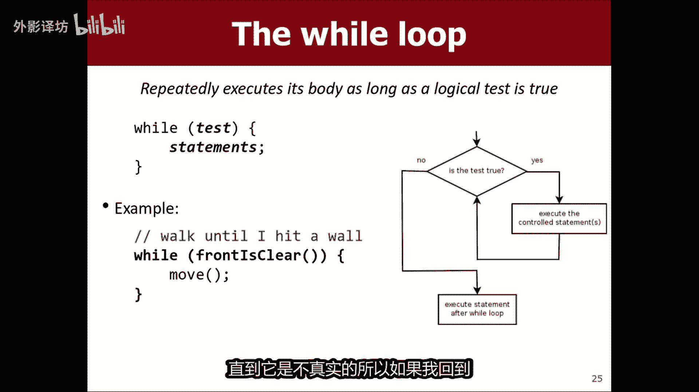

所以如果我回到，这个程序我说好吧，我不是要去14次，或者无论我是什么，只要我会继续下去，你知道我提出了什么条件吗，前面是狂野的东西，虽然我可以清楚地知道继续前进，捡起海狸好吧，我已经跑了。

而且一切都还在继续，直到我不能再去，如果我家在另一个世界叫扫地机或宽，一直走，直到那个不能再运行了，如果我家在这个叫扫地机的世界很窄，世界比这个还小，好吧，只是为了说清楚关于while循环的作用。

是记住我之前谈过这个，当时你运行一个程序，我认为它就像有一个光标向下移动行，并执行这些行有影响力，所以如果你说运行，并且它说扫荡，然后它会跳到这里，这就是疯狂的执行方式。

他做的第一件事就是询问前面是否畅通，如果是则进入它运行所有这些命令序列行走，所以他移动，然后它也检查是否有海狸存在，跑步后有人捡起它，所有这些都回到这里，他再次询问前面是否清晰，所以他执行所有这些命令。

再次确定，所以检查测试运行所有语句，检查测试运行所有重复语句，直到测试部不再真实了，哦这是一个很好的问题，他说了什么，关于字段从哪里开始，所以我想现在谈论这个实际上是这样，让我忘记我是否有一个世界。

这让我仔细检查加载世界扫地机，扫地机我想还可以，这就是我拥有这款扫地机的原因世界，所以看看这个差异，一是你刚才问的，恰好有一个蜂鸣器，卡罗尔已经开始，另一件事是在一些，如果你的眼睛很锐利的话。

这些方块你可以看到他们的小数字越深，实际上意味着有一个一堆三个烧杯或一堆，不管有多少人说，卡罗尔可以拾取并存放多个蜂鸣器，但每次你说接蜂鸣器时，它只拿起其中之一，这样你就可以需要把它们全部捡起来。

程序真的可以工作，所以如果我运行这个，我从五个开始，没有一个他们被接了，卡罗尔也接了，每个广场都有一个蜂鸣器，这个错误这个程序有两个错误，基本上如果没有的话怎么办，拿起一只鸡只海狸，他不会挑选多篇论文。

我认为多个蜂鸣器错误是更容易发现的错误，首先解决这个问题，如果你看看这个程序，他说移动到，下一个方块以及是否有蜂鸣器，选择一个我们可以改变什么，该程序拾取所有蜂鸣器，给定的平方是while，While。

其中而不是一些学生的，如果是的话，如果有的话，会说很好，然后有蜂鸣器出现在场的传呼机发现了他们，也可以，但你不这样做，需要if和while，你知道吗，我的意思是你正在检查同样的事情发生两次。

所以他是其实只要把它放回去就好了，就是这样，字面上只是改变if1词变成a while，so while1词，我所在的广场上有报纸，常设想选一件选一件就可以了，当没有更多的时候就会停止好吧。

很多学生都构建了他们的以种向后的方式编程，也许在这里，他们写狂野海狸存在于外部，所以有时循环嵌套和排序，有些事情可能会让学生感到困惑，如果我在这里做外循环，说比伯现在的一件事是重要的，是要记住循环。

while循环，如果他们继续进行指导条件，直到测试变得不真实，所以另一种思考方式是，如果你的程序曾经到达这里，D24，请表示测试已完成，第918行不再正确，它意味着没有任何守门员在场卷曲，很有趣。

但它也意味着程序不会再循环一次，卡罗尔拿起了其中一台的传呼机，正方形，你知道我的意思吗，有很多我们不想要的方块可供观看，刚刚完成处理，其中之一正方形，所以无论如何，我认为顺序和嵌套很重要，这很重要。

想一想，所以这个版本的我更改if海狸的程序，送给野生海狸的礼物，应该照顾那个多重海狸错误，所以让我们尝试一下，我将装载您运行的清扫气管，卡罗尔把所有的事情都解决了，干得好，卡罗尔除了你问的问题。

卡罗尔站立的起始广场，没有听到那里的蜂鸣器，所以有什么问题，为什么不在乎我会从起始方块的while应该是，首先啊是的好吧，所以我认为这只是另一个例子，甚至对程序进行类似的推理，在你运行它们之前。

或者只是通过看看代码，如果你只是看看代码的，意思是让我们开始吧，首先让我们拿起蜂鸣器，在那之后，逻辑上如果我们所在的地方有海狸，原本坐着的，你会走开，在你开始挑选之前，从那里开始塞满理解，所以像这样。

程序永远不会选择现在出发广场有什么事情吗，你有一个建议让我们改变一下，为了让我们剪切并粘贴它，挑起更深的部分，然后好吧，让我们运行程序，看看他是否再次工作，我必须加载世界的青草者，所以有世界。

现在我开始了，是的，我正在选择蜂鸣器响了，看起来我们已经拿到了，这个程序，绝对完美，没什么问题，废话这不是，现在他变得更深了，就这样翻转两条线，固定购买英国产品，你知道我们已经将一个恐。

牢固的塞在另一个孔上，扎根于船上或其他什么地方，是的嗯，这是一种有趣的类型，一个错误，因为他确实看起来像这样，是如何解决的，正确结构这个问题，但这两个问题都不是命令，实际上可以解决这个问题。

实际上这种错误很常见，有一个名字。

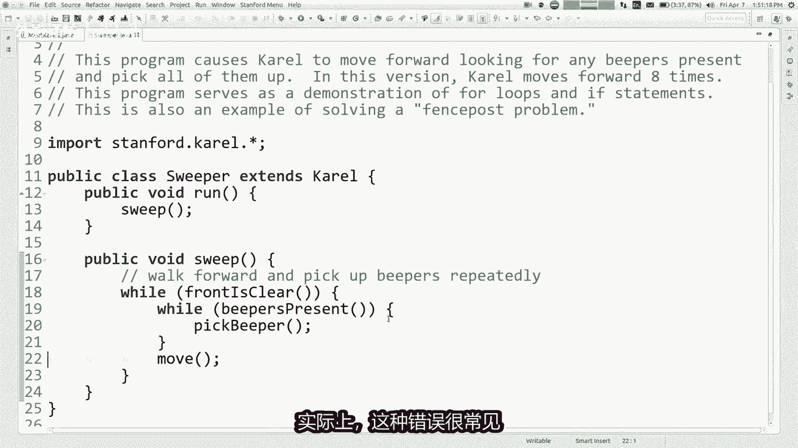

所以我想跳，我忘记了是在这些灯光下，还是如果我能跳到我三岁的那个。

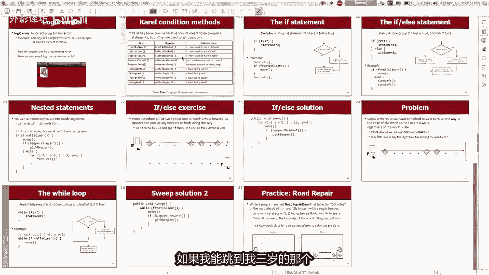

是的，我可以为此跳到我的航班讲座幻灯片三张。

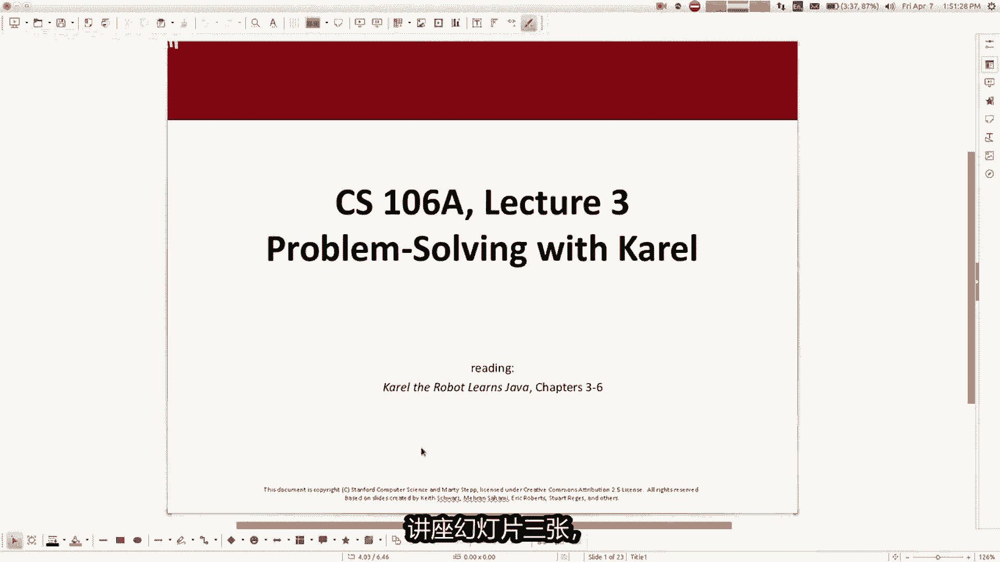

所以清扫器同时循环好吧，那么这里到底发生了什么，是我们正在重复一对事情，正在发生变化，但是事实上，如果你认真思考一下，仔细计算我们需要的次数，移动次数与移动次数不同，有时你需要收拾东西。

如果你正在穿越一个巨大的世界，7米需要移动六次，但是你需要接机七次，所以将这些东西配对在一起的任务，永远不会导致正确的，如果我看的话，他们中的很多人都会明白，在我的代码中。

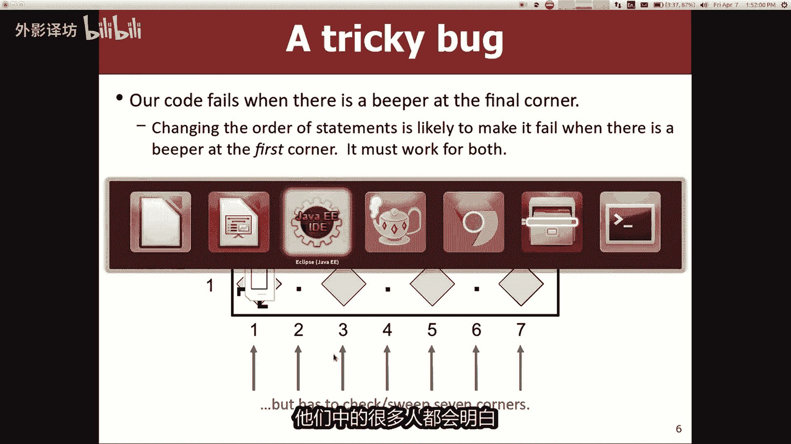

这两件事是这样的，开始活动和运动活动总是以受损的方式进行。

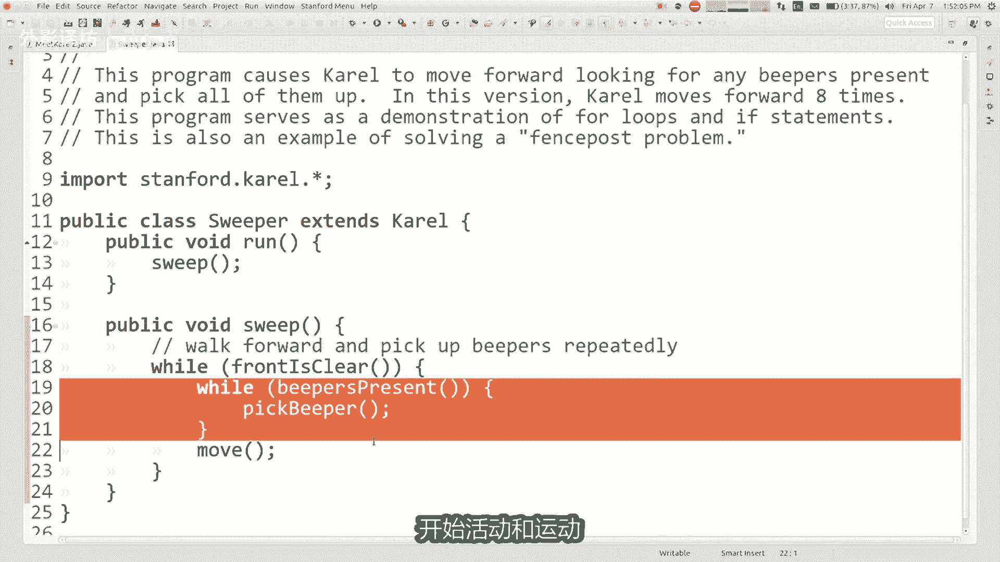

因此永远不可能做，其中一个的六个和另一个的七个，只需使用这段代码就可以了，每当你有某种人，你需要做的事情的发生，然后N加一次出现另一个你需要做的事情，是一件很漂亮的事，我们称之为栅栏柱的常见东西。

问题是因为这里的类比是，如果你正在建造一个旗，然后你需要放置柱子，你需要放置电线或者铁子，右边和之间的东西，如果你像在右图，你需要五个帖子，但你需要四段电线，严禁彼此。

所以如果你的算法像记住电脑一样建造围栏，科学和编程很多次，关于提出像这样的算法，我们告诉机器人该做什么，或者不管怎样，如果你告诉机器人，这是建造栅栏并放置柱子的方法，放下，然后放下一些电线。

然后重复很多次，你会有一个粉丝，你会有，但你会有电线悬挂在最后一个柱子上，栅栏正确，所以常见的伎俩，人们这样做是为了解决这样的问题，栅栏柱的问题是他们放置了一个柱子。

首先然后反复的它们放置一个电线和柱子，电线和柱子，电线和柱子，在每一次吉文斯的帖子中都是这样死亡，你将拥有完整的栅栏，没有悬空的电线，另一种选择会有那种红色的循环在那里，但在循环之后，最后放置一层。

最后一层分开，所以指示这里的关键见解是，在之外有一个额外的职位，你循环了你之外的许多东西重复，好吧好吧，如果我告诉你，我们有时我们会遇到栅栏柱问题，必须将类比映射到java和如果他们是什么帖子。

以及是什么，这个全面问题中的电线是什么，是柱子，什么是电线，这些帖子正在发烧，电线在方块之间移动，柱子或拾音器和电线都是运动，是的是的。

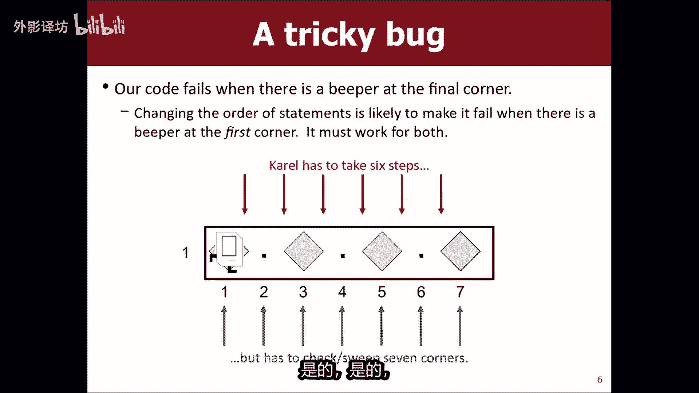

那好吧，如果我去的话，我的代码在这里，这部分是正确的帖子，这部分是之间的电线，铁子我才刚刚开始，我不想紧张，这个比喻就像一旦你了解这个策略，你可以将其应用到很多问题。

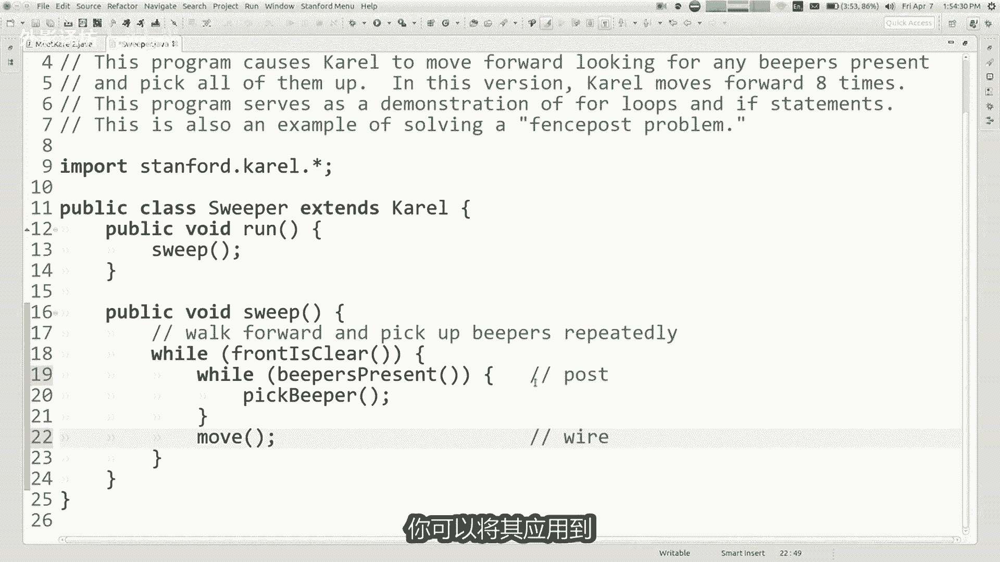

所以值得一试，谈论一分钟，所以诀窍是你的算法应该发布，然后电报我们已经接近我们的岗位了，好吧，所以让我这样做。

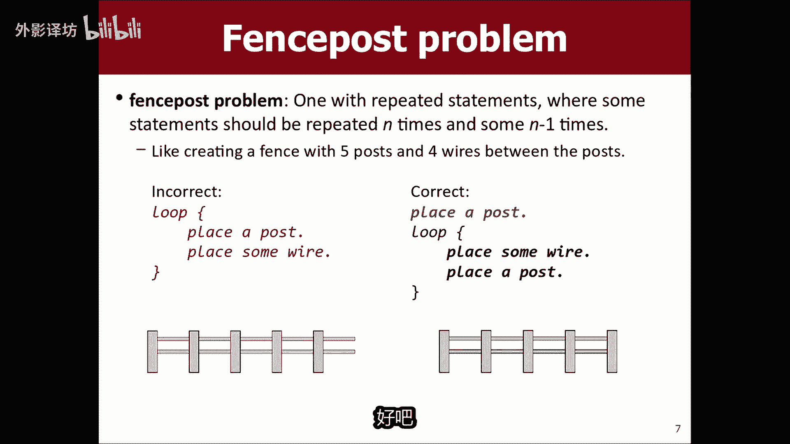

这意味着什么，我想要一篇文章，在我的重复之外，然后，在我的重复中重复订购，应在消防水袋后进行接线柱，这意味着我应该反转，这些就这样好吗，看看我在那里做了什么，让我们尝试一下，如果它有效。

我们将拾取所有帖子，甚至从起始方格开始结束方块，所以让我们加载并选择这个，让我们开始吧，所以我选择了第一个正方形，中间的正方形似乎正在工作，并且它正在接听最后一个方块啊好吧。

我知道我有时有点简介粘贴和移动代码，很快我用了很多像我选择型这样的小键盘键，然后我点击CTRLX进行剪切和控制，V粘贴和你不必做的事情，如果你不想的话，有一个一堆按钮和工具栏之类的东西，如果你愿意的话。

但那就是集合我们需要对此代码进行了更改嗯，你会注意到的一件事是可能有一个循环，然后另一个像这样循环就可以了，它是否运行第一个循环已完成，然后一旦完成它就开始第二个。

它们没有连接到每个其他直接他们只是按顺序，但这是我有循环的情况，我有第二个循环，但其中一个嵌套在里面，其他的，所以现在他们直接彼此的一部分high MAD是不同，所以有些学生很难顺序循环与嵌套循环。

这个程序对你来说很有意义，对此代码有任何疑问，我们写照，啊是的，所以他的问题是这样的，还有另一种方法可以做到这一点，也许我们也许我们做点什么，更像那样或者会的东西，没事好吧，我们来谈谈。

所以现在你基本上是在说，我可以剪切这段代码并粘贴它，就像那样是好是坏，我相信我还没有运行它，但我很确定他会查看我已经跑过的，主要区别在于它会多次执行这段代码，每一次进步都会做到之前和之后。

以及排序就像刚完成后一样，之后并围绕之前，难道我们不需要他，就像他们一样彼此相邻，因此程序将执行不必要的说明它们无害，但是从技术上来说有点效率低下，我发现很多新的程序员过分强调效率哦。

拥有电脑是不是很糟糕，执行一个额外的步骤，只要不会损害某些人的行为，可见这很好，但我倾向于更喜欢，如果我能准确的接受一段代码，只需将其移至此处即可，然后知道会少很多次运行它，我认为这有点小好一点。

所以我宁愿这样做，与其他外行功能很好，另一件事是，你知道一些人们不喜欢重复野生海狸，提出皮卡河，如果有野生海狸的接送服，你想把它清理一下吗，想法怎么样，一条消息怎么样。

如果我做了一个名为public board pick up的方法，所有的海狸并捡起所有的蜂鸣器，是当由海狸拾取时，它们都起来了，所以现在我只能说捡起所有的海狸，然后前面是明确的移动，并拿起所有蜜蜂。

看起来有点性感一点更好，是的，也许你不喜欢那样长名字，你知道你可以选择一个比那个短的不同名称，你应该选择一个描述性的名字，就像不要像前王子那样称呼他，你知道不要继续打电话，比如捡起全部或其他东西。

与此类似的任何其他问题，你们的节目做得非常好，所以让我给你一个更难的关于这个，让我再次运行它，并让我编辑世界，让我们放一些，这里和这里都有传呼机，我想要卡罗尔，一直走到边缘，把它们都捡起来。

但我不想要卡罗尔拿起中间的任何东西，就像其中的这两个人，你知道我是什么意思，是我想让卡罗尔到处走走，世界地边缘，像他一样一路摆到这里做，然后向上，然后结束，然后下来，Redit。

让我作为一个拯救世界扫地机，太快太猛烈，好吧，这像我一样有意义吗，不关心他，这是程序告诉我，你的是什么建议，我可以做什么尝试，也许不同，哦好吧，如果让我再运行一次，所以如果卡罗尔被阻止，就像卡罗尔一样。

一路走到这里，然后转弯向左，并开始向右走另一条路，现在好吧，我想我会怎样，说这是最优雅的方式，写程序是不说的事情，你不必这么说，这是本文末尾的一个例子，就在粗糙的地方，我们知道什么，确定卡罗尔在哪里。

或者发生了什么，世界的现状是什么，你知道那一刻正在发生，你说检查卡罗尔的博客和所有那种东西，D14行carol发生了什么，卡罗尔已经在世界的边缘了，一直到右边，所以你说卡罗尔阻止了什么。

我积极的卡罗尔被屏蔽了，所以我可以问，如果前面被挡住了，但是空洞的肯定是真的，因为我的线环和我的代码的其余部分是什么，不会停止，直到它变成是的，你知道我的意思，所以我认为学习的一个重要部分。

卡罗尔和编程就是省略东西，不需要在那里，就像我一样说前面是否被挡住了，这就是前面的对应部分清除，然后我在这里REX更多代码左转，然后移动什么的，就像这样，这是完全正确的代码，就像我启动程序一样。

卡罗尔是快转弯和移动完全正确，但如果如果前面被挡住了，我只是将其删除，他仍然工作的很好，因为下面的while循环不会停止，直到卡罗尔被屏蔽了，你知道我的意思，可以假设这是一个关于此刻的世界，还好。

所以就是这样，现在是一个好的开始，所以再给我一些，就像之后我应该做什么，向右扫，是的，你想要这些for循环在哪里去了四次，你想让我去哪里说，这听起来是个好主意的，开头就像在这里运行循环四次，我该怎么办。

在循环中做，让我们扫描，然后转动油滴，非常接近你的，说了，但这只是自动倍数字，当然可以让我们尝试一下，让我们装载清扫车太快太猛烈，也许做的很好，非常本地化，所以那里你去。

那就是那个扫地机绕过屏幕的所有四个边缘，做四次，走到最后右转，这有意义吗，也许，现在更有意义了，为什么我首先写了一个swift方法，因为原本我们可以在run方法中写了一段代码。

但是将sweet变成一种自己的方法，让我们更容易重复清扫，如果我们需要再等一会儿啊，因为我们已经知道你可以接听，比如哦，而不是，四字就像该行突出显示一样，也许可以把它变成一个while循环。

但我认为很难知道那里放什么小费意味，如果你说好吧，虽然有蜂鸣器，第一次扫荡结束时，不会有任何人是这样的工人，你说的可能不太有效，当手机被屏蔽或其他什么情况时好吧，每次你走到边缘时，你会被屏蔽。

所以我想在这种情况下，我的意思是总是很棘手，知道我应该离开for循环，还是while循环或give语句，我该怎么办，使用我所想到的所有内容的组合，在这种情况下，我只能知道世界是一个矩形。

如果我做出这样的假设，我会说很好，去周围走走矩形，我只是为了尺寸安装尺寸线，可以使用for循环，一次执行四次循环会更像，我不知道如何有很多方面我不知道是吗，在三角形世界或其他什么地方。

我想想在卡罗尔的世界里，你可以假设你在一个矩形里做一位，这个因为还可以吧，到目前为止我们做得还不错，你们还有其他问题吗，关于这个特定的循环是一回事，我只是想让你知道，我喜欢和你们一起写很多代码。

我想让你帮忙我写的以及其中的一部分，我的教学我认为对你有帮助，伙计们看看我写的程序，你知道吗，开发他们并调试他们等等，我要做的事情，一直我要告诉你的一件事，只是因为时钟很多时候是有限的。

课后我去清理代码A在我发布他之前一点点，例如将一个非常好的做法，在每个方法的开头添加注释，你的程序通常不会有这种情况，是时候在课堂上这样做了，但是正确的下课后我去做，这不是完成程序指导好的。

我只是想确保注意到这一点。

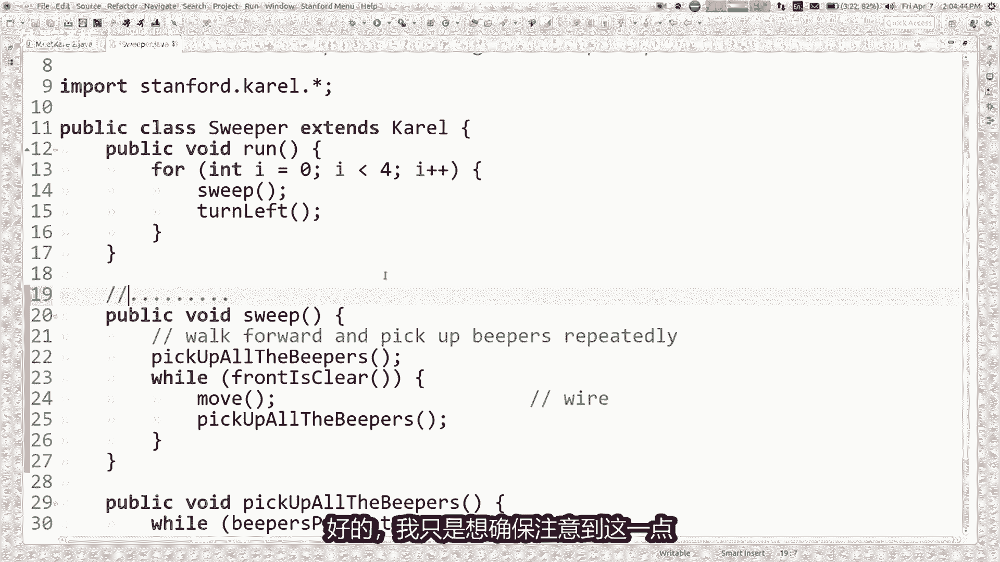

你知道好吧，让我们回到幻灯片，并谈论其他意见，编程示例，所以这个练习这里说的是赛道，但这基本上是我们之前所做的事情，世界的边界，那很好，我要继续前进，让我们谈谈关于这个叫做障碍跳线，所以墙壁很薄。

延伸到一定高度，卡罗尔我想跳过那些墙，希望卡罗尔最终落到底部，就像你的位置911样，允许假设正好有八条曲线很好，但你不这样做，知道每个人有多高，所以我想要你在编写这个程序时提供了帮助。

但我我也一直想一直强调方法的重要性，和打破大问题分解为小问题，我很多同学认为大错特错，让他们打出100行代码，然后他们运行程序看看它是否有效，他可能不行，如果我这样做的话，那是行不通的，选择这样做。

所以你不应该这样做，要么你明白我的意思，这很多更好地改变规则并解决问题，更简单的问题并测试它，并得到让它发挥作用，然后将其发展成你真正想要解决的问题，有什么比攀登更简单的任务，超过八个障碍。

如果我告诉你，你必须这么做怎么办，知道你生活中的八个引体向上，对于我们中的一些人来说，简单的任务有点困难，也许只做一根杆子就可以了，然后我会打电话给你，谈论另一个七点以后，如果我说就这么做。

很多时候写一些代码来做到这一点，笑了，这是一个非常简单的，减少一个你可以在程序中解决的问题，让我们编写代码来跨越一个障碍，好的，我的项目中有一个文件叫跨栏阿狐友。

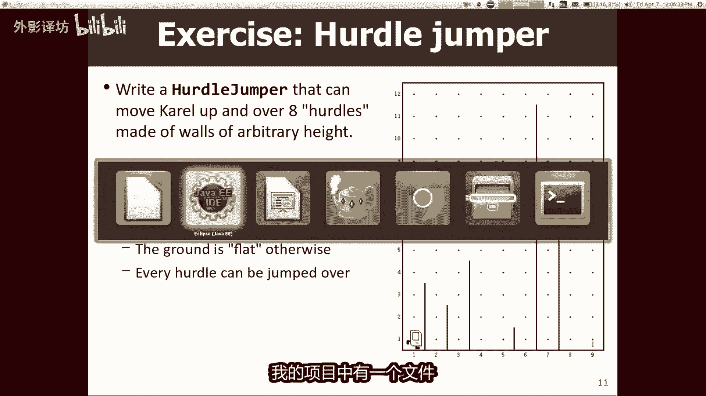

为什么都是，这里的答案离开这里，笑声让我们编写一个名为jump hole的方法，好的这就像跳过一个障碍，所以也许永远都在奔跑中，方法我会说跳蓝河，有时当你写这些的时候，评论很高兴谈论这样的事情。

你做了什么，假设如果有的话。

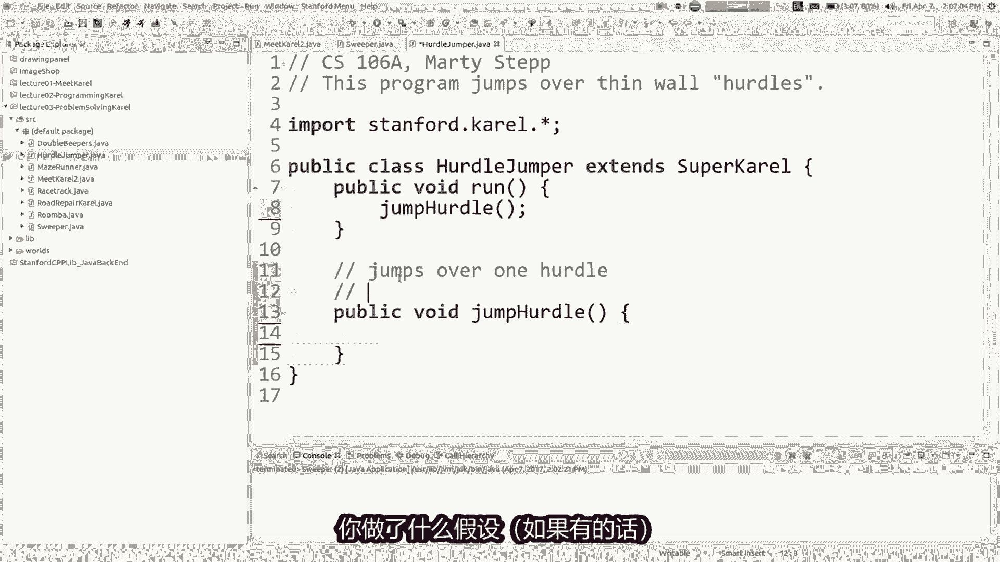

就像如果你看这个节目，卡罗尔位于左下角，面向右朝东。

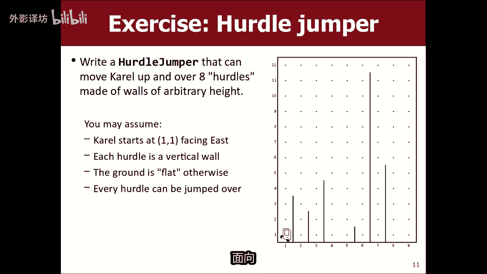

所以也许我会说的是，假设卡罗尔正处于障碍的底部，面向东方，然后就是我的了，在我的代码之后，方法会表现良好，这里在这段代码运行carol后，运行将会越过底部的障碍，他仍然面向东方。

所以我为什么要说全部那东西很好，因为喜欢，因为嗯你知道我有点想让卡罗尔离开。

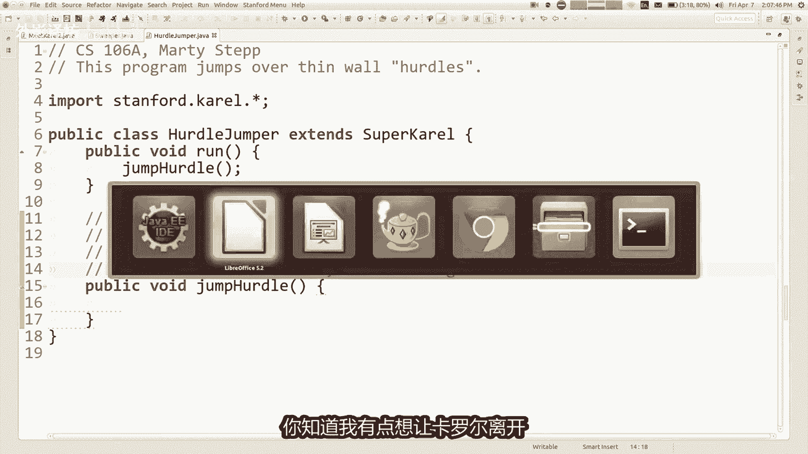

我想在太空中也从这里到这里，卡罗尔可能面朝下或朝上，或在那一刻，但我想我如果卡罗尔面对的是再次正确的，原因是因为如果我让他像那样工作，然后我可以说再做一次，再做一次，再来一次，现在这将超越卡罗尔。

你知道我在说什么，如果卡罗尔以某种任意的方式挤压，然后我有担心，我不想担心。

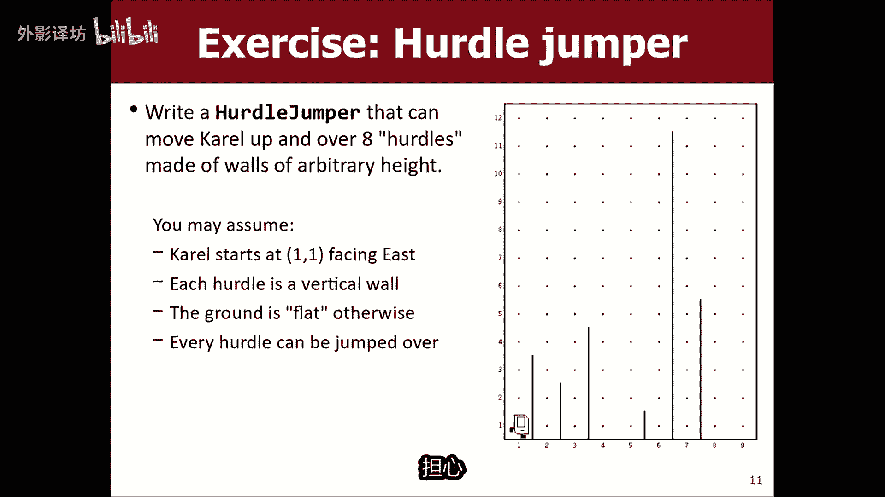

所以我要承诺我的，如果你写这些方法就可以了，评论里你说的就是我说的假设，这就是我承诺要做的，有时我们会谈论这个，我们用不同的措辞说，这是我的前提条件，我认为这是真的，如果你满足我的先决条件。

那么我保证这个职位条件，我承诺我的代码完成后，这将是情况，还好我怎么跳过去一个障碍，你觉得怎么样，所以我是对的。

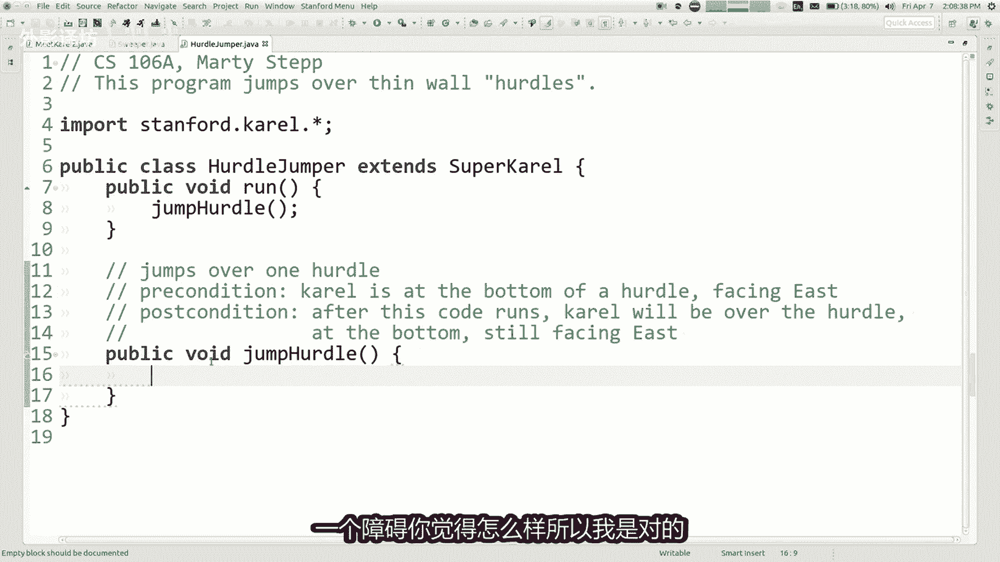

我得先翻过那个屋顶，我需要做的事情是左转好吧。

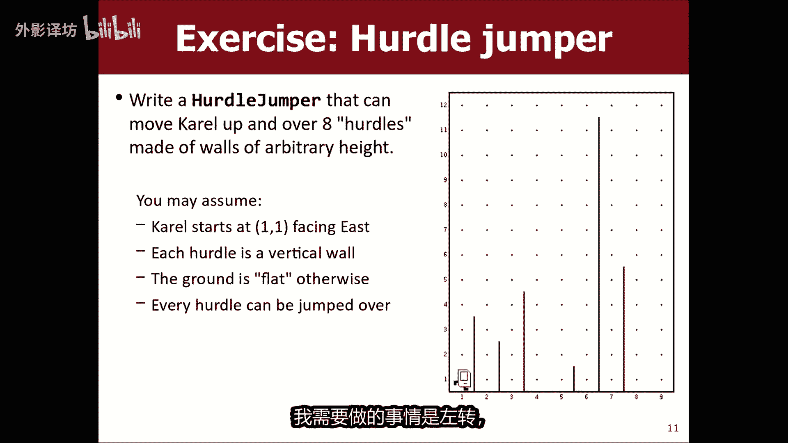

那会看起来很正确，所以好吧，左转有时我神志在这里写一些小笔记，就像朝北，所以只是注意事项，我自己你知道好吧，现在我面向北，我要走了，就像移动到顶部栏杆右边。

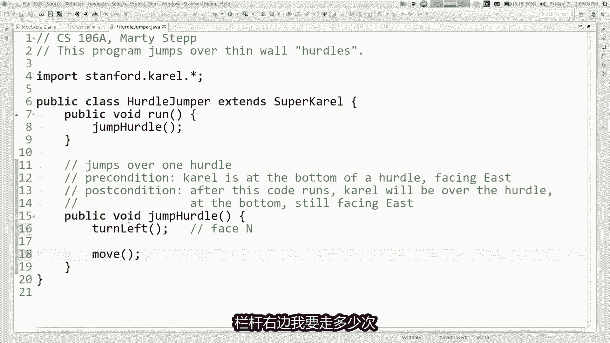

我要走多少次移动，是的，只要向右一直向上，我的身边有一堵墙，所以他们被部署了。

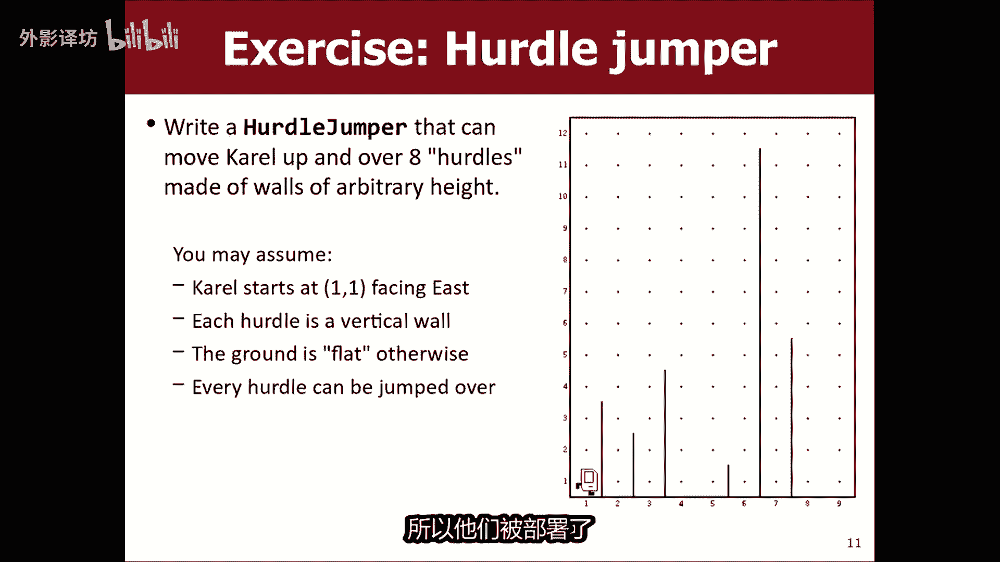

所有的方法都在等待，那在哪里拥有这些很有帮助。

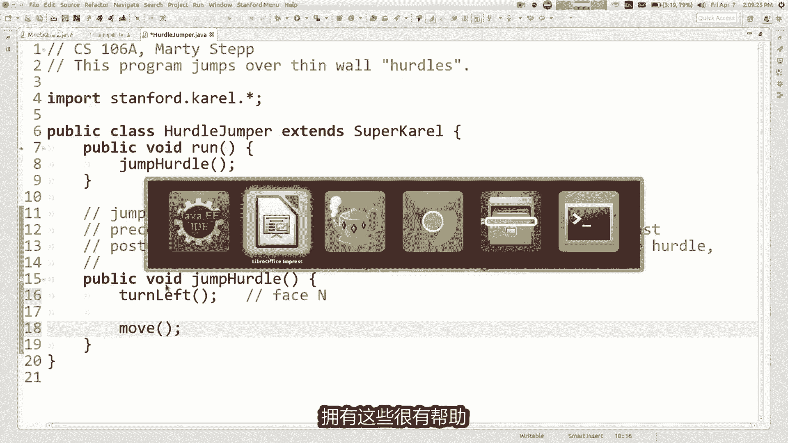

参考文献很方便，前面有一个是清晰的，前面被挡住了，但还有我们的左和右是明确的，左和是的，它是快，并且相对于卡罗尔，基本上意味着。

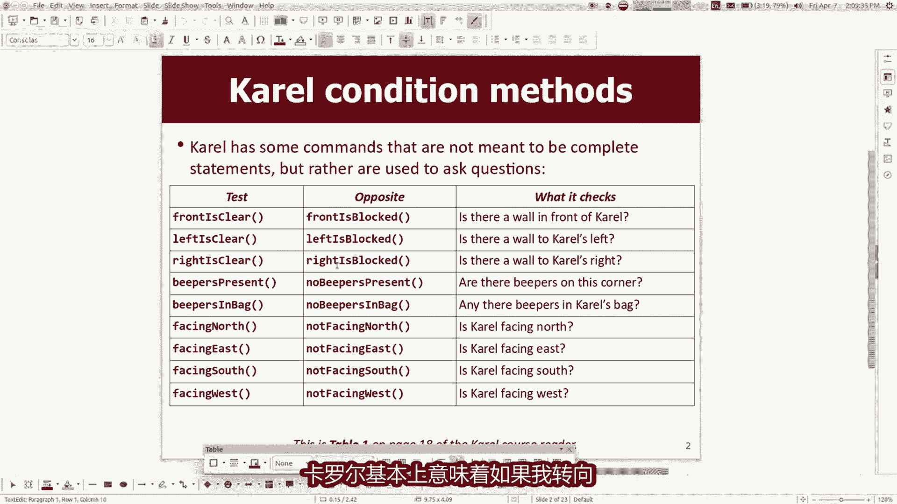

如果我转下，留下我被阻止的内容，如果我转向右边，我会被挡住，所以你说我喜欢这个，而右侧我被阻止了，所以现在在，卡罗尔将要执行的代码的末尾，位于所面对的障碍物的左上角，右北卡罗尔会出现在我的房间里。

我的幻灯片卡罗尔就在这里，面朝上，这就是事情的状态，此时此刻，那么我需要什么，要做右转，然后移过去一格好吧，所以右转，所以现在我，有点在障碍的右上角，面朝东方，我想也许我可以转身，又对了。

现在我将面朝南，或朝下，或顺便说一句，右转，记得怎么没有转弯，右边只有左转，好米，还记得第一堂课，我们发出了一个叫右转的命令，所以我可以将该命令复制并粘贴到这个程序，让我可以转向，对对对。

但他们的创造者，他们知道斯坦福大学的卡罗尔系统，右转是很常见的事情，你会希望他们实际上有一个小玩意儿，而不是说延伸卡罗尔，你可以说延伸超级小新，超级卡罗尔，轮到了，又指挥超护，最终转向围绕命令。

这是两个主题向左，所以它反转了方向，请给我一杯水，我认为这些只是一些额外的，添加到超级卡罗尔的东西和那些他们两个，所以我要右转命令，因为我是超级好的，现在我在障碍物的右上角，我面对自己，我只想提及。

即使我们完全不是，您可以随时完成该程序，可以运行它，并测试它，看看是否到目前为止，你所写的部分是在职的，你还会注意到我之前说过，如果下划线没有，我就有错误，留下你的错误并继续编码。

在他们之后始终保持干净的程序，编译并运行，你知道如果你出现错误，修复它没有程序，那是在一个破碎的状态，所以就想让我们只是测试，我们到目前为止所写的内容，虽然他还没有完全完成，所以这是跨栏运动员。

如果我做了我的代码正确，我想面朝下，这就是我们所做的一切，让我们尝试一下，是的好的，到目前为止一切都很好，所以现在我正站在所面临的障碍的顶端难，我应该做什么，想做的事，帮帮我，当前方清晰时，我想移动。

是的，所以现在我在地面上面朝下，所以现在我需要做什么，我快完成了，我还缺一个，我想转身面对，如果你面朝下的话，那个方向那个方向那是左转，所以向左转，咚是的好吧，让我们试试吧，我，跳过了一个障碍。

是的先生，我们是，在那之前我们被阻止了一点，我们不是就可以开始了吗，继续前进，他说的是一个很好的问题，大约有一个地方在位置4~5处，没有障碍或书呆子和计算机的方式，科学家会说有一个现在的障碍大小为零。

所以好像是允许的，我想是这样，允许，这样我们的程序就不会中断，他不应该失败，所以他确实失败了，提出这样的问题，我们将做什么，如果障碍扩大，程序会做什么，零所以正确，所以我想你是什么，说得很好。

也许我们应该检查一下，看看是否有任何障碍，是的，所以我想解决这个问题，如果你先别介意，我想做的事，告诉他跳过所有的障碍，然后我们看看他是否呕吐，领炒作障碍，如果是这样，让我们解决它，是的，我告诉过你。

你可以假设正好有八个障碍，我写了一个命令来跳过一个障碍，我如何跳过所有这些，我应该使用for循环，我听说过一些，你低声咕哝着，是的，谢谢你们的热心参与，整个哦是的，如果我想跳过八篮，只跳八篮，时机成熟。

让我们尝试一下跑步吧，让我们，启动程序，关键时刻呀有趣，他继续前进，在这里观看另一个零，嗨沃森我们，所以我的意思是我认为是，当然有时你会写一个程序，然后你不完全确定他将如何对给定的反应。

我不知道它是否会起作用，银嗨库尔特，否则我现在就试试吧，确实做了一些不必要的旋转大悦，你知道他为什么这样做，盗局高门见就排序，我们做了一些你知道的事情，没有反对，知道那是什么，关于你，是的。

他说条款不在里面一个循环，所以你总是要转动，你总是会转身，面朝上你移动，直到你不阻止你开始out，未被阻塞，因此循环并没有真正做任何事，所以你根本不动，然后你就转身向右移动，向左移动。

进入你已经所在的街区，因为你从来没有上去，然后移动再说一次，如果你只是走过这段代码会做什么，基本上他让卡雷尔抬头看去，无处右转，向前走，然后往下看，哪也不去，然后再向右看，如果你真的是的话，这并没有错。

试图让卡雷尔不要做那个翻转，你可以按照你说的去做，就像如果我被阻止了，你就做这些事，知道等等，你可以吗，可以使用一些if语句来避免I，不在乎卡罗尔是否这么做，小翻转，我倾向于使用代码变得更简单。

而不是添加一堆给该计划更多的礼物，但踏实，当然如果我们需要避开臀部。

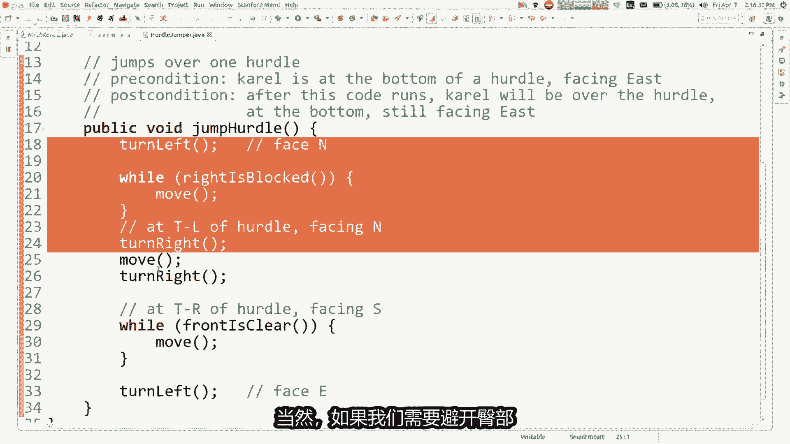

我们可以解决与此相关的其他问题问题，现在这个完全适用于八个障碍，我想让你想想，有时这是我的顶峰异国，我不想担心，如果你想想想的话，如果有12个怎么办，你绝对可以想到有四个关于这里一些疯狂的。

疯狂的事情会解决这个问题，而不是这个for循环，由于各种原因，它可能是正确的，要完全正确，有点棘手，但我们喜欢思考这个问题，因为很难区分最后的墙另一个障碍，所以可能有点无论如何，我想继续前进。

我们快没时间了，所以我的意思是，我会告诉你两件事，一是有另一个例子，我不确定我是否有是时候了，但我把它放在幻灯片中。

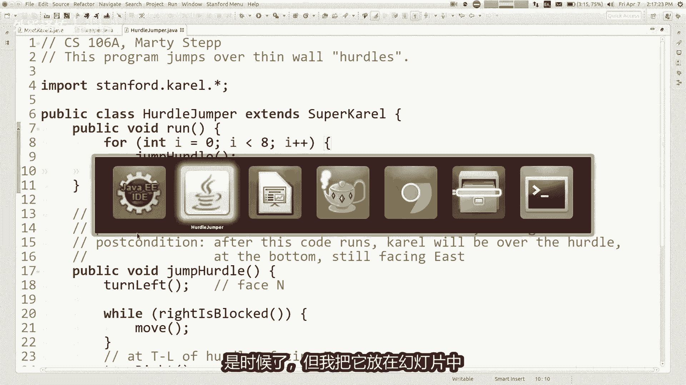

我们没有时间编写它在一起，但我会把它提到为你可能想查看的参考资料，你还有另一项练习，伦巴舞，就像让粗心一样走遍整个世界，并清理干净每一篇论文，每一篇和我认为这个问题的原因是有趣的是。

这并不完全是清楚该怎么做，火的意思是，如果你看看跨栏运动员很清楚就去吧，向上和向下，就像你跳过一个，这就是我要做的障碍，一个就像狼，我该如何攻击他，问题是你这里的策略是什么，可能有想法，但我敢打赌。

这个人旁边的你可能有不同的想法，也许你想要螺旋模式，然后把它们捡起来，也许你想去和蛇形的锯齿形图案，并选择它们，也许你想成为打字机，打到最后，然后回来，然后也许想做那件事，我不喜欢你。

有很多方法可以解决这个问题，我就告诉你，这些方法有很多比其他方式更难编码，我认为最好的策略是，找到我认为简单且可重复的东西，很多学生都想这样做，像这样偷偷摸摸的东西，但是有比偷偷摸摸更简单的事情。

算法就是这样的，把它们全部捡起来回来重复，现在你不用担心我了，走最后我们走正确的路，你可能会说我不明白为什么那更简单，我会告诉你什么，你们已经写了一个扫描方法，到最后并捡起所有报纸，所以转身就走回来。

然后上去，然后再做一次好吗，你可以以你所写的内容为基础，赖的扫地机，这变得很多，你可能会说更容易的事，清扫方法也适用于偷偷摸摸的事情，我可以走，但相信我更少的假设和更少的案例，如果你只是担心更少的事情。

做一件事，然后回来，然后重复一件事，就这样使程序变得更简单一点，你想查看他所在的解决方案幻灯片，所以我有大约一分钟的时间离开了。

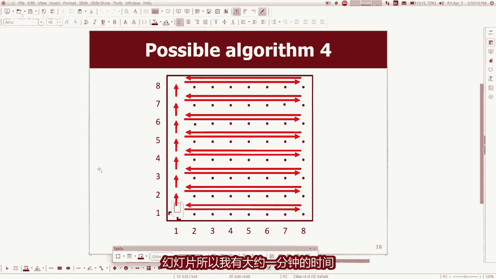

我想告诉你的是，作业已发布，已获得作业的方式，作业是你点击作业网页就在这里，总是有将成为SPECT文档，来阅读和要下载并导入的SP文件，Eclipse，如果你不记得怎么做导入到eclipse中观察。

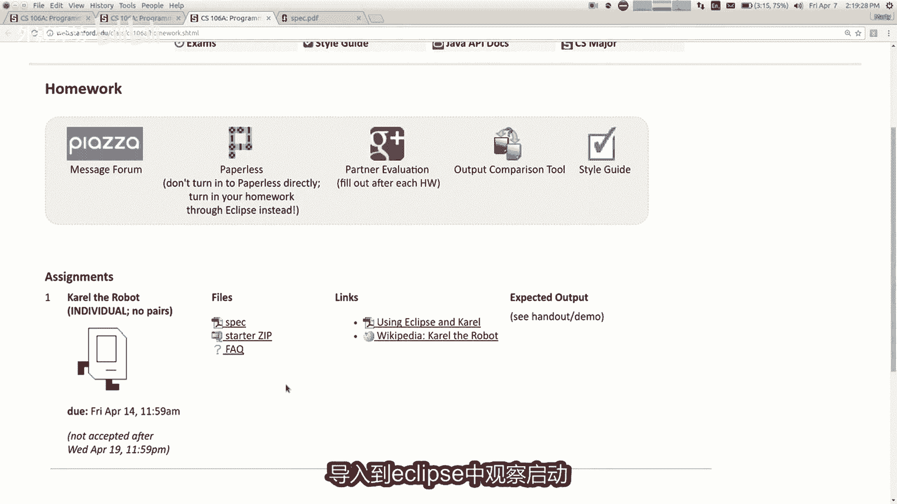

启动周三的讲座视频，我展示了怎么做，你要做的是，因为这是你要解决的卡雷尔问题。

第一个最简单叫做收集报纸，就去那里广场并拿到蜂鸣器，并带上它后退没那么难，第二个是石匠查找缺失的裂，用石头把纸填满，这样就可以建造了这些列，从底部开始使用电影，第三个屏幕到顶部，一种称为棋盘。

填写棋盘图案和饲料靴子，这很像伦巴，所以如果你看在RUA代码中，它可能会帮助你解决这个问题，这可能是最棘手的四个问题中的，第四个问题被称为终点，寻找移动卡雷尔到正中间，并放一个蜂鸣器，听起来很容易。

但可能具有欺骗性，很棘手，因为卡罗尔不知道如何做，算一下你怎么样，如果你不知道的话，事情的中间点，如果你想露营，如何猫的好，卡罗尔有问题，名为双重蜂鸣器的读者书，这是一个值得一看的好东西。

对于这个问题的想法有从技术上讲，第五个问题成为一切皆有可能，可以是你的任何事情，只想在交接时发挥创意，关于如何将其转入的描述，是本文档中描述了接下来的截止日期，周五周末，愉快出发吧，看看这个装备设置。

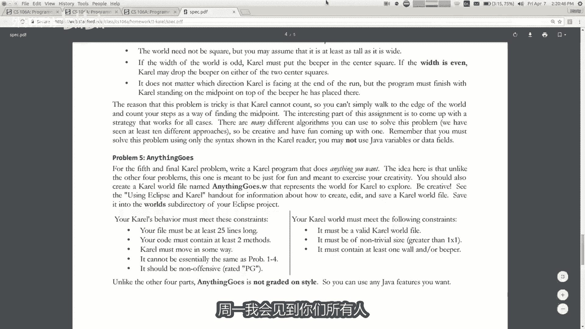