# 【中文配音】斯坦福王牌课程 CS 106a Java教程 2017年春季课程 - P4：04_ Console and Expressions - 外影译坊 - BV14U4geNEEq

好吧大家为什么我们不现在就开始呢，欢迎本周回来，很好，再次见到你们，大家你们的作业，你的卡罗尔作业出来了，本周末到期，所以请保留，如果您需要帮助，请记住日期，卡罗尔和作业一，请记住。

我们的实验室现已开放，它被称为巢穴，那就是那里部门领导在闲逛，晚上，你可以进去那里得到一对一的家庭作业辅导，一个很好的资源，这是我们的主要方式，你可以获得帮助，关于我们的家庭作业工作人员。

当然你也可以进来，我的办公时间或尼克的办公室小时，但巢穴是开放的，从本周开始的晚上，如果你不知道他在哪里或什么时候开放，你知道检查网站上的链接，有兴趣还是先联盟楼层，营业至晚上晚上6~11或12。

如果你想进去的话，今晚就开门，如果你有的话，他们也可以帮助您剪辑或设置问题，你的电脑，所以你看一下，在那下课后，我也会在我的办公室，今天如果你想跟我说话的话，这就是我们正在发生的事情。

这周我要教你一些东西，称为控制台编程，所以我们实际上会远离卡罗尔，现在hero是一种交通工具，我们用来开始学习正在编程，但我们要继续，现在转向其他类型的程序，因为当你思考什么是真正的。

当你编写一个程序时，你就知道计算机程序那是什么，可能是一个带有图形的程序，有窗口和按钮，以及你可以使用的东西，可以点击它，可能是一个游戏动画，它可以是网页或类似的事情，有不同的程序可以显示的方式。

向您提供信息或与您互动，今天我们要学习的是与用户交互的程序，一个非常简单的方法，这些被称为控制台程序，从今天开始，我们是远离喀拉拉帮机器人，数一上周的小读者，我们将开始使用更大的教科书。

被称为java的艺术和科学，建议阅读这些内容，讲座来自我们要的那本书，基本上做第二章和一些部分，今天的第三张好吧，所以一个控制台我们要参加的项目类型，今天了解到他们被称为控制台程序。

还有一些很旧的很酷的东西，你可能会说，因为一个真正的程序程序是可视化和交互式的，得到图形动画和颜色，所有这些你知道的事情，喜欢这个产品，我现在在这个您知道的幻灯片，查看程序工具栏中的小按钮。

我可以拖动这些滚动条和东西，这就是这样的用户界面，程序和控制台不完全是这样一个复杂的东西，控制台只是一个可以显示文本的矩形，例如大多数操作系统都带有内置控制台，有时称为终端，就向你弹出应用程序启动器。

然后您输入终端或命令提示符或其他东西。

像这样你就会得到这个东西，只有这个小文本框，你可以向其中一些人输入命令，甚至可能已经看到或使用过，之前在您的计算机上没关系，但这只是一个你可以做的地方，可以输入命令，它会显示在这里，我电脑上的所有文件。

这是我所有不同的事情可以在我的电脑上做。

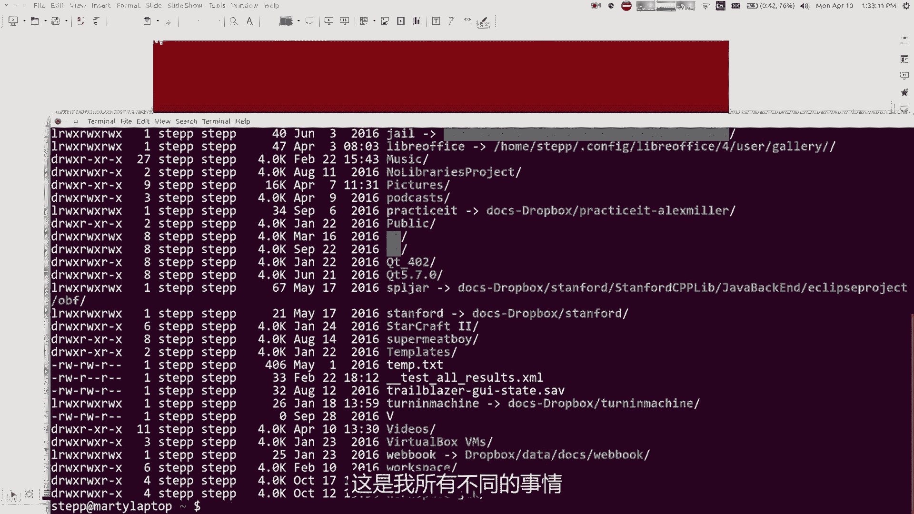

所以无论如何哦，天哪你知道我忘记了什么吗，真的很重要，我应该向你展示一张小狗的照片，天哪好吧等等，停止一切，这更多比java暂停录音重要来了，如果你想看的话。

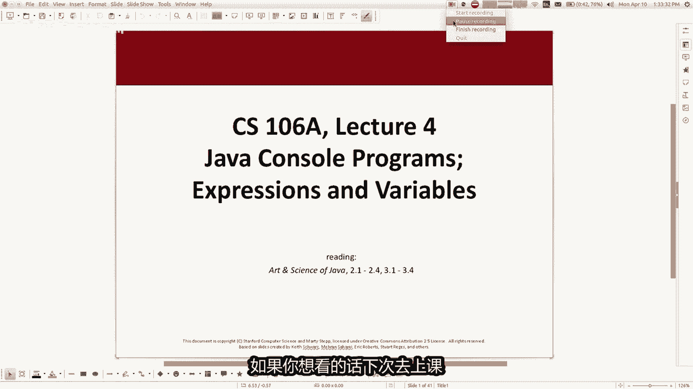

下次去上课，小狗的照片我们回来了，所以抱歉，我可以道歉。

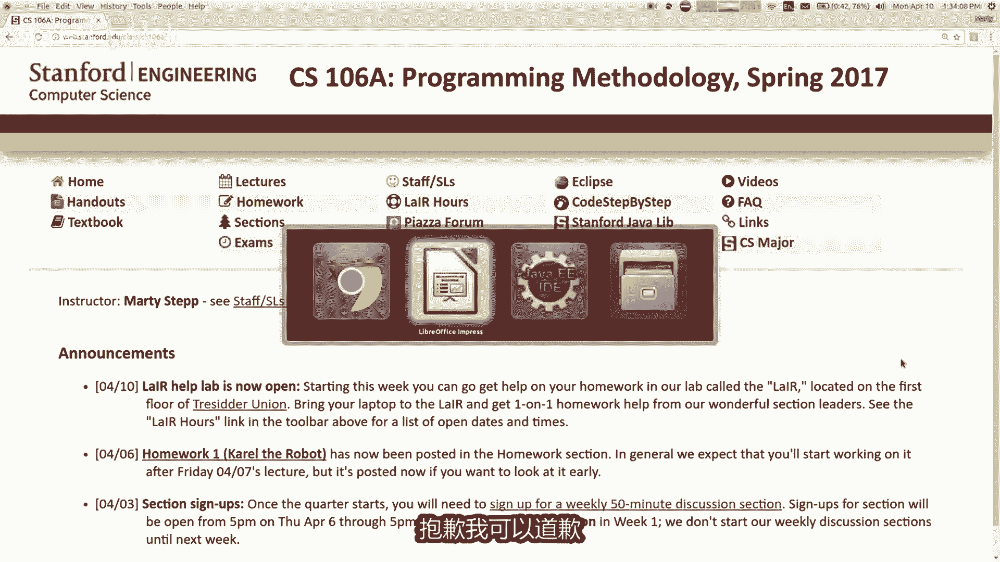

告诉你们似乎有点不对劲，现在那一定是和那个一样工作，是的好吧，所以控制台只是一个非常可以显示文本的，简单矩形，以及我们要了解的原因，编写使用控制台的程序时，这实际上只是最简单的程序与交互的方式。

用户他看起来有点蹩脚，寻找，当我们继续前进时，我们会学习如何绘制图形和动画，所有这些事情我们都不用担心会到达那里，但我们有点想要保持简单，因为我们只是入门，如此简单就好了，信不信由你有这些疯狂的事情。

按钮和滚动条之类的东西，事情很快就变得复杂了，我们只是友善，想要随着时间的推移，实现这一目标。

好吧，记住这一点，笨笨我们在这里谈谈控制台程序，是你编写控制台的方式，编程你开始的方式，一开始就写一个控制台程序，你的代码，而不是说扩展卡罗尔，你说扩展了控制台程序，这就是你最大的不同。

开始于你知道这事，单词扩展有点意味着什么，节目我会面对这个吗，功能是什么样的，起点可能会建立在，所以不要从颂歌开始，我们要开始的机器人程序作为控制台程序好吧，控制台是一个用户界面机制。

因此它提供输入和输出输出，适当程序显示用户输入的信息，是当用户向我们要讨论的程序首先输出，因为这就是最简单的一个，而不是看到卡罗尔走来走去，只会看到文字，如果你在屏幕上识的字符，正如我所说。

我们在控制台上运行这个程序，是弹出消息的矩形，在控制台上显示消息，这是您可以执行的第一个命令，用来做你写print ln和，然后在括号和引号中标记，你写一条消息，然后什么时候你运行程序。

消息将时显示在屏幕上，表示你好，word这个程序产生四行输出，你们中可能很少有人听说过，这个认为有一种古老的传统，在计算机科学中，第一个你应该向学生展示的程序，是一个显示消息的程序，上面写着你好。

世界我们没有这么做，我们确实关心路况，首先担心在我们在游戏机上可以向你展示这个，hello world的想法好吗，所以它显示四行输出，当然其中之一是空白的，所以它是技术上来说，三行空行等等不是很有趣。

我的意思是，如果我去，如果我去eclipse编辑器，在这里，我有一个程序名为TAO的扩展控制台程序，我可以说print line，括号也号cs106A是最好的类似的东西，然后是分号。

最后然后当我运行这个时，程序显示他弹出的消息，调出显示它的控制台窗口，现在这条消息不是很有趣吧，因为我们只是排序写了一条消息，然后显示给我们自己的信息，但累积我们所用材料的性质，学习会告诉你。

所有的我们在发布之前学到的最多的东西，其中也适用于此处，因此对于例如，如果我想说106微式最好的几次，我该怎么办，你认为我可以使用for循环吗，对所以对于int i等于0I较小。

比100I加106A最好重量，当然我应该让它达到106，现在他说106A是最好，一遍又一遍一遍一遍正确，所以这更有趣一点，还是有点沉闷，但就是这样，您可以在此处显示起点的这些消息。

在屏幕上向用户显示好的我们的节目种类，接下来几天要写的是计算机计算的的东西，然后显示计算给用户，或者可能是程序与用户交互解决某种问题。

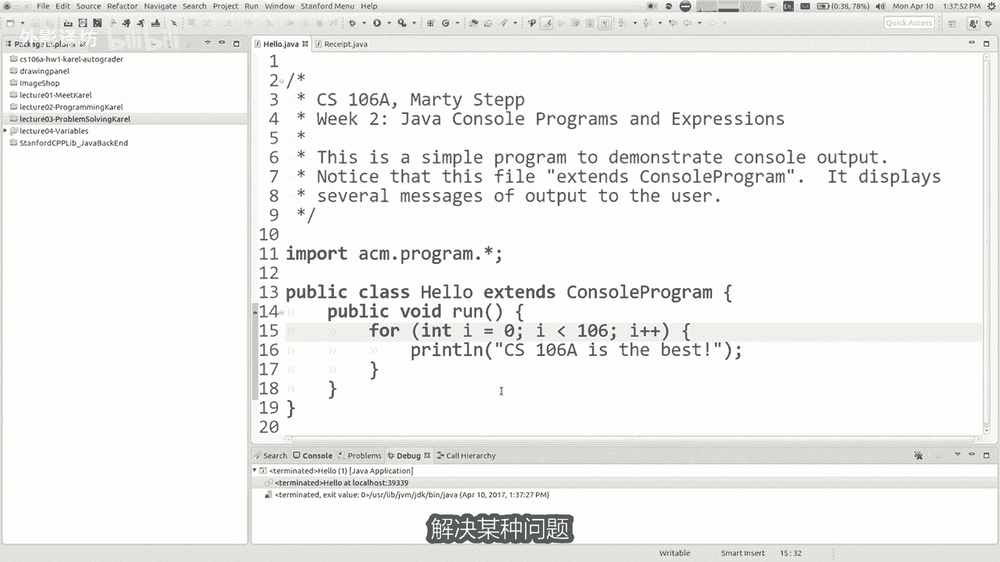

某种文本问题，所以这就是我们现在所处的位置，这样就可以了，print语句有时称为print line或print line，这就是语法，为此您中断要显示的消息，从技术上讲，在引号内，该消息称为字符串。

只是一组字符，显示在您必须放置的屏幕上，如果你不这样做，则将其放在引号中，不编译语法是非法的，所以如果你这样做，程序将无法编译，将无法运行，只需在括号内添加任何内容即可，它打印一个空行。

可能是如果你有一条很长的消息，并且您想分离，你想毁掉你，直到打破不同之间的界限，输出的一部分或类似的东西，那祝福你一件有趣的事。

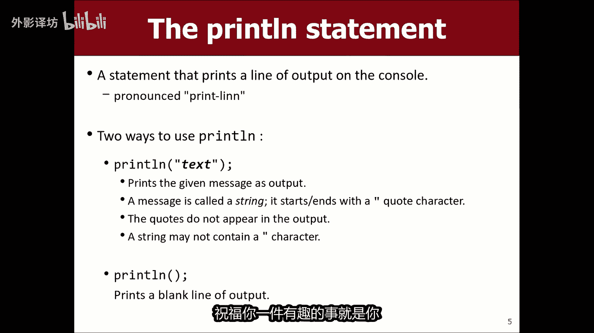

就是你知道你是否想显示各种，你可能会说打印林的消息，派对说106A每天免费，类似的事情，所以现在我已经遇到问题了，因为我正在尝试做，这样我显示的消息就有里面有引号，但是引用java使用标记来指示。

从消息末尾开始，这样你不明白这个消息吗，你可以通过以下方式破解它，把象撇号代替，或也许有两个撇号，看起来像比如宽引号之类的，但还有另一种方法可以做到这一点，你想在里面嵌入引号这个字符串的。

你这样做的方式是你在他们前面加一个反斜杠，这样你说的好，我想要一个消息中加了引号，但我还不想接触消息，所以这是一个小捷径，如果我再次运行该程序，它会说马蒂说106A每天都很棒，你会注意到野号没有。

前面有反斜杠，当它们出现在屏幕右侧时，当然现在我们还有另一个问题，现在问题是什么，我们解决了引号问题是什么字符，现在可能很难显示你怎么办，显示改斜杠意味，如果返回斜杠用于修改分区，然后标记。

因为你知道我是否就写print line，我最喜欢的那种，斜杠是反斜杠，好吧，现在他对我很生气，因为我基本上他认为我忘记了消息的结束引号，因为斜杠引号没有鼠鼠，那么唉呀。

那么你怎么画一个你所写消息中的反斜杠，反斜杠，反斜杠，所以两个反斜杠给你一个反斜杠，就像我把其中六个我会穿上，其中三个输出是二和二合一，在这里出售反斜杠好吗，这些反斜杠修饰符称为转移序列。

可以帮助您放置特殊的，到目前为止，消息中的字符还可以好的，有关控制台的任何问题，或消息或字符串或任何类似的东西，我告诉过你，我们学到的大部分东西，之前仍然适用于这里，唯一不适用这里的事情。

是非常卡罗尔特定的命令，例如如果我说你知道什么，让我们向左转，那是一首颂歌事情，所以他不明白，如果我说就不再发命令，如果我说就移动，如果蜂鸣器存在，如果没问题，但是传呼机的出现是卡罗尔的事情。

所以你知道你可以使用你的斯坦福大学大脑，并可能找出哪个东西是卡罗尔的东西，比如蜂鸣契合移动和转动，但所有这些结构方法，if语句循环，while循环这些东西时，这里一切仍然很酷，所以你仍然可以使用它们。

在这里好吧，你知道的，就像如果你想要一个方法，并且你我们觉得这个东西很有用，所以我们称之为吹牛方法，然后public boy吹牛，吹牛是当你说这大约是106A，我什么都不知道，只是这里的某种陈述。

知道这就是我对这门课的看法，然后剩下的事情我们学到了。

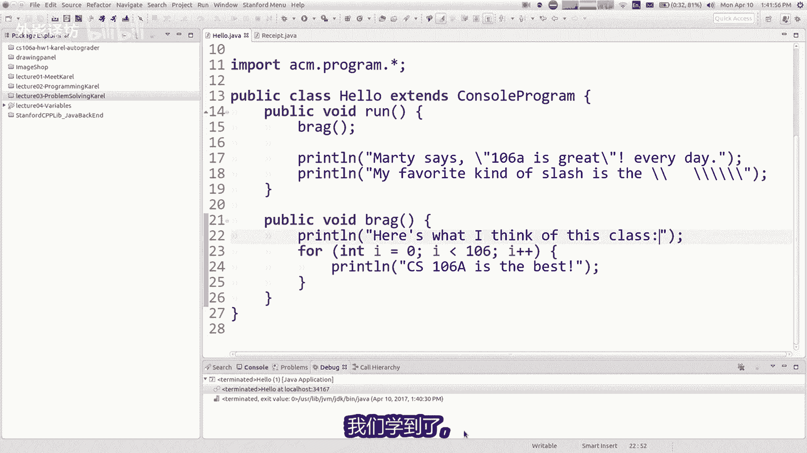

所以你仍然可以在这里做，好吧好吧，让我们来一点吧，我进一步谈到了这些逃避你可以做的序列，斜杠引号斜杠，反斜杠那些是那种最常见的，还有其他一些您可以执行T来转移序列，像你知道的那样的选项卡。

像移动一样的选项卡缩进，你的形你可以把N嵌入你的消息中的换行符，我没有鼓励您经常使用它，如果你想分割线，你应该必须打印新语句撒第一部分，第二部分部分。

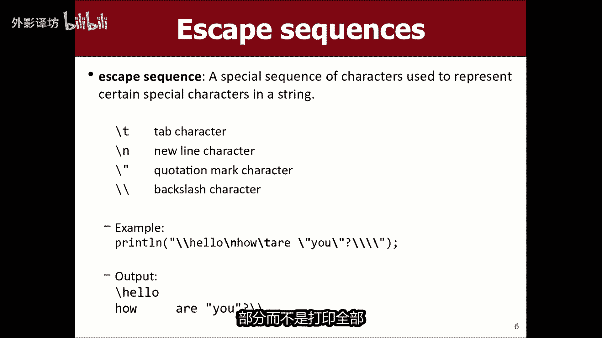

而不是打印全部知道，因为你可以你可以获取多条消息，例如看看如何，这就是两行吗，可以说我可以把这一切都混进去，异形我可以在那里说斜线，所以106A每天都很棒，我的最喜欢的客户。

这实际上会产生完全相同的输出，我以前有过，但我不喜欢他，因为他远远超出了屏幕边缘，正确阅读程序比较困难，所以像这样的宽限有点china，所以我认为一般来说N是不是很需要。

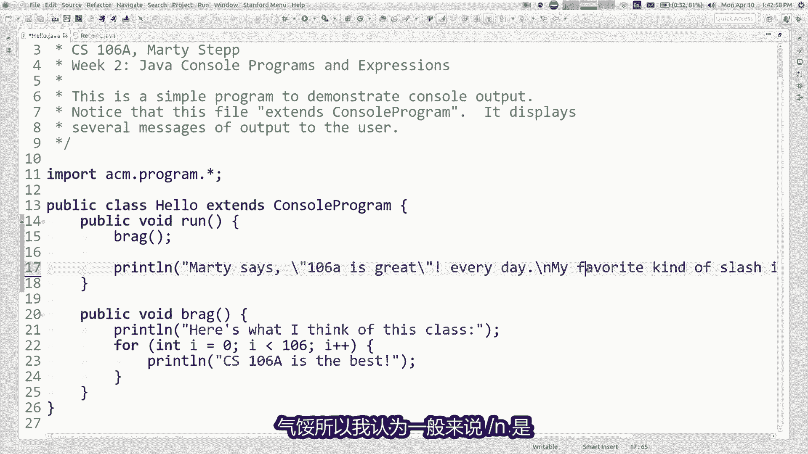

但如果有的话，它就在那里，你想要转到下一行，你的消息的中间，好吧好吧，所以有一些现有的命令，你可以在我教的程序中使用你刺痛，还有其他一些修改控制台的一些属性，你可以设置控制台的大小和字体及形状。

控制台上出现的字符，你可以清除它所竞争的控制台，该点之前出现的任何文本，您可以使用一些命令，修改控制台正在执行的操作。

例如你知道你可以做，我哪里可以做到这一点，我们不要做106个，让我们做十个，我可以清除控制台，暂停500，毫秒，那是半秒，然后我尽我所能打印106暂停，他得到类似这样的东西，所以我不知道那会不会有时间。

有一些这样的命令有帮助吗，你修改控制台的外观或它与用户交互的方式，每个人都喜欢闪烁的文字吧，就像时尚界一直以来的那样哦，我就是我正在和我的一位部门领导谈话，就像黑每个人都教他们这个控制台。

今天你知道这并不那么酷和动画和图形，所以我需要一个喜欢的方式，让它看起来真的很酷，你知道的，千禧一代喜欢什么方式，我可以把他和他们的东西联系起来，有兴趣我说如果我告诉怎么办。

他们就像你在给某人发短信一样，但你正在给电脑发短信，计算机可以给你回复短信，但是它就像你所做的一切而不说的那样，那太可怕了，他告诉我，我应该以某种方式连接他，一些受欢迎的电视节目。

你知道星际迷航那会很好吗，选择我不知道，我知道给我发一个，如果你有更好的类比。

请留言，但是好的，这些是一些命令修改有关控制台的一些内容，当它只为该程序运行时，我们不会经常使用这些命令，通常我们可能偶尔会使用命令暂停，你可以让它排序，使输出逐渐出现，而不是转储所有输出一次全部完成。

所以这很有用，想想当控制台变得更多，有趣的是，当你与有些数据，你知道它是一台计算机，应该像这样正确计算事情，人们想要的大部分原因，以前的电脑是这样的，可以比，所以让我们学习如何使用计算机。

作为价格过高的计算机，虽然我确实检查过，但我猜ti83的价格仍然相同，总是如此，也许计算机现在比计算机便宜，但可以学习如何制作计算器，计算机计算东西，我想和你谈一件事，称为表达式，因此表达式有做数据。

计算机擅长管理数据，我们认为数据是分为不同的类型，所以对于新学习者，这可能有点不直观，但你知道里面计算机一切都只是二进制，如果您存储了您的任何内容则为零，知道您的姓名和个人信息地址，您的电话号码。

您的财务，excel文档，word文档，歌曲，mp3的照片，所有这些东西，所有这些非常不同的种类，数据仅存储为二进制零，并且它们实际上只是存储为计算机中的数字，一切都是A数字，如果你认为这有点奇怪。

想一想，比如你怎么样将歌曲存储为数字，你如何做，将您知道的英语文章存储为数字或一系列数字，大约一秒钟你会怎样，你将文字描述为数字，只有你自己知道，你有一个小时的时间来计算，那你写什么单词作为数字。

实际上是非修辞性的，是的他先生，说只给每个字母一个数字，也许字母A是一，并且字母B是二，所以你写出你的消息是一个编码的东西，其中数字代表不同的字母，然后也许计算机知道如何翻译一下，是的就是这样。

这基本上就是计算机所做的，你可以将任何东西映射到，如果你想画画，就用数字，您可以将颜色映射到数字，这样这是红色图像的一部分，所以我会给这个数字和这个部分一个红色图像，是绿色的，所以我会给他绿色。

你想他好一首歌曲的编号，不同频率的音频和不同的卷和所有的东西，不同的正弦波和我所知道的一切，甚至不明白音频到底如何有效，但你可以做的所有事情将其表示为一堆数字，你知道这就是计算机的原理，真的很好用。

但对我们来说，当我们当我们想要处理时，编写程序，数据有助于程序员将数据视为具有不同的不同，类别和类型，这对我们有很多帮助，为我们提供了可以执行的操作，它帮助我们约束法律的数据与此类非法数据。

所以我想教的主要内容，你今天讲的是怎么做数字，计算机上的计算是擅长处理数字，所已有是一些存在的基本数据类型，在java中也有类似的类型，大多数其他编程语言中的数据，java也有一个数据类型。

表示整数数字右移不带小数点，该数据类型称为int塔式，可能是我们最常见的数据类型，当然会使用你刚刚计算的很多整数值编程，让我们看看这就是int数据类型，还有real数字是你知道的小数点。

小数部分是表示为不同的数据类型，很多学生都叫double，很困惑，为什么没有单独的类型，对于整数与双精度不是吗，全部只是数字，是的，他们是有些语言组合了所有数字，坦白说主要原因是他们在招牌中是分开的。

与计算机处理器的构建方式，计算机实际上计算整数与它们计算的非常不同，实数有不同，这些操作的效率和由于有时编程来反应，硬件也有差异，但你知道它们都是数字，有一些每种类型的不同操作，无论如何。

还有数据类型表示文本和数据的字符，表示逻辑值的类型，我们稍后会讨论，所以这些是一些我们要讨论的数据类型，关于您见过其中一种类型，在每个人我所在的地方之前，有人你在哪里看到其中一个类型，其中之一是什么。

是的他输入for循环，是的，谢谢你嗯，那是你读取for循环头的时候，你说int我等于，所以是的，这实际上是对NIKE的引用，我们并不真正知道的数据类型，那个人就是个胡言乱语，我们正在打字。

所以我们有点参考HENRY中的此类数据，for循环的标题，是的，那就是好的好吧，你用这些做什么，这些东西的整数和双精度数，那么你可以告诉计算机使用单词计算值，我们为此使用的是我们称之为表达，表达。

是当你写下一个像整数值一样的值，或一组运算计算会产生一个值作为结果，所以如果你看那张幻灯片，上面写着1+4乘以五，这样整个事情就是表达式，虽然从技术上讲是一四和五也是表达式。

所以我们已经建立了整体那些较小的表达式，所以它是那里有一种自我相似的定义，这也是下面七处的表达式，再加上2×6除以三等等单个值，我们称之为字面值值，就像42或其他任何值文字值，您可以使用运算符在表达中。

我的意思是，这些可能不会像他们需要的那样令人震惊，将两个数字相加，水平线是负号符号，并从中减去数字彼此，所以你们知道这些事情，这不是很神秘吗，算数上的整数值，所以我认为我们是编程变得有趣。

我们开始变得有趣的是你来到这里的节目。

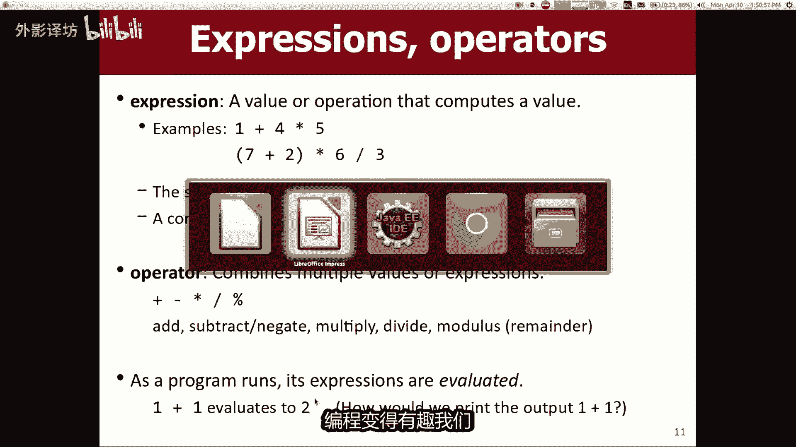

而不是说print in hello world货，就像你说的那样，print in 1+1，所以我们要看看计算机是否可以计算1+1，并打印出来哦，我仍然这里有动画垃圾，等一下我别再吹牛了。

我要注释掉我程序的那一部分，他告诉你看他不打印1+1或研究所，这很有趣，如果你写一个数字表达式，在这些括号里，你试实际上要求计算机计算的结果并显示，如果我真的想要的话，结果会怎样，电脑上显示1+1屏幕。

你觉得我会怎么说，是的，你在它两边加上引号，因为引号表示类似，这是一条消息，我想显示这条消息，就像这样，1+1，如果我想说1+1=2，但是我不知道结果是什么，可以说1+1等于加1+1或者类似的东西。

那就是有点奇怪，但是加号计算和流之间排序方法，计算结果并将其附加到该字符串的末尾，并无论如何都将它们一起显示，所以但无论如何，系数标记确实就计划的内容而言很重要，在这里显示在屏幕上。

好吧，我们有价格过高的计算器模式，让我们多了解一点，表达到目前为止，我们有任何问题，到目前为止一切顺利好的，让我们谈谈我认为的划分加减和时间非常明显，他们的行为方式与你完全相同。

当你除以实惠期望java中的整数，他做了一些事情，确实让很多新学生感到惊讶，什么叫做整数除法，意味着它会消失任何剩余物或小数部分，所以如果你除14，现实世界中的四被你就得到了3。5。

但如果你将14+14除以四，java你得到三，基本上它向下舍入，他会丢弃小数部分，即使是3。9将其滚开，得到三，永远不会四舍五入，他总是四舍五入下来，如果你还记得你的涨部门，基本上只是抛出剩下的。

你知道在你的手机里，所以一次不太难习惯，我想你已经学会了这条规则，有时有点难以记住，你和你一样了解其中一些细节，知道156超过100，你只得到一个，这有点奇怪对吧，你不能由零作为分母，数学上未定义。

所以它如果你打开的话，实际上会导致错误，该程序说非法算术程序崩溃，有点像当卡罗尔碰壁时，有点就像这样，就像一个计算器，我想撞墙了，所以这就是整数除法，当然是长除法，我们扔掉了剩下的部分。

所以剩下的去哪了，我该怎么办，如果我想知道剩下的是什么，好吧，这就是另一个运算符，百分号运算符我们称之为魔术或帽的运算符，所以你会说14冒四只是意味着，如果我剩下的是什么，将14÷4。

所以如果你做了长除法，你会说四进入14，三四等于12，然后之后剩下的余数是二，所以14÷4的余数是2~18，猫的五就是剩下的除280，十余数是多少，五就是三等，你知道这些操作有点奇怪，就像学生。

你可能会说我为什么要这个东西，我用它来做什么，认为余数通常有用那些你意想不到的地方，比如如果你想知道你知道的房子，你说给我最后四个您的学生证号码的位数，如果你有学生证号码，任何人最后四位数字。

然后你说除以余数是多少十，我的学生证号mod是多少是十，这是我的最后四位数字，你还可以使用mod来检查是否为even into，观众能见度，一般你说我除余数是多少，by2是零。

或一告诉我是否数字是偶数或I，据说或或你知道我是否除以3÷5除以十，余数是多少，这会告诉我他是否可以整除，如果余数为零，则不然，所以这有一些应用程序现在实用，当你在做的时候。

这些数学计算表达式有一个顺序，这不应该让你感到惊讶，就像你有一个科学计算器一样，然后你写下所有的计算，你告诉他计算并不总是从左到右，这取决于你使用的不同运算符编程，我们称之为优先级的运营商。

所以一般来说计算从左到右，特别是如果你有同样的运算符，它从左到右，所以123你得到最后两个，首先但乘法除法和mod都稍微高一点，优先运算比比加和简号，请原谅我心爱的莎莉阿姨对，那就是圣人。

就是那我想写给你们都好吧，还有一个不同的那是什么，另一个已经十天了，另一个是什么缩写扩展，我知道有人知道你什么时候嘟囔着，没人愿意大声喊叫，何自豪，我不记得PMDASO好吧，你们知道这个东西。

这不是伯克利，我不需要向你解释你学到的这些东西，那些东西可能是一年级的，或者为你们做任何事嗯，所以乘除法和mod，都有这种更高级别的平等优先权，这比plus的水平还要高减去，所以如果你看看我的例子。

这里6+8除以2×3，首先将8÷2得到四，执行443秒得到12，他最后执行6+12，你得到18，如果您不喜欢该订单，请执行人们用什么计算器来做，但是括号括起来，然后是括号还没有更高优先级。

因此括号将在其他事情之前先进行，如果我正在做p e m d a as，我做的一件事还没教你示意指数，对我没告诉你如何做到这一点，我会告诉你本周晚些时候，但你现在就知道，这就是我们的看法。

优先级分为三个级别，乘法加法并打印好吧，如果你的工作是你认为的是如此简单，我想让你证明如何，你太棒了，我希望你能走路，我通过其中之一，我需要一个志愿者，就是上面的那个人留在那里，100×2加3×5貌四。

只是告诉我数字重复执行哪个操作，你知道他是先做1×2，还是它有什么作用，以及它会生长什么真实，然后我们就会计算它，直到我们得到表达某人勇敢的结果，帮帮我吧，没有什么了，比做个位数还要谦卑。

前面有数百个算数，人们如果你的话，这都是不利的，做对了，这不是很令人印象深刻，大家都应该理解错了，第一个乘以两个就可以了，接下来我会做什么，345 15压帽45，余数四，那么结果是多少三。

因为15÷4的结果，或者其中三个人带着三的余数可以，然后2+35好吧，我想我不小心按到了，无论如何，下一个看看，这个听起来可能有点太显，然，对你们中的一些人来说太容易了，这很好，但我只想做，当然你明白。

因为尽管事实上，你可能认为这是微不足道的事情，或者我保证我您的数百位朋友已经获得了他，当你真正到达试错，在讲座之间不知何故做作业，而且作业里有人认为，无论如何，你可以看看，通过其中一些。

还有更多讲座日历网站上的事例，只是为了练习一些例子，如果我如果有这些数字序列会怎样，计算机有时会计算，我实质包括类似的问题，测试只是为了确保你理解编程的算术，Q好吧。

如果你有一个实数double事情大部分都是一样的，我现在要告诉你的差异之一，区别在于你的写作方式，数字下面是你输入的小数，当然如果你这样做的话，你知道6。02，那么这只是被视为双靠电脑亦有趣。

即使小数点是O点，我们当然认为这是整数，但也许我们确实有一个末尾的有效数字活，但java认为它是双倍，因为它有一个点，当你写下小数点时变成双精度，可以写使用科学计数法的双精度数。

其中你在后面写一个较小的数字，由字母E用电源笔，然后需要2。1，三四十到17，这样你就可以做，如果你只想大概一个人对非常大的数字这样做，是的，这就是如何分解，将我刚才的大多数运算符加倍。

教你以同样的方式形式将不同的一件事加倍，是除法和模除法with double，实际上做了一个精确的计算，所以这是一个例子，如果我的所有值都使用双精度，值，有242。4，如果我有两个，我会得到4。8。

第2。5次4。0，我得到9。0，9。0÷2。0，得到4。5，这就是发生不同事情的地方，如果这是9÷2，没有小数点，可以给我四，不是4。5对，所以java在这种情况下做一些不同的事情。

所以对于一些学生来说，双倍更容易，因为他会做你平常做的事情，会期望从现实世界中得到正确的结果，但这没关系，它确实提高了，那么问题来了，我们为什么不直接摆脱int并始终使用，一切都加倍。

这是一个合理的问题，但我认为我我会说，我不认为你应该这样做，因为有时踏实，很高兴，对你有一些限制数据，如果我不想允许小数数字，也许最好禁止他们一起，就像如果你一直在跟踪您的孩子数量。

house最好使用int，没有特别的理由使用加倍，因为你不能拥有相似的部分，一个人在你的童年时期，你的房子对吗，我不知道让我们给某种奇怪的时间共享事物，和另一个我不喜欢的家庭一起生活，知道。

但可能你想使用int，因为那不是双倍，所以我认为他实在给定的情况下，认识到仍然很重要，无论是double还是int的情况，如果混合两个数据是更好的选择，一起输入double，那么什么。

一般来说如果你有的话，java就可以了，它将使用两个int之间的操作，该操作的入侵，如果您在两个双打之间进行运算，他们将是net的双重版本，如果你有一个int和一个操作双重混合物。

它将转化成之前那一刻的双重执行操作，例如如果您看看这个表达式，七比3×1。2，加3÷2则左一为权力和先例顺序，以及所有这些像这样的事情总是会这样做，时刻七比三即时即时混合，使整体加倍。

他实际上还没有达到任何目标，双打的还这么少，这里的操作7/3不是混合物，都是整数，所以7/3算数上是二，现在2×1。2，这是一种混合物，所以它基本上变成了将两个变成2。0，我们得到2。4。

接下来是三超过二，这又是全部因子没有在此表达式中加倍，并且表达式的这一部分，所以我们得到一三除二等于12。4加一，将其转换为double，我们得到三分，所以如果这对认识到这种区别。

很多不小心写代码的同学，那不认识到，如果你他们得到了错误的计算结果，他们不想，所以好吧，还有另一个幻灯片，右侧的一张，你稍后可以看看，我不知道为什么动画看起来这么糟糕，但是无论如何，这是混合类型。

我觉得这个表情很简单，一旦你尝试了其中的几个就可以了，看一些相关的练习题，在网络讲座日历上只需制作，确保你对自己进行了健全检查，确保这些表达事实，如果您觉得您有疑问，请向我们提问，陷入困境，让我们谈谈。

由于算术混合很多，当你想要计算一些东西的时候，然后你想显示结果，如果你会做你经常想做的事，写下您的文字，然后是表达，我们一分钟前就这么做了，我说1+1等于，如果你愿意的话，接着是1+1做。

你想混合弹簧和称为字符串的计算，只有你知道的连接，附加他们彼此之间以及你做事的方式，连接就是你在之间加一个加号，一根绳子，另一圈还有路，那行得通。

我会回到这个像那样滑动一秒钟，有效的是你有一个字符串，你有一个，另外你还有另一个价值计算，你知道1+2乘以三，-4×6，无论你计算什么，我想那不是一价，不再是这样，我以为总数就是加上那个无论如何问问。

当java遇到这种事情的时候，他基本上计算的结果，这个表达式无论结果如何，他是把它粘在绳子上吗，就在那里，就好像它是程序运行时的字符串，你可以甚至可以在之后添加更多文字说加号。

并祝你有美好的一天或其他什么，所以如果我运行那个程序，你会说总计是负数17，祝你有美好的一天好吗，现在有一件事有点奇怪，是优先规则可以欺骗你，这里有点，所以看这个我想我可能有，我只是不想吓到你们。

但是课前我在玩，我想我可能有这些东西在java中发现了一个错误，或者可能是在我的英特尔处理器，所以如果你说1+1是加1+1，因为这会计算1+1，我们会显示结果正确，他说1+1是11，所以我不知道。

我知道我觉得这里出了问题，就这样似乎不太对哦，不为什么他打印出不是不是错误，我的电脑没有错误，也许我正在展示一个魏某是如何的误解，java工作的任何想法，为什么他一刷11，在后面是的女士，你说什么。

将字符串的单数转换为是的，所以你认为我认为那是基本上是正确的想法，我是第一个我们牢记的事情，你无论什么时候都知道，你有一个包含多个的表达式，其中必须有不同的运算符，决定操作顺序，to应用操作。

应用运算符是的，所以在这个例子中，第一个他所做的就是这部分字符串，1+1是他需要最后一个，他说我该如何加上那些在一起，这样操作基本上就是与一相同，有点把它放入字符串中，这就是plus对字符串所做的事情。

再加上当时没有计算，说好的，我已经完成了那个操作员的操作，我还需要做什么，另一个加号运算符，你想让我这么做，添加这个字符串，加上这个int好吧，我会这样做，然后他需要那个int和把他推到那里。

所以就是这样，从左到右你看到了，所以他是只是你所在的地方的，一个很常见的错误，试图包括计算和程序同一部分的字符串，所以如果你想结合所有这些计算，而不是像这样混合他们你想做的事情。

在括号里正确的1+1指是强迫他做，在执行之前先单独执行，连接一件有趣的事情是如果你说一次，如果我运行那个嗯一个他实际上很好，他说一个我猜做一个并不是很有趣一次，但如果我喜欢三次，五个左右。

我猜这里的消息不起作用，但如果我这样做，结果是我运行，然后他说结果是15，我神智不需要括号，为什么我不需要那里有括号，因为先例正确，因为3×5有更高的优先于加号运算符，所以它无论如何，即使没有括号对了。

好好吧。

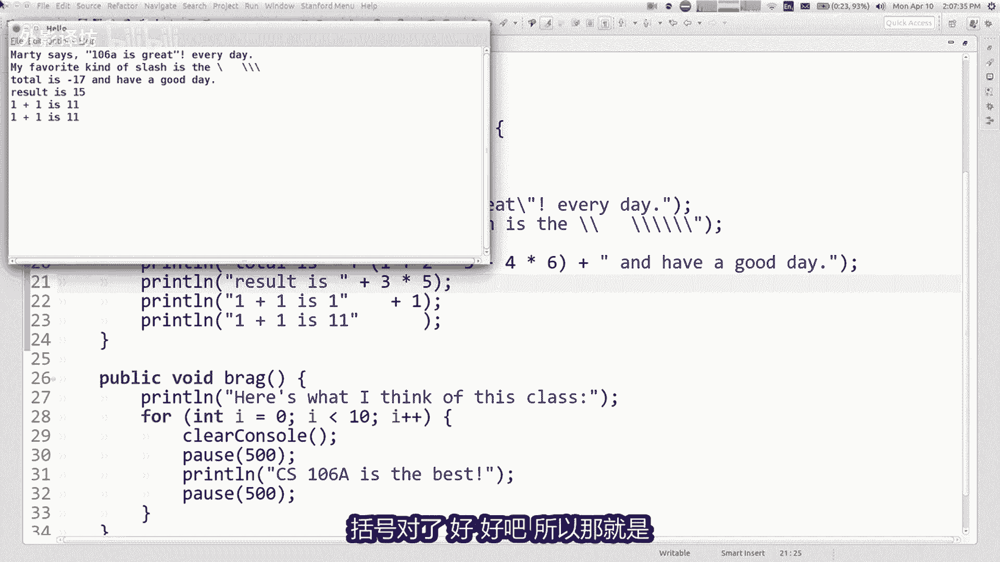

所以那就是如何进行字符串连接这么几个，这里的例子有一点有趣的是，如果你有12个加ABC，他确实执行int1加先两个，然后你得到三个AABC，这是我的清单中的中间一个七个，那里有一个人工作是因为收入第一。

所以他首先做他们无论如何，但是如果你把燕子放在后面，就像ABC加12，你得到ABC一两个，只是因为这是剩下的顺序，正确的优先级就是这样，好的很常见的结果就这样，幻灯片底部的示例在这里。

平均水平是加上等等等等计算，然后显示什么，该计算的结果将是好的，好的这是一个我们要做的程序，一些真实的东西，一些实用的东西，所以我们要去一家餐馆，我要点一些食物，我想要计算一下，你知道这就是金额。

我的餐费小计为38和40，而你知道我们的客人有30，无论如何，这是我们账单的小计，然后我们想添加税收是多少，8%，我认为这些数字没有任何意义，对帕洛阿尔托有感觉，但无论如何粗糙，给所有这些添加几个零。

这个镇的物价，但是无论如何好的，我计算一下税款，小计小费，然后试总参价，他运行并打印所有内容。

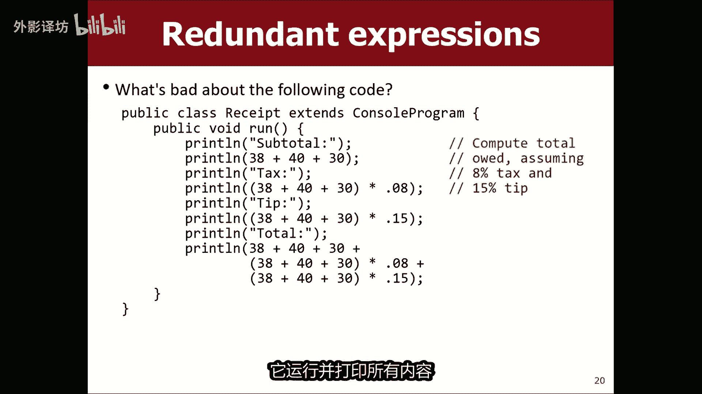

正确的效果很好，我会展示给你，我会这是我自己复制的一个程序，这是一个名为收据的文件，所以我这里还有另一个小控制台程序，我将把所有这些粘贴进去，然后我就完成了，这里有一些评论提醒我在这里做什么。

所以让我们运行收据并查看小计为108，美元和税收就是这么多，小费是这么多，总计是看起来不错，现在有一个很少有像这个这样的小事，真的看起来像美元意味，我不明白这一点哦，这里这个说第二点，而不是第二点哦。

那些有一些你知道的视觉瑕疵吗，意思是它显示108，而不是的原因，108点，偶就是你所知道的一位，它是一个int以为就在这里，这个计算是一个向上的int对了，然后说点两个，而不是第二条哦。

那就是只是因为默认情况下，java只显示后的最小位数小数，我们想把它看作货币，我们想要小数点后两位数，稍后我会教你如何做，不想陷入其中，现在是钱的事，但你可以完全调整，他说我想要两个小数点后的数字。

我不想现在就做嗯，好的程序没问题，他有效很有用，他告诉我如何，我必须为CHAPAY付很多钱，帕洛阿尔托chip port内的三个沙门氏菌，在该地点需额外付费，我声称这有问题，程序有一些关于他的东西。

我不太喜欢给我一个主意，我可能不喜欢这个程序的哪些方面，批评我和我的外套，你怎么办，想先生，太好了，但你的答案正是我的答案寻找，他说我正在重复这些一遍又一遍的计算，你知道计算机三件事中的两件事。

科学家不喜欢的是冗余和冗余权，所以我不想拥有，在这个程序中，他可能他并没有那么困扰你，让我困扰的是，我不知道我们是不同的人们，但就像我不喜欢写作，得出小计三四或五自或其他什么，特别是因为哎呀。

我发现有一个错误账单，这不是38美元，而是39美元，哦好吧，三十九三十九三十九，你呢看到这很荒谬吧，我不这么认为，必须一遍又一遍的更新那些东西，仅仅因为有一个错了，你只是我不喜欢看看那个多余的计算。

一遍又一遍，所以这就是我希望有所不同，如果你想的话，这个特定的程序避免这种形式的冗余，有一个，现在我们已经了解了这样做的方法，避免冗余，以使方法做那些不做的事，真的在这里工作，因为什么多余就是不一样。

祝福你，我们在擅长之前学到的工具命令或系列的冗余，正确的命令，make a方法，make it循环，它们非常适合下冗余计算，多余的只是这一部分，也许还有其他部分，但只是我们重用的小计算其他地方。

所以如果我要去稍微喷一下我的计算器，类比在计算器中你可能会做什么，这种情况将是计算小G，然后保存按下其中一个记忆按钮，并让他记住小G，然后你稍后可以使用它，当然我不会知道这是一个很好的比喻。

因为没有人使用这些按钮，所以我不使用，知道这是否与任何人有关，但这些按钮就在那里，而且确实如此。

如果你希望他们实现这个目标嗯，所以如果你想避免像这样的，程序中的冗余是什么，你可以做的是，你可以使用一个功能称为变量，所以如果你想要其他奇怪的类比，有点像立体声音响上的预设电台式。

您的联系人列表或快速拨号，1998，您的手机或你听说电话来自变量，是一个可以帮助我们听到声音的功能，变量是存储结果的地方，表达式计算和拟给它一个名字，然后你可以参考按该名称计算出的值，程序中的其他地方。

所以计算一下38加上随便加上，随便怎么称呼小G，然后是其余的程序，你可以说小G代替那个计算功能非常强大，首先是如何使用变量，你要做的就是你必须声明，你必须告诉java，我想要一个变量。

这就是我的数据类型，去商店，这是我的名字，想要给你写的变量输入一个空格，然后输入名称和，然后是分号，所以你说int邮政编码，我想存储一个邮政编码，称之为邮政编码，它的类型是int double。

我的GP与我想存储成绩点平均值是实数。

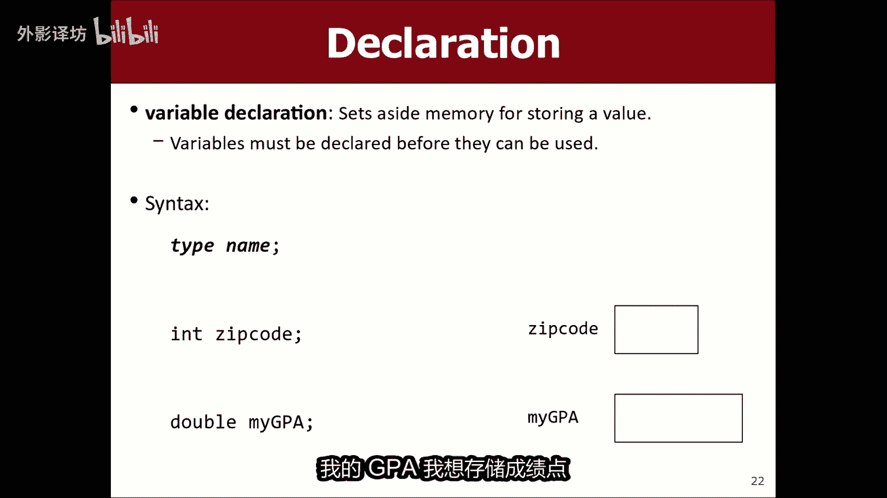

所以如果我想要的话，在我的程序中存储小G，我想说黑这个东西看起来很有用，所以也许我会说int小积分好好的，这是第一步，所以这是成为第二个声明。

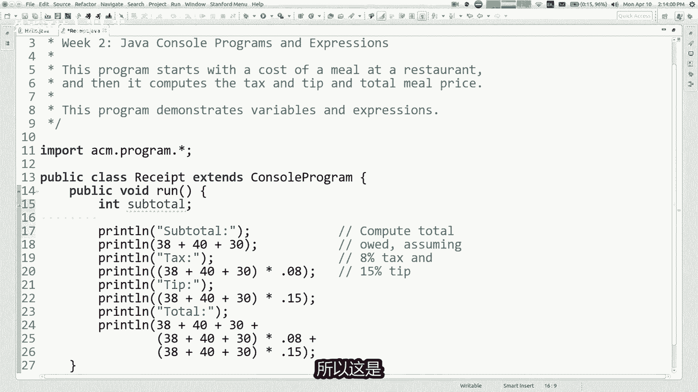

变量步骤是为变量，这意味着你告诉java，这是我想存储在其中的值，如果你真的想思考变量，从计算机的角度来看，它会进入计算机的内存，它流出了一小块用于存储该值的内存，如果您我想这样想。

所以如果我画一个小盒子，就像一个小盒子，我放置的变量的内存，关于记录内存或类似的东西，我认为他不太关注尽在这方面，但那是那里发生了什么存储方式，变量中的值是你写的变量的名称，然后是一个等号符号。

然后是你想要的值存储，所以如果你想将其存储为你的小G。

你可以说小G等于现在在这里，而不是，写出你可以说的数字小记，所以当你写print ln时，小G意味着打印该值，以该名称存储，你可以给一个值，一个不同的值，如果需要的话，稍后再添加到变量。

可以在这里说小G等于12345，所以现在从那开始，在程序中指出它会使用它新值，这样你就可以改变你的存储后的变量，是它的更早的评估，但我们不想这样做，对于这个特定的例子，这样做是合法的。

但可以这是使用的一个例子，变量还有其他变量吗，你认为应该在我的程序中制作，税和小费，我认为这是好主意，所以你可能会说，等一下这里的税是小G乘以0。08，小费时小G乘以0。15，这样看起来就种鱼而言。

如果我已经搞砸了，就像我能做的那样，如果我搞砸了，他也在这里需要将其更改为39，更容易只在一个地方做正确的事情，但是如果你进一步思考另一个层面，该税额为小G的0。08倍，我在这里使用整个东西第二次。

所以如果我用它计算两次，也许我应该做一个变量，所以也许有什么更像是什么类型的变量，应该储存的税是双倍的，因为这是一个实数，双重征税，等于小G乘以0。08，然后在此处，我会说打一行睡好，然后。

所以这就是正确的提示，双尖尖等于那个，然后在这里我先说一下小费，现在说一下总体情况，总计这是小季加税，再加上右边的小费，不是我的，现在这样做小季加税加小费，我认为该程序读起来有点更好。

因为你可以真正明白，为什么我正在添加所有这些疯狂的数字，一起计算所有这些东西，如果我阅读这个程序会更容易再次运行，它应该表现相同，我很确定那是一样的，之前有输出，所以它仍然有效，我还要讲一段语法。

让你看看我是如何得到这两行的，我声明变量，然后我给变量一个值，因为两者都做事很常见的那些背靠背的事情，有办法将其全部压缩成一行，这样做的方法是，你只需说int小G等于该值，双重税等于该值。

双小费等于该值，现在你可能会说你为什么这么做，甚至费心向我展示不同的方式，因为看起来那样就是更好的方式，是让他们都排成一行，总的来说是这样的，但是我想我之前讲过的那个案例，也许你想改变变量值。

稍后你说我哎呀，实际上小G不止于此，你说小G等于12345，你使用我的语法，几分钟前教过你，如果你按照两者的方式写，实际上在同一条线上，用红色下划线，意味当你这样做时，所有这一切都集中在一条线上。

你就是这样创建一个变量，并给它一个值，java对此很生气，28，因为他说你已经创建了，在无法重新创建之前，该变量你可以再给它一个新值，但你无法再次重新创建它，所以我需要向你展示这个语法，设置该值。

因为那是如果你需要更改它，您需要的语法还好，这是我的改进，我实质可能会做这个程序的版本，如果我想清洁的话，就想这样，就这样，小季让我等一下，稍微清理一下并征税，也许就像这样，加上税收小费，加上小费总计。

类似的东西和，然后在括号里怎么办，关于那个看起来很漂亮，60不是吗，尝试一下，现在我有了这些不错的东西，计算所有数字的变量，我需要的，然后在结束时，我使用的程序很有意义，我只剩下一分钟了。

所以我没有想要覆盖主要材料，我提到的一件事，只是为了为我们接下来要做的事情，握住你的大脑，会谈论有一些关于变量的有趣规则，例如例如你不能使用他们指导，如果我说你已经在这里创建了他们，Print len。

提示他实际上不喜欢你，看到那行代码是，因为我直到几年前还没有创建提示，线路调低，直到我成功，不存在，我无法引用它，还有另一个非常有趣的规则，这与我们正在使用的方法有关，如果你有的话，会遇到很多方法调用。

类似于public board hero那里，在这个方法中，我说print line tip，他不明白那里有什么提示，如果我说你好之类的话，在那里你会认为在下面你好，我可以做的部分程序也打印提示。

但事实证明我们要学习一些规则，课程稍后会详细介绍，如果你创建了一个变量，它只存在在创建它的方法内部，不以任何其他方式存在于其中，花括号组的位置创建，而不是其他任何地方。

似乎就像一个可能是一个烦恼或一个限制，但它与保持有关事情是分开的，所以他们不会调试每个事情，其他的不要互相碰撞，我是如果你愿意的话，就暂时停在那里练习控制台程序看看。

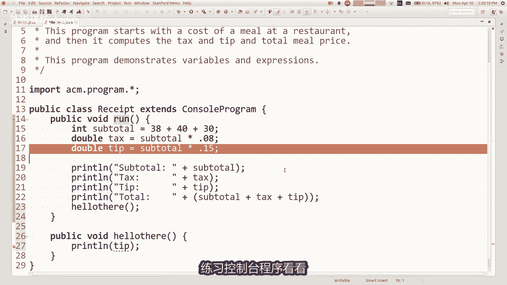

让您的日历页面上的链接。