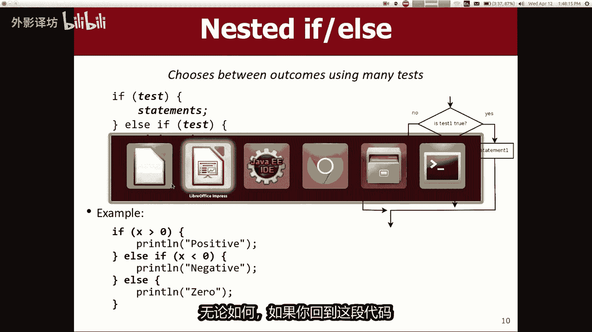
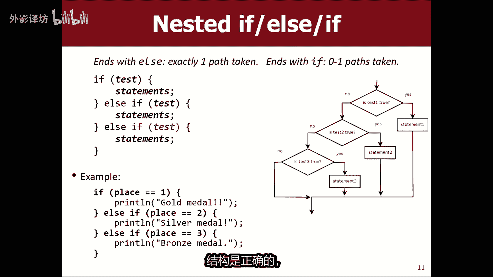
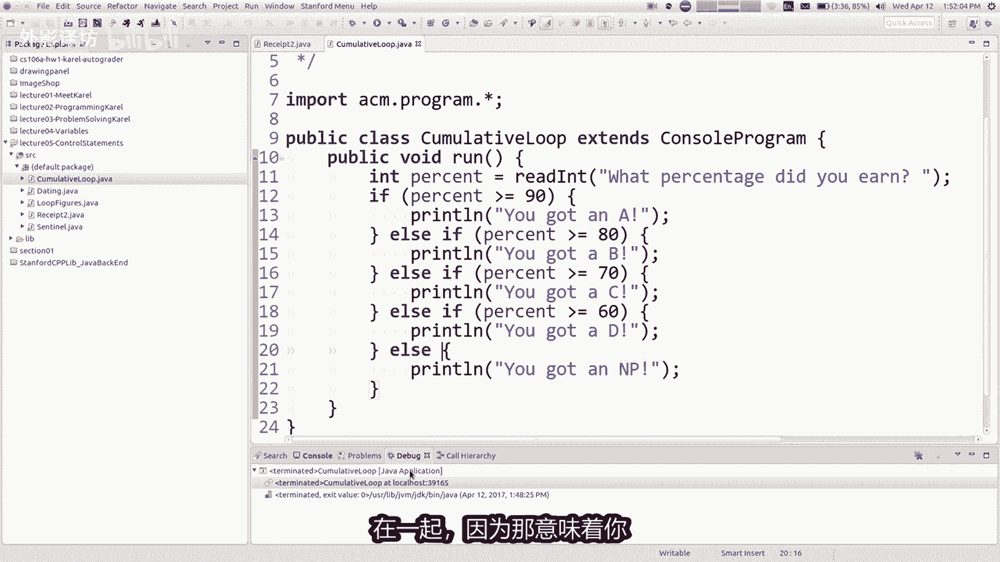

# 【中文配音】斯坦福王牌课程 CS 106a Java教程 2017年春季课程 - P5：05_ Control Statements - 外影译坊 - BV14U4geNEEq

今天我们要继续学习关于控制台编程，我要去重新审视一些java命令，上周我们从卡罗尔那里得知，我们将重新评估他们控制台上下文，并查看一些新内容，我们将在某些情况下遇到的情况，这些陈述是用的新方式。

这来自第三章和第四章预定，所以让我在这里跳进我的幻灯片，我想谈的第一件事，虽然这个程序是我们最后写的，我把它称为收据的时间，计算一顿饭的费用，然后我，在这里教你这些事情，您可以在哪里存储税款。

存储您基础的提示东西被称为什么，是的，你去吧，谢谢是的，所以变量很重要，它们很有用，我们会经常使用我们程序中的变量，为何那些正在帮助我们，避免我们计算的冗余表达是同意值多次，即使你不计算多次取值。

一个变量仍然是有用，因为它有助于表明该计划的意图，使得程序更容易理解，更容易读到，这是一件很重要的事情，所以好吧，这就是我们现在的情况，我我会说关于这个程序不太喜欢，它很灵活，如果我运行该程序。

它肯定有效，至少昨天让我做了，确保它仍然有效，是的它仍然有效工作等等等等，我的字体变得这么小，等一下让我们开始吧，他可以打印出好钱，价值观和东西都很棒，但是每次我运行该程序时，它都会执行同样的事情。

计算完全相同，你可以想象更灵活的金额程序，可能每次运行时，你可以问你知道总共是多少，吃货小计是什么，它会打印一个不同的答案，程序会比这个更有用伙计，所以我想谈谈你是如何，你现在就可以做到这一点。

你知道一个是你，我会说，也许我会说好吧，实际上他并没有花费30美元，而是花费了50美元，我可以保存文件，并且我可以再次重新运行该程序，它会给我新的答案吧，说128美元小计。

当然要求我编辑源代码程序并重新编译程序，转换为二进制格式，然后运行再次编程，我可以做到，因为我是一名计算机科学人士，我有日食，我知道如何代码，但如果我给出这个程序到用户到普通人到麻瓜。

他们必须运行这个程序，不知道如何编辑这个java命令正确，那么我该如何制作程序灵活，无需更改程序的源代码，每次这就是所谓的互动节目。

互动程序是一个询问用户的程序控制台，输入一些输入，以便您知道这个命令，我说的是打印行，在屏幕上显示输出屏幕上的消息，相反，输出是用户的输入屏幕上的值类型和，然后程序使用该值。

因此我们称之为交互式程序什么，你通常会要求用户输入一些内容，然后他们输入什么，然后保存到您的变量中，我们学到的关于变量的代码是变量有用的，另一个地方有一些命令，一些方法可用于控制台程序。

帮助你做到这一点的，他们的名字是读取条目，双重重新对齐并读取布尔之河，我主要想集中精力阅读崩溃，但这些是你的方式，可以要求用户输入一个数字，并你使用的语法是有点有趣，所以你写读int。

并且您将一条消息放在引号中标记，并且该消息显示在屏幕上，但随后程序将暂停，他将等待用户输入一个数字，然后输入该数字被放入源代码中，它是我有点难以解释。

所以让我给你演示一下，如果你去这个程序，在这里，我想要这个程序为了更加灵活，我希望还允许任何小技，而不是写出来计算，就在那里，我可以说读int小G是多少，只是为了，明确该计划是什么。

也许首先我会说print ln，欢迎来到马蒂的你，指导收据，程序感叹号让我们这样说，首先好吧，我要运行该程序，看看发生了什么，他说了什么，小纪这个程序做了一些事情，我们的其他程序都没有完成。

他在中间暂停，正在运行，它暂停的原因是因为我刚才谈到的程序之前，当你运行一个程序时，它是几乎就像一个小光标，下降了电力各行并执行每一行，在这种情况下，它运行这个打印line line，以便显示消息。

然后他到达这一行，他说哦，你想让我执行radiant t命令，所以这个命令正坐在这里等待他，在这个控制台里等着我输入一个数字，如果我输入，你就知道45，如果我按enter会发生什么，45就像扔在这里。

然后放就在这里进入程序，45，我不能用这只愚蠢的鼠标写字，然后五杯咖啡，但你知道的基本上和写的一样，小G等于45，所以让我按ENTER，现在剩下的全部程序使用该值45运行，所以它是有点像。

如果我可以修改源代码，并且写了45笔，但有一个我重新运行的重要区别，程序不做任何改变，现在我输入78，并按ENTER键，使用78so运行，所有代码改变之间是有区别的，源代码并读入现在命令修改程序。

程序很灵活，可以运行，例如不同金额的钱，你可以做的另一件事，就是在这里知道上面写着8%税，你可以说的好，这实际上不是这里的税率，塔罗二托不是更像十或11，或者比这个百分比更高的东西，所以也许你会说。

类似double税率等于你可以做另一个，这些读取命令之一是这个一个实数，所以我可以说无双他们使用NPA的税率是多少，无论如何，现在而不是小计，乘0。08，你明白吗，基本上是您输入的这些值在读取条目中。

double被存储到这些变量，然后你可以使用它们程序的其余部分，我运行程序显示你的小计是多少，了解他们使用65美元的税费百分比，现在在帕洛阿尔托，我想应该是这样，可以写成小数，比如10。0。

但应该写成0。1，因为我正在看这里的代码，所以我觉得差不多是零点要10%税输入，所以现在这两个值是在代码的其余部分中使用，所以这些读取命令和这些交互程序非常有用，我认为强大的东西让很多人有点困惑。

学生通常是当你知行，当你编写一个方法时，你只需命令写出方法的名称，然后括号，然后是分号，或如果这是你排序的打印型方法，将消息放在引号内括号，但一般来说你知道名字方法的括号，分号java中执行方法的方式。

这看起来有点不同，你正在写一个方法的名称，用分号，但你也喜欢声明一个变量类型的look，这两件事加在一起就是这样，代码中的一个奇怪的样子，更多关于后来它被称为返回值，我们会更明白那是什么意思，是稍后。

但长话短说，我意思是我给你的心理模型，比如用户输入45和45，有点被粘贴到代码中了，这是一个完全合理的方式，关于此代码的任何原因，到目前为止的问题是的哦，这是个好问题，我可以吗。

输入您知道的表达是1plus23，它实际上说的是非法号码，他真的只是看起来对于代码中，此位置的一个数字可以写一个程序，你在哪里取出一个数学表达式会为你计算，但这是不是这样做的方法。

这将是我们会更复杂一点，实际上必须采取那条线并排序，将其拆开并进行操作，每个数字和运算符等等，现在我们只需输入一个数字，例如如果您输入小G是多少，他不了解您的业务，所以你必须输入int你知道的东西。

所以这个命令读取int会反复提示你，问你再次输入，直到你输入有效的，如果您要求int，但用户输入像这样的双重权利，他说的是不是那么int，所以如果你想要的话，请输入另一个一个真实的数字。

你可以说零售好吧，我，确实认为学生有时很难了解这些互动节目，因为我认为这是代码型，看起来与任何其他线路不同，到目前为止，我们编写的代码以及程序的整个暂停，是一种一个新事物，但实际上这只是一种方式。

让用户指导执行只是一点点，我们将使用这个课程中有很多内容。

好的让我们继续吧，我想我们已经搬家了，收据随便就好，所以我告诉你，我想重温java中的一些语句，现在再看可能会很有趣，在我正在谈论的控制台程序中，我们了解的if files语句。

正确的让程序做一件事或者另一件事，取决于条件，如果卡罗尔被屏蔽或者类似的事情，好吧，你已经看过了if false语句，但我们要学习更多关于这种类型的信息，可以放在if内部的东西，斯蒂芬。

因为你说如果前面是清除左侧块中，还有其他可以放入其中的东西，GIF其他种类的条件，其他种类的您可以执行的测试和漂亮的，常见的测试类型是提出问题，关于变量的值，我们了解变量。

所以你问user int age等于read int是什么，您的年龄，因此用户输入一个数字，并该数字被粘贴到其中变量，所以现在如果他们的数字建筑的内容少于40，则打印一消息，否则他是一个不同的消息。

我来了，危险的接近希望之一，这些消息发送给另一个HUD，这些消息对我来说非常发人深省，意识到这一点，并且可能是原来的两倍，作为我的一些炖菜，没关系，我就买一辆车，好车，无论如何，一切都会很棒，但是是的。

如果你知道这个问题很常见，关于变量的值使用什么，我们称之为关系或比较小于大于等于运算符，这是这样的东西，所以这里是这些运营商，大多数运营商是不言自明的，除非他们可能不会这样写，你所期望的比比这更简单。

如果你问十是否小于五，这不是真的，或者如果你问十是否大于五，这是小于或等于你的事实，实际上用两个写出来，字符数不小于或等于表明它可以在java中运行，你只需将其输入为与以下相同的两个字符。

大于或等于前两个，如果你问是否有某事，这是不寻常的，等于你必须做的其他事情，写两个等号，如果你想的话，知道某件事是否不等于你写一个感叹号，然后写一个等号，你认为他们为什么用两个，这里的等号不是很典型。

数学符号是这样的，是的，我说如果你只使用一个等号，已经具有含义，java就是你声明变量的地方以及变量值的符号，为此使用等号，因此等号只能用于一个基本上，所以我们不能用它来比较值和负值。

java设计者决定的价值观，用它来赋值，他们决定使用双等号比较值，还有其他语言的做法有所不同，但是这在编程中相当常见，事实上，如果你用一个单一的来写，它等于它不会编译一点红色下划线，你必须有第二个等号。

现在可以了吧，我写这张表的方式可能是有点令人困惑，因为每个人侧面我说指true值false，我这么好是什么意思，基本上只是告诉你是否测试，是否是一个真实的陈述，你知道是否有if语句里面有那个测试。

不会代码输入大括号TRU入会意思是是的，false意味着知道他不会，但实际上是我写的原因，就这样，真或假，就是这样，从技术上来说，这就是所谓的我们要学习的布尔逻辑值，稍后会详细介绍。

但那就是java思考这些逻辑的方式，现在对语句进行逻辑测试，我神智提到了幻灯片底部，你知道我们一直在学习向右循环，并在for的标题中循环，他说foi equals0，i less超过15。

加上加上上周我排序，抱歉我说哦语法是很奇怪，不用担心，只写它下来，我稍后告诉你，所以我想一下周一我们开始明白ONI等于零，就像声明一个变量或者其他什么都可以，这部分语法开始看起来像我在这里更熟悉。

这部分小于十，这是一个测试，不断循环，只要我有一个较小的值比十，所以这样的比较运算符，用于这些小循环边界测试基本上没问题，所以那些关系运算符有吗，关于那些的问题，我想这是不言自明的，额吉爱的。

那么i plus plus是什么意思，是的，我会告诉你，我实际上有一张幻灯片，这基本上意味着去下一个值，从0~1，从一比二，我肯定会谈论这个在几张幻灯片中，所以知道这一切，关于这些关系运算符。

你可能会编写这样的代码，询问用户他们赚了多少百分比，然后打印出他们的年级课程，看起来很合理，尽管你可能会反对这条曲线，如果你连你自己都不明白的话，如果你得到80分，就得到你的名字。

它满足此代码有您没有的错误，错误是某事，你得到了你得到的成绩，然后你除此之外还获得其他成绩。

那个男孩是好是坏，我不知道你怎么让奶奶来的好吧，让我们运行它，我们不必这样做。

理论上我认为你是对的，所以我想我有一个程序我不好吗，也许我不让我们把它放在这里，我以为我有一个文件，为了解决这个问题，粘贴我要运行名为累积循环，这不是他不好姓名，但您的收入百分比是多少，好吧。

我得到了86，他是什么意思，明白为什么我的意思就是你说的好，为什么会这样，是的，86大于或等于80，86也是大于或也等于70，86大于或等于八，计算机按照你的指令去做，你告诉他这个数字是否大于。

我想把这个消息放在这里，你说的对吗，我想你知道，如果你没有看到那件事的到来，那就是因为我们有这些隐含的东西，我们说话的措辞草率，我们期望我们是什么样的人，交谈以了解我们的意思。

当然我不是想让你打印三条消息，但计算机已完成，计算机感觉比人更聪明和更愚蠢，我们永远可以按照我们所说的去做，要做我们告诉他打印所有这些东西，基本上没问题，那怎么办，你做的很好。

这里的问题是这些条件有点像你们互相排斥，应该只打印这些消息之一，将其表达为程序的方法是hive的形式略有不同。

else称为嵌套，If f else，你写的地方基本上是在说，你反复知道并尝试每一个这些测试，并选择第一个匹配，所以他有点粘合他们全部在一起，并使它们彼此相辅相成，自面量互斥，解释这一点的方式是。

如果这是第一个测试，通过运行第一组语句，然后转到底部，否则如果第一次测试没有通过尝试，第二个，然后如果那样通行证运行第二组状态，否则进入第三组，以此类推，你可以拥有任意数量的这些，在这里我有一个例子。

三种不同的积极结果，负数零代米可以有七个不同的选择，A b c d e，无论如何，如果你回到这段代码。

我们正在努力做你要做的一切，要做的就是将这些更改为else，If else if fs，if fs好吧，现在如果我重新运行同样的程序，我输入86，我得到了B，他不会输入其中多个树枝不在了好吧。

有一个小微妙的改变。

将使这段代码甚至好一点，你会的，请注意我的幻灯片在哪里。

我的幻灯片以else结尾，不以else结尾，gift和有一个微妙的区别，这两件事之间，我知道这些图，你流程图我不知道是不是有帮助或无帮助，但可以告诉我们哪些代码的走向，代码的作用是什么。

下一步做我的幻灯片上总是有这段代码，恰好计入三个之一分支，要么是第一个分支，要么是第二个或第三个，他永远不会记录多个分支，并且它永远不会变成零分支，你明白为什么吗，因为它总会选择，你知道如果是的话。

它大于零，它会做，如果小于零，则第一个分支它将执行，第二个分支，并为其他一切都会做第三个放置这些路径之一，代码将运行轻微的变化，是如果第三个有影响，所以米如果区别于则以else结束这个版本。

甚至是最后一个快代码，有一个测试，如果你失败了，所有测试，包括最后一次测试，然后它不会运行分支部，所以这是相互的独家，您将运行其中之一，他们或零，我想给你一个你想要的例子，如果你想的话。

请在此处的幻灯片上决定你想要什么金属，奥运会或者其他什么，如果你获得了第一，如果你获得第二名，你将获得金牌，获得银牌的地方，如果你得到第三名，你可以获得铜牌，否则你不会得到任何东西，获得一枚奖牌。

也许你会获得参与奖杯或类似的东西，但你不会弄乱，所以如果你只是在那里写了其他内容，而没有这个地方等于三又什么问题，那，是的，没有其他命令，所以你的意思是，如果我还有其他的是的。

我想如果你添加了第四个else，什么也没有，在大括号里，就像你不需要说别的，没什么别的就是没什么，不要以同样的方式说，那是对的，即使你只有一个if和一个，其他和其他什么都不是包括什么费用。

如果我把现有的代码划掉的话，如果place等于三，我就删除它部分，并保持其余部分不变，改变每个人都是错误的，谁不是第一名或第二名，所以我现在颁发大约45枚铜牌，基本上明白这样不好。

所以你必须选择其中的一个结构是正确的。

所以对于这个例子，在这里我只想向你指出，你知道如果你超过90分，你就会得到A如果您高于80，B70C60DI实际上可以删除这个，如果在这个特殊情况，因为如果你不是，你将成为前四个人中的任何一个少于60。

你确实想运行它第五段代码，所以它不是有必要说一下，哪一个百分比就不用说了，你的分数低于60，因为他是暗示正确，所以更好一点，我猜你是这样写代码的，从我现在向你展示的内容来看，哦好吧。

我们永远不应该连续三个提示，我们应该他们之间总是有爱丽丝的不正确，我的意思是，有时你只是想说，没有任何其他的，这就是一个例子，那就是那些东西的地方，你们吃的东西不是相互的，彼此排。

他的地方可能想做不止一项，就像如果你问的是配料，你想要三明治还是汉堡生菜，你想要吗，番茄你想要吗，你可能想要所有你想要的纠察队，可能需要七个中的四个，他们你可能什么都没有，所以你不想做其他事情。

如果那些在一起，因为那意味着你只得到右上角的一个好吧。

所以这些是某种嵌套的if files结构，这是我刚才说的一些例子，如果你是的话，测试你不需要的东西，测试一下是否将其删除，必须不小于零，大于等于零，所以我只是别问这个问题，这是一个更好的编码风格的例子。

我想我已经向你提到了一点，伙计们，当我们迎接你的作业时，我们根据功能及其含义对您进行评分，对这两段代码进行样式处理，具有完全相同的功能，同样的事情，第二个更好风格，因为我们没有缘。

这是另一个很常见的事情，学生会做，并且有一些常见的，如果你看看这个所有之间的代码，例如我尝试对它进行颜色编码很少，但我不知道它是否会出现投影仪上效果很好，你注意到了吗，在我所有的三个分支中。

这个打一行无关紧要，它是或者他是什么或者其他什么，但我是打印，我正在做同样的行代码，Rain down，在所有不同的代码，右侧的分支也执行B等于B加X，无论它不等于不管这些名字是什么。

但是然后有一些部分不同，在A等于一分之中，我正在做X如果等于二，则分配三执行X的分支等于六等等，所以这段代码有点多余，如果出现以下情况，你可以将其中一些部件拉出，你在两个方面都做某事。

NFL的分支机构或所有分支机构嵌套的files，你可以把它拉出来到顶部或底部，取决于什么，在这种情况下，你想要运行它的顺序，如果你的代码看起来更好，不服你总是要打印A，只需将打印A移除即可，特殊情况下。

我发现了一个模式，如果如果A为二，则一被分配为三，如果A为三，则分配六分配九，无论A是什么，我都会分配三个，所以总是说X等于每次搬家三次，我们总是作B等于B加X，我们可以移动它。

但也许我们应该把它移到一步，因为它位于所有的末尾，你知道这些小树枝，然后有一点是，如果你仔细观察的话，这是独一无二的，等于外加时只出现的部分在中间分支，所以第一部分仍然需要有一个。

如果以确定我是否需要这样做，再次将左侧代码放在右侧代码上，具有同等的记录功能，是更好的风格，因为他有节少冗余好吧，另一件是你，可以用这些布尔值或逻辑值来做测试，是你可以加入多个测试一起说。

And or or not you，可以说是不是二等于三，如果你问的话，一小于五，你要求他们俩为真，所以如果其中一个或两个都是错误的，整体事情，就像如果你问二是否等于三，如果你不等于问这是否正确。

是否定的，一减小于五好，一小于五是是的，但另一个不是真的，所以说他们是不正确的，都是真的，你知道我的意思，所以如果你说这些的话，总体来说是错误的，它们所在的垂直管道字符反斜杠键，如果你说二各管道意思是。

如果你问是这样的话，剩下二等于三或负数，一小于五，你基本上是在问是其中之一或其中之一或两者，如果是其中任何一种情况则为true，总体陈述是正确的，并且所以二等于三不成立，但是一小于五是这样的。

总体结果是true，这个感叹号标志，我在几张幻灯片前看到过你自己，那不等于感叹号相等，感叹号字符为一种非字符，如果你把不是在逻辑测试面前，它会反转，逻辑测试的结果二等于三是假的，但如果我不这么认为。

从假到真，你知道，如果你如果你学习逻辑之类的，你可以谈论这些事情，真值表就像给定A的值，如果您要求P合，则测试P和测试Q问，除非他们都为真，否则它是假的，如果你要求P或Q，这是真的，除非他们都是错的。

如果你在你的电脑上使用antenna就可以了，塔罗尔计划作业义，虽然有一些我一直在叫的其他事情，这周你喜欢外面的变量for循环的上下文，我想你不应该用在卡罗尔身上，但我们经常会用结合这些东西。

我想写一个很快就和你们一起编程。

为了好玩，如果我们想尝试一下怎么办，决定我们要约会的人，这是一个敏感的话题，非常个人的信任，非常非常个人的信任，决定我们想要做什么，我们想问用户一些问题问题，然后根据他们的内容说，我们会告诉他们。

我们是否愿意，无论是否与他们约会，我们都会学习很多关于阅读数字的知识，所以我想知道你是否是将决定，我们是否要去约会，与某人有一些数字，关于你想要的那个人，知道了，让我们尝试让pg做好准备。

你想知道的号码是多少，是的高度可以有不同的单位，对于高度，所以也许我们只是说int height等于read，int有多高，你英寸问号好cool，你想知道的另一个号码是多少，是GPS。

这是一个非常斯坦福的答案，好吧，很酷，我没有，我没有问你是否有一个最小或最大边界，我们正在寻找信用评分这些事，是的，你的信用评分是多少，N，好的，我还想要一个，这很有趣，给我多一个性别作为数字，很棘手。

因为我认为这更多的是就像A，并且很难知道，到底如何处理那一块，我想要的数据以及如何处理它，要知道给我一个更像是数字式的好吧，你确定几岁了，也许吧我会问年龄中的第一个读int如何老了，你还好吗。

你可能有一些完全不同的重要标准，你没关系，这只是为了好玩，所以也许我们想要什么就想做什么，我们需要这里，也许我们有一定的年龄限制，我们想要30岁以下的人，这么说吧，如果你的年龄较小的话，超过30。

这是一件好事，但我基本上我想要组合在一起，某种如果有那么富兰克林，我们去约会吧，否则如果你不是我关心的全部print，不是你，而是我，基本上在这些中，括号里我想写下所有我关心的，我需要的东西。

愿意尝试并继续与你的第一次约会，所以你知道我们只是开玩笑，就在这里，所以我们只是玩的很开心，但是也许你需要身高五英尺，一英寸或类似的东西，61英寸或类似的尺寸是多少，那所以如果我也希望你是61英寸。

我应该在此处添加什么同步，并且您的身高大于或等于61，大声喊出所有61岁以下的人，没问题，你也很棒，但我们只是在这里玩弄布尔逻辑，所以N和一个兄弟同步，并且对你明白，如果我说或者。

那么基本上任何年轻或高大的人都会得到通过，但也许我需要这两个快乐的事情，所以我要写到这里就结束了，Gpa，你的GPA是多少，希望他们有4。0挖，也许你应该从简单一点开始，就像呼吸一样。

你知道愿意说话没事，所以无论如何让我们试一试，有点回旋余地，过来吧好吧，但如果我们需要所有这些东西，那又怎样，但我们会放弃你所拥有的一切，一个非常好的信用评分，因为胜过一切良好的信用评分。

我们想要不知道，你甚至不知道，除了800，是那伙计们，为什么你甚至去信评分，为什么不呢，就这样吧，父母们平衡一下吧，银行余额，让我们直接说吧，我想要一份遗产承认去度过美好的一天，嗯嗯信用评分800。

如果信用评分800就好了，我们非常渴望，如果他们有递话，就放弃其他任何东西，我如何在我的程序中表达这一点，是的先生，就像那样，这肯定是完全正确的，我我认为我们可以做的更好一点。

风格比那个因为我不得不重复Y打印两次，所以这是功能完全正确，我想稍微提高一下风格，轻松火，是的是的，如果你这样的话，那就完全正确了，拥有这一项真正伟大的品质，信用评分，或者您拥有所有这些其他品质。

这两者之一，你知道我会尝试一下，所以让我们尝试一下，但我不想详尽的坐在这里，并测试所有这里有可能性，但有多老了，你好吧，让我们一起去22吧，我的我不知道70，我的GPA3。99是多少，你的信用评分很好。

我有点粗略，信用520很好，够了，我们去约会吧好吧，否则我76，我身高33英寸，但我不是，做的很好，但我会发布这个程序，稍后如果您需要使用它，那好吧，如果我31碎了怎么办，我64岁了，我的GPA是3。

2，我的信用评分是600，我搞砸了，我这里没有分数，我不得不降低GPA并零线要成功，所以他去了，无论如何，其他方向我们只是善良，玩得开心，但我不是故意的，因特工身高冒犯任何人，而是或者其他什么。

但就像嗯那就是你用的一些东西，这些布尔值与这些逻辑测试，是的哦，这是一个很好的问题，比如什么，如果你把括号去掉，会不会仍然以同样的方式工作，所以你知道在我直接回答问题之前。

我只是像往常一样指出可以添加一些括号，确保我相信，与符号实际上具有更高的优先级，评估的优先级高于逆己经，所以我认为从技术上讲，这事没有他程序会正常工作，但我认为你经常得到的结果是。

如果你有一个更复杂的测试，有一个X你就有ORS和一个大的，将所有这些混合起来，然后就得到了，真的很难记住到底是什么顺序会发生，所以我真的认为早餐不错，我觉得还不错，这并不是一件坏事。

老实说有点忘记是否合都有不同的先例，只是真的确保我会锁定，通过这些来评估这里的顺序，括号到位，但我认为你是是的，我很确定程序会运行在这个特定的情况下，没有它们也是一样的，安利是的好的是的。

这是一个有趣的问题，他说如果我能用的话怎么办，信用在这个如果开始就想，如果那些其他的东西，比如这些和零件三个，你必须拥有这三个，但你还得担心分数至少有500个，其他品质都不错，所以是的，你可以这样做。

你可以说所有其他的东西和信用，至少为五一百就可以了，这样你就可以多次引用同一个变量一次，如果你需要的话，我已经这样做了，之前有过一次例子，但我没有做关于他可以获得的，任何类型的免责声明，pg级。

还有其他一些人们要求该课程的人数，FRND是的，是的，这是一个有趣的问题，他说这个程序的成绩是我本来可以写在这里的，就像如果你大于或等于80，并且你小于或等于89，或者我看到这种代码可以这样写吗。

我的主张是好是坏，陷入不必要的代码，我已经检查过的类别，您大于或等于90，所以那么如果我随后问你是否大于等于80，我知道你不可能是90或以上，因为我已经检查了一下，所以他不是有必要询问任何不在。

这段代码第14行的要点不是，显然是一段糟糕的代码，只是你不需要这么说，如果你不必好吧。

是个好问题好吧，还有什么哦，还有一对一些微妙的事情，我不会花时间，像很多数学人一样，花很多时间，想要写成二比X少超过十，它实际上不起作用，如果你真的想要的话，就这样写，要工作你必须说二比X少X小于十。

只是java需要你把它写的更长，因为java不理解，三元组也体现在以下方面的不平等优先级，你可以混合算术和乘法和逻辑之类的东西，你可以说是5×7大于相等，并且它完成所有算数，首先然后执行逻辑之后。

以及所有其他协力，我们了解到仍然适用，所以它是很常见，好吧，让我们来讨论一些东西，关于我是否想教你一些新的，现在关于循环的事情，for循环我们可能会做，while循环星期五，所以记住for循环。

你知道我们之前比赛时间等于零，并且全部那东西真正发生的事情是，for循环的标题，由三部分组成，它有所谓的初始化步骤，有一个测试步骤，初始化首先发生在java到达循环，然后重复java将检查测试是否正确。

并且如果是这样，它将运行里面的语句大括号，然后运行后大括号中的语句它将运行更新，然后它会重复，所以好吧，如果你看一个具体的例子等等，这是哪里哇，抱歉我有一点在这里混在一起，我想谈谈你是新人。

我想有人问过你，关于i plus plus，我plus plus是一个更新事例，i plus plus的真正含义是什么，当以下情况时，它被称为增量语句，你写一个变量的名字，接下来是一个加号。

基本上意味着设置该变量来存储其旧的值加一，实际上这是一个非常有趣的一行代码，X等于X，如果你是数学家，则加1X等于其自身加一，但是当然你不会写出来数学中的不等式，这里等号的意思是存储一个标志。

这样你就可以说，我想要将X的值更改为原来的值加一，如果X等于二，并且你说X等于X加一，就像说我希望X变成三一样，因为这是一个相当常见的，增加A的值的操作变量，被赋予特殊的运算符，称为plus加运算符。

如果你写x plus plus，则表示设置X的价值在于它的优点，也许你听说过，在编程之前加上加上你们中的一些人，拥有称为C加加的语言，也许听说过即将到来的语言，这是个笑话，这是一个傻瓜笑话。

C中有一个持有者语言，然后他们添加了一些新东西，他们就像哦就像下一个种子喜欢看到加号后，如果你拿106P是的，那就是这就是正确的数量笑，如果你有的话，你也会笑，学习C加加，我希望坚持下去，大约106。

因为大事我们在那堂课上使用的语言，但无论如何，这就是i plus plus的意思，意味着将变量值增加，所以我想向你展示一个具体的，例如，现在又是一个for循环，我谈到我们如何拥有一个初始化。

我们有一个测试，我们有更新，所以这个for循环是什么，真正的意思是起一个不变的名字，我存储零，现在重复打印，直到我已经到了五岁了，我要去的方式，每次循环时修改id眼睛值会增加一次，基本上我会是零。

然后是一，然后二，然后三，然后四，然后那么一旦我达到五就不会了，小于五，然后循环会停止，所以从技术上来说，这就是for循环确实在做，虽然当然我们还是有这样的心理，如果我在这里读五的快捷方式。

循环将重复五次，这仍然是正确简化是什么，正在发生更新之类的事情，所以这张幻灯片的一个有趣的怪提示，我们实际上正在使用的值代码里面的变量，来看看我打印LI加点点点和，这意味着对于每个整数零质。

但不包括5Y之间，想要打印该整数后跟一个点点点，所以它打印0。1点点到四个，然后就停止了，这实际上非常强大，你可以使用该变量，还这只是一个变量，就像其他变量一样，你可以参考一下，是一样的。

指的是它的价值，目前有，该代码有意义吗，关于这张幻灯片上的代码的问题，是的，是啊，为什么不从1~51呢，也许在这里读一个，然后说只要I小于或等于五，然后他会说让我们数一下12345还多。

自然你完全可以做到这一点，我这样做的原因是，从开始零式计算机启动的方式，在很多情况下系数为零，很多时候我会谈论斯莱特，当然但很多时候你就是你想要循环一系列数字，并且这些数字用作类似的偏移量。

从一个起点开始，比如有多少个距离我家几英里，我们将从一英里外，然后门一英里外，然后去两英里外，你想要做零一，这样你就可以有一个循环，就在你家的对面，从离你家英里远的地方出发，或类似的事情。

因为我们常常最终想要数从零开始，没有真正的为什么你总是必须这样做零，但这只是我认为作为一台计算机，你属于科学和编码类型的人，只是有点落入零开始点习惯，我的一个朋友和另一位讲师，他的名字叫克里斯克雷格。

他有一个杯子说世界0号计算机科学教授来吧，就是这样，有趣的，无论如何，如果你想要更多一点详细介绍其中之一，看起来很复杂的流程图，有你第一次这样做时，这里是第一个初始化步骤，所以这实际上是一个循环。

开始于如果测试为真，则重复一次，一小于或等于四，是的，如果是的话，他会执行以下快大括号中的语句，然后是更新是i plus plus，所以我就变成了它保留的两个图像，调到43~43到四三，直到二为假。

然后就停止了，所以它会产生脂肪，所以这就是为什么循环有效，所以我谈到了i plus plus作为一种增加增加的方式，您没有的变量的值使用i plus plus作为你的增量，可以增加或减少其他值。

这是你写的一种方式，加等于，然后写出金额，你想通过你可以改变它，说简等于X等于除等于这些都有效，或者你可以写出较长的形式，将其设置为等于自身加上也完全没问题的东西。

具体的例子就下，如果你如果你在这个程序中写到这里，如果你说INTEI等于零，则小于大于或等于100，I加等于十富兰克林，那么他是，试图询问约会的事，不不不运行该程序，然后运行该程序。

他打印零十二十三十四十，它上升十，因为我说我家等于十，而不是我加加，我猜另一个该程序的版本是我可以我说过，我在这里加上，然后我可以说在身体内部，如果I能被十整除，则打印明智，但这样就可以了。

不必要的重复循环。

爱不需要，所以我认为这个人是比那还干净，所以这些是一些这些简短的修改命令变量的值，你可以有一个倒计时的循环，可以从以下位置开始归结为一，区别在于你需要稍微改变你的测试，这个测试的条件是循环应继续重复。

所以只要眼睛价值还在，就继续前进，至少有一个，所以从十点开始继续，直到e i minus，minus表示减一，所以去十987，然后发射更少，比递增for循环更常见，这个递减for循环，但你仍然有时做。

那么这个怎么样，这是一个有趣的例子，它被称为累积卢，漂亮常见模式，你，想要计算一定范围内的东西，所有数字的总和是多少，现在从1~1000的整数，如果你数学很好，你知道有就像一个简化。

你可以N乘以N加12或类似的东西，但不担心那个有很多你想要的例子，计算某事重复的值范围，有一个关于如何做的有趣模式，这是你声明一个变量曾经在循环外，现在在循环内，你修改循环的值这个变量。

所以这里发生了什么，是说总和从零开始，但是然后你加一，然后你加二，然后你无论如何都有三和四，所以总和正在积累，随着时间的推移，一直变大到千，所以这是所有的总和，从一到千的整数排序。

这里的关键见解是你有声明某个变量之外，现在for循环。

为什么你必须这样做，如果你不这样做的话，我会告诉你，我的意思是简短的回答是这样，如果你不这样做就不起作用，但有些等于零，我们增加到100，让我们做我加加让我们做一些，加上等于我柏林总合适加一些东西好吧。

如果我运行它，它会说总合适五百五百，我很确定这是正确的回答，但是问问，如果你尝试这样做怎么办，像这样声明这个值，如果你细心的话是行不通的，你注意到第15行的总和有下划线，但我的意思是。

我认为他有与理解哪些行有关，代码执行一次与哪个执行的代码行数超过，如果你说总和等于零一次，在这些花括号里面，你就可以了，重新创建，并将该总和重置为一遍又一遍的归零，它不会变得越来越大。

并随着时间的推移积累起来，实际上对我来说非常重要，仅声明一次，而不是重复，但反复修改它，这样就可以了，重要的区别，如果你想，如果您愿意警察看他想象一下到底发生了什么，有点麻烦，发生在这里。

我会做这个我会做打印，进行中的零总和是加总和，然后我会像这样增加它，事实上也许只是为了好玩，我会说暂停100ms，你会发现，只是逐渐增加歌曲，如果你没有的话，程序会继续运行，有停顿，它会呕吐出来。

离线输出太快了，无法观看他们，所以我们可以看着太阳升起，作为一个恩惠，你可以看到的最后一行，它来自四十九五十二五十四，这个添加了一个距太阳100英里，这是最后一次注册范围内的编号，如果我一直向上滚动。

如果你没听懂他开头的一些内容零，然后我加一，然后我必须，然后我有三个比我有四个等等，所以任何关于累积的问题和，好的，如果我想知道的话，该怎么办，整数的因数之和，就像我有一个int n等于24。

我想要知道24的所有因数之和，我是怎么计算的，我的意思是我们可以重用很多这样的代码，我想这个想法是我想参考的，必要时到N，以便如果我改变结束宣言和其余部分代码，会自行修改，适当的有哪些变化。

你想让我完成尾声，好吧，让我们尝试一个不同的问题，电流循环上升到100怎么办，我知道一个数字是否是另一个数字的想法是，如果，余数为零，所以如果我说N24，余数四，就是说24除以余数是多少，四余数为零。

所以我可以问N冒四是否为零好，这意味着四是一个因数，那么怎么办，我找出24的所有因数来求和，一切都很好，我可以尝试所有从1~24的数字，看看是否他们每个人都是一个正确的因素。

所以我可以有一个从一到N是什么，我在这里做什么，所以每个int，我从1~24，我想做什么，那，是的，好吧，如果这个数I是N的因数，如果N被I修改，则比投资的总和还要多，余数为零，然后将I添加到。

太阳24的一些因数是61+2加3+4，加6+12加24，我想我忘记了八，无论如何，所以我认为这是正确的金额，无论如何，那就是我们要停下来的地方，因为我们没时间，周五我们会用while做更多的事情。

