# 【中文配音】斯坦福王牌课程 CS 106a Java教程 2017年春季课程 - P6：06_ More Loops, Constants, Random Numbers - 外影译坊 - BV14U4geNEEq

所以今天的计划是我要讲，我将进行更多控制台编程，详细讨论循环，我也要去教你关于随机数的知识，常量和其他一些好东西，每隔几个快速公告家庭作业，从今天要出去的作业二，我们将举行一次帮助会议。

我们的一位部门领导将参加，我们给你一些有关的详细信息，如何开始的作业，给你一些提示，可以回答您的问题，我们称之为这是您的早期作业，帮助时间或是的时间和第一场会议作业，二得作业将于下周二进行。

晚上七点在STLC114个，所以作业当然会去，今天已经起来了，但是也许需要这个周末看一下，但是如果你对此有疑问或需要建议关于他，并去那个会议与办公时间略有不同，或我认为后面的事情就像该层用于调试。

如果您作业代码被破坏了，是的我们的绘画不是为了这个，他更多的是为了了解您所知道的作业，询问预期的问题，您的情况以及您需要做什么，才能获得关于开始这类工作的一些建议，你们应该拥有的一切都好吧。

现在已经转到你的第一部分了，如果你没有或没有被分配给你，应该晚点去填写该部分注册表单，放入一个部分，你知道这就是一个模型，我们每周要做的事，我们要解决这些问题，这些工作表和练习更深入一点。

与您的部门负责人分别提供材料，时间在较小的设置，所以希望这对你们所有人来说都很有效，嗯让我开始今天的幻灯片，所以就下第六张幻灯片没问题。

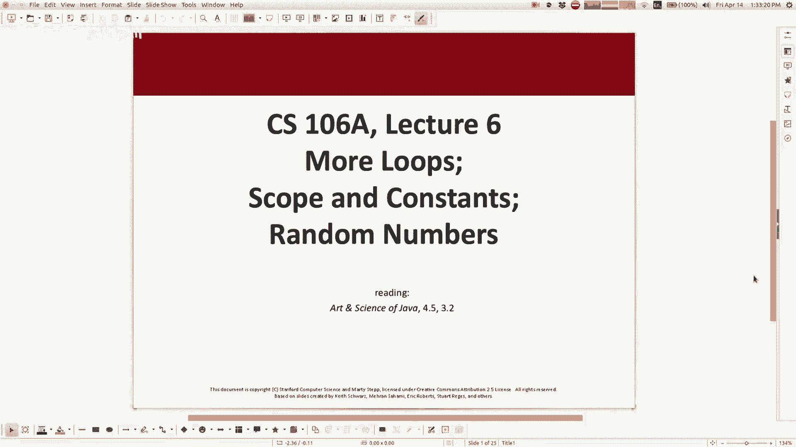

问题是的，作业二将于一周内到期，星期一，所以从现在起十天后到期，本季度的一般作业要么缺席一周，要么只是缺席，有一周多一点的时间，也许我们喜欢一周加一个周末，给你一周的时间再加一点。

但是春天是最短的一个季度，今年所以一些作业指示春季严格一周1/4，好吧是的，所以无论如何，今天课堂阅读来自张杰，我们要读的书的第三和第四部分，重新审视一下循环，这样我们在去年年底看到的最后一件事。

我称之为讲座累积循环和这个例子，这里的幻灯片是关于添加，所有从一到千的整数和I，向您展示了这个重要提示，您需要执行的重要代码段，您需要声明一个像上面的一些变量一样循环。

然后再循环体中它将逐步修改修改该变量的值，构建代码很重要，这样你就知道变量了，在整个过程中保持正确的值代码，以便你以后可以使用它，你需要它，当然还有这个例子，是一个简单的规范事例累积算法。

但我们要只用这个想法几次，所以我想要只是提醒你，这个想法在循环期间累加一个值，可以好吧，让我们看几个例子，在此基础上我想更深入wave with循环在这里，所以一个特定的我想谈谈什么时候。

他们称之为哨兵循环和哨兵value是一个值，有点像在某些情况下向您的程序发出特殊信号，这是一个通用术语，例如如果你在这里查看这个程序，我说我们写一个程序来询问用户输入一些数字，并然后当用户输入零时。

程序将停止，并显示所有数字的总和，用户输入，好的，明白了，我需要你的帮助，所以我要取我的eclipse项目。

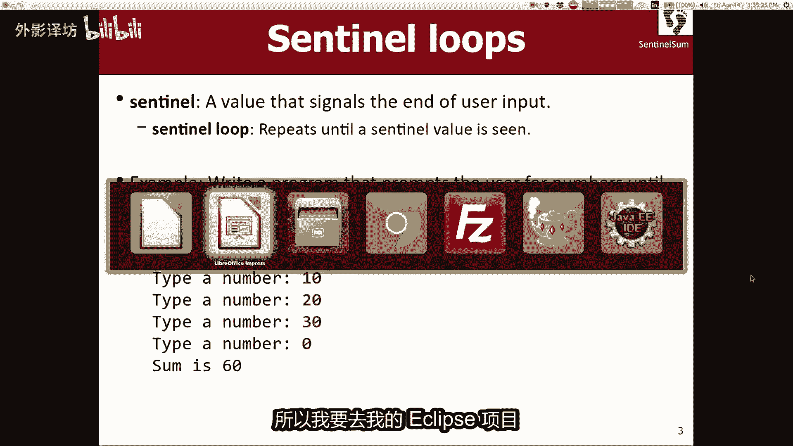

今天我有一个名为哨兵点java，好的哨兵我们走了，所以帮帮我吧。

他说输入数字十，当我写一个数字20M时，我喜欢把程序切的更小，解决这些问题，然后有点向外扩展，直到我完成整个程序，并且经常你可以消掉的一小块是，如果你应该做很多事情，有时你为什么不尝试做那件事。

只需一次即可使其发挥作用，并然后向右重复，所以份额数字十的类型，我如何要求用户输入一个数字，是的是读入命令。

谢谢您，请输入数字，十好吧，所以读in type这样的数字可以吗，通常还有一点点在左边，右边我该怎么办，通常放在阅读的左侧，你还记得吗，是的，我做了一个变量，是的，我在number中声明了。

像int这样的变量等于读取它，以便它们输入数字，它被存储到该变量中，好的太好了，现在我在这里做一次，我需要重复做正确的事。

我需要做，直到他们输入一个零，问题描述说对好的好的。

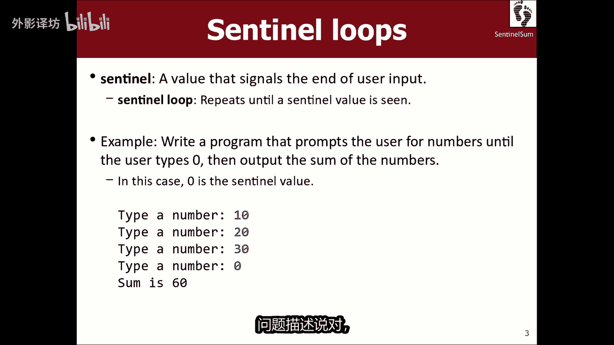

所以看来我需要重新做一遍，一遍又一遍，听起来像一个循环，对我来说，我应该使用for循环还是while循环，以及你为什么认为，好的while循环，因为用户需要告诉我什么时候停止，是的，如果我知道的话。

那就是四循环，我确实要去五次，要去十次，我不太清楚无限期使用多少次一个while循环，所以好吧，而我不知道做对了，记住，你放进去的东西是一个测试，你想要检查的内容以及测试时间变为false，循环将停止。

因此测试类型是持续进行的条件，那么我应该在什么条件下保留，当他不为零时就去好吧嗯，他们输入的数字不为零，当我写的时候，他是用红色下划线写的D14形态number，这个词为什么下划线是一个错误对偶。

为什么是这是一个错误，是的，先生变量不是尚未在程序中的该点定义，谢谢完全正确，就是我在定义它之前尝试使用它，尝试在D14行使用它，但它直到我15岁才存在，哎呀我该怎么办，解决这个问题，是的。

就像现在麻木一样，先声明他，我们已经学习了不同的语法，你可以只需声明一个变量，而不给出他是一个值，或者你可以给它一个值，一件有趣的事情是，如果你不要给变量一个值，实际上也会导致错误，我现在遇到的错误是。

他说我有一个名为number的重复变量，所以也许你还记得是否将其用于number两次，他试图制造两个他们互相冲突，真的是这样，这里的代码型是我想要的，更新number的值已存储，int用户已输入。

所以我只是删除这个词，已了解，你不要再说一遍，因为类型加上这个名字，意味着你想创建一个新的之前不存在的变量，但是如果你删除这个词，这意味着你想要更新已经存在的变量存在，所以没关系，但现在是还在生我的气。

他说电量可能不是初始化了，所以现在他很生气，我因为如果你只是跑过程序做的第一件事，就是它创建了这个变量，但它没有有任何价值，但就是这样无价值的内存块，然后如果我询问他是否等于零，不知道它的价值是什么。

所以他是他不知道如何在这里表现，所以当变量没有值时，你不能使用它，所以好吧，我需要给他一个价值，我应该给他很多价值，如果我们初始化，那么我们就将它们设置为零或做什么，你想那个，是的，哨兵为零好吧。

所以我如果我不应该将其设置为那样，将其设置为零，然后循环此测试，这是一个错误的陈述对吧，零不等于零，是错误的，不真实的陈述对，那又怎样，意味着循环，实际上会甚至从来没有进入过它本身。

这意味着我的程序会立即完成，他不会做任何事情，所以我认为我想说的是，我需要将number初始化为除零，开始我的程序就像他们一样，除了零什么都升级，Open to，你需要验证不，我不想升级。

oben to任何东西，但为零，所以如果你明白为什么，那必须是除了零之外的任何东西，只需要让这个测试成立即可，它会进入循环，然后他会将值更改为任意值，用户输入某种类型的是在这里开始这个程序。

也许这个随机的愚蠢数字是善意的，愚蠢的，也许将其设置为一个或某物，就像我现在不知道好吗，阅读这些数字，记住目标程序是当他们输入零时。

应该打印总和是60，那么我该怎么办，执行程序的那部分，有人帮我看看我该怎么做，总和等于60公元。

所以有一些加上等于他们输入的数字不是，所以添加这些可以，但我没有，月亮还存在，所以你想让我走吗，使一个像这里一样，总和等于零，就像累积算法一样，我们讨论过的东西好吧，所以添加将它们全部加起来。

然后最后我可以打印总和式加总核对嗯。

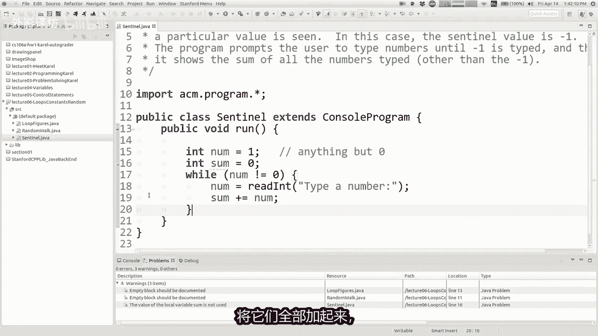

总和加上类似的东西，好吧，让我们尝试一下sental java运行并，我能得到什么哦，字体很小好吧，让我们来做吧，那里更大，哎呀，斜体不，我不想要它，粗体好的，输入数字是二十三十零和60，伟大。

我们做到了好的，到目前为止一切都很好，现在让我们做一个小改动。

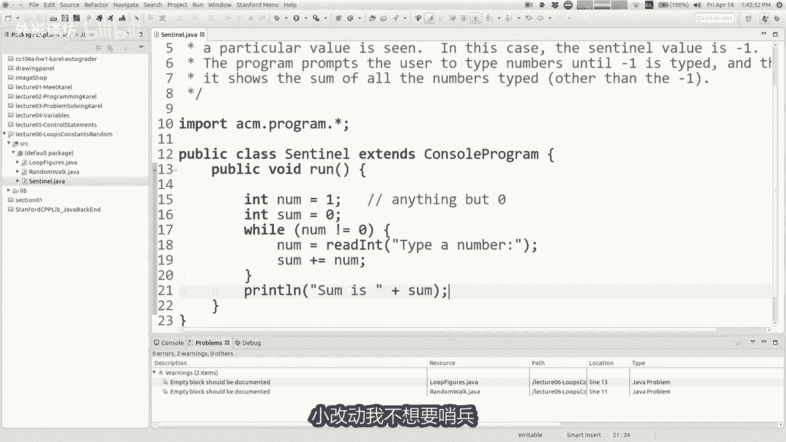

我不想要哨兵不再为零，我决定我想要哨兵是消极的，所以我会只需将代码更改为负数，一期末余额不是零，好的，我们现在就去做吧。

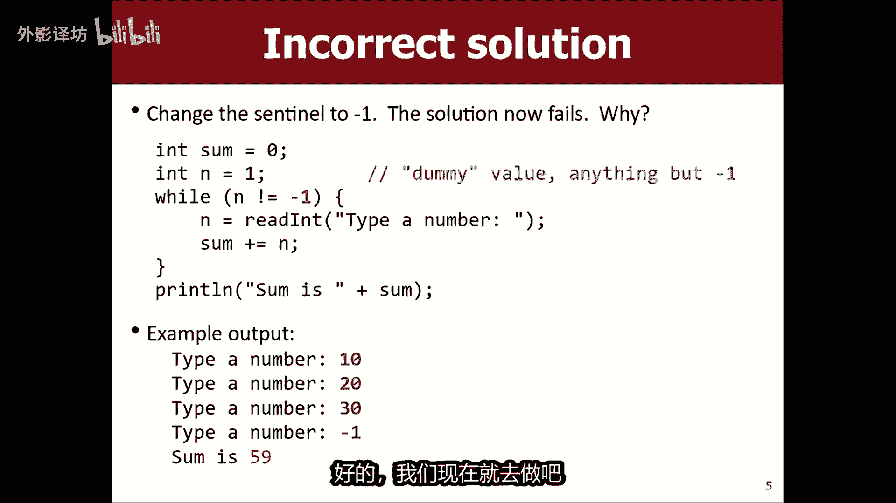

应该不会花很长时间，所以虽然总和不是负数，继续循环好吧，实际上这个评论绝非零，这确实不是消极的，现在可以了，输入数字十二十三十，一届总和适，59oh，事情不对，我们继续吧，是的，是的。

用户的负面影响介入的内容，就像添加到我的歌曲中一样，现在不想这样，有时如果你愿意的话，会让学生感到惊讶，就像浏览这段代码一样，观察循环旋转，看看会发生什么发生等等，你会发现什么事，最后你知道你读了十个。

你读二十三三十很漂亮，最后一次步行时不言自明，通过循环，你要求他们输入一个数字，他们输入一，然后然后一旦他们输入否定的添加到总和中，然后我们循环回来，我们检查测试，然后我们看到它是负数。

然后我们停止循环，但是你看到了吗，我们没有检查测试，直到它为时已晚，直到我们已经错误的将负数添加到太阳中，我认为有一件事让一些人感到惊讶，学生们此时此刻就在这里，用户输入负数的地方。

并且他在那一刻被存储，从技术上讲，这个测试是正确的，现在就变得错误了，测试的瞬间就变成了假，所以你会想象，也许瞬间该测试变为false，循环会停止，但java总是执行检查之前循环的整个循环体。

如果测试为真，则再次测试运行整个牙套的主体检查，再次测试运行整个支架主体，再次以此类推，如果测试变成甲在身体中间，它仍然跑完了全身，所以仍然这样做，并添加负数，一首不该做的歌，那么好吧，我们必须修复它。

我们该如何修复这个错误，你觉得怎么样，添加一个新的赛亚人，如果是一切就想解决这个问题，你想要在哪里，如果，好的，如果number不是负数，然后将其添加到这样的，当然所以我想我喜欢这个例子。

因为有多种方法可以解决，我想谈论很多的问题，解决问题的不同方法，这完全是解决问题的正确方法，问题让我们运行它，并查看这样的类型，数字十二十三十，-160，如此有效，这不是我最喜欢的解决问题的方法。

问题是因为你有点重复这个测试两次，还不是最差的，世界上有什么东西可以重复测试两次，也没什么大不了的，这很好，但我也只是想看看其他一些方法，各自的优缺点都还好，还有一件事，你可以做，我可以做。

就像我不喜欢这个解决方案，但是java中有一个命令叫break中断命令立即退出，就在那里循环，有些程序员不这样做，就像这个命令，我认为他的风格很糟糕，或者他们认为你应该避免这种情况。

命令我们的教科书使用它，我个人不太喜欢用，除非我需要它有点感觉，就像您知道应该使用的工具一样，很少，因为他有点跳跃，你围绕make进行的程序，有时会make程序更难阅读，所以你可以做，而不是说好。

如果总和不是负数，或者如果是第一，你可以说如果这个数字是负面的，我想抱歉，如果数字是负数，我想打破类似的事情，你可以你可以插入这个break语句，立即停止循环，如果他们输入的数字是负数，和什么几乎一样。

你建议它略有不同，你可能会说这些解决方案都有效，我认为有一个解决问题的，第三种方法是与这两个我不同，想谈谈这个，所以想一下我们现在在这里做什么，用户正在输入数字，用户在屏幕上输入数字，十二十三十。

一又为数字，我想将其中三个字母相加，我们没见过这样的情况吗，在我想做某事之前四，我想做点别的事情，一倍是多少，栅栏柱问题，记住类似这是一个栅栏柱，我们已经在不同的衣服上遇到了问题。

学习了栅栏柱的策略问题，记住你知道栅栏柱是如果你保存邮局邮局，邮局邮局为什么你总是会以一根悬空的电线，就像有什么技巧，为了解决栅栏柱问题，你把一个帖子放在第一位，你就放置了一个发布。

然后你的循环是电线帖子，电线柱，电线柱正确好很好，这个程序记住帖子是你做的次数越多的事情，以及电线是你做的事情越少，那么我们再一次做什么呢，在这个节目中，是的，从用户处获取输入和int。

读gains就是post的事情和电线是我们想做的事情，减少一次，添加它们的次数一起算成总和，所以如果你只是排序，盲目遵循栅栏解决方案，以及我们了解到您可以的模式，实际上以这种方式解决这个问题。

下面是如何做到这一点，让我们移动其中之一，这些帖子，让我们移走其中一篇，将输入读入输出，所以你会做什么可以做的事，而不是初始化这个到某个虚拟值，但绝不是负数，将其设置为以下结果，读一个int。

所以问他们第一个现在循环开始之前的数字，请记住这是我们的帖子，那笔帖子如果你付了钱，如果你放置了一个先发布，然后再进入你所在的循环，应该走线柱，线柱正确，所以电线就是数字相加，今年夏天加上number。

就是县队等内部主体，环路应该在那根电线或电线柱上，首先发布电线，所以这也是这个问题的正确解决方案，你别相信我的话，我会逃跑，他告诉你，让我们试试，10：20分30负一总和是60。

所以米从这三个解决方案中知道，您知道你的if解决方案和或中断解决方案，或我个人喜欢的这个，这是最好的，不是因为它客观上更好，而是因为我喜欢能够重复使用解决方案，策略的常见模式，我以前见过的还有这个栅栏。

铁丝模式，经常弹出，这是一个解决这个问题的简单方法，就是移动，现在每个帖子中都有一个解决方案，有像你这样的优点和缺点，解决方案，我必须添加一个，如果是有点重复，我的这个测试，添加一个重复的读。

所以你总会有一个需要处理一点额外的代码，这个问题，所以你知道没有解决这个问题的完美方法，但我因为这个原因有点像这个对此的疑问，是否会导致感觉是闹，那太好了，我很高兴你，也建议这是另一种方式解决这个问题。

将是他说的是初始化这个总和，而不是从零开始，然后从一开始那个负面的东西被添加了，但他很友善，取消了一项我喜欢的权利，我并没有真正在这里展示该解决方案，因为该解决方案存在问题，他会解决这个问题吗。

但是它只适用于具有逆运算，例如如果您正在添加数字，您只需添加即可，相反数或减数有一种相反的情况，但是有时有些事情就像你一样，知道你想要多少栋房子，推土机什么的，如果你推土机太多了，所以你尝试一下。

你必须稍后重建一个，你照我说的做，就像你不做一样，总是有相反的操作，就像删除一个文件一样，容易太多了，我们都会放一个文件，包邮时很难喜欢做与你相反的事情，不小心做了太多次了，在此程序中。

尽管该操作会工作得很好好吧，所以这是一个作业之一上的哨兵循环，我们要求您解决的问题，有类似的事情，你必须保持循环，直到看到一定的价值，所以你必须思考同样的逻辑。

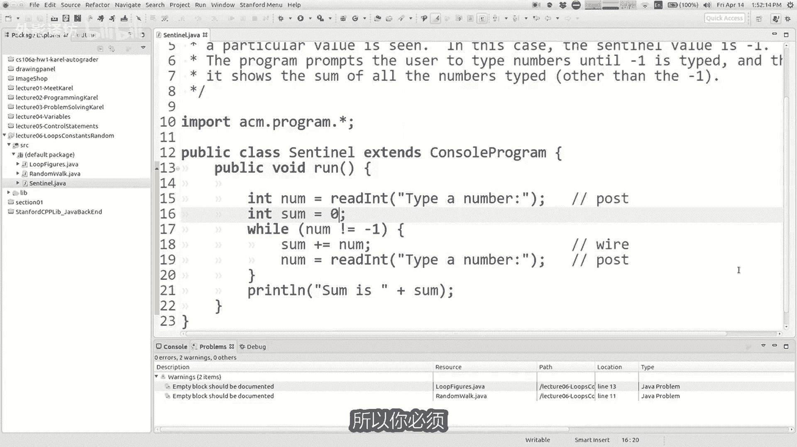

那里好吧，我要跳回幻灯片，这是我们修复的一些不同的问题，谈到了，我想谈谈胶水循环的嵌套，松散的循环部分，因为你没有受够了这一切的头痛，所以嵌套循环就是，当你有你可能拥有的循环内的循环。

已经为卡罗尔做了一些，但是这是一个包含两个for循环的事例，我觉得有些同学有很多，诸如嵌套推理之类的麻烦，循环阅读，他们有点困难，有时所以我的意思是在这个例子中，我有一个循环五次的外循环。

我有一个内循环使times和内循环打印星号盒，我称之为刺痛的内循环，括号内没有任何内容，基本上结束输出型打印十颗星，然后转到下一行，执行所有这些五次，这是这段代码的行为，所以当你在屏幕上运行它。

你会得到一个五行长方形，每行十行，如果你想追诉的话，现在就加星星这个程序的行为。

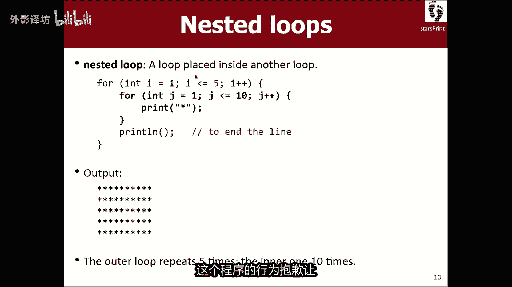

抱歉让我去我的，我想复制这个第2boob数字。

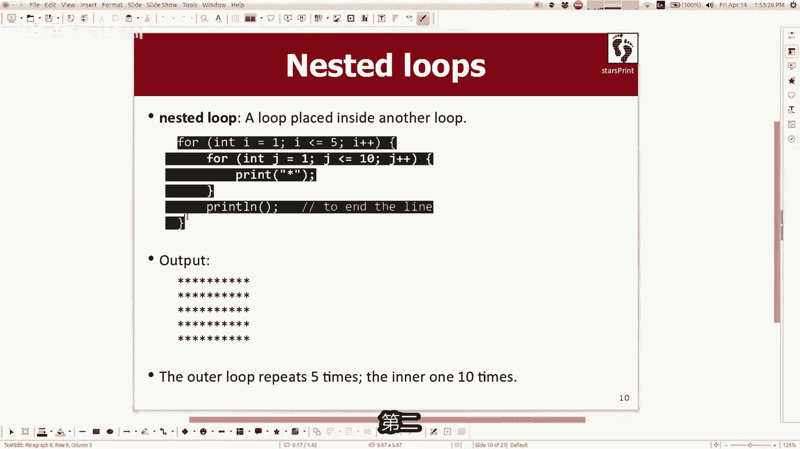

点java粘贴好吧，所以我的意思就是这样的代码，你相信我，我的意思是我可以运行这个，并且如果你愿意的话，现在看起来就是这样了解这是如何运行的，这个内在事物的整个身体就在这里，他完成了所有这五件事。

时代如此的思维方式，当java运行这个的时候，程序并到达这里，他开始反一下子就跳进去了，将I的值设置为一后，它会运行所有这些代码都完成了，所以它运行该内循环的所有十次传递。

它运行这个打印行和之后做完所有这些事情，然后就可以了，回到这里，他也固定在原位，然后他又重复了这一切，只是不断的做所有的内在身体，连续五次才停止好的，所以外循环有点需要。

比每个都需要更长的时间与内运行的操作。

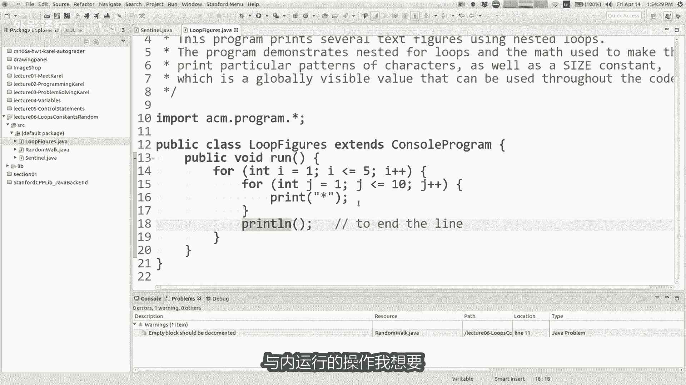

我想要向你展示一些变化代码，并查看行为是否嵌套循环，有点道理，所以这段代码是做什么的嗯，它与我的上一张幻灯片非常相似，强调了唯一的微小差异，蓝色唯一的区别是内部循环J上升到五，而不是最多十个。

你觉得怎么样，行为将在这一段，当你看到那种破损的时候，三角形好吧，你为什么认为，我认为你可能是对的，是的，我认为这是正确的思考方式，他说如果你在线的话，你知道你打印的每一行，从第一行开始。

你打印一颗星星，在线二，你在线打印两颗星，你打印我的星星，如果你是的话，那就对了，第五行我等于五，非常好，这么想的话。

如果我去在这里编程，我将J更改为小于或等于I，它确实打印了三角形星星，就像你说的那样，没错好吧，现在为了好玩。

我可以打印它吗，如果我想要这些其他的东西怎么办，让我们试试，这个地就在这里，我想要打印一座323444555，我该如何打印，而不是星星。

任何想法，是的，而不是星星，打印ISO的值，打印ii4的值，这将打印出来，是的，那太好了嗯，我想要的另一处怎么样，它以较长的线开始并结束形较短，所以从五个开始字符，并以一个字符结尾。

否则我想我想要五个4233的结果，不管怎样明白，所以我想要三角形，就是那个形状哦，天哪我画不了好吗，这是一个直角，因为他们这样做小盒子的东西，我该怎么做，想法是的，哦有趣的事有很多。

你可以通过不同的方式解决这个问题，考虑最小变化，我认为我想要关注的代码修改这循环，我喜欢你的地方，我认为最主要的是，如果我愿意的话，五个循环等待我在做什么，我在就像拖着我的应用程序待在那里走开。

所以如果我想要其中的五个，就像什么决定了我有多少这样的明白，这是这循环，我做了多少次会打印一个数字，就是这样确定将获得多少个数字打印正确，他是有点像我不直视我的，意思是你可以思考的一种方式。

你可以在网上说的很好，想要在第三行打印四颗星，I想在第二行打印三颗星，我想打印两颗星，等我能找到，为了打破两颗星，并在第五行我想打印一颗星星，所以有点像，就像我如何将这些纸连接到。

你知道这些价值观是什么，映射左边数字的方程，现在只是一些简单的基本上代数的东西，如果你认为我认为最简单的方法，Make it go，就是说五减去II认为这是对的，或者或者等等，我说的右五减我加一就是。

对或者也许是4-1或六减，碍于六减去I是多少，无论如何，正确的数学是残酷的，但是你可以想出一些简单的，你知道它们之间的线性映射，两个现在可以了，你有一点不同的建议，大约有十个。

使这项工作和你一起工作的不同方式，我知道有很多方法可以做到这一点，只是想指出，如果你是查看代码的哪一部分，我应该建模吗，这里只要想想哪一部分确定打印多少个数字，这是多少字的监狱，这循环重复了多少次。

您将看到的数字，因此请修改该循环的边界，然后你会得到你想要的零钱，好的，然后还有一些其他输出，在你可以尝试制作的幻灯片上。

为你自己，如果你愿意的话，但是没关系，让我跳过这个怎么样，一我想打印这些数字，但我想要在他们前面的点，所以有点看起来数字已对齐，现在就让我来吧，尝试帮助构建我们的解决方案，第二看起来我们有点。

接下来是数字右点，然后然后是数字，所以这就是其中的部分。

我们正在打印数字，让我让我输入，他回来了，上升我使用twitter通知很棒，这是我朋友的，狗喜欢我的推文确实如此，对我们所有人来说重要的消息，我想嗯我很高兴黛西喜欢你，得到更多狗的照片，比你想象的还好。

这就是我们的出发点输出，我想要在前面有一些点数字正确，所以你在我之前就知道了，打印数字，我要打印点，打印点对，但我并不总是会打印一个点，我要打印四个点或三个点，或两个点或其他任何情况。

你将打印重复出现的内容，一个字符及其数量逐行不同，这可能意味着你需要一个循环来打印这些字符，所以我可能想要一个J打印循环四个点后，跟一个J打印循环四个数字，所以如果令人困惑的是，我从哪里得到这个。

你知道我为什么不把它放在同一个地方循环，这样的原因是，因为点数和数字的数量彼此不相等，所以它们需要分开，所以好吧，但是这是不太正确，因为如果我运行它，每行都有相同数量的方式点，表示他们有整数或其他。

所以这不太正确，我想要多少个点，我想要那个输出第一行。

我想要第四行及以上线，我想要三个，我该怎么办。

表示代码中有多少个点，你认为我想要是吗，无我是，看起来不错，我的意思是，如果你像我一样想一想，总共想要五个字符对，其中I是数字，所以其他五个我必须是这些点对了，这是另一种方法，想想这些是吧。

现在你可能会说天啊。

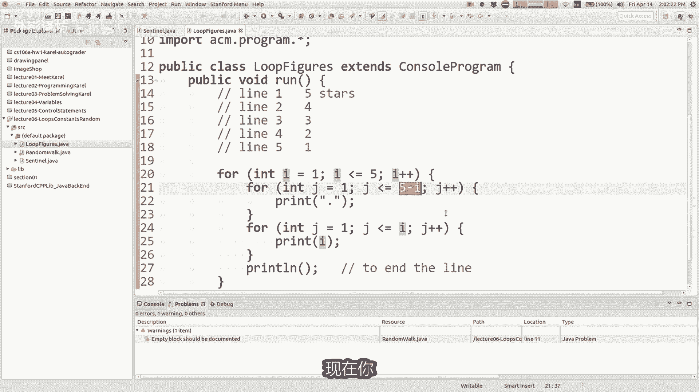

为什么为什么要做这些蠢事循环，为什么我不直接告诉他，print ln点点点点一，前肢向上，为什么我不只是把这一切写成打印腿，又为什么我会知道好吧，这是个好问题，但是答案是，如果你读完所有内容。

你可以制作这些循环代码更通用，如果我想要怎么办，以便我可以打印相同的内容，某种图案，但尺寸不同。

如果我想打印一个尺寸怎么办，八所以例如如果我去这里，并且我我希望能够打印此内容8号，所以也许我会改变这个说A所以现在有八行哇，看起来有点乱，所以哦好吧，也许我需要bug减去我这些米。

知道也许五岁的人需要秋天变成八，所以现在看起来很漂亮，不错不错不错，确实一般，这个版本是像大小变量之类的东西等于八，然后我说我小于或等于尺寸，这就是尺寸hi，所以现在我运行它看起来仍然很好。

但如果我把它改成17，好吧，实际上我不认为它适用于两位数的数字，意为宽度，数字不同，但我可以做四个，它会起作用，我可以做九个，它会工作，所以这实际上很酷，我可以改变一个程序，一个地方他就会像这样工作。

没错，我神智可以做点什么，就像读取int大小，问号盒尺寸六七，无论繁荣如何，这个尺寸非常酷，代码更通用，这就是我喜欢的原因，使用循环，而不是仅仅这样做，用手打印所有这些东西好的，所以嵌套循环。

所以这个想法喜欢看线条的图案，想出了一个小方程，一个字符的重复次数，你会想要打印，你可能会想要使用类似的东西，画出火箭飞船的图画，我想让你扮演的角色作业是的，1月，这是个好问题，结一在这，我这里有结一。

我可以吗，使用相同的字母式的，这样很好，问题如此简短，答案是的好吧，只要两个循环不是可以相互嵌套使用，我想再看这封信，稍后因为他语，接下来我想教你这个讲座被称为范围，但是基本上你可以减少一个名字电量。

只要他们不重叠，彼此都是你计划的一部分，可能会说我会在第二到目前为止，有关嵌套的其他问题，如果遇到一点麻烦，就循环，我鼓励遵循此代码，你下课后和我们一起去，或者一些东西，然后插入一些小字体。

其中的语句只是看起来像，例如如果我这样做怎么办，打印林high intei加上I，然后，我说暂停500ms，然后我再次运行它，它就像5号，所以你可以插入一些小语句。

例如可以帮助您观看程序并跟踪运行它的程序，可能会帮助你发现一些他执行操作的顺序，完全令人困惑，我会鼓励你插入这样的命令就可以了，晚安看看，好吧好吧。

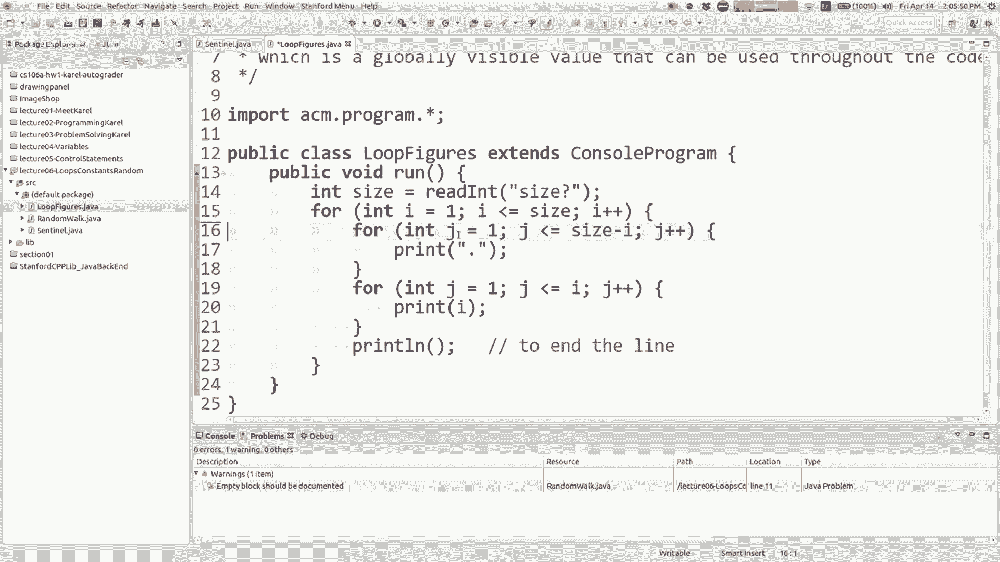

让我们继续前进一点，结合更多的变化，您稍后可以查看的幻灯片，我想要谈论你问我的事情，关于使用相同的变量，这种事情的名字必须做这个想法，称为范围m m tune，如果我让你知道我说过的话又怎样。

关于如何制作这些图案，不同大小的字符好吧，也许在我的运行方法中，我声明了一个可变的新尺寸，我想使用它，我程序其余部分中的该变量，所以我有一个叫做上半部分的方法，绘制该图的上半部分。

我正在用下半部分方法绘制，尝试参考尺寸和其他它不起作用，它关闭了java，不允许，如果你生命一个一个方法，内部的变量只是可用于该方法，但不会通过任何其他方法看到不起作用，你会在其中加下划线红色。

它会说找不到可变大小，在上半部分方法中，好的这个想法，该限制称为范围，范围式程序中包含变量的部分存在，或者可以参考理解java范围的最简单方法，变量作用域被定义为是他声明的花括号。

如果你在A中声明一个变量方法，它一直存在到闭合卷区，支持该方法，有一些此的其他变体，例如如果您在循环内声明一个变量或if语句，它只存在于内部，light的特定的循环或NE个特定的if语句，回到他的问题。

如果我使用他，这在两个不同的循环中，J是仅在有效期内声明这些循环，然后在该循环之后是变量消失了，所以一些有趣的后果是，如果您愿意，请让我转到下一张幻灯片，所以这里如果你有两个循环范围不重叠，且为嵌套。

彼此之间可以使用相同的两者的变量名字母，那些循环没关系，有趣的是，在循环之后，目前还没有已知的int i，所以如果你想声明一些其他的变量，int i之后就可以了，你想要你看不懂闪电泡芙啊。

相同变量的副本，相同的名称彼此重叠，所以如果你在这里声明了一个in time for循环标题，你不能有另一个in time循环内那些冲突在这里，如果你声明整个在循环内部，您尝试分配他是循环后的值。

他不是循环后声明更长，所以你现在不能这样做，你知道你是否愿意稍微了解一下哲学，可能会说他们为什么这样做，似乎他只是犯了更多错误，我的代码和东西为什么不直接让我宣布变亮，然后它们永远存在。

你知道他们生活在整个世界，我猜这个程序看起来很烦人，我会给你的答案是一些孤立的代码片段，不能互相打扰，就是好的，因为它允许不同的东西，程序员负责不同的部分项目及其代码，不会中断彼此的代码，更容易调试。

写的越大越好，程序让您了解隐私和这类事情的限制，是实际上适合大规模编程，这是一个很好的功能，java但我们必须注意它，我们编写代码，好吧好吧，如果。

所以让我们来谈谈我读过的这个这叹息，这是一个数字，那么如果我想为之做一个方法呢，我们已经做到了，我们还没有做那么多本周的方法，但方法仍然是超级重要，如果我有一个怎么办，方法称为图一，这就是方法。

就是我们的for循环代码这么写，我们只是讨论了尺寸如何，你不知道可以分享吗，类似的不同方法，如果我只需将其设置为八即可，大小八即可好吧，如果还有一个图二怎么办，所以我只是想有一个程序，可能有多种方法。

两个没有点，也许只是那里有一群明星，所以就是这样有点相似，但他是一个有点不同好吧，现在这两个人方法无法使用size hit，如果我能用它就好了，在整个计划中，虽然像如果我拿了这个，我猜是为了这个怎么办。

汉堡上班，我不得不说图一并在这种事情中，图二好吧，如果我确实想要这个怎么办，程序可以缩放到不同的大小，以便你可能会在这里做尺寸和尺寸好吧，现在可以了，我想如果我跑的话，他确实吸引了两个假货。

但是那不太好，因为如果我想改变尺寸，我仍然必须去这两个地方，并改变它，让我不太喜欢，我希望它是一个解决方案，所以提出了一个问题，我可以吗，一个贯穿整个过程的变量，整个计划不仅限于一种方法，是的你可以。

所以这实际上是合法的，将不存在的变量放在这里，在方法内部好吧，现在一件事有趣的是，这个新材给了我读取错误，你认为这是为什么，为什么她已经被宣布了，是的，我的意思是，如果是最精确的计算机科学。

远说他会是在该计划的范围内，已经存在一个尺寸变量up，这里有一个尺寸，如果我说此处的大小彼此重叠，它们的范围一直存在冲突，所以也不想让我这么做，这里已经有一个了，这里还没有，就像那样，所以我摆脱了它。

所以现在我这里有一个尺寸相等的八，我可以把它全部改成六程序运行，并且它仍然可以调整大小，太好了，但我没有告诉你，我刚刚教过你，我忘了什么是哈利，波特的比喻是我教你一个蛇老枪或类似的东西。

你不应该使用这个，考虑到我看到你的时候，我会打电话给你一秒钟，他被认为是坏的，在这里声明变量的样式，例如这是因为他违背了我的想法，一分钟前说过，他涉及到这个想法，小段代码独立会互相破坏。

关心的是如果有人喜欢怎么办，这里无意中说大小等于七或四或类似的东西，如果他们改变，他现在会弄乱图二，所以如果我运行图一，它看起来是正确的大小，但图二搞乱了，所以关于这些小事的整个原理。

独立的代码片段是一种在这里迷路了，所以这里的东西，我写的是我们有时所说的全局变量，它被认为是坏的风格，所以我不想让你声明，任何像这样的数学之外的变量，我不想让你这么做课程，但我还是想要一对。

每个人都可以看到，所以存在差异，这没关系，而且是某事，在我告诉之前，我们会打电话说抱歉，我完全可以把他压在你身上，问题是你的是什么，是一个标签，像用read int或类似的事情嗯，这是可能的。

按照我们的方式做类似的事情，了解如何执行某些参数，星期一我会告诉你一切，教你一些好方法来做到这一点事的好吧，这是不好的风格。

但是有与以下略有不同，这个没关系，叫做扣子常量，扣环常量是变量，但你声明他多一点语法，然后区别在于它可以只能被赋予一次值，并且不能设置后即可更改，并且这是一个重要区别的。

原因是因为现在我不用担心这段代码会改变它，这会破坏那段代码，这实际上是一个非常重要的的区别和区别，声明常量的语法是你有三个额外的java及声明，前面的关键字说private static final。

那些是什么，我认为最有意义的词，所有这些话中最重要的是最后一句话，这意味着这是我最后一次，永远会为这件事设定价值，我永远不会改变它的值更新。

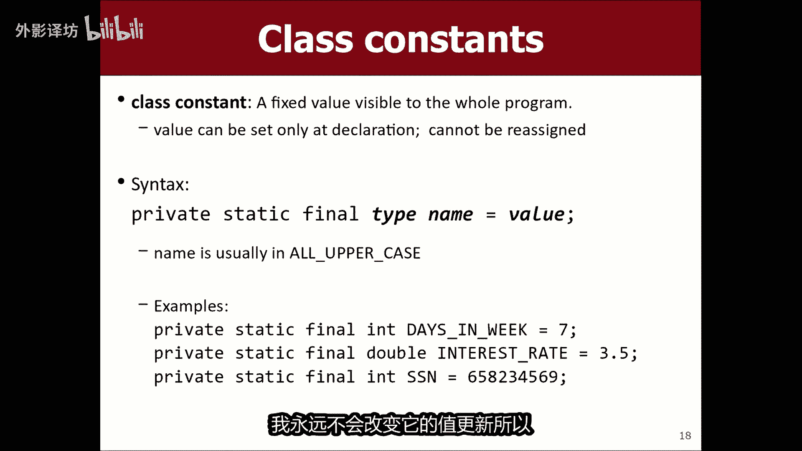

所以看看我是否回到这里，我说私人静态最终的大小是没有的，更长的坏风格是一个类常量，没关系，之所以没问题，是因为如果你尝试在之后设置它的值声明，他不允许编译器，现在会给出一个错误，所以得到摆脱它。

现在我有一个尺寸，代码中的每个人都可以使用的变量，看看他工作正常，重要的是这里的事情，你知道你不必做，但惯例是命名常量名称改为大写，小写的原因是因为当你看看你的颜色，它使您更容易找到并查看它们，它们。

而且它们更加突出，所以我可以将其重命名为大写的大小等等，这被认为是他们更好的命名系统，因为当你看到这段代码，很明显，这是某人的一些常数，在那里宣布没问题，所以我要你在作业部分写过吗，我只有你写一个常量。

调整一些代码的大小，要打印出来是一样的，这里的语法是的，那么A之间有什么区别，类常量和实例变量，我想我想赌一下这个问题，直到下周我必须教你，在我认为B之前，还有几个概念说的很清楚。

这与所谓面向对象的东西，我将教你的编程，很快好的，我们酷吗，这很有意义吗。

恒定的旧程序可以看到他不能改变你的价值，好吧，所以我要教你的最后一件事是还剩几分钟，我想教你如何获得随机数，程序并不难，但我想向你展示如何去做，并且你想要你在你的家庭作业中做这件事，已获得随机数。

随机数很有趣，因为它是程序不可预测，你可以问电脑，对于随机数你必须写，你有这么长的代码，说随机生成器点获取实例，点下一个int，然后用括号括起来读取最小和最大的数，你正在寻找的边界。

因此如果你想要一个随机数，1~10，你说一逗号十随便，所以你告诉他，你的范围对它感兴趣，会选择一个随机数，从这个范围你可以存储它数字到变量中，所以再次语法看起来有点奇怪，但那就是你只需要写下这个。

他只会做你想做的事，所以这是一个0~9之间的随机数示例，这是3~6之间的随机数，然后我用它作为边界循环中，我会打印hello，那么多时间或任何，你可以用它作为你的代码中的int，这是什么，很好很好。

这里有点简单，程序称为掷两个骰子，所以我们会询问用户，他们想要什么投资，加起来我们要制投资很多次，直到我们得到那个，所以他们说我想要九的总和将重复至两个骰子，直到两个骰子数字之和不等于好吧，让我们写吧。

我会努力的，我喜欢帮助你们。

所以说想要九个好的，所以我会哦哎呀我还没有准备好文件。

这欧拉新文件掷两个骰子。

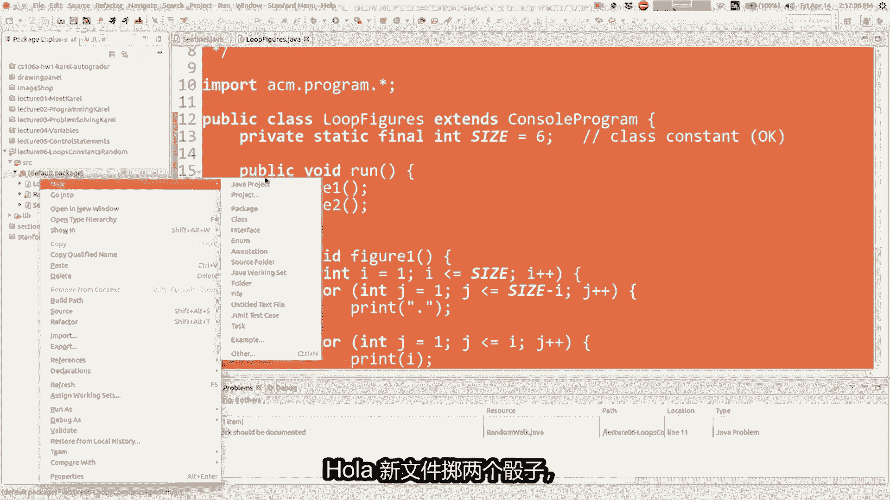

我会说，掷两个骰子好吧，所以技术如何。

应该说需要九个。

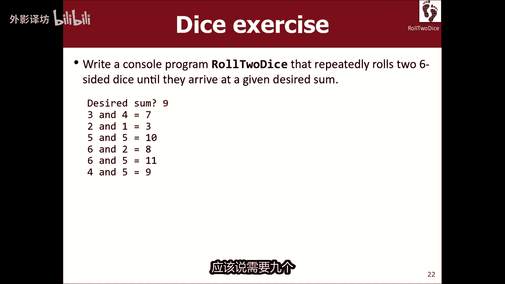

所以好吧，int期望的总和等于read int希望现在在那里工作，有一些问题，你不知道我应该做什么。

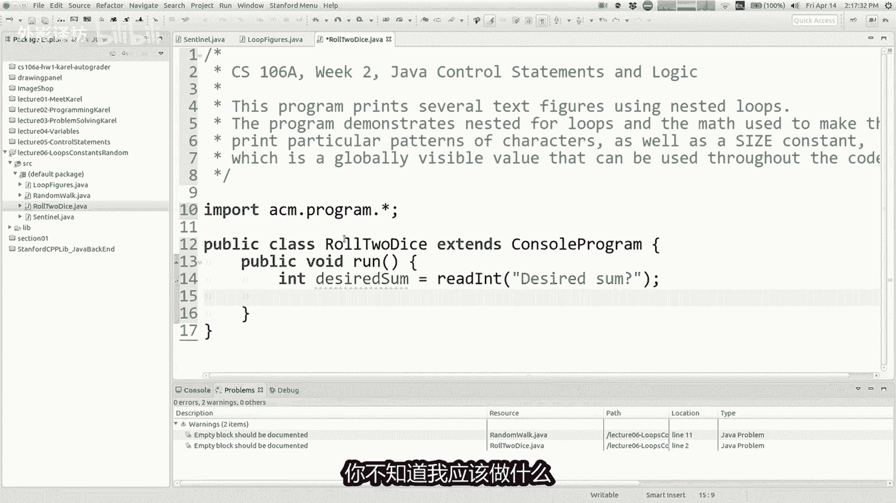

应该两头，并且显示值，并显示他们的内容加起来，你就知道我喜欢做什么，如果我必须做某事，那就对了，反复的，为什么我不开始做呢，只显示一次，我该如何显示其中一行代码就在这里，是的，好的当然。

随机的无论是什么，嘿我没问题，两个从1~6的随机数正确好。

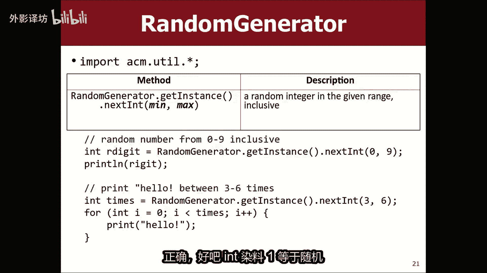

8int产量一等于随机生成器点，获取其旁边的实力点，从1~6，然后我必须导入a cm dot。

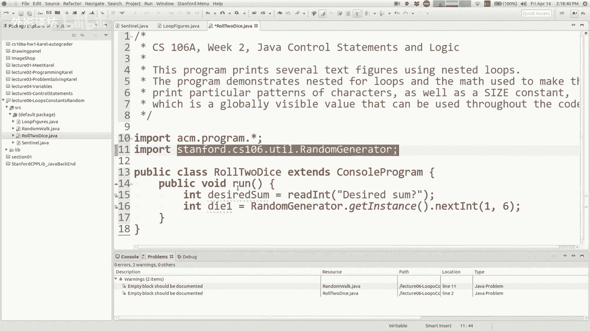

Usual dot start，他说我必须在幻灯片上执行此操作。

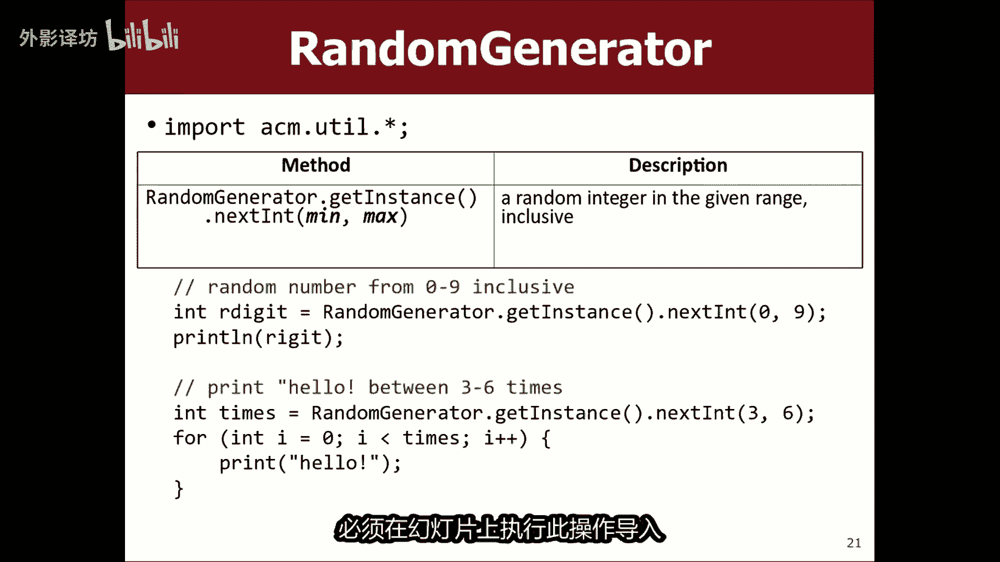

导入正在制作它，以便我可以使用该库，在我的程序中，这是第一个死亡，然后这是我复制的第二个骰子，然后像这样粘贴就可以了，现在我想打印这个和这个，这样我就可以打印林带一，带二等于加，然后有。

就像它们的值的总和一样，也许我会写一些这样总和就等于死，一加上也死好吧，我掷骰子打印总和，我应该重复这样做对吧。

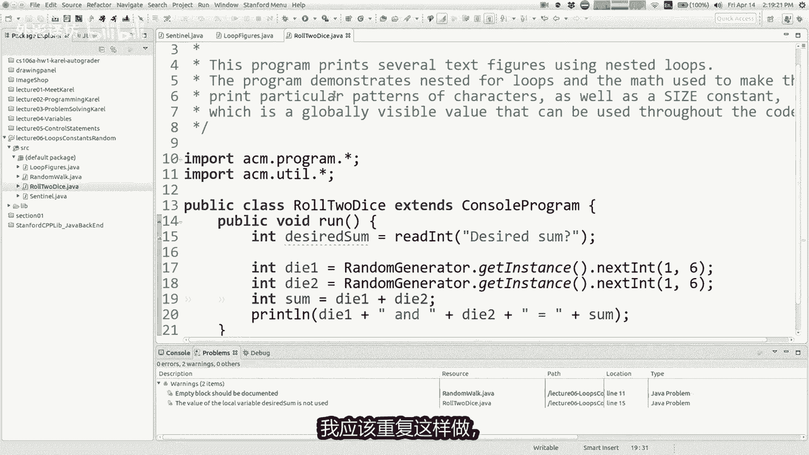

所以我需要一个循环，我们快完成了。

一会就完成做这个，那么我要继续这样做多久，是的，虽然总和不等于想要一些看起来不错的东西，只是他不知道总和是多少，也许我应该把一些搬到这里，就像你尝试一下一样，想要好的给我十秒左右，这里需要。

所以九好吧来吧，好的，所以他会掷骰子，直到我得到九，我没时间了，但是你的作业两个发布在您可能的网站上，两人一组完成这项作业，如果你有一个来自你部门的朋友走吧，前进并组队，你会拥有一个很棒的周末。

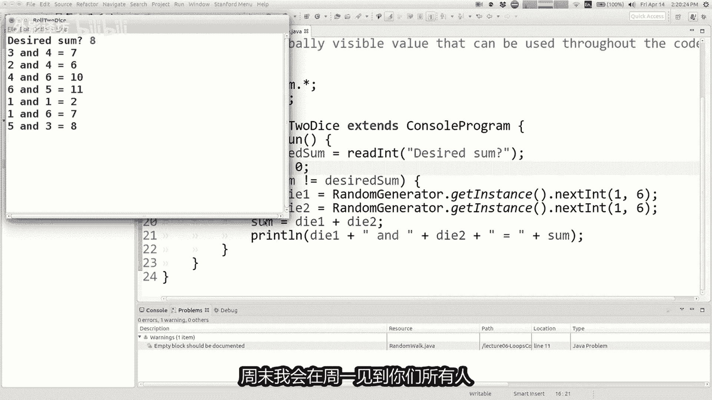