# 【中文配音】斯坦福王牌课程 CS 106a Java教程 2017年春季课程 - P8：08_ Return, Boolean - 外影译坊 - BV14U4geNEEq

好吧，让我们开始吧，我要做什么，今天想教你的是它来自于一种叫做回报的东西，本书的大部分内容是第五章，我只想快速提几个昨天晚上之前的事情，我们的烹饪领袖之一，他带领我们是的，他讲话的时间。

关于家庭作业一点点和，你知道我们只能只有其中之一，那些会议，我知道，不是每个人都可以参加那个特定的活动时间，所以会议结束后，享受部门领导总是会向我们发送他们的幻灯片，我们会将它们张贴在课堂上网站。

所以如果你没有访问该网站绘画，但你想查看它作业页面下的内容，你可以点击我们的幻灯片，如果您参加了作业二旁边的链接，看看他谈论了什么，如果你对他们有疑问，您可以发送电子邮件，他的联系方式。

在我们的198员工那里页面，所以示的家庭作业二现已发布，你们中的很多人都希望开始着手解决这个问题，下周一到期，现在是我们上次谈话的时候，关于参数，所以我想问你很快有什么意义参数。

例如我们得到什么无法使用参数，是的，您可以设置SEI方法或运行程序的主题部分，多个不同的输入式的，那就是太好了，你可以做的更灵活，主要执行一组任务的方法，但你可以稍微修改一下行为。

通过向该方法把总一个值，是的，这是一个很好的思考方式，使我们的代码更加模块化灵活，所以我要教的东西。

你今天的主题是称为return，有点像，与此相反，从方法中说出价值观，我也是会谈论一些叫做布尔逻辑，所以这个的要点讲座就是这个返回值的概念和，就像你刚才说的那样的参数参数。

允许您发送信息进入一个即将运行sad的方法，在一个会令人困惑的输入值中，return有点相反，该方法本身想要发送一个值，回到它被调用的地方，也许是乱方法或者其他什么，就像这样，它非常强大。

工具学习很重要，对于学生来说有些困难，以同样的方式理解参数很难理解，我们也要多加练习，今天的参数意为你的参数，当我们继续讲座时，很难我会教你这个布尔数据类型，它与逻辑语句一起使用，是真是假。

所以我来谈谈这个，稍后好吧，让我继续前进，我们写了这个程序来计算上次投资，我只是想再简单提一下，因为我想今天重温该计划，我想为该程序创建一个号码服务器，如果有一点点不同，你看最底部程序在询问人们之后。

关于他们的投资及其将会发生的事情，告诉你利润的差异，两项投资之间的差值是我只想做出改变，让一切变得美好，简单正确的区别就是你知道减去数字，如果听起来不错的话，简单吧，让我们看一下代码。

让我们想一想我怎样才能让程序做新的事情，如果我回到那个行为代码。

你可能不完全记了，从上次开始，但是我们做了什么，我们写了名为投资者和投资者的方法，方法处理我们询问的一个人，他们的信息投资，我们计算一些东西打印质量有多好，投资是免费品质。

看看你就知道十个50%的这种东西。

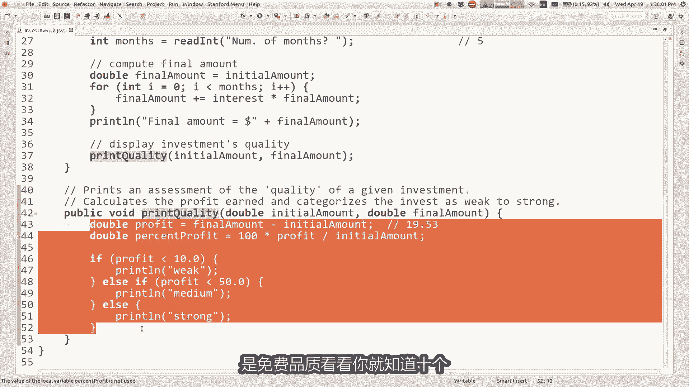

我们从暗中调用它两字，因为我们想要可以向投资者处理，所以我想要在程序底部打印。

利润差异是无论如何，你看看我们写的代码在哪里。

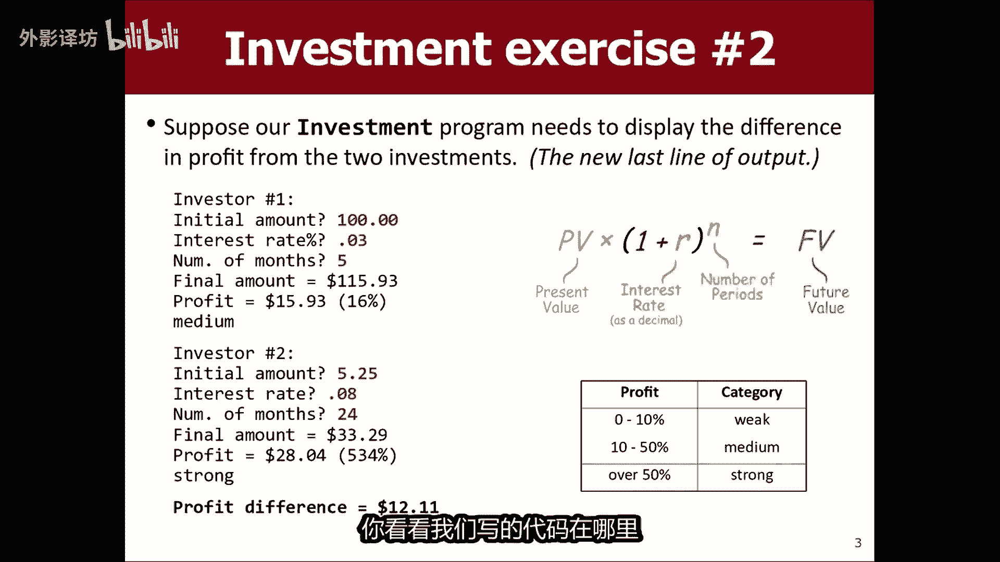

该代码是否会产生利润差异，嗯这是我想要的情况，你呆呆的看着我还没有回答了我一次的问题，因为我试图指出这很难，这个小小的改变实际上是实施起来很棘手，我想只是如果你逻辑的思考一下，第二报表利润差异。

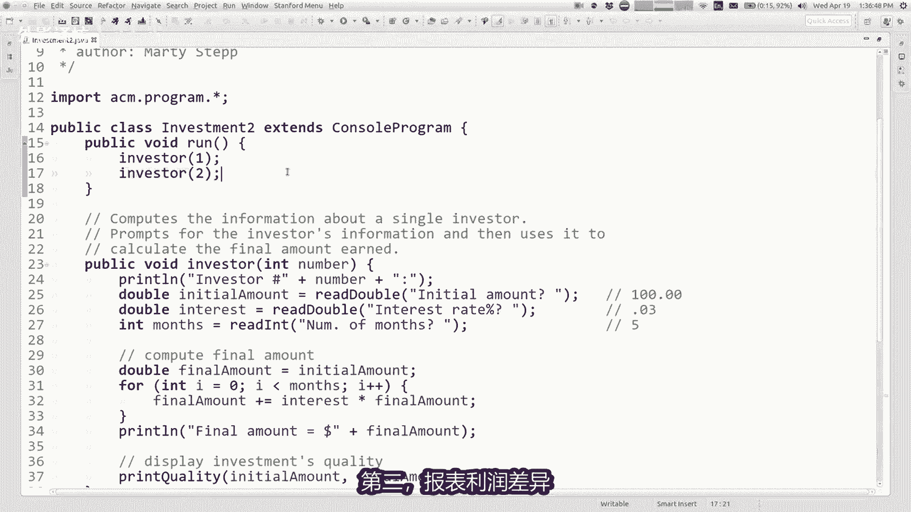

这是最后一块酒精，所以他是程序会做的最后一件事。

它可能会落到这里的某个地方，期末利润差额类似的事情按顺序排列好打印，我必须先知道的人的利润，我必须知道第二个人的利润在哪里，那些储存在某些地方的好地方，通过这些方法，我获得了这些利润。

并且利润百分比之类的东西，缅因州没有，你知道的，他们不是被逼跑的，没有那个如果我想说富兰克林从中获利，红色下划线是因为该变量超出了范围，这里没有定义，所以这是一个有趣的问题，我们当我们分解我们的程序时。

遇到这里有一些变量，我希望我能在这里，所以这次回来我想教你的是。

今天应该可以帮助我们解决这个问题，问题好吧，我会再回来讨论这个问题，几分钟后编写代码，我想谈谈关于这个回归想法，并激励，我想告诉你，有一个你可以使用的数学命令集，在java中有一个叫做max的类数学。

有很多有用的方法，你可以用它来计算一堆，像你一样不同的数学公式，知道三角函数的幂和对数，舍入平方根弧度，以及你知道的这些穴位事物，和所有这些方法各不相同参数，比如你传入一个角度和它会给你。

你可以要求的该角度的余弦或类似的值，你传递一个基础和一个力量，并且它将把基地提升到我们所拥有的力量，上一课思考指数，这是一种用A计算指数的方法，方法调用，所以这是一个有用的库命令，运行这些命令的权利。

你写了单词max大写M并且然后是一个点，然后是名称，你想要执行的操作，然后将参数放在括号中操作没问题，所以已经且他是一个附带的库，java我们可以很酷的使用它，所以如果你想尝试使用这些方法的。

你可能会对发生的事情感到惊讶。

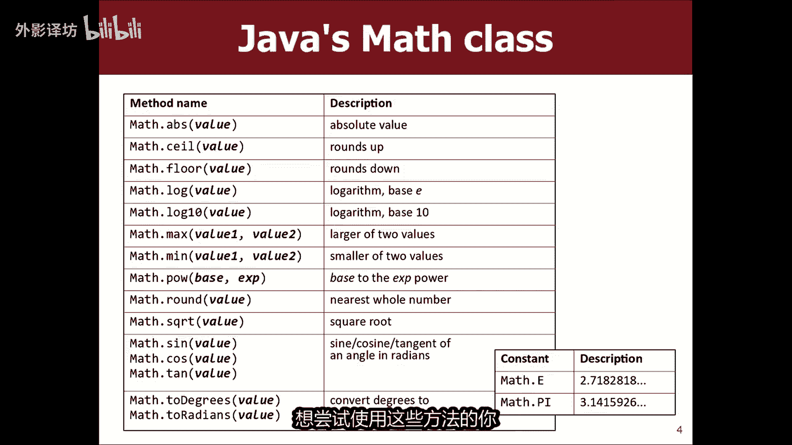

所以如果我去我的程序，我会打开建立一个不同的程序文件，只是为了一分钟，这样我就有了一个不同的地方，往我会调用这个返回势力，只是一个空文件，如果我到这里，我说你知道十个数学点，POW逗号三应该是十的。

第三个应该是1000吧，如果我运行该程序，它成为return is存在错误，哎呀那是因为我有这里的这个东西，不编译我会回来的内容，您的投资要围绕程序上没有出现任何内容，spring他没有做任何事情。

没有输出，所以令人困惑，为什么会这样，让我尝试解释一下运行方法没有输出。

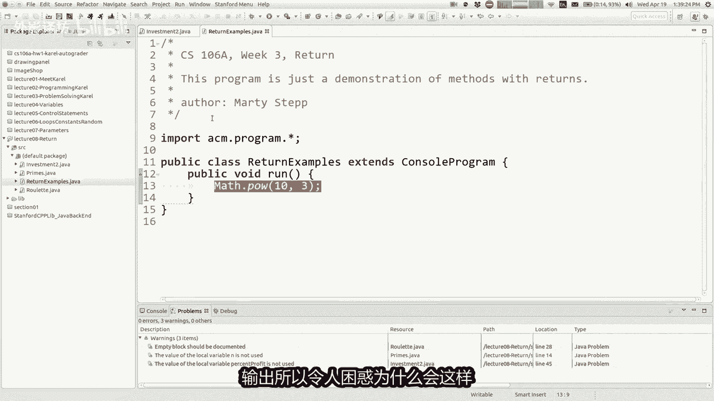

原因是因为这些数学点POW命令，他们没有将结果打印到控制台操作，而不是他们做某事，称为返回结果操作是什么意思，就是这些方法旨在用于表达式，记住表达式或像1+1样的数学计算，两倍乘以三。

这些方法可以用在中间表达式等，例如如果你我想让你知道计算一个恶例。

你知道的数字就像6。022104到23号，右边我知道是，阿福加德罗的号码来吧，让我拥有一些有趣的，如果你想计算的话，或者只是在您的代码中表达这一点，是的，有一些方法可以写科学。

但你可能会说类似于数学点觅食道23号，你知道，但你可以在这里做什么，你可以写6。0224，MAD点com是23，你甚至可以这样做，你知道加一或其他什么，然后这个这很奇怪吗，我正在打电话。

方法在计算A的过程中表达式的结果，这是一种特殊的方法，它不仅仅是独立存在，它被用作计算计算的一部分，这样你就可以做像双重答案之类的东西，等于现在他计算10~23号，他们知道炖菜需要六一百0224。

结果是21~2，再次强调这个方法的概念，您称其用于计算或者一个表达式成为返回，我想你可以的方式想想，当java达到这个目的时，当它关闭并运行该代码时，无论该代码对该方法做什么，然后该代码计算答案。

你知道6~23是什么，它计算出并且无论什么结果就是他计算出来的，回到这里有点交叉这个输出，并将答案写入在这里代替那个，所以就好像java跑到一边计算答案，然后去写下来，进入那个地方的代码，6。

02回溯加一好吧，所以这只是一个语法与我们略有不同，以前没完全见过，我想这对学生来说有点奇怪，首先要理解这一点，因为这看起来不像其他方法调用，我们已经看到了，但这就是这些数学方法，当然可以提高一个问题。

为什么这样做，为什么不这样做，他们只是让他打印出1000，当我写数学密室逗号三，为什么你认为他们会这样做吗，这里的生意你觉得怎么样，设计师从事的工作是我必须选择的，这样做是有原因的，我的意思是。

如果你只是打印出来1000张，你要做什么，认为他，这很有趣，所以你说的是几乎就像excel能够有公式，而不仅仅是原始值，是的，我认为excel的一个好处，公式是你可以建立它们彼此顶部。

右边你可以计算这个单元格中的一些东西，然后你可以将该值用作公式的一部分，在另一个牢房里，所以我想正在发生类似的事情，如果这个方法只是打印他的回答，那就太好了，但如果他返回我可以使用的答案。

我可以回答任何我想要的事情，将其用作后续计算的一部分，如果我想要，或者如果我真的只想打印，我可以说双重结果等于，然后我可以说print l解决了，如果我愿意的话，我可以打印它，打印出来。

我只需要把它写出来长一点，所以没有什么可以阻止我打印它，但现在我也可以将它用作对某事的数学计算，否则这就是这里的想法，语法有点奇怪，但就是这样，这就是现在发生的事情好吧，现在在哪里，这真的很有趣。

你可以编写自己的返回方法，价值观我会教你怎么做。

因为我认为这是一个非常有用的拥有的技能，我的意思是肯定是能够调用现有的很有用，返回值的方法，随意好吧，将其存储在结果变量中好吧，我会像我说的那样继续前进，返回是指方法发送值时自身方法计算值。

并将其发送到代码中，方法被调用，并称为表达式，和所有这些数学方法所做的底部的问题，幻灯片我已经问过我们了，已经谈过这一点了，如果你想编写自己的方法，返回一些东西，这是怎么做的，当你宣布你的标题时。

该方法而不是编写public u1词后面的单词void，写入一个数据类型，如int或double1级，你所说的是我的方法将返回该类型的值，所以幻灯片上的例子是一个简单的方法，如果你给我两个线上的点。

我将计算直线的斜率只是Y的变化，X的变化是A的斜率，线路不适用于有垂直线，但除此之外，delta y delta x可以除以返回，这就是结果方法，所以如果我通过这四英寸，它会返回，你知道4。59点到。

我想像你一样是90，X是两个，所以它会返回九个4。5作为答案，这样，方法如果我只是窃取该方法。

我自己想一想，然后把它放进我的程序，所以让我们抓住我所在的斜坡。

我把这个放在这里，公共双打，现在在我的代码中向上倾斜，我可以做类似double s等于斜率的事情，您知道的行的一个逗号，两个最多，八逗号四，现在我已经计算出来了该斜率，并存储了结果该变量S的斜率。

所以如果你想要，如果你想喜欢某种痕迹，电脑到底在做什么，当计算机到达这一行时，每当你有等号时就编码，并且java总是这样的复制语句，首先将代码右侧计算这是什么值，然后一旦他知道那个值是什么。

他就会去并将其放入变量中，左第二个是这样的顺序在这里进行计算，所以java可以做到这一点，上面写着你想打电话给斜率方法，你想通过这些四个参数好吧，我们学到了关于上次的参数，所以意味着X1为一，Y1为二。

X2为八，并且Y2为四，所以让我计算结果DYY等于4-2，所以DX是二等于8-1，我要改变它，我要把它变成七，因为我喜欢数字越圆越好，所以这是七，一是六，所以现在我有二比六是的，所以它就像0。33。

所以D3。3用鼠标很难写的，是此处计算的结果返回到这里，并且你可以这样想，这段代码计算完成后，基本上清除了整个事情，只写0。33就在这里，这有意义吗，就像我写了double s一样，等于0。33。

现在我的其余部分程序，如果我准备这个或使用S它将是G2的东西，第3。3，所以这就是发生的事情，在这里嗯，这有意义吗，我的意思是你对这段代码的疑问，我认为这对学生来说很棘手，首先掌握它的窍门，好问题。

你只能参考一件事，没有从A返回多个值的方法，方法有点有趣，因为您可以传递任意数量的参数，希望你通过零或一或十或无论如何，但你只能什么也不返回，这是空虚的，这就是我们曾经的样子，到目前为止使用。

或者你可以返回一个值，就像我们稍后在这里那样，在课程中我会教你一些技巧，如果你真的想返回两件事，有一些聚会的方式，多个只组合成一个收集物品并归还事情的问题，但仍然如此，集合是一种单一的东西。

所以无论如何，现在就是这样，我想最简单的回答方法是，你可以方法只返回一件事，还有一些其他的编程没有那个的语言限制，但大多数语言都有那个限制，所以是的，可以感觉到有时限制，A学生会写一个方法。

他们会说我真的很想归还这四个不同的事情，我通常会告诉学生好，这意味着你应该将其分解为四个不同的，每个方法都应该返回一个你想要做的四件事中，返回给我怎么样，这是正在做什么的行为，浏览这个程序。

跳过放在哪里的东西，这一切都有意义吗，对那个超级有疑问，好吧，让我给你看另外几个幻灯片。

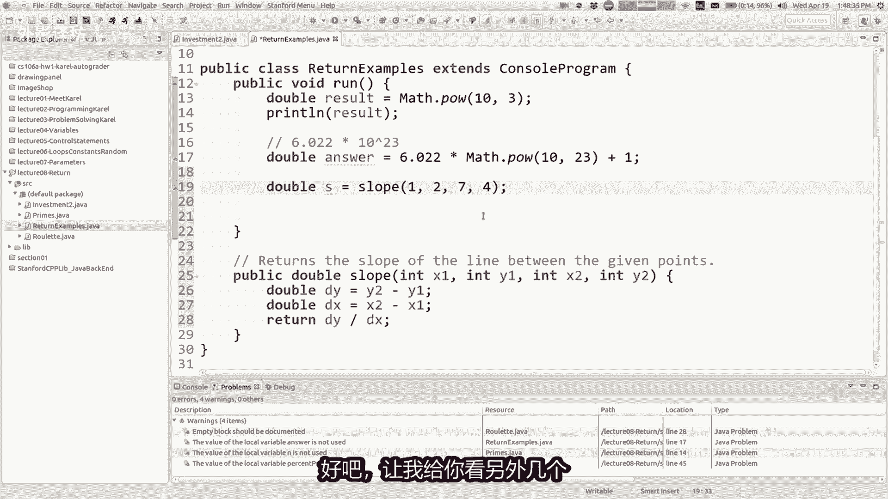

然后我想返回那个投资计划，然后我们就会看到，如果我们知道什么回报很好。

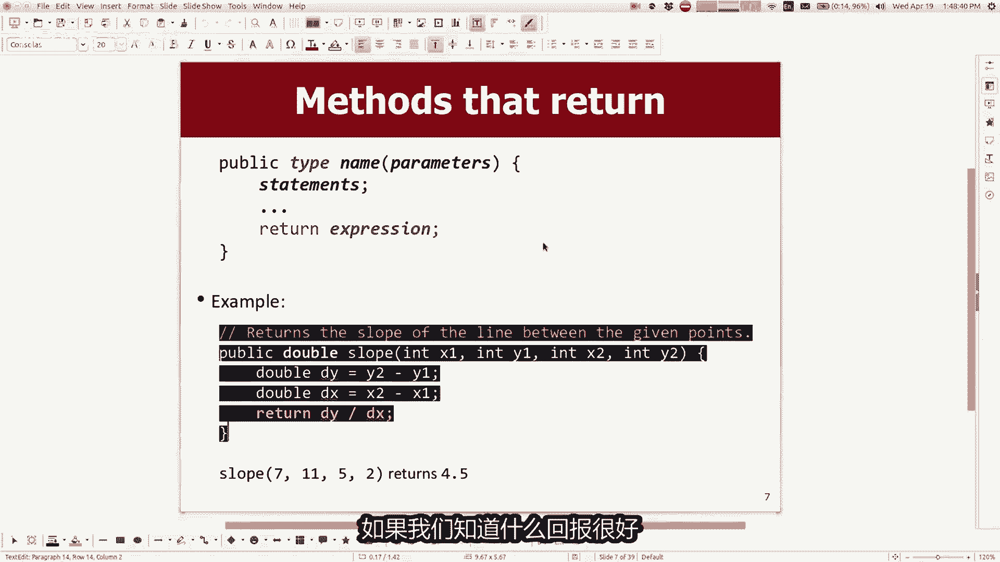

或者不是一个很常见的错误，学生有一个误解，认为很多学生们认为回国有关系，变量名和变量范围，看看这里幻灯片上的例子，他们调用它们调用的run方法，它们通过的斜坡并不重要，他们通过什么坐标，谁在乎。

然后他跳到这里计算所有这些事情，计算结果并返回结果，有些学生错误的认为，该变量名现在存在于乱方法，所以如果我们尝试打印结果，那会起作用或者其他什么，这不是return所做的，并不能让我比以前拥有什么。

return的作用是将一个值发送到代码中的不同位置，不是名称的价值，就像这样的结果，代码是3/6，我认为是1/2或发送点五值的0。5，回到这行代码，然后如果你想将第五点存储在这里。

有一个变量利用它来做某事，你可以，但如果你不存储它或，那就不要用这个值做任何事情，如果丢失以及值的名称，该值恰好具有的名称，下面在这里没有意义，所以了解我所见过的这一点很重要，学生们这样做了100万次。

他们认为变量的返回，现在变量无处不在，事实并非如此，所以如果你愿意的话，像这样的代码才能工作，你需要编写更像这样的异形，您可以在其中调用方法，它计算一些值和将直发送回您捕获的值，并将其存储为变量。

这时当我尝试将其予你这个年纪的人，就像你是与口袋妖怪战斗，你不扔拿出一个精灵球，那么你就不能口袋妖怪，并使用它或我的任何东西，妻子告诉我，神奇宝贝就是这样运作的，所以这个双S就像精灵球。

如果你不扔掉那个double s，我在最终幻想七之后就退出了，所以我不会真的知道，但无论如何，这很重要，将这些方法的结果存储在变量，就是这样的，我在这里所说的要点是好的，问题是的，这个命令的目的是什么。

这里的语法就像你的方法说，他返回一个双精度数，这意味着您承诺发送double类型的值返回，所以在你的方法的最后，你必须指定你要发回的值，你指定的方式是说返回一些东西，一些价值，一些变量或某些计算的名称。

你基本上是说忌讳，当你写入返回结果时，该值你说的是无论什么价值，结果是将该值发回，所以如果我事实上没有这样的说法。

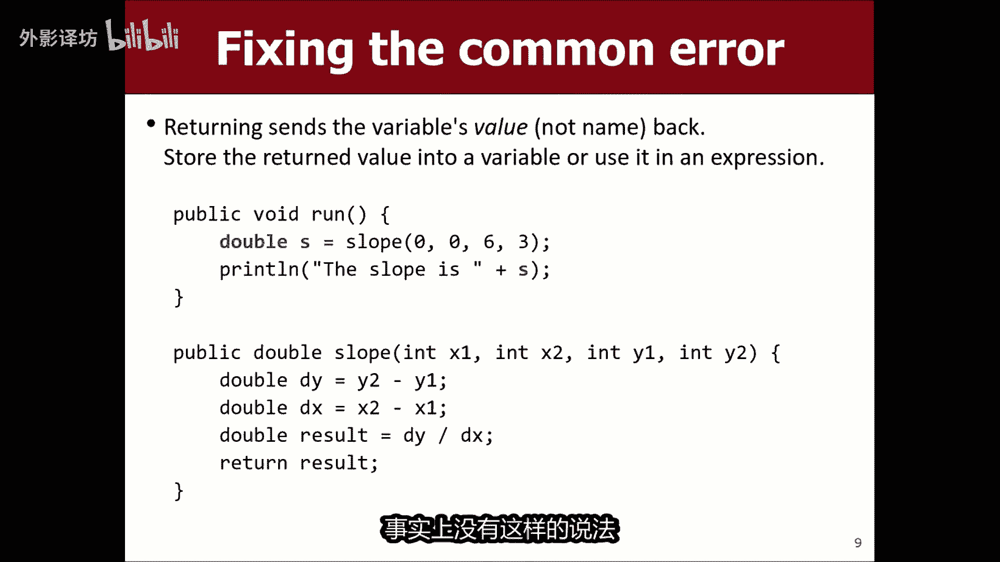

如果我在这里查看我的代码，并说双倍结果等于那个我不写任何，它会强调某种返回命令，整个方法你会这样说，方法必须返回类型的结果，Double，我可以返回任何我想要的double，我可以返回零。

他会让我这样有点傻，因为现在我不是返回我的直线的斜率，说我会回来，但你知道我如果我愿意的话，可以我必须回来，否则该方法将不知道某些事情拍什么，来恢复乐趣好吗，抱歉，轻松退货有什么好处，而不是一个好问题。

所以我很高兴，而不是说空婆，你这么问是因为我这么一部分，我本次讲座的目标是想尝试让你相信，这是一个使用重要功能的好功能，需要了解的功能，如果我只是说虚空颇好，所以我当然我如果是的话，就不能再这样做了。

无效，但我可以做像你一样的事情，知道print allan，结果现在我有一个斜率方法，将打印出什么，斜率是给定的线，也许这是与我以前的方式同样有用，一分钟前我不再被允许做，我不能说SS等于坡度。

我可以只写斜率，这是没有的，Return，我可以直接调用它，它会打印出斜率，这样你就知道了，看起来可能有六个半大，另一方面看看，也许有人像我一样帮助我，也不喜欢这个版本，还有什么这个版本的用处。

不如返回的是一个，我不能使用坡度作为，现在计算一下，如果我有三个怎么办，不同的线路，我想看看哪条线路，其中一个坡度是我做不到的最高的，无论如何，我都使用此代码比较坡度，不能将其用作更大的一部分。

我正在尝试做的事情的图片计算一下，就像我把它放回去一样，第二个我用双I做一个S等于斜率，也许这就是斜率S1，我有S2，我有S3个，我用不同的方式计算已知道的坐标，不管怎样，我算出三不同的。

我想看看哪一个现在有最大的样子，我可以做，如果和其他的我可以比较，他们和我那些斜坡是我可以做的吗，我现在就想和他们一起做，与印刷版相反，我只是打印出来，我在屏幕，这就是我无能为力的任何其他有坡度的东西。

所以我认为这就是我的尝试回答你的问题，是它的计算不会将你锁定在你所使用的东西，只有一种用法计算，它可以让你做任何你想做的事，想要计算出的值，我认为这是一个更强大的想法，好吧，这是一个很好的问题。

其他问题，哦好问题，如果我返回结果怎么办，我也返回零点或者类似的东西，当JAVASSESSOR返回语句时，这是你能发出的最后一个命令，基本上如果你尝试给出一个方法之后，执行任何代码都不会。

甚至达到其他代码等，java认为退出是违法的，return语句之后的代码是一件事，我还没有谈到，有时你会有像if和else和，有时在这里你会返回一些东西，所以这会有点奇怪。

如果你有一个if返回这个一个else返回该值，但基本上你的代码最终必须返回某物，一旦你归还某物，这就像你的代码的最后一件事，可以做到他确实可以在if内工作，但是if你有一个，如果你还必须有一个。

否则会给你一些回报，基本上没有任何路径可以通过，不会返回任何内容的代码，你必须总是归还一些我会的东西，稍后再谈这个，但是这是我们想出的一件事，好吧嗯，不管你们是否意识到在中使用了一点返回值，你的程序。

所以你还没有写，诸如有返回值的斜率之类的方法，至少你可能还没有，但是你用过别人的方法，例如当你写的时候返回东西，int n等于read read int年龄问题，标记或任何这个方法。

教授我们部门的埃里克罗伯茨写道，我们图书馆前面的这个方法，你正在使用该方法的标题，看起来像公共整数读取int字符串，消息或者其他东西，像这样，哎呀我不知道那在做什么，但是该方法的返回类型为into。

曾经写过这个方法，并且你正在使用，您要求用户输入int，并且它正在返回给你程序，并且您将其存储在变量，所以无论你是否知道通过该短语II，您正在使用returns，你还能想到其他地方吗，到目前为止。

您在课程中已经使用过return，就像今天的材料一样，好吧，我会告诉你一个你去过的地方，如果您制作随机数，则使用它们，你说像INTER等于随机生成器获取实例。

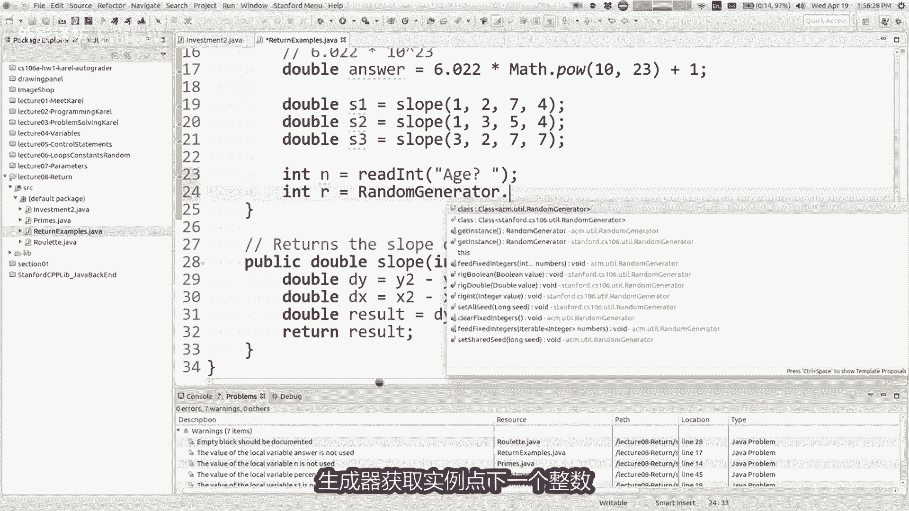

点下一个整数，以打字时的方式向您建议，接下来会说的事情，已有参数int low和int高，然后他说int这意味着它返回一个int。

就像下一个int一样，1~10，该方法所有这些都有一个返回int类型，因此你要存储，无论如何，你已经用过在你的程序中返回值，但是你只是不知道这个名字，好吧是的，我们就这样吧，我们走吧。

看看对计划I的投资，想知道哪个投资者赚的更多利润，所以我的意思是看剧透，我想，使用return来帮助我做到这一点，好吧，我没有无缘无故的提出来，那么现在退货如何帮助我，这段代码看起来有点不同。

我们刚才讨论的代码，我认为如果我跳到斜坡方法，第二个斜坡几乎就像你所说的数学功能，就像你给我一写输入，我将返回给您计算输出，我们没有案例，就像我们这里所拥有的那样，是一种更程序化的方法。

询问用户并他们做一些事情，他们只是这样做，有几个不同的事情，所以我想我可以在这里合并退货，或者我可以在这里合并回报，但他有点提出了类似的问题，我们在哪里以及如何做，我的意思是，如果我想打印的话。

我需要到这里吗，利润差异，我想要什么，在运行代码中让我们开始工作，地图的背面，就像如果我有空白，我可以回答这个问题，我可以打印此信息，现在是的，如果我两者都有的话，投资者的利润金额我可以减去他们。

我就知道区别了，现在如果我像你一样知道的话，像双差等于利润一减利润，然后我就可以打印里，我忘记了幻灯片的内容说，但利润差等于，无论如何，我可以打印零，利润差额等于美元或加上利润是的，但我没有阿古斯。

他的名字叫DIFIU不同，但我没有这个利润就是利润，所以我认为我想要的是我想要这些打电话，请把利润还给我这个人赚到了，所以我想成为可以说利润双倍等于双倍，利润二等于好吧，那还不行。

但这就是我的想要能够打电话投资者，这样的方式有哪些变化，我需要向投资者制定方法，这就是下面的代码，他必须说double，而不是voice，所以这个方法将返回一个双倍价值，我想要什么价值顺利归还。

我想归还利润，所以我们去看看他在哪里，如果我能找到，我可以回来，没错，所以让我们看看看看，我要求出示金额利息，我计算最终金额的月份，然后我想我应该打印一些关于质量的东西投资，所以实际上这个家伙下来了。

这里有利润，就这样把利润一路埋没在这里，我需要把它拿出来，你知道的，所以这有点实际上很棘手，所以我认为他可以做到，如果真正有利润的人就在这里，我打电话给他，就向我如何得到，如果他是拥有的人，他就会获利。

他想到的问题，好吧，我能做的一件事就是我可以在这里计算一下，我可以如果我想的话，可以在这里计算，现在我是计算两次，我不知道是否这是世界上最好的事情，但是当我完成后，我可以返还利润，就像这个人的财产一样。

我会从方法，所以现在如果我这样做，让我们尝试一下，我不知道预期的输出是什么，我必须看看这张幻灯片，但是让我们运行投资二哦，字体太小等等，我不知道为什么他会重置我的每堂课都用字体，但我会有改天再看看好吧。

初始金额100美元，0。035个月，第二个投资者五个雄鹿和八二十四%个月，塔利润差等于-十二十一美分等等，所以他扎实，当然现在做正确的事，四舍五入太糟糕了，我可以弹弹一秒内的数字，四舍五入12。

11的符号是负面的，所以也许我应该这样做，相反的减法，但我认为我我想要的是，我一直想要它，如果你总是想要一个积极的态度，数字为正数，你想要数right和I的绝对值，故意这样做，意味像这样。

我们这里的数学类型有一个绝对值值，所以这可能是一个有用的东西，供我们在运行时使用。

我可以说差异的方法在这里，我可以说这是绝对值，两者之间的差异利润，这有意义吗，所以现在如果您在追踪时遇到问题，这段代码到底在做什么，会说你从这里开始吗，计算这一切关于投资者及其利润，该数字何时返回。

该方法基本上是这样做的，第一名投资者的数据得到全部，计算出投资者获得的利润，发送回到此处的run方法，它被存储为这个变量，所以第一个数据的全部数据计算，并作为double放入此处利润一，我再次运行它。

我走了，再次通过所有相同的代码返回第二人的利润，存储为利润，所以没关系，这里然后剩下的继续，从现在我想回到这个这里的问题，就像我计算的，在这里获利，我归还他，但我也计算这里的利润。

所以我有点计算利润两倍，很遗憾，必须这样做，但事实并非如此，很麻烦，因为我想这只是最终减去初始，但有时你会这样做，遇到这种情况，需要运行开局和运行调用方法一和方法一，调用方法二，他在那里调用方法三。

方法三有值，我该怎么办，一路跳回来跑，在我希望顺利进行的地方，实现价值瀑布，或者你在哪里得到的东西，喜欢让它一直向上或向下流动，当你需要时，有时你会你会说，这家伙有他需要将其发送到的值。

他需要将其发送给他，然后它需要发送它来运行，所以你这里可能会说类似double的内容加倍，然后你可能会拥有它，把利润也退回来，然后我就不会了，在这里计算一下，我会说双倍利润等于。

然后我会说return利润，所以现在让我们来一点更令人困惑，但就像这个人当他完成后计算利润，现在它已被存储，将其返回到此处，作为另一个名为的单独变量，这里的利润我返回到那里，所以我正在DDD。

他一路回来跑到哪里，那些最初被称为的可能有点令人困惑，但那就是一种获取价值的方式，被埋了好几层深，没关系，你可以做的另一件事是，如果你有这样的声明，说变量等于某个方法调用，并且然后你立即返回变量。

你实际上可以混合这两个线连在一起，你可以说return，打印质量，所以这意味着所谓的打印质量方法让它运行，直到它完成，并且它会返回一个值，对我来说，以及我的任何价值将要返回相同的值，一变一条线。

同时工作超过两条线，这里的利润回报怎么知道是否要存储为利润一，或者这里的利润二是特别的是的很好的问题，所以我认为是的，又回到了真正喜欢建模的状态，这里的执行流程，所以当这个程序运行，它从开始时开始。

这个运行方法是正确的，并且它运行这个首先运行代码行，然后运行它行代码，然后运行它，所以它按顺序正确运行，因此当它得到时，到这里的第一个命令是WO，我需要运行这一切才能完成。

就这样他运行了所有这些等等等等，一切都完成了，计算利润，因为那个人把利润退回来，因为他得到了利润金额被粘贴到程序中，就在那里，程序有点知道他在哪里或来自哪里，当一个方法调用另一个方法时。

记得这样他就可以回到正确的地方，所以这第一个电话投资者将返回其价值，到调用它的线路，这就是为什么他会以利润的形式存储，当他回来时，然后是下一个线与该线是分开的，就像下面我说返回的地方利润。

就像我为什么不说回报利润一或利润二，或任何权利案，认为这是一种范围的事情，就像我在中间计算某人的利润，我在这我只是称之为利润的方法，这就是我在这个方法中所说的，这就是那个值所谓的I计算一下。

我把它返回并记住事物的名称不那么重要，该利润的价值是发出的，不是名字，这样价值泡沫泡沫回升并运行，它就在这里掉下来，然后作为他被扑通扑通的扔在那里，我用PBL捕获它，在这里我称之为利润瓦。

所以现在在乱方法的上下文中，该值被命名为利润一，所以我认为有这样的想法，程序的给定部分或上下文，该程序可能具有相同的值，不同的名称或单独的单位，他有什么，所以我认为这些名字这个名字在哪里可以使用。

我使用这个名字或不使用那个名字怎么办，我在这里叫它，我在那里叫它什么，我认为这是某种的一部分，真正获得回报的过程，并正确使用它们是你知道的，你在一个地方给它起的名字，可能不是您指定的名称，另一个地方。

所以我不知道我是否回答了你的问题，或者只是淹死了你用言语，但我会说，如果他还不太明白，但我会的说，这需要时间，这是最难的，到目前为止，我们在课堂上学到的东西，我个人认为。

并且我认为会需要时间来掌握这个过程，我不需要期待送你走的感觉，每个人都感觉棒极了，关于回报的所有微妙之处，是的，我认为你需要去练习，去那里有很多路，抱歉让我回去打印一下线路，在这里，是的是的。

如果你有回报，他们还会运行吗，声明式的返回声明最后发生，所以就可以了，在此之前的所有其他事情，当它返回时，它会将其发回向上返回，打印质量正确，所以这个行一直运行此方法到完成。

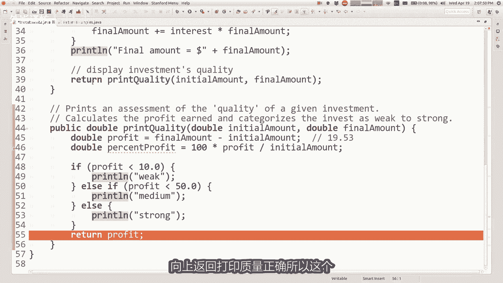

然后无论什么价值发回，现在也发回字这里，所以返回部分是最后一个是的，你知道我不是故意的过分强调这个结构。

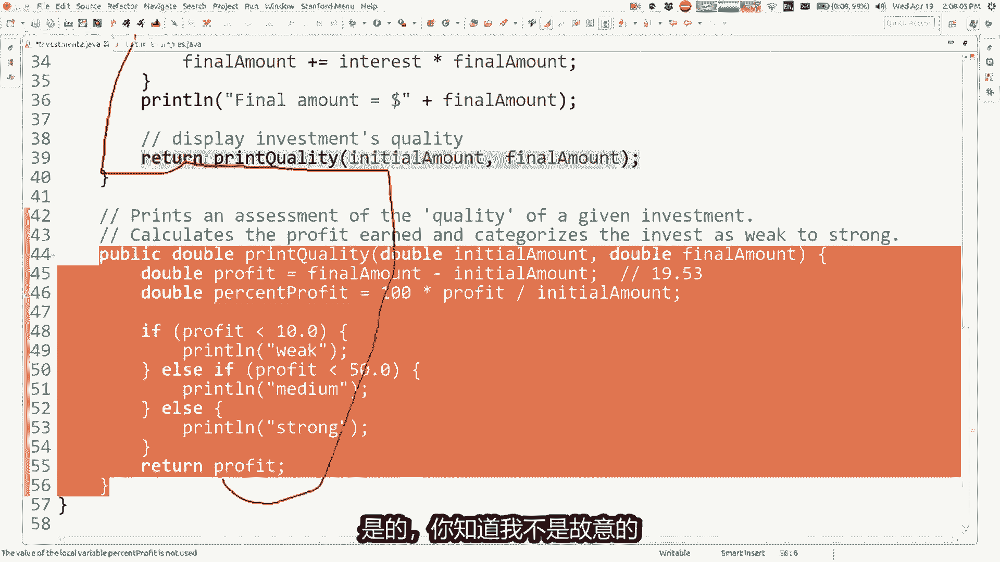

我可以称这个双离时临时等于暂时返回就下，很好，没关系，所以我不想得到丢失了，现在我使用的顺序，一分钟前的练习，这个词是绝对是好事，练习我已经做了很多练习，你们在代码上遇到的问题，分布网站和我们的部分。

本周的讲义，你们中的一些人，今天和明天你都会去应该练习返回和参数A，这就是你会变得更好的方式。

嗯让我跳回我的幻灯片，这是哪里，所以这就是投资练习N，我想谈谈关于特定类型的值，经常得到回报，我想你知道了解这一点很重要，课程中的点称为布尔类型，布尔逻辑，所以有一个你们都知道名为布尔值的数据类型。

关于你知道关于我的双重，给你一点信息，关于字符串类型，虽然我们还没有确实涵盖了，但还有另一个称为布列的类型，它的命名是名叫乔治沃尔的逻辑学家，看起来如果你愿意的话，谷歌他布尔值是一种数据类型。

只有true和false两个合法值，就像数据类型int有很多从零到所有的不同值，一整个空间存储大量值的整数，如果你在N典中存储了一个布尔值，变量或布尔值只能具有true或false两个值之一。

他的目的是存储逻辑或更多，准确的说它存储的结果逻辑测试，所以你们已经使用过，你已经说过逻辑测试了，如果卡罗尔，如果前方畅通，则被阻挡，有蜂鸣器，那些是逻辑测试，在if语句中是允许的，还了解了逻辑测试。

如果X小于七，并且Y为，如果银行账户大于六，平衡就这么多，我想去约会你们了解这些事情，这些是逻辑陈述逻辑，你写的语句实际上是布尔类型的表达式，因为语句计算出一个答案或真或假，是X小于七是实否。

银行账户余额不是七位数或更多假的，就像真假一样，从技术上讲，价值观是数据类型，称为布尔值，为什么我们关心这个，我认为这对我来说是一件很难的事，卖掉，因为很多学生不买，很明白这个的用处。

但是你可以存储逻辑测试的结果，在布尔变量中，所以当我说波尔小数等于你的，说的是，如果这个变量年龄我还没有写这里的声明，但如果你有这个变量及其值小于21，测试是否是该变量将存储的真实测试。

如果该值为false，则值为true，声明这个变量minor将存储值false，我能用它做什么，稍后在代码中我可以查看价值，我可以看到价值是什么，我可以在if语句中使用该值或一个while循环。

或者其他什么，现在如果我如果旷工或教授或者不喜欢cs，那么你不能计入俱乐部，所以我的意思是，这里的快速推销是这样的，使用这些变量让我能够编写，读起来更像英语的代码，如果你是一名矿工，或者你是一名教授。

或者你不喜欢计算机科学，不能进入我们的俱乐部，这个周末等等代码读起来更像你的方式，用英语描述逻辑，所以使用布尔值的优点之一，我也认为它可以是变量，帮助您捕捉逻辑陈述，如果你要使用的话，那就很复杂了。

它在你的代码中的几个地方，可能是此类的另一个好处，变量还可以有点奇怪，但是这是你可以做的事情，编程你可以存储这些逻辑值，是布尔值的常见用法变量就是返回它们，就是写返回电影的方法。

有时这些方法是一种测试方法，有时被称为with此方法，所以我有一个非常非常简单，这是一种方法，即使你传入一个参数，也被调用int的值，我将返回一个值true，现在不是偶数了，非常简单的计算或其他什么。

但这个方法的妙处在于，你现在可以使用该方法作为逻辑测试，你可以说是否是偶数42以及什么，你问的是那种方法吗，当我传递参数时，返回true42，当然如果你看一下代码会的，因为42÷2有一个余数为零。

那好吧，也许你不知道，真的相信我，这甚至很酷方法，但这有点简洁，因为他允许我编写逻辑测试，真的读起来像英语短语，如果数字甚至打印这个值干净整洁，你已经见过类似的方法，这个之前你在哪里使用过这样的方法。

返回一个布尔值，我们川尼有没有调用里面的方法，一个如果或什么，因为这就是方法必须放在里面，斧头一段时间，它必须是返回结果的方法，solve是true或的逻辑值错误的，那么你看到了什么这样的方法，是的。

谢谢你的测试方法，工作时代传呼机总统前面是左边被堵住的，是的那些方法，如果你去查一下那些的标题库中的方法，会说public布尔值前面被阻止了，这些库的作者回信是确切地哦，在航班上，谢谢伙计，抱歉。

这更像是伯克利要做的事情，比如请读一下我的内容，幻灯片上写着，这样你就知道我搞砸了什么，那里应该有一个动画，谢谢你好吧，这是一个自我提醒的好时刻，我会删除最后45秒，今天的旧视频只是一巴掌。

另一张小狗照片代替他们，一切都会好起来的，抱歉好的，下一张幻灯片，如果你写的话，返回布尔值的方法，这是一个稍微多一点的复杂，你给了我三个提示，如果都是奇数，则返回true，所以如果A是奇数。

并且B是奇数，并且C是奇数，我会返回true，我会返回false，但我想指出的是，你可以你可以用更短的方式编写这段代码，用更短的方式写这个方法，我时钟布尔值有一个有趣的名字禅。

如果你真正开始理解布尔运算是如何工作的，你会明白的尝试这样写你的方法，这太长了什么太长了好吧，让我试着向你展示这里的进展，看到很长一段时间，记住那漫长的考验，您可以存储该布尔逻辑变量的测试结果正确。

所以我可以在这里做任何布尔值等于所有这些，所以当然是什么，这意味着如果这一切结果都是为true，将true存储在变量中，测试其中是否有任何一个结果是false，在变量test中存储false。

现在看看我的代码，如果测试存储true，返回true，否则返回错误正确，所以我是什么，基本上是说你知道他是否是true，返回true，如果false返回基本上是假的，无论其值如何测试，这就是我想要的值。

返回理解，所以我为什么不指示看到返回测试，返回真相或存储在其中的谎言变量，我们甚至不需要变量，如果你如果你要计算结果，然后如果这是您的，请立即归还图案，你可以把它压入，我一分钟前展示过一行。

所以这有点难读，想想如果你从未见过这种之前的代码，但返回所有内容，这意味着如果所有这些都是真的，如果所有这些都为false，则返回true，返回false，所以这是单行排序。

那个男人的禅宗版本再次看起来有点奇怪，但这是最短的方法，然后写那个程序好吧，这是该布尔值的另一种形式，我谈了很多的想法，有时当你调用一个方法时，返回一个布尔类型，你会说的好，如果我调用该方法和结果。

他返回给我是真的，那么我想做某事，但你不需要说，你可以只说if是偶数，因为这基本上意味着，如果那是正确，则执行错误则不执行，这等于true，也没有必要，你不必说等于假，你只能说如果否定什么返回true。

然后输入基本上意味着如果返回值，该方法是false，然后输入同样的事情，所以这些更微妙，但这更好，并且使用返回布尔值的方法，I我想给你看最后一个例子，我想我有时间做这个事的。

所以我想做一件叫做最重要的事，给了我一个int，我会告诉你，如果他是素数，NO NO只能被Y整除，本身就对，这就是我想写的，所以我这里有一个名为prime的文件就在这里。

所以我向用户询问，N和我想说，那是首要的，不是犯罪，所以我想要一个公共布尔之事，包含十的素数，我怎么算，那个出来，我们已经做了一些例子，一两个之前的例子与考虑任何想法，你觉得怎么样，是的，好吧。

这是一个很好的开始，是的，我想要使用mod求余数，谢谢所以如果我有一些数字，我和我说n mode i如果等于零，则表示N可以被I整除的权利，我想要没有眼镜的数字，拥有该财产权的人除外，一和数字本身。

那么我该如何看看有没有这样的眼镜，财产继续式的，很好用循环检查所有数字一和N之间，不包括我认为你说的while循环观点，因为这是我已知的成员范围，更喜欢使用for循环。

但只是使用检查所有这些数字的循环式领带中，每个数字的好主意，从二开始，直到N减一或小于N，没关系，我加上plus si，正如你所说，如果N能被I整除的话，这意味着好吗，这意味着我们有一个不是一的因数。

也不是数字本身是什么意思，我应该在这些牙套内做什么，请记住我的目标是，我正在努力回答N是否是质数，那我该怎么办，在第21行，知道他不是素数，所以如果数字不是素数，我需要return false。

答案是否为false，这个数是否是质数，在哪里，我返回true，我怎么知道数字是素数，这是我们要做的最后一件事，然后我们会停到周五，我怎么知道数字是质数，是啊，好问题，否则如果没有，我可以回来。

事实是你知道的，你必须小心检查，所有的在进行之前范围内的数字，结论是这个数是素数，所以我认为此回报的放置，这真的很重要，我会周五和你谈谈这个，但是你真正想要的是返回false。

如果你已经超越了所有这些就到这里数字，但它们都不是因素，那么这个数字是素数，我会周五重温这个，因为我认为他值得更多强调，但我会停下来。

