# 【斯坦福大学】CS106B C++中的抽象编程 · 2018年冬（完结·中英字幕·机翻） - P11：【Lecture 11】CS106B Programming Abstractions in C++ Win 2018 - 鬼谷良师 - BV1G7411k7jG

好，等等，今天我也需要加载我的演讲代码。

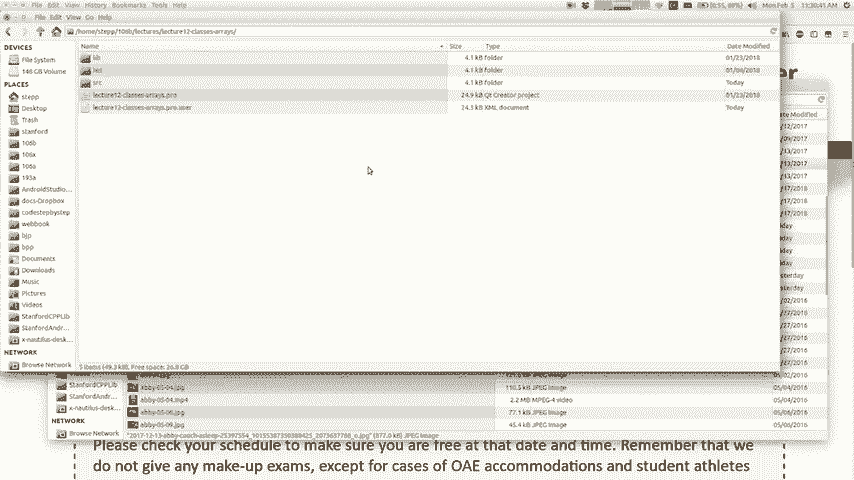

广场上有人问像马蒂（Marti）如何使他的项目编译成这样。

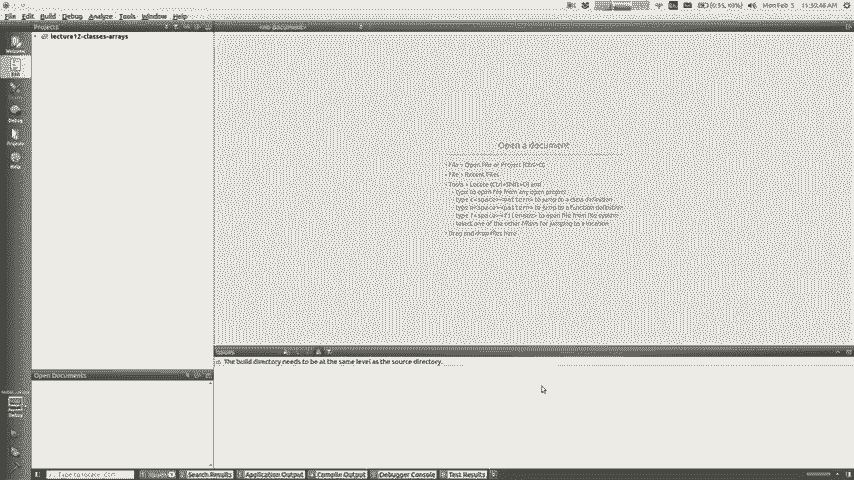

快速并回答我在上课之前就编译了它，您知道第一个编译需要，很久以前，我只是在演讲开始之前进行第一次编译，然后才开始学习材料，今天，我想你们都应该知道，到现在我们的中期已经是一周了。

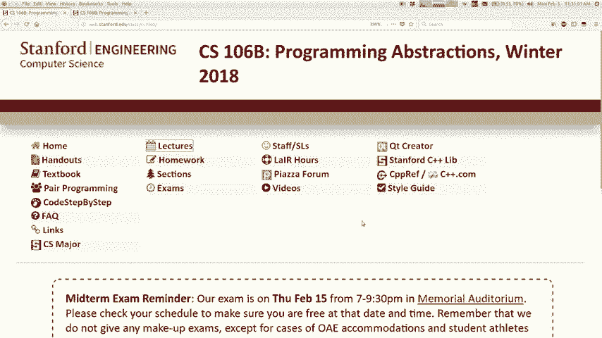

从星期四开始不是本周，而是在星期四的7：00至，晚上9：30，我相信您填写了一张表格，说您已经知道了，所以我只是，提醒您我并不是真的在想那么多，中期还没来，我也不希望你这么想。

但是如果您是喜欢早点开始的人之一， 。

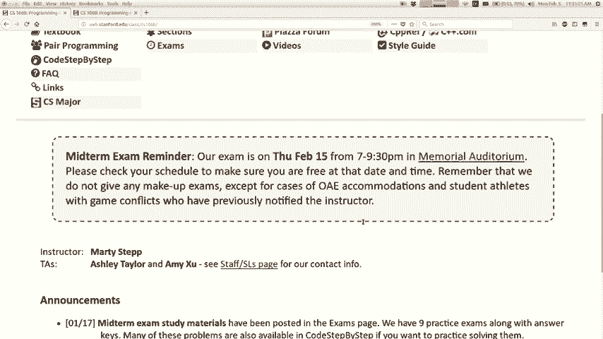

发布了一些您随时都无法查看的学习材料，在说考试的课程网站顶部，我已经贴了一些样本，练习和一些主题之类的东西，如果你想看看它去，直到本周晚些时候或下周初，我才讨论考试。 ，周，但是如果你想看的话就在那里。

如果您有任何疑问，可以告诉我们，好吧，让我们看看还有什么，我想说的另一个公告是，你知道上周我们谈论过。

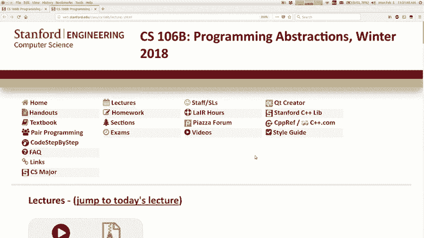

递归回溯，我们做了一个叫做八皇后问题的问题，使其打印出已将代码保存在板上的所有组合，已经发布了，我想提及我们编写的代码是，找到所有可能的合法解决方案，并将其全部打印出来，出来，那就是你知道的。

这通常是你想做的，有时却不想，想找到所有的解决方案，有时你，找到一个解决方案，然后停下来，您可以通过做一个很小的事情来做到这一点，如果您想查看版本，请修改我们在课堂上编写的代码。

您从中清除的东西只能在飞行中的Sox中找到一种解决方案，从星期五开始，如果您去讲师的同一部分，则代码版本，显示在那里停止了一种解决方案，所以您知道我在说这是因为，你的功课，你必须解决一个球类游戏。

你应该找到一个单词，然后你应该基本上停下来之后，你不应该，每次都坚持下去，这样可能对您有所帮助，在这两个版本之间，并在您的代码中使用其中的一些，这虽然很小，但是，你可以看看它，所以我实际上是从递归转向。

从递归和回溯开始，我们刚刚做了一段时间，在这些主题上有两个固定的星期，所以很遗憾，您知道坏消息是，如果我问这个问题，你不能再拥有这种基本情况了，我的意思是你，您仍然可以这样做吗。

但这是不太可能的正确答案，从今天开始，我们通常要使用的材料单元将，连续几个星期，我们将讨论如何，实施问题，以便我们在所有这些不同的收藏库中，我们的人民加上像矢量，堆栈和地图这样的库，说和。

排队以及所有这些不同的东西，我们一直在使用它们，希望，您欣赏它们对于解决某些人当然遇到的问题很有用，把它们制成的东西放在里面，所以我想教你，在接下来的几周中详细讨论该问题，我们将学习。

今天我将重点介绍几种结构及其建造方式，如何建立一个堆栈如何实现自己的堆栈并做到这一点，要学习数组，我们还将学习类，因为所有，这些不同集合中的一部分被实现为对象类，因此。

我想谈谈您如何在C ++中做到这一点，所以这是今天的总体计划，然后到本周晚些时候，我们将了解，你会喜欢的链接列表和指针相信我，这是一个具有挑战性的话题，但我想我们会实现的，所以我们会解决的。

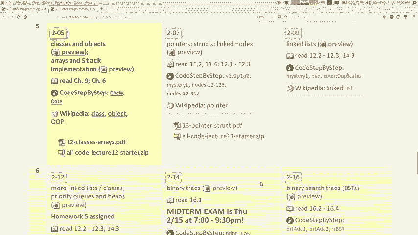

好吧，让我今天跳到我的科学课，所以再次上课和学习，选举实现一个堆栈好吧，所以我想我首先谈到了这一点， ，使用选举，我想看看如何实现集合我想，不想停留在那，因为我只是说了所有这些话，基本上是这样。

将集合实现为将类组件放在类中，以及如何在C ++中做到这一点，所以总的来说，我希望你们会，大部分是从106a知道的，或者当然是等价的同类，但坦率地说，我发现很多学生在这方面都不是很坚强。

材料到达106英尺，这不是您的错，只是您没有，练习很多，有时很难理解，所以我会稍微复习一下，但是会比我以为你永远不会，之前曾听说过任何此类消息，所以请问是否需要知道，类是对象的类型。

所以在Java中也是如此，类和对象的动机是当您要编写程序时，您有一种新的实体，该语言没有适合您的类型，知道C ++具有字符串，即时双打，cares和vector以及所有这些，不同的类型。

但是它实际上没有代表银行的数据类型，帐户或日历事件，或者可能是魔兽主题，没有兽人数据类型，也许对您的程序很重要也许您想要一种数据类型，叫猪肉，所以如果您想制作新类型的数据并将其放入。

您的程序必须运行class class是新类型的模板，对象什么是对象，您应该知道，但对象是实体，具有数据和行为，因此它存储一些信息，并且包含代码，当您编写程序时，这些信息会与该信息交互。

涉及不是面向对象编程的对象， Java是一种面向对象的编程语言，Java Script也是对象，面向，但到目前为止我们编写的大多数C ++代码基本上都是，程序性的，而不是编写课堂的主要好处之一，和对象。

并进行面向对象是一种分散注意力的东西，是与细节和用法的分离，因此您可以不总是使用类，知道你们的工作原理，你们已经在本课程中做了很多，使用向量，使用G窗口以及所有这些不同的图形对象，以及。

您实际上不必阅读这些对象的代码即可，了解它们，只要您知道其行为，就可以使用它们，是您可以使用的方法，这是为什么的主要好处，我们编写对象的类好吧，所以让我们看一下，在类中如何处理类和对象时，您会描述。

该类型的每个对象都应具有，有时称为实例变量，这就是他们可能在其中调用的变量，您的106a类有时称为字段，等等，这是每个对象的数据，会像存储类一样存储，以表示日历事件， 。

每个日历事件的数据可能是什么日期，什么时间，被邀请参加有关该对象的事件信息的事件的名称，这就是对象的私有成员变量的数据，为您的游戏保留兽人的职业，也许这可以存储，兽人关于您知道武器的兽人的统计数据。

并加强所有，兽人在兽人内的那把剑中拥有不同的属性，口袋，所以对象不仅是数据，它也是行为，称为成员函数，有时也称为方法和其他语言， ，这些功能的想法是它们不仅在对象内部。

您通过编写函数名称来调用的一些全局函数，必须说对象名称，然后是一个点，然后是函数的名称，我知道您知道这是您打电话时的所有功课，向量，然后说出点大小或将其称为地图，您会考虑但不只是，保持不变。

您对我的地图点说正确，这样你们就可以理解这个概念，就像这些方法一样，它们都在对象内部，您必须看到，您要在哪个对象上调用该方法，然后该方法与之交互，如果您有两张地图，并且调用了一个，其中一个方法。

与另一个地图无关，因为它们各自，有此功能的自己的副本，即，类好，所以这是对象内部的两个主要内容，类也有一个叫做构造函数的东西，这是一段代码，用于在对象出生或创建时对其进行初始化，因此无论何时在。

只要您说Java等于新的Java，无论您在构造Java ，对象，您正在执行一段称为构造函数的代码，所以我认为，术语，虽然您可能已经说过了，但是应该忘记了，但我可能已经忘记了，其中一些来自106a。

但无论如何，您之前看过这些东西吗，这听起来对你们来说最熟悉了新的问题，这里的概念没有基本情况，好吧，所以让我们来谈一点，关于在编写类时C ++如何做到这一点，通常需要将类分开，分为两部分。

大多数语言都有些奇怪，这不是C ++所做的，您编写一个名为头文件的文件，该文件的扩展名是H，而您，编写带有扩展名cpp的C ++文件，基本上记得写时，您可以使用分号编写这些函数原型的函数。

 H文件包含带有所有分号的原型，将在您的课程中，您声明所有内容，但您不写所有，花括号中的主体就是CPP文件中H文件中的内容，实际写出所有方法的主体为什么将其分开，之所以这样。

是因为通常一类被程序的其他部分使用，通常不是完整的程序，通常的模块是部分程序， ，被我使用或被您的代码的其他部分踢了，所以，其他想要使用您的班级的代码通常包括您的班级，本身的内含物，并且包含每个包含。

它需要的原型，所以我的意思是这只是C ++的这种细节， ，我们必须与我一起生活，我将向您展示如何做到这一点，我认为这不是一个好方法，做事的方式。

我的意思是Java不做这个Python JavaScript，他们不做，但是人们爱我们，我们必须以这种语言生活，一种人为分离让我告诉你它看起来像什么，点H文件从顶部和底部看上去在技术上都称为。

预处理程序宏基本上意味着，如果，程序只是在魔术般的巨型语法中就包含相同的文件，但这就是它的作用，这就是说它使之成为同一文件，被收录两次不会破坏某些东西，因此，在这些哈希行之间，您可以获得实际的代码。

也就是实际的类，在班级中写下班级的名称，然后是名称，然后拥抱你，声明所有将在您声明构造函数的类中的内容，以便您，部署方法身份声明变量，现在你们可能已经有了，正确之前看到的公共和私人术语。

与Java语法略有不同，或者您知道大多数其他语言，如果您想说某事是公共的，那么您可以吃Java ，只是在每个单独的元素上，此方法都是公共雇员，公众对这另一件事怀孕了，他私下里每个人。

洋葱婆在C ++中是公共的还是私人的，您只是有点公共区域，和一个私人区域，您只需在其中声明许多内容，他们在我们的数据可见性上对我来说是谁的一部分，避孕套的戳戳行为，是的，是的，这是一个很好的答案。

你说公众在这个课堂之外意味着，如果这是一个公共方法，则代码可以让事情轻松调用，允许代码调用该方法，而私有则意味着不能调用该方法，私有是内部只有该类才能跟踪的内容，本身。

那么您如何知道某个东西应该是公共的还是应用程序的？ ，私人的，但是您应该如何将所有内容公开或，一切私人事务，例如您如何做出选择，如果确定的话，由其他代码在外部使用，则可以将其公开，但如果没有。

则应默认使用，私有化某些东西，特别是存储在里面的数据，的对象通常是私有的，我希望您何时将数据设为私有，您编写课程时，您可能还记得人们在强调， ，离开了为什么如此重要，例如银行帐户对象是否具有ID 。

数字，姓名和作为个人资料的余额，谁在乎为什么，我们在乎那是私密的吗，您知道我的意思吗，如果我的叉子有一个，一定数量的生命值点变量私有为什么是素数，公开看起来好像其他代码可能我在看那些变量。

那我们为什么不让它，是，好吧，这样可能导致外脚不小心指到的错误，对于类的变量，我认为这是一回事，也许有很多，黑色食物在一个巨大的私人地方，我因为其他原因在钓鱼， [音乐] ，是的，是的。

这是您想要制作的重要原因，数据是私有的，因为外部代码可能会尝试以某种方式使其混乱，我们不希望我使用我选择的余额为银行帐户的示例，该示例是有原因的，因为我不一定需要任何随机代码。

可以进入并更改我的银行帐户余额， ，就像那对我来说是私人的，对我来说是私人的，我想要银行或，银行帐户系统能够管理余额我不希望有任何随机的人，为了能够管理余额，您可能希望自己可以管理北方，银行帐户余额。

仅需执行一些加号即可，但如此私人，重要的是有些人在扩展这些现实世界时遇到了麻烦，类似代码，因为它们很好，但是没有访问权限的代码，就像有人进入我的银行帐户之类，但实际上更多，就像多个程序员在合作。

其中之一是阿克塞尔，不小心弄乱了另一个变量，就像另一个变量一样，你在毛衣上说过，就像是人们弄乱对方的数据一样，您不想让其他开发人员那样做，所以这些，这里的一些概念和一些想法是通用语法，我给你看一个例子。

这是我写一个银行帐户课程，有一个，我希望我熟悉这个重要概念，但我确实发现这很棘手，让一些学生理解我有时称其为实例，概念或复制概念，希望您能理解或，不要熟悉这个概念，这意味着就像您编写一个，类。

您会看到有两个变量声明了它们的极端名称，加倍下来与其他非常不同，您所剩的任何东西都可能需要您的意见，这意味着您可以，一个，但这更像是一个蓝图或模板，这表示每个银行。

极端的帐户口袋意味着我认为每个银行帐户对象都有一个，里面有双倍平衡，所以这不会在一个双倍上声明一个屏幕，如果您现在声明10分钟，则这是指定模板（如果您有10分钟） ，当您有10个双余额时。

数据流就会流出来，所以这是一个重要的区别，想想当一些愚蠢的事情我见过不完全了解的学生，我对类和对象的感觉是，他们只是认为所有这些代码都是，一种事情只会发生一次，但实际上如果您应该说银行。

帐号一号银行帐号二号银行帐号三号，像所有这些代码的三个副本，并拖那三个的一分钟，对象，每个对象都有这些变量，每个对象都有这些功能， ，这是一个很大的差异，如果您不完全了解这一点，那么很重要。

我建议阅读教科书的第6章，明白了，好吧，这是每个文件的点，我们现在必须编写，带有花括号的方法，我将在稍后介绍，但您知道，使用类的另一部分是您拥有与之对话的代码，我们有时称该类为客户端代码。

因此这里是一些示例，使用我们的银行帐户类的代码，看起来就像在Java中一样，等等，如果我认为用Java可以使用其他大多数语言， ，一个新的银行帐户或您没有说的话，但我们已经看到了。

与vector和所有其他类型的区别，因此您声明银行帐户，成为执行构造函数的对象，还是好，所以我现在再次评论，如果您觉得无聊，那我只是，我正在尝试确保每个人都在同一页面上，好吧，那是客户，代码。

就像在缅因州一样，还是可以的，所以现在我已经提到，在每个代码之前，就像我看到Marty dr +改变了马丁，对象平衡，如果我说真的很重要，因为您有两个向量，然后在此向量上调用此方法，就不会改变它，向量。

但是当我们在编写自己的类时，感觉会有所不同，人们会失去范围或看不到这样的事情，所以这很重要，当您为这些方法编写代码时，可以参考数据，您的代码被调用的对象，我们有时将其称为，隐式参数我将在稍后展示给您。

我告诉过你，我们有带分号的H文件，还有CPP文件，实际上是用大括号写的主体，即您编写的CPP ，文件中包含自己的H文件，然后编写方法的主体，我认为这些方法和正则函数之间的唯一区别，这看起来真的很丑。

我会告诉你，我有一张这张幻灯片，这是，方法的实现，所以你是说我写了它，保留一个双精度参数并返回void，现在代码说明是否，平衡什么，所以当它说平衡时，他很害怕写，下一次复制概念所指的向下变量。

您调用该方法的对象的余额，因此如果您看到Martin ，一定要存入提款，如果您将其设置为“余额”， ， Mehran撤回了这一点，所以如果我想说平衡时，像谈论一种新的系统语言一样谈论它，就像我说的那样。

la脚，我要回家了，你知道我的意思是我的家，我不必多说，我要去Marty的家这样说，因为没人在家，我的家对所有人都一样我要减少平衡我要减少，他的平衡，你知道它需要对象平衡的那个方法，被召唤。

所以如果我说好，那就是为什么我认为有些学生得到一些，感到困惑，因为在客户端代码中就像在缅因州一样，您有一个名字，变量或对象，然后说得出一个事实，那就是您不会留下什么，调用对象是这种隐式概念。

这里的对象是，余额正确更改，因此我再次将其视为评论，但我注意到，到目前为止，仍有很多学生仍然要理解这个概念，对，您对方法的工作方式有疑问吗？ ，是语法，但也是下面的概念，因此您对。

这些东西中的任何一个都在你后面，好投票：为什么我们说你的记录好：公告是，基本上我是在粉红色帐户中称我为范围解析运算符，上课这就是那位妈妈的意思是退学的方式，你是说我在写一个方法，它的名字是撤回需要。

一个双精度参数，它在大客户类别的任一侧，因此使其，数大概是在Novak类中拉出draw draw方法，所以有，最少33个文件，您的课程带有点H文件，像幸运的那样，您的班级那里有一个CPP文件，就像。

他们完成了寻找提要的工作，而这两个都实现了目标，类的方法，然后有第三个文件，这是您的主要点， CPP或富国银行（Wells Fargo）关于TPP之类的东西，那叫我赚钱来创造我。

如果您想看到我有可爱的创作者，那么我看起来有点。

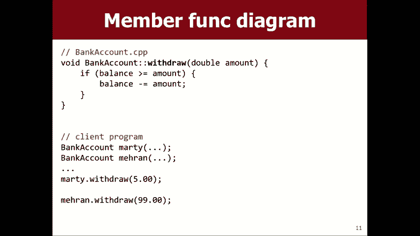

有点像这样，所以您有银行帐户点H，您可以写出一些方法，你说的好，我有一个构造函数，我有一些方法存款，提款，我有，有变量，您知道，所以这些东西在银行帐户中的点号H中。

 CPP您用银行帐户写出了所有这些方法的实现，他们前面一个冒号冒号，然后第三个文件是你有一些，这类客户，您说嘿制作一些银行帐户对象并使用它们，并且您包括银行帐户H就是为了这样做，这是不同的，哦，等等。

哇，让我试着向你施压，哦，好，所以您的问题是，当我们使用库中的现有类型时，例如，一个地图或becquer，我们包括H，现在我们不必写任何那些，方法的主体是正确的，所以我的意思是我认为这个主意是谁写的。

每个文件还写了银行帐户CPP，这两个文件就像一个整体，然后有人写信给我，说可能是同一个人，稍后再成为其他人，所以我猜您包括NAFTA年龄或矢量点。

 H或我们已经写过的所有地图海滩和地图点cpp矢量点h ， CPP的向量已经对库产生了影响，因此当您包含这些向量时，这些身体已经写好了，它们已经在那里，您现在可以通过以下方式使用它们。

通过创建矢量对象来调用方法，而创建矢量对象则会调用，该对象上的方法，所以我正在显示，我想这里的区别就像，这种情况是别人很久以前写的，现在你开始，用它来赢得胜利，但是像在这种情况下没有上课。

但我们决定我们，要写一个银行程序，我们认为从长远来看，如果，有一个大班，所以我们愿意停下来，花时间写一个，这样我们其余的代码就可以使用它，所以我们停止了，写了银行账户点H ，我们编写了银行帐户点CPP。

现在我们有了一个类，其余的代码可以，去和班上的人聊天，然后上课，但是我想我的意思是，编写主要方法的人通常不必跳过，编写类通常位于的类方法的实现，首先，它先于客户，诸如此类，好吧，任何问题。

其他我真的希望我想让我们所有人都在同一页面上， ，了解这些内容很重要，所以我希望您的问题继续，哦，为什么我们只包括那个年龄，所以最终没有得出CPP文件，我不想给你一个复杂的问题，我想我会，比方说。

当您编译C ++代码时，它将获取所有CPP文件并打开它们，进入这些称为代码的二进制文件，如果您进入构建目录，则可能，看到这些文件，所有关于Oh二进制文件都合并到了一起。

最终可以运行所有文件的可执行文件被允许执行，彼此交谈并互相调用功能，只要他们知道，其他文件具有的功能名称，因此该文件具有功能，而另一个文件只要另一个最终名称-都想调用它，您可以调用它的参数。

以便处理这些名称和参数， R它需要包含H文件才能知道不包含CPP文件，必要的，因为它不需要复制该函数的工作原理，函数从文件中混合在一起变成二进制文件，并且运行我的意思是我，猜想我只是想说。

对于编译器而言，这更像是一回事，所以，编译器会知道我在说什么类以及我在讲什么方法，谈论但包括在您完成时为您完成的CPP ，编译器会把所有这些二进制blob放在一起，所以您不需要，无论如何都要担心他们。

如果您愿意，这不是一个完美的答案。 ，关于如何将其编译为火的方法有太多细节，您将听到所有关于，你再也不想听到它了哦，是吗，你还有其他吗，是的，对对对，这是一个很好的问题，所以我不做一件事。

我不会忘记我是否。

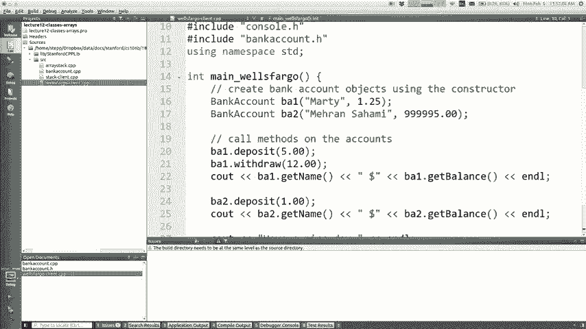

对此有一张幻灯片，让我仔细检查一下真正的构造函数构造函数，好吧，这里有一张幻灯片，我想像您得到的那样可以回答您的问题，平衡返回余额，这基本上是您的只读访问权限，可以打印出来，也可以写。

如果您只接收号码并写，用不同的数字不喜欢更新您的专页帐户，正确，您可以更改未更改真实列的列，因此，有时这是什么，您提供了一个称为mutator的setter方法或，修饰符。

您可以让客户端代码通过调用方法来更改数据，但是，一些您不想要的变量，例如，您不希望有固定余额，因为那会让他们改变他们的钱，你可能会让他们选择你的，名称，例如他们结婚或您，改变他们想被叫的约会。

或者他们可以设置的约会，名称，但是如果该变量需要设置，则可能没有设置器，受到约束，就像余额确实存入和提取一样，设置器，但是它们是选择性的，因为您可以通过if语句来确保它们，请勿存入或提取错误的金额，哦。

是的，问题是，他在问是否有某种方法可以，在公共与私人之间的某个地方，不是每个人都可以设置，平衡，但我不希望零人能够设置平衡，富国银行等客户客户可以设置余额，是的。

Java像我们刚刚处理过的Java一样处理了，所谓的“受保护的访问”，就像私人保护或公共访问一样，保护性在中间，对不好的C ++有一个好处，叫朋友，我稍后再告诉你，我今天不告诉你，但是你可以。

基本上在那看到代码，那是我的兄弟，我包括我的私人部分，所以你不跟朋友做的事情来了，没有好处的印记，我不知道我还以为年轻人很活跃哦，是的，但是有一个，可以这样说，您可以说这个圆锥体是我的朋友。

它将允许该代码在，我待会儿告诉你，但今天不给你看，但是那是一种可以做的方法， Google Google C ++朋友关键字，如果您希望自己的职业生涯像个狂热分子，关键字，他们可以在其中使用它。

但是您想要例外Adam或，某件事，或者您对他们稍后再买回该票感到不好，嗯，那是，主要是我想讲的关于班级的背景，我忘记了一些概念，所以我可能已经忘记了，构造器一秒钟，因为我认为很多学生都有一点。

难以理解构造函数，因此构造函数是运行的一段代码，当您创建一个新对象时，例如您说Java时，如果说Bank of town B ，等于描述一个新婴儿来的新银行帐户，他们将其连接到四个并被创建。

这就是构造函数被调用的地方，在C ++中，您不是说新的，而是声明新银行帐户的部分，变量，然后赋予它初始状态，这是构造函数获取的部分，通常称为构造函数所做的是它允许您不使用的主Soleil 。

想要这样做烦人，这很乏味，如果，变量是私有的，所以您想要的不是很好，我们需要一个银行帐户，需要这个Paul的打孔器，构造函数基本上是一个方法，但没有返回类型，其名称为，同学是银行，所以我踢了弦和双打。

我把它们存储起来，进入对象的私有变量的字段，无论它们是什么，平衡，你给我讲一个故事，所以我想我有一个像你时的图表，构造Marty，它将调用该代码，并将余额的名称存储到。

我没有写值的两个变量的末尾记得还好吧，所以初始化它，先生，你有问题吗，是的，如果您想使用默认值或喜欢多个不同的构造函数，或者，您可以在此处输入不同的值，我想我在此处显示了此语法。

如equals并放置一个值并具有默认的可选参数，您可以执行，在这里也可以写多个，构造函数（如果需要），然后允许所有这些不同的方式，所以是的，如果可以的话，可以有多个构造函数，那就是。

大部分评论我希望与您如何在C ++中做到这一点混在一起，好吧， ，我现在所处的位置我想记住的是，我们应该谈论实现集合，我想和你们一起写的是我通常想做一个堆栈，使用一个我没有告诉过你的比赛来实现，向量。

但我不想使用向量，因为如果向量是某个库， ，斯坦福大学的某人写道，我想从头开始构建它，所以这是如何，做一个数组，你可能会用C ++看起来很像你做任何Java的方式，您来自Java。

与JavaScript或其他语言没什么不同，要么然后你说这可能是该语法的唯一部分是，怪异的观点和准确的定位每颗恒星，那颗恒星叫做，指针我今天不想谈论这个，不用担心，直到周三再担心，这么多。

所以如果你让我，我今天要说的就是你，一旦创建数组，就创建一个数组，其语法就像处理，向量，您使用方括号将元素取出，所以这个小星星，我不认为我们今天不必担心小星星，您可以担心，以后再说吧，给我。

我会回到它的，好的，这是一系列作业成绩的一个例子，使用数组的不同方式C ++不会设置元素的值，实际上，他们里面经常有那些怪异的乱码，原因是，对于专利，因为它基本上在您创建数组时就已经存在。

记忆在其他地方，就像在记忆中选择某个地方，嘿，在这里，我将在此处创建一个数组，无论其中的任何位，记忆就这样吧，可能是某人的电话号码，可能有些您知道您在Facebook上查看的图像，可能。

成为某人的过去或他们扮演的角色，这并没有使大多数语言下雨，当您创建数组时，将内存擦除为零，或者如果您想使用C ++ ，为此，您可以在开始时写一个小括号来做到这一点，语法上有些许差异，但区别在于中断C是。

稍微慢一点，所以有些人真的想要最大，但是，因此，如果您打印此示例，我认为任何维修都等于的值，看一下，您可以在计算机上运行它吗？ ，答案比您的朋友在贝雷帽内使用范围迭代更好，但是您可以，它与弗兰克有关吗？

看到得到零，所以在我的示例中，括号只是他们不喜欢狩猎荒谬的是，哦，没有星星的那个，我在作弊，有两种不同，回到蜡的生活，实际上有两种不同的方法来制作蜡像，第一种方法是我们将使用的方法，称为动态分配。

下面的数组让我们调用分配的堆栈或固定分配， array两者之间的区别在于，如果数组空间不足， ，我向您展示的产品可以使我们做得更大，这并非易事，因此，但我们可以使用其他语法，因此对于像堆栈一样的构建。

 ，真的需要它在大小上保持灵活性，我不打算深入探讨为什么，那是什么，或者我要谈论的是什么，但就目前而言，我只是不愿意做阵列的其他方式而已，当您准备就绪的时候，我将向您展示一些，其他细节在这里很棘手。

就像您知道我们如何向您展示矢量，开始时，我们从来没有在第1周或第2周或任何时候进行比赛，我说过所有阵列，很烂，你不想加薪，不要担心比赛好，我有点儿要做，现在加薪，但确实很糟糕。

或者有一些我不想讲的怪异细节，谈论，其中有些是为什么我们还是略过一会儿的原因，这就是创建数组的方式，您可以使用熟悉的方法访问元素，语法我将告诉您括号，如果您访问的是该元素，尝试打印一个数组。

让我们看看它如何不祈祷，请捐赠者要求，数组的长度实际上没有任何功能， C ++编译器QT甚至没有将其归零，它里面有其他人的垃圾，基本上，数组是一大堆垃圾，所以要小心，不要，有任何功能。

但是我们需要建立堆栈，我们要编写一个堆栈，我们将以强奸为基础，让我们刷新一下，我已经简短地提到了这一点，反对者的工作方式和许多结构的工作方式是，首先可用现货，令人惊讶的是，它并不是真正的功能。

它还保留了一些额外的功能，空间，然后空间用完了，它会成长为更大的数组，并且这样做，因为如果您每次必须增加一个，就添加一个元素，它们取决于后坐力，每次您移除一个，会很慢，因为如果在C ++中。

种族实际上并不太容易调整大小， ，您想制作一个更大的数组，您必须实际制作一个全新的数组， ，复制每个人的速度真的很慢，所以我们实际上并不想这样做，每一次添加元素每一次删除元素。

我想我可能在几周前已经说过了，但我使用的是，像房子一样，您知道如果您购买的房间数量足以，适合您和您的妻子以及您的一个孩子，或者当您有另一个孩子时，孩子，你必须卖掉房子并买新房子，你有另一个孩子。

卖掉另一家有点傻的新房子，所以大多数人如果可以的话，他们会购买带有几个额外房间的房子，家庭成长，他们有足够的空间，然后当他们十岁的时候来，他们打电话给resize。

然后他们为第十一和第十二个孩子腾出空间，所以，继续，但我不知道我的这儿是否有点像，所以我们称这个想法为一个未填充的数组，私有的，所以您可以控制对数组的访问，只是不要让客户端，代码查看其他插槽。

然后就它们而言，就好像，他们不在那里，我知道这是真的，因为你从未想过，我们正在使用向量，所以我知道它对您有用，所以我知道，好的，那是Vectorworks vector需要更多的时间来实现的。

我们没有很多时间，只有大约十分钟，所以我想看看你，实现我们父亲的一部分使用相同的想法，但方法较少，写起来对我们来说更容易，通常是我们这样做的方式，所以这是一个总体思路，所以我上课了。

用这些方法调用数组堆栈push pop peek是空字符串，所以，让我们来看一下可爱的Creator 。

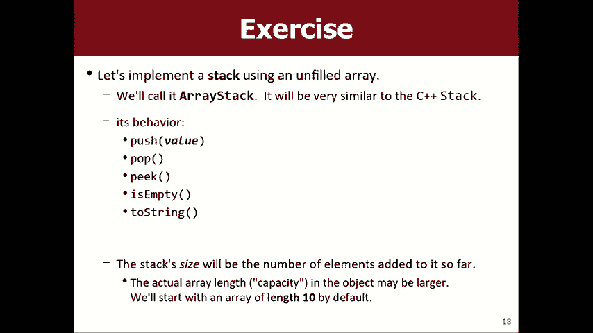

我们关于所学课程的信息，因此您要做的就是，将以H文件开头，您会说我想编写一个名为， arraysdemo，它有一个push方法，它有一个pop方法，它有一个偷看，方法，因为它是空的，它有两个压力。

我想我实际上已经，在这里写了这些变量，但是我的意思是，如果我没有这些变量，我们可以，就像我想的问题是，如果我必须实现那些方法， ，变量我需要什么数据？幻灯片旨在显示答案。

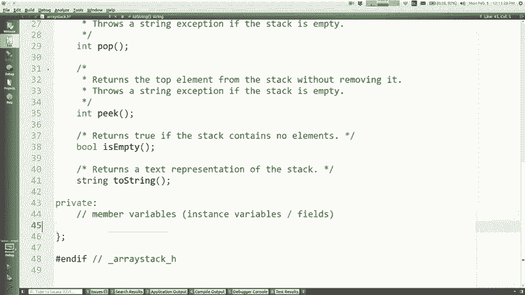

这是我要存储的阵列，这是我们要写的行为，我不想处理存储，我只想说的所有游戏，字符串和银行帐户，让我们，因此，如果您对此有所了解，它可以存储目前很容易的游戏，因此我们，以后可以使其适用于其他类型。

因此我们基本上需要存储一个数组，以及除了存储数组之外，因为数组不知道，它具有的元素我们通常会记住，我们每个人都有能力，的数组，然后是所有数组的三分之一，我们要记住它们有多少个元素，之所以放在堆栈上。

是因为并非所有数组都可能充满数据，这就是，叫做大小，所以我们需要数组，我们需要大小，我们需要容量，知道了，所以看起来像这样，除了数组的表达方式是star int 。

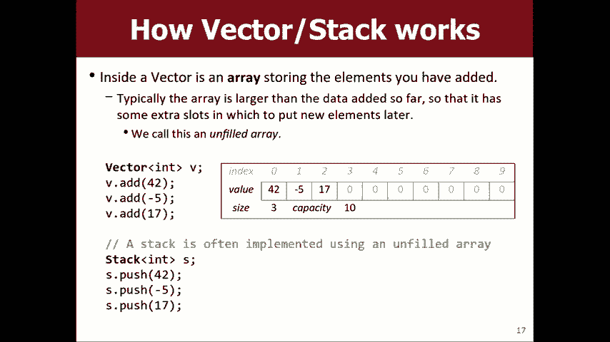

星号表示阵列间好问题是，这张照片的大小和容量是多少，但是大小是3 。

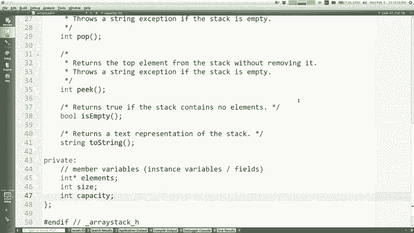

容量为10，因为用户制作了矢量并向其中添加了三样东西，所以在他们看来，这件事有三件事，但在我们内部看来，它的房间总数可以容纳十个人，所以这是一个，有三个人和七个空房间的房子，所以我的意思是我已经有一些。

这h代码的一部分，所以我们今天可以尝试在CPP文件中完成此操作，想骑这些东西的所有实现，所以让我们在什么时候谈论它，首先，当您构建堆栈时，这是构造函数，我需要设置。

我需要设置元素数组的状态的所有三个变量的状态，大小和设置容量，因此应将所有这些内容发送到元素，对某物邪恶，其大小应等于某物和容量，应该等于某事，帮助我确定我应该设定那两个。

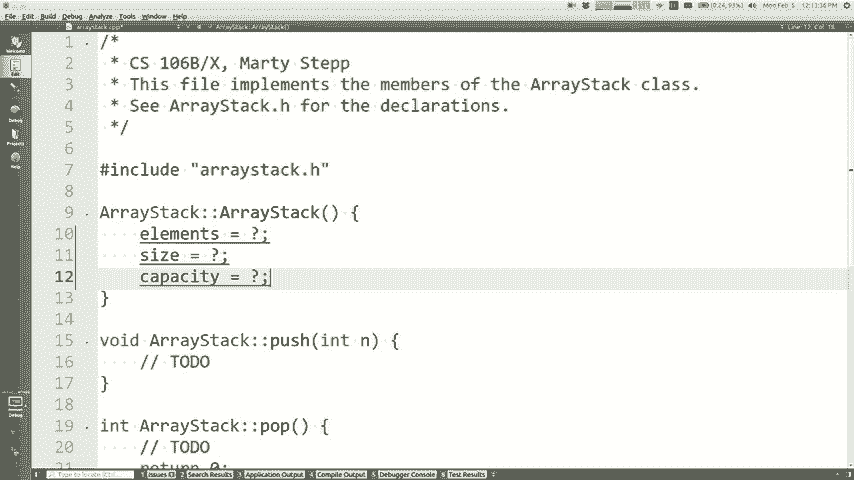

我的意思是基本上想匹配这张图片，但我没有添加任何内容，堆栈呢。

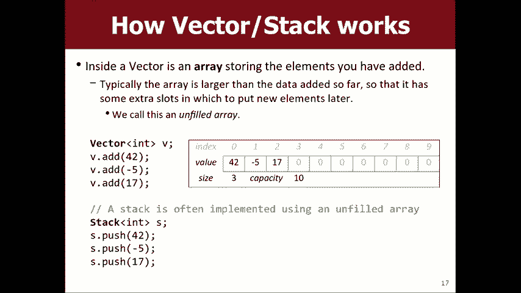

是的，大小为零，因为最初它们有，没有添加任何东西到堆栈，但是很好，我的容量是多少，猜这个数组中有10 10 10 10个插槽，然后如果我们要说，容量是10我们必须实际使阵列变大对，所以这。

成为新的打扰者10如果我们成为真正的优秀编码员，我们将，以后再做一个常数，是的，就是这个主意，好，所以现在我们有一个空数组，我要在这里放括号，这样，归零这10个元素好吗，所以现在好了。

我们需要能够将新数据推入堆栈顶部，所以。

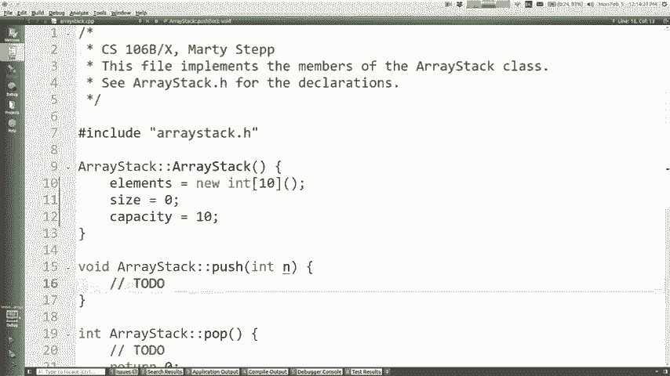

如果您只是看图片就可以看到这里的算法，您要在哪个算法中将新数据放入哪个插槽，索引是，我的意思是，如果我要推动，您甚至可以查看这张图片作为示例，另一个值，例如99，我们进入的是什么？ 。

索引的表达式被放入新值，它等于大小，对，因为当前元素的大小是0到大小减去1，所以新元素，应该变大，这意味着元素括号的大小等于n 。

如果要存储的话，我还有什么想做的呢？ 。

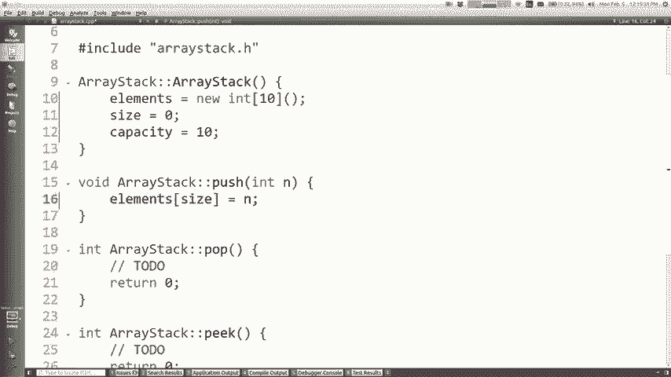

对，所以我要说祝福你，加上有意义的善事，我有一件事想念，是的。

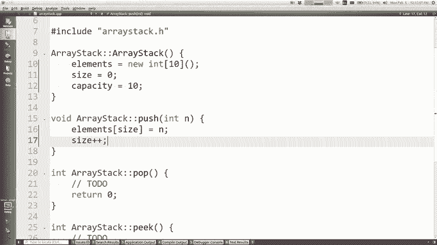

如果没有空间怎么办，已经有10个，而您要推第11个不会崩溃或崩溃，不好的简短回答，是的，我想再说一遍，因为那是一个。

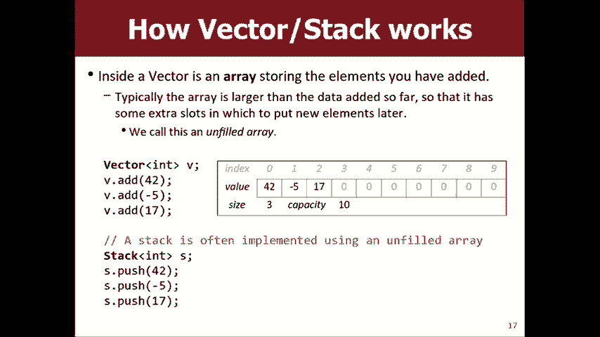

有点棘手，但我们绝对需要考虑一下，所以我要写信给，做空间不足的问号我会假设我们有一分钟的空间，可以在一分钟内用少量值测试它。pop怎么样？ 。

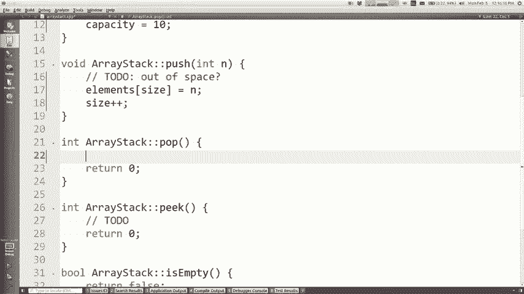

弹出，就像我回到这里时，假设我说弹出时我具有这三个要素，我要怎么做所有这些东西，最高价值的指标是什么，请记住，左边是底部，右边是顶部，一般，表达式大小减去1，因此int结果等于元素的括号大小。

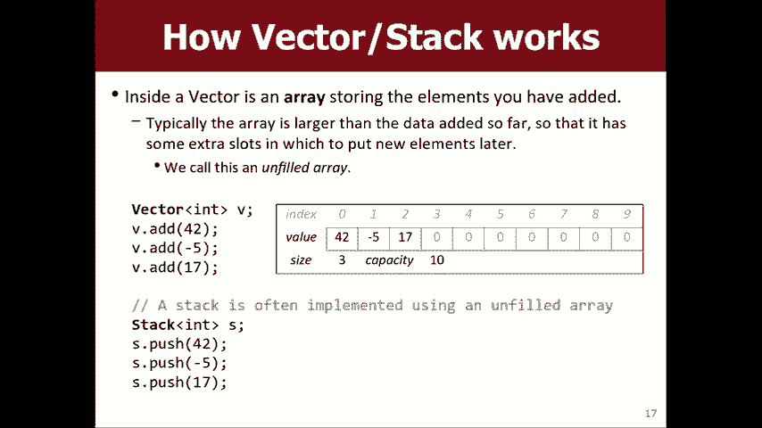

减1，因此得到的最后一个值，然后我要归还他们那就是我要归还的东西但我也，必须将它们从阵列中清除出来，我该怎么做，也许有人还没有打电话给我，我不明白为什么我喜欢摆脱那17个，所以。

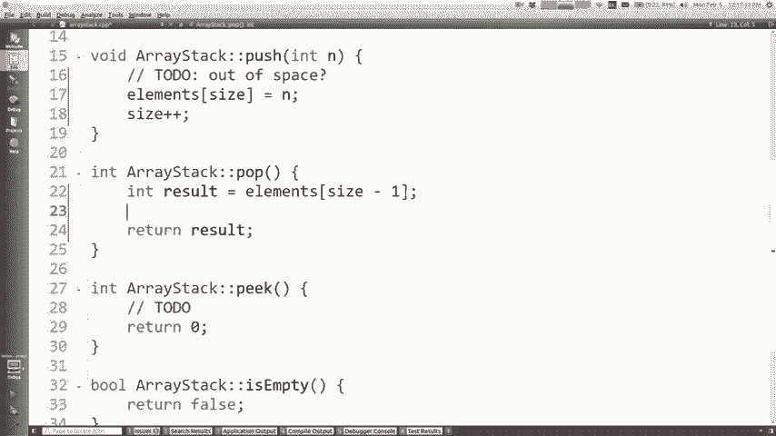

是的，将元素设置为0很好，是他们应该做的所有其他事情，弹出这些家伙，我需要减小尺寸，因为如果17号消失了。

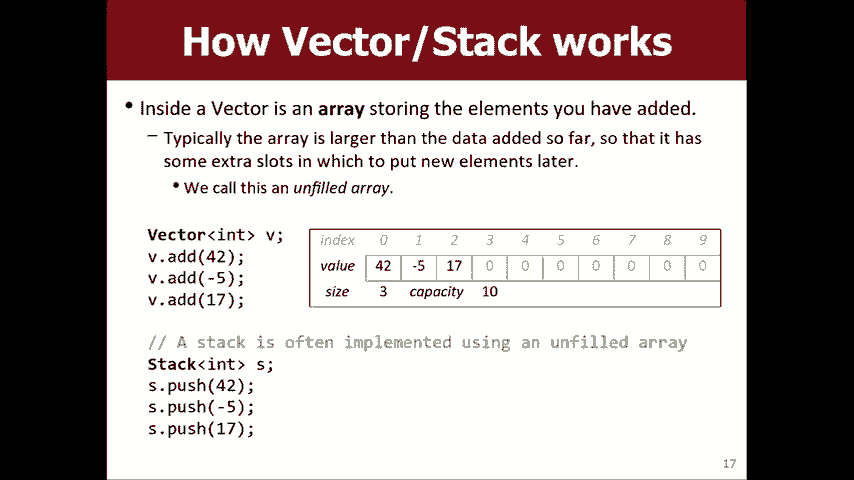

我的朋友现在也太对了，所以我要说的是元素括号的大小减去1 ，等于0 0出来然后叹气--好吧，说得好是你在哪里，看一下堆栈顶部的元素，但不要删除它，类似于此代码，不同之处在于您实际上并没有正确删除该人。

因此，我将其删除的部分是这段代码，我不需要该部分，所以实际上只是，返回，我想我什至不需要那个变量，我只能说return元素，括号大小减去1右边是否有任何情况我可能会忘记。

并查看代码可能会做错事情的任何地方，如果size为0，那么如果您尝试执行以下操作，则对实际堆栈有何影响？ ，大小为0时将其弹出在实际库中它会做什么，记得，不，这不是基本情况，它崩溃了，所以我的意思是。

如果您想这样做，可以，这样的权利，你可以说，如果尺寸为零，你知道悲伤的表情，或任何您可以说的错误您可以抛出异常或其他任何东西，你可以让它崩溃基本上没事，那只是意味着尺寸为零，那是他的空白，我没时间了。

但是，最后一种方法，我认为为了查看我们已经建立了什么，我需要流式传输，字符串应遍历集合，直到索引大小大小减去一。

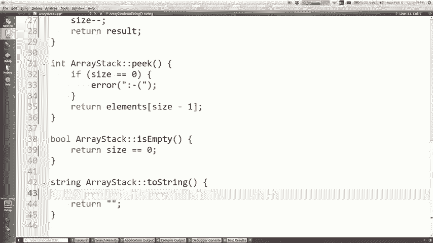

包容性达不到能力，因为这些多余的元素不应该。

包含在to字符串中，所以像这样的字符串s等于，对于int我为空，我通过size s加上0等于等号，就像我将，用空格元素将它们分开，我将它们粘在一起，然后返回， s加括号之类的东西好吧。

让我们看看我是否包括了我所有的东西，需要包括箭头点H，我想我包括搅拌库来得到那些，转换为字符串让我们尝试一下，我认为我们可以运行此客户端，称为堆栈客户端，让我们编译并运行，嘿，这就是我们推动的。

就是我们不断弹出的元素，直到东西变空，所以，我们大部分都有工作，我知道我们最后匆匆完成了一点工作，我会将其发布在网站上，以便您查看我们将从此处开始的内容。

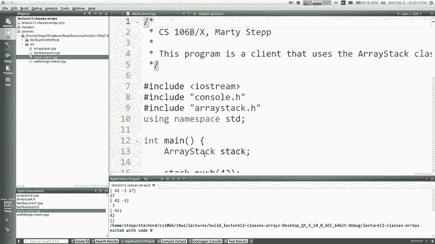