# 【斯坦福大学】CS106B C++中的抽象编程 · 2018年冬（完结·中英字幕·机翻） - P14：【Lecture 14】CS106B Programming Abstractions in C++ Win 2018 - 鬼谷良师 - BV1G7411k7jG

好吧，所以我知道你们正在考虑卡在，期中练习的问题，你想问一下，你可以随意做，这是让您的问题得到解答的好方法，我们今天也有办公时间，明天等等，现在我们正在做什么，我希望本周你们会专注于期中学习。

并且大多数，这周我们的期中是星期四，因为我们恨您，您知道我的意思是人们想为此努力，但我会，通常不希望您开始考试，直到完成考试为止，预定在下周中旬进行，因此您可以完全专注于考试，现在完成考试。

那么您已经完成了所有考试，嘿，如果那不是，足以让您度过一个漫长的一天，所以我知道我认为您将有时间集中精力，您可以在网页的“考试”部分发布的每笔现金上查看，当你准备用讲座的方式看的时候，我基本上。

认为期中涵盖了直到上周五，然后开始，今天，我将不会从这些讲座中对这些东西进行明确的测试，在这里进行期中考试，所以我想这可能会导致您调音或离开或，随便什么，但您仍然需要学习，所以这是计划，这是计划。

保佑你好，所以无论如何我们今天要做的是我们一直在学习，有关链表的很多信息，我们上周一也了解到了如何实施，使用数组进行收集，我们制作了一个称为数组栈的收集，我想要，今天再次回顾所有这些东西今天的主题将是。

讨论如何将集合作为类与数组一起实现，以及链接列表，这也将成为您第五个主题。

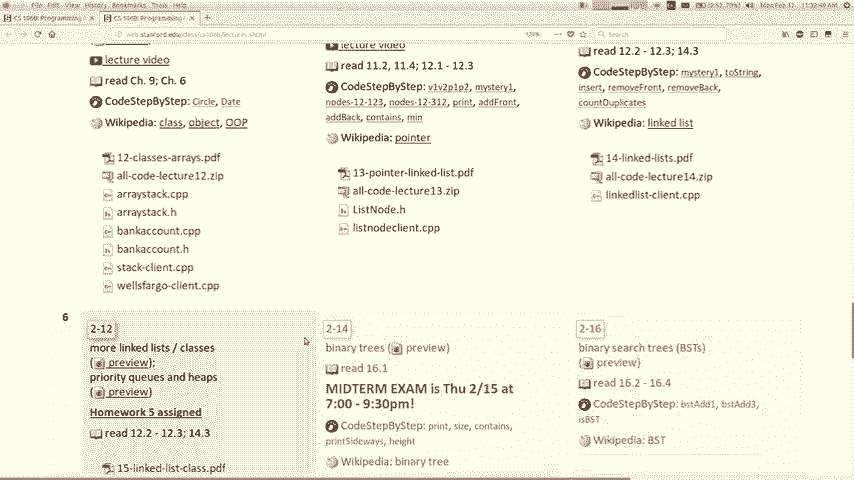

功课分配，下周要交，好吧，走吧，到我们的幻灯片，还记得上周一，我们写了一个名为数组的类，数组事件的内部结构，但是在外部，该类是，将自身显示为堆栈，如果将元素压入堆栈，它将添加，他们到他们的方式的结尾。

所以我们在大小和，容量，即阵列的总长度，是的，我想回到，该类并在其中添加一些功能，但实际上并不是如何链接的，列表通常由客户端在其上使用，因此样式略有不同，比我们一直在做的事情，所以我要谈谈您将如何改变。

我们的代码将包含在这些内容中，所以这是目前的计划，让我们回到。

那个数组栈让我随便打开那个代码，我有一个可爱的创建者，项目的主代码可以说这样的事情，你知道做一个数组堆栈，而且您知道通过调用push添加一些元素，然后再推动薄荷糖，然后，打印堆栈的两个字符串。

所以我们编写的代码将是，小字体，您可以将东西压入堆栈，然后您会看到堆栈。

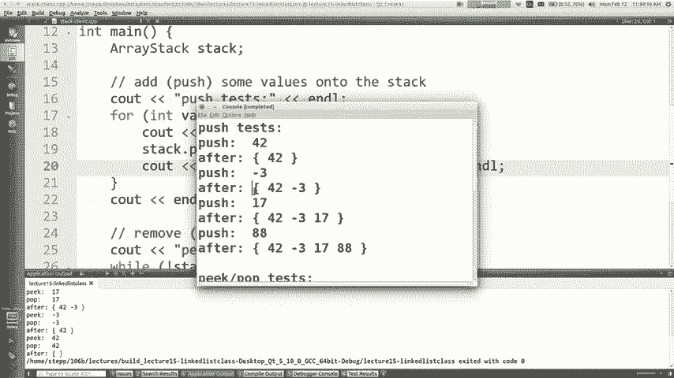

更大一点，这样就不会太令人震惊底部在左侧，顶部在，在右边，然后当您将事物从堆栈中弹出或窥视它们时，它将为您提供堆栈中的最后一个元素或顶部元素，上周我们写的内容好吧，所以让我们了解一下其他一些事情。

我可以谈谈您可能已经看到的“ Const”一词吗，偶尔在作业或入门代码或讲座代码中，还没真正谈论过它，Const只是意味着不断地，无法在Java中更改，有一个名为final的关键字具有相同的名称。

意思是JavaScript，如果您学习过Python，我认为它有一个Const关键字Python ，没有任何常量的概念，但是无论如何大多数语言都有一个，在这里您可以说这个值没有改变，所以有几个。

您可以使用不同的利弊方式来声明声明，变量或参数（如第一个示例），如果您传递某些内容，这是恒定的，意味着您现在不需要使用该呼叫就无法更改它，常量，您传递的是像int这样的简单内容，因为如果。

您更改它或类似的东西现在应该认为其中一些方法，修改向量修改网格，但是其中一些不是，如果方法，不会修改它，最好将其声明为，不断之所以这样做的好原因是因为它告诉所有人，看着像这种方法的代码不会改变这件事。

如果你，声明一些自信的功能，食物会尝试改变食物的状态，反对它不会被编译，所以如果银行帐户类有存款，更改帐户余额的方法，不允许您调用， foo函数内部的deposit方法，很酷，它有助于捕获。

您可能无意间修改对象的潜在错误，这很酷，还有另一个上下文，您可以在其中使用const这个词， ，如果您正在编写一个类，则可以声明您的方法之一是， const方法，这意味着您说的是这种方法，我保证。

你叫我这种方法，如果我是银行，我不会改变自己的状态，您拨打的帐户让我保持平衡，不会改变任何帐户，内部状态，它将保持不变，可以使用const are一词，相关，因为第一个只允许您从第二个调用方法，例如。

如果您这次有一个参数，它将仅允许您调用方法，被宣布为花费，所以当您，编写一个类来查看您的所有方法并找出哪些方法不。

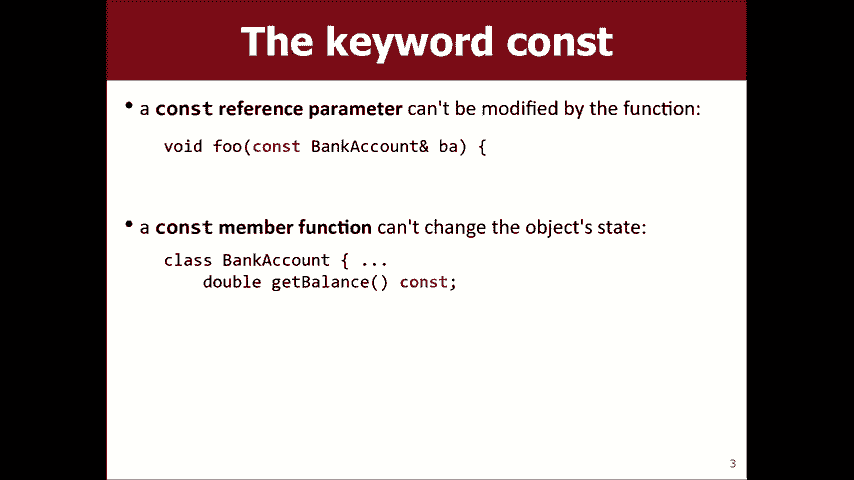

更改对象状态并在其末尾写上constat一词，如果您，看一下我们写的数组栈，这里有一个名为数组栈H的文件，有一个push方法，有一个pop方法，有一个peek方法，是空的，并且。

这些方法中哪些是轮廓线应为常量，为什么峰顶正确，您不能将Const推入或弹出，原因是整个，关键是我认为其他任何人都可以修改堆栈的状态，空字符串和两串字符串也是，你知道你可以直叫两个。

一百倍它现在不会修改堆栈中的内容，您声明您的方法，这是在点H文件数组堆栈点中，如果您，声明您的方法为const，那么您还必须转到点CPP文件，而且您必须在此处使用相同的方法，并且必须将Const 。

在那里，如果您忘记了一个地方或另一个地方，那么您会变得很可爱，关于未为体系结构x86定义的符号的错误下划线六四和，那么您会对此感到困惑和困惑，所以无论如何，如果您添加。

您的方法实际上并没有做任何对客户端可见的操作，但是，做到这一点的好习惯，您也知道它可以避免像，如果我说void foo array stack reference stack，这就像是堆栈客户端。

如果我试着说堆栈推入42，那么你知道定律不是恒定不变的，那么，应该给我一个错误提示，这不是因为我需要重建，项目，我需要清理并重建它，因为如果您将方法更改为，在概念上并不总是会立即注意到哦，不，等等。

对不起，我，愚蠢的，它应该反对的原因，也就是说，如果您要在这里说“ Const”，那么它就不想让您修改，堆栈，这就是为什么它不抱怨我期望编译器的原因，这样就完成了，无论如何您都不能调用push。

因为参数是，声明为Const哦，我想我看到了，那里的错误有点儿Spalla ，触发任何仅意味着您无法在Const堆栈上调用该方法的事件，如果我要删除Const，则代码可以编译，但是现在不行，但相比之下。

我可以称呼堆栈点为窥视点，我可以称呼堆栈点为空，这样编译就可以了，所以如果我要你写一个类，可能会说我希望您使方法Const适当，这意味着，不要修改对象的状态，在方法的末尾添加“ Const”一词。

头好吧，这是Const对Const的疑问。

所以是的，D需要做些什么修改，所以当我们写一个，上课有两个方面，就像您写上课，然后还有使用该类的客户端代码，有时您同时编写，这些代码段有时是由不同的人编写的，例如，斯坦福图书馆，我们编写了向量H。

您正在使用向量H作为客户端，因此，问我需要进行哪些修改，这取决于您是客户还是，类的作者，或者两者兼有（如果您是该类的作者） ，如果您是班级的客户，您可能会选择这样做，但是。

这更多地取决于您的客户端程序以及您的程序在做什么，如果我使用的堆栈没有修改的方式，我可能想说，继续前进，好吧，我只是在进行调查，向您展示一些，相关类的其他功能，如果这还没有说Const on是空的。

那么这里也不是然后，在这里，如果我尝试调用它，即使我们可以看一下它也不应该编译，尾声，我们可以看到它为空不会修改对象的状态，该方法没有说Const，编译器不信任我们，它不会，编译代码。

以便我将其放回原处，是的，不是那么重要，您修改的内容是您是否说自己已修改，然后当然，康斯特说我们想要躺在这里的样子，我们试着做像尺寸加号或加号或。 。

一些不起作用的东西或者它不会让我们这样你就不能说Const和，然后撒谎吧，好吧，让我们覆盖其他一些东西，这是一个有趣的。

 C ++功能称为运算符重载，这是最酷的或，最糟糕的功能，取决于您是哪种类型的操作员，重载是为的内置运算符重新定义或添加含义。 ，这样的语言，就像您可以定义加运算符在。

你的班级就像我不知道你以前是否注意到过，一个向量，您可以在其上使用+等于等号。

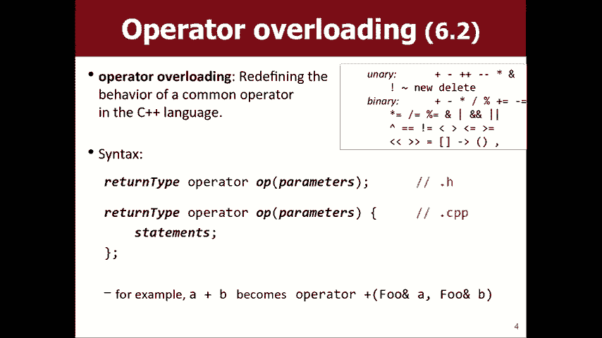

还没有谈论太多，但是像这里，如果我包含向量点H 。

向量点H，如果我做一个向量，我就走了，就像你知道字符串V和，你通常会说，像VI Pad，你知道Marty，你确实很喜欢，但是，你也可以写V加等于马蒂这很奇怪，它可以让你做到，编译运行，其行为与广告相同。

因此其工作原理类似于，我正在使用一个向量和一个像Java这样的语言的字符串来做，任何在C ++中会导致编译器错误的感觉都可以做到，操作符重载，您基本上可以告诉编译器嘿，如果您使用。

具有这些数据类型的运算符这是您应该做的，那应该变成操作员超载， ，所以您基本上是写一个描述运算符的函数，但是，该功能的名称是土地运营商加号或运营商时间或运营商，等于或什么是运算符，后跟实际。

运算符的字符，然后您有参数，然后填写正文，这样看来，您可以使用此功能执行各种奇怪的操作，我个人认为这是一个坏功能，因为它使它像其他任何人一样，任何给定运算符的给定语句都可以做一些随机的事情。

他们超载这样做，我认为这很危险，但是，他们说的语言，如果意思是仅应重载运算符，很明显，例如，如果您要带两个银行帐户，然后执行，它们之间的减号运算符并没有任何意义，知道所以不要这样做。

但是运算符的真正普遍用途是使，可打印的对象，所以有一个操作员，您可以重载以立即执行此操作，看一下我们的数组堆栈，如果您有一个，数组堆栈，您想查看其中的内容，我们将此方法称为，正确的字符串，好吧。

如果我只是将C写出来，那该怎么办，向量就是您可以对地图执行的操作，就可以说C ，把我的矢量打印出来，您知道它实际上不允许您这样做，因为， C ++不知道如何打印数组成员，您可能会说不错，但这是，很明显。

您可以通过很好地调用字符串来打印它，C ++无法理解，那就是您要打印堆栈的方法，因此必须告诉C ++ ，如何打印东西是您实际上超载了小于小于，运算符，因此看起来像这样。

您编写了一个称为operator less的运算符，少于参数，这有点令人困惑，它需要输出，流引用哦，输出流就像C out或文件out的流，都是后期流对象，它也需要您打印的值，那是两个。

所以基本上你只需要打印，东西到那条街，然后您还必须返回输出流，您必须返回输出流的原因是可以将它们链接在一起，比折线少，比折线少，这有点微妙，但看起来，这是您必须用来编写此运算符的样式，这是确切的。

设置它必须具有的属性，以便使阵列堆栈可打印。

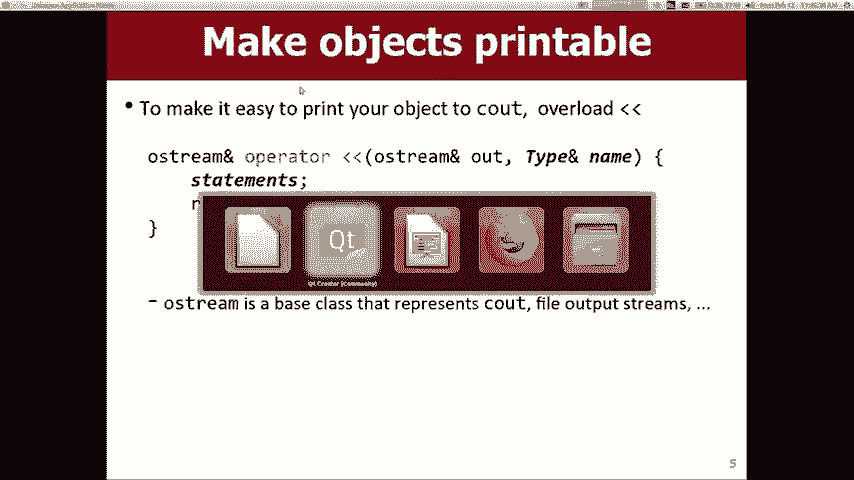

今天很多人咳嗽和打喷嚏，我希望每个人都，感觉很好，不知道下课后会抱抱，我不会跟我抱抱，彼此了解并不意味着要让您的对象可打印，您要做的就是，下来这里，这是数组堆栈中的点H，您下来到。

班级下方的班级实际上不在班级内部，你说哦，流引用运算符越来越少了，我将调用的流引用，它需要一个称为，堆栈，所以您说的是声明我将为实现此重载，使用此运算符时，您总是在带有分号的H文件中声明内容。

然后在数组堆栈cpp中的某个地方，您编写了相同的运算符，但是，花括号，然后您实际上写了如何做的正文，所以您如何做，好吧，假装您正在打印纸叠，您将如何打印纸叠，好吧，我是说在客户那里。

我们说你知道看堆栈讨论，紧张吧，所以你就这样做，这样你就可以过来看看，堆叠点到字符串插入有一些错误，几乎就是您只包括如何打印东西的代码的想法，但是，这有两件事是错误的，你不应该，包括endl。

因为打印零食的人可能不想要， endl您应该让他们决定是否应该打印endles，所以我要，删除该部分，您应该更改的另一部分是此运算符可以是，用于打印C，它可以用于打印两个文件和任何其他类型的，输出流。

所以实际上这个叫出来的参数就是你要，打印东西到所以你只要说出来就意味着这里有这个参数，无论输出流是什么，您正在打印我以将我发送到字符串，到那个流，所以你现在编译这个。

原始的东西不支持仅在此处调用带有堆栈的打印，但是，现在我编译了，哦，等等，我遇到一个错误，说我什么也没退，所以在将输出堆栈打印为字符串后返回此处，必须说return ，输出返回。

返回与传递给您的输出流相同的输出流，这始终是您要做的，基本上每个操作员都会越来越少，大概是这样，通常对我来说只是次要的代码，回到主程序，现在它编译它允许我打印，像这样的堆栈，我打印它。

并在打印它的地方得到相同的输出，如果您不相信它，因为输出没有改变，现在就这样堆叠，我会，试图说服你，所以首先我要删除所有说，字符串，所以它应该在这里在主要客户中致电我们的运营商，但我，也要去数组栈。

我要改成Booya ，这样的事情发生了，所以我要在上面放一些愚蠢的东西，字符串的两边，然后在我运行它时将打印这些消息，因此，基本上，这是无论如何都将其打印到输出流，它调用了我们编写的运算符。

这就是制作对象的方法，我不会花很多时间在上面，但是我的意思是，诸如您如何在Java中使某些内容可打印之类的语言，您知道哪种方法，你要写吗，祝福你，好的system。out。

print留置权是您打印内容的方式，但是如果您说Print lien ，而您传递的是银行帐户类型的对象，通常只打印某种，乱码的制作方法，以便在银行帐户上打印留置权，一些有意义的事情。

您必须在银行帐户课程中写些什么？ ，是的，流结束了，你要对先生说，对不起，嗯， ，字符串方法，实际上这是我们写的字符串，如果您刚刚写过， Java将自动知道如何打印C ++类型的对象，如果您。

想要使事情变得重要，实际上你甚至不需要写这个，必须编写一个to字符串方法来字符串它不是C ++中的特殊方法，所以我们拥有它的事实仅仅是因为我认为那可能会更多，你们很熟悉，因为你们很多人都来自Java。

但是这种方法不是，特别好，所以我要请您在上面写这些运算符之一，作业5因此，这种通用语法对您来说还可以，我的意思是，看起来很奇怪，但基本上可以复制并粘贴，从而将比赛恢复为您的类型，然后做与此等价的事情。

或者其他任何事情，你都会好起来的，问题，好的，这就是使对象可打印的方法，让我们看看下一步是什么。

我要在这里跳一点好吧，我想谈一谈。

称为析构函数或析构函数与您所知道的构造函数相反，构造函数的作用是当对象正在运行时运行的代码，创建它是天生的析构函数是当对象死亡时运行的代码，该对象超出范围，如果您编写该对象，则该对象将被清除。

此特殊方法的名称是波浪号，后跟您的类的名称，然后它将在您的对象上运行该方法，因为您的对象正在被删除，就在删除之前，为什么要写这样的东西，好吧，您曾经想这样做的主要原因是，如果您上课。

使用new分配内存使用new单词分配指针内存，然后，记住在C ++中如何不会自动清除这种内存，如果您希望清理内存，则必须自己清理内存，说出删除一词，所以这是您要删除的地方，因此。

让我向您展示该示例的数组栈，如果我转到。

当我们创建阵列堆栈时，在此处擦除DAC点CPP，我们制作了一个新的， 10这是当前新程序的写入方式，擦除DAC具有存储器，如果您创建堆栈然后将其清除，则会泄漏这些租户，在内存中。

并且在程序测验之前不能再使用，因此，不好，我很难向你们证明我要做的是，运行一个循环，因为10s内存不足，所以我必须运行一个，循环产生了一百万个堆栈，您必须看到内存使用率上升，我不会花时间去做。

我希望你带我过去，天线上的文字并不是世界上最糟糕的东西，但是，如果您的程序运行了几天又几天，那将是一个问题，因此我们，需要清理此内存，以便您将其存储在H文件中，堆栈点H，您来到这里，然后编写一个与。

构造函数，但带有波浪号，所以这是一个析构函数，好的，现在在点CPP文件中，实现方式是，类名，前面的冒号和其他成员一样，现在在这里实现主体，您只需编写要运行的代码即可，堆栈被破坏了。

所以一分钟我什么都不会放，这就是我要做的，我只做C语言，D结构体就可以了， indle，但让我们看看它是否可以正常打印，所以如果我运行，程序，我们将看到它像往常一样打印所有正常输出，但随后会调用。

它说析构函数被调用了，所以我不认为这很有用，我的意思是，我想它告诉您这件事已经解决了，但我还不太清楚，不要以为这完全说明了这里发生的事情，所以让我尝试，让它更清晰一点，如果我去客户端程序栈客户端所有。

堆栈中包含的代码位于右侧，因此让我们更换教练，稍微让我抓取这段代码，然后让我制作一个称为void example的新方法，我会把这段代码放在这里好吧，只需将其从main粘贴到，这另一个功能。

我要有主要的，我要放一些印刷声明，这里C out main可以开始，然后我要说main end我也要，对于另一种方法，我要说的是示例开始，示例结束，好吧，只想看看此程序示例中发生的事情的流程，示例。

所以我想我的意思是在示例中创建了该堆栈，函数应该在示例末尾清理并销毁，功能，所以如果我现在运行程序，主要开始主要结束我没有怎么称呼它，他们应该让我参加自己的期中考试，如果我不能达到至少50岁，他们。

应该把我从这里赶走，不是吗，哦，是的，谢谢我，感谢您的帮助，我不记得要调用我的函数了，好吧，我们得到了什么，在顶部，我们得到了缅因州，然后是主要电话示例，开始了，打印有关堆栈的一堆输出。

然后说示例结束析构函数为，之所以调用，是因为我们要退出示例，而后我们要清理堆栈，因此，当我们退出示例函数时，它将对堆栈进行d-结构化，那已经超出范围了，所以看起来我们还没有完成，因为。

析构函数不仅应该打印一些东西，而且应该清理它，内存应该清理我们在这里分配的内存，以便您，基本上只需要说删除元素是唯一的记忆，我们需要清理的空间我们也有一些学生要求的尺寸和容量，但是我也不需要删除它们。

也只需要删除那些，表示新的，如果您不使用新的，编译器将自动管理，给您的记忆就是全部，这就是为什么我们直到现在才使用new ，但是我们确实使用了new的数组，如果您在，删除一个数组，你必须说删除括号残骸。

是的，它需要知道，你要删除一个数组，其他任何东西都不是一个数组，你只是说删除，抱歉，这是完整语法的微妙之处，析构函数的实现还有其他新的指针，内存，我们也肯定删除了这些，所以您认为您拥有什么。

关于析构函数的问题，它应该做什么？ ，关于这个问题，是的，抱歉，因为不规则，是的，因为数组是唯一的东西， “ new”表示这是我们唯一需要明确清理new和，删除正在尝试对，您几乎应该每个都有一个新。

删除您不是我的意思是，如果您知道如果不这样做则需要删除，它不需要删除它意味着我要管理我想要的，照顾这种记忆及其寿命，这也意味着当生活转瞬即逝后，我会自我清理，删除其他任何问题。

好吧，让我们继续前进，我想谈一谈，一个链表的类，我们一直在为一个堆栈我玩这个类，只是想在谈论关于两件事的权利，类概念，我说的是使用RIC的出色实施许可证，所以现在我想使用功能来实现一个集合，不。

它是一个指针，接下来的数据和循环电流消除了我们所做的很多事情，东西，但是我们写的方式就是我，会称为过程样式，所有这些只是一堆函数，链接列表的前指针作为参数，所以如果您不记得那些。

函数，我只是先打开我们处理过的文件，然后再将其作为来自，上周五，上周，所以我们让一个代码客户端实际上让我设置，因为我要运行这个，所以我要把它改成像主栈一样，所以我不会运行那个，我要回到这个链表文件。

这是，我们之前编写的代码，因此我们编写了所有这些方法，请记住所有这些，函数，它们都将列表的开头作为参数，然后在main中，我要把它改成main，现在你说好吧，让我们做一个，这是最前面的列表。

您可以向其中添加内容，然后可以打印它，并且可以，最后首先添加您可以知道我们从main调用了这些函数，好的，现在我不喜欢这段代码，这不是您通常的方式，做到这一点，我用这种方式做到了。

因为我们只是在学习这是，我可以向您展示此最简单的方法，以尝试清除任何不需要的概念，所以我们可以专注于指针和链接列表的内容，因为，很难，但实际上，如果您要使用链接列表，则不需要处理，所有这些指针，星号。

new和null以及所有这些东西，想和一个友好的对象交谈，这种感觉可以为您完成所有工作，看看什么是对象，实际上是数据与行为的结合，变量与函数结合在一起，其数据和行为就是，一个对象就是有用的对象。

所以当涉及到一个，收集到链表时，您可以查看我们的数据，存储在这些节点中以及我们用来处理注释的函数中，让我们，只是把巧克力和花生酱浸在一起就可以了，有更好的东西，我们必须有一个链表类，而我们没有。

必须传递front front front front front front front作为所有参数，这些功能反而在节拍的最前线如果我删除了该怎么办，所有这些函数的参数或前端，我的代码将如何知道。

链表的最前面是，链表类中的私有变量将跟踪，前面，它将具有您可以调用的所有这些功能，这些功能将开始，在那边，这就是我们要做的，而不是这种风格，我要，创建一个名为链接的int列表点CPP的文件。

我不会从头开始，因为输入很多，但我们会逐步介绍它的某些部分，所以，您将创建一个名为oops的课程，我要在哪里存档，我该怎么做，好的，我在那里有H档，所以您将，所有这些基本都相同的称为链接到列表的类。

我们在另一个文件中拥有的功能，但是它们并没有处于前台， front front作为参数，否则采用相同的参数，但没有前面，前面在哪里这里在前面，你刚才说的私人人物就是私人人物，成员变量，例如。

如果您要为列表编写构造函数， ，构造函数初始化类的私有数据的初始状态是什么，首次创建列表时，我想我想问的是，当他链接到列表时，应该把前台设置为什么，正在创建，您真的觉得我今天要联系您，我们真的点击了。

连接起来就像一个大团体的拥抱，但没有任何法律上的含义，第一次创建链接列表对象时有什么不同？ ，认为应该知道，因为没有元素，但是没有数据，所以，在这个构造函数中应该知道前面，我将初始化前端以进行了解。

但是当您添加内容时，请看一下，添加代码与我们编写的添加到代码背面的代码相同，列出如果前面通过新的否，我们编写此代码，这就是为什么我不编写它的原因，现在和您一起我们已经写过，唯一的不同是我更改了标题。

说链表添加而不是只是空添加，我删除了参数， front因为整个文件都知道front是私人成员，变量，所有这些函数的样式都相同，有趣的区别是，在我们不得不思考之前编写的代码中。

关于这种类似对指针业务的引用，您知道，如果我们，修改列表，我们必须将引用传递给有趣的指针，这种新样式的问题是，如果我们，这样做是因为您始终可以直接访问该地址，指针，如果您需要更改它，就可以了。

所以我不必担心，以这种特殊的编码方式引用指针，例如，会采取诸如add front之类的方法，而我想将其移至，进入我们已经编写的代码，我想我们称其为“首先添加” ，在这里，但是我只需要这个确切的代码。

然后我就复制并，粘贴到上面，它就可以工作了，因为这个东西叫做front and ，这与以前调用参数front的名称相同，所以我不会，基本上必须修改代码，所以我不会坐在这里复制和。

粘贴并复制粘贴粘贴并复制粘贴，需要做大量的工作就像写这个，该点H文件的标题，具有我们需要的所有功能，然后遍历，并通过粘贴上周我们编写的代码填充它们，我在这里没有的一件事哦，我想我是，嗯。

应该使用哪种方法， const，就像问列表是否为空，要求的成本列表的大小，但添加删除等那些，事情不好，所以要看整个问题的原因是，想要转换为这种样式，您可能会说这样做有什么好处，这样做似乎是一堆东西。

我不喜欢把它们放在一起，是巧克力和花生酱马蒂，但这就像西兰花和咸菜我，无论我不知道都不喜欢，请选择您喜欢的两种不良食物，例如，你为什么要结合我，我不喜欢类很奇怪的语法，我，不喜欢此指针链接列表的内容。

或者您​​为什么要使用所有这些内容，我讨厌我把所有东西都很好地组合在一起，这样的版本，其中链接列表是一个类，使用起来更容易，一个客户，所以我将所有我们不得不认真思考的链接列表捆绑在一起。

关于添加前端和指针以及对指针的引用等，循环遍历链接列表和null，所有这些我都将其捆绑在这里，这个课，然后客户不必考虑任何，客户端代码看起来像如果有的话，它看起来更像，在您说链接到列表后。

我的列表在负数3处添加42在最前面，此打印点的大小如果更清洁好得多，则删除前室，使用此功能的人不必对指针一无所知，全屏上的星星，您看到这个实施课程的人吗，必须了解指针而不是客户，所以这就是我曾经的好处。

我的导师斯图尔特·里吉斯（Stewart Regis）听到了一个比喻，他说链表节点是，就像小油漆罐，您知道您正在粉刷房屋或建筑物，或者，任何和链接列表对象，该类就像一幅画，陪伴您的承包商。

或者如果您想让自己的承包商成为什么样的人，房子涂上油漆，你不想被所有南瓜捡走，油漆罐自己，您只想与油漆公司交谈，他可以吗，让我的房子保持蓝色，他们会照顾好他们所有的粉红色，手和手指在哪里涂多少罐油漆。

需要他们处理所有细微的细节，而我们没有，作为客户，我知道你们很欣赏，因为那是，您每次使用向量或地图时都会做的事，或堆栈或多维数据集，其中许多集合都有指针和节点，并且，狗屎在里面里面，你必须完全考虑一下。

这是整个类的重点，是要屏蔽该类的客户端，从如何实现类的行为的细节开始，所以今天我们，在这之后有一个链表类，最前面是它的私有数据，我在这里没有做的事情是我没有谈论过是否要写一篇，链表的析构函数。

您应该释放所有内存，以便，您认为我需要释放什么内存，如果需要，我是否需要释放任何内存，那是什么内存，我该如何释放它，你认为。

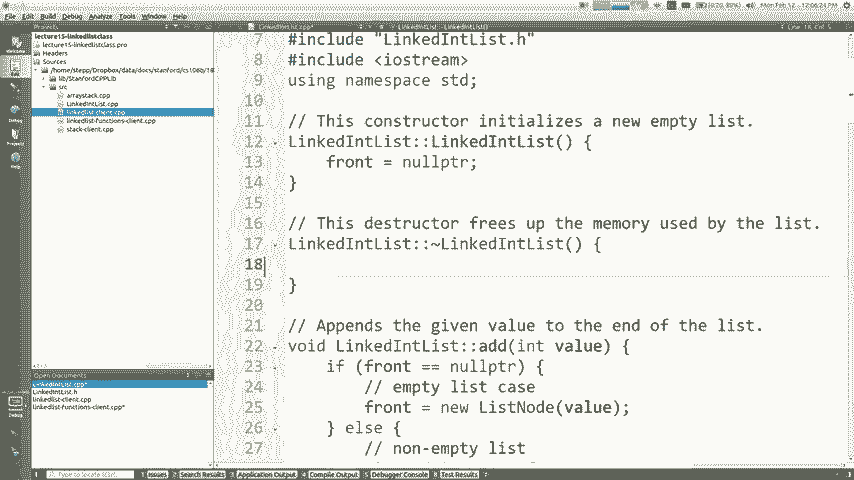

所有的指针，所有的节点，我都有这个节点链，我有三个， ，在这里，我必须释放所有这三个节点，所以让我告诉你一些事情，那将是不够的一件事将是不够的。

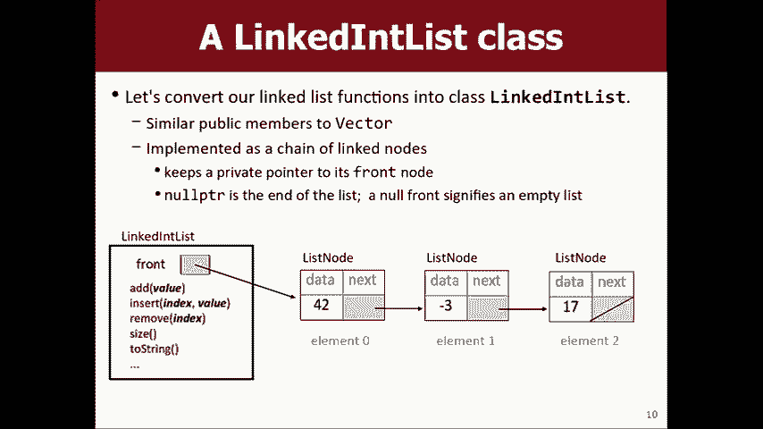

说哦，我必须清空列表，好吧，前面的磨牙等于，清空列表的等价内容，但这并不能满足。

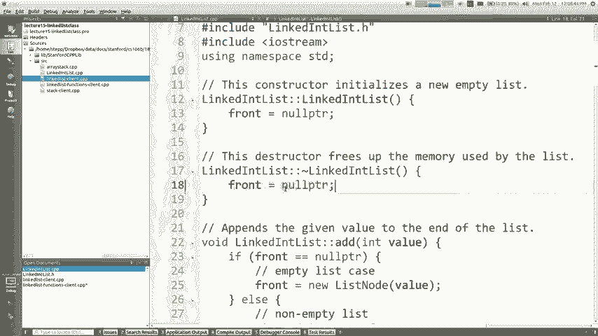

释放所有这些节点的析构函数。

另一件事是不够的，那就是说不，那不是，他想从线索中删除他是如何释放内存的地方，这个更好，但是这个相同的删除前面怎么了，是的。

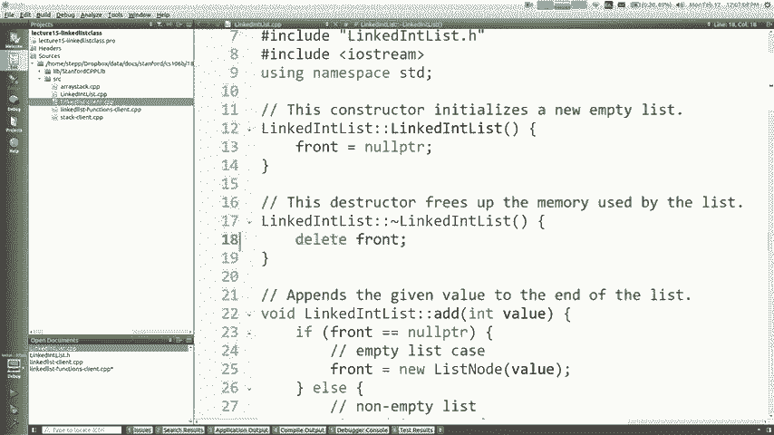

转到指针指向的对象，并释放该对象的，内存有什么问题，它不会删除所有剩余的面团，没有像层叠一样，自动在这里，因为这是前面一周的时间，事情并不意味着它就在那里，您知道Domino的所有其他产品。

删除它们-我不需要写遍历列表删除的循环，每个节点都可以真正清理它，而我不会写正确的代码。

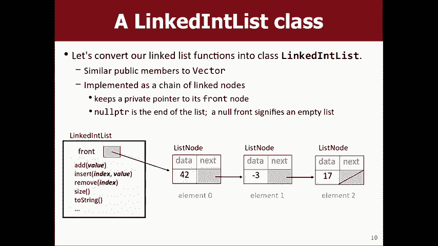

现在，因为我要您编写该代码，但这就是您需要做的事情，所以我想我想这不是假想的东西，作业5的人将集合作为类实施，其中一些有所提高，用于数据，其中一些具有用于数据的节点，因此您必须，基本上是做这种事情。

所以我想回答您可能遇到的任何问题，关于这样做是的，哦，您如何实现每个循环，是的，所以对于初学者来说，我现在不能在这里使用它，如果您想要的话，它将无法使用，为每个循环实施它，您必须了解一种称为，迭代器。

如果您好奇的话，我会为C ++ STL进行Google迭代器，有点太复杂了，我今天不想向您展示，您必须添加其他方法，如果您拥有这些方法，C ++将注意到并，它将允许您在代码上进行每个循环。

基本上您必须解释一下， C ++如何遍历集合的内容，而不是，非常辛苦，但是要花比我今天更多的时间谈论是的，你能，在结构中有一个析构函数，是的，你可以，如果结构体内部有指针字段，但通常我们不这样做。

通常结构通常很小，即使是像列表节点这样的结构，不喜欢你能想象一个列表节点的析构函数自动，转到下一个并删除它们也是我们不这样做的原因是，有时您拔出一个节点，然后想要摆脱它们，然后，糟糕。

他们在boo-boo-boo-boo-boo的路上杀死了许多其他节点，而你不是，你不想把它们全部炸掉，所以我们主要在，该级别在类中而不是在列表节点结构中，因为其他任何级别，关于这个的问题。

我只是把整堆随机的东西都弄碎了，今天在你身上，我只是想填补你需要的所有零散的东西，知道要实现这些收集类有关此问题的任何其他问题，是，哦，朋友关键字yeah II并没有提到，但嗯，有一个关键字，叫朋友。

如果你声明这个过载，我曾经很简短地提到过，如果您声明该操作符，则该操作符将打印出您知道的列表，操作员使用“朋友”一词表示允许该操作员查看，列表的私有变量，所以如果我去执行那个运算符。

您会看到它指的是列表的最前面，它是允许的，之所以这样做，是因为它是班上的朋友，即使我们不是，也不会，现在可以看到它了，您可能会说稍等一下Marty ，在进行数组堆栈操作时您没有谈论朋友，这是因为。

在数组堆栈中，操作员无需查看任何私有内容，如果我有单独的方法，请调用public to string方法来获取输出，想看一下元素数组，我想把它变成一个，朋友，以及我要给你的任务，我将宣告所有，标题给你。

我会把朋友放在里面，让你看看，我们谈论的私人事物有点像“受益者之友” ，正确的关键字，看看对方的私密事物，是的，就像是FM ，其他版本的友谊，你可能会说我不知道​​你在做什么，不是吗，不是那种化妆会议。

一次我下班回家，不小心走了，当我想勉强避免， FM otq的引力，我就像哦，那将是一个，丑闻，尽管我不小心走了，嘿，每个人都在做什么，我还有更多的东西想在完成之前告诉你我想谈。

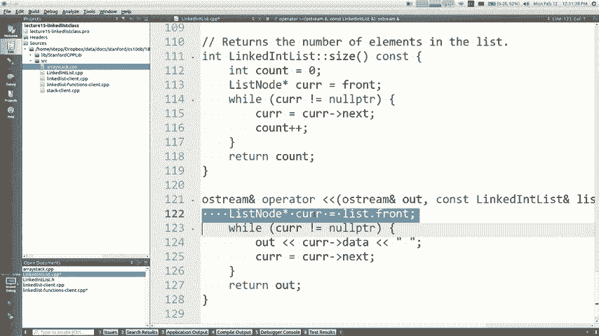

关于现在的事情我如何谈论一种称为，优先队列，您可能会说到底，怎么可能，在10分钟内向我介绍这个问题，我认为我不会尝试，可以在10分钟内帮助您掌握这一点，是的，我希望您能想到，关于这项工作。

所以我要介绍一下，这个概念给你，你需要从那里接受它，因此，这是简短的，这是故意的，您可能需要执行某些任务，在想要优先排序的地方工作，您有一台打印机，通常，打印作业按进来的顺序打印，但某些人除外。

更重要的是，如果一位教授打印一份工作，排在所有人前面，学生或类似的东西可能有一个急诊室，排队，需要治疗非常非常痛苦的病人，他们生病了，正在受伤，他们需要帮助，但您知道，因此通常您会先处理人员，首先服役。

但如果更重要的人出现，他们正在流血，他们迫在眉睫情况危急，要在人们面前排成一列，谁有嗅探声或其他什么，如果您是，要在代码中建模这些东西，您需要一些概念，优先级基本上是具有紧急优先级的提示，因此操作。

神奇的提示会很好，那就是能够添加新的人到，线和从线中拔出最紧急人员的能力，因此，可以处理他们，您总是会处理最紧急的人，在该行的列表中，如果要执行此操作，则有一个ADT，有一个数据。

 type作为适合您的集合类型，称为优先级队列优先级，队列具有以下操作，您可以在队列中想到它开始像，普通队列，您可以在队列中，您可以DQ，您可以达到峰值，但您讨厌什么，您传递的优先级有点不直观。

可能会更低，优先级更高的是直觉领域，例如，对我的课程工作人员来说非常重要，因此您可以添加基本，优先，然后以某种方式将可爱的故事写成一个故事，找出优先级最低的最紧急事件，因此在此示例中。

 2作为最低的定居点退出这个词，如果你还好，那是，该集合中存在的事物存在于我们的库中，你甚至可以使用它叫做pqh你的问题是什么，是的，这是优先级队列类，数字，因为它的优先级会出现。

所以埃里克会在马蒂之前出现，如果我，添加了另一个优先级为3的优先级，该优先级将排在第二， Eric等了解结构并不复杂，我不认为您是否已经使用过其他ATP（例如队列和地图）以及，这些事情。

所以我不期望这会非常困难，让你理解，我希望我已经解释了一些背景，你会，想要这样的事情，真正的问题是是否必须实施，如果你必须做一个经典的东西，这个东西已经不存在了，你有，从头开始编写它。

您将如何在内部实现它，存储这件事的数据，这实际上就是您的作业，分配是我希望您实现两种类似的方法，因此，让我们快速讨论一下可以实现此功能的一些方法，可以将其存储在数组或向量中，就像我们对堆栈所做的那样。

无论何时排序，如果它们未排序，您能做的就是，只是添加到末尾，而不考虑优先级，最后可以，通过遍历事物的DQ寻找优先级最低的事物，数字30现在我们要移动并返回该数字，如果这是您的结构，如果存储排序。

添加速度很快而删除速度很慢，当有新病人进来时，您会优先考虑将您留在狭窄的地方，病人出来时的排序顺序谁出来哪个元素，如果PQ排在最低位置-谢谢，斯巴达好射线就是那个，会出来的总是他们-我需要开始看到。

所以这是两种方式，你可以实现这是一个未排序或排序的数组/胜利者，你也可以，使用未排序或已排序的链表（如果未排序），只需将其添加到，框架或和（或）在任何地方（如果已排序），您必须遍历并找到合适的。

并在正确的位置插入它们以保持排序顺序正确，这些更好，我的意思是，这取决于您要优化的内容，但我希望您能看到所有未排序的排序数组链接列表全部，这些组合中的四个都有特定的操作，这些操作确实很慢。

它们都有一些操作，您必须遍历整个列表，寻找跨元素的东西循环以使它们正确地移动，我们谈论，作为n的大O，因为您只需要查看n的所有内容，向量正确，所以这些结构都有其缺点，看起来，比任何一个都更好的答案。

这是一个特殊的结构，所谓的堆，堆只是您以特定方式使用的数组，如果，您正在使用堆，您会想到每个元素都有父母和孩子，父母在Packer索引中，孩子在索引中倍增，在， index plus y这只是一个概念。

只是一个想法，为什么您会想到这个，之所以这样，是因为如果您将数组排序为quote-unquote，这样父母会更多，比他们的孩子更紧急的这个结构对于，建立一个优先队列，当您向PQ添加一些东西时该怎么做。

你把它放在最后但现在已经坏了，因为它有优先级，所以它应该更接近起点，因此，您要如何使用swap进行交换？ ，为了送给父母三岁，比三岁有更紧急的优先权，所以你交换它释放了这一对，紧急优先级比一个优先级高。

因此您交换它就可以交换索引剩余的点，结束索引，结束索引，直到到达正确的位置，如果您要删除自己，则对那些父母的排序顺序也一样，取出第一个元素，然后将最后一个元素换掉，所以你让孩子和孩子在一起两次。

直到顺序正确，这听起来像是一堆复杂的事情， mumbo-jumbo，但是如果您执行此行为，您将发现，从此结构添加和删除所有日志和运行时间都很大。

因为如果您跳跃的次数是两倍两倍如果您跳跃的次数是/二/- ，这些是输入大小的对数二，所以这是一个很好的平衡运行，该东西的核心操作时间，它也具有不错的属性，最紧迫的要素需要首先出现的要素。

您想偷看或删除的地方是它在哪里看，在开始的时候，最低的索引就是索引1，所以这是一个，真正聪明的小技巧来实现这一点，这不是和DC的107末日分配（称为Heep分配器）不同，那不是你的另一回事。

我们能够使你实现，你要做的功课是我要你实现一个，优先级队列使用2004 griefer，同时使用未排序的数组，因此，这第一件事是未排序的数组，第二种样式是排序的链表，底部是第一个。

第三个是使用这个奇怪的父子垂直命令，堆结构，我知道我很快就闪过了，因为这就是全部，在规范中有很多详细信息，我希望您考虑一下并阅读它。

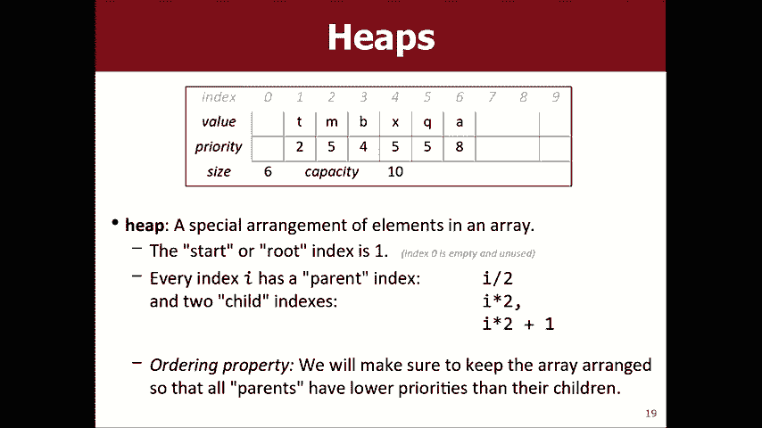