# 【斯坦福大学】CS106B C++中的抽象编程 · 2018年冬（完结·中英字幕·机翻） - P1：【Lecture 01】CS106B Programming Abstractions in C++ Win 2018 - 鬼谷良师 - BV1G7411k7jG

 [音乐] ，很多人在学校的第一天都不知道，我会尽量去，尽我所能，然后再上半节课，我会尝试教，一点编程的东西好吧那是我没有论文的计划，你们的讲义我只打印考试，所以我什至不打印，第一天的课程提纲。

或者如果您想获得文档的话，可以在这里获取，该课程的网站是CS 106 B点stanford。edu，如果您忘记了该信息，或者，如果您在Google上丢了它，那是第一击，所以很难错过所有。

我们每天要做的事情是，我使用的电灯，我写的讲义，讲义，家庭作业等程序，我上课后可以在课后立即发布内容吗？ ，本演示文稿本讲座作为视频始终是第一名，问题是关于视频的讲座，答案有点像他们不在，好视频。

例如我正在运行一个程序来捕获屏幕并进行录制，计算机的内置麦克风，它可以捕捉演讲，我会在每次演讲后张贴这些，但是您不会看到我的，微笑的脸，只有当我站立时，您才会看到这样的屏幕和音频，那里很难听到我的声音。

所以声音有些虚幻，所以在那里，是糟糕的视频，但您知道是否必须在这里和那里错过讲座，您可以看着那些人尝试追赶，这也是我的答案，无法保证您每场讲座都会有一个视频，因为，有时我的计算机崩溃了。

我丢失了试图记录的文件，因此，无论如何，我会尽力为你们录制这些视频，我今天认为最重要的事情是该URL指出了如何进入，课堂网站，如果您现在想跟着我走，您可以去那里。

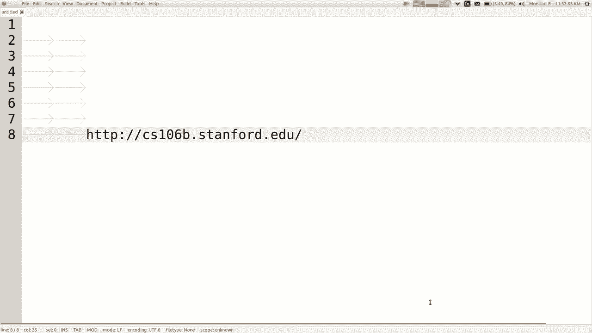

使用您的浏览器，所以今天我要打开第一张幻灯片，我将浏览一堆有关我们详细信息的信息，课程信息讲义，所以如果您去我们的课程信息讲义，网站，如果您单击讲义链接，您将获得所有内容。

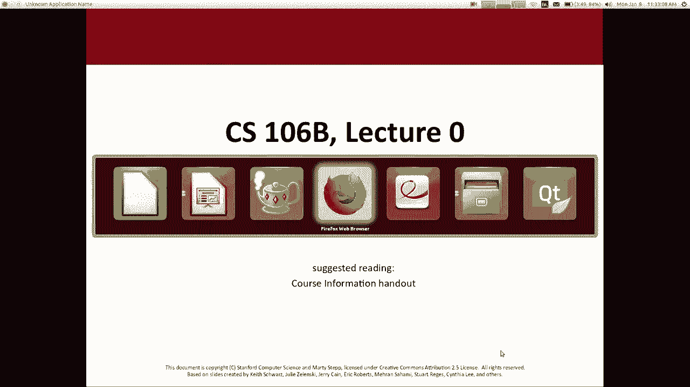

这些文件可能有用，我认为您应该通读一些，这些今天下课后，所以这是关于我的一些一般情况。

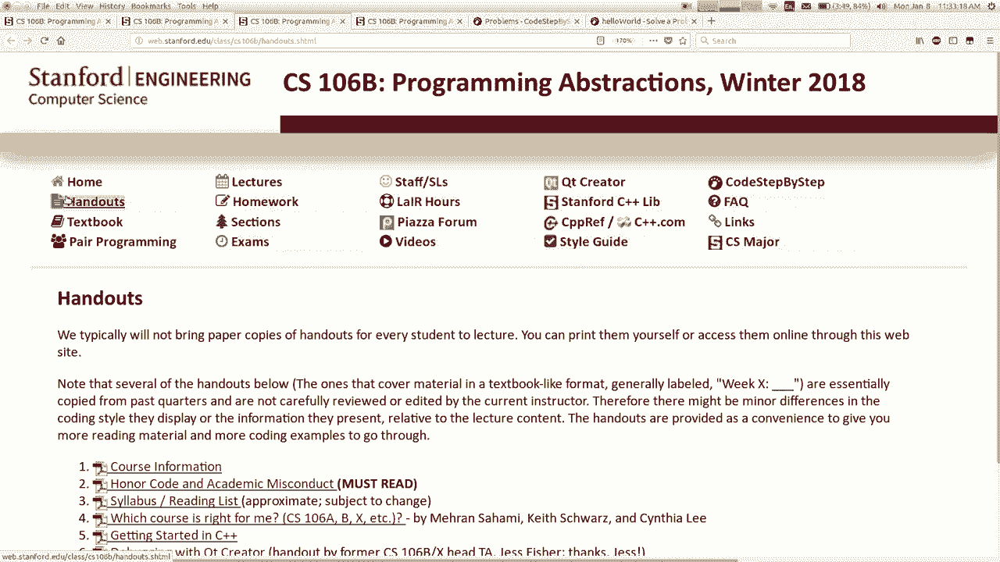

关于这个课程，我的名字再次是Martita，我的电子邮件是step @cs ， stanford。edu我有两个出色的助教，他们将，帮助您主持他们是艾米和阿什利的演出。

克里斯蒂娜（Christina）甚至放弃了每个人的上诉，他们将做很多事情，努力使事情继续下去，他们不知道自己在做什么，哈哈哈，因为我格外懒惰，霸气拳击的头，关于我的一点点。

我从2013年开始在斯坦福大学工作，我是西雅图的华盛顿大学的老师，来自华盛顿州的种种提醒您今天不在，嗯，你以为你摆脱了那种胡扯，不时地搬到这里，去海湾地区的西雅图日吧，是的，我还有什么呢？ ，很多动物。

如果你来上课，我有三只狗和两只猫，我知道你，你们讨厌上课，如果您来上课，我会给您看我的照片，我要提供的狗只这是我的狗的照片。

棕色的一个放屁，黑色的一个安静，我们把他们放在一起，暗示你们如果真的很好，我会告诉您我录制的视频，他们中的所有第一次见面可能会融化你，这真的很可爱，所以，是的，我只需要提供小狗图片和/或小狗视频。

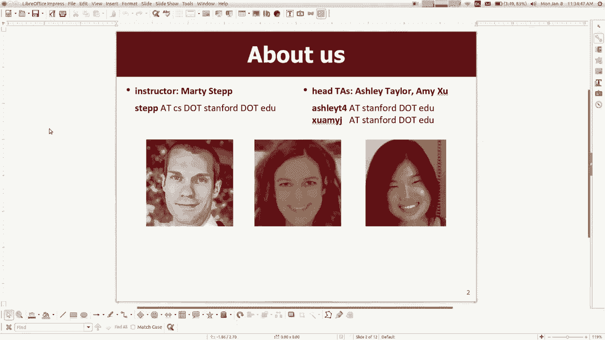

我的消息是，我很高兴宣布我的妻子，并期待我们，第一个孩子在二月底，所以将在本季度末，对我来说真的很有趣，我们非常忙，这就是我对这两点的看法， TAS会做很多工作，它们会在我工作时保持某种状态。

逃跑成为爸爸之类的东西，是的，那就是我。

所以除了第二个课程外，还可以对课程进行一些了解，你们中的许多人在snooper right mara拍了108八十，你们发现比玛拉·梅隆还糟的地方很有趣，而且很好，他说，很酷的事情。

例如城市生活或他说的在食物上扔东西，你我什么都不做，除了发誓很多而且养狗是我的全部，感到抱歉，但无论如何，科长将弥补这一点，因为他们会帮助您了解我们的部门负责人，如果您花了106 。

这些是最近上课的本科生，他们将每周运行一次，讨论部分，就像106a，您每周一次与他们会面50 ，由10至12名学生组成的小组中的几分钟，您将练习，问题，您将获得参与这些部分的积分，虽然我希望你能来。

但不必参加这些讲座，给了要去的部分的分数，所以你应该参加那些部分，下周开始，本周无节，将有一个在线链接，上升，我相信在星期四您会告诉我们您什么时候有空，然后我们将您分配到讨论部分，以便您获得。

本周末我发来的消息提醒您要这样做，所以是的，领导者做了很多事情，以保持这门课程在106的实力，程序我很高兴与他们一起工作，好了，这是组长停下来的，我随时都可以问一个问题。

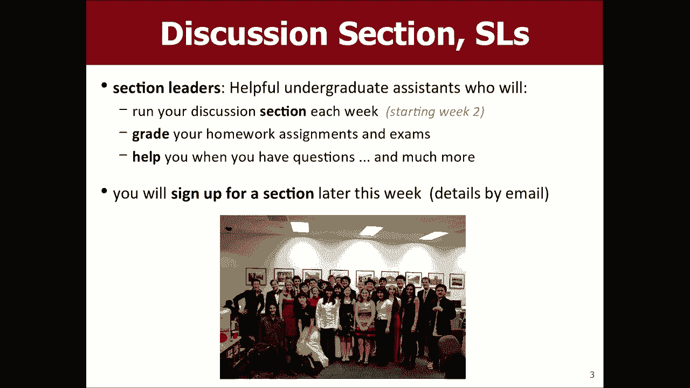

很多人会在106年初问你，知道我在正确的课程中吗，这对我来说是正确的课程，你知道吗，这取决于你，但我所能做的就是告诉你这些，当然是，我认为这取决于您确定哪个是最好的，因为您知道如果您已经拿过106 A。

那么您可能就在右边，如果您尚未编程，那么您知道的地方是106 a。 ，应该假设在106 a 106 B之后，我假设您知道，如果语句松散的方法，诸如变量和数据类型等基本信息，如果不这样做。

参数将返回数组或数据结构对象类，知道我刚才所说的大部分话也许你应该是106a ，我们将在所有这些基础上，我们将切换编程语言106a ，是用Java讲授的，我们将使用一种叫做c ++的语言。

为什么我们以后要这样做，但无论如何我们都要谈论更多有关数据的问题， ，关于算法如何处理大量数据我认为这是课程，确实使您能够解决非常复杂的有趣问题， ，我们做的很多事情最终都变成了面试问题的饲料。

以后再实习，希望能对你们有帮助， 106 X是我们的其他产品，它基本上是106 B的较硬版本，通常适合那些在上大学之前已经编程很多的人，刚好对106 a和B的速度感到无聊的人，他们想要，真正的经验丰富。

遇到了更多的问题和挑战，而且，想要和一群志趣相投的人在一起，一起挑战吧，所以你知道B是大多数人对普通人而言的班级，斯坦福大学人口，而X是该子集的先验条件， ，因此，如果您想知道哪个课程适合您，您仍然。

觉得您没有足够的信息来回答我的建议。

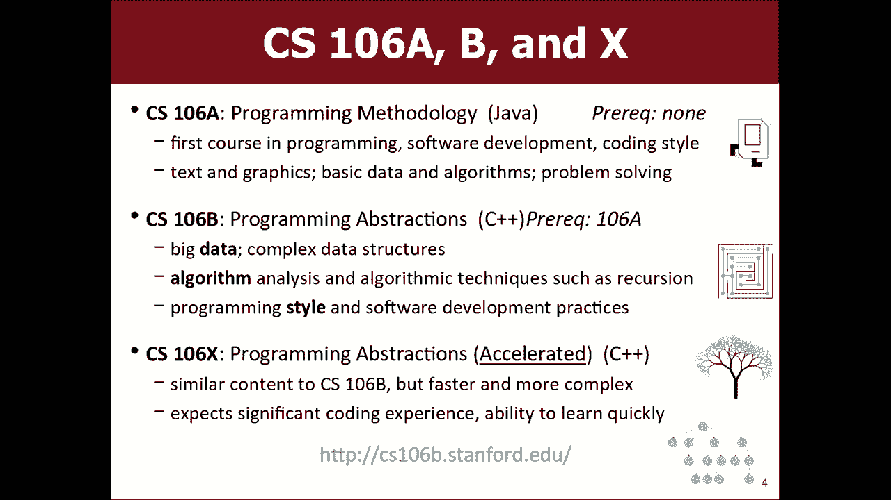

会去班级网站，我不知道我的互联网是否在这里工作，但是，如果您单击FAQ常见问题，糟糕，如果您要在有，工作的互联网，您会在常见问题中看到第一个问题，问题页面是哪个课程最适合我，而且还有更多内容。

这是一个信息，您可以单击以转到上一季度的网站，看一下他们解决的一些问题，可能会帮助您了解，就像这些问题对我来说看起来很难还是容易，可能会帮助我知道如何，看完所有内容后再放下自己，如果您仍有疑问，可以。

在TAS中给我发电子邮件询问该问题，但总的来说就像是您中的所有400位还是，不管给我们发送多少电子邮件，我都鼓励您看一下，寄给我们您有关此问题的问题之前，是的。

我本季度在课堂上的快速讲话，我相信106 X班，特别之处在于他们将专注于研究和，在我们部门的领域中完成的工作听起来很酷，是的，你们对这些课程有任何疑问吗？ ，到目前为止还没有涵盖，这里从来没有编程的人。

没有人敢于提出，他们的手好吧，嗯，有人会从我这里拿走106A嘿，嘿，嘿，看看有多少，人们回来的更多，您是否看到有三个人，他们，都哭了，是的，这是我唯一可以看到的季度，再次，嗯，是的。

还有一个叫做106 L的类，单元实验室课程位于106 B一侧，在此您可以更深入地了解C ++ ，我提到的语言我们将使用C ++作为我们要使用的语言，本课程中的程序，但我们不会尝试深入了解，整个语言。

我们将要学习尽可能多的语言来解决，我们要解决的问题106 L确实专注于该语言，例如，想要说我对C ++知道很多，那么您想学习106 l ，因此，如果您对该课程感兴趣，则可能要转到他们的网页CS 。

 106 l dot stanford。edu可以了解更多信息，或者您可以联系， Mele的老师会回答您的问题，我可能只会来，星期三也要简短地谈谈106 L，所以请检查一下，认为C ++听起来不错。

所以关于该类的更多信息，教科书，它被称为C ++中的编程抽象，埃里克·罗伯茨（Eric Roberts）教授，我们系退休荣誉教授， ，你知道这是斯坦福大学的人为这门课程写的。

不会成为那些与全班无关的书之一，您有时必须购买的材料说我不会，曾经为您分配任何直接需要解决的家庭作业问题，从技术上讲，可以完成课程并获得A +或，无论您想买什么书而不买书，我仍然认为您可能会，想购买它。

因为您可以在考试中使用这本书，这是开放的，考试是封闭式笔记，所以您只能带走这本书，这样可能会有所帮助，您作为考试的参考，我确实在考试期间带来了一些借阅人副本，考试，但你们当中有很多人，而且您将拥有副本。

因此很难，在没有本书的副本的情况下获得所需的参考，我的建议是要么购买一个，要么找到一种方法来访问您，需要它的是在班级网站上免费提供该书的PDF版本，但，我不会让您将任何计算设备带到期中， ，期末考试。

因此您不能将其用作考试参考，可以在其余时间使用，当然可以，所以我的目标是让您说服我这很有用，但我，如果您认为自己不能，也不想让您感到被迫购买，负担得起或不认为这会帮助您质疑我不允许这样做，但。

我这样做的原因是因为我喜欢给你很多练习，我想给您测试前的问题，然后再进行真正的测试，这些问题实际上与练习问题非常相似，因此，如果您，练习和学习很多，您应该完全准备好将其实际，测试。

但是如果我让您将所有这些实践测试都带进去，那么它就是真正的测试，太容易了，所以我基本上不让你带这些笔记和论文，和东西，以便进行这样的考试，所以这就是为什么我要，政策，但是可以。

如果您想在测试中购买这本书，则必须购买，我见过的那些尝试写缩微胶片的小笔记的人，用放大镜将所有讲义记在页边或，随便什么，我想你可以有一些普通的笔记，但不要尝试，用小字体和空白或其他内容重写所有学习材料。

是的，但是您可以注释您的副本，是的，其他任何书本问题，是的，我确实在测试的背面给出了一种基本的参考表，您可能要调用的一些常用方法和其他东西，所以我的意思是，如果您不记得通常需要的某个功能的名称，则可以。

在参考表上得到它，但是对于像，这个概念有点模糊或没错，所以这是本书，作业很像106a，我们这个季度有七个作业，大约一个星期或一个星期的时间，我们将要进行另一场讲座，如果需要，可以进行编程。

之后再与可选伙伴合作，一次我可能想个人化的任务，其余的将成为，允许的作业对的评分与您拥有，功能得分是您的程序行为正确且具有风格，得分是因为您的代码以简洁的方式优雅地编写，因此如果，您在这里花了106磅。

应该非常熟悉，我们也有这个水桶，就像106a这样的评分系统，我们是一个很好的程序，它将获得满分，称为检查，加上需要改进的相当不错的程序，我们得到了标记隐匿性检查，并且需要大量工作的程序也获得了标记。

称为支票-在极端情况下，我们很少提供其他一些标记，大多数学生会统计地获得支票或支票加分，而您的成绩会，每周安排一次，与您的部门负责人面谈，时间，然后你去和他们见面，然后你去看程序。

您做得好的事情您可以做得更好，所以所有这些都与106 a相同，我们，我认为这项政策要晚于106a ，相信你能做到，我们有三个让我检查我给了你多少，我忘记了，你会得到很多晚的日子，因为你得到了迟到的日子。

所以整个季度，我知道所有的八天都出现了坏话，直到现在为止，在该季度中您可以四次上交迟到的内容而不会受到任何处罚，这节课的迟到单元是一次讲座，就像，到期时间是星期三，而您在星期五的同一时间上交，则算是。

就像一个单位晚一天迟到，通常是转弯的惩罚，最近，您是从那些水桶中走了吗？ ，您从支票转到支票-等等，但是如果您还有这些晚的日子，他们缓冲您免受这些处罚，因此前四个此类处罚得到，免除。

所以您要么上交四件事，以后再讲两件事以后再讲两课等等你最多可以翻，最近有些事情要在这堂课上讲课，所以两天后伊莱克特拉，几天的迟到值得，无论有多少，我们什么都不接受，在您保留的这些较晚日期中。

这是我们的政策，应该很漂亮，你们与106a的通用系统几乎一样吗？ ，关于功课评分或最新政策，我会说这主要是我的宽大政策，就像您给我发送电子邮件并，你说我嗓子很痛，很难做功课，我可以给我一个扩展名。

我会说我已经给你了，四个灭绝使用其中之一，换句话说，除非您，严重无能为力，这是我要您在使用时使用的功能，当您的男朋友或女友或非二元朋友来访或您，知道是你的家人或成年礼拜拜你想周末去，不管你知道什么。

用它们来处理这些，极端情况下，我是否可以延长或延长到期日，除了这些还可以，所以成绩是由您加权的，家庭作业和科目参与度是您成绩的一半， ，考试算作另一半，在本季度末，我们将成绩映射到A ，和B和C等等。

您知道这有点令人困惑，因为我们，有那些检查和检查加号，学生总是想知道喜欢什么，是那些意思是支票加a是一种支票，这取决于如何，很多人拿到支票加号，还有多少人拿到我映射的支票，一季度末顺利进行，我尝试确保。

如果您赚了百分之九十，每个人至少都会发生以下情况，我会确保您在课程中获得的分数至少是零，和百分之八十，我将确保您得到至少B的负值，依此类推， ，实践我们真正要做的是，确保几乎一半的。

课程中的学生获得减分或更好的成绩是五十，大概百分之一的你们会得到一个范围，然后你们百分之三十，将进入B范围，然后其余20％散布，其他分数，所以你知道我的成绩我认为很多学生，当然关心成绩，你们是你们。

我一般都是高成就者，会说，无论如何我都认为我的年龄曲线比较宽大，我记得什么时候比这难一点，但是嘿，是我们通常将情况拟合为关于数学的任何问题的等级曲线，降级，我通常会说，大多数学生在该季度的某一点。

学生做得比他们想象的要好我有很多人来，对我说，他们说我应该放弃我不知道我得到检查的课程吗？ ，一项任务或其他任务，好像没有，他们可能会得到，例如b-plus或TA-他们正在考虑取消课程。

有时候我认为学生认为自己做得比他们差，如果你出现并把东西放进去做，你可能是灰色的。 ，尽力而为，您可能会在我们将要使用的软件方面做得很好，用来写作业的习惯叫做可爱的创造者。

一个人可以选择用来编写C ++程序的可能的编辑器，我会帮助您使用的唯一工具它会帮助您使用的唯一工具，如果您喜欢其他很棒的编辑器，但我不愿意帮助您，与其他编辑器无关。

我不在乎Xcode或Eclipse或Visual Studio ，或其他我不帮您解决的问题，因此，如果您想从事我们的工作， ，作业分配我强烈建议您安装此编辑器，您可以在计算机上安装此软件的方式是在。

班级网站的网页上写着可爱的创作者，我无法点击它，但是如果我可以单击它，它将有说明，如果您要，安装此程序，请按照我们的说明进行操作，不仅限于Google ，创建者并单击该链接，您应该单击我们的链接。

因为我们有，我们希望您执行一些额外的步骤，这将是一件很棒的事情，从现在到星期三之间将安装可爱的创作者，那么您将，准备为家庭作业动摇，当学生想开始时真可惜，作业1，但他们不能这样做。

因为他们的笔记本电脑不能正常工作，我们在第一个半周里遇到的问题是关于可爱的创作者没有，安装正确，所以我建议您尽快安装，您没有笔记本电脑，或者我无法使用笔记本电脑。

此软件提示创建器已安装在群集计算机中，因此您可以使用，即使在那里结对工作，每个人也都必须安装它，我希望每个人都进行设置，也就是说，如果您需要帮助，这是一个，富有挑战性的课程不如X难，但是如果您需要帮助。

仍然具有挑战性，我们很乐意为您提供帮助，我的意思是那是我们将提供给我们的模特儿展位，您是一个艰苦的班级，但您知道如何提供帮助，而获得帮助的主要手段是，部门负责人，在我们实验室里，这就是所谓的巢穴。

在Tressidder的一楼，我们在周日晚上接管，直到下周四开始的星期四，他们还没有开放，但是他们会在那里，部门负责人会在那里帮助他们完成作业我会帮助您，与您的创作者一起为您提供所需的丰富资源， 。

作业要交的前一天晚上有点忙，所以有时你会知道，您想早一点走，但这取决于您，我们还有其他资源，有一个消息论坛，一个广场论坛，您可以在课程上的链接上发布，您可以访问我的办公时间或两个TAS办公时间的网站。

向其他人发送电子邮件，我们可以提供很多代码和资料，像是书，讲义幻灯片和讲义之类的东西，所以很多，如果需要的话，您可以做些什么来获得帮助，我说的都是，谈论您不应该寻求帮助的方式的前言。

与此荣誉代码有关的荣誉代码基本上意味着我相信你们，会很好，不会窃，不会欺骗别人，你相信我会，对待你像大人一样回报我，我想我只是说了两个，相信你们会变得很好，并且相信我会像成年人一样对待您。

所以我仍然知道所以他们是对的，但不要作弊，这是我的荣幸，适用于该类的代码，这意味着请勿复制他人的作品，不要将您的解决方案提供给其他没有Google的人，并尝试找到，解决方案不要继续使用百度。

不要继续使用piratebay，不要在任何地方使用，如果您发现我怀疑他们在那里有我们的作业，无论如何不要向俄国人寻求帮助没人听，就像今天在这里的人群中滑倒嗯，看起来不要从事不是您的工作，仅此而已。

如果您需要帮助，我们会为您提供帮助，但是如果您遇到困难，就会被问到，我们寻求帮助不要在互联网上搜索和复制某人的代码，好吗，是的，我运行的软件会检查自您以来已提交的每个程序，出生在这里。

我们能够找到的每个程序，互联网，我们非常擅长在互联网上寻找程序，因此，如果您从某个地方复制，则可能在此软件中检测到了，因此，请不要这样做，我不希望您这样做，有些人担心错误，积极的想法是。

如果我碰巧写了一些类似于，别人的东西是这个东西会错误地标记我，并指责我我希望，说不要担心软件不是我们决定看的决定者，软件建议，我们选择其中的一部分，我们不选择，看起来有点相似或偶然的事情，相似性。

我们只选择公然复制的内容，有时，就像你将她的名字放在文件顶部一样，当你把它们扔掉的时候，你忘了更改名称，或者就像从字面上看，字符的字符与Google首次点击时完全相同的代码。

家庭作业或其他通常不指责这些的，车牌此政策可能不会影响到您中的99％，但是有，房间里某个会成为我的人我不认为这是一个邪恶的人，就像某个会被卡住的人，他们会说我不知道，我不能对此取零。

他们会用谷歌搜索并复制它，进去，然后我要给他们打个电话，他们会不好的。 ，结果，因此如果您遇到困难，请记住其他方式寻求帮助，您可以成对工作，完成大部分任务，因此，如果遇到困难，为什么不。

您会找到一个合作伙伴，我会帮助您找到可以与某人一起工作的合作伙伴，你们两个人可能认为还可以，您是否有任何疑问，这个荣誉代码的东西如何适用于您我们将如何执行它，我们在这门课程中对您的期望是。

您的伴侣是否必须与您位于同一部分，我认为是的，不是吗，那是我们要求的，如果您说的很好，但他们不好，那么我们可以移动您，以便您与我们通常位于同一部分，想要和那个人一起工作，我们通常可以使那个工作。

一些限制我鼓励你成为课程信息讲义的一个限制，是你们中的一个人通过/失败，另一个人是我们两个人都不工作，在一起，您必须位于同一部分，但除此之外，您还可以，您可以在提交报名时选择自己的合作伙伴。

您的喜好可以告诉我们，我真的很想和您一样，乔，因为我们想一起工作，我们将尽力容纳，好的，我认为这是我的全部政策要点，我没有完成演讲，但，那是我的政策问题你们对班级还有其他疑问吗，到目前为止。

我对我所说的任何事情都是，我的狗知道我也养了两只猫，但是我们不会讨论它们，我妻子怀孕时发现这篇文章说你应该，避免使用诸如垃圾箱之类的污染源，所以我必须清理该死的垃圾。 ，连续九个月的包装箱现在来了。

如果有人可以找到，那是怎么回事，我的页面上写着，怀孕时可以清理垃圾箱，我会，如果您以这种方式给我发电子邮件，会给您很多额外的信誉，是的，这很酷，我不认为您在口头上倒数第二，是的。

有时候一个人确实抄袭了另一个学生的东西，在他们的信用卡上喝咖啡，我看不到，我也不想，失败了，如果您可以给您的部门负责人发电子邮件并说我的作业， ，提交我想撤回它我不想让你阅读它我希望你，扔出去。

毫无疑问，我们做到了，我们，会做任何事情都有很多原因，您可能想这样做，没什么大不了的，是的，你知道你的名字叫日期可能是正确的，机会问题，如果您撤消作业，则没有提交，因此您，确实得到了一个零，这不是很好。

但是总比弄破这种情况好，是的，所以不是没有后果，但是比，替代方案最初将重新开始并写出有效的解决方案，是的，您知道要小心，不要在您之前用过谷歌的坏东西，当然，我当然不希望你们感到被迫做错了。

我想给你帮助的事我想给你灵活性，做正确的事，好吧，我可以教你们一些C ++ ， [音乐]我不知道精力不多，你们想学习一些C ++吗，是的，我听到了很多您在看的东西。

就是那个黑色的镜子，我来看看那个好的第四季。

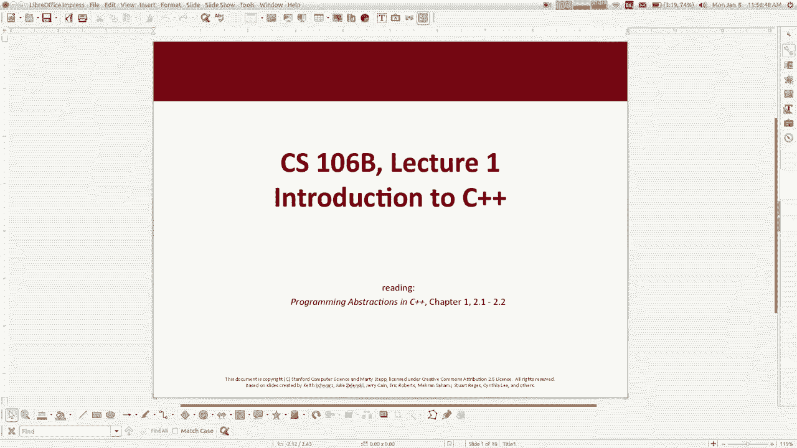

很好，让我们做一点C ++，剩下大约20分钟，嗯，这来自你，我会经常在讲座中提到阅读。

日历，我们有一个每天做的日历，那是什么，你知道我会提到我们正在做的与我相关的任何阅读，提一下，如果我正在编写任何代码，我将提供一个链接。 ，有一个可以下载的压缩文件，今天已经全部下载了，我也有这个。

逐步以代码命名的网站hahaha，以我自己的名字命名，您可以在那里做，在那里练习问题并获得答案，所以我将讨论该工具。

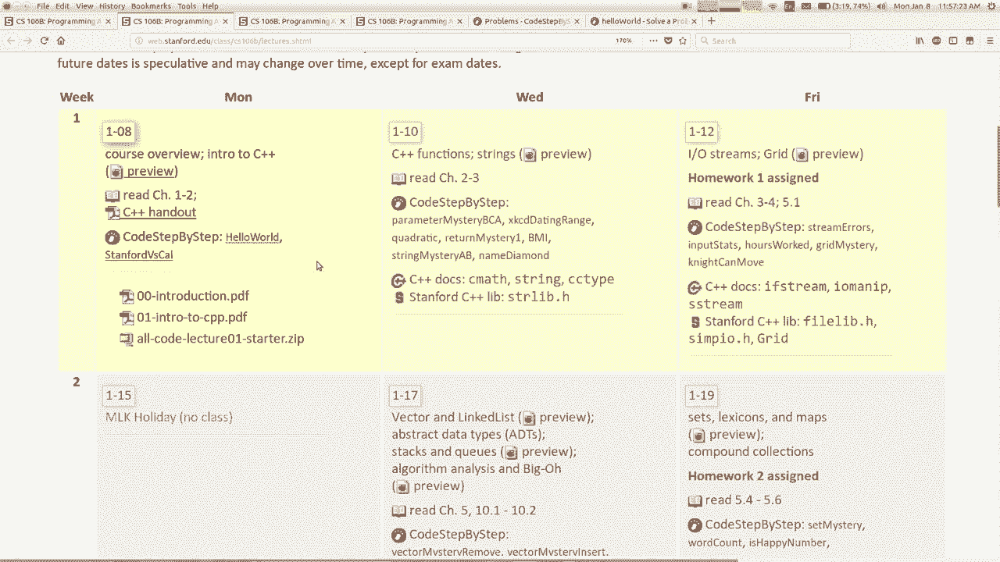

以后我今天没有很多时间，但是无论如何，这是C ++入门书的第一章和第二章， C ++自1983年问世以来，它是作为系统编程而构建的，语言，这意味着它与硬件非常接近，非常适合编写操作。

系统和设备驱动程序以及与计算机硬件接近的事物，您知道的游戏需要很多图形性能的东西，今天它被用于各种事物它是世界上最受欢迎的之一，语言这周我没看过，但在前五名或，世界上六种编程语言，尽管您所知道的几乎与。

我在某些方面与Java非常相似，所以如果您花了106八，在这里，您将学习Java，其中很多东西应该是相当熟悉的， ，您可能来自Jerry Payne的JavaScript版本。 ，从该类中可以看出。

C ++与JavaScript的不同之处在于，来自Java有时我会说这就像Java中的某某某样， ，说我不知道​​那是什么，但你知道只要忽略那一部分，也许我会尝试一下偶尔的骨头，然后说说它的感觉。

大家都应该喜欢的JavaScript，您应该了解它的编程基础，对您来说太糟糕了，我将向他展示很多东西，您应该看起来相当熟悉，所以这里是一个C ++程序，因此在，开始，我有一个绿色注释。

语法与Java相同，并且， JavaScript，您知道哪些评论是对的，嗯，我，在顶部有两行说包括，使用它们就像，在Java中被称为import语句，基本上是您想要链接到，库，您要与之交互的其他代码源。

请在一分钟内更详细地了解这些作品，如果您拿了106 ，用Java写过main之前，这是一段代码，一个函数，运行执行您的程序，我不知道他们做了什么，他们做了一个主要的，功能。

并在JavaScript版本中进行了解释，它们的主要功能是，收集运行或为使程序正常运行而编写的内容是什么，好吧，是的，它基本上与运行或主运行相同，有一个特殊的，那就是你的程序，那是程序开始运行的地方。

它被称为main you C ++程序，它只是打印出一条消息，说你好，游戏机上的游戏世界，我将仅讨论所有这些不同的部分，一秒钟，但这就是我们的第一个程序，您可以将其保存在文件中，带有点CPP的扩展名。

但这是用于C ++程序的文件，因此当，您有时在CPP文件中编写C ++代码，有时是多个文件，您有这些称为头文件H的额外文件，我们稍后会讨论，编译程序，您将获得这些称为ohio的输出文件。

 Java中的目标文件，当您编译程序时会得到什么，文件，您得到了什么，您从点Java进入了jar，获得了doc类，所以在C ++中关闭um会得到这个点o文件，然后可以将点o文件，进入可执行文件。

该文件在Windows上具有其他操作扩展名exe ，系统完全没有扩展，完全是C ++程序，二进制，版本您获得的编译版本只能在该操作系统上运行，编译程序时可以发送到的Java版本， Mac。

Linux或烤面包机之类的东西，它将在任何东西上运行，如果要在C ++上运行，它是C ++中已编译代码的Sadie版本，其他平台，您必须获取源代码并将其放在每个平台上，这些平台并重新编译以使其正常工作。

您可能会说那就是，不好，我不喜欢这样，但是副作用之一是，版本可以针对该平台进行非常优化，因此这是一件好事， ，不好的事情是，如果您使用的是JavaScript，那么您并不总是真正地编译自己的，程序。

您只需编写它，然后运行它，所以这是一个步骤，如果您使用JavaScript，可能做的不多，但必须显式，将您的源代码转换为可以执行的二进制形式，如果您有一个编译进度过程将是您可能会看到错误的地方。

法律语法之类的东西就可以了，所以这是我所说的主要功能，关于它是正确的，所以在JavaScript中您会说在Java中使用功能，会说公职人员占一定比例的我或类似的人，那在我之前的词是什么意思，是的。

有一个代表整数的变量，在这种情况下，编写该数据类型，因为我们将返回一个不等于，是的，我要从main中返回一个值可能没有多大意义，你们可能写了一些函数或方法来返回正确的结果，你为什么要从一个函数返回东西。

那能完成什么呢？ ，彼此之间，呼叫B和B希望将某件事发送回消息或，结果回到嘿，那是当您退货时，所以在该描述中，这将适用于Java或JavaScript，因此喜欢返回可能没有任何意义。

从我这里回来的东西是因为退出这些程序就像这些，正在返回的套件或实际退出发送到套件的代码，操作系统，我们不必担心它们，因为我们不需要它们，当然，我们始终还是会在我的最后写回零，正是这一行。

我们总是必须编写程序才能进行编译，不用担心int和return零，我们总是会说，每个程序我们都写这个法院好吗，所以这只是一些来自C ++的随机语法，是它与Java非常相似。

如果您来自JavaScript，则相当，类似，除了在声明变量时必须在Java和C ++中知道，用他们的数据类型场写，这样您，说出Java和C ++等语言中的类型，您必须说出类型，声明变量时的变量。

因此如果您说int x等于变量，计算得到的故事，那么X是一个整数变量double是一个实数，这个数字与另一个区别， JavaScript JavaScript所有数字只是Java和C ++中的数字类型。

英寸是整数，双精度数是带小数点的实数，拥有布尔值，你们还记得布尔值是对还是错，你为什么想要那种看起来没有太多不同的类型，价值观会重要吗，为什么你会，想要一个浮标是的，无论函数或方法如何。

都没有有人将它们称为ya逻辑，计算逻辑的东西，所以布尔值是用于记住的逻辑类型，不管是真还是假我在这里有四个循环，而在while循环中，这些与Java和JavaScript相同，这是。

调用看起来相似的函数，您可以写出，如果函数具有任何参数，则将括号放在函数中，括号内的参数每个语句用逗号分隔，因此，这是一个好消息，C ++的通用语法相当，相似，并且看起来大部分相似的Java并非巧合。

撕开C ++大约十年后，他们说你知道，什么是好语言C ++让我们复制一下，哈哈哈著名的遗言，所以这就是为什么它们非常相似，正确地来自类似的语言家族，让我们回到我跳过的程序中的某些语句。

上面有这个include语句，这与导入非常相似， Java中的语句，我不知道他们在106 AJ中叫什么，是否有， import语句或require语句，您可以加载库或其他内容，给你任何类似的声明。

或者你只是放了图书馆说文件夹，你们有图书馆吗，我已经看完了， JavaScript的人，他们已经生我的气了，我不知道，所以看看是否有一个，您的程序希望与您进行交互的提供的代码包括。

文件中的代码会导致该库，为include语句编写两种语法，一种是编写名称，如果您这样做的话，请在方括号内写的方括号内，意味着要链接到C ++编译器随附的系统库，如果，您执行其他语法时。

我们会在库名称周围加上引号，然后，如果这样做，您会在库名称的末尾阅读每个扩展名，这意味着您正在使用本地库，该库包含在您的小项目中，您正在努力，所以区别在于在这个过程中，我们有一堆。

我们将要使用的库写在Stanford上Stanford ，我们使用C ++库是因为它们有助于使此类简化一些，帮助平滑一些粗糙的边缘，帮助我们做一些很酷的事情，例如，图形动画或其他内容。

以及何时链接到我们的斯坦福图书馆，您将在语法中使用第二秒，但是当您链接到， C ++附带的语言的核心，我将使用第一个语法，这很令人困惑，好消息是大多数情况下我只会告诉你，解决特定问题需要包括什么。

而不必，太担心它了，这只是愚蠢的C ++事情，你会做的一件事，在学习本课程时发现我不太喜欢C ++，我会，不要害羞地告诉您有关C ++有两个的我不喜欢的事情，不同的形式是其中之一，但无论如何。

这就是你的方式，包括一个使事情变得更加混乱的库，还有这个，声明称为using语句，它基本上可以使它的名称，库可以在您的程序中访问，我认为这很混乱，因为大多数，语言在您包含，使用语句访问新程序的库，库。

您可以访问来自该库的名称，我的意思是简称，这里的版本是我们将要在所有程序中使用。

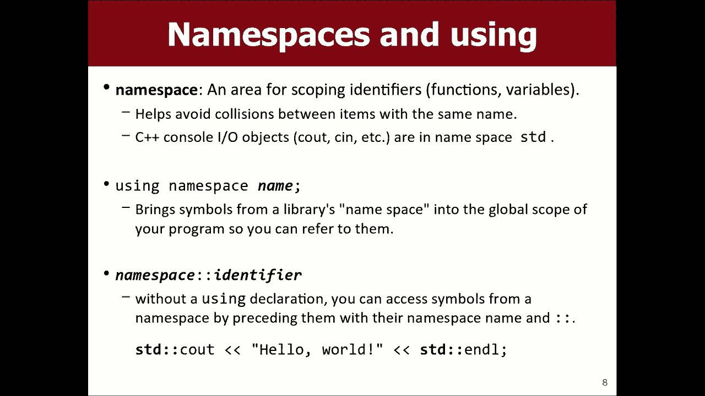

在此语句的顶部说使用命名空间标准，然后，基本上，这意味着所有变量，函数和事物，来自这个库或我想引用的任何库，我程序中的那些名字，所以不管这是什么， ，将进入我们程序的顶部。

以便我们可以访问我不喜欢的其他内容。

认为我在解释它方面做得很好，但是如果您不使用它，语句，您可以使用其他语法，但我不想使用，该替代语法，所以我现在要跳过它，我想谈谈输入，和输出，例如与第一种类型的控制台进行交互，我们通常要做的程序。

今天我们不在做Carol和C ++ ，我们只是在打印诸如印刷版等信息，您知道，如果您想将内容输出到控制台和C ++，请准备好C， ，输出对象，而您使用的这个对象少于我听说过的对象。

 wocka-wocka操作员或扬子鳄操作员创建一条消息给，控制台，如果您想串联并粘贴在一起的消息，例如，在此示例中，我采用了一个未在名为的幻灯片上声明的变量，年龄，我想在输出中插入该变量值以使其具有。

小商屏幕，然后您写另一个小于小于和，您编写了变量，然后您就知道该使用哪种语言继续，像Java和JavaScript一样，您如何将Apple粘合在一起？ ，以这种语言正确签名甚至比打印时少。

这样的事情现在也有，如果你打印这些，具有结果的东西，例如默认值，不会下降到下一行，如果您在Java中使用print land命令，则它会在每个命令之后移至下一行，呼叫，但是如果您不进行换行。

也可以在引号中写入/ n，但是， endl更好，因为它与不同的操作更兼容，系统和东西，所以你应该写内。

所以就像在这里，我有这个编辑器，这是Qt Creator软件，我不是，今天要花很多时间教大家有关这个软件的知识，我会写，时间，但我只是在这里没有太多时间，所以如果您使用此软件。

想要写像hello world这样的消息，有一个例子可以看到hello world ，并打开就意味着打印问候世界，然后转到该行的末尾，下一行，所以如果我想在这里插入变量，我可以。

就像你知道int年龄等于29岁，我可以说像Mar Marty的愿望，他是年龄感叹号Andale，所以就像我插入了，将该变量输入到我编译的输出中，如果您想使用很多热键，学习这些热键。

您可以像编译一个编译器一样进入这里，运行是控件R，所以如果您看到魔术发生，那是因为我正在使用，忍者热键和其他东西，因此如果使用ctrl R，它将运行一个程序并说“你好” ，世界马蒂希望他29岁。

所以我插入了那个的价值，变量正确，所以这只是基本的输入和输出内容，还有一个C 。

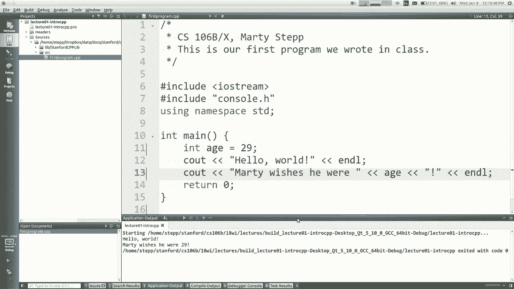

在C in中，就像您想询问用户要输入的内容，我认为在Java中会影响程序的某些内容称为换行符，或者，像这样的东西，我不知道他们做了什么JavaScript，也许他们有一个，相同的库JavaScript。

但是它将在程序中打印出来，所以我将显示。

您现在使用的方向相反，短吻鳄运算符而不是年龄等于29，您可以说C多大了，你问号，然后我可以说年龄在C，这是另一种方式，有点像是将值发送到该变量中，然后我可以说你，知道，是的，马蒂希望他年纪大了。

所以如果我运行此程序，它会打招呼，世界你今年几岁，我可以说你知道35是的，马蒂希望他， 35 38但无论如何，我会从视频中删掉那一部分，我想我不会告诉，除了嗯，任何人似乎都很好，您知道可以读取变量。

但是，当然会发生什么，如果您做错事，例如键入多大的年龄，你没有人跳舞，这是对的，马蒂希望，他为零，所以我做的我做的事情并没有做对，想要它也做，你知道它什么也没做，例如检查负数或其他类似的内容。

如果我键入，你知道你多大了38点二四六三，确切地说，它确实可以做到这一点，但是无论如何，这些都可以在命令中看到。

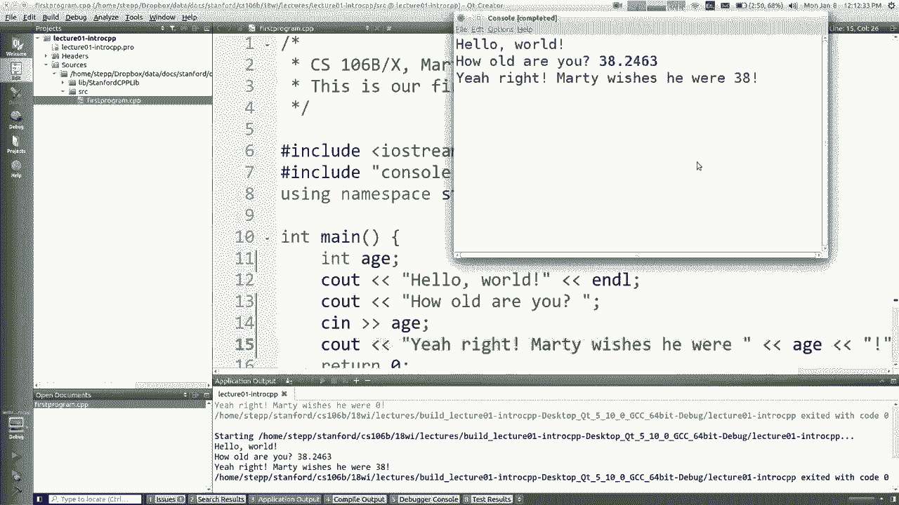

沮丧的是，我们认为您不应该使用它们，尤其是因为，我在其中输入字母的那段，这只是意味着您总是在，错误的事情，所以我们建议采用另一种方式来读取用户输入，即，使用我们的斯坦福图书馆之一，因此。

如果您包含此头程序，则称为，得到整数得到真实，我喜欢一个得到真实的人得到舞蹈，否则你不能，向用户询问这些问题，它将返回答案，关于什么很酷，它们是如果输入的内容无效，则会读取提示它们，例如。

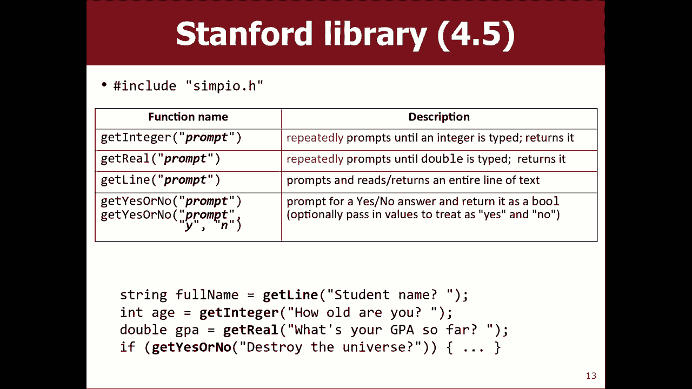

如果我回到这里，我说你是几岁，而不是这两个，我要做的是说int age equals得到整数你几岁了，就像，您传递字符串以提示他们进行打印，您知道我的意思了， ，那么我就不必再做CN了。

因为它隐式地做到了，我也不需要在上面声明变量，因为我正在阅读它，在下面，所以如果我编译此代码，我就消除了其中的某些行，它说我不知道​​你是否能读懂它，但是说得到整型不是，声明了什么问题。

您知道我需要在幻灯片上添加吗。

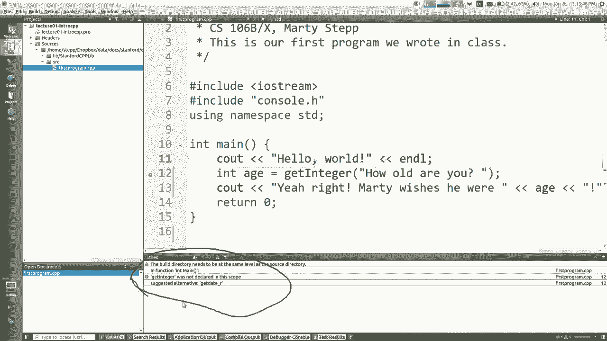

那里说包含simp IO点H好的，所以在这里我要说一下包含simp H 。

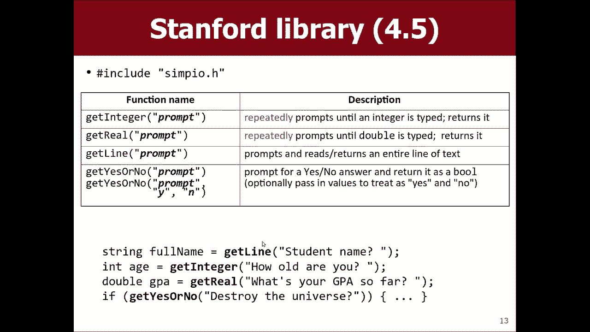

我也有这两个库的生命，这iostream是什么，如果您不包括在内，则使C可见，您无法打印以查看此内容，控制台点H使程序作为其自己的漂亮小东西弹出屏幕，窗口是我们用来弹出该图形控制台的库之一，重新编译。

现在可以正常工作了，我只是简单地添加了哦，如何，你老了，我说走开，说那是非法整数，再试一次，你内心深处不喜欢那好吧38岁哦，我希望我，不希望我38岁，但我还好，所以它收成坡道，我想它不会提示。

直到我诚实，但至少会提示直到我正确输入整数为止，这是使用斯坦福大学的这些输入/输出功能的示例，库是一个小例子，就像为什么我们要拥有这些库，你们是否编写了健壮的程序，我们不希望输入部分，很难。

因为这不是很有趣，这堂课与，阅读输入内容比这有趣的事情更多，所以我们不要，希望这一部分成为需要大量代码才能正确执行的部分，您知道我的意思是，到目前为止有多少人对此有任何疑问，好的，嗯，嗯。

这是一个好问题，我怎么知道，很快，也许我会补充您的问题，您说我怎么知道，进入您的工作如何实施，我将继续下去，例如我如何知道那里的所有功能，我可以用正确的方式来了解一些功能。

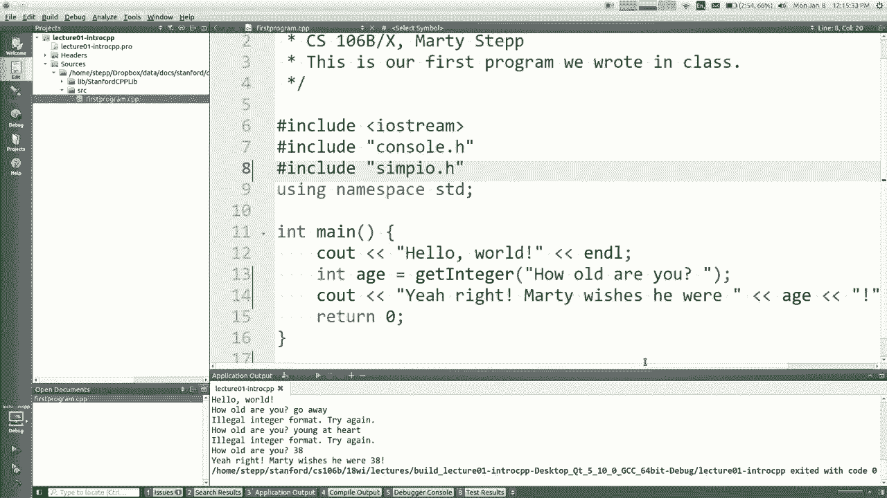

他们中的我会放在幻灯片上，我会尝试说的是我想你的那些，真的需要知道，所以这是您的子集，但是如果您真的想要一个。

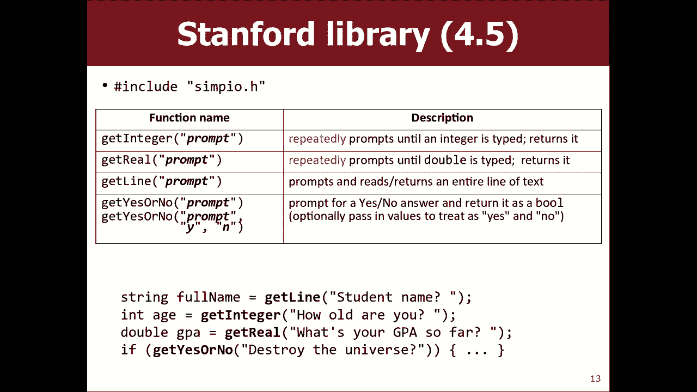

如果您转到顶部栏中的课程网页，则会看到所有内容的列表，表示斯坦福C ++库的链接不会让我点击它，因为，互联网讨厌我不起作用，但如果您单击其他位置，它将显示，所有不同标题及其所有不同功能的列表，拥有。

所以这是他们所做的事以及他们的名字的很好的参考，之类的东西，但实际上是要回答您的实际问题，如。

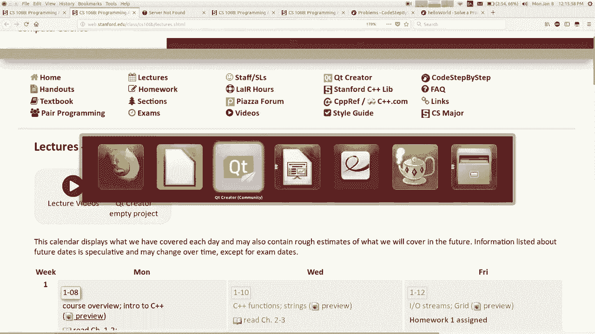

我知道这是如何工作的，如果我很好奇，您可以选择任何名称，任何东西，您都可以右键单击，然后说出跟随符号，它将跳，到那个东西的代码中，所以这是获取整数的代码，您可以阅读它，其中有些有点奇怪。

就像所有这些东西一样，但我的意思是您可以，至少看到并看起来很好，也许我会遵循那么简单，你知道，您可能会迷失在矩阵的此处，但您可以看看，所有库的所有源代码实际上都很酷，您甚至可以。

看起来像C在哪里跟随简单我带我去了一些iostream我不，知道我不明白我要离开那里的所有东西，但是是的，你，您能否跟随符号来了解事物在哪里以及它们如何，实施，到目前为止其他任何问题都可以。

如果您遵循我如何顺利康复，那么您知道如果您进入盗梦空间，踢一下，它叫醒你，然后你回来了，不，不，嗯，所以，东西在拐角处，它会说什么文件都打开了，所以您，可以单击它们之间的另一件事，就是我可以关闭XI 。

只需将其关闭，然后再返回否则，是的，有一个，许多不同的方式也像这里一样是列表中所有文件的列表，项目，这样您就可以双击要编辑的文件并进行填充，就像这里有一个小“运行”按钮，您可以单击以在其中运行。

这里有很多不错的可爱小功能，因为我们，做得好，我可以告诉你一些我不会告诉你的东西，直到，星期三，但是你们好像很机灵，这怎么写，用这种语言编写的函数我们将在下一讲中讨论很多函数，您如何良好地编写函数？

函数我不知道是什么，如果我们有某些东西，为什么您通常要在程序中使用函数，为什么，我想这样做吗，伟大的程序之爱，您可以从事很多工作，因为您知道那很热，单词这部分可能无法正常工作，这是一种很好的心理分离。

您的代码使您的代码更具结构性，如果您在多个地方都知道相同的代码，则不想编写它们，反复编写代码，这很不错，您知道只有三件事，计算机科学家讨厌我们不会看到效率低下和，冗余。

所以我们不想在程序中拥有这三件事中的两件事，就像如果我们有什么，如果我们正在写一首歌，就像这就是，故事我不想让歌词弄错我的生活如何，翻转，颠倒过来，不管你有什么想写的东西，歌曲，但它是重复性的。

所以如果有的话，您要重复一遍又一遍，该代码在程序开始时，并且您在该代码处也有相同的代码，你说的程序结尾哦，天哪，我有两次相同的代码，所以你可以，写一个叫做空歌曲粘贴的函数，这样当您写一个，您编写的函数。

如果它返回该值不写的任何值，它的名字是您编写它不需要的任何参数，任何东西，然后在花括号内编写要正确执行的语句，这样，现在在这里，而不是所有这些，你只说一首歌，那是那些人的别名，四行，所以这很重要。

然后在程序结束时，我们说，再次演唱，所以现在我们避免了很酷的冗余，我来编译，我将运行它只是为了确认它是否有效，它会打印出愚蠢的歌曲歌词，我38岁多大了，它再次印出了愚蠢的歌曲歌词，很酷。

如果您使用此功能，我们将对C ++有所准备，将其右移到程序底部，这意味着首先它不会编译，它说未在此范围内声明歌曲，因为找不到C ++ ，在您使用它的地方被声明的东西，因为在1983年。

是所有哑巴似乎都在星期三继续关注，我会告诉你，如何在C ++中解决这个愚蠢的问题，谢谢大家，我会见到你的，星期三保重去安装Q Creator 。

