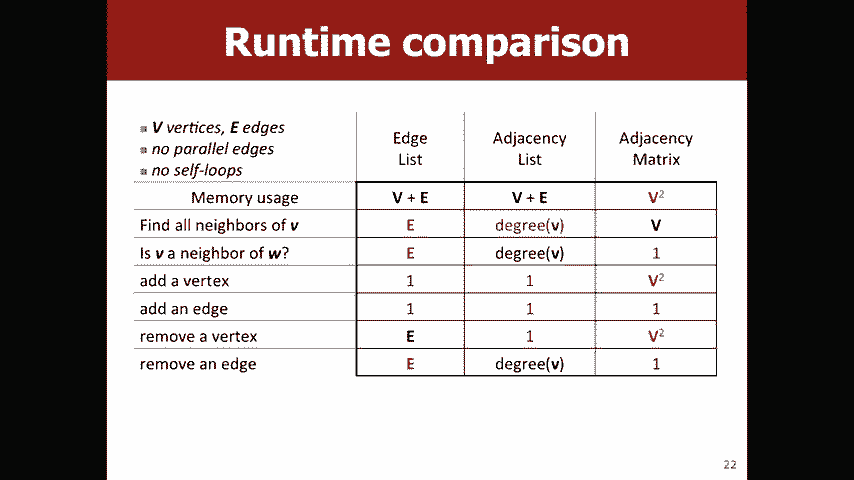
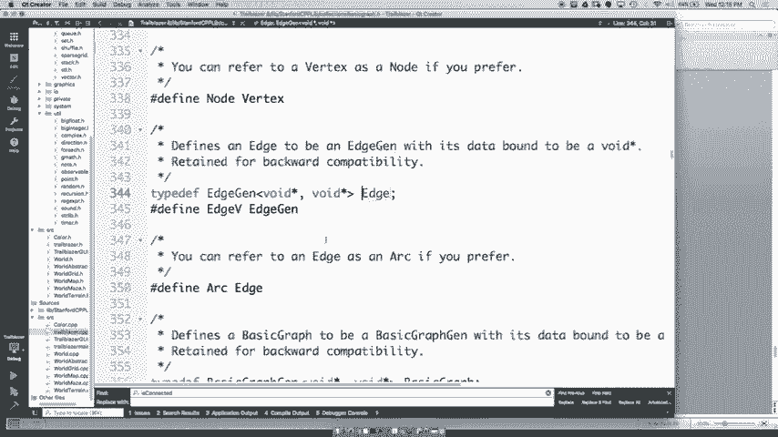

# 【斯坦福大学】CS106B C++中的抽象编程 · 2018年冬（完结·中英字幕·机翻） - P20：【Lecture 20】CS106B Programming Abstractions in C++ Win 2018 - 鬼谷良师 - BV1G7411k7jG

抱歉，您在视频中错过了生成树定义的人，如何，许多人认为一个合法的生成树举起你的手，好吧，有多少人认为这不好，为什么我们需要增加优势或获得优势，摆脱边缘有多少人认为添加边缘以使生成树有多少。

人们认为摆脱边缘是的，所以在这种情况下，这是不合法的，生成树，因为它具有循环权，您可以绕开，图，所以如果我们现在要摆脱边缘，这将是一个跨越，树好吧，那两个人有多少呢？ 。

手有多少人认为两棵不是一棵大树好吧有多少人认为，没有足够的优势，多少人认为太多了，所以这一个人也有，有一个周期的问题，所以如果我们摆脱这种边缘，现在您有一个，好吧，三个人怎么会认为这是一个跨越。

树上有多少人，边缘太多，边缘不足，是的，所以如果我们要，在此处添加边，然后我们会突然有一个连通的图，因此在，图形未连接，您无法彼此到达每个顶点，就像这些都是他们自己的岛屿，所以如果我们添加一条边缘。

那么，您将有一个有效的最小生成树，因此正确答案为无，太棒了，所以在进入之前您对跨树有什么疑问，最小生成树，好的，因此最小生成树是具有最小总数的生成树，边缘权重成本正确，因此在此示例中，这将是最小值。

该图的生成树，因为它们就像是，成本最低但仍构成有效生成树的边，是的，所以当我们谈论树木时，您就像哦，也许我们，可能包括这个边缘，而不是您知道这个边缘或其他东西，但是现在，您将使用权重8的边缘而不是。

权重4的边缘，所以我们不再有最小生成树了，为什么不，与伙伴交谈，并尝试找到该图的最小生成树，就像最小生成树一样，我们在谈论从一个点到另一个，还有一点，因为我们所有的路径搜索算法，寻找两点之间的路径。

因此最小生成树的宽度为图，属性，它与任何两个顶点都不相关，因此最小生成树，总是与图形中的所有顶点一样，它不在，任何两个特定的顶点，是否有人想要为此图建议最小的生成树，是的，所以我们可以摆脱这个，好吧。

只是让它更清晰一点，就像包括这个，边缘边缘边缘边缘冷却，太棒了，所以任何人都可以看到其他最小的生成树中的三个，一，是的，所以我们可以摆脱这个问题，我们将这些问题包括在内，还有其他人是的，是的，完全可以。

这就是这一个，这一个，这个和这一个恰好所以我们为什么不做，为什么这个不是，最小的生成树，您可以像这样完全摆脱B到D ，因此，该生成树不超过最小生成树，因为，成本是3加3加3加3加7。

即19而不是3加3加3 ，加1加7，这是17好的，所以这很有用，如果，你知道6个顶点7个边，这东西比人类少，擅长在有成百上千个顶点和边线但，一个名叫船员学校的家伙想出了一种算法，可以很快找到一个最小值。

图的生成树，是的，您将在您的图上实现，功课，所以基本上它的工作方式是您一开始就没有边缘，图，然后我们将基于边缘权重和，那么，当优先级队列不为空时，我们将DQ一个优势，如果它，连接到图中当前未连接的部分。

然后我们将包括，它在我们的最小生成树中，否则我们什么都不做，您对该算法有什么疑问，我们将举一个例子-是的，是的，所以我们不一定要解释Manoah的扇形树木的工作原理，我们不是。

明确地喜欢从图形上删除边缘通常它们是如何工作的，之类的返回一组包含最小生成树的边，但是，是的，所以总的来说，就像遍地都是，在您的图表中并将其添加为您的优先级，但是从概念上讲，我们可以，想一想。

图中没有任何边，而您正在添加边，回到图表中很好的问题，是的，如果这些端点，如果我们知道您是否已经连接，例如此处已连接，包括你知道这个边缘这个边缘这个边缘这个边缘然后我们，从D到e观察这个边缘。

现在D到e已经连接好了，对吧，你能走这种方式从D到e吗，如果我们要连接它，这样，我们现在有了一个循环，可以打破最小的生成树，问题好吧，让我们在船员学校做一个实际的例子，所以这是。

边缘的优先队列我在图中将它们分级，因此我们可以直观地看到，重新添加它们的想法确实有意义，因此我们将选择哪条边，首先看看是的，因为这是最低的成本，好多人认为。

将其包含在我们的最小生成树中有多少人认为不包含它，有多少人仍然对船员学校感到困惑，是的，所以，我们想包含它，因为我们是一个连接，这两个顶点这一个和这个顶点，它们当前未连接，我们的图。

所以这必须是连接这两点的最便宜的方法，好吧，让我们加入一个好吧，所以我们的下一个优势是B 2 ，这边有多少人认为，包括有多少人认为，不要包括它，好吧，所以B 2也连接了两个边，当前不在，我们的图好吧。

我们的下一个边是C 3，这里有多少人，想想包括多少人认为不包括好酷，参与度肯定会增加，因为这很棒， um d4在这里包括不要包括ok be 5在这里包括，不包括是的，所以如果我们包括e5。

我们将得到这个周期，在这三个音符之间1 2 3所以我们不想包括5或最小值，生成树好的um f6包括f6在这里包括不包括是的所以f6 ，连接当前未连接到整个组的这个顶点，好吧。

尝试突出显示当前已连接的设备，确定g7在这里，到这里包括不包括是的，所以什么也不做g7每个八个都在这里，到这里有多少人认为包括不包括在内，所以在这里，这两个节点是与星星相连的，这5个节点。

带有圆圈的音符已连接，但彼此未连接，因此，我们想要，所以您确实希望包括h8，以便我们连接，我们可以连接这些，现在两组笔记都已经连接好了，你会得到I 9，这里有多少人认为包括不包括，好吧。

J 10就在这里包括不包括yeah k 11这在这里包括，不包括L 12井，这里包括不包括是，这里的M 13包括不包括，所以如果我们包括， m 13我们将有一个循环，从这里这里这里这里这里来回。

所以我们不想包含它，这里包含的14个不要包含，是的o 15此处不包含好的P 16此处不包含，这里包括不包括好吧，我们现在需要继续吗？ ，有没有连接的节点，是的，所以我们不需要优化，继续进行Q和R。

因为我们已经连接了所有节点，我们的图表是一个很好的问题，所以问题就像我们实际上如何，像人类一样在视觉上知道我们可以看到事物是否相连，但是我们该怎么做，作为计算机，我们将讨论，大概五分钟，是的。

所以这与最小生成树匹配，我们才得到总成本，只要将所有边缘权重加起来就可以得到60 ，是任何低成本的生成树，是的，因此该算法可以找到，最小的生成树，因此不会有更低的成本，这个图有一个等价的生成树。

有多少人认为是，很多人认为不，所以对于这个特定的图，您将不会有一个，因为所有边缘权重都是唯一的，所以只有一棵最小生成树，在第一个示例中，我们看到有多个最小跨度，树木，因为有三个边缘，成本为三。

所以我们可以使用任意两个，这三个边缘中的一个，但由于所有边缘权重都不同，因此您，只会有一个最小的生成树这是另一个例子， Wikipedia只是像这样显示，哦，我们有一个周期，所以您不包括，这个边缘。

然后在这里我们找到了最小的生成树，所以回到您的，质疑我们实际上将如何实施职业学校，因为，像我们这样的人确实做得很好，但是我们如何才能自己实现，一件大事是，我们正在使用优先级队列，因此您认为分配。

五个很辛苦，就像一切都回来了霍夫曼这个任务优先，队列很大，然后我们还需要讨论如何确定是否，这两个顶点已经有边缘的端点了，在我们的图中连接，因此，将其概念化的一个好方法是，我们将拥有不同的。

原来如此的顶点，您看到了将其中一些标记为标签的感觉，圈子，其中一些有星星，而星星和圈子不是，就像我尝试代表这些集群的方式一样，连接哪些顶点，这个想法是，您将拥有这些簇，并且随着。

您需要能够在将边线添加到，最小生成树，您还需要非常迅速地确定是否，一条边的两个端点是否在同一个群集中，做到这一点的方式，我鼓励您考虑一下，因为您必须在家庭作业中执行此操作，所以我没有明确。

很抱歉回答您的问题，但这是一种非常好的心理模型，所以，也许考虑一下我们已经了解的一些数据结构或技术，本季度实施此方法是的，对不起，是的，所以基本上是这个主意，就像您添加想要的边一样。

您要考虑作为节点的边，它们作为同一集群的一部分相互连接，所以我当时，在我们的示例中表示，我们只是通过，可能在某些顶点上有星星，而在其他顶点上则有圆圈，像这样实际绘制出来，就像，同一组是的。

所以问题就像为什么我们需要最小的跨度，就像我们刚才谈论这棵树20分钟，是的，他们习惯了，制作很酷的迷宫他们也更重要地习惯做事，如电源线之类的东西，您需要连接大面积。

而且您希望以尽可能最低的成本做到这一点，所以您不希望这样，你就是一个例子，也许你想让这个国家的每个人都能，例如访问该国的所有其他地区，但您不想建立一个，一堆多余的路，因为你就像一条有限的路，预算。

因此您需要一个最小的生成树来连接您的城市，这个国家的大问题是，还有其他人在哪里吗？ ，认为最小的生成树在现实生活中会很好，我认为您可能在某种程度上得到了一些不一定，最小生成树，但像新航空公司一样。

可能会尝试最小化，用类似的飞行路径生成树，因为您可以，就像连接地方，然后随着航空公司的壮大一样，开始添加周期，好吧，关于我们的克鲁学校的最后问题， ，转到图实现中，所以像我所说的，图是数据结构。

所以我们一直在讨论有关如何实现不同数据结构的法律，让我们讨论如何实现图形，这样的想法是我们讨论图形，存储顶点和边，因此您需要某种方式来表示这些顶点， ，边缘和内存需要有很好的方式来查找或访问，在右边。

我们将看到三种不同的潜在实现，图和一些值得思考的好问题，例如，如果您，想要添加一条边如果要超出顶点会发生什么，如果您要查找边缘，则尝试搜索特定的边缘，节点的邻居这样的事情，所以对，请记住。

这取决于您的喜好取决于哪个，您要根据要使用的功能使用的实现，您的图表还可以，因此也可以尝试考虑哪些实现，最适合我们一直在学习的不同算法，因此第一个，一个可能是最简单的代码了，只是让我们列出所有。

图中的边，所以我们甚至不像显式地存储顶点，只要记住，像哦，如果这是一个边缘B，则意味着必须，我们图中的顶点a和B ，弄清楚那里是否有多快，或者希望我们弄清楚是否，例如，在我们的图形中有一条边。

例如在a和D之间存在一条边，是的，这是不可靠的操作，因为您必须经历所有，图的边缘，有时当我们谈论图时，我们会说，大约oh E与Ovey Ovey的边数和oh V的数，的顶点，但是如果我们只是想知道如果。

我们的图中有一条边，我们必须查看图中的所有边， ，如果我们想找到给定顶点上的所有邻居，那是什么，这样做的成本，是的，所以问题就像我们要查找所有顶点还是所有顶点，您说过V乘以e，这意味着对于每个顶点。

我们都需要经历，整个边缘列表，所以如果我们想像所有邻居一样找到它的话，那会很好，所有顶点，但是我们只想找到一个顶点是它的邻居，只是BOV，所以您只需要浏览一下该列表即可，是的， ，完全正确的想法。

所以好吧，基本上故事的寓意是边缘，列表，您必须遍历整个列表才能进行基本上任何操作，你想这样做不是超级伟大，就像一个人可能会想，也许有比要继续浏览我们的内容更好的东西，每次都有完整的数据结构。

但是有一些优势，它们真的很容易实现，每个循环都非常容易做到，在边缘上，它们也很容易向右添加顶点，就像我在，只在这里画一个顶点，每个都不需要调用，我不需要更改边列表，完全是因为连接年龄的RNA边缘还可以。

让我们再多一点，专业，所以我们不只是存储所有边缘，为什么不存储所有，顶点，并拥有每个Verta并为每个顶点知道所有邻居，所以我们就像基本上存储了每个顶点的所有边，所以有一些。

您认为比边缘列表操作更好的操作，是的，所以这真的很适合发现你知道邻居被宽恕了，像您刚去的顶点，您会在数据结构中找到该顶点， ，看起来像所有邻居的全部清单，这真的很好。

还有什么可能是好的还是有什么更糟糕的，是的，我很想知道是什么时候将顶点存储到此处的列表中，他们是按顺序排列还是不是按顺序排列，所以您可能没有顺序，像这样的顶点只是您可以想象的字母。

并不是真正有序的字符串，因此您不一定要，在这里订购，实际上我们将讨论我们如何实际实现这一点，但是，通常您会像地图一样使用它，或者它很容易添加，此图的文本是是否，如果我们在此处添加H，您会知道。

需要改变我们的代表，是的，是的，所以当我们在这里添加H时， ，如果我们想添加，只需将其添加到邻接列表的末尾，你说对了的一条边，我们需要在这里添加，我们需要说好，这指向D和D点D包含H，所以还好。

就像一个，正确的成本，所以对于我们的边缘列表，我们没有像存储B C那样存储，我们没有存储CB，但是我们需要同时存储两种方式，因此我们必须，存储两倍的信息，这基本上是另一个潜在的成本。

确实很擅长向图添加新的顶点和边，将其视为恒定的时间，这也非常适合发现，给定顶点的邻居最糟糕的是很难确定，给定的边是否存在正确，因为为此，我们必须，遍历该顶点的所有邻居，所以如果我们正在寻找。

 A我们必须从这里开始，好吧B是我们想要的， D我们想要的是G而我们没有想要的，所以我们不得不，浏览整个列表，您对邻接有什么疑问，列表和边缘列表到目前为止，是啊，那是一个错字，对不起，这是。

不应该在这里对不起，好吧，现在有第三种称为邻接矩阵，这样，可行的是您在右侧的任一侧都有顶点，因此您会，如果两个节点之间存在边，则基本上像1一样放置，如果，不是因为它有对角线对称，因为如果有边缘。

从A到B，从B到a的边也有无向图，所以，从我们已经讨论过的操作来看，这是一个好广告还是坏广告？ ，关于，是的，所以添加新顶点真的很不好，因为就像，这么说吧，我们突然将H添加到了这里。

我们不得不喜欢添加它，整个额外的列和行在这里不想画上黑色，但是，这里有一个额外的列，您必须用所有这些填充它，零，这实际上是非常昂贵的操作，因为通常，不喜欢这是一个实际成绩，您必须知道复制所有内容。

如此精确，以至于很难找到邻居，很好，是的，所以这样可以找到所有邻居，对于一个节点或一个顶点，我们必须去那一行，就像我们试图寻找， C的所有邻居，我们要去这里，我们必须看看所有，不同的顶点。

看看它们之间是否有边，这是一个主要的，对我们的边缘列表进行了改进，因为我们的边缘列表必须经过，整个边的列表非常正确，在这种情况下，我们，只需要遍历所有顶点，但这仍然不是很好，因为像，与我们的邻接列表。

我们只需要仔细查看，邻居基本上和它的权利一样好，所以这是一种媒体，那如何确定图中是否存在边缘，在您试图找到G之前，您是否知道G在那个不好的邻居，如此多的人认为这是一个很好的数据结构，在边缘列表和。

邻接表列出了多少人认为比边缘列表和邻接表更糟糕，列出是的，所以它实际上真的很擅长，因为为了找到一个，和G或邻居，你就可以了，就像你可以直接去这个地方看看，在这里，看看就像哦，那里有一个邻居。

这是一次操作的O，是邻接的另一大缺点，矩阵是您必须正确存储所有这些信息，所以如果您，拥有成千上万个节点，但是之间只有一条边，平均而言，每个节点在图形中最终会带有很多零，那里有很多多余的空间，你们都对。

这些不同实现之间的成本差异还是原因，你会用另一个，是的，很好的好问题，所以问题就像您将如何存储重量，因此，通过我们的矩阵，我们可以知道您将权重直接放在此处，而不是像零或一个那样的符号，您将如何为另一个。

所以对于边缘列表，您可以拥有，权重就像边缘结构中的一个字段，这样边缘就可以，两个顶点分别是起点和终点，并等待您拥有的邻接表，并将其存储为额外字段，因此更像是，将权重添加到邻接列表和边以及边列表中。

而不是添加权重，到邻接矩阵，然后如果有向图，您失去了很好的对角线属性，因为您不再有保证，就像如果a是a相对于B的边缘，那么B相对于a的边缘，所以您知道这里，我们看到哦，从A到B有一条边。

但从B到a没有一条边，所以这些是，在谈论加权图和有向图时的巨大差异还可以，假设我们要实施广度优先搜索，所以我们有三个，正确的选项，我们有边列表，邻接表和邻接矩阵。

有多少人认为边缘列表是实施广度优先的最佳方法，实际搜索是否可以帮助有多少人认为邻接表是，最好的办法，有多少人认为邻接矩阵是最好的方法，让我们开始吧，超过零参与，所以这个图表基本上就像。

这些不同的实现方案（例如， ，没有一种可以普遍地改善这种情况了，这取决于您在做什么，所以绿色的东西就像，那个操作的赢家，红色的东西是失败者，所以添加，顶点最擅长无边缘，杰森则看到列表，更糟的是邻接矩阵。

因此对于广度优先搜索，请记住从上周开始，排成一列，是的，你们都认为多少，任何人都想要喜欢的最佳使用数据结构，并且，是的，所以邻接表对于广度优先搜索确实非常有用。

因为您对顶点的每个邻居都有喜欢的步骤并将其排队，进入您的队列，这样对邻接表非常有用，因为它，仅邻居的数量，而不是顶点或，边数，船员学校算法又如何呢？所以任何人对他们哪一个都有任何想法，认为最适合那个。

是的，所以对于船员学校来说，列表很好，因为您需要遍历图的所有边缘，因此，如果要对邻接矩阵进行此操作，则必须，通过像V平方与邻接列表或边缘列表相比，仅在边缘的数量上，所以我的意思是实际上这取决于。

您想对图形做什么，以便在面试中被问到，就像嘿，您可以首先实现图形吗？ ，就像你想和这个家伙做什么，因为，你们是否都想看看我们是如何实现图形的？ 。

这个选择好吧，所以这是图点H，基本上是基本图。

基于，因此这里有一组节点和一组边，所以这组，边缘基本上就像我们在谈论的那个边缘列表，但是，我们还存储了节点，其背后的想法是当您进入基础，在这里保留在顶点上的图形，基本上，当您去查看顶点时。

您会看到它具有，这样一来，如果您查看一个顶点，就会看到其中包含一系列边，与之相关联，所以基本上，这意味着如果您返回图表。

并且您想查看两个点是否已连接，您实际上经历了，必须穿过该顶点的所有边缘，所以实际上，这种混合边缘列表邻接列表方法，因为您拥有这套，边缘，所以很容易在图表中获得所有边缘，这非常好，确定巡航目标。

然后您还有一个邻接表，因此很容易找到，邻居，因为我们要您做的另一件大事就是全力以赴，正确的路径查找算法，所以就像您实际上可以在这里看到的一样，你知道我们实际上必须遍历整个邻居清单吗。

只是为了确定两个边是否相连，这是我们做出的一种权衡，在知道我们要你们做的任务的基础上，早先有人问过这些是按顺序存储的，它是如何工作的。

基本上，您不会按顺序存储它们，因为不一定，顶点的顺序取决于它们存储的类型，例如，以至于它们通常被命名为，顶点就像边缘列表，或者您只存储边缘集合，在每个顶点内部，这是我们在实现邻接过程中所做的工作，列表。

然后对于邻接矩阵，通常会有一个映射，就像实际的网格一样，你们是否对实现有任何疑问，当您使用每个对象时，它们之间的权衡是的，它是边缘和对象，因此，在我们的示例中，edge实际上是抽象的，您可以使对象像。

是的，一般来说，你只是做一个结构更有意义，因为，不一定有方法会像您需要的那样，轻松访问它的所有字段，所以这就是为什么它通常是，开始，是的，所以等等，你看看我是否可以。

拉起它，这是您的代码，所以边缘还可以，是的，您可以看到。

对于每个边，都有一个起始顶点和一个结束顶点，这仅仅是，就像您可以将完成称为“完成”还是“结束”，然后它也可以存储，就像我们为加权图所讨论的权重一样，如果您想，看到这样的顶点，所以就像顶点的名称。

然后是集合，从该顶点引出的边的数量，这样您就可以，邻居真的很容易，因为您只需经历所有这些边缘，然后，找到那个边缘的终点，实际上我猜这两个都是回答您问题的课程，所以它们是，是的，所以问题是使用弧线或边线。

这是一种技巧，别名是官方术语，就像一个昵称，因此您可以致电使用，无论是圆弧还是边线，它们都是快速返回圆弧或边线的弧形，之所以这样做，是因为有时候人们会忘记什么，他们被称为我们也对向量做了类似的事情。

其中​​我们包括大小，和长度作为方法，因为没有人想记住向量是否具有大小，方法或长度方法大问题，还有其他任何问题，请在开拓者上开心，您怎么说。

