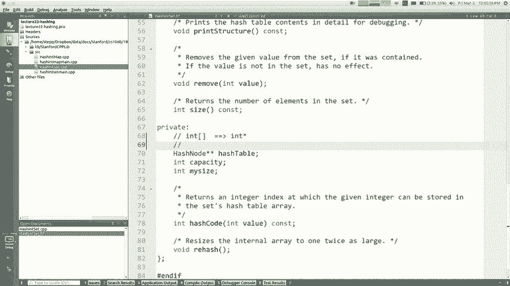
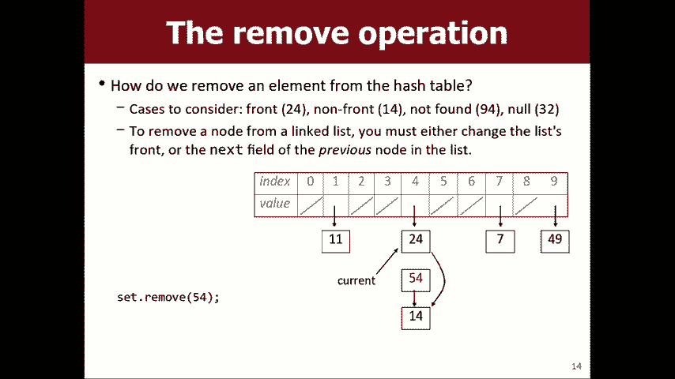
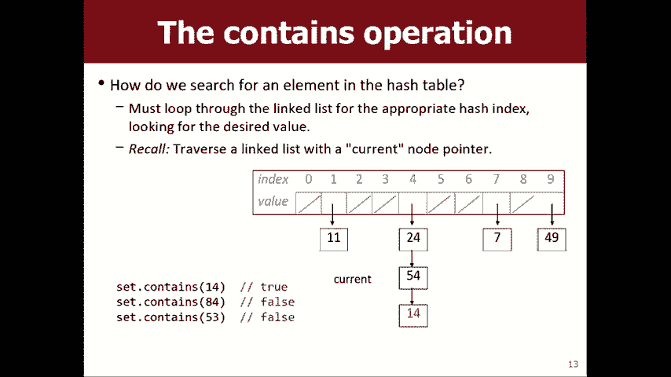
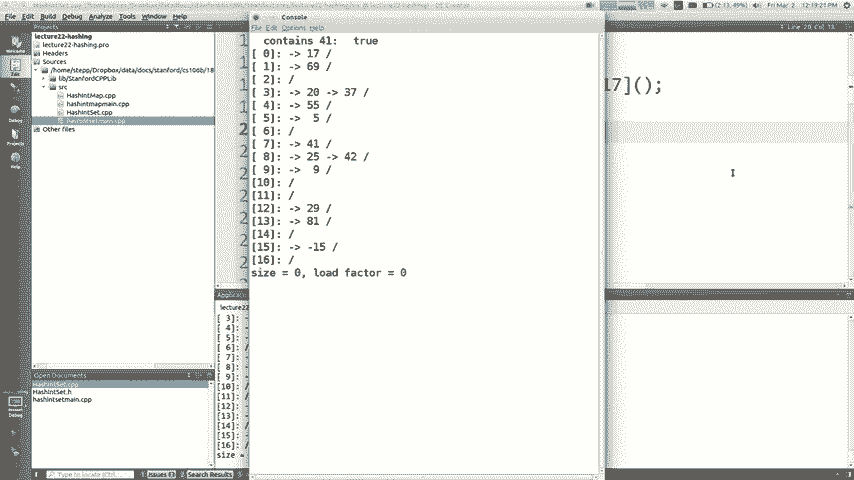
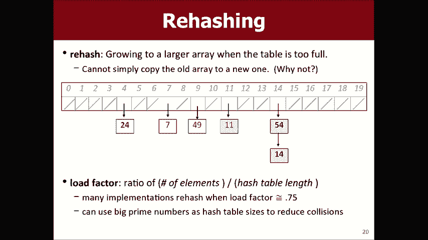
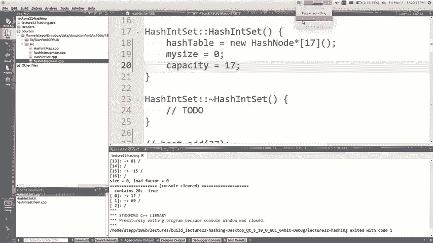

# 【斯坦福大学】CS106B C++中的抽象编程 · 2018年冬（完结·中英字幕·机翻） - P21：【Lecture 21】CS106B Programming Abstractions in C++ Win 2018 - 鬼谷良师 - BV1G7411k7jG

好吧，所以我们今天在这里，我想教你一些事情，在我开始之前，我称之为哈希，我想快速地提到几件事，所以，到今天为止，第七项作业已经增加，称为“开拓者I” ，认为实际上可能已经向您展示了她的演示。

演讲权这是一个程序，您可以在其中编写图形通过搜索算法，找到通过迷宫和其他种类的图，所以是的，这显然是，这是一个图形作业，根据您在，过去的一周，这将是我们在此完成的最后一项家庭作业，上课我们快要结束了。

所以我知道你们都为完成而感到兴奋，四分之一，然后去春假之类的东西，所以做作业，七个星期比星期一到期，它应该在3月12日在这里到期。 ，然后你知道与此同时它总是很有趣，就像你在做什么，其余的讲座都正确。

因为您已经完成了功课，您需要了解的所有内容，我想这是我的观点，是的，还有其他几个，我知道，有些人一直在检查自己的状态，上课并问一些问题，我相信今天不是真的，是在五点钟退出课程的最后一天，或者。

这样的事情，所以我当然希望你们没人选择退出我，希望大家都留下来，但我想您知道那是截止日期，如果这对您来说是个重要新闻，那么有人会问成绩，我在班级网站上发布的信息，您知道我们如何计算它们。

或者为什么不计算它们，我的成绩更高或类似的东西，我认为我的简短答案是，只是我当时发布的重要信息只是基于作业1 ，到3和期中以及您的某些部分，所以有一堆，尚未添加到这些数字中的数据，因此您知道是否。

不喜欢您看到的百分比或成绩数字，或，不管我怎么说，还有很多故事要写，但是反正好吧，让我开始教你。

关于缓存好，这是今天的主题，这里是大图。

这里的背景是我们一直在学习如何实施所有这些，不同的ADT拥有所有这些不同的收藏，所以我们了解了您，实现向量和列表，我们了解了如何使用二进制来实现集合，正确的搜索树。

所以我们一直在学习我想要的所有这些不同技术，讨论今天如何实现哈希集和哈希图，这是一个，真的很酷的想法真的很酷的想法，你还记得我告诉过你的，在哈希集中添加，删除和搜索什么是Big O，它是1的o 。

那是最好的大O，很快就对，所以你知道我会，希望您会有一些好奇心，例如如何制作具有，不断地寻找事物，你该怎么做，如果你只是，想像一下如何实现看起来好像不是的集合。

所以这就是我今天想教给你的，所以这来自于本章， 15本教科书，让我们想象一下我们正在尝试实现一套，整数让我们保持简单我会保证我们会回到你的角度。

制作一个集合或一个列表或其他具有其他类型的数据（例如字符串或，别的，但从一组intz开始，好吧，如果我们基本上，以我们一直学习的方式存储它，就像向量是，只需添加即可实现或实现数组堆栈的方式。

该元素进入下一个可用索引，因此如果它是内部集合，则为，像这样的未排序的未填充数组，那么效率是多少，的添加/删除，并包含在此表示形式中添加的最大功能，哦，是的，您偶尔可以把它放到最后吗？ ，数组。

但这很罕见，所以没关系，包含的Big O是什么，是的，因为您必须遍历所有元素以进行搜索，正确的东西是什么被删除的哦，是的，由于几个原因，一个是因为如果我要求您删除值49， ，必须去找到它。

然后一旦找到它就必须将它从那里拉出来，而且您可能想将所有内容移到正确的位置，是的，原因有很多，因此无论如何，这种表示法添加起来很快，但是搜索起来却很慢，和删除，我会说一套可以做的最重要的事情是。

如果添加缓慢或删除缓慢，有时会包含操作，您可以，容忍这一点，所以您要做的就是在构建时有一定的加载时间，集合，可能需要一分钟才能将所有数据添加到集合中，但是，如果搜索速度很快，这就是您真正想要的，是的。

所以一次搜索包含n的这个大O的事实真的很糟糕，因为我们只考虑大，只有当n是一个非常大的值时才重要，当n是一个大数对，所以我有十亿个元素，我必须，看看所有这些都不好，所以我不喜欢这种实现方式，一个集合。

但是好的，我们了解了如何使用二进制来实现集合，搜索流什么是添加和删除的大O并包含二进制文件，搜索树，它是n的对数n的对数比n好得多，我认为实际上是在说，对你来说已经很正确了，n的对数很好，好。

我想探索一下，也许我们可以做得更好一些，所以，让我们在竞赛领域中待一会儿，而不是使用未排序的数组，如果我们有一个排序数组怎么办，换句话说，当您添加一个值时，我会，找出合适的位置放置它。

我将每个人都移到上面并放置它，在那里，如果您说要阵列，然后他说要添加，谷你十一我会环顾四周， ，弄清楚值11应该按此处的排序位于索引3处，然后我将所有人移至该位置，将11放在索引3上，那么多长时间。

是否需要向该排序数组中添加一些东西，为什么呢？ ，基本上是从转变开始，例如寻找，正确的位置就像发现它应该在不需要的索引3处去，确定您是否知道为什么不放弃举手的所有事件，是的， ，我们，是的。

您可以对此进行二进制搜索，类似于如何进行二进制搜索，在二叉搜索树中搜索，您可以看中间，然后向左跳或，根据它的大小而定，您可以使用二进制搜索来找到，如您所知，正确的插入位置为log n，但实际插入的位置。

的偏移量，如果它更接近，数组正确，所以这是一个漫长的搜索加上结束切屑过程，这加起来就是，哦，数组与指针的关系如何？我在C ++和arraign中的意思是，它是使用指针实现的，但各个元素未存储在此处。

作为指针，链表将所有元素存储在一个大列表中， intz的内存块，因此加起来平均需要n的o ，因为搜索要包含的内容需要花费多长时间， n的日志，与您可以使用的二进制搜索过程相同，找到插入点。

您可以用它来跳来跳去看看是否有一个值，包含在数组中还是不正确，好了，删除要花多长时间，如果我说删除值8或删除值23或其他任何值，则删除，为什么很像添加，您使用二进制搜索来查找事物的位置，并且。

然后一旦找到它，就必须移动二进制搜索记录日志，移位需要n的总和为，所以如果您查看广告包含，并将其删除，如果您将其与最后一个未排序的相比， ，未排序的一个是我们走1和n，所以如果您比较这两个，它们都是。

有点坏，您可能会说好，等等哪一个比坏还是坏，另外我会说这更好，因为搜索确实，包含运行时非常重要，因此添加，在这里比较慢，加上未排序是1的o在这里加上n， ，更长的时间，但我认为值得的是更快地包含更快。

包含记住，我不知道你们是否还有强烈的本能。 ，这些不同的大O，但是像n的对数一样小于n ，一百万的对数是20十亿的对数是30一兆的对数是40对数，比n小很多，所以我认为这更好，因为搜索是，最后还可以。

但我认为我们可以做得更好，再做一次，因此二叉搜索树，您可以通过Ashley的所有节点，左侧和右侧以及所有节点来学习，那东西比所有东西都更好，因为那是一个东西，所以我希望你会看到。

这比我们到目前为止所看到的这两个中的任何一个都更好，到目前为止我们已经看过一个，但是如果我们要坚持一分钟，任何其他有其他方法的总线，我们都可以将其作为数组，工作真的很好，让我向您展示一个奇怪的想法。

这就是下面的想法，散列如果您将值n存储在索引n上怎么办，而不是存储它，在第一个索引中，第二个索引是第三个索引，如果您添加值7 I ，如果添加元素2，它将把它放在索引7的数组中，我将其存储在。

数组和索引以获取它，无论您添加什么，我都会将其放在该索引中，数组有点奇怪，但是我想如果能做多久我就能做到，是否需要向数组中添加一些东西，需要花费固定的时间，对，因为您只是跳到正确的索引，然后输入值。

那里您不必移动任何人，只需花费恒定的时间即可跳，到数组的任何特定单个索引，因此添加一些内容，如果我说数组包含，那么奇怪的想法将花费1的哦，这个集合是否包含值7，您将如何回答该问题？ 。

大声'会让您喜欢这里包含内容的过程是吗，他说1的o你就是对的，就在我想知道，集包含7我转到索引7，看看那里是否有7，是否存在，那里有一个包含7的集合，但是如果有一个零，那么没人，添加了一个7。

如果我看一下索引7，我完全有答案，我不需要，再看下一个6或索引8或其他地方，如果这里有7 ，那是唯一可能正确的地方，所以添加一个搜索包含一个哦你如何删除我说我不，想要在集合中再减去7，您要做什么呢。

只需将零，那要花多长时间？o神圣添加删除包含大，哦，这是一个好主意，这就是我无法想到的哈希，这个想法有任何问题，您能想到吗？ ，我希望您对此表示怀疑，然后说这是胡说八道，这行不通。

因为为什么出了问题好呢，所以有些值我真的无法添加，如果您说加负二则没有数组索引负二，好吧，那我想听听您的反对意见，让我们看看，我们可以修复它们，因为您说得对，这完全是我描述的问题，算法无法解决该问题。

但是如果我们能采用您所有的各种，异议并解决它们，我们就不会有一种神奇的快速存储方式，如果我们能找到解决这类问题的方法，那就是哈希，设置基本上是解决了所有问题的想法，好吧，我。

针对您的问题提出以下解决方案，我将维护两个数组，正数和负数，因此如果您说负数，我会将其存储在，索引2的第二个数组，那是负数组那那是怎么回事，零是的，我怎么知道零是否包含或可能不为零，如果包含索引。

我将存储一个，如果不适合则存储一个零，我也许可以为，零，我在那里存储一些东西，指示它是否在那里，对，这整个想法也很好，你可以把它转过来，转换为布尔值的正确数组，然后将其正确或错误或其他，是的。

所以我认为到目前为止一切都很好，我认为我认为我们为您打了补丁，从概念上讲，我们修复了您在此处提出任何其他问题的反对意见，是的，是的，这是一个很好的问题，这是存储一组intz的好主意。

但是我怎么用它来存储一组字符串或一组双打或类似，如果是双打，我分别有3。5和3。7，我都把它们都放进去了吗？ ，他们都放在三个桶中，或者无论您知道什么，您是怎么做的，如果您不介意，我想再说一遍。

也许我会调整措辞，在这里，我要说的是，看看是否可以找出如何使这项工作成为一组， intz，然后我们可以解决这个问题，但是之后，我们坚信我们可以通过第一权利做到这一点，您还有其他权利，对此表示反对。

如果我想要一个非常大的数字，例如set dot，在12中加一百万怎么办，对，所以现在我必须有一个包含一百万个索引和12个索引的数组，这样我就可以，翻转最后一个在其中具有值，然后翻转所有其他具有。

零在其中，这似乎是一种浪费，似乎很大，问题好吧，我对您问题的解决方案是购买更多的内存，而我有很多，内存，所以我的数组可以很大，没关系，这就是我对您的解决方案，问题听起来不像是一个很好的解决方案。

为什么我们不需要，考虑一个可能比实际上更好的解决方案，即使价值不是，像我想的那样大，我要添加18和12，它们不适合这里，有点异议权，它超出了数组的范围，所以我，猜想您能做的是将尺寸调整为20。

然后就足够了， 18或任何其他空间，但是如果您增加一百万，肯定会出现问题，如果您有非常非常大的价值，那么您将拥有一大堆空白，零索引很好，人们最终真正要做的是，环绕它，以便他们说您知道您有一千个索引。

如果，您想存储0到999的值，但是您可以添加，值1543，您会在索引543中将其回绕并扭曲，您可以按其数组大小的千分之一对其进行修改，所以它就在那里，我们引入了一个不同的问题，但这有点像黑客。

用于很好地解决这个问题，让我向您展示一些，关于这个想法的更多信息，这称为哈希，所以您知道这句话，就像您谈论的那样，单词哈希被许多计算机科学所使用，哈希标签或与之无关的任何内容或哈希代码上的哈希字符。

键盘与此无关，但它与哈希一样是相同的哈希，映射哈希集哈希表（如果您之前已经听说过此类短语） ，哈希我通常在说哈希的定义是当您映射一个，将较大的值域转换为较小的固定域，通常为的域，整数。

以便将所有intz映射到一小部分，可用作速率索引的索引，用于存储它们和数组，您用来存储这些值的过程称为哈希表，通过，如果我给你做映射，基本上就是所谓的哈希函数，要添加到集合中的元素，然后告诉我它的索引。

应该把从数据到索引的映射称为哈希，函数，所以我们的算法是获取给定的哈希编码或哈希值，您只返回了相同的int，你们带来了一些非常好的，对此表示异议，因此对否定词不起作用，您可能会有很多，零。

这是你们带来的一些东西，好吧，让我们修补一下我们的功能以在某些情况下起作用，一个就是您，只要取我提到的绝对值，我就可以拥有第二个数组，底片，但另一种方法是绝对值，因此如果您，说你想有两个负数。

我可以把它放在索引2中，我可以做的另一件事是，如果我可以，把它们包起来我在一分钟前说过，因为那是49 mod 10好的，所以，哈希函数，您可能会说数组容量，所以这是怎么了，这个版本有人M有什么问题： 。

是，现在，有多个不同的值散列到同一个值中，索引，如果我尝试添加负2和2或37和47和57 ，这些值想转到相同的索引，我必须处理该问题，将多个值散列到同一索引中的问题称为冲突，是我的下一张幻灯片不是。

而是在我谈论之前，我只想指出这种碰撞，将它们存储在数组的哈希索引中，这是1的大O，对所有，这些东西是1的大O，因为您只需转到索引即可，循环遍历我们之前讨论的任何其他索引，所以这样，本质上。

算法添加方法转到哈希码的索引，然后，将值存储在该索引处索引，查看该数字是否存储到该索引中，删除我并将其放回原位，以查看是否看到这就是您要做的全部，是的，我希望您能看到所有这些都是1的大O，因为没有。

循环，没有递归，没有什么会拖慢我们的脚步，正确的1的大O，但是我们仍然面临的最大问题是，可能相互碰撞并进入相同索引的多个值的问题，这就是所谓的碰撞，所以当您实施时，哈希集，您必须想出一些无法解决的冲突。

只是忽略它们，因为如果我只是忽略它们，我会覆盖值吗，看到在第三行中我添加了值24，然后在第五行中，有54岁，哎呀，我用54岁写了24岁，所以现在如果你问我24岁是否是，在集合中，我不知道正确。

我看到了54，我看不到24，所以我不知道，回答我丢失了信息，这不好，好，那么您如何很好地处理碰撞，您可以通过不同的方式，这样做，我们又尝试了不同的冲突解决策略，修正这个想法。

使其仍然可以处理碰撞的一种方式，称为探测探测是将元素放在下一个索引中的地方，不太喜欢这个主意，但是您可以做到这一点，就像想像自己，在索引4处有24，现在您要添加54，然后将其添加到24索引中，你说哦。

这已经花了，所以你就去下一个，放在下一个中，我正在尝试为此进行现实世界的类比，就像如果您去上一年级的宿舍，那已经有人在那里，您刚搬到隔壁或其他地方的东西，正确的问题，所以您可以这样做。

这是解决冲突的唯一方法，问题在于，现在很难像我想说的那样搜索东西，现在，如果我问您集合中是否包含54，代码需要做什么，你包含54我该怎么做，正确，所以我要做的就是使用哈希函数告诉我，去索引号4。

所以我去那里，我看到我在寻找， 54我转到索引4，我看到24是错误的值，但没有停止，而是，说不，这不是这里，我必须继续前进，看看是否，因此，我必须继续前进直到谢谢，找到它在这种情况下是包含的。

或者我达到了，我想如果我，达到0意味着它不可能在这里，因为它会降落在其中一个，那些在零权利之前的索引，因此添加删除和，包含的内容有些不同，因为您必须喜欢跳起来看看，这些索引，但请稍等。

听起来好像开始消失了，从这里的一个大企业的O到哦，如果您想， 1对，当然，我希望您从那些奇怪的Big O问题中学到了什么，在中期，并不是每个循环都意味着某事物变成n的大O 。

这取决于您要遍历的事物的数量，所以这些，像我必须循环几次这样的小循环，这样做，搜索你成为他们去莱文吧你认为我的意思是什么，你的高清在哪里告诉你类似的东西，你说如果只看一个像几个元素的常数。

可能不是他们去参加活动，是的，我想答案是，这些团块预期会持续多久，只会成为，几个元素会聚在一起，否则将成为一个巨大的沉船，一种元素，您必须循环遍历一半的数组，所以我猜是。

取决于这些小块的元素我是否有关于这些小块的幻灯片，的元素称为簇，因此基本上如果簇太大，那么我们就不会再有Big O了，它将接近N的Big O ，但是只要集群真的很短，我们就可以了，所以我出去了。

我计算数字的方式在这里会相互冲突，这个集群真的很长，所以如果你问我是否，包含值94，我必须以2 X 4开头，并且必须一直， 9和0甚至看我是否能在那找到它，所以我的意思是不好，是的问题，使用现有数据。

接下来我将添加16，所以我将要做的是，如果您想增加16位，请坐下，然后知道它已满，请转到，下一个转到下一个转到他们，直到找到零，然后我去所有，到9的方式我找不到零，所以我会回绕以在那里索引零。

它离家很近，您最终将要存放它，现在您可以做的一件事就是减少这些团块的数量，我选择10个不同的数组大小是因为我必须绘制PowerPoint 。

幻灯片很难在一张小的PowerPoint幻灯片上显示50个索引，但是就像，数组大小为20，我希望您能看到一些结块会消失，下降，因为像24和86之类的东西在4和6索引中会下降，但是，像14和54。

它们会在14指数中上升，因为那是他们的20 ，知道我的意思，例如拥有不同的数组大小或更大的数组，无论如何，尺寸会在某种程度上帮助解决此问题，解决冲突不是我认为是最好的方法，尽管我。

希望向您展示一种我认为更好的方式的方式称为，链接单独链接是在数组的每个索引处而不是，存储单个值，您存储一小部分值，通常在以下位置实现，无叶的哈希表变成了一个整数链接列表数组，所以我。

猜测是否要按字面意义拍这张照片，像索引零是一个链接，集合中所有以零结尾且索引为1的ins的列表，以英寸等结尾的所有英寸的列表，这是因为您知道，我选择的数组大小为10，所以您会制作一些像散列的小节点。

这基本上与您拥有数据的链接节点链接列表节点相同，然后接下来您只需将它们链接在一起，这样您就不必再喜欢了，看看下一个索引，或者说知道是否包含54 ，到链接列表和索引4，然后在其上循环查看是否有54 。

还是全部，您不必去索引5，下一个索引6或任何一个，这样我就更好地喜欢这另一件事，我不知道我是否，提到我不认为我是这样说的，但是如果你，这个探测模型您可能会用完空间，您会在哪里看到像，如果您用完了索引。

您将无处可放任何东西，因此您，可以使阵列处理该问题，但实际上您可能会得到一个像，整个数组将是不好的，所以关于这个数组的事情很不错，从技术上讲，您永远不会用完空间，只是可以继续加长，这些列表。

只要您需要就可以了，所以这是解决，碰撞问题，但它仍然存在该循环和我们遇到的Big O问题，一直在谈论，如果您添加的所有值都以它结尾，与您所知道的2454一千四百一四千八百八十，对于叉上所有m的值。

您都了解它们都在，哈希表的索引相同，因此您基本上只是存储，您的设置为一个链接列表，所以如果我问您它是否包含某些内容， ，必须像他们所有人一样遍历，所以好像那不再是一个大孩子了，所以我不知道。

您仍然相信我，我们可以在这里完成一项业务的整个大目标，我似乎对此做了一些幻灯片，所以我们必须做一些事情，但是，我想我的意思是您知道数据是否全部聚集在一起，不好，所以我们可以使它少聚在一起的一种方法是。

为我们的哈希表选择不同的大小，我选择大小10的事实是，实际上是一个不好的选择，因为这意味着所有以结尾的数字，相同的数字值会全部排列在一起，似乎太笨拙，对我来说，您可能会选择17号或51号，或者。

某些原因以及您选择类似怪异数字的原因是，改装和包裹非常混乱，就像你可以把所有这些，我在这里写的值，并检查当您以17为底的时候所有的mod是什么，他们碰撞的可能性不大，因为那只是一个奇怪的随机现象。

我选择的素数是数字，但是无论如何，在实践中这样做是因为您存储了这些数据的小链接列表，并且，只要链表很短，对于大多数数据而言，那么基本上这些添加和删除以及包含操作是什么。

 1的大O并不意味着它仅查看单个元素，而是意味着，当n为n时，不必统计更多的元素，较大的确定，所以如果使用，与每个索引中的链接列表的链接如何将内容添加到，哈希表我有一个新值，我要加24。

所以我想你们已经，知道我要去索引4，然后把它放在那里，我应该把它放在那个链条上的什么地方， 14岁之后那肯定是正确的，我认为还有一个更好的选择，放的地方比54开头的原因，更好，是的。

因为我们在这里谈论的是链接列表，所以我所拥有的只是，这个小小的前指针可以走到链的末端以将24附加到末端，那会花我一些时间，它是走到最后之后的下一个下一个下一个，对，我不想那样做，连锁的顺序并不重要。

只是存储每个拥有那个mod的人就可以了，没关系，所以就把它放在最前面，这样就让他的下一个成为54岁， ，让清单开始是他，你们知道如何在清单的前面插入，一个链接列表，您已经完成了很多次。

之前需要花费多长时间，在链接列表的最前面插入一些内容，它们会一遍无循环，只是改变您完成的前指针，所以我试图说服自己，如果我们做到这一点，我们将添加和删除并包含将是很大的哦，我知道我可以相信一个运行时。

因为这些是1的大O ，图片以及我们现在正在谈论的内容，如何包含包含如何工作良好包含14我知道这将是一个，索引4正确，所以你们知道这只是我在搜索链接列表，所以我，创建一个当前指针。

我将其指向你们拥有的链表的最前面，像这样多次编写代码，而我却找不到数据或， null next next next ah-ha我发现它返回true对，所以我，需要包含一个循环。

但是唯一的问题是您知道该循环，我正在做的不是n的大O，因为我假设元素，是散布的，所以不是所有的n都在任何一个屈曲中，然后删除是非常简单的删除，只是你们知道如何，从链接列表中删除，只需将指针指向它周围。

如果我想要，删除54转到54之前的节点，然后使其下一个指针指向，大约54到正确的典型链接列表之后的那个，就是这样，您将集合实现为哈希表，所以我想这样做，与你们或者至少尝试我想尝试读取哈希以设置具有添加。

并删除并包含4次，我们可能只做原子包含，因为我认为，那是最有趣的两个，但让我们看看是否，可以这样做，所以如果你去可爱的创作者，我会发布一个项目。

今天有一个名为hash int set和hash set的文件，我有这个哈希节点，这是下一个数据中的一个数据，我想实现这些，方法构造函数添加包含，等等，好的，现在在这里我要写，众所周知。

我们之前实现了基于数组的集合，通常有三个字段，您有一个数组用于存储数据，容量可以告诉您阵列的长度，而容量可以告诉您，您实际添加了多少个值，所以我们使用了一个竞赛堆栈。

你我以为你的数组优先级队列和堆优先级做到了，排队，所以这三个专用变量应该是三个，对您来说有些熟悉，也许令人困惑的一件事是为什么这是一个，哈希节点star star哦，天哪，至少现在您正在显示双指针。

在放下最后期限聚会之前，我这个恐怖的明星是为什么，我写，是的，是的，完全一样，如果您想在Java中使用数组事件，请在，方括号，但是在C ++中，您在星号中表示星号是指方括号，放在右边。

所以如果我想要一个哈希节点数组，我真正想要的是。

这十个指针中的每一个都是一个前指针，该数组确实在存储，所以我真的想要哈希节点指针，我想要一个数组。

这些权利，但在C ++中，您将括号括起来写成星号，以便将其哈希，节点指针就可以了，所以我称它为哈希表，现在在构造函数中，我将其设置为，就是我所说的哈希表，它是一个新的散列节点指针数组，其大小为，十行。

所有十行都为空，所以我想，写添加删除和包含让我们来谈一谈添加，所以如果您想，像这样添加一个值是他们说您知道哈希集点添加37或其他，对，所以告诉我告诉我一些我要在此处添加的内容，价值37哦，您是对的。

对不起，它应该是哈希节点star 10，是的，我需要，十个指针，谢谢，帮助我添加一些东西到这个集合中我该怎么做首先我要去哪里，放这个值我怎么知道在哪里放yeah是的，让我们获取哈希码，换句话说。

就像您知道的int一样，使用此值并将其映射到什么索引，是哈希函数哈希码的正确索引，因此在我们的幻灯片中， 。

已经讨论过哈希函数是什么，无论它在哪里，这里的int mod的绝对值取决于我们已经拥有的数组的容量。

在此之前就谈到了这一点，所以我可以自由地将其放入此文件中，我在这里编写了一个名为哈希码的函数，哈希码返回的绝对值，正确的值调制速率容量，所以我可以调用哈希码，所以现在如果我在这里。

想知道在哪里放置这个东西，我会说int hash等于，值，如果那是37，那会给我回7的感觉，这样，我说在哈希表括号中的哈希值等于值，那是我想做的事情，但这不是正确的语法，否则我在这里想念的是什么，哦。

等等，我们正在努力，所以我们将改变。

对对对，所以我们基本上需要将这张我画的图片做一个哈希注释，在这里，如果我要进行新记录，则必须创建一个新的哈希节点，然后，在该存储桶的链的最前面将哈希表插入其数组中。

如果什么都没有，那将成为唯一的要素，数组，所以我想我要做这样的事情，散列节点star新节点是存储该值的新散列节点，我的意思是，基本上我会说哈希节点哈希等于新节点，但我仍然不见了。

因为像链表中可能已经有一些东西我不想，丢失它以了解我现在编写的代码将取代以前的任何代码，只满足于此节点，所以在这张图片上缺少了什么。

在这里，我创建了这个新节点，并更改了该指针以指向，新节点缺少什么，是的，我需要将这个家伙附加到其余的东西上。

之前在那里，所以我认为我要说的是下一个新节点等于什么，目前该链的前部，现在将其连接到那里，因此此插入，这个人在链表的前面，好吧，所以我只在前面写插入，我认为我可能是错的，但我认为我将其设置为即使所有。

我们写的是添加我可以运行它，它只会打印出表格让我，看看那是真的，等等，在我想我要说之前，等待，让我们开始吧，我在这里有一个主电源，我想我在这里做什么，我正在设置一个场景，然后添加它们，哦。

之后我必须按Enter ，每个广告，哇，它崩溃了，是的，我想我没有设置其他私有变量，认为这就是这里发生的事情，所以在构造函数中，大小为零， ，容量是十，我认为如果不设置这些，主要是bar倒。

基本上没关系，我尝试进行设置，这样我就可以看到之前和之后，添加17准备好，然后我按Enter键，然后添加41。 ，他加了29，再次将他放在第41位，糟糕，我可能不应该这样做，因为那是重复的。

也许我们可以，修复在第二次添加中再次出现9个重复的事件，共有29个，他在37圈，所以你可能会说等等我刚刚写的那幅画怎么样，一些帮助打印数组的方法我在上课之前写的那不是，神奇的命令或其他任何东西。

但您会看到吗，这就是我们的代码，在81的链接列表的最前面插入这些新人，到目前为止，除了重复之外，还算不错，我们有一个漂亮的，好的添加功能让我们编写代码来防止重复，因为我们的测试。

表明我们能够添加两个相同的值，我们不应该那样做，好的，现在让我们来做包含让我们来做包含帮助，知道现在如何将事物添加到哈希集中，如何在，哈希集告诉我一些我可以写的代码，您认为好吗。

请确保我们再次获取该哈希码，我给您，暗示您知道递归如何只讲基本情况或其他正确的方法，在处理哈希集时，有一些共同的主题，总是先像哈希代码一样抓住它，因为这是，您想处理集合的地方吗，好吧。

我现在在那儿做什么。

我这样做是因为我的意思是基本上，就是这个，我现在知道我正在搜索84，所以我已经计算了，那将在第四个索引中，所以现在我需要做什么，遍历链表遍历，查找他们要求的值。

关于，所以你们知道如何遍历链表，您说当前是散列节点或，篡改或等于该链的前端，位于该索引的前端，该链称为哈希表哈希这是一个前指针数组，因此，那是感兴趣的最前面的指针。

所以你说遍历列表我知道如何在当前时反向链接列表，不是null指针，我会做某事，但是接下来我会做cur等于cur ，对，我们已经完成了一百万个链接列表循环，就像我在做什么，访问这些索引中的每一个。

问号部分会出现什么，如果当前节点的数据等于我正在搜索的值，则，是的，这个集合确实包含这个值，所以换句话说。

就像您要搜索84一样，我正在循环地说当前数据等于84 ，不好，接下来是当前数据84否，下一步，依此类推，找到或停止。

当您发现不对时，然后如果我一直到最后，我什么也没退，然后我知道那不在那里，我应该退回false ，对，就是那样做，我觉得对我来说，嘿，也许，这样可以帮助我们避免重复， ，重复是的，是的，完全正确。

只是呼叫包含您是否知道我包含此内容，价值回报不要再添加它，这就是您知道的一点点，说好，我不必走链条寻找它或那是什么，好的，链条很短，不用担心，所以嗯，让我们再次运行它，并对其进行测试。

使它在17到达17 ，在9到达那里，在29到达那里，在41再次到达那里，在9不再这样做，再次没有做到这一点保佑您在29岁时再次做到这一点，所以我认为，我们的广告效果很好，我的意思是说，包含正在工作。

因为我们没有添加这些重复项，但我想我，对包含的内容进行了一些明确的测试，哦，天长地久，好吧，包含41个真实，包含9个真实，包含29个真实，包含41个真实，所以我，意味着这些是哈希如何工作的胆量。

我不知道您是否，相信我，这是一个大O，因为我的意思是我认为当你看着，这张图片并不完全令人信服，因为那是一个大O，因为，它聚集在第五个索引中，所以我不知道那好吗，但是，我在几分钟前说过。

哈希映射哈希集的大小为，选了十个，以便我可以向您解释，以便画出，它，即使在Berkley，您也很容易计算出mod 10 ，大多数情况下都跟着有关的讲座，但是如果，您不想要太多的麻烦。

让我立即尝试解决此问题， ，快速地说明一下，而不是十个，让我们十七岁吧，只是不同的数字而不是整数，您知道这不会，完全解决了问题，实际上我没有提前进行测试，但是还可以，等一下，我要调整一下它的大小。

这样您就可以在这里看到它了，让我们尝试十七，在四十一时在九点到达那里，在第二十九时你注意到吗？ ，二十九不再来了，他们只是在那里发生29 mod ， 17是12对，所以它不会以相同的方式发生冲突。

过去在20在9在29在41在37在37在81在69在20现在看起来我发生了碰撞，二十七和三十七，所以我仍然有一个，但你至少看到这样，当我选择像，怪异的数组大小，因此，如果您深入研究，就像实际的哈希集。

例如我们库中的哈希集或随附的哈希集， Java或Python或任何您会发现它们选择了非常奇怪的尺寸，例如， 137之类的东西，当他们调整大小时，它们跳了3。2或有些奇怪，他们选择了，奇怪的大小。

因为它通常会使数据更有可能，像这样好好均匀地散开，您仍然会拥有这些锁链，您仍然会有几个人，但就像您会发现，您可以添加，很多数据，在大多数情况下，您只有两个或三个链，会说好的。

这是哈希集如何工作的基本概念，我有几个，我想谈更多的时间，但是到目前为止您对什么有疑问吗，我们一直在做或者它是如何工作的，你走了，哦，现在的大小是多少，大小为零，只是因为我忘了说加号，基本上。

当您添加时，您只需说出我的尺寸加上加号，然后尺寸就会增加，就像我想你可以想象的那样，循环并查看所有节点，计算它们，但要花很多时间，所以我只保留一个int字段，为此，让我让我指出一些事情，记住当您打印时。

散列集就像所有杂乱无章的顺序一样，我说，哦，这是个无法预测的命令，如果我愿意的话，您明白为什么现在会发生这种情况吗？ ，打印出来，我可能会从顶部开始，然后向下循环到右侧。

所以他们要打印的顺序是1769 ， 20 30 755五个看起来很随意不是吗？不是完全随机吗？ ，基于这种散列的节奏，它孕育了所有的节奏，其mod为17的mod首先为零。

然后所有其mod为17的mod为1。 ，分钟，所以它不是随机的，但对没有，了解到快乐又对，所以这就是为什么当您打印这些收藏集时，他们看起来很奇怪，我快没时间了，我要告诉你的最后一件事我。

这就是哈希集如何工作的主要思想，我最后要说的是，当你在哪里，当哈希集太大时，我在这里，你知道我们总是，有一个很好的想法，你有一个数组，你在这里调整大小，现在，我希望您能看到您实际上不需要，因为您可以。

只是让变化变得越来越长，如果你想，但我希望您会看到那时大O开始变得starts ，您正在查看这些长链，因此如果我更改阵列，您现在就可以，大小，它可以更好地传播元素，这称为重新哈希处理。

但是重新哈希处理是，不平凡的，因为比如说您在那儿拥有一条链，就像您知道自己一样，如果将尺寸从10调整为20，则在接下来的二十四个45414中有一个链，您必须将其中一些从索引4移至索引14。

因为它们是mod ，进行了更改，因此当您调整哈希表的大小时，您实际上必须去查看所有，元素并将其移至最适合您理解的新索引，如果该阵列中所有黄色的凡尔赛将在此处在左侧，但是现在您将大小调整为20。

它们就过去了，因此调整哈希表的大小是，与调整常规向量数组或类似的东西的大小相比，它不那么琐碎，好的，我今天没有时间，请度过一个愉快的周末， ，开始做作业7，下周见。

