# 【斯坦福大学】CS106B C++中的抽象编程 · 2018年冬（完结·中英字幕·机翻） - P26：【Lecture 26】CS106B, Programming Abstractions in C++, Win 2018 - 鬼谷良师 - BV1G7411k7jG

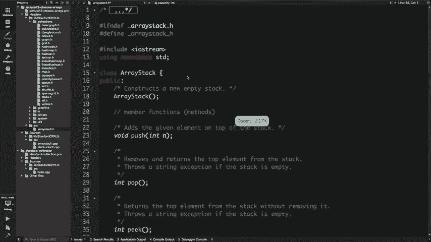

好吧，我们现在就开始吧，大家好，我叫艾莉，我是，斯坦福大学的学生我也很高兴教授一单元C ++ ，我们提供的称为CS 106 l的课程，基本上是，十多周涵盖了行业标准C ++ 。

编程以及与现实C ++相关的所有这类概念，因此，今天，我认为马蒂和阿什莉很友善，让我今天写信，因为，他们看到了价值并涵盖了学习实际c ++背后的重要性，除了您在这堂课中学到的概念之外，今天我们。

将会获得关于we ++的概述，以及它在现实生活中的外观和排序方式，您可以带走一些概念，因此，如果您确实遇到了C ++代码， ，现实生活中，您会知道如何在游戏中导航，今天的计划。

我们将从简单介绍一下我们开始，今天要做的事，然后我们将深入研究一些高级C ++功能，像模板，我们将讨论标准的C ++集合，向量图和集合的类似物的种类以及所有按实际顺序排列的，我们。

然后我们要谈论的东西叫做整数和算法，如果有时间的话，还有其他一些简洁的功能，然后我们将尝试看看，日志中的实际C ++代码，因此我们将找到一些，有趣的样子，看一下代码的外观以及我们是否愿意解析它。

以任何方式都可以，所以在我们开始之前，我想给，免责声明您今天所学到的一切，请不要在最终版本中使用，考试，因为我们花了10个星期来研究这些概念并学习，细微差别，因为就像您可以轻松地在脚上射击自己一样， 。

以此作为对未来的指导，而不是应该用于考试的内容，所以不要使用任何，这些事情还可以，所以在我们开始之前，我认为将其分类是一个好主意，花点时间思考一下自己的去向，知道所拥有的，如果您还记得自己是第一个。

则在这十周的过程中完成了，在106 B讲座中，您被告知您知道自己找到了iostream， ， int主要事物，您可以看到hello world，然后为某些对象打印hello world 。

出于某种原因说出某种叫做“内在”的东西，那么你就来了，这样，您现在对所有这些不可思议的事物有了透彻的了解，诸如递归图算法之类的编程概念，您知道该如何使用，向量，地图和链表，您知道如何使用，堆放在堆中。

您会知道所有这些都非常令人难以置信， ，你想起来这真是令人惊讶，十周之内，对，所以在一到六个我的末尾，重要的是要意识到，就像所有这些有用的令人难以置信的想法一样，实际上以任何方式特定于计算机科学。

因为您知道自己正在学习，如何系统地解决问题您正在学习如何解决，现在有系统地使用计算机解决各种问题，尝试解决那里的问题，我认为您需要教授两到三件事，我是想对我说这句话，所以您需要了解如何解决问题， 。

在课程结束时，你们都已经完成了，您将知道如何解决，您需要有一个好主意或想要解决的好问题的问题，以及，那么您在计算机科学中需要做的最后一件事就是使用一种编程语言，解决它。

所以106 B的目的是要学习艰巨的挑战性概念，解决问题的方法，但是发生的事情是很多学生离开了，类对编程非常了解，但也许，就像他们没有标准的语言来编程，然后他们进入，采访大写字母V中的正确向量，然后。

面试之后，那是什么权利，没关系，但有些，面试官，有些面试的确很重要，所以重点是，其中之一是Excel，该类将成为该类的编程语言，这三个步骤基本上可以，所以在我们开始之前，也许这是一个好主意。

谈论为什么我们应该学习C ++，所以通过这种cookie ，但是um Cephas vs。真的是很棒的语言，让您以自己想要的任何方式喜欢程序，它是面向对象的程序之一，如果您想像C一样使用它，就可以做到。

您可以做到， C ++中的函数范例也是如此，但总的来说，它只是一个非常流行的。

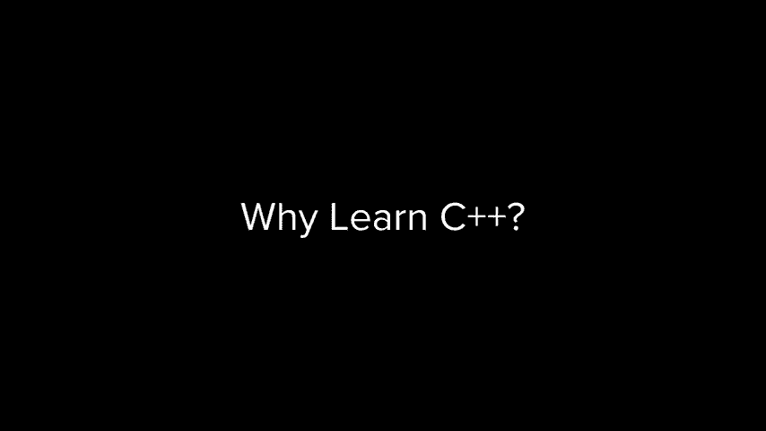

语言就像是该索引列出的最受欢迎的语言列表，编译过的C ++始终是前五名，它是最受喜爱的语言之一。

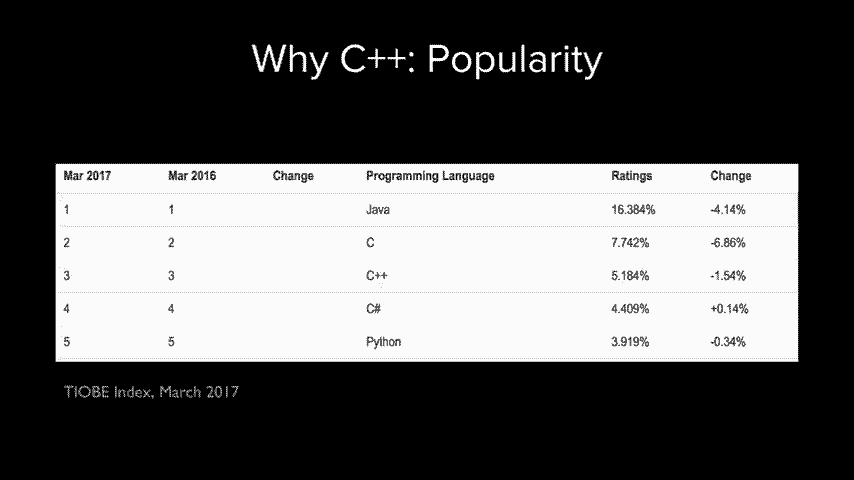

堆栈溢出，它使用的速度非常快，就像您可以看到的公司一样，一堆大牌，基本上每个浏览器都使用，编写使用它的软件，它实际上用于实现Java运行时，所以这是一个有趣的事实，你知道她在游戏和其他非常酷的系统中。

相关的事情，所以尝试和学习真的是女孩不可思议的语言，我会激发我们今天拥有什么样的出色功能，每当您有疑问时，请随时阻止我，我要走了，今天在我的网站上有更多资料，我认为我们可以涵盖，因为它是十。

一类的几周浓缩成一个星期，所以我们可以在任何地方去，感觉还不错，所以我们从谈论这个开始，真的很酷的C ++功能，因此，模板和我们将从激发这一点开始，有问题的想法，所以我们将看到人们从中遇到的问题。

使用C ++导致引入了此功能，所以这就像，这个场景是我们要玩的游戏，所以假设您正在做，进行某种编程，由于某种原因您决定，您需要一个最小的函数，该函数需要两个整数并返回较小的，这两个整数不时地出现。

就像做一件合理的事情，我告诉你如何很好地编写此函数，你会有一个函数，它需要一个int a然后一个int B，然后如果这个符号不熟悉，很好，它只是说如果a小于b返回a，否则返回B好的，所以。

简明扼要地这样做是因为我的幻灯片上没有空间了，所以，真的很合理，我们使用此函数可以传递3和5的最小值，告诉我们3是13的最小值，而8是8的最小值，如果我们通过，一个1。9和3。

7的人当我们这样做时会发生什么，需要两个整数的函数，我们将其传递给加倍的函数，对那些整数做吧，是的，truncus正确地将它们减小到整数，所以，它得到1和3，然后返回一个较小的值，右边是1，所以这是。

有点问题，您决定好吧，我也想找到最小的小飞象，加倍，所以我该怎么办，也许我会去写另一个，函数需要两个双打，所以在某种C字中，您会做什么，您将拥有两个具有相同名称但参数类型不同的函数。

然后根据您传递的参数确定要调用的参数，因此，如果我用两个双打给男人打电话，如果我通过，将叫第二个双打。 ，赢得两场胜利的人，我会称第一名，你可以继续这样做，对于其他类型。

您知道可以设置为int或min的double或min。 ，大小T ximena浮动字符的运行范围，在最小点处您知道的字符串的最小值，你必须停下来说好吧，这是不合理的，我想做的事情的编程模型。

所以这样做的问题，这样的事情是，你基本上有这些， -所有功能完全相同的副本，唯一的区别是，变量的类型以及每次您要添加新类型时都需要，添加您需要继续并复制粘贴，该函数会将类型更改为，不管您想要什么类型。

如果您稍微编辑功能，就说您，想要小于或等于而不是小于您必须去每个，这些以及用小于或等于它替换小于的权利，所以这不是很稳定的编程方式，特别是如果您有更多的话，复杂的方法，所以在C ++中。

设计师的想法就像，这样的代码确实有很大的不同，所以我们来看看这是什么样的，所有这些实现之间的根本区别抱歉，是的，好的，所以是的，就像主要区别一样，如果您看的话，那只是正确的类型。

似乎类型是此函数之间唯一的改变，所以如果，就像有更好的方法可以做到这一点，具有某种通用类型的功能，这就是那种想法， C ++中的模板是模板，实际上只是功能的蓝图。

这样您就可以将这个确切的函数用于不同的类型，这样思考，关于我们如何在主要函数上编写代码，我们仅更改类型，因此如果您看，我们有主要功能，就是用双精度替换末尾，然后，我们有它的另一个版本。

所以在C ++中使用模板的想法说，将为编译器提供此模板功能，并告诉其具体部分，什么特定类型应该是通用的，当我们在其中使用时应该替换，一种特定的方式，这样的样子让我们说我们有最小的功能，再次在int上。

我们要做的是使它成为通用模板函数，因此，与其说让我们通用，不如说，输入T即可随心所欲地命名为T ，好的，然后您要做的就是告诉编译器T是泛型，所以，只需完成这两项操作，您便有了一个min函数。

该函数可以在，任何类型基本上都可以，如果您这样考虑的话，它真的很强大，就像您如何使用此示例一样，假设我们已经编写了此分钟，照原样显示函数，可以指出要调用的函数的类型，在尖括号中指定它。

所以说我有两个整数，我想，使用我的模板函数查找这两个整数中的最小值，类型为int的人替换了模板参数，然后调用，就像一个功能，如果我加倍，我可以做同样的事情。

使用template参数键入double来调用min，然后将其称为， env好的，这是如何工作的，就像一个有趣的事情，问题也是，假设您是编译器，并且您正在查看，代码，并且您在这一行上说的很好。

用户声明为int + int a equals ， 3并且B等于9很好，我可以这样做，然后编译器转到，这行代码说我没有min int函数没有人定义mini ， int函数在任何地方都可以。

但我确实知道如何制作一个，有人告诉我给我一个千篇一律的模板，此功能应该如何，寻找任何类型，所以我只需要像替换该类型的类型，那会给我我想要的功能，所以它的作用就像从字面上看，从字面意义上讲。

它需要此模板功能，然后生成，用T取代它的功能，好吧，所以当您，实际上大部分时间都使用此功能，您也可以省去尖括号，因为它会根据参数的类型推断出您正在调用的版本，大多数时候。

所以您真的很喜欢看起来像故障的东西，但是到目前为止，对于任何类型的问题都适用，不好意思，是的，所以问题是，如果我们打最小电话时说三，还有两点九，因此您将使用不同的类型参数，这是一个很好的问题。

所以要么像两个合理的，猜测一个是它将一种转换为另一种类型，或者其他不是，会优先出现，实际上它在不编译的情况下播放，因此，不会做任何意外的事情，您会说模棱两可的呼叫无法推断出，模板或类似的东西。

这是一个很好的地方，是的，所以这是一个，还有一个很好的问题，问题是我们是否要回到这里，如果我们传入没有比较运算符的两种类型该怎么办？ ，编译器不会这样做，因此答案就像在两张幻灯片中一样，但是在。

简而言之，它将无法编译，因此具有模板功能的东西，很棒的一点是，嗯，这种隐含的想法是，任何类型的，实例化您的模板，因为它应该能够使用您使用的模板进行的所有操作，对于该方法，因此在此方法中。

我们正在比较两种类型，因此，如果您将其传递为无法比较的类型，则不会在相同的条件下进行编译，如果您通过，则在该通用方法中增加一种类型的方式，它是没有增量运算符的类型，则不会编译为一个。

那就是所谓的模板的隐式接口，唯一可以使用的类型是模板函数，满足隐式接口，这基本上是如果您替换此类型t ，与实际类型，您想使用代码编译的内容以及是否使用，如果没有的话它将编译，这实际上很重要。

这将与我们稍后要讨论的内容有关，关于模板的任何其他问题，这也是一个非常好的问题，实际上，这相当于，这个骇人听闻的事情，您需要对方法中的类型进行操作，仅适用于某些类型，因此不会针对其他类型进行编译。

大致相当于那个，但是以一种更优雅的方式，但是是的，您可以，绝对好吧，好吧，让我们检查时间吧，好吧，嗯。 ，因为你们所有人都不是，那么您在哪儿看过这种记号呢？ ，你喜欢这些尖括号，然后告诉它一种，是的。

所以当您制作矢量或地图时，您也会执行类似的操作，对，你说矢量尖括号到矢量我回括号，字符串，如果您曾经想知道它是如何工作的，这个想法与模板函数完全相同，只是它被称为模板化。

类和and的外观基本上就像我们概括的一样，函数可以执行任何类型的操作，也几乎可以将类归纳为任何类型，完全相同，几乎没有其他怪异的实现，但这是，在道德上是相同的想法，例如，我们今天要看的是你。

几周前您第一次学习记忆时，将其写成一堂课，管理，我们将讨论如何使阵列堆栈起作用，不仅适用于整数，而且适用于任何类型，因此您拥有此数组堆栈类， ，有一个推方法，然后还有其他一些方法，所以我要告诉你。

您将如何使用模板作为此类的眼睛，而不是仅仅进行操作，它可以在任何类型上运行，并且想法很相似，所以首先我们，有一个点H文件，然后是我们的点CPP文件，而且我现在只看其中一个功能，但是好的，所以。

您要做的第一件事是我们对函数所做的事情，而您替换了int ，与一般的泛型类型说T或值类型，我称之为值类型，因为我认为这是一个明确的名称，然后您就告诉编译器，值类型是通用类型，可以在类的开头添加以下代码：

 ，它在称为值类型的这种类型上进行模板化，然后您必须，在CPP文件中执行相同的操作，您首先需要更改，数组堆栈对象为竞速值类型，然后在此函数之上，实现中，您还必须说值类型是模板化类型，因此它是，有点烦人。

对于每个函数，您都必须为其加上前缀，模板类型名称值类型，然后将您的种族标签更改为种族类型值，键入好吧，所以我猜有一个错字，因为这也应该是值类型，但是忽略那好吧，然后要做的最后一件事是。

烦人且没有意义的是将所有CPP文件移动到，点H文件并删除see Felicia，因此出于某种原因将模板和，编译C ++的工作意味着您不能在接口之间拆分模板代码，和实现，它们必须一次位于同一点H条中。

曾经看过斯坦福大学的收藏，所有矢量地图和东西都在，点H文件，没有适合他们的CPP文件，是的，所以我认为。

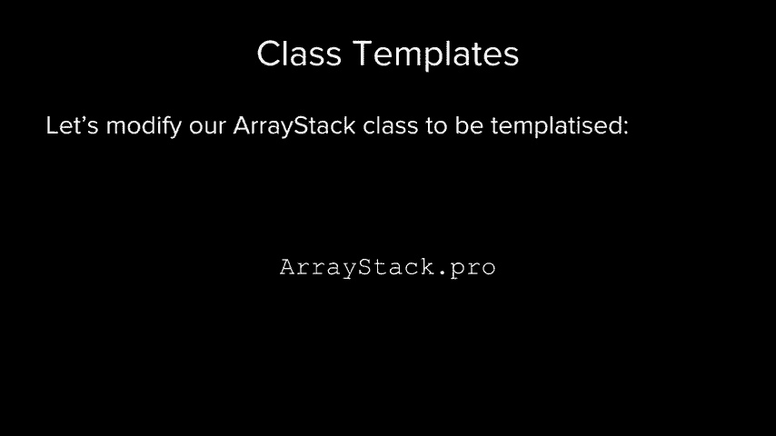

如果我们只是看一下此代码数组堆栈，然后，模板看起来有点或完全不对，所以我想作为一个更新，数组堆栈，它是由堆分配的数组支持的堆栈，因此我们有一个，具有大小和容量的int数组，称为element 。

我们有像push pop peek这样的方法是空的空字符串方法，所以这是怎么回事，被使用是我们有一个主要功能，我想那不应该在那里，我们有一个主函数，它创建一个数组堆栈，将一些整数压入其中。

我认为有些事情还可以，所以我们要做的是使这项工作顺利进行，这样我们现在就可以推入了，如果我叠放推入，我们说一串，它不会编译，因为它表示您正在尝试插入字符串，它期望在正确的位置，所以这不是通用罢工。

它只将其堆叠，为此工作，所以我们要做的是转到dot H文件，然后是模板Isis，所以我们要说的是，模板化的类，并且在此类型上进行模板化，调用值类型还可以， 。

那么让我们以交互方式进行这种操作我应该将什么更改为，值类型在此B值类型在此方法中的任何内容，是的，所以Inc ，需要是一个值类型，因为现在它在通用类型上运行，那么pop好吗。

所以它应该返回一个值类型peek应该返回一个，值类型，它仍然应该是布尔值，因为它只是检查它是否为空，这仍然是一个字符串，我们不再需要一个int数组，想要一个值类型数组，然后进行大小调整，谢谢，好吧。

所以，所以我们的模板是基于值类型的，我认为这些都是变化，您需要在此处进行操作，除非我们现在必须转到CPP文件并进行，也会发生变化，所以如果我们转到CPP文件，我们拥有所有这些东西，所以请记住我们。

需要每个人都模板化眼睛，然后说它不是数组堆栈，而是，值类型的数组堆栈，而不是数组类型的sty类中，数组堆栈值类型类，然后我们要在上面复制此模板内容，他们每个人都要做，所以我会很快做到这一点，好吧。

然后模板模板好酷，那就是，几乎，我们只需要再做一件事，对不起，这应该是，价值类型提示要做价值价值类型是您累了吗，我们必须，要做的就是将所有这些代码移至CPP文件，然后移至H文件，因此我们将转到。

下课后的底部是照顾，然后将它扔在那里，然后，我们将删除所有这些，也许可以删除文件，现在代码是，编译，但是很抱歉，是的，是的，是的，非常好的值类型，结果正确，好极了，谢谢，好，这时确实编译了，但是。

它给出一个错误，指出使用模板或堆栈需要模板，论据，因为现在我们已经概括了它，我们找到了一个，堆栈堆栈，我们需要说射线堆积在库存中，然后他们将进行编译并。

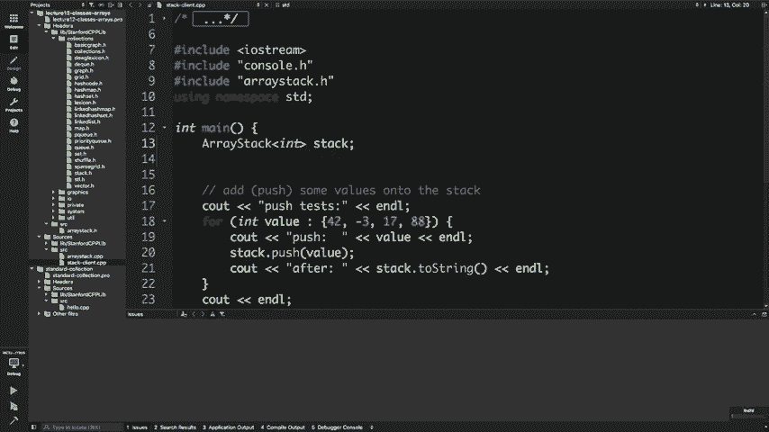

他们的工作应该与以前一样，好的，很酷，关于这个的任何问题，好的，所以。

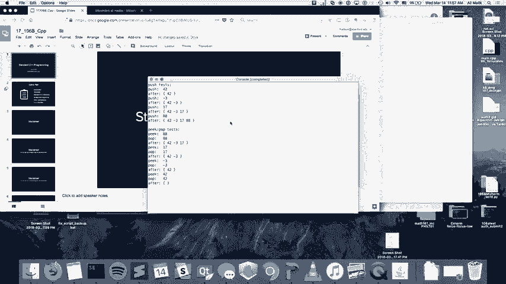

简而言之，基本上是模板化类的一些细节，您必须将所有内容移至该年龄文件，然后在所有内容前添加前缀，带有模板类型名称和一些奇怪的语法，但这大概是个主意。

如果去斯坦福大学图书馆藏书，那是一个向量， 。

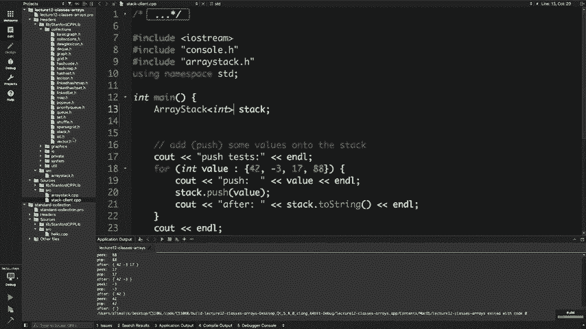

您看到的第一件事是将值类型模板化，并且具有，构造函数以及所有这些东西，实现在刺猬中，就像你可以理解的东西，好的，很酷，这是一个主题，现在我们将移至下一个主题，好的，所以嗯，您一直在使用这些东西。

矢量和地图，我想排长队或使用十周，是的，所以我只想，指出这些不是C ++和标准中的真实概念， C ++那些确切的集合或多或少地存在，所以有标准的C ++ ，具有一组包含这些容器的类和算法的库。

小写矢量上的类小写映射小写集和这些算法，排序查找，我们将在稍后讨论，还有斯坦福C ，与集合的行为几乎就像标准集合一样，除了您知道，如果您只是将标准C与集合进行交互的话，确实非常不友好，从编程开始。

所以如果您超出范围，则只是简单示例，向量如果您超出范围就不会崩溃，并且您知道它可能会崩溃，崩溃是因为您破坏了内存，否则我只会工作而您永远不会知道，因此，斯坦福CSS集合可以有效地执行基本标准。

 C ++连接可以做到，除了它们具有更好的错误消息并且它们，使用起来更简单，这是因为就像您是C ++ ，编程，您需要采用某种范例，而我们不想，浪费时间，并教会您以前应该集中精力的时间，关于概念的学习。

所以只是一个总结，所以我们在斯坦福大学，左侧的标准位于右侧，标准中的STL中没有草类，图书馆没有好处，有一个哈希映射，称为无序地图哈希集有序集向量它的通知向量已链接，列表没有案例列表MATLAB说。

是的，我们也有，优先级队列，它是小写右EQ等，所以像这样，标准中通常存在字母中的三角形或套管，库好吧，还有一些方法上的差异，但是它们。

并不是很大，但是如果有人想在他们的书中查看它，我可以在这里参考，自己的时间，所以左边有斯坦福矢量，右边的标准向量，除了看起来不是，堕落的父亲终结了某些事情，我们称之为，向后推。

因为我们将其推到您要获取的向量的后面，一个元素，其反弹的标准向量默认情况下会检查标准，如果您在一点跳动检查处调用Vida，向量不会。

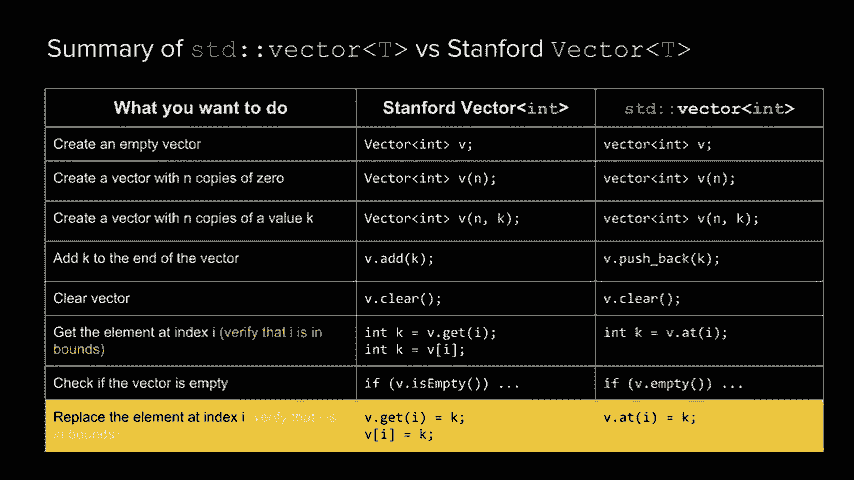

与插入相同的东西，然后您基本上可以进行其他所有操作，就像面试中最大的外卖一样，不要打电话，不要打电话推回，你看起来像是知道秘密，更快，您很快就知道了，因此，例如，我们只是使用，斯坦福大学矢量图。

我们要把它转换为第一件事，做的是小写字母V包含我们，所以我们必须包含标准向量，用尖括号将库向量我们小写，更改爸爸执行的推回操作，请注意我们在索引0处有V点插入值， 42。

现在我们在V点插入了一个称为Lead的东西，然后，我们将在第二个斯坦福向量中讨论的值42为V ，不要删除索引2处的值2，然后在此标准向量中，让领导者擦除，然后再次开始，然后再加上2 。

我们稍后再讨论的原因，所以关于，完全没有标准收藏，我真的很想了解这些东西，但是，我想变得像个*，所以很好，所以，嗯，接下来好吗，让我们，谈论这些被称为叛徒的事情我所有其他学生都是，笑。

因为这大概是10个星期，从字面上看，我们在第4、5周，现在好吧，让我们再谈叛徒以及这些又是什么，值得通过激发导致他们，发明好吧，那么叛徒是受这些想法激发的，例如你如何，迭代或如何遍历关联容器。

关联容器是地图或集合或诸如此类的无序集合，这不像不是向量，它没有关于如何执行命令的内在想法，您遍历这些容器，因此在遍历这些容器时会带有一个向量，你有指数int我等于0我小于V点大小我加加上但。

像地图或集合之类的东西，存在什么样的概念，好吧，你不能设定我等于任何东西，像第零个元素一样，因为它实际上并没有以任何可以检查的方式排序，我的不足之处在于，因为没有真正的终点元素，因为它不是，顺序容器。

所以我们要怎么处理这个问题，所以c ++有了这个，真正整洁的解决方案，就像让我们采用索引和某种抽象，将它们设置为更通用的设置，无论在什么容器上都可以使用，底层容器是什么，所以我们要尝试表现，像索引一样。

但是在像索引不能，通常可以正常工作，所以这个想法是一个迭代器或多个迭代器，在任何集合中存储位置的索引的概括，在，您可以将它们向前移动，可以比较您是否在终点，您可以开始创建一个。

并且它们允许您遍历任何集合，这样的迭代器心理模型的想法就像您有一些，并喜欢将其视为云，因为并非每个集合都是，顺序，因此更一般的思考集合的方法是，一切都很好，迭代器的想法是让您查看。

以某种线性方式进行非线性收集，所以是这个问题，可能会问的是，这种神奇的伟大事物如何发挥作用，我对您的回答是，现在不在乎，因为我们要相信它们会起作用，因为我们，让迭代器的抽象做这件事，我们只是要。

学习如何使用它们，以及是否要学习实现它们，祝您成功，所以我们现在就使用它们，但是想法是，如果您牢记，这非常直观，我们试图表现得像索引，但，可以更一般地工作，所以假设您有一个集合，并且迭代器是。

让您以线性方式查看此集合，因此如果您有索引，如果您有迭代器，您会说让我让我从第0个索引开始，让我从开始的迭代器开始，以便您调用collections变量，名称点开始，它会给你一个迭代器指向，序列。

您想将其存储在某种变量中，以便将其存储，在名为ITER etre的变量中，它具有某种类型，而该类型实际上是，在您使用的类中定义，因此如果我的集合是一个int集合，然后在set int类中有一个迭代器。

需要迭代器时将引用的类型，因此，回顾一下，您将第0个索引迭代器作为开始的迭代器，并将其串入变量中，并定义此迭代器的类型，在类中，所以看起来像是您有一个指向的迭代器，如果您想获得实际的东西。

那么从现在开始您的第零件事，此迭代器的结尾，因此如果您要，得到这个迭代器所指的是你用星号取消引用它，运算符，所以如果我想打印击球手的当前值，我会看到，在Eldo上出明星，是的，现在可以打印一张，我要。

我是否想移到收藏夹中的下一件商品上，以便我前进，通过调用加号加迭代器，所以我说加传递它，否则它将移动到，下一个，然后我可以再次取消引用来打印它，现在打印，两个我可以将其打印前进将其打印。

然后以某种方式我需要，能够检查我是否到达右端，因此对于建模索引，我们有0和，我们的尺寸小于v-dub，或者我们要确保在以下情况下停止播放，我们的收藏已经结束了一个，因此，经过迭代。

您可以做完全相同的事情，有一个叫做，您可以比较自己的最终迭代器，最终迭代器是一个，超过收藏的末尾，因此您可以说我的食者是否终止，质量是最后的迭代器，还可以，所以它实际上没有任何作用，与索引不同。

但它将在更一般的环境下工作，这就是，它的功能强大，所以您可以创建活动摘要，如果他们想知道的话，请参考他们，并进行比较，这看起来很像一个指针，当我们尝试迭代器时， ，它们看起来像指针。

现在您知道值得问为什么地球上有人，如果不需要的话，希望它看起来像一个指针，这个想法就像程序员非常熟悉指针的想法，所以，他们使迭代器的语法看起来和行为像，指针将是因为所有指针都是整数，而其他文献都是。

指针，是的，这个想法好极了，如果您有，向量（三分之二）中，您向其中添加了一些东西，如何将其扔到for循环中，所以通常如果你有一个向量，你将有四个整数，我等于零，我小于，大小加号的提要加号。

现在您将向量放入了迭代器，类型，向量类中的迭代器从V点开始或迭代为零开始，继续前进，直到我们点击结束迭代器，然后每次都增加就可以了，关于这个的问题，太酷了，还有更多关于。

装饰器最标准的实际上每个标准集合都有迭代器，您可以使用甚至可以索引的向量，建议您使用，迭代排序，所以当您对vector进行运算并调用insert数组时， ，不要告诉它要插入的索引，或者告诉您索引在哪里。

引发什么迭代器，这就是我们让V点开始加上两个，当我们删除第二个元素而不是DDOT擦除时-好的，因此，鉴于我们了解的情况，您可以考虑一下一个简单的问题，模板，这是隐式接口，如果，无论您传递哪种类型。

它都可以在模板函数中调用这些方法？ ，通过具有迭代器的标准接口以及诸如此类的东西，可以获得很多收益，可能那里有东西，所以我不会，这只是给你的东西，考虑使用标准接口闭塞器有什么好处，嗯，好吧。

所以这直接导致了下一个想法，在C ++中， ，这些东西叫做算法，基本上就像程序员梦dream以求的，就像一些真正聪明的人坐下来实施所有，这些算法，它们将可用于任何具有迭代器的类，因此。

接下来是算法的动机，我想要排序函数，好吧，我可以编写一个排序函数，该函数将采用一个int向量并将其排序或，我可以编写一个排序函数，该函数需要一个迭代器开始和一个迭代器，并对该范围内的所有东西进行排序。

现在这个困难的方法将可以处理向量，列出它将对我有用的任何可以提供迭代器的集合，还是不太好，所以使用在迭代器上运行的标准算法，他们可以，这使他们可以工作很多次，并且严重依赖模板，因此，这是所有算法的列表。

所以有一些非常有用的算法，所以，从一个迭代器范围复制到另一个迭代器的标准副本，标准相等者检查范围是否等于，您拥有max元素的东西，该元素在迭代器中返回max元素。

我不知道的范围让我们看看我喜欢这个有趣的其他事物，我在编程采访中和那个人在一起的算法故事，就像是的，所以他在那里询问有关某种，修改过的二进制搜索，您不想找到元素，您想找到小于或等于我想要的最大元素。

就像给定元素的最大最小最小上限一样，经过研究修改，您可以做，而我和我合而为一，因为，有一种称为标准上限的算法可以做到这一点， ，像我这样的程序员和面试官都不知道那是怎么回事，这是有机的，是登录的。

是做身体搜索的，就像，是的，很酷，当您喜欢精通算法编程时，让我们真正走吧，首先在锡瓦斯（Sivas）是我不可思议的，所以如果您喜欢看国际电影， ，编程竞赛或几乎总是高层团队首先使用C +的竞赛。

因为他们要做好什么，所以写了一个集合提供迭代器，火花，然后他们可以完美地使用这些算法而无需，要做任何事情，这真的是一个强大的概念，好吧，所以我们，可能没有时间去实际研究其中一些算法，但是我。

绝对鼓励您到目前为止浏览所有问题，如果您有一个一般性的问题，就不必特定，围绕这些主题， ，好的，很酷，所以大概是第六周， Excel，现在我想只是为了结束一点，我们可以谈谈其他一些问题。

整洁的功能真的很棒，所以我首先要谈的是，再次声明免责声明不要在您的期末考试中使用它，效果不是很好，所以只在一个之外进行划分，在Sivas fest中如此整洁的功能是名为Auto的东西，嗯。

这是一个非常酷的超级酱功能，可让您键入演绎，变量的类型，所以如果变量的类型很明显，这个主意是um ，所以我将x等于3就是说x等于3很明显，三是整数，所以我可能会告诉编译器弄清楚类型。

 X的int值是int，所以我能写类似Auto x等于3的东西，编译器会发现X的类型是int，所以我将显示，一些使用它的示例，但是您不应该滥用它，而应该使用，在现实生活中尽可能地做到这一点。

而不是在期末考试中，这个想法就像，只要某物的类型非常明显，就应该使用“自动” ， C ++中也有一些高级的地方，但您不知道类型，在编译时，所以您在那儿用完了，所以有点，例如，您可以使Auto x等于3。

编译器会说“ X” ，就像一个int我可以弄清楚在编译时您可以说Auto VSAT ，等于图以获取顶点集，然后我会得出V集是一组顶点，通过查看获取顶点集功能的签名和。

我认为最有用的地方也就像在迭代器中一样， ，迭代器就像可怕的事情一样，是的，就像set int Colon Colon迭代器一样，这是正确的类型，因此能够执行自动ID也非常好，因此，这是最常见的用例。

通常是某人的叛徒，照片我认为还可以，所以一旦我决定与此无关， CS 106是您如何遍历一套，例如，这只是一个问题，应该，是的，所以您已经有了一些东西。

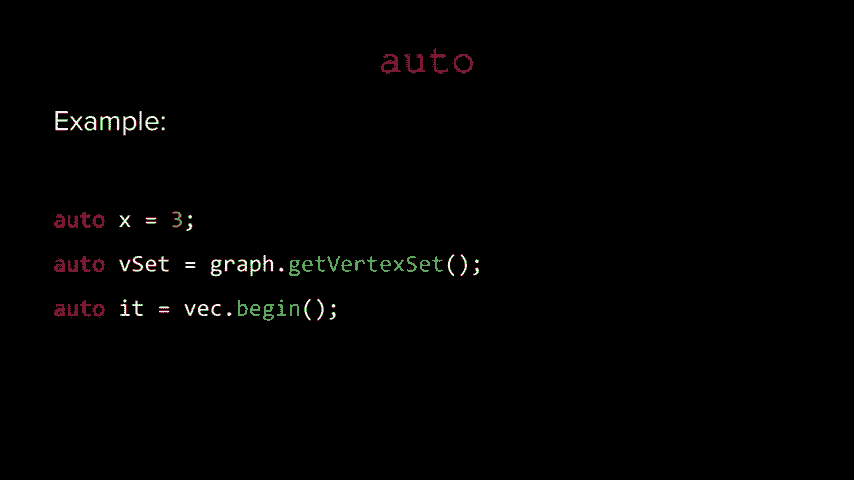

我想假设您有一套，好吧，好吧，到目前为止，当你有一个，设定您的浏览方式，就是您在X中所说的那四个，我们称之为，这是int的意思，还是我们自己称呼它，所以为索引我的集合，我们说C out X 。

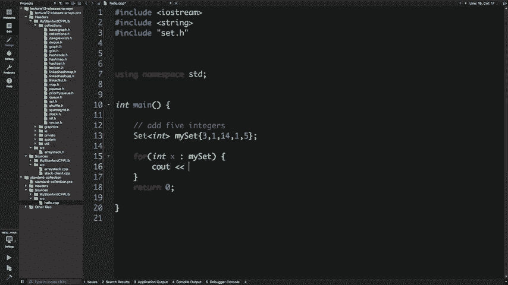

正确的，这样做会在对不起的地方打印，这样就可以了。

这是我们正在打印的东西吗。

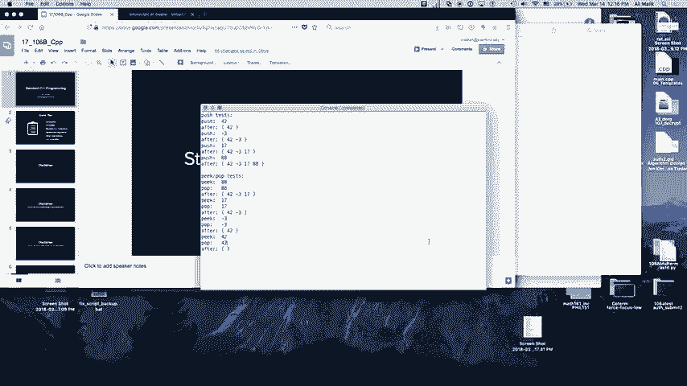

好吧，无论出于什么原因都在这里打印，但是知道吧，嗯，它会旋转集合中的所有内容，因此实际上这是简写，某种迭代器代码，所以实际上在我们做任何事情之前，您会如何用迭代器很好地编写此代码，对于自动IT来说。

它等于我，今天的行业，所以对于我来说等于零，但在设定的实验室中IT不等于BI ，先进的I 2和C输出，或者说x等于IT指向的东西，到X让我看看，所以如果我同时运行这两个代码，这些代码将打印，第二选择。

实际上每个循环都确实是语法糖，为此，这只是它的简写，所以实际上，斯坦福大学说，斯坦福实验室提供迭代器，这使您可以执行，如果您为集合提供迭代器，就可以使用类似的方法，该符号。

它将进行编译并移至每个循环的简写形式。

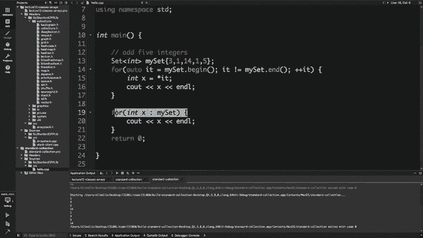

对于这一件事，我们谈论的还不错，所以我们可能会谈及另一件事，不会过多谈论的是，我们有一个叫做lambdas的东西， ，内联函数，对我们来说，一旦您习惯了它们，它真的很整洁，这些以多种语言存在。

但基本上是您可以，即时运行函数，而不是将它们声明为函数，使它们具有可变性，因此看起来像这样，忘记了捕获的内容，列表是针对此类的，但是您具有函数的参数，箭头和，然后是返回类型，然后如果您像这样编写函数。

通常，例如，您在打印功能中忘记了，捕获列表需要一个整数参数，返回类型为void，因此，您可以将返回类型留在凉鞋外面，然后终止，该函数，因此您已经将该函数存储了一个变量，然后您可以，像普通函数一样调用它。

您可以像在另一个函数中那样进行操作，功能，所以非常酷另一个例子是，如果您想使用，排序算法，因此标准排序算法需要迭代器时代，所以你说的是范围V点从头到尾排序，然后使用，您可以将比较函数传递给它的比较函数。

是根据我大于J的事实对它们进行排序，第一个是，肯定以相反的顺序基本上是的，所以这些实际上存在，几乎每种现代语言都支持，因此Python绝对支持JavaScript ， Java事件，但还有一点。

然后是C ++，如果剩下的话真的很酷，好，我们大约有两分钟，所以我只想，总结一下这个非常酷的东西，这是我一直在寻找的好东西，真实的C ++代码示例，编写得很好，而且我讨厌，这么说。

比特币的第一次切工写得非常好，所以我们要，是的，我的身高不高，但是代码写得很好，所以我。

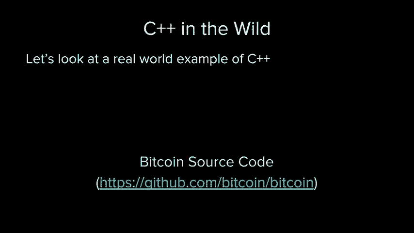

以为我们只是很快地看了一下，所以看到了一些我们已经，今天谈到，所以这是它在github上的比特币源代码，然后转到SRC文件夹，您会注意到很多C ++，因此点号为， CPU启动。

因此任何人都想单击以查看Rho链接，嗯，让我们用CBD的18个硬币来点，听起来好像是一堂课，所以说比特币点H就是一堂课，里面有一些其他的类，它正在初始化一些东西，并且有一些，方法具有一些模板化函数。

可在其看起来的任何流上运行，就像这里的东西和其他班级一样，如果我们看起来，有一个无序的实验室，它是一个哈希图，就像我们看到的那样， CPP文件，与您实现硬币类外观的方法相同，它为点返回一个迭代器，是的。

如果是迭代器，则是正确的，不等于现金硬币事件，所以真的像我不是什么，不是这样，实际上是编写了超大型代码，您不使用索引，而是使用迭代，他不在位，所有这些想法又是另一个整数，依此类推，所以我。

鼓励您自己看一看，但我认为，谢谢你。

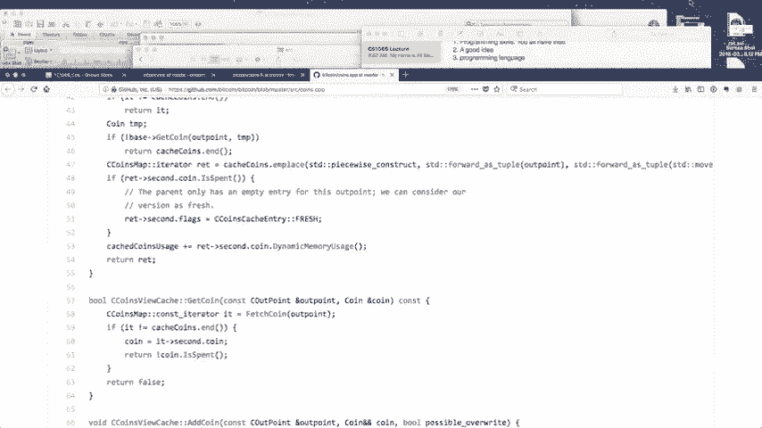