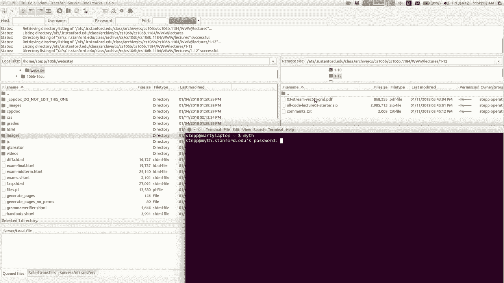
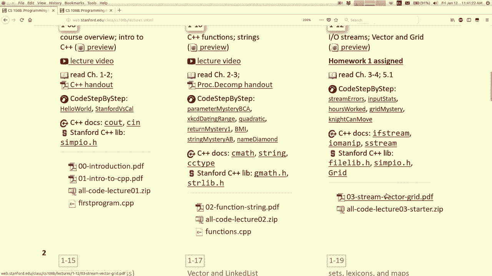
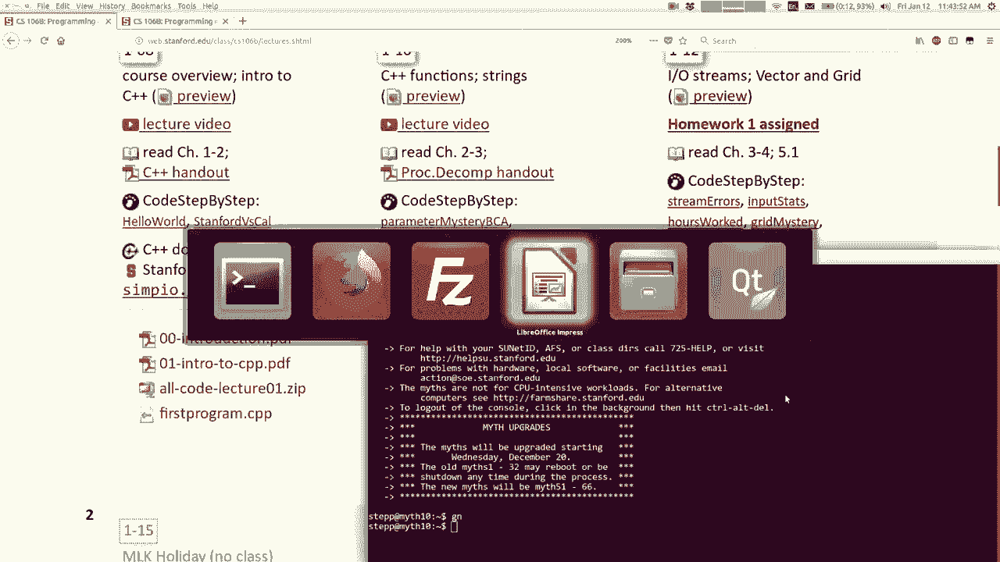
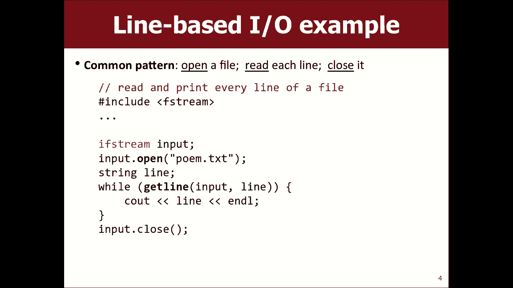
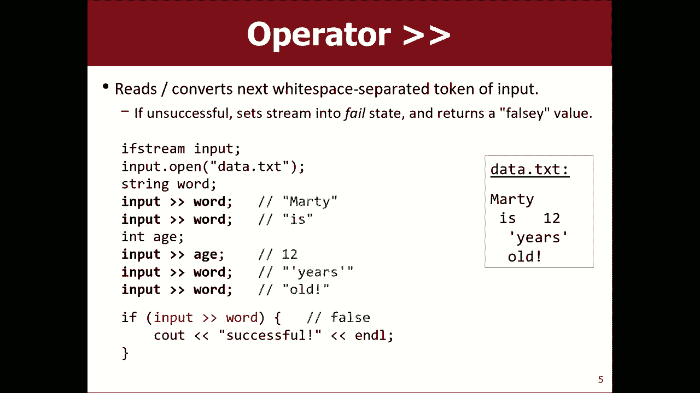
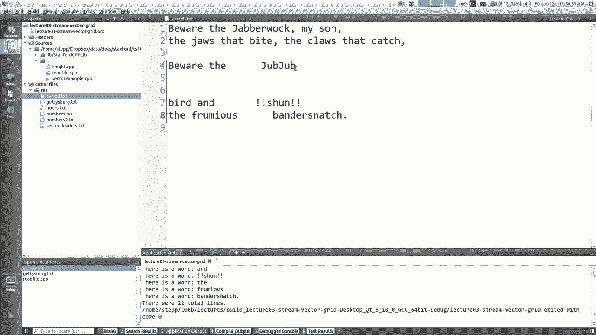
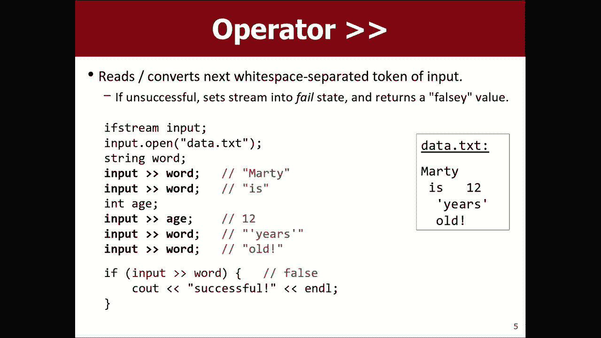
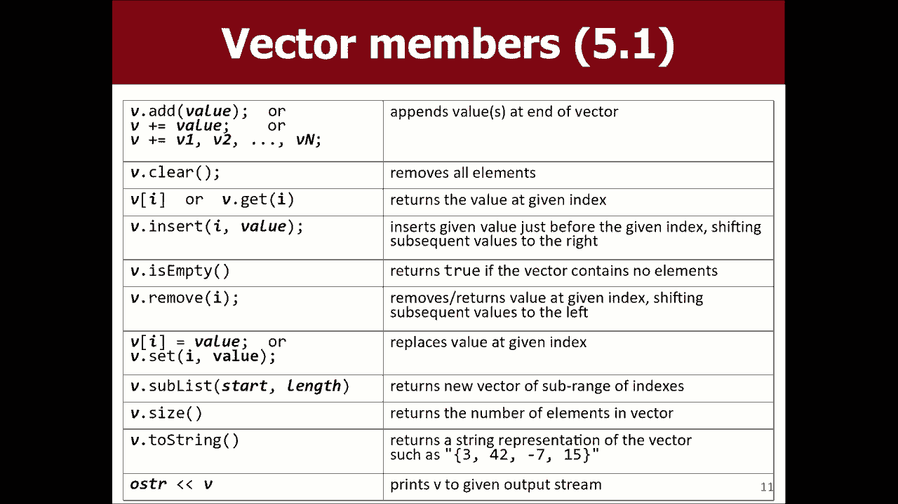

# 【斯坦福大学】CS106B C++中的抽象编程 · 2018年冬（完结·中英字幕·机翻） - P3：【Lecture 03】CS106B Programming Abstractions in C++ Win 2018 - 鬼谷良师 - BV1G7411k7jG

好吧，我想我们回来了，真抱歉， mm-hmm，让我们继续前进或质疑，继续吧，哦，不是吗，我不知道坚持下去对我来说真的很好，所以。

如果没有，我可以在这里补上，让我们来数一下我的时间，今天黑鞋要花多长时间，是不是当你们转到我的网站时您看不到它吗？ 。

现在怎么样了，现在好吧，所以应该抱歉，出了点问题好吗是的出了什么问题了是怎么回事。

好吧，确定的问题是我打个招呼再加上他们很高，然后我得到， x等于那里，所以每当字面量读，关闭，这是我的专业，是一个老式脚本，表示它无法正常运行，韦伯斯特禁止没有任何东西，这些链接到整个国家的链接。

但是当您将其存储到变量中，屏幕类型的屏幕类型是直行的新C ++类型，我们，所有类型的屏幕，而不是人的屏幕，都会放入其中，执行隐式转换，将其转变为新的好人，经典的纸弦。

所以我们在那一刻就可以在变量中键入三个，您必须写护理之星，我不想谈论太多，因为，那通常不是您想在我们班上做的，但是您可以存储，他们只是我们最不希望以这种形式使用它们，好吧，我们很抱歉。

关于所有的破坏和手指的所有碰撞我都没有，我又有一次中断，希望我能以某种方式将此归咎于Mac，这样对，我运行的是Linux，所以没有任何意义，但是大多数事情还是苹果的错，好的。

所以我不会花更多时间在C字符串上，我想让你摆脱的是，有些奇怪的事情，可能会看到您在做什么，而您似乎在做些无辜的事情，代码，但是您得到了一个非常奇怪的结果，如果发生这种情况，我只是想，这个小灯泡继续发光。

我等一下马蒂告诉我，关于这两种琴弦有些奇怪的事情，也许去看看，这些幻灯片会仔细检查您是否正在，您的代码，如果可以，请尽量避免，想出了一个不同的模式，我认为这是第一件事。

可以避免这种奇怪的事情是只要在使用字符串时，如果您要进行任何类型的操作，则可以将其存储在字符串变量中，太极端了，请不要尝试在引号中操作字符串。 ，存储这是您可以做的第一件事，我想避免。

在您的程序中出现怪异字样，所以我想说的是。

我想谈谈今天的幻灯片，是的，所以我想我。

想想也许您的问题是关于这些幻灯片在哪里，我一直在寻找，从上周三的演讲到现在为止的幻灯片，为什么也许很难找到那些星期三的东西，所以阅读，文件是通过称为流的对象完成的，所以我的意思是我假设您已经。

查看了您之前从文件或其他来源读取数据的数据，只是想向您展示如何在C ++中做到这一点，然后我想要，谈论如何使用称为aa网格和向量的数据结构，所以尖括号，所以您知道系统库是否称为F屏幕，该库中的mr。

four文件屏幕，您可以使用两个类，如果在流外流调用这些对象，则这些对象允许您拉字节和，因此从技术上讲，所有这些不同的流都属于这一类别， ，继承层次结构，但我将在稍后的内容中讨论继承。

这些基本上都是具有相似操作的所有相关数据类型，如果要查找所有不同的方法和事物，可以执行，您可以查看C ++文档，并详细了解它们。 ，向您展示他们认为可以用来读取文件的一些方法，在此类中。

如果您创建文件流，则可以打开给定的文件，然后，然后，一旦打开它，就会有一些不同的时间来读取一半的，文件，然后像您到达末尾一样关闭，文件，但是我是否无法打开文件，有一些类似的东西。

你可以用蓝色做的是我认为你使用得最好的，所以我认为看这个不是超级有帮助，我认为看一个例子是，更有用，所以让我向您展示一张带有示例的幻灯片，这是一个非常典型的例子，包含F流库的文件读取示例，您声明了一个。

类型变量，如果您只是写一个文件名，则流式播放您的公开诗歌文本，在该目录中，它将转到您正在运行代码的目录，因此，在我们的项目中，这可能就是我们所说的，但您也可以将，像斜线一样的路径。

如果要现在将文件正斜线，则将斜线点，从该文档中读取，然后从中实际读取数据的方式，该文件看起来可能与Java或JavaScript或，无论您声明一个名为line的变量，然后在获取line时说，打印这一行。

使这行代码与这个循环在这里是，它从输入中读取行并将其存储在该变量中，看起来有点奇怪，这不是代码构造的方式吗？ ，关于这个功能的参数是那些，好吧，那是正确的。

我对我之前说的get line方法还有什么了解，变得盲目，那么get line方法的返回类型是什么，是的，如果它能够成功地在线阅读并且基本上返回true ，如果不是。

则返回false循环将读取该行并将其存储在该行中，行变量并返回true，否则将无法读取该行并返回false ，在这种情况下，循环将不再重复， ，代码，但这就是您在C ++中用多种语言读取文件的方式。

您有点打开文件读取对象，然后说出类似，食尸鬼重新绑定了更多的流线或类似内容，有点不同，但这是在同一行读取一行的想法，时间还可以，另一件事看起来与其他语言略有不同，就像我说的是，如果流输入打开。

则看起来与，像Java这样的东西，您可能会说得好，再加上您不这样做，您只会，说出类型和名称分号，对我来说，他现在就可以使用了，我希望可以在其中，我们在这里有不同的语法，是的，他的问题是。

如果我尝试打开文件但不起作用怎么办？ ，知道它在Java中失败了吗？ ，语言以及如何检查这些错误，我将告诉您，想想一两张幻灯片，我会回答说，基本上有一个，您可以询问文件是否无法打开的方法，但是无论如何。

这是。

读取文件模式，所以让我去找可爱的创作者，我有一个文件，这里称为读取文件点CPP，然后我在其他，文件我有这个资源文件夹，其中有一些不同的文件，就像我，有葛底斯堡地址，我有一些刘易斯·卡洛尔，你通过。

窥镜类型的东西，所以如果我想读这篇文章，我可以加入EF ，流，然后我可以做一些类似您知道的字符串的操作，实际上我，猜猜我必须先打开文件，如果流输入可以调用任何文件，如果我想阅读刚才查看的文件。

则需要输入打开的Carol点txt ，现在，我可以从输入中获得一行并将其放入行中，变量我在那之前有一条声明行，我会知道你是否知道，这是一个冒号线句柄，所以这样的事情我不认为。

我想起了我那小小的弯曲的操作员，在这里我的鳄鱼所以我现在跑步，这个，它说这是一行，并且我每次打印一行，正确读取文件，因此您可以进行各种操作，这种权利就像如果您只想计算文件中的行数，您说int行等于零。

然后在这里说行加号和，那么你知道看到总行数就是这样，正确的是，您可以对文件进行各种各样的处理，很简单，您只需计算行数，以此类推，嗯，您知道，提到像如果文件不存在怎么办，如果我像卡罗尔这样写，点txt。

而我拼写错误的字词比您所看到的要多，总行数为零，因此程序不喜欢崩溃或它们只是，像Java，如果您尝试打开文件不存在整个程序，例如，爆炸，您的硬盘驱动器开始熔化，或者我认为计算机。

开始自动为您或我不知道的东西开采比特币，但我，想到我应该去上课， OTO挖矿时去挖比特币我会很富有，但我不够聪明，可以正常工作，但是无论如何，如果您无法，打开文件，然后当您尝试从文件中读取一行时。

立即失败，所以我的循环从未真正进入正确的状态，而是我将如何，检查是否有一个叫做fail的方法，就像布尔值一样。

您尝试对该文件做的最后一件事失败了，所以我可以说，如果。

输入处于失败状态，那么我可以说你知道， womp-womp或其他任何我可以收获的错误，但是我可以做的所有事情，是的，但是如果没有失败，我可以尝试像这样读取文件的行。

所以我认为Carroll点文字会说womp womp，然后如果我将其拼写为，用O的正确方式，它会立即从火中读取此内容，这是一种，问题的答案，嗯，好吧，反正这很普遍。

一次读取一行的样式，样式下还有另一行，人们有时会写东西，我认为这太微妙了，以至于您真的不知道自己是否，还没读过这本书，那么如果，您尝试做的最后一件事是失败的，因此，如果您考虑一些，分钟，您将意识到。

这段代码，所以它就像最后一个空行，它不应该在这里或取决于您，读取，因为如果您在其中编写代码，基本上它会循环两个人一次，这是很普通的事情，我猜我必须说三行，只是真正复制此模板。

这是如何阅读它们的格式可以使用，我认为getline作为您的循环测试不要使用失败或在文件中作为您的循环测试，就工作和正确而言，这也很好，是的，但是就像，您在计算需要确保不循环的行数，很多次。

因为您计算的cuz会减少一个，这样的事情还可以，所以，如果您想读取少于一行的内容，这就是读取行数的方法，只是阅读单词输入标记，我们有时会谈论标记输入，这意味着寻找空白并在两者之间切分输入。

空格空格实际上可以是空格字符，制表符可能是换行符，任何这些的任何组合都称为，空格分隔，所以这是这笔钱的数据文件示例，好久了，所有的空间都有趣，所以如果您打开文件，使用get行的方法。

您实际上可以使用大于大于大于运算符，从输入中读取内容并将其存储到字符串变量中，它将，一次读一个单词，而不是一次一行，所以你把箭头词读了这个词打sn事件变量，所以它得到了马蒂。

现在我要做的是这次我再次使用，一个it变量注意，我说的是每个输入箭头，因此它实际上读取下一个，输入的令牌对我来说将其转换为int，并将其放入该变量，如果，输入的下一个标记不是您可以将其视为int的东西。

一个单词或其他东西，它将失败，并将其保留为零， ，该令牌的非空白内容的一部分，这样您就可以，读这个单词，另一个有趣的事情是整体操作，应用，因此您实际上可以将其用作if测试或while测试，因此实际上。

最后一个循环的类似格式，如果我有，而不是行，该怎么办，正要数单词，所以如果我代替此行而不是我称呼此标记或，所以我顺便读了一些记号，你看到我是怎么做到的，我这样做是不是太酷了，就像我按班次可以改名字一样。

 ctrl R，无论如何，如果您说代币，它都会重命名um，我是如何学习的，我不是我不是魔法，只是右键单击，就像重构，重命名，如果您查看这些菜单，则可以在此处找到所需的热键。 ，所以无论如何。

如果您在输入箭头标记时说，基本上意味着，当我成功读取来自，输入继续进行，所以它说要当心我儿子Jabberwock，注意一点，逗号在正确的单词上，应该说全部单词，但这是我正在阅读，一次输入一个单词。

它不在乎之间有多少空格，就像我进来，然后说朱布朱鸟，你知道如果你在这里放不同的东西，你会知道它不会破裂，我更改间距，它仍然有22个单词，因为它只是跳过所有单词，空格好吧，是的。

较大的正负号表示流提取是什么意思。

运算符，您可以在文件上使用它，这意味着像从该位置提取数据并将其作为参考，变量在右边，所以提取一个数据是否，它是一个令牌或一个int或存储在该内存位置中的任何内容，变量。

这与找出我们少于多少东西的情况相反，像发送信息，只是报价，是不是。

如果我有一个像这样的东西，然后我有一个，美元符号或其他任何符号，然后我拥有此符号或诸如此类的符号，是的，它将所有这些东西都视为一个单词，因为它只是寻找一个，周围有空格的字符序列以及该序列，变成灰褐色。

回到您下注的幻灯片。

哦，是的，如果我没有做任何除法，如果您在，如果您只是将输入的箭头词放到原处，则将其重复表示，发生的事情是他会读12，但它是流引用12，所以我们，会将12存储为带有字符1 2的流，是的。

所以我认为当数据格式不匹配时会变得棘手。

您正在尝试这样做，如果我改为说int令牌，那么我认为，您会看到它尝试读取要提防的文件的第一个令牌，它尝试将其作为整数返回给我，但未成功，因此没有，修改该int变量，此测试的布尔类型表示，失败了。

所以我会是个错误，所以while循环基本上停止了，如果您，尝试以错误的方式阅读不成功，而您的操作只是，基本上会失败，因此如果成功，基于该成功的循环将停止运行，您想跳过它，或者您必须要做的是。

以字符串的形式读取每个字符串，并且在我们的库中有一个名为string的方法，整数，所以如果这个东西可以变成int，就必须说得很好，然后int N等于整数或字符串到整数令牌，然后我说， int令牌是。

所以就像如果我返回文件，则42 Jabar晃动我的文件，儿子的7个颚咬住了19个爪子，它们抓住了所有正确的东西，所以现在大声疾呼，我怎么把这些整数和字符串过滤到，整数还是未找到。

您认为包含我认为是的东西是什么错误，来自sturer lib，您可能会说jeez我如何保持所有这些库的直通，别担心，我给你做作业我已经为你准备好了所有东西，没关系，所以在这里说嘿令牌是42。

所以它能够告诉，哪些令牌在Sanh中，哪些没有问题，是的，是的，如果分隔符不是空格怎么办，我会忘记如何做，有一种方法可以做到，如果您想分开，我从不使用它，除了空格，我们实际上还有一个可以调用的方法。

称为字符串拆分，然后使用字符串和定界符，它将返回令牌列表，因此，我要做的是，我只用绿色这个字就读了整行，然后我打电话，弹簧就行了，然后我得到了所有零件的组合，所以我只用，当我想在空格上分割时。

如果我想在某些东西上分割，那不是，我不尝试弯曲以使用其他拆分方法的空格，我们今天不需要拆分字符串，但是如果您在，逐个读取令牌会丢失空白的含义，因此您，如果您关心行的位置，实际上不知道换行符在哪里。

休息时间是您应该逐行阅读，然后您说的很好，但在，行，我希望令牌有一些方法可以使屏幕读取一个，行，或者您可以使用for循环逐行地遍历行的字符，然后抓住括号I，然后以这种方式查看字符，以便您，换行符。

但您也很关心换行符的内容，可以做类似这样的组合方法，好吧，我不要，花大量时间阅读文件，因为我一般认为。

依序阅读一些东西，然后看片是你的事情，应该有一些不需要的读取文件方法，现在可以解决这些问题，但是有一些方法可以用来创建和测试，目录和删除文件，这里有可以帮助您的方法，与文件相关的东西，还有一个文件存在。

就像我告诉你的那样，我检查打开是否失败的示例，我什至可以避免，通过首先询问文件是否存在然后我错误地打开文件，不必等待它失败，因此您可以执行其他操作，我想现在谈，但是剩下的课我想谈谈我们。

下周将详细讨论收藏，我假设您，参加此类课程的人有点用集合来存储数据，所以说集合，我的意思是像一个数组，一个ArrayList，一个hashmap之类的东西，字典我只是某种方式来存储多个数据，一件事。

一个变量，我假设如果您没有，我之前已经看过，希望您能达到五个并熟悉它，概念上，我们基本上一个集合是潜在多个对象之后的一个对象，数据元素有时您称其为数据结构，即您存储的事物。

集合内部被称为C ++中集合的元素，是一个集合库，其语言称为，标准模板库STL，它非常强大，功能非常强大，在斯坦福大学学习这门课程的人，认为这套内置收藏对学生来说很难，了解如果您做了某件事。

它不会给您很好的错误信息，错误的是，某些事情很容易克服崩溃和他们认为的错误，学习不是很好，所以我们在这里有自己的收藏集，我们称其为Stanford C ++库SPL而不是Sto的Stanford，因为。

这一点都不令人困惑，我们有自己的收藏夹，我们想使用，那些在这门课程中的人，有些人听到后会产生强烈的反应，这些信息，他们说我不想学习斯坦福的东西，我想，学习真正的C ++停止知识，我同情这种心态。

但我想我，会说如果您想学习真正的东西，我会在课程结束时教给您，我们首先学习简单的东西之后的课程，如果您真的，真的想学习真正的东西，你可以参加106年级的，现在提供，他们进行债务的真正收集，所以它不是。

如果您愿意，您不可能在这所大学学习这些东西，但是我们，认为我们的系列更适合于学习，因为它们更简单，更好的错误消息之类的东西，所以我将向您展示一些，现在这些集合以及如何在程序中使用它们。

我想向您展示的集合称为向量向量有时称为向量， list或ArrayList（如果您做了工作），我使用ArrayList向量几乎就像一个，难以评分，因此向量是元素的集合，这些元素的索引以零开头。

向量最酷的地方是它可以改变大小，您可以向其中添加东西，它会增长，您可以从中删除内容，并且会以Java等某些语言出现条纹，有一个叫做数组的集合，它的大小是固定的，不能改变，如果您选择向量的大小。

则可以克服该限制，来自JavaScript的JavaScript调整大小的内置数组，因此您可以，去一个向量由任何词向量声明，然后将要存储的元素类型放入列表中，我将有一个整数列表。

或者您可以建立整数的内容，随着时间的流逝，矢量会不断增长，以增加矢量的内容，所以我添加了炖肉，我吃了马蒂，插入IDI，随着程序的进行，我可以使事情发展，这就是，如果您来自Java，向量又是。

您只需要声明它是分号列表就可以了，它是空的，已经准备好了，使用还可以，为什么不使用数组，向量基本上就是一个数组短，答案数组在C ++中吹响，它从某个著名人物那里得到了提示。

是C ++中的船舶呼叫数据结构哦，太早了，让我们不再谈论它，嗯，我冒犯了人们，C ++中的数组不好，它们不能很好地工作， ，如果您做错了事，则没有太多功能，这无济于事，您修复它会导致非常奇怪的错误。

特别是C ++具有此功能，它被称为不做边界检查，所以如果你做一个大小数组， 5然后转到元素6或7或8，即使没有元素，它也可以让您，它只是进入那个记忆中会发生的一切，然后说到这里，它给你。

所以这可能是垃圾，或者可能崩溃或各种，不好的事情，所以数组是不好的，我们不喜欢它们，向量避免了其中的某些事情，我们不打算在课堂上稍后使用竞赛，我们可能会稍微使用数组，好吧，无论如何在C ++中有数组。

它们很烂，我们不会使用它们，所以，这是向量具有的一些方法，可以添加元素，可以，可以删除内容，可以清除内容，可以设置并获取值，您可以使用更少的索引来打印不同的索引，除非一个或两个运算符，字符串方法。

如果您在， Java，它几乎是完全相同的一组方法，因此非常酷，就像。

回到我的文件程序中，您必须包含较少的向量H，但是，可以做类似嘿的事情，我想存储所有您可以说的令牌，向量字符串所有单词，然后当您阅读每个单词时，您可以将所有单词相加，单词或令牌，或者我所说的任何东西。

您都可以阅读其中的每个单词，将其存储在向量中，然后当您完成操作时可以说这里是，总而言之，endl并将其全部打印在一个大列表中，所以我有。

我可以环顾他们的话我可以看着他们我可以对它们进行排序我可以做各种各样的事情，很好的东西，它们现在存储在列表中，好吧，很多方法，我。

不会说如果您之前使用过这样的结构，他们会非常困惑，所以我不会在每个文档上花费大量时间，在课程网站上，如果您单击stanford c ++库链接，则存在链接，如果您对它们有好奇心。

可以将所有这些东西的文档，您想遍历向量的元素以对每个元素做某事或，检查每一个或打印每一个这里有一些方法可以做到，您读了从0到向量大小的for循环，因为您知道，第一个索引是数字0。

最后一个索引是大小减去1，所以如果您去，小于大小，它会增加大小减去1，这就是您想要的循环，在元素上转到元素I Prine元素，您会注意到您，说的意思是我把那个里面的支架换成循环吃巧克力吗。

记住如果使用盲文可以访问元素或dudx，请记住，说点让你不要来，如果你是从AJ来的，那没关系，嗯，但是在Java中，您必须关闭方法和帮派才能访问内容，作为C ++中的索引。

您可以像使用字符串一样使用方括号，以及其他任何类型的数据，都可以，因此您可以打印，元素，如果您想向后看，则反向打印元素，顺序中每个都有一个叫做a的东西，所以语法有点，清洁程序。

您不必使用所有索引和for循环标头语法， ，只有当您要开始结束时它才有效，或只是想从头到尾循环一遍，这是人们想要的最常见的模式，因此简短的语法有助于，您可以更轻松地编写该模式，我的一般规则是。

如果我可以使用最后一个，我会使用语法，但如果没有，我会使用其他语法，这就是我的想法， ，我认为Java和JavaScript都具有这种增强器的简称，在他们的风格正确，如果在向量中添加和删除内容。

向量会将内容移位到，腾出空间，所以这也类似于Java中的ArrayList或其他（如果您说） ，在X中插入值42，索引号2中的42是什么，所以您得到了，图片在右上角，所以如果要将值从9更改为42 。

不添加任何内容就可以说设置为2逗号，但是插入，将东西移到凉爽的地方，这也使房间成为被移除的地方，元素曾经是我们稍后将在本课程中讨论的一件事，正在转移，这需要时间，如果向量很大，则将其删除。

向量早期的某些事情，它必须做很多工作才能完成所有这些转变，我们稍后再讨论这是我们接下来要谈到的效率，一周后的一周，但这是有用的行为，重要的是要知道矢量可以做到这一点，所以我只想简单地触摸一下。

在vector上，我下周要回到vector，但我想展示一下，你们今天有两个收藏，一个很快，我想展示下一个，您被称为网格，您将在家庭作业中更多地使用网格，所以这就是为什么。

希望在课堂上剩余的时间里谈论伟大的矩形结构，存储数据，因此，如果您像矢量一样声明网格，则将那些，表示要在网格中存储什么类型的元素的括号，然后，构造它时或以后，您必须在行和列中指定大小。

如果您想稍后再调整大小，则有一个调整大小的方法，但是您说，行用逗号分隔列数，所以这是三行，然后如果要，设置或获取给定索引处的值，请使用两组方括号，以便，第一个括号是该行，第二个括号是。

有时人们会混淆索引，因为第一个索引，就像该行，因此第二个索引是两列，所以如果您在想，更像是XY，更像是为什么，第一个索引，X是第二个索引，但我只是将其认为是， XY我试图将其视为行列。

因此无论如何每个家庭都可以使用，该括号语法，例如我在幻灯片上的位置较高，所以为什么要，当你有矢量的时候，有时候你想开始，您想要存储学生及其作业列表的二维事物，等级或任何二维数据，可能是XY 。

像这样正确地协调数据，因此可以向量一维，最大的二维有些学生问，例如我可以使用向量，矢量而不是网格是的，我想是的，但是我的意思是，成绩有点像，它的简短形式，它具有一些方便的语法和方法。

对于这种类型的过程问题很有帮助，所以我认为如果您愿意，尺寸标注的东西，我想您最想要的是网格，下面是，网格通常使您创建了一个越来越大的尺寸，然后您就可以访问这些，边缘，但也有一些有用的方法。

例如有一个入站方法，你是说这个索引是否在网格边界内，访问索引超出范围将导致程序崩溃并显示错误消息，引发异常，您可以询问可以的行数和列数，调整网格的大小，您可以将网格打印出来，从而可以处理很多有趣的事情。

网格um，如果您想遍历网格的内容，则知道，您可以通过各种不同的方式来遍历我谈论过的矢量的方法，从头到尾，如果要循环播放，则从头到尾进行操作，在网格上，您可能要执行的最常见方法是行专业，或专栏主要行。

如果您看图片，没有从左到右的顺序，让我们按主要顺序进行操作，其中行是主要的，索引，因此如果您要按行主要顺序循环，则基本上可以使用外部，在行上循环，在列上循环，然后在主体中执行，该单元格的内容。

或者如果您想执行行主要订单，则可以使用，如果您不关心索引，那么增强的语法将循环简短的语法，本身，如果您想成为专业学生，就可以使用增强循环，反转循环的顺序，所以现在您要循环到我想去的每一列。

向下一列的行我想向下的行，依此类推，嵌套循环先生循环和网格是最好的朋友，如果，您想将集合作为参数传递，无论它是矢量还是，网格或C ++集合中的任何其他集合可能是一件大事，存储很多元素。

它们占用了我们上次学习的大量内存，您可以按值传递事物，可以按引用传递事物，值可以使您要传递的内容完整复制，集合的速度很慢，我们真的不喜欢这么做，所以我们通过了集合，通过引用。

C ++中还有一个名为Const的关键字，它表示常量，这意味着您无法修改只能查看的集合中的值，它们是只读的，因此有时我们将参数声明为常量，想要函数修改我们将要计算的参数值，整数网格中元素的总和为42 。

这个火盆想对我有什么帮助，你在想为什么，你懂，是的，我认为您是对的，但我对＆符号说过参考，因为我们，不想复制它并引起，因为我们不会更改它，看一下数字加起来得出总和，所以我认为你是对的。

 CD const引用网格是反转网格内容的最佳方法，也许您是将其翻转为另一种方式或类似的方式，通过那一个成型件，关于求逆矩阵，我们说我们想要笼罩我们想要的度数，反转网格，您还可以想象这个版本。

在其中您可以，网格，它是原始图像的倒置版本，您将其返回，但是，我们更经常地修改传递给我们的收藏集，以便，这就是你说我认为你是正确的答案，是的，很好，所以我，不要以为我有时间做这个练习，我想解决一个问题。

你们要写一个骑士可以在棋盘上移动的所有地方，不想让你迟到，尤其是不在星期五，所以让我检查一下，给您的东西在这里找到了哦，不，我没有，嗯，等等。

我先回这儿去维加。

好吧，这是我要做的事情，因为我还有几分钟想，简要地告诉您第一个作业是什么，生活的游戏，让我们看看我如何很好地打开它唐娜说你知道我的恐惧，的原因是它会让我做两因素验证，讨厌和你一样讨厌，请不要，不好。

双手合十没有两个因素没有两个因素没有两个因素通知我们确定，作业成为生活的游戏，有一个指向您下载的Sip的链接， ，解压缩，然后在队列创建器中进行操作，还有一个演示可以下载并，运行。

这是一个有效的解决方案，因此您可以尝试一下，看看它如何工作，除了看这个规格，生活游戏是您拥有的游戏，网格上的这些小单元格，如果您在网格上有小单元格， ，使用网格收集来执行此操作，随着时间的推移。

细胞会生长，并根据某些规则生死，有零个邻居，或者有一个邻居，如果有两个或三个邻居，我们就死了，想要错误的规则，如果它有零个或一个邻居，如果有两个就死了，邻居，如果它有三个邻居，它将保持不变。

如果它能够复活，还有更多的东西会死掉，就像你在这个网格上循环一样，单元格，您可以看到周围有多少邻居，它有多少个邻居，并基于细胞的诞生而死亡，而您，随着时间的推移在屏幕上设置动画，以便小单元格形成小图案。

并聚集，生长，收缩和死亡，并取决于初始状态，网格运行程序，所以分配是我让您阅读，存储其初始状态的文件中的网格，输入文件如下所示，五行九列这是初始状态这些是小单元格，现在。

当您使用今天学到的内容从文件中读取该文件后， ，将其存储在网格中，然后遍历它反复更新自身，绘制新状态，这是我们要进行的第一个任务，要在此停留，请度过一个愉快的周末，并通过。

