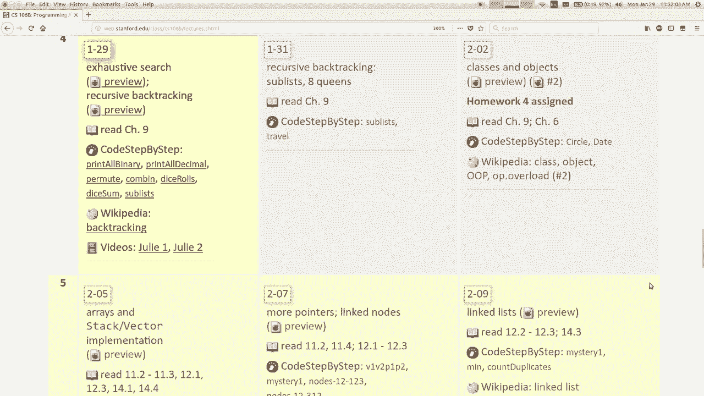
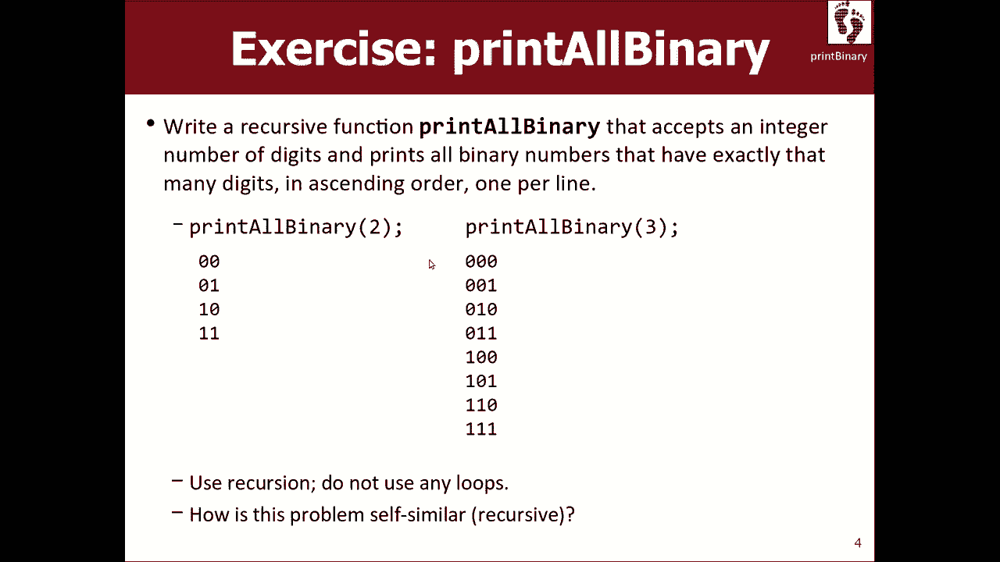
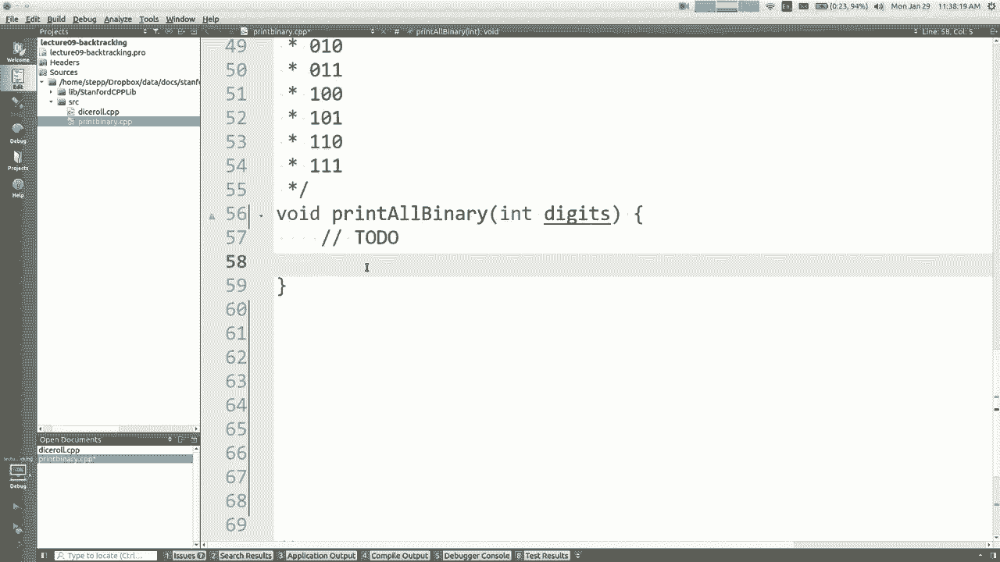
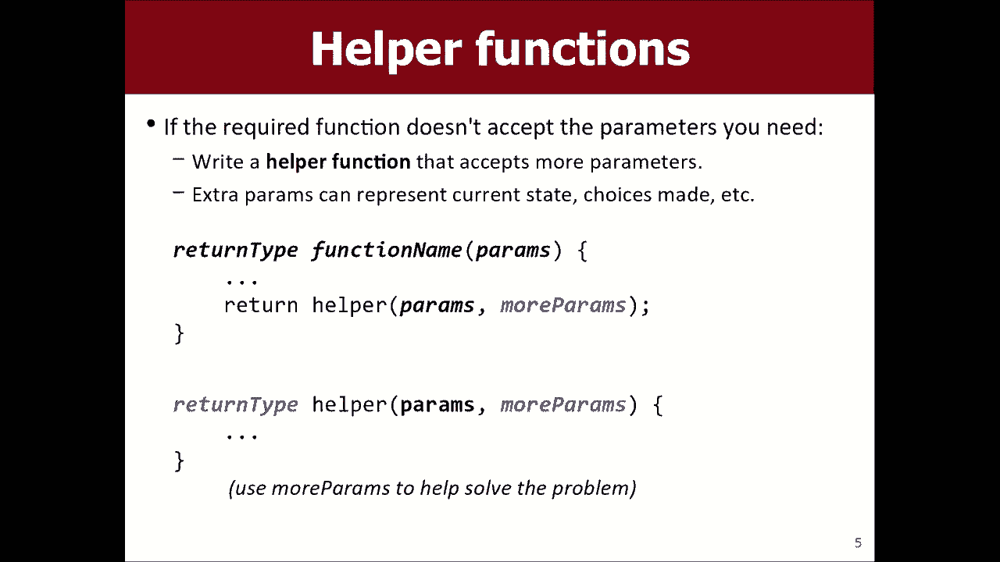
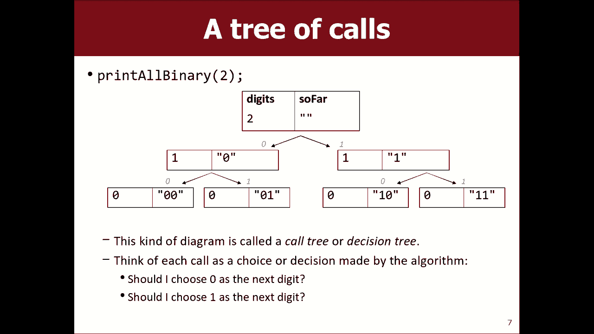
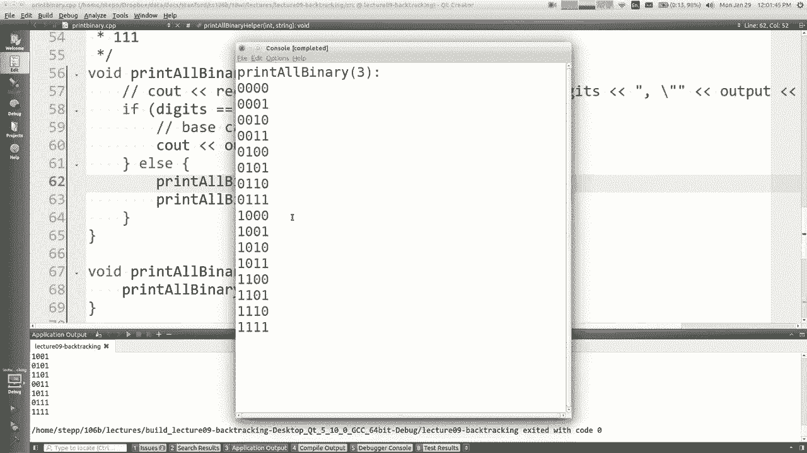
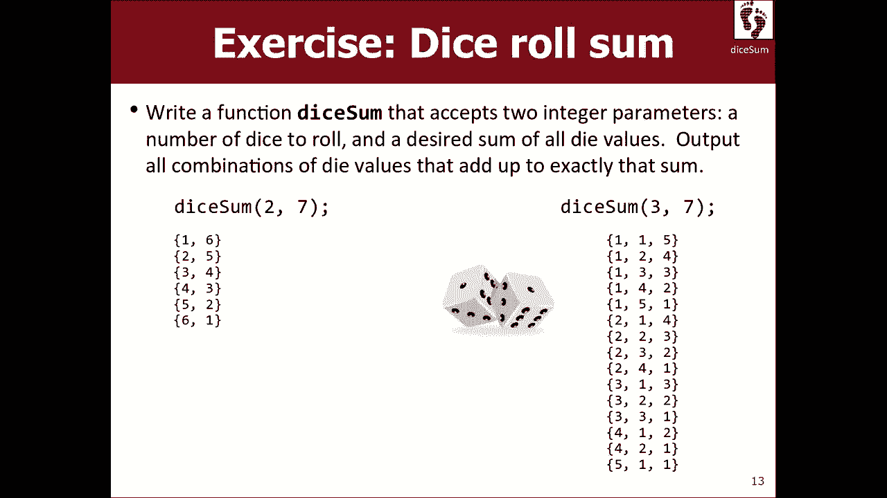

# 【斯坦福大学】CS106B C++中的抽象编程 · 2018年冬（完结·中英字幕·机翻） - P8：【Lecture 08】CS106B Programming Abstractions in C++ Win 2018 - 鬼谷良师 - BV1G7411k7jG

好的，今天是第四周星期一，这周回溯是，递归的特殊用法，因此我们将基于上周学到的知识，好消息是，如果递归是，仍然很棘手，我想这可能对你们中的很多人来说，继续练习，希望我们花更长的时间。

递归世界-您越会感到自在，那么好消息，关于递归的作业3在本星期五到期的网站上，知道每周的作业速度都相当快， ，分配会减慢一点，它会开始每个星期加一个，讲座，例如作业4不会在下周五到期，而是在。

之后是星期一，所以我知道红色标志的最后期限是一个雄心勃勃的期限，这是我们一周之内要做几次这样的原因的一部分，因为我们，试图将我们的车削时间表与106 8分开，以使该层甚至不，无论如何。

同一天有太多人陷入混乱，仅供参考，这就是我们现在在课堂上的位置，称为回溯，所以事不宜迟，我想我想开放我的。

今天的幻灯片，其中一些材料来自第8章，但大多数，这本书的第9章对此进行了介绍，我认为这是一个棘手的话题，递归本身很难理解，但我认为这个特殊之处，本周的内容有点像另一个棘手的概念，位于，递归。

所以我想当我把同等水平的课程带回来，知道1864年，当我上大学时，我发现这个主题很棘手，就像当老师一样，当我第一次教这堂课时，我发现这个题目很难教，所以你，知道这是我当然可以掌握的东西，但我认为。

就像我们学习递归一样，它需要时间练习并精通，这些东西，所以我特别鼓励您练习问题，我鼓励您，观看视频，然后随着时间的流逝尝试了解您的知识，好吧，让我们谈谈所谓的穷举搜索。

厌倦了详尽的搜索的地方是检查所有可能的地方，选项，选择或值，以查看哪个是正确的，然后搜索，解决问题的方法现在有很多方法可以穷举，搜索，但您可以使用以下方法彻底搜索某些问题，递归，例如上周。

当艾希莉（Ashley）发表演讲时，她谈到了，递归地爬行目录以打印所有文件（如果您正在，搜索具有特定名称的特定文件，您可以使用类似的名称，逻辑，除了在文件名上使用if-else来查看是否找到了它，因此。

递归通常是一种在空间中搜索某些东西的方法，因此，许多详尽的搜索问题会打印掉所有排列，尝试所有密码的名称，因为您要入侵学生，数据库来改变你的成绩所有这些东西都是在这里，想要详尽的叶子搜索。

所以很多时候搜索空间都有一组，选项，一组选项，一组值，并且您想尝试为，所有这些事情，所以让我谈一谈您可以采用的一般策略，在解决此类问题时使用，然后我们来看一些具体示例，我认为以下是有关如何解决。

您已经阅读了详尽的搜索问题，基本上是一个探索，除了代表您需要执行的一组决策的参数，做出或需要做出的一些选择，您会有， if-else结构，基本上就是您将用作递归基础的结构，案例与递归案例。

如果没有更多决策，基本案例就很好，我需要做的然后我什么也不需要做，我会停下来，否则，当我说自己时，我们的调用是指该函数的调用，您知道当我们进行递归操作时，所有调用会一起工作，是整体任务的一部分。

因此此调用将处理一个决定，我将，谈论什么是真正的决定，但我可以选择，做出可能遵循的所有其他决定，当我说探索时，然后我的函数也称为探索意味着递归，你知道在那里定义，所以我仍然认为这太模糊了，超级容易理解。

所以我认为用，例如，在您的家庭作业中，您需要做的问题之一是，以二进制形式打印数字，所以我想对数字进行其他处理，二进制文件，这与作业上的问题不同，所以不，我不是，这里没有透露您的问题解决方案。

这是我想要的另一个问题，我要做的是编写一个名为print all binary的函数，我会通过一个，位数二进制数我要您打印所有二进制，有那么多数字的数字都可以，我也不想，您使用循环。

我希望您仅通过递归来执行此操作，所以我们已经解决了，递归有关自相似之前的当前问题，对，我已经向您展示了所有两位数字二进制的输出示例，数字的样子，以及所有三位二进制数字的样子，这个自我相似吗？

我讲的二进制数字类似于打印其他，二进制数，是，是的，我想你的意思是，如果你给我所有的数字，打印两个二进制数所必需的然后打印任务，三个基本上只是一个数字，可能是0或1，所以。

实际上让我无法完成幻灯片上的所有操作，除非我将其全屏修复，模式，但就像这件事，这里是您会注意到的所有两位数字二进制数字，确切的输出出现在此处，并且出现在此处，所以从概念上来说。

如果我基本上需要打印二进制数字，我希望所有，二进制数的前面的数字，但是我想在前面加上零或在前面加上一，放在那的前面确实有意义，所以现在相似，但是怎么办，我实际上将其转换为代码，让我再向前滑动一张幻灯片。

好吧，实际上，让我跳到一个可爱的创作者，然后我们可以。

开始谈论这个问题，所以在这里，这个文件叫做print binary cpp ，实际上我认为在我的文件中，我将其称为打印二进制而不是打印，除了我，我想所有的东西都叫做打印二进制，所以让我重命名它。

如果您按shift ctrl RI可以只写打印所有二进制文件就可以了，所以，打印所有看起来像这样的二进制文件，而我写的是这样做的，好吧，好像您说的是我需要打印所有2位二进制文​​件。

数字前面有一个零，后面有一个1，所以大概是这样。

以下打印0，然后打印您知道的，所以如果我要打印到，我要做的三位数二进制数字是祈祷为0，然后打印，所有2位数的二进制数字正确，然后执行此操作后，我需要打印1 ，每当我们进行递归时。

紧随其后的是所有2位二进制数，还有另一件事，我们必须总是做正确的事情，所以，你们有一天受了很好的训练，你会冒着冷汗醒来，像是从现在开始的18年后，您将以案例为基础，而我却没有为此付出任何代价。

基本情况下，二进制数的位数很容易，打印出来，我什至不需要为某些人使用递归，可能会想一个数字，因为您只打印了一个零或您放了一个1或，不管是什么，没错，这很容易打印，但是你们。

真正学习拥抱递归思维的优雅懒惰，这是一个二进制数不是最简单的二进制数，打印零位数字是最容易打印的二进制数字，因此它是，如果数字位数为零，则所有内容都不会执行任何操作。

我不需要做任何其他更类似于此递归案例的事情，因此，当我说打印像数字一样的三位数二进制数字时，等于三，所以更像是n位数字，则更像是n ，减去一位数字，就是说您可以在其中看到这种关系，这些数字正确，好吧。

让我们做吧，C做零，然后打印，两位数字的二进制数可以，请打印所有二进制数-或不打印-我的计数，数字-写n减一右然后打印一个然后再打印所有的数字， 2位二进制数字再次正确，我要删除这些注释，因为我。

认为他们不是很有帮助，但没错，这样看来，也许我们已经，好的开始，所以现在在这里我要用三个，我们稍后再写其他功能，但我会注释掉，让我们，打印所有的三位数二进制数字打印所有的二进制三，哎呀。

它会在看起来不太完全的一行上全部打印一堆数字，对，这可能是因为我在最后在此处编写了indle的代码中，而且我不想结束一点点下降，我不想结束，我想在所有数字之后都结束所有的数字，所以也许我会做。

诸如此类的东西，但是我必须在某个地方闲逛，我在哪里做什么，我会像这样结束所有事情，也许是在我修剪了所有两位数的二进制数字之后，找出indle，然后在它之后查找所有已知的一位数字二进制文件。

我要在正确的地方得到这些恩德，发生了什么事，我的输出中有很多东西看起来好像不应该那样，那里很奇怪，所以我想备份一秒钟，我们正在使用的方法中有一些好的想法，但它不会引导我们，正确答案。

我们错过了一些重要的事情，我认为我们需要，要做的是，我们需要收集这些数字，直到我们拥有所有三个像，我们正在打印三位数的二进制数，我们需要收集所有，数字，然后一旦我们有三位数，我们需要将它们打印出来。

您知道我吗，意味着我们在打印任何东西之前需要精确地三位数，所以，您能很好地收集数字吗？您可以像存储一样存储我们的数字，您可以将它们存储在变量中的任何其他内容，或者如果我们现在，将它们打印为输出。

我认为存储输出的最佳方法只是在，字符串，但是如果我创建一个字符串，则我希望该字符串存在于两个字符串之间，递归的不同调用，随着它逐渐增长到3或4 ，或我想要的长度是多少，我需要在整个过程中，各种函数调用。

所以如果我在这里声明一个字符串，那不是，真的会起作用，因为这意味着每个函数调用都会有其，自己的字符串，我有点想要共享和传递的字符串，这些不同的函数调用之间，所以我们要诀，在这里工作。

我上周五做的时候很简短地提到了这一点，那rushon的秋天，但我认为那个例子是，有点令人讨厌和棘手，但是您可以在其中做一些技巧。

递归，在其中编写所谓的辅助函数，该函数需要额外的时间，参数，所以我们被要求解决这个需要整数的二进制问题，并打印此输出，我们已经决定也许我们想要其他参数，也许我们想传递一个字符串或传递一些其他信息。

并不是真的应该更改打印所有二进制函数的标题，问题是给我们提供了一组预期的参数，我们，需要编写代码以使用预期的那些参数，但是，如果我们已经决定，出于递归的目的，我们可能想要的不仅仅是，我们想要更多的参数。

我们要做的是在某种程度上，编写其他一些函数，这些函数需要我们需要的额外参数，然后，我们使所需的函数调用我们的函数，然后我们的函数执行所有，真正的工作还可以，所以这就是我们将在此处使用的技巧， 。

我想传递的额外参数是输出字符串，所以我们做点什么。

像这样，让我们​​作空打印所有我喜欢命名的二进制助手，帮手，因为它可以很清楚地说明其用途，而我要做的是，我仍将采用整数数字，并且还将采用字符串，打印输出，所以也许我还不清楚我在做什么，在这里。

但是这些问题被证明是一个问题，所以我要用这个，的字符串不是打印每个0或打印我将要构建的每个，它们变成一串零和一，一旦我得到三个，或者是，正确的数量，我将打印出字符串，这使。

所以我基本上将从这里的打印二进制文件中获取此代码，到目前为止，我将其剪切并将其粘贴在这里，除非我会改变，这些呼叫说是helper helper，想法是此功能在这里，不败的人实际上要求写这个问题，我只是。

用它跳到这个真正可以完成工作的功能，所以我将，只是说打印所有二进制帮助程序，我将传递数字，然后传递一些，某种输出字符串，最初是我在，如果我只是开始，那么这一切的开始就是这样的开始，在递归过程中。

我当时的输出是什么， ，我听到几个人在喃喃自语或窃窃私语，或者，没关系，所以我现在要做的是，打印这些零和一个我将在字符串上放置零和一个，我正在构建的输出中，所以此参数的含义是，捕获我们要打印的输出。

所以我要对此进行注释， ，我要对此发表评论，我必须将输出字符串传递给它，递归调用，我传递的输出与此类似，为零，呼叫，并且该呼叫确实类似于1，所以与其，清除这些，我将它们作为字符串传递给他们。

但是您会注意到，你有敏锐的眼睛，我在代码中什么地方都没有创建任何东西，正确了，所以我的演绎能力告诉我，除非某处有一个座位声明，否则我们将不会看到任何输出，所以在哪里应该有一个outout语句。

我正在构建这些字符串，输出最终会在哪里打印出来，您怎么看？ ，低音情况很好，是递归中任何问题的好答案，可以在这种情况下碰巧是正确的答案，是的，您要打印，这些字符串在基本情况下。

所以我认为想法是您将print称为二进制， 3的调用打印二进制文件2的调用打印二进制文件1的调用，打印二进制0，并且所有这些调用都建立了这个，字符串，最后当您打印二进制0时，您说剪切我有一个。

字符串让我们打印我一直在构建的字符串，而不是将，所有人都什么都不做，实际上我会找出输出包络，所以这是，仍然是基本案例打印我们构建的字符串递归案例，现在建立零和那个代码，如果我运行，它还是不太正确。

我看到的输出甚至比以前更差，所以我想谈一谈，为什么它仍然不起作用，我们非常接近正确的答案，而且我认为，与许多递归算法一样，很难理解，除非您插入一些用于调试的临时输出，否则实际情况是什么。

我什至知道我已经在做什么，我什至做到了，递归有时理解您的代码有时很棘手，我将插入一个C ，出来说打印助手，我先打印数字，然后再打印，嵌套引号我将打印输出，所以这就是我，只是在跟踪这些电话。

这就是我所看到的，不带字符串的三进制prynt二进制，然后打印二进制，直到零，然后，以0毫米打印一个二进制文件好吧，我仍然认为这有点难，阅读，所以我会告诉你，我有一个特殊的调试功能。

我认为这使您不必再使用它就容易一些，功课或其他，但我喜欢在课堂上做，因为我认为这有助于，输出更容易理解，所以我有一个标题，我不知道我是否已经，包括递归点H有人给我发送了一封电子邮件。

如果该标头包含您自己，应该会很有趣，因为无论如何，但是不，或者或者也许我在其中插入了一个包含，本身不，但是那会很有趣，所以给您的是一个新功能， ，您可以调用名称递归缩进，如果您插入它，将执行以下操作：

 ，它将根据递归的多少级别缩进输出行，您现在所处的位置很深，因此将输出变为，递归3调用递归2调用递归1调用a ，递归零，最后还打印了一个东西递归一，用一个来称呼这个。

所以您看到每个呼叫如何导致另外两个呼叫，你看到了吗，然后这个电话导致了，导致了哦，不，不要，重新排列我的应用程序糟糕，这也导致您这样做，看看每次通话后叉如何分成两个较小的通话，很难知道发生了什么。

但这是我该向你展示我的想法了，我在幻灯片上有一张图片，也试图说明在哪里。

所以在这里，如果您调用print binary，则每个调用将再发出两个调用，再打两次电话这又打两次电话很有意义，因为，二进制文件，因此您尝试在一个调用中进行零调用，现在很多递归，到目前为止。

我们几乎已经看到，每个调用几乎都进行一次递归，调用是一种典型的最简单的递归过程， ，我们的很多示例都是在这种情况下，您在每个示例中都进行了多次调用，级别以及您打多个电话的原因是因为您正在探索所有。

选项会考虑这个问题，就像是我打电话给我的罐子一样，我们正在打第二个电话，我的职责是选择一个数字的值，该二进制输出，我可以选择一个零或一个一个，但实际上我需要做的是尝试同时服用两者，首先为零，然后设为零。

然后看看我这样做之后会发生什么，完成后，我还需要尝试选择一个，不是我只选择一个，一个或另一个是我要尝试两个我将详尽搜索，二进制数字的空间还可以，到目前为止我们的代码中存在的问题。

也许您见过的某人实际上是我们添加的原因，屏幕是因为我想在所有通话之间建立输出，已经积累了一大串英雄或其他东西，所以你去了，在屏幕上，您会看到二进制文件是我们的代码的目标。

这样做是不是您了解我们的代码有什么问题或需要做什么呢？ ，为了使字符串随着时间增长和积累，出了什么问题， ，我该如何解决呢，是的，问题是想一想，但是你说的对，我们说的是对的。 。

而不是这个漂亮的零传递零，我需要像输出那样传递，在我和我们之前，所以请考虑所有这些电话的链条，互相呼叫第一个呼叫经过一个空字符串，它们将输出的单个字符串传递给其跟随者。

这些功能应该将两个字符串传递给其跟随者，输出那些跟随者的跟随者，将三个，字符串，但此字符串需要在其中添加一个字符，从我之前的人那里寄给我的东西，所以你真正需要做的是，嘿，上一个电话给我发送了一些输出。

我想要那个输出，我想要，该输出后跟零，然后我也想尝试该输出后跟，一个，因此，如果您要跟踪这些呼叫，则初始呼叫会通过，所以让我们，再次运行示例输出以查看此处的不同调用，所以这是。

我打电话给带有三个数字的空字符串的打印助手， ，使两个递归调用停止它停止它doc好的等待我可以做到这一点我发誓，用过他，不是那么烦人吗，没什么太大的不同，比我上学的时候更讨厌所有的老师都这么讨厌。

电脑花了他15分钟才能插入投影机，通常，分辨率都很糟糕，所以一切都大小不对，然后它们就做出了，他们的字体像这样大，就像任何问题都使雾蒙蒙，足够大，我可以读懂，对吗我就回到那里，你看不懂你。

我的眼睛比我大，但我老了，但我知道你看不懂这句话， ，大字体使窗口达到我想要的大小，现在我，做一个老师好吧，所以我加了这个ctrl + cuz我在，对抗小字体我是字体精英，所以好的，三个打两个电话。

使两个打印助手，那里有一个零，它使两个打印助手对不起，我无法绘制，但是它使打印助手成为呼叫对象，随后是一个呼叫助手，所以您看到了吗，它分叉到这两个电话中，您可以分辨出是否是因为。

缩进权以零开始的打印助手说好吧，让我，探索可以跟随那个零的东西我可以跟随那个零和另一个零，或者我可以用一个1跟随那个零，所以我将其作为我的两个递归，电话，然后这个有两个零的家伙说的很好。

我可以在两个零后面加上一个零或一个，所以这个调用使，这两个电话，然后这两个电话，您会在这里看到一些差距，这是因为，在旁边这两个电话说嘿数字是零我是一个基数，情况下。

我将打印出我和所有呼叫伙伴已构建的字符串，我们构建的字符串是零零零，它显示为输出，那么这个家伙是，完成后，他回到这里的父级，继续进行第二个通话，这是一种基本情况下打印此，因此基本上输出结束。

打印出来是所有不同的可能性，现在存在的数字将您知道的大脑弯成椒盐脆饼，我认为前几次，您会看到这种类型的代码，很难编写这样的代码，甚至很难看懂它，你知道该怎么做，但我希望你有点开始成为。

确信此代码将探索并打印代表所有字符串的字符串，给定数量的二进制数字的位数（如果我关闭打印） ，声明，然后我决定我可以尝试四次，哎呀，为什么我，今天在这里有很多空白行，我是否省略了某种原因。

为什么我有空白，哦，我在这里有恩怨我不想要这些indel，对不起唯一， Endel应该在我打印输出字符串之后出现，所以让我尝试两个，所以我认为看起来正确，它说打印二进制3，但是应该，是你应该说四位。

所以我认为这是所有不同的四位数，二进制数，当然也存在自我相似性，因为，块是所有三位二进制数，并且出现了相同的块，再次在其他输出的下半年，好了，所以我认为这一课，这里带走的是，如果您想彻底探索一个空间。

 ，函数调用通常会多次调用每个后继调用，选择它可以使您仍然拥有与我们一样的原则，兄弟姐妹们的乐队在一起，每个小功能都会召唤一个，一点点的工作，你对那块，如果我们要制作数字，我们会选择数字。

那么工作可能会很好，如果您想做一个听起来很难的十位二进制数字，请处理一位数字，不知道该怎么做，但我会做十个数字之一，还不错，因此，对于我们每个人所做的一小部分工作，都采用相同的理由，那仍然存在。

但与众不同的是，代替我而已的只是一个，后继函数调用在这种情况下，我进行了一组后继函数调用，两个有时更多，最终在所有这些函数调用的结果之后，积累我会建立一些我们所有人都会建立的东西。

在这种情况下要执行的字符串，一旦完成构建，便会累积显示，或用它做点什么，但是函数调用将继续进行，其他后续函数调用，我们最终将构建许多不同的函数，我们将构建所​​有可能的选项的所有组合。

那里有这样的代码在我脑海中也反过来，案例是什么，或者它意味着什么，我们已经讨论了基本案例，就像这样，问题的简单版本，因果关系如果您要反转一个字符串，那么很容易找到该字符串，反向，它是空的。

或者是你知道的一个字母，那还好，这是我们在这里所做的事情，但在这种情况下，问题就更少了，简单，主要要求我们打印零位数字，这不是完全正确，不仅仅是我的前一个函数调用要求我打印零位数字，我们还是，一堆电话。

有四位数的电话和三位数的电话，然后我将两个数字称为一个数字，然后将I和列零数字称为I ，除了我之前所有的家伙都做过很多事情以外，没有太多工作要做，工作我必须承担他们得到的所有工作并显示出来。

所以现在是基本案例，可以被认为是所有工作的终点，为其付费的呼叫，而不是简单的切入点，没有任何工作，所以我的意思是这就是我对这些事情的看法，花费一些时间来适应um，你们到目前为止对。

关于到目前为止我们写的这段代码是，为什么我们不需要打印所有二进制文件，这是一个很好的问题，为什么我不只是，在缅因州打电话给我，我可以打电话给print binary Helper或重命名。

打印二进制帮助程序以打印所有二进制文件，我认为原因是，也许，指定此问题的人说，我要您编写此函数，然后我，希望它完全采用这些参数，并且不让您满意我的，要求必须是真实的，但是您说得很好，但是为了做到。

递归我想传递这个字符串，所以这两个之间不匹配，事情等等，如果你只得到，参数，但您也可以在其中使用一个字符串，递归是您创建了另一个具有字符串的函数，并且您，使所需的函数调用您的函数，只要您的函数，递归的。

那么你基本上就遵循了我之前问过的约束，是的，但是如果我们只是为自己编写这段代码，那么您是对的，我们，根本没有任何外部约束，我们只能写，助手和主要主叫然后助手和主要主叫必须通过，这个空字符串来启动进程。

但是那不适合你，谢谢继续，哦，为什么不为什么不把零放在前面，就像零加输出1加输出I ，猜想是因为像输出是我之前调用的内容，所以我觉得我在通话中正在做的事情是在补充他们所做的事情。

这是他们的工作加上我的工作，我的工作是零，那么我的工作是1 ，如果我将其移动到其他方式，它仍然可以工作，但我认为，打印出来的组合会改变，我很乐意这样运行，证明它没有什么不对。

除非问题陈述说订单需要匹配我的订单，否则它，以一点不同的顺序打印它们，您看到这里的情况如何吗，首先翻转是因为第一个调用很好，前三个调用选择了零，而第四个电话选择了一个零，但是当第四个电话选择了一个。

它是一个在前面，所以我的意思是它仍然可以工作，因为我喜欢在每次通话都添加到之前内容的结尾时考虑它，它，但是其他订单没有错，就这么快，如果您想使用以十进制为基数的十进制数字来执行此操作。

因为我想继续前进，所以不打算穿这件衣服，但是如果你这样做，以10为基数，您基本上会遇到类似的问题，除了，只有0和1，您就拥有了所有10位数字，那么您该怎么做，好吧，您可以一起使用递归和循环。

而不必只有两个，从每个现有呼叫派生的呼叫，您有10个，但我不知道，有那些树的图片，但基本上功能看起来像这样0 ，并以每个数字1到1的比例呼叫帮手，呼叫0到9 ，有了这个数字。

我现在可以说等一下Marty，您说没有递归， ，循环，您不能将它们混在一起，您说没有循环，有些情况下，像这样，循环是描述不同事物的一种优雅方式，后继函数调用make，但是整个过程仍然是递归的，因此在。

如果我要您解决此作业或测试之类的问题，我想说的是，只要您的整体过程可以使用循环，草书利润，您可以稍后充水或稍后追溯，但这基本上是，完全一样的代码，只不过我要遍历十个数字以进行递归，调用。

而不仅仅是手动提及两个数字以进行函数调用，我可以写成一个零的调用，然后用1和一个调用，我也可以用它来调用10行代码，会没事的，所以这是唯一的不同，告诉你有时候循环是可以的，让我们来看另一个问题，所以。

这种详尽搜索的特殊变化称为，回溯回溯是当您对其进行详尽搜索时，会陷入所谓的坏状态，而您不喜欢那里，已经获得，您想回溯，现在在，以前的问题没有这样的问题，因为我们要打印所有，二进制数字。

但有时我不想打印所有我不想打印的数字，处理所有我想找到的东西，所以这里有一些例子，可能会这样做，您可能想搜索一个单词的字谜或，国际象棋的移动策略和国际象棋棋盘是一个很好的例子，您知道。

深蓝色的播放Kasparov的计算机以及所有填充方式，脑部工作是尝试所有这些不同的国际象棋动作，然后检查，看看他们的表现如何，如果不好，则备份并尝试，这正是我所说的回溯，你尝试了一堆，选项回溯。

如果您不喜欢事情的进展，那么让我们看一下，首先，我将向您展示如何执行此操作的伪代码，回溯基本上与执行此操作的伪代码完全相同，因为我，如果您不喜欢自己的位置，则搜索做所谓的“选择欧盟”也会回溯。

所以我有本周使用的这种口头禅，您可能会听到，一遍又一遍，您会在“选择浏览”部分中听到，选择范式，我认为随着我们的观察，它将变得更加容易理解，一些代码，所以让我无需进一步尝试尝试演示。

问题我想和你们一起写一个叫骰子的函数，我会通过，一个无畏的结局，我想掷出一些病态的骰子，我也会像某些人一样通过你，我试图找出所有，骰子值的组合，如果您添加那么多骰子，您将获得，那个精确的总和。

所以将两个骰子控制过程中的一些骰子打印到七个，给你完全可以滚动到给你七点，现在得到它，这是二元绘画中的自相似性，在屏幕上显而易见，因为您可以使用两位数的二进制数字，只是将它们叠加在右侧，它们就在那儿。

但这就是，这里不是很正确，我的意思是如果您没有看到右侧的输出，考虑一下问题的性质，应该清楚为什么会这样，但是好吧，这个问题在很多方面确实与，打印二进制问题它仍然递归您仍然每个，打电话做一些工作。

我们需要跟踪工作，我们已经完成了类似于使用字符串来跟踪的方式，当我们使二进制数字正常工作的时候，所以让我问你一些，如果您有很多函数调用在工作，那么您会质疑单词的单位是什么。

我们一起试图找到三个骰子加起来的所有方法，无论冰的数量多少，您认为每种冰都属于某种工作单位，函数调用我的句柄，你认为滚动一个家伙好吗，如果有的话，也许三个骰子，那么我们将执行三个函数调用。

一个将处理每个骰子，好吧，如果我要带我去找第二个人的话，由da处理是什么意思，知道了，是的，我得到了什么，这意味着我要做什么，我想我是，决定它的价值是什么，但是让我更具体一点，我正在使你，完全正确。

但是现在你会发生什么，我该怎么办，我们正在谈论探索，几乎详尽地搜索了我所具有的价值是什么，你说甚至要去死，你减去，好吧，把它滚开，然后，如果我滚到五，那么现在那是五个，有人在努力做到正确。

我需要你尝试不同的价值观才能看到，如果他们让我接近目标，就让我接近目标，但我要尝试，我要尝试的所有值之一到六，因为我不知道那是什么，实际上可以将我的工作的几个价值很好地组合在一起，这就是。

这种思考过程还可以，让我们也考虑一下基本案例，多少次潜水很容易将零推到正确的位置，也许一个人死了，容易滚动，但比起零骰子是最简单的数字，我更懒惰，骰子滚动得很好，你什么都没做，所以让我们尝试写这个骰子。

我们将要编写的函数称为“骰子”，它需要一些，骰子和期望的一些好吧，如果骰子的数量为0，让我们尝试去做，好吧，如果有的话，就不要做上一个问题听起来很熟悉的事情，我将需要尝试至少一个骰子。

所以我将处理所有可能的骰子，值表示从一到六，看它们是否可以正常工作，话是什么意思，那就是我会尽我所能，然后看看会发生什么，然后我也会尝试我的骰子光束，看看会发生什么然后我会尝试我的骰子，是三岁，等等。

好吧，尝试一到六的数字我可以使用， for循环for right在两个等于1的循环中，我上升到六个I加号，对于这些值中的每一个，我将选择我作为我的，值，然后我将探讨可能发生的情况，然后。

在我完成探索之后，我要去吃午餐了，那就是我，需要做的如何在二元问题中很好地选择事物，数字我们怎么记得我们选择的，是的，我们将其正确地放入该字符串中。

这里的输出看起来并不像巧合那样，集合会在我们库中的输出中正确显示，所以我认为，我想在这里建立一个骰子值的集合。

到目前为止，我选择的还可以，但是我该如何在哪里放置该收藏呢？ ，希望您看到与二进制问题的相似之处，如果我要添加一个收藏，这里没有收藏，我应该从中做出一个参数，并增加该集合的种类，随着时间的流逝。

就像我随，做二进制数，所以骰子掷骰的值是英兹的，也许是向量，所以我为什么不真正做一个骰子，然后再做一些骰子，帮助器，我要添加的是intz的向量，这是我拥有的值。

到目前为止选择的就像我从另一个问题中得到的字符串一样，您通过收藏集，通常会通过参考传递它们，否则您将，制作副本以及它们的副本和副本，以便我将其作为矢量传递，现在参考，以便使调用类似于常规骰子。

一些需要打电话给助手，所以我需要给骰子打电话给一些助手，事情开始了，我会通过我感兴趣的骰子的数量，所需的总和我对传递给向量的东西感兴趣，最初是在所有这些操作开始时选择的，所以我没有选择任何东西，因此。

你会说的方式就是只说做一个称为V的intz向量，无论通过V还是传递一个空向量只是为了使事情顺利进行，所以，现在我要住在助手中，我要处理该代码，所以它做什么。

选择我的意思是我该如何指示我如何记住我如何保持追踪，选择了我，是的，把它放在向量中，向量就是用来存储我的东西，选择了点添加，现在我需要探索所有可能的东西，很好地遵循，看起来说探索的部分就是递归部分。

写下来探索意味着递归，所以我需要进行递归调用，下一个电话应该选择我在选择价值后应该做什么，所以我，将给骰子打电话给一些帮手，我应该传递多少参数，骰子下一个家伙需要处理我的骰子数减去一个对数，因为我。

我选了一个我选了我的饮食，当我死了的时候， ，下一个家伙试图达到我儿子的水平，除了我选择了我的价值，所以，让我们从试图达到正确期望的总数中削减很多，总和减去我，我将传递所选骰子的相同向量，我们都是。

通过所有这些电话共享，当我回来的时候，本来应该选择的，如果您愿意，我们可以稍后再讲，看起来我想谈谈我写的这个基本情况lul不做任何事，通常是回溯问题或详尽无遗的正确答案，搜索问题。

我谈到了基本情况在这些情况下的含义，意味着有些不同，这意味着我之前完成的通话，工作，轮到我了，别无他法，因为其他所有工作，呼叫完成了所有工作，所以如果我处于零的情况下我该怎么办，那我是什么意思。

我应该打印所有伟大的作品，这些呼叫在我之前完成，找出了像这样打印出的所有矢量，他们做得很好的选择，我不知道我们可以尝试，我不知道是否，会工作，但我想免费尝试所有骰子，以求得七个骰子的总和，幻灯片。

我知道输出应该是什么，所以让我们运行它并查看它，看起来很像二进制数字，不是因为我很健忘， ，应该被称为其他名称，而我正在使用的文件应该是，叫我好吧，让我们再试一次，如果您的病媒持续增长超过四个小时。

请致电医生，这个向量不断增长，在某个时候我们需要增长，将东西拉出向量，因为记住我们正在尝试滚动，三个骰子，这时我们打印了向量，因为其中有三个骰子，好的，让我们看一下函数调用，再次，所以找出递归缩进。

然后将一些辅助括号切成小方块，骰子逗号需要一些祝福你逗号，然后选择，所以我可以看，通话正确，哦，我们要穿很多衣服哦，我的天哪，是的，所以，我认为它做得很好，我们将三分之七切成小方块，已被选中。

然后我们尝试选择一个，因为请记住这个家伙，这将最终使make六个功能调用六个六个功能，称这是一个，这里是另一个，依此类推，但是嗯，我们，需要做的是，我们需要选择价值，探索可能发生的事情，然后。

当它回来时，我们需要取消选择一个，然后继续探索来，返回取消选择三项，探索遵循的三项回到第三项，您了解我们是否需要扭转，例如我们要添加一些东西，这个向量，当这些调用返回时，我们进行递归调用。

向量返回之前的状态，这样向量就不会越来越大，并像这样成长，这就是我们所说的不选择的步骤，我该如何，撤消我的选择，看起来通常与您所做的完全相反，当您做出选择时，选择是我将数字I放入向量中，想要撤消。

所以我需要从向量中删除值i ，小心，因为如果您只是保存而选择了移开眼睛，那是不正确的，因为那删除了要删除的参数，而不是要删除的值，从中删除索引，这意味着不会做您想要的，我认为有一种方法称为“删除回去”。

这意味着只需删除最后一个，最后添加的元素是我的，所以我认为，做我想做的事，但是如果我再运行一次，那就太难了，仍然会产生很多输出，但是现在输出看起来要多一点，合理，它会打印出一一一五一一六的数字。

我们做得更好，除了哎呀，我们正在打印所有可能的骰子组合，这不完全是我们应该做的，仍然整洁，详尽地打印了所有内容，但我们并没有完全解决整个问题，我想打印那些加起来等于特定金额的。

所以我如何将其整合到我的解决方案中，让我向您介绍一种方法，这实际上并不理想，因为我们可以做的就是在当下，我们将要打印这个，可以说您每分钟知道1 + 1个盘子，错误的歌曲，如果总和错误，我们就无法打印它。

在基本情况下，这似乎是一件很合理的事情，可以说嘿，如果向量的总和是正确的，然后打印出来，我怎么知道，如果向量的总和是正确的，我怎么知道，好吧，我可以遍历向量并将其加起来，但是有一些更简单的方法。

比我可以说的，如果期望的总和恰好为零，则意味着，沿途的一系列选择完全消除了，想要的儿子，直到他减少到零，而不是如果仍然是五，我没有将其撕裂得足够远，或者如果它为负值17我将其远离得太远了，对。

如果期望的总和为零，我希望你，了解这意味着通话完全找到正确的总数，因此，我再次运行它，然后告诉您我将关闭该调试输出cuz ，我认为此刻没有帮助，所以让我再次运行它，嘿，我已经，得到了输出，是的。

我做到了，最重要的是我们是否获得正确的输出，输出，因为你学到了，你就把功课还给你哦，等不，我们是刻薄严格的，我们关心我们关心的算法，风格我在乎效率我必须要一秒钟你必须要，第二。

但是这种解决方案可能不理想，在，对，我给你这张照片结束，然后我们回家。

好吧，我不会结束你，但我会以这张照片结束讲座，通过整个可能性树，甚至那些没有机会成为可能性的树，对，因为他们离这里太远了，我们不需要这样做，可以使其代码更高效，从而避免做类似我的事情。

当我们从这里恢复时，我们将在周三进行探讨，但是您可以考虑一下，从那时到现在下次见。

