# 【斯坦福大学】CS106B C++中的抽象编程 · 2018年冬（完结·中英字幕·机翻） - P9：【Lecture 09】CS106B Programming Abstractions in C++ Win 2018 - 鬼谷良师 - BV1G7411k7jG

所以现在是第四周，是星期三，我们一直在研究递归回溯， ，今天我们将继续做更多的事情，这基本上是，这整个礼拜是你第四份作业的主题，在本周末结束，是的，那就是我们要做的，我只想做，我认为练习越多。

您看到的示例越多，它就越有意义。 ，鼓励您像往常一样独立练习，并且在本节中您还知道，接下来的几天，您还将获得更多练习，所以我想回到，上次我们正在尝试打印的所有问题。

导致某个太阳的掷骰子记得这一点，我们以此结束了课堂，我们实际上完成了它，让它正常工作，我将向您展示我们。

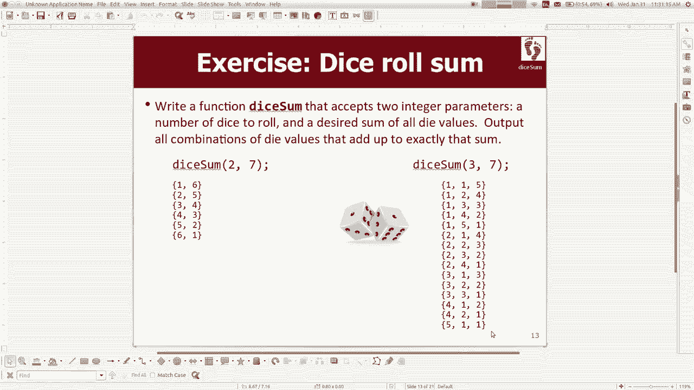

编写这是代码现在有几件事只是为了提醒您一些，沿途进行递归回溯时出现的概念，这是进行递归回溯时常用的技巧，因为，每个电话都会做出选择，您会收集一系列选择，然后，您与他们一起做某事，因此您需要跟踪那些选择。

是在解决这个特定问题的过程中做出的选择，在向量中保持跟踪，我们称其为向量选择，所以这意味着，您运行此函数，主函数要求三到七个三的骰子总和，掷骰子以使总和为7，它会打印所有这些组合，这是完全正确的。

但我想我在上课结束时曾简短地说过，真的不认为这是一个很好的解决方案，总的来说不好，这个解决方案我不知道该如何转弯，所以你会看到我的支票，希望课堂上传达的信息无论如何都不会太乏味。

这个解决方案的缺点不是什么？您认为有什么更好的解决方案？ ，关于它是的，它会检查每种可能性，即使其中一些可能性，不会导致好的结果，所以，如果您希望将其具体化，让我尝试帮助我做一些我不想让你做的事情。

我要给你看一些有点烂，有点脏的东西，但你知道，你们已经长大了，我想你可以应付，我要告诉你，称为全局变量的东西现在是全局变量，当您声明一个，您所有函数之外的变量现在我们通常不这样做。

因为限制程序中的数据范围很重要，以避免， bug可以更好地分离，但仅一小会儿，我将这样做，因为我想将其用于特定目的，所以我想计算，我们的函数被调用的次数就可以了，所以每次我们调用此函数时，我们写的帮手。

我要说的是电话加号，然后再加上，缅因州，我要看看总共C个电话花了多少电话： ，打电话好了，那就让我们运行吧，它需要259个电话，好吧，我不知道，知道也许那是我不知道那是好是坏我不知道让我们尝试。

掷骰子给我们11个中的一些，让我们看看结果如何打出1555个电话，这种调用很多，函数调用会产生开销，性能损失有太多的函数调用，我想你说的是，是某些功能调用可能不是必需的，所以我不知道。

如果只是从这个角度来看很明显，但是你知道我试图画这个，哎呀的图片我刚才做了什么对不起，我点击了错误的地方，它，我以某种方式丢掉了这里的东西，就像我们的，代码正在模糊地执行这样的操作，您知道我们正在计算。

我第一次可以在三口骰子上掷骰子，是从一到六的值，我们会尽力尝试为什么选择第一个意味着六个然后探索一个，一堆可能会在它发生后发生的事情，我们知道，右边显示的数字实际上是人类比我想表达的更强的陈述。

掷三个骰子，第一个骰子最大的价值是什么，我什至可以画三个，因为剩下的家伙必须至少是一个也对，所以如果第一个家伙，甚至是四到五个，剩下的两个家伙说最小，努力去做至少六到七个这样的事情，所以这是。

浪费很多电话，好吧，所以我要做的就是，尝试对我们的程序进行小的优化，这样我们就不会打电话，如果很明显，如果。

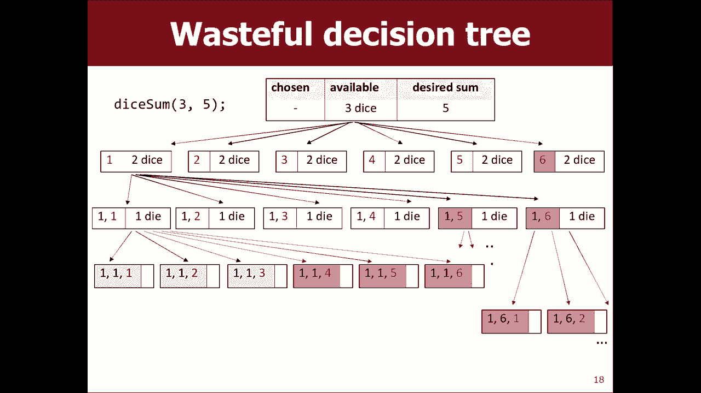

您可以在骰子中查看此代码，并编写一些函数，我们写的书给我们任何想法，例如如何分辨，值得打电话还是不打电话，意味着另一种说法，那就是说如果我们进入某种状态，我们知道那不可能从这里解决，也许我们会。

立即备份并停止，这是另一种思考方式，我检查了一下，并将这个想法纳入了代码中，如果有什么事情，我可以帮助您一点，然后我将尝试所有，这项工作，但某种程度上意味着我所做的可能，可能会导致良好的结果，所以例如。

如果我拿六个的第一个，我想要一共五个不需要好的结果的权利，是的，是的，好吧，我认为说这句话的好方法就是您刚才所说的，就像um，每个剩余要滚动的骰子可以是至少一个，并且在，最多六个。

这样我们从这里可以到达的求和空间就是这样，为什么我们不只是检查我们是否在我们期望的范围之内，对，所以所需的一些像最小所需的是一些所需的，一些必须至少是我剩下的骰子数量乘以一个正确的骰子数量。

我至少知道我能做的就是每个骰子得到一个，然后获得所需的总和，最多必须是剩下的骰子乘以6才有意义，也会减少负面影响，例如我们超调之类的东西，像这样的权利，如果我们这样做，它仍然会打印所有答案，但不是。

打印1500个电话，使847个电话减少了很多电话，我，想一下这里，如果我做三点七点或三点七点那个，印有两百张，现在它一路缩小到127 ，实际上有很多这样的电话， 27个是真正快速的通话。

您很快就知道保释，真正避免所有这些不必要的循环的方法是，更好的优化，所以看起来我只是想向您展示一下，当您回溯时，有很大的探索空间，如果您开始，沿着一条糟糕的道路走下去，您需要识别它，然后退出。

并尝试另一条正确的道路，因为否则您将，搜索和搜索以及搜索和搜索此问题不是超级问题，进行调整以说明这一点，因为骰子搜索空间并不大，但是，如果您要掷十二个骰子，那么这真的很重要。

知道我的意思是因为我们成倍增长，无论如何在这里谈论有时被称为修剪通话树。

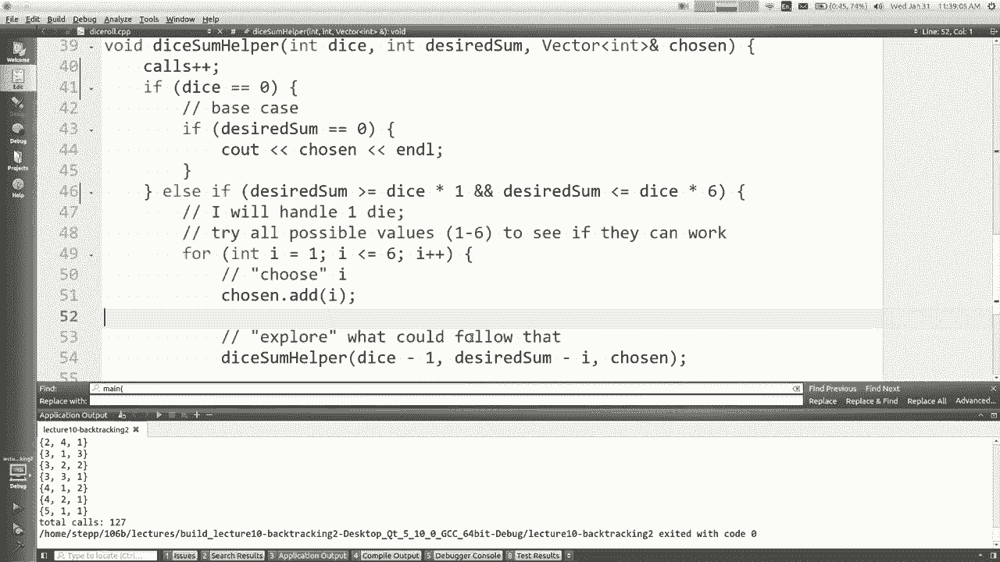

修剪通话树修剪这张图片的分支基本上可以了，这就是我想从上一次完成该示例起的全部内容，所以现在我。

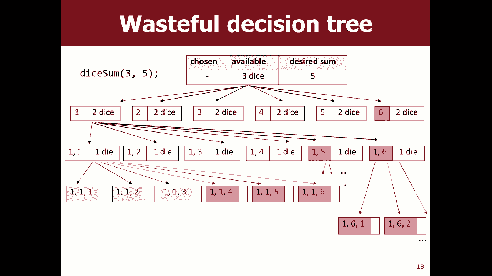

希望那是上一张幻灯片的内容，讲座我想从星期三的当前讲座中打开幻灯片，讲座，让我现在就开始做，让我们再看一些。

问题要记住总体策略，然后再开始写另一个策略，从零开始，回溯的总体策略是，如果有选择的话，那么您将要处理其中之一，因此对于可能会选择的每件事，选择自己的部分，探索可能发生的事情，然后取消选择。

如果没有可能，选择共享探索，留下的选择让您停下来，或者打印找到的选择，或者，无论如何以及如何枚举或尝试所有我可以处理的所有事情，叫是问题，哦，好问题是，你们所有人都回答了您，只有当您使用UNAC时， 。

在这两种情况下，您都会遇到不好的问题，但是我想这些潜在的问题，达到您可以撤消的原因有两个，因为您已经做了所有，选择，现在您已经完成，现在要打印您选择的内容，或者，这样的事情，否则您可以撤消。

因为您知道自己不会，以获得良好的结果，因此一旦您确定了答案，则需要，回溯，所以我认为大多数情况下，这种代码具有以下三个步骤，选择“资源管理器”按顺序取消选择，所以我认为我们会通过，我们一起写的例子好吧。

让我们来看一个，点击了很多人，我喜欢这个我们一起做这个吧，从迷宫中逃脱这就像字面上的回溯是一样，所以我，要在这里是我要给你一个可以走的墙的小迷宫，穿过走廊，但是你不能穿过墙壁，因为我们是不朽的。

人类以及我所有的意思，您可能已经听说过有关如何，从迷宫中走出来有些人用右手握住墙壁，这样，看看是否有人导致退出，这是您的想法，如果您尝试，以某种方式，它不会导致退出您认为您的工作，你哭对不起。

我们在验尸官上向自己抽泣，然后你沿着走廊走了，这是你没有回头路的死胡同，选择是的，那你就被一条沟吃了，我，没关系，没人玩了，所以这真的是一个，回溯的想法，现在你可能会说好，等等，这个迷宫是如何工作的。

网格是什么，我想避免一些污垢和这里的细节，计算，所以我会有所帮助，我会给你一个叫做，基本上就像一个网格的迷宫，你可以问你知道网格有多大，它有很多行和列吗，您可以问自己是否在。

迷宫的边界就像使用网格一样可以标记正方形，就像您要离开一路走来的面包屑，您也可以进行画方形教学的工作，这意味着您已将其标记，就像是一个你不喜欢的坏广场，我不想再走那条路了。

所以我们可以将这些不同的方法称为，一种围绕网格的包装器，以便我们可以在，简单的函数调用好吧，让我向您展示我们将要访问的文件。

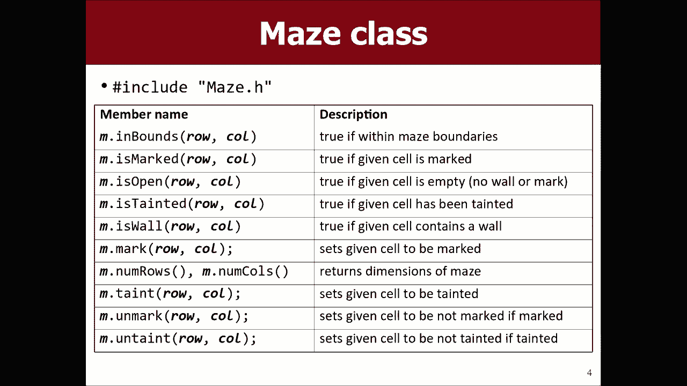

我在这里工作很好，我的项目去哪里了，我今天有一些电脑东西。

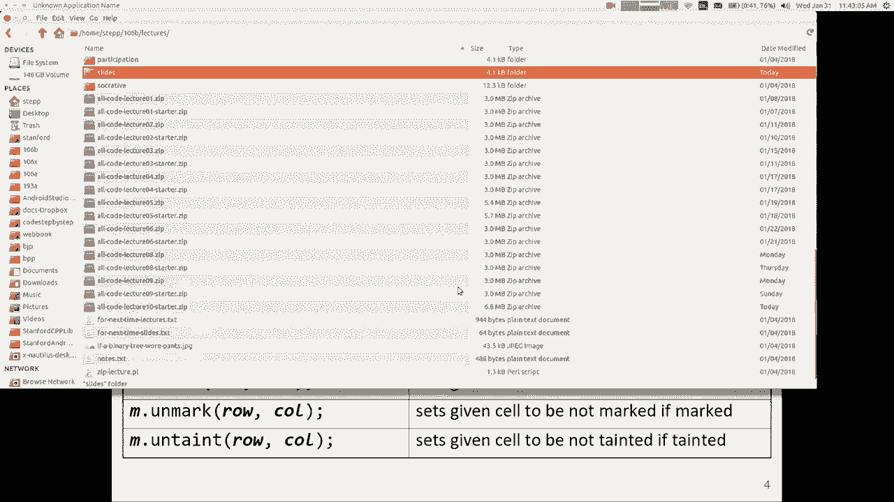

我不知道今天不是我在电脑上的日子，所以我在这里有文件，首先，我需要做的是，我需要去掷骰子，通过重命名关闭主要功能，然后在迷宫中我得到一个主要功能，在这里，我需要打开，现在我们要写这个转义符。

从迷宫里好吧，哦，我想我做了，我把。

右键在此处的屏幕上向上滑动，所以我想标记出一条路径，迷宫，如果有的话，我还想返回一个布尔值，表示true ，还是false是否存在这样的路径我是否找到了一条路径好吗，所以可以从任何给定的广场移到邻居。

什么是通用算法，这里是递归我们有哪些东西，通常考虑一下我们何时使用递归代码，是的， ，他们的基本情况是什么，回答是否可以逃脱是一件容易的事，如果已经，逃脱了，是的，我知道我可以，因为我有权利哦，是的。

你知道你有，如果您超出了基准范围，请转义。

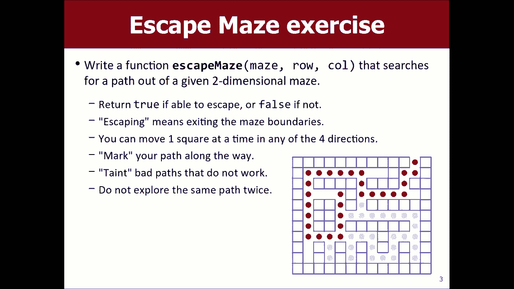

如果我们不在此行和列的范围内，则超出范围，万岁我们逃脱了返回真实好的那里我还有其他地方吗？ 。

可能会问您有关从哪里可以肯定地说不从这里开始，不可能逃脱人类，为什么你要以基本情况为依据，基本上我想问你一些递归函数有多个，是的，如果我被墙壁包围着，是的，实际上我认为。

比这更简单的方法如果您就像在墙上一样，就会知道，如果你说他们从这里开始，你会说不，你，无法从那里开始，甚至都不能在那里，我认为，我认为您的案子是可以接受的，因为您可能会说，如果我被。

围墙或我周围任何可以问的问题，我可以从那些地方逃脱吗，如果他们都是墙，那么他们都会说不假，所以我会，也知道我无法逃避我，或者你知道我的意思，所以，会像我周围发生的事情那样的想法，所以我认为。

我们在这里可以说的是，如果迷宫在此行或列中有一堵墙， ，在没有返回错误的情况下还可以，所以现在我们开始了解，可能需要写主要算法的地方。

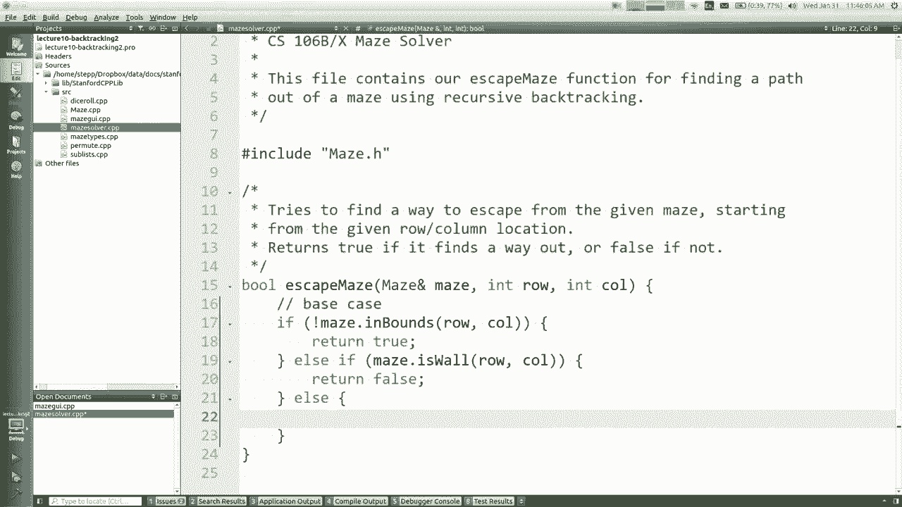

很难看到自相似，一点点的工作，一点点的进步，如果我们做到了，递归在这里我该怎么办我的电话要花点时间，帮我设法找到出路，尝试朝一个小方向向上走一步，左边，环顾四周，所以真的不像移动方法。

但是我们正在编写一种递归函数，就像你能从一个给定的广场逃脱迷宫，所以我怎么想这个想法，就像走一步公路休息，在这种情况下，您认为。

好吧，也许像我站在那里的标记， mais doc mark我一直在这里，现在在这里，所以还记得那个递归，回溯就像让我想起我将要做的所有事情，一个小选择，但我会尝试所有可以做的不同选择。

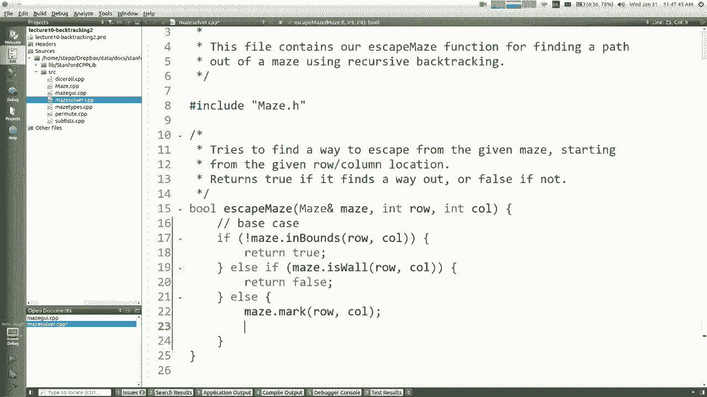

选择正确的，所以如果我要去所有四个方向，看看是否有这些工作，为什么我不只是说逃生迷宫迷宫，所以往上走就是一减一。

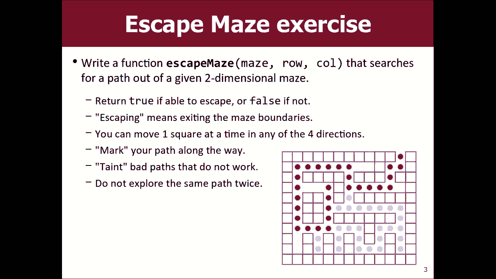

向上下降的同一列是行，向左向下的同一列是行，打电话减去左边剩下的然后右边走，所以这是一个想法，我们还不存在，请记住，mm-hmm必须返回一个表示true或，错误，您是否找到一条出路。

所以我需要在这里返回一些信息，我怎么知道，返回什么你说是的，转身说话，是的，谢谢，我再说一遍，您说过那些递归调用都返回布尔值，值，所以你们可能像您知道的那样考虑这些电话。

我正在执行的计算或步骤或其他任何操作，但是有，还有一些问题的答案会在您将逃生电源接通时返回，你还问那个电话，嘿，你找到了出路吗，是或否，如果它返回了真实，那么您应该知道的是，如果我去。

这样就可以有一个出口，所以如果我有一个出口我，可以去那里，然后我去那里的出口，如果他可以，我可以出去，你知道我的意思是如果我的邻居可以出去，我可以，只是步行到我的邻居，所以我也可以做同样的事情。

但是如果我尝试上去， ，返回一个错误的值，然后它不起作用，没有办法找到一个，从上往外走，这样行不通，所以我将尝试下一个，那么我会尝试下一个，所以我的意思是，你真的应该说，如果我试图逃脱迷宫。

它会返回真实的，我应该返回一个真值，您知道我的意思是，如果，如果返回true，则返回true；如果返回true，则返回true。 ，那就是我应该返回的内容，现在您给了我一个更优雅的版本。

您所说的想法只是将它们全部或两者之间称为，如果他们中的任何一个可行，那么我就可以工作，所以我认为这是表达这一点的好方法，我会按照你说的返回我是否可以逃脱迷宫上升或我可以逃脱，迷宫走了，我会把这等于真。

否则我可以逃脱迷宫走，向左走，否则我可以逃脱，向右走，是否可以走出，现在做这些事情之一，您可能会说等待确实意味着它做了所有，他们知道人们认为执行代码是它执行的第一个，等待，只有第一个为假时。

才继续到第二个，因为一个叫做短路的过程，评估，所以这是该算法的基本思想，我想我可以在这里运行，我们可能还没有完成哦你有一个问题哦我把我的索引弄乱了吗，我明白了哦，是的，你完全正确-一个代表左派。

所以谢谢你，没有什么比让400个编译器看着您喜欢的代码更好，我非常感谢，谢谢，嗯，可能是讨厌的，因为它，不会给我一个编译器错误，只是永远不会发现，那出口，我会一直想着哦，天哪，它怎么不起作用，所以是的。

我要在这里加载文件，所以如果您只是单击某处，应该尝试所有不同的方式，哎呀，发生了什么让我们看看这里发生了什么，这不是一个没有标记的开放，正方形好吧，所以如果您尝试标记一个，已经标记。

所以我的意思是我认为我们这里拥有的大多数都很好，但就像，只是对我们有点生气，因为我们正在尝试对正方形加倍标记，让我问这个问题，是否因为我们试图翻倍而崩溃，标记一个正方形是什么意思。

这在概念上是关于我们的算法的。

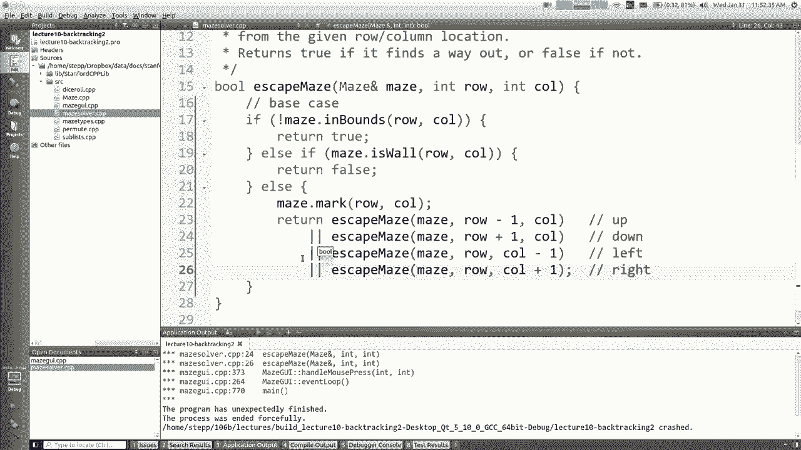

这是否意味着我们进入了一个循环并回到了正确的起点，我们有点，如果我们转了一圈，不想重新探索我们已经探索过的东西，就像Hansel和Gretel以及面包屑，或者如果您回来的话，再次回到面包屑。

您就会知道自己走错了路，或者。

嗯，不管你怎么想，如果这个正方形不是，标记为正确，实际上我认为这里有一个方法叫做，打开，这是一个好人，如果这个Square是开放的，那意味着它是我， ，我可以去这里吗，让我们尝试一下吧。

所以现在实际上我遇到了错误，因为它说并不是我的代码中的每条路径都返回一个值，所以这是一个，一个很常见的错误，当您遇到if else-if else-if else-if and 。

如果没有任何一个成功的案例，您将无话可说，我一路走到这里，然后我想发生的事情是我在一个广场上，没有开放我回到了以前去过的以前的广场，所以我，我想我应该说像这样正确的跌落，所以让我们再试一次，好吧。

这就是说1，我要在这里单击，这是很酷的事情，它几乎可以完成很多工作，我会改变的事情是，我认为如果你走到了尽头，那是行不通的，而你备份，我宁愿剪掉那些正方形，并说这些不是路径的一部分，我只想标记那些。

实际上是我们最终遵循的道路的一部分，所以像这样，将这些与这些平方成正比，我们实际上并不是在旅行那些不是，我们真正想走的那条路的一部分，我怎么可能有一个叫做，弄脏一个正方形，就像没有这个是坏的。

我实际上不想走，在这里我该怎么做，您认为与此相关的问题是，真的问同样的问题，这段代码在哪里选择，在哪里探索，在哪里选择，当我们说“标记”时，在哪里选择GZ？ ，我要去这里我要去这里是完全可以选择这里。

是探索，这是所有递归调用的return语句，递归调用始终是探索的一部分，好在哪里，我选择了不知道的地方，所以我认为，如果我尝试去所有四个方向而没有一个去，在这里取消选择就像，他们会工作。

那么我可以得出的结论是，这个广场对我没有好处，喜欢在这里我的邻居都没有为我工作这不是那里，将成为一个好的道路或解决方案的一部分，所以我认为选择不当会，需要来到这里，但是只是因为C ++的性质。

如果您说return ，退货后不能有任何代码，所以也许我要做的就是说完整，结果等于这个，然后如果我有两个选择，我会这样做，但随后我会，说返回结果，您知道我的意思，这就像我想做某事一样，在我回来之前。

我该如何选择呢？我可以说相反，我选择时所说的话我可以不加标记地说，但我认为，问题规范中还有一个更好的说法是，说我想去这个广场，我向你投掷分散体，我讨厌你，永远不会再回来了，所以，是的，所以。

如果我点击这里，当它回溯时，您会看到灰色吗？这是训练的一部分，我们是美好的时光，哦，每当发生什么情况时，您都不会抓狂的递归如何解决该问题，如果结果为假，则小脸只在差的正方形上取平方；如果。

这里的结果不好，然后污染是的，我们继续尝试，好吧，我很兴奋，我认为这一次实际上可能会奏效，开始，等待它很酷吧，我是说我不能给你更直观的印象，那么回溯的描述就是字面上的回溯，所以我。

意味着我可以打开其他迷宫，我认为这对于一般情况是有用的，但是，它必须尝试获得许多通行证，直到找到可行的通行证为止，问题是，如果没有路径，将会发生什么事，我认为这只会，尝试一堆东西。

最终将所有可到达的方格组合在一起， ，然后它会放弃，但是没关系，这可能就是它应该做的，所以在我想做之前，让我们对这个算法有其他疑问，你们的另一个问题也是，但是这样做对我们有意义吗。

在这里您看到回溯中的递归正在进行吗？ ，再次审问，哦，他们在改变，否则你的意思是我在这里你可能已经重新安排了，外套，这样就可以了，但我认为目前的方法是，如果您进入那里的中间分支。

那么您将无法达到其他目标，如果您想让它工作，您需要做的是其他的，您可以用不同的方式表达这一点，但基本上这是其中一种，它将解决有关狼牙棒的任何其他问题，请顺便探索一下，如果这个例子有点令人困惑。

它也在书中，我认为它在，第8章，也许9我认为这是8，您可以在本书的版本中通读，他们实际上使用for循环枚举了四个方向，因为它们，只是将它们全部声明出来，就声明了他们想要去的所有索引，到。

然后他们循环遍历，那就是您可以使用，循环，如果您想要，但是它仍然是递归和回溯的，是的，所以我的意思是我们要看到的一件事我想这也会出现，在下一个问题中，您会使用一些回溯问题，而有些则不会。

你怎么知道这取决于我的意思是你想做的就是你想，想想我所有的选择是什么，所以在这个问题上我去了，哦，它上下左右，这些是我的选择，然后您就，下一个问题是，如何以最干净的方式用C ++编写代码？ 。

有35种不同的选项，而我将它们包含在向量中，为什么我不只是，查看向量并在每个向量上重复出现，但是如果有四个， ，有点不同，以至于很难以任何方式将它们组合在一起，写出您知道的四件事。

就像我认为我们使用打印二进制文件或，看起来它要么是0要么是1，所以就像用0和，然后用1来调用它，我们不使用循环，但是我们是十进制数，以10为基数，有10个选择是相当多余的，可以写10个电话。

从今晚的0开始循环，是的，那很好，我想您也会看到，在下一个下一个示例中，好吧，让我关闭此主要方法，以便。

做下一个我想和你们做的下一个问题是我不说话，关于排列，我认为这个问题给了你一个向量的集合，在这种情况下的字符串，我想打印出该字符串的所有重排，该向量的所有向量的排列的向量排序，字符串。

所以如果向量包含ABCD，您将打印出所有这些I ，好吧，我第一次见到这个，就为你写了所有排列，问题去写吧，我想你会发现它并不是真的很好用，我的意思是似乎您可以通过一个循环或几个循环来完成此操作。

或类似的东西，但我认为您发现的只是它无法解决，就像您认为的那样干净利落，所以我想递归地执行此操作，想要通过回溯来做到这一点递归如何自我相似，置换某些事物与置换其他事物之间的相似性在哪里。

您看到此输出时会怎么想，你在这里看到任何相似之处吗，是，是的，你在周围，你说要选择第一个要成为我真正想要的元素，创建后跟所有其他三个的所有排列，权衡置换四个要素是选择一个并置换。

另一个折痕就是我非常喜欢自我相似性，所以我只是，认为这里问题的核心是我们需要将这个想法变成可行的C ++ ，编码什么是好的基本案例什么是易于置换为空的向量no ，元素，是的，在某些时候我们会耗尽元素。

所以也许，这是可以正常工作的方式，所以当您编写回溯时，算法，您通常会创建一个辅助函数，并且通常会传递额外的，参数通常可以帮助您使用这些额外参数的原因是，跟踪您所做的选择，我们实际上并不需要。

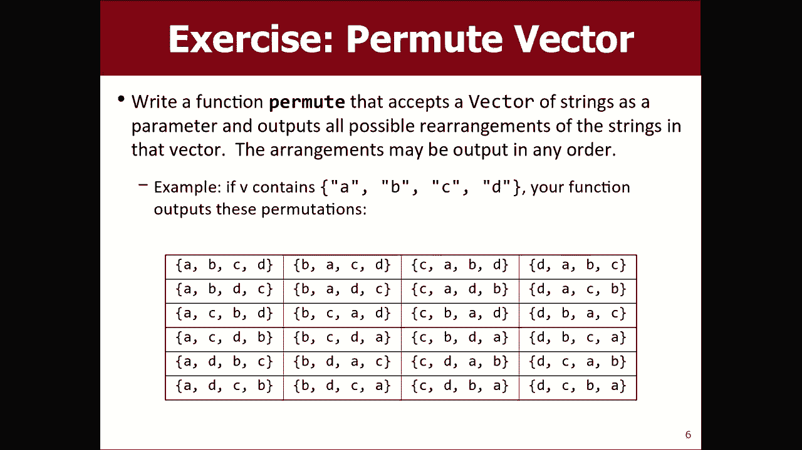

用迷宫做这件事Explorer是否注意到我们做迷宫时，没有写一个叫做Explorer Explorer迷宫助手的助手，为什么不，为什么我们不需要任何额外的参数，我们在哪里记得。

我们在这个问题中做出的选择，即迷宫对象正在存储，对我们来说，因此我们不需要建立其他结构来记住，对我们来说，这只是这个特定问题的一个方面，所以让我们开始吧，我有一个存储ma RT和y的向量。

我想对其进行置换，再说一遍，我们通常想做一个助手，所以让我们来，仍然使用称为V的字符串向量的辅助对象，但我们还将通过，以某种方式跟踪我们选择的内容您认为我们应该如何保持，跟踪我们选择了什么。

我们可以将我们应该打印的输出传递给字符串。

就像一个收藏，尽管我认为传递一个收藏可能会更容易，我们从到目前为止选择的元素中选择了一个向量，所以我会说。

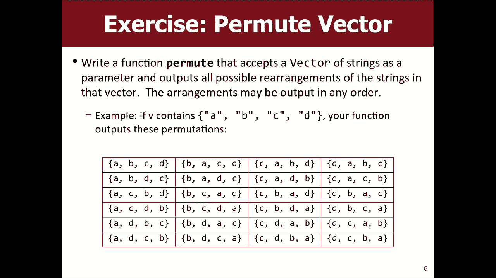

在主置换函数中选择的字符串向量称为，实际上必须写将使称为选择的字符串向量，我们，将其传递给您，您知道我们总是必须打电话给助手以获取，整个过程都知道，所以我们将通过B并选择，因此最初我们已经。

什么也没选择，所以选择的向量为空，这就是递归开始的方式，好吧，你告诉我，我需要做的就是选择一个元素，然后按照，排列其余元素正确如何选择元素。

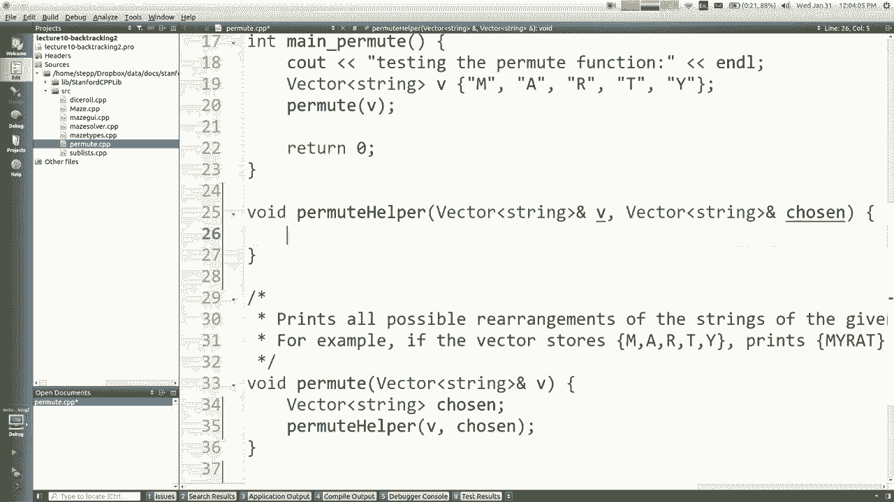

我应该选择像想象中的那样我是第一个电话我是第一个电话，我有BC和DI可以选择其中任何一个，我选择Hey well，我的意思是那是它的结尾，然后我选择一个，那就是，这就是我的全部意思。

我想可能不清楚我应做的演员选，一次选择所有一个，然后选择一个，然后尝试，应该选择B然后尝试选择C然后再尝试，没有不好的结果，这不是我要陷入糟糕状态的地方， ，从中退出或执行其他任何操作。

但我需要全部尝试，所有尝试，他们是第一位的，然后我需要尝试所有他们都第二位的，所以。

这里的想法是为每个选择选择哎呀探索，取消选择正确，因此对于每个选择均意味着对向量的每个元素，因此，从零到胎儿的大小，每英寸正确，所以我们将使用，在这里为每个元素循环，选择它，探索它，然后选择它如何。

我选择某种东西是否意味着这个问题，是的，将其放入所选的，向量就是我们存储所选内容的地方，所以听起来不错，选择点加V括号，我，要尝试我是第一位还是第二位，或者好吗，我需要做的其他事情是什么。

但这是选择我是否要。

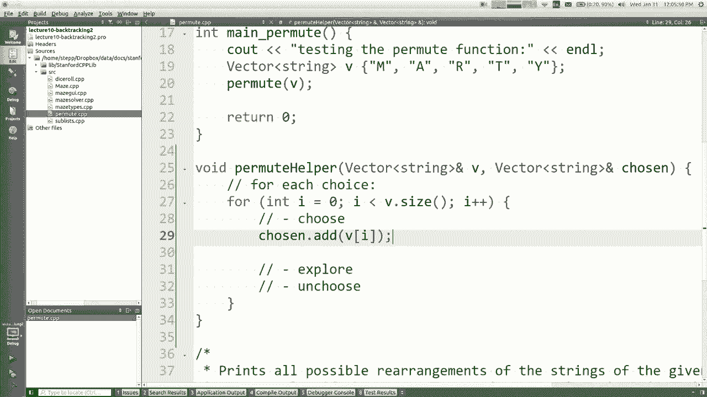

第一个电话，我除了指示该选择之外还需要做些什么。

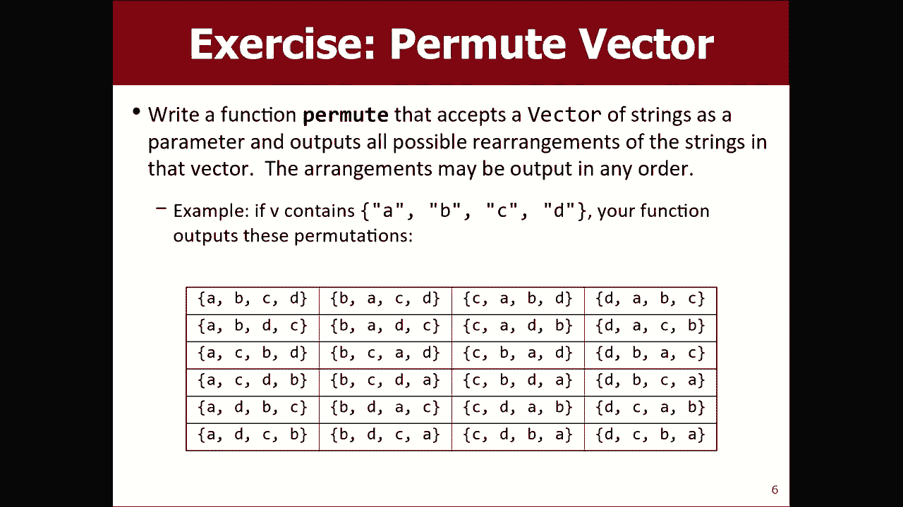

放在向量中让我我还没叫过我一直忽略的名字，您在最上面，对此我感到抱歉，现在看到我看着你这次不举手，我当答案是面对面的时候，我知道一个我知道的基本情况，没关系，否则我需要记住我的选择哦，是的，将其从。

向量V，因为我已经接听了，我不能让下一个呼叫也选择它，为我自己，所以将其从完全正确的选择中拉出来V不要，删除索引中的元素，我可以将其拉出，所以如果您不知道， ，如果很难想象这里发生了什么，但是想像一下。

向量最初是空的，我正在正确地查看ABCD的向量，如果我选择零元素a，那么我想将向量V设置为BCD ，知道我的意思，所以下次通话时他们没有，在那又是你所说的，好吧。

Explorer Explorer通常是，递归部分，所以我只说Permute helper，然后通过V并选择，然后，传递相同的参数，除了我更改了它们的状态，所以现在，下一个家伙有点不同。

下一个家伙在选择中得到一个A ，向量和V向量中的BCD，大概它们会进一步，选择会进一步改变向量等等，因此我选择了一些学生，有点混淆这里发生的事情请记住，置换助手是，如果我是第一个打电话给我。

就会导致一棵树，你知道，最终会导致大量跌倒的另一个电话，所有这些子调用都将返回，这意味着我现在拥有，完成处理或打印可能包含的所有内容，以字母A或元素I或其他元素开头，所以一旦完成，我需要。

取消使用字母A，然后前进并尝试字母B或尝试字母C或，下一步是哪一个我该如何选择，是的，所以我把它从选择的向量中拉出来，我想我认为这不是完全正确的，因为您必须想象，该代码将在第一个电话。

第二个电话和第三个电话上运行，在第四个电话中，第四个家伙不应该清除选择，第二或第三个人，但他们应该撤消做出正确选择的选择，就像我将如何删除最后一个元素很好，如果您说我删除了索引中的元素，请小心。

所以我认为您，我想说的是我是最后一个添加到所选向量的人，所以我想，删除我认为这称为删除回去或删除弹性删除最后一个，向量中的元素，即我在向量末尾插入的元素，首先，我需要做多条线，基本上是相反的。

这两条线中，我经常需要正确选择的是，选择的镜像代码，所以我必须从这里删除，我需要添加到，在这里正确，所以我怎么把它放回VI中可以说V点加了什么，我实际上已经没有值了，所以也许我要做的就是说字符串。

 s等于那个，所以我将选择的字符串放在一边，现在我将按下，在这里，我将s放回V，但那不是很正确，因为我的方式，从V删除是因为我说删除索引I的人，所以我应该把，他们重新回到索引。

我必须尽我所能镜像这些事情，知道我的意思，所以我真正应该说的是插入索引，我把值s ，回到我带他离开的地方，好吗，我认为这里的模式，一开始很难读，但这是选择元素的想法，它探索接下来会发生什么。

然后再回来使用，是的，继续，哦，哦，你的意思是从这里拿出来，用它插入，然后我不需要，字符串是的，我认为那完全可以，而且可以正常工作，总是有不止一种方法做到这一点，我认为没有什么不好的。

关于有一个变量对我来说很好，所以这些想法中的任何一个都是，很好，这里有些东西不见了，后面的人都想告诉我，我现在在此代码中缺少什么，缺少基本情况谢谢，我很高兴您在这里使用基本情况，而实际上。

正确的答案这里没有基本情况正确的没有基本情况什么是，基本情况下，我知道我们说的是空话还是空话，或者您知道是否，向量或当我们回溯，基本情况通常遵循一系列先验调用，因此我不会将其视为。

空向量一定就像我要您置换一个空向量，就像我要你置换effete vector一样，它逐渐减少直到，并不是当我们达到基本情况时，我怎么知道我该如何，知道我已经掌握了基本情况，那时候将会发生什么。

所选向量已满，V向量为空，这就是您所知道的，选择了东西，我认为检查V可能最简单，空着选择饱满是可以接受的，我并不总是知道，有多少个元素构成满，所以我只寻找V为空，它更容易等于我们的等效思想，因此。

如果V为空，则为基数，这种情况意味着我已经完成了所需的所有选择，否则，如果B为空，我将做所有这些事情，我认为这个问题的重点是我应该打印所有这些，不同的排列方式，所以我只看一下选择的内容，然后输入。

恩德尔，这可能可行吗，没有主方法，但这是因为我，重命名它不是我们的错，让我们再试一次，我认为这是可行的，因为我的老鼠在这里某处，我的老鼠，我的名字很像它的肮脏字谜，实际上是我的全名。

真的是我不会告诉你那儿有什么，但是是的，你可能会学到，稍后，但是我认为它可以正常工作，如果您确定，我看不出它为什么起作用，对我来说真的没有意义，我一直回到这种方式，我认为我的。

如果我的意思是可爱的创建者是我的最爱，那么我喜欢在我前面有代码的最喜欢的方式，理解到底发生了什么的一种方法是在，函数调用的开始，所以如果我只是做C置换V等于选择的V怎么办，等于选择和endl。

我认为不是我做递归缩进的事情，它缩进了呼叫，让我们做，让我们做，我必须包括这个东西，称为递归H，然后如果您这样做，您可以说递归并缩进，紧随其后的是东西，所以请注意我实际上是很多，输出让他坚持下去的爱。

让我们走的短一点，让我们走， B和C好，更容易阅读，因此请重试，看看我们称之为什么，它的V充满了东西，并被选择为空，因此导致三个调用，导致此呼叫，它导致此呼叫，并导致此呼叫，它导致，我先尝试。

然后我先尝试B，然后我尝试，首先使用C，然后再探索所有可能具有，首先探索所有可能拥有B的东西，可能先是C，所以第二个电话是这个人，您已经选择了，等我在错误的地方，这个家伙在这里，您已经选择了。

我有B和C可以选择我要做什么，好吧，我会尝试两件事，我会尝试选择B，而我会尝试选择C和，因此，每个人之后都导致另一个呼叫，最终您明白了这一点，今天没有什么可供选择的地方，所以就像一棵树。

这里所有的电话排列都很好，您认为家伙们对此有新疑问，这样做有意义吗，在这里，您会发现选择我很有趣的地方，我没有任何打印输出可以表明我，我能不知道我是否有时间做，我想我可能会做，它。

但是脱鞘的感觉就像我可以在这里打印一个图，好吧，让我们，让我们在这里做我真的我的意思是我认为我当时，试图决定我要离开的那五分钟我该怎么办，我想我想做的就是尽可能地了解这一点，在那段时间，您知道了。

这是在我选择之后，所以我要做的是我会说我选择的正确，然后为什么，我不打印V现在等于V然后我说选择现在等于选择好了，因此更多的是印刷，您应该这样做，因为很难理解这些东西，去下载并打印它做所有这些事情。

所以现在在这里，当我选择时，我会说我不使用s，我将创建V和，我打印出来看起来很酷，好吧，让我们看看它看起来是否很好，所以看起来应该不错，之前类似，但是有更多的东西好吗，我看到置换没有什么了，选择了。

我选择了以后，它会说很难读，不是吗，我，嗯，哦，不，不是，再次，所以我选择了一个，所以现在就开始吧，进行第二次呼叫，因此选择了a，他们稍后选择了B，然后选择了b ，他们选择了C。

所以我不知道我不知道这很难读，具有所有额外的输出，但认为这样的消息会打印出来，这将是您更详细地遍历代码的一种方式，而我，完全鼓舞人心，我认为这是一种非常好的建立方式，关于这种代码到底发生了什么的直觉。

有一个简短的问题，还有几分钟，你知道我没有，想要开始像锻炼这样的新运动，或者与您进行任何其他运动，这还不够，时间，但让我问你这个变化，如果mm-hmm如果这里有重复的话该怎么办，就像BB 。

 C你知道如果它是BB C吧，所以我打印了我可能不得不，关闭一些打印，因为它的输出太多了，但是让我，在那里删除这些真正的快速，所以现在我运行它，好吧，像打印所有的东西，但如果您仔细地浏览一下，我。

认为某些相同的行输出被正确打印两次甚至超过，两次我都明白为什么会这样，因为其中一项安排是，就像最初的第一天，然后是第二天和第一天，安排的原本是第二天，然后，说得好吧，这些是与众不同的。

因为它们彼此之间并没有区别，从用户的角度来看，我不想打印两次，关于如何快速修补补丁的任何想法，以便，媒体不会回来的，当然，有很多方法可以做到这一点，但是如果我们有两分钟，那么我。

认为每次打印时您所做的就是记住，您要做的就是这样，您保留了一组称为字符串的向量，打印出来的东西，或者是您打印过的东西，好吧，您传递另一个参数，因为这是新信息，我们试图在您记住这里。

进行创建的原始函数调用，将其设置为空，然后传递给它，这样，它将记住我们之前和现在打印时所打印的所有内容，在这里，当我执行打印输出时，我会将打印的内容添加到打印的设置中，广告选择还可以。

但我们错过了最后一件，我们现在想起了我们，打印，但要记住的重点是避免打印，同一件事两次正确，我如何合并它，这样它就不会，实际打印两次相同的东西是的，如果打印的内容不包含所选内容。

那么打印所选内容添加到所选内容，我认为，我需要导入set我想在这里设置点每个条纹太少的参数，哦，抱歉，我需要将打印的内容传递给我的递归调用，让我们尝试，再次，我想如果您检查我的眼睛不好，但我很确定我们。

剪掉那些重复项，所以您的想法很棒，所以我没时间了，让您转到“部分”，“星期五见”，我们将再做一些练习，谢谢。

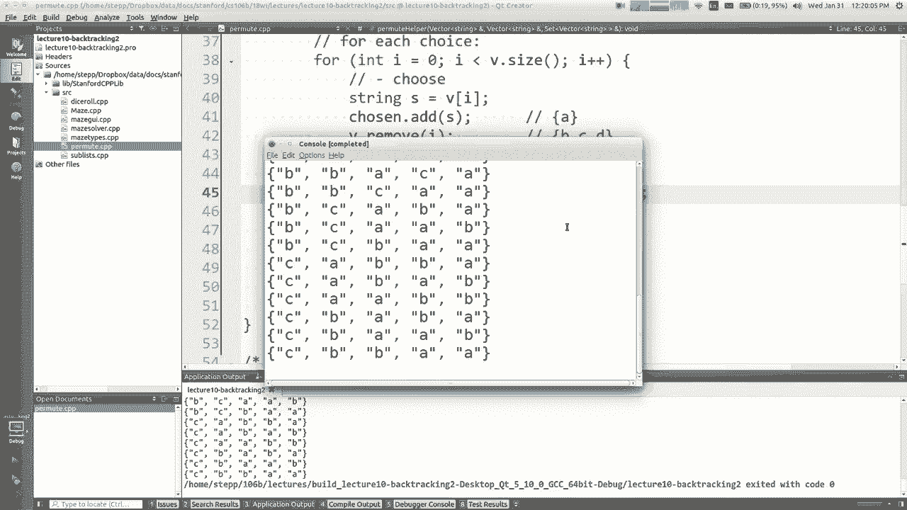