# 【编程抽象方法 cs106x 2017】斯坦福—中英字幕 - P12：Lecture 12 - Backtracking 2 - 加加zero - BV1By411h75g

好啦，我们何不现在就开始呢？呃，我想我想这个麦克风完全正确，这是这个麦克风，开了吗，有用吗，好啦，只有我是对的，哦我的天啊，哦好吧，我会试着把我的声音，尽我所能，嗨很高兴见到你们，今天是星期五，第四周。

我们今天仍然在讨论递归和回溯，我们在哪里，我们这个星期五就在这里，只是更多的回溯问题，今天的讲座结束后，你可以去看看作业四，它现在就在网站上，这是一个集中在回溯上的问题集合，只是想看看我们要去哪里。

看看下周的日历就知道了，我们将学习一种叫做链表的东西，它涉及到另一个叫做指针的主题，那是窃听器吗，我在课堂上有窃听器的第一个案例，是啊，是啊，下周指针和链表，然后我们要期中考试，下一个是星期四晚上。

确保你的日历上有这个，一定要检查你的时间表和日历，我很快就会发布一些练习考试的问题，也许这个周末，也许下周初你可以看看，你可以对考试有更多的了解，但我给你们的建议是，从今天开始不到一周。

但接下来的星期一，所以你有更多的时间，我的建议是假装它应该在这里，尽快把它做完，因为那样你就有更多的时间专注于考试，我觉得你花在学习上的时间越多，你通过考试的可能性就越大，所以我会给你一大堆练习题。

这将与真正的测试问题非常相似，如果你只是去做一堆，或者看着一堆，你很有可能通过真正的考试，就像那些练习题一样，好啦，所以我以后会更多地谈论测试，但这是我对你今后的总体建议，上次我们讲完课。

我们在研究一个叫做子列表的问题，我们应该打印一个向量的所有子集，我们差一点就完成了，但我们没有，我就停了下来，我让我们带着程序中的一个bug走了，所以我想重温，我想修复bug，稍等一下。

如果我运行这个文件，它向我显示了这个输出，也就是，输出不对，少了很多线条，所以，我的意思是看，我可以只是，我们只是谈论修复是什么或bug是什么或其他什么，但我也想谈谈一个过程。

因为我想你们中的很多人会去写，递归代码或回溯代码，一开始可能是错的，你是做什么的，你怎么把它修好，所以你必须有一个过程，我觉得你能做的第一件事，你可以去看看代码，看看你是否明显地看到了bug。

但我想这取决于你的鹰眼，啊哈，就在那里，你知道的，很多时候这很有效，如果bug的性质是，你的代码中有一个错误，你必须改变错误，但更难注意到，哦，我错过了什么，我应该让你知道，很难注意到一件事的缺乏。

所以我不认为仅仅盯着代码，直到你看到bug总是有效的，所以就寻找bug的具体建议而言，我一直在做的事情一遍又一遍，在递归的开始，这里，我插入一些打印声明，我打印的地方，我把参数打印出来。

我会打印v的值是多少，选择的价值是什么，我想如果你看看那一连串的电话，可能前面有个凹痕，我想你开始看到等待，那不是一组电话，我以为，为什么会是，所以这开始引导你进入一个过程，雾现在到底在哪里。

在这种特殊情况下，我来提醒你我们在做什么，我们讨论了回溯问题如何有一个决策树，你选择走一条路而不是另一条路，我们为这个子集问题做出的决定，我们是关于给定元素的，我想把它包括在选择的内容中吗。

还是我想把它排除在选择之外，所以我们有两个案子，让我们把它们添加到选定的，然后重复或者让我们把它们从选择中移除，然后在没有它们的情况下再次复发，所以是两个，每个都有两个子调用，好吧，这就是我们的结局。

现在看起来很不错，你知道少了什么吗，我是说，这里有什么问题，事实上，我想你可能会看到，如果你记得回到模板的类型，如何描述回溯问题，模板的哪一部分缺失了，是的，联合国选择，所以你应该选择，探索未选择权。

所以看看这个代码，我选择处理零号元素，然后我探索了我可以用零元素做的两件事，我可以把他包括在内，或者我可以把他排除在外，然后我就完蛋了，我选择和探索，哎呀，我没有很好地回溯，我是说递归调用又回来了。

但我没有撤销，我认为一个很好的启发式是，当你做回溯时，任何变化，你的电话，你应该检查一下，确保在调用退出时撤消这些更改，所以这是一个很好的经验法则，这里我把矢量中的元素零取了出来，我再也没把它放回去。

所以我需要做的是在最后这里，我需要说和选择，我得说，索引零处的V点插入，值优先，我一开始从那里提取的价值，好吧，现在有了这个变化，我要得到所有我想要得到的子集，所以关于那个问题的任何问题，真的。

我只是想让你原谅我最后没有解决它，星期三的课，只要我们冷静，我会继续前进，我只是不想你看不起我，好啦，所以总的来说我们今天会做更多的题。

更多问题示例，我想今天的问题会对你的一些家庭作业问题有特别的帮助。

所以让我们来谈谈一个叫做八皇后问题的特殊问题，或者更广泛地说，董事会的N皇后问题，n乘n的棋盘，默认是八乘八，这就是真正的棋盘，这个想法是，你能在黑板上放八个皇后还是在黑板上放皇后。

在没有蜂后能够互相攻击的情况下，所以如果你不下棋，我是说女王可以向八个方向移动--上、下、左、右和对角线，我不知道为什么它变白了，但是蚁后可以以45度的增量向这些方向移动，对呀，所以像这样的配置。

我相信这是一个有效的解决方案，但如果女王在这里，那就行不通了，因为这两个人可以互相攻击，对呀，那么我如何找到这样的配置，如果我给你一些网格或棋盘什么的，我要求你把所有的皇后都放在上面。

这看起来确实是一个问题，你会想去探索所有可能的解决方案，这感觉像是一个详尽的搜索问题，但你可以想象，如果你试着把一些女王放在一些地方，那将是一个糟糕的位置，因为它们可以互相攻击。

所以也许我们会想走出这些路，所以这是一个回溯问题，我们不会打印每一个配置，我们要把好的配置打印出来，好啦，嗯，有任何回溯问题，如果我们要制定它，就像，尝试所有的选择，你知道的，选择。

探索并选择什么是选择，每个电话在这里要做的工作单位是什么，你觉得怎么样，放一个女王，这似乎是一个相当具体的行动，对呀，所以会有像，一次最多总共可能有八个递归调用，好啦。

所以如果我的选择是现在把一个女王放在哪里，接下来我们要做的是思考这个选择的所有选项，我想有时候我们谈论决定和选择，我的决定是我要把一个女王，但选择是，我把女王放在哪里，黑板上有八乘八的正方形。

所以我想我能做的是对每一个方块，我可以选择在那里放一个女王，然后我可以探索，然后我可以选择正确。

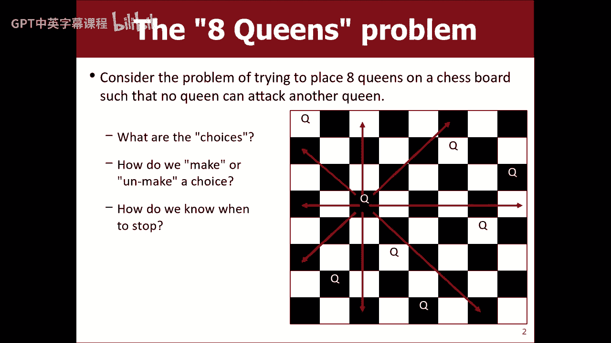

这就是我所描述的每个平方的朴素算法，在那里放一个皇后，把其余的皇后，那可能是递归，对呀，然后哎呀，如果这让我不高兴，那我就把王后赶下台，所以有时我们谈论大O或运行时或其他什么，就像那要多久。

它要尝试多少不同的解决方案，嗯，我是说这个女王有64个方块，然后这些方块中的每一个我都要开始一个呼叫树，下一个有63个，所以它只是凌乱的权利，就像我的意思，我不想再因为滥用组合学而惹上麻烦。

但就像我想让你相信会有很多不同的道路，我们必须在这里检查，对呀，我不会花时间这样写代码，并运行它，因为我们甚至不会看到代码在合理的时间内完成，所以我不希望这是我们的算法，我觉得我们应该想个更聪明的办法。

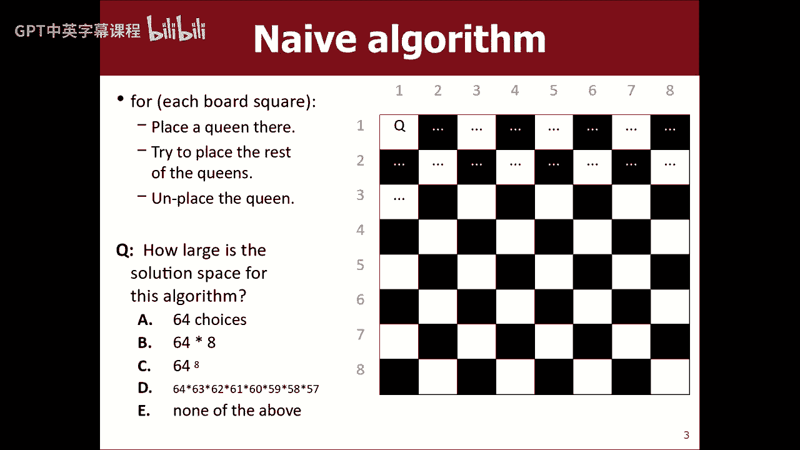

也许我们需要做的是我们需要备份并看看它，所以我发布了一个解决方案，与其说我想不出解决办法，不如说我想不出解决办法，这里有一个，但这里有一个解决办法，也许通过观察这个解决方案的一些品质。

也许我们可以推断出一些优化，我们可以对我们的算法进行优化，这块板有什么特性吗，但你认为我们可以利用我们的密码，是呀，大人，所以我们每行只能放一个皇后，所以我们可以，你知道的，当然。

这个解决方案有一个品质，我很肯定，每一个有效的解决方案都有一个特点，就是每一行都有一个皇后，不可能有两个，因为他们可以互相攻击，每列也只有一个皇后，所以在限制解空间方面，当我们试图把一个女王。

我们可以减少一些关于其他问题的事情，但你能说的，是啊，是啊，黑色方块上有四个皇后，黑色方块上有四个皇后，那很有趣，有同样数量的皇后在黑色，是白色的，是啊，是啊，我觉得，您可以对此进行很多小的优化。

或者你可以对这些解决方案做很多很好的观察，我想展示它有多强大，只是为了做一个优化，比如，让我们做一个简单的版本的第一个建议，每列都有一个皇后，就每个递归调用所做的功而言。

假设一号电话将决定把这个放在哪里，但这会把她放在这个专栏的某个地方，二号电话会处理这个女王，这会把她放在这个专栏的某个地方，所以现在不是每个电话都有六十四或六十三或六十二个选项，每次呼叫最多有八个选项。

那至少会减少很多东西。

在我们的组合呼叫树爆炸中，所以不用这个算法。

也许更像这样的，其中每个调用处理一列，你可以用一排做同样的事情，你还可以做得更多，同时考虑行和列，把它排除在外，你知道你可以做的更多，但现在解决方案空间小了很多，更像是八个，你知道每打一个电话比六十四。

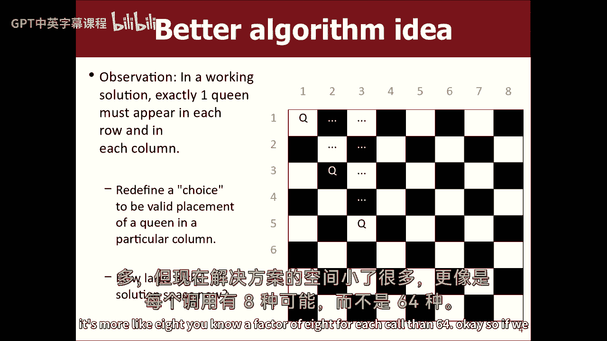

好啦，所以如果我们真的要编码这个，我会给你提供一些帮助代码，帮助解决这里一些不太递归的部分，所以我有课，我带来了所谓的董事会，就像一个网格，只是行和列，你可以构造一个给定大小的板，你知道如果你过了8。

做一个八乘八的木板，你可以问是否可以在给定的位置放一个女王，所以它会检查所有现存的蚁后，看看它们是否能互相攻击，你也可以在那里放一个皇后，或者拿走，如果我们或你可以打印黑板，所以如果我们有。

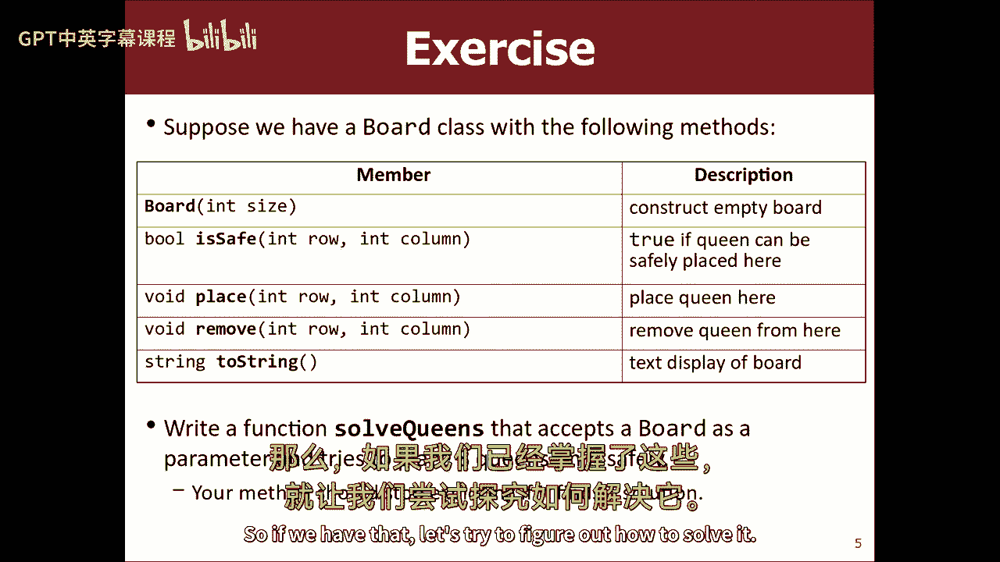

让我们试着弄清楚如何，如何解决，我这里有可爱的造物主，我要重新命名我的主，我要打开另一个文件，称为八皇后，在这里就像，让我这样，我们要写的是索尔皇后，以参考板为参数，他们只是做一个八号的木板什么的。

我们说解决皇后，所以现在我们需要写，解决皇后，帮我开始，我们在做递归，我们在做回溯，我们将不得不考虑基本情况，我们得考虑选择，探索，Unche，考虑在调用之间传递参数，在这里。

有什么事情是你首先要做的吗，我是说，我们只是大致描述了算法应该是什么，所以说，创建一个helper方法，并在父级上使用int description列，好的很好，让我们做一个帮手的方法。

我想在很多回溯问题中，我们需要一个帮手。

因为我们讨论了每个调用如何处理一列，我们不知道该处理哪一列，除非我们被告知，所以我们需要，是每个电话都能接收到的信息，调用如何接收信息是通过参数，所以是的，让我们写一个助手说。

在这一栏中放置一个皇后，好啦，所以让我们做虚空，解决获取相同板并将其放入列中的帮助器，或者叫伟大，所以我认为这个想法会像，如果您调用解决助手，你要从第一列开始调用它。

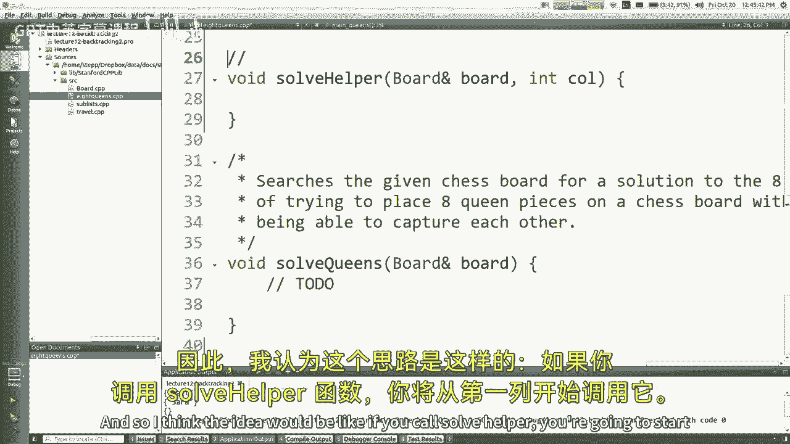

然后这个调用将在第2列调用它，这个调用将在第三列调用它，以此类推，我们从左到右，我认为考虑一下假设是很重要的，就像如果我在做第五栏，我想我可以合理地假设，是因为前四个电话已经把他们的皇后。

他们在合法的地方这样做了，所以我不是在处理一些无效的状态，当我必须做出正确的决定，在我之前所有的人都做出了合法的选择，所以我想我要说。

你知道的，前提是，你知道的，列零到调用，减去一个合法地在里面放了皇后，或者类似的东西，好啦，所以这是一个好的开始。

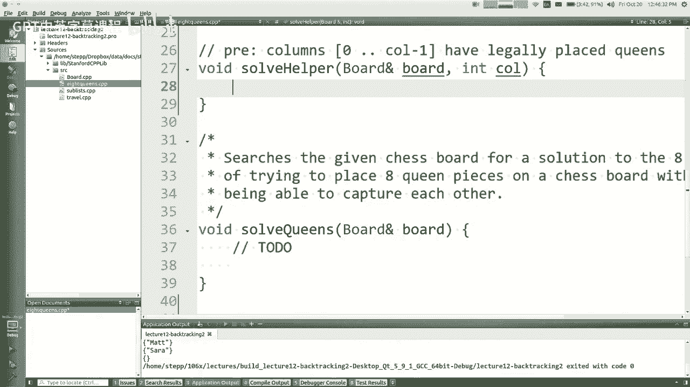

我们说过，每次调用都要遍历，好好想想怎么把女王摆正。

那么我该怎么做呢，没有人在前面叫过你，到站了，所以如果有空位，董事会有办法，我们可以说如果放一些东西安全，但是板点是安全的，我们要传递一行和一列，你想让我过哪排，同一行，行和呼叫号码，一样就像。

如果我加入。

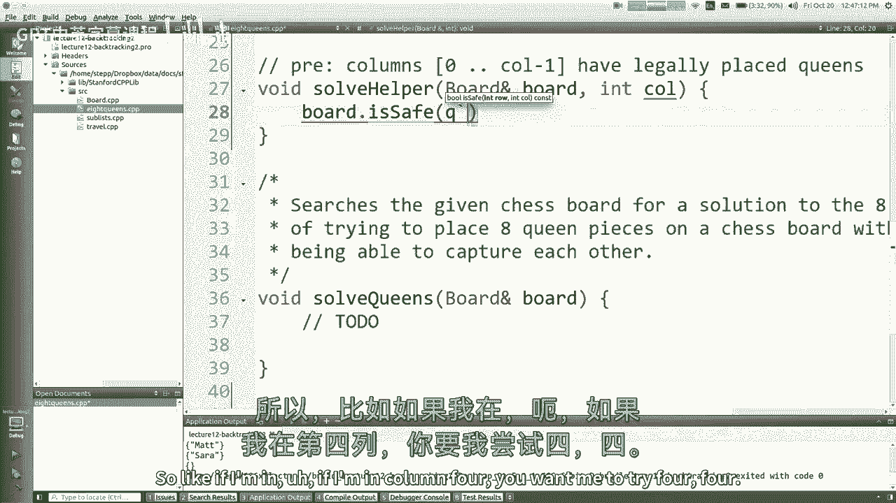

如果我不叫你，想让我试试四个，“那么你想让我把什么作为一排来传递呢？”，但是你应该循环所有的行，好啦，试试看吧，是啊，是啊，没错，这是一种回溯，我不知道哪排是正确的排吗。

这就是为什么我们要竭尽全力地尝试每一排，但只对我负责的当前专栏负责。

我的电话是对的，好啦，那么现在每一行呢，事实上，我想看看真正的快，我很确定这块板用的是一个数字，我可能错了，不过，让我再确认一下，还是零基，我换了吗，以前是一个基地，然后我总是在课堂上做错，是啊，是啊。

我来确认一下，是啊，是啊，好啦，它是零基的，好啦，酷所以所以让我们做，行等于，零行小于板，点大小，行加加，我可以写不到八点，但就像，我想我们希望它能适用于其他板材尺寸和其他东西，对呀，所以对于每一行。

你说的是，让我们看看在这里放一个女王可以吗，所以说，如果在这排和我的纵队放一个女王安全的话，不选择的权利，所以选择就像让我们在这里放一个女王，所以板点的东西叫做放置后在行调用探索是递归的部分。

解决帮助器传递相同的板和什么调用移动过列到下一个，然后不选择就像拿走那个后右板点移除行调用，是啊，是啊，试试看，啊，你知道我没有做什么，嗯在这里，这东西只需要叫帮手就行了，所以我们只需要说解决助手。

这块板，我们从第0列开始，我的意思是，你知道的，你可能会说，啊，我能在这里加一个额外的参数吗，或者别的什么，那可能没问题，我只是那是一个C加的东西，如果是Java，你得把它写成帮助什么的，所以是的。

然后在这里，我认为缅因州需要更名为，他们称之为主皇后，所以好吧，哇哦，哎呀哎呀，呃，啊，上面写着非法索引第0行第8栏，所以柱子向上穿过七个，哼，那么这是怎么发生的呢？嗯是的，我们没有基本情况，哎呦。

没有基本情况，对呀，哎呀哎呀，是呀，我的意思是，我就知道，但你很清楚，基本情况是什么，如果调用等于，或者至少和木板一样大，那是基本情况，否则还有更多的工作要做，我现在会再做那种事。

还记得我之前说过什么是基本情况吗，当一个回溯问题对，基本情况不像，你让我计算1的阶乘，这很容易，更像是其他的电话都是在我之前打的，他们已经做了所有的工作，所以我不需要做太多。

我只需要用他们做的所有工作做点什么，如果我到了这个地步，如果我在29号线，我知道什么是真的，如果我到了这里，我找到了解决办法，我怎么知道它是有效的，我没有把他们放在不好的地方，说是，去吧。

你一直到最后一栏，所以这意味着你一定是一个地方，八柱，所以这意味着有第九个递归调用比所有调用都大，是啊，是啊，是啊，是啊，我的意思是，我认为一个想法是这样的先决条件，如果我调用一个8的参数值。

也就是第九纵队，我有一个先决条件，即所有先前的列都有效，放置，女王在里面，这意味着所有八列都有有效的位置，所以就像我以我的先决条件，假设我的代码是正确的，如果我到29号线，我找到了一个解决办法。

所以让我们只做，让我们打印它，看看如何板和所有并运行它，我发现了什么，哇太酷了，所以看看它做了什么，它吐了出来，这是一个解决方案，这也是一个解决方案，而且它只是打印出所有不同的解决方案，酷嗯。

我们可以坐在这里，通过画线之类的东西来验证它们，但是，否则我们不能那样做，呵呵，这些看起来不错，这些看起来像它的工作，所以我的意思是，我想这就是它的内脏，我想我们基本上解决了这里的一般问题，是啊，是啊。

假设我们只想要一个板输出，我们如何取消所有，是啊，是啊，你的问题可能，我可以展示一个解决方案，然后停下来，那正是我接下来想做的，原来你是，我想谈的事情你说对了，但是嗯，所以做那件事有好的方法和坏的方法。

对呀，就像一种方式就像嗯，退出，有一个，有一个，有一个退出函数，它只是退出您的程序，停止程序，所以说，我不喜欢那个解决办法，它是它是一个黑客，我不知道，这不仅仅是因为像一些风格指南说的不要说退出。

不仅如此，因为我可能想打印一个解决方案，然后让我的程序做更多的事情，我的程序可能不想很好地关闭自己，好啦，嗯，也许不是退出，我应该说回归，或许它能逃出去，离开这里，或许那样就能解决问题不，你不相信我。

哎呀哎呀，没修好，为什么那不能解决问题呢？单曲，呃打电话，是呀，它无论如何都打算做，是呀，从声明中，所以你什么都没做，所以我想，每当你看到回报，你总是想问，我回到哪里，我怎么，我是怎么到这里的。

我在哪里，我的生活在做什么，嗯，这就像电话，是啊，是啊，这是第八个电话，也可能是第N个电话，我想嗯，如果我说回来，它将返回到先前的呼叫，如果有八九个人堆在一起，我从这里回来，只是要回到那个。

我真的想说回到缅因州的路上，不管是谁，没有真正的命令，没有停止递归的语法，现在呢，我想下车，事情不是这样的，但我的意思是我们可以，我们可以让它做到这一点，我只是在解释。

没有一个神奇的关键字可以做到这一点，我们需要做的，取而代之的是，我们需要考虑去，没有安静，嗯那是那是黑魔法，我们这里不这么做，不不不，但如果我们想找到解决办法，这实际上是回溯算法中非常常见的事情。

有时不是有时你想像我刚才做的那样打印所有的解决方案，但有时你想要一个单一的解决方案，所以一个诀窍是我需要说，好啦，此时此刻，它是有价值的，即使回归不是很正确，这是代码中我知道我有解决方案的时刻。

似乎我应该利用那一刻来告诉我的递归，停止做它正在做的事情，换句话说，我接到了八九个电话，上面的人需要给，他下面的人不会再出现了，函数调用如何向调用它们的地方提供信息，我怎么会，我会得到什么好的回报。

我可以返回一些数字来指示你是否应该继续，我是说，但好像有点啊，是或否，你应该继续吗，还是不应该继续，通常你应该，但如果你找到了解决办法，你不应该，如果是或不是，真假，它是布尔右。

所以让我们把它变成一个双函数，让我们说说它的作用，这里，是吗，你知道的，如果找不到解决办法，回返，假的，所以如果我在这里找到解决办法，我会回归真实，现在我们再说一遍，单独不喜欢展开所有这些电话。

但如果打电话给我的人寻找真正的价值，他们会做出正确的反应，那么我还需要改变什么呢，我的意思是，只是我做了不会修复它像，我希望你能理解，哦其实，这是个错误，因为我不总是回来，就像，如果你说你要还一头公牛。

你总是要回公牛，就像这里的代码路径，就像如果我尝试所有这些不同的事情，我找不到任何解决办法，也许我需要返回假的，或者类似的东西，我没有找到答案，所以我想如果我加上它编译，但它仍然打印出所有的解决方案。

你知道我需要再改变一点，有一天我还需要做什么，我还没有调用是和变量等于，所以在这里你是对的，当我打电话给解决助手时，所以再一次，记住谁在叫谁谁在回第8个呼叫者的地方，或者我猜这是第9个电话。

做这件事的人，哪里是真的，回去吧，返回到上一个调用，在这里的代码是什么，上一个电话打到这里，他们在等我，就像之前的电话一样，我就在这里，我在这里真正地回到他们身边，所以你说的很好，你说过，让我们捕捉。

电话正返回给我们，让我们说，公牛，这个值告诉我下一个人是否找到了解决方案，现在我用这个值还能做什么，你想解决这个问题吗，还有，我会用这个布尔值做什么，返回结果而不是错误的权利，所以我想这是对的。

我想我要稍微调整一下，因为嗯，假设我们要探索八种可能性，右边八排，在第三排，我发现我得到了一个真正的解决方案，我不需要做其他五个，对呀，我不想做其他五个，所以我的意思是，如果我把返回结果写在这里。

结果是找到了解决办法，但我认为它仍然会探索其他解决方案，我想避免这种情况，所以你能给出一个解决这个问题的方法吗，所以之后它可能会扩大它的结果，所以如果结果是真的，返回结果立即停止，是啊，是啊，那太好了。

我告诉你学生们最常见的错误是，他们会说好的，如果结果是真的，在这里返回true，那很好，但他们会说，否则现在这里返回为假，当然这是不正确的，这种描述方式有什么不对，不是很优雅，但它的功能有什么问题。

然后它就会停止第一个正确的，就像有多达八件事我可能需要尝试，这就像我尝试八个中的第一个，如果失败了，其他七个我都不试，这是不对的，我需要继续尝试，直到我找到一个有效的，所以只有当我看到一个真实的。

我应该早点停下来吗，如果我看到一个假的，我不应该还任何东西，我应该让循环继续做它的事情，好啦，所以我认为一些微妙之处，我可能会对这个代码进行一些详细的讨论，但我认为这些微妙之处很重要。

因为我只想早点停下来，如果我找到答案，如果结果是真的，那就别说了，如果我完成了所有的8个而我从来没有这样做，这意味着我的八个分支都不成功，这意味着我应该返回假，所以我认为这个版本的程序打印了一个板。

如果你想要一个变体让你有点挠头，我可以给你一个int数吗？要打印多少个解决方案，什么，如果我想打印我找到的前三个解决方案，然后停下来，你会怎么做，好好想想，你无论如何都可以考虑这种技术的变化。

但是这种打印一个解决方案而不是打印所有解决方案的想法，你经常有这种布尔模式，如果我找到了答案，停止，关于八个皇后或皇后的问题，是啊，是啊，是啊，是啊，所以我在想，如果我们找到一个，那我们就不，啊。

如果你找到了解决办法，你不能把皇后赶下台，是啊，是啊，那倒是真的，我想我没意见，因为我要离开董事会了，就像解决了的状态，所以我实际上能做的是，我甚至不能打印黑板，就像，如果我把它拿走，递归不会打印它。

但它使董事会进入了一个解决的状态，现在在缅因州，我可以说解决皇后，然后我可以说打印板与否，我想我打印的板子里应该有解决方案，所以现在它离开了那条路，也许我想那样做，我不知道，你当然可以争辩说。

也许我想在这里打印，然后我想把这里所有的皇后都换掉，当我出去把板子放回空状态时，你可以这么做，那很好，但实际情况是，现在就像，我们走到最后，被回溯，尝试其他选择，但如果我们返回真。

我们从来没有做好这件事，我不知道我是否正确地理解了你的问题，我是说基本上如果我们发现这种探索有效，我们不会放弃任何一个，因为我们喜欢我们的发现，我们想把它留在那里，但如果我们不喜欢我们的发现。

我们立即撤销它，然后尝试其他方法，所以我认为这个解决方案，如果它找到了解决办法，我们把皇后留在那里，如果我们找不到解决办法，所有的电话都会撤销他们的工作，当我们最后拿着一块空木板离开时。

如果我们找不到解决办法，所以如果你不想，您必须修改代码来解决这个问题，比如，如果你想撤销皇后，即使你找到了解决办法，你可以在这里放一条线，也就是说，删除点名，或者，我想你可以把这个剪下来。

贴在四行一和四行二之间，或者类似的东西，那一定很有趣，也是，当然可以，这两个都不是对的或错的，这取决于问题规范说了什么，是一个很好的数学方法，哦，像数学一样，我们需要打多少电话。

我是说你可以在每个电话上做组合，这是八叉子吗，你可以开始计算乘法了，但我想事情就像逃避电话，喜欢好，这里不安全，从树上剪掉很多电话，你可以把它移除，如果声明实际上，但是你的代码会探索所有这些愚蠢的调用。

它不需要探索的树木，所以我认为优化方面真的很重要，如果你愿意，我可以在这里放一个末端，数数电话，我想我不打算做这件事，如果你不介意的话，但我想以后编辑这个文件会很有趣，创建一个调用计数的全局丑陋变量。

运行它，尝试打开和关闭各种优化，看着那些电话的来来回回，我想向你们展示的是，有一种方法叫设置延迟，每次你把女王，会停顿一秒钟，它会打印电路板，这样你就可以观察算法，我觉得看着很有趣，这是我们的代码。

它在做完全相同的计算，只不过每次我们把女王，板在内部打印自己，这就是我们看到这个的原因，我觉得真正有趣的是，在更左边的地方，他们移动的频率较低，就像你一直在摆弄那些，在上，权利，更多在这里。

如果你仔细想想，因为我们找到了，所以这是一个解决方案，反正，你明白我在说什么吗，就像更左边的，你呆的时间越长，因为你必须在你之后探索所有这些事情，在你回来移动到下一个相对于更远的右边之前。

没有那么多东西跟着你，所以在你找到解决方案之前，你有一个更快的探索，还是放弃回去，是啊，是啊。

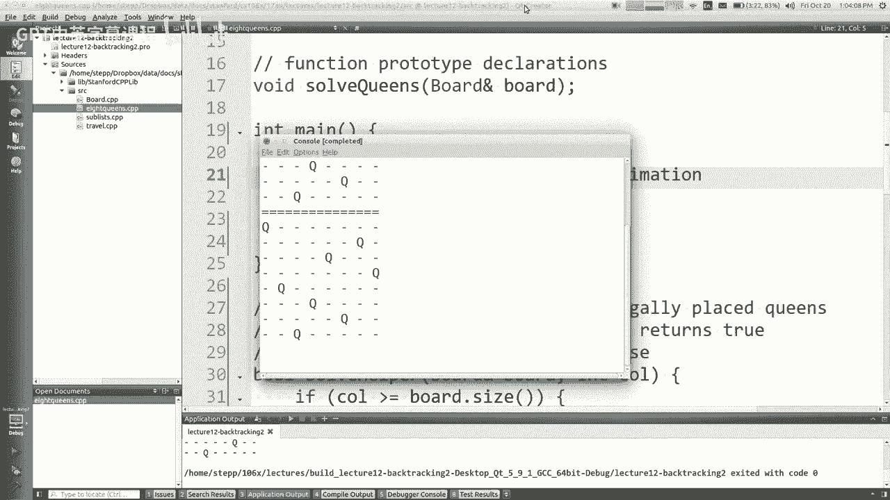

哎呦，为什么不是，滑梯上的那个，这里的那个，对呀，你更像是回去，就像，嗯，我的意思是，我想这很能说明问题，我们找到的解决方案有第一个女王在这里，因为我觉得，我们先试了这个。

所以任何有第一个女王的解决方案，对于任何有第一个女王的解决方案，以此类推，就像嗯，为什么这家伙不在更高的地方，我是说那些规则不是真的吗，他在这里或更早的时候，我们不能解决这个问题，在这里也听到了。

我想我想这可能是真的，如果你坐下来好好看看，我想你发现的是，这个女王在这里是没有解决办法的，另一个女王在这里或这里，如果你被困在这里，你可以用第一个，第二个也可以，我没有坐在那里跟踪，但我想我相信。

由于我们如何搜索的性质，这一定是，所以说，你知道的。

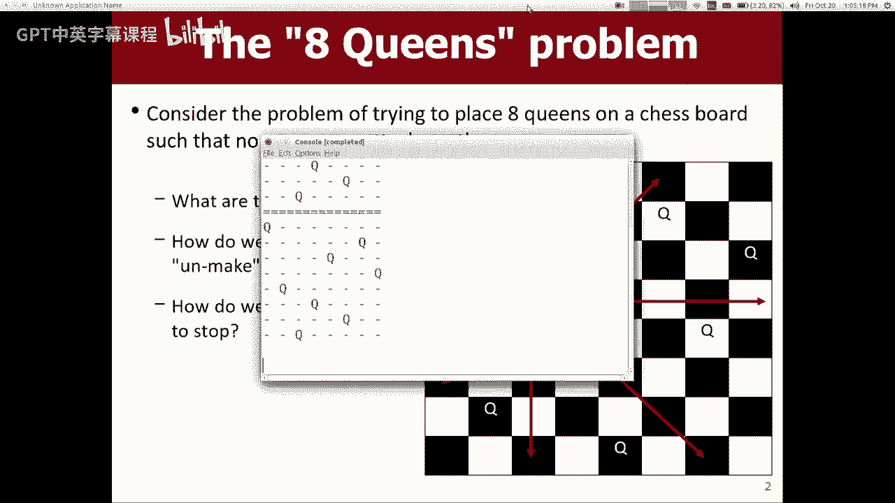

好啦，反正，那是皇后区的问题，皇后区的问题，如果你想看到N个皇后不同的结局，你可以试试，你知道5号或者其他什么的，并查看一些大小端口，没有任何解决办法，嗯。

有五个确实，但我的意思是你可以尝试不同大小的棋盘看看它是否有趣，我喜欢那个，你要做作业，四叫伯乐，你在二维板上搜索单词，肯定有这方面的喜欢，如果你能找到一种方法，通过连接这个网格上的字母来制造一个单词。

你想把它还回去吗，当你找到一条路的时候你想停下来，所以这种编码风格，用递归找到解决方案，如果你看到了，跳出递归，这段代码是一个很好的参考，所以无论如何。

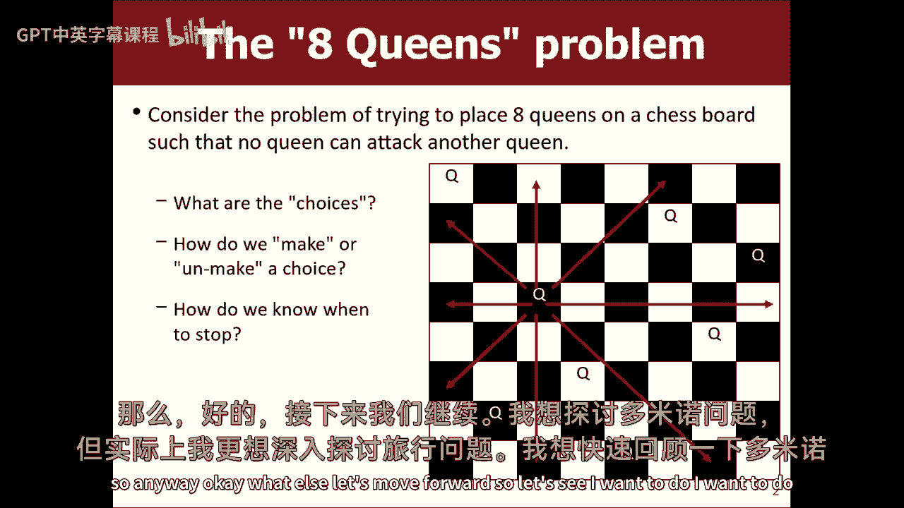

好啦，还有什么，让我们继续前进，所以让我们看看我想做什么，我想做这个多米诺骨牌问题，但实际上，我真的很想解决这个旅行问题，所以我想看看我是否回到这个多米诺骨牌问题，很快的嗯，所以我一直想这样做。

现在有几节课了，在我的幻灯片里，但我还没读到，所以这一个是找到一种方法来跟踪所有到达给定点的方法，所以这就像你知道我们从零开始，我们想画并找到所有到达某个x y位置的方法，所以这是所有这些详尽的，倒掉。

所有的解决方案，各种各样的问题，你唯一能做的三个动作是去东北或东北，现在实际上翻转，所以北方是下降的，因为坐标是主导计算机，但是不管怎么样，如果你想从0到21，你可以斜着走然后写，或者你可以去。

你知道这是一个，这是一个正在进行的部分，你可以往下走，然后再过去，或者你可以过去然后下去，所以你想打印或者尝试所有不同的方法，我们的要求是有道理的，有了这三种方法，你可以移动打印。

所有能让你到达某个地方的方法，然后呢，当然什么，这三招最重要的是你不能倒退，你不能下去，然后向右，然后离开，你不能，你不能回去，原来如此。

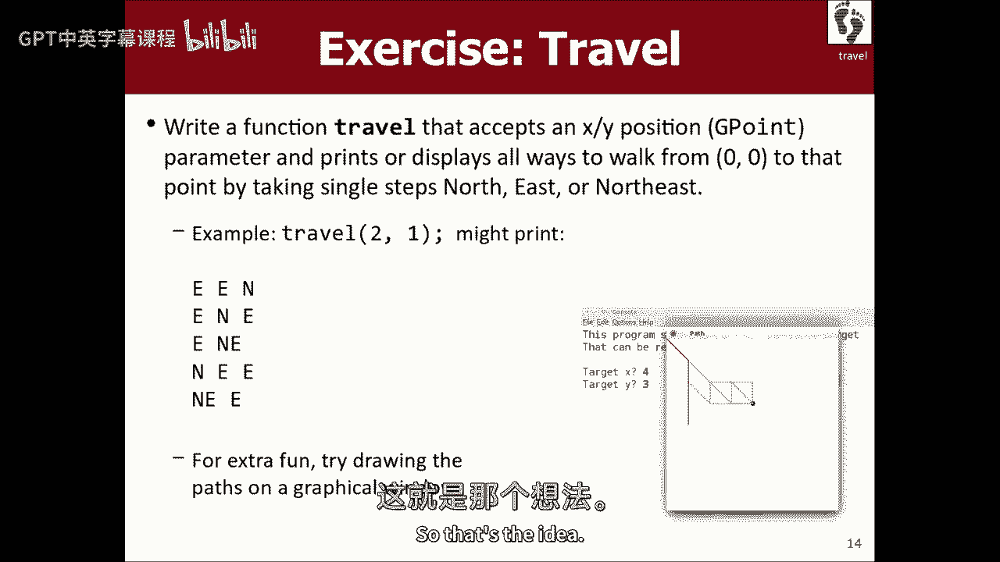

所以我这里有一个文件，叫做旅行点CPP，让我把主改名为主皇后或其他什么，然后旅行，我这里有个主干道，我们现在需要写这个，我取一个参数g点，我根本没谈过这个，只是一个很蠢的小东西。

有一个得到X和得到Y什么的，这很容易，所以嗯，我隐含地从零点到那里，那么怎么做呢，去东北方还是东北，你想告诉我基本情况，也许或者喜欢，你说呢，是啊，是啊，好啦，当然，有不同的方法可以做到这一点。

我认为你的解决方案很好，让我们从那里开始你说，让我们写一个助手，告诉我们我们在哪里，目标在哪里，因为我们从零开始，但是当我们进行这些递归调用时，我们要从那里开始，所以另一种方法是把目标降低到零。

但我想你说的话会更好，我想做的，就是把这个画动画，所以你是说，使像虚空旅行助手采取这个点目标，它需要一个g点，我和我一样的地方，我的位置在哪里，所以说，我要打电话给旅行助手，我将通过目标。

我的位置就像G点，原点，零，我将通过原点或类似的方法，好的，好的，酷好的开始好的开始下一个，还有什么，基本情况是，是啊，是啊，基本情况，我是说很多时候递归，你得想想基本情况，所以好吧，简单的基本情况是。

如果目标等于我，听起来我们在玩，有某种暗杀企图什么的，嗯，如果目标是我，那我就完了，现在这个愚蠢的函数的目标是什么，它应该打印出所有这些路径，所以在理论上，我想打印一些东西，我猜，但我要印什么。

我需要打印，我是如何到达目标的，我怎么知道我是怎么到达目标的，在你以前的位置向量几个点，好啦，当然可以，让我们跟踪，我是说，在所有这些问题中，当我们穷尽搜索或回溯时。

我们需要跟踪我们在某种程度上做出的选择，从一个电话传到另一个电话，选择向量或字符串，这里的格式只是用空格分隔，但我想把它作为一个矢量会很好，也是，所以就像，嗯，也许是字符串，因为我在打印东和北。

我不会打印坐标本身，就像我所选择的东西的字符串向量，所以也许我会说是被选中的，然后在这里我将通过向量字符串引用选择也可以点引用，总是做一个g点参考，哦，就像这里的我。

我这么做的原因是像我这样的人可能会在每个电话中改变，就像我们可以，我们也可以探索一下，但我的意思是，基本上我需要看到我的选择，当我谈到这个基本情况时，对耶，去吧，所以你认为它是一个矢量会更好地使用。

就像输出字符串，我们可以用一根绳子或一条小溪或类似的东西，是啊，是啊，我是说这个问题，我不在乎太多，如果输出与之完全匹配，我可以带个小牙套什么的，我觉得很好，我只想确保我打印的是正确的顺序。

如果你想要没有括号的，我想你可以传递一个字符串，并将一个e或其他东西连接到字符串上，我只是随便，这两种都可以，如果我不是目标，我该怎么办，迈出一步，迈出一步，离目标更近一步，好的递归情况。

向目标迈进一步，所以我说你可以往东或往北或东北，对呀，比如我在这里到底该做什么，你先走，还要检查一下，看看你是否喜欢比，所以不要走得太远，就像，如果我走过它，我不能回去，好啦，所以也许像，如果。

小于或等于目标得到x，小于或等于目标，为什么你这么想，我不喜欢那样，好吧，那么，如果我没有走得太远，然后做一些递归，是啊，是啊，去吧，有一个从零到一的for循环，表示，啊，去做。

x和y的不同变体被一个修正，是啊，是啊，我告诉你吧，我不想在这里太聪明，我可以把这三个案子写出来，而不是试图想出一些循环，我可以写东部的代码，然后为北方写代码，然后写东北的代码，三个都分开了。

如果它是超级丑陋和多余的，我们也许可以试着修好它什么的，但我没事，就像我想把这个问题和那个子列表问题进行比较，在那里你不总是需要一个循环，你知道的，我觉得，我想我解决这个问题的目标之一是向你展示。

有时候没有循环也没关系，就像如果只有几个案子，很容易一一列举，你不必总是把它变成一个for循环，所以我想说，往东走试试，试着往北走，然后再试着往东北走，一次又一次，当我说尝试的时候，选择，然后东北右。

那么我该如何选择东方呢，东边是我的位置，右边X加一个，所以也许像G点东部这样的地方是我的，我的x加零，我的Y加1，东北是两个加一个，所以我要做，我必须做出选择，所以我必须喜欢，做选定的点，最后加上东方。

我不再是我了，我是东方人，对呀，同样选择的向量，然后取消他选择的点，移除选定的网点大小，现在减去一个，你可能在为你的循环辩护，但我是说你看，我想先把这些案子写下来，所以再来一次，但有了北右，北北。

然后呢，往东北走，移除东北，对呀，好啦，所以如果你要在这里做一个循环，你知道的，我觉得你很聪明把0和1，三角洲之类的，我可以接受下面这样的事情，宣布这三点东北方东北，然后你可以把它们变成一个小矢量。

然后，对于他们中的每一个，你可以选择，探索unches，你可以做那样的事，也许我们会回来的，我想，我想试着得到一些以前有效的东西，我清理得太多了，对呀，我们喜欢那样吗，让我们，让我们看看，它是做什么的。

哎呀，没有匹配功能，对于，哎呦，这是字符串的向量，其实不是吗，它不是点的向量，G分，所以我应该加上东方，我应该把绳子往北加，这里我应该加上东北弦，好啦，不管目标是什么，让我们做四和三，哇，看看这些。

那看起来对吗，就不一定匹配字符而言，幻灯片上的输出，但就像那些似乎把我们引向那个地方的动作一样，我觉得他们还可以，所以这就是如何做到这一点的勇气，我想和你谈谈，虽然，因为你可能会说。

但我的意思是我不知道，这是回溯问题吗，我们只是把它们都扔掉，我是说，你知道，有些问题只是把所有的，答案现在出来了，嗯，我们做了一点回溯，就像不选择这些，但我想谈谈，就像，如果我们想喜欢，画出。

因为我们看到了八个皇后，我们看到它尝试了所有的东西，如果我们想喜欢，观看此算法运行。

所以如果我们想看呢，尝试所有的小线条，你知道随着它的发展，那么我们怎样才能做好呢，那么我们能做什么呢，我们可以走过去在窗户上画画，就像我们可以把窗户传来传去。

我们已经在你的作业上做过了，三你的分形和东西，你绕过一扇窗户，如果我回到这里，看到这一切都发生在G窗口上，所以如果在这里，我说在这个G窗口上旅行呢，G配音，然后这里我的助手也拿G配音，然后在这里。

我的助手拿着G配音，在这里G配音，然后在这里，当我叫它，我说G就像现在我有窗户，如果我想和他说话，也许我可以有这个递归，就像画线一样，有点，你知道的，所以我只想谈谈你可能会对代码进行什么样的修改。

为了达到这个目的，我想我看到这些黄线，我得马上把它修好，但我想我可以说划清界限，东北部，从我到东方，或从我到北方，我可以这么做，我可以这么做，我有一些稍微不同的想法，就像是，也许我可以添加另一个参数。

就像前面说的，或者我是怎么到这里的，然后对我来说就像以前一样，我会画一个，这可能会帮助我避免画三条线，一个给东边，一个给北方，东北一张，也许我可以划清界限，从我以前的人到我这里来，差不多吧。

如果我们探索一下，呃首先在我忘记之前，我得在这里说G配音，我得说G配音，我要说开始了，如果我通过了前一个点怎么办，喜欢而不只是我，我像三一样通过了，我通过了我，所以现在，如果你一开始没有真正的热情。

所以也许我会把原点传递两次什么的，它不是一个真正有效的值，不过，好吧，如果你要超过我和普瑞芙，那我把什么传给下面的这些电话，就像，呃，不久的将来，我，所以我是这三个人的牧师，对呀，呃是的，去吧。

为什么你要和我划清界限，是从我到北方的吗，我可以画一条线，从我到东从我到北从我到东北，我想我是这么想的，也许我不必写三次代码，如果我只是从Prieve那里把它画给我，所以就像这里。

我可以说G W B点从Pre点画线，获取x Prieve点，给我点，得到x我的点，现在就得到这样的东西，嗯，如果我想做的好，我来试试，我来看看，如果那样有什么用的话，我只剩一两分钟了，哦G配音未申报。

哎呦，我没有，哎呦，这叫图形抱歉，我应该打电话，可能没时间了，所以这里我称之为旅行，G w b，G点目标，目标x，目标y，然后我叫G，好啦，我们试试看，它在画这些微小的线条。

因为它是从相距一个像素的点绘制它们的，你知道，我想我没有时间完成它了，所以好吧，别再把我们丢在这里了，我知道我知道，我知道我就像那些糟糕的网飞节目之一，他们想让你点击这里的下一集，所以看几件事。

我能做的一件事就是，我可以把这些线相乘，x和y大约是50，这样线条看起来更大，我可以这么做，但我想给你看的另一件事，但我想把时间花在，如果我想展示算法，我真的应该在屏幕上画线，然后如果我回溯。

我应该把屏幕上的线条去掉，所以幻灯片中的解决方案，用不同的颜色和材料，所以你可以看看，如果你想的话，我得让你走，祝你周末愉快，开始做家庭作业，星期一见。

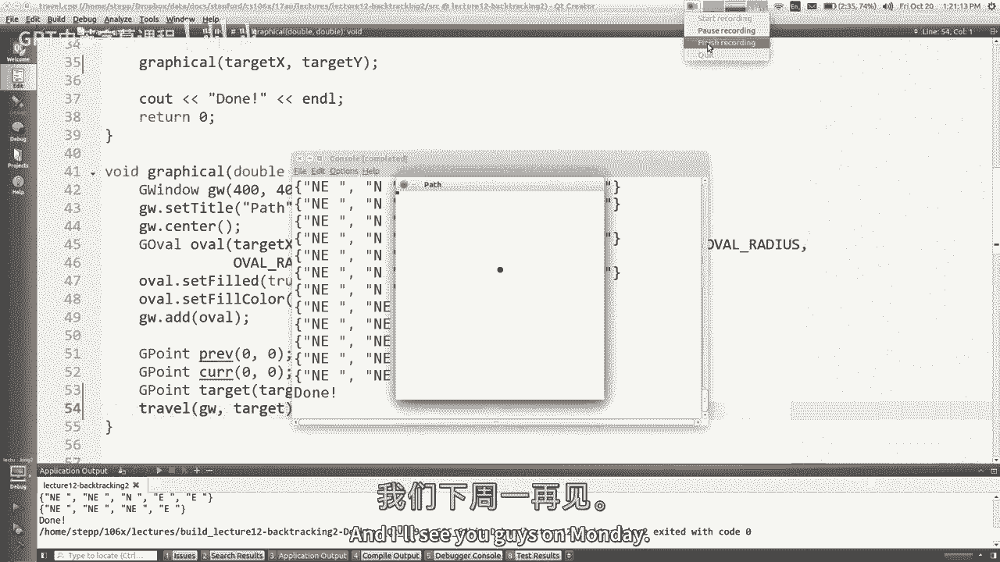