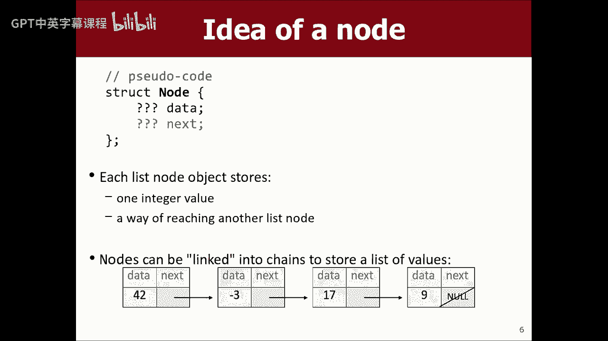
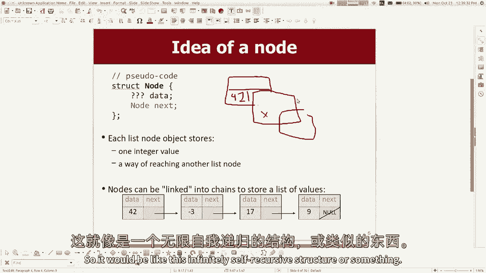
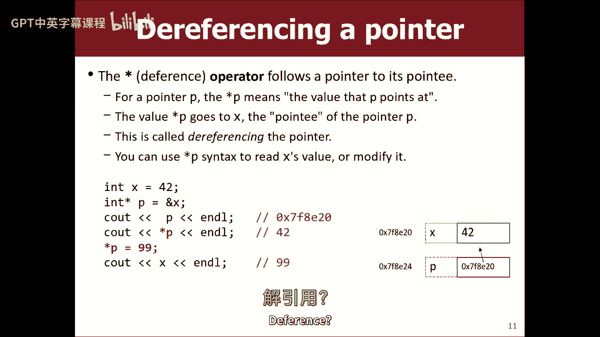
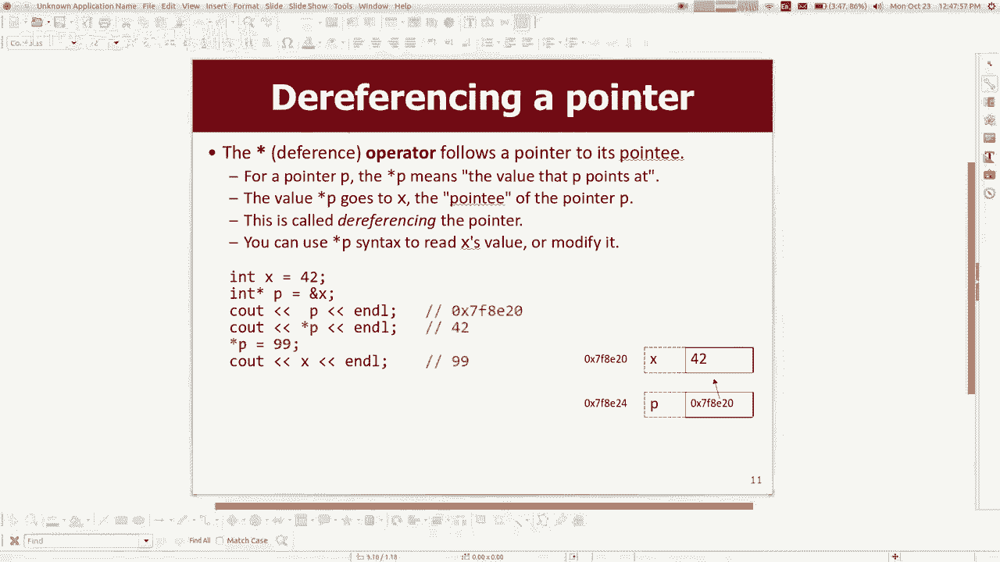
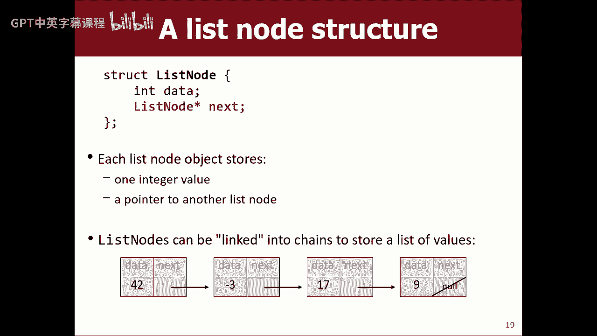
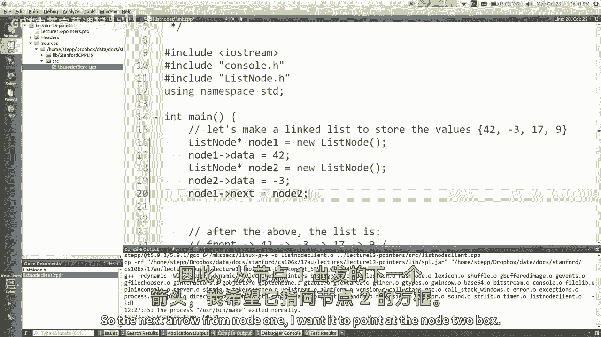
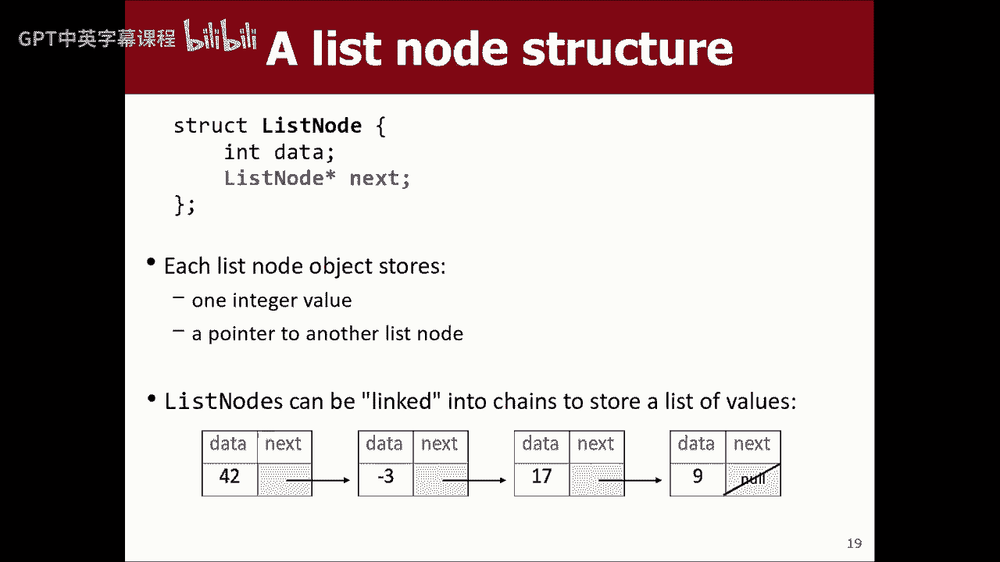
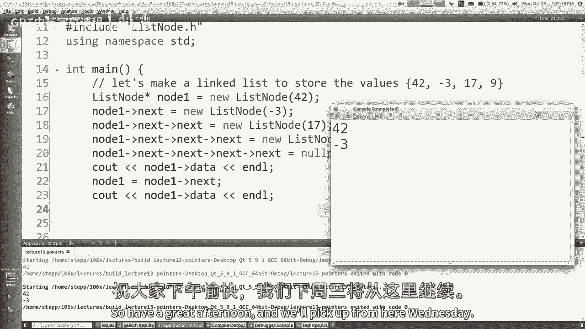

# 【编程抽象方法 cs106x 2017】斯坦福—中英字幕 - P13：Lecture 13 - Pointers and Nodes - 加加zero - BV1By411h75g

很高兴再次见到大家，嗨，现在是第五周，我们快完成一半了，本周我们将学习一个叫做指针的新概念，我们还将学习如何实现链表，所以我们将从一个跨越几周的材料单元开始，在那里我们将了解许多收藏是如何建立在内部的。

主要是，我们将通过自己动手来学习如何做到这一点，通过重新实施，比如哈希集是如何工作的，地图是如何工作的，矢量是如何工作的，所有这些不同的事情，我们将详细了解这一点，并自己实施其中的一些，原来如此。

原来如此，下一个我们就这么做，一个，两个，两三个星期，至少是这样，是啊，是啊，就上周五的大局而言，作业四上了，它是关于回溯，下周初到期，你的期中考试下周就要迟到了。

练习考试材料将在未来一两天内上线期中考试，好啦，这就是我们现在的处境。

所以让我打开我的幻灯片，看看指针，我想说今天的主题主要是关于这个概念指针，你知道的，以我的经验，无论我教什么，学生们有一堆关于指针的问题，有点像第一周，有很多关于C++语法之类的有趣问题，嗯，那太好了。

但实际上，这个功能是我想使用的一种工具，以便我们学习如何实现链表，所以指针很棒，但我没有，你知道的，这堂课的重点不是喜欢，深入研究指针的一切，对呀，事实上，如果你想这么做，CS一一零七。

做了一大堆指针和记忆，你会得到比你想要的更多的指示，如果你拿七个中的一个，所以我们要看看你们有没有朋友拿了107，他们就像在哭泣，尝试实现内存分配器之类的，反正，是啊，是啊，就像我说的。

指针作为实现链表的工具，来自书的第十一章和第十二章，我很久以前简短地说过一个链表，对它基本上和矢量是一样的，只不过不是存储某种数组，一个大的内存块来处理所有的元素，相反，它有这些小盒子，我称之为节点。

每个节点取一个元素值，然后它有一个链接到另一个节点，它们就像链条一样，呃，许多教师使用视觉辅助工具，就像火车车厢，或者你把玩具带进来，一桶猴子，你把小猴子拉出来，它们看起来像这些小节点，手牵手什么的。

所以链表是一种，像这样的结构的第一个例子，但是还有其他结构使用这种小节点的概念，这些小节点指向彼此，事实上，我们在我们的，在我们的图书馆中使用类似的概念，所以我们很快就会知道的，但无论如何。

这种结构相对于数组有一些好处，我们讨论过如果你想在列表的前面插入一些东西，你不必把元素转移到你身上，就像做一个新的盒子，你用箭头指着东西，然后新元素就在你要移动的列表的前面，当然，这也有一些缺点。

所以对于一些赞成和反对的人来说，不管怎样，如何很好地实现这件事，这些箭头使一个盒子有一个连接，如果你想要这种结构，你必须学习一种叫做指针的东西，现在呢，你知道吗，我一直认为思考上下文是很好的，就像。

如果我们不是用c+来做这门课呢，如果是Java呢，如果是蟒蛇，随便啦，大多数语言没有指针，取而代之的是，他们有一种叫做参考文献的东西，哪里，存储对象时，你实际上将这些访问对象的能力存储在内存中。

大多数语言都有一个概念，有点像这样，但不管怎样，让我们谈谈指针，嗯，在我进入指针之前，我想谈谈我将用什么来实现这些小盒子，这些被称为结构或结构，他们就像小物件，所以我想先谈谈这个。

所以结构或结构是一个非常轻量级的类，我之前给你们看过一两个，但我只想确保我们在同一战线上，所以结构是新数据类型的定义，您写单词struct，然后写它的名字，然后在括号中写出该类型的每个元素的数字。

只是想说清楚，这很像上课，你的意思是，我想创建一个名为date和every date元素的新类型，每个日期实例或值存储一个月，它储存了一天，所以你可以说我要做一个新的变量，叫做today类型的date。

然后我可以设定这个月，今天是圆点日期，所以它就像一个小的单一变量，在里面存储了两个，这就是结构，再一次，我想有些学生的问题是，也许你们很擅长这个，但有些学生纠结的是，他们看到了这个。

他们认为你在这里声明了某个单一变量，这个变量有一个月，有一天在里面，但不完全是这样，这就像模板的声明，就像你说的，我希望能够制作日期对象，在里面他们有一个月的时间，他们会有个约会。

所以这个东西本身不会产生任何日期，这些行创建了日期，我想创造多少就创造多少，所以这是一个重要的区别，所以无论如何，这就是结构或结构，是呀，所以在底线上，状态x错过了，什么，如果今天就像。

在一个中说字符串，你可以说是的，你可以说12个逗号引号，哈喽，你会猜你可以做两种不同的，啊，我去了哪里，我去了哪里，好啦，别碰它，是啊，是啊，因此，您可以创建一个结构并初始化该结构的新元素，所以好吧。

这就是结构，可以使用，比如他们的方法，比如如果你想说一个月中的几天，取决于月份，它是，你回来，还有多少天，您可以编写一个返回内容的双字符串方法，这些方法可以参考这些变量。

所以如果你做一个变量叫做today，然后你说今天一个月中的几天，它使用今日对象月，创建另一个名为XMAS的数据对象，你叫月相，它将使用该对象一个月，所以这些方法，我是说，这是你可能会在。

就像一个零六一个类型的课程或AP课程，具有与类中的数据交互的方法的like类的相同概念，这里的想法是一样的，是呀，我们的压力，不同的阶级对吧，所以呢，这怎么不只是一堂课，然后右边，嗯，在某种程度上。

这只是惯例，如果你说在C++中有一个类，当你做一门课的时候，你的期望是你在做一些大的事情，使用类似的构造函数和方法，然后呢，当你做一个结构时的期望，在那里有一些小裂缝，只是一对夫妇，可能是一种方法。

但它不应该像一个大的，但它只是一个小家伙，所以让我们从战术上看看他们能做什么，他们其实是势均力敌的，结构和类之间唯一的行为区别是默认情况下，结构中的所有内容都是公共的，所以你可以进入它。

看看它的变量的值，而对于一个类，默认情况下事情是私人的，所以如果你试图从变量的角度，它会说你没有权限，为什么他们都有这两种东西，它们之间几乎没有区别，用同样的语言，它主要与这样一个事实有关。

即这种C语言，c加加的前身，只支持这些结构，和c+加上增加的类，然后他们回去增强结构，基本上是类，反正，管他呢是啊，排序结构基本上是一个类，基本上是一个物体，事实上，所有这些代码都是。

如果您只写class而不是struct这个词，所有的代码都非常相似，好啦，所以有一个打击，其中有一些方法，有人举手，你也有同样的问题吗，好吧那么好，我给你看结构的原因，我希望能够把这些节点的小链接。

把他们联系在一起，所以如果你要为这些节点创建一个类型，你会说，嗯，它们存储某种数据，然后它们存储某种方法来到达下一个节点，数据可能就像一个int，因为他们把数字分类，你知道的，如果是Java。

也许你想要更一般的东西，像物体，你可以储存任何东西，但也许现在它只是存储数据的末尾，但是下一件事是什么，你可能会说，嗯，我看到一个节点，那是下一个。

那不太对，因为如果你试着画一个节点的内存图，就像一个小正方形，我的天啊，我不会画画，好啦，在那里等着，就像如果是的，谢谢你，如果这东西有两个小隔间，就像数据是一点点，这里的小int可以存储4-2。

如果下一个是节点，就像如果我在这里写节点，这就意味着就像这个小隔间储存了另一个节点，然后那个节点有某种末端，它有一个下一个，所以它就像这个无限自递归结构。

或者一些不太对劲的事情，几乎就像，你知道的，如果你说像一个人有一个名字和一组朋友，啊，他们的朋友是什么，他们是人吗，但你不会把你的朋友塞进你的身体里，你明白我的意思吗，我是说，我不知道，呃。

我不知道你们中的一些人周末做什么，但是呃，是呀，反正，呃，有时候你所做的，如果你，如果你说，哎呦，这些是我的朋友，你真正储存的是指他们或接触他们的某种方式，你储存他们的名字，或者你把他们的电话号码。

或者你把他们的地址，你可以去他们家，或者他们的宿舍，或者你储存的任何东西，所以如果我说，下一个节点，这在这里是不正确的，所以我们最终要做的，就像下一个节点不起作用一样。

我们真正需要的是一种叫做指针的东西，这将说明我如何到达另一个节点，在电脑的内存里，这个特性将允许我们将这些东西链接在一起，所以我要跳到一边一秒钟，谈谈指针，他们是什么，这样我就可以回到这里。

用指针构建链表，好啦，所以指针，啊，快速快速问题，你们中有多少人以前已经用指针编程了，为什么用C或者为什么用指针，是呀，C加加上你怎么了，人，好啦，不管我想你有什么，所以说，如果你不举手，没关系的。

我在跟你说话，所以在C或C++中有一个运算符，与号算子，这是接线员的地址，如果在变量前面使用address of，它将计算并告诉您存储该变量的内存地址，大多数时候你不必去想这些事情。

电脑只是为你做这件事，但如果你想知道记忆中的东西在哪里，你可以自讨苦吃，像这样使用这个运算符，我不常画记忆的图画，而且这些照片不是很好，但就像你声明索引4 2，它留出一些记忆作为某种地址。

内存地址通常用这种有趣的语法编写，零x7f8，这是十六进制，这只是一个数字，但它是以十六进制写的，每个数字从0到9，然后a到f a是10，f是15，所以每一个数字的位置都是从0到15。

我们这样写是因为你可以用更少的字符写更大的数字，它可以让你以某种方式写出这些密集的小内存地址，也因为计算机的思维能力是二的很多，而16的能力是二的，所以我们写这样的内存地址，X不代表什么。

这就像说这将是一个十六进制的数字，就像你做一个变量，然后一些内存地址，你的能力被存储，好啦，如果你写了与号x，它将求值以产生该内存地址的整数，存储x的地方，好吧，你可以打印内存地址，然后打印出来。

你知道我申报了一个INT Y，我打印了，如果你仔细看，内存地址彼此相差四个，因为那样就需要三个，二位或四字节，所以很多时候，如果声明两个变量，他们会碰巧在连续的内存地址，我宣布了一个日期叫d。

它有一个内存地址，日期有月有日，还有一些方法和东西，所以祝福你，日期的各个组成部分就像存储在那里的内存中，这不完全是它看起来的样子，已经够近了，所以如果你试着打印当天月份的地址，或当天的地址。

或者别的什么，你可以在记忆中看到这些不同的东西，使用这个和运算符，所以内存地址，我能拿他怎么办，是啊，是啊，继续并决定打印出，最后三个点其中一个最后打印出来，D代表D个月代表点头日，不是，哦，好吧。

为什么是的，为什么d和d一样，我想我想说的是因为，决定成为记忆中的第一个，就像如果你做一个结构，它有两个东西在里面，然后真的需要把这两件事的记忆加起来，第一个在那里，然后第二个就像现在一样。

我不知道这是不是字面上的记忆，有时取决于编译器或编译器，或者有些事情会随着系统的变化而变化，有时它实际上会走另一条路，就像内存地址下降，你做的变量越多，有点奇怪，但是去拿七个中的一个吧但是不管怎样。

是啊，是啊，结构的各个部分都只是连续地放置在存储器中，就在彼此旁边，所以好吧，罚款，你能做到的，你可以问东西的地址，可以将内存地址存储在变量中，从技术上讲，内存地址只是一个数字，您可以将其存储为int。

但我们认为这被认为是一种不好的形式，因此，我们创建了一种新的数据类型，称为指针，指针是用星号声明的变量，我阅读的方式，这就像int星p或int指针p等于x的地址，所以我要做的就是把这个数字。

零x 7f不管我把它作为p中的变量存储，该变量的类型是和的内存地址或指针，从技术上来说，这是正确的号码，这个数字的值是零x七，管他呢管他呢管他呢，但是我们写这个小星星是为了说它是一个int的内存地址。

它是一个int问题的指针，是啊，是啊，有多少内存，指针占用多少内存，取决于您的系统，但如果你有一台64位的电脑通常会接受64个出价，如果你有一台三位数的电脑，这是一个三二位，其实呢。

当他们谈论这些区别时，你要么是在说CPU指令的大小，或者你说的是内存地址，侧面或两者兼而有之，所以是的，我是说，现在大多数计算机实际上是64位指针，我想在我的例子中，它们都是32位指针。

但我教的东西都不依赖于这一点，所以我可以把主要的基因，就像，提出一个观点是，它总是一个优秀的数字，它总是一个出口小数，嗯，我是说在电脑上几乎有数字，想着他们。

因为十六进制只是为了帮助我们弱小的大脑正确地理解事物，好像他们都只是，都是数字，所以有没有可能只是说，就像没有你可以说int p等于x的地址，除了我想编译器有点不高兴，说很好，你不应该把它当作指针。

编译器希望您这样做的原因是，因为，对指针所做的操作类型是不同的，比你会做的任何其他，所以他想帮你检查，型式检查和安全检查某些操作，所以你可以把p等于x的地址，但编译器会说嘿，你在做什么。

也许应该是一个点，所以无论如何，好啦，所以我把它储存起来，我想说的是p指向x，p存储x的地址，如果我画一幅记忆的图画，就像x存在于内存的某个地方，p存在于内存的某个地方，但P商店是什么。

其中x存在于内存中，好啦，所以我想我马上要做的是，您可以使用p的值转到这里来找出，我们把它画在图画里，通常用这些箭头，当然，这只是我想教你，就像，没有箭，对呀，就像它没有任何字面上的联系。

它实际上只是一个存储在那里的数字，但这个数字是一个地方，我可以进入记忆，如果我想正确，好啦，这就是指针，我会告诉你，学生们都搞混了，你什么时候在，你什么时候把一颗星星，我什么时候把他们两个，然后呢。

不幸的是，语法有时很难记住，但是哦，好吧，所以如果你想跟随指针，如果您想去指针指向的地方，看看那里的记忆，你可以通过在Poin的名字前面写一颗星来做到这一点，所以它被称为哦，尊重不，应该是院长的推荐信。

遵从运算符否，你。

嗯。

当然你只是看错了幻灯片，因为上面写得很清楚，反正，如果你在指针的名字前面放一颗星，它的意思是指针指向的东西，它的意思是转到存储在指针中的内存，就像，如果我说星号p等于x的地址，然后我说打印P。

它会打印出X的地址，也就是x78，如果我说打印星P，这意味着打印，P指的是什么，p所指向的是，或者是在记忆中发现的东西，就是四十二，如此锐利的印花，坚韧，我想什么来着，什么，什么让人困惑，有的同学就像。

当你申报的时候，你在这里写上星p，但接下来就像等待，我写星星吗，当我用还是不用的时候，就像如果你想跟着指针走，你确实写了一颗星，一些学生感到困惑，他们写与号和p，你认为与号p是e的内存地址。

就像那个数字，你知道我的意思，但那不是有用的东西，我不管他在哪里，不管怎样，但你不能，这就是为什么它令人困惑，就是，你可以问P的地址，那不值钱，你想跟着，呃，你推动文化，是啊，南，如果把价值的9%。

如果你把1-2-3-4-5和1-2-3-4-5放在一起，因为要提供的是一个字面值，它不存储在内存中，也不只存储在变量中，数组，像这样的事情，是啊，是啊，你必须写一个变量或一些占用内存的东西。

就像如果你有一个数组，您可以询问该数组的地址，毕业四，它会指出，但你不能问你好的地址，或者一二的地址，三个，如果您有一个指向某物和异常的指针，如果你喜欢指，中间的指针，或者末尾的相似整数，是啊，是啊。

嗯，你可以有一个指针指向一个指针，你得用星星写，明星，P2或任何等于，P地址，你能做到的，如果你做一个明星，它跟随一次，所以说，如果指向指针的指针，指向指向指针的指针，你得放一个嗯。

就像七种东西中的一种，我们不会那么做的，我不认为，但你可以，如果你在B的地方做，它告诉你x的值，它告诉你四到二，如果我说p星等于99，意思是去他指的地方把99放进去，所以我只是从，所以这是相关的。

然后如果我打印x，我说九十九，所以这就像你不能用Java做这种事情一样，它在Java中没有指针，你真的做不到，所以说，好啦，那是取消指针的引用，这里有一个指针，神秘问题，呃，我不想这么做。

我只是我建议你以后再看这个例子，我不认为我们需要这个，我今天想用链表做什么，但是看看你是否可以通过这段代码来跟踪并计算出输出是什么，谨记，我在这里也有一英寸的参考，记住参考文献。

这就是愚蠢的符号的另一种用法，有同学会问，你很清楚，指针和引用有什么区别，好像有点相似，这就像一个参考，让我和一些主要的人谈谈，他们似乎分享了相同的记忆，某些内存中的指针感觉非常相似，嗯。

指针是引用的前身，指针以前就在身边，指针很强大，但他们更容易搞砸，它们更容易制造虫子，他们可以做比推荐人更多的事情，但做错更容易，所以很多人都有很多bug和代码，因为指针。

所以他们发明了更简单的参考文献，更难，我打赌你们偶尔会因为引用而有bug，但是您所遇到的bug的数量和种类可能更简单，比那些写糟糕指针代码的人少，后面有问题吗，A是。

如果你引用指针是你的程序可以做的东西，当您尝试重新分配值时，这是要重新分配一些东西吗，哦耶，如果你指向一些随机的东西，我想我有一张幻灯片，是关于一个垃圾指针，基本上你可以指向任何东西，包括随机数。

可能与你的程序无关的地方，你可以去那里，你可以试着乱搞东西，让我，我想我马上就到了，基本上坏事可能会发生，让我看看能不能到那儿，让我先谈谈空指针，然后我想下一个会是垃圾指针，所以你们可能听说过null。

大多数语言都有null的概念，空的意思是没有对象，或者它不是指任何东西，这和这里的想法是一样的，在指针方面，空是啊，指向零的指针，是内存地址零，所以如果你储存，他们称之为无页脚，嗯，以前叫不。

你得大声说不，在um之前加上c，这两种方法都有效，这两种方法都有效，推荐用这个，因为出于某种原因，编译器更擅长查找检查和错误，如果你用那个，我想这只是数字零的别名，我认为这就像一个很好的零指针什么的。

我不知道，我不太记得为什么，但没有页脚是说，不要指着任何东西，所以有插入，指向无，如果我打印P，它打印零，如果我试着打印星P，这意味着转到内存地址零，把里面的东西拿出来打印出来，内存地址零没有任何东西。

只是个假地址，如果你的记忆，如果你的电脑试图进入那里，试图进入那里并获取内容，它导致了所谓的分段错误分段错误，意思就是你的程序试图，不允许看，每个程序都有一定的内存，允许看一定数量的，它不应该这样看。

如果你试图进入虚假的内存地址，您可能会使程序崩溃，所以当我说砰的一声，这意味着程序停止，红色错误消息文本弹出，所以现在您仍然可以将某些内容设置为零点，或者你可以测试，如果某物为空，还有。

我不知道你能不能在幻灯片上读到这么远，但是C++有这样的语法，你称之为真实性语法，如果你说像，如果喜欢的话，您执行一个if语句，测试只是一个指针名称，你要问的是p是不是空的，或者如果你说如果不是P。

你在问p是不是空的，所以你可以用它来速记，而不是写一个相等的小指针，或者它不等于空指针，是呀，很清楚我们可以访问程序的内存的哪一部分，像整数，是啊，是啊，比如你怎么知道内存地址是什么，好吧好好看看。

我是说我一会儿就给你看，但是在语法上你可以请求内存，你可以说我想要足够的内存来存储一个int，我需要足够的内存来存储矢量，还有电脑，的，你知道的，编译器会给你这么多内存，你保证你可以用那么多。

大家可以看一下，所以我认为这个想法就像，如果你想要记忆，你想玩记忆，你应该自讨苦吃，一旦你得到了，你拥有它，你控制它，你可以做任何事，你想用那段记忆，如果你要求一兆字节，只是一百万字节或其他什么。

他们会给你一百万个中的第一个，现在从那里到那里，加九九九九九九，您可以使用所有这些字节，但任何你从未要求过的记忆都是不可预测的，不管你是否被允许乱来，如果你搞砸了，坏事可能会发生。

它可能会导致您的程序崩溃，可能会引起奇怪的行为，基本上，你只是随意地伸手摆弄一些东西，谁知道它会做什么，是啊，是啊，问题，有一个程序像我的人已经要求一些东西，哦好吧，当你启动一个程序时。

它为Main和类似的东西加载了一些内存，所以你有一些记忆在没有你的情况下被使用，另外，cplus标准库为自己使用一些内存，就像，即使你的程序只是说你好世界，然后退出，你会得到一些内存。

但我的意思是我一会儿会给你看更多，如何喜欢，请求记忆，但基本上我想说的是，有时您想声明指针，但出于某种原因，你还没有准备好把它指向任何事情，如果是这样的话，您应该这样将其设置为空指针，是啊，是啊。

我想空指针的好处是，很容易检查，这是一个明确的，就像，不要指着任何有价值的东西，而不是编造一些随机数，那将是数字的，但在那边的第二个盒子里，内存地址为零，P本身仍然不在位置是由那里的文本给出的。

所以基本上它仍然存在于记忆中对吧，所以我想有一件事，对于刚学这个的学生来说，有一件事可能很棘手，那就是，就因为我说p等于空，指针，这并不意味着p在地址0，P是存在的指针，p存储在某个合法的内存地址中。

只是他储存的东西是空的，他储存零，他指向零，它是一支选择不指向任何东西的箭，但是这个p并不意味着p在地址零上是关闭的，或者P不存在，或者类似的东西，好啦，这就是空指针现在与之相关的内容，这就是空。

是宇宙的黑暗，我想我不知道，然后有一个垃圾指针，我想刚才那位先生的问题是关于这个的，垃圾指针是指向内存中某个随机位置的指针，您有垃圾指针的最有可能的原因是，你没有初始化它，在C设计的无限智慧中，另外。

他们这样做是为了如果你不初始化指针，它存储任何数字，它只是存储一些随机数，所以这个随机数可能指向记忆中某个可怕的地方，你不应该去惹，所以如果你试着遵循这一点，谁知道那里有什么。

有时候如果你写了这个并运行它，它只会打印一些数字，比如12，你就像，啊，我想有一个12，那里，你知道吗，有时候很好，但你知道这很有趣，就像有时候你去回忆，你把它设成四二什么的，但是哎呀。

这是函数的返回地址，然后函数返回到四，两个什么的，它会做奇怪的事情，就像有时你是你的垃圾指针，如果你搞砸了，在那个位置的记忆，你破坏了整个程序，把一切都搞砸了，最阴险的是什么，有时我是说我写了卡布。

但有时它不去卡博，有时它只是默默地去调整一些东西，从不告诉你，现在你的程序员有一些奇怪的任意更改值，在剩下的运行时，这很难调试，所以我的建议是永远不要声明指针而不等于，即使您只是将其设置为空指针。

追踪起来容易多了，把虫子放下来，有人举手，是啊，是啊，你能去修改你系统上运行的其他程序的内存吗，是啊，是啊，问得好，其他节目呢，就像我不会花很多时间谈论这个，只是因为我觉得这更像是一个零七的话题。

但就像以前一样，所有程序共享内存，所以如果你跳到了错误的内存地址，你实际上是在扰乱另一个程序的内存，所以浏览器可能会因为运行错误的内存地址而扰乱你的聊天程序，现在他们使用一种叫做虚拟地址的东西。

每个程序都有自己的假映射，哪些内存地址对应于，不管我做什么，我不能碰其他节目，记忆，所有的内存地址，伪造我的地址，但实际上它将它们映射到我的一些实际内存块上，所以操作系统将每个程序与其他程序隔离开来。

有了这个假的记忆抽象层，但尽管如此，仍然有大块的内存，我不该惹的，或者其他与我的程序对话的东西，或者只是程序中我无法控制的部分，所以是的，你不必担心破坏其他程序，但你破坏了你的程序，是啊，是啊。

我们能恢复被程序修改的数据吗，另一个类似的程序发生在现实世界中，但他们会恢复照片之类的东西，我是说，有可能把它编码成，喜欢编辑、还原或修改另一个程序的数据，一个程序出错并结束，我们想看看数据。

而最后一部分被修改得很好的内存，是啊，是啊，我是说，我不想跑题，所以我认为对你问题的简短回答是，当程序运行时，它使用一些内存，它在内存中存储一些数据，一些价值观，然后当程序退出时，通常情况下。

操作系统会将所有内存标记为可用，所以技术上来说，如果其他程序出现，抓住内存并查看它，里面可能还有一些敏感的东西，所以一些程序在退出之前会在不同的地方清零它们的内存，或者别的什么。

程序会做不同的事情来避免这类事情，我们今天甚至不会接近那种魔法，但有些棘手的事情，现在的一些操作系统在内存上有这些保护机制，试图阻止程序查看内存，他们不应该看，或者别的什么。

因为你的记忆中有一些非常敏感的数据，反正，不管怎样，小心不要用指针，小心垃圾指针，空比垃圾好，因为您可以更好地调试它，所以我画了指针指向一些小精灵，我以为我真的很有趣，因为我让指针指向死亡，你死定了。

所以好吧，很明显你和我一样喜欢，您可以创建指向结构的指针，日期的地址基本上是一样的，所以如果你想的话，这个指针指向这个门，你想把数据的月份，你不得不说，你不能只说P点月那是不对的，你得说去他指的记忆。

去找他指的那个日期，让那个日期明白，所以说，这就是你如何按照指针到达印钞的日期，因为这个语法太挑剔了，你会经常这么做，理论上，他们添加了一个简短的语法，你说p箭头，一种语法与此语法完全相同。

它的意思是像星星一样跟着p，当你到了那里，在那上面做一个月，这个语法是我本周会经常使用的语法，所以我想让你明白箭头的意思是跟着指针走，例如，如果他是空的，我试着说P箭头月，它会说，转到空。

那里会有个约会等着你，听起来像很多爱情生活，我会说，嗯，然后当你到了那里，打印出那个东西的月份，它会崩溃，如果你有一个空指针，他说，去箭一个月那就撞车了，好啦，但是嗯，如果你想在上面调用一个方法。

你可以说p箭头二弦，好啦，所以p是一个指针，这说明了这一点，所有的东西都在里面，到目前为止我们很好，是呀，好啦，好吧，现在让我们来谈谈东西在内存中的位置，我不想多谈这件事，因为它更像是一个零七的东西。

但我想让你觉得，有点感觉到底发生了什么，所以我会试着给你们一个快速的版本，当你运行一个程序，当每个功能启动时，它为该函数分配一块内存，所有这些内存块的集合，我们称之为调用堆栈或堆栈，我把它画为上升。

就像一个函数调用另一个函数一样，它堆叠在另一块内存上，那块内存里有什么，嗯，很明显，如果他们的函数有任何局部变量，就像A和B，他们会进去，实际上如果你做递归，你有五个深入的调用，每个调用都有局部变量。

它们中的每一个都有对每一个副本调用局部变量的内存，对吗，这里不是我画的，但在内存中也存储了一些东西，比如函数完成时，我应该回到哪里，我应该从G回到F什么的，它也在内存中的这个地方存储了一些类似的东西。

我真的不想画所有的细节，但那有点，这里也是这样，所以所有这些记忆的收集，它里面的东西叫做堆栈，关于堆栈要知道的一件重要的事情，我想你从编程中就知道了，不是在记忆中，但是当一个函数完成时。

它所有的局部变量都超出了作用域，所以它们都被扔掉了，我们明白这一点，但它真正做的是，它获取这个内存并清除它，然后回到以前的函数，所以从技术上讲，当这些变量消失时，发生什么事了，它向下推这个调用栈。

所有这些变量的内存都被回收，是啊，是啊，这个成本因素也是，这就像一个特别的东西，那就像那样，我想只有程序本身，有什么特别的吗，嗯，我是说这只是记忆，就像，如果我碰巧有一个指针指向那里。

我可以跟着它改变电源变量，即使我是很高的调用堆栈，如果我有一个指针来存储那个内存地址，我可以跟着它把它调到12，现在的意思是A是12，所以说，但是有一个月的时间，所以说，是啊，是啊。

我是说你可以做这些奇怪可怕的黑客，我认为我今天不会做的事情，就像你可以要求的那样，有点像，如果你在工作，G，您可以询问d的内存地址，哪个是你的局部变量，然后你可以四处走走，我在哪里这附近有什么。

你知道的，就像你可以看到周围是否有其他变量之类的，所以你可以在你喜欢的地方做一些可怕的事情，故意向下移动，用变量惹下面的家伙，这叫做粉碎统计数据，你可以，你可以做一些奇怪的很酷的黑客事情。

我真的不想那样谈论黑魔法，但是你知道，你可以做一些这样的事情，你可以利用，事实上，这大部分是毗连的，大多数情况下，一个函数存储在另一个函数旁边，这也是c+e，因为就像在Java中，有一堆，而这正在发生。

但你不能伸手去摸它，你不能在Java中获得指向它的指针，他们觉得这太危险了，他们不再让人们这么做，但是我们在c+，所以我们可以，嗯很好，所以这是一堆，好啦，酷现在我想谈谈另一段记忆，它被称为堆，堆。

堆是与调用堆栈分开的另一块内存，技术上又像了，我真的不想谈这件事，但内存只是一个很长的数组，就像从地址0到大数n的地址，从技术上讲，它的一部分是堆栈，另一部分是热量，但这只是记忆，从技术上讲。

但从概念上讲，这些是程序与之对话的内存中非常独立的区域，现在堆是一种，一个内存空间，人们可以请求大块的，所以你请求堆的大块的方式，记忆是通过写新这个词，你在Java中看到了新的，可能是蟒蛇什么的。

我想蟒蛇不会说新的，但他们中的许多人只是说新的建造东西，但是如果你是C+，你可以做一个新的打击，我们可以做一个新的替身，你可以做一个新的弦，你可以做任何新的东西，如果你说新的。

您编写要为其分配内存的类型，然后括号或者花括号，或者无论你写什么，应该用什么值初始化，它返回的是一个指针，指向分配给它的内存中的位置，所以你可以说，指针A等于新的，所以它的作用是在这个前夜，我正在画。

在这里和记忆中的某个地方是一片看起来很糟糕的云，它留出一块薄荷糖大小的大块，它把4-2的值存储在里面，它发送回或返回内存地址，存放它的地方，所以我把它保存为指针，所以在工作人员中，我有一个。

它存储的价值，上面有地址，所以如果我说星A，一共是四二，所以现在这里的主要区别是，我是说，你说新去去去做关键上的事，这是这里的一个区别，另一个很重要也很酷的区别，堆与堆栈完全无关，就事物的诞生而言。

东西都死了，就像在我的尽头，或者任何创建的函数，这个东西这个变量不是，或者这个，这个被指向的东西不会被清理和扔掉，在函数f中，我创建了一个指针c，它指向一个新的int 49。

所以它指出了这大约是99家商店的新产品，当函数f完成时，它返回堆内存没有被清理，它是左边的，指针C也是如此，这些记忆被清理和扔掉，所以有点奇怪，因为当f返回时，你还有这九十九，但再也没有指向它的指针了。

所以它是一种丢失的孤立数据，我们称之为内存泄漏，但这是一个仍然存在的数据，所以无论如何，这个堆小发明是一种分配内存的方式，不会被收回的，当函数返回时，那很重要，我们马上就需要，再一次。

单词new是如何指定这两个中的哪一个，如果你不说新的，您将使用堆栈，如果你说新的，你会指着上面的东西，当你说热量就像消失了，或者像没有指针的漂浮，它只给了一堆球体权利，但如果你能找到那个地址。

不会再出现了，对呀，就像这个指针在f返回时消失了，但不知何故，如果我把那个地址保存在其他地方，或者我知道那个地址，不知何故，我跟着它，这仍然在等着我，是啊，是啊，所以这真的只是，你知道的。

你忘了写去派对的指示，但派对仍在进行，对呀，如果可以的话，你只要听一听，或许你能找到回去的路，差不多吧，是啊，是啊，好啦，现在又来了，就像，我想你不必想那么多，日复一日，你不必太担心这个。

但它会派上用场的，当我们谈论这些链表之类的东西时，我保证我们这样做是为了一个链表，这一切都是有原因的，好啦，所以新这个词又来了，语法是，您编写要分配的类型，你在做一个指向它的指针。

您将其设置为存储该类型的新版本，并使用参数，现在呢，我在上一张幻灯片上展示了一个示例，其中我创建了一个新的int，你不常这样，因为如果你想要一个在你的功能完成后仍然存在的提示，只需返回int。

你知道或有一个推荐人，你可以，如果你有尽头，你想从函数中得到它的值，没有这种新东西也有办法做到这一点，但当涉及到物体时，更常见的是使用这种语法，所以你要做的就是，你可以说日期指针，D等于新日期。

您设置字段，你开始使用它，随便啦，所以现在在堆栈的主中，你有一个指针，它指向堆日期对象，对呀，那个约会对象有什么酷的，他可以活得比他现在宣布的功能更长，您可以返回一个对象，你可以这么做。

但是物体开始变得越来越大，就像归还笨重的东西，他们必须复制他们和东西，所以这家伙有很多好处，他的寿命不被任意限制在，他被宣布，实际上这里的语法，这种看起来像什么，有点像Java。

就像你在Java中创建对象一样，所以如果你想让你的大脑稍微弯曲一点，基本上，在Java中存储对象的每个变量基本上都是一个指针，就像每个变量基本上都在堆中存储内存地址一样，在Java创建该对象的地方。

所以哎呀，哦好吧，这就是为什么当您有null并尝试调用它的方法时，您得到了一个空指针异常，即使Java没有指针，您可以获得空指针异常，似乎他们保留了最糟糕的指针部分，但是哦，好吧，干得好Java。

所以是的，这就是如何在堆上创建一个新对象，现在又来了，指向对象的指针在集合上，但物体本身就在堆上，所以这些是不同的事情，好啦，所以回到这个链接列表，我们试图建立啊哈时刻。

这里是每个节点不应该存储另一个节点，因为那根本说不通，就像如果你是人类，你的父母是人类，你不储存它们，你只是有一种方式来称呼他们，所以它存储另一个节点的内存地址，所以如果我在第一个音符里。

我的数据是这个四二，下一个是这个节点的内存地址，这家伙储存了负3，他的下一个是这个节点的内存地址，如果你一直跟着明星明星，因为接下来的指针，你可以通过这种方式访问每个节点。

直到您最终到达列表中的最后一个节点，之后就没有数据了，所以我们通常通过让下一个指针为空来表示这一点，没有人追我，我的下一个是无名小卒，所以你才知道，当你到达列表的末尾，这就是这里的大意，你的手在后面。

你刚才想说什么，你好吗，这怎么比参考文献好呢，我是说，我想关于推荐人的问题是，你指的仍然是堆栈上的东西，所以我画的小书堆，您可以从一个函数引用到另一个函数，但你真的有点在堆栈里上上下下。

从一个堆栈块到另一个堆栈块，每当创建的原始函数，你提到的东西消失了，那个被引用的东西也消失了，这个机制你可以指向这堆东西，我有点跳出了函数，调用堆栈世界，因此，没有特定的函数终止会导致节点的破坏。

我在建造，所以如果我建立这个漂亮的链表，你想把它交给你程序的许多不同部分，没有一个部分有能力喜欢，爆炸链表，并通过意外返回或其他方式将其全部扔掉，所以是脱钩，自动回收我们想要使用的东西的内存。

这就是它的要点，我猜，嗯好吧，这就是创建列表节点结构的方法。

我来教你怎么做，其实喜欢，如果你想列一个小清单，我有一个小小的可爱的创作者项目，我们今天不会写很多代码，如果我想存储42的值呢，负3，十七九，所以如果我想这么做，我是说，当然，我可以做一个矢量或数组。

我可以把0加起来等于4 2，括号1等于负3，当然当然，但如果我想把它表示为一个链表，我能做的就是，我可以说列表节点指针，节点一等于一个新的列表节点，我怎么才能很好地说列表节点，我有一个列表节点点h。

在这个项目中，它有一个数据和一个下一个之类的东西，所以我可以，只是滑梯上的东西，我只有那个，这样我就可以做一个新的列表节点，我可以把他的数据设为4 2，好啦，所以像这个小盒子是第一条数据。

然后我可以说列表节点星，节点二是一个新的列表节点，负3，链接在链表中的什么位置，我可以说，所以节点一的下一个箭头，我想指向节点二的盒子。

就像节点一一样，这个家伙是指向这个家伙的指针，节点2是指向这个家伙的指针，所以我说嘿，你向他表明你的下一个观点，所以现在前两个盒子看起来像我的照片，基本上。

就像我认为当你初始化对象时，呃，你只要用那些，用花括号，所以有可能，哎呦，就像花括号语法，是啊，是啊，我想我可以我是说人们通常会做的事情，减少行数或其他什么，他们会编写一个小构造函数，您可以在下一个。

可选地，所以我可以说这里的数据是42，这里的数据是负3，然后如果我想说，节点1下一个等于节点2，你可以做的是，你可能会说，节点1下一个等于一个新列表，存储负3的节点，所以我只有一个变量。

但在他指着另一个之后，在这种情况下，两个都喜欢10%不是这样，为什么我没有符号或权利，这是个好问题，因为通常当你说指针等于，你得说某物的符号和地址，或者当你说新的新的去，并在堆上做一个列表注释。

它以指针的形式隐式地返回该列表节点的地址，新运算符已经返回指针，所以当我说等于，我没必要说那些含蓄的话，是啊，是啊，所以如果我想储存那17个，我可以说你知道节点一，这就是真正有趣的地方。

你可以说节点1下一个等于17，你明白吗，因为它就像节点1是一个节点，然后他有一个指针，所以让它指向另一个节点，所以现在是另一个节点，让他有下一个点，指向其他节点的其他点，所以你可以。

你可以让这整件事下一个下一个等于9，然后呢，哦等等等等等等，这个会说下一个，下一个，下一个，然后再来一个，放在这儿的是什么？完全正确，所以这就是那组线条存储数据的东西，这在概念上意味着，我做不到。

我不能只说流苏就把它打印出来，但我以某种方式存储了所有这些值，如果我想，我可以全部看完然后打印出来，如果我想打印值，我可以像，看出去，所以说四十二个，我没说符号什么的，当我在节点1上写箭头的时候。

这意味着跟随指针，当你到了那里，你会在一个小节点盒，把盒子里的数据拿出来给我看，所以我做了一个小链表，所以我的意思是，你可能想问自己一件事，如何在此列表中进行各种操作，我如何打印清单，我如何修改列表。

这里有一个快速的例子，如果我想删除这四个呢，名单上有两个，我希望只有这三个，我该怎么做呢，你有个建议，是呀，节点一所在的地方可能没有人，所以现在，在这里的一个点，每一个都指向下一个，下一个，下一个。

好吧如果我想摆脱这家伙，我所要做的就是说嘿，节点一不再指向4-2，指向四二后的那一个，那么四二之后的那一个是什么呢？是下一个，所以如果我说节点一等于下一个节点一，然后如果我打印节点一数据，然后打印负3。

我基本上已经从链表前面删除了那个节点，你可以看到，也许现在我们为什么要从链表中移动是一个很大的原因，我基本上只是把那个人从指针链中剔除，我不再指他们了，我不需要转移任何人，每个人都呆在原地。

我只是指着别的地方，我的记忆在继续，我马上就停在这里，但在那之前我还要再回答一个问题，我们如何预置，是啊，是啊，这是个好问题，如果你指着这42，我不再有任何变数，指向那个，我把那条信息弄丢了。

您必须使用一个名为delete的命令来释放和回收内存，我星期三就开始，当我们继续，祝你下午愉快。

我们从这里开始，星期三。