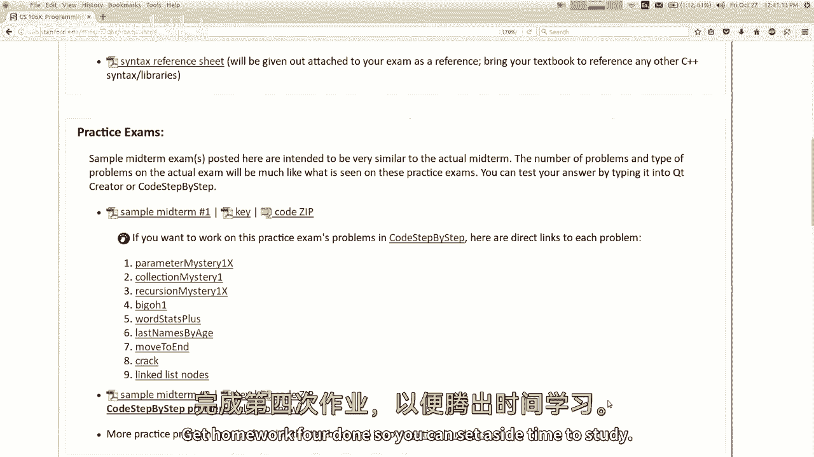
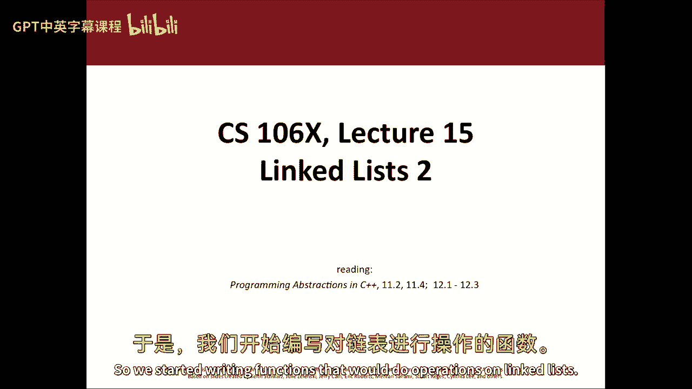
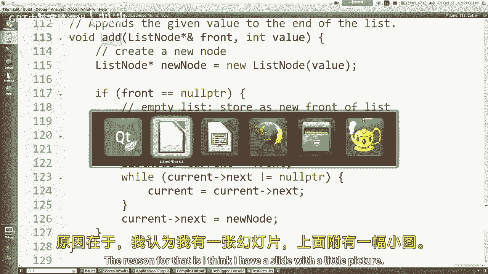
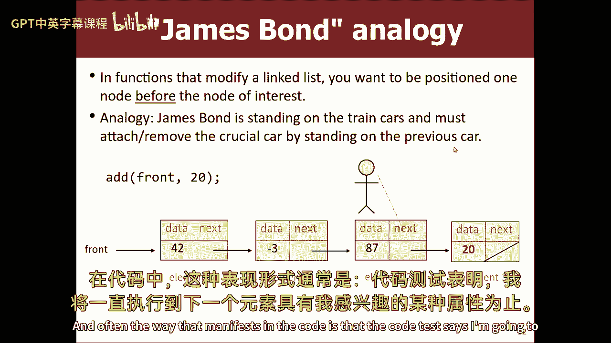
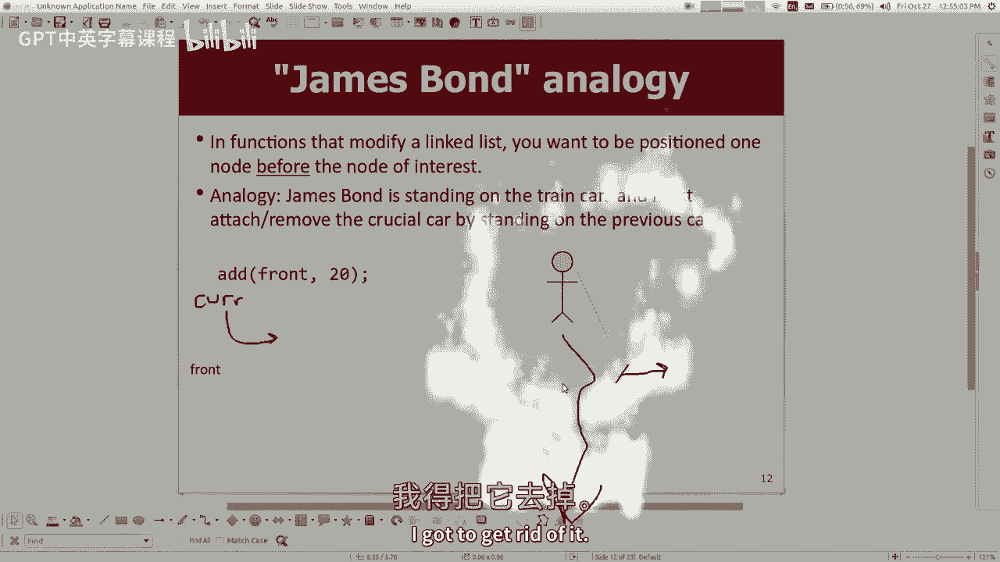
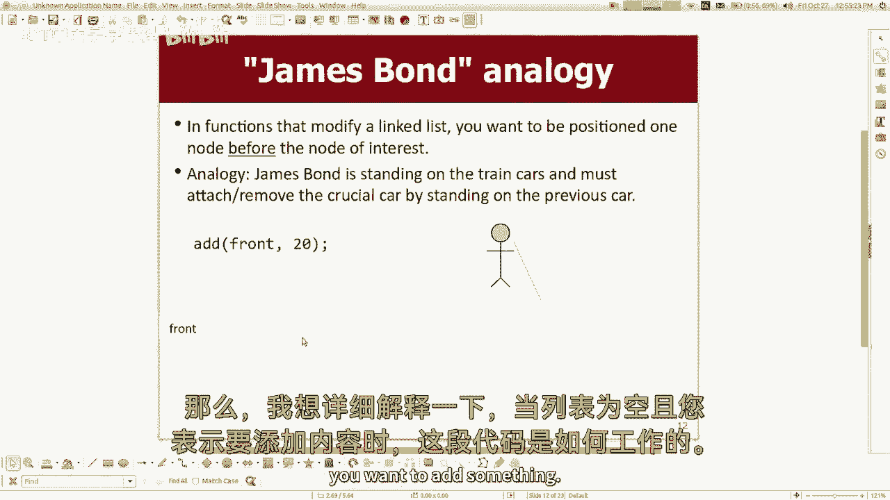
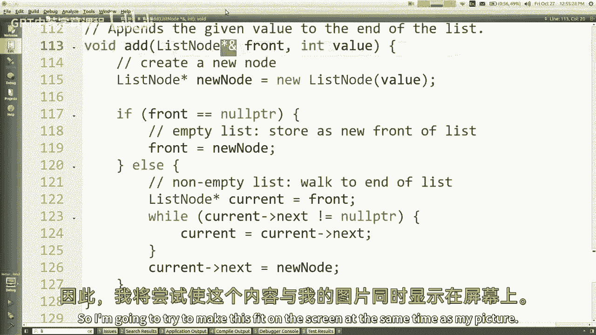
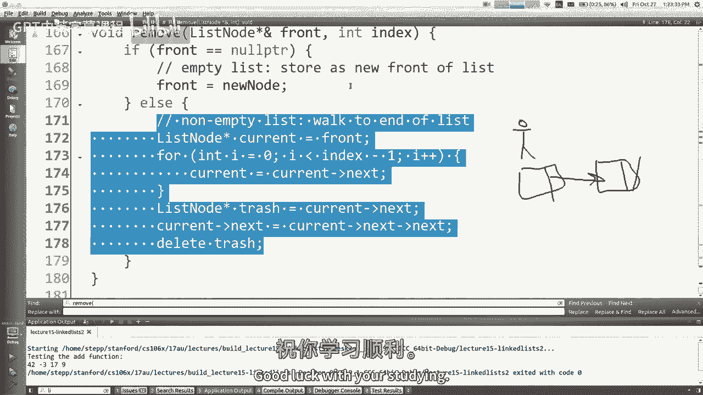

# 【编程抽象方法 cs106x 2017】斯坦福—中英字幕 - P15：Lecture 15 - Linked Lists 2 - 加加zero - BV1By411h75g

嘿嘿，最近怎么样？今天是星期五，嗯，这是一个星期的结束，本周是什么，五是这样吗，是呀，哇塞，它飞驰而过，在我开始之前，我们今天要做一些更多的链表的东西，我想提醒大家，你知道你有期中考试，下周四晚上。

我在班级网站上贴了一些学习材料，所以有一个链接说考试，你看，如果你点击它，它显示了将附加到测试的语法参考文档，因此，关于该文件的信息将在你的考试中，你可以使用，我想我可以，我可以把它弹出来。

看起来是这样的，它有所有的方法，所有的收藏品和东西，所以它没有所有的c+和语法，它主要是一系列的方法和东西，所以如果你不记得，向向量添加某物的方法是什么，你可以看看里面，它还有大O，因为我很好。

每种方法的大O，所以你去嗯，又来了，这已经会打印出来，附在周四的考试中，所以你不需要打印这个，你会得到这个，但我想让你记住在考试中，我不允许你把你的任何纸质资源，你可以带上你的书和你的大大脑。

但仅此而已，原因是我想给你带来问题，这很像练习测试中的问题，所以我不希望你把练习题，和你一起练习测试的解决方案，好啦，但我会让你拥有这个，我把课本给你，如果你有一个，如果你没有，教室前面会有一些教科书。

每个人都可以分享，在某种嬉皮士，卡米，反正我也不知道，在那里练习考试，问题是，问题有答案钥匙，还有一个拉链，你可以下载一个可爱的创建者项目，所以你可以输入，如果你有解决办法，您可以输入它。

看看您的解决方案是否正确，或者你可以检查答案键，这些答案键的工作方式是我有我写的一个解决方案，您的解决方案可能不同，但它可能仍然有效，你知道解决问题的方法不只一种，所以你可以试试看。

你也可以在逐步网站中尝试所有这些问题，他们都贴在那里，你可以试试，嗯，所以是的，这里应该有很多材料，我想说的是，就我对你如何学习的建议而言，嗯，我想说熟能生巧，就像你做的练习题越多，你准备得越充分。

所以只要留出一些时间来学习和练习，当我说练习的时候，我不是说，看问题再看答案，然后说是，这就是答案，那不是他妈的学习，不是那样的，学习就像什么，我的建议是看看这个问题，然后认真地试图解决这个问题。

只有在你的过程的最后才能看到答案，我见过很多学生一眼就能看出来答案，他们走了，是啊，是啊，这并不难，就像嗯，为什么不那么难，为什么你要偷看答案，所以试着自己解决问题，有些人还发现。

如果他们所有的学习都在电脑上，那就感觉不到真正测试的感觉了，因为它是为了真正的测试而写在纸上的，所以也许你应该去学校把它打印出来，找张白纸试着写下来，感觉真的很奇怪，就像在纸上写代码。

但这是你星期四必须做的，所以练习一下，在没有编译器的地方，而且没有任何东西在语法错误下划线，去试试吧，一旦你完成了测试，一旦你想交卷，然后你可以去输入，看看它是否正确，或者看看答案键，看看它是否正确。

这是一个建议，嗯，你也知道我没有无限的练习问题，但我有很多练习问题，这里有两个假的期中考试，或者如果你把这些都用完了，去看看你们的讲义，我知道你没有做所有的问题，我给你额外的钱是为了让你在考试时学习。

嗯，我想这里还有其他的东西，比如如果你想看看什么主题，或者不太可能参加测试，你可以看这里，从本质上讲，这就是我们今天要讲的一切，除了你知道，几个细节，一些小细节被剪掉了。

就像我不会让你用G窗口画任何图形一样，今天之后我什么都不问了，所以如果你在这里看到一个主题，你就像，我都不知道那是什么好东西，考试上没有，所以不用担心，嗯，这些是我要测试你的东西。

从第一周开始的C++语言基础知识，第二周的所有数据结构，大O与算法分析，我可能会给你看一些代码，这有什么大不了的，或者我可能会说我想让你写一个这个问题的解决方案。

但我希望你的全学分解决方案不比什么大O差，我想让你写递归代码，我可能会让你写代码，它在回溯，我可能会让你用指针做一些事情，可能是小列表节点，我想让你重新排列的小链接节点，像我们一直在做的一些指针，好啦。

嗯，这就是我给你准备的考试，你们对考试有什么问题吗？因为这是现在讨论的话题，就像，根据我的语法评分，所以如果你忘了喜欢，如果您犯了任何语法错误，你没有信用，我可能是认真的，啊对，我这个季度太刻薄了。

也许我的意思是不，我开玩笑的，我当然不是这个意思，嗯，更多的是关于你的算法，如果你有语法错误，就像你忘了一个卷曲的支架，你忘了一个分号，我们实际上让一小部分没有扣除，如果你有很多这样的东西。

你开始得到一个小的扣除额，但你仍然可以，如果问题值20分，你仍然可以得到大约1819个，即使你有几个这样的小语法错误，现在分号和你完全错误的算法是有区别的，这些都不是语法错误，你知道我的意思。

但是就像一点点或者像，如果你，如果你写，矢量点删除，你是说矢量点删除，但很明显，这就是你的意思，就像一个小小的语法错误，但就像一些大的东西，哎呦，你忘了检查空表箱什么的，那不是语法错误。

那是算法上的缺陷，那不一样，所以我们更多的是根据你的算法给你打分，我们意识到您无法访问编译器，我们也意识到把代码写出来真的很奇怪，用铅笔，所以我们试图解释这一点，在评分中，我们也有很多部分信用。

所以我们不仅有一桶桶的积分，就像你看到了问题的一部分，对这部分对这部分，所以即使你只能想如何解决前半部分的问题，你一定要写下来，因为你会得到那些分数，但也。

我们有像你这样的人在解决这部分问题上做了很好的尝试，相反，你实际上解决了这部分问题，所以如果你能尝试一下，这取得了一些进展，你可能会得到一些分数，即使不成功，即使它不编译。

即使你给它的每一个输入都会崩溃，如果里面有好东西，呃，我们会试着给你的好东西加分，所以无论如何，是啊，是啊，很多学生，我觉得，如果他们想不出一个完美的解决方案，他们锁起来了，就像嘿，把你的一半给我。

好解决问题，你可能会得到一半或三分之二的分数，代码样式多少，哦，风格几乎完全不分级，唯一的例外是，有时我会说在这个问题上不允许使用矢量，所以现在你的风格很重要，因为我这么说，或者您必须递归地执行此操作。

我要问你一个递归问题，如果您使用for循环而不是递归，这不是我想测试你的，所以这是你风格中很重要的一部分，但总的来说，就像你绝对不需要注释你的代码一样，不过，如果你愿意。

这可能会帮助更多的人理解你到底在做什么，您不需要有好的缩进和好的变量名，而这些事情，虽然再一次，这样做可能会使我们更容易理解您的代码并对您的代码进行评分，但是是的，就像你不用担心风格，一般来说。

在这一页的底部有一份文件叫做考试策略，我的同事朱莉泽伦斯基给她的学生们写了一些建议，我喜欢它，所以我也把它贴了出来，你可能也想看看，一些学生和一些部门领导谈论的一件事是伪代码，比如。

如果你不能很好地想象如何解决这个问题，你能用英语写吗？像井这样的段落，我可能会这么做，然后我会把它分类，然后我想补充一点，如果你愿意，你可以，但它不太可能得到很多分，我想如果你想要信用。

您应该尝试编写C++代码，即使你的C++代码有点错误，或者语法有一点错误，这对我们来说比伪代码好，因为很多时候伪代码太模糊了，这就像，我会从列表中找到正确的元素，然后删除它，这就像，哦好吧，你会怎么做。

爱因斯坦，你知道这就像，太模糊了，你知道你知道你必须给我喜欢，基本上是那种你必须编写才能获得信用的伪代码，本质上必须将一对一映射到C++代码，所以你为什么不直接写C++代码，所以是的。

有些sls会给你这个建议，就像如果你想不通，编写伪代码，然后再像，我通常会说，试着用C+和我说话，我想这样你会得到更多的分数，好啦，但正如我所说，即使你的C加+不完美或缺失，一些仍然得到部分荣誉的东西。

还有别的吗？我希望你对这个测试有中等程度的恐惧，我不想让你害怕，如果你去看看学习问题，你就能解决它们，你觉得你理解这些话题，真正的考验，我保证会和这些测试非常相似，问题的类型，问题的一般难度。

接下来我会尽量不给你惊喜，星期四，你会说，哦耶，递归问题，开始了，或者别的什么，我不想吓到你，我不是夜施米兰，我不是想在这里有一个曲折的结局，但我希望你，所以我希望你有信心，如果你去学习和准备。

你可能会做得很好，但我也想让你有一点恐惧，如果你不准备，我会努力想出具有挑战性的问题，所以就像你知道的，你应该好好读书，喜欢中怕不，好啦，嗯，反正，如果你对考试还有其他问题，给我发电子邮件。

在广场上问我，到办公时间来，我很乐意回答他们，把作业做完，所以你可以留出时间学习。

话虽如此，让我们回到过去，进一步讨论链表，好啦，所以我们开始编写函数，对链表进行操作。

首先，你知道我们有一个可爱的创作者项目，我把这个打开，链表客户端，好啦，所以我们写了一些代码，可以创建一个像这样的链表，把一些节点放在一起，把它们连起来，把它们连接起来，然后我们想做一些事情。

比如打印列表或在列表中添加一些东西，所以现在我们开始写这些函数，像打印或添加或其他什么，所以让我们来谈谈一些简单的，很快的，比如什么，如果我们想知道链表的大小，所以你可以知道链表的大小。

通过保持一个int数，知道大小是什么样的，我想在这里，每次我添加一个节点，我可以做一些加号加号，我可以记住大小，但实际上，如果你所拥有的只是名单的前面，你可以用这个来计算尺寸，你是怎么做到的。

一直跳下去，找到中间的赢家，然后你计算，你呀，只要从列表的前面开始，跳过，数数我跳的次数，然后当我打零，我停下来，我数对了音符的数量，所以，让我们写的真正快作为一种热身，所以如果你要写一个大小函数。

再次，我没有太多时间来完成所有的工作，我想谈谈上次，但是很多时候，当你写这些链表函数时，你必须考虑列表可能处于的不同状态，如果你没有充分考虑到这些州，在某些情况下，您的代码可能会失败。

所以你需要考虑的一个非常常见的事情是，如果列表是空的怎么办，与列表非空的情况相反，你怎么知道，如果这是空的，是的，所以如果前面是空指针，那是个空名单，所以这就是零的大小，对呀，返回零，否则非空列表。

我想你不必说别的了，但我有点喜欢这里的if和else的si树，所以如果它不是空的，我们照他说的做，从前面开始数啤酒花，现在呢，记住诀窍，您制作一个临时指针，类列表节点，我输入情欲节点，那是什么？

它是一个节点，好色地指向你，我指的是你，我们不要，我们不要列出节点，电流等于正面，然后你说继续直到我看到空指针，所以可能像计数等于零或其他什么，然后当电流不是空指针时，我会做计数加加。

我会做电流等于电流，下一步移动到下一个节点，然后当我做完，哎呀会的，然后当我做完，我说还数，好啦，是呀，问题是我们需要声明吗，然后返回零，如果，是啊，是啊，其实会的，所以说，我是说这段特殊的代码。

我认为是安全的，嗯，我们写的大多数其他作品都需要这种分离，你可以判断的方法是，如果你说的是，下一个会崩溃的空的东西，因此，您希望确保您的代码永远不会陷入，其中指针为空，然后你在中间的指针上有一个箭头。

因为我们没有听到，我想你是对的，我们可以删除，如果，所以我们就这么做吧，好啦，这就是列表的大小，让我们快速测试一下，在缅因州，当我打印时，我在这里等，我的名单是，然后我会说再见，尺寸是，节点1的大小。

我们得到了什么，尺寸是四个，我想这是对的，因为在我们添加的代码中有四个节点，所以看起来还不错，事实上，我今天不打算花时间在这上面，但上帝保佑你，其实有一种乐趣，您可以再次使用递归来实现其中的一些内容。

我今天不打算那么做，这怎么会是递归的，就像，如何查找列表的大小，类似于查找另一个列表的大小，你说呢，你要不要，等于零，回零，然后在那之后返回一个，加，完全正确，是呀，如果我清空，我的大小为零。

如果我不是空的，我的尺码比下一个家伙的尺码多一个，所以是的，完全正确，我认为这是一种非常酷的方式来编写这些函数，我不打算那样做，因为我认为递归开销，如果名单很大，它进行了很多函数调用，所以我不会那么做。

但是在算法上有一个很好的自相似性，好啦，这就是尺寸，那很容易，怎么样我想谈谈，得到得到，会像，我有一长串名单，我想把数据，位于索引处的元素值，什么指数什么指数，好啦，所以如果它是一个矢量，如果是数组。

你只要用括号，你会说跳到索引处，从那里抓住东西，但是这里不能用括号，因为节点是连接在一起的，索引四的权利，我们必须喜欢，往前走到那里，你明白我的意思吗，所以让我们考虑一下如何快速地编写代码。

那个代码是什么样子的，我会说使用从零到更少的支持，好的循环，我等于零，我比索引少，我加加，我叫它，我称之为，等一下，让我重新命名，移位控制r重命名任意变量，然后归还什么，是呀，有人说回卷。

但当然复发本身就是节点，我不太想要节点，我想要数据，节点内的小int，我听过很多类比，链表，节点是糖果包装纸，我不想吃包装纸，真恶心，我想把糖拿出来，我什么都不知道，所以从节点中获取数据并返回数据，嗯。

这段代码假定您传递的索引是正确的，我可以很容易地检查阴性病例，if语句，比你的体型大，笼大于等尺寸，我不知道尺寸是否合适，除非我走路，所以说，我可以做一些事情，比如如果我打了空，我还没有到达索引。

我想在错误检查上下注，我想代码就是代码，我们都可以想出以后如何添加，我们有很多事要做，但就像我一样，我就当你没把坏索引传给我，但我认为一个更好的实现会检查这一点，如果语句，你知道我的意思。

抛出一个错误异常或某种，如果他们通过了好吧，到目前为止，一切都好，对吧，这些方法并不难理解，我们在列表中走来走去，对列表做一些事情，对呀，所以我们一起写了一个方法，我们开始一起写一个函数。

叫Add是因为我想你很了解这里的代码，下一个下一个下一个，那很好，几乎是真的，人们不是这样建立收藏的，他们说我想要一个空的收藏，然后他们说加上，添加或插入，插入，好像有某种功能，如果我们做对了。

我不想太多考虑节点，当我们做完的时候，我们将完全调用函数来完成所有的事情，我们不会直接在主，弄乱这些指针，那有点，数据结构的客户端和数据结构的实现之间的区别，缅因州应该用这个东西，也不用想太多。

方法本身应该担心所有的小箭头和指针，和东西，是啊，是啊，我想，get方法的，就像，我想上一堂课你提到的，当你这么做的时候，是啊，是啊，你在问，我只是重复你的问题，所以它被拍到了视频上。

你说我们写的一些方法，我在这里写符号，到目前为止，我在这些例子中没有这样做，那么我什么时候做，我什么时候不这么做，我有点导致了这一点，所以我的意思是，到目前为止，我们编写的代码都很好，它的写作方式。

我将得到这个在第二，但关键是，您是否要修改列表，我刚刚写的所有方法都是大小和获取这些只是看列表，我没有改变名单上的任何内容，如果我真的要开始把箭头指向新的地方，并改变列表中的结构。

然后我需要这个与与符号不同的语法，所以让我们去吧，所以我们想写一个名为add的函数，所以我想你会做的是你通过前面的指针，以及要添加的值，它会把新值放在列表的末尾，就像我白手起家，我有四个两个。

然后它就会变成四二，后面什么也没有，然后做了一个三，它会把它挂起来并理解，添加到列表末尾右，我们基本上在周三写了代码来做到这一点，我有点没时间了，所以如果你跳转到那个方法的代码，这是可以理解的。

您用其中的值创建一个新节点，如果列表为空，所以现在我们需要空箱子，与大小不同，如果列表为空，把这个新音符放在前面，前面指向这个新节点，如果你听一个空的，然后走到尽头，然后把这个东西。

这段代码是相当不言自明的，关于这段代码，您想知道的主要事情是循环测试是，我想循环直到下一个为空，直到电流为空，原因是，我想我有一张幻灯片，上面有一张小照片。

我去找找，坚持住，我跳过这里，所以我听说这被描述为詹姆斯·邦德的类比，喜欢啊，回到1999年，当我在学这些东西的时候，当然，一切都回到了白纸黑字的背上，然后大多数人都戴着圆顶礼帽和车把。

胡子和单片眼镜之类的，我们看起来都像大富翁，基本上嗯，但我们当时确实有链接列表，我听到这个类比，我不知道你们是否听说过詹姆斯邦德，但好像他是个间谍，他叫杰森伯恩，你听说过杰森·伯恩吗，可能是他，就像他。

但是年纪大了，所以他就像在火车上，你知道吗，火车上有个炸弹，他得把车拆下来，这就是炸弹，我把那辆车和火车的其他部分分开了，但就像如果他要这么做，他会想上前一辆车，所以他可以把这个，然后坏车就开走了。

如果詹姆斯邦德在这里，他切的，他就死定了，因为他站在右下角，所以这有点像链表，很多手术，这是，这就是重点，你知道的，如果你不想记住詹姆斯，重点是修改链表的操作，插入新内容或删除现有内容的，做这些手术。

您需要在要更改的地方落后一个节点一步，所以如果你想在这里加上某人，你应该站在这里或看着这里设置下一个这个家伙，如果你想删除这个人，你不会特别想指着他吧，你想指着他前面的人，这样你就可以告诉他前面的人。

别再让那个家伙成为你的下一个，不要让任何人成为你的下一个，不要让别人成为你的下一个，所以这里的关键思想是由一个，通常在代码中显示的方式。

代码测试说我要去，直到下一个有一些我感兴趣的财产，直到当前有一个属性，如果我不走，直到电流是我想要的方式，然后我站在炸弹车上，或者像我想站在后面，下一个是，这就是循环，直到我唱到最后一个音符。

最后一个音符是下一个为空的音符，然后一旦我到了那里，附上一个新的通知是下一个，好啦，现在我还没有完全解决这个问题，就像是，和号的事呢？那是什么，我为什么要做得那么好，好啦，让我试着画一幅画，让我看看。

如果我有一张有图片的幻灯片，我忘了，我忘了我今天有什么照片。

让我看看，让我看看，嗯，詹姆斯邦德在哪儿，好啦，我可以回到詹姆斯·邦德身边，他在哪儿。

这里，好啦，这里，他是如此，这是詹姆斯邦德对吧，如果没问题呢，如果我说加上前二十呢，好啦，好吧，所以我做了当前的指针，所以我说我说它等于前面，所以它指向那里，然后我循环下一个下一个下一个。

然后我到了这里，现在它是空的，但我说你想加20，所以好吧，然后我把它指向这里，所以在幻灯片上的这个例子中，与号的东西是不必要的，就像传递列表前面的指针，我跟着指针走到尽头，我附加了一个新的节点。

一切都很好，好啦，所以是与号，在这一点上，你不必担心与号的事情，好啦，但是列表为空的情况呢，所以我只是删除了我的链接列表，再见詹姆斯邦德就像啊，然后他掉进了。

我该怎么做，她掉进了下面的火焰里，哦不不不，Linux，男人，我得摆脱。

我得，我要把这堆火点燃，如果你安装了Ubuntu，你也可以把你的电脑点着，好啦，等等，我想看看如果列表为空，这段代码会做什么，你说你想加点东西。

我想告诉你为什么它不起作用，好啦，所以你在这里要小心地跟着，所以我要试着把它放在屏幕上。

和我的照片同时，好啦，好啦，所以我现在基本上有了图片中的代码，所以想象一下我说，加上前面二十，但是前面是空的，它没有指向任何正确的东西，让我们追溯一下代码的作用，我先做这个，我说新节点等于新列表节点。

所以我做了一个节点，我存储了它是多少，在那里是20，它有一个空用于下一个，我把这个新节点叫做，我只是要写新的，因为我不能，用鼠标写信很难，然后我说如果前面是空的，指针，现在就是这样，其实等一下。

让我们记住一秒钟，让我们假装我没有这个符号，主有一个指针，哎呀哎呀，我就像把我的应用程序拖出被告席，Main有一个指针叫做前置，前面的主指针是空的，离开这里，然后主呼叫增加前20右。

所以现在在add函数中的add方法中，我有一个名为list node的参数，所以list node front是一个变量，它是一个空指针，所以好吧，罚款，如果前面为空，它是什么，然后我说让前面相等。

新节点，这意味着在新的节点点的地方做前点，所以不是空的正面会像那样指向右边，所以看起来不错，前方是新节点。

但那是广告方法，正面版本，这不是缅因州版的正面，这就像如果main有一个int x，并将x传递给其他函数，这个函数调用它作为参数索引，这个函数改变了x的值，不会变的，缅因州版本的X值右。

因为你是按价值传递的，这是个复制品什么的，所以这里的想法是一样的，现在你可能会说等等，等等，等等，我以为指点的重点是，你指的都是一样的东西，对，没错，如果你按照指针，你到了同一个地方。

但是如果你做一个指针，然后你再做一个指针，你再做一个指针，就像如果你，如果你不遵循这些指示，如果你换了其中一个，它不会改变其他的，就像如果你，如果你在这里有一个指针，在这里有两个指针。

然后你说提出一两个观点，为空，你知道这对指针1没有影响，所以如果你做两个指针，指向同一个地方，然后你把其中一个变成空的，或者把其中一个变成其他东西，它不影响第一个，点在你明白，所以像这里的关键想法是。

像，如果我可能需要改变，不仅仅是跟在前面的东西，但如果我可能需要换前面，那我就得做点不同的事，因为此代码将更改前面的副本，这是局部的，这个函数不起作用，我的意思是看，如果你对演讲的这一方面有困难。

这里的简单版本是，如果要编写一个更改链表的函数，您应该用与号传递指向列表的指针作为引用，因此，与其复制指针，它们将共享相同的指针，因此当您更改指针时，维修时也会更换，是啊，是啊。

因为在其他地方你可能会调用前面的指针，你会打电话给主要的，因此它没有被修改过，因为如果这是两个小时的讲座，我会做什么我的意思是，在漫长的演讲时间里，我们都会感到悲伤和痛苦，但我可能会用额外的时间做的是。

我会加载调试，否则我会挑小虫子，我真的会运行我，在调试器中，它会显示所有变量的值，我看得出来，对朋友来说，维护价值是这个还是什么，然后我跳转到Add函数，我想说，如果你对朋友的价值是如此，我真的会看着。

做这件事花的时间太长了，在很短的时间内，但它是一个独立的前置变量，他们同名，但它们有不同的范围，主要的是重要的，因为当手段说，把这个加给我，这是我的正面，他不想听这些，你设置一些其他的战线。

要做到这一点，我只想说，名字并不意味着，分享一切，这就是为什么我对我和我女儿泰勒·斯威夫特的计划从未实现，我想也许我会得到她所有的钱，但事实并非如此，嗯反正，这里的解决方案有很多方法可以解决这个问题。

我向你展示的方式，我想最简单的方法就是通过这个，不仅仅是一个指针，但是作为对指针的引用，现在呢，我想有些学生会对此感到困惑，什么明星安珀索，哎呦，这是怎么回事？你看，这只是一个，这是一个参考。

就像一个int引用，记住引用的作用，意思是分享而不是复制，如果通过引用传递int，我们共享一个int，如果你在没有符号的情况下，它复制了，我们每个人都有一份独特的副本，同样的想法在这里，当缅因州超过我。

他们的前指针，他们直接允许我修改指针，如果我将指针设置为其他东西，缅因州将看到这种变化，这就是一切，这就是我在任何方法上都要做的，任何更改链表的函数，我将通过引用传递指针，有个问题，去吧。

你能传递指针引用吗。

就像，你能把星星和其他单词的平均值。

啊，你能给它传递一个指针吗，所以我们开始了，你能用c+加上空格吗？几乎每个问题的答案都是肯定的，但几乎每一个问题的答案，你应该质疑的往往是没有的，所以嗯，如果你过了一个点，而不是对指针的引用。

您想传递指向引用的指针，是啊，是啊，指向引用的指针只是指向事物的指针，就像你不把指针传递给int，引用将指针传递给int，您也可以引用相同的int，也像参考，你不能指着推荐人，你指着东西。

引用是事物的别名，所以你只要指着那个东西，不是参考文献，你知道的事情，我不知道，如果这有任何意义的话，你不会这么说的，您只需将其声明为指针，还可以将指针传递给指针，我本可以给你一份名单，节点星。

我觉得这样比较好，因为嗯，如果你把它作为列表传递，节点星，你基本上要做一堆取消引用，它使这里的代码，你不会想那么做的，所以无论如何，这就是解决办法，如果要更改函数中的列表，通过引用传递列表。

这就是我们的add函数所做的，所以现在，让我们做一些其他的事情，让我们做其他方法做的事，我这里有，让我们先做一个叫做加法的，所以首先实际上，我想我没有出现，让我注释掉之前的所有代码，所以现在我所拥有的。

我正试图使用Add建立一个列表，然后我想把名单打印出来，好啦，所以其实只是为了好玩，我要去加，我要拿走这个符号，我要到这里来我必须在原型中匹配它，我要把符号去掉，所以我要编译它，现在在Main中。

我试着列出四个，让我们看看它是否真的有效，所以我运行它，上面写着测试添加功能，它没有，我不认为它做了什么，它只是说完成了程序运行，它试图打印，但什么也没有出来，所以不是，其实呢。

也许如果我想说得更清楚一点，我可以做一些事情，比如如果前面是空的，指针，我可以做C出来空和其他一切，我可以你明白我的意思，所以至少它会打印一些东西，如果没有名单，所以没有，那里什么都没有，所有那些广告。

我做了四个广告，他们都没有在我身上成就什么，所以现在如果我回去添加，我又把它改为指针引用，我们看到了什么，我的意思是，它应该工作扰流板，对呀，现在起作用了，它添加了所有的元素，好啦。

所以让我们用这个想法来实现一些更多的链表代码，现在让我们先写一个叫做add的，意思是把它放在前面，而不是把它放在后面，相似的想法，好啦，现在看，我没有把这些和符号放在一起，但他们需要符号。

所以让我们继续在上面加上一个符号，然后一开始，我们只拿前面和新的值，所以说，那么我该怎么做呢，谁来帮帮我，是呀，在后面，你会怎么做，你在举手吗，好啦，新节点等于新列表，存储现在值cool的节点。

我现在希望那个节点是列表中的第一个，所有其他元素都应该是在那个元素之后的元素，对呀，我还做什么，是啊，是啊，我用前面做了一个新的节点，然后前面，节点等于前面像这样，是啊，是啊，点，很接近了。

我觉得不太好，是你先开始的，去吧，你一定要做吗，你还有更多的想法来完成这件事或修复它，是呀，新节点等于前下井，所以如果你这么做，你要吃的是，如果我有，如果我有一二，哦伙计，这些不是三级的。

然后我想加上一个四，我想要的是四个人在这里，哇塞，那太糟糕了，我想要四个那样的对吗，我想如果我在前面，如果我使新节点等于前面，所以等待，让我们，让我们真的把这个新节点指向这个，这么新。

然后如果我说下一个新节点等于前面，记住这意味着什么，这意味着做一个新的节点点，前面的下一个点，如果前面在那里，然后前面的下一个点，所以这意味着新节点不再指向这个新节点，但指出这一点。

所以我认为这是不太对的，图片有帮助，虽然，什么，我怎么解决这个问题，所以四得到真的排在名单的前面，是啊，是啊，去吧，是啊，是啊，反过来，我想很接近，只是有点倒退，下一个新节点应该是后一个新节点。

新节点之后的下一个应该是前面当前的位置，所以4后面跟着1，然后如果我说前面等于新节点，意思是前面不要指向这个，但要指出这一点，这东西是对的，所以现在我们有了前面的新人，紧随其后的是之前的新人。

和许多这些方法一样，这些陈述的顺序很重要，我想如果你把这一行的顺序翻过来，我觉得没用，你得小心点，对呀，因为我觉得很多学生他们所做的就是画这幅画，然后他们写出他们需要做的所有改变。

然后他们这样做有点无序，然后他们把它们都写下来，但这不起作用，即使他们的照片大部分是对的，2。他们那样做是不对的，所以想想秩序，好啦，现在有意义了吗，等等怎么样，通常，当我们有这些链表函数时。

我们得考虑不同的情况，比如空名单，非空列表，如果列表为空，这段代码会做坏事吗，如果列表为空又如何，我们做一个新的节点，那很好，我们使它的下一个为空，因为前面是空的，这是个空单子。

所以接下来新来的人就空了，那就对了，然后我向他们提出前面的观点，而不是空，所以这个代码前面都工作得很好是不是，你看，所以有时你必须有，如果md不是空的，你得把那些案子分开，但关键是。

如果我在做前箭什么的，在我做正确的箭头之前，我需要确保前面不是空的，好啦，所以我没有在这里这么做，所以我不需要把这些案子分开，如果你真的想这么做，您实际上可以将所有这些混合到一行代码中。

也许我会把我们写的东西留在那里，但我会把它揉成一团，所以你能做的就是，你可以说你可以通过下一个也在这里，这样我就可以从前面通过，后面的应该是前面，所以我去掉了这一行，现在前面等于新节点，嗯。

为什么我不直接说前面等于，所以前面等于一个新节点，存储这个值，后面跟着前面，它做右边的部分，在它做赋值部分之前，所以这就是为什么，那两大块哥打，同样的权利，我很清楚，所以这是在列表的前面添加了一些东西。

有什么问题吗，好啦，嗯，让我们再做一些，下一步是什么，他在哪里做的，好啦，我想做一些移除的事情，我们来谈谈移除，我认为删除的简单情况是从列表中删除第一个元素，因为那个很容易得到，因此，如果您要修改链表。

你要通过引用来传递这件事，所以我还没那么做，所以让我在这里加一个与号，让我们先下去做一个移除，好啦，从列表中删除第一个元素，如果列表为空，它什么都不做，那么我该怎么办，帮帮我，检查这是否为空。

如果我不检查，我想这将是一个代码崩溃的情况，因为我可能会看到某人的下一个，你不能要求下一个人谁是空的，所以我同意你，所以说，如果是空的，所以如果前面是空推杆，那我什么都不想做，所以如果是空的。

如果所有的动作都在别人身上，那也许我们想，如果不是空的，我们会做些事情，好啦，然后呢，我的意思是，如果前面指向一个，指向两个，分数哇，这表明有三个，我要前面到那里，就像，我该怎么办，你在后面，是的。

前面应该指向它自己的下一个箭头指向右边的地方，因此，与其指向一个点，不如指向两个点，这很好，代码有个小问题，还记得我对气球之类的东西的类比吗，好吧，所以这个人再也没有人指着他了。

所以他的小气球会让他飘走，男孩，这是一个可怕的气球，等等，等等，好啦，那是一个稍微不那么可怕的气球，链表下面是不是有什么燃烧的火什么的，我不知道为什么，嗯好吧，所以那家伙飘走了，我上次简短地提到过。

如果你有一个节点，你失去了它的跟踪，您不再有任何指向C Plus功能的指针，在这种情况下，记忆只是坐在那里被占用，就像声称的那样，不能用于其他任何事情，在程序的余生中，这叫内存泄漏。

因为如果你这么做很多次，您的程序会有所有这些垃圾内存，它无法清理，最终你的电脑甚至会耗尽内存，现在呢，我想说清楚，我想有些学生对此有错误的本能，你又不是要在这里买一台新电脑，重新启动操作系统。

不管是什么感觉，当您的程序退出时，当程序进程退出时，操作系统抛出所有内存，包括这个泄漏的内存，所以从某种意义上说，对于我们今天玩的小程序来说，这没什么关系，因为我们没有主菜然后主菜就完成了。

一切都会烟消云散，但是如果你有一个运行很长时间的程序，就像网站上的服务器或你正在玩的游戏，那个，你要为，你在玩超级马里奥，《奥德赛》刚刚上映，我的天啊，所以你当然要为，就像连续17个小时的马拉松。

如果你经常让马里奥丢失他代码中的链表节点，程序最终会崩溃，你会生气的，所以你不想那样，所以你不想让你的记忆现在泄漏，我想告诉你，嗯，大多数编程语言都没有这个问题，像Java这样的语言，Python。

JavaScript，红宝石，C尖，它们都做所谓的自动内存管理，当一个对象不再有任何指向它的指针时，或任何使用它的代码，它能够自动计算出这一点，并为您回收内存，你不必做任何大多数人更喜欢的事情。

就像文明的处事方式，但是C++是在1983年制造的，那时他们没有文明的东西，所以它不会这样做，好啦，所以如果你想确保内存不会泄漏，您必须明确地告诉语言释放内存，你这样做的方法是写删除这个词。

后面是指向要回收的内存的指针，所以就像问题一样，虽然，一旦我们这么做，整个想法是，我们再也没有指向那个内存的指针了，所以我们必须调整这个代码，一点来解释这个问题，你做什么模式，我喜欢这样。

我将在我的很多例子中向你们展示，我做了一个特殊的指针，我把它指向我想摆脱的东西，像垃圾一样，Tr i指向前面指向的是哪个盒子，然后我说前面等于前面，意思是扔掉那个指针，把前面的两个点。

所以现在唯一指着它的人是垃圾，然后我写删除，我想它更像一个回收站，但不管怎样，我们不必一直是自由主义者，所以它是一种堆肥，有点像，嗯，删除垃圾会使其消失，现在呢。

我听到的关于删除free up的最常见的问题，记忆是我认为人们误解的，就像，指针和指针指向的东西是有区别的，就像列表节点对象与指针，就像我说删除垃圾一样，我不会删除这个指针，我在删除指针指向的东西。

这就是我要失去的东西，现在呢，你说得好，要清理和删除指针的指针呢，嗯，在这周之前你从来没有说过删除，对呀，因为你声明的每一件事，在堆栈上分配的将自动删除，当函数完成时，所以在堆栈上声明的东西。

你在这周之前做过的所有变量，向量和弦，所有这些东西都在堆栈上，你永远不必说删除那些，因为函数会清理它们，指针位于函数的堆栈上，他们指的是外面那堆云，所以当你说删除，它进入堆云并释放内存。

指针本身位于此函数的局部变量堆栈中，它被清理干净了，函数返回时，你不必担心清理指针，你把点上的东西清理干净，是啊，是啊，如果列表节点由于某种原因在堆栈上声明，叫delete就不好了。

Delete是为了释放堆分配的内存，如果对堆栈上的内容调用delete，它经常会使程序崩溃，就像，如果你做了像，你知道列表节点LOL，然后你说删除，你不能说删除法，你得传递一个指针。

所以你得通过法律地址，这可能会使程序崩溃，因为，就像它会去看它的内存表，就像我不知道的，那不是我分配给任何人的记忆，它可能会我不记得它是否会立即崩溃，或者如果它非常想声称记忆用于。

现在您的函数堆栈被分配到，我不记得有什么用，但你不会想这么做的，像在那里这样的参数，啊，这是个好问题，是啊，是啊，就像我怎么知道我应该释放这个，我想这就像是这个代码的一个隐含的先决条件。

就像我没有写在这里，但这就像，我假设，此空间中涉及的所有列表节点都是堆分配的，如果不是，删除它就太糟糕了，我不认为有测试，就像这个堆内存是真的还是假的，嗯，我不知道有什么测试。

尽管有时如果您查看实际的指针内存地址，数字范围不同，但你不会想担心这个的，我想你宁愿只写代码，对这类事情有很好的假设，实际上，这确实导致了某些类别的C Plus在大型系统中的bug，就像。

谁的工作是解放，这段记忆，是我的工作吗，您的工作是堆栈内存，是热记忆，在本课程中，我们将通过使用heap来解决这个问题，当我们做链表或二叉树的节点时，或者类似的事情，是啊，是啊，所以就像你说的第二。

因为当你写删除，你得给它一个指针，列表节点不是指针，列表节点星号或列表节点的地址是指针，所以指针，是呀，它删除了指向的内容，它，转到堆上的内存块，他说这块内存现在应该可以供其他人使用，但你从不写信。

删除与号，因为这是邪恶的代码，反正，所以好吧，去掉第一个元素，这很有效，让我们在列表中的一个一般位置写删除，所以让我们写删除，我想我这里有一些例子，在索引零处移除或在索引处移除，让我们删除列表中的内容。

在这一点上，我们有五六个东西在这里，所以就像我想的那样，在移除第一条战线后，我们删除这个类似的东西，我想这就是我们所拥有的，因此，让我们尝试将元素索引移除到，然后打印列表。

所以我想在那之后应该是这样的对吧，我只是想估计一下你的期望如果我再来一次，让我们用，类元素，你知道的，又是两个，哪个应该是九个，所以应该是这样的，然后让我们用元素零来做，让我们确保它对零元素有效。

想把这里清理一下，所以这应该去掉四个二，好的知道了，让我们去掉一些东西，所以让我们写删除，我想我得上去，我没时间了，但我想我得上去把符号再放在这里，所以这有点像添加，记住当你添加，你得走到正确的地方。

对呀，所以我们在Add函数中为它写了一些代码，我是说你看，我想复制广告代码一秒钟可能会很有说明性，让我们复制添加代码，然后说什么这是不对的，嗯，我的意思是，事实上，它添加的东西是错的，但如果你要把你。

不要创建新节点，因为你不是，你知道移除不是创建新节点，对呀，我们有一个空名单，非空列表的东西，我不知道这样划分是否正确，但我们为什么不把注意力集中在这个案子上，找到它，把它移到这里的一般情况下。

从前面开始，这走到最后，我不知道这样对不对，如果我想删除索引五处的元素，我应该走到什么索引，我应该移动到我站在索引4詹姆斯邦德对吧，所以我应该做的是，我应该说对于int，我等于零，我小于指数减一。

你可以画个图自己验证一下，但你想在一个小时前回来，现在前进，事情的状态是我站在一个节点上，我是詹姆斯邦德，我有一个节点，我想摆脱就在这里，我希望链接列表像这样，就在他们上方，我想跳过它们。

我想剪掉目前在那里的和弦，那我怎么跳过这个家伙，我怎么把他带回来，是啊，是啊，当前下一个应该指向当前下一个点的位置，所以实际上清理，你说的对，我有一个内存泄漏，所以同样的模式列表，节点垃圾等于现在的人。

下一个调用当前，就是那个有X的家伙，然后我把指针向前移动，我会删除我的垃圾权利，这是正确的代码，我们失踪了，有点，有一点点，如果这里还有别的事，我有个问题，去吧，所以它会坠毁吗。

如果您传递一个超界的索引，这将崩溃，所以现在的代码依赖于用户不这样做，索引就像，接下来就没有意义了，所以现在下一个下一个，好的好的，所以如果我想删除最后一个节点，那情况就是这样，詹姆斯·邦德的事，对呀。

所以电流在这里，当前下一个在这里，当前下一个下一个在这里，所以如果我说当前下一个应该等于当前下一个，它的下一个点将把这个设置为那个的值，所以它会把这个设置为空，所以它会，一切都会好的，我想你是担心。

如果詹姆斯邦德在这里，这违背了我对用户将传递什么的假设，如果他们站在这里，这意味着他们让我去掉尺寸，元素的大小，是啊，是啊，对此的问题，我是说，所以这样有可能，哎呦，你在说废话，嗯。

我想问题是你得把你的垃圾指针，因为，啊，你在说废话，否，我想这是你想说的方式，因为你真的需要进入列表中的下一个指针，如果你把垃圾换成，您正在修改一个名为trash的局部变量，你不能修改，它不指向指针。

它指向一个物体，如果你说符号和垃圾，那是箭头之类的地址，你知道的，我知道你在问什么，但我认为那不太对，我不得不让你走，但我会说，如果我们需要，不是关于前面，为空指针，这对所有情况都有效，除了一个，做。

你知道那个案子是什么，我知道该走了，但在我们离开之前，让我回答这个问题，有一种情况下，此代码在，名单的末尾，因为我想我们刚刚追踪到，这是列表末尾的内容，我觉得那个还可以，这是名单的最前面。

让我解释为什么这个代码，不可避免地说，旁边有人指出了不同的东西，不能更改链表的第一个音符，通过设置某人的下一个指针，让我们考虑一下，如果，如果第二天过了零点，你需要从前面跳到下一个节点。

而不是将当前设置为下一个，好啦，我就到此为止，因为我得让你把代码贴在网站上，祝你周末愉快，祝你学习顺利。

星期一见。