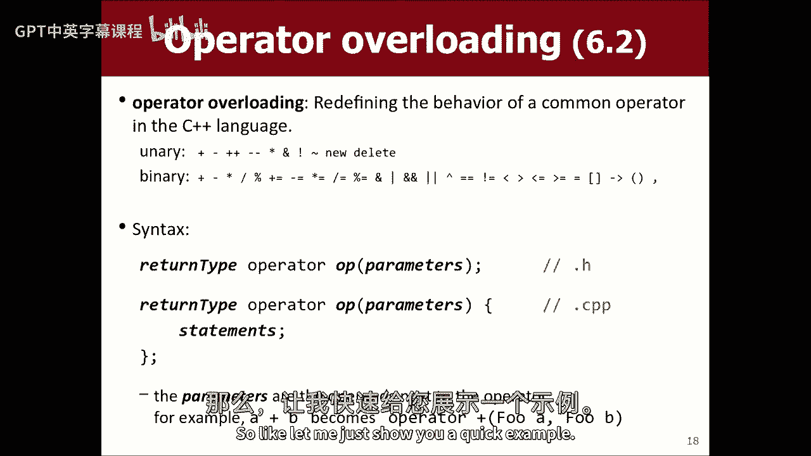
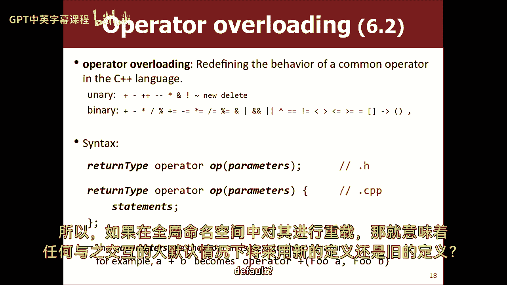
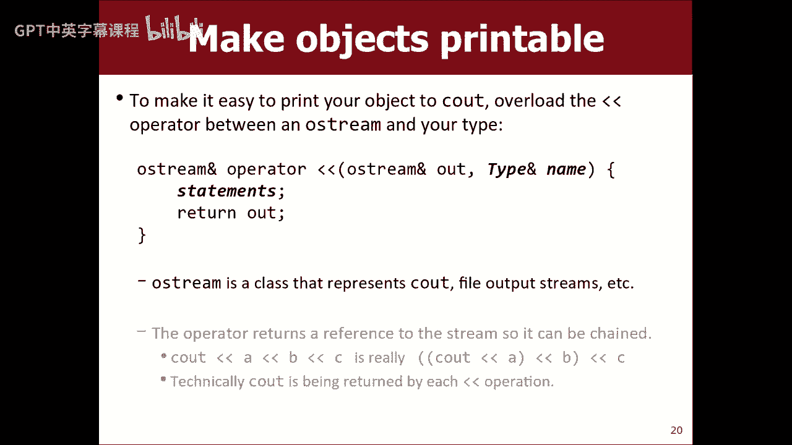
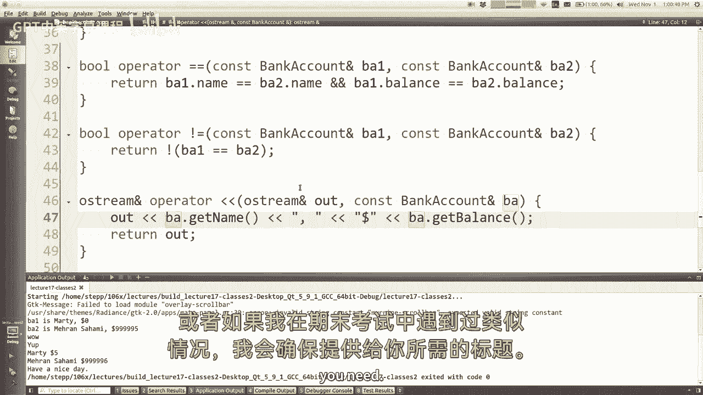
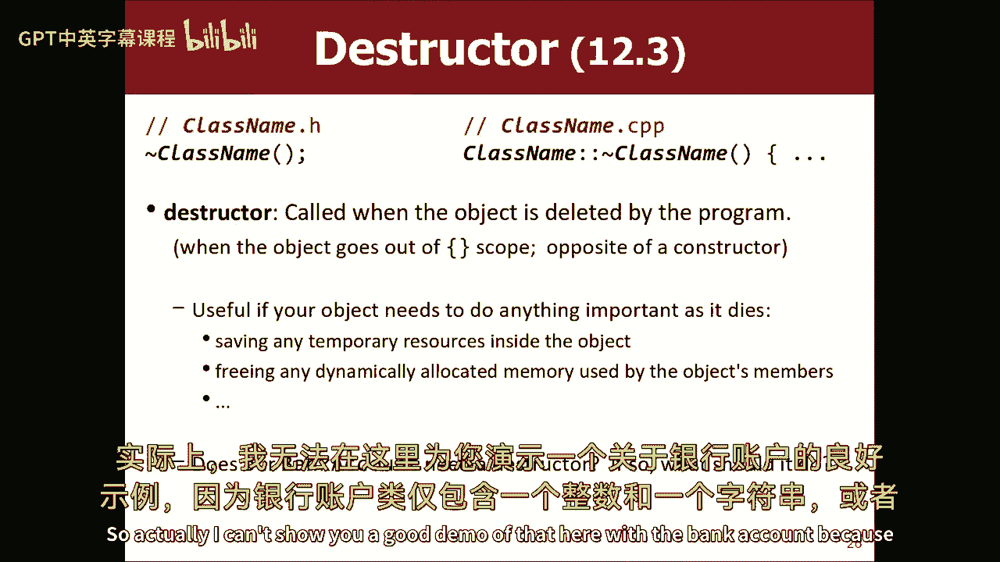
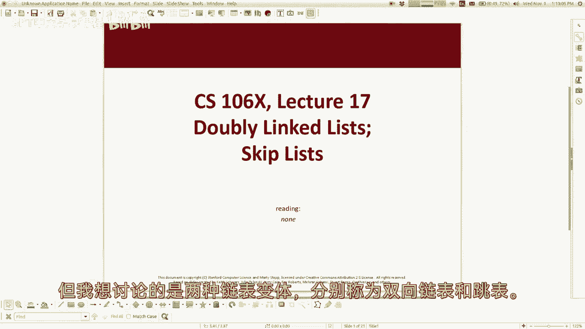

# 【编程抽象方法 cs106x 2017】斯坦福—中英字幕 - P17：Lecture 17 - Classes 2; Skip Lists - 加加zero - BV1By411h75g

好啦，为什么我们现在不出发呢？嗯当然，这是呃，考试前的最后一堂课，右拳，明晚，星期四晚上，晚上七点到九点，你们收到我关于房间的电子邮件了吗，是啊，是啊，好啦，如果你不知道我在说什么，那就去班级网站看看。

要么在头版，要么在考试页，我现在没有工作的WiFi，但如果你翻到那些页面，它会告诉你你们被分到不同的房间，根据你的姓，所以明天一定要去对房间，考试不在这里，在这个房间里，在另外三个房间里，散落在院子里。

出于某种原因，这就是他们在斯坦福大学做事的方式，所以请一定要去正确的房间，就像我不对你负责，如果你没有去对地方，就像你来到这里，然后意识到你来错地方了，然后跑到正确的房间，迟到二十分钟。

你和现在少了20分钟的工作时间，所以这就是那种混蛋，我是所以请检查这个弄清楚你需要去哪个房间，如果你不知道怎么去那栋楼，网页上有如何在校园地图上找到它的链接，所以弄清楚你需要去哪里，如果你对此有疑问。

请发邮件给我和艾米，今天下课后的助教，我们会帮你弄明白的，好吧不管怎样，我知道你你的思想和你的压力现在可能都集中在这上面，但尽管如此，我还是要教你新的材料，无论如何，我也许可以通过告诉你。

今天的考试不包括这些材料，但那也意味着你可能不想听我说，所以我不知道如何在这里穿针引线，它对即将到来的作业和其他东西很有帮助，所以无论如何，我今天想用我们的时间做什么，我想更多地讨论类和对象。

我想结束这次讨论，我还想谈谈一些，我想回到链表，我们像上周一样做了链接列表，我想把班级的东西连接到链表上，把它们放在一起，这就是计划，所以让我来看看我的幻灯片。

我们讨论了类和对象，我们复习了一下基本知识，你有H文件，里面有你所有的原型，您有一个cpp文件，其中包含，你知道我们回顾了一些概念，我试着把注意力集中在差异上，不同的语法和东西。

所以今天我想跳到一些新的语法，就像我们在下课时看到的最后一件事，你可以在课堂上使用const这个词，所以你知道常量意味着它不会改变，这是一个常数，你不能修改它，我特别想强调这个词的最后一个用法，康斯特。

你把它放在一个方法的标题上，再一次，它的作用是，它承诺此方法不会修改对象的状态，所以任何上你课的人，他们知道如果他们调用那个方法，它不会喜欢，删除帐户或删除所有的钱或类似的东西。

它还允许编译器检查一些东西，例如，如果使用我的类的人声明了一个银行帐户对象，他们说这是骗局，它将允许他们在那个物体上戳一个平衡，但它不允许他们在那个物体上要求存款，因为存款没有声明为常量方法。

所以在作业和其他方面，你们要写的对象类，我要请你，请在你能做的地方做一个方法常量，所以我的意思是，基本上你要做的是。

你要打开你的h文件，你要把里面所有的方法都看一遍，你就会问自己，这些方法，是否修改对象，如果他们不这样做，你应该把常量放在他们身上，所以就像这里，我是说，我在上节课结束的时候已经这样做了。

就在我们结束的时候，但就像存钱会改变计数一样，它不是恒定的，要求余额是不变的，询问帐户上的名字是不变的，提款不是，以此类推，任何时候，我请你写一堂课，我要你好好想想，这方面，好啦，所以这是缺点。

你们有什么问题吗，我真的没有时间回答关于它的问题，星期一，所以说，问题，是啊，是啊，所以这是一种然后去参数，他们叫什么并不重要，哦，你是说，就像它是一个方法参数，如果这除了在任何参数，参数也可以是常量。

也可以不是常量，是独立的，就像我可以在这里传递一个向量引用，然后这个代码可以改变向量，我保证这不会改变银行账户，关于参数没有任何特别的承诺，如果我想保证关于参数，作为成本的参数，有点让人摸不着头脑。

因为大多数时候，当你想让某件事保持不变时，你在开头加上了机会这个词，你把它放在最后，你把它放在最后的原因，如果你把它放在一开始，就像你的回报是一种持续的力量，但它真正说明的是这是一个医学屏幕游戏。

我会保持不变，所以他们决定把它放在最后，所以不管，是啊，是啊，所以成本法，我想你只能调用其他conmethods，是啊，是啊，有一个短语，他们称之为常量正确性，这意味着你已经通过了你的代码。

你已经通过了你的课程，你真的仔细考虑过这个问题，你在所有合适的地方都用了const这个词，我会告诉你，对于一个项目来说，最糟糕的状态是，就是你在代码中部分地应用了常量，因为你会发现，有些东西是缺点。

有些东西不是，你会得到这些编译器错误，因为不是常量的东西正在召唤，反之亦然，就像嘿，你不能那么做，因为你不是康斯特什么的，所以如果你在常量方面有错误，可能是因为你没有足够的康纳，康纳太多了，随便啦。

我听学生们告诉我他们所做的是，他们只是试图让一切保持不变，然后他们抹去上面有错误的，嘿，如果这是需要的，好吧，我是说很酷。

但不管怎样，好啦，我想继续前进，我是说我觉得有很多关于课程和其他东西的有趣的东西，但我想我想继续前进，所以我在这里有更多的话题，所以这是常量，我想谈谈操作员重载，所以这是C++的一个非常独特的特性。

我觉得在C++中很有趣，您实际上可以在语言中为运算符添加新的含义，具体来说，您可以定义运算符如何与您的类型交互，和你的班级在一起，你在写什么，所以如果你有一个，你知道的，表示矩阵或其他东西的类。

您可以定义一个时间运算符来进行矩阵乘法，而在Java这样的语言中，你不能那么做，你得写一个叫做点乘或点阵乘法的方法，所以这有点酷，这是允许重写的所有运算符的列表，过载，我有一些这样的，啊。

可以用括号重载的内容，C加加，让我们做一些邪恶的，我不想谈论这些运营商中的一些，这是奇怪的东西，但有时你想做这些运算符，最常见的情况是我重写等号之类的东西，你知道在Java中。

如果您想编写一个可以比较的类，用C++做一个equals方法，你不做一个等于方法，重写equals运算符，所以等于运算符就可以工作了，你没有牵线，你可以在字符串上做等于等于。

这是因为字符串有一个重载的equals运算符，你知道你也可以为你的课这么做，所以这就是我喜欢我们的收藏课的东西，让操作员重载它们，如果你有一个矢量，您想添加一个元素或集合，你可以说正等于。

这实际上是一个加号运算符，我们重载了地图和哈希地图，如果要添加或访问一对，你可以用方括号来表示，这是因为我们重载了类中的方括号运算符，所以这是一个很酷的功能，嗯，只是轻微的社论，我想告诉你。

我认为这个功能很容易被滥用，如果您在类中添加一堆运算符，不是很直观的，然后它可以让写作变得非常容易，看起来很奇怪的代码，很难读懂，就像使用你代码的人在做时间和除法，再加上你决定超载。

加上接线员在银行账户上做存款，除以操作员从银行账户中提取交易费，就像你所知道的，那有点不直观，我认为你应该只使用这些运算符来做一些显而易见的事情，平起平坐，等于，应该告诉你事物是否相等。

或类似的东西在后面，是啊，是啊，加号是怎么回事，一元算子的幂加减，当你可以的时候，你可以说负一，或者你可以说a-b，所以实际上这些运算符可以作为一个单独的，在单个值前面或两个值之间，反正。

这些都是您可以重载的运算符，如果你想这么做，如果你真的想这么做，然后你要做的就是把它写成一个函数，好啦，你基本上把它看作是一个函数，但是函数的名字就像运算符加或运算符等于等于或其他什么，那是函数的名称。

唯一有点困惑的是，如果是二进制操作，就像你去的地方，A等于B，你基本上把它看作是一个叫做equals的函数，它接受两个参数，一个逗号b，就像参数一样，是两件事，即使在你的代码中，两个东西中的一个在左边。

另一件事是在右边，这就是你喜欢的语法，我们一直在做的其他课程，你在H上声明，然后你把它的主体写在CPP中，就像，让我给你看一个快速的例子。

我们有一个银行账户类，你可以在那里存取款，像这样的东西，如果你只是想检查两个银行账户是否相等，他们是否有相同的状态，您可以编写一个运算符，等于等于，你可以拿一个银行账户和一个银行账户。

少了些东西一个接线员，就像一个函数，所以它必须有一个返回类型，equals等于cool的返回类型是什么，对呀，它要么是做的，要么是做的，要么是真的，要么是假的，另一件事是，如果你把这些银行账户，请记住。

每次将对象作为参数传递时，它复制了一份，所以你可能应该通过引用和等于来做这个，不改变计数，所以你可能应该说它把他们当成了罪犯，现在又是银行帐户参考资料，我们刚刚谈到了康斯特，所以你可能会有点困惑。

你可能以为这个是放在这里的，常像那样，但是康德最后说，如果它是类中的成员函数，这实际上不是在课堂里，它只是一个自由浮动运算符，碰巧在操作数上工作，是银行账户，所以你没有说最后是常数。

如果您想保证此操作员不修改帐户，现在呢，你把Conover放在这里而不是那里，所以我不知道这是令人困惑的事情，对吧，这是运算符等于的标题，然后如果你想实现它，嗯现在，我在银行账户上。

如果你想写它的实际主体，你去这里的银行账户CPP，到下面去什么的，你又说粘贴运算符等于现在，在所有这些其他方法中，你可能还记得我写了银行账户冒号冒号，这是因为它们就像每个银行帐户对象的成员。

此运算符不是，它漂浮在全球空间，它恰好有操作数，是银行账户，所以我不说银行账户冒号冒号，所以如果我想看看他们是否平等，我的意思是你基本上只是比较物体的状态，所以你知道他们有一个身份，一个名字和一个平衡。

事实上，我不认为我们真的对ID和所有代码做任何事情，所以也许我会删除，我在这家银行不需要身份证，你的名字已经够好了，你叫什么名字？卡尔，好啦，给你20块，你很好，一定是富国银行。

我们只是为人们做免费的账户，而不问他们，然后我们拿走他们所有的钱，是呀，所以名字和平衡，如果那些是一样的，那么计数就相等了，或许你会说，你知道的，返回b a一点得到平衡，等于b a两点得到平衡。

我想你首先比较名字，你会说一个人得到名字等于爸爸两个人得到名字平衡，所以回归真，如果那是真的而返回的是假的，如果那是假的，有趣的是，this运算符调用这些方法，就像点得到平衡。

而上面的代码直接引用了这些，就像私有变量，从技术上讲，这些运算符不是类的一部分，所以实际上，如果我试着说就像两个点平衡，它其实不喜欢这样，你这里有一个小错误，它说在这种情况下余额是私人的。

所以从技术上来说，运营商是一个外部实体，嗯，如果您想编写一个能够触及私有事物的运算符，当然，你可以黑客攻击并使它们私有变量公开，但那不酷，我们不应该那样做，所以如果你想。

以便这些运算符现在可以看到私有变量，在本例中，那对我们没有多大好处，因为您可以通过调用这些get方法快速地询问私有变量的值，但是您可能没有一个针对每一个，不管出于什么原因，你可能需要把手伸进去。

所以你会喜欢这个的，C++有一种方法可以解决这个特殊的问题，你这样做的方式是你让全班，所以请记住，我们有我们的，我们的银行账户类在这里，然后在下面，我们有一个类之外的运算符，银行帐户类可以有选择地指定。

允许进入自身私有数据的各种其他代码，爪哇，你不能那样做，这不是一件事，Java就像公共和私人一样，C++有一个特殊的东西，你可以来这里，喜欢在课堂上，在某个地方，你把运算符的方法放在这里。

你把朋友这个词放在这里，我不是瞎编的，寻找颜色，这是一个真正的关键字，你知道的，我爱，如果你仔细想想，就像，是呀，对我来说，对我来说，听起来更像是有好处的朋友，但不管怎样，如果你那样做。

不管是什么函数或者运算符，允许查看类的私有数据，这将使我们，所以如果我们想在这里，我们可以说B A一个名字等于，B A两个名字和B A一个余额，所以现在，好啦，但我想也许我不是很清楚，就像这样更好吗。

喜欢这种好风格吗，或者这被认为是，我想说这通常被认为是可以的，因为有时候你需要这些操作员能够接触到并做到这一点，通常运算符定义在同一个文件中，无论如何，所以不是说，你只是在向全世界传递友谊的象征。

刺穿你的物体，或者随便什么问题，那么在课堂上的重点是什么呢，好啦，对不起，为什么我在这里或这里定义它，是啊，是啊，我们有下面的一面，对呀，对嗯，基本上你是在这里宣布的，就像对世界一样。

你在告诉全世界这个存在，站在这里就像你在说嘿，那家伙是我朋友，但就像，我很确定如果你把它放在这里，它不工作，有点像真的是这个，这个就像指水或类似的东西，你可以，你可以把这个放在私处，如果你想的话。

就像我们是朋友一样，但它有点在DL上，你知道的，我不想让别人知道他们是我的朋友，但这是一种语法，你要这么做，你可以对，私人内部的运营商，然后你得说，朋友，哎呦，你的意思是，你的意思是，别那样放在这里。

我想你两者都需要，我忘了，我的意思是，删除它，看看它是否完成，但我们不用它，问题是你必须正确地称呼它，所以如果我把那个注释掉，我想问题应该是，如果我去富国银行，我说嘿，如果b a 1等于b a 2。

看看有多哇，如果b a 1等于b a 1，那些是平等的，看出去，这是非常描述性的信息，所以我想这真的奏效了，它打印了是的，因为我和自己是平等的，但我比不上玛拉，我想我已经知道了，但不管怎样。

我想它确实起作用了，我总是看到它放在两个地方，但不管怎样，也许不需要两者都有，我想没有朋友这个词，你不能把它放在这里，说朋友对，说朋友必须在班上的那个，嗯，我是说在那里连个朋友都没有。

因为它只是声明一个运算符属于这个类，对呀，但如果你这么说，我觉得它，如果它没有，它不喜欢那样，基本上你是说我以外的那个人是我的朋友，好让他们碰我，不管他们想要什么，所以不管是什么权利，反正是那种讲座。

那就是陆上接线员，是啊，是啊，编写不是运算符的任意函数是编码风格吗，让他们成为朋友，我认为总的来说，你想尽量减少朋友的使用，如果您的代码需要查看类的私有数据，那么该代码可能应该是类的一部分。

不然它为什么需要这些数据，或者做一个方法，他们可以访问私人数据，并在不修改它或其他东西的情况下查看它，感觉就像你们已经学会的正常写作机制，课程应该大部分有效，这是一个非常具体的案例，其中必须写入运算符。

因为这些全局函数在两边都有操作数，因此，它是一种这种特征，坦率地说，几乎完全是为这种情况而建造的，哪里像，有些东西必须在我的课堂之外，但本质上与我的课程紧密相连，所以我会给你一把后门的钥匙。

到课堂上查看私人数据，是啊，是啊，我有两个问题，首先，有一个语法，我们将运算符定义为成本函数，喜欢的人谁会是对象，第二个是，是啊，是啊，是啊，是啊，嗯，所以我不想在这上面花很多时间。

但是重载运算符还有另一种语法，在那里你可以喜欢，省略第一个操作数，然后就像你一样，这是第一个鞋面，所以你可以这样做，但我更喜欢这里的语法，因为有很多运算符不能用第二种语法编写，只有一些人能。

关于它有一些奇怪的规则，到目前为止，这是更常见或鼓励的，比如语法，我想这个语法也允许像int加银行账户和银行账户这样的东西，加int，一些不对称的东西，如果是在教室里，或者你必须在操作员的左边什么的。

所以无论如何，还有其他方法可以做到这一点，但这是我认为这是最鼓励的方式，这里的另一个人叫什么名字，为什么不，我知道，我不知道如果我不在那里，当我们有两个函数，他们能用不同的，是啊，是啊。

我是说我认为重载就像在一个函数中，会像，您有一个函数foo，它接受一个int，和相同的函数foo，它接受双倍或不同类型的参数，所以就像我们已经有了一个等于运算符，它需要整数、双打和字符串。

但现在我们要超载了，所以它也可以接受一个参数，那是一个银行帐户，所以我想这就是它的名字，有一件事我想指出，我看到你的手了，我再打给你，我是这些超负荷的操作员，真的很蠢，它完全照你说的做，例如。

我在这里写了一个equals-equals运算符，所以你可能会认为现在C++知道如何测试，他们是否平等，它还必须知道如何测试，他们是否平等，因为它们显然是相反的，所以如果我在这里说不等于。

如果你试图编译，它会说你没有定义一个不等于运算符，就像，你在开玩笑吧，我，我告诉过你，你想不通，不等于，你实际上必须回到类，你实际上必须写一个单独的运算符，不平等，你也得把他当朋友，当你去，那是h文件。

现在呢，在cpp文件中，您实际上必须编写一个运算符，实际上很多人做的，你可以用结来重写这个逻辑，但是很多人不喜欢，一等于，B一个二，我觉得很愚蠢，这些不是自动从彼此推断出来的。

这就是他们在那里建立功能的方式，有这些晦涩的例子，平等和不平等并不是完全对立的，但是因为它的稀有性，他们决定把所有这些事情都分开，喜欢不到不给你，比所有那些东西都伟大，是啊，是啊。

你可以通过把自己的符号放在谷歌运算符后面来制作自己的运算符，对呀，类算子，否，我希望。

有一个名单是允许的，我知道，我知道，但就像你的猫跳到键盘上打一堆东西，就像这些是，就这样了，如果你，如果不在这一套里，这不是语言规范的一部分，它在后端不起作用，所以如果在全局命名空间中重载它。

这意味着任何与它互动的人都将接受新的定义，默认情况下的旧定义。

是啊，是啊，一旦您现在将该运算符添加到项目中，每当有人用它旁边的操作数写等于号时，它就会把这个叫做它，所以这就像，我想最好的方法是避免你自己的，因为您可能会使用其他对象，一个完全不同的物体称它们相等。

所以你不想好好利用，这并不替换int的equals或double的equals或其他，这就像如果你有相等的，它恰好在每一边都有一个银行账户，这样做，它并不取代任何其他平等的上下文。

就像在其他类型的东西上，是啊，是啊，两个问题，一个可以替换其他内容，比如整数上的运算符等式，我不认为你能，我已经有一段时间没试过这个了，a int b，会把他们，是啊，是啊，上面说你们一定有争论。

那是类或enome类型，所以我想你只能根据自己的类型来定义这个，所以我很确定你做不到，有一些编程语言可以做到这一点，就像有一种语言叫红宝石，在那里你可以做任何你想做的事。

所以你可以把int 3设置成值5，现在三等于五，你可以改加法做减法，所以你可以做各种蠢事，但不是在这里还有另一个问题，是呀，是啊，是啊，但在这种情况下，对于不等于，你只是在翻转等价物。

他们在文件中出现的顺序有关系吗，嗯不，只要他们都有一个带有分号的原型，每个人都会从原型中知道另一个，是啊，是啊，我想在一秒钟内继续前进，因为你知道我还有其他事情要做，但这可能是一个问题，是啊，是啊。

但是，而不是使用两个参数，是啊，是啊，这是她的问题，有一个语法你喜欢，这是第一个操作数，我不太想表现出来，在幻灯片里，我不打算多谈这件事，因为只有一些运算符支持这种语法，不是其他人，其中的规则有点奇怪。

这种语法更普遍，这是我认为更普遍的鼓励语法，我想继续前进，如果有其他运算符重载问题，也许我们可以晚点再吃，我只是我有很多其他的东西我想涵盖，但这是运算符重载的基本知识。

我想给你看一个特定的操作员，这是非常重要的，也是非常常见的超载，哪个是小于小于运算符，这是当你看到外面时使用的操作员，就像你打印东西的时候，所以实际上你知道在Java中，如果要使对象可打印。

你是做什么的，您编写一个双字符串方法，右Java，那就像爪哇的一个特殊公民，那个方法很特别，它将使您可以在控制台上用C++打印该对象，您可以将方法名写入字符串，但这种方法一点也不特别。

它不是用C++自动调用的，所以这种方法做不到你想要的，如果你想做一些可打印的东西，当小于小于运算符超过输出流时，您将重写它所做的操作，C out是输出流类型的对象，你的东西引用通常这样它就不会复制它。

奇怪的是，这个方法是运算符，它返回输出流作为其返回值，这有点奇怪，但它这样做的原因是当你真的看到箭头时，什么箭，什么箭，像这些子表达式中的每一个都返回看出来，以便下一个表达式可以计算查看，只是很奇怪。

别想太多，但是如果你想让你的对象原则，你写这个。

所以说，让我快速地告诉你，因为我希望你能在课堂上写那个运算符，在执行任务什么的，所以你说，小于O流参考运算符，你用一个o流引用来表示你想把它发送到的任何输出，然后你拿着，我不知道，康斯特银行账户，是A。

实际上我需要先在H文件中声明它，我刚跳转到h文件，我可以把它变成朋友，看情况，我的意思是，所以在这里，我必须包括IO流，因为我在用i o流，现在在银行帐户类中，马马虎虎，是啊，是啊。

所以我宣布这个方向在这里，现在回到这里，我说基本上你只要假装退出就是退出，所以你就像箭一样，美元符号，巴点，获得平衡，你知道类似的事情，或许你会说，获取姓名，就像那样等等，我做错了什么。

还是他们少了一个，就像一件事，你通常不会把我，因为你想让打电话的人，决定在这个末尾是否应该有一个句柄，你应该只在周围没有其他东西的情况下打印自己，现在我是如何决定给我什么格式的，就像名字逗号和钱。

现在我有了那个接线员，如果我去富国银行，我说嘿，你知道的，看出来一个是箭头，一支箭，然后我对BA2做同样的事情，所以到了这里，它将调用我的小于小于运算符，它会喜欢，运行打印代码打印我，所以它打印了一些。

B 1是马蒂0，对呀，所以相当简单，但我想让你看看，因为我是说，我不想花很多时间谈论那个特定的运算符，但就像这样你就可以把东西打印出来，是啊，是啊，你是想说服你的朋友还是，输出流。

但它不想返回输出流的副本，所以我不知道，我是说，这是这个运算符必须具有的标题，因为当你说箭头的时候，它打印的东西，然后这个表达式的计算结果是，所以如果你还有另一支箭，下一件事就会看到箭头。

它实际上是通过这些回报来做到这一点的，看看基本上，但让我们看看是不是律师，他们做了一个账户，然后就会有，返回一个关于它的参考，使它大约一美元会更好吗，是啊，是啊，我是说，我认为引用的返回是一种。

会让你的脑袋转一下，嗯，我想说总的来说，返回参考资料，你真的不应该那么做，因为如果要返回对局部变量的引用，局部变量就要被堆栈挤掉了，现在你真的返回了一个刚刚死亡的东西的引用，这将打破程序，嗯。

所以大多数情况下，你不想返回引用的东西，但偶尔你会，你只想这么做，如果你知道你归还的东西不会消失，我知道这不会消失，因为他是我的推荐人，我会把他还给你作为你的推荐人，所以他住在，不管是谁宣布他。

所以当我做完的时候他不会离开，我要宣布他，所以我不打算清理他，所以返回对事物的引用是要做的事情，很少谨慎，只是碰巧在这种情况下你必须这么做，我也不知道，我是说，为了我们需要做的，就像你总是打印一样。

然后返回传递给您的输出流，没有比这更有逻辑的了，对所以实际上，如果我更详细地说明操作员，就像一些运营商，您返回对您自己的引用，因为加等于修改你然后返回你，所以你返回这个基本上就像引用你自己一样，是啊。

是啊，明星这个其实，但是是的，你是的，有一些运算符，您可以在其中返回引用，因为这个原因，我今天不打算超载，但这是正确的想法，呃，我们要考试吗，如果是这样，是不是有一个形状，还是考试的时候要这样。

我不会要求你在期中考试时让接线员超负荷工作，否，我不会要求你那样做的，或者如果我像决赛一样，我会确保给你航向安全。

所以无论如何，我想再做一件事，我想谈谈，让我们看看，我想讲一下d结构，你们见过建造者，当一个物体诞生时，调用构造函数，可以添加参数来初始化对象，C++也有一个叫做析构函数的东西。

有时学生们称之为解构主义者，但它是一个析构函数，它不是解构器，不管它的语法是什么，你放一个波浪形，然后它看起来像一个构造函数，否则，波浪在二进制算术中表示否定，所以它的意思是，这是一个非构造函数。

有点嗯，当对象被抛出时调用它，被清理，从内存中删除，物体正在死亡，你在里面一般会做什么，你不必写这些东西，但你会做的是，如果您的对象在堆上分配了任何指针或任何新对象，你会想释放它们并在那里删除它们。

以确保您的类不会泄漏任何内存，所以实际上我不能给你看一个很好的演示，在这里用银行账户。

因为bank account类只有一个int和一个字符串或者字符串中的一个double，你不需要把它们清理干净，你唯一需要清理的情况是，如果你有一个foo star f，你做了一个新的食物。

当你的目标快要死的时候，你必须删除F，基本上你得，如果你在这里分配了某种指针，你得把它清理干净，我马上给你们看一个例子，但这是一般的想法，所以如果你想看看析构函数的作用，你可以在这里写。

银行账户是一个析构函数，然后在CPP文件中，我可以说，银行帐户冒号冒号析构函数，只是为了帮助看到它的工作，我可以做的就像看到外面的毁灭门呼叫和好的，事实上，我甚至可以说喜欢，然后我就可以这么做了。

也就是我，你知道我打印自己把星这个，因为这是指向我和星星的指针意思是指向那个，我指的是什么，但不管怎样，打印我自己，好啦，当我死的时候，打印打印我的名字什么的，所以在富国银行的客户那里。

我觉得你看到的是对的，在节目结束时，你会看到析构函数在神经元上被调用，后来他接到了马蒂的电话，所以它在最后，当程序关闭时，它在最后的原因，是因为这些物体，在缅因州的尽头。

你知道他们从梅因的开始一直生活到结束，所以这就是它摧毁它们的时候，如果你有一个生命期较短的物体，你知道虚空福，然后在这里你知道你创建了另一个银行账户，B一个三，就像，你知道，基思，施瓦茨什么的，他有。

你知道，五十块，不管他有什么，你知道这里，我可以说，阿福，那么会发生什么，它是要调用函数，它会创造基思，函数返回，它将清理基思物体，它会调用他的析构函数，所以我会在输出的前面看到关于Keith的消息。

你看到了，所以他在最初的几条打印信息后就被摧毁了，事实上，我们使用指导者定义对象而不是堆栈，当他们让观众保持正确时，我们会打电话，所以实际上，如果你有银行账户，星B A三等于新银行账户，基思·施瓦茨。

那是基思现在住在垃圾堆里，如果你运行这个，仔细观察代码，你永远不会看到一条线上写着析构函数，打电话给基思，因为我从来没有它不得到，因为这正是在堆上分配东西的意思，它不会被程序破坏，直到你删除它。

如果你叫删除，它将调用析构函数，所以是的，这是一个很好的区别，事实上，目前这个程序泄露了基思的内存，1。我找不到他了，因为我丢了他的教鞭，所以哎呀，问题，是啊，是啊，像清理，那个。

或者现在你的笔记本电脑上用的是RAM，那是为了那个物体，现在就像卡在那里一样，是啊，是啊，它是它是前者，如果我不释放记忆，就像如果我把这段记忆泄露给基思，内存被我的程序占用了，无法恢复。

直到我的程序退出，我的程序退出操作系统，抹去了我用过的所有内存，即使这么幸运被泄露了，它可以追溯到，我也不必喜欢重新启动或买一台新电脑，或者任何权利，嗯，这是个好消息，但是是的，但如果再一次。

这对这个节目来说并不重要，但如果我运行一个长寿程序，就像服务器，那东西很重要，所以如果你不知何故知道新来的人的指针，你还是会觉得，这将是相当困难的，如果我知道重点，就像你说的，在我的主课后面什么的。

是啊，是啊，如果可以的话，如果你有那个指针，那个内存地址，我可以去那里，基思的目标还在那里，如果泄露了，它还在那里，就像，我没有办法够到它来清理它，或者现在就用，当程序终止时，程序终止。

OS可能会把它都抹去，或者像我猜的那样，它通常只留下它发现时的记忆状态，但这个技术上很差的基思，帮帮我帮帮我，我漂浮在记忆中，没有人释放我，差不多吧，但我的意思是，基本上它输给了世界，是的问题，事实上。

在末尾可能会写每一个被使用的内存，不是自由，或者类似的免费的，喜欢自由大家喜欢，当我们来到这里，把他们都放了，或者只是手动，我们可以说不，我是说C++不会记录，所有这些事情就像，我们没有办法让它自由。

所有这些，嗯，Java和其他语言为我们跟踪这些东西，他们称之为自动垃圾收集，但我们这里没有，基本上是为了速度的目的，他们不想把所有的事情都列在清单上，因为那样会占用你的记忆和时间。

所以他们认为你应该跟踪它，否则就是你的问题，你知道这是一种我们正在使用的语言，所以说，好啦，银行账户类很短，也很简单。

只是想练习一下语法，我认为一个更有趣的例子是，如果将链表制作成类，我不打算和你们一起编码，但是我们写的那些方法，比如添加，删除链表前面的，你能做的就是把所有的代码，粘贴到类中，好啦。

但你要做的一个改变是，所有这些方法都是如何走在前面的，前前指针，您将从这些函数的所有标题中删除该参数，它不是一个参数，它将是链表的私有变量，所以他们有这样的通道，而不是你必须传递正面作为参数。

所以现在所有的方法都只接受参数，用户希望通过，比如值或索引，或者任何他们想操纵的东西，所以我不知道我的幻灯片里有没有那个代码，但它看起来是这样的，你知道你可以做一个链接列表，你可以添加一些东西。

你可以得到东西，你可以设置东西，你可以移除东西，这段代码是算法上的，我们上周写的代码，只是稍微重组一下，我想我没有幻灯片中的方法，但那是因为它们是我们已经生长的身体，这是一个你想破坏的地方。

因为在这里你有一个节点链，如果你永远不能把他们清除出去，然后当链表被扔掉时，您应该在奇诺节点上循环，并将它们都向上显示，这是一个例子，你会，析构函数可以帮助您做到这一点，是啊，是啊。

当您为类实现类似链表的东西时，对于大小有一个私有变量是典型的，你用一个尺寸方法，我们必须这样做，如果我们没有公共汽车，您当然可以为大小保留一个int，有时候你应该这么做，你不应该那样做，取决于，就像。

如果你的教练说你能或不能，或者如果您有一些内存限制或其他原因，但是是的，你可以把它放在里面看看大小，你可以在广告上增加它，在运动中减少它，但如果你被要求尺寸，你其实不必走过去数数。

所以这是一个很好的好处，是啊，是啊，问题，所以我们打算在我们的项目中实现一个链表，我们在哪里定义结构列表，我们会在同一个教室里做吗，一个小结构通常只是在它自己的小文件中，称为列表节点h。

它可能和这个在同一个文件里，但更常见的是，每种数据类型都有自己创建的文件，当我给你一个开始的项目，如果我想让你有某个节点，我会给你做一个H文件，里面有节点，我会把这个代码贴出来，如果你想看这个。

我不是想为你保守这个秘密，但基本上我要做的就是，将我们上周写的所有代码复制粘贴到这里，所以我想把最后几分钟，我们已经简要地讨论了几个高级版本的链表，我打算只简短地谈论它们，因为我想让你多看看他们。

作为你们家庭作业的一部分，我知道这正是你想的，现在是家庭作业，但是你可以。

你可以考试后再担心，但我想谈谈链表的两种变体。

称为双链表和跳过列表，你可能会说耶稣，为什么你要在上一节课的最后十分钟介绍这个，我是故意勇敢的，因为我想让你探索这个，但是这里有一个关于双链表的快速介绍，这个想法是每个节点不仅有一个下一个指针。

但它也有一个以前的指针，否则就是千篇一律，正如您已经看到的链表，另一个变化是，您通常会保留一个后退指针，除了保持一个前指针，这样做的主要好处是，您现在可以在列表中双向行走，如果您想转到末尾并循环到开头。

很容易做到，缺点是节点占用了更多的内存，因为他们每个人身上都有另一个指针，当你在做代码的时候，你得移动更多的箭和操纵，你得确保保持两个方向，锁链无时无刻不在纠正，所以这可以使编码稍微困难一点，对呀。

所以这取决于，如果你需要能够双向行走，你也许应该这么做，如果你不需要走两条路，那么也许你不需要后面的指针，我们之前编写的所有其他方法都不需要任何反向指针，所以好吧，所以如果你在做一个双链表。

如果你在考虑添加一些东西，基本上当列表为空时，前面和后面的指针都是no，如果添加单个元素，前面和后面都是那个音符，它没有绿色，也没有下一个，因为它是唯一的元素，如果添加另一个元素。

这取决于前面末端或者中间，如果你在最后，你得退缩，他的奶油在前面，前面的下一个在这里，你知道就像，我是，我在这里读你必须改变的所有事情，基本上如果你加上前面，你要把前面的指针换到旧的前面。

旧的战线必须回到他身边，所以有更多的箭头操作，你基本上要做两个方向的指针才能让它工作，但又一次，你们一直在练习的东西，就像我有这张照片，我想要那张照片，就像所有这些东西在这里仍然适用一样，基本上是对的。

从双链表移除，你记得如果你从一个，如果你想除掉这家伙，你让詹姆斯·邦德站在这里，你把下一个指向这里，对呀，但你也需要和这个家伙谈谈，把他的pre再指向一次，所以就像要换两支箭对吧。

所以这不是世界上最难的事情，但你得小心点，因为如果你只做一种方式，如果只移动此指针，但你不能移动指针，然后就像如果你走不同的方向，你会得到一个不同的，就像，如果你倒退，你仍然会看到这个家伙，你继续前进。

你想要，你在这个州得到了这些奇怪的不一致，基本上，这就像从双链表中删除，实际上，当你从末端移除时，你得小心后指针或前指针，或者两者都特别棘手的状态是，如果你只有一个元素，你必须同时把前面和后面都清零。

所以你得小心点，得画些画，对呀，那是一个双链表，你要在一个叫做Tiles的程序上这样做，在那里你将有一个这些矩形的链表，当你点击它们的时候，你走到前面，或者你把它们移到后面什么的，所以能够双向是很好的。

在列表中循环，找东西，抓住它，把它搬到前面，移到后面去，诸如此类的事情，你会看到下一个，这个很有趣，你会因为这个而爱上我的，你准备好了，下一个叫做跳过列表，我去滑滑梯，一秒钟内的其他幻灯片，你就像。

哦天啊，我为什么不拿一零六便士，你现在就是这么说的，我知道你在想我能从你脸上看出来，跳过列表是一个排序的链表，但除了有混合指针，它还有这样的快速通道，可以一次跳转多个节点，这种结构的好处是。

如果你在开始，你想达到一定的值，你在找值8之类的，你不必一个一个地走到那里，你可以跳过前面的路，更快地到达那里，如果你做对了，你可以在log n长的运行时间内得到一个对数。

从这个结构中查找内容或添加内容或删除内容，只有真正起作用，如果内容被排序，因为如果它们是随机排列的，然后明确不知道，不管你是否想明白，这就是这里的大意，排序列表表达式，这实际上是如何工作的。

你是怎么得到这些的，这幅画到底应该是什么，这些是节点，伟大的小部分是数据盒，像以前一样，像一英寸的数据，所有这些蓝色的家伙都是下一个指针，嗯，如何让四个下一个指针的节点，一些节点有两个下一个指针，通常。

你要做的是保持指针的向量，所以通常至少有一个向量元素，如果不是两个三个，其中的四个要素，所以这就是我的想法，这个想法很有道理，然后我想告诉你怎么做，它的一些细节在一秒钟内，但这是一般的概念吗，清除。

四七号，哦就在这里，只是碰巧是那些数字，我加了一二三五七八九，我想他们，你知道，我可以加一个四，但这恰好是我放在这里的一组数据，也许另一个问题会像，为什么这个，这么高，为什么这个这么高。

你怎么决定我想说谁有多高，一秒钟后，你可以用不同的方法来决定，但让我们经历一些事情，所以有一件事就是你通常对跳过列表所做的，你的前端实际上是一个节点，上面有毫无意义的数据，它有很多指针。

所以它帮助你穿过这里所有的小链子，这就是你的结构，你存储了某种价值，后面跟着指向nexis的指针向量，或者我们称之为假人的东西，基本上，这意味着你的朋友永远不会是空的，你总是在这里设置一个节点。

但他唯一的目的是让你开始寻找其他节点，所以换句话说，前置数据毫无意义，但是前面的下一个数据还是前面，下一个可能相关的第二个数据，这是实现细节，使编码更容易，那么现在如何在跳过列表中查找内容，没那么难。

如果你真的了解它的结构，记住它是排序的，所以你要做的是，如果你知道你有什么喜欢，这是四个层次，向量元素零到三，你三点开始，你有一些DAT到三个什么的，你看存储在3的指针，你向前看，你看到发生了什么。

你要去做什么，如果你顺着这一点，我将得到一个值为8的节点，也许我在找七个，这么说吧，我不想走这条路，太右了，因为如果是八分，而且排序太远了，七不会在八之后所以不，我不想拿那些选票。

所以我在我的水平上做负负，或者别的什么，所以如果你，如果走右边好的话，你走右边，但如果走右边不好，就像我这里的例子一样，与其把这本书写下来，不如现在把它写下来，我在第二层，我想去右边找七吗。

当然因为一切都结束了，有一个三，所以我走得还不够远，所以我现在就跳过去，我在这里，你从来不上去，你总是走右边，所以我现在在这里，我想走右边吗，如果我再右转，我到了八，太远了，我想找一个七，所以没有。

我下去，所以现在我再看一次，我想走右边吗，哎呦，看七，我找到了，所以你就这样下去了，现在，就在下面，尽你所能，你走右边，如果可以的话，尽你所能地向下，直到你找到它，或者什么，好吧好吧，如果是七。

你会什么，如果我搜索6或10，你有可能找不到它，你怎么知道你没找到，或者它不在那里，你去吧，如果你在底层，就像，我在找一个六，我有点到了我走到这里的地步，下一个是7，我不能再下去了，因为我在底层。

所以我放弃了，我可以停止，剩下的路我都不用走了，他不会在那里，是啊，是啊，如果你到了底层，如果你看到比你要找的东西更大的东西，你就停下来，就是这个想法，这就是如何搜索，好啦，所以我在这里做了一点弯曲。

找到一个7，但是如何将某些内容添加到跳过列表中呢，如果你要加一个6，从概念上讲，它就在那里，对呀，好吧好吧，所以你用同样的搜索模式，找出6的位置，就在下面，就在下面，啊哈6号应该就在这里，在这家伙之后。

在这五个之后，所以你把它加得很好，但事情没那么简单，因为那就太好了，你知道，如果你加上一个高度为1的6，但是其中一些节点应该有更多的级别，我们没有解决这个问题，然而，你怎么知道这个东西应该有几级。

有一种很酷的方式来回答这个问题，你只要抛硬币，你可能会说这听起来像BS不可能，但基本上你所做的，你从一个下一个指针开始，就像这个人，你抛一个五五分的硬币，如果你得到人头，你把它提升到两个层次。

然后你再翻转，如果你的硬币里再出现人头，你把它提升到三个层次，你翻转翻转翻转只是数学上的概率，这意味着在每个级别上大约会消除一半的节点，大约一半，所以你的水平会有一些像这样的小尖刺，就像我的照片上一样。

不完美，但大致上，你可以做一些证明，它基本上是大致的，所以再一次，抛硬币，掷硬币掷硬币，所以当你要添加一个节点时，你所做的就是翻转，翻转来决定它应该有多少个级别，一旦你决定像这个例子有一个级别。

如果它有两个，你得把它绑在两条链子上，如果它有三个，你得把它绑在三条链子上，如果它有四个，你得把它绑在四条链子上，基本上，不管它有多少锁链，你得找个合适的地方，你得把所有的链子都钩进去。

所以它会成为所有合适的，跳过列表中的快速车道，是啊，是啊，假设你看着真实的，您只需要在这一点上添加另一个指针，如果你说真话，真，真，你又翻转了一个真，你只需要让它成为另一个，你得走了，它是一个向量。

所以你可以回到这里，扩展，正在修建一条新的高速公路，只为我，因为我比任何人都高，所以去争取吧，是啊，是啊，所以你用同样的搜索逻辑，如果可以的话，你侧身走，你下去，如果你不能，但如果你到了。

你的人有一个水平，你不能再横冲直撞了，因为没有合理的侧向，你需要把你的指南贴在那里，基本上如果我要去，那是什么，如果你把这六个，基本上你从六级的顶层开始，就在这里，你侧身走，直到你看到，在这个链子里。

一个6在一个3之后应该在哪里，但在8之前，所以你要做的就是把这个指针连接到6的顶部，然后你下去，你继续做同样的过程，我还想在这里加一个6，因为他在7号之前，所以我把这支箭，我把他绑在那边六层楼的第二层。

我下去，我不想把六附加在这里，因为5比他少，所以我向右走，我确实想让他在这之前来，所以基本上你向左或向右向下，往下走往下走，你把它贴在他按正确顺序的地方，一旦你这么做了，你重建了剑。

你已经把快车道上所有不同的线重新贴在你的收藏上了，是啊，是啊，什么事？如果，在这里找到一个6，如果你实际上有一个更均匀的分布，就像一二一四一二一八，当然某些形状，这些高度的某些形状绝对更适合某些搜索。

但既然要保持完美的身材真的很难，在添加、删除和重新排列的空间中，基本上，这种掷硬币的东西在高处洗牌，足够让你渐近地接近，就像，什么是真正好的高度分布，这只是我在幻灯片上的例子。

但你得相信我硬币就像比我聪明的人一样，做了严格的证据证明抛硬币是个好策略，它提供了一个良好的运行时，我得停下来，因为我没时间做你的家庭作业了，你得试试这个，以及其他有趣的事情，别担心那个，就目前而言。

你可以去紧张我的胸部，第一批，祝你学习顺利，明晚见。

