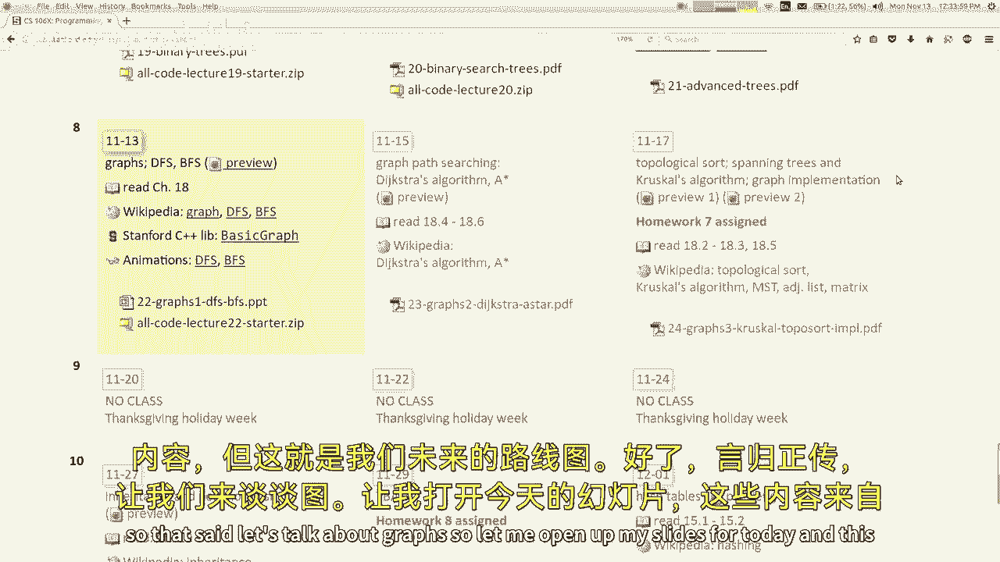
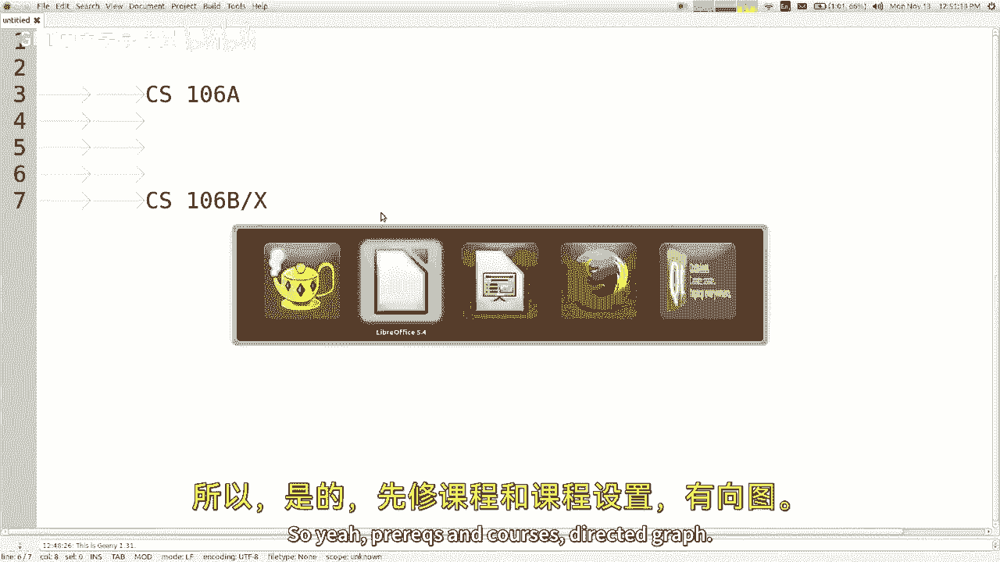
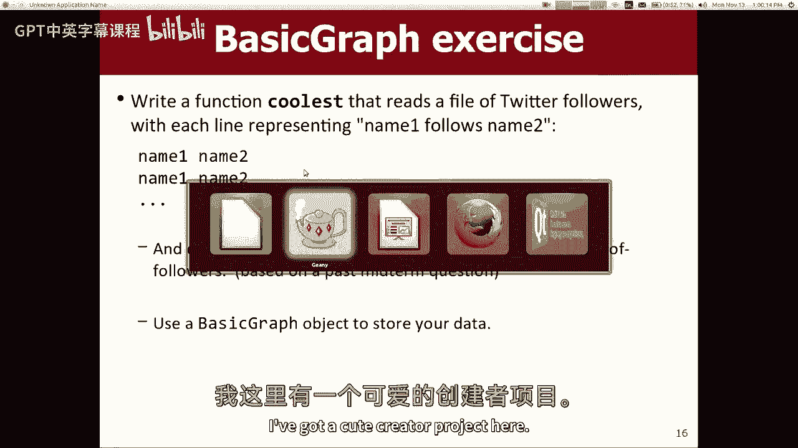
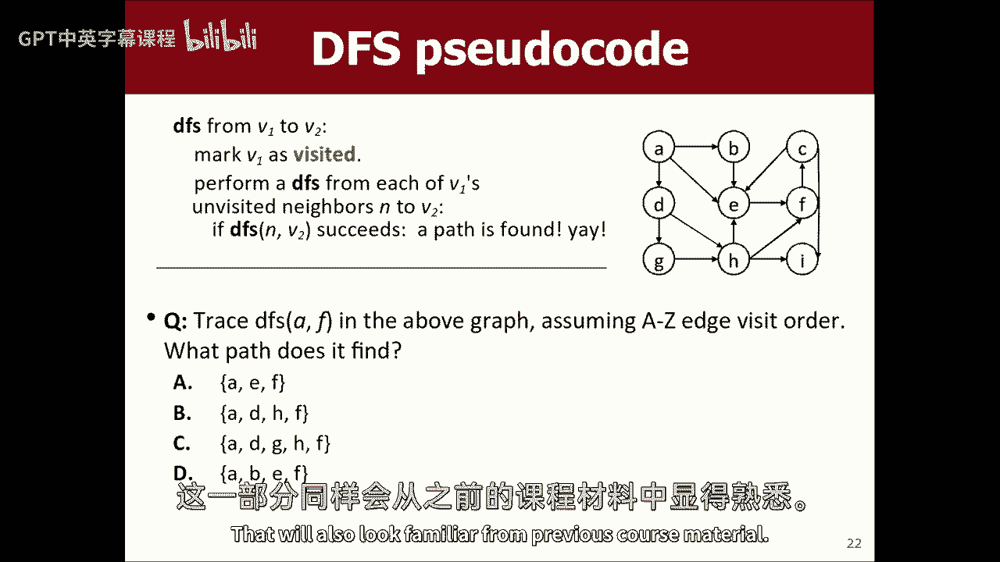
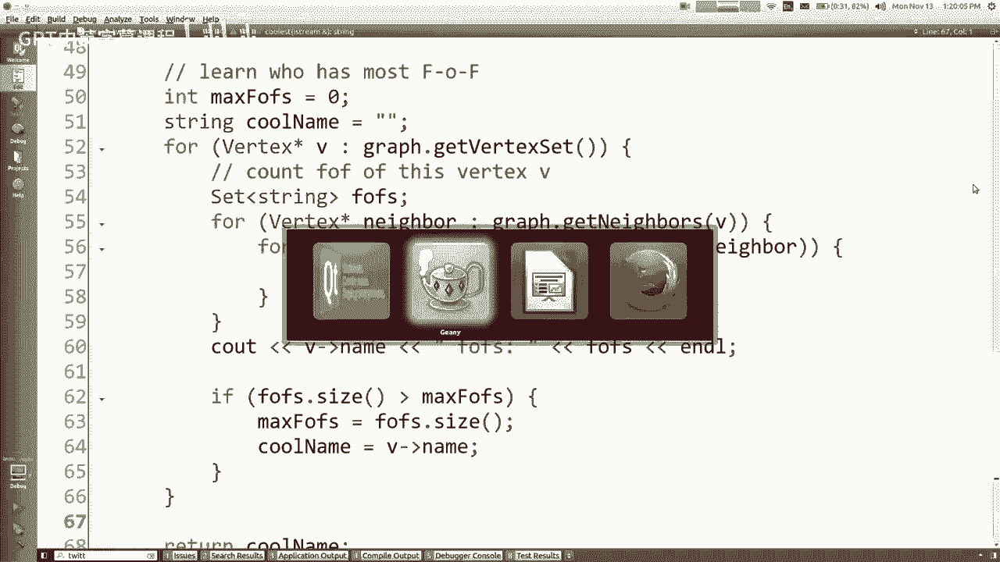

# 【编程抽象方法 cs106x 2017】斯坦福—中英字幕 - P19：Lecture 19 - Graph 1, DFS - 加加zero - BV1By411h75g

我上周不在，我告诉艾米取消所有的讲座，你们上周什么都没学到，对不对，我什么都没学到，好啦，我要教你们一个叫做二叉树的东西，上周我有一个重要的商务会议要去，我开玩笑的，其实呢，我去了夏威夷，是啊，是啊。

我妻子怀孕了，所以就像我们最后一次旅行一样，这只是我们两个喜欢，可能再也不会了，你知道的，原来如此，真的很酷，真的很有趣很浪漫，我本来想给你看一些照片，但我没时间带他们来，我星期三带来。

但整个旅行的亮点是，我们在夏威夷群岛上发现的，有一个猫科动物的庇护所，因为我猜夏威夷有很多猫科动物，因为没有很多掠食者，这个疯狂的猫女就像围捕一样，像一千只猫，就像把它们放在钢笔里一样，你可以去抚摸。

他们所有人和我妻子都喜欢她听说存在的那一刻，她说我们明天就去，所以我们花了一整天的时间抚摸一千只猫，她能回大陆真是奇迹，不管怎样，真的，所以这就是我一直在做的，我知道你们一直在为跳过列表和二叉树而苦恼。

还有各种好玩的东西，本周我们将学习一个叫做图的新集合，我觉得图表很酷，他们是，它们是，到目前为止，我们看到的许多想法，在我们了解到的许多其他结构中，所以你知道我就开门见山了，我猜。

这周末我会给你们布置家庭作业，它将是关于图表的，只是为了跟踪我们的日程安排，让我指出几件事，上周五你们布置了第六份家庭作业，那是现在，你可以看看那个，又是一个短的，你只有一个星期，只有两部分。

但你有一个星期，这个星期五你们要做关于图表的家庭作业，下一周就是感恩节了，我知道给你一个任务有点糟糕，就在感恩节之前，只是想说清楚，我并不特别期望你会在休息时间研究它，我希望你和你的家人玩得开心。

或者你想做的任何事，嗯，到期的任务，就要到期了，感恩节假期后的胜利之夜，所以我没意见，如果你想完全忽略它，直到我们回来，你会在那里呆上三四天，你一度假回来就可以看，那很好，或者你想看这里或者这里。

那很好，也是，由你决定，我们总是有迟到的时候，所以你可以决定如何预算你的时间，休息之后会有第八个也是最后一个任务，这将在最后一个周末到期，以此类推，所以我们装了更多的东西，但这是未来的路线图，好啦。

所以说。

让我们谈谈图表，所以让我打开今天的幻灯片，这来自课本的第十八章，如果你想一起读的话，那么什么是图表呢，嗯，我的意思是你们可能认为一个图就像一个笛卡尔，你知道x y类的图形，那不是计算机科学家所认为的。

当你说图形这个词的时候，计算机科学图是一种数据结构，它包含两个主要组成部分，它包含一组顶点，这些顶点有时被称为节点，它还包含一组顶点之间的连接，他们称之为边，所以当我说一组顶点在一组边中，我的意思是。

就像你知道他们都是不同的，它们在某些方面都是独一无二的，就像从B到C有一条边，所以这是一件独特的事情，有时有些图在b和c之间有多条边，但每一个边缘都有自己的身份什么的，视情况而定，你在看什么书。

或者你在看什么术语，有人称之为顶点和边，那是我见得最多的，这就是我要提到的，一些人称之为节点和弧线，或者其他事情，但不管怎样，就像我有时想的那样，如果你翻阅这本书，您可能会看到节点这个词出现得很多。

但他们说的是顶点，当他们这么说的时候，这里有一个图表的例子，现在我为什么要这样的东西，或者我为什么要关心这个，嗯，这种类型的结构对于建模非常有用，计算机科学中的许多问题。

所以我想我的下一张幻灯片有一些例子，就像，如果你有社交网络，像脸书或推特，你可以让人们或用户，顶点在图中，和朋友或互相追随的人，就像两个顶点之间的边，你可以举个例子，我用了很多像旅行和地图。

就像城市间的航班，你知道，我刚坐上飞机回来，从毛伊岛到旧金山，你知道你可以在这些城市之间画出边缘，那是航班往返的地方，你知道你可以做各种各样的事情，你甚至可以做一些看起来不是很多人想到空间的事情，就像。

我只是说像地图什么的，但这可能是一门课程的先决条件，或者说每个航向都是一个顶点，你很有优势，如果这两个力之间有一个先决条件的关系，或者类似的东西，然后我现在写了家谱，你可能会说等等，家谱不是图表。

那是一棵树，上面写着，这叫做家谱，不是家谱，但是是的，让我来，我会回来的，我是说树和图之间有相似之处，是啊，是啊，所以所有的东西都可以用这个结构建模，我会告诉你，你知道我们要在图表上花一周的时间。

我们将了解他们的许多情况，但我只想告诉你，有一吨的东西，你可以学习图形，你可以花一辈子的时间研究它们，你可以在他们身上获得博士学位，并对他们进行研究，然后呢，一群聪明人，一堆关于图的好算法。

我们将学习其中的一些算法，关于图形的一个很酷的事情是，你开始看到计算机科学中许多想法的普遍性，当你试图解决某个问题时，如果你能想出一种方法把你的问题看作是一个图形问题。

或者将您的数据转换为可以存储为图形的表单，然后你就可以接触到所有这些聪明的人所做的漂亮的图形算法，你可以在你的问题上运行这些算法，然后你就会发现，啊，那是送你去度假的最便宜的航班，或者哦。

那是你二表妹的第四个室友是那个人，或者任何你能做的，你可以凯文·培根和这个人在这部电影里，哦，那个人的熏肉数是四，啊，那是个图形问题，你可以解决所有这些有趣的问题，如果你了解图形，这是个好主意。

不管怎样，这就是我们将要学习的，这就是这里的大局，所以我确实认为，思考一些我们以前已经思考过的事情是很有趣的，以及如何将它们建模为图表，所以我不知道，如果你想逃离一个迷宫，你可以想到像个别的地点。

在迷宫中作为顶点，你可以把这里想象成顶点之间的一条边，如果你被允许从那个地方到另一个地方，所以首先在这些相邻的正方形之间会有一条边，但是从这里到这里，因为有一堵墙挡住了，你不能从这里走到这里。

像这样的事情现在又来了，为什么你要把迷宫想象成一个图表，嗯，因为有很多很好的图算法已经很好地定义了，在维基百科或者你的书里，或者别的什么，在那里你可以说，我在这里，我想去这里，我如何运行这个算法。

我会得到答案，我已经这么做了，那是件好事，你也知道我们谈过拼字游戏，你可以把切换想象成一个图表，你知道看起来不像，就像一个网格，或者二维数组之类的东西，但实际上你可以把它想象成一个图表，就像字母是顶点。

两者之间有一个边缘，如果他们是邻居，如果有一个，如果你的单词搜索可以从这里到这里，或者从这里到这里，但是从这里跳到那里是不可能的，所以再一次，就像你可能在网格中寻找某些路径。

即使它看起来真的不是一个图表，把它看作是一个，好啦，所以让我们来谈谈一些术语，就像我要用术语来刺激你一样，在这里有点快，当你浏览图表时，很多时候你对寻找路径感兴趣，比如我怎么从这里到那里。

路径被形式化地指定为一系列的边或一系列的顶点，如果你喜欢，把你从一个地方带到另一个地方，隐式地表示路径中的每个相邻对之间都有边，如果我想从b到z，我可以去做XZ，或者我可以去WY XE，或任何其他路径。

这些都是有效的，我们有不同长度的不同属性，有多少，它们包含多少个顶点，但它们都是从一个地方到另一个地方的小路，对呀，嗯，这些字母是顶点名，这些小写字母只是边缘的名字，所以我们讨论了路径的长度。

我们还将讨论相邻的顶点，就像你或邻居，或者它们相邻，或者类似的东西，所以很多时候，如果你有一个图表，你说你有一个图形算法，你会为我的每一个邻居说好话的，我想做这个或那个，那就意味着，如果我在这里。

我的每个邻居都会，哎呀哎呀，当它试图动画时发生了什么，坚果，Linux不喜欢它，嗯好吧，所以就有了这样一个概念，即它是否可以到达，一个顶点是否可以从另一个顶点到达，这意味着如果你从一个顶点开始。

有没有什么路径能让你到达另一个顶点，所以我想，在这个例子中，每个顶点都可以从其他顶点到达，因为它们都是由边缘连接在一起的，事实上，如果每个顶点都能到达其他顶点，我们称之为连通图，所以这个是这个没有连接。

因为这三个够不着这两个，反之亦然，一个完整的图就像每个顶点都有一条到其他顶点的边，不是很常见，但有时会发生，这就像如果你有一家航空公司，他们在每对城市之间飞行，他们飞往大多数航空公司不这样做。

所以你知道他们不会有一个完整的图表，对呀，有循环也有循环，基本上，我们的道路回到他们开始的地方，所以一个循环就像你从x开始，你四处移动一段时间，你最终回到X，通常，这里的定义会说不允许重用边。

所以你不能像x w x那样用边缘，E两次，我们可以说一旦你在这条路上用了一条边，你为了那条路已经把它用完了，你知道的，所以有时候你在寻找，这个图有循环吗？一些算法，只处理没有循环的图，或者有些图。

有些算法对图中是否存在循环是特别的，所以我们说的是一个图，循环或无环，它有循环吗，实际上，你可以编写代码，查看一个图，会发现一个图形是循环的还是asic的，你能想出来的，你知道的，和一个循环。

循环是当顶点本身有边的时候，我想你知道，当我做这个讲座的时候，很多学生都喜欢，等等什么，你为什么要那样，我觉得问题是，如果你在想一个空间类比，就像这些是航空公司的航班，那就像一架飞机在旧金山起飞。

然后旋转，在旧金山着陆，那有点蠢，好像你不会，你不会买那班机的机票，除非你真的很喜欢那些椒盐卷饼，或者他们吃了饼干，现在这些都很好，但你可以在贸易商买一包，乔的什么的，存点钱，所以是的，你不会自己飞的。

在那样的模型里，但就像有一些图形的例子，它可能是，能够有自己的优势可能是有意义的，就像有时在一个消息程序上，你可以把自己加为好友，给自己发信息，它允许您出于测试目的这样做，所以这就像是一个自我边缘。

或者类似的东西什么的，有很多例子，你可能允许或不允许，但实际上很多图表都不允许，如果你试图在同一顶点之间添加一条边，它会，它将禁止，好啦，所以这些是循环和循环，让我们来谈谈图的一些变体，一些不同的属性。

图可以有也可以没有，有些图叫做加权图，绘制图形的方法是，当边缘有某种数量或成本或重量时，现在呢，重量意味着什么，嗯，它可能意味着任何事情，这取决于什么数据是正确的，所以在这个例子中，这是一堆机场。

我认为这里的数字应该表示这些城市之间的里程数，我不知道，我不记得我从哪里得到这些涂鸦，所以我不记得这是否准确了，也许有人在这里编造了数字，但是嗯，里程数，从这里到那里要飞多少英里，好吧好吧。

有些图有权重，有些人不是你可以想象的那样，如果你想把事情简单化，你可以把它想象成，如果一个图表没有任何权重，你可以把它想象成他们都有一个重量，但它们都一样重，所以一个人的体重和其他人没有区别。

有些人把它定义为一的重量，或者都是零的重量之类的，但不管怎样，很多时候，但并不总是图表要求权重是非负的，当然如果你想举个例子，像航空公司，你不能飞负英里，除非你喜欢颠倒和奇怪的东西什么的。

也许那里的航班是负英里，我不知道，但像你一样，从一个城市到另一个城市，你必须飞行非负英里数，有些图允许负权，我想不出一个图表的例子，它就会这样，但有些人这样做了，是啊，是啊，我是说这个例子的权重是英里。

你能想到其他，如果是航班，你能想到任何其他东西可能像重量，什么对不起，什么耶，只是货币成本，如果你想买张从这里到那里的机票，也许这趟飞机要花你两百块，也许这次飞行会花你一百块钱。

所以我的意思是我含蓄地认为，你可能会储存重量的原因，你可能在寻找一条低权重的道路，我想要，如果，如果，如果边缘是，呃，货币成本，我要从这里到那里最便宜的机票，对或者如果是里程，也许我想要最低的里程数。

也许有很多关于飞行的东西，就像周围的一切，像这样去迈阿密，但也许这很荒谬，因为我得跳十下或者十下，你知道的，在中间机场停留以到达我想去的地方，也许我不想那么做，取决于重量是多少。

你可能在优化一件事而不是另一件事，你呀，好啦，所以这是一个加权图，到目前为止，关于这些东西有什么问题吗，主要是概念，术语，很简单的东西，对呀，有些图是我们所说的有向图，有向图意味着边只往一个方向走。

所以这里的这幅画，我的意思是，通常我们把它画成小箭头，所以像a一样，边变成b，但它只能这样传播，你想从A到A，那样做并没有什么好处，所以你不能走那条路，但我的意思是，有时你可以做到这一点。

但你只需要走一条不同的路，就像也许你可以去b d c a，你可以得到一个，也许但不是直接穿过树篱，这可能更适用于飞机飞行，也许航班真的只是单向飞行，可能会有航班碰巧两者兼而有之。

或者你可以在有向图中有双向的边，只是我们把它看作是两个不同的边缘，他们都是单向的，你可能两者都有，也可能没有，所以我想我认为这里的类比就像，如果你想考虑不同的图的例子，他们什么时候会被指示。

他们什么时候不被指示，我是说我喜欢Facebook和Twitter的例子，就像如果Facebook是你的图表，当你的朋友，Facebook上的某人，它是对等的，你们两个都是朋友，就在那里没有。

我想他们现在有名人，大家可以关注一下，但这基本上只是复制推特，所以如果你通常有一个朋友，你让你们成为朋友，就像两个方向，但在推特上，你知道我可以跟着斯嘉丽，约翰逊什么的，她似乎不想跟我回去。

这就像我们想要的一个单向图，但它是一个有向图，那个例子是对的，当然，这些东西可以混合匹配，您可以有一个加权有向图或一个未加权有向图，所有这些东西都可以组合使用，对吧，所以我之前提到过。

你可能有一些课程是先决条件，也许前置词被表示为右边的边，所以你有一个零六个A，你有一个零六个b，你在他们之间有边缘什么的，所以我认为这是一个有趣的例子，我想我没有幻灯片，我要等吗，让我看看这个真正的快。

我有斯坦福球场的幻灯片吗，我想我不好，如果你把斯坦福的课程画成一个图表。

让我弹出这个记事本程序。

只是为了让我得到一个白色的背景，所以如果你喜欢，你知道cs1 0 6 a，然后你有像CS，1，0，6，B或X或其他什么，我想很多人都想做的是，他们还好吗，那是个顶点，然后在1 0 6 a之后。

你可以拿一个零六个b，所以他们就像这样抽出来，似乎很简单，就像你走那条路，你拿一个然后你去那里，但我想指出的是，有时方向，有时候你得换个角度想想，你可能想把它储存起来。

就像从一个类指向它所依赖的所有东西一样，现在你可能会说好吧，有什么区别，这真的有关系吗，你为什么要那样，我觉得事情就像，有时上完课，突然间你可以上87节课，现在所有的箭都射了出来，到处都是，这有点乱。

但通常一个给定的类最多有两三个直接预言者，所以这可能会让你的图表更清晰一点，你明白我的意思吗，好像我不知道，我不知道斯坦福到底是怎么回事，但也许在一个，你可以拿一大堆东西，之后呢，喔喔。

就像一只触手怪物，但是嗯，但如果我们能简单点，我们阻止它，离开这里，每当我画得太左，我整个电脑都搞混了，就是这样，我要把这一切都烧掉，好啦，对不起，不管怎样，对不起，有时按另一个顺序做边缘是有意义的。

所以我想我的总体建议是，我看到学生，也许对图形的空间化思考，他们认为图表就像我站在这里，如果我走到那个边缘，我要走过去，否则我就飞过去，这有时完全是图表的意思。

但有时不是这样所以你只想想想顶点到底是什么，到底边缘是什么，为什么我想要边缘，我要怎么处理边缘等等，因为你想从这张图中得到的，想一想，你为什么想要这个图表，我们到底在做什么，我是说这是我编造的。

但就像为什么，为什么我们会有这口井，我可能用它来检查，无论你是否被允许报名上课，我是说我知道斯坦福很奇怪，他们不检查这些东西，你可以报名参加任何，如果你想对，但想象一下，我们在一所关心先决条件的大学。

所以你想报名参加一个零，六b和x，所以如果我在写我的计算机程序，我走到那个顶点，我走得很好，我被允许上这门课还是不好，我可能想走着去所有的先决条件，就像如果有一个数学预科，如果有其他的先决条件。

想去看看那些，看看你是否拿对了，就像我在乎什么，如果在B和X之后，你可以做这四件事，我不在乎，那不是我现在编码的，我不在乎你接下来会拿什么，如果这就是我关心的，也许我真的想翻转图表，所以不管怎样。

这取决于你做对了什么，所以是的，预科和课程有向图形方向。

在那里做事情，对呀，所以好吧，我之前提到过家谱有点像图表，但它当然叫树，那口井是怎么回事？链表和树都是图，它们都被小心地限制着，图的子集，二叉树是有向的图，它是无环的。

因为如果你有一个指向根的指针或一些不正确的东西，你知道你不能指着一棵树，所以它是针对像，有一些其他的限制，就像你可以有一个外在的，我们称之为度，你有多少条边，或者在你的顶点之外。

所以你最多可以有一个向内的程度，有人指着你，你最多可以有两个向外的程度，只有一种方法可以到达每个节点，就像那边那个家伙没有优势一样，或者类似的东西，其他一些小限制，但这基本上就是二叉树，它是一个图。

链表也是一个图，更多的限制，你只能有一个非常接近的程度，所以是的，这些都是专业，把一些东西放在一起，马马虎虎，当然你想的是，哎呦，妈的，妈的，这意味着我还没有完成指针和递归，然而，我是不是，你是对的。

是啊，是啊，图是很多关于图的算法都是递归的，因为你说好，我在一个顶点，所以这样做，然后递归地对我的邻居也这样做，也从那里搜索，很多节点和边是事物之间的指针，所以这些算法看起来有点像树算法。

就像你上周学的那样，和助教一起给客座演讲，所以这很酷，嗯，现在我想给你看，我们斯坦福图书馆有一门课，这是一个你可以使用的图表，我想玩一两分钟，只是想看看它是怎么工作的，那么我只是我想这将表明我们喜欢。

哎呦，你可以用这个解决一些问题，这是一个有用的对象，这周晚些时候我们将学习，喜欢好，它是如何工作的，怎么样怎么样，如何实现图形，你知道，我会先教你怎么用，所以在我们的库中有一个类叫做基本图。

如果你声明一个基本图，你知道你把大多数收藏放在支架上，比如它是什么类型的图形，还是一个，它是字符串的向量吗，或者是哈希，事件集，或者别的什么，有一个基本图，您不必在括号中指定任何类型，因为。

存储的数据类型类似于顶点和边，顶点通常由字符串表示，哪些是它们的名字，边缘也可以有名字，如果你想让他们，所以如果你做一个基本图，它开始时没有任何顶点或边缘，但是你可以添加顶点，然后在你编辑完顶点之后。

你可以在它们之间添加边，它是一个有向加权图，所以如果你给它加一个边，它只是从A指向C，只有一个方向，是啊，是啊，你为什么要把它喝了，啊，我为什么不用指针，这里有一些指针，我一会儿就给你看。

但基本上我认为这家伙的目标是，这样你就可以避免指针，除非你需要他们，我觉得说好更容易，这些都是城市，所以我要做一个叫迈阿密的顶点，然后我想问迈阿密附近的所有城市，与这个恒星变量指针相反，东西。

我有它只是，这有点像，里面有指针，我会告诉你如何走进去看他们，但主要是这家伙在管理，就像我说的加顶点，它进去做一些小指针，把里面的东西给你，你以后可以和它说话，如果你想，所以说，当我们谈论图形时。

看起来不像，任何一个顶点都被认为是彼此不同的，在某种程度上，当我们查看图的示例树时，我们必须称之为左边的顶点之一，其中一个你必须找到合适的，图表上有什么术语吗，我们给连接不同事物的不同边缘贴上标签。

是啊，是啊，是啊，是啊，我稍微重复一下，录像上说你问的是，如果一个图被用来表示一棵树，我如何记住或跟踪，就像，这个是根，这个是左边还是右边，我想说实际上，我不知道，我不打算这样编码。

我不打算用图给树编码，我只想让你看到，从概念上讲，树根据定义是所有图的集合的子集，所以我们可以学到的一些关于图的东西也适用于树，反之亦然，但是是的，就像我认为实际上，如果我们知道我们在处理一个二叉树。

我们应该编写更有针对性的代码，而不是试图写一个brack算法，它恰好运行在一个二进制的东西上，你知道大多数时候，如果我们知道我们在处理一个链表，让我们编写链表代码，但有趣的是，链表是图，例如。

我给你们看这张幻灯片的主要原因是，部分像，哎呦，这里有一些更大的主题，也有一部分像，哎呦，如果有什么，我们证明了这对所有的图都是正确的，然后我们就知道这也适用于所有的二叉树和链接。

或者如果我们想出一些很棒的算法，对图表做一些事情，理论上，该算法应该可以在树或链表上运行，所以它更多的是一个概念理论的观点，无论如何，那是一个基本图表，您可以包括基本图H，下面是基本图的一些方法。

我是说，这是不言自明的，就像你可以添加顶点和边，你可以把它们都移除，你可以要求所有的边缘并在上面循环，我想这返回了一组边缘，你可以要求，给定顶点的邻居是谁，你可以通过这个顶点的边直接到达的顶点是谁。

你可以，还有很多其他的事情，这两个是邻居吗，等等，你可以把图表打印出来，它会打印所有的顶点和东西，嗯，所以就有了，这是你一分钟前谈论指针的另一件事，所以从技术上讲，当你添加一个顶点，当你说顶点，字母C。

从技术上讲，它应该在里面，它使这个叫做顶点的小结构，顶点结构保留了关于顶点的内部信息，如果你想访问那东西，你可以说得到顶点c，所以你传递顶点的名字，然后返回这个指针，这种结构有它的名字。

它还有一组从那里出来的所有向外的边缘，里面还有其他几个成员，所以就像，如果您想将这些顶点作为指针进行对话，您可以，但是当你把它们加起来的时候，您可以使用名称的字符串添加它们，所以说。

但为什么它像一个评估是你为什么，啊，为什么这是哈希集，是啊，是啊，我相信，因为如果你把它做成一套，它根据邻居的名字对它们进行排序，那样，当你为他们每个人，你会让邻居按字母顺序，我觉得图书馆的设计者。

部分是我，部分是埃里克罗伯茨决定，这将是很好的，如果它按abc顺序移动，所以这就是为什么，是啊，是啊，然后你也可以给出一个表示边缘的对象，所以你说，我想把边从a到c，我想得到那个边缘的破坏性信息。

在那里有一个指针指向它开始的顶点，指向顶点的指针以，还有其他一些事情，事实上，我认为有一个，这里有一块田，我也许应该列出，这里有一个双倍的重量，所以如果你想把边缘设置成一个重量。

你可以拿着这个把重量放进去，一点点指针，图表中的内容，我们不会马上使用，但那以后会有用的，好啦，我想问你们一个小问题，我提到过社交网络可以是图表，所以想象一下我有一个满是Twitter的文件，遵循关系。

每行包含两个字符串，两个单词，每个单词代表Twitter上的用户名，所以如果它说名字一名字二意思是名字一跟着名字二，所以我想知道谁是整个档案中最酷的人，我选了一个非常特别的酷的定义，因为我老了。

所以我真的不知道什么是酷了，所以我把酷定义为拥有最多追随者的人，如果你有四个朋友，但那四个朋友有一百个朋友，那么你的冷却等级是100，所以我想看到你是最酷的点，好吧，我想用一个基本的图表来做。

在基本图中，边是无向的，边缘是有方向的，是啊，是啊，所以如果你从a到b加一条边，它只走那条路，还有推特，这应该是推特，Twitter确实有一个定向跟踪模型，如果是脸书，我想要一个双向的。

我不是真的这么说，但是如果你，如果你想要双向边缘，或者喜欢两种方式，你可以添加边缘VC和C，所以这基本上给了你一个双向的优势，基本上。

所以让我们使用基本图，我这里有一个可爱的创作者项目。

嗯，我不知道已经一个星期了，我不知道我是否还记得如何编码E、C、Plus，什么是溪流，是做比特还是字节的，哦不，那是霍夫曼的事，没关系嗯所以是的，我要打开一个文件，我要运行最酷，我要看看谁是最酷的人。

我要把它打印出来，所以我们要写这个最酷的东西，所以你看，困难的部分我来做，我想我需要一个基本的图形命名为图形，好啦，现在什么现在记得，记住这个文件的每一行都是这样的，它有几个名字，斯图尔特跟随马蒂。

海伦跟随埃尔默等，所以记住我想，我想知道谁的追随者最多，也许你能帮我看一下这张图表，什么是顶点，什么是边，好啦，顶点是人，用户，是啊，是啊，好的当然，所以我想我可以做一些，我也有份，所以让我们做弦乐。

说出一个，然后说出两个，当我能够从输入中读取，一个名字和一个要做的名字，你知道你可以用这种语法，当我能从输入中读出两个单词时，那么我想你的意思是，你想让我把这两个人都加到图表里，所以图点顺便加顶点。

我只想指出当你开始像点一样打字时，添加库具有，你可以称之为顶点或，或者你可以叫它安卓，弧线，我不能，埃里克罗伯森，我对如何称呼他意见不一，我很坚决，就像顶点说的埃里克罗伯茨就像显然不，这是一个弧线。

所以我就像，哦，你把你的动物两个两个地带走了吗，无人注意的方舟之类的，反正每个人，所以呃呃不，埃里克比我聪明，比我有更多的权力，所以他得到了他的节点和弧线，但他同意让我也加上一个叫顶点和边的。

所以我要用这些顶点的名字1，呃，别告诉他，我加了这些方法，我就把这段视频给烧了，把这两个顶点，然后你说边缘就像下面的关系，所以你想让我像图形点一样，加边名一名二，名字一跟着名字二，并确保它是。

搜查令什么意思，也许是在我们关心的事情上，谁有最多的追随者或追随者，所以我们希望能够很快地告诉你他们的追随者是谁，所以也许我们想从某人指向他们的追随者，好的，好的，是啊，是啊，所以呃，我想他有所发现。

他说，就像我又想给你画一幅蹩脚的画一样，刀疤乔来了，斯佳丽·约翰逊，然后就像你知道的，我跟着她，也许是假设，我只是喜欢黑寡妇电影，仅此而已，也许我后面跟着RTA，艾米，我不认为她在推特上关注我。

我不够酷，但是，如果我有兴趣了解更多关于Scarjo，她有多少追随者，你知道你可能会说，艾米跟着马蒂，所以这是一个优势，然后马蒂跟着斯卡约，所以这是一个优势，但我真的要看着斯卡乔，试图向跟随她的她学习。

然后是谁跟踪那些人，所以我想你可能是对的，也许我想做的是，也许我想指出谁是Scarjo，然后是，马蒂是谁？尽管这与我们对社交网络的概念不符，我们只是用这个图表来回答这个特殊的问题。

所以也许我应该倒转边缘，实际上你可以这样做，我想我想你是对的，说出两个名字说出一个名字，你知道一个优势，从名字二到名字一，这是刀疤乔给马蒂的，如果这让人困惑，然后你可能想在这里加一个评论。

就像你知道它从一个人到跟随他们的人，或者类似的东西，这就是边缘的作用，或者你甚至可以把它重命名为喜欢后面跟着，或者类似的描述性的东西，好的，好的，所以加上这些顶点和边，我忘了图表是做什么的。

如果那个顶点已经在那里了，你试着再加一次，所以我们会看到一些骗局，比如a跟b，a跟c，所以我不会忘记如果它抛出错误，如果你加上不，让我看看它是做什么的，如果它已经在那里，只是顶点已经存在。

所以把它还回去吧，好吧那就，它只是默默地什么也不做，如果我们尝试添加等待，所以他们为什么要先说出一秒钟的名字，或者喜欢相反的，我只是为了这个才这么做的，所以斯卡约被命名为二号，我是第一个。

所以我只想让边缘往那边走，如果你想，如果我们把它调包，然后，我想它将在一分钟内，当我们写剩下的代码，我觉得从斯卡乔身上看出来，谁跟着她，所以这就是为什么我想我们要这样，好吧，现在在这一点上。

我想我们会让所有的人，我可以看看图表，看看它是否有效，是啊，是啊，我是说，有点难读，但就像这里是所有的顶点，然后像唐纳德一样，唐纳德后面跟着马龙，是真的吗？这一切都随之而来，上面应该写着梅龙，是啊。

是啊，唐老鸭后面跟着我，好啦，我想它起作用了，所以嗯酷，我们现在有一张图表，我们要知道谁的追随者最多，所以这部分就像读，文件成图形，然后就像知道是谁，我想我该怎么做，我知道你只是在学习这个图书馆。

但也许你可以从概念上描述一下我需要做什么，避免了追随者的重复，您可以为每个追随者做，嗯，我明白你明白，你先把图中所有的，为了找到面具，好啦，仔细观察每一个人的想法，我查看每个相邻节点的内部，如果你加上。

如果将每个相邻的相邻节点添加到一个集合中，并且，如果集合的大小大于最大值，它是最大的，最后你没事了，知道了知道了，所以里面有些东西，让我把它打开一点，所以这是一个最大化问题，所以任何最大化问题。

你对每一件事都说，计算出它的价值，如果这是我见过的最多的，那就记住那件事，然后在最后返回最多的，我曾经如此，最大化问题相当简单，但是我如何计算这些人的数字，你也描述了，你说过如果我看着刀疤乔。

也许我会留意她的追随者我也会留意他们的追随者，我想召集所有的人，我不想要复制品，所以也许我把它们都扔在一套里，在我做完这些之后，我看到有多少名字在集合中，告诉我这个人有多少，是啊，是啊。

所以像这样的东西，我觉得，V在图点中得到顶点集，这样它就不会在字符串上循环，顶点名称，它是在这些小指针上循环的吗，如果你想知道顶点的名字，你可以说出名字，这是每个人的名字，或者别的什么。

所以对于每个人来说，我想把所有跟踪那个人的人都查一遍，所以要让跟踪一个人的人，那些是有边缘的，也是，对呀，所以要让那些，有优势的人，你说，图点获取邻居，V那是一群人，然后我想对每个顶点，邻居在那里。

所以现在我循环，邻居是像这样的人，在本例中，就像斯卡乔是V，然后邻居就像马蒂，在这个例子中，现在我想让马蒂的追随者，所以我想再去一次，我想我在这里做的是我想，我想把这个顶点，五，所以也许我要做的是。

我会把一串像这样的东西弄空，然后对于每个邻居，那个邻居有一群追随者，就像图中的每个顶点，找邻居的邻居，对呀，FS点添加名称右，这有道理吗，V是斯卡乔，邻居就是我，任何蠢到跟踪我的人。

然后那个人的名字把他们放在一组，把他们都召集起来，集的大小是您有多少fps，是的问题，你怎么谈论时间，它也许是无穷无尽的大小，哦耶，这是个好问题，就像大O对吧，因为我在努力推销，这都是有联系的。

那么课程中的那个主题呢，我要来了，可能是星期三，我是说你不再谈论N了，他们是大O在图表中仍然很重要，你还在说大O，但你有你的顶点，你有你的优势，所以有时你说这是V的大O，你的脊椎数量。

或者这是v乘以e的大o，因为它不仅与你有多少顶点有关，但是顶点有多少邻居，会显示这个循环会走多远，所以是的，你会在一个像v的图上有一个算法，平方log e，或者类似的东西，所以这两个都有点像结尾。

是大O表达式的一部分，我认为这实际上是一个有趣的例子，因为，嗯，你知道吗，你总是习惯于说大O是后面跟着N的东西，但并不是每个问题都有一个单独的变量，它与，这就是一个很好的例子，嗯，反正。

所以我这里有一些FS，那么fs点的大小就是这个人有多少fs，所以说，我想我想要的是，我想要整数最大值s等于零，字符串酷名称等于空，就像我需要记住，谁是迄今为止我见过的最酷的人？

所以如果off的大小大于max，泡芙，对了，这就是你说的最大化部分，那么最大fs等于fs大小，然后很酷的名字是这个人的名字，是V的名字，对呀，然后当我做完，我再也不用看图表了，我会把酷人的名字还给你。

差不多吧，让我们试试，最酷的人是唐纳德，嗯，我知道推特上有个唐纳德，他有很多追随者，但这不是我的计划，嗯，他很酷吗，我不知道是唐纳德，最酷的，我想我不知道，这个很难查，因为它是追随者的追随者。

所以实际上等等，只有梅龙跟着唐纳德，对呀，等等，是这样吗，没有两个人跌倒，两个人跟着，斯图尔特跟着马龙，马蒂跟着马龙，那么，这难道不意味着，唐纳德有两个FS，是这样吗，这似乎不对，我们搞砸了吗。

一直期待着，这里，我告诉你吧，我可以告诉你什么是印刷好，好吧，让我确定我觉得这是不对的，看出去，FA手柄，所以呢，我要在这里得到一堆类似foy的打印件，是这样吗，我认识马龙，例如，是啊，是啊，马蒂。

上面写着秋天在哪里，我想你不算，邻居不会看到的，我以前做过这个例子，我认为正确的答案是玛拉，因为我以为我喜欢，我总是喜欢让他成为最好的一个，因为他同意我加薪，所以我想每个人都很棒，他有很多很酷的地方。

嗯，我是说他有，他是，但我以为他有三个，我以为数据集会让他自由，我有另一份档案，我还有一些其他的输入文件，如果我看不到，我不知道这是不是错的，但我认为这对吗，让我们来看看有多少美元，是啊，是啊。

我是马蒂，所以马蒂，马蒂，原来如此，所以这是没有欺骗，那又怎样，所以这是斯图尔特追随米隆的一个想法，然后马蒂跟着我，然后呢，好啦，里德跟着斯图尔特怎么样，那小费不是应该，是啊，是啊，所以这应该给。

这个例子的主要目的是，我只是想玩一下这个图书馆，看看你是一个愤世嫉俗的人还是一个实际的人，你可能会说我可以用哈希图或其他东西来解决这个问题，而且是的，当然好，好啦，你可以，但有些问题感觉像图形问题。

一旦你学会了图形，有时候你开始说，哎呦，如果我用图表来表示，我很清楚该怎么做，我去找最近的邻居，废话废话，然后我就完蛋了，就像，它只是工具箱里的另一个工具，这对某些问题很有效，我想这就是其中之一。

但不管怎样，我要继续前进，我认为这看起来像它的工作。

但我想谈谈，我不打算结束这一切，关于寻找路径，我有几件事想谈谈，我想我今天会通过其中一个，我星期三继续，我想再讲一下两种搜索算法，我可能只读到第一本，这叫做深度优先搜索，这里的目标是。

如何在图中找到路径，嗯，这取决于你想做什么，有时候你只想知道，我可以从a地到b地吗，顶点A到顶点B，有时这就是你想要的，他们能联系到吗，其他时候你想要尽可能短的路径，最低跳跃次数是多少。

我认为航空公司的类比很有效，这里，我要直达班机，最短路径，或者你说，我不在乎，如果我必须飞往拉斯维加斯作为中途停留，如果便宜一点的话，我会不停地做那件事，我不愿意付钱，直达航班额外150元。

所以有时你优化重量或成本与路径长度的关系，对呀，所以我认为航空公司是一个很好的例子，所以我想在这个数据中，我不打算看它，但我很确定从迈阿密出发的最短路径，总是与最小成本路径不同。

但因为我认为有一个直接的为什么不，你不可能，如果你先飞到檀香山再飞到旧金山，这是两个跳跃，那是最少的跳跃，但是这比你直接飞到达拉斯要贵得多，然后向右松懈，我想这就是答案，不过，好吧，所以一个算法。

在图中寻找路径的众所周知的算法称为深度，这个想法是你从一个顶点开始，从那里你尽可能深入，看看你能从这里得到什么，如果从这里你能到达目的地，有你的路，所以当我说深，我的意思是你从这里开始然后选择一条路。

你尽你所能，在你放弃尝试另一种方式之前，所以就像看，下面是实际的算法，如果您试图运行dfs，也许这是参数或顶点的函数，顶点二，然后很多这些算法都涉及到将一个顶点标记为被访问，因为你不想陷入一个循环。

你就像回到了你开始的地方，所以标记访问过的顶点，一旦你为每一个未访问的邻居做了这件事，没有标记为访问的，您尝试递归地，从该邻居到目标进行深度优先搜索，如果你找到了目的地，如果没有，你试试下一个邻居。

这看起来像什么，就我们所学到的课程材料而言，这里的代码中有什么样的课程概念，是啊，是啊，这是递归回溯，是呀，因为你对每一个邻居，你选择了那个邻居，你探索，或者你可以从邻居那里得到。

如果它不能让你到达那里，您选择并备份并尝试下一个，完全是递归回溯，我是说你可以在这里看到递归，因为它调用了我的函数，但就像你知道的，寻找一个成功的州的概念，然后如果不成功，尝试另一个。

这在很大程度上是一种回溯算法，在这个算法中你会发现什么，深度优先再搜索，它之所以被称为深度优先搜索，就像你挑了个没人拜访的邻居，我是说，就像回溯，选择一个东西，你探索所有可能跟随这个选择的东西。

你在回来之前探索所有这些并尝试不同的选择对吗，那么这说明了你将要找到的道路，就像，如果你先对这张图进行深度搜索，当我说每一个邻居，假设它按字母顺序发射邻居，你会怎么做，如果从a到f进行搜索。

你应该先试试B，然后你会尝试d，然后你会尝试e，所以如果你先尝试b，那会让你到E，这将使你正确，所以你最终会得到一个B E F，但你不会注意到有一个AE F，算法不会发现。

所以这个算法不能保证找到尽可能短的路径，我要停止，但周三，我将讨论一种不同的算法，称为广度优先搜索，找到最短的路径，从以前的课程材料来看，这也很熟悉。

反正，祝你下午愉快，我们星期三见。

