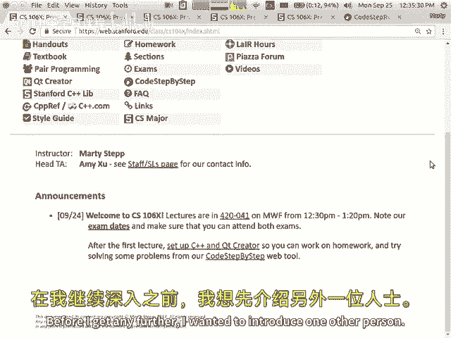
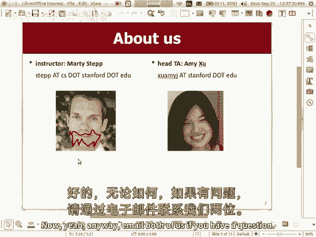
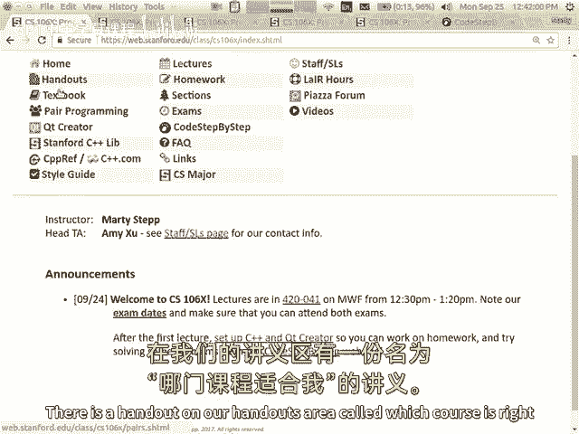
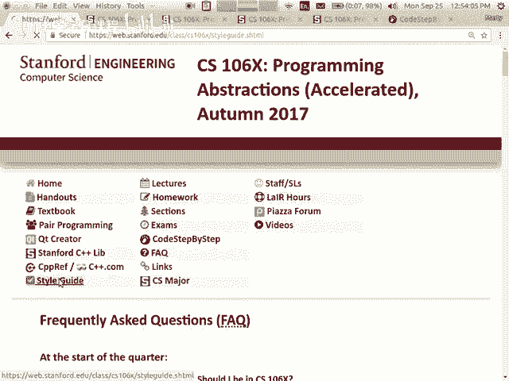
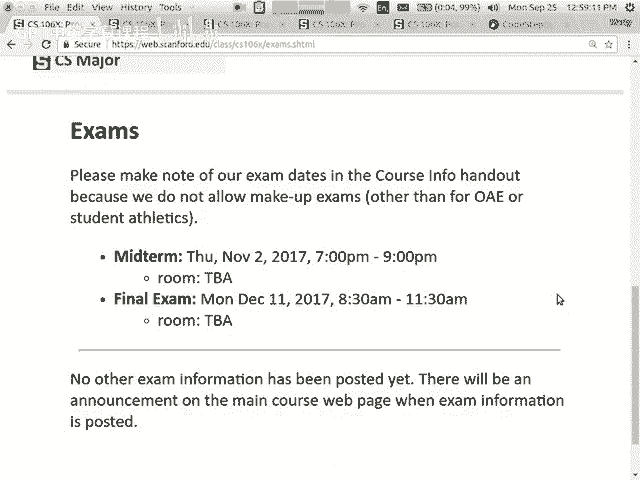
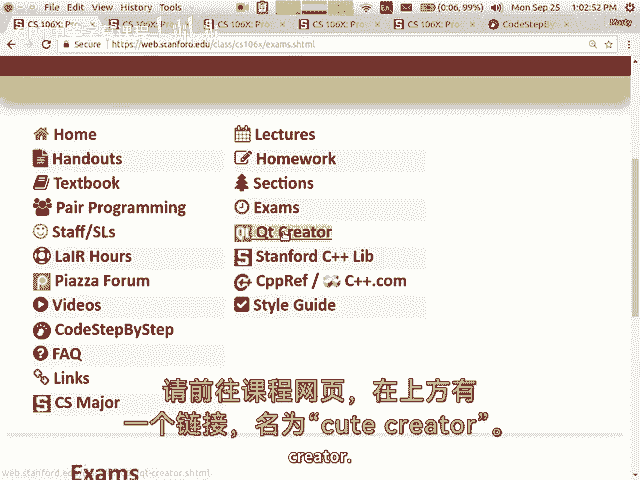
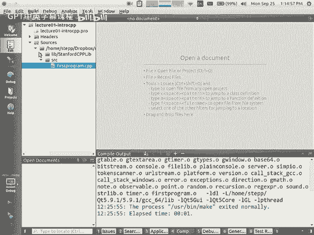
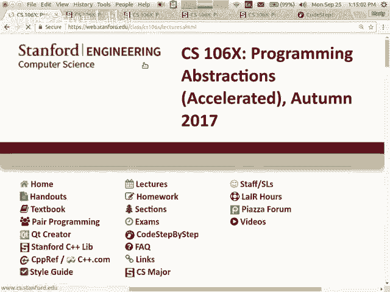
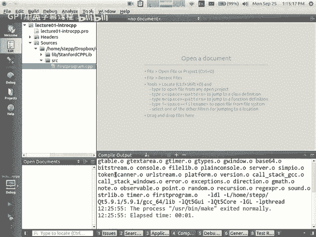

# 【编程抽象方法 cs106x 2017】斯坦福—中英字幕 - P1：Lecture 01 - Introduction - 加加zero - BV1By411h75g

我们在课堂上所做的一切都会被发布在那个网站上，包括人们问我的最常见的问题，除了我是否应该在这个班，你要把讲课录下来吗，答案是我所做的是，我在电脑上运行这个程序，捕捉屏幕上的内容。

它能捕捉到我的电脑麦克风听到的声音，所以这意味着我得到了一个讲座的视频，但这只是一个屏幕，你看不到我美丽的笑脸，你们美丽的笑脸，如果我走到这里，你也听不到我说话，就像视频的这一部分，离麦克风很远。

所以说这个视频的质量很糟糕，但我会给你这些垃圾视频，如果你想要的话，我还是觉得亲自来上课比较好，但你以前做你想做的事，我得到任何进一步，我想介绍另一个人。

我不是一个人在教这门课，这里，我将用我才华横溢的头脑工作。

爸爸，她叫艾米，她坐在前面，我想让她说，嗨很快我的好的，嗨，大家好，我是艾米，我创了职业生涯新高，现在我和我的政治硕士一起在斯坦福工作，我惩罚他去的产品，哦，昨天我会穿黑色，像其他人一样，然后呃。

我没有脑袋，但这六个中的一个很酷的地方，你为什么喜欢一六六不问任何问题，你可能还不知道，但你会有一个很好的问题，而且是的，所以也许呃，问题真的希望他们在，你知道我是个坏警察，她是个好警察。

艾米不仅才华横溢，但也是大学里最好的人之一，所以如果你需要什么，她会帮助你的，如果你有与课程有关的问题，我想现在，正确的做法是发一封写给我们双方的电子邮件，然后我们都会试着回答，这对我们有帮助。

以后把工作分开，你要找这个和你一起工作的部门领导，你也可以问那个人问题，顺便说一下，你喜欢这个吗，我没有一张留胡子的照片，我今年早些时候种的，我刚拿到一张结婚照，我想我能修好它，我想我能修好它。

呃等一下。

呃，哦等等，我不能在这里画画，好啦，等一下等一下，让我试试，现在差不多准确了，是啊，是啊，无论如何，如果你有问题，给我们两个发邮件。

这真的很有帮助，因为我们在季度初收到很多电子邮件。

所以这真的有助于我们分散问题的工作量，祝福你，所以是的，很多人想知道这门课是什么，你到底该不该上这门课，让我们来谈谈计算机科学的三门主要入门课程，我们有一个零六a零六b。

一零六×一零六A是我们的第一堂课，这是为很多观众准备的，这应该是一堂课，那个，任何一个斯坦福大学的学生都应该能够在，有了这些编程变量的基础知识，如果语句，循环，数组，方法参数，这类事情，基本问题解决。

绘制图形，伟大的阶级，趣味课堂，完全没有预科1 0 6 B基本上跟在1 0 6 8后面，它更专注于处理数据和算法，了解可以将数据存储到的集合，像向量、列表、地图、集合、堆栈和队列，您学习了递归算法。

你学会了如何解决棘手的问题，处理充满数据的大文件，嗯你，你在那里学习一种叫做C++的语言，所以是1 0 6，一零六，X就是所有这些，但只是，所以你可以，我这样做是为了强调，你知道的。

um x是六个b中的一个的硬版本，都是和B一样的内容，但我们可能会更深入地探索它，我们可能会在一些主题上更进一步，我们可以在这里和那里添加一些小东西，但是一般来说，这和《一零六》中的内容是一样的。

我想有些人可能对什么有错误的信息，一零六x是，它不是一零六a和b的组合，我听说这不是两个班合二为一，尤其是一些研究生，我听得很清楚，这两个我都要，但我只有四分之一的空闲时间，所以我拿1 0 6 x。

这不是取1-0-6-x的真正理由，你应该拿1 0 6 x，因为你恨你自己，你也会恨我的，我是说，如果你有一点编码经验，你想在此基础上再接再厉，零六b是一个很好的类，它的步伐更，一个。

零六X基本上是你要做他们的家庭作业，加上我加入的其他东西，就因为我心情不好，你的考试会更难，你的曲线会更紧，你会有更多的问题需要解决，更少的时间来解决它们，参与课程的每个人都是好战和脾气暴躁的。

它对你不好，如果这听起来像是你想要的那种经历，你来对地方了，我知道你们比我年轻很多，但是你看过这部电影吗，这是一部古老的电影，叫做《帝国反击战》，有一幕，有几个人看过，伟大伟大嗯，这是一种独立的东西。

一点小纸条，不要，有这个，电影里有个叫卢克的家伙，他去了一个叫阿格巴系统的星球叫达巴，他遇到了一个叫尤达的人，尤达在训练他对抗这些坏人，你知道的，告诉他所有不好的事情，他要面对，卢克很好，我不自由。

尤达去，你会是，这就是零六x的精神，反正，对不起，我有点开玩笑，但我是认真的，这是一门比B更难的课，拿一零六B没有错，如果你想在不被踢屁股的情况下学习这些概念，一零六b是一个很好的方法，我们甚至解决了。

所以16B和这门课是在同一时间提供的，它现在在英伟达礼堂提供，六乙之一的导师是辛西娅·李，谁做得很好，她比我好，她会对你很好的，她会把你教得很好，所以你知道如果你开始取x，它对你来说太快了。

换成B没问题，没关系的，我只是让，你知道的，但就像我会尽我所能挑战你一样，因为，但我的感觉是这就是你报名参加这门课的原因，是你吗，在这所高中或其他课程自学之前，你有大量的编程经验。

或者你已经拥有一家初创公司或其他什么，你有很多这样的经验，你想挑战，所以这就是这门课的精神，好啦，如果你不确定这门课是否适合你，如果你去我们的网站，你去F A Q部分，常见问题部分。

这一页的第一部分谈到了不同的类，我们还有一份讲义，我给你看看这些东西，嗯，在我们的讲义区有一个讲义叫。

哪门课程适合我，所以你可以更详细地阅读，我们的页面中也有这个链接，上面写着FAQ，那一页还谈到了，我应该在1-0-6-X，所以如果你想给我发邮件，和艾米问这个，那很好，但我希望，如果你先看看这些资源。

然后把你的问题发邮件给我们，我们得到的大多数问题都是形式上的，这里有很多关于我的信息，你认为我应该在课堂上还是不应该很多时候，我想这个人可以自己做出一个很好的猜测，如果他们看到这个，但除此之外。

我们很乐意为您提供建议，如果你如果你愿意，好啦，这就是我想说的，现在你对这些课程有什么问题吗，或者他们之间的差异，或者任何一个，是呀，你有没有看到任何历史和优先考虑六个X中的一个申请。

就是拿一个零六个X就像你简历上的徽章一样，可能会帮助你找到实习或工作，或者男朋友女朋友什么的，不是真的，我是说，我认为最美好的事情之一，我爱上计算机科学的原因之一，在很大程度上。

人们根据你所做的和你能做的来评判你，如果你能解决很酷很棘手的问题，如果你已经建立了一些小应用程序或项目，你在课程或空闲时间做了一些整洁的事情，你可以和人们谈论这些，也可以给人们看，人们会想和你谈谈。

想采访你，你呀，想雇你，想和你约会，我就是这样认识我妻子的，我只能说这么多，嗯，所以我，我想说你不需要在这里给别人留下深刻印象，你知道这堂课更多的是关于你自己，想要一种更深更艰难的经历。

因为你在1O6B会很无聊，对你来说太容易了，同样，你可以看看1O6P网站来帮助你解决这个问题，你可以看看我们的网站来帮助你解决这个问题，如果你想看得更详细，但是很多人，你知道的。

六个x中的一个不是必需的，或者是秘密必需的，任何秘密，很酷的俱乐部之类的，所以说，讲义上没有提到的一件事是，今年我们还有其他课程，我们有一门课叫1-0-6-aj，这是一个但它是在JavaScript中。

我不打算在这里多谈这件事，因为我想如果你在这个班，你可能比一零六一个J的材料领先，基本上是一零六，难度等级，但在不同的编程语言中，如果你好奇的话，你可以发邮件给我们，好啦，所以我要继续前进。

我们还有一门课叫做六L之一，那是个实验室，这个季度不提供，所以我今天不想多谈这件事，上面说每年秋天和春天，但实际上是在这个冬春教的，所以这张幻灯片是错的，但是因为这个季度没有。

我不打算长篇大论地谈论这件事，但如果你在这个季度后想要更多的c+，你可能会把这个1-0-6升，那是为了更多的练习而开设的实验课，好啦，我们有一本书，它被称为C++中的编程抽象，另外。

它是由埃里克罗伯茨写的，他是斯坦福大学的教授，你需要买这本书吗，我知道你想知道，因为要花很多钱，你不必买，你不用花钱也能在这门课上得a加分，你想要它的主要原因，你可以在考试中使用它。

所以你可能想在考试中查一些东西，但是测试不允许您使用其他资源，就像你的笔记，您的打印件，你的幻灯片，所以这本书是你可能带来的主要资源，所以你有优势，如果你有一本书，如果你需要查什么，然而。

我带了一些孤独的书，我留在房间的前面，所以如果你没有一本书，有一种方法可以让你看一本书，如果你有电子副本，我不会让你用的，因为我不希望你在考试时把计算设备拿出来，你有一个问题。

我听别人说你考试可以抄小抄，你的问题是，你能给我一份备忘单吗，就像考试的笔记纸，一些教练允许，我不是个好教练，所以我不允许，但你看，我告诉你这听起来很像我，你为什么不让我把我的幻灯片。

你为什么不给我一张备忘单，原因是因为我喜欢问一些和以前考试很相似的问题，我把那些旧试卷给你看，所以你可以好好研究一下然后准备好，如果我让你带一堆笔记进来，你只是要把所有旧考试的答案。

然后我问的问题太简单了，这违背了这门课的精神，我不想在考试中给你惊喜和刁钻，我想挑战你，但我不想给你惊喜，这到底是什么问题，我以前从没见过这个，我不喜欢那样，一点都不酷，所以我想给你大量的练习。

与你真正要解决的问题非常相似的问题，但如果你把他们都带在身边，当你进来的时候，你的武器太多，做不好，即使你不完全理解这个问题，所以我让你把书带来，因为这本书有很多语法之类的东西，在测试的背面。

我给你我的备忘单，我会给你很多语法，我认为你可能需要，希望在这些资源和共享的书籍之间，每个人最终都会，好啦，这就是我喜欢做测试的方式，我知道不是每个人都喜欢，但那是我喜欢的方式，是的。一个问题。

我们通常能有多少本书？有多少本装载机书，好像有六个，他们呆在这里，所以你上来看看，然后你回去，所以是的，如果你上去抓一个，他们会不会跑得太快，是呀，所以他们站在前面，是呀，所以无论如何。

你应该买这本书吗，你知道吗，有一件事我没说，这是一本好书吗，这是一个很好的参考，就像在课程中，很高兴通读这篇文章，帮助你更多地理解材料，但就喜欢而言，你需要吗，会被扣分吗。

或者没有它就不能解决一些家庭作业什么的，答案是否定的，所以我会让你决定，如果你想看的话，课程网站上有这本书的PDF格式，所以你不用买书就可以访问这本书，但同样，您不能将PDF进行测试，我想他不会打印出。

我可以打印PDF吗，你们真的在用这些金块想办法，我可以做一个盲文版本吗？我不要你带散纸，问题是，如果我，如果我真的能有一个完美的政策，我可能会说你可以带这种文件，但是你不能带这种文件，但最终发生的是。

如果有些文件可以，真的很难区分每个人都有什么样的文件，所以这真的是唯一的办法，我真的可以有一个可执行的政策，只是说没有文件，要不然什么纸都可以，我试过另一种方式，如果我让他们把一切，最终发生的是。

我有一个困难爬行，在那里我需要让新的测试很难解决，即使你有每一个旧的测试，所以我不喜欢，这使得我的考试越来越难，另一个问题，是啊，是啊，是啊，是啊，这篇课文和它一样吗，六乙是，和一个零一样的书，6B。

是啊，是啊，关于这一点的其他问题，有一些像这本书的旧版本流传开来，任何版本都可以，这些年他们变化不大，甚至有一个螺旋装订版在复印中心出售，那很好用，所以如果你看到有人用过这个，那很好，也是。

还有一些副本，我想在工程图书馆借阅，如果你想去看一会，好啦，所以我们有家庭作业，我们的成绩大部分来自家庭作业，会有8个编程任务，所以你们每人大约有一周或一周多一点的时间，你要自己做一些作业。

其中一些我会让你和一个搭档一起工作，可选地，你永远不必和搭档一起工作，但如果你想做一些任务，我会让你，对你的程序的评分将基于程序是否正常工作，当我运行它的时候，这就是所谓的功能。

以及它是否以时尚优雅的方式书写，以简洁的语法解决了这个问题，那些是，你知道的，伟大的两个重要部分，一旦我们向你致意，我们给你一个大致的分数，放进这些桶里，这是我们在所有事情中使用的同一种系统。

大多数人都有一个中间的桶，要么勾选减号，这意味着你的解决方案有一些问题，并检查，这意味着它很好，检查加，这意味着它真的很好，这就是我们所要求的一切，基本上还有一些其他的痕迹。

如果它真的真的非常非常可笑的好或真的真的非常糟糕，或者你没有提交，但这些痕迹很少见，你亲自和你的部门领导见面就能拿回你的成绩，他们在你的，你的节目和你谈谈，这叫交互式梯度问题，是啊，是啊，我们谈论风格。

不仅仅是页面上的代码，但也是解决方案本身的优雅，是啊，是啊，当我们接近完成第一个任务时，我会尽量说清楚，也就是星期五，我尽量说得更清楚些，这就是我要找的，就像我教材料一样，我会提到重要的文体方面的事情。

但它是从在你的程序上写评论，使用好的变量名缩进好，一直到识别冗余代码，以某种方式捕捉它，这样您就不必重复冗余代码，想出高效算法，这并不会使计算机用太长的时间来解决这个问题，像这样的事情。

我会很努力的去做，这样作业的规格就能告诉你我想要什么，也许不像子弹清单，但在文件的文本中，我会尽量提到我要找的一切，希望你不会太惊讶，你的分数是，但是你知道，风格往往有点争议，因为功能是如此客观。

你运行程序，它崩溃了，或者它的功能，或者它创造了正确的答案或错误的答案，这是相当明确的，风格更主观，你可能会说我喜欢我的代码，伟大的人可能会说，它是，这件事应该不一样或者应该更好，这可能会导致分歧。

但我想归根结底，就像你写的任何场景一样，现实世界设置中的代码，你会有某种要求你遵循的标准，不管是编码约定，一种编码样式，他们想让你使用的某个库，你可能会对这些决定有所贡献，但最终你必须接受这些选择。

这些决定是客观上正确的，还是仅仅是你的工作场所坚持的，或者别的什么，遵循一套风格准则是很重要的，所以在我们的课堂上，我们很重视这一点，是啊，是啊，你算全额学分，哪一个是完全信用的，基本上检查。

加就是全额学分，像加分或加分这样的事情几乎就像额外的学分，你可能会在一些分配规范上得到少量的额外分数，我们会提到你可以做的事情来获得额外的分数，但通常我们不会提供那么多额外的学分，因为我真的想百分百。

我想有些课上发生的事情，他们有这么多额外的学分，你需要百分之一百三十才能跟上大家，现在你要做这些额外的工作，即使我是个虐待狂，我不喜欢让你做更多的学分来通过或其他什么，所以还有一个问题，是啊，是啊。

你能在什么程度上得到帮助，就像其他同学一样，即使是在个人任务上，他们显然没有把它放在一起，但是问，就像嘿，我刚看到这个，是啊，是啊，你能得到同学的帮助吗，如果你卡住了什么的，我一会儿要谈这个。

我有张幻灯片，就像荣誉守则，什么是允许的，什么是不允许的，和东西，嗯，一般来说，你可以和别人交谈，只要你不给他们你的答案，或者详细地告诉他们，你如何解决这个问题，所以如果你想从概念上谈谈，如果你想谈谈。

嘿嘿，你为什么不看看课堂上的这个例子，你为什么不看看书中的那个例子，你为什么不试试这种一般的策略呢，那种东西完全没问题，你知道的，只要你不分享，基本上他们的答案是相互的，或者你怎么做的所有步骤。

那就没事了，是啊，是啊，如果我们选择在SCM中跟踪我们的代码，或者我们希望使用私有存储库，啊好吧，我有，我会提到的，也喜欢，我不希望你在公共场所张贴你的代码，就像在公共GitHub存储库上一样。

或者垃圾箱之类的东西，谷歌将在哪里显示您的代码，所以我是说这是我的试金石，如果谷歌或百度或任何搜索引擎，哦耶，混蛋们，我知道百度，我知道百度，我知道我的作业在百度上有一些答案，我发现我不小心。

如果用百度，我知道怎么用百度，呃对不起，大人，我要，我把它拿下来，嗯，我有没有提到六个B中的一个是同时，对不起，马马虎虎，是啊，是啊，就像一些学生把他们的工作放在版本控制系统或文件备份系统中。

我希望你能想办法做到这一点，那不会把它放在公众通道上，像谷歌之类的，如果可以的话，求求你了，嗯好吧，所以无论如何，那是家庭作业和评分，哦问题是的，去吧，A有样式指南吗，是呀，我的意思是。

不仅每个作业规范都提到了作业的重点问题，但我们这里也有一个链接说，类网页顶部的样式指南，如果你仔细看。

它会举一些例子，比如，不要这样，是呀，做那个什么的，所以你最好尖叫一下，在你做作业之前，是啊，是啊，所以我们这里有一个叫做迟到的政策，如果你拿一个零，六个a或b，这是同样的政策。

你的每个作业都有截止日期和时间，你知道星期三下午六点什么的，如果到时你还没赶到，上课迟到的单位是一节课，所以从周一到周三，或者从周三到周五，或者从周五到下周一，那就像是迟到的单位，我们称之为迟到的一天。

如果你的作业交得很晚，你的分数下降了多少，所以如果它能得到一张支票，另外，我们会给你一张支票之类的，但前三项这样的扣除是免费赠品，所以我们把那些空闲的日子叫做，所以我想你可以交三份作业，迟到的讲座。

整个季度都没有点球，或者你可以在相同的作业上使用其中的两个，两天后你可以交一份作业，在另一个任务中，一天迟到一天被说教，你最多只能在一项任务上使用两天的迟到时间，所以，如果它的截止日期是星期三。

你可以把它放在这里一天，或者在这里呆两天，在那之后，我们就再也受不了了，在那之后，我们给零，我们不接受迟到的工作，之后呢，除非有什么真正的悲剧发生，但总的来说，之后就没有了，你可以混搭。

就像如果你还剩最后一天，但你在两节课上交晚了，我们会利用你迟到的一天，但是医生，第二个给你一桶，就像，你知道的，使用这些的过程是自动的，你只要上交，如果很晚了，我们就用这个给你，如果你不用这些。

救他们没有任何好处，它们不会变成额外的学分或任何东西，所以你不妨，只是你知道，把它们留到本季度，在事情繁忙的地方，在你需要额外时间的地方，我想说的是，这是我在课程中的同情心部分，哪里像，如果你联系我。

你说嘿，我真的病了，我发烧了，我不舒服，你知道的，可以延长我的家庭作业吗？我想对你说的是，很抱歉你病了，这听起来是利用深夜的好时机，因为这些不应该放在，你生活中的坎坷和瘀伤。

这些是为了帮助你克服生活中的坎坷和瘀伤，我接受你的前三个理由，你可能没有完成你的任务，我很忙，我父母来看我，我的日子不好过，我的另一半，我打了一架，我觉得不舒服，这是我姐姐的婚礼，我想飞出去，随便啦。

好像所有的东西都很棒，用这些吧，所以我建议尽量保存一点，不要马上用完，因为你可能需要它们来做本季度晚些时候的事情，但总的来说，除了这些，我不知道，我不给很多额外的迟到延期，所以如果你说我没有迟到的日子。

现在我想飞到我的朋友那里，成人礼，我可能不会因此而延长你的课程，所以存一点酷，对此有什么问题吗，你是如何取得好成绩的，你一半的成绩来自于你每天每周做的事情，主要是家庭作业。

你每周去你的讨论区都会得到一点分数，我一会儿就会谈到这些，你不必来上课，如果你不想，我很想见你，但你不一定要来获得分数，你应该去你的部门获得参与积分，你应该在那里做练习，解决问题。

你参加下周开始的比赛会得到分数，这周你不必这么做，你会去一个小一点的房间，有八个人、十个人或十二个人，和一个本科生部门的领导，他会和你一起解决问题，所以你的成绩是，你不必去每一个。

但你得去找他们中的大多数才能得到满分。

你剩下的分数来自我们的两次考试，期中考试，日期，两个考试日期都在班级网页上，在这份信息讲义上，我没有复制，期中考试在11月2日星期四，那是第六周的星期四，晚上七点到九点，决赛在决赛周的星期一举行。

每周上午八点半至十一点半，我很乐意，如果你们都能，请把这个写下来，把它放在你的在线日历里，你的日程安排，不管怎样，去检查一下你的其他课程，看看你一般有没有这些空闲时间，斯坦福政策。

不让你上期末考试有冲突的课，我们有CS几乎独家许可这个时段，所以你不应该和这个期末考试有冲突，期中考试偶尔会碰到，比如物理考试或者经济考试，如果你有考试冲突，那和斯坦福有关，请联系我，我们会解决的。

如果你有考试冲突，那和斯坦福无关，我一般不会为此进行化妆测试，你朋友的婚礼什么的，我一般不给补考，除非是直接与斯坦福有关的冲突，我提到过我不是一个很好的人，这就是一个例子，但如果你和斯坦福有冲突。

请与我联系。

那是考试评分，你如何从这个映射到一个等级，我基本上把你放在一个曲线上，但我保证如果你能得到90%的分数，你至少得一个a-，如果你得到百分之八十的分数，我至少给你一个B减，你知道或者更好，你知道的。

所以我不打算，如果每个人都做得很好，我不会给某人一个F，谁在班上有89%的成绩之类的，对吧，我不会那么做的，但我会说这是一群有竞争力的人，所以曲线可能会更多地在一个零中，比这里的6b，如果你很担心。

你真的想确保你得到一个加分什么的，你得a加的机会比在b中得a加的机会大，比你听到的要多仅仅因为这两个类的性质，对呀，什么评分问题，我知道成绩有多重要，所以我不想在这件事上吝啬，好啦，哦后面的问题，是啊。

是啊，去吧，你怎么从你喜欢的分级桶里，分级桶如何变成百分比，这是个好问题，嗯，所以我承认我不是阅读自助餐系统的创造者，分级桶系统是为了给我们松懈，在课程结束时，我们如何进行映射，基本上，发生的事情是。

它是，基本上我们看有多少人得到检查，加分项，有多少人拿到支票，然后在季度末，我们在此基础上绘制了它们的含义，所以很多人想知道，我有张支票，是a b还是a-，还是C什么的，粗略地说，这到底是什么意思。

家庭作业的检查加分有点像A和检查，有点像B或B加，但如果很多人拿到支票，因为作业很难，或者很多人都得了减分，那么也许支票对那个任务意味着更高的东西，你知道我的意思。

所以你可以大致地把它们映射成A或B或类似的东西，打勾减去可能但那是，你知道的，我们动态地决定在最后，根据每个人的表现，澄清最后一点，就像最后一个要点，哦耶，嗯，我通常会确保大约一半的同学得到a。

从a减到a加，然后大约百分之三十的学生得到了一个b-到b+，有时更多的1 0 6 x往往会得到更高的分数，因为你们的马力都很大，你们都是很强壮的学生，但是，基本上你们中至少有80%的人会得A，B's嗯。

即使是很难上的课，我不喜欢你们中的一半不及格，只是因为它很难，你知道那不是，那不是那种难的，我宁愿，打你十周，然后给你一个A，你知道的，或者对你们中的一些人来说是A-，我不知道，但是呃，但是是的，就像。

我不是那种会喜欢，通过让每个人都看到来对抗严重的通货膨胀问题，那不是我的风格，所以好吧，是啊，是啊，谢谢你的邀请，在这节课中，我们将使用一些软件来完成我们的程序，被称为可爱的创造者。

大多数人称之为QT创造者，但我想应该读作可爱的创造者，它是一个用于编写c+程序的开发环境，我们在本课程中使用C++语言，每个人都应该把它设置在你的机器上，我一般假设你有笔记本电脑或电脑，或进入一个。

你现在应该去把这个软件安装到你的电脑上，帮我个忙，我已经写了一个如何设置这个的网页，你所要做的就是按照网页上说的去做，很多学生被设置在它不起作用的地方，通常，如果我追踪他们的步骤，不是他们干的。

他们没有按照指示去做，他们只是谷歌寻找可爱的创作者，他们找到了一个联系，他们跟踪那个网站。

所以转到班级网页，上面有一个链接说可爱的创造者。

所以点击那个，这些链接看起来有点，看起来有点奇怪，因为我的分辨率很小。

但你点击那个东西，上面写着可爱的造物主，然后它会问你什么操作系统，你有窗户，Mac Linux，你点击它，它说好，到这里下载此安装，它去这里下载这个，我有一些截图给你，所以就像，照它说的做，应该没问题。

对你们来说是件好事，今天的讲座结束后，如果你想做点什么，去尝试在你的机器上设置这个可爱的创建者软件，如果你能让一个简单的程序运行并打印一行输出，那太棒了，那太好了，因为我得到了很多人谁是。

今天是家庭作业的前一天，他们就像帮助我的，我的电脑不能和可爱的创作者一起工作，这听起来像是你的问题，我只是说去尝试设置它，如果由于某种原因，它不能在您的机器上正确设置，艾米和我很乐意帮你。

但你给我们的时间越多，你就越有可能有足够的时间来完成你的任务，所以今天或明天去做吧，或者别的什么，听从我们的指示，很多同学想问我们，就像，我可以用其他软件吗，就像我喜欢的那样，Xcode什么的。

我的意思是，简短回答，否，嗯，我是说，我不能阻止你，如果您知道您想使用的其他程序。

