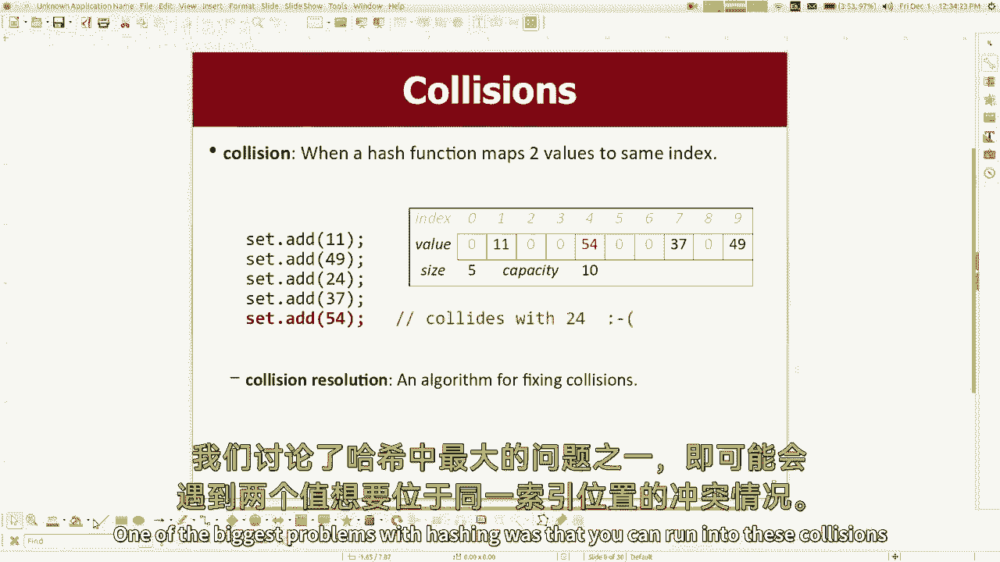
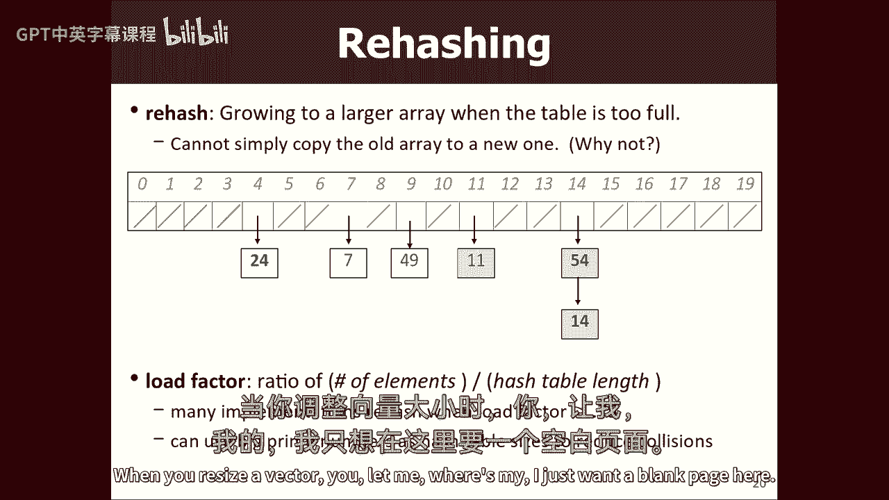
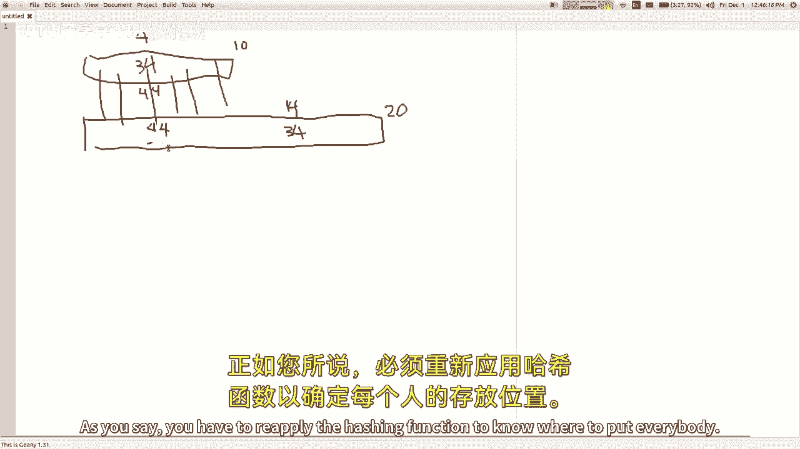
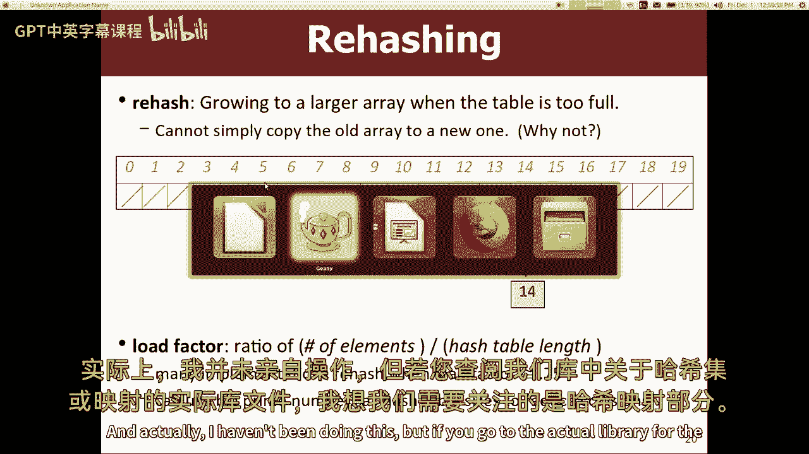
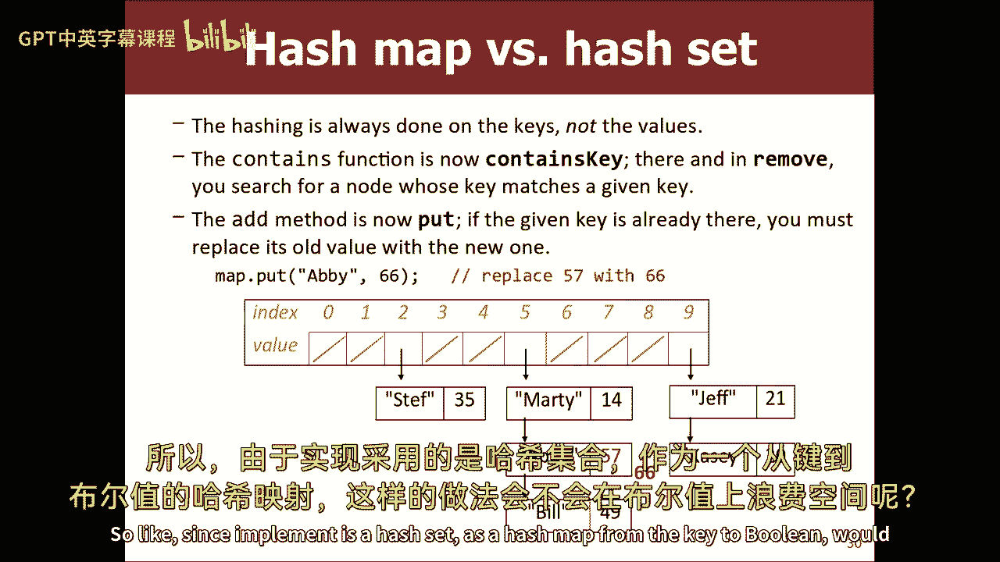
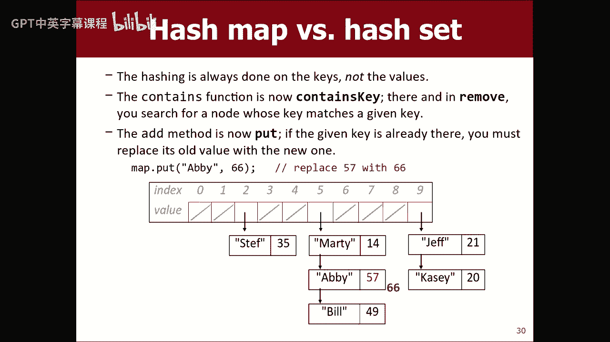
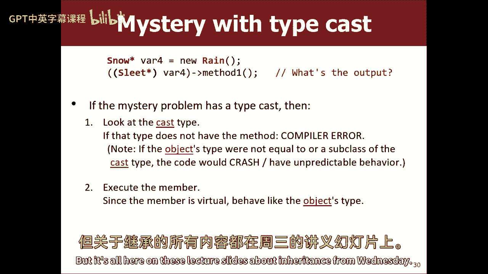

# 【编程抽象方法 cs106x 2017】斯坦福—中英字幕 - P23：Lecture 23 - Hashing 2, Inheritance 2 - 加加zero - BV1By411h75g

好啦，最近怎么样？今天是星期五，已经一周了，我想第九周，取决于你如何计数，我想和你们做什么，今天我基本上想继续谈论哈希，我们从周三开始，我也想回去在遗产方面做更多的工作，这两个话题我都做了一点。

通常我会涵盖所有一个，然后所有其他的，我两者都做了一点的原因，现在我要回去做更多的，因为你这周的专栏在这两个话题上都有问题，我只是不想让任何一个话题不被讨论，在各款之前，所以这就是为什么我在按顺序做事。

我正在做，但基本上到今天结束的时候，我差不多已经完成了对这两个主题的讨论，至少现在是这样，所以我先回去散列，因为那是我们结束的地方，所以是的，提醒我，就像，什么只是告诉我，在这里给我一个电梯推销。

就像一个快速的描述，就像哈希是怎么工作的，哈希是怎么回事，如果你必须向你的朋友描述，六个，或者类似哈希的东西，你会怎么跟那个人说，一个伟大的人，是啊，是啊，你拿着某种形式的数据。

将其转换为可以存储的整数，使用，取一段数据，换算成英寸和索引，这就是你将它存储在数组中的地方，是啊，是啊，这是我认为最基本的想法，从数据元素映射到数组索引的某种散列函数，我们周三做的讲座很酷。

我真的不用做很多工作，将数据转换为索引，因为我看到的数据，所以就像珍宝本身，是把它放在，但就像你说的，如果这是一个更普遍的概念，如果是绳子，如果这是一个点，如果是矢量，或者别的什么，不管是什么。

我得想办法把它转换成int数，要知道在哪里储存它的权利，我为什么要这么做，有什么意义，这个愚蠢的想法有什么好处，是呀，如果你不想，哦，一个用于添加删除包含，是啊，是啊，这是这里最大的回报，太快了。

对快是好的，好啦，这就是我们讨论的总体思路，哈希最大的问题之一是你可能会遇到这些冲突。

其中两个值希望位于同一索引处，你对此怎么办，你怎么解决这个问题，是啊，是啊，把东西堆在上面，就像，是啊，是啊，你可以，就像你说的，把值堆叠起来，或者从链表中列出值，而不是只在这里存储一个值，是啊，是啊。

那是一种方法，我们还谈到了另一种方法，在那里您可以跳转到下一个索引，那叫线性探测，或者只是一般的探索，对呀，所以我想我们就到此为止了，我说的地方，大多数基于散列的集合都使用类似的方法。

它们在每个索引处存储一个值列表，记住当你有一个矢量，矢量满了，最终你必须调整大小，使矢量大两倍，如果你在这里这样做，使这个数组大小为20，你知道就像，有点不太清楚，这里的大小调整是如何工作的。

所以我想马上谈谈，例如，如果我调整大小，我何时调整大小，就像在矢量的情况下，你会吃饱，然后你必须调整大小，我什么时候吃饱，我何时调整大小，我从调整大小中得到了什么好处，所以我想一会儿再谈这个。

但我想我先看到了一个问题，是啊，是啊，在这里，而不是使用链表，你能在里面用另一个哈希图吗，所以它就像另一个类似的哈希，是啊，是啊，有一些不必要的，因为你可能想看看它的重量，有一种叫做双重哈希的东西。

就像，如果在这里发生碰撞，然后你有第二个哈希函数，就像你调用哈希函数，它给你一个索引，你试着去那个索引，如果索引被取，还有其他第二个哈希函数，你打电话给你一个不同的索引，所以你去那里。

所以你不是这么说的，但是有一种例外，你现在有哈希中的哈希或其他什么，我觉得你说的更像是，住在这里的东西本身就像一个哈希表，或者哈希集，或者类似的东西，我是说你看。

我认为这个想法的重点是每个索引并不存储一个单一的值，它是价值的集合，具体是什么收藏取决于你，它可能是一个载体，它可能是指向节点的指针，它有一个指向节点的指针，它有一个指针，这就是这幅画所暗示的。

可能是别的什么，我觉得问题就像，你知道的，如果该集合是哈希集合，就像嗯，我正在实现哈希集合，你知道我的意思，所以这就像，我想给你一个自成一体的定义，这并不依赖于任何其他特定的库或其他东西，所以是的。

有很多不同的方法可以存储这些数据，我只是选择把它画成一个链接列表，这就是很多实现实际上所做的，但它几乎可以是任何类型的收藏，只要它存储多个元素值，我是说这可能是一个数组，哈希表可以是一个数组。

那么每个x中的这些家伙可能是指向其他数组的指针，你储存东西的地方，但是当数组满了，你得把它放大，所以它就像每个索引中的向量，你可以做那种事，但我是说这是最规范的做法，所以现在我想指出。

让我们再次讨论大小调整，不过，如果你像这样离开哈希表，理论上你可以添加无限多的元素，从技术上来说，它永远不会满，你明白像，我是说，除非您的计算机内存不足，比如如果我添加一个元素，十个指数中的每一个。

从某种意义上说，它是满的，所有索引都用于存储链表，但从没有更多空间的意义上说，它并不满，对呀，您总是可以添加更多的元素，只需将它们添加到这些链表中，它们变得越来越长，对呀。

所以理论上我不需要调整这个右的大小，那有什么问题，如果我只是离开它，而且这些名单越来越长，是啊，是啊，就像链接列表的长度开始接近结束长度，你可能会说，嗯，它不是n，这只是n的十分之一，那远小于n。

但是n的十分之一仍然是n的大o，因为大O是关于成长的，如果你乘以N的十分之一，所以它和右边成比例，所以是的，那很糟糕，我们不想那样，所以我们要绕过这个问题，我马上给你看，您确实调整了哈希表的大小。

你不能就这样离开，你确实调整了它的大小，但它只基于一次，你得到了一定数量的元素，可能是十个，因为你有10英尺长，也可能比这更少或更大，因为你喜欢，我说严格来说你不会用完空间，所以我们经常有一定的门槛。

东西开始调整自己的大小，所以我一会儿就说到这一点，所以好吧，如果您在此结构中添加、删除和搜索，基本上你做一个新的节点，但你要放的地方通常是在链条的前面，你想让链子指向他们，然后他们指向剩下的节点。

我想我上一节课简短地说过，你想把它们放在你的你的，你看这张照片，你的大脑可能想把新的放在最后什么的，那很好，只是你得走到尽头才能把它放在那里，所以不要那样做，把它粘在前面，链条的顺序并不重要。

你明白他们都必须在那里或者以某种方式，所以你把它们放在前面以提高速度，唯一棘手的是你确实需要查看链条，无论如何，因为你得确保它不是复制品，集合不应该包含重复项，对呀，尽管它确实提出了一个有趣的问题。

如果我没有检查它是不是复制品呢，我刚刚添加了另一个该值的副本，那会是坏事吗，我不知道像什么，如果有两个，如果我有一个二四，然后我又吃了两个四，现在我有两个，两个，四个，如果有什么是好是坏呢。

你以为你刚找到第一个，如果我问你，集合是否包含两个四，你会说是真的，哪个是正确答案，所以可能会导致移除的问题，如果有两个，两个，四个，然后我告诉你，我要你删除两个四，你只去掉两个中的一个。

我叫你把它拿走，它就不应该在那里了，所以我只想指出，您可以继续添加副本，但你必须确保走完这整个链条，然后删除该副本的所有副本，所以这是一个权衡的例子，在这个例子中，你可以更快地添加。

但你会让移除变得更慢，所以唯一的另一个问题可能是，如果你在打印东西，你打印了，你在屏幕上画了两个四的副本什么的，但这取决于您是否希望支持为您的收藏打印，你有一个问题，是啊，是啊，当你移除。

那个事件不是吗，所以不是，坚持到底，和刚刚的凹槽一样的大O，在第一个，你说这些都是移动的大O N反正，嗯，但移除并不是一个大目标，这些都是一次行动的大O，如果我们做对了，你是说大事件吗。

在这个链条上的一个循环的意义上，你的意思是，是啊，是啊，你得走过去，你得走过去，在这种情况下，如果允许重复，只是意味着你每次都要走到最后，而不是让你走路的东西，是啊，是啊，我同意你，你有时可以在。

你只走了链条的一部分，而不是走了整个链条，所以你可以坐在那里，微优化，我觉得最主要的是，这些链条很短，所以希望走着链子的一部分，或者所有的链条都没有太大的不同，所以我想通常我们只是继续走链子。

确保值不在那里，然后只加，如果不是复制品，但我想向你们指出你们可以建立一个有效的结构，那是一套，即使你真的让它有副本，只要使用集合的客户端，看不出有一个复制品，你可以有这种把戏。

这是您存储的内部结构之间的差异，你表现的外在方式，对集合的用户，所以无论如何，这基本上就是如何向哈希集添加内容，使用这种单独的链接，无链接链接，这里的碰撞分辨率结构，所以如果你想做包含，很明显是吧。

如果你只是去杂凑桶找你要找的东西，你从链条的起点走到终点，你寻找它，看看你是否看到了它，如果你看到它，你说的是真的，如果你看不到，你说假的，然后是的，你就像有一股电流穿过所有的节点，那不是。

那没那么复杂，如果要从，只是从链表中删除，要么是链条的前面，要么是中间，要么是末端，或者你们写的从链表中删除东西的代码，基本上是相同的代码，所以这不是很非常复杂，同样的东西。

在你要除掉的人之前找到那个人，把他们当成詹姆斯，邦德的东西或气球什么的，你的类比在这里是一样的，所以现在这并不难，我们现在基本了解了如何实现这三个操作，我这里有一张幻灯片，上面写着，让我们去写一些代码。

我想我不想写，和你们住在一起，但我们可以，你知道我可以把它寄出去，大家可以看一下，如果你想，就像我从照片上想的那样，实施这样的事情并不是那么可笑，但是哦在那里，它就在那里，你走得真好，你读了吗。

你很快就看完了所有的代码，但我想谈谈调整大小，重复，他们称之为重复，呃，有某种玩笑要开，就像我在重复这个讲座什么的，但是嗯嗯，重复是当你必须把哈希表做得更大时，当你必须把它调整得更大时。

所以当你调整向量的大小时。

你让我，哪里是我的。

有一个，我只要一张白纸，所以如果你调整向量的大小，我不知道那是什么样子，但不管怎样，当你把它调整得更大时，你做一个两倍大的，对然后你只要把所有的元素，然后你就做对了，你复制十个元素，现在你有二十个位置。

其中十个是空的，这就是如何调整向量数组的大小，对呀，好啦，如果对哈希集这样做，结果不是很好，那不是正确的做事方式，你明白为什么对哈希集这样做有什么错吗，是啊，是啊，新的哈希函数能够访问所有可能的，因此。

以前利率中的每一个元素都有权利，如此如此，想象一下这就像一张非常糟糕的照片，但像这样的指数是十分之四，好吧，我有三四个储存在这里，对哇，好啦，在这里，我得到了我的三四指数四，好吧。

那么这是一条10号的射线，然后这个20大小的新数组，好啦，我做到了嗯，如果你把3-4复制到这里，记住哈希函数是如何工作的，这就像int mod的值乘以数组长度，对呀，三四mod十等于四。

这就是为什么他是指数四，三四mod二十不是四，是十四点，对吗？所以对于三个，四个不应该存储在那个索引中，在较大的数组中，三四应该存放在索引14上，三四应该是这样的，就像那样，哎呦，太难了。

然后如果我有一个4，四或两个四或类似的东西也在这个链条上，就像他会繁殖到四个，他会呆在那里，你明白吗，所以你不能抄袭所有人，就像你说的，你必须重新应用哈希函数，知道把每个人放在哪里。

所以这就是重复的想法，这是我的照片，我在这里也有同样的事情，我想这些家伙以前在四链子那边，这家伙会在一条链子里，所以一般的算法是，您使新的更大的数组，然后在旧数组上循环，循环旧数组的所有链，较小的数组。

并将每个元素，你要求它的新哈希值，把它放进新链子里，原来如此，做起来并不难，但你只需要意识到这个问题，一个问题，哈希时间的想法取决于那里，数组使用非常稀疏，好像大部分都是空的。

就像一些指数实际上发生在他们身上，所以一旦你对整个事情进行了不合理的长时间循环，我们是不是有一些，比如什么指数把东西放进去什么的，是啊，是啊，这是一个很好的观点，就像如果这真的很大，很多索引都是空白的。

然后我循环了很多，什么也没做，所以很遗憾，也许这应该有一些指向下一个非空索引或其他什么的指针，我觉得，在实践中，人们只是吃性能惩罚，原因是这个数组长度不是，你知道那不好，我是说，相对于，你知道的。

就像N或类似的东西，你基本上最终会做，就像那些空的，你只是很快地向前看，你知道我的意思，就像，实际费用来自，比如制作这些节点复制这些指针之类的，所以它最终不会对你造成那么大的伤害，还有像这样的开销。

以某种方式保持指向下一个或其他什么的指针，只会让你从几次跳跃中解脱出来，通常只有几个空隙，你知道我的意思，就像必须保持、维护和更新的开销，这样的指针足以让它有点不值得这样做，大多数情况下。

我们只是循环所有的插槽，即使是空的，所以就有了这个问题，我何时调整大小，这在矢量中很明显，您调整大小，当它吃饱的时候，这里不太清楚，有很多不同的算法来决定，何时调整大小，何时重述，一种算法是。

如果一个链条永远不会超过某个环节，您可以更常见地重复，你说得好，我会数数我有多少元素的大小，当它达到一定的阈值或调整大小，但正如我所说，门槛是灵活的，不一定是，当数组已满时，因为没有满的。

所以取而代之的是哈希集可以保持自己的度量，也就是所谓的负载系数，也就是初等元素的比例，喜欢它的大小，与哈希表的长度，能力，所以说，例如，如果在十个数组中有六个元素，十分之六，负载系数是零点六。

所以您的哈希集类，你做了一些双常数，那就像，这是我将重复的负载系数，你把它设成零点七十五，或者零点六六之类的，当你重新设定，所以我写在这里，比如七点五或者六点六，这是很多人使用的两个值，你可能会说很好。

为什么不是一个，因为一个零就像满的一样，但请记住，哈希集的工作效果最好，如果它很好，散开，所以就像有一点空间，有点稀疏是好的，使链条变短，所以就像等了很长时间才调整大小，因为你节省了几个字节的内存。

不是我们想要优化的，所以我们提前辞职，是啊，是啊，我在幻灯片底部的另一个东西，幻灯片上的这些图片不是很好，表示哈希表内部的实际外观，因为我一直在用这些漂亮的整数，像十个索引或者二十个索引。

那只是因为图片更容易理解，你脑子里在想什么，这真的很容易知道，34蒙大拿很容易计算，即使你知道，即使我在伯克利做客座演讲，他们通常能做对，通常，但他们通常在哈希集上做的不是十，然后是二十个。

然后是四十个，他们使哈希表大小，就像三七或一些奇怪的数字，不是伯克利，像每个人一样的人都这么做只是为了清楚，嗯，我们这么做的原因是，就像造型和包装是一种更分散的，更混乱，就像那些恰好是全等的数字。

Mod 3 7只是一个奇怪的随机数，不是随机的，但就像数据集的分布，碰巧有很多数字，是一致的，莫德三七还是莫德三，七乘以二或类似的东西很少见，所以我们选择了这些尺寸奇怪的数字，所以成型的包装会更好。

实际上，你知道我一直没有这样做，但是如果你。

如果你去。

在我们的图书馆中设置或映射，我想这是哈希图，我们需要看看，所以让我来看看，我们库中数组的初始大小是多少，是一百零一，上面是这么说的，所以在我们实际的哈希映射类中，我们将数组初始化为有101个元素。

这是一个很好的杂凑，一套斑点狗，我想是的，他们说他们把它存放在这里，我没有写这个代码，但他们储存在这里的比例是70%，这只是意味着负载系数零点七，所以你去那里，然后他们称之为哈希的哈希展开和重复。

所以他们把它乘以二加一，所以当他们调整它的大小时，他们基本上把它翻倍，但后来他们又加了一个，所以尺寸总是奇数，我想是的，他们就是这样调整大小的。

是啊，是啊，有任何关于重复或负载因素的问题吗，是啊，是啊，所以有一些有趣的，如果你只是，如果你想谷歌这个，有一些有趣的论文、文章和链接，人们在那里处理了大量关于这个的数据，他们收集了大量的程序。

使用哈希集和哈希图，然后它们交换具有不同大小和不同负载因子的哈希图，在它们调整大小之前，然后他们只是基准所有的，也有很多理论计算机科学家，他们做了很多很酷的校样和东西，对于一个，你知道学生导读。

但是有人计算过这些数字，他们决定最佳负荷系数为零，点，六个，八，九，三个，或者别的什么，他们通过成千上万的试验来测量，所以是的，质数往往有帮助，这有点取决于数据集，但聪明人会经历这一切，事实上。

有一件事很有趣，如果你刚学会一种新的编程语言，大多数语言都有某种哈希映射，哈希集，散列的东西去看看，如果你能找到像，默认情况下他们的哈希表有多大，他们的负载系数是多少？因为在他们的代码里。

去某个地方看看Python源代码，他们是做什么的，你知道的，看到这些不同库之间的差异很有趣，但它通常是一些奇怪的质数，在六点六到七点五之间，是啊，是啊，这一次有一个负载系数，我肯定有更多的比是的，就像。

我如何确保我的链表不会像，有点大，我想我不能给你一个很好的答案，但基本上你必须非常敌对地制作一个数据集，如果所有这些因素都对你有利，比如奇怪的哈希表大小和调整某个负载因子的大小。

你知道我们正在学习的所有其他技巧，为了有一个数据集，它们最终都在同一个桶里，你真的得仔细选择数据集，这不太可能发生，但这是非常不可能的，另一件事是你可以想象这些数据集是什么，如果我们说的只是暗示。

你知道我的意思，因为你去，啊，如果我选54和14或其他什么，或者即使模组是一百零一个，你去挑一百一两百二什么的，我挑这些，我会不厌其烦地挑选偷偷摸摸的数字，会把事情搞砸的。

但我想你会发现如果你像绳子一样，如果你在做积分，如果你在做其他类型的数据，实际上我马上就给你看，就像你用绳子做的那样，但是很难制作数据集，在那里它们都撞到同一个桶里，现在有些事情我今天不打算谈。

但如果你想谷歌一下，你可以称之为完美哈希，在那里你可以给一个算法一个数据集，有一个完美的哈希算法，你给它你的数据集，它看着所有的东西，它说我会为这些数据想出一个哈希函数，这将最大限度地减少碰撞，事实上。

如果可能的话，我会做到这一点，没有碰撞，我会给你一个哈希表大小和一个哈希函数，您可以在此数据集的每个元素上运行，它们都会映射到不同的桶里，不知何故，这很复杂，我又不知道，我不知道，恐怕我从。

如果我试图在课堂上描述它的寒冷，但这是你可以做的事情，其实呢，你可以在电脑上运行一些程序，为你生成，挺酷的，所以人们，你知道的，担心他们的数据集会有很多冲突的人，他们已经想过这些事情了。

他们制造了工具来帮助避免它，但不管怎样，我想谈谈，如何哈希，其他类型的数据，你们可能已经在课上讨论过了，所以这可能有点老调重弹，哈哈哈，那么如何对字符串或，或者是的，我重复了一遍，我的笑话也是，是啊。

是啊，是啊，是啊，很好地满足了每一个哈希，嗯，那么我喜欢如何哈希字符串，嗯，有很多方法可以做到这一点，但我认为这里的基本思想是，我得把状态，数据元素，我必须把这个状态转换成单个int。

这里有一些品质需要真实，有效的哈希函数，必须具备以下素质，它必须符合平等的概念，所以这意味着，如果我必须让我们说我散列字符串，我有两个字符串变量，如果这些字符串变量存储相同的内容，如果他们有相同的字符。

里面同样的数据，你知道吗，一号线你好，二弦你好，如果我在这两个不同的字符串上调用哈希函数，我必须得到他们两个相同的答案，这很重要，因为这里的类比就像，我稍后将第一个存储在哈希集中。

我问哈希集是否包含第二个，它最好答应，所以答案必须是一样的，因为它们是相同的数据，他们可能是，你明白的，就像等价和等价的区别，就像你可以有两根不同的弦，他们是不同的，但它们的状态是一样的。

它们存储相同的字符，他们是对等的，这两个字符串必须产生相同的哈希代码，好啦，所以这是第一件事，如果字符串不相等，如果我有一串你好和一串再见，我把这两个传递到哈希函数中，它们不一定要返回不同的结果。

但为什么这似乎是错误的，如果Hello和Goodbye返回相同的哈希代码，这似乎很糟糕，为什么这不是，因为这就是幻象和链条的设计，这里的想法是，如果两个不同的字符串或不同的，作为哈希码产生的任何东西。

那就意味着它们会互相碰撞，所以目标实际上不一定是零个人会和睦相处，因为我们刚刚想出解决的办法，当人们互相碰撞时，事实上，如果你仔细想想，一些人相互冲撞在所难免，我怎么知道弦必须变成大头针，对呀。

世界上有多少不同的别针，像大多数或标签一样，不管你们对电脑说什么，好像是2。7，27mil，你很近很近，它很大，这取决于它取决于声明的类型，英特英特右，32位体系结构，三十二位，两到三十秒，大约40亿。

你可以有不同的值，从负20亿到正，二十亿减一亿，所以嗯，这取决于你声明一个短int还是一个int，与长长的，与长的，长int，对抗任何东西，你得到不同的部分，但是有40亿个名字，好的，好的。

有一个有限的数目，C++支持有多少字符串，基本上无限个字符串，对呀，有二十六个一个字母的字符串，只是使用字母表，还有其他角色，但有多少两个字母只写了三个字母，但你可以有一根绳子，所以可以肯定的是。

有40多亿人是对的，所以宇宙中的每个字符串都不可能返回一个唯一的int，那不管用，所以没关系，如果不同的值偶尔返回相同的哈希码，如果不是这样就好了，通常，如果值在整个数字空间中均匀分布，那就太好了。

对呀，好啦，说了这么多，这些哈希码中哪一个更好，为什么会有这样的动画，好啦，这些哈希码中哪一个更好，哈希函数更好，为什么，这就是我看到的是你想要，就像那个答案还是梅毒，你知道对不起，你们说的哪个更好。

为什么一个更好的，是啊，是啊，因为我们给同样的屏幕，第二个是可能的，原谅，是啊，是啊，这可能会给相同的数据带来不同的激情，如果我有你好和你好，我请他们两个进来，我可以得到不同的号码，那只是无效的。

它甚至不工作，这个也很烂，但总比，会发生什么，我的意思是，我可以用这个，这是一个有效的哈希函数，会发生什么，如果我使用这个散列函数，我去拿链接列表，每条小溪都想在桶里放42个，那不是，但在哈希表中。

它想在42号桶里，然后我就变大了，我调整大小，它们又回到了42号桶里，所以我的哈希表都在一个桶里，它基本上是一个链表，我所有的添加、删除和搜索现在都是N的大O，这是不幸的，但这并不是不正确的。

只是分布得很差，对呀，所以A更好，即使他们都很烂，这个怎么样使用RAM中s的内存地址，记忆，两个等效字符串可以有不同的内存地址，所以它不会做正确的事情，所以有一个类似于这个的区段问题，所以无论如何。

那么你应该做好什么呢，怎么样，这个怎么样，你把绳子的长度，比四二，嗯，总比四二好，而且比指针好，但是这样可以吗，对吗，还是违反了我需要什么的定义，为什么，好啦，大约八点，是啊，是啊，如果你通过了。

那不会导致错误吗，啊，如果你只是用引号传递它，是啊，是啊，嗯，它将创建一个临时字符串对象，它会给你地址，但那不是一个很有用的地址，它会编译，但是是的，它不是一个好的散列函数，有几个不同的原因，是啊。

是啊，但是这个长度呢，一是有效，会有用的，但很可能不会，当你调整它们的大小时，是啊，是啊，我是说，这里是短弦这里是中弦那里是长弦，这个不是那个，因为世界上很多字符串都是零到十个字符。

所以你会得到一个相当重的，就像你的散列向左聚集，但它是有效的，相等的字符串在这里会给出相等的结果，所以它起作用了，你知道的，但不是很好，所以这样更好对吧，这就像在字符串的字母上循环，把它们加起来。

把看护人都变成，然后把它们加起来，所以现在它是基于字符串的状态，这是好的，如果你传递相同的--就像两个相同字符的等效副本，它会产生同样的结果，这很重要，我们需要那个，我想这个会散开得更好一点。

因为把这些字母加起来，你会得到一个更大的int或其他什么，所以它似乎会扩散，它不会把每个人都归入前十个指数或其他什么，这个稍微好一点，对，记住，只要记住，如果你把所有这些ASCII字符加起来。

你会得到一些大数字，就像腹股沟数一样，差不多六十到一百，主要是一些，所以你会得到这个数字，大概是856，对呀，不过没关系，因为你根据哈希表的大小修改它，对呀，所以这就是，这是在任何改装或其他之前。

所以这很不错，你对碰撞有什么看法，比如用这个算法会碰撞什么样的字符串，是啊，是啊，就像那根弦，就像小写的一个领主风投在字符串中，小写b，小写b，你看起来很有活力，AC和BB会碰撞，是啊，是啊。

所以加起来正好是，我以为你说的不一样，你觉得呢，只是重新排列相同的字符，就像字谜，或者只是相同字符串的混乱版本将产生相同的哈希代码，再说一遍，这并不意味着你的哈希码坏了或坏了。

仅仅因为你能想到一些会碰撞的值，没关系的，你会有冲突的价值观，但不幸的是我们能想到，可能有很多例子，我们可以认为这有点常见，然后会碰撞，所以说，你知道的，哎呦，我们能让它比这分布得更均匀吗。

所以你经常做的是把所有的字符加起来，但你喜欢把它们乘以奇怪的数字来放大它们，所以这到底是怎么回事，所以不是从零或一开始，然后把所有这些字符，我从一些愚蠢的数字开始，我只是化妆，有点大，有点素。

或者我不知道它是不是质数，但看起来很原始，看起来没有太多因素，你知道的，呃，我对他的刻板印象是他看起来像个质数，不需要，你知道，嗯，然后当我有字符，我把它们乘以一些因素，乘7乘17，三十一岁的时候。

我为什么选三个一，我不知道，只是人们分析了这一点，得出了这些数字，还有这个傻乎乎的公式，让你基本上是把字符加起来，但现在如果它们的顺序不同，那么这个乘法尺度就不一样了，所以字谜和排列之类的东西。

就像经常碰撞一样，我想这也纠正了你的b、c、b、b或其他什么的例子，我认为这个修复现在仍然会有字符串碰撞，但碰撞的常见案例较少，我也很难喜欢，你问的是，我可以制作输入来打破哈希表吗。

所以它们最终都在同一个桶里，很难喜欢，坐在这里，想想有一根弦恰好等于他愚蠢的公式，这实际上是Java使用的哈希公式，当它的琴弦化为灰烬，拉拢等价物，这是C++代码，但这个算法是Java用于字符串的算法。

所以效果很好，这种一般的技术，就像把组成物体的状态碎片，不管是什么，如果它是一个有ID、名称和密码的学生对象，或者别的什么，把那些国家的碎片，将每一段转换为int到某种哈希码。

然后用乘数常数把它们推到一起使其工作，如果你去看斯坦福图书馆的源代码，您将发现具有哈希代码函数的各种文件，他们有这个原则，把所有的州，将每个状态片段转换为某种哈希码，作为一个数字，某种int。

将所有整数与常量混合在一起以放大它们，所以这就是，这就是工作原理，这不是有缺点吗，我不知道有没有更好的方法，这是波巴带在绳子的长度上，哦耶，是啊，是啊，这是个好问题，如果我们能做一个哈希码，那就像，哦。

原木和春天一样，哦，一个喜欢是的，这是个很好的问题，所以他说的是，这不是要花很长时间来计算吗，因为你要移动字符串的所有字符，是的，是的，这是正确的，那倒是真的，实际上，它通常是好的。

因为大多数弦其实没有那么长，所以它最终变成了，你说过，是O的N，我们要小心，对呀，因为n不是某个字符串的字符数，n是我添加到右边集合中的字符串数，所以即使是一段有循环的代码，我们不一定说那是不可能的。

但我明白你的意思，我想你是说O'of N是一条捷径，我必须把这里的每一个东西都循环一遍，我在前言里明白了，没那么糟吧，这些弦大多都很短，计算这段代码不需要那么长时间，另一件事，所以有一些调整。

有些人做一些图书馆，做一个是你可以循环到，就像四号或十号字符，或者你可以在某个时候停下来，然后你就会忽略其余的，如果字符串碰巧有一百万个字母长，你忽略了前十二个什么的，这是件坏事吗，嗯。

这可能意味着一些长串相互碰撞，但有些碰撞是可以的，那很少见，可能是，所以我们对此没意见，我们将使用我们的链表来处理这个问题，水桶什么的，我们没意见，所以一些图书馆这样做，其他图书馆。

他们只要继续计算这个，但是当他们计算哈希码时，他们喜欢保存它，他们记住了，它们将其保存在字符串对象本身的对象中，在某种程度上，所以如果你要为那个字符串再计算一次，我已经拿到了，我不知怎么救了它。

所以你可以做很多小技巧，你说原木，我是说我的例子，如果我只是阻止了一个字符12，我不是木头，我只是不变，以12为常数，所以你可以做很多不同的变化，是啊，是啊，这里有一个快速的例子。

就像你只是散列一个结构，就像一个有x和y的点，这是对象的整个状态，您希望对其进行散列，你基本上就像，把污渍放在一起，把它们乘上一些东西，你知道我的意思，为什么我把y乘以这个，把x乘以那个，我不知道。

我只是挑奇怪的数字，所以会把人数分散得很广，是啊，是啊，我只想让你把那些乘法常数，例如，每次乘以31，那不是意味着整数会，是啊，是啊，这不会像用负片之类的东西包起来吗？会的会的，但我们只是去，好啦。

谁在乎，它会，会有一些int，一切都会好的，是啊，是啊，我同意就像，如果是一根长绳子，你可能想挑一个小一点的哈希什么的，我想这个想法是，它真的在周围优化了，大多数字符串都很短的事实。

如果你把战争与和平的全部内容，这将是一个糟糕的时间，你会溢出一百万倍，所以这是给你的，它主要适用于短弦，不管怎样，我会说，任何东西都可以散列，因为基本类型的数据可以以双倍的形式散列，布尔人，字符串。

一旦你知道怎么做，所有其他数据类型都只是，所以你只要把碎片拼凑起来，把他们所有的小脑浆都拿出来，获取对象状态的所有片段的哈希码，然后用不变的乘数把它们加在一起，这就是你的哈希码，只要你的公式是一致的。

已经够好了，它是不完美的，会有一些碰撞，但这已经足够好了，结构分布得很好，所以我想说的另一件事是，我一直在谈论如何实现哈希集，那么如果您很好地实现了哈希映射呢，差不多是同样的想法。

除了小节点存储了两件事，一种派斯或一个键和一个值，而你正在散列的是关键，所以我的意思是，这个例子假设马蒂的哈希码是五，所以我把这些数据存储在那里，是同样的想法，你只是有一张纸条。

我不知道我有没有这张幻灯片，“井在哪儿呢？我想我没有，但是如果你有一个哈希节点，它只有一个数据和一个，他和A和一个值和一个下一个，而不仅仅是一个数据和下一个，所以它会稍微修改你的算法。

像添加或删除和包含基本上和放置、删除和包含键是一样的，嗯，所以逻辑本质上是一样的，唯一的区别是，如果你把你记住，你可以替换，如果你把马蒂逗号10，然后你说把马蒂逗号二十，你需要用20来代替晒黑。

所以你去寻找旧的名字和价值，你把它擦洗掉，换上新的，所以我的意思是有一点点像地图，你在这里必须做的具体逻辑，但不是很多，所以这就是你如何实现的，事实上，我不认为这在我的幻灯片里。

但如果你去看看我们哈希的源代码，映射和哈希集集合，你会看到这两个东西的这两个实现是如此相似，他们在一起会有点多余，对呀，所以我们做这件事的方式，如果您查看哈希集的源代码，你寻找私处。

您发现哈希集的数据是哈希映射，从您想要的数据类型布尔的真正含义，它在这里，你明白吗，就像哈希集，它只是一个从值到真的哈希映射，所以我们这样做只是为了避免重写相同的代码，是啊，是啊。

所以你能回到哈希图而不是逻辑吗，但你是说这里的幻灯片，是呀，是啊，是啊，为什么像35下一个地方，哎呦，哎呦，哎呦，对呀，小心点就行了，因为你所说的，为什么是三，五到二而不是五，记住我们要散列的是钥匙。

所以有点困惑的是，我的意思是这条街就像一个杂凑物，二的代码或修改为二的代码，所以从这张图上看并不清楚，但我只是编造了这些数据在这些索引中，但它与这里的这些价值观无关，一切都与，是啊，是啊。

所以就像补语是王牌嗬，作为哈希掩码，从钥匙到两把。

两个布尔值，会不会是在浪费空间，是不是有点浪费空间，是啊，是啊，规则没那么大，所以没那么糟，但是我们的图书馆通常是为其他事情而优化的，不是为了最小的内存消耗，其实呢，如果你去看一些语言和库。

他们有专门版本的哈希集，对某些类型更好，为了节省几个字节的内存，或者别的什么，如果您将规则的哈希集，从技术上讲，公牛可以表示为每个一位，而不是像一个输入四个字节，所以与其浪费大量的内存。

如果你碰巧做了一个公牛的哈希集，他们实际上用一个完全不同的实现来交换你，那非常，非常，非常紧凑，他们不会为其他类型的人做的，现在我们不这么做了，我们的图书馆基本上是为了简单易读，相对来说，所以是的。

我们，我们只是选择不优化它，啊，库需要O的log n来读取。

那要看你在找什么，是啊，是啊，关于这个散列还有什么问题吗，所以这是最后一次，我现在想说的是哈希，我觉得真的很酷，对我来说，你可以像这样做任何事情，这很神奇，当我第一次了解到它的时候，我真的不太相信。

我就像，但如果你必须在列表上循环，那不是恒定的，它有一个环，男人和我不得不喜欢，去测试一下，一堆说服自己，背诵随机大小，可以吗，重新散列到随机大小，好吧，只要它比原来的大，那很重要，也有很大的原因。

它必须比一个乘法因子更大，就像如果你的旧数组是一千个，你做一个新的，那是一千零二十并没有多大帮助，它需要像两千或四千，或者是多重因素，原因是如果你，如果你想计算，记住这一点，就像大多数广告一样快。

但偶尔你会有一个非常慢的广告，必须调整大小，所以问题是这是否破坏了增加，答案是否定的，因为你可以把那个昂贵的大O的大小，你可以把它的一小部分，在所有其他广告中，你可以摊销那个昂贵的成本。

但这是唯一可以做的，如果你不需要经常调整大小，所以我的意思是，如果你在这里做一些餐巾数学，你发现如果你，如果按相加而不是按乘法调整大小，广告成本足以搞砸你的大O，但如果你每次乘以2、3、4或其他什么。

这样大O就不会搞砸了。

所以我说我要谈谈遗产，但我说了太多哈希表，所以关于遗产我就不多说了，我告诉你一件事，虽然我喜欢做这些关于继承的恶魔练习，它们被称为多态神秘问题，在你的版面上有一个，讲义，你的部门，领导可能会说。

待会去看看这个，或者他们可能已经检查了一些，和你在一起，我觉得你应该看看这个，所以我做这样的问题，在那里我有这些不同的类相互扩展，他们有不同的方法和类似的东西，看，我有四门课，叫不同的东西什么的。

然后我给你一个问题，我让你看，我给了一个问题，我说嘿，如果我做一个雪变量，雨夹雪物体的来源，我希望这种方法在物体上，它是做什么的，我建议我，我现在只有几分钟的时间来讨论这个问题。

但我建议你看看这些幻灯片，请看你们的讲义来了解这一点，并熟悉这种继承行为，我是说基本上发生的事情是，您可以创建一个类型的变量，该变量指向另一种类型的对象，只要另一种类型是它的子类，允许你这么做。

但是当您调用这些方法时，运行的方法是来自实际对象的方法，不是变量，好啦，所以这是一种简单的思考方式，除非这个方法在这里也找不到，它不会编译，所以这个类型是否有这个告诉你代码是否编译，但是一旦它编译。

这是这种类型的方法版本，所以这就是一个过程，如果我问你这样的问题，你得检查一下，如果它通过查看变量类型来编译，如果它编译，您可以查看右边的对象类型来计算输出，现在还有一个额外的皱纹，有时我也会打字。

所以我声明了一个变量，我存储了一个不同类型的对象，它是一种子类类型，把它转换成其他类型的，叫它，所以现在我真的搞砸了你们的权利，那么你怎么知道它的优点是什么，我就告诉你，这和我一分钟前说的基本相同。

除了铸造效果，它是否会，所以记住我在左边的类型告诉你它是否编译之前说过的话，右边的类型告诉您代码的正确操作，这里也差不多，只是不要看这个类型，看看它是否编译，您正在查看此类型，看看它是否编译。

暂时将此视为，所以这是一个基本的想法，除了还有一个部分，也就是说，如果你不应该把其中一个传递到其中一个，会导致代码崩溃，这种事情的一个例子是，如果我有像雪、雨夹雪和雾这样的课程，如果我把雪变成雾。

但物体实际上是雨夹雪，我把它铸成它本来的样子，你知道我的意思，变量可能不如对象类型强大或不太具体--没关系，当你通过，您通常会从变量类型传递到对象中，它真正的类型，如果你投到比实际情况更低的地方。

它不改变对象，它只是诱使编译器认为它是那种类型的对象，它能做的是，它会导致编译器在实际运行代码时崩溃，一个例子是，如果下面这个类有一个名为method的方法，只有在这里，其他班都没有，有办法的。

我有一个雪变量，指向雨夹雪或雨什么的，如果我把它扔进雾中，然后尝试调用一个方法，它将编译，因为博格有办法，但当我实际运行代码时，物体睡着了，它没有办法，所以说，当编译器尝试执行它时，那里没有任何代码。

代码实际上会崩溃，所以有点奇怪，基本上，当您遇到这些问题时，进行类型转换，您必须查看强制转换类型，以查看代码是否将编译，或者不是绿色的，你得确保方法，当你运行它的时候，您必须从对象类型运行一个。

但你也要确保这个石膏不是非法的，但你不是在投不是这样的东西，如果它不能投进去，你得说这一行代码崩溃了，所以这都是一堆垃圾和胡言乱语，但都是遗产的问题，我建议看一些像这样的练习，就像这些幻灯片上的。

如果它完全无法破译，下周问问题，我们可以一起复习，但从周三开始，这些关于继承的演讲幻灯片都在这里。

这些是11月2号9号的，正如我所说，在你的部分有一堆像这样的例子练习有问题，本周讲义，好啦，这就是继承和哈希，现在是上课的时候了，所以我要让你去有一个很棒的周末，星期一我们会再回来一周。

