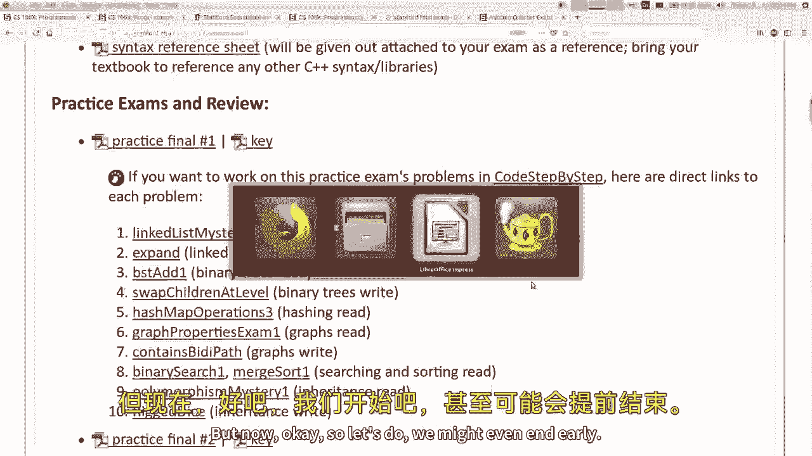
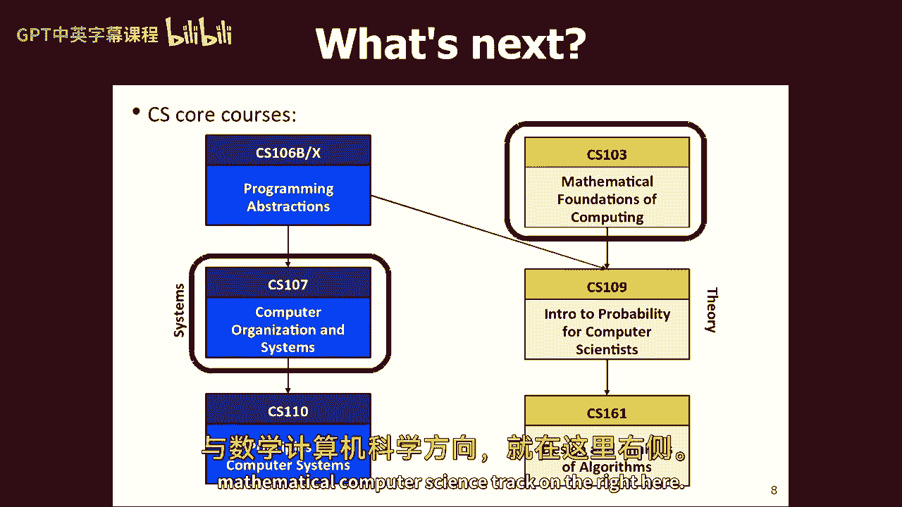
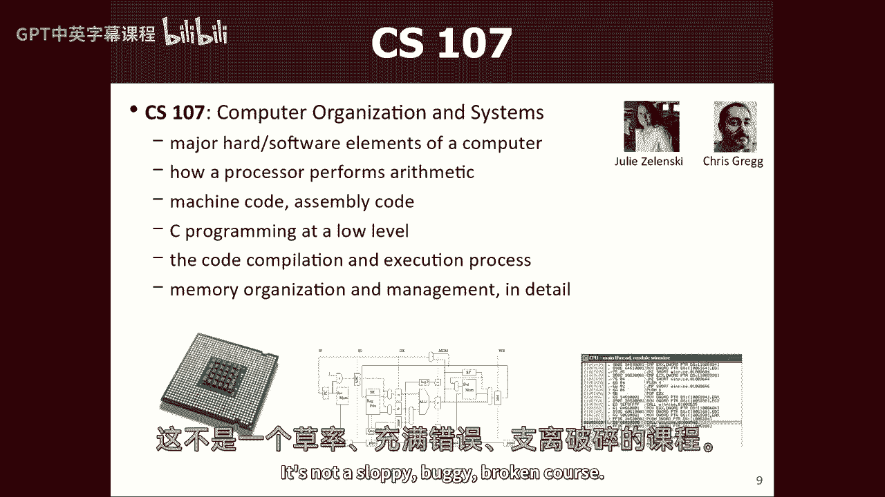
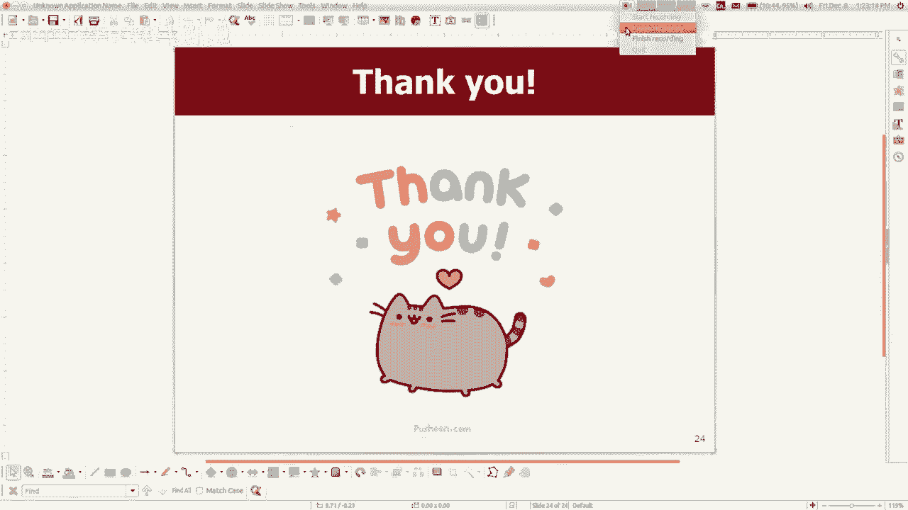

# 【编程抽象方法 cs106x 2017】斯坦福—中英字幕 - P26：Lecture 26 - What's Next - 加加zero - BV1By411h75g

好啦，我们开始吧，这是我们本季度的最后一堂课，今天是第十周或第十一周的星期五，我不知道号码，三天后期末考试，现在是星期一早上，十一个在八点，凌晨三点，那次真的很抱歉，一个简短的故事，就像。

考试时间不是我选的，它的运作方式通常是大学只是选择，你知道的，但我们在CS班，尤其是在一零六，我们有很多问题，学生们在我们考试的同时还有其他考试，而且我们的班级真的很大。

所以我们会有大约50个人有考试冲突，这一直是一个很大的后勤问题，对所以我们实际上去了大学，我们抱怨说嘿，你能帮我们吗，所以他们说，好啦，如果我们划出一个时间段，就像你们一样，你知道你可以有自己的时段。

就像没有人在那段时间有期末考试一样，你不会再有这些冲突了，我们就像，那太好了，然后他们总是我们，早上八点，他们就像，哎呦，你想要一个时段，这是你的时段，就像，如果你，如果你只是搜索，就像斯坦福。

期末考试或任何考试时间表，然后你会发现他们在某个地方有一张小桌子，我不知道，在哪里，也许这个和他们放的一样，他们总是把我们放在第一个时段，不管我是什么意思，还有其他一些人可以在那里，但基本上只有我们。

但是他们总是提前给我们期末考试时间，很抱歉，那正是我们必须忍受的，所以那真的很快，离现在只有三天了，我的猜测是，考虑到你们要做的所有其他事情，那个，你可能没有很多时间学习，然而。

希望你能在这个周末抽出一些时间来做这件事，你的作业8斯坦福1，2点3分今晚6点到期，昨晚我们玩了最后一晚，昨天晚上，星期四晚上，所以如果你想帮助斯坦福一二三，我建议使用广场论坛或电子邮件或联系部门领导。

诸如此类的事情，希望你们能尽快完成，反正，所以是的，接下来是期末考试，星期一上午，我今天想谈谈这个，然后我有几张幻灯片，我很快就过去，只是一些你可以选择在休息时间做的事情，或者在这堂课之后，等等。

这就是今天的计划，举起手来，如果我的期末考试是期末考试还是项目季末，今年秋天你最紧张的事情，好啦，如果你不举手，我只是好奇你有没有举手，然后呢，你比我还怕什么，你想怎么算，五一，我听说物理。

物理学六十一，是啊，是啊，数学五一，数学61，物理学六十一，好啦，所以我必须渴望与这些人匹敌，好啦，嗯，我会的，我会看看他们在做什么，并试着看看，你知道我们会看看我能做些什么，但是，嗯。

所以让我让我简单地谈谈决赛，嗯，如果你还没看，你知道的，有一堆期末考试资源，已经发布在我们的考试页面上，就像我们期中考试一样，所以如果你点击考试页面，我们有语法参考表，如果你想看看上面会有什么。

会被钉在试卷后面，就像期中考试一样，我们有三次练习考试，一、二、三，问题都是，你知道你可以看问题和答案键，您可以一步一步地查看代码中的问题，并键入答案以查看，如果你的答案正确地解决了问题。

所有的问题都应该在里面，至少所有的代码编写问题都应该在那里，如果你以某种方式完成了所有这些问题，你想要更多的问题，我是说，一步一步的代码是一个你可以查看的地方，它在这些一般类别中有很多问题。

也许选择一个你想要更多练习的类别，像图一样，或者你知道二叉树，不管是什么，你可以点击那个类别，一步一步地，你可以做更多的问题，本周的讲义，是为考试复习，所以这些也是额外的问题，回到前几节。

我肯定里面有些问题，你以前可能没时间解决，你可以去看看那些，所以说，我希望你们不会用光材料，从，就像你知道吗，在你的学习时间里，你能做的最有帮助的事情是什么？我真的认为做练习题是我看到的第一件事有人问。

我应该去读书上的章节吗，我应该回去看讲座录像吗，那些东西也很好，但我真的觉得就像锻炼你的肌肉一样，你知道解决这些问题是解决问题的方法，嗯，你知道在做那个的时候，实践问题，我想最好的准备方式，我是说你看。

我不是那种有创造力的人，我只是看着所有的老问题，我想到了一个新的，它通常与旧的问题很相似，所以如果你能解决所有这些，你可能在真正的测试中处于相当好的状态，就考试可能涉及的主题而言。

如果你还没有在这里读过，我有张单子，如果你向下滚动一点，它有主题列表，我可能还会问你关于链表的问题，递归或回溯，我把它弄厚一点，它们是链表，所以我问你期中考试的链表，但那只是一张节点的小照片。

就像把这张照片做成这张照片，你知道在决赛的时候，我可能会要求您编写一个方法，它接受一个前指针，并操纵一系列节点，这可能有点难，所以你可能想研究一下，我仍然希望你知道递归和回溯二叉树，你知道吗。

这里有一个指向树根的指针，我要你操纵这棵树，谈论如何实现一个结构，就像如果我说嘿，我们要实现一个类，那是一个堆栈或一个队列或一个列表或类似的东西，我希望你能谈谈如何在图形问题上做到这一点，像往常一样。

我会给你一个基本的图形对象，我要你做一些调查，或者是对图表的某种操纵，这包括我们学到的一些路径搜索算法，像戴克斯特拉，一颗星，以及克里斯托最小生成树算法，我还谈到了本季度晚些时候的一些材料，作业上没有。

就像搜索和排序，或者我猜排序主要是我们学到的不同排序算法，我们也学到了一些遗传之类的东西，所以我可能会问你一个问题，涉及到使用继承，所以这些都是不同的话题，如果你看看这些不同的决赛。

我想你会发现它们触及了这些主题的不同子集，就像不是每一个主题都出现在每一个练习测试中，但我想给你举个例子，因为有些季度我做或不包括不同的问题，所以你知道，这会给你不同的例子，你可能想练习，所以是的。

这些都是主题，如果你想知道一些你不需要学习的东西，下面也列出了一些，我不会让你画任何分形，我不会逼你的，操作员重载，我不会让你做STL的东西，我们周三学到的标准c+，所有这些不同的事情我不会让你做。

我不在的时候教的任何高级二叉树，就像自动平衡，旋转的树木，红黑树，所有我想知道的事情，如果你们有，关于什么是预期的，什么是不预期的，什么是不包括的，或者我什么都不知道，你对考试有什么问题吗，是呀。

其中一个问题是，如果像你这样的问题是关于实现数据结构，像那样什么的，如果一个问题谈到实现一个结构，我会给你一个标题，基本上是那个结构的h文件，所以你会知道它有什么方法，你就会知道它有什么私人数据。

所以希望，这个问题将，希望你知道，口头描述，也喜欢收藏是什么，所以我希望这将是足够的上下文，你会理解，就像收藏的性质是什么，或者问题在说什么，这里还有一个问题，我们真正需要了解的是什么，是啊，是啊。

做好分类你需要知道什么，我认为看练习考试是一个很好的起点，例如，有时我会给你一个数组或数据向量，我会说好，如果你要做一个选择，在此数组选择上排序排序排序使这些扫描在数组中一遍又一遍地进行。

数组会是什么样子，在你扫了三次之后，是这个还是这个还是这个，其中一个是正确的，一个或类似的东西，这很简单，但如果你不知道算法，你就做不到，与合并类似，也许你知道如果你把数组分开，你们又在一起了。

比如这些照片中的哪一张，大多数看起来像什么会是那种东西，这有点像，我想让你明白的程度，这些就像，能够跟踪我们在课堂上讨论的算法的执行，我不会让你写函数，这是其中一个算法，你必须完全用C++实现它。

加上我确实有一个，我想是在练习考试中，三个，我得看看，一定要，那个在哪里，我所做的就是说好，如果我有选择排序呢，但我用以下方式修改了它，这对算法的大O有什么影响，有时我会问这样的问题就像我看到的那样。

如果你明白算法的本质，算法的大O是什么，一些这样的东西，所以这就是我希望你知道的，答案是什么？或者你的，还有什么，是啊，是啊，他们会关心那些不喜欢，特别是问他是个大O之类的，是啊，是啊，总的来说。

你要担心大O井吗，就像你们知道的那样，我认为在考试问题上，你大多要写代码，我不在乎你的风格，我不在乎你的变量名，你的压痕，你的冗余，像这样的事情对吧，我唯一在乎你风格的时候，或者你代码的性质。

是当我觉得你是那种试图绕过的方式，我想让你解决这个问题，例如，如果您正在处理链表问题，我想让你浏览一下名单，然后操纵它什么的，您可以做的一件事是，您可以将整个链表复制到一个向量中。

然后做所有我让你做的关于矢量的事情，然后把它放回链表中，然后你基本上把我的问题转化为向量问题，就像嘿，我不想让你给我看，你可以做一个矢量，我想让你给我看看，你可以做一个链表，所以有时候当我说好的时候。

我不希望你在这里使用辅助结构，这就是我想让你解决的问题，在某种程度上，你展示了这个概念，我想测试你，对呀，所以出于同样的原因，有时我会说好，你需要在n平方的大O或更好的时间内解决这个问题。

这并不是因为我想问你关于大O的问题，这是因为有一些低劣的解决方案，就像第五局结束一样，在那里你做了一百万圈，然后你最终解决了它，但这就像非常糟糕的算法，这完全不是正确的方法，我要你设法解决它。

所以如果我有关于大O的任何关于这些问题的信息，会更像那样，为了阻止你做一个非常古怪的解决方案，但总的来说，如果我说任何关于大R的事情，以某种方式约束它，那很合理，在那里你可以选择一个合理的结构和算法。

算法会对我需要你做的大O没问题，我认为生物会更容易出现问题，你有问题吗，还有，是呀，我想知道根本不必知道如何做操作员的能力或只是，啊，啊，啊，也许我说了一点，正是这样我说的是重载运算符有些运算符。

我根本不在乎，有一些关于禁止抄袭某类课程的材料，这涉及到一个等号运算符之类的东西，我不在乎你是否知道，但我有时会问你这些问题，写类或做继承或其他什么，偶尔那些我有你写的不到不到喜欢。

打印一个对象或类似的东西，所以我想说有一些基本的运算符，我可能会要求你写，当然，像往常一样，我们不是超级骗子骗子，关注微小的语法问题，所以如果你忘了和号，什么地方什么的，就像你知道的。

这不是我们给你打的大部分分数，但是，关于期末考试还有什么问题吗？幻灯片就像，你打算怎么测试这个，好好记住你给我们的东西，是啊，是啊，我在听你说话，嗯，那我怎么测试你，像堤坝或任何星星，嗯。

如果我没记错的话，我并不总是这样，因为我相当老了，但我想一些图形算法在你的参考书上，在背面，对呀，所以他们在这里，所以说，我不是特别要你们背诵戴克斯特拉的算法，我把它给你，嗯，但我的意思是。

尽管我把它给了你，我可能会给你看一个图表，告诉你额外的顶点会访问什么，或者德克斯特会找到什么路，你可能会说，好吧，不是那么容易回答吗，如果你有这个，就像嗯，如果你从来没有学过戴克斯特拉的算法，你得喜欢。

读这个了解它是什么，那是件很压缩时间的事，所以我仍然认为你会想知道那些算法，即使你面前有这个，所以所以是的，我是说，我希望你熟悉他们，能够喜欢，看图表，谈谈如果你在图表上运行这些算法会做什么。

但我不指望你能完全死记硬背，因为你知道，你不应该把你所有的笔记和东西，所以没有你的笔记，我会发现很难记住所有这些东西，都是伟大的问题，还有其他关于考试的问题吗？是的，是的，这不是直接利亚姆。

但因为你是伟大的，嗯，我知道，就在期中考试之后，我们喜欢，有一个链接，可以知道你在年级的每个部分都有什么，像家庭作业，之后有什么方法可以得到这些信息，现在我们去这里拿，是呀，所以他在问，那种网页。

在那里你可以查你的分数，期中考试之后，实际上有些学生对我说，就像嘿，我的页面过时了，它不见了，它不会随着我的新分数和其他东西而更新，是的我觉得原因是，就像我必须在年级数据库上运行一堆代码。

为了得到那一页，所以我不想每天重新运行那个东西来更新它，或者我当时给你一些季度中期的东西，所以你可以看出交付日期快到了，我有麻烦了吗，我应该考虑这种事吗？我想帮你做决定，但我还是会。

我会重新更新那个页面，在所有的成绩都完成之后，期末考试全部打分，所有作业都打分，因为我想让你们有一个完整的审计，就像我们为你准备的一切，你是怎么得分的，你得到了什么，你的一般排名或百分位数大致在班上。

那么什么样的字母等级导致，你也会看到同样的字母等级在上升，你的访问权限和你大学里的所有东西，你知道你这样做的登录，是呀，考试评分后我会更新那一页，如果里面有错误，随便啦，那对你来说是个好办法。

去看看他们，帮我们修理他们之类的，但那将是，我想你知道星期一考试，我想我们要给他们打分，比如周三或者周四，我忘了，所以大概在那个周末，也许我会有那一页，你知道，因为我得给SLS一些时间来喜欢成绩。

所有的作业，你还没上交的艾滋病，你知道所以我不能，我拿不到，我很想告诉你周一晚上，你这门课的成绩是多少，但我还没有所有的数据，所以你可能知道，那个周末，大致上我会把这些都给你，还有考试的事吗？好啦。

我会尽量给你们写信的，一个会挑战你的公平测试，但不会令人沮丧、不公平或不安，或者我所知道的，考试压力很大，我想我可以通过取消考试什么的来缓解压力，但我还没有接近，好到可以做那样的事。

但你知道我我知道这对你们来说不好玩，所以我要试着，我是说，我想做的是让测试不那么噩梦般，只是给你很多练习题，然后希望真正的测试至少主要是像这些问题一样，这样你就知道你会看到什么，你知道你会得到什么。

希望考试那天不要有太多惊喜，很难保证，但我尽力向你保证，希望一切都会好起来，如果分数太低，如果考试太难，我会把分数拉高，一切都会好的，我们会想出办法的，如果测试太容易，而且分数太高，就这样吧。

你可以有你的高分，我只是弯腰，我不弯腰，是呀，期中考试练习，练习期中考试，嗯，我们在网上的帖子有更多的问题，比我们有更长时间的问题，那真的很像吗，案例练习决赛，所以我只是重复一遍，因为视频采集卡要求。

就像，期中考试出现了更多的问题，但它们更短，实际上，在练习中，问题更多，但它们更短，在真正的期中考试中，问题更少，但它们更大更长，难度更大，我也会在决赛中这样做吗，你知道的，我还不确定。

我还没有最后确定问题的确切清单，我还在调整，但这是我有时会做的事情，所有的练习测试都会有12个问题，然后真正的测试有十个什么的，然后它几乎就像我创伤你认为，会有十二个，然后你感激得到十个而不是生气。

你得了10分什么的，这一切都是关于设定期望，对嗯，有时我会这么做，有时我不知道，我想总的来说我想说的是，我尽量不去参加真正的决赛，有比实践更多的问题，嗯，有些人有时会说。

他们觉得真正的考试比练习考试更难，或者类似的东西，我知道有时候这是真的，我不希望那是真的，但有时是因为我必须喜欢，想出这些问题，有时你会想出一个更难的问题，但我的目标是，问题的数量将小于或等于这些。

困难的总和将接近等于，尽我所能，虽然我不能保证完美，对呀，当然，我不能保证难度会相等，但我保证如果困难太大，而且是有害的，你的分数很低，我会调整和修复它的权利，那是，这是我能得到的最好的，嗯，是啊。

是啊，还有别的吗？你们真聪明，我知道你有这个，他们告诉你，如果你告诉你的学生他们能做到，那么它实际上是可以衡量的，它提高了他们的分数，你知道，所以我认为你可以，高分考试更容易打分，所以我只想快点评分。

所以好好干，让我轻松点，好啦，所以是的，那是决赛，你知道的，这个周末留出一些时间学习，星期一早上见，但现在。

好啦，所以让我们做，我们甚至可能提前结束，我不知道，如果我需要整个剩下的演讲时间来做这个，但我想稍微结束一下，好好谈谈，你可以像这样，季度结束后，你知道的，在CS或编码中前进，或者别的什么，嗯。

这些我可能会跳过一些这些第一张幻灯片，这就像嘿，我们学到了什么，我们从哪里来，就像，是啊，是啊，你知道你在这里，剥夺，你曾经，你看过这样的电视节目吗，就像我妻子喜欢菲尔博士秀一样，她喜欢这些垃圾。

就像脱口秀，真人秀什么的，他们喜欢做的是，他们会说就像上来，他们会告诉你下一步是什么，然后他们会去广告，然后他们就会回来，他们会说就在一分钟前你看到了这个，所以他们经常给你看，一些他们将要做的事。

或者他们刚刚做了，如果你看看现在时的内容，有一个，有像五分钟的内容是愚蠢的，所以我觉得我在这里做，如果嘿，记住我们学到的所有东西，所以说，是啊，是啊，我们学到了很多东西，挺酷的，我们了解了收藏。

我们了解了它们是如何在内部实现的，我们学习了算法，你可以在收藏上做，我们学习了递归，递归很酷，嗯，我们学到了一些关于对象、面向对象和继承之类的东西，它在C++中实现得不是很好。

所以我们有点不强调它，所以是的，这之后我们能做什么，我想这是个大问题，嗯，我的意思是，一零六是你们的基础，你知道你学会了编程是如何工作的基本理解，循环、变量、数组、数据、方法和参数。

所有的东西都是零六个，然后我们的类更像是数据和算法，就像我有大量的数据，我该怎么处理它，如何存储，我可以用什么样的算法来处理它，我是说我们才刚刚开始，但这是我们的计划，我们就是这么做的。

既然你已经完成了这门课，你能做好什么，我是说你可以，如果您想做更多的编码，你可以拿七个中的一个，如果你想做理论计算机科学，你可以一比三，你们中的一些人，我想现在就在那里，对呀，谁在一零三，现在，是啊。

是啊，好啦，因为你可以带着它和我们在一起，所以你可能现在就在服用，你可以把下一个季度，所以这是两道主菜，人们拿下一个零七和零三，七个中的一个是一堆更多的编码，一零三是一堆不编码。

虽然我想他们这次有一点编码，对吧，他们需要在里面做一点编码，是啊，是啊，巧克力和花生酱放在一起，管他呢是的，但它大多没有在三个中的一个涂覆，所以我想谈谈所有这些课程，还有一堆其他的东西。

所以我是说这两个我们的核心有两条知识轨道，就像系统和编程轨道的种类，我们在右边有一个理论和数学计算机科学的轨道。

嗯，让我们来谈谈一零零七只是一秒钟，我的意思是我有，我试着放一些教这些课的人的面部照片，一般来说嗯，所以一零零七是我们的计算机组织和系统课，就像你知道，盗梦空间，我们要去一个梦中的梦，我们得深入一点。

有点，一零零七的计划就是这样，我们必须更接近硬件，真正了解内心深处的一些事情，比如计算机是如何计算东西的，它如何在处理器中做算术，就像它用来计算加法和乘法的指令，所有这些不同的操作逻辑。

如果不是这样的话，处理器实际上喜欢什么，做那个，所以在低处，会理解它用来做这些事情的原始机器指令，伴随着所谓的汇编代码，稍微高于计算机语言，那是，你知道的，非常非常原始和基本。

所以你学会了如何用这种格式编写程序或读程序，你还学习了c编程语言，所以你知道我们一直在做C加+，我的意思是，基本上C语言就是C++，但是把一堆东西拿出来，以一种奇怪的方式，我其实更喜欢c而不是c加。

因为它简单得多，只是少了很多，功能少了很多，您知道的特性和需要学习的语法片段更少，所以有可能，我认为掌握C是可能的，把整个C语言，我不知道c加+能不能掌握，因为事情太复杂了。

在C++里有这么多疯狂的事情发生，所以c是一种非常低级的编程语言，实际上你写的一些程序，你被要求写出这些你本可以轻松完成的非常简单的事情，在Java或C++中，比如，我记得当我上这门课的时候。

当我还是个大学生的时候，他们有一个作业，就像写选择，对字符串数组进行排序，我觉得这听起来很简单，但在C中，这并不容易，很难，所以，因为字符串是硬的数组是硬的，所有你在高级语言中认为理所当然的计算。

像C++或Java在C语言中更难做到，所以我想有些学生不喜欢，因为感觉就像是在挫折中练习，你为什么，为什么你要我用锤子和钉子，你能给我一些更好的工具什么的，但我认为这个想法是为了深入理解计算的步骤。

而不是有很多神奇的帮手来帮助你做到这一点，为了你，所以不管怎样，你在更深更低的层次上学习编码，您将更多地了解代码是如何编译、链接在一起并执行的，您知道编译项目时的生成文件夹，所有这些文件。

然后它就变成了一个可执行程序，我们在课堂上很少讨论这个问题，你只需点击编译和点击运行，就这样了，你知道的，一噢七，他们真的在谈论那里发生了什么，而不是处理，它是如何工作的，诸如此类的东西。

以及图书馆是如何联系在一起的，以及编译后的目标文件是如何链接在一起的，所有这些有趣的事情，以及代码是如何运行的，就像内存在程序中的布局一样，当你运行程序时，当你有你的堆栈，你有你的堆。

你有这些不同的数据片段，你与之交互，超级有趣，我想很多人从107中走出来，他们对程序如何运行和计算机如何工作有了更好的整体理解，以及编程的真正意义，所以你知道，这就是我们认为对你们来说最重要的下一件事。

在我们的课程中学习，你还会学到一些操作系统的东西，比如如何在UNIX中四处走动，一点点，如何使用版本控制签入和签出项目，做这种事你会好很多，总体程序员，我想在零七之后，一零七的敲门声。

有几件事要人们批评什么，你们听说过107吗，街上有什么消息，那很难，分配器，堆分配器，编程作业难，听着你们一周要完成三项任务，你不会有事的，别担心，他们一次只派一个任务，所以他们不知道你们有多辛苦。

你听说了那很难，部分项目车，你们还听到了什么，我只是好奇，是呀，往前走很久，这需要很多时间，是呀，我想那是真的，我想那是真的，你还听说了什么，除草课除草课，这是一个有趣的说法，就像除草一样。

那些不打算在大调中削减它的人，或者类似的东西，是啊，是啊，是啊，是啊，我是说，我不知道，我不知道我是否同意这种描述，但我以前听人说过，我想我有一张幻灯片。

那是哪里那是这里，是啊，是啊，好吧零七，杀了我嗯，所以你看，我想，我是说，也许你们中有多少人报名参加，我只是对下个季度很好奇，你们中的很多人已经报名参加了这门课，对呀，所以我不认为我需要喜欢。

在这里投得太狠了，但它确实有一点这样的名声，超级硬需要大量的时间，某些项目本身就有声誉，这是一个除草课程，对呀，我觉得有点言过其实了，我想让我告诉你我认为这种名声主要来自哪里。

我想部分原因是他们没有一层，他们有助教，他们有办公时间，所以你可以去找帮助教练在办公时间，你知道你可以在一零零七得到帮助，但你知道这一层就像打开很多小时，里面有很多人，有这样的空间。

你可以在许多不同的日子去，很多不同的时代，在那坐上几个小时找人帮忙，好吧你在107里找不到帮手，我认为有些学生真的很依赖这一层，是时候熬过零六了，当它消失的时候，他们真的很怀念。

他们在1-0-7中有点挣扎，所以我想说如果你不经常使用图层，或者你有时去，或者你把它和其他资源混合使用，就像广场、电子邮件和部门领导，而那种事情，你可能不会发现这样一个不和谐的转变，如果你去层一吨。

你真的觉得没有那层，你在挣扎，那么这可能是一个艰难的转变，但我认为这更像是一个零六A和B问题，我发现大多数学生，我不觉得这种转变很艰难，因为你们已经面临了一个非常有挑战性的课程，现在我要让你。

所以无论如何你得多帮助自己，就像，如果你被困住了，你需要能够去看文档，你可能需要去谷歌一些东西，或者尝试一些东西，让自己半途而废，然后问老师或者助教，或者谁帮你完成剩下的路让你摆脱困境。

如果你继续这样做，我觉得你应该没事，但你知道，我会说，我认为这个班组织得很好。

这些人，朱利安·泽连斯基令人惊叹，克里斯·克雷格也很棒，他们都花了很多时间制作精心制作的材料，写得好，这不是一个马虎的破车路线。

一切都安排得很好，他们知道这很有挑战性，但他们有多年的时间来上上下下地拨号，弄清楚他们想要的挑战有多大，有很多众所周知的问题和答案，bug和修复，所以他们知道如何帮助你完成课程。

所以我认为总的来说还可以，这很难，我觉得你听到的可能是对的，这确实需要很多时间，但我不认为你们会淹死在这门课上，如果你担心这个，我想说我想你可能会没事的，所以我鼓励你现在就试一试。

好啦，话虽如此，还有另一个阶级，一零七，E是的，你们中的一些人听说过这门课，E代表嵌入，这基本上是一零七的新版本，它专注于编写运行在覆盆子圆周率上的程序，董事会我不知道你们是否知道这些事情。

但它们就像蹩脚的廉价电脑，基本上，有最起码的硬件，就像电脑一样，你知道他们有一个，我想这是张老照片，但他们有一个HDMI视频端口，他们有一个USB接口，为了键盘和鼠标，你就像把一个硬件连接到它上。

一个显示器和一个键盘，然后你按下某个地方的电源按钮，它就启动了，它就像一种廉价的小电脑，和这个东西一起工作有什么乐趣，就像你用任何语言写一个C程序或程序，你的程序就像圆周率的操作系统，圆周率打开。

它不会引导到Windows或Linux或其他东西的GUI中，不不不，它就像立即运行你的主要方法，但你是操作系统，这个设备上没有其他事情发生，但你和你的计划，所以这很有趣，你会学到很多很酷的东西，比如。

例如，这个东西有一些像灯一样的东西，你可以打开和关闭，你可以发出哔哔声，然后去做，你就像去记忆中的某个地址，就像在那里写值一样，所以如果你像你知道的那样去做，记忆，零x 7 ff，你在那里放一个二。

你会听到哔哔声，它让我想起了，如果你轻拍某人的膝盖，然后他们的腿踢了出来，就像这个东西，你只是喜欢，在不同的地方敲击他们的记忆，灯亮了，什么的，然后嗯，你知道的东西，一分钟前我说过107是比较低的。

在这里更是如此，因为我是说普通的117，你还在笔记本电脑上编码，还有你，你编译程序，你在你的机器上运行它，或者在学校的服务器上或者其他什么机器上，所以它仍然在普通计算机上运行，你知道的。

但这就像你只是在为这个不同的设备编程，你知道什么更好吗，是不是更糟，是不是更难，是不是更容易，我不知道这是一种，这是不同的，你知道你学到了很多同样的东西，但我想你在这里找到的就像。

你被卡住的东西可能是不同的，就像我上个季度和一个学生说话一样，他们只是不知道他们的程序出了什么问题，然后他们最终发现就像短路一样，在他们覆盆子圆周率的一个别针里，就像硬件真的坏了一样。

使他们的程序不能正常工作，这不是他们代码中的bug，就像他们不得不点一个新的小馅饼，或者从覆盆子皮盒里拿一个新的，你知道这就像这不是一个错误，你在正常情况下会有的，这是一件要处理的奇怪的小事。

反正你也知道，或者喜欢，有时你的程序不起作用，所以你打开那东西，你只看到任何东西因为它试图启动，你的东西不能正常工作，它就会爆炸，也不管用，它不会真的爆炸，但不管怎样。

你会遇到一些不同类型的错误和不同类型的问题，所以如果你想知道你可能想要哪一个，我的意思是我认为他们都是有趣的课程，我没有特别偏好的建议，但我想大多数人都拿107，那仍然是主要的。

大多数人拿一零零七更光鲜，它存在的时间更长，材料很像凿出来的，他们非常，bug率很低，零七内容，你知道它已经用了很多年了，如果E较新，则为一个，它更像是粗糙的。

你知道他们并不总是对每件事都有那么多详细的指南，你有时得自己想出更多的东西，否则你和你的伙伴们得想办法，在某种程度上，还有更多这样的事情发生，但我的意思是，你有一个整洁的背景，你可以了解。

我想如果你对嵌入式计算或设备感兴趣，或者这样的事情真的很酷，你必须填写申请才能进入，他们可能已经为本季度选择了，但是嗯，所以这就是这两道菜的区别，我觉得他们都很有趣，实际上，我觉得特别有趣的是。

我相信朱莉泽伦斯基下个季度会教e，她就像一零零七生态系统的女王，所以我相信她会做得很好，你们还有其他关于1 0 7或1 0 7 e的问题吗？当他们在屏幕上的时候，你能比较一下，啊，好啦，呃，一零七。

做1-0-7和1-0-6需要多少时间，我听大多数学生说，他们在六个A中拿一个B，然后是1 0 6 b，他们告诉我一零零七是一个跳跃，对他们来说，这是一个相当重要和明显的跳跃。

但是我和大多数从X出来的学生交谈过，他们说感觉更平淡，或者只是为七个中的一个跳起来，实际上对你们来说，我给你布置了更多的作业，比我以前在一零六课程中给任何人的都多，所以你们可能会觉得这并不坏。

在一个零七，只有一个任务，不是三个，我真的为你们感到难过，你知道的，通常这些家庭作业只是一部分，我想去他的，我要给他们三个部分，一开始只是做作业，一个是为了吓唬应该换B的人，但后来我就像嗯。

也许我会在所有的作业中都这么做，我只是好奇，如果你们都放弃，你们中的很多人留下来了，很奇怪，我不知道，我以为你会叛变，就像在第四周捅我一刀，但是嗯，哦好吧，还有时间，我明白了，我听得清清楚楚，好啦。

那是那是不愉快的，不，但对不起，所以我不知道，如果我真的，我不能完全说话，因为我觉得有一件事，在那里来到一零六的人，他们来自不同的地方，你们中的一些人以前从未编码过，春天夏天什么的。

你们中的一些人在高中机器人团队，你十二岁的时候就开始为iphone写应用程序了，地图上到处都是，好吧等你到了这里，这门课给你的工作量，或者A或B中的一个所做的工作量，你可以到处都是。

对你们中的一些人来说，没那么糟，因为你以前见过一些材料，或者你拿的所有材料，你看到了很多这样的东西，所以这意味着你在这里经历的，我很难知道那到底是什么，你们中的大多数人都没有见过很多这样的常规。

以前的一零七或一零七E材料，所以这对学生来说是一个真正的不同，他们没有意识到为什么106会这样，对他们来说，每周花很多时间是因为他们已经知道递归，或者他们已经知道二叉树，或者别的什么，你知道的。

所以我认为这是完全可行的，总的来说我想说的是，这是一个，这是一门很有挑战性的课，所以不要像这样报名和其他四门硬课，同时，这是我的建议，但这不会毁了你的生活，你不会有事的，即使是一堆碱基。

关于117还有什么问题吗？或者E，我对这些课程一窍不通，我一般不教他们，但我很乐意尽我所能回答，因为计算机科学主要是关于抽象的，在七个或十个中的一个之后，其中有多少会延续到其他人身上，是啊，是啊。

问得好，比如抽象和层次，我们好像要深入到电脑里去，现在呢，我向你坦白，我认为每个计算机科学家都有自己的领域，他们觉得更有趣或更不有趣，那也没关系，我们并不都喜欢同样的东西，我个人真的很喜欢。

比如编写面向用户的应用程序，我喜欢写网页，我喜欢写手机应用程序，坦率地说，我对，就像碎片和叮咬，还有哔哔声，还有胸部，和喜欢，我可能不会接受，因为我永远不会想编程这些东西之一，我不想喜欢，影响。

你们喜欢，这是个很酷的小发明，我只是碰巧是个高高在上的人，然后不下载硬件，那种人，但我不想让你也这么想，你知道对我来说，我更感兴趣的是从C+上升，我不想担心指针、删除和释放内存。

我想担心动画和三个D和UIS，而这种东西，但如果你想知道我们也有，只是我们一开始喜欢这样，我想每个人每个大学，每门计算机科学课程都要决定，入门编程之后接下来会发生什么，不同的学校走不同的路，老实说。

这有点取决于部门里真正有权力的人，他们作为博士所做的有点像，所以我们系统的力量是强大的，所以他们就像我们下一个要做这个，你知道有些大学有一个非常强大的理论小组。

所以他们就像每个人在介绍后都要拿一零三等价的东西，你知道这有点，这就是这些部门做事的方式，好的，好的，所以是1，0，7和1，0，7，e，你可能会在下个季度拿走这些，我还想谈一下123。

这是计算CS理论分支的数学基础，更像是铅笔和纸的课，与计算机和代码类相反，有些人喜欢那样，有些人不喜欢那样，我是说这是，这是我们领域的一个完全不同的方面，但我会说，我认为这真的真的很重要。

我是说你在课堂上思考非常重要的问题，我是说你开始学习一些证明技巧和数学技巧，数数和设置，以及逻辑和计算机科学的基础，但你也会学到一些东西，比如算法和计算的极限，你能计算什么，不能计算什么，你能做多快。

你能做什么你能做什么，这里有很多有趣的基本原理，这些都是计算机科学的核心，我听过一句很棒的名言，但我忘了，如果这是迪克斯特拉的名言，它的报价在哪里，计算机科学不再是关于计算机的。

那么天文学是关于望远镜的，对呀，它就像一个工具，我们用来学习一些正确的东西，所以这堂课我认为代表了，因为我们在思考计算和编程背后的思想，以及计算机是如何工作的，然后嗯，你知道的，有这个真的，有很多真的。

你在我们的理论课上谈论的非常有趣的大问题，其中之一就是著名的p对np，你们以前听说过吗，P对NP，也许你拿了一零三，你听说了一些，简短的回答是，这是一个关于，计算机可以在合理的时间内解决哪些类型的问题。

这两个不同的大类问题是相同的还是不同的，我们不能决定，我们还不能以这样或那样的方式证明这一点，但我们正在努力，如果我们能以这样或那样的方式证明这个问题，那将是一个非常非常大的里程碑。

我们会利用这一点来取得各种其他突破，这些都是悬而未决的问题，我认为CS最酷的事情之一是，我们还没有完全弄清楚，我们还没有得到所有的答案，所以这种材料是一个很好的例子，所以超级有趣。

教授这些课程的人真正知道他们在做什么，这很有帮助，Keith Schwartz可能是大学里最好的老师，不仅仅是在部门里，他经常是这里的教练，辛西娅·李也很了不起，她也在教，我想他们下个季度会一起上课。

所以我认为这将是非常棒的反正，这是一种不同的看法，CS，你不写它曾经是，你不会真的在这个类里写任何代码，但我相信最近他们增加了一点，主要是为了说明，让我们学习这个理论概念，然后很快地写一小段代码来验证。

或者举例说明，但它主要不是关于编写新代码，你们中的一些人现在在那个班上，我总结了吗，好啦，比如，你想补充一些关于这门课的内容吗，或者在那个班上是什么感觉，有人想跳进来帮我吗，太好吃了，我没有。

我不是付钱让她来的，这是一个真正的斯坦福学生，这么好，为什么这么好，基思是一个非常非常好的演讲，他的作业真的很难，但我觉得他们真的很擅长教你，材料，或者像找像戳洞，就像你不知道的地方。

然后像教你如何喜欢，学会它，我不知道如何解释清楚，但我只是觉得这是一门很有质量的课，我真的很喜欢我找不到比这更好的插头了，如果我从另一个教育者那里得到输血，我要基思施瓦茨的血，他有点不对劲，他精力充沛。

如果我能得到一点，我很想从他那里偷一点，他是个了不起的教练，他是个很棒的讲师，他很在乎，他写的作业很棒，是的，是的，他真棒，他和辛西娅下个季度会做得很好在1：03。

所以你知道有些学生避开零七是因为他们觉得太难了，一些学生避开一零三，因为他们不想学习映射证明理论，别担心，它们都很有趣，都很有价值，你会，你穿上会很好看的，你会对它们感兴趣的。

接下来还有一大堆其他的计算机课程，你通常想拿你的117然后拿你的123，我会说，但在那之后很多东西都打开了，一旦你知道了一些基本的东西，你可以拿很多其他的，在这一点上，依赖关系树打开了很多，嗯。

你可以拿一百零八，这就像用Java构建更大的应用程序，比如学习如何写作，你知道我们写的大多数程序都没那么大，就有多少文件、类和关系而言，我是说，也许斯坦福一二三开始有很多，但是一百零八。

你真的做了更大的事情，花了更多的时间，更多的星期，你可以和团队一起工作，我相信现在他们也有一些安卓应用程序，所以你学会了如何做得更大，里面有真正的应用程序，那很酷，九对一是下一门概率论课程。

真的给了你很多关于概率和统计的好直觉，我们用在，CS，克里斯·皮克教导他也是一个非凡的教练，我很羡慕我的很多其他同事，我喜欢Web开发，所以你可以拿着，那是一四二。

他们想让你在学习Web开发之前先学习107，只是因为他们想让你有那些编程的肌肉，他们想让你知道，UNIX和Git以及诸如此类的东西，嗯hci真的很酷，你设计和规范，你知道你想出了计划和设计。

还有一个大应用程序的用户界面，然后你花了整个季度的大部分时间在一个团队中建立它，这真的很整洁，所以这就是你在课堂上，您构建自己的项目，你不遵循别人的项目规范，然后当你用完它，你就会喜欢，向人们炫耀。

你可以去参加工作面试，告诉他们这件事，诸如此类的事情，所以还有一大堆其他的东西，我想提到几个课程的数字，你可能不会想到去看，我们的第一道菜是93号，这是一种捕获所有课程的号码，我们在那里讨论特别主题。

这就像如果有人只是随机说嘿，我想在春天教一门大数据课程，去提交一个新的课程号需要一点工作，按时间表做的，所以他们就叫它193，他们只是把它放在那里，他们说X区是教授教的大数据课，琼斯什么的。

所以在任何给定的季度，如果你去看看，可能有一些很酷的东西只在那年的那个季度提供，有些会复发，有一个特别的，九十三便士，哪个是iPhone应用程序开发课程，每个人都喜欢，如果你有一部iPhone。

或者如果你想为iPhone开发应用程序，那是一门很好的课，很多这样的课程都需要一个零七作为预科，所以你想先拿那个，他们中的一些人会让你跳过零七，但最主要的是他们不想让你跳过，因为他们希望你知道一些。

还有一堂课，不幸的是，它只提供，通常在电话中，但它叫CS 9，在为面试做准备，你可能想看看明年秋天，一整节课，你在那里练习面试问题，如果能得到实习机会就太好了，大二，如果你想看看课程编号，少于一百人。

两位数字的航班号，这些通常是由学生讲授的课程，你可能会说我不知道，我不知道我是否想像一个学生一样相信自己去做一门课，但这往往是像部门领导或前SLS的人，他们非常喜欢教书，他们就像，我想就像。

现在组成我自己的整个班级，他们通常做得很不错，他们中的一些人不断重复，他们要把它们传给另一个学生，当那个人毕业的时候，所以其中一些课程已经提供了十次，有关于JavaScript和Python的。

这是个接东西的好地方，就像一个小技巧，像一种语言什么的，那里有，是啊，是啊，Web编程，下面有各种各样的小东西，所以不要睡在，就像，低于100个课程编号，事实上，我应该列出一个，但我忽略了，在那里吗？

我相信它的编号是CS 50，这是社会公益的CS，就像嘿，我们能用科技来帮助人们吗，那就太好了，所以你可以上一整节课来找出如何帮助，我觉得这样做很好，这也是学生驱动的，所以有很多好的课程，就像一百个南方。

去看看那些，所以无论如何，是啊，是啊，所有这些都向你敞开了大门，一旦你走出一零零七，你可以在春天或明年秋天看很多这样的东西，或者类似的东西，嗯，关于这些有什么问题吗，或者到目前为止的任何其他课程。

我一直在展示，只是想给你一份菜单，列出你在这之后可以做的事情，你知道的，好啦，最棒的是所有这些课程都是由伟大的人教的，这些都是关心教学的人，他们办得很好，我只是很自豪，你知道的，我不必告诉你们。

别在春天拿零九什么的，因为琼斯在教，你知道我不必喜欢，把这些纸条传给你们，这些都是伟大的人，他们做得很好，如果你爱上了CS，也许你们中的一些人已经有了，我们有个少校，你可以，你可以，你可以主修这个。

如果你想，我们基本上可以说是世界上，呃CS现在排名部门，我会说这些排名是因为这基本上是基于研究，所以他们把我们排在第一，那是因为我们在某个会议上发表了一些论文，可能不是你最关心的地方，就像，课好吗。

我在这里会有很好的体验吗，作为一个学生，这可能是你真正关心的，但我会说我认为我们，他们没有评级，但我敢说，我想如果他们这么做了，我们也会得到第一名，因为我知道我有偏见，但我认为上下教职员工。

他们中的很多人都很关心教学，坦率地说，有很多学校不是这样的，在那里他们更关心他们的研究，关于他们的赠款和资金，你们就像最后的优先事项，我不认为这里的情况是这样的，我很自豪能和这些伟大的人一起工作。

这里的学生真棒，大量的能量，看看经济，科技行业现在很棒，现在是学计算机的大好时机，有很多工作，大量的研究，很多机会，如果你对这个不太感兴趣，或者你已经在学别的专业了，否则你的父母不会让你主修计算机。

或者我所知道的，事情就是这样，有时你可以辅修CS，你要做的就是完成1 0 3 1 0 7，然后是另一门理论课，你再吃两颗就完了，这不是那么糟糕的小调在cs，会给你很多地方，你也可以。

如果你要完成其他学位，你快做完了，也许你可以考虑成为一个伟大的，你知道的，主码头，艺术系硕士学位，即使你来自其他部门，你还可以和我们一起做，我们有一大堆其他专业像CS，和其他东西混在一起，你知道的。

SIM有很多不同的学科，比如语言学和心理学，和艾，有监控录像，这是迈克数学和CS的混合，大多数情况下，E是一些管理业务的东西，与CS混合在一起，总是有这么多度，你知道的，如果你买的是我卖的东西。

但你不想为了见我们而改变你的一生，我们有很多选择来吧来吧，你知道我们有很多选择，如果你想做更多，如果你不想做这些事，再上几节课在你的简历上还是不错的，所以你知道，你知道的越多，是啊，是啊，继续谈论感官。

我仍然不明白那是什么感觉，它与CS和CS加号有什么不同，另外，在什么意义上，你只是喜欢上计算机课，还有心理学课，就像，我觉得辛普森一家也很难简洁地描述，但它是几个不同领域的混合体。

你专注于符号、语言、交流、智力等等，所以你学习自然语言处理之类的东西，比如你如何看待句子并理解它们的意思，你是学语言学的，口语和计算语言，比如你学习的语言有哪些有趣的性质，比如人和电脑是如何互动的。

你怎么知道图灵测试，制造模仿人类行为模式的机器人和系统，你做了很多这样的事情，它把很多不同的学科聚集在一起，它是为那些对许多不同领域感兴趣的人设计的，他们喜欢CS。

但他们不只是想每个季度都拿走CS的一切，我是说我们有很多不同的专业，我们加上其他东西，这可能是非常非常有趣的事情，我的意思是我鼓励你去谷歌更多关于它，如果你想，或者我们可以下课再谈，我只剩一两分钟了。

所以让我再说一两件事，嗯，如果你想了解更多，这里有一些快速射击的东西，我只需要在这里一两分钟内完成，但你只想做得更多，有很多在线课程，你可以去看，你知道的，Coursera或斯坦福，YouTube讲座。

就像我写的一样，你知道的，但还有其他像，有一个叫黑客阵列，在那里你黑客攻击并处理代码问题，有很多很酷的游戏，你可以在那里获得积分，每周进行挑战，保持编码技能新鲜的好方法，如果你想实习，你可以做很多事情。

嗯，我们的第一份材料包含了很多实习面试之类的内容，去电脑论坛，这是我们主要的行业联系，如果你申请少校，或者你去找这些人，去他们的网站注册他们的邮件列表，他们发送了很多行业招聘公告之类的东西。

你现在就会得到那些，你可能会说很好，我只是个新生，或者我只拿了X，我不知道我是否准备好了，好的，就像他们中的一些人想要更多的经验，你有，有一堆公司为新生提供实习机会，我时间不多，但在幻灯片上。

下面是一些应用程序的链接和另一张幻灯片，有一大堆工作需要新生，或者想让那些只做介绍性工作的人，他们想让你申请这些，如果你今年夏天想做点什么，稍后去看这些幻灯片，点击其中的一些东西，还有一大堆。

只要谷歌为CS，大一实习，他们称之为，他们经常称他们为新生实习，即使你不是新生，这基本上是类似的代码，我只上过两三节课，但我想实习，基本上，是啊，是啊，我要说的最后一件事是CS的伟大之处在于。

你可以自学很多东西，所以如果你想在休息时间做点什么，去自学如何创建一个html页面，或者事情不需要那么长时间，你可以想办法或者去谷歌，就像，如何用Python什么的重写你的家庭作业。

只是如果你想要一些小项目，做些简单的事，可能会自学一些东西，所以我没时间了，所以我只想说，非常感谢，你们是很棒的班级，星期一见，祝你好运，谢谢伙计们，哎呦，好啦，我取消期末考试，每个人都得a，我爱你们。

那是个玩笑，那是个玩笑，谢谢再见，星期一伙计们。

