# 【编程抽象方法 cs106x 2017】斯坦福—中英字幕 - P4：Lecture 04 - Vector, Big-Oh - 加加zero - BV1By411h75g

下午好，很高兴再次见到大家，希望你一切都好，今天电视和互联网上的新闻有点令人沮丧，我真的不想谈那个，因为我认为课堂应该是一个避难所，在那里我们不用去想可怕的事情，如果我们不想，但我希望你一切都好。

我希望你所爱的人都过得很好，今天我们要谈谈一些收藏，在C Plus Plus斯坦福收藏库中，尤其关注一个叫做矢量的，我先宣布几个事情，我想提醒你家庭作业一出来了，因为这个星期五下午，如果你还没看过。

去看看吧，请开始吧，我想对于那些还在购物并试图决定，如果你想在这里或一到六B，我认为做作业是一个很好的方法来衡量这一点，记住我们的家庭作业有三个部分，我们的三个部分叫做疯狂的libs。

Photoshop中的生活游戏和一六的家庭作业只是Photoshopped，所以我想你可以从那个开始，然后如果你说哦，你可以切换，但是，我确实认为Photoshop是三个中最难的，为了它的价值。

如果你喜欢，从那里开始，因为那是可重复使用的，你在考验自己，家庭作业最难的部分，所以你知道有些人问过关于团队合作的问题，我想我们的第一张信息表上写着你不能参与这项任务，你不能把我们的头，塔米有一颗心。

她说服我让你去完成以后的任务，我会在之后再谈这个，但这次是个人任务，因为我想让每个人都在他们的机器上设置可爱的创造者，我希望每个人都自己解决了一个棘手的问题，在我们前进之前，那出局了，星期五6点到期。

我们的图层本周开始，那是我们的帮助实验室，如果你想找人帮你做作业，欢迎你这么做，如果单击此链接，上面写着层小时，它会告诉你，今晚六点开始那里就有人，那是我们的部门领导，他们很乐意帮助你。

如果你需要可爱造物主的帮助，不起作用编译器错误，我不明白规格的这一部分，你想要什么都行，他们不能确切地告诉你如何解决这项任务，但他们会帮你调试，不回答问题，他们知道所有这些任务是怎么回事。

所以我鼓励你利用这种资源，那是我们最主要的帮助资源，如果你不能在其中一个晚上，你也可以去我们的广场论坛，在那里发消息，你有一个问题，是啊，是啊，网站是否进入维护阶段，是时代的。

这个层网站关于这些时间正在维护中，好的，好的，我这里的网络信号不好，我晚点再看，但我要告诉你，那层是在特雷斯德联合公司的一楼，在我们的信息表中提到了，今晚营业，六点开始，所以如果你想去那里。

不管愚蠢的网页，会有人帮你的，好啦，我稍后会查看网站问题，很抱歉，那是我不维护的外部链接，所以说，我会调查的，嗯，在这方面，我提到过这句话，这些人将在实验室配备人员，那些是本科生，像你一样。

最近谁上了这门课，然后他们申请为我们工作，帮助你完成任务，嗯，你这周要去见你的部门领导，你们大多数人，希望你们周末都记得这张表格，注册区段的可用性，你会收到我们员工的回复邮件。

我相信明天下午会有关于你被分配到哪个部门的信息，如果你忘了填写农场，没关系的，我们有一个迟到的报名，但你会有机会在这周提交这些信息，部门领导做完之后，把其他人分配到，他们有很多工作要做把所有的名字。

所有的盒子都想明白了，所以他们明天会发邮件告诉你，我想明天下午，以上是我的声明，我想跳入一些材料，上周我们讲了几个话题，我们开始了解C++语言，我们开始谈论收藏，上次我们收集的是什么，谢谢你。

那么什么是网格，有人只是简单地，什么是网格，它有什么用是的，先生，所以站在斯坦福，特别是数组中的本地库，但是有了更多的功能，比如检查，如果你出界了，是啊，是啊，它本质上是一个数组，一个重要的二维数组。

但是有一些额外的函数，比如边界，用数据检查和填充数组，这种东西对吧，所以这基本上就是网格的作用，关于成绩，有几件事我想提一下，我认为这很重要，我以前提到过其中的一些事情。

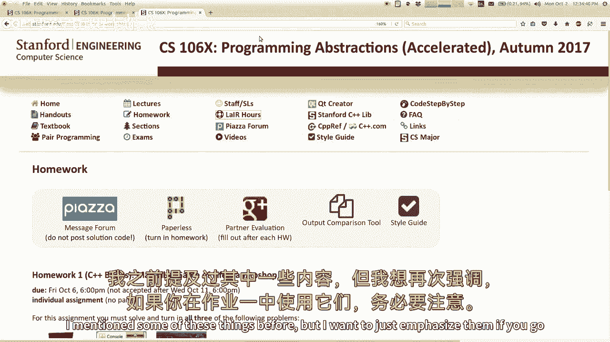

但我只想强调一下，如果你用它们做作业，你在家庭作业1中所做的。

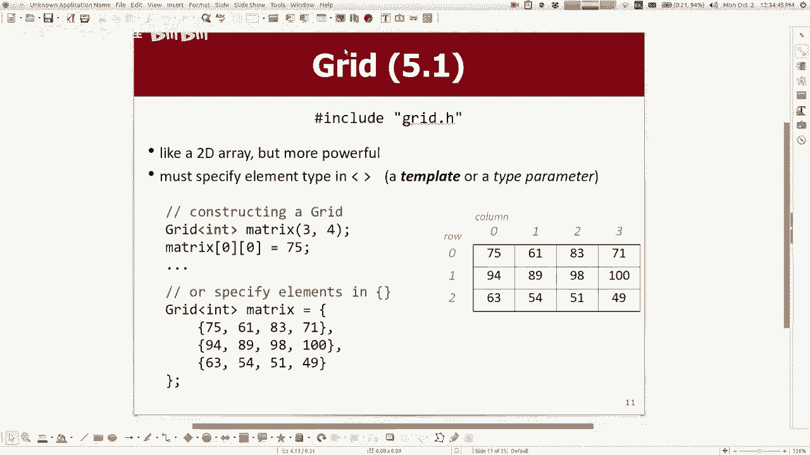

这是网格，网格点H，在那里你可以指定元素和东西的大小，然后你把这些元素储存在那里，在尖括号中指定数据类型，我想在这里提到的事情是，我想谈谈传递一个网格作为参数，我简短地提到了这个，但我们要收拾行李离开。

我只想再次强调，我们说好了的，这是什么意思，参照行为参照权，您应该始终通过引用传递网格，如果您将网格作为参数传递，从一个功能到另一个功能，你应该这么做的原因是网格是一个很大很大的东西，那需要很多记忆。

如果你不通过参考，C加加是什么，它把整个网格做了一个完整的副本，不会破坏你的程序，它不会导致程序行为，但是效率很低，今天我首先要讲的是效率，祝福你，你只是不想每次都复制一个网格。

你现在把它作为一个网格传来传去，当然如果你通过引用传递一些东西，这意味着您的网格与其他函数共享，对呀，所以其他函数可以修改你的网格，这很危险，这对调用此函数的人来说是一个潜在的危险，我把我的网格给你。

但你能不能不要乱来，如果你想通过引用传递一些东西，但你要保证你不会修改它的骗局，你可以传递所谓的常量引用，在那里你写了这个词，类型的恒前，然后它在这里，你看不到你是否在后面，但是如果你写常量这个词。

这类似于java中的final这个词，如果你懂Java，它使这个网格不能被改变，所以如果你想打电话，设置或清除，它不会编译，所以这实际上是一个很好的恒定引用，是分享和提高效率的好方法。

没有被后面的功能修改的风险，是啊，是啊，如果你故意想，我们正在做，如果你故意想复制，忽略一个值是可以的，你想这么做的情况很少，事实上，我认为更好的风格，作为个人的选择，我无论如何都会通过参考。

也许通过常量引用，然后在函数里面，我会说网格拷贝等于g，当你做等号时，并以C加加的形式将一个对象分配给另一个对象，不像在Java中，我想我们可以复制那个东西，在Java中。

如果将一个对象设置为等于另一个对象，它们指的是同一个物体，它不会复制，但它会用c++复制一个副本，我认为这是一个更好的，更好的一般风格，即使他们最终基本上做了同样的事情，所以好吧，所以请记住。

当你通过收集，通过引用，您应该通过引用传递的另一种数据类型，如果您正在传递一个文件流，类似于if流作为参数，你想通过引用传递，因为您不想复制文件阅读器的多个副本，当您遍历代码时，所以无论如何。

另一个问题，是啊，是啊，你把常量也放在原型上，这个更多的骗局，你得把它，如果你做了，带有分号的原型，你得在那里穿上东西，你得把犯人放在下面，当您编写函数的主体时，事实上。

也许我应该在这张幻灯片上添加一些东西，如果你，如果它们不匹配，如果分号原型说函数体的常数，没有说缺点，反之亦然，你会得到这个令人困惑的错误，上面写着建筑找不到的符号，八六六四，这就是它告诉你的一切。

它甚至通常不会给你一个行号，所以这是一个可爱的创造者真的真的很有帮助的例子，其实呢，我能演示一下吗。

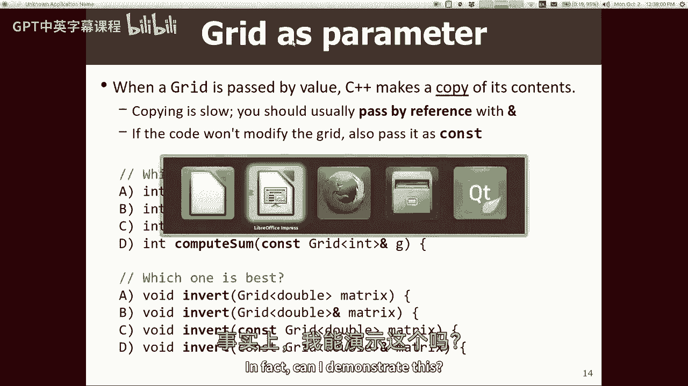

基本上是我对C++语言的憎恨，我对可爱造物主的憎恨，我只是在教这门课的时候很有攻击性，所以如果我做了无效的Foo，常量int x您可以将int作为控制台传递，那就没那么有用了，但在这里，如果我说。

让我们看看四十二，但是现在如果我写void foo，我说int x，我相信我现在会得到错误，否，我没有到那里，好极了，这就是为什么我，是啊，是啊，如果这个没有常量的话，而这个有，我不知道。

这种语言太愚蠢了，你们真的，它甚至不会失败对吧，你知道吗，等等，好啦，哈哈哈等等，啊，我应该运行它，哦天啊，我很害怕，如果这个的int引用，另一个只是int，那怎么样，好啦，我得到一个不同的错误。

我忘了，我等一下再找，但基本上，如果你的缺点不匹配，在某个地方，而不是在其他地方，您经常收到错误消息，作为我的观点，这不是很有帮助。

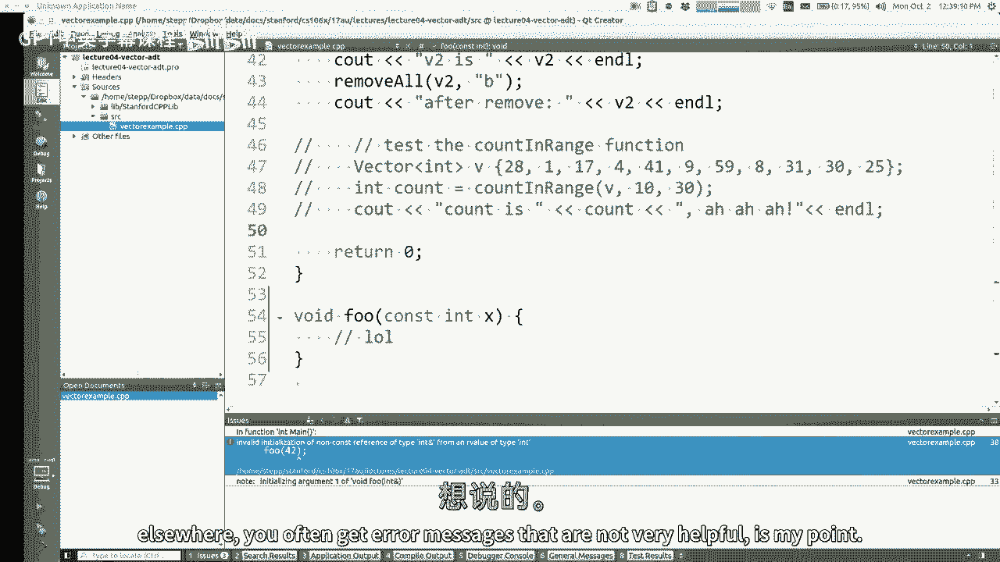

所以不管怎样，注意引用和常量问题，你传递参数，如果你想练习网格，我不打算在课堂上做这道题，只是为了时间，我想研究一种新材料，但是有这样的练习，上面写着，编写一个函数，它接受一个网格并尝试计算这个。

或者您也可以尝试在我们的代码中解决这些练习，逐步网站，如果你想在开始做作业前试着用网格练习，是啊，是啊，在后面，你可以在某个地方使用常数。

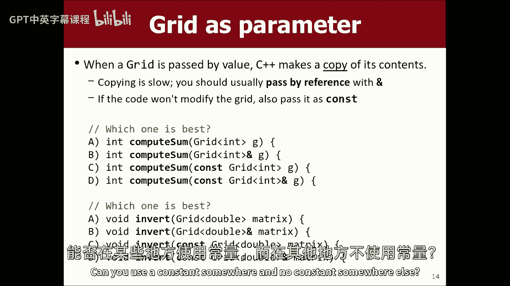

重复一遍，哦所以，如果你在一个地方说常量，但你在另一个地方不说常量，就像原型一样，对不起，你能再说一遍吗，你定义了两个不同的函数，使相同的，哦好吧，我想我认为这种情况发生在学生身上最常见的方式。

您是否编写了一个名为foo的函数，你取一个矢量或一个网格，或者某种集合作为参数，然后你就要上交了，你认为，哦，马蒂说我应该参考一下，所以你加上一个与号，但你忘了把它加在两个地方中的一个。

你把它加到分号原型中，但是你忘了把它加在下面，反之亦然，或者常量也一样，你一开始，你不做任何常量，然后你回去，你去，哦，马蒂说我们应该做些东西，康斯特，所以你，您将常量放在一些参数上。

但你忘了两个地方中的一个，这通常是引入这种错误的地方，然后编译器的消息有时不太容易理解，所以这是需要注意的，如果，如果这些信息，我看到你的手了，如果您看到这些编译器错误，你很难理解。

尤其是如果你在这里连行号都没有，这有时会发生，你能做的，是不是有个标签写着编译器输出，看它旁边有一个小数字4，如果你点击它，它就像编译器的原始输出，出于某种原因，可爱的造物主拿着这个。

试图把它打扮得漂漂亮亮的，但它并不总是做对的，就像这里，这个会告诉我，哦，在这条线上错误，或者别的什么，有时在这个问题选项卡上的主要问题，很难读出错误，但有时在这个编译输出选项卡中，你可以读。

所以要注意这个问题，现在又有一只手举了起来，是啊，是啊，我还有一个问题，你说的等于运算符复制和对象，是的，是的，因此，如果您想使其成为对对象的新引用，哦，等于运算符做了一个引用，它复制了一份。

那么你怎么做参考，您使用相同的与号引用语法，但是您使用该语法声明变量，我将在以后的课程中谈到这一点，但这就是你要做的，是啊，是啊，你喜欢那样，所以一旦你用了，你没有百分比是。

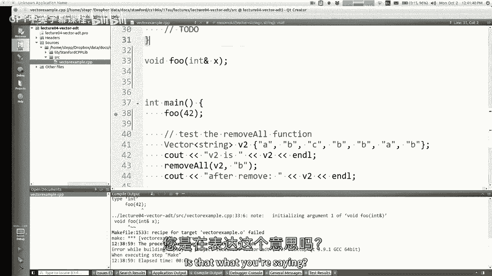

啊，问题是常量和与符号是否需要一起使用，或者当你这么做的时候会发生什么，或者不要一起用，我记得你说过，如果我用缺点，那是不是意味着，我不再需要使用符号，我想说那不是真的，我不同意那种说法。

但他们确实把事情分开了，与号的意思是不要复制共享的权利，常量的意思是不要让这个函数修改这个，所以它可能是复制品也可能不是，但你仍然可以锁定它进行修改，所以有一些不同的观点，常量基本上使某些方法不再编译。

如果你想说清楚，装满了，那些方法无法编译，如果你说康斯特，这些方法将编译，不管你说的是不是符号，但它们是否影响均值是不同的，是啊，是啊，为什么你要用球杆，没有与号的a常数，我不知道对于一个物体。

像一个网格，你可能不会喜欢，有时你传递一个常量或一个常量字符串，因为你只想要函数的代码，不是为了改变什么的，但它更罕见，我再同意一次。

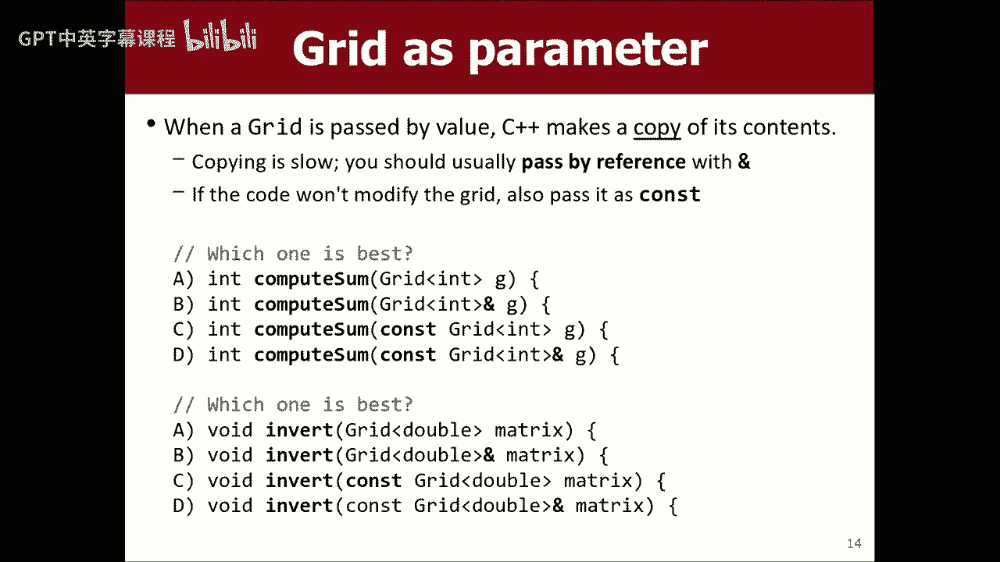

然后我想继续前进，是啊，是啊，如果您使用原型函数定义，把函数的文档放在原型中更好吗，用于执行，是啊，是啊，这是个好问题，你把你的评论写在原型上了吗，还是把你的意见写在这里，我会让你选择你喜欢的任何东西。

我想更常见的是，把它们放在这里，不要对尸体发表任何评论，因为我觉得你应该只看这个，然后知道你需要知道的，您不应该阅读所有关于它如何工作的实现代码，为了使用这个功能，所以这就是我认为的想法。

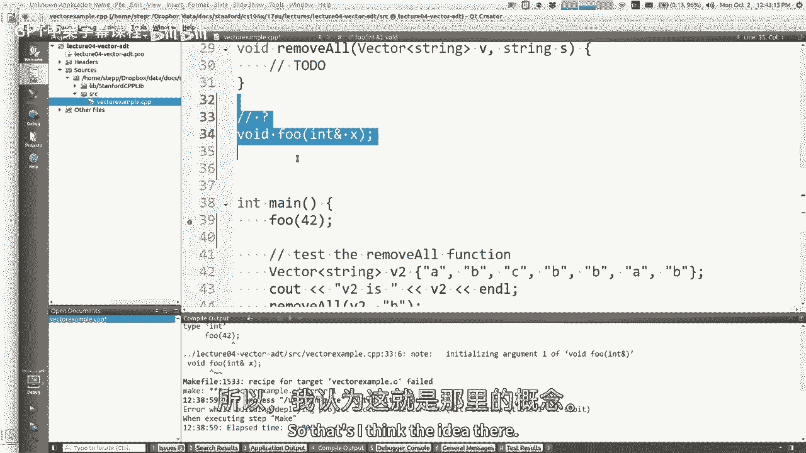

它是针对此代码的客户端的，好啦，所以说了这么多，我离开了网格。

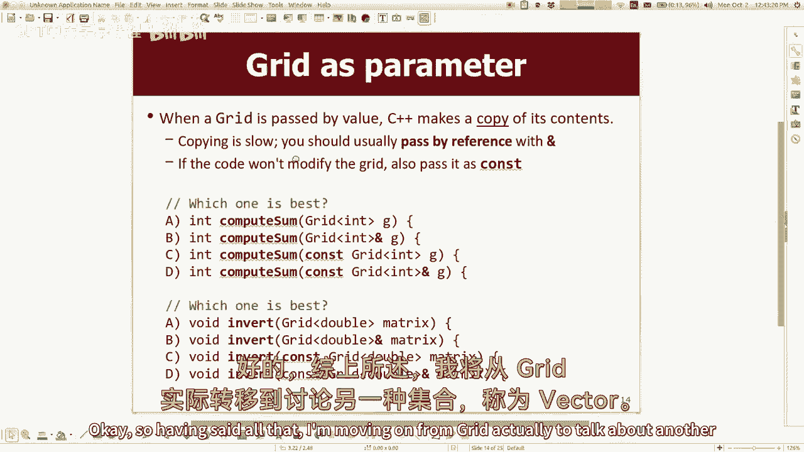

实际上要谈论另一个叫做Vector的集合，所以你们之前有一些编程知识，你们可能听说过Java中的一个集合，它在Python中被称为数组列表，它在JavaScript中被称为列表，它叫做数组。

所以大多数语言都有某种结构的概念来存储元素，以零为序，一二，上面有三个索引，这就是我们所说的C++中的向量，这就是我今天要讲的，在某些方面，矢量比网格更简单，所以你可能会发现我们先覆盖网格很奇怪。

我承认我们先掩护网格，因为我需要它做家庭作业，所以如果没有家庭作业，我会在周五谈论矢量，今天谈论网格，但是哦，好吧，管他呢嗯，所以矢量，有些语言称之为列表，如，我说，它是具有以0开头的索引的元素集合。

有些语言有一个单独的概念，就像从一个叫做灰色的列表中，这是一种固定大小的东西，而列表可能是一种动态调整大小的东西类型，我将重点讨论动态调整大小的那个，如果使用Java和数组，一旦确定数组的大小。

它永远粘在那个尺寸上，但是如果你做一个数组列表，它又长又缩，让我们看看你是否想在C+中使用向量，加上这个库包括向量h，上面有引号，这意味着这是一个斯坦福本地项目图书馆，我们在这里写的是关于这所大学的。

您可以通过说向量要存储什么类型的元素来初始化向量，如果你知道一开始的值是多少，你可以让他们参加卷曲比赛，所以这是一个由五个元素组成的向量，或者你可以做一个空向量，然后你可以通过点f来添加元素。

所以它从一个空列表变成了一个单元素列表，到双元素列表，到三元素列表，它根据需要生长和收缩，就在滑梯的底部，我有一个数组的示例，因为同学们总是问我，为什么我们要学习向量和列表，我们没有学习数组。

但是什么东西没有数组呢？它确实有数组，但他们很烂，所以我还不想用它们，也许以后我们会用它们，语言里有一堆愚蠢的东西，我不想谈这个，如果我能逃脱惩罚，其实呢，你知道周五下课后肯定有很多人。

他们问了我一堆有趣的问题，关于语言，关于语法之类的，我很高兴总是谈论这些事情，但我确实认为这门课的禅意是，C加+不是重点，它是一种用于某些情况而不用于其他情况的语言，在这之后。

您可能再也不会编写C+Plus代码了，所以我想，迷失在C++的细节中并不是这门课的真正重点，真的吗，我想谈谈管理数据和编写算法，还有其他更大的图景，尽管细节可能很有趣，也是，对呀，是呀。

所以如果你只是想要一个列表，列出哪种固定大小，有什么不对，啊，如果你想要的只是一个固定大小的集合，为什么不直接使用数组，因为矢量的好处是它会生长和收缩，如果我不想成长和缩小呢，我想说总的来说是的。

如果要修好，好处会少一点，但是常规数组丢失了，很多事情，比如你不能要求它搜索一个元素，否则你不能轻易分类，如果你试图在数组上出界，你可以，C++会给你垃圾数据，而这个东西会给你一个错误消息来帮助你调试。

所以我认为这样做还有很多其他好处，事实上，关于C++数组，我最不喜欢的一点是，他们甚至不知道自己的大小，所以你甚至不能问它有多少元素，当然让你问了，所以说，我想说总的来说，因为光线不太好。

他们几乎什么也不做，是呀，像这样的问题，所以在向量库中，我们使用右边，C++附带了那个stl集合库，它也有一个向量类，用尖括号而不是引号导入，那个和这个有什么不同，我是说，我想说我现在不想讲太多细节。

因为我不想在课程结束前教收藏，就像我想教你我们所有的收藏，你习惯了他们，你试试看，你跟他们一起做作业，后来在课程中，一旦你的收藏忍者，我会说嘿，这是另一个，这真的很简单，你很容易转换过来，嗯。

我的意思是给你一个非常简短的回答你的问题，他们有很多相同的操作，但它们使用的名称略有不同，语法略有不同，所以如果你学会了这个，很快就会映射到另一个，如果你好奇的话，您可以谷歌搜索STL矢量教程。

你说的是旧的大O，我想在后面的课上讨论这个问题，是啊，是啊，是的就是去掉矢量，或者是一个网格，向量的向量，它是使用，我相信内部的二维数组，如果你想知道，实际上，您可以在一个项目中打开网格h。

然后再查看一个，然后我会继续前进，是啊，是啊，等于向量声明中的边，或者就是这样，哦矢量数等于0，这招管用，这是一个法律语法，是啊，是啊，你不需要等号，它将用等号编译，但你不需要有点奇怪，这就像一个语法。

C加+有好的，所以矢量，是呀，为什么我们不使用数组，我想我已经说过了，这张幻灯片上有什么，他们什么都不做，他们不知道自己的尺寸，他们不知道他们的平衡，他们错过了你想要的所有手术，我已经说过了。

所以我不打算继续下去了，下面是向量最常见的一些方法，我想你用矢量做的是添加元素，取出元素并移除元素，可能会问尺寸或冰箱一个矢量，这些是你会做的最常见的事情，但也有很多其他的方法。

向量允许您使用此括号语法访问元素，或者你可以说，它看起来更像Java，两者都是平等的，您可以使用这两个索引，所以这很酷，当您在控制台上打印出矢量时，它显示了大括号和逗号之间的元素。

所以很容易打印一个用于调试，是啊，是啊，问题是C++是否意味着两个字符串，如果你是为了看，更好地使用，我喜欢你的，哎呦，是啊，是啊，在Java中，当你打印一些东西，它隐式调用该方法。

在那东西上加两根绳子来弄清楚如何打印它，C++实际上没有作为一种语言内置的概念，所以这个类在技术上提供了一个双字符串方法，而且是可以打印的，但从技术上来说，这些代码是完全不同的，碰巧做同样的事情。

因为语言没有赋予这两个字符串方法特殊的公民身份，实际上要做的是编写一个名为小于的运算符，它描述了如何打印矢量，我真的不想去，是啊，是啊，反正，两个字符串返回字符串，而输出操作员在控制台上打印东西，后面。

是啊，是啊，我只是说输出流，可能是C出来的，可能是个文件，可能是O弦气流，是呀，对不起，这些幻灯片有时会有点浓缩--再来一张，是啊，是啊，所以当当前向量像这样。

它包括小于beta的小于和大于的数据和签名，你把类型，你必须总是，让我们说，如果你要做一个新的矢量，你说等于两个修女，你能直接说矢量吗，你总是要说括号int，每一次，C++从不推断数据类型。

您必须始终将类型写在括号中，只是语法的一部分，好啦，所以这些就是方法，我不打算在他们身上花那么多时间，因为我打赌你用的结构和这个差不多，在你来这里之前学的任何语言，所以你去那里。

大多数语义对你来说并不震惊，我想如何在向量上迭代，你如何在元素上循环并很好地观察它们，从零到大小的相当标准的循环，打印元件支架，我那就像，可能是在矢量上循环的最常见的方法，我相信你以前写过这样的循环。

如果你想倒退，你可以从减一的大小活到零，你以前可能做过类似的事，每个循环都有一个，你说每个屏幕，在这个矢量中被称为名字的东西，记住这里是字符串名称的向量，所以对于里面的每一根弦，我把它打印出来。

如果您以前没见过这种语法，基本上和上面这个差不多，只不过它将这个变量名设置为名称零，然后说出一个，然后说出两个，它把每个元素都拉出来，将其存储在这个局部变量中，然后让你访问它，然后循环。

对下一个元素做同样的事情，内部，这是使用一种叫做迭代器的结构，它在向量内部帮助实现此行为，每个循环都有一个变化，如果你写与号，它通过引用这两个循环之间的差来为每个循环执行一个，你基本上只用第一个。

但是如果你用与符号的第二种形式，那么如果你真的改变了这个局部变量的值，它实际上到达向量并改变向量的元素，所以你实际上可以循环它并使用语法修改它，在蓝色的后面是真的，是啊，是啊。

所以一个向量只有一种类型的向量，只能存储一种类型的值，是啊，是啊，如果要存储多种类型，有一些黑客可以做到这一点，我是说，其他语文，在C++中有一种叫做like object的类型，另外。

您必须使用一种叫做指针的东西来帮助获得这种功能，但在大多数情况下，我们只处理给定向量中的一种类型，如果你有矢量，其中每个元素都像一个网格或其他您为，这是个好问题，我有张幻灯片是关于收藏的。

如果你的向量存储了其他向量，你为每一个人，它确实复制了每个内向量，当它循环通过，所以你特别想通过引用来循环这些，是啊，是啊，那很微妙，但这是会出现的事情，基本上有一个c加+的规则，每当你有一个物体。

创建一个新变量来与该对象对话，那不是参考变量，它将创建一个对象的副本，并将其放入该变量中，所以这是你必须注意的事情，在蓝绿色的后面，你必须为每一个，保证按索引顺序通过它们，它按索引在它们上面循环。

你从零到，你不能改变顺序，这只是它给出的命令，如果你关心的顺序与此不同，或者如果你想知道索引是什么，当你循环的时候，你不应该用这个，你应该用普通的，基本上你可以修改四个内的向量，每个循环。

或者如果你在这里使用这个参考表单，您可以尽可能地修改元素，你喜欢，从此处或在此处插入和删除元素，如果你打电话，删除或插入，嗯，会混淆矢量，因为你在改变它的容量和大小，当你迭代的时候。

它可能会导致异常崩溃，如果你或腐败，是呀，我是否得到每个循环的每个规则，按从零到结束的顺序循环，就像一个常规的循环，好啦，所以呃，有一件事要注意，你知道的，矢量的好处是，你可以在任何地方向它们添加元素。

它将为新元素腾出空间，例如，如果你说，插入索引二，四十二的价值，这就是矢量的整个状态，就在索引2之前，它会把房间里的每个人都滑过去，然后它会把新元素放在那里，那很巧妙，Java中的规则数组之类的。

不知道怎么做，如果您告诉它要删除一个元素，它将删除该值，然后它会把每个元素都滑过去，向左一挡遮挡现场，把房间都用完了，所以这很好，偶尔，这会导致您正在循环的bug，你在插入，或者类似的东西。

其中一个问题是问，但这些都是很好的插入中间的功能，在最后，几分钟后我要谈一件事，是因为矢量，这个，暗示插入的速度较慢，把靠近矢量前面的东西去掉，因为如果你在这里插入一些东西，你得把每个人都滑过去。

但是如果我在这里删除一些东西，我没必要把任何人滑过去，如果我在这里删除一些东西，我得把其中一些滑过去，但不是所有需要时间的，你要滑动的元素越多，计算机需要更多的处理时间来做到这一点。

我们稍后会更详细地讨论这个问题，但我认为现实世界的类比是显而易见的，对呀，就像如果我在前排选一个人，我说嘿让开，我有个新学生，我需要一个座位，每个人都得站起来挪过去，做那件事需要更多的麻烦，对呀。

所以无论如何，这是矢量的一个很酷的特征，我这里有一些代码练习，我想我要做其中一个，我要和你一起写一个叫搬家的，其中将字符串向量作为参数传递，传递一个元素值，你想摆脱的，我会把所有出现的值从，好啦。

如果我有一个矢量，你说把所有的蜜蜂，你只剩下一个。

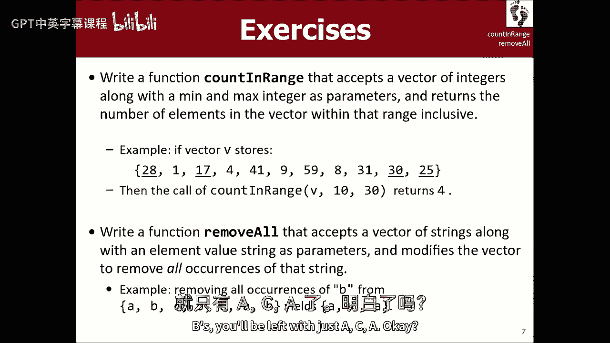

所以如果我去做我的项目，如果你想合作，这个项目在今天的课程日历下的班级网页上，让我把之前的这些foo东西删掉，所以我已经有了一个方法，主要功能主要，在那里我做了一个矢量，我把矢量打印出来。

然后我去掉所有的B，然后我再打印一次矢量，你看，我只是想看看你有没有做到这一点，在这里我有函数的标题，给我一个矢量，去掉所有这些字符串，所以如果我编译并运行它，我想我会看到的是，它只是没有去除任何东西。

对吧，因为我们还没做对，在去掉冒号之前，让我把这个改成v2，这是在说V之后，告诉我你想让我怎么做，我得到了函数头，有那种表情吗，好啦，这是你想让我在这个函数中使用的标题吗。

这可能是我作为教师在教学生涯中的第一个错误吗，会是什么你不喜欢我的头的什么，是呀，大人，我应该参考一下，好啦，是啊，是啊，有道理，因为我调用这个函数，我希望之后的矢量会有所不同。

主要是因为人的功能发生了变化，需要参照传递，好啦，应该是常量引用吗，否，因为函数的全部意义就是把愚蠢的事情改变对，所以是的，我不想让它保持不变，我想改变它，好啦，帮帮我，我该怎么做，好啦，迭代。

在上面绕一圈，什么样的循环，常规用于循环，或对于每个循环，向前向后，我们在伟大的，是呀，你说呢，我说，向后，向后，经常或，我想你可以，但你可以倒着做，因为这样你就会把你避开的元素弹出来，就像所有的转移。

好啦，所以你是说，你想让我把这个东西倒过来，所以你想让我为每个人存钱，我是小于或没有，你想从另一端开始，V点尺寸减一，只要i大于或等于零，然后你想让我做什么，每次你遇到和我们匹配的号码。

如果v元素i是我要找的字符串，然后去掉那个元素，所以说v点，移除，是啊，是啊，好啦，让我编译并运行它，那是一段很短的代码，嘿嘿，看那个，我想所有的蜜蜂都走了，那太好了，所以好吧，我只想指出，我的意思是。

那是正确的解决办法，我喜欢这个解决方案，很多，我想指出几个变化，有一件事我想提一下，你很聪明的说，让我们回到过去，让我们从头开始，如果我改变了它呢，并说，让我们从零开始到最后对吧，所以让我们做int。

我等于零，我小于v点大小，我加加，然后呢，它擅长什么，让我们一探究竟，怎么会有一个留在里面，我打赌你们很多人都能看到这个，所以我从那里开始，那个小胡萝卜是对的，所以i int i=0。

所以如果vi等于啊，B不，它没有，所以我有，我加加，好啦，现在我在这里，啊哈，Vi等于s，所以我去掉那个值，对呀，所以是的，然后我的循环绕回来，所以我有，我加加，所以我去了那里，所以现在我说的是。

这等于我想删除的东西，是呀，它是如此的移除，以至于一个，好啦，现在就把它取下来，我的循环绕回来，所以我有，我加上，加，你看到了吗，所以我实际上，当两只蜜蜂排成一排，前循环错过了第二个，因为它会删除。

把每个人都滑过去，我增加我的指数，把我推倒，所以从技术上来说，我在那一刻总共有两个动作，因此有人可能会错过，所以向后循环效果更好，因为你右边移动的元素，是你在某个特定时刻已经看过的，你通过改变，如果我。

啊，那很有趣，所以当v i等于s表示移动时，我嗯，那可能行得通，除了我认为可能有一个错误的情况下，就像如果它结束了，就像，你知道三个B不是吗，我要去汇编，我要跑了，它撞车了，因为我认为发生的事情就像。

它在啃那些蜜蜂，但最终没有元素留在那里，它说嘿是下一个元素，a b，就像，啊，我从矢量的边缘掉了下来，这里没有元素，你可以说，你知道的，当i还小于b的时候，但我认为实际上在这一点上，它并不干净。

我想我喜欢另一种方式，所以我会回到，如果和我回到这个，然后我觉得我很好，我们也可以加一条线，作为，那是另一种方式，当然你可以把它留在这里，它在哪里，如果你能移除，你可以说I减去哎呀，我减去减去回去。

然后你的泡芙加会让你回到原来的位置，这也有效，我有点不喜欢，因为它有点笨重，就像，为什么这里有一个i-，我认为最好的解决方案是这个，但其他方法也可以奏效，是呀，大人，外面也是，不断地重新评估。

这就像大多数语言一样，在循环开始时，这里的这一部分被评估一次，而且只评估一次，这里的公园在每次通行证之后或之前都要评估，我想是的，如果我突出显示的这部分包含V点大小，它会一遍又一遍地回忆V点大小。

如果v点大小在变化，所以它会看到这些变化，这里的这部分是在每次通过后实现的，所以是的，三大块中的第二和第三本书在每份请愿书上进行评估，但第一块只是在这些陷阱的开始，去掉for每个循环。

关于每个循环的问题是，它很适合改变一个元素。

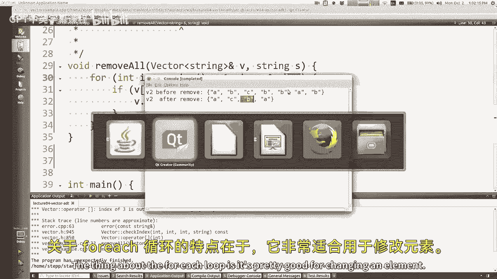

就像这里，其中有一个现有的字符串，并且希望更改它，很难让人喜欢，删除字符串，所以它就这样消失了，您可以想象将它设置为一个空字符串或其他东西，但是现在你有一个向量，其中的元素是空字符串。

而不是缺少一个元素，所以这不是一回事，所以是的，反正，好啦，这只是一个简短的编码示例，如果你想玩小编码向量示例，书中有很多步骤和其他地方，还有各种练习，大多是，我想矢量对你以前见过的东西很熟悉，我猜。

所以我不会花太多时间在它是什么上，以及它是如何工作的，嗯，我想简单地谈谈收藏的收藏，几分钟前有人问过这件事，所以你可以有一个矢量，我不知道这段代码是否难读，但是你可以做一个矢量，几个向量。

然后你可以做一个向量的向量，你可以把向量的向量加到向量的向量中，然后你就可以打破向量中的向量，看起来是这样的，你可以用模糊的括号访问，意思是去划船，把索引一的元素，就是这一排，然后在这一行中。

转到索引1的元素，所以应该打印三个，您可以在一行或一条语句中初始化整个内容，如果您想使用这种语法，所以这看起来很像一个网格，对吧，这是一种二维的东西，这和网格有什么不同，不仅仅是，向量这个词的次要用法。

而不是网格，他们有不同的名字，道路的长度可能不同，是呀，它可能更像是三角形，而不是网格，必须是长方形，所以你可能会说，哎呦，这个更好，我不知道，我觉得，如果你知道你想要一个长方形，伟大就是好。

但是如果你对每一个都有不同的链接，出于某种原因，也许矢量是好的，另一个问题，是啊，是啊，我们会做一个，具有不同类型元素的向量，我今天不能教你，因为我们必须知道指针，基本上，但你可以做到这一点，这很复杂。

但你能做到，是啊，是啊，我注意到当你写矢量和矢量的时候，两个直角括号之间的空隙，以防止它，从把它和操作员混淆到对，正确现在看，我你们，我喜欢得到对自己的赞美，从你的无伤大雅的陈述中，不是为了赞美我。

因为你看到他做了什么，他说，你为什么在这里有空间，你需要那个，他没说，嘿嘿，哑巴，你搞砸了，如果你放了一个不是，他相信，我不可能只是搞砸了，把事故放在那里，两地，但实际上在这件事上你是对的。

我确实这么做了，但我只是想说谢谢你假设我想做的，那表示你认为我很注意细节，或者我选择这样解释你说的话，还是没说，嗯，你知道的，我们需要理由来自我感觉良好，对呀，所以那是我的，我知道，什么时候放空格。

我觉得你应该一开始就去太空，摇摇晃晃的，它是不平衡的，所以你想在这里听，呆在你的车道上，Pal，呃不，不管怎样，呃，为什么很快就有，我在这里有一个空格的原因是旧版本的C++编译器。

如果你把两张结案陈词的唱片放在一起，你以为你在读箭头操作员的文件，它可以使用编译器，但是五年前他们把它修好了，但大多数人还是这样做，万一你有什么人可以起诉，C加+太愚蠢了，但是是的，技术上来说。

如果你把空格去掉，对你们所有人都有用，因为您最近才安装了编译器，所以你很好，但是是的，好啦，反正，你可以有一个集合，我不认为这个特殊的例子是超级常见的，但你有时会有一个矢量的网格或地图的矢量。

或者所有这些不同的东西，我会告诉你随着我们的继续，是啊，是啊，有没有办法在你的源文件中知道你需要，表示您想要什么样的编译器，你可以，但讽刺的是，就像编译器一样，在你想要的之前，不会明白的。

如果你要求你想要的，因为它就像，我从没听说过，如果你说我想要2011年的版本，就像，没有那样的事，因为现在是2007年对吧，那是我出生的时候，所以你明白我的意思，你不明白的编译器，不会做你想做的事。

我是说，你可以，您可以编写这些构建文件来检查类似的事情，这有点超出了课堂的范围，我是说我不会逼你做任何事，得担心那些东西，但我想当你遇到它的时候就像，如果你必须在一些古老的服务器场上运行。

而这些服务器场不是你构建的，然后你发现你试图编译你的C++程序，你会有一些新的警告或错误，你没想到，你用谷歌搜索它们，你发现，啊，他们在2009年的语言中改变了这一点，啊。

所以这台服务器一定是2000年8年或7年左右的，但它发生了一点点，但不管怎样，好啦，所以我想少谈矢量是什么，因为我觉得你能弄明白，或者至少已经知道怎么做了，我想更多地谈谈它是如何建立在里面的。

我想谈谈效率，讨论我们所说的大o符号，大多是，它来自书的第十章，向量内部，有一个数组，当我说数组，我是说，这个固定大小的内存块可以存储东西，在Java意义上的数组，或者单词数组的C含义。

向量实际上在很大程度上存储了三样东西，它存储一个数组，它存储了两个整数，称为大小和容量，所以如果你把这个矢量，它有六个元素，所以作为向量的用户，你认为这是一个，就像一个六号数组，基本上是对的。

但如果你需要它，它可以生长，在这里面，它通常比六号大，可能是十号的，也可能是十号的，也可能是二十号的，可能有一百个，至少要六个小时，但可能不止六个，他们这么做的原因不是让它正好是六个。

是因为如果你想添加第七个元素，它可以把它粘在数组的末尾，如果你正好有六个，但是你想加入第七个元素，你觉得你该怎么做，您必须创建一个更大的新数组，并复制所有内容，然后现在为将来使用这个新数组。

因为数组的大小不允许增长，他们不会，它们没有生长特征，你用它来筹集比你告诉用户的更大的资金，所以用户认为这是七号的，但实际上不仅仅是那个或六号，好啦，但我们有六号的，我们有十人。

这意味着总共有多少空间可以使用，如果大小和容量一样大或超过容量，复制到一个更大的数组，现在它确实提出了一个有趣的问题，虽然，就像暗地里有另一个元素在这里，即使你没有要求，如果你试图要求元素，本指数。

它会给你这个零吗，因为那会很奇怪，它在矢量的实现中的作用，如果你问七号老人什么的，它会看到它的大小，它会给你一个错误，但从技术上讲，那里有一个元素，它就是不让你看到，好啦，这就是现在里面的东西。

如果你想插入，还记得我说过一切都会好起来的吗，如果你想在这里插入，好啦，我把这个移到这里，这个在这里，把这个移到这里，然后我会把你的元素索引，一次又一次，因为我还有空余的空间，我有能力做到这一点。

如果我撤下，我让每个人都站在这的对立面，我想我恢复了更多的能力，你可能会说，哦，会的，会的，就像，缩小数组以适应，通常没有，因为它不是很有用，我们只是在最后留下多余的空间。

我喜欢在这里做的类比是当你买房子的时候，我告诉过你我妻子和我，太棒了，我们住在一个小房子里，我们希望这是今天的笑声，我们希望能在湾区买栋房子，总有一天哈哈哈哈，如果你们都支持我的创业。

也许有一天我们可以，但是嗯，但不管怎样，当你买房子的时候，好像我们有两个人，所以我们可以买一个一居室的房子，因为剧透警报，我们共用一间卧室，就像我们做一个卧室的房子，但那不会有很大的空间，嗯。

然后我们有了一个孩子，现在一个孩子需要一个房间，所以我们要去买一套两居室的房子，我们会把所有的东西都搬到一个有两间卧室的房子里，哦，又有一个孩子要出生了，我们去买一套三居室的房子，我们会再次搬家。

真是件苦差事，每次你再生一个孩子都要搬这么多东西对吧，所以我在这里的意思是同样的，所以你通常会去买一套四五间卧室的房子，不是在这附近，因为没人买得起，但我很高兴能在湾区工作。

房地产咆哮进入我们今天的矢量讲座，但你买了一栋有额外容量的房子，所以你可以用它，当你需要的时候，如果你把它装满，就像你发疯一样，你就会说嘿孩子们，或者当你需要的时候去买更大的房子，把所有东西都搬进去。

但你不想经常搬家，所以你可能想买一个，那比你以前的那个大很多，同样的想法，但没有那么令人沮丧，我觉得，有一件事我想指出，我们说过当你插入，删除，你得滑动元素，你从左边插入的越远，或从。

你要滑动的元素越多，这意味着这些操作的运行时相对于，您要求在其上执行它们的索引，想想很有趣，因此，让我们用一分钟的时间来讨论运行时和效率，效率这个词是一个笼统的术语，它是程序对资源使用的度量。

所以当我们谈论效率时，我们是说时间，跑多久，这个算法效率有多高，但可能是内存效率，就像，存储所有数据需要多少内存，可能是网络效率，有多少请求，我必须发送到服务器来解决这个问题，因为网络速度慢。

所以我想在最少的网络请求上进行优化，可能有很多资源对吧，但如果我只是说效率没有上下文，我可能在说运行时，那么你如何谈论程序效率，这实际上很难解释，原因有很多，嗯，计算机硬件复杂，软件和编译器复杂。

代码中的许多层都在干扰，但我们必须简化才能有一个模型，所以我们可以谈谈这些事情，因此，让我们决定单个语句运行需要一个单位的时间，这不是真的，因为它需要更长的时间，你知道的，乘以它所需要的加法或什么。

但我不在乎，我不想去想那个，所以像声明和初始化变量这样的语句，我们在调用函数什么的，语句需要一次，如果调用函数，所需的时间是该函数中语句数的总和，所以如果我调用函数foo，foo中有四个语句。

那么函数调用的这一行的代价是4，因为U中的四个语句现在又来了，那是不正确的，因为跳转到一个函数需要一点时间，或者往回跳什么的，但我们要简化一点，最后，如果你有一个循环或重复，重复n次。

那么循环所需的时间是，n乘以循环中的语句数，如果您有一个在正文中有三个语句的循环，重复十次，那么循环要30英镑，就这样，很简单，我想我没说这里还有什么，但就像，如果有一个如果和其他。

然后像填充物的成本如果牙套，还是馅料的成本，另一个是牙套，取决于代码最终是正确的，就像那个简单的模型，基于那个模型，如果你看一段这样的代码，所以我想说清楚，所有这些从语句1到最后的大括号。

所有这些就像一大块代码，你要说，我对这个代码了解多少，现在代码引用了一些我没有指定的变量n，假设这是一个很大的数字，一些变量，好吧好吧，如果你看这一行陈述，一个需要一个单位时间来执行的。

如果你看这个循环，有一个n的循环和一个n的循环，然后是c，所以这个循环的运行时为n，但我重复了N次，所以这个块的总运行时间是n乘以n，你知道n的平方，这里的循环进行了n次，里面有自由语句。

所以是3乘以n，所以这整个过程就像n的平方加3 n加1，基本上通过我们的哑模型，所以我是说这只是数学，但如果n是一千，那就是你知道一百万加三乘以一千加一，所以你知道这是大量的陈述，对吧。

我想让你从这件事中带走的是，某些代码块比其他代码块昂贵得多，事实上，这个说n的平方是超级昂贵的，如果n是大的，对吧，这里的这个看起来可能只是很大，是这个，我想有些人有直觉，就像它在屏幕上的大小是昂贵的。

或者线路数使其成本更高，有时这是有关联的，但这真的取决于线条的嵌套，重复是非常昂贵的，这是主导的东西，整个代码所需的时间，什么构成陈述，喜欢是int，I=一个不同于i冒号和i=，哦耶，你想对它挑剔。

就像你可以说的好，从技术上讲，这是，这第一部分是一个声明，然后这张支票是一份声明，而且是的，你当然可以这么想，就像我的模特，你可能会这么说，但我认为这是一个很好的循环标题，我知道循环会重复给定的次数。

我将把它简化，只需乘以，时报，身体里有什么，即使它可能是再加上一两个检查，你知道其中一些，这些测试什么的，是啊，是啊，如果你不，将语句定义为一行，其中使用如下操作，把某物等同于某物。

把某物赋值到某物的分数加法附近，是啊，是啊，我是说你可以想我们喜欢的不同的事情，一天的结束，你的计算机要计算或查看的一切，对的东西很重要，而且这个模型有很大的缺陷，是的是的，呃，直观的模型。

那是真的真的很简单，我承认这在各方面都是不正确的，嗯，但是，你去这里，它是嗯，它仍然有助于推理，我想我的声明仍然有效，代码的n平方部分是坏的，慢的那个，所以当你有一段代码。

想象一下你有一个更大更复杂的代码，你分析它的方法和我们在上一张幻灯片上做的一样，你想出了这个，你说这段代码运行点4和q加2，五分钟平方正加，这是声明的数量，我想这将基于我对代码的研究，如果你想推理算法。

如果你想对它们的速度或速度有一个很好的直觉，你真正想看的，并不完全是这个数字加起来的结果，你想不想考虑一下所谓的增长率，如果你有这个值n，你知道我的幻灯片和最后一张幻灯片的值是n，N是什么。

只是一些数字，但也许n就像向量的大小，我们将处理向量的所有元素，在找东西，或者是班上所有的人，我要去找一个学生，不管它是什么，n是输入数据集的大小，我在看，对于给定的算法，你真正关心的是，会发生什么。

如果我的输入数据量增加，会发生什么，如果班级扩大两倍，运行时将发生什么，很多人会说，啊，一个算法可能需要两倍的时间来运行，如果班级扩大两倍，但那不一定是真的，如果算法的运行时相对于输入大小。

这真的是你的n的翻倍吗，你知道的，使您的运行时在这里是双倍，双倍，在合适的时间加倍或八倍或其他什么，所以当我们试图解释运行时，这是你要做的，如果你能想出这样的表达，忽略所有常量，像这个25和这个8。

你只要把它们扔出去，他们确实很重要，但你把它们扔掉，就连这一点四，你把它扔了，你说，啊，它是正方形和立方体，加n的平方，加n加1什么的，然后你只关心最上面的术语，所以真的很喜欢这一切，现在唯一重要的是。

因为如果你增加n，您将在运行时看到一个相同增长的多维数据集，这才是最重要的，如果你有两个不同的输入，然后假设您有一条最多n的消息，另一个是n，您想如何使用，这是真的，这假设了一些。

它假设我们的算法只依赖于一件事，有很多算法依赖于两三个不同的东西，有多少学生，有多少个班，有多少所大学，不管有什么，有很多算法依赖于，您可以扩展这种逻辑来讨论每个算法是如何增长的，与这些事情的关系。

你可以对这样的事情进行多元评估，我认为它的核心，很多评估都简化了，这种事情重复并大于等于一次，你知道当我们谈论这个的时候，我们说这个算法按n到3次方的数量级运行，或者简短的说法，也就是说。

这个算法是第三步的末尾，N的大O到第三，再一次，意思就是，如果我增加算法运行时的变化，似乎是那个立方体，所以如果你看向量，你可以讨论向量的这些不同操作的效率，使用这种术语。

你可以说如果你想给向量加一个值，就是说，在矢量的末端放一些东西，添加操作，不需要花很多时间，你只要把一些东西放在那里，把矢量的大小增加1，当某些东西没有依赖于输入大小的运行时，名单。

你只要说它有一个恒定的运行时，它被写成一个的大O，并不意味着它只需要一个指令，这只是意味着它所需的时间与向量的大小无关，如果要询问元素的内容，使用需要恒定时间的方括号。

因为计算机只是为了跳转到内存中正确的位置，这与数据的大小无关，如果要删除或插入东西，它必须滑动所有这些元素，所以我们说它需要n的大O运行时，现在呢，当我们马上就要回家的时候，你可能会有一个问题，这里是。

但我想这需要不同的量，我想如果我在这里插入或删除，挺快的，或者这里是中等的，或者这里真的很慢，我如何决定在这里写什么，嗯，有人说最好的情况，平均案件，最坏的情况。

插入和移除的最佳情况是最后一个恒定时间的大O，一般病例居中，最好的情况或最坏的情况区域在最左边，看看所有这些，平均一下，如果你是，我们从很多不同的地方搬来，就像你在中间一样。

大约是n个元素的一半需要调整，n的一半仍然在，因为我们忽略了这些常数，所以我们会说，平均，这些操作需要n个，所以这是一种语言，谈论事情有多高效或低效的快捷表示法，如果你想说这很慢，而且这个很快。

说这是大的更准确，一个中的O，这些是大的，全都是，我没时间了，我要去我的办公室，在盖茨，一百九十五，如果你有任何关于家庭作业或可爱的问题，造物主什么的，我很想在那边见到你，我会在那里呆到三点。

祝你有美好的一天。

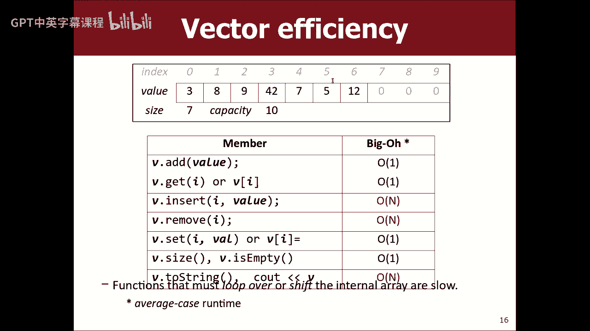