# 【编程抽象方法 cs106x 2017】斯坦福—中英字幕 - P6：Lecture 06 - Sets and Maps - 加加zero - BV1By411h75g

星期五快乐，下午好，第二周结束了，今天很高兴见到大家，我们已经用四分之一完成了将近20%，那不是很疯狂吗，我只是不敢相信，就像我去了一个有学期的学校，你知道你从八月份开始，你一直到圣诞节的前一天。

你学到了一些东西，你不只是呆了十个星期，哦好吧，不管我是什么，我们今天要了解更多的收藏，尤其是，我们将学习布景、地图和你们的家庭作业，今晚六点交一份作业，今天有两个出去了，我想它神奇地出现在网站上。

十分钟前，就在那里，我不打算花很多时间谈论家庭作业，但正义的正义，你知道的，作业二有三个部分，第一部分叫做字梯，b部分称为n克，c部分称为迷宫生成器，仅供参考，如果你拿116b。

你得做这一部分和那一部分，但你不必做迷宫发生器，那是x部分，就衡量两道菜之间的差异而言，所以是的，今天就要出去了，一个星期后到期，这是一种惩罚养生法，你们这些笨蛋都报名参加了。

所以去看看这个周末的作业重点是收藏，你们刚上完第一节课，我想你们中的一些人今天下课后可能会有，但你的第一节课，家庭作业二是结对作业，如果你想，你可以和朋友一起工作，如果你和朋友一起工作，可以选择。

你得和你的朋友在同一个区，如果你和你想一起工作的人不在同一个部门，您可以交换区段，你可以去CS一九十八网站，您可以单击交换部分的链接，如果你不能交换，你可以联系我们的头像，你可以帮你解决分歧，好啦。

所以要注意这一点，如果你想和一个搭档一起工作，我会指出，如果你和一个搭档一起工作，一个非常诱人的策略是把这些分开，就像你做的A部分和杏仁B部分等等，我是说我真的不认为你应该这么做，那不是我真正想要的。

我更希望你们能一起合作，嗯，但是嘿，我不能跟着你，我还不能监视你，呃，手机技术还没到，所以我不能强迫你有一定的工作方式，但我会说，如果你不做所有这些问题，你可能没有练习过这些结构。

然后在考试中你可能准备得更少，所以我觉得你是在伤害自己，如果你不熟悉这些问题，无论如何，那是你们该考虑的，如果你真的想和一个搭档一起工作，我建议阅读这里的链接，它说配对编程，它对我们的政策有一些讨论。

你该做什么不该做什么怎么做，或者随便什么，看看那里，我敢打赌，这将回答你关于两人一组工作的大部分问题。

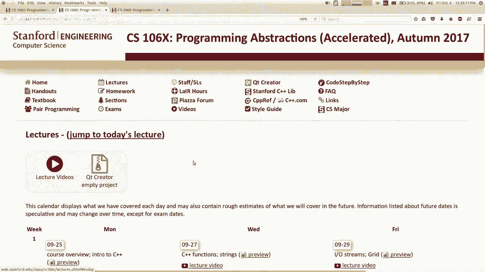

是啊，是啊，这就是我真正想说的，今天让我们来谈谈布景和地图之类的东西。

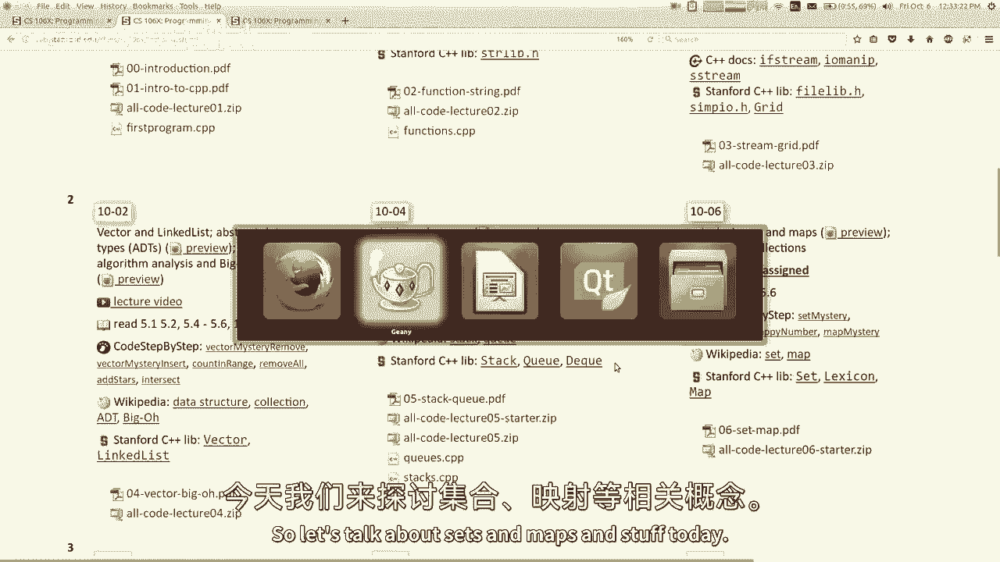

让我再次打开今天的幻灯片，这来自第五章，这周基本上是第五章，那么一套是什么呢，嗯，这是一个具有独特价值的收藏，无重复，集合通常是为了优化其行为而构建的，围绕着某一小套操作，这些操作是添加和删除元素。

然后搜索元素或测试成员资格，问这是在片场吗，或者不是一套能做的全部，我们在周三看到了一个想法，有时如果一个集合有更少的操作，那么也许它将能够实现它们，非常高效，这就是我们看到的堆栈和队列，嗯。

这里也会是这样，您还可以添加、删除和搜索向量或链表中的内容，但它不会像这东西那样快，希望我能在一分钟内告诉你，所以当你有一套时，你放弃的主要事情之一，你放弃索引和插入顺序的概念，所以如果你加上三个元素。

你不应该指望他们会在哪里，什么顺序，他们会在片场，事实上，我们甚至不认为集合是有顺序的，通常这就是为什么哎呀，检测到系统问题，哎呀没关系，嗯，希望我的电脑今天不会死机，所以当我画布景的时候。

我通常只是把它们画成这些无定形的斑点或圆圈，或者所有的元素都散落在里面，因为我想再次让你摆脱这种心态，像这样是第一个元素，这是第二个元素，好像我们不在乎似的，如果我们用一套，如果你这么在乎秩序。

然后用矢量什么的，所以你知道你问它，如果它包含两个，你问它吗，如果它包含单词B，它不是那么系统，问题，探长谢谢，如果你一直取消，最终他们会离开，就像童年的创伤，一样的按取消，一切都会好的，嗯所以是的。

这就是布景，真是一套，从概念上来说很好，这里有一个问题的例子，在那里你可能会使用一套，编写计算大型文本文件中唯一字数的代码，所以读读文件，找出有多少独特的单词，所以如果你看到像你好这样的词两次。

你只应该把它算作一个权利，你看五遍这个词，你应该把它算作一个词，当然啦，我在这里想说的是，一套词会很好，对吧，但我真的想开车回家，集合比向量更适合某些任务的观点，所以我想从错误的方式开始，使用向量。

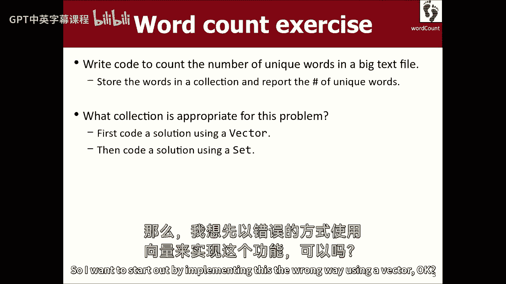

好的，好的，所以我们就这么做吧，我有一个可爱的创作者项目，在网页上，如果你想，我想写一个叫做单词计数的方法，您传递一个文件名，我会告诉你现在档案里有多少独特的词，让我们用矢量。

所以我做了与集合或向量无关的部分，所以我打开这个文件，然后我有一个循环，从文件中读取单词，然后当我读每一个字的时候，我只是小写的，你知道大写Hello和小写Hello，你好，所以现在它说这样做。

让我们把单词做一个矢量，同样，这是字符串单词的错误实现向量，好了，现在我只说单词点添加单词点添加，那不太对，是吗，我在代码的这一部分缺少了什么，检查它是否已经在那里，我不应该把同一个词加两次，对呀。

好啦，那么我怎么知道它是否已经在那里了，比如矢量是否包含，所以好吧，如果文字点缀，没有包含，奇怪的神话，点细，没有罚款，是谁设计了这个愚蠢的矢量，不管是谁干的一定是个大疏忽。

忘了包括一个在向量中搜索单词的方法，嗯，没关系，我想帮我们，我写了一个方法，调用的函数包含，传递一个向量和一个字符串，它会告诉你，如果那个字符串在向量中，所以我们可以看看我是怎么写的。

一会儿我真的很擅长编程，所以说，或者我想如果它不包含对，然后把它添加到列表中，好啦，所以如果我们假设我的魔法功能起作用，那就太好了，好啦，所以现在当我们做完，它说单词的整数数等于零，但这不算对。

档案里有多少字？我知道文件中唯一单词的数量吗，向量字的大小，点大小右，好啦，然后只是需要多少独特的词，好啦，所以我会编译，所以你知道，大家这周都过得怎么样？大家都好吗？嗯。

我妻子和我最近发现我们真的很喜欢这个节目，瑞克和莫蒂，这很有趣，我不，我不知道什么阴谋什么的，所以我们一直在观察，昨晚我们看到了这一集，叫泡菜里克，就像整集一样，他是个讨厌鬼，他只是想。

你知道他被蟑螂和鸟吃掉了，他在太阳下晒太阳，就像这家伙是整集的泡菜，这是最滑稽的事情，我们有一个非常非常酷的时间看它，我真的认为这是我最喜欢的新卡通片之一，啊，它是，好啦，所以有三十七个，三万字。

花了42秒，不得不在那里消磨一点时间，谈论我有趣的个人生活，现在这似乎不是一个糟糕的运行时，对，但我不知道，是吗，我是说，也许这只是需要多长时间，也许这只是一个计算密集型的任务。

只是需要很长时间才能表演好，有什么想法吗，你觉得为什么要花这么长时间，它在干什么，太慢了，当它运行这段代码时，让我们看看我是谁在后面没有听到，是啊，是啊，你写的方法，它意味着我们迭代单词的所有元素。

所以让我们在文字的大小上和他们一起去，所以当你到达，添加，当我们到达，哎呦，你检查的单词，要花越来越长的时间，然后，然后，这就是为什么它需要一个，是啊，是啊，我想这是个好主意，嗯。

虽然我不得不说我有点生气，听起来你在暗示，这个函数我写得不是很好，你知道我不太喜欢别人的批评，所以让你说，你认为我的函数通过向量，所以让我们看看，下面是函数对向量中的每个字符串所做的操作。

如果那个元素是我要找的字符串，那么是的，我有这个词，否则，如果我走到最后，我说假权，所以这叫做线性搜索，只要在向量中寻找正确的单词，所以每次你去看，每次你从文件中读到一个字，我必须调用那个函数。

所以每一个字，我走完整个矢量，现在，你可能会说，Almarty，你的实现是愚蠢的，你应该做这个或你应该做那个什么的，但我只是说，这就是通常如何使用矢量来解决这个问题，我们花了四两秒钟才把它解对。

好吧好吧，还有一种方法，这种方法是使用集合结构。

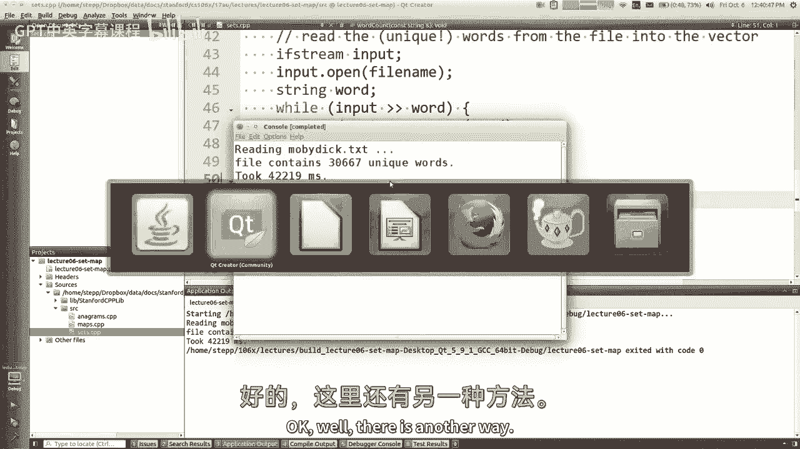

有啊，在我们的库中有两种C++集合，一个叫做集合，一个叫做哈希集，我一会儿再谈区别，事实上，先别读这个，有一种结构叫做set，如果你，如果包括集合H，您将得到一个集合，其中添加了这些方法，移除并容纳。

所以这是三个主要的，它也有是空的大小和清晰的，你可以用小于小于，但那是标准的东西，所以你看，让我来破坏这里的美好时光。

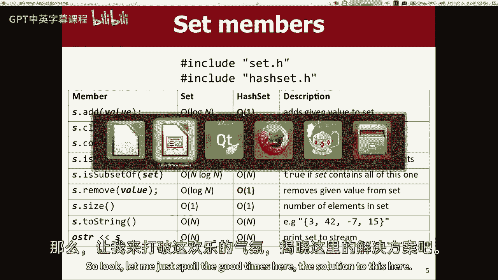

解决这个问题的办法是，所以如果我在这里而不是弦的矢量，如果我做一组字符串，我是否导入设置库，我做得很好，所以我用一组字符串，我编译它不再喜欢这一行代码了，因为这个函数要求一个向量参数，这不是矢量。

所以如果我只是改变它，集合集合实际上有一个contains方法，所以现在我可以要求片场这么做，所以记住4秒2之前，好吧，那次花了三百毫秒，所以这样更好，哈哈哈，但我们怎么才能听到你的敲诈摩根，嗯。

我下次再告诉你泡菜里克的事，我想事情就是这样，少给你点喘息的机会，如果你想休息一下，也许你更像是一个载体，人的类型，快多了，对吧，所以我希望这个演示能说明这两者的巨大区别，在这种特殊的任务中。

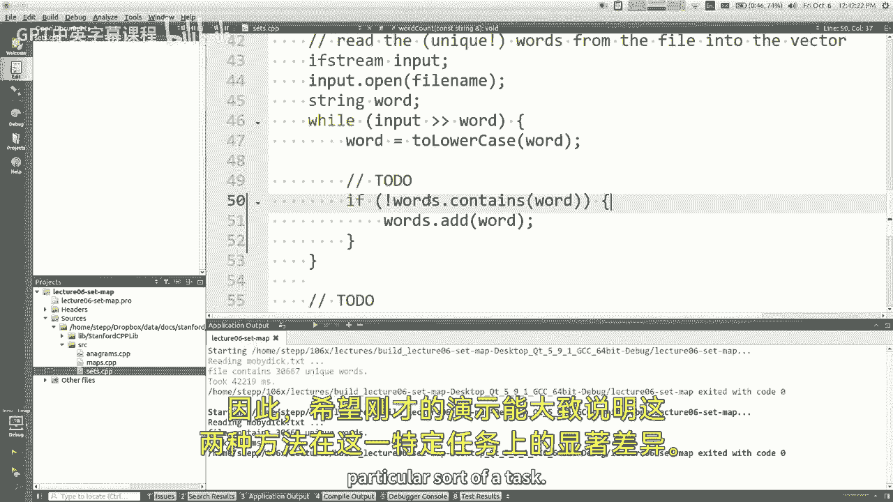

现在我已经把甲板叠好了，我挑了个问题，布景会很好，但是有很多这样的问题，所以让我倒回去一会儿。

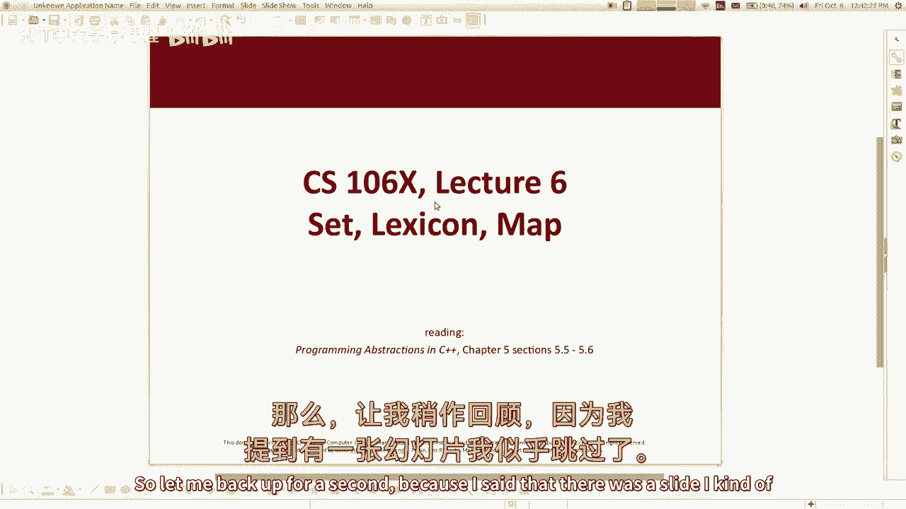

因为我说有个滑梯，我有点跳过了，我们图书馆里有两种布景，记住我以前教你的，关于如何有不止一种方法来实现相同的操作，我有个术语，你还记得吗，不是冗余，我叫它T，我听到有人说抽象数据类型，是啊，是啊。

有两个集合有相同的操作，有一个叫布景，有一个叫做哈希集，如果你是一个Java人，有一个叫做树集，一个叫做哈希集，那差不多，所以这两者的区别在于内部有不同的实现。

称为set的规则是使用称为二叉搜索树的结构构建的，我们以后会知道的，它以排序的顺序存储元素，速度很快，像字母顺序或数字顺序，或者类似的东西，另一个叫做哈希集，它是用数组构建的。

但是数组正在以一种特殊的方式使用，我们称之为哈希表，这个我以后再说，在课程中，还有，哈希集的排序有点不可预测，很难理解，但它比普通的快一点，所以我想如果你好奇。

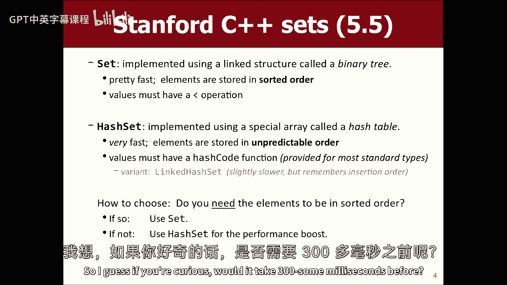

我以前花了300多毫秒，如果我在这里说哈希集，然后运行它，稍微花一点时间，比普通的少一点，所以好吧。

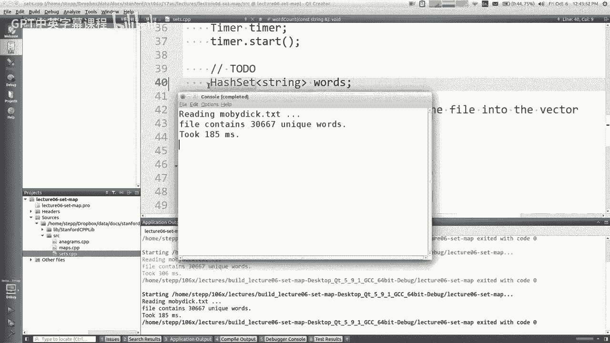

所以有两套，你可能会说很好，哈希的是更好的，对呀，但我觉得这个订单问题，因为有时候你想保持秩序，有时你不会，所以你可能会牺牲一点速度来解决这个问题，或者这个，是啊，是啊，您还需要包含操作吗。

如果您正在使用，这是个好问题，在代码中。

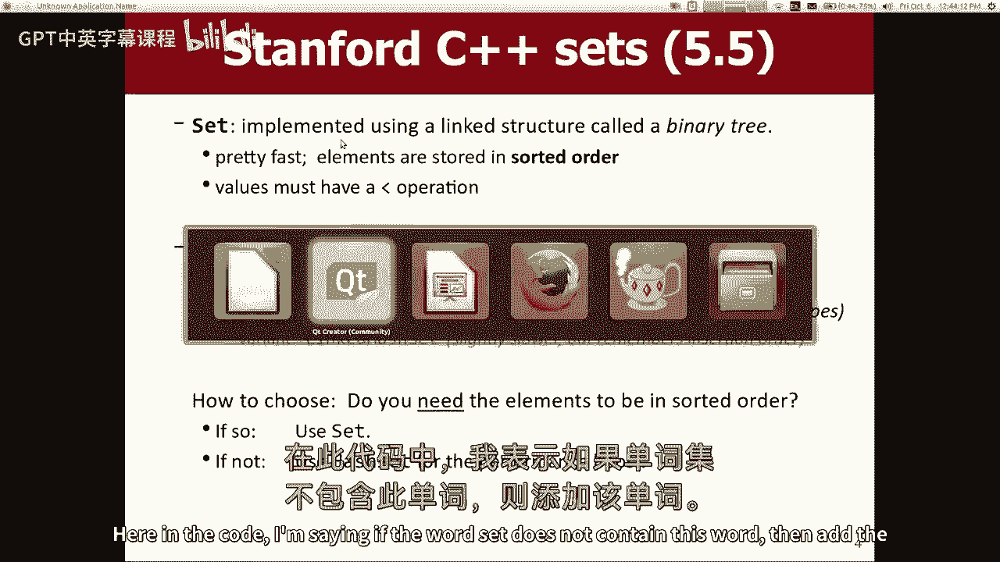

我的意思是，如果词集不包含此单词，然后加上这个词，但实际上我没有花很多时间在滑梯上，但是集合的加法，它不允许复制，所以如果你试图添加一个重复的，它会默默地无视它，所以我可以说单词加单词，不怕损坏数据。

我想我们看不出有什么不同，真正在运行时，打电话不需要很长时间，包含在集合上，但是好吧，我确实节省了几毫秒，所以我把运行时再缩短一点，所以是的，你对那个问题完全正确，理查德，那么如何访问这种订单。

如何访问排序的，哦，我马上给你看，您可以对集合上的每个循环执行此操作，我想说在很多情况下，我们不太在乎点菜，在很多情况下，我们只是想测试会员资格，我们不想在布景上打圈，但这取决于我们在做什么。

我们看到哈希启动实现比集合实现快一点。

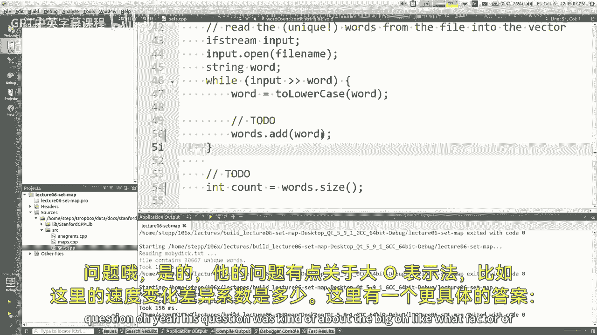

哈希步长比常数项快吗，或者是一些，基本上是其他的，哦耶，他的问题是关于，哦，比如这里的速度变化有什么不同，这里有一个更具体的答案，规则集的大多数方法都有log n运行时。

哈希集的大多数方法都有一个恒定的运行时，可能不太清楚，为什么会这样，这是我的一句话版本，几周后我会写张欠条给你更好的解释，当我们自己打开这些并重新实施它们时，这个集合把它的元素分成这个东西，称为二叉树。

在那里它不断地分裂，拆分，一分为二，当它搜索它的时候，有点向左，向右走，它沿着其中的一半，或另一个，所以这就像不断地把搜索空间一分为二来寻找东西，当你不断地除以或乘以2时，直到到达终点。

这就是我们所说的对数行为，日志基两个行为，哈希集里面有魔力，它有一个神奇的查找功能，你说的地方，嘿绳子，你在片场吗，实际上是一个大数组，神奇的哈希函数算法说得很好，如果我在片场。

我将是一个索引编号一八七五，所以它跳到那个索引，说你在吗，是的不是，这就是它所做的一切，所以再次哈希集，我以后会更好地解释这一点，哈希集，有神奇的算法可以把东西分类到非常特定的位置，并快速查找这些位置。

这是一个非常酷的算法，我以后会教你的，我只想让你明白这些是做什么的，当您使用它们时，如何成为这些结构的智能客户端，嗯，所以添加删除包含，这基本上就是你得到的，他们都很快，我想当我还是个学生的时候。

我学到了这个等价物，类似的事情，你知道它写在石碑上，而不是投影仪当时是1999年，所以当我听说这件事时，我就像，哎呦，什么更好的大目标，爱和你穿越，那太棒了，但就像原木底座一样，一个数字中的两个不太像。

你知道的，记住，这就像多么昂贵，这东西多慢啊，它生长得有多快，那么原木底座是什么呢？一千个中的两个，大概有十九个吧，是二的十分之一是一千二十四，所以如果你有一千种元素，它必须看起来像十个。

原木底数是多少？一百万中的两百万，千载难逢，二十分之一乘以二十分之一乘以二十，所以如果你在一个集合中有一百万个元素，让我们检查，他们中的二十个，那还不错，如果你有十亿个元素，三十万亿个元素四十。

没那么糟，log n也没那么糟，别担心，这两个都很快，好啦，所以这是我们图书馆里的两种集合，在stl中有等价的结构，C加加，我不打算教你，今天的设备也支持操作员，C++有一个很酷的特性，叫做运算符重载。

其中可以描述数据类型的运算符，如果你想，所以你不仅可以，你能问一下两个集合是否相等吗？它将告诉你如果相同的元素彼此，不管波特不在乎，你也可以做工会，使用运算符的交集和差分，你知道的，你知道工会。

你取其中一个或两个中的元素，把它们组合在一起，交集只保留它们中的元素，你设置了一个差异，你把它和b区分开来，它去掉了一个，B中的任何东西，我什么都不知道，因此，使用这些运算符设置标准集合操作工作。

还有这些的方法版本，我想有一个点联合方法和一个点交集方法等等，是啊，这些联合和十字路口运营商，只为斯坦福大学，当地图书馆也将，我想这些是斯坦福，只是，有一些方法可以用stl进行这种操作。

但我觉得语法有点不同，坦白说，我不记得到底是什么操作员，STL设置支持，我想他们支持其中的一些，但我不记得到底是哪一个，如果您想知道文档链接在网页上，你可以查一下，就像有时我们用正等，你可以有一套。

你可以说加号等于一个元素或者加号等于另一个元素，它就会融入那个元素，或者合并该集合的所有元素，所以如果我写了加等于，就像叫圆点一样，基本上加，是呀，其中一个是，另一个是一个普通的斯托尔。

他们一定要一样吗，是呀，问得好，你能把一个哈希集添加到一个集合中吗，我觉得你可以，我的意思是，我应该知道这一点，因为我写了一半的蠢话，但你知道你忘了。

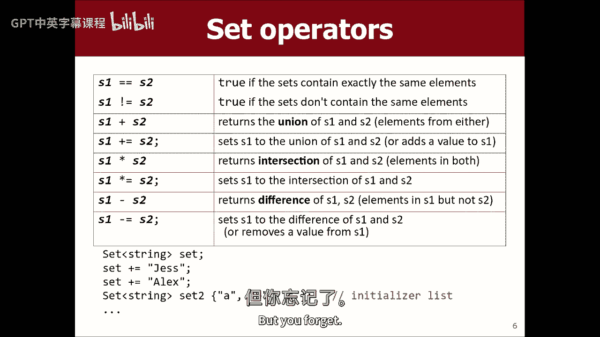

如果你老了，你的大脑开始变成土豆泥，所以嗯，我是说，你看，如果我有一套字符串叫嗨，然后我做单词点，全部加高，是有一个人拿走了它，我觉得很管用，否，它不喜欢那样，嗯，是啊，是啊，我觉得没用，我猜。

我想写这个的傻瓜没有让它们一起工作，是啊，是啊，你知道的，你会发现一件事与语言有点不同，像java之类的，Java对不同类型的集合有很好的互操作，我觉得C++有点像，每个人的城堡周围都有自己的护城河。

他们在一起玩得不太好，但是嗯，你知道的，有些事情你可以做，你可以为另一组的每个循环做。

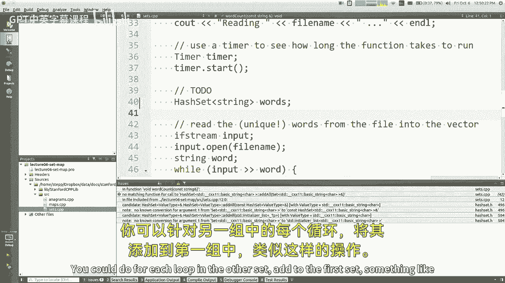

添加到第一组，差不多吧，你问的是订货的问题，所以主要的订购地点出现在，如果打印集合，它会按一定的顺序打印出来，就像看到外面，或者它可以对集合上的每个循环做一个，那是主要的方法，如果你需要移动一组。

不能使用大小为零的ini，使用括号的地方，我在布景上不起作用，无索引，但是如果你对每个循环做一个，它会为你吐出每一个元素，就他们出来的顺序而言，如果是普通的，它们是按字母或数字顺序出现的。

如果它们只是杂乱无章地排列在一起，你不应该指望任何特定的点菜，事实上，在程序的两个不同运行之间可能是不同的，所以这取决于内存地址和其他东西，所以说，所以这个实际上应该在它周围有一个X，哦，那里。

是那在那里不起作用，好啦，好啦，嗯，这里有个练习，我想跳过，如果你想做，去吧，有一个，这是我们的一步一步网站上的这个，基本上，你可以使用集合来跟踪你以前见过的数字，你想找一个快乐的数字，把数字加起来。

我要跳过它，但因为我没有足够的时间，所以要一步一步地去做，如果你想或在可爱的创作者上做，如果你想这样等着，还有什么，我在这里做结构，那么让我们来谈谈结构，我不打算在这上面花太多时间。

但是c plus可以让你用java创建新的类型，你可以做一个新的类，大多数语言，你可以做一个新的类，或者一个新的对象，或者类似的东西，C++有类，他们的语法有点恶心，所以我还不想谈论他们。

但你可以做很多同样的事情，用C++类，你可以用Java类或Python类或其他什么来做，嗯，C++也有一个类似的东西，叫做结构或结构，结构基本上是一个类，但它通常只用于存储几个变量。

它是一个只存储数据的类，通常它可以做得更多，但它大多是这样使用的，因此，如果您创建一个名为date的结构，你在里面放了一个月零一天，这是新数据类型的模板，您创建的每个日期对象中都存储了一个月和一天。

这是一个没有构造函数和方法的类，但只有两个实例变量或两个字段，所以你今天可以说日期了，你可以把日期定在5月13日7号，也可以用括号创建，括号中的值将用于初始化这两个，这两个领域，所以我的意思是。

为什么我给你看这个，这和我们现在讨论的不太吻合，但我觉得，有趣的是，当你试图将结构放入集合中时，像一套，啊，你有一个问题，去吧，是啊，是啊，我们的压力，喜欢数据，Indexable看起来像索引索引，嗯。

就像所有的月份都是括号，零什么的，是啊，是啊，你知道不，它不支持索引，此语法只是特殊的初始值设定项语法，如果将值放在当前大括号中，十一版中的C加加，二千零一一版，他们添加了所谓的通用初始值设定项语法。

这意味着您可以通过放置花括号来初始化几乎任何内容，然后按顺序写出构成那个东西数据的值，按它们之间用逗号声明的顺序，这就是为什么向量，让你做那个结构，任何事情，几乎任何事情，现在可以这样初始化。

这对语言来说是一个很好的进步，所以嗯，我再给你看这个的原因，我觉得就像，我刚才在课堂上突然转向。

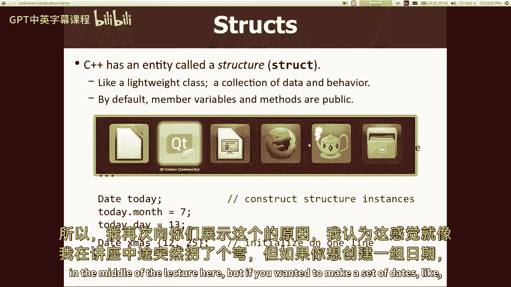

但如果你想确定一个日期，就像，哎呦，这些是我日历上的重要日期什么的，所以想象一下我有一堂课，在这里，我有一个月，我有一天，我是说你可以在一年里拥有任何你能拥有的东西，你可以想写多少字段就写多少字段。

但现在在这里，如果我做了，你知道圣诞节12点25分，然后我说约会B天，我的生日是九十九，然后你知道如果你只做那些在它们下划线的日期对象，因为我还没用过，但如果我说我想做一组日期，日历。

然后我做了日历点添加圣诞节和日历点添加B天，我会得到一个奇怪的错误，它说废话废话废话废话废话，操作员不匹配，小于操作数类型在状态上为con state，这是C++的一个很好的例子，编译器错误很难理解。

有时人类对这里发生的事情的解释，那是我以前告诉过你的一套吗，一个集合喜欢把它的元素按顺序排序，哈希集将它们混乱成不可预测的顺序，所以当你说你想建立一个基地，你想把这两个，剧组在想办法，就像。

我如何对它们进行排序，你可能会说很好，很明显，九月在圣诞节之前，或者，但是C+不明白这一点，然而，为了使数据类型能够被放入集合中。

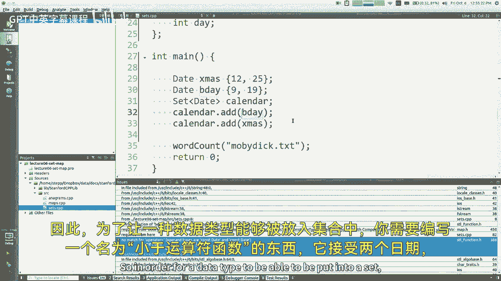

你必须写一个叫做运算符的东西，小于功能，这需要一个日期和一个日期，并告诉你第一个是否比第二个少，这允许集合理解如何比较它们的顺序，这是运算符重载的一个例子，我在做什么，我不知道语法是否真的很神秘。

但我是说我想定义新的运算符，小于运算符的使用，它将返回一个恶霸，因为较少名称总是一个逻辑运算符，以及清单两边的论点，这将是一个日期和一个日期，虽然我把它们写下来作为迄今为止的参考。

所以他们不会复制和常量引用，因为我不会改变他们，是呀，你喜欢，或者你可以的东西，有一个允许您过载的操作员列表，我不记得上面到底写了什么，但这是一个可怕的大列表，你可以覆盖，就像逗号的作用，而且很有趣。

你可以覆盖，加法做减法，就像你的朋友偷偷溜走，他们不像，你定义了你，然后他们就像一个，再加上一个一直给我零，什么是，这是如此向上，我能让它不回报10亿吗，我不知道发生了什么事。

我认为您必须遵循运算符的语法头，我不知道这是否能让你，我是说C加+，让你做一些可怕的可怕的事情。

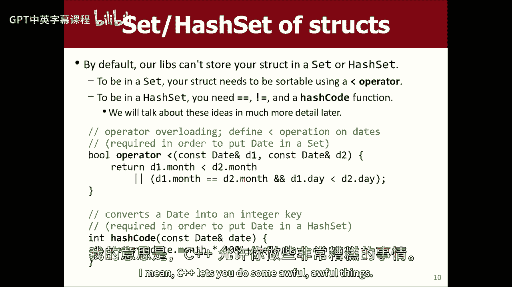

你知道的，但你不应该总是这么做，只是想让你看看，我看到又有一两只手举起来了，但是很快，如果我说布尔运算符，日期参考日期一，常量日期参考日期二，你怎么知道第一天比第二天少。

日期一个月是否严格少于日期二的月份，或者如果月份相等，第一天，一天比一天少，星期二，在这些条件下，第一天会比第二天少，所以这是一个小于运算符，现在呢，我希望我的电视机能让我储存这些东西，日期，没有编译。

啊，因为现在它不知道怎么打印日期，因为它有不少于一个日期的运算符，所以如果你想这么做，那是，哦天啊，我不想谈这个，小于它需要一个恒定的引用，D和它，哦等等，你得把输出流传出去，哦天啊，外面太可怕了。

丁点月，返回，好啦，哎呦，从来没有没有，我们改天再谈，但如果你想做一些可打印的东西，你必须重写鳄鱼操作员对这种类型的操作，别介意，所以我运行这个，上面写着日期是圣诞节生日和圣诞节，耶耶，所以这一切。

反正，我本来不想教你的，我想我提到这一点的原因，哎呀哎呀，它去哪儿了？我知道我关上了，对不起，我之所以给你看是因为，一旦你开始使用集合，你想在一套里开始你自己的东西，然后你会得到这些奇怪的错误。

我想让你明白为什么，发生了什么事？以及如何修复它，是啊，是啊，弦呢，它存储字符串，弦很好，你不必为了琴弦做这些事，它按ASCII顺序对它们进行排序，基本上是按字母顺序排列的，但它是大小写敏感的。

另一个问题，是的，是的，Tshirt，要做到这一点，重载的运算符必须放入相同的文件，哎呦，他们必须住在同一个文件里吗不，他们遵循同样的规则，和其他文件一样，在其中可以包括其他文件。

然后他们会看到操作员什么的，然而，我还没有太多谈论多个文件程序，但是是的，你就会这么做，所以好像没有这种事，作为分配给这些的默认函数排序，是啊，是啊，不幸的是，它不知道该怎么办，除非你说出来。

你希望它只看几个月，再看看日子，但坦率地说，我认为这可能会导致更多的错误，而不是解决，因为你会说，啊，它的顺序错了，我不知道喜欢它，没有，它不想做出假设，它让你告诉它该怎么做，坦率地说。

用C++编写类的语法很糟糕，因为你必须做这一切，只是为了去它工作的地方买基本的东西，你得做这种蠢事，这是最早的语言之一，他们真的搞砸了，所以像Java和Python这样的人，他们学会了。

他们让它变得更好，所以这是一个警示性的故事，如何不完全掌握一门语言，对呀，是啊，是啊，对喜欢的人最好的做法是什么，我想包装就像，还有那些运算符，哦哦耶，我主要想回答你的问题，你的要求就像。

如果我要写一个新的结构，比如我怎么把它打包分发之类的，就像你有一个日期点H和一个日期点CPP，你会有很多这样的东西，我的文件包括，我很快就会教你更多关于多文件程序的知识，但是但是是的。

这只是一个快速黑客攻击的例子，只是为了以后稍微玩一下语法，是啊，是啊，为什么输出运算符，为什么它会返回屏幕，哦，为什么这返回o流，我有点不想谈这件事，基本上，这只是为了让我可以改变这些小于运算符。

每当我出去不到那个时候，表达式返回，这样我就可以用下一节课了，把它们锁在一起的教训，这是语法的一个怪癖，允许多个，天衣无缝的东西越来越少。

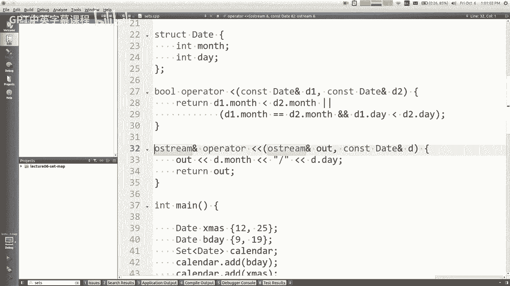

好啦，我想继续前进，但当与集合一起使用时，这是结构的一个小怪癖。

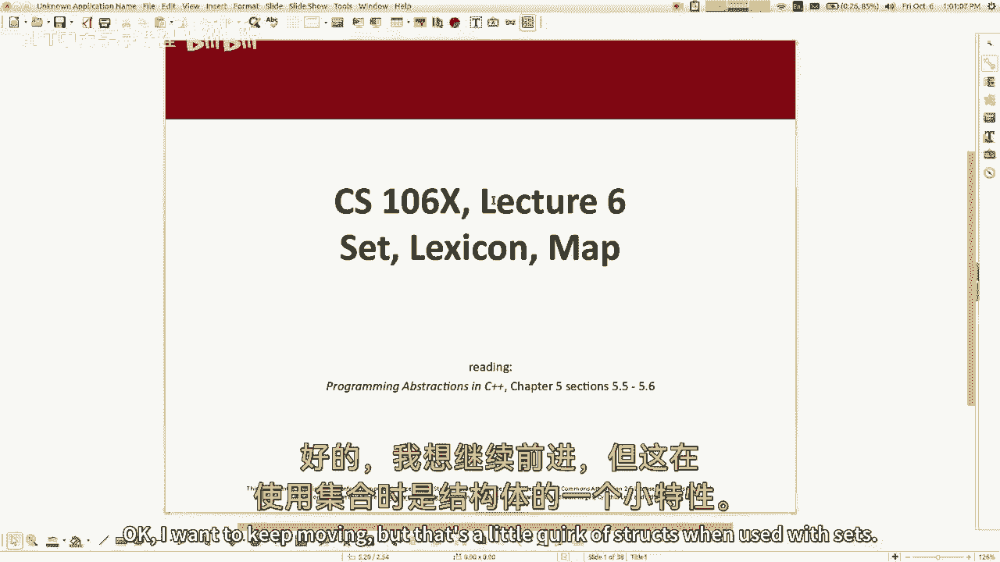

所以等等，在哪里，I，这里，好啦，所以我真的不会在这上面花任何时间，不过，在我们图书馆里还有一本叫词典的藏书，词典和词典基本上是一回事，但它没有定义，它只是一种词汇或语言中的一组法律词汇。

它基本上是一个词典是一组字符串，所以当你声明一个词典时，你不说词典括号字符串，你只是说词典，假定它存储字符串，你会发现它有几乎与集合完全相同的方法，添加删除包含两个字符串，一个区别是它有一些方便的方法。

像阅读文件之类的，它也有一些与单词前缀有关的方法，就像，你可以说，词典里有哪个词是以这些字母开头的吗，它会告诉你为什么这口井，它的内部有一个不同的实现，这对称为前缀树的查询很有用，我以后会教你的。

我现在才提，因为我们今天要收集，稍后我们将把这个集合用于一个名为boggle的作业，我们在黑板上搜索部分单词，这将是有用的，我们现在不需要，但它基本上是一组弦，我们稍后再讨论，是啊，是啊。

它也是按字母顺序排列的，是啊，是啊，如果你把它打印出来，它会按排序的顺序打印单词，好啦，好啦，我要继续前进，我想去拿地图，地图很重要，地图也在第五章，我猜你们大多数人都见过哈希图，或者以前的地图。

其他语文，它们有时被称为字典，就像Python，所以与我们目前看到的所有其他收藏不同，一张地图不仅仅是你，不要只是给地图增加一个值，你得在地图上加一对东西，添加的对称为键和值。

你把那些配对在一起的加到地图上，以后如果你只有钥匙，你可以让地图去找关联的值，所以地图的一个经典例子是字典或电话簿，你储存成对，比如马蒂的电话号码是这个，辛塔的电话号码是。

所以名字和电话号码是你存储的一对值吗，然后像你一样，在你构建数据结构之后，你只有名字嘿，马蒂的电话号码是多少？我要马蒂的电话号码，它去查找与马蒂相关的值，它把它还给你，所以这是一个查找结构。

用另一半找到一对的一半，这是单向查找，如果你想知道那个人的名字，你有没有接到过一个随机号码打来的电话，你不知道是谁，你很想知道那个人的名字，地图不是朝那个方向走的。

如果你把它和左边的名字和右边的数字一起存储，然后它不允许你从一个电话号码到一个名字，它只允许你从一个名字到一个电话号码，以此类推，你们可能以前见过这些，很多现实世界的例子。

我认为地图是最有用的数据结构之一，因此，以下是您可以使用地图进行的一些核心操作，您可以将键值对放入，这就像添加我们的库，还允许您使用方括号语法，这是很酷的埃里克逗号。

这个数字和括号Eric等于那个电话号码是一样的，这是一样的，等价语法，所以其实挺酷的，我想你可以想到地图的一种方法是，它有点像一个数组，但是索引不一定是从零开始的INS，索引可以是字符串。

它们可能是布尔值，他们可能是双打，他们可能是，我也不知道，有些人喜欢这样想，像这样，有些人不会，但你把它存储在Eric的索引中，你把价值存储回来，因此，稍后您可以说出存储在索引Eric中的内容。

它会告诉你他的电话，如果你试图把一个副本，它将替换以前的值，您可以得到密钥的值，你基本上是在说，请帮我找到与之关联的值，P，您也可以使用方括号语法，把亚娜的电话号码给我，这是我妻子的名字，你会注意到的。

我不知道你是否能看到这么远，但我的电话号码和我妻子安娜一样，在，有一把重复的钥匙是不行的，如果您尝试添加另一个名为马蒂的条目，它将取代以前的条目，所以你可以把，你可以得到，你可以移除，所以是的。

移除并向上看，这是你在地图上需要的三个操作，是啊，是啊，所以从地图上看，所有键必须具有相同的类型值，同类型，是啊，是啊，所有的键都是同一类型的，所有的值都是相同的类型。

但是键可以是与您可以映射的值不同的类型，从字符串到整数，或从双打到牵挂，或者你想要的任何东西，是啊，是啊，所以是的，我是说再来一次，就像我说的，你储存双对，然后你有一半的一对，你想让另一半再次出局。

我想有些人有点麻烦，你们大概明白了，但有些人有点不理解这里的想法，就像你知道如果我有整个对在这里，我为什么不把他们都叫来，我为什么要查这个东西，我只是过得很好，我怎么把它忘得很好。

通常你是从文件里读出来的，也许程序坐在那里，提示时间长，你知道你有数据，只有你，你不知道数据在哪，或者类似的东西，这是为了一个长期的过程，我也没必要这么说，但它暗示了这个结构应该以这样的方式建造。

快速完成这些操作，它应该能够快速地放置、移除和获取东西，它确实如此--猜猜我们图书馆里有什么，有一门叫做数学的课，它按排序的顺序存储事物，有一种叫做哈希图的东西，以不可预测的顺序储存东西，听起来很耳熟。

所以就像布景一样，同样的两种类型，这是因为从字面上看，集合是作为一个地图实现的，从值到真布尔值，那是的，这里是真的，所以他们基本上是一样的，从某种意义上说在里面，同样的逻辑也适用于。

如果您关心数据的排序和排序，您使用常规地图，如果你不在乎，你想要更快一点，我们会使用哈希图，那些关于存储日期或其他什么的东西也适用于，如果你想储存日期，也是地图上的钥匙，是啊，是啊。

地图中的键可以是结构类型吗，然后你有，是啊，是啊，键可以是结构，但他们必须有一个排序顺序，他们必须做一个小手术，是什么样的，如何覆盖，啊，如何编写哈希码，我以后教你，但在我们的库中。

你实际上写了一个函数，只是一个叫做哈希码的常规函数，它将您的类型作为参数，并在最后返回，为了指示放置索引，它将东西放在数组中，基本上比这更重要一点，但如果你好奇，这是最基本的想法，在库中打开哈希代码H。

斯坦福图书馆，我是个专业术语，我们对每个循环的预防，只有两个人吗，就其本身而言，这种不可预测的秩序，既是为了一套，也是为了一张地图，如果你对地图上的每个循环做一个，你不知道什么顺序，双鞋会给你的。

但你会得到所有的，为什么这样你就可以在上面循环了，你只要不关心，你先看哪一个，你第二个看到的是哪一个，等等，如果你很在意，你可以用一个普通的祝福你，以下是我已经向你们展示的方法，最重要的是，但也包含了。

也去掉了，有一些标准的东西，喜欢是空的，你所习惯的这些方法，到现在为止，这里的运行时完全类似于正则集和哈希集，我觉得你比较了两张桌子，你会发现他们几乎是一样的，为哈希映射记录一个的规则映射，稍微快一点。

嗯，如果你想在地图上循环，这就是你要问的，用里面的一些数据做一张地图，然后我们可以在上面循环，你实际上在循环的是钥匙，对的左半部分，如果你想要右半的值，你只需查找每个键的值，当你读它的时候。

所以这就是打印配对的方法，所以我想这应该是伯克利的学生，学分零分，然后就会说马蒂的平均绩点是2。7，然后会说维多利亚的平均绩点是三分，它会按那个顺序，因为它是一个普通的Mac，所以它是按字符串排序的。

键的字母顺序，对呀，所以是的，你可以用地图做的另一件事是你可以用它们来记录或计数东西，这是一个有用的例子，嗯，基本上，如果你如果你有一个选举，但你有选举，你有选票，投票机就是这样储存选票的。

就像一根大绳子，如果他们键入R，那是投共和党的票，如果他们投票类型，要么，因为他们是醒着投票的，我不禁注意到这里有三个人投了独立票，但是嗯哦好吧，呃，所以呃，如果你想数一下每个候选人得到了多少票。

我想你可以说R候选人是零，D候选人一个，但你基本上是在绘制某种地图，从字符串到整数，在一个矢量或什么你可以这样做，但我认为地图的想法是，你只要说嘿，用r键存储16，用d键存储14个。

你实际上可以随着时间的推移增加这些计数，就像你看到一艘船，你可以去找那对，把它的价值增加一个，随着时间的推移，这些计数逐渐积累，所以这个想法我想和，我们要回去数单词，就像我们有一本大书。

而不是只告诉我这本书里有多少词，我想知道一个给定的词，这个词在书中出现了多少次，所以你可以问我，就像这个词，我会说，哎呦，单词the在moby中出现了500次，迪克，不管你明白什么。

那么你是怎么做到的呢，地图如何解决这个问题，比如地图的数据类型是什么，我该怎么处理它，深蓝色衬衫，是啊，是啊，是啊，是啊，所以嗯键的类型是字符串，肚子型在，然后所有的弦只是所有的UV字。

它已经在酷中编辑过了，好啦，他说，这是一个从字符串到整数的映射，弦是字。

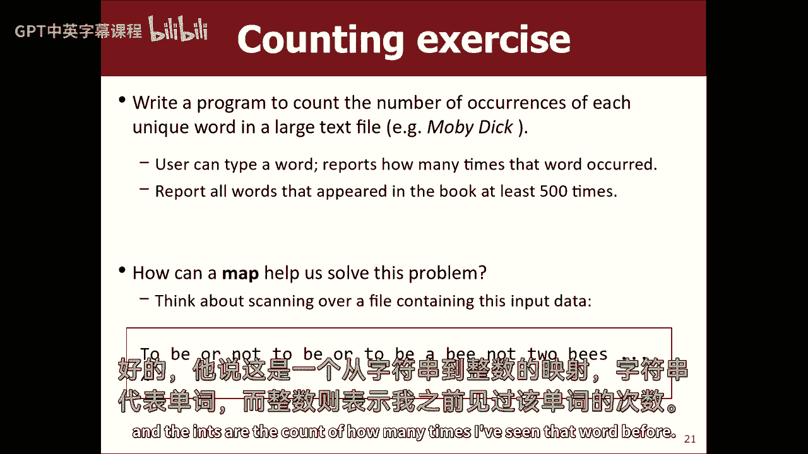

INT是我以前见过这个词多少次的计数，所以是的，听起来不错，我认为这是个好主意，嗯，让我们去另一个文件叫地图，CPP，我基本上已经准备好了，除了我没有地图部分，所以我在读这些话，很像那个代码。

我们一秒钟前和布景在一起，所以你让我做一张从字符串到整数的地图，我会叫它计数器什么的，这是一张柜台地图，文字什么的，所以你在这里说，我刚读了一个词，现在我得把它放在地图上，所以我认为这个想法就像，如果。

如果你以前没有想过这种问题，如果地图是空的，我看到高这个词，那么我需要做的是，我需要做地图商店，你知道高和一个权利有关，你懂的，现在如果我读了下一个单词，下一个单词是好的，然后我需要映射到存储。

你知道高的数到一好的数到一，你知道我需要储存这些对，对呀，但如果我再看到一个字，就像我看到了另一次的高，然后不是地图上的第三对，我想和两个人一起储存，你明白吗，所以积累计数器，如果有的话。

做一个新的计数器，如果没有的话，所以有一个叫做包含键的方法，哦，我没有吗，我没有导入地图，h包括地图h，那很好，所以如果我包含，如果我不包含这个单词的键，我以前从没见过这个词，所以这更像是这里的情况。

对呀，所以我应该做的是，我应该说他反击，我想给你换一双新的，就是这个数到一的词，好啦，但如果我以前见过这个词，2。我想知道这个词的词义，计数等于，然后我想做柜台，把这个数加上那个数，去找老伯爵。

再放一个进去，现在我明白你的问题了，我马上带你去，所以现在一旦我看完文件，我想问用户一句话，他们告诉我一个词，我查一下这个词出现的次数，所以要查一个词的计数，不是零，是计数器点，把那个词说对。

所以这很简单，我们连你通常做的一个例子，有点像这样，在一零六一个所以，我开得有点快，但如果我跑了，呃，哎呦，对主的未定义引用，哎呦，它是，我想我叫它主地图，因为如果你有两条主线，它搞混了，所以好吧。

主要，阅读圣经文本，所以很快就结束了，所以我花了一两秒钟在哪里搜索，我不知道那是否正确，但看起来它在四分之一的地方工作得很有趣，我写了这个程序，我以为我在读圣经，但我实际上是在看书，白鲸。

我像上帝和魔鬼一样打字，就像发生了两次，我就像，我以为上帝在里面被提到了不止几次，这很奇怪，我不知道，也许这是某种新潮人版本的圣经，在那里他们叫他大G什么的，我不知道，但是，所以这基本上是有效的。

我想指出的是，有一个小，你可能已经举手了，您可以对这段代码做一个小的更改，嗯，关于我们的地图结构的一个很酷的事情是，如果你试着去买一对，这个词没有一对，它将返回一些默认的零，一种价值。

所以你实际上可以删除所有的东西，一切都突出显示，你可以删除，你只要说去拿柜台，如果没有的话，会给你零分，用零加一把它放进去，所以我可以这么做，另一件事是，你知道的，而不是哎呀，它在哪里，而不是说点得到。

4。你可以用括号里的单词代替原词，你可以说括号词等于计数加，所以你可以，这样比较干净，对呀，所以实际上，我可以，而不是那样，我可以剪这个贴那个，所以现在我只剩下一行了，所以实际上我可以写。

所以整个循环就是这样，这实际上是有效的，如果没有柜台的话，它会增加，它会增加一个，现在呢，这是我们图书馆的一点特殊之处，所以这个更长的版本可以，但你知道简短的版本很酷，所以是的，有关此示例的问题。

你以前可能见过这样的，我只是想教你怎么用我们的图书馆，是啊，是啊，您更改值，更改默认值，我不认为你能，那是个好主意，也许有一天我们应该把它添加到我们的图书馆，但就目前而言，默认值是该类型的零等价物。

如果是绳子，它将是一个空字符串，如果是替身，会是零点零，差不多吧，我想和你再做一个例子，我想我没有足够的时间，但也许我们可以用一个零六个X来解决这个问题，嗯。

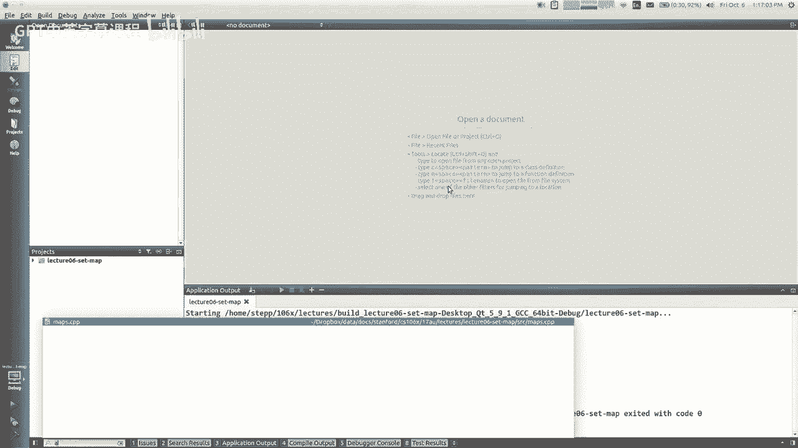

我想谈谈字谜，所以字谜，你知道的，你把一个词重新排列对了，所以让我跳到这个幻灯片上，所以说，在这里想象一下，你知道的，我有一个装满单词的文件，词汇词典，我想能输入一个词，然后打印出所有的字谜。

那么如何做好，我可以在我的档案里读到满满的文字，然后不知何故我需要找出哪些字母是相同的，对呀，嗯，我给你个提示，你可以把一个单词的字母，你可以按字母顺序排序，你注意到了什么，如果你对两个单词进行排序。

它们的排序结果相同，那两个字是字谜，对呀，好吧，让我们假装我很好，我给你写了一个排序字母的函数，并返回该字符串的排序版本，所以如果你有那个很棒的工具，我怎么能猜出一个词的字谜呢？这将涉及一张地图。

地图会是什么，故事，是啊，是啊，我想你的想法非常正确，像地图，地图是用来勾搭，我有这个，我想要那个权利，我有这个，我想要这些权利，所以地图可能应该有字符串作为键，其中一组字谜的值。

现在你给了我几个重要的调整，你说过，别让他成为关键，让这家伙的排序版本成为关键，因为所有这些人都有相同的钥匙，它们都映射到那组单词作为值。

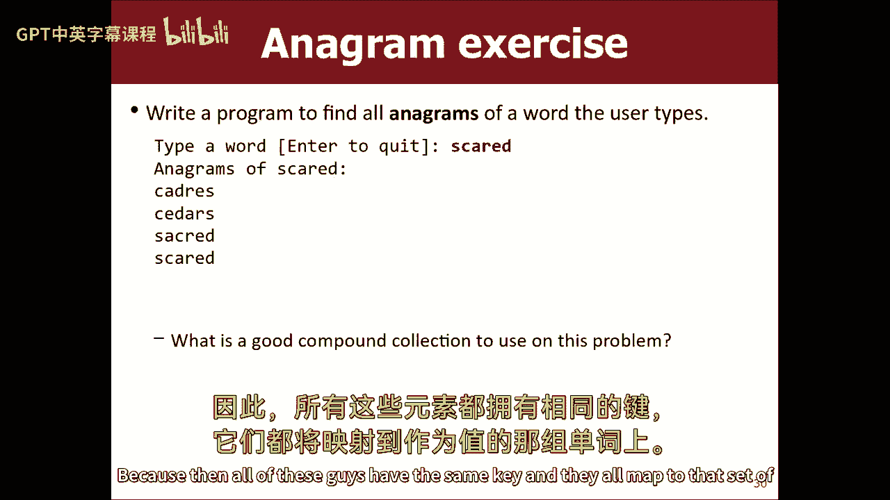

我想这是个好主意，如果我去我的字谜文件在这里，我在阅读文字，我想用字符串做一个地图，就像这些排序的单词，让我们说，其他字符串集，是那根弦的字谜，你明白吗，所以现在在这里，如果你读到一个字。

我可以做字符串排序，等于，把那个词的字母排序，我想我需要做一个修剪词，有一个饰边可以把空白的地方去掉，不过，好吧，所以现在我得到了排序的版本，比如，你知道的，你好变成了e h l l o或类似的东西。

对吧，我想把它放进这张地图里，基本上我想去排序的字谜，那是一组弦，我想把这个词加到那一套里，在这里输入一个单词，您要求用户键入一个单词，我会得到那个词的排序形式，然后我会抬起头来，编译，哦等等。

我不知道，这不是主要的，坚持住，这就是所谓的主要黑人地图，所以我必须关掉主文件和另一个文件，我知道该走了，它有一堆斜线，R在上面，不管你有什么想法，它把那个词的所有字谜都存储在一个集合中。

这是集合映射的一个例子，我马上就得走了，但我会回答几个问题，是啊，是啊，你在哪里，为什么我使用地图而不是哈希地图，那是个好主意，我想哈希图实际上会更好，因为我不在乎命令，我可能关心字谜本身打印的顺序。

所以也许这应该是一个集合而不是哈希集，但是这个整体映射作为哈希映射更好，我同意你的观点，这也是你的问题，好啦，嗯，我没时间了，祝你周末愉快，我们节目上见。

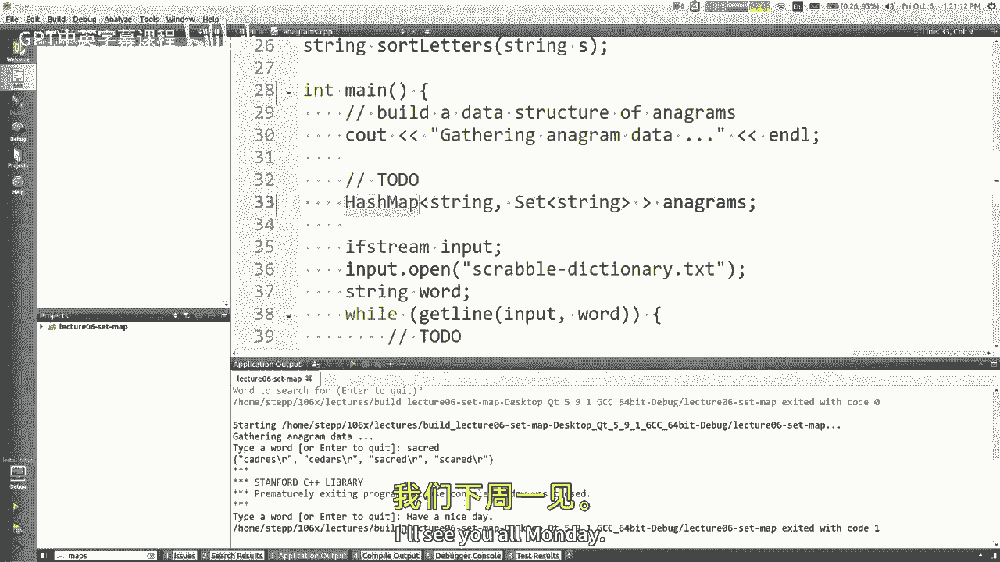

星期一。