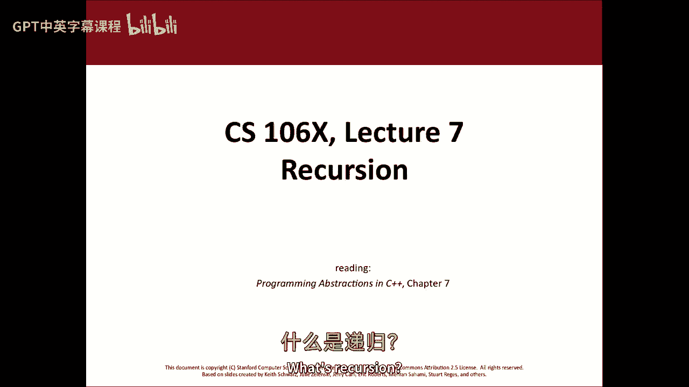
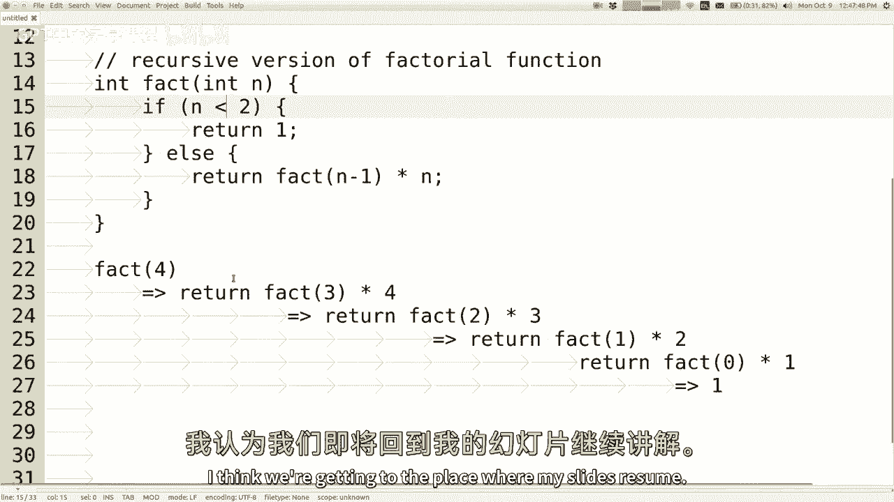
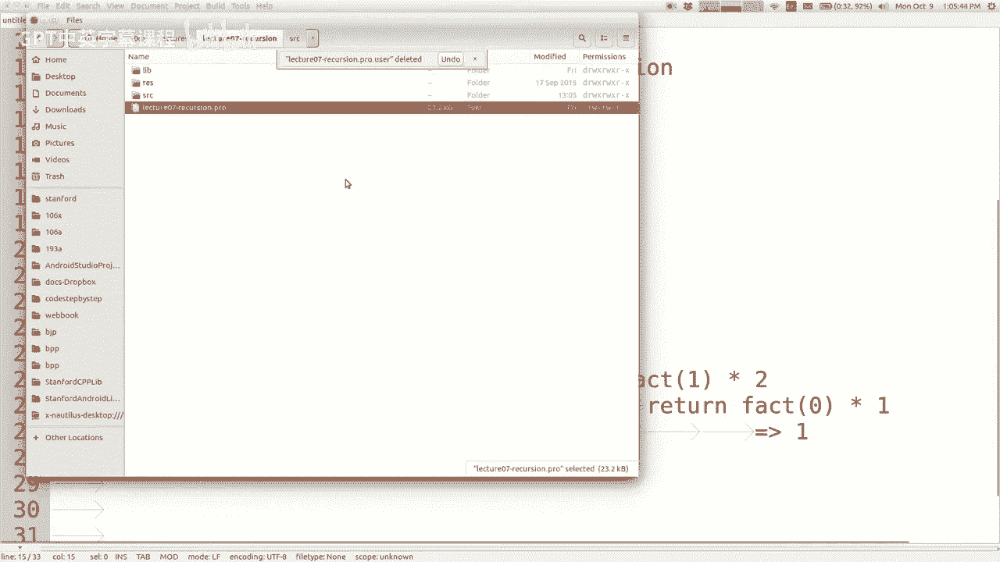
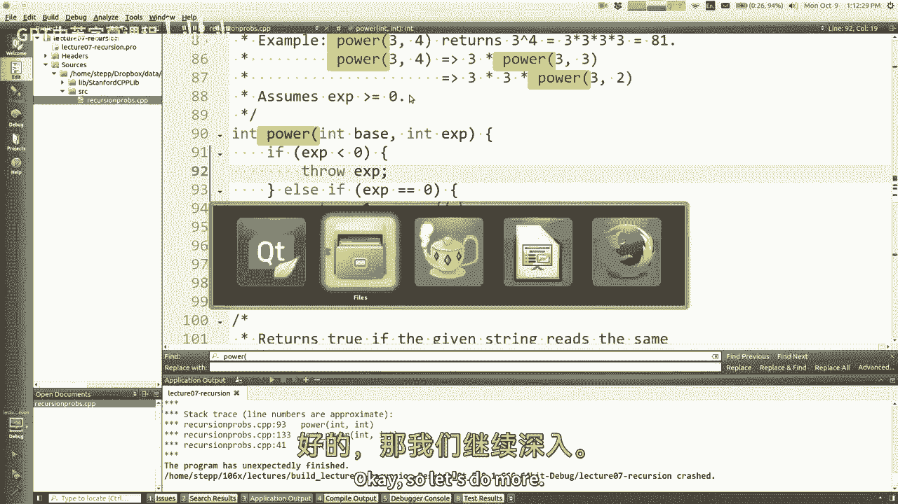
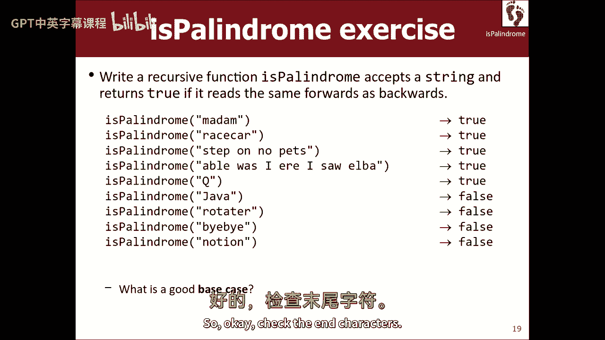

# 【编程抽象方法 cs106x 2017】斯坦福—中英字幕 - P7：Lecture 07 - Recursion - 加加zero - BV1By411h75g

下午好，星期一快乐，大家都做得很好吗？我看到了很多，但那正是我要的心情，我真的想把它从你身上拿出来，我想，我想改变这种态度，我要你走进来，我要你离开这里，去你的男人，我希望你在激情中充满激情。

因为你缺乏激情，嗯反正，所以呃，是啊，是啊，本周我们将讨论一个叫做递归的新主题，那将是整个星期令人兴奋的事，是啊，是啊，呃，只是出于好奇，有谁用递归编程过，你们很多人很酷，好啦，很好，它是，我不知道。

我不指望知道，我要从头开始，所以对你们中的一些人来说，这可能是一个回顾，但我们还是要用一种Etsy的方式来做这件事，所以让我们看看还发生了什么，你的作业2已经贴出来了，这周五到期，注意那个。

这周晚些时候你要上一节课，所有我们部门领导正在做的日常工作，给你的作业打分，上周五的意见书，或者你还在努力什么的，但通常我们的目标是把作业拿回来，在你交下次作业之前，这样你就可以得到你的反馈之类的东西。

我们尽力在最后期限前完成，虽然很难，有时我们会在最后期限前溜走，我们也需要迟到的日子，但这将是我们的目标，在接下来的任务中努力恢复你的成绩，也是。

所以好吧，让我开始讨论这个新话题，幻灯片在网页上，这本书的相关章节是第七章和第八章，我们从第七章开始，我会说，即使你们是一个零，六个前学生，你有你的巨大大脑，对你们中的一些人来说。

这可能是一个很难的话题，那也没关系，我只想承认当我还是个小男孩的时候，我在大学里学习计算机科学，我以为CS不太难，然后当我们谈到递归时，我觉得递归有点棘手，所以我只想让你们知道这个话题可能很有挑战性。

我想说很多人，只是他们需要一段时间才能真正明白，一旦他们得到了，他们更快地找到了问题的解决方案，但有时需要一段时间才能到达那个地方，所以我的意思是，你知道的，买家当心，你已经被警告过了，嗯，不过没关系。

你知道我们要练习很多，我们要谈谈这个话题，很多，递归，会参与到，我们在这节课剩下的时间里所做的几乎所有的事情，所以到年底，你知道的，到圣诞节的时候，到假期，希望您会对递归感到非常棒，我们走着瞧。

但又一次，就像我说的，如果现在还不清楚发生了什么，没关系，事实上，所有这些都是一个很大的借口，如果我的演讲很烂，那就不要自责，如果你听完这堂课还不明白，好啦，所以在这里，我们去等待，为什么那张幻灯片。

我们做到了，那不应该是幻灯片一，少了一张幻灯片，那就像，什么是递归，就像，这是你的箱子，是呀，好啦，嗯，呃很好，我不知道发生了什么事，我想我可能删除了本地副本上的幻灯片什么的，所以好吧，什么是递归伟大。

我等一下，我没想到会这样，呃好吧这里，这是我在做腹腔幻灯片，那里，当然啦，我可以回到PowerPoint程序，点击新幻灯片按钮，但是当你用计算过程本身来描述一个计算过程时，没有递归。

所以你知道描述一个算法或过程本身，我这么说是什么意思有很多例子，但你知道你可以说，作为一个现实世界的例子，嗯，你怎样查字典来理解一个词的意思？好吧，你，你翻到字典里有这个词的那一页，你读了定义。

当你读到定义时，可能有一些定义中的单词你不明白它们的意思，所以你去查查那些词，但是等等，什么是查找一个词，好吧，你去字典里的那一页，定义这个词的地方，所以如果你明白我想说什么。

我刚才描述了如何在字典里查一个词，但在算法的描述中，我说你应该去查字典，所以我用它来描述这个过程，所以这是一个比计算更大的想法，但我们用它来计算，事实上，当您想谈论一个编程构造时，什么是递归编程。

我会说这将是，所以有些学生在不知道递归是什么的情况下发明了递归，他们可能会出于正确的原因，或者因为错误的原因，他们这么做，因为他们没有正确地使用循环，他们得到一个函数的底部，他们说好，我想再做一次。

所以他们调用相同的函数再次回到顶部，所以它会自己运行，你知道的，他们开始做这种事情，他们真的应该有一个时间循环什么的，你知道我的意思，所以这有点糟糕，递归只是将自调用用作循环。

但是更好的递归是识别一个本质上是这样的过程，与这种风格配合得很好的这种风格，所以我想说递归是有效的，是我所说的自我相似，好啦，所以一个自相似的问题是为了解决这个问题，如果您能解决相同问题的修改版本。

这将是有帮助的，所以我认为每个人首先给出的一个不好的例子，他们说的是n的阶乘阶乘吗，你知道我们知道这个数学定义，它是从1到n的所有整数的乘积，所以我的意思是，如果你要写一个阶乘函数。

您可能会编写一个从1、2、3到n的for循环，它乘积成一个变量，你正在积累，或者类似的东西对吧，所以你可能会说，你知道的，事实上，在N你说你知道，对于int i等于一或二，int结果等于一。

任何i小于或等于n，I加加结果时间等于I，然后你说返回结果是对的，差不多吧，是啊，是啊，好啦，所以这是阶乘函数的正常版本，您可以称之为阶乘函数的迭代版本，所以阶乘的递归思想通常是，我是说。

任何算法的递归版本都经常从等式中删除循环，递归是一种计算机制，允许重复而不循环的，挺有意思的，那么如何编写阶乘的解决方案，那里面没有循环，嗯，如果你想想阶乘的数学定义，你可能会在教科书上看到。

很多时候当他们把这些东西写出来的时候，他们说得好，等于空白，如果n等于某物，但它等于，你知道吗，还有一件事，如果n等于其他值，所以你描述了这些案例，你知道他们有侧身。

又高又卷的大括号上写着这个或这个或这个或这个，这有点像什么是阶乘的案例分析，那么阶乘的不同部分是什么，嗯，做阶乘的最简单的事情是什么，如果向量，如果是一个，那么那个的阶乘是多少，实际上如果n等于零或一。

那也是对的，零的阶乘也是1，但是不是0或1的东西的阶乘是什么，我是说，我不知道，我不想写一次，两次，点点，点时间，我不想用那种方式写出来，通常我们用自我相似的方式来描述这些事情。

如果我要求其他东西的阶乘，这怎么能帮我找到n的阶乘呢，我认为递归思考的方法是说，好啦，我不能写它等于n的阶乘，因为太圆了，向右n箭头的阶乘，n的阶乘，但那也太，太圆了，但如果我被允许说任何其他阶乘。

如果那是合法的，那么这怎么能帮助我为这个东西写出一个坚实的定义呢，在这个定义中我还可以使用什么阶乘，n减去一的阶乘，那什么时候N对，如果n大于一，所以如果你被允许这么做。

然后您可以编写具有相同结构的代码，所以这个阶乘的递归版本是，如果n等于零，我想和我们写的完全吻合，我可以说或者n等于一，然后返回一个最简单的版本，如果大于一，我们返回n减去1乘以n的阶乘。

这是阶乘函数的递归版本，它自称，它自称，所以如果我要求，五的阶乘是多少，让我们做四个，然后它就不会进入，如果因为它不是零或一，所以它的作用是说，返回三乘四右的阶乘，好吧好吧，三的阶乘是什么。

照上面说的做，返回二乘三右的阶乘，二的矢量，照上面说的做，返回了1乘以2的阶乘，1的阶乘就是返回1右，那么一个人在哪里回到它，回到这里，所以这意味着返回1乘以2，是啊，是啊，所以一乘以二回到这里。

所以一乘二就是二，所以这个是2乘以3，回到这里，二乘三，六六乘四回到这里，这是从整个函数中发出的，所以发回给呼叫者的结果是24 6乘以4，我想这是4的阶乘，这就是递归的基本思想，这段代码可以改进一点。

只是在逻辑上，如果，埃尔什么的，有一小段代码是不必要的，你知道我指的是什么吗？买一送一，如果去掉n等于1，它仍然有效，原因是如果你回到这里，实际上，让我撤销我在这里所做的简化，如果我删除这个。

然后这段代码在底部发生变化，哦对不起，试图把所有东西都放在屏幕上，所以你可以看到，所以在这里，上面写着还一个，而不是一个简单的阶乘，如果它再掉进另一个右边，所以我会说0乘以1的返回事实，事实上零是一。

所以1乘以1，它只是再打一个电话，但它返回的是同样的东西，所以你可能会说，但我更喜欢另一个，因为它没有那么多电话什么的，但我的意思是花时间来测试它，如果在一个或每次都很慢，也是。

所以我实际上认为更干净的代码版本，在这里用更少的如果和其他的和矿石是一个更好的版本，所以这是一个递归，阶乘函数的递归版本，到目前为止没有幻灯片我做得怎么样，我不知道我的视线去了哪里。

我一定有某种猫或狗可能跳到这里的删除键，但到目前为止我们做得怎么样，是啊，是啊，如果你真的结束了这节课，啊，呃，这里就像如果在少于两个返回n一个，两个阶乘，啊，少于两个，是啊，是啊，你可以这么做。

那很好，当然好的，祝福你，你可以做，从技术上讲，你可以做小于或等于两个返回n，我想是因为两次回归，哎呦，是呀，是呀，是呀，对不起，我不是故意的，你知道，做零的比例，标签计数为零，零生命很重要，啊，问号。

冒号，我可以，是啊，是啊，我可以说把这个问号返回一个冒号，是啊，是啊，是啊，是啊，当然嗯，我看过大部分是用El写的，我想当我们学习递归的时候，这是一个很好的模板，他们有无限的健康。

这是做这件事的一种方法，我想在一分钟后更多地讨论这个代码结构，我只是想举一个简单的例子，在我们继续之前，是啊，是啊，是啊，是啊，有什么问题吗，就像当所有的回报堆积起来，就像一个很大的阶乘。

就像忽视一个大数字的问题，它真的很大，在著名的空间里自称太多了，对呀，所以这是一种，零六斧头，零六斧头，算是个问题，就像这样，你会不会有太多的内存堆积在调用堆栈上，如果我有很多电话什么的。

你还提到了另一个问题，将所有这些相乘在一起，会很快溢出它可以存储的范围，我想这也是个问题，这两件事都是需要考虑的重要事情，我要说的是在某种程度上，我想把对这些概念的讨论从一些c+中分离出来。

这些概念的实施细节，例如，是呀，如果我在某个时候做了一大堆递归调用，我调用堆栈内存用完了，我的程序最终会因堆栈溢出错误而崩溃，是的，这是一个for循环解决方案不会发生的问题，所以这是个问题。

整数溢出也是一个问题，我会说还有其他编程语言内置了优化，将避免那种不会使程序崩溃的问题，如果您有很多递归调用，他们会处理得更优雅，C++不是这样的语言，但你知道如果我想教你这个，我们会有这个问题。

希望我不会给你做任何练习，会遇到这样的限制，我不会的，我是说，我不想在这种情况下使用递归，是的，还有为什么这比迭代更好，啊，这是个好问题，谢谢你，这个问题有点像，我为什么要关心这些废话。

这看起来比for循环更难，很棒，如果我拿走我的for循环，马鲁姆，我知道你这么问是有原因的，有时候会有学生问我，潜在的原因是，我不想学新东西，你知道循环是很好的，我不想用不同的方式思考事情。

我知道你们都是六个X型的人之一，所以你喜欢学习新东西，所以更多的是，为什么我要选择解决问题的最好方法，所以这似乎是解决这个问题的不太好的方法，那么我为什么要选择这个呢，我想这是更多的动机。

或者至少我希望，我希望这就是你问这个问题的原因，所以我要向你坦白，运行此问题的解决方案会更慢，比for循环更糟糕的解决方案，如果你要谈论性能，我用这个例子来说明这个想法。

我可以看到这不是一个使用递归的好例子，我想谈谈它的机制，它在这里是如何用简单的东西来工作的，比如提示，我认为递归更有趣的地方，有更多的问题祝福你，有些问题本质上是递归的，比如在目录树中搜索文件。

但是还要搜索目录树下面的目录树，在递归的目录树下面，或者你知道，逃离迷宫，如果你被困在这里，从那里逃走，如果你被困在这里，从那里逃走，从迷宫中逃脱有一种递归，找到你名字的所有字谜，“好吧。

你是怎么做得很好的？”，你找到这个词的所有字谜，然后你递归地找到这个词的所有字谜，有一些算法非常相似，我们将使用递归来解决，这不是那种算法，但是，如果我直接跳到那些算法，很容易迷失在代码的复杂性中。

这是这么简单的一段代码，在我深入研究硬件之前，我想确保我们理解它，还有什么问题吗？有人举手，我不知道他们的问题是否已经得到了回答，我想我们快到我的幻灯片恢复的地方了。

让我看看，所以我想我们现在可以去这里，通常当您编写递归代码时，您的代码有两个或更多情况，就像如果与其他情况相比，其中一种情况被称为基本情况，这意味着这是这个问题的一个简单版本，我可以直接解决。

我现在不需要使用任何递归，所以在我们的阶乘中，n是零，或者n是一，我只知道答案是什么，那就是，答案是这样的，也可能有所谓的递归情况，更复杂的案子，在我不知道答案的地方。

我要做一个递归调用来帮助我找出答案，通常递归调用是同一问题的较小版本，如果我在处理一个int，我把那个int去掉了一点，我把整型数除以1或者除以2之类的，如果我在处理某种收藏，也许我把一些元素切掉。

并使用Perum查看其余元素，等等，所以这是一个重要的想法，如果你要写一个问题的递归解决方案，您希望每个递归调用处理，解决问题的一小部分，这取决于我的意思，这取决于问题是什么样的，如果我在寻找什么。

也许每个调用搜索搜索空间的一小部分，如果我在计算一些东西，一个和阶乘或其他什么，也许每个调用计算该表达式的一项，好的，好的，所以每个电话处理一小部分工作，我还听过另一个例子，有时他们用在孩子身上。

就像他们向八年级学生展示递归什么的，他们给他们一大碗糖果，像妈妈之类的，他们说如果你能，所以他们给你一大袋巧克力，里面有一些M M，他们还给他们一个单独的袋子，就像一堆无限多的M M，好啦，这个想法是。

你怎么把碗里的m和m的数量增加一倍，但是你不能数数，你不能数数，你们可以一起工作，但是你不能数数，所以你有一个有N M M的碗，对于一些N，我希望它有两个N，我有无限的供应，我可以放进碗里的更多。

但我不知道该放多少，因为我不知道n的值是多少，它足够大，我不能只是看着它，我不能只数，或者我不能算在一些学区的情况下，我不太清楚，你知道的，伯克利地区，你知道的，哎呦，我开玩笑的，呃，哎呦，太像你了。

然后你问所有这些孩子，你是怎么做的，然后你提醒他们，你们可以一起工作，即使你不会数数，你们可以一起工作，所以你试图让他们想出一个算法，每个孩子都帮了一点忙，把碗里的巧克力翻倍，有谁知道。

八年级的学生可以解决这个问题，你能不能，你能帮我一点忙吗，把碗里的巧克力数量翻倍，你怎么这么说？我是说，你可以给一半给一个，它让那些孩子得到50万，好啦，把它分成两半，这是个有趣的想法，问题是。

我不知道一半是多少，碗里有一大堆，嗯不，但它是它是，我认为很多算法都遇到了类似的问题，你说的地方，你拿五十个，我去拿一百块，你说，嗯，我不会数到五十，你知道的，我也许可以记录下一小部分，但我不会数数。

伯爵，数到一万或十万，是呀，大人，你得到了，拿一个阿姆，从无限的供应中取一个，然后我该怎么处理它们，每个人都这样做，现在我们都拿着m和n加上供给单元，一旦碗里什么都没有了。

让每个拿着这些的人都给他放回去，现在有两倍的权利，我们一起工作，虚构的，你们可能很生气，因为我没带对，一个好老师会做这个游戏并带来证据，我才不管呢，我不会带任何证据，否，你可以想想艾米纳姆的。

你可以想想你希望你有多少阿姆，是啊，是啊，那是个好主意，那是，你就是这么做的，每个孩子都在解决这个问题上做了一点贡献，我只抓了一个艾米纳姆，我抓了一个供应，阿姆，这就是我所做的一切。

然后我把它传给别人来帮助剩下的，但是，所以另一件要记住的事是我们所有的孩子一起工作，我们都在遵循相同的算法，如果你把我带到那里，你带她到那边去，算法还是一样，我们不是每个人都遵循特别的指示，你是第四个。

所以你这样做，你是第十七个人，所以你这样做，我们都是平等的小工蜂一起工作，我们是递归函数的调用，如果碗里有阿姆的话，带上艾米纳姆，拿米内姆通碗递回通常有那两种情况对吧，那另一个案子是什么，如果没有。

如果没有妈妈，那我什么都不做，我只是把它还给你，不管我们把它送回去，它来了，最终，当它回到第一个开始整件事的人身上时，他们又把他们的两个M和M放回去了，我们停止了生产，所以如果空传回来。

否则拿拿过等等放放过，差不多吧，你知道我是这么想的，这是一个自我相似的问题，事实上，我想再次提到这一点，当我们谈论递归时，我们谈论自我相似的事情，对吧，所以我很想从自相似性的角度来讨论这些解决方案。

这是一个很好的算法，完全解决了这个问题，但是我们使用的解决方案是如何相似的呢，想一想，把一碗阿姆，就像把另一碗米米的井翻倍，如果我拿了我的一个，我就出局了，我把我的供应，我和我出去。

我知道碗里以前有多少阿姆，少了一个所以，如果以前有n个现在，有n减去1的权利，我把它递给一群人，做一堆事情，最后碗还是回来了，我指望这个碗已经从N减1变成了，在里面有2乘以n减去1，阿姆在里面，对吧。

二n减去二，所以当我把我的M MS放进去的时候，会增加到2N所以，我从n到n，所以我经过，等待它回来，这个新碗的巧克力我要双倍的价钱，少了一个所以，我把碗翻倍的算法包括让其他人取悦，把碗翻倍。

但是让他们翻倍的碗是这个碗的小版本，你明白吗，我把一个拿出来，把这个问题稍微分解了一下，然后同样我说，我不知道怎么把N和M的碗翻倍，但我绝对可以得到一些帮助，加倍一碗n减去一毫秒，然后我再做剩下的。

所以它看起来很简单，每个工人，B必须做的，函数的每次调用，如果你将不得不做，有人举手，是啊，是啊，如果你能理解n减去1，并这样做减去1，然后你就可以很好地下去了，我是说，如果你能理解n减去1。

你会数数吗，我想我的意思是，我不知道n是什么，我明白数字的存在，我只是记不住，数着数字，你知道我有某种特殊的残疾，我不知道你真的要把我的我的，我的精神状态在某种程度上让这一切奏效，但是但是是的，嘿嘿。

这是一个，这是一个非常虚构的想法，不过，好吧，所以你寻找自我相似的东西，您尝试编写具有大小写和递归大小写的代码，这通常是我们看到的模式，所以阶乘已经讨论过了，嗯，废话，废话，废话，所以这里还有一个。

这是一个神秘的堆栈痕迹，如果你通过六四八，在蒙特十号，六十四和十b，所以它以六十四的神秘呼唤，加上872，所以我们上升到72，七是除法，二号是七号模组，加二九，我们上去，现在还不到十点。

所以我认为这里的答案是九圈，所以这个东西是一个数字，求和神秘函数，一些数字，所以还有其他像这样的神秘问题，如果你想浏览它们，看看它们是如何工作的，嗯是的，所以他打了6-4-8，七十二中的n。

也就是9中的n，它返回这些答案，我有时会谈论这些调用堆栈跟踪，每次调用函数时，函数的另一个副本，我想这是一个很常见的误解，学生们有他们说的地方，哎呦，你打电话给我六四八，所以我到了这里。

所以这意味着它跳到这里，这基本上是对的，但不完全正确，因为当你说你想打电话给一个72岁的神秘人，它不只是像跳到这里，再也不回来了，它实际上产生了函数的一个新的完整副本，整个副本从这里开始，但我还在这里。

我仍然存在，我的第一本还活着，我只是在等他还东西，不管是什么好东西，好呀，一步一个脚印，当我把那家伙放在观众席上，他完全是个，不管他还什么，我也会回来的，但这仍然是一个重要的想法，我坚持他的存在就像。

当他接到电话，弹出了他的第二个版本，他在等他的第三个版本，当他最终说他要回来的时候，回到哪里的尽头并不是所有的路，它立刻回到第二个人身上，第二个人在这里等着，所以9在这里翻牌。

这又回到了第一个在这里等着的人身上，这又回到了最初打电话的人身上，这是一个微妙的区别，但这是与使用，像循环一样说，在这种情况下，效率要提高多少，哦还有多少，效率差多少，嗯，可能会很明显，因为编译器在。

优化循环和递归的C++，它不擅长优化，所以对于这些少量的问题，你会有点难过，如果你做了一个基准，你就会说，哦，我的上帝马蒂，否，我们不要这样，嗯，但就像我想的那样，如果你嗯，如果你在看几个函数调用。

像这样，那还不错，如果你要看上千个函数调用，一百万个函数调用很糟糕，所以我们要尽量避免递归，如果我们要打那么多电话，但通常不是很多，好啦，另一个，另一个问题，是啊，是啊，但是复制函数的过程。

每次使用的内存比，我确实喜欢一个循环什么的，这有道理吗，是啊，是啊，嗯，我是说，这些函数调用堆栈帧中的每一个都使用一点点内存来记住，要跳转到的内存地址，参数值之类的，这不是一吨的记忆。

只是几十个字节什么的，但它是一些，所以有一点点内存被使用，我会说不要太担心，因为我们说的不是一个巨大的网格，那是被复制的，不管我们在说什么，你知道的，六十四字节之类的，是啊，是啊，你能简短地说说。

比如尾部调用优化，或者函数式语言如何使递归更有效，是啊，是啊，我将讨论优化递归，我是说它就在我们下面，就像如果你，如果您使用正确的语言和工具，有时取决于如何构造代码。

您可以达到编译器可以运行这些东西的状态，真的真的快，事实上，这个函数在某些语言中运行得非常快，不会有任何内存开销，因为编译器会优化，因为它发生在我们下面，我基本上不会多谈这件事，但当我们讨论递归时。

我会在某些地方提到它，好的，好的，所以让我们做更多，我真的觉得最好的办法就是练习，我鼓励你使用像一步一步这样的工具，只要看看书中的问题，围棋练习递归，你做得更好，你练习得越多，让我们写一个幂函数。

将基数计算为指数，我们不允许使用任何循环，所以让我们去可爱的创造者。

我要写出幂函数，所以基于一个指数，就像它说的pow，但它应该说幂幂3逗号4返回3到4，八十一，计算如何成为一种力量，类似于计算一个幂，它本身怎么相似，所以这几乎就像我们在循环乘以基数。

一遍又一遍一遍又一遍，对很好，那么我如何在没有循环的情况下做到这一点，让我们想想，它是如何自我相似的，计算的一小部分是什么，每次通话都会影响整个任务，比如我们如何在不计算整个答案的情况下更接近答案。

是啊，是啊，就像一个数字，如果我们想要x到最后，这和乘以x减去1是一样的，好啦，是啊，是啊，是啊，是啊，是啊，是啊，所以你的意思是，三的四次方等于三，三的三次方，等于三乘以三，三的二次方，以此类推。

对呀，好啦，我什么时候才能停止这支舞，三比一等于三，我可以我可以做得更简单，右三到零是一，所以我的意思是，是啊，是啊，基本上你可以说，如果指数为零，那么任何到零的东西都是1，右边对不起。

我不能键入返回一，有时我会写基本情况什么的，只是为了记住，你们说好，如果指数为1，我可以把基地还给，这也是一个基本情况，无意双关语，嗯，你们不喜欢我今天的递归笑话，嗯，如果你想要一个递归笑话，嗯。

理解递归需要学习的第一件事，是理解递归的权利，我知道，否则如果，如果指数不是零或一，我们就在这里做这个，你们说的，所以返回基本时间，基数对x的幂减去右一，知道了知道了，我认为这个代码可以简单一点。

我可以排除其中一个病例，你知道哪一个，指数等于一格，因为如果你仔细想想，如果你说你要三到一，现在这里的帖子，所以它返回三个右，好啦，但是如果你把这个案子删掉，它要么是零，要么是递归的，如果你说3比1。

不会在基本情况下，会是这个案子，所以它会以零返回三乘以三，三到零是一，三乘一也是如此，三个人，它会返回相同的答案，实际上，它将需要一个更多的递归调用，但我不想微观管理，哎呀哎呀，有人举手，是啊，是啊。

我说，需要一个以上基本情况的真实世界任务，需要一个以上的基本情况，是啊，是啊，通常你可以减少，我是说技巧就是给你的脚制造一个问题，但我，那里有，其实呢，我是嗯，我将给你们看一些例子。

有时我们通过抛出异常来处理某些情况，也有这样的情况，如果它是偶数，如果在基地很奇怪，你做不同的事情，所以肯定有这样的例子，我要做一个计算回文，有时取决于如果你收缩一个字符串，如果它们匹配与否。

你做不同的事情，所以是的，现在肯定有不止一个基本情况，等等，为什么我的，它说它不能建立递归点，哦等等，这是怎么回事，嗯，让我想想，为什么会这样，上面写着多重主，但我这里有什么包括问题吗。

我没有一个以上的主要，我编译了这个早期的多重定义，它认为我有不止一个做，我有一些喜欢，包括你自己，是啊，是啊，我在想，如果我我，哈哈哈哈，我只是不够聪明，做不到那种事--你喜欢吗，是啊，是啊。

我想知道我是不是这样，如果我搜索主号，我只有一个，所以等等，我在这里做了什么，哼，让我想想，为什么会这样，我有吗，我有一个递归年龄，等一下，等一下孩子。

今天真是我的大日子，我所有的设备都正常工作，我的幻灯片正常，我只是有预感，让我们去递归探测，CPP，所以我现在肯定有一些递归问题，所以让我们重新加载。

我要重新编译，递归探针编译，让我们看看它是否有效，是啊，是啊，我们说到哪儿了，所以我们在做幂，幂，基数x，它在哪里，所以现在我们可以看到斯坦福图书馆自己编译，这总是一个伟大的时间，那是个故事。

我给你讲个故事，你想看小狗的照片吗，是呀，我知道如何填补死亡的时间，我不是嗯给你，这些是我的狗今天早上在外面的院子里，那是艾比，那是克莱德，那是巴尼，现在你看，有一张两张床，里面有三只狗。

所以你可能会说第三张床在哪里，嗯，我告诉你，他们把它拖到那边的拐角处，弄得脏兮兮的，不管我把这张床带回来多少次，他们总是把它拖走，我相信他们希望那里只是太糟糕了，所以有人要和某人依偎在一起。

也可能他们只是喜欢拆床，我不知道，它是两个中的一个，好啦，现在你看到了一张模糊的照片，按字母顺序，艾比巴尼和克莱德，是啊，所以实际上我一直告诉我的妻子，我们应该给女儿取个D开头的名字。

你知道像多莉什么的，然后爱德华我们的下一个故事她就像，你真的打算给我们的动物和孩子同时取名吗，我就像嗯，对不起，有人举手了吗，还是小狗的问题，它汇编了，你看到那个表情了吗，它汇编了，太棒了，小狗照片。

保存一切，好啦，所以它基本上起作用了，我想三到四个，这些看起来很不错，我这里有一些负数，它没有做正确的事情，这是正确的，嗯，零中的四是一，但我不是还有一些其他的阴性测试吗？对不起，我知道不要试着说负四。

零不是一，我的意思是，如果我真的喜欢，呃，负四分到三分，是啊，是啊，所以我想在这里谈谈这些不同的案例，所以一个系统问题，嗯，所以实际上负4到3，那个效果很好，因为它乘以自身的负4倍。

但当我试着做5到负3的时候，它其实，我鼓励你，如果你决定要和你的男朋友或女朋友分手，只是这段感情竟然有了，所以好吧，这个坠毁了，虽然，那么这次撞车是什么，我超过了五个作为基础，负3是指数。

让我们再看看我们的代码，为什么负3指数，嗯，在这里做坏事，所以它调用负4的乘幂，负四不是零，所以它通过了负5，哦不，螺旋进入一个不完全无限但基本上无限的递归，从技术上讲，如果我继续减少一个int数。

我最终会潜流到最大可能的积极，并做到这一点，那是什么，它为什么要这么做，为什么它没有那么好呢？因为内存不足，在它得到负20亿或其他什么之前，它不能做价值20亿的电话，所以这是一个堆栈溢出错误，真不幸。

那么我们应该做好什么呢？你可以说，我假设你通过一个至少为零的指数，所以如果你不这么做，那就是你的问题了，那是一种方法，但这对项目来说不是一个很好的经历，出人意料地结束，没有关于发生了什么的真实信息。

所以很多时候我们要做的是，我们会说好的，如果指数小于零，那么我们该怎么办呢，我们可以做c out，嘿嘿，愚蠢的，这是不对的，或者别的什么，嗯，在许多语言中，我们通常不是这样做的，您可以提出一个错误。

抛出异常，或者类似的东西来表明您的函数被以非法的方式调用，在C++中，你可以扔东西，投掷是指，在Java中导致错误发生，你说的好像是，抛出新的非法论点例外或其他什么，你知道你，在C++中做类似的事情。

加上约定是，如果调用者传递给您一个您不喜欢的值，惯例是把这种价值扔回给他们，这是你的指数，它说一个int异常发生在负3，这样就好一点了，它有一个堆栈跟踪，上面说93岁的谎言是罪魁祸首，所以，啊，好啦。

如果我是真的，那就差一分了，但不管是什么，它用黑客来计算行号，但这就是为什么它说近似，我写了这个代码，我真的很努力，我得到了，站在一条线上，所以这很常见，如果你有一个递归函数，有一种参数值会破坏一切。

你检查一下是否有不良反应，你在上面抛出异常，所以我想从技术上来说，这里有两个基本情况，那种非法的论点基础案例和那种法律上最小的问题版本，这里的基本情况，但我们肯定会要求你写递归函数。

我们会说你应该抛出一个int异常，如果发生这种事，我的意思是在函数中去掉一些int，如果这是非法的，好啦，它仍然会使程序崩溃，所以你可能会说，但我以为目标不是撞车，或者任何它仍然崩溃的东西。

但它以一种我们可以追踪问题的方式崩溃，总的来说，撞车也不错，这不是我代码中的错误，这是调用我的代码的人的错误，他们应该修理他们的狗屎，你知道我的意思就像，所以他们想知道他们的电话是坏的。

他们应该把电话修好，你可能会说很好，但他们只是在那里通过了一个负3，我不知道，可能是他们提示用户输入一个值，用户打错了他们应该做的事情，如果else在该值上，在他们调用我的函数之前，或者类似的东西，嗯。

反正，好啦，那就是力量，关于那个有什么问题吗，是呀，对例外否，你不需要包括任何东西，你只要，这是语言的一部分，你可以直接说，扔有一个标题叫错误点H，它有一个错误函数，为您抛出异常。

但我认为没有比这更简单的了，我觉得这样挺好的，好啦，所以让我们做更多。

让我们做更多这样的力量，啊，我想指出的一件事是，这基本上是我们写的，我们谈论的，当指数等于1时，但实际上我们做了电话叠加，是啊，是啊，是啊，是啊，是啊，是啊，所以0比1好，这是一个更好的基本情况。

我觉得我们讨论的是真正得到它并确定你需要什么案例，哪些案子你不需要，我们有时称之为递归，如果你真的得到了递归，你会说，啊，我们不需要指数，等于一个案例，我开悟了，我看在零的情况下会处理得很好，没关系的。

所以你知道这就像一个想法，你呀，通过编写更多的递归函数，我想说人们写的最常见的不必要的案例是，从贝斯手的基本情况来看，就像他们，他们看不到零，但他们写了一个案例或类似的东西，那很常见，所以是的。

我们说过有时候你会做出假设，我们有时称这些假设为，先决条件，我在努力加快速度，如果你违反了先决条件，引发异常，您可以抛出任何类型的值和字符串，东西什么的，也有尝试，C++中的catch语法。

我今天不想谈这个，但你可以有电话的另一边，捕获异常并处理它，如果他们想对此做些什么，是啊，是啊，所以扔一个负指数，你可以把这个箱子，我所做的是，我没有把所有的指数都扔了，我扔了一个屏幕。

说你实际上是个消极的指数，你也可以那样做，无论哪种方式，这都给了您更多的描述性错误消息，好啦，快速优化，你可能会注意到当你在做指数的时候，你知道如果你只说N次，n减去1的幂。

你必须对n的指数进行n次调用，如果你想减少你的电话数量，一点点，你们中一些关心效率的人，嗯，你可以注意到12的3等于6的3平方，也就是三四到三，你可以在这里切成两片，而不是每次只从上面取下一个。

所以你可以把它合并到代码中的方法是，如果你处理的指数，你可以，你能处理好的，所以它的代码看起来有点像这样，如果你计算的指数是偶数，平方基数并有指数，这是一个小的优化，但它实际上需要您从n个递归调用。

以对数为基数，n个递归调用中的两个，我们之前已经讨论过了，耳部比末端好，因此，在时间和记忆方面，这都改变了大O的类型，对于这个计算，它的整个权力实际上是在内部实现的，我认为数学学习，啊，实际幂函数。

他们永远不会使用递归，否，我开玩笑的，实际的幂函数不使用递归，因为这种语言有一个高效的递归实现，所以这仍然是一个例子，做这种事的真正的男人和女孩，不要在此示例中使用递归，但我想我们越来越近了。

我认为这是一个例子，什么的定义，我们的计算很好地自相似，所以我们越来越接近具有这种属性的问题，好啦，让我在这里再往前一点，这里有一个神秘的例子，我想跳过它，我想写作，这个叫回文。

告诉我一个流向前和向后的字符是否相同，所以就像你知道的，赛车，我们的也一样，但你可以把它转过来，它仍然拼写赛车是对的，那么这个自我是如何相似的呢，没有循环，你不允许使用任何循环，所以再一次。

我对这些问题的看法是，我试着考虑基本情况，就像什么是绳子，那很容易回答，不管是向前还是向后，所以好好想想，我想的另一件事是，我能做少量的检查吗，就像你甚至可以先想到循环版本，试想如果我有一个循环。

我该怎么办，我有我的电话，做其中的一小部分，然后递归，剩下的，这些是我思考这个问题的方式，所以一个我还没叫上蓝衬衫课的人，然而，你将如何开始，我想说每一步，我把最后一个和最后一个中的第一个字符，是啊。

是啊，如果他们相似，我将把两者之间的子字符串传递给下一个伟大的，如果我最终只得到一个角色，所以是的，很高兴看到结尾，以结尾开始的字符，如果匹配，完成剩下的工作，并继续使用递归。

最后我把这根绳子削减到基本上没有，也可能是一个角色什么的，那太好了，我喜欢它，你们中的一些人可能想得很好，为什么我不构建一个字符串的反向版本，我看看他们是否平等，那也行，但它的自我相似度较低。

很难用自我相似的方式来描述这个过程，这是个不错的算法，只是不那么递归，所以嗯好吧，检查结束字符。

我可以这么做，我这里有一个函数叫做回文，所以通常代码看起来像，如果一些基本情况是正确的，然后是递归情况，有时候，你知道这很奇怪，因为就像我认为你想从上到下写代码一样，有时候，但实际上当我学习递归的时候。

我总是发现思考递归情况更容易，他是这么说的，看第一个字母和最后一个字母，然后用中间的东西，对我来说这听起来有点递归，你知道你也说过什么时候该停下来，这是基本情况，不过没关系，嗯，你的意思是，关怀。

第一个等于S括号零，这里，最后等于s括号，S点长度减1，然后如果第一个等于最后一个，那很好，所以我得检查绳子的其余部分，就像弦一样，中间等于S点，1到s点长度减去2的子字符串，第二个参数是多少个字符。

所以说，这就是我想要的角色数量，所以说，如果第一个和最后一个相等，我把中间切开，递归魔术，对呀，看看中间是不是一个，如果两端是回文，它们之间是一个回文，整个字符串是回文，所以我应该回来，不管是回文。

中间是什么，很多学习递归的学生，他们删除了返回这个词，他们只是说把他叫错了，传给中间，那太好了，这就是你想要的，不过，那个代课老师会想出办法的，它会还给你一些东西，你得把它还给打电话给你的人，你放手。

你带回来，你必须把这些电话看作是一个廉价的，就像我把我的M和M碗，当经理回来的时候，我把我的东西放进去，我不只是把它掉在地板上，我得把它传回去，你知道我的意思，我得把它传给给我碗的人，所以是的。

这是你的递归情况，所以我想另一种提取基本情况的方法是，我什么时候才能停止这样做，你知道，我的意思是，一种方式来思考基本情况是，如果你让我计算一些非常简单的东西，我可以做的，这是一种想法。

但并不总是外面的颜色让我计算一些简单的东西，有时我已经做了一段时间了，现在我已经把这个流媒体简化为简单的东西，那么有什么地方可以让我停下来，我在里面放什么，如果在这里，如果s点的长度是多少，如果是。

我想是，可能还不清楚，我们怎么处理空字符串，但是让我们说，对于空字符串有一个回文是很平常的，或者对于一个字母字符串，因为如果你反过来，他们不会换另一根弦，因此，如果长度小于或等于1，则返回true。

那由两个字母组成的字符串呢？这样行得通吗？我们完成第一个，我们会完成最后一个，我们检查它们是否相同，中间会是空的，所以我认为这很好，我们去试试，我知道我们没时间了，这将是我们做的最后一件事。

然后我们就离开这里，所以让我们做一个回文测试，它应该这样做，啊，我以前也有过例外，对不起，好吧等等等等是的，所以实际上我有一个，我这里有一个小虫子，所以如果第一个和最后一个是一样的，检查其余的。

如果第一个和最后一个不一样，我不是回文，如果我的第一个字母和最后一个字母不一样，我甚至不需要做递归调用，我不是回文，我们再试一次，使编译器无法返回，是啊，是啊，它应该有编译器警告，待会再看。

看起来完全管用，你只要打个小写字母，然后你就很擅长了，所以我没时间了，我得让你们走了，我们要练习，周三有更多的递归。

到时见。