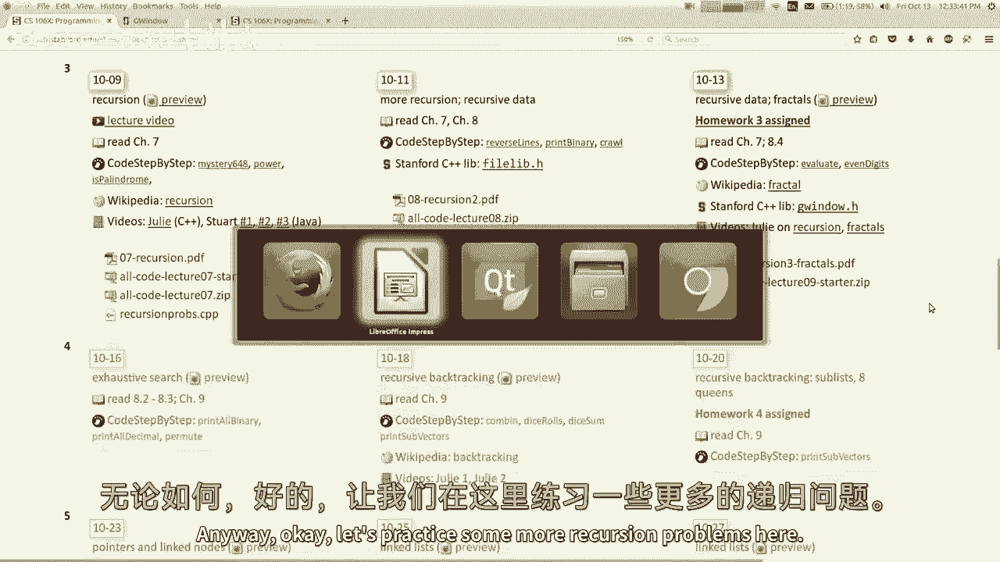
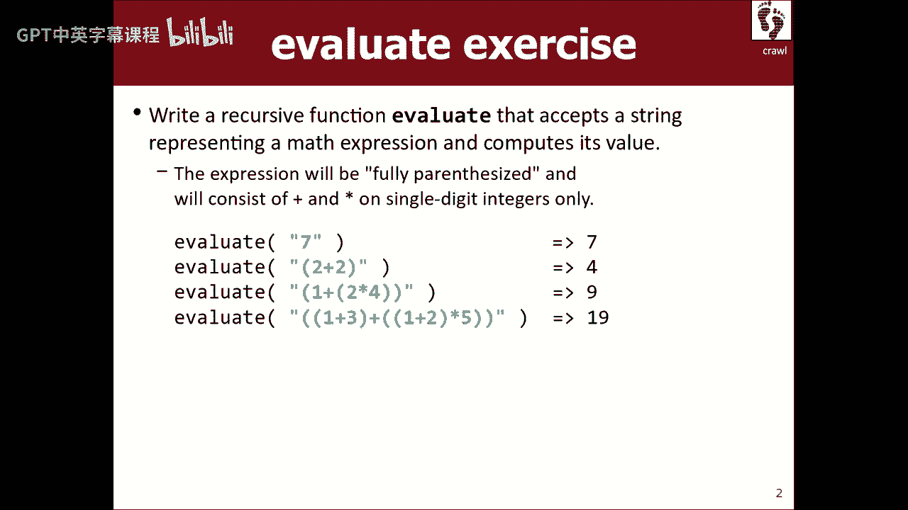
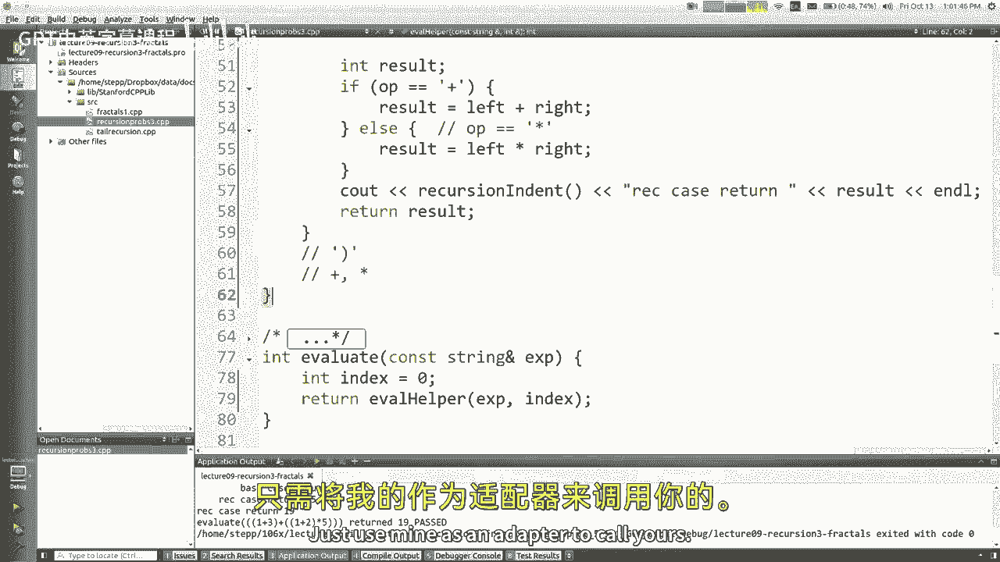
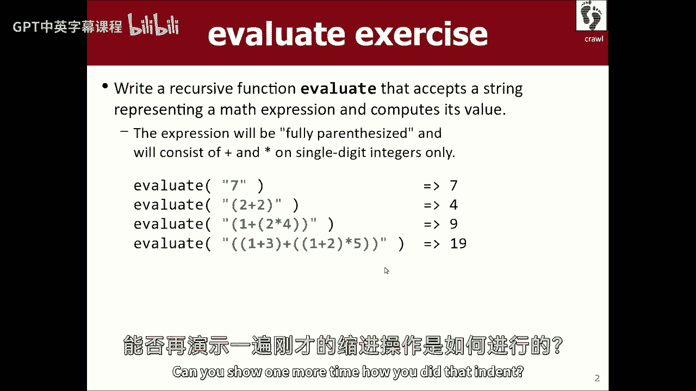
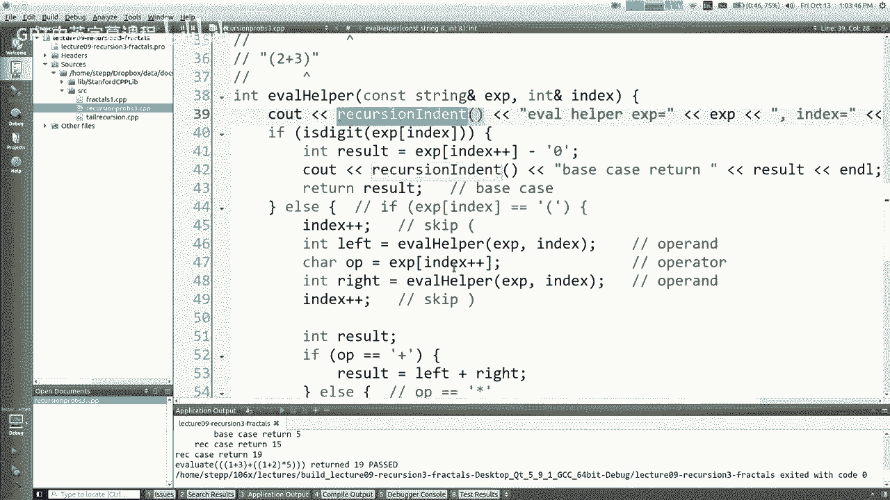
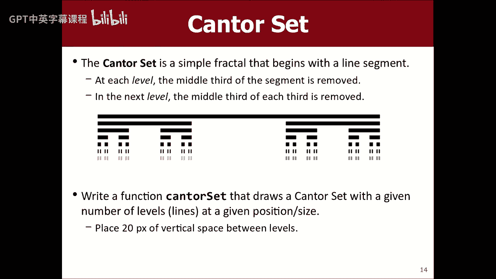
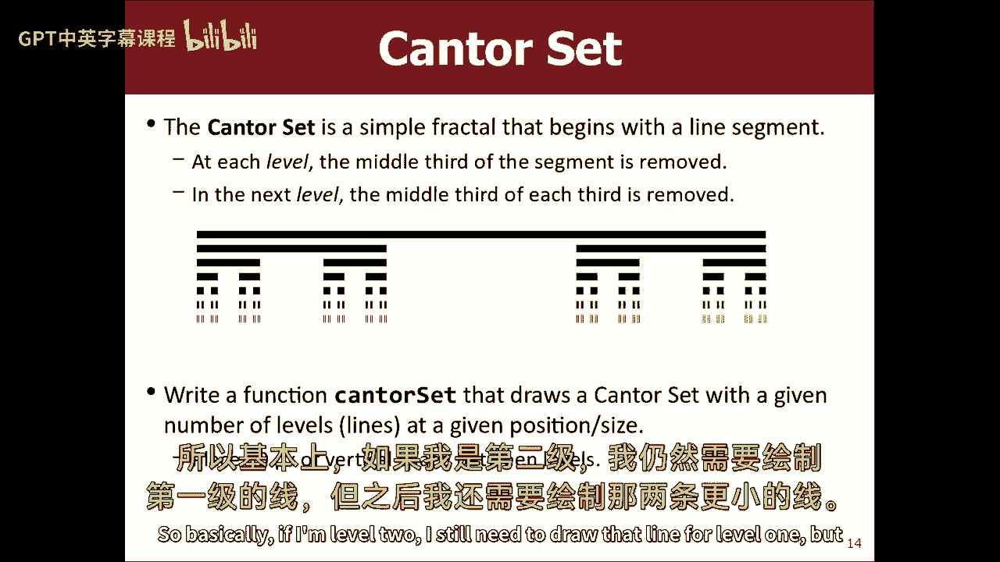
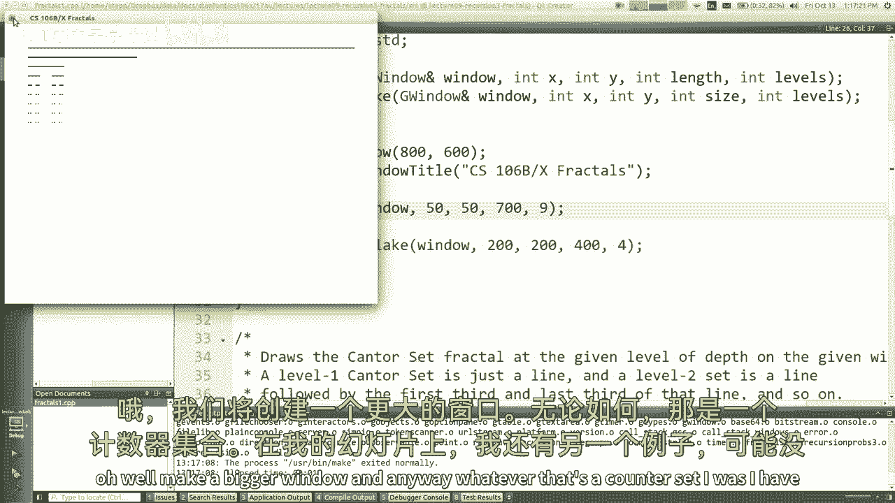
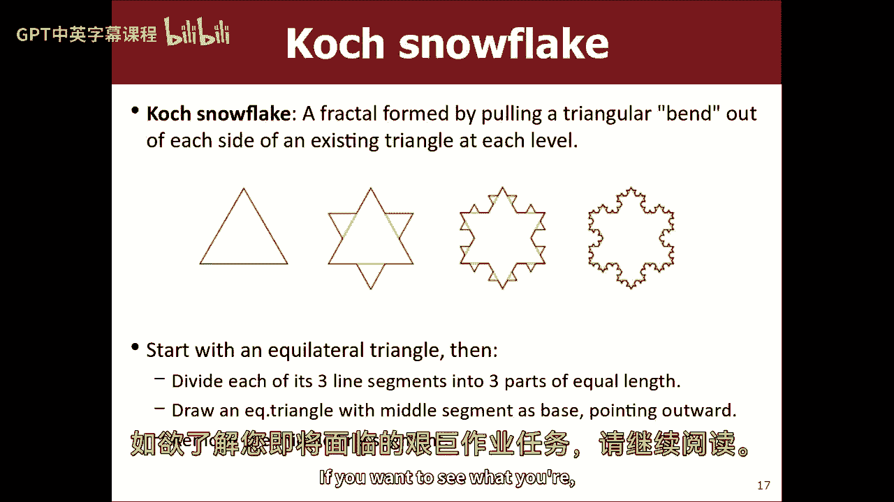

# 【编程抽象方法 cs106x 2017】斯坦福—中英字幕 - P9：Lecture 09 - Recursion 3 - 加加zero - BV1By411h75g

快速快速公告，快速提醒，今天是星期五，现在是第三周，今天是你最后一天可以退课了，我知道你们都不想放弃这门课，因为你做得很好，你是如此的棒等等，但如果你有朋友认为，他们犯了一个可怕的错误。

报名参加了六个X中的一个，你应该警告他们，今天是他们清算的日子，如果你想知道这是否会变得更容易，稍后，我的回答是哈哈哈哈不，我是说，我们将处于这种循环中，大概一周一个任务。

伊什有一个期中考试即将在三个星期左右，所以你知道，就是这里了，这是个很难上的课，我把你淹没在家庭作业中，这基本上是残忍而不寻常的C加惩罚，所以你知道你得到了什么，如果你今天之后还在这里，你是我的。

我可以做任何事，我想让你在学术上，所以无论如何，嗯小心点，就是今天，所以我有几个人问从X切换到B，或者别的什么，嗯，我的意思是，B是很多相同的课程材料，但是作业少了，和一点不同的分级曲线。

一些类似的东西，所以你知道两者都有好处，但我希望你们中的一些人在今天之后会留下来，嗯好吧，所以我想和你们做更多的递归，今天我要讲分形，它们是递归图形，真的很酷，但总的来说，这是做更多递归的另一个借口。

这就是游戏的名字，事实上，如果你展望下周，我们正在做更多的递归，我们将使用一个名为回溯的递归特定应用程序，我们星期一再谈，但是没关系，让我们再快速复习一遍，嗯递归，这时函数调用自己。

如果你必须写一个递归函数，你应该做些什么，有些东西是什么，你应该考虑一下，方法是什么，是啊，是啊，你寻找一些寻找，2。这个问题跟它本身有什么相似之处，是啊，是啊，完全没问题。

这可能会给您一个关于递归调用需要是什么的提示，从你的电话到下一个电话，好啦，你还应该考虑什么，是的，是的，精细基础案例，谢谢你，我想在接下来的几周里，如果你不确定要回答什么问题，就说基本情况。

可能是对的，或者至少部分信贷，嗯，是啊，是啊，寻找基本情况，寻找不需要递归的情况，因为你得在某个时候停下来，对呀，所以是的，这些都是很好的建议，好啦，所以我的意思是，当你谈论自相似性时。

我觉得你应该想想，我的电话和下一个电话有什么相似之处，那个电话怎么像我，所以你看，让我们开始吧，让我们再做一些例子，如果这东西花了你一段时间，就像如果你看看，我想很多学生说他们，当他们看到解决方案。

就像他们看到我写解决方案，他们走了，是啊，是啊，好吧有道理，但如果他们必须用空白屏幕解决问题，他们冻结了，他们走得很好，我不知道，我不知道写它和读它有什么不同，所以我真的认为。

即使您遵循我们正在编写的代码，我觉得你应该通过解决问题来测试自己，在没有其他人帮助的地方，你还没有看到答案，试试看，因为大多数使用递归代码的学生，他们从，你知道的，从一个州到另一个州。

他们开始说我的代码不起作用，我不知道为什么，后来他们说我的代码有效，我不知道为什么，所以你知道，反正我也不知道，呃好吧，我们再练习一下，这里还有一些递归问题。

我想先教你们一种特定的递归，我相信这是我在幻灯片上首先看到的，哦不，我不介意，我只想做个练习，这个有点棘手，这叫评估，我不想写一个完整的表达式解析器，因为要花很多时间，会有太多的代码等等。

但我想看看包含数学运算的字符串，我想计算一下这些操作的结果，让这变得更容易一点，我要说的是所有东西都用括号括起来了，这意味着如果有任何运算符要执行，比如加号或乘法或其他什么，那个操作员和它的，你知道的。

操作数的相关部分将被圆括号包围，所以我可以用这些来寻找操作，好啦，我还将假设字符串是有效的，里面没有假字，也只是为了让它变得非常简单，我要让所有的数字都是个位数，所以我们不必喜欢，试着担心在。

或者类似的东西，原来如此，这里唯一的字符是数字，括号和运算符，我想让它变得更简单，我要说你只有加次数，虽然我认为你可以很容易地一旦我们得到它的工作，我们也可以添加其他运算符，这就是计划。

这就是我想和你们一起写的，你刚给了我一些好建议，你叫我找基本情况，你让我寻找自我相似的东西。

好吧好吧，让我们试着听从那个建议，让我们去可爱的创造者，如果你想跟着，这个是一步一步来的，也在这个可爱的创作者项目上，所以你说，思考，想想自我相似的事情，你能告诉我这有什么相似之处吗，有什么问题，好啦。

我把这些打印在括号里，我想那是其中的一部分，有一种措辞我正在寻找，虽然，比如如何评估，计算表达式如何类似于计算表达式，你明白我的意思吗，是啊，是啊，在黑暗中的后面，是啊，是啊，是啊，是啊。

所以括号内的任何东西都好像是整个，好啦，如此如此，如果这是我需要计算的表达式，这是一个我需要评估的表达式，你这么说好像，这也是一个我可以排除的表达，所以如果我知道它的价值。

我会更接近于知道这一切的价值对吧，因为那样我就一加八了，然后也许我可以看看我是否能理解，所以是的，感觉是对的，右边这个直角，我想你也是这么说的，只是用不同的话来说，这不是这里要做的全部。

但这是个好的开始，那么基本情况或简单的事情呢，嗯，什么是容易评估的表达式，是啊，是啊，你的表情就像第一个是七，只是一个数字，你有一个表达式，它只有一个运算符，都很容易评估，好啦，当然，当然。

如果你只是看到一个数字本身，只是，你知道的，将字符串转换为int，将7字符串转换为7 int，求值并返回，好啦，这些都是好的开始，我觉得最难的是，我想和你们一起做这个的原因。

我想即使我们看到了这些好东西，这些都是很好的起点，我想有时候还是很难喜欢，做所有的管道喜欢，做我们刚才说的那些事，好啦，我想我可以说，如果这是一个单一的字符串，它是一个整数，然后转换或其他什么。

但我认为很容易迷失在所有不同的角色中，因为如果我有这个屏幕，比如我怎么知道我需要把这部分拿出来，你知道我的意思，就像我是怎么想的，我会去找这个，把它变成一个节拍，然后现在就容易多了。

但我怎么知道角色就在那里，我应该变成一个八，我好像漏掉了一些步骤，有点，你知道的，好吧好吧，让我提出一个思考这个问题的方法，我认为这将是有帮助的，不要把它当成一根绳子，把它想象成一排代币。

每个代币都可能是不同种类的东西之一，它可以是一个整数，也可以是开头或结尾的括号，也可能是接线员，如果你想象一下，就假装这是一个字面上的队列，支架，关心什么的，我可以把字符从队列中拉出来。

然后当我看着他们的时候，我可以做任何我想做的事情，如果你这么想的话，我认为这可能有助于解决这个问题，有人举手，是啊，是啊，去吧，我在想，我们可以再次通过每个操作员本身，但这并不像一些人那样容易。

因为你得找到括号里的对手，这就是为什么，但你只要把操作数传来传去，嗯，我想我们可以做的是如果我们看到一个操作数，好吧，其实让我这么说吧，在你看到接线员之前，上环，对不起，你会看到一个插入语。

您可以假设字符串是有效的，对呀，所以你会看到一个插入语，紧随其后的是歌剧，后面跟着一个操作员，后面跟着一个操作员，所以我永远不会随机看到一个加号，我总是会看到我们的插入语，如果我看到一个插入语。

我可以启动这种五步过程，读括号，读一个数字，读取运算符，读一个数字，读一篇文章，那有点过于简单化了，虽然，因为这些可能不仅仅是数字，对呀，它们可能是表达，它们可能是括号中的整个表达式。

所以这似乎是一种俄罗斯娃娃的自我相似性，那里发生的事情，嗯好吧，嗯，在这里，这是我想在这里带来的最后一种见解，我想如果你想把这当成，这是一个字符队列，你可以想象我们在穿越角色，看着他们，现在呢。

我们不用循环，因为它们是递归的很酷，我们不需要循环，但我确实认为从一个电话到下一个电话，你应该有进步，所以我们要么把这根绳子削小一点，或者我们需要以某种方式移动自己，所以我们看到的是弦的不同部分。

我可以想象一个人说，你知道的，也许我会嗅出一些字符，你可以这么做，我想让你看看，我认为一个很好的技巧是如何做到这一点，传递您在字符串中的位置的索引，你现在看到的地方，这不是解决这个问题的唯一方法。

但我认为它最终会很优雅，所以看看我在想什么，我们可以写一个帮助函数，很多时候当你做递归的时候，我们在周三的讲座上看到了这一点，有时你写另一个函数，它有你需要的参数，然后我们有一个函数，我们应该写。

调用我们的函数，所以我们有点两全其美，如果我在评估eval helper中编写了类似于，它需要一根绳子，但它也需要对索引的引用，我在弦上的什么位置，好吧，那么当你第一次打电话的时候，评估实际评估功能。

让我折叠这个注释，以便当您调用实际的求值函数时，你会说像int指数等于，你从哪里开始零右，然后你说在我的表达式字符串上返回eval helper，从那个索引开始，所以现在我要做的是，我有一个全局int。

我可以前进，当我看着每一个角色，所以是的，问题是，为什么不使用静态变量，静态变量的问题，好吧，让我们看看，问题是一个静态变量，即使所有的电话都打完了，我返回的静态变量保留了它的值，所以我想要的是。

我想要一个贯穿我的调用和所有子递归调用的变量，但当我回来，我离开这里，我想让变量噗的一声消失，所以我不希望它停留在指数12或其他什么，在我做完之后，但这是个好问题，我是说静态变量没有错。

我想在这种情况下它们不起作用，所以我的想法是这样的，我觉得这个帮手，你知道你可以，您可能正在解析，你知道一加二，二乘三加四，我说对了吗，除了你什么都可以，你知道的，指数三，所以这意味着你。

你知道你是那种零一，二三，你在你在这里，所以你在绳子的某个位置，你会假设也许你已经解析了所有的东西，您处理了这个索引之前的所有内容，但不包括这个指数，所以让我们想想所有不同的情况。

在这个索引中可能有什么，嗯，它可能是我们所看到的给定索引中的内容，我们必须把我们需要处理的所有不同的情况分开，它可以是一个插入语，也可能是个数字，你可能会说很好，如果是接线员什么的呢。

但就像我在见接线员之前想的那样，您将看到一个括号，所以我想我们现在还不需要检查接线员，所以我想我们要做的是，我们想做一些像，哎呦，如果你想知道一个字符是否是一个数字，有一个叫做数字的方法。

你传递一个字符，它返回一个布尔值，所以不如，如果是个数字，什么位于x括号索引，哎呀哎呀，呃，所以如果那里有一个数字，那是什么样子，如果我们像这里，让我们说，那我们该怎么办，字符串到整数，好啦，是啊。

就像转换，有一个字符串到整数函数，但我想它需要一根绳子，而不是一个关心，我想我能做到，但我认为最简单的方法是说，从Care 0到9转换为int 0到9，所以我可以把它退回去，所以换句话说。

如果我就在这里，那我要做的就是，我只需返回一个1的int数，所以我不想在这里解析整个字符串，算一算，我只是在计算当前的子表达式，我指的是现在，这就是这个helper函数的目标，所以如果我坐在一个数字。

那么当前子表达式就是这个数字，另一件事是，当您的助手正在处理字符串时，我需要前进，所以每次我看角色的时候，我需要喜欢，越过那些字符，这样其他电话就不会再看那些相同的字符了，好吧我想我需要做的是。

你知道的，int结果等于，然后指数加加，然后返回结果，如果你想成为忍者，你可以说返回指数加，你知道的，我的意思是，就像这样先从索引中得到它，然后当它跳伞的时候，它会加加它，所以说，如果你像那样奇怪。

你就去吧，那是基本情况，对吧，我们不必在那里做任何递归，基本情况，好吧不然，我们可能遇到的其他类型的案件是什么，括号，好啦，让我们先处理括号，我听到接线员，2。我想最后到总机，我想我们会明白为什么。

如果x索引是括号呢，让我们记下来，因为我不想忘记任何事，让我们记住，我们也要考虑闭括号，我们想考虑运算符，因为你们就是这么说的，这些是唯一的其他角色，我能想到的权利，让我们记住我们不想忘记他们，好啦。

如果是插入语，那一般呢，我们现在要这么做吗，我想也许发生了什么，我们看到我们有，你知道的，二加三，同样的事情找到其他括号，是呀，那是个有趣的主意，你可以，你可以说很好，如果这是我的插入语，谁和我匹配。

我可以去找对了，所以我当然可以这么做，我想我想试着找到一个不同的解决方案，因为向前看匹配过程，感觉更像是，我需要一个循环，否则我就得打电话给find或字符串上的什么东西，我想我能做的是。

我可以把大块的字符，如果我做了正确的递归，我几乎不需要知道匹配的括号在哪里，我想你会明白的，如果我们做对了，所以我是说我们会看到的，我们以后再说，所以说，如果我在括号里，嗯，也许我应该做的第一件事。

我想超越它，因为我想，我要读一下，基本上我会处理，所以说，也许我会说索引加号，这意味着跳过括号字符，现在呢，什么，括号里是什么，这是一个，它通常有一个操作数，然后是一个操作员，然后一个操作数右。

然后它也应该有一个结束括号，好啦，嗯，让我们读操作数，所以操作员就像一个二，所以我应该做这种，你吃了多少，那种代码，那我想是的，我们再叫帮手，新的X是的，所以关于操作数的问题是，操作数可以是表达式。

子表达式，所以我不应该只读一个字符，就像这里的2，我应该说嘿，在这个括号之后，不管是什么，那个索引是我需要得到的值，它可能只是一个int，会是这样，也可能是一堆括号之类的东西，就像，如果我的光标是。

二乘三是我整个表达式的左操作数，就在这里就在这里，所以让我们使用递归读取操作数，所以说，相同的字符串和相同的索引，因为我把自己加到前面的括号里，所以现在这里有一个关键的概念要理解，这通电话打完之后。

让我们假设我们在看这根弦，我们刚刚做了一个递归调用，记住递归是如何工作的，你应该假装，我希望我自己的代码有效，我希望我的递归在这里做正确的事情，如果成功的话，接下来会发生的是，它会计算2乘以3。

然后返回6，索引的光标将在哪里，这家伙做完之后，如果他工作，应该是他会狼吞虎咽地吃他正在处理的所有东西，如果他的编码正确，所以他应该把我留在那里，因为我们共享对同一个索引变量的引用。

我们所有的调用都共享这个变量，所以在这通电话之后，如果代码有效，索引就在这里问题，但指数不会只是在，数字2，然后回到左边，好吧，对不起，我想我想我们在电话里有点迷路了，我想是的好的，让我让我再试一次。

我想我认为那是不正确的，但让我看看我能不能通过这个，所以让我们假装我的电话，我们追踪的电话，我们是对的，所以我不是一个数字，所以我读了一个括号，我把我的索引加加在线四一，所以索引现在就在那里。

现在我说做一个递归评估，所以第二个电话在这里，所以他进入了同样的逻辑，所以他读了两遍括号，三个括号胜过它们，对我来说是六倍的回报，现在我要回到这里，我想现在我觉得有点难，因为我们还没有写代码来喜欢。

做时间做结案流程，所以我有点假装这是要去工作时，我还没写呢，但这是一张像借条一样的借条，我希望这能评估整个表情，把那六个还给我，然后它会把光标放在圆括号的末尾，是啊，是啊，问题，你能和接线员谈谈吗。

操作员，哦，实际上做接线员，没有聪明的把戏，真的吗，我只想说如果还有别的什么，所以是的，让我们读一下那个接线员，操作员是我现在要扮演的角色，在递归调用al helper之后，如果你在这个例子中迷路了。

我知道这是个更难的问题，所以我选对了，所以做这个，走过这个，所以如果我是一个插入语，好吧好吧，我是索引加加现在跳过它，做Eval助手，它也会看到这个，把它转换成整数2然后把它还给我。

他们会把索引加起来给我，所以我知道这很管用，因为，我看得出来我要跳到这里来，在第二次通话时做到这一点，我可以追踪到所以现在我知道是第二个人把我搬到这里来的，所以我在这里，所以现在我将读取这个运算符。

所以说，什么，哎呦，词运算符，是呀，呃，我永远不会忘记，你知道很长很长，很久以前，呃，本科，你知道我在帮助学生，就像你们一样，我去实验室帮助学生解决他们的错误，你知道吗，我超级紧张。

因为我想有这么多不同种类的虫子，我也不知道，你知道我不知道，如果我能帮助他们，然后有一个叫吉格尼什的家伙，他就像一个更高级的部门领导，他就像，别担心，男人，你得到了这个，一切都会好的。

就像你可以做任何事，然后我带着我的第一个学生过去帮助他们，我就是想不通，就像，这是Java代码，我只是我看不到虫子，我看不到窃听器，我开始觉得，因为我觉得自己很无能，然后我示意吉尼什过来，你能不能。

我只是找不到这个窃听器，他走过去，他看了半秒钟，他说他们把变量命名为continue，那是个关键词，他走开了，他们就像哇哦，他真聪明，我就像，他怎么知道的，后来我就像伙计，你怎么知道的，他很好。

屏幕上是蓝色的，你知道关键字变成蓝色，哦，颜色，所以实际上，只是你让我想到了，因为这个操作员是黄色的，是呀，反正，所以好吧，那是关于我的一点，嗯，所以阅读运算符，所以我们要抓住那个接线员。

现在要么是加号，要么是倍数什么的，嗯，每当我们喜欢读一些我们要处理的东西，那是我们的，我们应该把输入光标移到右边，所以我想我们应该在这里做指数加，所以我们走在前面，所以现在我们的光标将在这里。

现在我们得到了操作员的右侧，右上兰特，所以我觉得我们应该再来一次，这里，让我试试这个，这个代码越来越高了，我想试着在屏幕上适应更多，所以大家可以看到，所以现在当正确的事情做了，他会读并吃掉这三个。

所以他会把我的光标放在那里，如果成功的话，所以现在这里应该有一个结束括号，我想我可以用if语句来测试，但如果我假设字符串是有效的，我应该知道我所扮演的角色，现在必须是一个结束括号。

所以我想跳过最后的括号，我会说索引加号，所以这只是意味着跳过那个字符，你也许会说，谁在乎，如果我跳过或不跳过，但这就像嗯，如果我是这种事情的一部分，你知道我需要跳过公主到什么是下一个或任何权利。

所以跳过括号，现在我做对了，我想我有这个左运算符或操作数，我有运算符，我有正确的操作数，所以基本上我只需要说如果运算符是正的，然后返回左加右，否则，如果这次行动，我想我甚至不必说如果还有，只是。

你知道的，我知道这次行动，因为我们的假设，向左返回，好啦，是啊，是啊，这是一个接一个的谜题，我能出界吗，如果字符串格式无效，是呀，如果我能假设字符串是有效的，那就不会发生了，所以说。

如果你在最后有喜欢呢，然后每当你使用索引时，一旦我们到达终点，哦，就像你说的，在溪流的尽头，你就在这一切的最后，索引将是一个通过，但没有人会试图去那里，没有人会试图进入那里，我想我们会没事的，所以好吧。

我们基本上完成了，我们基本上完成了，我要说的是，我要把这个删掉，这里的if语句，因为如果你假设这些字符串是有效的，这是你现在唯一能有的两个案子，你们提到了接线员，但我永远不会去见接线员。

除非它前面有圆括号和操作数，所以我不必检查它作为自己的外部情况，就像结尾一样，如果我必须检查这些东西，我在检查伪造的表情，我不想那样做，所以我要把其他的，我会评论如果，我编译和运行，然后呢。

我觉得它很酷，如果您在看到代码工作时遇到困难，我的建议是进行大量的递归，如果你不太明白，在递归调用的开始处放置一个see out语句，就说Eval助手，x等于x，比如打印参数，你知道的，所以我的意思是。

啊，哎呦，我做得好的是什么，让我们来看看，这样很难读懂，所以让我们把它当成一个，如果阿尔帮手，它从索引零开始，所以它就在那里，导致了一个带有索引1的递归调用，就在那儿，所以实际上。

然后索引1调用导致对2的调用。

就在那儿，实际上，为了让这一切真正发挥作用。

我想我要做的是，我再放一样东西进去，哪里，如果我要退货，我说出去，int结果等于看到返回结果，然后我会说返回结果，然后在这里我将做int结果，我只是想让这个更容易调试的结果等于，结果等于。

然后这里我会说返回结果，所以也许我会说递归大小写返回，在这里，我会说基本情况返回，所以让我们再试一次，那么我哪里做错了，我没有还，为什么它不给我一个错误，C加+烂透了，只是把垃圾还回去。

你有没有注意到它像200亿一样回来了，管他呢好吧，我再试一次，嘿嘿，你想看些很酷的东西吗，如果不是看到外面，所以有一个函数，我们图书馆里有个标题叫呃，递归，点H不，它不包括自己，聪明的屁股。

虽然它应该它真的应该，我应该进去换一下，我应该说包括递归，但不管怎样，那个h文件有几个函数，递归的妙处，所以我认为这里有一个函数叫做递归缩进，所以你能做的就是，你可以用它打印缩进的东西，就像这样。

我想我有一阵子没这么做了，但我想是的，你看现在都缩成这样了，哦耶，酷，所以现在我不必坐在这里手动做这个，所以好吧，那么它擅长什么呢，我们称它为指数零，所以它就在那里，然后打电话给索引1上的助手。

它就在那里，然后在索引2上调用，就在那里，这是一个基本情况，所以它返回int也是这个家伙的一部分，他对索引4做了另一个递归调用，因为他读了，一个是子呼叫，然后他读加号，然后他对那个调用进行递归。

那是基本情况，它返回三个，上面这个人回来，这是他应该归还的，因为他在处理字符串的那一部分，所以他回来，现在他回来之后，他把光标从这个人一直移到这里，所以这家伙会看到他在这里有一个时间，现在他说好。

我得读对操作数，所以他从索引七打了这个电话，哪个在那里，但你知道你怎么能，你可以追溯一下这是怎么回事，所以我想我不会从头到尾读一遍，但不管怎样，这就是它的工作原理，那个有点棘手，很难表达。

但你可以做很多很酷的事情，你知道的，自我，类似的递归函数类型调用关于表达式求值的任何其他问题，所以求值函数的唯一点就是初始化，启动递归，是啊，是啊，所以计算函数只是让我们进入函数，很多时候，如果你说。

啊，我想我能解决这个问题，但我必须传递一个额外的，一个额外的字符串和额外的向量，罚款，写那个，但如果你必须做我说要写的那个，那就让我的呼唤你的，只要用。

用我的作为适配器打电话给你的，再表演一次，你怎么做到的。

然后看起来会是，我是怎么做缩进的，所以你必须包括递归h，然后你就看到绳子，有一个名为递归缩进的函数，它返回一个空格字符串，基于深度递归调用的数量，你在同一个功能，所以更多的空间，更多电话。

所以我就打印了那条流，接下来是什么，我其实，但这只是一个澄清，但我们回来了，结果和增量索引，是呀，所以在表达式中间使用加号，它将使用旧值，因为它在看东西，但在它之后，它就会增加价值。

所以如果你不喜欢这个，呃风格恰到好处，只是我真的，当我为自己编码时，我不这样编码，我以为你们这些怪人会喜欢，所以我会写这个没有加号，因为那是我想要的，我想要当前的索引，然后在它自己的线上。

我想说指数正加，是啊，是啊，但这就是它的作用，你说的对，好再来一张，然后我想继续前进，然后弄清楚你的感受，Dent中的递归是如何工作的，那是黑魔法，你得上黑魔法防御课才能了解这一点，有点复杂。

以下是我的建议，如果你想知道我们的图书馆是如何实现任何东西的，双击右键，单击它并按照符号操作，很容易，很容易，你可以去看代码，等一下等一下，但它叫这口井，这怎么会，所以嘿，那种是自我。

查找某物的自我相似过程，反正我也得查点东西，我鼓励你去看看。

好啦，所以我想继续前进，我想讨论分形，我不想没时间了，这里还有一件我今天要看的东西，称为尾递归，我稍后再讲，你不需要它做家庭作业，但我要谈谈分形，分形是递归的艺术，分形很酷，他们真的很有趣。

你可能在重复模式之前见过这种分形图像，自相似模式，我喜欢分形，它是，你知道的，我想教你递归，但我希望你能用它做点什么，那很有趣，很酷，分形看起来很整洁，它们画起来很有趣，做动画也很有趣，所以嗯。

屏幕上有一些分形的例子，有很多很多这样的例子，好啦，所以这里有一些例子，这个叫做兹文斯基三角，又名三力，但是它们内部不断重复的一系列越来越小的嵌套三角形，这个叫曼德尔布鲁套装。

我要让你在作业中编写其中的一些代码。

我们今天要在这里编码其中的一两个，所以分形不仅仅是老师们喜欢的东西，它们实际上是自然界中发生的事情，不同的岩层、植物、云朵和雪花，各种各样的东西实际上都有这些自我相似的重复模式，他们很酷。

分形真的很有趣，数学和计算之间的美妙舞蹈。

好啦，那么如何对分形井进行编程，通常我们所做的是讨论分形的水平，我们说，啊，第四层是相邻的层之间通常有相似之处，你说得好，这是通过把扑克从它的三个侧面拉出来而变成的，或者像你这样的人。

你描述了一个从一个到下一个的突变过程，然后从这个到这个，你用同样的方法把这个的边缘都拉出来，然后你得到下一个，或者类似的东西，你知道你，但是这个术语就像一个分形的水平，分形有某种基本模式。

然后变成重复的版本，在下一个层次上的更小版本，所以画分形，我们将使用斯坦福图形库，这不是很好，因为它很慢，不过没关系，它会，会有用的，嗯，标准坐标系，就像你在家庭作业里看到的，一个零，零在左上角。

然后我们往下走，从那里我们使用这个叫做G窗口的对象，我们在上面绘制，我们不需要很多，它有其他方法你可以在现场查看，如果你想知道，但最主要的是我们只是想从一个点到另一个点画我们的线，原来如此。

我不打算在这张幻灯片上花很多时间，我们只是想划清界限，这很容易，就说画线嗯，那么你怎么把这个分形画好呢，你得把方块画对，但你得把它们按正确的顺序画出来，那么你画方块的顺序是什么，嗯。

您必须对每个当前调用进行四次递归调用，分形的每一级或每一阶，你必须，在某个时候，有人必须画一些矩形，那么你把填充矩形的调用放在哪里，有什么想法吗，A，B，C，D，E，所以这个x和y坐标是约化的。

所以这意味着它在左上角，右上角，左上角的人在我下面，所以这意味着他必须被画在我面前对吧这个是右下角，他也在我下面，意思是他在我面前，这个是右上角，他在我上面，所以他一定是被我吸引来的，这个是左下角。

他在我上面，所以他只是，我觉得是，呃，是C，我们得把自己的位置画对，所以不管我是什么意思，你可以把它放在不同的地方，看到一个稍微不同的数字出来，我只是想向你们展示画不同阶的分形的想法。

注意到我们所做的是当我们进入下一个层次时，我们缩小我们的规模，所以我们得到了一个更小的自己，最终得到0或负一，不管基地是什么，我们就会停止成长，所以实际上你会在这些分形故事中看到的一件事是，很多时候。

基本情况和递归情况可能不同，它可能更像是一个空的基本情况，你只是不画任何东西，所以好吧，让我们画一个非常简单的分形，它被称为康托集安德森只是一个模式，你有水平线，然后随着水平的下降。

你有越来越小的水平线看起来像这样，这个我觉得是七级一二三四五六七，模式是你画的下一层，以前水平的三分之二，所以这是第三个，以前水平的前三分之一和前三分之一，对呀，就是这样，所以说。

让我们写一个名为cantor的函数，你告诉我画在哪里，就像线的xy位置，线路的起始位置，你告诉我线的长度或大小，以及您想要的图形的级别数，我会把它画得，递归右基例，康托尔集的一个容易的水平是什么。

第一个只是一条线，对呀，好啦，我想我可以做这部分，你们这些家伙，我的意思是，可能会让你帮我写另一部分，但我想我能做到，让我看看，我只是在这里打开我的分形文件，我在这里设置了一个康托尔，好啦。

所以我们很平淡，你喜欢我的腹肌艺术吗，顺便说一句，那是艺术可以设置的，所以说，你刚才说，我觉得第一关就是一条线，马马虎虎，如果等级只有一个，那我就对着窗户说，我想画一条从x y到井的线，它是一条水平线。

从这里开始，一直延伸到这么长，所以x随着长度的增加而增加，Y一点都没变，所以是x加上长度，一样的Y，否则，我想我可以说，如果级别小于或等于1，只是为了不让我们得到任何奇怪的负数的东西，如果级别不止一个。

嗯，听起来很难，嗯，很明显是相似的，但我不知道如何表达，如果你想画一个七级，因为这看起来真的很难，有时一个有用的建议是想一个，这只比简单的基本情况提高了一个级别，你怎么画二级，康托尔集，后面，是啊。

是啊，所以你从上面的水平中提取，这是第一次，第三次，一个，第三次，又是第二个标记，好啦，所以画两条小一点的线，我说的是在水平之间放置20像素的垂直空间，所以基本上如果我是第二级。

我仍然需要为第一级画一条线。

但我需要画这两条较小的线，所以如果我是第二级，不如我们记下来吧，二级，我还是会画这条线，但在我下面我会画两条较小的线，所以你是说，左边的第三个，就像这里的这个人，和我一样是开始的x。

但只有三分之一的y是我，所以像同样的x y，但也许会向下移动到20，然后长度是我的长度超过三，他的Y和他开始的Y加20是一样的，那是左边的，然后你说对的那个就在旁边，再加上三分之二的长度。

这样你就不能通过长度了，你实际上在这里传递结束的x坐标，所以我认为这是x加上长度，或者类似的东西，就像，画两条小一点的线，然后画，我不想吹毛求疵，我认为这是一个很好的开始。

只是我们的递归函数缺少了一些东西，我不太清楚那是什么，有一个X加号的人，少了一个x加号，好啦，在三扇窗户上，好啦，聪明的家伙，罚款，有两件事，我的反应还是少了点什么，它没有任何递归，对吧，那很重要。

嗯，好啦，也许会变得更清楚。

如果我看第三级康托集，所以我想要这个，所以现在我还是要画我，我真的想要这两个，但我也想要这些，然后呢，你知道就像，我怎么做，有什么想法吗，是啊，是啊，是啊，是啊，也许不用下面这两条线。

你这样在最下面的两行代码，下面的两行是52和53，所以与其说生产线制革机，然后有对应的x和y，然后好吧，所以不仅仅是，我想在这里画一条线，我想画一个水平，两个慢跑在这里，就这么大，所以一个级别。

三个计数器集是一条线，紧随其后的是两个较小的，两套计数器，所以把这个改成，康托尔集，它需要一个窗口，所以我得通过窗户，x y长度水平，所以实际上长度是3的长度，嗯，我不用再通过考试了，有哪些级别。

我应该写在这里，我的水平，我什么水平，我少了一个，对所以是的，这里也一样，把这个变成慢跑套装，相同的长度超过三个，我想然后水平我做错了吗，你什么意思，长度要乘以3，因为你会好起来的，不，如果我是第三级。

这个长度的癌症集，这意味着我是第三级，我是，但我希望小一点的人是我的三分之一，但你要上去，你的水平在上升，也在下降，这意味着你要在数字上上升，这取决于你想怎么想，我觉得你让我画第三层，我这么大。

所以如果我要传递到较小的部分，他们必须比我小，所以我把我三分之一的长度传给他们，所以你的想法是自下而上，也许如果我想画七级，我应该先画两个然后再画一个大一点的然后再画一个大一点的。

我认为这种方式从大开始，然后把它分解成更小的部分，我认为坐标数学比试图计算，如果我是如果我一直在这里，我想去更大的地方，我想这可能更难，我不知道，肯定不止一种方法可以做到这一点，让我们哎呀，稍等一下。

没有改变我的主要，这是正确的，呃，我们再试一次，我还有虫子吗，你不知道，你不必嘿看看，我有一套慢跑装备，对不起，我不必做我想做的事，二级以下，你不必划清界限，因为你已经为第一级画了一条线，是啊，是啊。

我想我想我们通常在这里做的是，如果级别至少是一个，我们这样做，这是一种较短的版本，我想我想这很管用，所以如果我至少是一级，画一条线，然后画小一点的家伙，但如果那些小个子最终变成了零级。

他们不会输入if语句，也不会画任何东西，所以实际上，这是同一段代码的一个稍微小一点、更性感的版本，嗯，如果你真的想让它更容易看到，你可以做一个，就像两个两个像素厚的画两条线。

这样在投影仪上就更容易看到了，还有一个是如果你想看图纸的顺序，你可以说停顿10或者20，只是短暂的停顿，然后你看的时候，你可以看到它有点填充，每一行都是自上而下，它在向右之前先向左，但这是一种递归。

我真的认为它可以提供很多信息，如果你还在学习递归，把延迟调高一点，只是看着它，把每一个电话，你知道的，我可以一整天都这样，谁需要瑞克和莫蒂真是太好了，当你有一个缓慢的绘制，分形，我能做更高的水平吗。

当然呃就像，我觉得问题是，它们在下面变得很小，基本上就像一个小像素，就像，啊，嗯，做一个更大的窗口。

也许两三个，我在我的幻灯片上还有一个，我可能没时间给你看，如果你有兴趣，也就是，嗯，让这些小饼干在它们的两边弹出来，这个其实更难，如果你想挑战自己，你可以试着往右走，这个，我觉得困难之处在于，就像。

这个和这个的坐标在哪里，结果证明真正有帮助的是，因为你要编码，这个是用极坐标，因为在极坐标系中，你只需指定一个角度和距离，你想旅行，想弄清楚所有这些的x y真的很难，但也算是说得好，我想从这里到这里。

你可以说很好，那是一只雄鹰，这么远的20和1θ，你说，好啦，我要走那条路，但是，哎呦，我是递归的，所以几乎三分之一的方式，那我就转啊转啊转，你可以更容易地描述这个数字，所以如果你想看看这些幻灯片。

看到这种进展，这是我最后几分钟的建议，因为我不想，我无法在两分钟内完成编码，所以我不打算开始，但是幻灯片中的解决方案，如果你想看看你折磨人的家庭作业会是什么。

我给你看一下，我有一些演示，我可以跑，你们的部分作业是画一些分形，所以你要画像谢尔宾斯基三角形这样的东西，那是第一级，这是第二级，你知道第三级吧，你要，您将编写代码来绘制这个zpinsky三角形。

像这样对吧，所以你会做那个，您还将执行一个称为递归树的操作，就是你画一个小树枝，这也得益于极线、角度和坐标，那很有趣，你还要演一个叫洪水的，填充，世界上最慢的绘画算法，你点击一个正方形。

它就会用项圈填满它，然后呢，当然，您可以递归地这样做，通过寻找与您颜色相同的相邻像素，以此类推，不要点击白色背景部分，上色大概需要四到五分钟，哎呦，你想让我做，好啦，罚款，呃，走啊，看看你让我做了什么。

看看你让我做了什么那首歌烂透了，我不敢相信托特做了那首歌，嗯，还有，其实还有曼德尔布鲁套装，呃艾米，告诉我，她觉得它可能坏了，让我看看它是否和我的演示一起工作，在那里检查出来，其实那个看起来不太好。

但如果我给它指定更多的订单，会收紧的，否则会更好看，我再试一次，有曼德尔兄弟的布景，那个很酷，这就是你们三人作业的第一部分，您还将编写一个句子解析器，你走了一套语法规则来生成随机的愚蠢句子。

也许我会运行真正的快，我知道该走了，但是你要指定一个文件名，像句子文本，你说你想要判决，你想要十个，然后你会得到像大大学一样的荣誉，大潜意识大学，我想这是某种事件，无论如何，那是第二部分，这是递归的。

因为你知道短语可以包含子短语等等，所以你递归地生成这些句子，第三部分是，你要写一个20个问题的游戏，在问题和答案树中行走，试图猜测用户在想什么，它有一个非常有趣的数据文件，你在想什么动物。

那个人在躲着你，这就是你的任务。

祝你周末愉快，我们星期一再见。