# 斯坦福大学《CS106L： C++编程｜ Stanford  CS106L C++ Programming 2019+2020》中英字幕（豆包翻译 - P1：[2]CS 106L Winter 2020 - Lecture 1_ Intro - GPT中英字幕课程资源 - BV1Fz421q7oh

开始了。

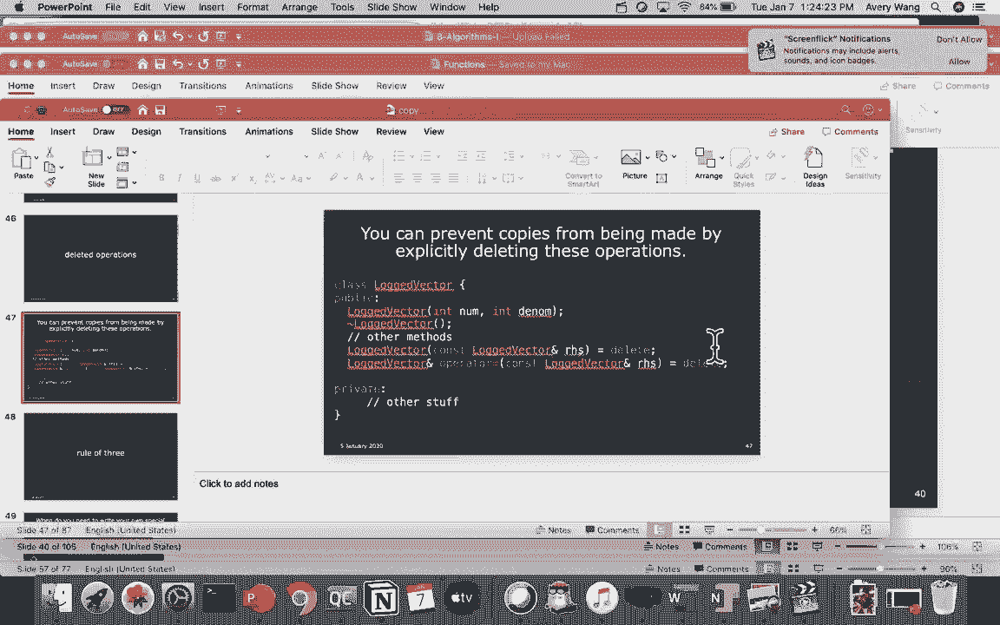

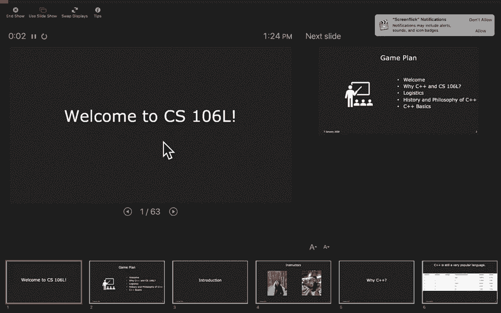

哎呀，你能看到我吗？真糟糕。

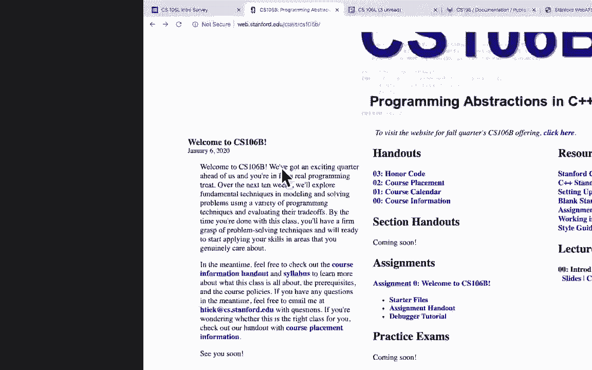

欢迎大家。哦我的天。是的，随意坐在左边的一半。

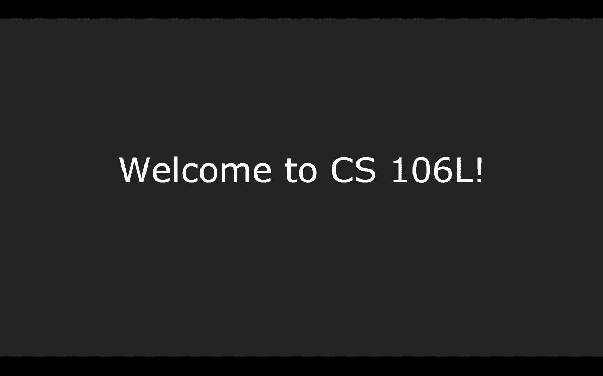

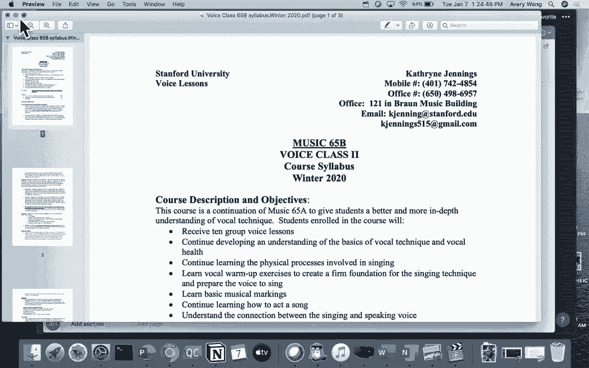

实际上，我们首先会请你转向你左边或右边的人，做自我介。

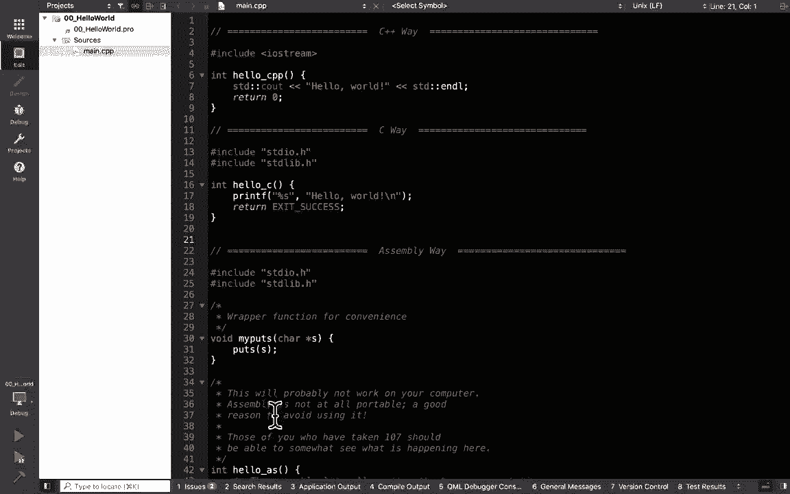

绍。通常，106L 是一个对 C++ 或其他编程语言非常感兴趣的，人参加的课程。所以它通常是一个非常紧密的社区。希望这个季度我们能够继续保持这种氛围。哦，你们的名字是什么？Pam？Sonia？

Sonia。Sonia。好的。还有 Glenn。好的，非常好。这是我在外面教的课程。你们在做设计哲学。是的。我会很快讲完。是的，一切都完成了。一切都很好。

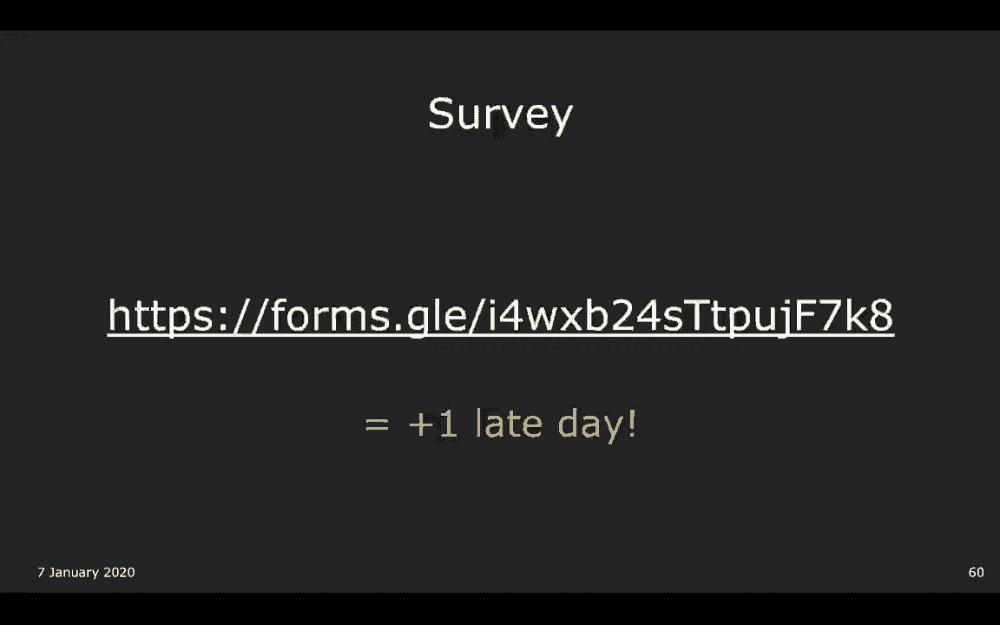

是这个，对吧？哦，你好。欢迎大家。欢迎大家。

好的，如果你们准备好了，我先打开 Piazza 页面。是的，所以我们在这个课堂上主要使用 Piazza 来提问。这是我们的 Piazza 页面。在最底部。这正是你们所期望的样子。是的。

这里会发布诸如作业修改或填写调查问卷的提醒，这，些都能为你们提供延期等。是的，当然，我们也希望你们在 Piazza 上提出任何 C++ ，相关的问题。是的，Avery 和我很乐意回答任何问题。

即使这些问题不一，定是我们在课堂上讨论的内容。是的，这门课真的给你们一个与我们一起探索语言的机会，所以如果你们在本季度的 106B 中看到过的内容，也可以，随时询问。再说一次。

请访问这个链接加入课堂的 Piazza。欢迎大家。是的，请向前移动。我们不小心弄了一个巨大的讲堂。所以请坐到前排或附近。请向前移动。我们不会咬人。只有 Avery 会。只有我。是的，但我现在真的很饿。

但是请向前移动，因为这个讲堂真的很大，我们想和你们互，动。我们的讲座大多是互动的。所以请向前移动。不要坐在后面。我们保证最终会记住你们所有的名字。是的。是的，也请向前移动。请再向前一些。135？133？

230。230？好的。好的，所以我们还有一分钟课程开始。所以你们可以趁这个机会看看你们左边或右边的人，做自，我介绍。比如说，你们的年级、学的专业。是的，相互了解一下。至少要知道彼此的名字。你好。

欢迎大家。欢迎大家。是的。坐在前面任何地方。是的，请坐在前面。我之前实际上上的是数学课。所以看起来有点像这样。是的。好，你们想开始了吗？我开始了，好的。好的，我们稍后会回到这一页。但让我们开始吧。是的。

我们有很多幻灯片。让我们看看。好的，一切准备好了。太棒了。好的。大家好。欢迎来到CS106L。好的，所以耶。是的，好吧，我们今天要做什么？今天，我们首先欢迎大家来到CS106L。

我们会谈论为什么选择C++。在所有存在的编程语言中，为什么C++如此重要？然后我们会问，好的，那为什么要选CS106L？CS106L在你们在斯坦福的长途旅程中是如何定位的？我们会谈论这些。

然后我们会讨论一些关于这门课的后勤事务，这门课的要，求是什么。然后我们会深入探讨C++的历史和哲学。安娜会讲解这些。最后，如果我们有时间的话，我们会介绍一些基本的C++。示例代码。是的。昨天。

如果你在基思的课上，他做了C++的简要介绍。我们会介绍另外一部分。对比一下，基思在课堂上讲的现代版本。好的，我们开始吧。首先是一个介绍。这些是我们的照片。是的，你好。很高兴见到你们。我的名字是安娜。

我是本季度106L的两位讲师之一。我现在是计算机科学专业的本科生，专注于系统，并且对网，络安全感兴趣。如果你对这些感兴趣，可以在课外和我聊聊。大家好。我叫艾弗里。那是我抱着一只玩具鳄鱼的照片。是的。

我现在是大三学生。我是数学专业的，虽然我可能会做一个计算机科学的联合，学位。所以可以随时问我相关的问题。是的，我们喜欢教学。过去，我们都曾是部分课程的负责人。是的，曾经是CS106项目的负责人。是的。

所以可以随时问我们有关CS106、CS106A、CS106B的，任何问题，如何申请成为课程助教。如何申请成为课程助教。是的，我们会稍后详细讲解这些。但这就是我们自己的简要介绍。

让我们谈谈为什么选择C++。那么，有多少人现在在CS106B呢？好的，所以你们中有很多人。然后，好的，有多少人以前上过CS106A的Java课程？好的，106A的Python课程呢？好的，我明白了。

所以，很多106B的学生上学期学了106A。上学期，你们学了Python，但你们可能会想，好的，我们已经，有了一个很好的编程语言。那为什么还要学另外一种语言呢？

所以，尽管很多人会告诉你，哦，C++是一个过时的语言。Python是世界上的新语言。这并不完全正确。C++仍然是一个非常流行的语言，尤其是在最近几年。这些年，它们对语言进行了重大改进，使其更容易使用。

因此，C++的受欢迎程度仍在增长。是的，所以C++在Python的影响下复兴了。我们发誓C++和Python之间没有战争。这只是一个内部的竞争。是的，尽管我昨天确实去了CS41的Python课程。

试图挖学生，这并没有奏效。但是，是的。

使用C++的课程。所以有很多课程使用C++。事实上，你会发现，C++的许多应用都是与性能相关的。你可以看到，有很多并行计算、计算机网络。许多这些课程使用C++是因为C++是一种性能强劲的语言。

使用C++的公司。我们总是问到的最大问题是，C++会帮助我找到工作吗？答案是肯定的，会的。几乎每家公司都在某处使用C++。事实上，如果你去Handshake上搜索C++，你会得到成千上万，的结果。所以。

这是一个有趣的事实。许多浏览器都是用C++编写的。你们都有用这些浏览器吗？好的，是的。所以你们可能听说过，浏览器编程非常困难，它们全都是用，C++编写的。因为性能很重要。你想要一个慢的浏览器吗？你不想。

这就是为什么许多浏览器用C++编写的原因。C++中的软件。我总觉得很有趣，Java实际上是用C++实现的。所以如果你正在使用任何语言……，我不确定Python。Python是用C++实现的吗？好的。

不是。啊，太糟糕了。但是，是的，Java是用C++编写的。你用过的许多软件工具，都是用C++编写的。游戏。许多游戏是用C++编写的。所以如果你……，从你对游戏的了解来看，当你玩这些游戏时，这些游戏相当。

密集。这些游戏使用了大量内存。如果你尝试在你的笔记本电脑上运行游戏，如果你的笔记，本电脑不够好，你的笔记本电脑会变得相当慢。为了应对这个问题，许多这些游戏需要真正高性能的语言。

你会注意到我一直提到高性能，因为这是C++的最大优势之，一。我们将在本讲座稍后深入探讨高性能的实际含义，特别是，当我们谈论历史时。好的。所以，有趣的事实。C++存在于不止一个星球上。好的？

所以有一个火星探测器。这个还在运行吗？我不认为它还在运行。但是现在里面仍然有C++代码。可能还有其他探测器里面也有更多的C++代码。许多这些火星探测器、许多这些飞行器，它们里面都有用，C++编写的代码。

好的？好的。每季度我都试图发音这个名字，但总是失败。你怎么发音？比约恩·斯特劳斯特鲁普？比约恩·斯特劳斯特鲁普。可能。好的。我们就叫他，他是C++的创始人。确实如此。是的。如果你上网。

看到他写的任何东西，人们都会非常尊敬。他不仅是开发C++的人，他还写了C++的核心哲学是什么。所以我们将阅读很多他写的东西。但这是他给出的一句名言。这太长了，我会让你稍后再读。但现在你可能想问，好的。

显然 C++ 很重要。那你为什么想学 106L 呢？难道 106B 不教 C++ 吗？所以我们将简单比较一下 106B 和 106L 的区别。106B 叫做编程抽象。你会注意到。

C++ 这个语言并没有写在名字里。C++ 不是 106B 最重要的方面。106B 的目标不是仅仅学，习 C++。106B 的目标是学习编程抽象。你很快会在 106B 中学到这意味着什么。尽管我们给你一。

个 C++ 的基本介绍，你也只学到足够的内容，以便实际编，写有意义的程序，使用像递归、抽象数据类型、链表和二，叉搜索树这样的数据结构。C++ 是一个工具，但 C++ 不是 CS106B 的重点。

另一方面，在 CS106L 中，我们的目标是教你标准 C++。你可以通过一些方式来看，稍后我会提到这一点。但确实，CS106B 因为 C++ 不是目标，所以目标是学习对所，有语言都重要的编程概念。

CS106B 是相当语言无关的。即使你从未使用过 Python 或其他语言，在学习完 106B ，后，目标是你可以将这些知识转移到其他语言中。

但我们在 CS106L 中学到的大多数东西都直接适用于 C++，我们特别关注 C++ 的独特之处。其中最大的部分是模板。在 CS106B 中，你学到的 C++ 只是足够学习编程抽象的更，大目标。

但在 CS106L 中，我们将教授足够的 C++ 以应对任何工作，、任何实习、任何你做的研究。我们不会教你整个 C++ 语言，但我们会给你一些基本的熟，悉度。

以便你可以轻松地在需要时查询一些 C++ 的内容。在 CS106B 中，使用的是 C++98 的版本。有猜测这是什么时候发布的吗？1998 年，好吧。那是在我出生之前。是的。

这是一个非常非常旧的 C++ 版本。想到 C++ 从那时起没有演变是令人遗憾的。好吧，实际上它有演变，但 106B 并没有真正采用这些变化，在 CS106L 中，我们将学习 C++17 的内容。

有猜测这是什么时候发布的吗？2017 年，是的。实际上，今年还有一个新标准即将发布，叫做 C++20，2020，C++20 在所带来的变化方面非常具有革命性。最后一次重大变化是 C++11。

发生在九年前，现在他们还在，进一步改进。关于 CS106B 的一件事，我不认为 Keith 还没有提到，但，在 CS106B 中，你将使用斯坦福库，因为 C++ 是一种非常，混乱的语言。下节课。

我们将讨论流，关于如何获取用户输入。用户输入真的非常复杂，你将在接下来的课上学习。斯坦福库所做的是抽象出所有混乱的细节，以便你可以直，接调用一个名为 getInteger 的函数。

Keith 还没有使用过 getInteger，对吧？好的。在斯坦福库中，有一个名为 getInteger 的函数，它做的正，是你想的那样。明白了吗？但要真正理解 C++，你需要深入了解这些混乱的细节。

了解， getInteger 是如何工作的，以便你可以编写自己的函数，是的。在CS106B中，如果你去找任何一位助教，问他们如何使用，cin，他们会告诉你，请不要使用cin。

只要使用getInteger，即可。好么？但在CS106L中，我们将实际学习如何驯服cin。是的。给106B的作业一个小贴士。不要使用cin。好么？如果你使用cin。

你可能会遇到一个需要花费不少时间来调，试的bug。是的。根据经验。是的，cin使用起来非常困难。我们会在星期四看到这一点。所以如果你去找助教，如果他们看到你使用cin，他们会告，诉你，嘿。

使用getInteger。Cin真的很难用。但现在你们将知道如何使用它，所以你们实际上会走在前，面。耶。但仍然，请不要在考试中使用它。好，CS106L的目标是什么？我们有三个主要目标。

第一个目标是了解C++中有哪些功能以及它们为何存在。因为Google现在如此可用，实际上没有必要记住所有内容，但知道这些功能是什么很重要，这样当你确实需要使用这，些功能时，你就知道它们是功能。

并且可以在Google上查找，好么？所以我们将探索C++中的酷功能。另一个我们要做的事情是讨论如何阅读C++文档？

因为这是一个如何在C++中声明向量的例子。好么？所以如果你不熟悉向量是什么，向量在Java中类似于数组，列表。在Python中，它就是一个普通列表。所以要创建一个向量，我认为有12种不同的构造函数可以。

使用。好么？你应该知道第一个。第一个只是创建一个空向量。但你会看到所有这些奇怪的向量。有填充向量、范围向量、移动向量。还有一个叫做初始化列表的东西。那到底是什么？然后你会看到这些奇怪的类型，这些与符号。

Keith将会讲解一个与符号的意思，但你可能会好奇，两个，与符号是什么意思？好么？我们会讲解所有这些。你将能够阅读这些C++文档。好么？到目前为止有任何问题吗？很好。是的，到10周结束时。

我们将了解这意味着什么。好。

最后一点是，我们希望熟悉现代C++的设计哲学是什么。现代C++中有一些常见的习惯用法和设计选择。我们将探索这些内容。关键点是不要记住C++的语法。因为有太多语法，很难记住。但你只需要知道这些语法的用途。

以及如何查找它们。好。这是我们将要经历的有趣图示。我们有四个主要单元。我们将首先讨论C++基础知识。然后我们将探索标准模板库，它给你一个关于集合、迭代，器的良好概述。接着我们将讨论面向对象编程。最后。

我们将探索一些现代C++的概念。一个旁注是，我们通常推介106L的方式之一是说，它对编程，面试非常有用。我们之所以这样说，实际上是在第二单元，即标准模板库中，可以体现出来。

在那里你会学到C++已经为你实现的各种内，置工具。这些工具包括C++已经以最快的方式实现的算法等。所以，是的。总结一下，我们希望你们从中获得两个主要目标。第一个目标当然是展示C++有多酷。

并让你们了解所有的功，能。另一个目标是确保你们觉得自己可以从零开始构建一个程，序，并且能够感觉自己可以自己编写一个真正的程序，这一，点我知道在106B中我并没有完全获得。是的。例如。

如果你正在寻找一个暑期实习，那边的橙色、黄色气，泡将涵盖你需要知道的所有编程面试内容。一些基本的物流信息。我们的讲座是的，我仍然不确定双周是每周两次还是每两，周一次，但他们将在这个房间每周二和周四的1：

30到2：20，进行。你会注意到这个时间段预定的是1：30到3点，这不是偶然的，我们可能会从2：20到3点在这里，所以这将作为我们的办公，时间。如果你对作业有任何问题，如果你对C++有任何问题，或者。

讲座结束后有任何问题，请在那个时间段随时问我们。好吗？我们还会有几个额外的办公时间，以防你不能参加那个时，间段。我们的课堂网站是CS106L，上面写着。基本上是CS106B，只是将B改为L。

我们还没有更新那个网站，但我们会在今晚更新，所以你将，能够看到新网站。寻求帮助。我们有办公时间，我们有Piazza。请不要使用Lair，因为这些课程助理不一定知道标准C++。他们中的大多数。

很多人甚至不是计算机科学专业的，所以，如果你问他们标准C++问题，他们可能会无从回答。避免使用Lair。可以通过电子邮件联系我们，或者在Piazza上提问。作业有三个，总共三个。你必须完成两个。

而且这两个必须包括最后一个。为了明确一点，好吗？有八种可能的方式来完成作业。不要做其中的任何一个。如果你什么都不做，你将不能通过这门课。如果你做了所有的，你肯定能通过这门课。如果你选择做两个。

你可以做第一个或第三个，或者第二个，和第三个。你必须做两个，而且必须包括最后一个。明白了吗？是的？是的。再重申一下，你不能做第一个和第二个。你必须做第三个。这样做的部分原因是。

作业的重点并不是要用一个棘手的，算法问题来挑战你。作业的重点实际上是让你练习C++语法。所以我们希望你完成最后一个作业的部分原因是，到那时，我们将涵盖几乎所有我们想要涵盖的主题。

这将让你有最多的机会练习你在课堂上学到的知识。是的。简单概述一下。第一个作业涵盖红色气泡。第二个作业涵盖黄色气泡。第三个作业涵盖最后两个气泡。明白了吗？因为第三个作业非常重要，它涵盖了两个气泡。

所以你必须，完成第三个作业。明白了吗？当然，我们建议你完成所有的作业，显而易见的。好的。延迟天数。所以默认情况下，我们不提供延迟天数，但你可以通过完成，调查获得最多三天的延迟。明白了吗？

所以我们会发出调查问卷。如果你填写了它。调查问卷上有名字字段吗？有的。好的。上个学期，我们忘记加了名字字段。所以有人问，怎么知道谁获得了延迟天数？我们只是知道。我们阅读你的评论。是的。所以，不用担心。

通常，第一个调查问卷用于给我们提供你背景的概述，然后，后续的调查用于反馈你希望在课堂上看到的内容。明白了吗？你的名字不一定与调查回应直接相关，所以不用担心。是的，我们还想强调。

我们知道这是一个一学分的课程，再，次强调，这并不是要给你增加更多的工作。这只是为了给你一些动手实践的机会。所以，如果你有其他情况，随时跟我们说，我们可以解决一，些问题。是的。

所以不要因为担心CS106L而影响你的心理健康。在开发方面，我们将使用的平台是Qt Creator。我知道你们中的一些人会问，是否可以使用其他平台？好的？基本上，对于我们的作业。

第一个作业使用了一个图形库，这个库是特定于Qt Creator的。第二个作业使用了一个网络库，这个库也是特定于Qt ，Creator的。所以，对于前两个作业，你不能使用其他平台，必须使用C++。

和Qt Creator。因为，不幸的是，C++ 目前没有内置的图形库。C++20将会有一个图形库。第三个作业，我们还在微调，但我的计划是允许你选择使用，其他开发软件。有时在例子中。

我们可能会使用其他环境，以便你可以看到，C++在Qt之外的其他环境中的工作方式。很酷。让我们看看。荣誉准则。有任何问题吗？是的，随时向我们提问。我们喜欢回答问题。好的，荣誉准则。

与CS106B相同的规则。不要作弊。明白了吗？更具体的规则可以在线查看。基本上，作业是个人完成的。我们预见这些作业不会占用太多时间，所以我们希望你个，人完成它们。它们主要是为了你自己的练习。

不要在网上搜索CS106L作业一，试图找到解决方案。不要作弊。为了你自己的学习去做。明白了吗？还有一件重要的事，如果你之前没有来过，这里是 Piazza ，的链接。你必须去那里手动加入。另外。

我们会在这里发布作业更新、办公时间变更和我们，做出的任何公告。所以如果你想上这门课，加入 Piazza 是很重要的。课堂后的所有幻灯片都会在课程网站上发布。所以如果你现在错过了，你可以随时回到网站上。

还要注意一点，讲座持续到第九周。明白了吗？我们知道你们第十周可能有很多期末项目。我们第十周也有期末项目。所以我们的课程将在第九周结束。明白了吗？所以我们会给你们最后一周的时间去做其他项目。

我们称之为真正的死周。可能要完成 CS106B 的作业。

好。QT Creator 设置。我们使用与 CS106B 相同的设置。在 CS106B 页面上，你会看到有一个故障排除的会话，时间，是 1 月 9 日，星期四，晚上 8 点到 10 点，在 Lair。

有人知道 Lair 是什么吗？好。谁不知道 Lair 是什么？好。对。Lair 是所有正常 CS106 课程的办公时间的地方。这是我们告诉你不要用于 106L 故障排除帮助的地方，唯。

一的例外是设置 QT Creator。Lair 的位置在 Truster Student Union，大致在 ，Decadence 附近。在那里你应该能找到一台允许你注册帮助的电脑。如果你找不到助教。

他们会在周围走动。对。如果你有任何问题，也可以随时在 Piazza 上给我们发消，息。如果我去年设置过 QT Creator，有什么变化吗？有的。我认为大约在圣诞节期间，他们发布了一个主要更新，修复。

了 QT Creator 中一个非常烦人的 bug。所以我建议你可能不需要卸载整个 QT Creator。我认为可能有一个更新应用程序可以尝试。所以一定要尝试一下。

如果你的 QT Creator 实在太旧了，比如一年以上，可能需，要卸载所有内容并重新安装。明白了吗？不会花太多时间。我们会发送如何访问 QT 升级面板的说明，以防这有帮助，对。坦率地说。

如果你问我们关于 QT Creator 的 bug，该怎么，做？我们可能会说你试过卸载然后重新安装吗？明白了吗？这就像是比关闭和打开机器多一步。明白了吗？对。QT Creator 确实很奇怪。

通常卸载和重新安装会解决一些问题。对。为了澄清，如果你还没有设置 QT Creator，这是 106B 网，站，106B。stanford。edu。右边有一个链接，写着设置 QT Creator。

那里实际上有非常详细的设置说明。如果你按照这些步骤操作，你应该不会遇到任何问题。你不应该遇到任何 bug。这个课程仅适用于在按照要求操作时出现问题的情况。

好的。只是后勤比较。CS106B 每周有三节讲座。如果你在 106B，你仍然应该去上那些课程。CS106L 不会替代 CS106B 的任何内容。明白了吗？有些学生把 106L 当作一个小组。

他们不去参加他们的小，组课程。确保你也去参加那个小组课程。是的。CS106L 是一个一学分的课程，采用通过-不通过的评分方，式。欢迎旁听。CS106L 有三个作业。我们选择两个，主要是为了最后一个。

我们没有考试，也没有小组课程。106B 有八个作业。哇。好的。太棒了。是的。所以这基本上涵盖了课程的所有后勤安排，以及我们为什，么希望你参加这门课程的理由。所以到目前为止，有谁有问题吗？好的。完美。

是的。所以在这种情况下，我们想做的一件事，再次，Avery 指出，的一个目标之一，是不仅要了解 C++ 的语法，还要了解 ，C++ 设计的背后哲学。C++ 的一个好处是，它仍然是一个非常活跃的语言。

正如我，们可以看到的那样，我们有这么多年的 C++。因此，它也有一些设计决策，这些决策是由这种历史造成的，所以这将只是一个简要概述。你们可能会在你们以后上的一些其他课程中看到这些内容，所以，是的。

欢迎来到 CS106L。那么，欢迎来到你们第一次接触标准 C++ 的课程。昨天，我相信 Keith 给你们讲解了一个使用斯坦福 C++ ，的简要介绍程序。这基本上是使用标准 C++ 的等效版本。

你会注意到有一些你可能不认识的奇怪的语法，比如这个 ，std colon colon。我们实际上会很快深入了解所有这些内容，所以你会很快，熟悉的。C++ 的一个重要特点是，它继承自其他语言。

因此必须向后，兼容。因此，当你需要保持向后兼容时，C++ 就会有一些很麻烦的，特性。例如，这就是我们在 C++ 中编写 hello world 的标准方，式。事实证明。

这也是一种在 C++ 中编写 hello world 的标，准方式。虽然我有点撒谎，它不一定是标准的，因为如果任何 C++ ，程序员看到这个，他们会问你在做什么？事实证明。

这是一种在名为 C 的语言中编写 hello world， 的标准方式，我们会很快介绍。不幸的是，这实际上也是一种在 C++ 中编写 hello world， 的方式，也就是说，C++ 因为向后兼容。

实际上有很多，我，想说的是，它非常灵活。如果你想用名为 C 的语言或名为汇编的语言来编写你的，代码，你可以这样做，但这也意味着有时你在浏览互联网时，可能会看到像这样的糟糕的东西。所以为了给你一个大概念。

以防你以前没见过。所以再次说明，最后一个例子是一个叫做汇编的示例。汇编语言在某种程度上，是您的计算机所理解的语言。您会注意到它要复杂得多，而且完全不具备人类可读性，这，与我们习惯的东西。

特别是像 Python 这样的语言不同，您，之前可能已经见过。那么汇编语言从何而来？嗯，汇编语言是人们与计算机交流的最初方式。所以它有您在前一张幻灯片上看到的令人难以置信的简单，指令。它速度极快。

因为您只是在指挥，您只是在直接与计算机交，流。注意写得好的时候的括号，这不一定容易做到或者总是这，样。最后，汇编语言确实让您完全控制您的程序。作为程序员，您实际上是在指挥在什么时间把哪块内存放，在哪里。

那么鉴于所有这些好处，为什么我们不在所有的编码项目，中使用汇编语言？有人猜猜吗？说吧，斯图帕。很难，像复杂的想法用汇编语言编码非常困难。绝对，没错。所以是的，这不是一个棘手的问题。

我们不使用汇编语言的简短答案是因为它看起来像这样。所以，我猜简单来说，是的，它有简单的指令，但这意味着正，如穆斯塔法所说，做简单的任务需要大量的代码，而且很难，理解别人的代码。此外。

人们不常想到的另一个原因是，此页面上的这种汇编，语言实际上是特定于您正在使用的任何特定计算机或操作，系统的。所以您用汇编语言编写的代码根本不可移植。这就成了一个问题，因为当人们想要分享他们的想法并构。

建更复杂的想法时，这就促使了 C 语言的发明。所以再次，我们的情况是编写汇编语言太难了，但计算机，这些机器，实际理解的唯一语言是汇编语言。那么我们该怎么办？

为什么我们不把这两个功能分成程序的两个不同部分？一方面，我们可以编写对我们这些编写它的程序员来说有，点像英语的代码。另一方面，我们可以使用另一个程序将我们正在编写的单，词翻译成计算机能理解的这种语言。

这实际上是您如果继续上更多计算机科学课程将会在未来，的课程中了解到的东西，称为编译器。所以是的，我们将专注于第一个，这正是 C 语言。所以 C 语言是由，这都是为了历史知识，所以您可以在下。

次聚会上把它当作一个事实说出来。C 语言是由肯·汤普森和丹尼斯·里奇于 1972 年发明的。是的，再一次，C 语言的好处是它使编写快速、仍然简单，但这次是跨平台和人类可读的代码变得容易。实际上。

如果您继续学习计算机科学，那么在 B 之后您要，上的下一门课是 CS 107，在那里您将非常熟悉 C 语言。好的，好的，再一次。所以在历史的这个节点，我们有了 C 语言。那么我们还需要什么？再次。

C 语言有它自己的弱点。回到想要构建更复杂想法的这个想法，C 语言没有任何对，象或类。为了强调为什么这真的很重要，您可以想象，比如说您想构，建自己的程序，叫做，比如，Bookface。

我认为这是人们常用，的一个例子。然后想象一下，如果你想编写代码并跟踪所有这些你拥有，的数据。你知道，例如，平台上有一个人，具有生日、朋友等信息。在 C 语言中，没有单独对象的概念。

如果你想跟踪所有这些信息，你必须每次手动维护，例如，使用 Python 的数组或列表来记录所有这些不同的细节。所以这就是 C 语言的一个非常大的困难点，就是没有办法，抽象出对象或类的概念。

编写通用的代码很困难，并且在编写大型程序时总体上是，繁琐的。是的，我看到一个问题。结构体不是 C 语言的一部分，还是后来添加的？不，这是一个很好的问题。是的，在 C 语言中。

实际上有一个称为结构体（struct）的，概念，但结构体有它自己的缺陷。所以结构体是确实存在的。我们实际上会在讨论标准 C++ 的类时涵盖一些缺陷。但从某种意义上来说，你可以将结构体视为一个仍然是开。

放的公共列表，没有任何复杂的功能。是的，这是一个很好的观点。是的，还有其他问题吗？这是对所有历史的一个简要概述。好的，很棒。所以欢迎来到 C++。所以这是目前这一编程领域的前沿技术状态。是的。

回到 C++ 的创始人，Bjarn Stroustrup 于 1983 年，发明了 C++。而且，我们仍然希望有一个快速、简单、跨平台的语言，但，我们也希望有一个具有高级特性的语言。

所以 C 语言做到了前三点，然后 Bjarn 创建了 C++ 以添，加最后一个的功能。因此，最初很多人认为 C++ 只是 C 语言加上了类的功能，它只是添加了可以将你的代码以对象或类的形式进行查看。

的新功能。但随着时间的推移，C++ 发展成了一个非常灵活且复杂的，语言，拥有比你能使用或想使用的更多特性。但幸运的是，我们在这门课上想做的就是突出 C++ 中最有，用和最常用的行业特性。而且，是的。

黄色标记的部分是 C++ 多年来的重要更新。斯坦福大学在其入门级课程中使用的很多是 C++98，如 ，Avery 所提到的。然而，在行业中，对于任何真正使用 C++ 的公司，你几乎只。

会找到 C++11、14 或 17 中的现代 C++ 特性。所以这就是我们将教给你们的内容。以及即将到来的 C++20。是的，我们现在是在 2020 年。好的，我们快速回顾一下 C++ 的设计哲学。

我们还有 17 分钟。好的，我们可以完成。好了，这里是设计哲学。第一个哲学是允许程序员完全控制、负责和选择，如果他，们想要的话。所以如果你不想要，那么你不一定需要承担所有这些完全，的控制和责任。

但是作为程序员，你可以做很多不同的事情。例如，你将来会学到的一件事是内存分配。在 C++ 中，你必须自己进行内存分配。所以如果你正在创建一个向量，如果你正在编写向量类，你。

必须实际分配内存来放置你的变量，放置你的不同成员。你必须自己做这件事，并且要记得以后释放内存。这与 Java 有很大的不同。在 Java 中，一切都被隐藏在你之外。你不一定需要自己处理内存。

在 Python 中，你绝对不需要处理内存。所以在 C++ 中，如果你想要完全控制，比如控制内存的工，作方式，控制指针的工作方式，C++ 允许你这样做。

这实际上是 CS106B 使用 C++ 的原因之一，因为 CS106B ，想要深入了解如何实现低级特性，而 C++ 让你可以做到这，一点。第二个想法是我们想要在代码中直接表达思想和意图。

尽管 C++ 给了你完全的责任，但代码的编写方式是为了让，你可以完全在代码中表达所有的思想和意图。很多时候，C++ 的习惯用法，你应该以这种方式编写 C++ ，代码，会强调哦。

你这样写是为了强调某种意图。我们稍后会给出一个例子，就是 const。凯斯可能还没讲过 const，对吧？是的，凯斯将在下周讲解 const。const 的关键思想是表达意图。我们来看一下，这是什么？

哦，是的。关于表达意图的另一个原因是这里有三种不同的方法可以，找到一个向量的和。如果你查看第一个例子，你会看到，你在对一个向量进行 ，for each 循环。你在累加和。第一个方法是有意义的。遍历向量。

累加所有元素。在第二个例子中，你会注意到有稍微不同的地方，即你会注，意到 const 这个词和符号 &。这两个程序基本上是相同的，但第二个程序更好地表达了，意图。第二个程序特别说明了，在我们遍历向量时。

我们并没有实，际更改值。我们在本课程中推广的第三种版本是第三种。这使用了一个 STL 函数叫做 accumulate，它最好地表达，了意图。我们从零开始累积整个向量。到第三周。

我相信你应该能理解这一行的每一部分。这是表达意图意味着什么的一个完整例子。第三个，尽可能在编译时强制执行安全性。这意味着当你按下编译按钮时，编译器应该非常擅长为你，检查错误。当你进入 CS107 时。

C 编译器并不擅长检查错误。通常情况下，程序可以编译，运行时却不工作，而你不知道，原因。C++ 的目标是能够在编译时尽可能地强制执行安全性。例如，如果你尝试意外地将一个 double 转换为 int。

C++ ，会尝试在类型不匹配时警告你。

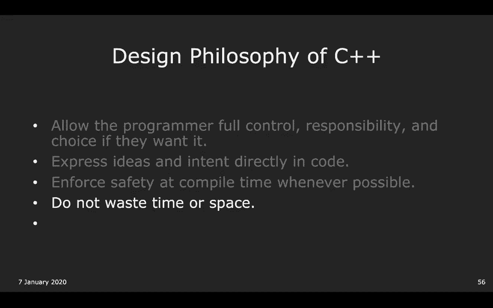

第四个，这非常重要，不要浪费时间或空间。有一个我喜欢的非常酷的东西，C++ 现代设计。如果你在 Google 上搜索设计原则，如果你去这里，你将能，够看到，在哪里？这里，核心指南。

这里是使用 C++ 的指导原则的主文档。这里面有太多东西了。我最喜欢的一些是，哲学方面的，让我找一下。这里，这里。P9，不要浪费时间或空间。为什么？这是C++。

对C++的基本理解是我们想做一切可能的事情，即使它看起，来有点疯狂，以便使一切尽可能快速和高效。这可能意味着做更复杂的事情，自行管理，但是一切都是为。

了不浪费时间或空间的目的。这个主题会一再出现。C++11中的很多东西是为了节省时间和空间。这就是我们所说的高性能的含义。C++在节省时间和空间方面非常出色。最后一部分是将混乱的构造进行模块化。

正如Anna所说，C语言的主要缺点是没有类。在C++中，你的目标是将所有混乱的特性进行模块化，以便，使用你编写的内容的用户不必自己处理这些问题。例如，斯坦福的库，它们将混乱的构造进行模块化，以便你。

不必担心它们。你要能够编写像斯坦福库一样的库。明白了吗？太棒了。是的。我们还有11分钟。

很好。另一种方式。另一种方式。好的。我们只是想给你们一个简要的预览，展示一下标准C++代码，是什么样的。你可能会从我们刚刚讲解的幻灯片中认出这三个主题。再一次。

这只是为了强调C++确实支持这三种不同的编码方，式。这与Avery提到的设计原则有关，即允许C++尽可能灵活，以，满足程序员的需求。C++不想成为你无法做某事的原因。从某些方面来说，这是个祝福。

从某些方面来说，这是个诅咒。所以，为了证明你们确实可以在C++中完成上述所有事情。

我们现在使用的是C++ 17版本，我相信。所以，也请原谅我，因为我通常不使用Mac，所以可能会。

哦，天哪。好的。让我们看看。

哦，是的。其实，我可以把这些注释掉。是的。好的，完美。所以，再次说明，这里发生了什么，你可能对主函数比较熟，悉。如果不熟悉，它是程序开始的地方。现在，我们将执行这个顶层函数，正如我们所说，这是C++中。

打印内容的标准方式。所以我们可以用Ctrl-R运行它。

看看会发生什么。

完美。它打印出hello world。好的。所以，再次证明其他两种方法确实有效，我们将这些注释掉，尝试再次运行。

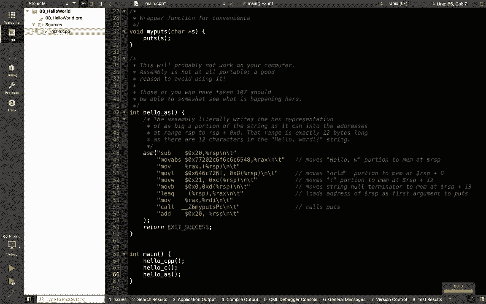

完美。我们看到它三次都打印出hello world。

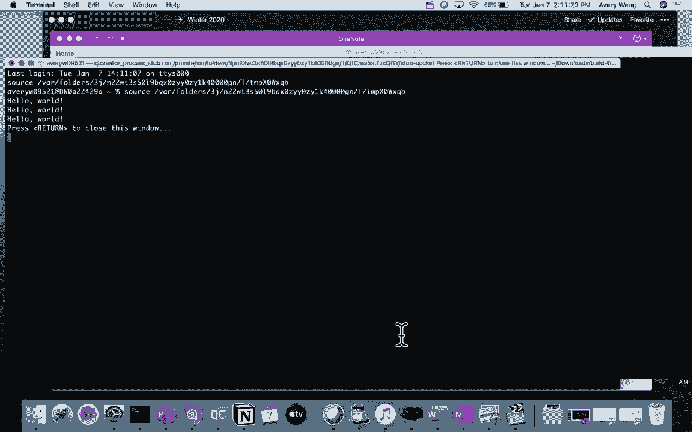

这实际上有点棘手，因为这个汇编代码只有在Avery的电脑，上才能运行。所以如果我们试图在我的电脑上运行，可能不会成功。这也是使用汇编语言的一个缺点，它是所有现代编程语言，的源头。太棒了。

所以今天我们想要讲的最后一件事。我们实际上提前完成了，这很好，因为这意味着我们可以回，答一些问题，其中一个问题已经发生了。是的，请说吧。是的，很好的问题。是什么使得这个是 C++ 的。

而其他的不是那么 C++ 呢？这实际上是一个很好的问题，因为这是我们想要教授的关，键内容之一，即使用我们所谓的 C++ 语法特性。是的，正如你提到的，这个非常 C++ 的特点是它使用了特。

定的 C++ 构造。这儿有几个例子。实际上，我们现在可以深入探讨一下。如何增加缩放？Windows 和 Mac 用户。是的，你们能告诉我这个顶级 C++ 方法中哪些看起来不熟，悉吗？

你们注意到了什么现在还不太理解？随时举手告诉我。什么看起来奇怪？还是你们都能认出所有东西？在这种情况下，我们可以实际。我们可能就取消这节课。似乎是。是的，太棒了。是的，那正是一个点。一个是插入符号。

你们还注意到什么？哦，就在这儿。哦，是的。好的，这点很重要。这点很好。是的，好点子。是的，继续，Mark。返回零？好的，这点很重要。是的，还有什么是你们没有注意到的？是的。冒号，冒号。

这是一个非常棘手的点。这是一个值得指出的好点子。你们还注意到什么？是的，继续说。STD？是的，这看起来有点奇怪。还有其他的吗？实际上就是这些了。干得好。是的，不错。是的，所以实际上。

所以你们可能会注意到。例如，如果你们来自 106a 课程学习 Python，尝试打印 ，hello world 的时候，只需要写一个类似 print 的语句，可能带上括号。

然后是 hello world。而在 C++ 中打印 hello world 似乎需要所有这些额外的，设置。这实际上是一个你们会发现的主题，因为 C++ 提供了很多，灵活性。

这也意味着有时你需要写更多的语法。但现代 C++ 的一个目标是随着时间的推移使一些语法变，得更容易。所以你会发现 C 中的语法甚至看起来更丑。当然，在汇编语言中，它看起来最丑。

这就是 C++ 试图维持的平衡。是的，既然我们有时间，我们甚至可以简要介绍一下你们刚，刚提到的所有部分。第一个是你们提到的。你叫什么名字来着？Julie。第一个 Julie 提到的是插入符号。

你们见过 pound include 吗？谁没见过？好的，是的，pound include 可以被认为是 Python 中的 ，import。它是你可以引入你已经定义的另一个库的方式。在这种情况下。

C++ 的语法是 pound include。然后有两种不同的方法来包含一个库。一个你可能以前见过的东西看起来像是 include ，iostream。h，类似这样的。谁见过 。h 这个？好的，是的。

完美。所以是的，这实际上是一个很好的问题，我也曾经有过，就，是这两个选项之间有什么区别？事实证明，主要的区别是尖括号用于任何已标准定义的库，在这种情况下。

iostream 是一个已经在 C++ 语言中定义，的库。作为我们将要介绍的标准模板库的一部分。所以这就是为什么我们在这里使用尖括号。你使用引号的地方是当我们在学期晚些时候定义我们自己，的类和头文件时。

h 文件，那么我们可以使用 #include，引号引用我们的头文件名来包含我们写的文件。是的，所以这是一个很好的点。实际上，这是一件常常被忽略的事情。是的，好的。那么你们指出的其他部分。

一个是 return zero。实际上，指出这一点是好的。事实上，我们不一定需要在这里有它。这有点像是模拟 main 函数通常返回零的概念。这实际上只是一个遗留的东西。你不必担心它。所以，是的。

我们实际上完全可以删除这个 return zero ，并将这个函数改为返回 void。好的，然后还有其他你们指出的几个问题。第一个是 std。有人提出了标准库的想法，这也是为什么这段代码是 C++ 。

的原因，而第二种方式不是。这确实是原因之一。所以 cout 和 nl 是我们将会非常熟悉的东西。事实上，Avery 在我们的下一节课中，将会讲解流。所以你将会学习到很多关于 cout，两个尖括号符号。

通常，称为流操作符，以及 nl 的内容。所以，是的，我们下次会讲这些。std：这可能是正在学习 106B 的人们认为最困难的部分，就是记得使用 std：原因是，在 106B 中，你可能见过类似的东西。

使用 ，namespace std。这也是一个预告。我们将在学期后期讲解为什么我们实际上不一定要使用它，具体来说，这个 std 是用来做什么的？作为一个简要预览，std 是所谓的作用域命名空间解析器。

所以它有点像是在 Python 中，当你说类似 import numpy， as np，然后在程序的其他地方，你必须写 np。 来使用 ，numpy 中的函数，在 C++ 中也是一样。

如果你想使用来自这个库 IO stream 的函数，实际上，因，为它在标准库中，所以你可以说，啊，是的，我想使用标准，然后两个冒号的等效符号，然后是来自那个库的函数 cl。是的。

所以这就是基本的 Hello World。所以你们有什么问题吗？或者关于你们在这里看到的功能有什么问题？是的，Julie，来吧。这是一个很好的问题。所有标准库头文件都是 std 命名空间的一部分吗？

是的。是的，是的，绝对是，从 std 调用。是的，好的问题。是的，还有其他问题吗？是的，实际上，我们在教授 1。6。0 时最喜欢的部分之一就，是我们总是能收到学生们非常棘手的问题。是的。

所以如果我们不知道答案，我们会告诉你我们不知道，然后去查找答案，之后会把答案发布到 Piazza 或其他地，方。但我们确实喜欢尝试被挑战或难住。是的，问吧。好问题。是的。

iostream 基本上是标准库吗，还是只是它的一个小，部分？是的，它实际上只是标准库的一个小部分。我们稍后会展示给你如何查看。实际上，我们有。好的，我们只有一分钟的时间，所以我就不做了。

我们会在稍后的演示中告诉你如何查看标准库中的所有库，这样你就会知道标准库中有什么，不包含什么。

是的，这是一个很好的问题。我直接结束吗？好的，所以在最后的部分，请确保填写调查问卷。可能会有点麻烦抄写整个内容。我有点想去。因为通常你做这个时，你需要检查哪些是大写，哪些不是大，写？

但这也在 Piazza 上。如果你注册了 Piazza，链接就在那儿。是的。所以在下周二之前填写，您将获得额外的一天延迟。所以快速概述一下我们接下来的内容。我们将从流开始。好的。

这是对未来发生的事情的快速总结。下一次讲座，我们将讲解前四个部分。可能只有三个，但我们会尝试讲解前四个部分。在 CS106B 中，我认为是在周五。周五，Keith 会讲解文件流和标准库。

这将把我们从 iOS ，流过渡到文件流。下周二，我们将讲解类型和更深入的流，包括如何实现 ，Stanford 库中的 getInteger。好的？是的，还有最后一点。

你会注意到我们一直在与 CS106B 并行进行，所以如果你，现在在上 CS106B，你绝对可以参加这个课程。我们会非常紧密地跟随它，这样你不会学到任何内容。我们不会假设你知道某些内容。

直到它在 CS106B 中讲解，是的，再次重申一下我们为什么希望你填写简介调查问卷，这给了我们一个了解你经验的机会，这样我们就知道是加，快还是放慢速度，或者我们可以基于什么来调整教学。是的。

即使你觉得不需要延迟天数，也请填写简介调查问卷，调查问卷的一部分还询问你想要学习什么，因为我们学期，的后半部分，我们有上一季度的一些幻灯片，但我们也愿意，教授你想学习的内容，好吗？所以如果你有任何想法。

直接写在表单上，我们会查看的。

太棒了，谢谢大家。冬季学期第一周愉快。所以如果你有任何问题，我们会在这里待半小时，可能更少，因为我想吃东西。你好。你是网络安全方面的负责人吗？是的，我是。

是的，当然。实际上，我有几个问题。你的名字是以诺吗？是反向的冒号加一个 K。好的。好的，明白了。是的，不管怎样。第一个问题是，我猜，这不太可能发生，但是如果我们只是，旁听和真正上课之间有什么区别呢？

当然，可以的。所以在课程中的唯一区别是，如果你正式成为课程的一部，分，那么要获得学分，你必须提交三项作业中的两项，包括，最后一项。然后，当你提交作业时，我们将能够评分你的作业。如果你只是旁听课程。

你将无法提交作业。尽管如果你想把作业发给我，我总是喜欢和任何人讨论计，算机科学。所以你可以把作业发给我，然后我可以看看，如果你愿意的，话。是的，特别是如果你觉得，哦，我可能没有时间做额外的两，项作业。

虽然不太可能，但如果是这样，你也可以旁听课程。出勤，我们强烈建议参加，但我们不检查出勤情况。你有你的电子邮件地址吗？有的。

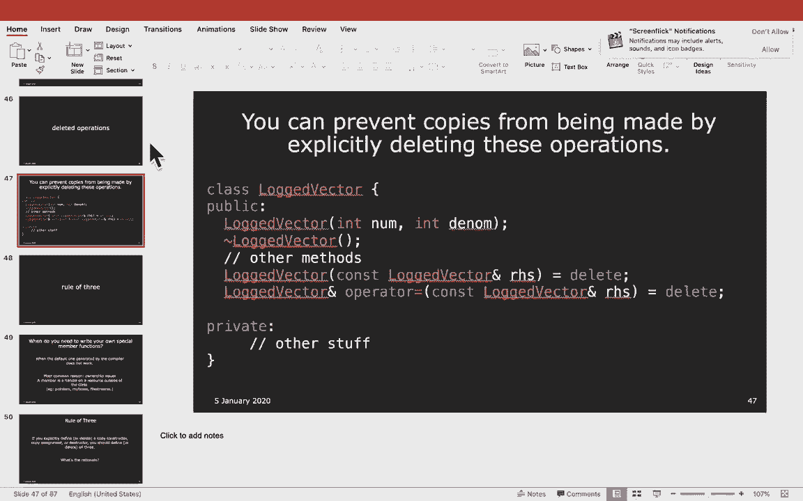

是的，如果你去那个，嗯，它们在幻灯片上。实际上，我不确定它们是否在幻灯片上，但我们会确保添加，它。它也在网站上，所以只需访问CS106L，将CS106B网站上的B，改为L，你就能访问。好的，没问题。

没问题。谢谢，Adam。你好，你能提醒我你的名字吗？Flynn。Flynn，好。那么当编译器编译你的代码时，是逐行编译吗？还是一次性编译？好问题。这绝对不是顺序的，因为有时你会有不同的函数调用在不。

同的方向上。是的。是的，所以这绝对不是顺序的，尽管它比Java复杂一些，因，为在Java中，一切都是直接完成的，但在C++中，我认为在，Keith的课程中会讲到，你必须写出原型。也许。

因为你将在周三讲到它，但在C++中，你必须在顶部声，明一个原型，以便C++知道这个函数存在。是的，所以，嗯，由于这个原因，它不一定是逐行完成的，但，C++有很多奇怪的要求。

Qt中的调试检查器是如何工作的？当你可以逐行运行它时？哦，针对Qt的？调试器是如何工作的？在Qt中？只是一般的使用方法？嗯，不是，比如说如果你编译了你的程序，它是否不是逐行，的？就像是任何。

像汇编语言一样。哦，等等。刚才的问题是什么？对不起，我直接跳入了。Qt的编译是如何工作的？哦，是不是逐行执行？是的，所以实际上，当你逐行执行时，那是在你的代码运行，时发生的。

所以编译时和运行时是两个不同的阶段。所以在编译时，你实际上已经生成了所有的代码，然后在运，行时，有一套不同的事情发生。所以像变量写入内存中的栈或堆等事情。而这就是你在调试器中访问的内容。但是编译时。

它会记住每一行的内容吗？是的，所以我认为Qt Creator，它会将你的代码插入不同的，东西，以便在你阅读时暂停。所以这就像一个附加组件。是的，它会添加更多的指令。它基本上将其转换。

使您能够读取内存的不同部分。是的，如果你参加 CS110 课程，你实际上会实现一个叫做 ，ptrace 的东西，它基本上做相同的事情，这很酷。也许明年吧。顺便问一下，你叫什么名字？Flynn。

Flynn，好的。很高兴认识你。嗨。Sebastian。是的，我对你提到的系统和网络安全感兴趣，所以想聊聊。我最近对网络安全产生了兴趣。哦，真的吗？是的，我上个学期注册了黑客实验室。

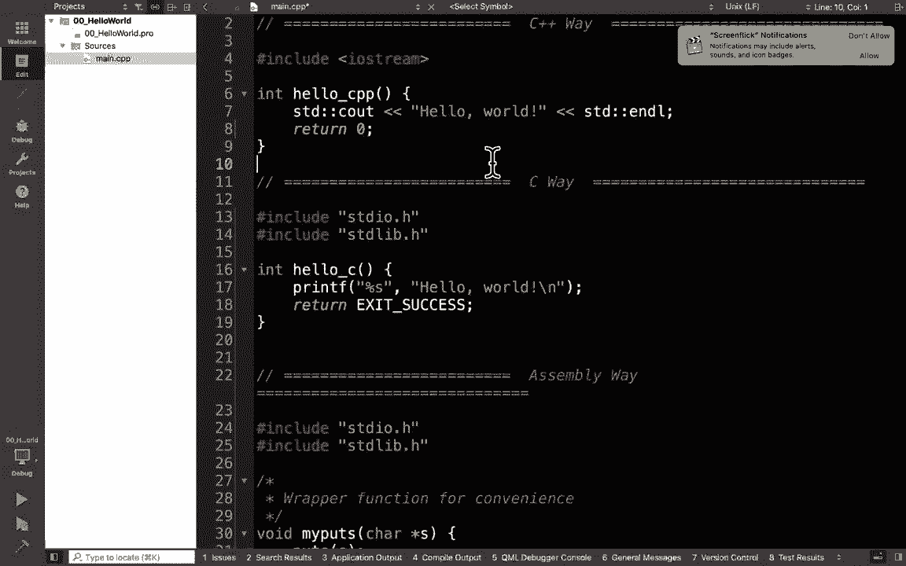