# 课程1：C++编程入门与课程概述 🚀


在本节课中，我们将学习C++编程语言的重要性、CS106L课程的目标与结构，并初步了解C++的历史、设计哲学以及一个简单的“Hello World”程序。

---

## 为什么选择C++？🤔

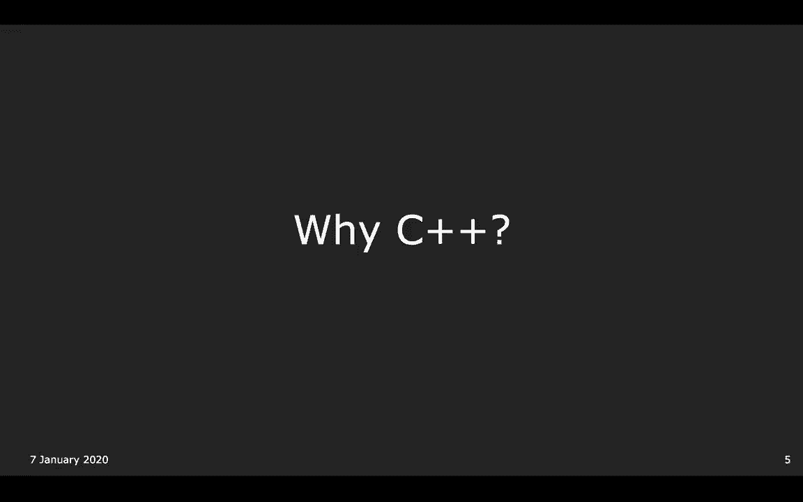

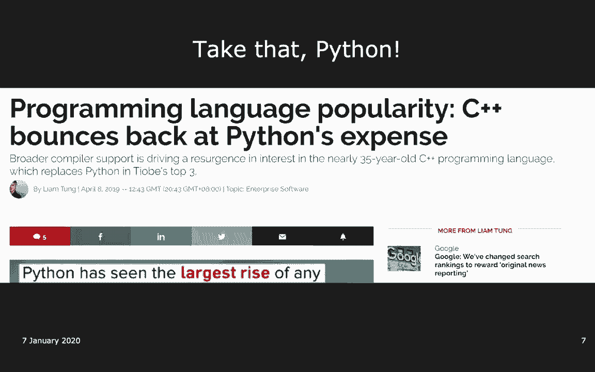

C++是一种非常重要且流行的编程语言。尽管有人认为它已经过时，但事实并非如此。近年来，C++经历了重大改进，使其更易于使用，其受欢迎程度仍在增长。

C++的应用非常广泛，尤其是在对性能要求高的领域。以下是使用C++的一些场景：

*   **大学课程**：许多涉及并行计算、计算机网络等高性能计算的课程都使用C++。
*   **行业公司**：几乎每家公司都在某些地方使用C++，掌握C++对求职有帮助。
*   **关键软件**：许多浏览器（如Chrome）因其对性能的高要求而使用C++编写。
*   **基础工具**：一些编程语言（如Java）的实现本身就用到了C++。
*   **游戏开发**：许多对内存和性能要求密集的游戏使用C++开发。
*   **嵌入式系统**：例如，一些火星探测器的代码就是用C++编写的。

C++的核心优势之一在于其**高性能**，这意味着它能高效地利用计算资源（时间和空间）。

---

## CS106L 与 CS106B 的区别 🎯

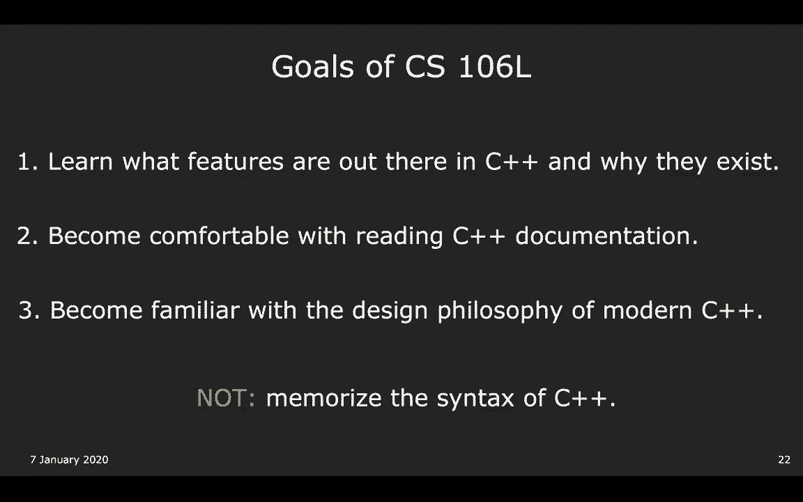

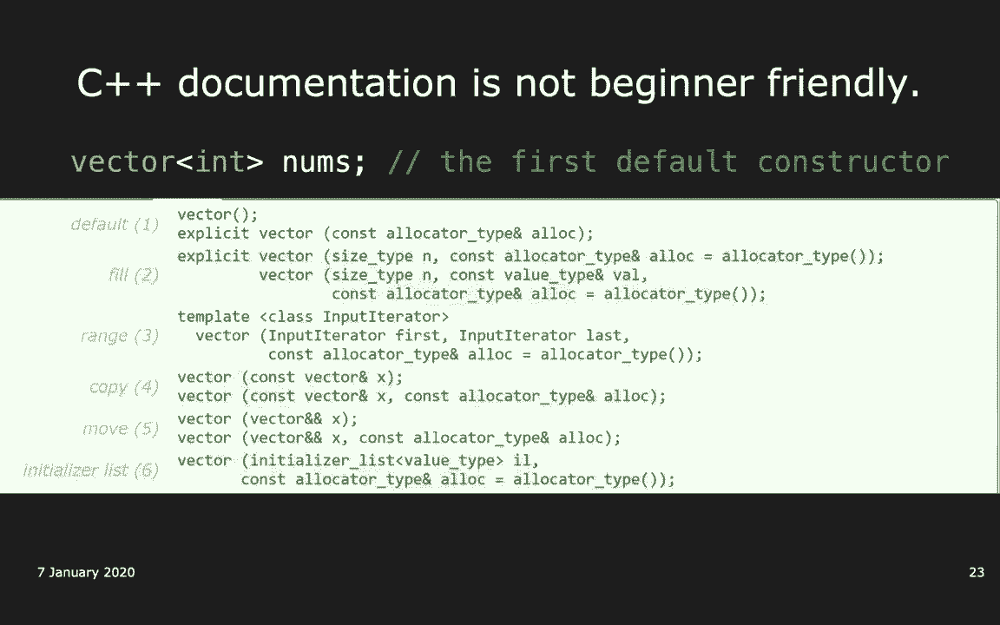

上一节我们介绍了C++的重要性，本节中我们来看看CS106L课程在斯坦福课程体系中的定位，特别是它与CS106B的区别。

CS106B名为“编程抽象”，其核心目标是教授适用于所有编程语言的通用概念（如递归、抽象数据类型）。C++只是实现这一目标的工具，并非课程重点。因此，CS106B使用的是较旧的C++98标准，并提供了“斯坦福库”来简化复杂的C++细节（例如，用 `getInteger` 代替原生的 `cin`）。

相比之下，CS106L的目标是教授**标准C++**。我们将深入探讨C++语言本身，特别是其独特之处（如模板），并专注于现代C++（C++17/20）的特性。课程旨在让你能够：
1.  了解C++的功能及其存在原因。
2.  学会阅读C++官方文档。
3.  熟悉现代C++的设计哲学和惯用法。

重点是理解概念和知道如何查找语法，而非死记硬背。

---

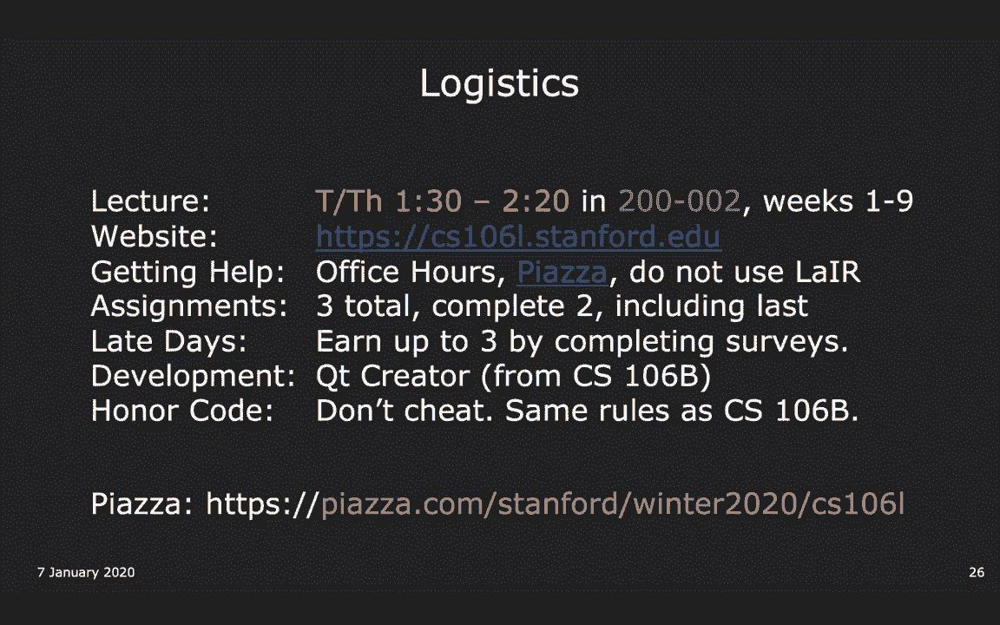

## 课程结构与要求 📋

了解了课程目标后，我们来看看CS106L的具体安排和要求。

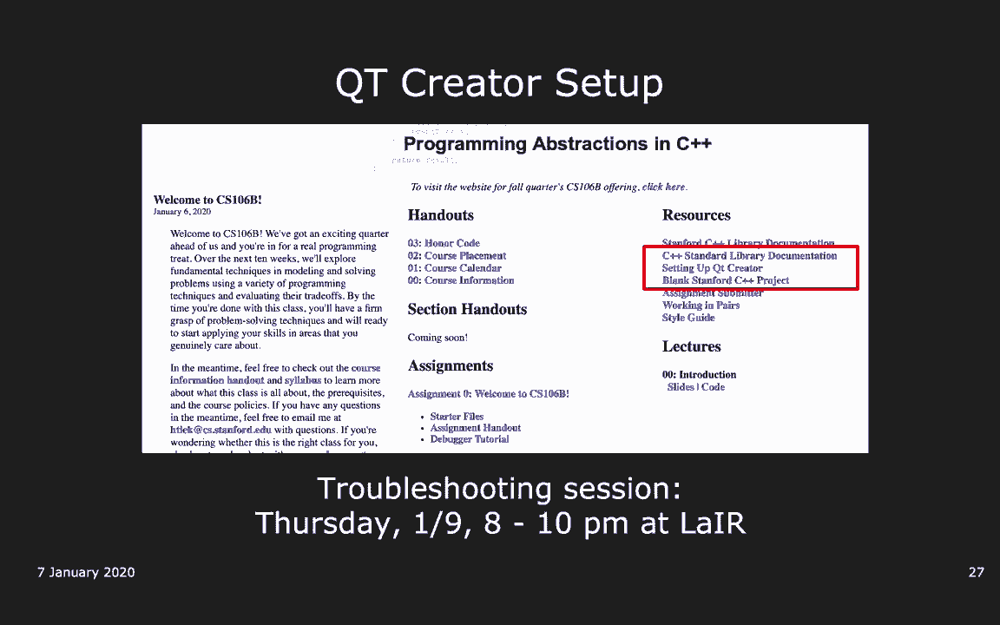

CS106L是一个1学分的课程，评分方式为“通过/不通过”。课程将持续到第9周，第10周留给大家完成其他课程的项目。

以下是课程的核心结构，包含四个主要单元：
1.  **C++基础**：包括流、类型等。
2.  **标准模板库（STL）**：涵盖容器、迭代器和算法，这对技术面试非常有帮助。
3.  **面向对象编程（OOP）**。
4.  **现代C++概念**。

课程要求如下：
*   **作业**：共有3个作业，必须完成其中**2个**，且**必须包含最后一个作业**。作业旨在练习C++语法。
*   **延迟政策**：通过完成课程调查，最多可获得3天的作业延期。
*   **开发环境**：前两个作业需使用 **Qt Creator**（与CS106B相同），第三个作业可能允许使用其他环境。
*   **学术诚信**：必须独立完成作业，禁止抄袭。
*   **沟通平台**：使用 **Piazza** 进行课程问答和通知，请务必加入。
    > 注意：请不要使用CS106B的“Lair”答疑时间解决CS106L的C++问题，因为那里的助教可能不熟悉标准C++。

---

## C++的历史与设计哲学 📜

现在我们对课程有了整体认识，接下来让我们深入了解C++背后的历史与设计哲学，这有助于理解其特性。

编程语言的发展是一个追求效率与表达力平衡的过程：
1.  **汇编语言**：计算机能直接理解，速度快，控制力强，但难以编写和维护，且不可移植。
    ```assembly
    ; 一个简单的汇编代码示例
    section .text
        global _start
    _start:
        mov edx, len
        mov ecx, msg
        mov ebx, 1
        mov eax, 4
        int 0x80
    ```
2.  **C语言**：由肯·汤普森和丹尼斯·里奇发明。它通过编译器将人类可读的代码转换为机器码，在效率、可读性和可移植性之间取得了平衡。但C语言缺乏对“类”和“对象”的直接支持，构建大型复杂程序比较繁琐。
3.  **C++**：由比雅尼·斯特劳斯特鲁普于1983年创建。它在C语言的基础上增加了对类等高级特性的支持，并逐渐发展成一个功能丰富且灵活的语言。现代C++（如C++11/14/17/20）引入了许多重要更新。

C++的设计哲学主要包括：
*   **赋予程序员控制权**：程序员可以管理内存等底层资源（与Java/Python的自动管理不同）。
*   **直接表达意图**：代码应清晰表达编程意图。例如，求向量和的三种方法中，使用STL的 `accumulate` 算法意图最明确。
    ```cpp
    // 方法1：基础循环
    int sum = 0;
    for (int i = 0; i < vec.size(); ++i) {
        sum += vec[i];
    }
    // 方法2：使用const和引用，表达不修改元素的意图
    int sum = 0;
    for (const int& num : vec) {
        sum += num;
    }
    // 方法3：使用STL算法，最佳地表达“累加”意图
    #include <numeric>
    int sum = std::accumulate(vec.begin(), vec.end(), 0);
    ```
*   **编译时安全**：编译器应尽可能在编译阶段发现错误。
*   **零开销抽象**：核心原则是“不浪费任何时间或空间”，高级特性不应带来额外的运行时开销。
*   **封装复杂性**：通过类、模板等机制将复杂实现细节封装起来，提供简洁的接口。


---

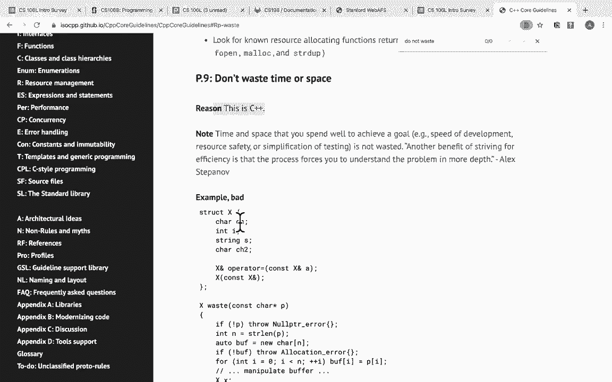

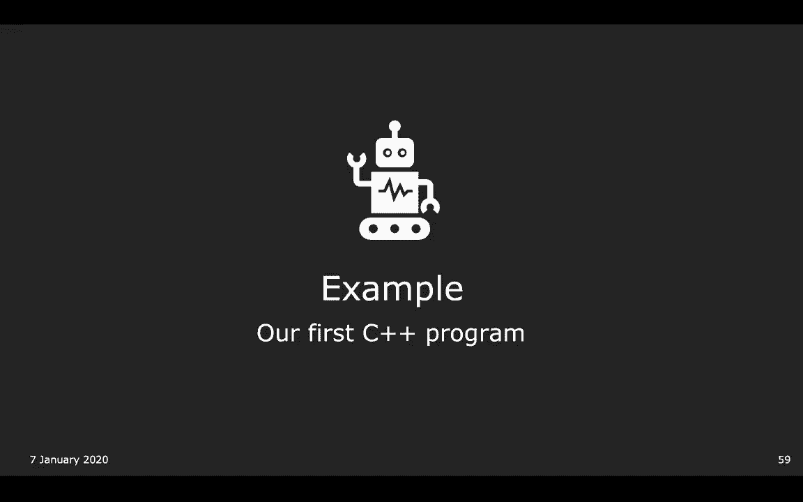

## 第一个C++程序：Hello World 👋

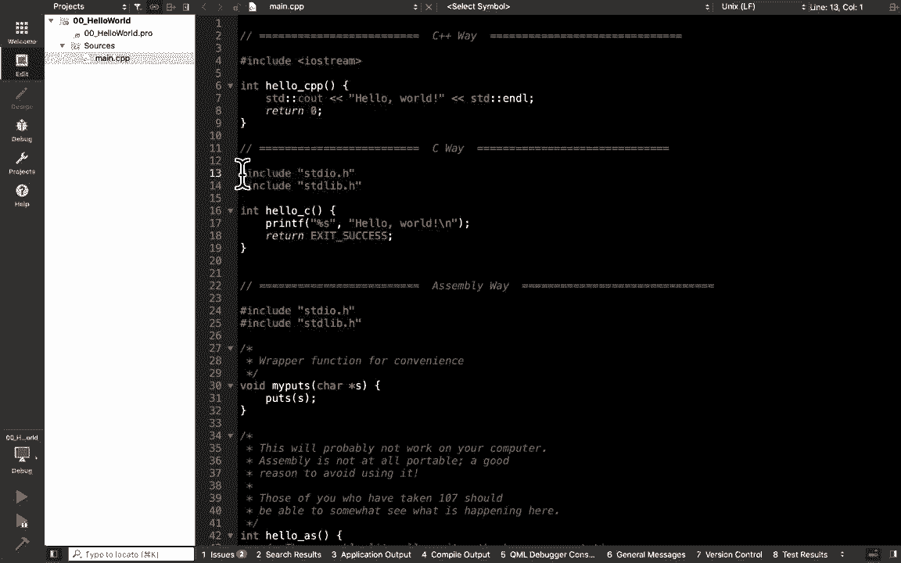

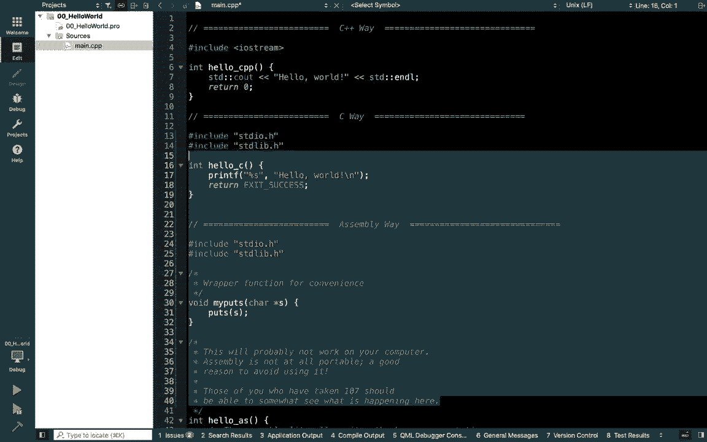

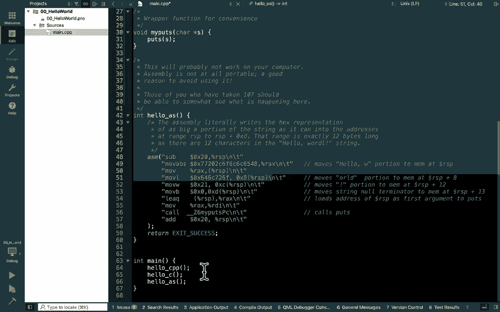

最后，让我们通过一个简单的“Hello World”程序来直观感受C++。C++具有高度的灵活性和向后兼容性，甚至可以用C风格或内联汇编来写“Hello World”，但我们将专注于标准的现代C++写法。

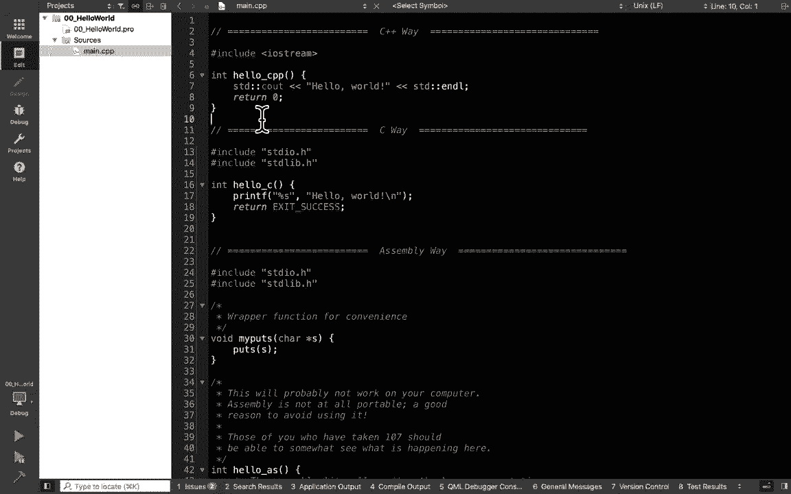

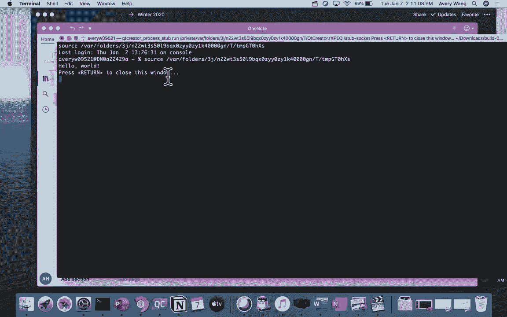


以下是标准C++的“Hello World”程序：

```cpp
#include <iostream>

int main() {
    std::cout << "Hello World!" << std::endl;
    return 0;
}
```

对代码中可能陌生的部分解释如下：
*   `#include <iostream>`：引入输入输出流标准库。尖括号`<>`用于包含标准库头文件。
*   `int main()`：程序的主入口函数。
*   `std::cout`：标准输出流对象，用于向控制台打印信息。`std::` 是**命名空间作用域解析符**，表明 `cout` 和 `endl` 定义在标准（std）命名空间中。
*   `<<`：流插入运算符，用于将数据发送到 `cout`。
*   `std::endl`：输出换行符并刷新输出缓冲区。
*   `return 0;`：主函数返回值，0通常表示程序正常退出。在现代C++中，`main` 函数可以省略 `return 0;`。

这个程序展示了C++标准库的用法。作为对比，C语言风格的写法是 `printf(“Hello World!\n”);`，而汇编语言则复杂得多且不可移植。C++的语法虽然有时看起来更繁琐，但这是为了提供强大的表达能力和控制力。

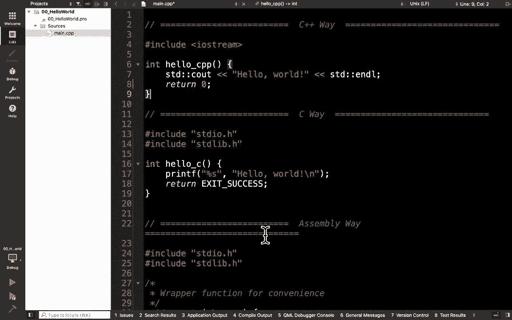

---

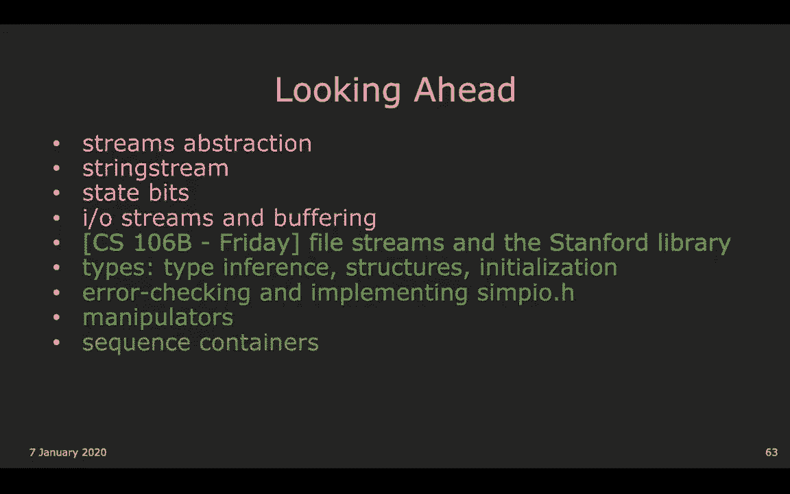

## 总结与预告 📚


本节课中我们一起学习了：
1.  C++在现代计算中的重要性和应用领域。
2.  CS106L课程的目标是深入教授标准现代C++，与CS106B的侧重点不同。
3.  课程的结构、要求以及使用的工具（Qt Creator, Piazza）。
4.  C++从汇编语言、C语言演变而来的历史及其核心设计哲学（控制力、表达意图、零开销抽象等）。
5.  编写并分析了一个标准的C++ “Hello World” 程序。


下节课，我们将开始深入**C++基础**部分，首先学习**流（Streams）** 的概念，包括 `std::cin` 和 `std::cout` 的详细用法。我们也会了解如何实现类似斯坦福库中 `getInteger` 的函数。


请记得填写课程简介调查问卷，以帮助我们更好地调整教学，并为你赢得作业延期机会。