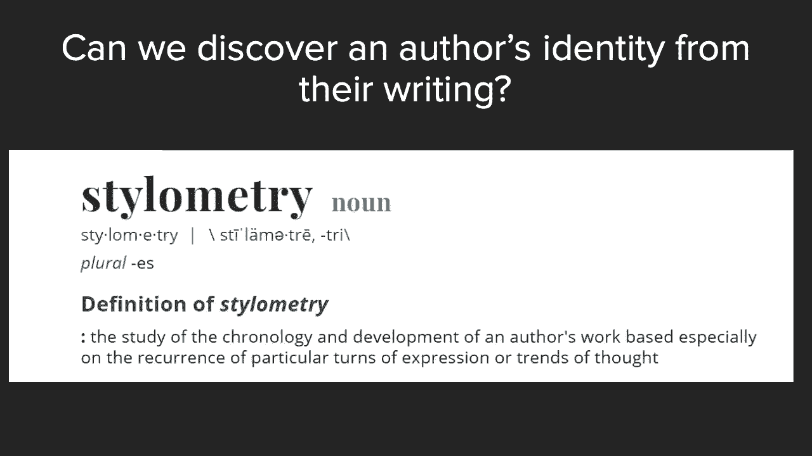
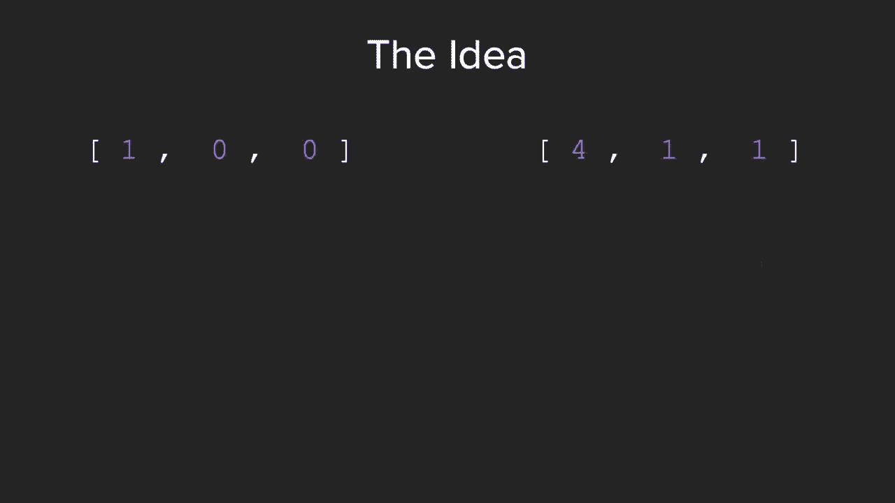
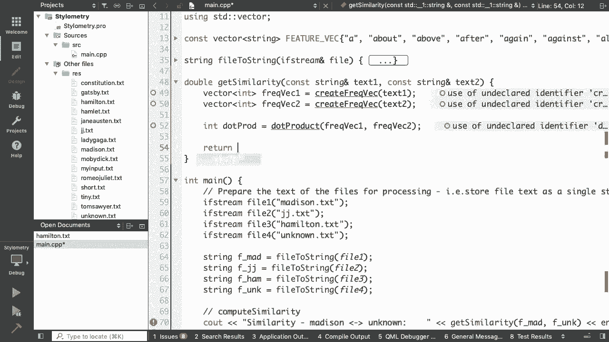
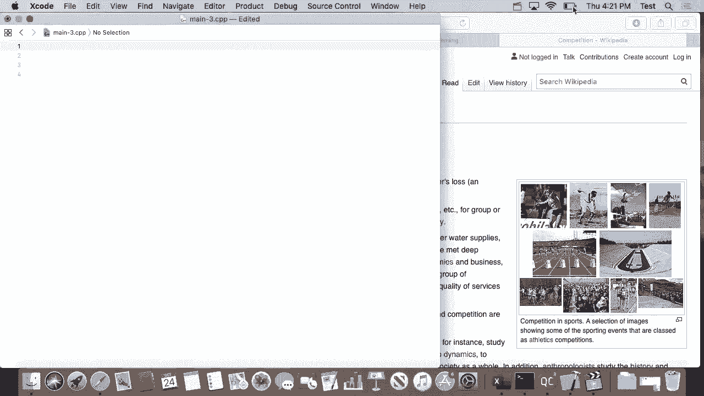

# 斯坦福大学《CS106L： C++编程｜ Stanford  CS106L C++ Programming 2019+2020》中英字幕（豆包翻译 - P10：[16]CS 106L Fall 2019 - Lecture 9_ STL Summary (Screencast) - GPT中英字幕课程资源 - BV1Fz421q7oh

我意思是我勉强能做一个。我做过两个，有点艰难。我认识的人做过两个以上，他们都没问题。所以我做不了这个。所以我差不多达到64。而其他人，他们可以轻松达到80、90。先生？我的一个朋友说。

我一年内完成了这个专业两次。等一下，这可能吗？我想，我想，不是整个专业，而是核心要求。等一下，除了这个专业，因为他是一个非常难的数学专业。所以他有60个学分？我认为他可能是从他的本地社区学院获得了学分。

他修了15个学分？15个学分的数学？我想他上了四五门这样的课。哇。那之前的106L讲师，他也是数学专业吗？他创造了六个数学专业的记录。他告诉我他最后得到了两个不及格，但你知道，他上了六门，数学课。

他说这是最糟糕的之一。我很高兴这是永久性的。像每周六次PSAT。你可以每周做六次PSAT。我勉强能做一次。是的。所以，是的。所以你不必，我学到的是你不必做到最好。你不可能在所有事情上都做到最好。

这没关系。我显然是一个高年级学生。好了。欢迎大家。感谢你们在期中考试周来这里。所以你们，我想，获得了特殊的体验，因为你们可以在这里，参与，因为我们今天基本上要做一个大示例，使用我们学到。

的关于STL的所有内容，这对第二个作业也会有帮助。好了。好吧。在我们做之前，先简单总结一下STL。为了让你们了解你们已经学到了多远，如果你们还记得，这，就是我们在五节课前第一次看到的东西。

现在你们知道了，这每一部分的意义。例如，容器，我们看过向量、双端队列、列表、集合、映射，我们还看过容器适配器。谁能说出容器适配器的例子？容器适配器的例子是什么？是的。大声点说。栈。栈和队列。容器适配器。

结果是它们实际上不是容器本身。我们看过迭代器和迭代器的四个函数，比如 dot begin、，dot end、解引用和递增迭代器，还有五种类型，输入、输，出、前向、双向、随机访问。说实话。

当谈到迭代器类型时，我们很快就讲完了。所以如果你对它们的区别仍然感到困惑，我建议你回去看，看幻灯片。但真正要记住的是，每种迭代器承诺具有不同级别的能力。

所以如果你在查看一个数据结构时看到它说类似前向迭代，器的东西，现在你知道，啊，好吧，我需要回去看看前向迭代，器承诺什么，以便我知道如何使用这个数据结构。你们看过Avery介绍的迭代器适配器。

谁记得一个迭代器适配器的例子？举手。是的，这个有点棘手。是的，绝对是的。是的，Avery 涉及了一个概念，你可以使用类似于后插入器，的东西。所以说你想要复制元素。

你不能保证你尝试复制的目标中已经有足够的空间。所以你使用一个后插入器，它是 STL 为你已经知道的迭代，器包装的一个层，以便在你做事情时可以增加内存。所以，正是这样。比如后插入器。如果你记得。

我们能够通过使用 copy 直接写入 C out，而，不实际使用 C out，alligator，alligator，然后是值。所以直接复制到输出流迭代器。这又是一个迭代器适配器的例子。所以，再次。

将所有这些概念结合起来。你们现在已经见过仿函数和 Lambda 表达式。实际上，还有一些像仿函数或函数适配器这样的东西，我们，没有实际讨论过。部分原因是它们实际上在 C++20 中已不再使用。

所以函数适配器现在已被 Lambda 表达式取代了。所以你们知道 Lambda 表达式。这就是你们需要知道的全部。最后，当然，还有我们最喜欢的算法。我们已经查看了算法可以做的各种不同事情，包括排序、。

累积、搜索、打印等等。你会注意到，算法接受迭代器和仿函数。所以再次重申，你们现在可以解释 STL 中的每一部分。最后一点是 STL 还有更多内容。实际上，并不多。你们已经学到了几乎所有重要的概念。

还有一些库可能对你们有趣。例如，正则表达式库。如果你在研究解析流，并且听说过正则表达式，这是一个有，趣的库。另一个有趣的库是多线程相关的。那么如何让你的代码在同时运行多个处理器时工作呢？

STL 实际上有一整套与此相关的东西。所以有锁、条件变量等。事实上，这是我们从课程中移除的讲座。你们会记得，我们在 STL 中增加了一次额外的讲座。但如果你们想要了解这方面的内容，我们会在最后一讲中。

作为选项提供。如果你感兴趣，可以看看这个。最后，尤其是对于那些因为有特定应用需要使用 C++ 的同，学，有另一个库集合叫做 Boost 库，它不是 C++ 标准库的，一部分。

但它提供了很多非常有用的、不是那么常见到需，要成为 STL 一部分的东西，但足够有用，以至于人们到处，使用它。这包括机器学习的线性代数库等等。所以如果你想要了解 STL 之上的下一个层次，可以看看 。

Boost。它是由与 STL 不同的组织编写的，但它们也被广泛使用。所以 Boost，就是它们的名字。很好。好的。最后一个概念来总结 STL。所以你们已经学习了算法、函数对象、容器、迭代器。

从 STL 中要带走的一个普遍概念就是这种抽象的思想。在 STL 中，我们真正试图做的是表达一般性问题，而不是，特定问题。为了给大家一些感受，我们在计算机科学中首先接触的是，基本类型。你们知道字符。

有整数、双精度数、字符串等等。因此，在最底层，我们有基本类型。但在设计 STL 时，我们问自己的是，我们能否跟踪一个基，本类型的集合，无论这个类型是什么？所以从类型中抽象出来？绝对可以。

你们已经看到了这一点。这就是 STL 中的容器。所以我们可以表示一个整数向量或字符串向量，实际上是，任何类型的向量，无论那种类型是什么。因此，我们构建了一个叫做容器的类型抽象。下一个问题是。

我们可以对容器执行操作，而不管容器是什，么吗？有人知道我在引导什么吗？是什么让我们能够对容器执行操作？算法。对。算法是一个好的答案。算法是与什么一起工作的？迭代器。迭代器。没错。所以迭代器确实是，就像。

嗯，这是一个不完美的类比，但就，像线粒体是细胞的动力源，迭代器是 STL 的动力源。所以对，它们允许我们从容器中抽象出来。最后，我们能否对迭代器进行操作，无论它是什么类型的迭，代器？

这正如我们已经说的那样。我们有算法允许我们对任何类型的容器使用任何类型的函，数进行操作。这让我们不仅可以计算，比如说，所有小于5的元素是什么，还可以基于我们传递的任何谓词，找到所有元素，眨眼眨眼，眨眼。

所以，对，这只是为了强调在 STL 中，作为程序员，我们真，正带走的两个组件是首先它提供的抽象量。我甚至没有提到模板，但模板当然是这里最著名的抽象之，一。其次是速度。

我们强调 STL 已经针对速度进行了优化。所以，对，抽象和速度。恭喜你们。这基本上结束了我们的 STL 单元。再回顾一下，这是我们开始时引用的那句话。我们将这些抽象概念，如数据结构和算法。

提升到它们最一，般的形式。所以恭喜你们。很酷。所以在我们跳入综合示例之前，我想做几个公告。第一个是办公室时间。所以再次祝贺大家提交了第一份作业。我们更新了办公室时间。由于我不能再在星期二的课后待着了。

我在星期三增加了，额外的办公室时间。你可以在 Piazza 上找到所有这些信息。所以，即使你现在没有照片，你也可以在 Piazza 上找到它，Piazza 也是我们更新地点的地方。所以。

继续关注 Piazza。我还想简要提一下，这些可能在一周内发生变化。因此，确保在前往办公时间之前检查Piazza。是的。因为，尤其是当不同的作业截止日期临近时，我们可能会做，一些调整。

以更好地适应作业截止日期。所以，确保在计划去办公时间之前检查Piazza。是的。这是一个很好的点。是的。当然，这门课几乎足够个人化，如果你们不能参加这些时间，请联系我。感谢所有之前已经联系过我的人。

是的。我们很高兴能提供帮助。酷。在我继续之前，有没有问题？你们觉得。好的。实际上，我有点好奇。现在你们完成了STL单元，你们对STL的感觉怎么样？比如说，你们喜欢它吗？你们是否觉得，哎。

我怎么花了六节课在STL上？是的。比如说。好吧。好吧。是的。好的。酷。太棒了。如果没有其他问题。是的。布莱恩。好的。我想我有些问题应该在开始时问的。STL通常是以STD命名的。是的。是的。完全正确。

确切地说。而STD是为了STEM。是的。好的。不是STL。不是STD。不是STL。这是一个有趣的点。为什么不是STD而是STL？是的。但对。这是一个很好的杂项问题。是的。所以。

当你们在使用命名空间STD时，现在你们知道了。是的。好问题。还有其他问题吗。是的。最后一个问题。酷。好的。既然你们在这里，你们还将获得作业2的提前预览。所以不用担心作业2。我们。我们将其结构分为两部分。

第一部分。目的是将一个作业分成两个更容易处理的部分。所以这不是两倍的工作。这是相同的工作量，只是分开了。所以我们要发布的第一部分，我相信，明天就会发布。它将在之后的周五到期。它应该不会太难。

它主要是检查你是否有正常的互联网连接。因为这一次实际上需要你有正常的互联网访问。然后将会有。你们还需要处理一些算法。但为了给你们一个作业2的预览。所以我们这门课的一个目标是。不仅让你们练习标准C++库。

还要让你们即使只有四周的，C++课程，也能构建一些非常酷的应用程序。所以对于这个作业，我们将要做的是。你们中有多少人听说过叫做维基竞赛的东西？是的？好的。是的。你们中的一个人能解释一下它是什么吗？是吗？

所以这是当你尝试从一个网站访问另一个网站时的情况。完全正确。是的。所以……，是的。不。就是这样。所以如果你没听到，就是……，Wikiracing 是你尝试访问……，你会被给定两个网站。

你要尝试从第一个网站到达第二个，网站，仅使用维基百科的链接。所以你从一个维基百科页面开始，必须点击链接直到到达，下一个页面。而赢家是完成点击最少的人。有人知道维基百科上哪个页面被认为是所有其他页面都能。

访问的吗？这可能并不完全正确。没有？哲学？是的。大声说出来。哲学。所以结果是维基百科上的哲学页面几乎可以通过任何其他，页面访问到。但确实如此。可以在自己时间里试试。我认为……。

如果你只点击第一个链接……，所以如果你在任何维基百科页面上点击第一个链接，比如，这里，你点击链接。如果你只继续点击第一个链接，显然，大多数页面最终会到。

达哲学页面。是的。所以可以在自己时间里尝试一下。我们……，这很诱人，但我们不会在整个讲座中进行这个实验。是的。好的。所以这就是你们要做的事情。你们将要建立一种自动化方法来找出，我想，两个链接之间。

的比赛完成情况。这将会非常有趣，你们会发现，使用现在所知的内容，你们，可以用很少的代码行完成这个任务。所以我们明天会发布规格说明，你们可以查看一下。我想快速回顾一下规格说明中提到的一个点，即它会提到。

关于返回无序集合而不是集合的内容。有人记得这是什么吗？我想提到这一点，因为我们基本上在大约30秒内讲过它。是的。是的。完全正确。是的。完全正确。所以如果你们在106B或X课程中了解过哈希映射或哈希集。

合，无序映射和集合是C++ STL中这些的等效物。所以，它不会保证输出所有键的排序顺序，而是保证你可以，非常快速地访问它们。所以，是的，规格说明会提到，你们编写的一个函数需要返，回无序集合。

原因是因为在这个示例中，我们只是访问页面，上的单个链接，所以这些链接是否排序并不重要。是的。所以这是一个有趣的知识点，如果你们感兴趣，但，确实，如，果看到无序集合而不是集合时不要困惑。很酷。

关于这个有问题吗？是的。这是树集合吗？是的，这是一个很好的问题。树集合略有不同。树集合，我相信，它与常规集合的不同实现有关，并且做出，不同的承诺，但，是的，它确实不同。

树集合实际上比无序集合更接近常规集合。是的。是的，好的问题。对于那些没有经常关注 Piazza 的同学来说，我们实际上，在 Piazza 上发布了一个链接，指向斯坦福 C++ 库，因此，如果你想查看。

比如说，树集是如何实现的，你可以查看他，们使用标准 C++ 函数实现树集的方式。是的，还有数据结构。太棒了。是的。还有其他问题吗？酷。好的。所以，接下来我们要做的是看一个有趣的示例问题，然后看。

看我们如何用我们所学到的所有知识来解决它。所以，让我先介绍一下问题，然后这节课将比之前的课更互，动，这也很不错，因为今天我们的人数较少。是的，这会让你感觉更像是你们的 106 BRX 小组课，如果。

你们参加过的话。你们有多少人听说过《联邦党人文集》？是的。好的。好的。太棒了。所以，如果你不熟悉《联邦党人文集》，它是一系列在美国，创立宪法初期由三位不同作者发表的论文。当时，美国试图建立国家。

必须争论宪法是否应该被批准，因此这些论文由三位不同的作者发表。

来吧。汉密尔顿、麦迪逊和约翰·杰伊为宪法辩护。因此，它们被视为一段非常重要的历史，因为从某种意义上，说，它们也概述了美国的许多哲学根基。但关于这些论文有一个有趣的争论，就是哪篇论文是由谁，写的。因此。

《联邦党人文集》共写了 85 篇论文，但作者从未明，确说明哪篇论文是由哪位作者写的，因此这成为了一个有，趣的难题，试图确定究竟哪位作者写了哪篇论文。今天我们要做的就是编写一个程序，让我们知道哪位作者。

最有可能写了哪篇论文。所以，是的，我们要解决的问题是，我们能否从写作中发现。

作者的身份？这其实很有趣。这实际上是一个叫做风格学的领域，就是这个。根据这个描述，有没有人能大致猜测一下，我们如何从一篇，文章中检测出是哪三个人中的哪一个写的呢？有想法吗？是的，是的，是的。

这是一个很好的猜测。这就像是当人们自己坐下来思考，哦，怎样确定哪个人写了，哪篇论文？是的，他们可能想到的一个主意是，哦，好吧，我可以比较我，知道他们写的文章和我不确定的文章之间的词频。实际上。

这正是我们今天要做的事情。所以这很完美。是的，布莱恩，有什么问题？机器学习。那是新的电力。课程结束了。谢谢大家。不，我只是开玩笑的。是的，那将是一个有趣的扩展。

但是的，机器学习，人们当然用它来做这个。太棒了。是的，回到正题。所以这个想法是作者有自己的写作风格，并且倾向于保持，一致。所以我们今天的目标是首先能够找到一种方法来指纹识别，他们。

然后把它们全部编码出来。所以我们要使用的不可变项是。所以我想问题是，我们要计算哪些词的频率？因为例如，有些词可能与哪个作者写了哪篇论文实际上并，无关。所以像这些常见的词会给出一种作者写作风格的无意识指。

纹。所以作为我们正在做的工作的一般概念，假设我们正在处，理三个功能词。I， the， 和 their。所以我们的代码识别作者的方式是这样的。有点直观地查看每个词的数量。在这种情况下。

文本中没有“there's”。其他的也是如此。“There is” 是这样。谢谢。哇。好的。好的。这会搞乱我们的。不。好眼力。好眼力。我们会回去修复它。完美。好。所以现在我们已经建立了词频统计。

那么接下来我们的问，题是，如何使用这些统计来判断作者之间是否相似？这里的想法是我们实际上将从数学中借用。

你们有多少人听说过点积？很好。完美。所以我们正在进行跨领域学习，我们将计算两个词频向量，的点积，以了解这两个词频之间的相似程度。

我们最喜欢的，我们最喜欢的，我们最喜欢的方程式。如果你不理解这个，不要担心。代码。是的。如果你感兴趣，可以之后来找我们谈谈。但代码将仅仅依赖于我们知道方程式。我的意思是，不一定要理解为什么。太棒了。

所以在我们开始编码之前，你们对问题的设置或任何历史，问题有疑问吗？我可能能回答，也可能不能回答。酷。好。所以开始比赛吧。

好的。所以我们经常听到的另一个目标是如何从头开始编写程序，所以我们将从“你好，世界”开始编写。今天的部分不仅是如何使用 SDL，还包括你如何拆解一个，程序？你如何编写一个程序？是的。

我们会一起完成这些工作。所以再次强调，从“你好，世界”开始。我想提到的第一件事是，你会注意到在 BRX 中基本上所有，的程序中，你都只需要写“using namespace STD；”。

然后你就不必担心像“STD C out：C out”这样的东西。我们实际上希望弱化这种用法，部分原因是你可以把它想，象成将整个消防水管都扔到你的程序中。所以我们刚刚看到 STL 的规模。这就是说。

把它的所有内容都引入进来。所以我们想要使用的其实是非常细化的，比如说，好的，我，知道我想要使用。抱歉，我知道我想要使用的是 C out。但是每次都要写 STD：C out 真的很烦人。

所以我们可以做的是我相信 Avery 在之前的一节课中简，要提到过的一个别名。在这种情况下，它是一个使用声明，我们说，啊，每当我说 C， out 时，我实际上是指 STD C out，end 也是如此。

所以这是常见的风格。而且。所以在像这样的单文件程序中，使用命名空间 STD 并不重，要。但是，当你开始编写大型类和在单个程序中协作的不同类，时，这可能会给你带来一些麻烦，这实际上是我们在面向对。

象编程中要涵盖的内容。在这种情况下，使用这可能会让你陷入困境，因为假设你在，这里有一些函数在其他命名空间中重新定义，这开始变得，令人困惑。所以这是一个很好的练习，以便习惯在这里使用非常特定，的声明。

是的。问题。你能再说一遍吗？是的，这是一个很好的问题。那么这两行 include 和 using 的区别是什么？include 的作用是引入一个函数库。它引入的是其他人编写的代码。

或者我可以说它引入了类，本身。而 using 的作用是告诉程序你想使用这些类中的哪个函，数？所以在这种情况下，它可能看起来有点困惑，因为我们实际，上只使用一个 C out。

但是假设还有一个叫做 my bad library 的库，也定义了，一个 C out 函数。那么这个程序将不知道你指的是哪个 C out。所以你需要指定。是的。所以在语法上，这表示，即使没有重复。

我仍然需要指定我，使用的是哪个 C out。是的。很好的问题。很好的问题。太棒了。好的。所以我有点撒谎了，我们将从头开始。这是主函数，我们可以通过尝试运行来确认它是否正常运，行。Hello。

 world。完美。但为了节省时间，我实际上给我们提前准备了一些东西。哦，不是那个。所以我实际上已经为我们编写了主函数，所有这些只是给，我们提供了我们想要做的蓝图。所以让我逐步解释一下。

那么就我们需要做什么来解决这个问题而言，我们首先需，要做的是读取我们正在处理的文件。所以我们的做法是：先取一个 Madison 的文件，一个 John， Jay 的文件和一个 Hamilton 的文件。

然后我们的目标是找出哪个人写了这个我们不确定是谁写，的未知文本。所以我们需要做的第一件事是处理文件，以便我们可以实，际读取它并计算单词数。最后，我们要做的是输出每个作者与未知作者之间的相似，度。

以便我们知道每个人写这篇文本的可能性有多大。所以你差不多能明白我们是怎么知道的，比如说。人们有的一个问题是，比如，你怎么知道在顶部要包含哪些，东西？你可以看到，好的，我知道我得用一个 IF 流。所以。

让我在这里包含一个 F 流。

然后别忘了一旦我包含了它。

抱歉，我不习惯 Mac 的键盘快捷键。开始吧。所以使用 STD，我流然后完美。现在它不再抱怨了。没错。然后流。所以我要包含字符串。然后，当然。太棒了。然后我们当然可以看到，文件流并得到一些字母相似性或。

者抱怨，因为我们还没写它们。我要从我们这里导入的最后一件事，我们不会一起写，实际，上是我们要比较的功能词的列表。我本可以输入这个，但我们不会。然后你会从这里注意到。没错。我也没有一个向量。所以开始吧。

是时候包含向量了。并且一如既往，使用 STD。完美。现在我们看到它识别了所有东西。而我在这里做的，如果你们之前没见过，就是我把这个声明，为常量。再一次，我们可以多谈谈像这样声明全局变量，比如这个常。

量与不是常量。但再一次，因为我们正在写一个单文件程序，在这种情况下，不是那么重要。但是是的。到目前为止关于这个有任何问题吗？太棒了。好的。所以在那种情况下，我们要做的，让我们试着实现这个。

所以我们要写的第一个函数。所以我猜一个问题可能是，为什么我们需要处理这个文件，呢？为什么我们不能直接为什么我们不能直接马上使用它？你们能想到原因吗？所以实际上，让我给你们展示。让我给你们展示这个文件。

所以假设我们的文件是这样的。并且记住，假设我们的功能词是像 it 或者 is 或者 the ，这样的东西。花 30 秒和你的邻座讨论。为什么？为什么我们不能直接通过这个文件并计算词频？

可能会出现什么问题？随意头脑风暴。所以，是的。好的。好的。有人愿意主动回答吗？如果你们要在这个文件中计算功能词的数量，你们可能会，担心的一个潜在问题是什么？是的。在后面。是的。是的。不。

这是个很好的观点。那么如果像 removed 这样的词是我们的功能词并且后面，跟着一个句号会怎么样？这似乎有点难处理。先透露一下，我们的程序实际上仍然处理不了这种情况。

但如果你们在这节课之后想要修改我们的代码来处理标点，这是一个很好的扩展。但这绝对是一个合理的担忧。是的。所以这是个很棒的回答。还有其他人想到别的吗？读取这个文件可能会有麻烦。是的，没错。是的。不。

很好的观点。所以在这种情况下，考虑一个像 is 这样的词。请记住，即使对我们来说这只是小写或相同的东西，当你从，文件流中读取它时，大写和小写并不是同一回事。所以，确实，大写是我们必须担心的问题。

所以这是我们现在要解决的一个问题。再次，我鼓励你们回去解决标点符号的问题。但是，让我们看看我们的 main。dot CPP。好的。这就是为什么我们需要处理文本，而不能直接使用文件流，的原因。再一次。

我们可以用其他方式来设计这个问题。但这是我们可以做到的一个方法。所以我们来看看。我知道我想创建一个函数，将文件流转换为一个包含所有，单词的字符串。这些单词可以是小写或大写。

所以我们要做的是将文件流传递给流。我有流，然后我们将通过引用传递它。实际上，有一个有趣的关系是，如果你不通过引用传递它并，尝试构建，它不会报错。啊，是的。就在这里。所以你会注意到它说错误：

调用隐式删除的拷贝构造函数，这只是对 Avery 讲解拷贝构造函数的一个小预览。但基本上，这阻止了你通过值传递它。所以我们必须通过引用传递它。太棒了。好的。所以我们再次的目标是从文件中读取文件的每一行。

并创，建一个包含所有单词并用空格分开的单一字符串。所以例如，与其像这样，我们想要的是像这样将其转换为小，写，例如 lowercase it，lowercase is 等等，没有换行符。

所以我会为你们开始这个函数。所以字符串。所以我们想要以某种方式返回一个字符串。然后在某个时候，我们知道我们将需要使用 get line。在 get line 中，我们使用它的方式，正如你们现在知道的。

那样，是将字符串作为第一个参数，将要读取到的字符串作，为第二个参数。好的。所以知道我们将使用 get line，为什么不再花一分钟左右，和你的伙伴讨论一下这个程序的总体结构会是什么样的？例如。

我会使用循环吗？我会如何将每个单词转换为它的小写版本？花时间讨论一下。可以随意查看 CPP 算法页面，看看是否有任何有趣的算法，可以帮助实现这个目标。但还是花时间探索一下吧。现在不需要找出答案。

但可以让思维活跃起来。是的，继续吧。好的。太棒了。好的。让我们再聚在一起。你们有什么想法？可以举手或者直接说出来。你们对如何编写有何想法？任何组件？我听到了一些很好的想法，所以我知道它们存在。

是的。完美。所以我们知道，哦，天哪，对不起，你们。

所以完美。在我们的 get line 周围加一个 while 循环。然后我们想在里面做些什么呢？不一定是语法，而是我们的目标是什么？我们在里面要做什么呢？很好。一个想法是检查每个字符。如果它是大写字母。

则将其转换为小写字母。或者反之，我们可以将所有字符转换为大写字母。所以这个思路的共同点是，你认为 STL 中是否有类似的功，能可以为我们做这件事？或者你还记得算法讲座中是否有类似的功能吗？遍历每个字符。

如果它还不是小写字母，就将其转换为小写，字母。我看到有人举手了。好的。是的，完全正确。所以有一个叫做 to_lower 的函数，它看起来是这样的，实，际上它来自于 C++ 标准库。所以在你上这门课之前。

我们可能会这样做：比如对每个字，符进行循环，比如 `for (char C ： line)`，然后 `C = ，to_lower(C)` 之类的。然后在那之后。

我们会做类似 `RET += C` 的操作。实际上，现在我们知道有一个函数可以为我们完成这个操，作，那么这让你想到了什么？那么 STL 中有什么功能可以接受函数并将其应用于行中，的每个字符呢？例如。

有人记得一个可能有用的算法吗？是的。对的。是的。所以 lambda 完全可以用。事实上，在这种情况下，实际上我们需要的函数是。所以 lambda 是我们想要应用的函数。那么在这种情况下。

我们想要应用的函数是什么呢？是的。好的。所以把这两个答案加在一起，实际上是所有三个答案都加，在一起。我听到了关键字 `transform`。

我听到了关键字 `to_lower` 和关键字 `lambda`。结果就是这样。所以 `transform` 是 STL 中的一个算法。你会注意到它没有将 `transform` 识别为有效的东西。

这是因为我们没有包含 `algorithm` 头文件。所以我们正在慢慢建立我们的库。然后现在如果我们输入 `transform`，你会注意到 QT 做，得很好。对的。抱歉。我们还需要使用另一个。是的。

好的。你会注意到 QT 也有一个很好的功能，它告诉你函数的参，数是什么。所以我知道，`transform` 需要第一个和最后一个迭代器，作为输入。第三个参数是你想将变换结果写入的位置。

最后一个是你想要使用的函数。那么在这种情况下，我们想要变换的对象的第一个迭代器，是什么？可以直接喊出来。很好。非常好。正是如此。所以我们想要变换的对象是整行文本。所以它的开始迭代器是 `line。

begin`。我们的第二个参数是什么？`line。end`。对的。然后我们想要写入的位置在哪里？在这种情况下，我们实际上有几个选择。结果是我们可以再次写入 `line。begin`，因为我们一次处。

理一个字符，然后用有效的字符替换它。所以，你会注意到在 C++ 中流是可变的，顺便说一下，如果，你没有注意到这一点。是的。哦，问得好。所以问题是，我们上次看到既有 begin line 也有 。

line。begin。结果是，如果你查看 begin line 的实现，它实际上是对 ，line。begin 的调用。所以你可以选择其中任何一个。它们有非常小的差异，但在大多数情况下，你不会遇到这些。

差异。其中一个处理了另一个没有处理的边界情况。是的。所以 line。begin 和 begin line 是等效的。太棒了。然后在这种情况下，我们要应用于行中每个字符的函数是，什么？两个小写。有把握。

两个小写。完全正确。太棒了。所以这实际上做的正是这个。所以我们最喜欢 STL 的地方就是摆脱了 for 循环。最后，我们要添加到返回值的内容是行加一个额外的空格。

这是因为 get line 返回的是带有换行符的行。所以如果我们想将所有内容作为一个流返回，我们就使用，空格来分隔所有单词。然后，当然，我们必须做的最后一件事。关于这个有什么问题吗？是的。是的。问得好。

那么为什么我们可以直接传递呢？为什么我们不需要包含 CC type？实际上我们完全可以。我们可以在上面写 include，它会完全编译通过。结果是 CC type 已经被另一个这些库包含了。

所以它已经知道它的存在。不过，是的，我们可以把它留在那里面以便清晰。是的。是的。问得好。to lower 对于标点符号的处理是不变的？这是个好问题。是的。还有其他问题吗？是的。啊，这是个有趣的问题。

所以问题是在这个第三个参数中，我们指定了要将变换写，入的位置。难道我们不能直接把它放入这个变量中吗？是的，我们绝对可以尝试这样做。我们可以做类似 STD，STD transform，line dot 。

begin，line dot end 的操作。然后使用我们学过的迭代器适配器，我们可以做类似 back， inserter a character to 的操作。让我们看看。后插入器。

它是 RET 然后是分隔它的东西。所以在这种情况下，由于是字符，我们不希望有任何东西来，分隔它。这实际上也可以完美地工作。对吧。所以如果我们想使用后插入器，那实际上还有另一个类我，们必须使用。

叫做插入器。我记得我很确定它确实如此，但也许不是。好的。不，它没有。我在想的是输出流操作符。是的，就是它。谢谢。是的。另外。对。好的。所以除了后插入器，我们还可以这样做。是的。所以我想不是流迭代器。

因为我想看看那个。是的。所以是的。所以这完全有效。实际上很有趣。如果你尝试一下，你实际上可以猜到这些哪个会运行得更，慢。我现在不打算这样做，因为还有其他我们想做的事情。但事实证明。

这种方法实际上比第一种方法更慢，因为在这，种情况下，你必须一次插入一个字符来返回。而在这里，你已经在处理行，因此你不必在每次插入一个字，符时扩展返回。所以，嗯，小差异。但确实，这完全是有效的。

所以我会把它注释掉。太棒了。是的。还有其他问题吗？在我们继续之前？很好。是的。好的。所以这告诉我们接下来要做什么。所以现在我们已经正确处理了文件，以便准备计算单词的，出现次数。

所以现在我们来尝试计算相似度。是的。所以现在我们进入了我们实际算法的大部分，即获取相似，度。所以我们要做的第一件事是，我将写。我们想输出的内容是表示两个特征向量点积的某个小数值。

你们还记得这是我们的最终目标。所以我们将输出一个双精度浮点数，计算字符串一和字符，串二之间的相似度。好的。所以我也会为我们编写这个伪代码，因为这回到了我们如，何计算相似度的算法。

所以你们还记得从幻灯片上，我们需要对这些向量做的第，一件事是什么吗？我们需要做的第一件事是什么？对不起，对每个文件字符串需要做的第一件事是什么？是的。计算频率。所以我们先做这个。

所以我们需要计算一个整数向量。比如说计算频率一，然后做同样的。接下来要做什么步骤？你们还记得从幻灯片上吗？如果不记得，我也可以分享。一旦我们有了两个特征向量，我们要做的下一件事是什么？是的。大声说出来。

点积。好。所以我们再说一次，我们没有这些函数，但我们只是写出我，们想要实现的伪代码。所以这是一种编码作业的风格，你首先。这是一种自上而下的方法。你首先弄清楚你想做的所有一般事项。然后你再回去实现函数。

完全正确。所以我们会计算这些的点积。然后最后一件事，如果你记不起来的话，我们要做一些事情。

。如果你再次查看方程式，余弦θ是我们想要返回的内容。所以我们已经得到了点积，即分子。

然后我们的分母是我们要除以某种第一个向量的幅度乘以，第二个向量的幅度。完美。关于这一点有任何问题吗？如果没有，我们也可以深入探讨。因此，创建频率向量将是这个程序的最大部分。而且，这也将适用于你的作业。

你基本上可以直接从这个类示例中提取代码。所以要注意这一点。所以我们实际上先实现这个。然后如果有时间，我们可以稍后做幅度和点积运算。如果时间不够，我会把计算幅度和点积作为一个挑战留给，你们。

因为它们实际上各自只需一行代码，使用一个 STL ，算法，这有点酷。但我们先做这个，这样你们可以看到你们在作业中会用到，什么。所以创建频率向量。我们将使用一个整数向量文本。

你会注意到它仍然在抱怨它不存在。原因是。你可能在作业中见过，因为我们在第一次使用它时已经声，明了它。所以解决这个问题的一种方法是将整个函数移动到我们第，一次调用它之前，或者使用函数原型。

我相信你们在作业中，见过。所以再说一遍，这样做就是在实现函数之前先声明它，以便，编译器知道这个函数的存在。所以这是一个小问题。如果你感兴趣的话，我们可以之后讨论。好的。所以我要为你们写这个。

因为这个不会包含大部分算法。所以，我们的目标是创建一个向量，表示这个向量中每个单，词在文件中出现的频率。有几种不同的方法可以做到这一点，这可能看起来不是最，快的方法。但这实际上对你们的作业会更有用。

所以我们就用这种方法。事实证明，这种方法的速度并没有比其他方法慢多少。所以基本上，我们要做的是，对于频率向量中的每个单词。我们将遍历整个文档，查看该单词出现了多少次。所以对于我们的特征向量中的每个单词。

我们将做结果回，溯。然后让我们做一些我们最喜欢的计数出现次数的方法，它，在我们文本中的单词例子中出现得很频繁。然后最后，所以再说一遍，我们只是逐步构建算法的工作，每次都在推送。很棒。然后最后一件事。

所以再说一遍，这是说，对于频率向量中的每个单词，计算，它出现的次数，然后将其添加到向量中。所以现在我们要做最大的。太棒了。所以我要做一件事，所以我会给你们做一些准备，然后我希。

望你们再花一分钟时间讨论一下。我们实际上再花两分钟，然后也许可以在下一节课完成这，个。再花两分钟讨论一下你们可能如何计算一个字符串在这个，文本中出现的次数。在你们这么做之前，我会给你们一个准备。

所以我们之前提到标点符号是一个问题。实际上还有一个其他的问题。让我们看看你们是否能识别出来。所以假设我们有一个单词像这样。在尝试查看一个字符串中单词出现的次数时，有什么问题？这有点棘手。哦，对了。

“the” 和 “there”。那么 “the” 会被识别为出现了两次多吗？因为它也出现在 “there” 中。为了处理这个问题，即处理这是一个子集或是一个出现在，其他单词中的词。

我们实际上要做一个小小的技巧，直接说，我们实际想找到的词只是这个完整的词本身。所以只是这个。注意，这就是我所说的，我们不处理标点符号，因为如果它，以句号结束呢？所以这实际上是一个很大很大的部分。

我建议你们在这次，讲座之后去实现它。很好。所以我希望你们利用课上的最后几分钟与伙伴讨论一下你，们可能如何实现这个计数出现次数。我给你们一个提示。你们可能最初会想到的是STD算法中的count。

因为看起来，哦，我们要计数。我记得有一个叫count的算法。查看一下count是如何实现的。我告诉你，这不是count。你们正在寻找的是STL中的另一个算法，它会帮助到你们。

所以你们的作业是下一节课带来那个算法是什么。然后我们将在下一节课的前五分钟完成这个任务。但现在，利用最后一分钟和你们旁边的伙伴讨论一下。看看你们是否能集思广益，然后我们将结束这节课。太棒了。

然后在所有事情上都使用CN。完全正确。所以，做一个while循环遍历CN并逐字读取文件。这确实会有效。一个问题是你只能读取任何IF流。实际上，不，这不是真的。我想你不能回绕。所以这是一个问题。

所以在这种情况下这是一个很好的点。所以我会说你实际上可以将其作为一个有效的解决方案来，实现。STL做的是提供一种更快速的方式来实现。所以这有点像是一个简单的解决方案。还有更好的解决方案。太棒了。是的。

