# 斯坦福大学《CS106L：C++编程》课程笔记 - 第9讲：STL总结与综合示例 🎯

## 概述

在本节课中，我们将对标准模板库（STL）进行总结，并通过一个综合性的编程示例——分析《联邦党人文集》的作者身份——来巩固所学知识。我们将运用STL的容器、迭代器、算法和函数对象来解决实际问题。

---

## STL 核心概念总结

上一节我们介绍了STL的各个组件，本节我们来回顾并总结这些核心概念。

### 容器 (Containers)

容器用于存储和管理数据集合。STL提供了多种容器类型：
*   **序列容器**：`vector`, `deque`, `list`
*   **关联容器**：`set`, `map`
*   **无序关联容器**：`unordered_set`, `unordered_map`
*   **容器适配器**：`stack`, `queue`

### 迭代器 (Iterators)

迭代器是访问容器元素的通用接口，是STL算法的“动力源”。迭代器有不同的能力级别：
*   **输入迭代器**：只读，单次遍历
*   **输出迭代器**：只写，单次遍历
*   **前向迭代器**：可读写，可多次遍历
*   **双向迭代器**：可前后移动
*   **随机访问迭代器**：支持随机访问（如 `vector` 的迭代器）

以下是迭代器的基本操作：
```cpp
auto it = vec.begin(); // 获取起始迭代器
*it;                   // 解引用，访问元素
++it;                  // 递增迭代器
it != vec.end();       // 判断是否到达末尾
```

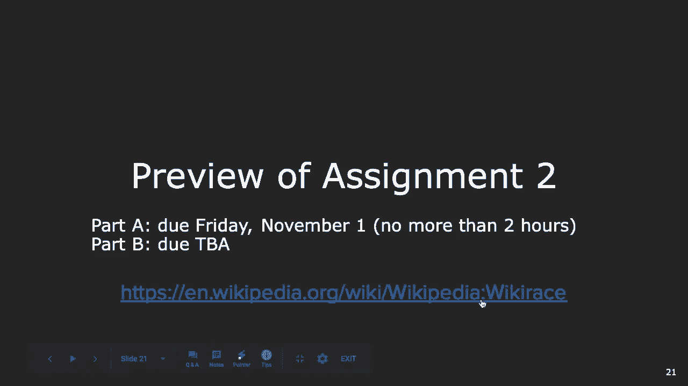

### 算法 (Algorithms)


STL算法通过迭代器对容器进行操作，实现了数据与操作的分离。常用算法包括：
*   `std::sort`：排序
*   `std::accumulate`：累积计算
*   `std::find`：查找元素
*   `std::copy`：复制元素

### 函数对象与Lambda表达式

函数对象（仿函数）和Lambda表达式允许我们将行为作为参数传递给算法，提供了极大的灵活性。
```cpp
// 使用Lambda表达式作为谓词
std::find_if(vec.begin(), vec.end(), [](int x){ return x > 5; });
```


### STL的设计哲学：抽象与效率

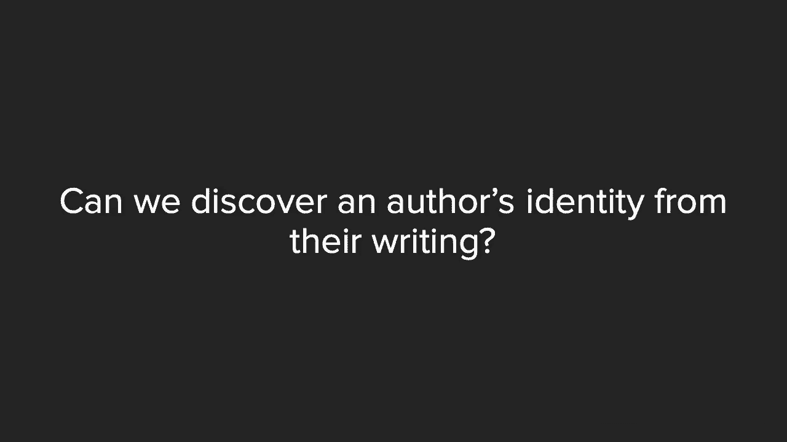

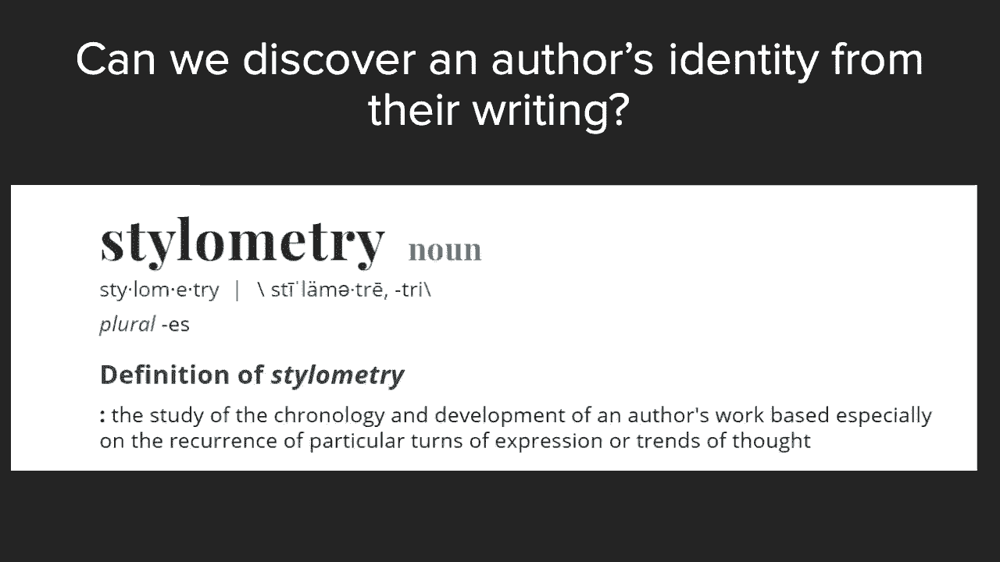

STL的核心思想是**抽象**和**效率**。
1.  **抽象**：通过模板，STL将算法从特定的数据类型和容器结构中抽象出来。
2.  **效率**：STL的实现经过了高度优化，在保证通用性的同时追求运行速度。

从基本类型到容器，再到通过迭代器操作的算法，STL构建了一层层的抽象，让我们能够编写通用、高效的代码。

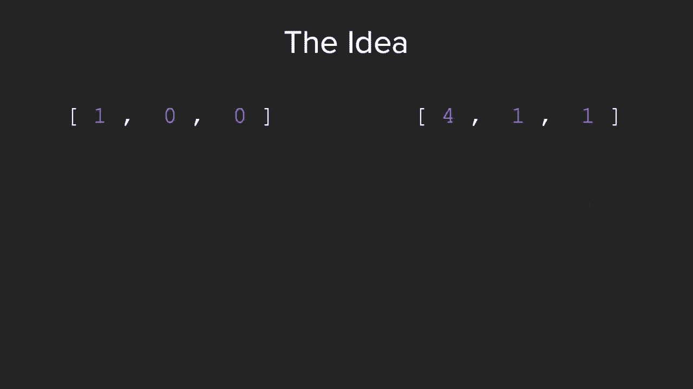

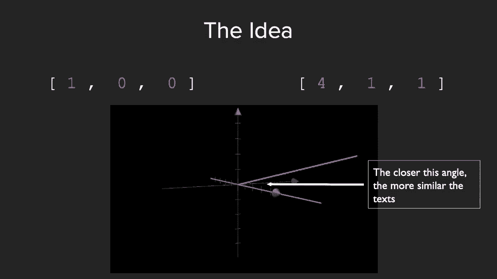

---

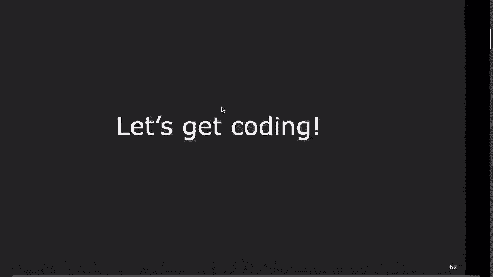

## 综合示例：《联邦党人文集》作者分析

现在，我们将运用所学的STL知识来解决一个实际问题：通过分析写作风格，推测《联邦党人文集》中匿名文章的作者。

### 问题背景

《联邦党人文集》由亚历山大·汉密尔顿、詹姆斯·麦迪逊和约翰·杰伊合著，但具体文章的归属存在争议。我们的目标是编写一个程序，通过比较**功能词**（如 “I”, “the”, “their”）的频率，来量化未知文本与已知作者文本的相似度。

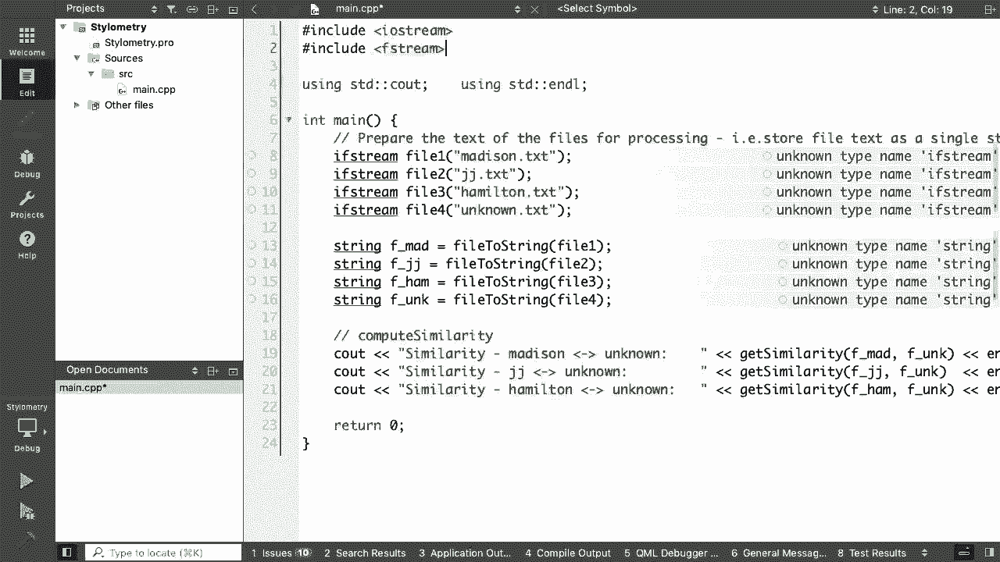


### 核心思路：向量空间模型

我们将每篇文章视为一个多维向量，每个维度对应一个功能词的出现频率。通过计算两个向量之间的**余弦相似度**，我们可以衡量其写作风格的相似性。

**余弦相似度公式**：
\[
\text{similarity} = \cos(\theta) = \frac{\mathbf{A} \cdot \mathbf{B}}{\|\mathbf{A}\| \|\mathbf{B}\|} = \frac{\sum_{i=1}^{n} A_i B_i}{\sqrt{\sum_{i=1}^{n} A_i^2} \sqrt{\sum_{i=1}^{n} B_i^2}}
\]
其中，\( \mathbf{A} \cdot \mathbf{B} \) 是点积，\( \|\mathbf{A}\| \) 是向量A的模长。

### 程序结构设计

我们的程序将遵循以下步骤：
1.  **读取并预处理文本**：将文件内容读入字符串，并统一转换为小写。
2.  **计算词频向量**：针对给定的功能词列表，统计它们在文本中出现的次数。
3.  **计算相似度**：使用余弦相似度公式，比较未知文本与每位已知作者文本的词频向量。
4.  **输出结果**：显示未知文本与各位作者的相似度分数。

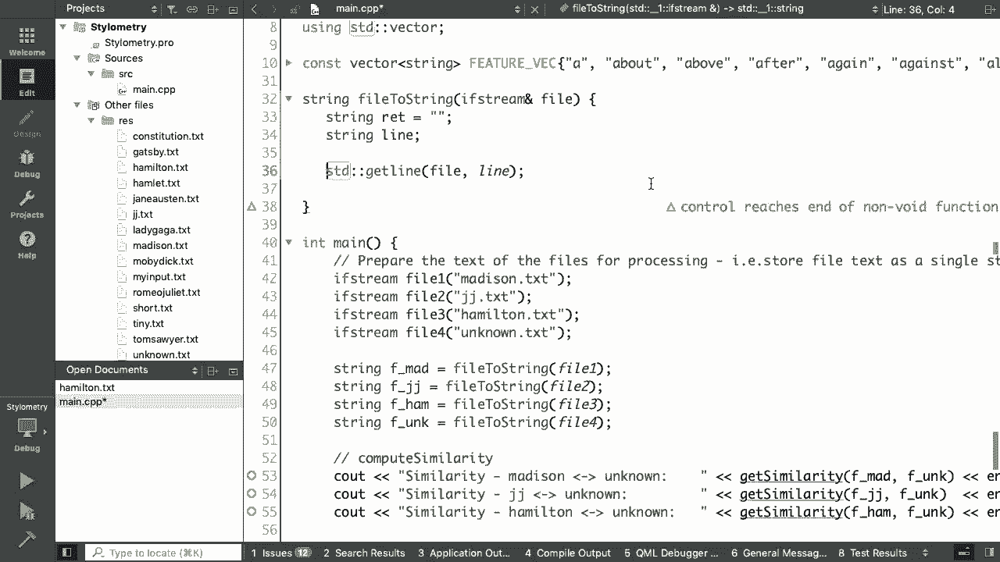

### 代码实现详解

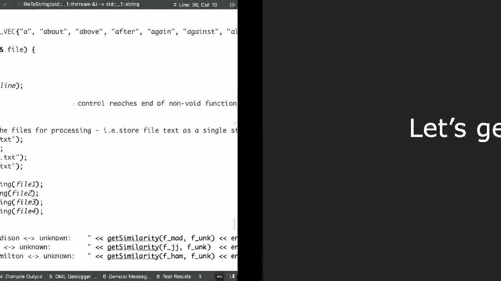

以下是实现过程中的关键代码片段和思路。

#### 1. 预处理文本：转换为小写字符串

我们需要一个函数来读取文件流，并返回一个所有单词均为小写、由空格分隔的单一字符串。
```cpp
std::string processText(std::ifstream& file) {
    std::string result;
    std::string line;
    while (std::getline(file, line)) {
        // 使用 std::transform 将整行转换为小写
        std::transform(line.begin(), line.end(), line.begin(),
                       [](unsigned char c) { return std::tolower(c); });
        result += line + " "; // 用空格替换换行符
    }
    return result;
}
```
**说明**：
*   使用 `std::getline` 逐行读取。
*   使用 `std::transform` 算法结合 `std::tolower` 和 Lambda 表达式，将每一行转换为小写。这避免了手写循环，是STL风格的代码。
*   将处理后的行加空格拼接到结果字符串中。

#### 2. 计算词频向量

这是程序的核心部分。我们需要统计功能词列表中每个词在文本中出现的次数。
```cpp
std::vector<int> createFrequencyVector(const std::string& text) {
    std::vector<int> frequencies;
    for (const std::string& word : FEATURE_WORDS) { // FEATURE_WORDS 是功能词列表
        int count = 0;
        // 关键步骤：计算单词 `word` 在 `text` 中出现的次数
        // ... (计数逻辑将在下节课完成)
        frequencies.push_back(count);
    }
    return frequencies;
}
```
**挑战与思考**：
在实现计数逻辑时，我们需要注意：
*   **子串匹配问题**：例如，统计 “the” 时，不能把 “there” 中的 “the” 也算进去。我们需要进行**全词匹配**。
*   **标点符号**：例如，“the.” 可能无法匹配 “the”。一个更健壮的实现需要处理标点符号（可作为课后练习）。
*   **性能**：在长文本中多次遍历可能较慢。我们可以探索更高效的算法，例如使用 `std::istringstream` 配合 `std::unordered_map` 一次性统计所有词频，再提取所需功能词。

#### 3. 计算相似度

一旦有了两个词频向量，计算相似度就变得直接。
```cpp
double computeSimilarity(const std::string& text1, const std::string& text2) {
    std::vector<int> freq1 = createFrequencyVector(text1);
    std::vector<int> freq2 = createFrequencyVector(text2);

    double dotProduct = std::inner_product(freq1.begin(), freq1.end(), freq2.begin(), 0);
    double magnitude1 = std::sqrt(std::inner_product(freq1.begin(), freq1.end(), freq1.begin(), 0.0));
    double magnitude2 = std::sqrt(std::inner_product(freq2.begin(), freq2.end(), freq2.begin(), 0.0));

    if (magnitude1 == 0 || magnitude2 == 0) return 0.0; // 避免除以零
    return dotProduct / (magnitude1 * magnitude2);
}
```
**说明**：
*   `std::inner_product` 算法完美地计算了两个向量的点积。
*   向量模长的计算也通过 `std::inner_product` 实现（向量与自身的点积即各分量平方和）。
*   整个计算过程简洁，充分利用了STL算法。

### 主函数与流程

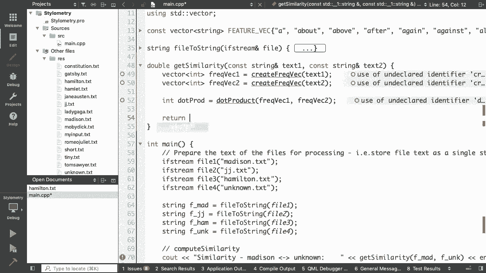

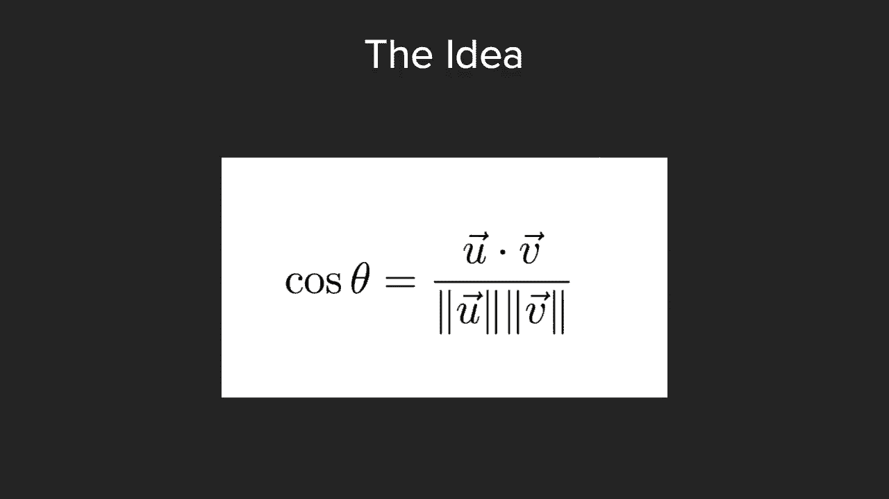

```cpp
int main() {
    // 1. 读取已知作者和未知作者的文件
    std::ifstream madisonFile("madison.txt");
    std::ifstream jayFile("jay.txt");
    std::ifstream hamiltonFile("hamilton.txt");
    std::ifstream unknownFile("unknown.txt");

    // 2. 预处理文本
    std::string madisonText = processText(madisonFile);
    std::string jayText = processText(jayFile);
    std::string hamiltonText = processText(hamiltonFile);
    std::string unknownText = processText(unknownFile);

    // 3. 计算并输出相似度
    std::cout << "Similarity with Madison: "
              << computeSimilarity(madisonText, unknownText) << std::endl;
    std::cout << "Similarity with Jay: "
              << computeSimilarity(jayText, unknownText) << std::endl;
    std::cout << "Similarity with Hamilton: "
              << computeSimilarity(hamiltonText, unknownText) << std::endl;

    return 0;
}
```

---

## 总结

本节课我们一起回顾了STL的核心组件——容器、迭代器、算法和函数对象，并深入理解了其**抽象**与**效率**的设计哲学。随后，我们通过一个生动的综合示例，将理论知识应用于实践，使用STL工具构建了一个文本风格分析程序。

通过这个示例，我们学习了如何：
1.  使用 `std::transform` 等算法处理数据。
2.  设计函数来计算词频和向量相似度。
3.  将复杂问题分解为多个使用STL解决的子问题。


这充分展示了STL的强大之处：它提供了一套丰富、高效且通用的工具集，能让我们以简洁的代码解决复杂的问题。在接下来的课程和作业中，请继续实践和探索STL的更多功能。