# 斯坦福大学《CS106L： C++编程｜ Stanford  CS106L C++ Programming 2019+2020》中英字幕（豆包翻译 - P12：[18]CS 106L Fall 2019 - Lecture 11_ Operators (Screencast) - GPT中英字幕课程资源 - BV1Fz421q7oh

我可以尝试安装我们 SSL 库的东西，但我想在此期间我会，做这个，我不知道，因为我还是想开始做作业的第二部分，因为我想这不算非常新，但其他人可能会遇到这个问题。比如说。

我是按照 CS106D 和 106L 的指示安装的，所以至，少还有其他人有相同的安装和实现。我看到这个错误了吗？好的，谢谢。好吧，我原本打算把这些扔掉，但我想我会在开始时分发这，些。这些是凤梨酥。

对于我做的每一部分，我总是会有一部分。通常是在期中考试之后，人们就开始不来上课了，然后我会，带上凤梨酥。我来自台湾，这些在台湾是超级重要的，所以如果你有兴趣，可以尝试一下凤梨酥。它们很好吃。

关于凤梨酥我还要说什么呢？凤梨。在美国，它们被标记为异国水果，但相信我，它们真的很好，吃。有人想要凤梨酥吗？好的，太好了。口味方面，有蔓越莓味的，然后其他的都是原味的。这些稍微小一点。

这个感觉稍微大一点，这个由于某种原因，真的很长。所以我会绕一圈，如果你有偏好，告诉我。偏好？这没有帮助。这是蔓越莓味的，好吧，好吧。那这个呢？随便说个 1、2、3 或者蔓越莓味的。开始吧。3，好。

3 是这个。那就拿这个吧。你已经把原来的分掉了吗？我有很多，所以不用担心。这应该可以维持到这周和下周。我会拿这个。原味的，哪种？那我就把这个扔给你。好的，其实我可能不应该扔它们，因为它们也有点碎，可能。

要小心一点。我会再回来。你要一个吗？是的，你要一个吗？凤梨酥。好的，如果你想要一个，大家都会有一个，但我想尽快完成，这个，所以是或不是。为了更快一点，我会把整个东西带过来，问你们是否想要一，个。

多少蔓越莓味的？好的，给你。我总是在期中考试之后带这些，所以大多数人不会来。你喜欢哪个？嗯，我已经拿这些很久了，所以。我认为它们是莳萝味的，然后是原味的。谢谢。蔓越莓味？对。你说对了。对。

还剩下所有的吗？没有。好的。我在想，是你听错了还是我听错了？你要一个吗？是的，你会得到一个。你也会得到一个？你要一个吗？这个？你很贴心。我原本打算把这些留到下周，还打算买万圣节糖果，但我想。

着外面太冷了。是的，没问题。你已经拿一个了吗？你已经拿一个了吗？你拿到了吗？好的，你要一个吗？什么口味？原味的。长的？不是长的那个。那不长，好吗。我不会扔掉它。还有其他人吗？谁还没有拿到一个想要一个？

好，什么口味？很好。还有其他人吗？菠萝蛋糕。什么口味？原味还是蔓越莓味。还有其他人想要一个吗？很好。好吧，我们开始吧。好，如果你刚刚进来，结束时你可以再拿一个。明白了吗？酷。哦不，人越来越多了。好的。

下周我会带更多的点心。好，我们来说说运算符。今天我们要讨论运算符。好，今天我们要讨论运算符。今天的课不会涉及大量代码，因为运算符重载有其语法。我认为甚至在106b的幻灯片上写过，所以它的语法相当简，单。

但问题更多在于类设计。你什么时候需要重载一个运算符？如果你重载一个运算符，需要遵循哪些典型原则？因为C++允许你重载运算符，让它们做奇怪的事情。你可以重载一个运算符，让它做一些非常奇怪的事情，C++。

也会编译。所以我们要讨论更多设计选择，你怎么决定如何重载一个，运算符，运算符应该返回什么等等。明白了吗？很好。在我继续之前，106b的同学们，期中考试怎么样？竖起大拇指，真的。好的，酷。

今天我们要讨论运算符重载。然后我们会通过很多例子。我把这些称为规范形式。这些本质上是你会看到的最常见的运算符重载类型。然后我们要讨论一种叫做POLA的东西。它代表一个非常有趣的原则，我们稍后会讨论这个。

首先，让我们谈谈运算符重载。作为一个快速挑战，你们有30秒。和伙伴一起，尽量列出你能想到的尽可能多的运算符。好的，我听到很多好的运算符。我不会要求你列出很多运算符。我只是想问，最奇特的运算符是什么？

奇特的意思是如果你说哦，这个是运算符，人们会感到惊讶，哦，那个实际上是运算符？好的，就像鳄鱼那些运算符，对吧？是的，好的。所以像我们用来做cout和cin的鳄鱼运算符，实际上是运算，符，所以很好。

还有其他更奇特的运算符吗？好的，最奇特的之一是逗号。逗号实际上是一个运算符。是的，逗号运算符的使用非常罕见。所以大约有60多个运算符，其中大约40个可以重载。我会解释重载的意思。

但今天我们会通过这份列表。在紫色框中的一个非常重要的运算符，即等号，这被称为赋，值运算符，这个运算符非常复杂，并且将是下节课的主题。所以我们现在会忽略紫色的那个，但我们会讲解现在标记，的那些。

这些是非常常见的重载运算符，所以这些是我想讨论的内，容。其他的，比如逗号，不是很常用。你知道吗，new 实际上是一个运算符，你可以重载 new 吗？你可以重新定义 new 的含义。现在。

我不是说你应该重新定义 new 的含义。从技术上讲，你可以重新定义双重与运算符，使其不再表示，逻辑与，它表示其他东西。再次强调，这不是一个好主意，但你从技术上讲可以这么做，是的，问题？好问题。

这是这一张幻灯片，我会谈到这个。但你提出了一个好点子，就是这些运算符，对于所有 C++ ，基本类型，它们都有特定的含义。对于 C++ 基本类型，算术运算符，你们都知道它们的作用，位运算符。

如果你学过 CS107，你会理解位运算符的工作原，理。关系运算符，你们已经用过很多，它们存在于几乎所有编程，语言中。我们一直在使用流运算符，虽然我们还没有在基本类型上，使用这些流运算符。

如果你在基本类型上使用它们，那些是位移运算符，也是 ，Windows 7 话题，我们不会覆盖。递增运算符，这些是作用于整数的运算符，你在每个你写的，循环中都见过它们。最后，这些内存运算符。

你在处理指针时见过它们。对于基本类型，这些运算符的工作方式完全如你最初想象，的那样。像这样。问题是，假设我们在处理一个向量，然后我们使用这个括号，运算符。C++ 如何知道当你在向量上使用括号运算符时。

你实际上，是想索引到向量中？因为向量不是 C++ 内置的基本类型，有人必须最初定义了，好吧，每当我使用括号运算符时，我的意思是我想索引到向，量中。类似的，对于这个，看看，对于加等于，当你做加等于时，当。

你访问一个元素时这是什么意思？这里是一个字符串。加等于是什么意思？将一个字符串加等于另一个字符串？追加。编写字符串类的人说，好吧，加等于在这里意味着追加。但你也可以想象，你可以将加等于定义为其他东西。

我可以将 ASCII 码加在一起，这没有太大意义，但有人必，须决定，好吧，字符串的加等于意味着追加。当我们编写自己的类时，你也可以决定这些运算符在你的，类中意味着什么。当我们实际使用这些运算符时。

C++ 实际上会调用这些函，数。每个运算符都有一个关联的函数，它正在做相同的事情。例如，看看这一行。你看到的这个括号运算符，在这里我们做了 V 括号零。这实际上可以被重新解释为 V 点。

然后我们调用这个成员，函数运算符括号，参数是零。简写形式是你通常写的，但 C++ 编译器将其转换为，每次，你使用运算符时，我将调用这个函数。如你所见，当你重载一个运算符时，你将编写一个具有此签。

名的函数。明白了吗？有问题吗？酷。其他需要注意的事情，cout 是一个流，所以流也有一个运，算符鳄鱼函数，你也可以链式调用它们。V 点运算符括号一，这将返回某些内容，然后这些内容可以。

调用运算符加等于来获取其他东西。这个东西返回一个字符串。在这里，这个东西返回一个字符串，然后我们可以取这个字，符串并调用运算符加等于。好的。这是另一种形式，适用于许多这些二元运算符，例如在这里。

我们在某个其他值上调用 cout。实际上，你可以用第二种形式来编写它们，如下所示。这些现在是非成员函数。这些就像是自由函数，不属于任何类。你可以说运算符，它接受两个参数，cout 是一个流，这个东。

西是一个字符串。你是在说，好的，当左侧是一个流而右侧是一个字符串时调，用这个运算符。这两种方式都有效，我们将讨论使用哪些以及为什么。到目前为止，你有任何问题吗？是的，有问题。这是一个小问题。

当你做括号操作时，怎么知道零放在括号内，而加等于则放，在右侧？这只是内置的吗？是的。这只是内置的。好问题。问题是，你怎么知道这里括号中的零，像是放入的参数，而，对于加等于，有左侧和右侧。

怎么知道右侧在这里？这只是括号运算符的内置语法的一部分。你可以把它想象成，如果他们愿意，他们本可以完全选择将，其表示为 V 括号括号零，仅仅表示索引零。这只是一个设计。我这里也犯了一个小错误。

让我们看看。我犯的错误在这里。注意我特别没有将其写为二元运算符，这也应该是 V 点运，算符括号一。有些运算符无法写成非成员函数，我也会讲解一下。实际上，为了让这段代码编译，STL 中的某个人必须编写了。

类似这样的函数。例如，某人必须编写一个自由函数运算符 alligator，它接，受一个输出流、一个常量值和一个常量字符串。某人必须编写这个函数，以便当你尝试将字符串打印到流，中时。

流知道你希望如何打印字符串。同样，在这里，编写向量字符串类的人必须说，好，当你说括，号时，你实际上是在取一个索引并索引到向量中。好的？我们到目前为止进展如何？好？好的，那么我们来看看一些示例。

我们实际上会编写一些这，些代码。所以在 Piazza 上，我发布了今天的讲座代码。今天不是一个代码密集的日子，但这些代码只是字符串向，量和分数类的代码。好的？在你自己的时间里。

我鼓励你更多地了解字符串向量类。安娜将在几周后更多地讨论字符串向量类，但我们现在做，的只是尝试向这些字符串类添加一些运算符。好的，所以我们从字符串类开始。

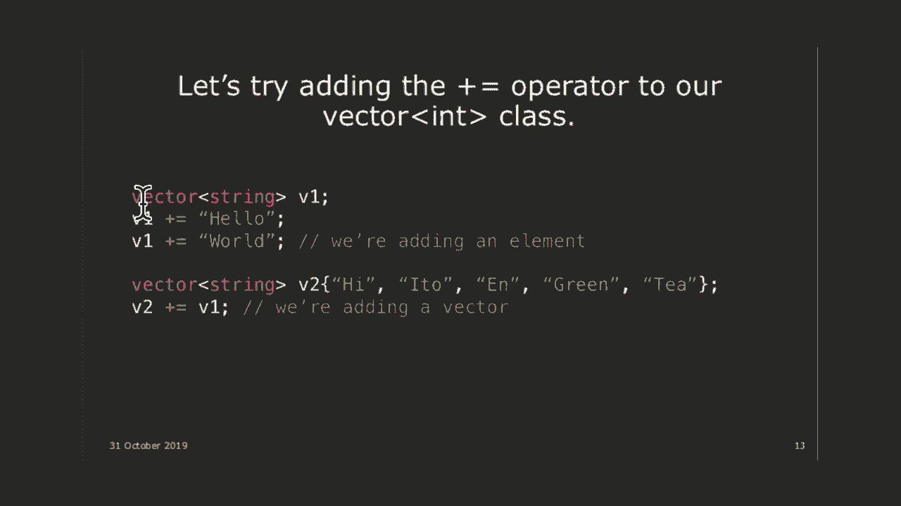

让我在这里编写代码。好的？这是我们的字符串类，但我基本上要编写一个使用我们字，符串类的程序。哦。好吧，所以你可以看到我在这里创建了一个向量字符串。我没有使用 STL 库。

因为我实际上是写了这个字符串向量，然后我只是做你预期你可以做的事情。所以我将添加 hello，添加 world。好吧？然后，如果我做一个 for each 循环，const string s in 。

vec，我只是将其输出，输出。好吧，你期望打印出什么？尴尬。好吧，你期望在这里打印出什么？Hello 在一行，world 在另一行。对吗？好吧，这正是你认为向量类的工作方式。

好吧，如果你做，哦不。Vim fraction。好吧，给我一秒钟。让我修复一下这里的东西。我们稍后会详细讨论这一部分。

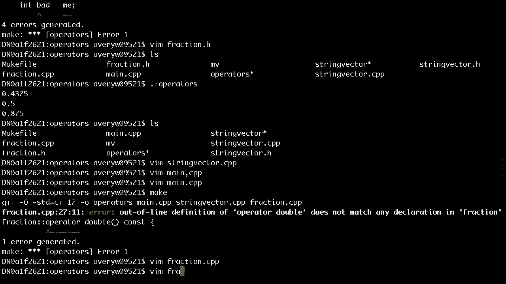

我忘记编辑掉了。明确。Vim fraction。cpp。这是转换操作符。

好吧。好吧。好了。操作符。好了。Hello， world。好吧？我们想要做的是能够重载加等于操作符，使其基本上像添。

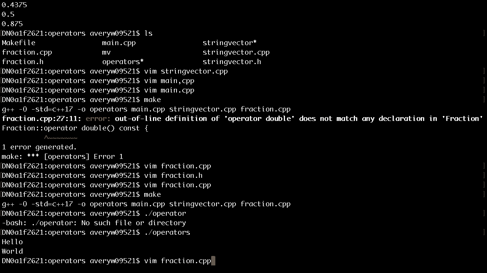

加一样工作。所以你知道在斯坦福库中，如果你不喜欢 add 方法，你可，以随时做 vec plus equals veto 和 vec plus equals ，16。9 ounces。

你可以在斯坦福库中做类似的事情。对吧？有趣的是，STL 库我认为没有重载加等于操作符，所以你可，能想考虑一下为什么。但我们要做的是在我们的字符串向量类中重载操作符，使，其支持这些操作。

所以是的。所以确切地说，我们将做类似这样的事情。我们还可以重载一个加等于的版本，其中不是接受字符串，而是接受一个完整的向量。好吧？如果你使用斯坦福库，这样做将会把第二个向量追加到第，一个向量的末尾。

所以你基本上将两个向量合并为一个大向量。好吧？酷。所以我们现在就来编写这些操作符。好吧？现在，所以在。我们需要编写这些函数，以基本上告诉 C++ 当我们对这个，成员向量字符串执行加等于时，这意味着什么？

所以在这里，我还没有告诉你返回值是什么，我也没有告诉，你参数类型是什么，尽管它是某种元素。我们正在获取元素，并将其推送到我们的向量中。明白吗？好吧。现在，还有很多其他东西，我们会讨论放置什么。类似地。

在这里，我们只是说，在我们的向量类中。我们说，好的，其他可能是某种向量。我们将遍历整个向量，并将所有值添加到我们当前的向量，中。好吧。这个代码有意义吗？好吧。关键部分只是忽略所有其他的花哨的。

这些括号的东西。现在忽略它。这行和这一行的核心思想明白了吗？好吧。这就是操作符重载的精髓部分。我们正在获取另一个向量，遍历它，并将其添加到我们当前，的向量中。好吧。那么现在，有趣的是，好吧。

但这个运算符需要某种返回值，而且还需要一些，比如我们给元素赋予什么类型？好的。让我们从简单的开始。您认为这个元素是什么类型？好的。它是一个字符串，但是我们如何传递这个字符串？我听到常量字符串。

还有其他想法吗？好的。非常量引用。还有其他想法吗？好的。我听到的想法是，您可以使用常量引用，可以使用不带引用，的常量，可以使用不带常量的引用，而且我认为最先提到的，是。

它只是一个没有任何常量或引用的字符串，对吗？所以有四个。哪一个是最好的？有两个可行，并且有一个是最好的。好的。是的。好的，常量引用，您为什么这么说？好的，是的。所以我完全同意引用部分。

您甚至不想复制字符串，它可能是一个巨大的字符串。不过常量部分很有趣，因为如果我不指定常量，让我们看看。

。让我们尝试编写代码。

Vim 字符串向量向量点 CPP。

好的。所以让我们在这里实现 += 运算符。好的。所以有一些返回值，我还不知道是什么，然后是运算符 += ，这是在字符串向量类中，所以别忘了写上，字符串向量： ，然后在这里我们想要。

您说我们想要做常量字符串引用。我把参数叫什么？元素。好的，让我快速复制那里的代码。您将元素压入。好的。这个常量非常重要，这不仅仅是，哦，必要时使用常量是好，的风格，而是这对于正确性实际上很重要。

有人能明白为什么吗？您看到这里的这个常量很重要。是的，嗯嗯。是的，完全正确。好的，完全正确。所以我们必须在这里将其标记为常量，因为如果调用此函，数的任何人本身有一个常量字符串，那么他们将无法将其。

常量字符串传递到这个非常量函数中。

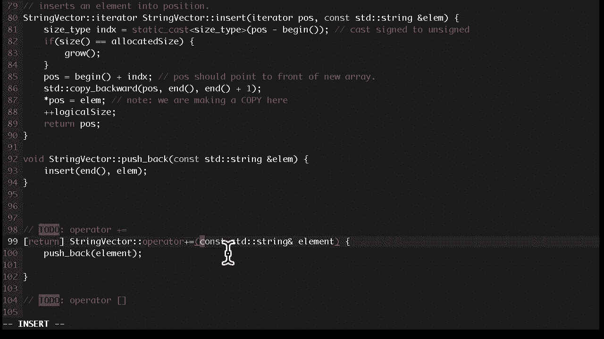

好的。所以，例如，如果在 main 中我有这样的代码，假设我调用。

假设我想要有一个字符串 常量字符串 s 等于 eto n 。除非我也将参数标记为常量，否则此代码将无法编译，因为，我试图将一个常量字符串用作参数。您不能将一个常量字符串放入接受非常量引用的参数中。

这有意义吗？问题，是的。我从未见过，那是做什么的，以及它与不使用常量引用传递，有何不同？所以只是常量而没有引用，这意味着我们正在通过值进行，复制，但然后您仍然将复制的值标记为常量变量。

所以如果您试图在文本中修改它，那么它会继续存在吗？是的。是的，完全正确。我真的，我真的想不出有什么情况下这很重要，因为关于常，量最重要的事情是确保调用函数的人和函数本身之间的交。

互对于是否允许更改值本身是一致的、达成一致的。并且这是唯一重要的事情吗？是的。所以，如果这只是一个非 const 且不是通过引用的情况，哎呀，不是那个，如果这个是非 const 且不是通过引用的。

那么我们在这里写的代码会有效，因为发生的情况是函数，本身会复制 S，会创建一个 S 的副本，所以在这种情况下。

其实并不重要。明白了吗？

当然，有问题，嗯。让我来处理一下。我可以在讲座后讨论这个问题吗？

因为这是个好问题，但与我们正在讨论的内容没有直接关，系。是的，让我讨论一下，嗯，嗯，因为这与更多的 107 相关，所，以我会在接下来的部分讨论这个问题。

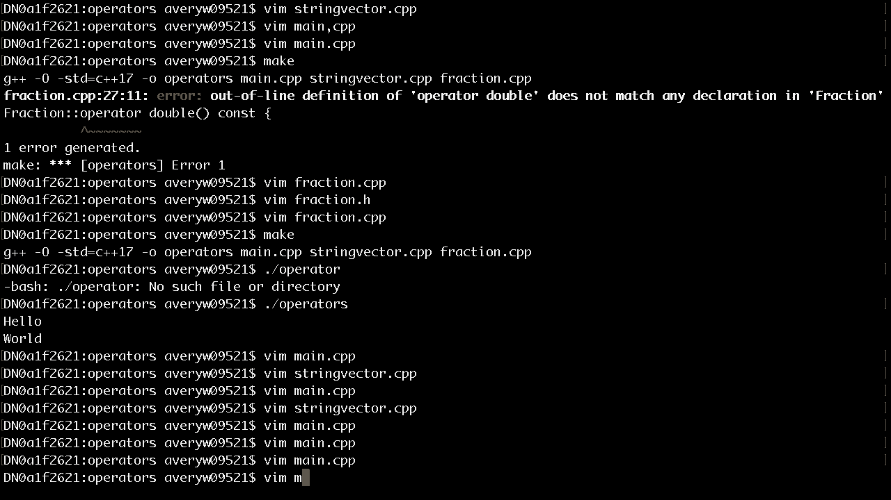

很好。那么，现在困难的问题是，返回值是什么？好的，我听到的是布尔值。所以，考虑一下当你重载这些运算符时，思考一下如果你在，普通的整数上使用这些运算符会发生什么。假设我有一个变量 i，是一个整数。

我做 i plus equals 2，当你执行 i plus equals 2 时，实际上会从那个语句中返，回一些东西。有人知道是什么吗？是的，嗯哼。这是 i 的新值，但我们并没有创建一个新值。

这是 i 本身的值。是的，所以我们加了 2 到 i 上，但返回值是 i 本身的值，好的，是的，所以它是一个整数，但不仅仅是一个整数，它是，对刚刚添加到的 i 的引用。好的，为了澄清这一点。

让我写一些代码，这样即使它看起。

来很奇怪，这也应该是有效的代码。

哎呀，不对，main。cpp。好的，所以我应该能做 vec plus equals s，然后我拿这个，返回值，再做 plus equals 16。9。哦，我们做绿茶。这段代码应该是有效的。好的。

如果 vec 是一个整数，而这些是其他整数，这段代码，会有效。基本上发生的情况是我们向 vec 添加了一些东西，然后这，个表达式将返回对原始向量的引用。然后我们再向那个向量添加另一个东西。明白了吗？

因为对于基本类型，plus equals 将返回对该值本身的引，用。如果你重载了 plus equals，你也应该返回对对象本身的，引用。明白了吗？

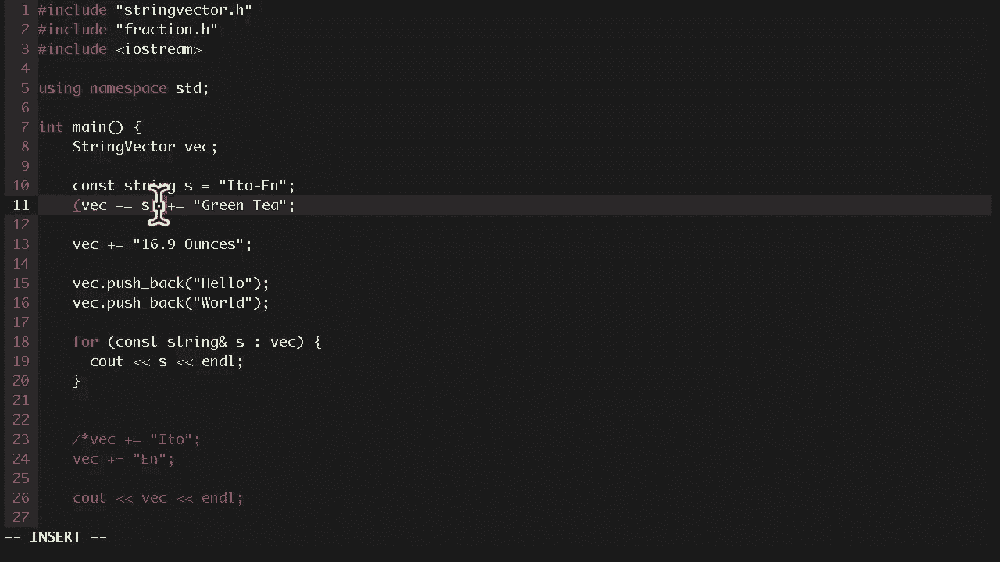

好的，为了澄清我的意思。哎呀。是的，这里的返回值应该是一个对字符串向量的引用。明白了吗？哦，好的，对不起，我在这里打错了。这应该是一个字符串和一个字符串向量。最初我的例子是整数。

但后来我把代码改成了字符串，所以，这些应该是字符串。好的，有问题吗？是的，嗯哼。这是，嗯，这个是一个指针。这个在 106B 中有讲解，对吧？好的。这个在 106B 中讲解了吗？还没有？真的吗？好的。

好的，所以这基本上指的是，这是指向当前对象本身的指针。

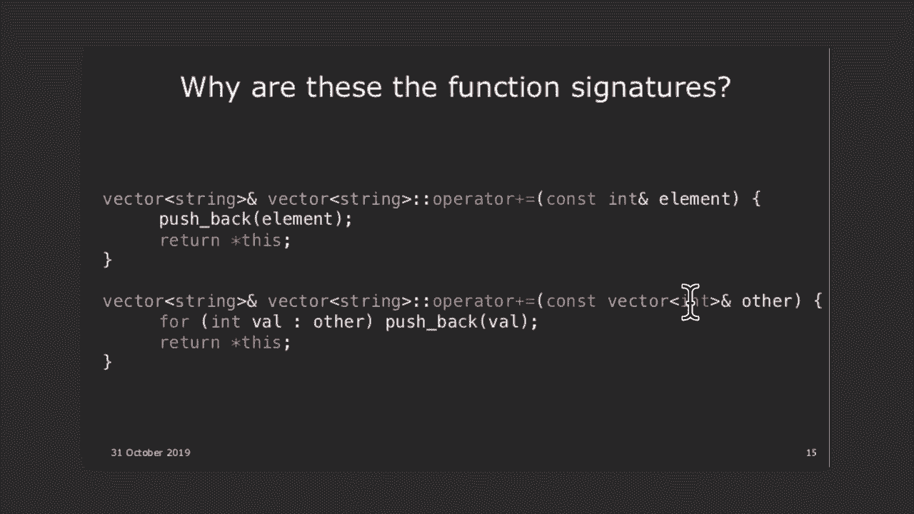

。好的，例如，在这里的代码中，如果我在类内部使用这个，这，指的是那个向量本身。

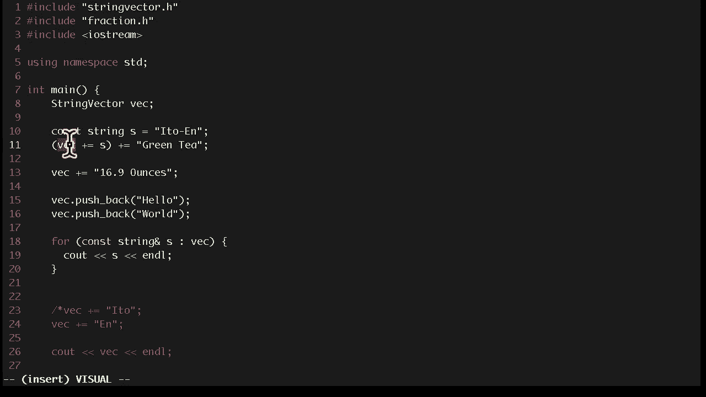

好的，然后我们返回对那个向量的引用，所以我们不需要一，个指针，我们必须取消引用那个指针。这明白了吗？好的，这一部分初看时不容易理解，这在运算符重载中是非，常重要的，你必须不断思考，好的。

返回值应该是通过引用，、通过值还是通过 const？参数应该是通过引用传递还是通过值传递？它们应该是常，量吗？好，所以现在非常重要的是要理解为什么这些必须是引用，到目前为止你有任何问题吗？好。

纯粹是理论上的。如果我移除了这些引用，如果我尝试打印出这些字符串，代。

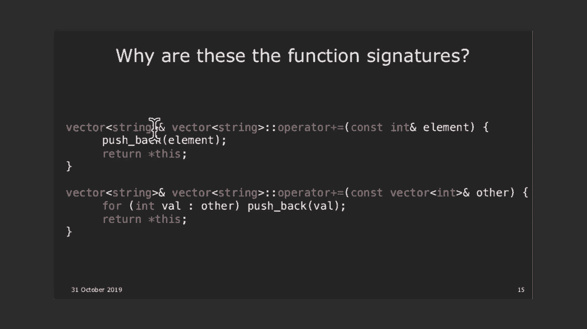

码的结果会是什么？所以如果是通过引用，那么这应该打印出eto n，然后是那，一行，green t。但如果不是通过引用，会发生什么？是的，嗯？正是如此。正是如此。你能解释一下为什么吗？嗯哼。嗯哼，是的。

正是如此。所以如果我们不通过引用返回它，那么vec plus equals s，所做的是将s添加到向量中，但它返回的是该向量的副本。当你执行plus equals green t时。

你是在将green t添加，到那个新副本中。好，然后那个副本在语句完成后就消失了，所以当你实际尝，试打印出vec时，vec中只有s，即eto n。这有意义吗？好，有很多非常奇怪、意外的C++用法。

但你会惊讶于有些，人写这种代码的频率，这真的很让人困惑。所以当你编写自己的类时，你必须假设编写类的人可以做，这种奇怪的事情，你必须返回正确的语义。

好，所以在这里我们必须返回引用。好，概念检查。我们为什么要返回一个引用？好，我们刚才已经展示了这一点。我们为什么要返回这个？好，我们已经解释过了。好，所以问题是plus equals。

plus equals技术上接受两个操作数，对吧？它接受向量本身和你要添加的字符串，对吧？但在我们的函数中，我们只看到右侧。左侧去了哪里？当我们在这里编写这段代码时，右侧，即字符串本身，显示，在这里。

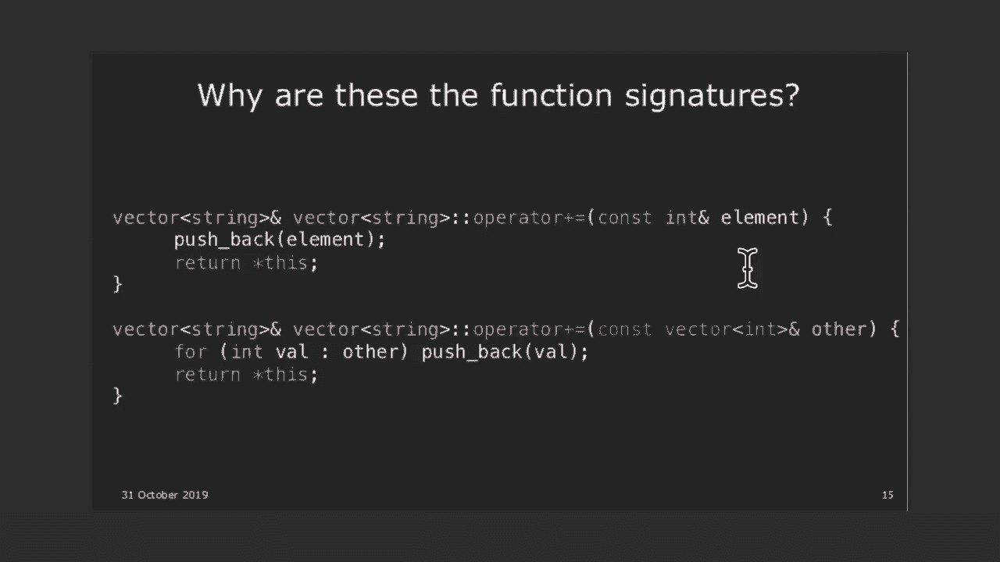

这应该是字符串。但左侧，即实际的向量，让我们简单一点，回到这里。

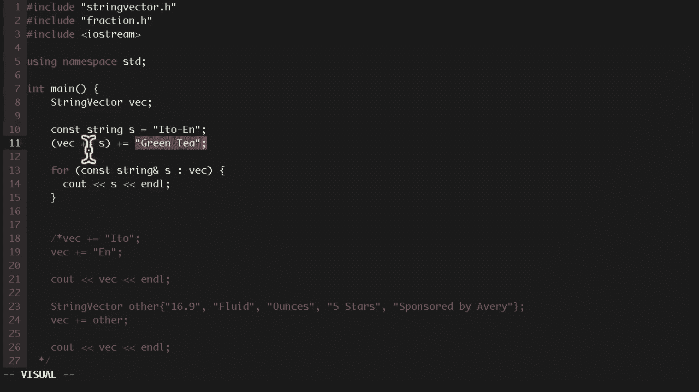

vec在哪里显示？是的，嗯哼。嗯哼，是的，正是如此。所以记住，由于这些是成员函数，这些函数是在某个向量上，调用的。你调用的那个向量，就是这个向量，对吧？

这一行等同于vector。operator plus equals green team。

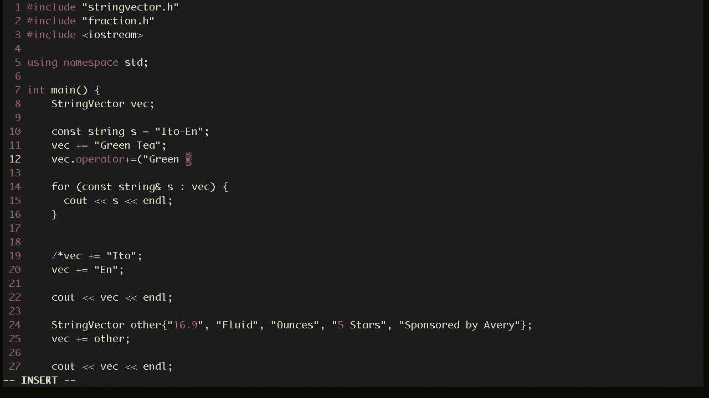

所以左侧是隐式调用的函数。在C++中，你可以使用this来检索那个对象。这是指向那个对象的指针。好，目前有任何问题吗？嗯哼，是的。是的，正是如此。所以pushback是vector。

string中的一个成员函数。我们继续。好，我跳过那个。问题我已经问过了。我现在有一个新符号，avocados。好，我们写了。好，我们来做一个例子，其中。好，改为实现plus。

而不是做plus equals。好？所以在斯坦福图书馆中，我认为你可以取一个向量和另一，个向量，并将它们加在一起。当你将一个向量加到另一个向量时会发生什么？那个东西应该返回两个向量拼接在一起的结果。好。

但快速问题，它会改变你最初添加的两个向量吗？不会，对吧？

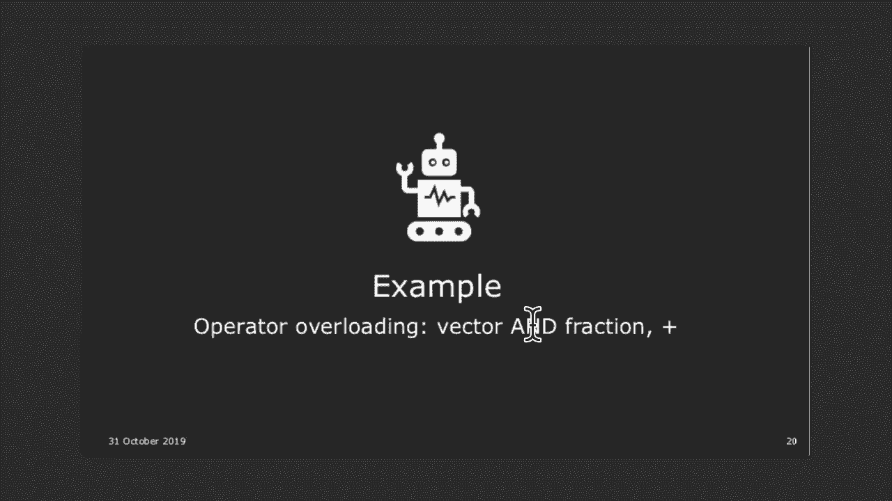

所以，如果我这样做，string vector vec1 eto n，string ，vec2 is green t，以及16。9盎司。如果我说 c。好吧，我不想做 c。

String vector vec3 等于 vec 加上 ，vec2。对吧？这会返回一个包含所有元素的向量，但实际上不会改变我，添加的两个向量 vec 和 vec2 本身。明白了吗？所以。

如果我们在 vector。cpp 中实现这个功能，那么这应，该是一个。好的，所以如果我们要实现加号运算符，即 string vector， operator plus，参数应该是什么？所以。

肯定是两个向量，对吧？因为我们试图说明当你说 vector 加上 vector 时是什么，意思。但向量是如何被 const 限定或引用限定的？你是通过值传递两个向量，还是通过引用传递，还是通过 。

const 引用传递？我们这里用 const 引用，因为这些向量即使在加法操作后，也不应该改变。v1 const。实际上，这是一个成员函数，所以我们实际上只是做 other，好的，所以第一个向量是向量。

即隐式的 this，另一个向量，是 other。加号运算符的返回值是什么？是一个通过引用的 string vector。不是通过引用，对吧？因为当你执行加法时，你正在创建一个包含两个向量合并。

在一起的新向量。这不是对我们给出的原始向量的引用。好的，你怎么实现这个？是的，嗯哼。所以我们这样做，然后我们对。这些是字符串，const in other。我们只是遍历 other。

然后执行 result。push_back。所以这里我们复制了这个，因为我们实际上不想改变它本，身。我们在这里做一个副本，然后将另一个向量的字符串添加，到 s 中。好的，明白了吗？

我们稍后会进一步讨论这个操作。这叫做拷贝构造函数，这就是重要的等号出现的地方。有问题吗？好点。我们也可以这样做。很棒的点。是的？是的。是的。所以这段代码在技术上是无法工作的，因为等号有问题。

这是下一节课的内容。基本上，计划是今天结束时，我会指出这实际上不起作用，原因就是等号。所以让我留到后面讲。但确实，这段代码在技术上不起作用。如果我们修正等号，它是可以工作的，但等号不起作用，我。

们将讨论为什么等号默认情况下不起作用。好的，这里还缺少一件事，那就是最初，我想将其写成一个，非成员函数，包含第一个向量和第二个向量两个参数。在这里，我们只将第一个向量作为隐式的 this。但从技术上讲。

在这个向量内部，我们可以从技术上改变它，我们如何防止在这个运算符函数内部更改 this？我给你一个提示。它肯定是某处有一个 const，但我们把 const 放在哪里？是的，我们把它放在这里。

表示这个方法是 const 的。好吗？

好的，让我们回到代码中。好的，所以是的，这基本上是可以为此编写的代码。好的，但问题是。

在这里，我们将其声明为成员函数。实际上，将其声明为非成员函数更好。好的，那么作为非成员函数，这会是什么样的呢？它会是这样的。第二种。好的，所以这不再是类的一部分了。字符串向量结果等于第一个。

然后对 com 结果加上 s。所以我们有两种可能的写法，第一种是作为成员函数，第二，种是作为非成员函数。是的，可能是第二种。是的，第二种。谢谢。好的，你认为哪种方式更好？哦，难题。哪一种更好？好的。

我实际上不指望你立刻知道答案，但我会解释为什么。

第二种作为非成员函数更好，这个理由，我在下一张幻灯片，上有吗？好的，我不会先讲理由，而是先讲一般的原则。你是将运算符实现为成员函数还是非成员函数？好的，规则在这里列出。我会讲解其中的重要规则。

即某些运算符，比如括号运算符，必须作为成员函数实现。其他运算符，比如流运算符，必须作为非成员函数实现。快速问题，那么为什么我们要这样实现，我在下一张幻灯片，上有吗？

没有，好吧。让我们看一个更详细的例子，我们将尝试为流重载大于号。

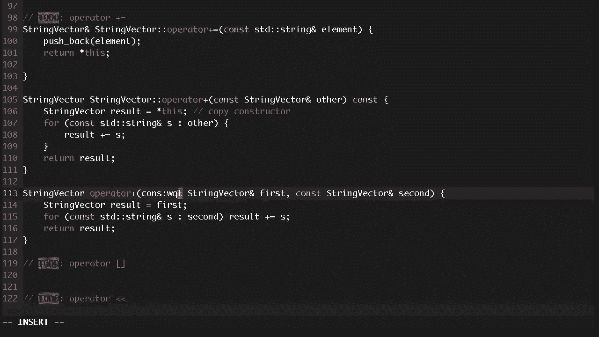

运算符。

所以我们去 fraction。cpp。好的，你可以阅读这个。这基本上就是一个可爱的分数类。让我们为流实现大于号运算符。好的，这将允许我们写出这样的代码。好的，所以分数类的作用是。

它基本上是一个可爱的分数类，比如在这里，我声明了两个分数，我和你，然后这些是我在，期中考试中解决的问题，这些是你在期中考试中解决的问，题，这是我们总共解决的问题，因为这完全是考试的工作方，式。

然后你可以写出这样的代码。好的，酷。那么，我刚才要说什么呢？我暂时跳过这个，然后等我实现流后再回到这个。好的，再做一个例子，我们想要重载大于号，这样我们可以，打印分数。好的？好的，那么，运算符。现在。

我们是要将其实现为成员函数还是非成员函数？非成员函数，为什么是非成员函数？是的，好吧，所以如果你考虑参数，如果这是一个非成员函，数，它将是一个输出流，以及分数本身。想象一下如果我们将其实现为成员函数。

我们需要做什么，如果这是一个成员函数，我们要在什么类中编写这个函数？输出流，对吧？我们实际上能为输出流编写成员函数吗？不能，因为这是 STL 库。我们不能编写，我们不能覆盖 STL 库。好的。

所以在像这样的某些情况下，你不能在左侧编写函数，你不能将其实现为成员函数。所以在这里，我们必须将其实现为非成员函数。好的，但这确实带来了一些问题。顺便问一下，大于号运算符的返回值是什么？这是一个输出流。

这是对一个输出流的引用。谁能猜到原因呢？是的，嗯哼，嗯哼。是的，是的，因为在某些代码中，我可以写 Z out，一些分数，但有时我也想像这样链式调用它们。这个链式调用之所以有效。

是因为它做的是 Z out 点运算，符括号分数一。好吧，所以它调用了这个东西。这个东西返回对一个流的引用，对 Z out 的引用，这允许，我们再次调用它。所以现在这是 Z out，我们调用运算符括号。

括号。这就是为什么我们返回输出流的引用。总是考虑这些的语义，因为这让你确定，如果有人实际调用，这个运算符，他们需要一个引用还是一个值？好吧，你会怎么实现这个？我直接告诉你答案。O S F 点分子，好吗？

这只是打印分子斜杠分母。好吧，现在这带来了一个问题。谁能看出这为什么是个问题？是的，嗯哼。嗯哼，好问题。所以 F 点 num 本身是一个整数。所以写了 C out 或者流类的人知道如何打印一个整数，是。

的。但是他们不知道如何打印一个分数，所以我们必须告诉它，如何打印一个分数。好吧，作为提示，num 和 denum，在类中它们是什么？那些是私有变量，对吧？所以你只能访问私有变量。

如果你的函数是一个成员函数，但这是一个非成员函数。所以我们技术上不允许访问 num 和 denum。好吧，是的，我听到友元。你想说什么？好吧，所以我听到两件事。我们可以获得它的副本。所以要获得副本。

你可以做类似于，你可以调用 get num ，和 get denum，这给你 num 和 denum 的副本，然后你可以，在这里修改它。是的，我们可以这么做。一些类没有那个，没有用于私有的访问器。

所以有一个更通，用的方法，你可以使用，就是友元。你有问题吗？嗯哼。好吧，友元。友元做什么？所以本质上，友元做的是，作为友元的函数是一个在类外部，但仍然可以访问你的私有成员变量的函数。

好吧？所以要做到这一点，我们在类内部声明一个友元，称为运算。

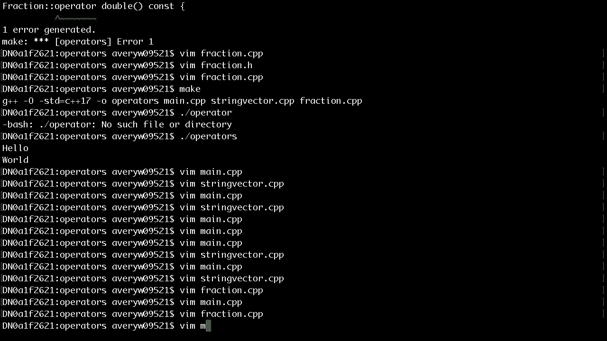

符，括号，括号，它接受 ostream、os 和一个，还有什么？分数。分数。常量分数。然后当我们这样做时，现在它声明那个运算符为友元。所以当我们尝试编译这个代码时，这个函数可以访问 f 的。

私有成员变量。好吧，从这点中获得的关键是，关键的收获。首先，你应该总是考虑参数的常量性。所以这里，os 不是常量，因为我们实际上在向输出流添加，内容，但分数是常量，因为我们没有修改 f。

总是考虑我们是否按引用返回。所以这里，它是按引用的。然后我们得到的另一个收获是友元。好吧，我有一张非常可爱的幻灯片。你为什么需要朋友？因为他们可以帮助你度过第六周。但实际上，真正的答案是。

你需要他们来访问私有成员变量，我们还剩多少时间？五分钟？好的，我们可以再讲一点。让我们讨论一些通用规则。所以我们已经看到了一些例子，对吧？我们见过加法、等于、加法和流操作符，我们也看过应该。

用哪些操作符。让我快速讲解一下成员函数和非成员函数的经验法则。所以经验法则是，首先，一些运算符必须实现为成员函数。没有其他选择。所以括号运算符、等于运算符，必须实现为成员函数。

有些运算符必须实现为非成员函数，比如我们刚才看到的，鳄鱼运算符，因为你不能写入到 ostream 类中。所以你必须实现为非成员函数。对于一元运算符，我们没有时间实现递增运算符，但你可以，实现递增运算符。

你必须将这些实现为成员函数。这是另一种情况。所以如果一个二元运算符，比如加法和小于运算符，如果它，们对两个操作数的处理是一样的，那么你应该实现为非成，员函数。所以考虑一下加法运算符。

加法运算符对第一个操作数和第二个操作数的处理是一样，的。所以这应该实现为非成员函数。但如果它没有平等地处理两个操作数，主要是因为它实际，上修改了一个操作数而没有修改另一个，比如加等于运算，符。

在这种情况下，你应该实现为成员函数。是的。嗯哼。对的。获取两个输入。是的。嗯哼。是的。尤其是那些你确实希望实现为成员函数的情况，比如在向，量运算符中，一边是向量，但另一边是字符串。你没有平等地处理它们。

你在将字符串添加到向量中。所以你应该将其实现为成员函数。明白了吗？这样做有其原因，但主要原因是如果你将其实现为成员函，数，访问其中一个需要修改的私有变量会更容易。所以加等于运算符。

我们实际上需要修改左侧的操作数，而，不是右侧的操作数。我有点跳跃。我会重新排序这些幻灯片。好的，总结一下要点。好的。POLA 代表最少惊讶原则。有人想猜猜这是什么意思吗？随便猜一下。是的。嗯哼。对的。

基本上，无论你实现了什么功能，让其他人使用时不会感到，惊讶。这是1984年的一句话。如果它具有高惊讶因子，那么你应该重新设计它。一些例子。一些关键规则。一个是设计运算符时要尽量模仿常规用法。

返回引用或将参数标记为 const 的部分，大多是为了模拟，常规用法。常规用法通常意味着如何实现基本类型。例如，加等于运算符，我们假设加等于运算符返回左侧的引，用。例如，看看这个函数。

它使用了我们多次使用的 time 结构，体。假设我重载了小于号。很明显，开始小于结束是什么意思。它表示哪个时间先到。但是考虑一下开始加等于10。加等于10究竟做了什么？

我们是在给分钟加10还是给小时加10？不确定。如果有任何歧义，就不要重载那个运算符。你应该实现一个叫做更改时间的函数，或者说更改秒数，改，变分钟或改变小时。例如，结束减减。再说一次，它改变了什么。

小时还是分钟？最后，真的很荒谬的事情。不要重载逗号运算符做这种事情。你真的不知道那在做什么。我本来打算写一个例子，如果你这样做，它会用ASCII艺术，打印分数，但我昨天没有时间了。但基本上，是的。

你真的不知道这做了什么。所以不要实现，不要重载那些运算符。对于像加法这样的对称运算符，两边是相等的，你应该使用，非成员函数。我有更深入的解释，涉及对称性。如果你将加法实现为成员函数。

你可以将一个分数加到一，个整数上，这会有效，但这就不行了，因为这将A视为我们调，用函数的对象，但这将1视为对象，这样就不行了。你总是希望将对称运算符实现为非成员函数，以避免这些，不对称的惊喜。最后。

始终提供所有相关运算符的实现。我所说的相关集是什么意思？这些都是相关集。如果你实现了等于等于和小于号，你应该实现这六个运算，符。不应该有人写这样的代码，A小于B，然后说，好吧，这有效。

然后B大于A也应该有效。不要只实现一个而不实现另一个。否则，人们会感到惊讶。同样，不要实现加法，却不实现加等于，除非有特定原因。否则，如果你实现了加法，你也应该实现加等于。酷。我们跳过那个。在最后。

我们时间不够了，但我基本上会给你预览其他运算，符。如果你想离开，你也可以离开。一些我们不会覆盖的其他有趣的运算符，可能会在后面覆，盖。首先，你会注意到这些，箭头运算符和箭头星运算符，这些。

实际上是你可以重载的运算符，这实际上是我们将在智能，指针讲座中做的，安娜将讲授。函数对象，我们跳过这个，但这基本上是一个lambda。你可以定义自己的内存分配器。如果你们中的任何人上过CS107。

你已经写了一个堆分配器，你可以把那个堆分配器放到C++中作为实际的分配器。没有必要这样做，但一些公司确实希望他们自己的自定义，分配器以满足性能问题。你实际上可以这样做。还有更多的多线程内容我们不会覆盖。

还有太空船运算符，我想覆盖，但我们没有时间。这是C++20中的一个特性。它被称为太空船运算符。它看起来是这样的。它基本上支持不同等价类之间的三种比较。如果你上过 CS103，你会知道这些是什么意思。

现在有 CS103 的同学吗？好的。这些术语有点熟悉吗？也许吧。没有？好的。嗯，Keith 可能稍微调整了一下课程内容。如果你上过一些数学课程，你会明白这些是什么意思。本质上。

这个想法是有些东西是不可比较的。你需要一种更强大的方法来排序不同的元素。这就是 spaceship 操作符所做的事情。好的。我们下一次要做的关键内容是，假设我们写了这样的代码，我们写了这样的代码。

等号实际上不起作用，因为当我们在这个向量上使用等号，时，这个向量，大小为四。这些元素指向堆上的东西。当你使用等号时，会发生什么？当我尝试将这个向量复制到另一个向量时，会发生这种情，况。默认情况下。

等号会复制每个成员。这里，因为这是一个指针，它只是将指针复制到相同的位置，这就是问题所在，因为假设我们尝试向其中一个向量添加，一个新元素。那么发生的情况是两个向量都指向相同的向量。如果你改变了一个。

你实际上也在改变另一个。好的。这被称为浅拷贝与深拷贝。好的。我讨厌 Python 的原因是 Python 对此非常模糊。是的。在 Python 中，你可以向列表中添加东西。你改变了原始对象。

列表中的东西也会被修改。好的。这就是我讨厌 Python 的原因。但在 C++ 中，你可以完全控制拷贝操作的工作方式。好的。这一切的罪魁祸首就是等号，这也是接下来两节课的主题，全是关于拷贝的内容。

我们将讨论所有的拷贝构造函数。然后在第 13 讲中，我们将讨论移动语义，这是我从 C++ ，中学到的最酷的东西之一。移动语义。好的。确保下周你们都来。我会说接下来的两周是概念上最复杂的讲座，需要大量的。

概念理解。确保你们做好准备来听讲。好的。很好。好了。如果你有任何问题，请告诉我。我会在外面。是的。没问题。下次我会带更多的。现在有办公时间吗？是的。我会在外面，你们可以问问题。很好。

