# 课程11：运算符重载 🧮

在本节课中，我们将要学习C++中的运算符重载。我们将探讨如何为自定义类型定义运算符的行为，理解重载运算符时的设计原则，并学习如何正确选择成员函数与非成员函数来实现运算符。

---

## 概述

运算符重载允许我们为自定义类型（如类或结构体）定义运算符的行为。就像C++知道如何对基本类型（如`int`、`double`）使用`+`、`-`等运算符一样，我们可以通过重载来告诉编译器，当这些运算符用于我们自己的类时应该执行什么操作。本节课的核心在于理解重载的语法、设计选择以及应遵循的最佳实践。

---

## 什么是运算符重载？

对于C++内置的基本类型，运算符有明确的含义。例如，算术运算符用于数学计算，关系运算符用于比较。

然而，对于用户自定义的类型（如`std::vector`或`std::string`），C++本身并不知道这些运算符的含义。必须有人通过编写特定的函数来定义这些行为。这个过程就是运算符重载。

例如，当我们写`vec[0]`来索引一个向量时，C++实际上将其解释为调用一个名为`operator[]`的成员函数：`vec.operator[](0)`。

同样，流运算符`<<`和`>>`也是重载的运算符，它们被定义为将数据输出到流或从流输入数据。

---


## 如何重载运算符：语法与示例

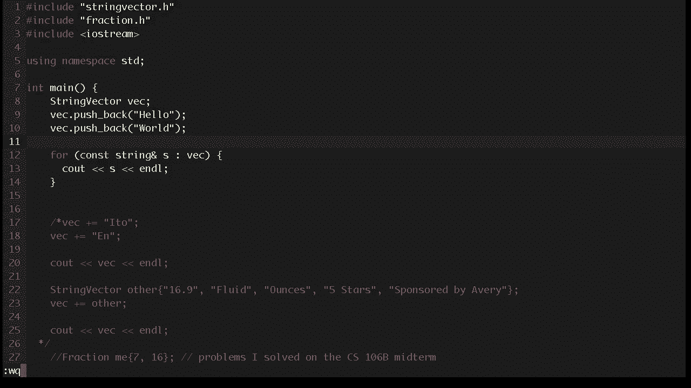


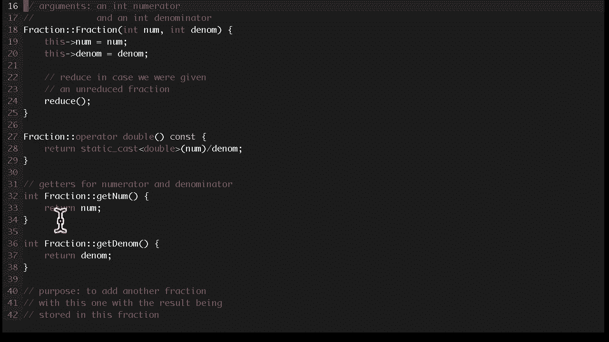

运算符重载本质上是一个特殊命名的函数。函数名由关键字`operator`后接要重载的运算符符号组成。


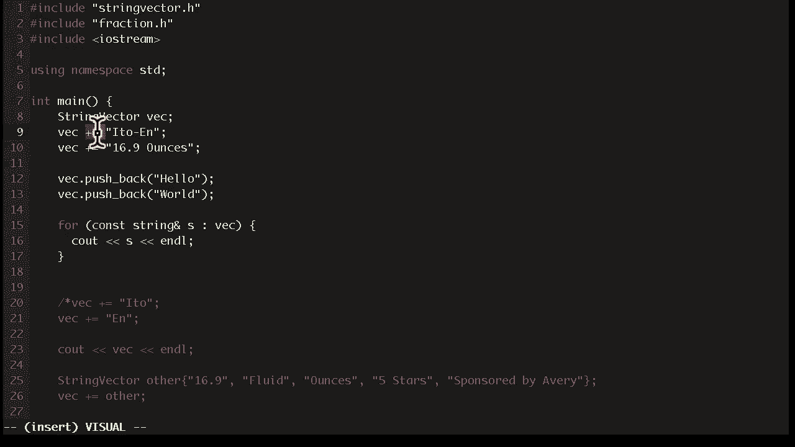

上一节我们介绍了运算符重载的概念，本节中我们来看看具体的语法和实现方式。

### 成员函数形式

许多运算符可以作为类的成员函数来重载。此时，运算符的左操作数是调用该成员函数的对象（通过`this`指针访问），右操作数是函数的参数。

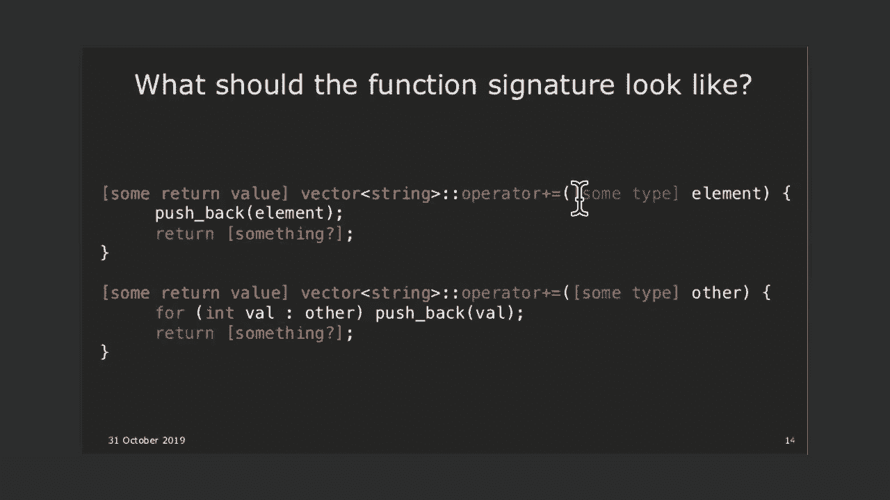

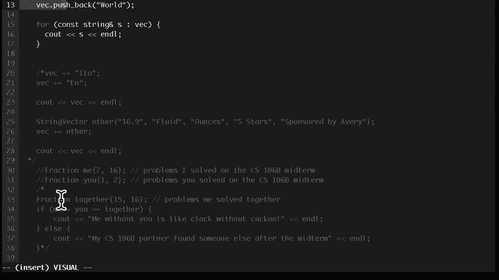

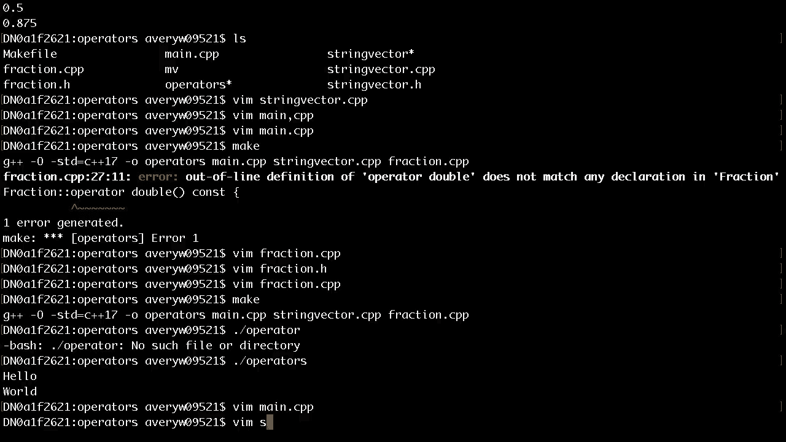

以下是重载`+=`运算符的示例，用于向自定义的`StringVector`类添加元素：


```cpp
class StringVector {
public:
    // 重载 += 运算符，用于添加一个字符串
    StringVector& operator+=(const std::string& element) {
        // 将元素添加到向量中
        push_back(element);
        // 返回对当前对象的引用，以支持链式调用
        return *this;
    }
private:
    // ... 其他成员，如存储字符串的数组 ...
};
```

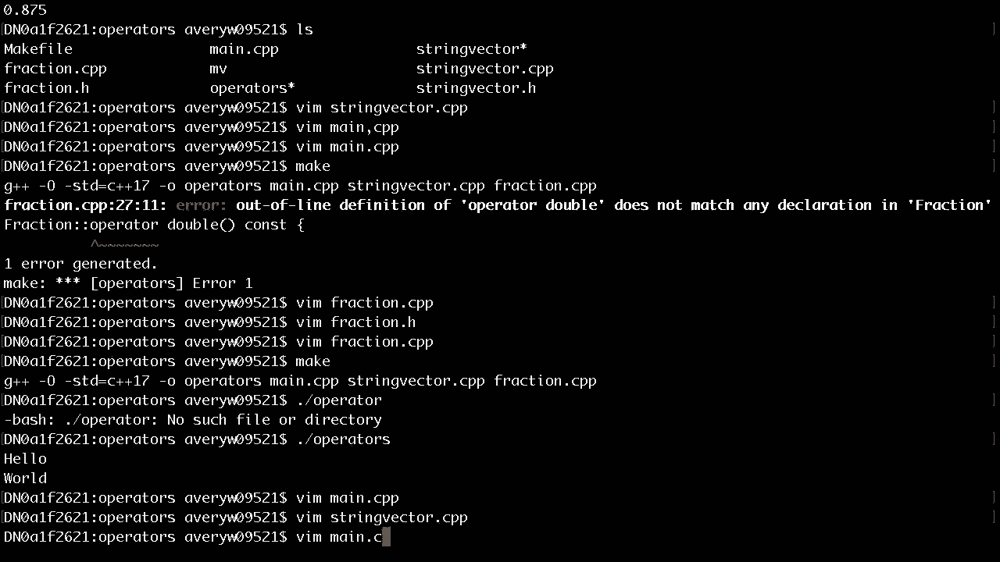

**关键点分析：**
*   **参数类型**：使用`const std::string&`。`const`确保不会修改传入的字符串，引用`&`避免了不必要的拷贝，提高了效率。
*   **返回值**：返回`StringVector&`（引用）。这是为了模拟内置类型的行为（如`int`），使得`vec += s1 += s2`这样的链式调用成为可能。如果返回值不是引用，链式调用将作用于对象的副本，而非原对象。
*   **`*this`**：在成员函数中，`this`是指向当前对象的指针。`*this`解引用后得到当前对象本身，我们返回它的引用。

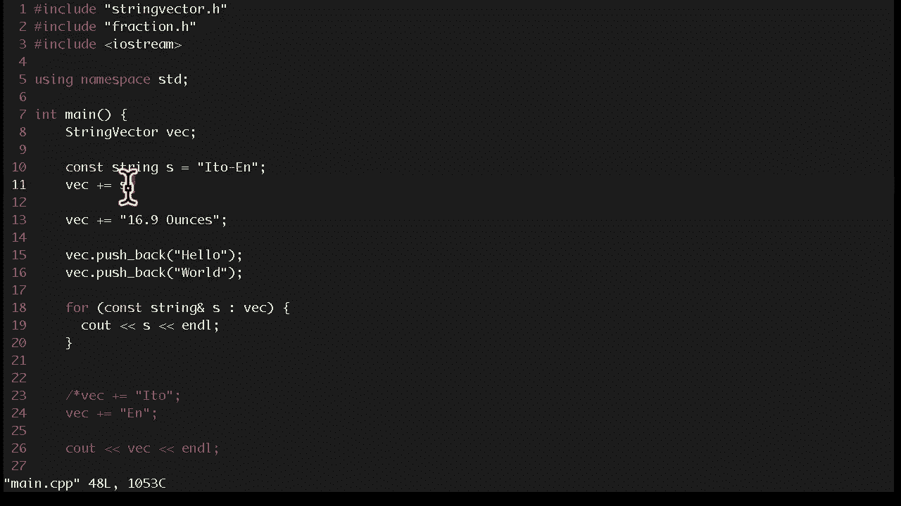

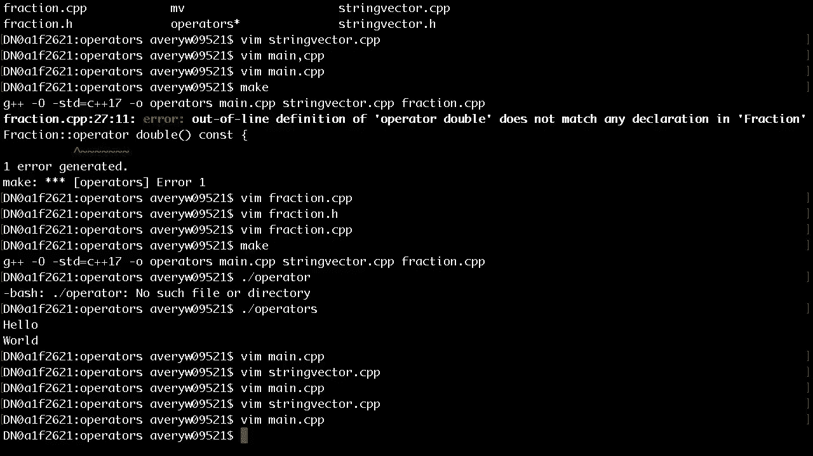

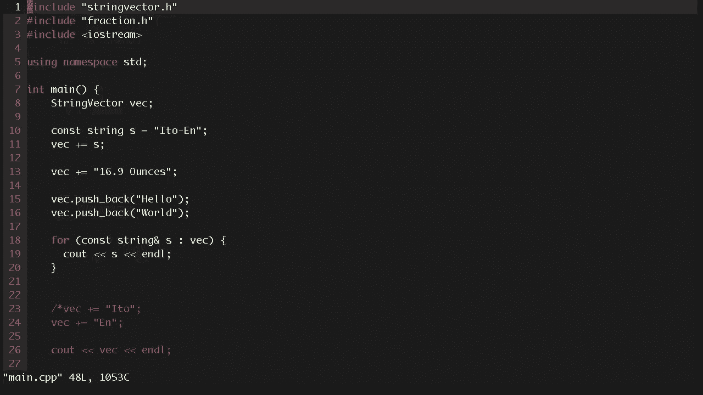

### 非成员函数形式


有些运算符必须，或者更适合作为非成员函数（自由函数）来重载。这通常发生在运算符的左侧操作数不是当前类的对象时，例如重载流运算符`<<`。

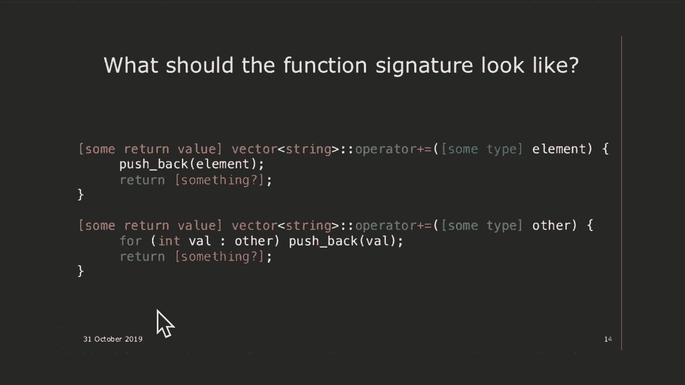

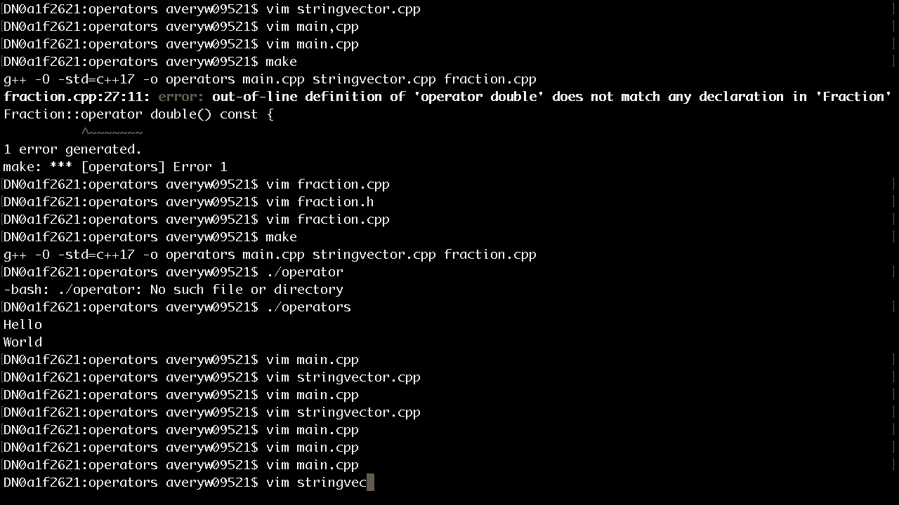

以下是为一个`Fraction`（分数）类重载输出流运算符`<<`的示例：


```cpp
class Fraction {
private:
    int num; // 分子
    int den; // 分母
    // 声明 operator<< 为友元函数，使其能访问私有成员
    friend std::ostream& operator<<(std::ostream& os, const Fraction& f);
public:
    // ... 构造函数和其他方法 ...
};


// 实现 operator<< 为非成员函数
std::ostream& operator<<(std::ostream& os, const Fraction& f) {
    os << f.num << "/" << f.den; // 友元声明允许访问私有成员 num 和 den
    return os; // 返回流的引用以支持链式输出
}
```


**关键点分析：**
*   **必须为非成员函数**：因为左侧的`std::ostream`对象（如`std::cout`）不是我们`Fraction`类的对象，我们不能修改`std::ostream`类来添加成员函数。
*   **返回值**：返回`std::ostream&`，以便支持`std::cout << f1 << f2`这样的链式操作。
*   **友元（`friend`）**：由于`operator<<`需要访问`Fraction`的私有成员变量（`num`和`den`），但它是非成员函数，因此需要在类内将其声明为`friend`。这使得该函数拥有访问类私有部分的特权。


---


## 成员函数 vs. 非成员函数：如何选择？

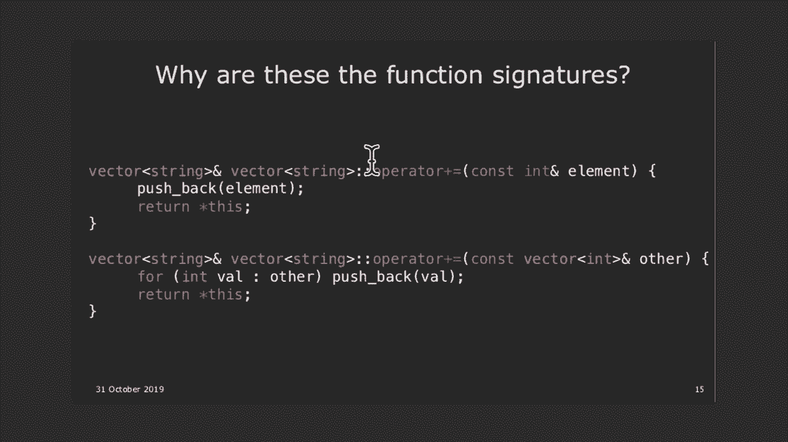


在重载二元运算符时，一个常见的问题是应该将其实现为成员函数还是非成员函数。以下是基本的指导原则：


上一节我们看了两种实现形式，本节中我们来看看做出选择的一般规则。

以下是选择时应考虑的主要因素：

1.  **必须为成员函数的运算符**：
    *   赋值运算符 `=`
    *   下标运算符 `[]`
    *   函数调用运算符 `()`
    *   成员访问运算符 `->`
    *   这些运算符在语义上天然与一个对象的状态紧密相关。

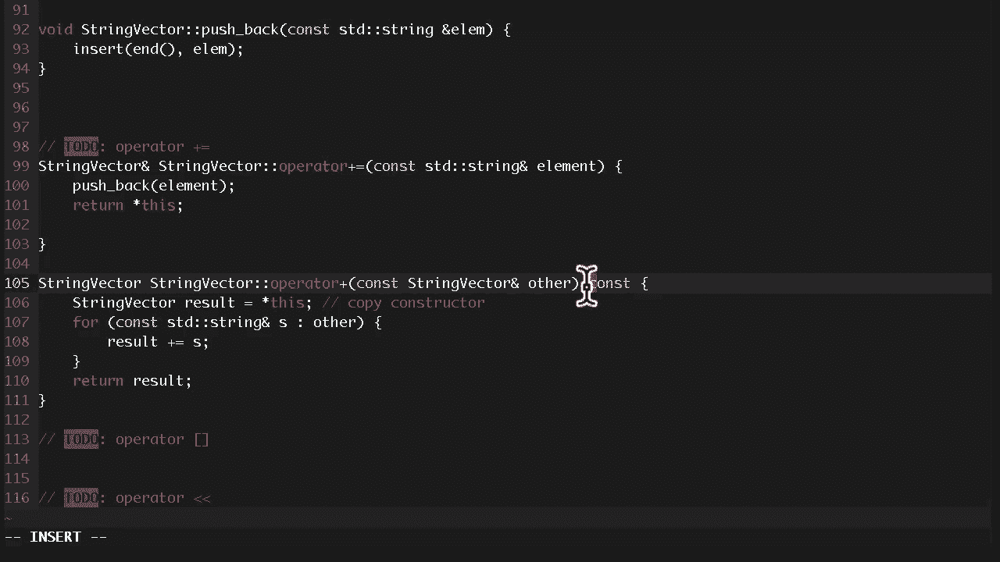

2.  **必须为非成员函数的运算符**：
    *   流运算符 `<<` 和 `>>`（因为左操作数是流对象，非自定义类）。
    *   当运算符的左侧操作数不是自定义类的对象时。

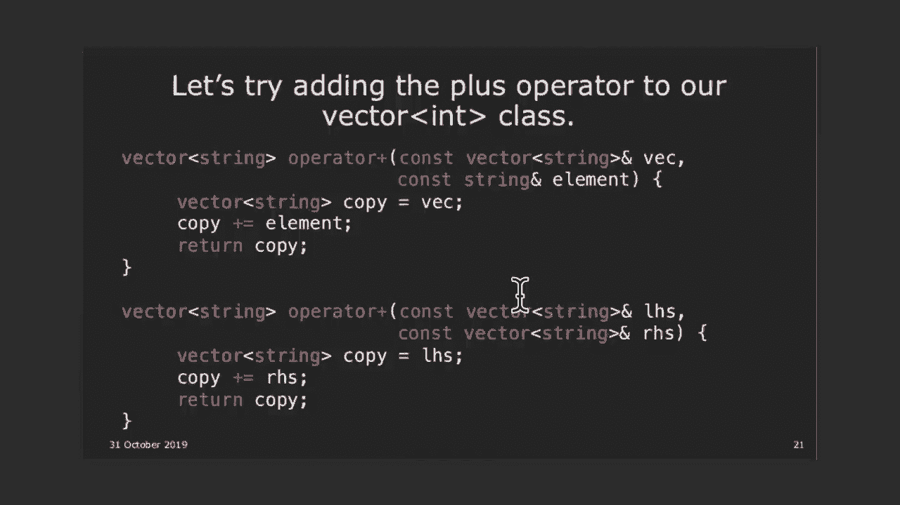

3.  **对于对称的二元运算符（如 `+`, `-`, `==`, `<`）**：
    *   **推荐实现为非成员函数**。这能保证运算符对两个操作数的处理是平等的，并支持更自然的隐式类型转换。
    *   **例如**：如果`operator+`是`Fraction`的成员函数，那么`fraction + 1`可以工作（整数`1`被隐式转换为`Fraction`），但`1 + fraction`则不行（整数`1`没有对应的`operator+`成员函数）。非成员函数形式能同时处理这两种情况。

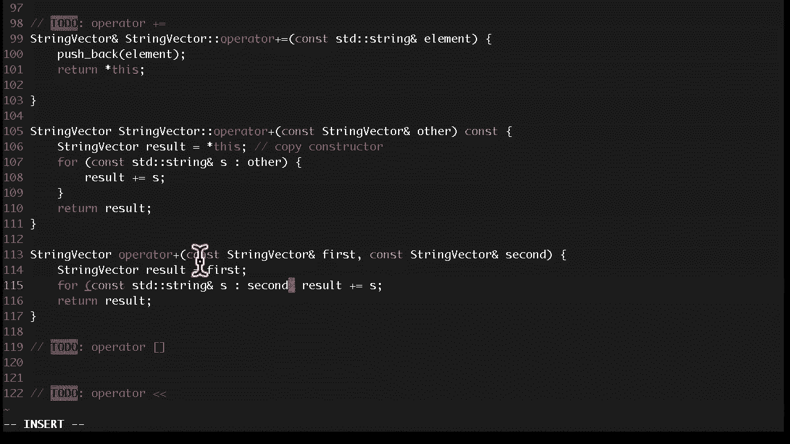

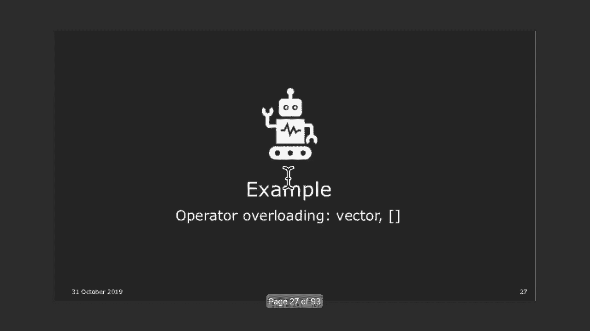


4.  **对于修改左操作数的运算符（如 `+=`, `-=`）**：
    *   **通常实现为成员函数**。因为它们需要直接修改左侧对象的状态，作为成员函数访问其私有成员更为方便。


---

## 重载运算符的设计原则：最少惊讶原则（POLA）

最少惊讶原则（Principle of Least Astonishment, POLA）是软件设计，尤其是运算符重载中的核心原则。它要求设计的功能应该符合用户的直觉，不会让他们感到“惊讶”或困惑。

以下是应用POLA的一些具体规则：

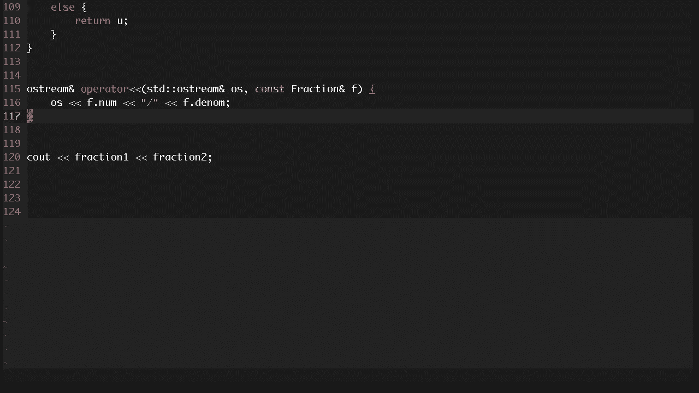


*   **模仿内置类型的行为**：自定义类型的运算符行为应尽量与内置类型（如`int`）保持一致。例如，`+=`应该修改左操作数并返回其引用。
*   **提供完整的运算符集合**：如果你重载了关系运算符，最好提供全套（`==`, `!=`, `<`, `<=`, `>`, `>=`）。如果你重载了算术运算符`+`，通常也应该重载对应的复合赋值运算符`+=`。
*   **避免模糊语义**：如果一个运算符对你的类没有明确、直观的含义，就不要重载它。例如，为`Time`类重载`+= 10`，是表示增加10小时还是10分钟？如果不明确，就使用命名的成员函数（如`addMinutes(10)`）来代替。
*   **不要滥用运算符**：永远不要重载运算符使其做出完全不符合常规预期的事情（例如，让`<<`运算符执行网络请求）。这会极大地破坏代码的可读性和可维护性。

---

## 其他可重载的运算符简介

除了常见的算术、关系、流运算符外，C++还允许重载许多其他运算符，用于实现更高级的功能。

*   **`new` 和 `delete`**：可以重载内存分配和释放运算符，用于实现自定义的内存管理策略（如内存池）。
*   **类型转换运算符**：允许定义从自定义类型到其他类型的隐式或显式转换。
*   **函数调用运算符 `()`**：重载此运算符的类被称为“函数对象”或“仿函数”，它们可以像函数一样被调用，是C++泛型编程和标准库算法中的重要组成部分。
*   **三路比较运算符 `<=>` (C++20)**：也称为“太空船运算符”，它一次性定义所有比较关系（`<`, `<=`, `>`, `>=`, `==`, `!=`），简化了比较运算符的重载。

---

## 总结与下节预告

本节课中我们一起学习了C++运算符重载的核心知识。我们理解了运算符重载的本质是定义特殊的成员函数或非成员函数。我们掌握了重载运算符的基本语法，并深入探讨了如何根据运算符的语义（是否对称、是否修改左操作数）来选择将其实现为成员函数或非成员函数。最重要的是，我们学习了最少惊讶原则（POLA），这是指导我们正确、合理地进行运算符重载的黄金法则。

然而，我们注意到一个遗留问题：默认的赋值运算符`=`有时会导致意外的行为（浅拷贝问题）。这引出了下两节课的核心主题：拷贝控制。


**下节预告**：我们将深入探讨**拷贝构造函数**和**拷贝赋值运算符**，学习如何通过“深拷贝”来正确管理包含动态分配资源的类，避免浅拷贝带来的陷阱。这是理解C++资源管理的关键一步。